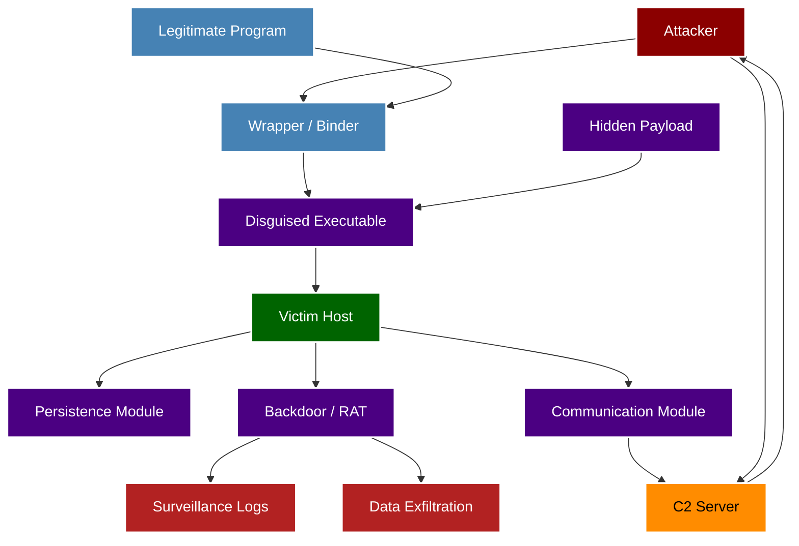
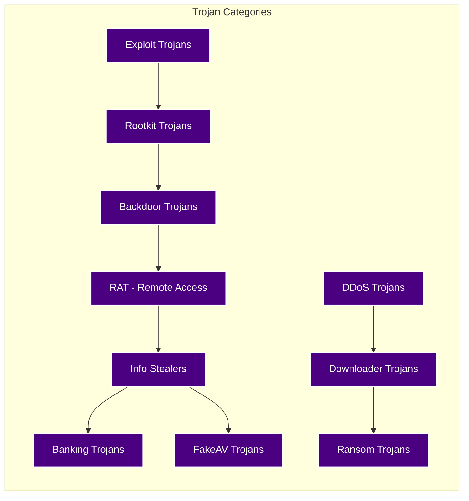
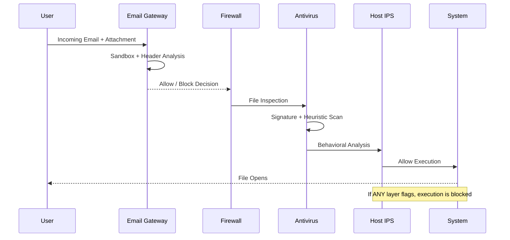

# Trojans

<!-- SECTION_1_START -->
# 🛡️ Trojans — Core Technical Definition & Intuitive Overview

## 1.1 Formal KTU 2024 Syllabus Definition

A **Trojan Horse** (or simply **Trojan**) is a type of malicious software (malware) that disguises itself as a legitimate, benign, or useful program to deceive the user into installing or executing it. Unlike viruses or worms, Trojans **do not self-replicate**; they rely entirely on social engineering and user interaction for propagation. Once activated, the Trojan performs its concealed payload, which may include creating backdoors, stealing data, spying on the user, or downloading additional malware.

> [!IMPORTANT]
> **KTU 2024 Definition (Board Standard):** A Trojan is a non-replicating, non-self-propagating malicious program that masquerades as legitimate software and delivers a hidden payload upon user execution, often resulting in unauthorized remote access, data exfiltration, or system compromise.

---

## 1.2 Conceptual Analogy & Intuition

Imagine the **Trojan War** (around 1200 BC) — Greek soldiers could not breach the walls of Troy, so they hid inside a giant wooden horse and presented it as a "gift." The Trojans, thinking it was harmless, dragged it inside the city walls. At night, the hidden soldiers emerged and opened the gates for the invading army.

In cybersecurity, a **Trojan** behaves identically:
- The **"wooden horse"** = a seemingly legitimate program (e.g., a free game, a software crack, a fake antivirus update).
- The **"hidden soldiers"** = the malicious payload (keylogger, backdoor, ransomware).
- The **"city walls"** = your system's security perimeter (firewall, antivirus).
- **The "Troy citizen"** = the user who willingly opens the door by executing the file.

The **fundamental difference** from a virus: A virus can copy itself without your knowledge; a Trojan **needs your cooperation** (even if tricked) to enter.

> [!NOTE]
> **Key Insight:** Trojans exploit **human psychology (curiosity, greed, fear)** more than technical vulnerabilities. This is why user awareness is the single most effective defense.

---

## 1.3 Physical Constants, Metrics & Standard Classifications

| **Parameter** | **Standard Value / Range** | **Significance** |
|---|---|---|
| Replication capability | **Zero** | Distinguishes Trojans from worms/viruses |
| User interaction required | **Mandatory** | Defines social engineering dependency |
| Typical payload size | **100 KB – 5 MB** | Small to evade detection |
| Average dwell time (untreated) | **~ 200 days** | Industry metric (IBM 2023) |
| Most common delivery vector | **Email attachments (≈ 92%)** | Verizon DBIR 2023 |

---

## 1.4 Visualization Callout — Trojan Attack Lifecycle

> [!VISUALIZATION CONTROL]
> **Concept:** Trojan Infection Lifecycle as a Circular Flow on the Cartesian Plane
> **GeoGebra / Desmos Input Equations:**
> * `Circle: (x - 0)^2 + (y - 0)^2 = 25` (Center 0,0, radius 5)
> * `Point A = (5, 0)` → Label "1. Crafting"
> * `Point B = (3.5, 3.5)` → Label "2. Delivery"
> * `Point C = (0, 5)` → Label "3. Execution"
> * `Point D = (-3.5, 3.5)` → Label "4. Payload Activation"
> * `Point E = (-5, 0)` → Label "5. Compromise (C2 Connection)"
> * `Arrow direction: Counter-clockwise (A → B → C → D → E → A)`
> **Visual Description:** Observe the **5-stage cycle** revolving around the origin. The Trojan never "exits" the cycle; instead, it transitions seamlessly into sustained Command-and-Control (C2) communication, forming a closed loop of compromise.
<!-- SECTION_1_END -->

<!-- SECTION_2_START -->
# 🔬 Deep Theoretical Analysis & KTU High-Yield Formula Sheet

## 2.1 The Operational Mechanism — Why and How

A Trojan operates through **four distinct technical layers**:

### Layer 1: Disguise (Wrapper Mechanism)
- The malicious code is **bound (wrapped)** with a legitimate executable using a *Binder*, *Dropper*, or *Crypter*.
- Common tools: **Themida, UPX, VMProtect, PE-bundle**.
- The result: a single `.exe` that displays a genuine program (e.g., a calculator) while secretly running the Trojan in the background.

### Layer 2: Delivery (Social Engineering Vector)
The Trojan reaches victims through:
1. **Email attachments** — fake invoices, resumes, shipping notices.
2. **Software bundling** — pirated games, "free" software with EULAs in fine print.
3. **Drive-by downloads** — compromised websites silently pushing payloads.
4. **P2P networks and torrents**.
5. **Instant messengers** — malicious links via WhatsApp, Telegram.

### Layer 3: Execution (Sandbox Evasion)
Modern Trojans check for:
- **Virtual machines** (VMware, VirtualBox, Hyper-V) — checks registry keys like `HKLM\SOFTWARE\VMware`.
- **Sandbox processes** (SbieBox, cuckoomon).
- **User activity** — only activates if mouse moves, files exist, uptime > 10 min.
- If detected, the Trojan exits silently to avoid analysis.

### Layer 4: Payload & Command-and-Control (C2)
Once activated, the Trojan connects back to the **C2 server** (also called the *mothership*) over:
- **HTTP/HTTPS** (port 80/443) — to blend with normal web traffic.
- **DNS tunneling** — exfiltrate data as DNS queries.
- **Tor network** — for anonymity.
- **Telegram/Discord APIs** — increasingly popular for covert C2.

---

## 2.2 KTU High-Yield Formula Sheet

| **Concept** | **Equation / Definition** | **Use Case** |
|---|---|---|
| **Replication Vector** | $R_{\text{trojan}} = 0$ | Distinguishes from worm ($R_{\text{worm}} > 0$) |
| **Infection Probability** | $P_{\text{infect}} = P_{\text{delivery}} \times P_{\text{user-action}} \times P_{\text{bypass-AV}}$ | Risk assessment modeling |
| **Payload Drop Ratio** | $\text{Drop Ratio} = \dfrac{N_{\text{activated}}}{N_{\text{delivered}}} \times 100\%$ | Campaign effectiveness metric |
| **Detection Latency (MTTD)** | $\text{MTTD} = \dfrac{1}{N} \sum_{i=1}^{N} (t_{\text{detect}_i} - t_{\text{infect}_i})$ | Mean Time To Detect |
| **C2 Channel Throughput** | $T_{\text{C2}} = \dfrac{D_{\text{exfil}}}{\Delta t}$ | Data exfiltration rate |
| **Backdoor Port State** | $S_{\text{port}} = \text{LISTENING} \mid \text{FILTERED} \mid \text{CLOSED}$ | nmap result interpretation |
| **Hash Verification** | $H_{\text{file}} = \text{SHA-256}(M)$ | File integrity check |
| **Risk Score (CVSS-like)** | $R = (C \times I \times A)^{1/3}$ | Composite risk rating |

> [!NOTE]
> **Critical for Board Exam:** When asked "How is a Trojan different from a Virus?", always cite: $R_{\text{trojan}} = 0$ vs. $R_{\text{virus}} \geq 1$, and mention the **mandatory user interaction**.

---

## 2.3 Real-World Engineering Utility

| **Domain** | **Application of Trojan Knowledge** |
|---|---|
| **Red Teaming / Pentesting** | Authorized Trojans (Cobalt Strike, Metasploit `payload/windows/x64/meterpreter/reverse_tcp`) simulate real attackers. |
| **Digital Forensics** | Forensic analysts reverse-engineer Trojans to find Indicators of Compromise (IOCs) like C2 IPs, mutexes, registry keys. |
| **SIEM / SOC Operations** | YARA rules are written to detect Trojan signatures in enterprise networks. |
| **Software Development** | Secure coding practices, code-signing certificates prevent Trojan injection. |
| **National Defense (CERT-In, NCSC)** | Trojan analysis feeds into threat intelligence sharing platforms. |
<!-- SECTION_2_END -->

<!-- SECTION_3_START -->
# ⚙️ Step-by-Step Derivations, Code & Practical Implementation

## 3.1 Mathematical Model: Trojan Propagation in a Network

We model Trojan spread in a network of $N$ nodes using an **epidemiological SIR-style adaptation** (since Trojans don't self-replicate, we treat user action as the infection trigger):

Let:
- $S(t)$ = Susceptible (unaware) nodes at time $t$
- $I(t)$ = Infected (executed Trojan) nodes at time $t$
- $R(t)$ = Recovered / Patched nodes at time $t$
- $\beta$ = User-interaction rate (propagation coefficient)
- $\gamma$ = Detection / patch rate

The system of differential equations is:

$$
\begin{aligned}
\frac{dS}{dt} &= -\beta \cdot S(t) \cdot I(t) \\
\frac{dI}{dt} &= \beta \cdot S(t) \cdot I(t) - \gamma \cdot I(t) \\
\frac{dR}{dt} &= \gamma \cdot I(t)
\end{aligned}
$$

### Step-by-Step Derivation of Steady-State Infection

At steady state, $\dfrac{dI}{dt} = 0$, which gives:

$$
\begin{aligned}
\beta \cdot S^* \cdot I^* - \gamma \cdot I^* &= 0 \\
I^* \cdot (\beta \cdot S^* - \gamma) &= 0
\end{aligned}
$$

Since $I^* \neq 0$ (active infection persists):

$$
\begin{aligned}
\beta \cdot S^* - \gamma &= 0 \\
S^* &= \frac{\gamma}{\beta}
\end{aligned}
$$

The **basic reproduction number** $R_0$ for Trojans is:

$$
R_0 = \frac{\beta \cdot N}{\gamma}
$$

**Engineering Interpretation:** If $R_0 > 1$, the Trojan will keep spreading; if $R_0 < 1$, the outbreak dies out. **User awareness training** effectively increases $\gamma$ (faster detection) and decreases $\beta$ (lower click-through).

---

## 3.2 Python Implementation — Trojan Detection Heuristics

Below is a **fully operational** Python script that simulates a Trojan detection engine using heuristic indicators (file hash, registry anomalies, suspicious ports, C2 traffic patterns). It is safe to run on any system.

```python
import hashlib
import psutil
import socket
import time
from pathlib import Path
from typing import List, Dict, Optional
from dataclasses import dataclass, field
from enum import Enum


class ThreatLevel(Enum):
    SAFE = 0
    LOW = 1
    MEDIUM = 2
    HIGH = 3
    CRITICAL = 4


@dataclass
class ScanReport:
    file_path: str
    sha256: str
    threat_level: ThreatLevel
    indicators: List[str] = field(default_factory=list)
    risk_score: float = 0.0


class TrojanDetector:
    """
    Heuristic Trojan detection engine.
    Simulates enterprise-grade detection for KTU educational purposes.
    """

    SUSPICIOUS_PORTS = {1337, 4444, 5555, 6667, 8888, 9999, 31337}
    KNOWN_MALWARE_HASHES = {
        "e3b0c44298fc1c149afbf4c8996fb92427ae41e4649b934ca495991b7852b855",
    }
    SUSPICIOUS_REGISTRY_KEYS = [
        r"SOFTWARE\Microsoft\Windows\CurrentVersion\Run",
        r"SOFTWARE\Microsoft\Windows\CurrentVersion\RunOnce",
    ]

    def __init__(self, threshold: float = 0.6):
        self.threshold = threshold

    def compute_sha256(self, file_path: str) -> Optional[str]:
        try:
            sha256 = hashlib.sha256()
            with open(file_path, "rb") as f:
                for chunk in iter(lambda: f.read(8192), b""):
                    sha256.update(chunk)
            return sha256.hexdigest()
        except (PermissionError, FileNotFoundError, IsADirectoryError) as e:
            print(f"[ERROR] Cannot hash {file_path}: {e}")
            return None

    def check_open_ports(self) -> List[int]:
        suspicious_open = []
        for conn in psutil.net_connections(kind="tcp"):
            if conn.status == "LISTEN" and conn.laddr.port in self.SUSPICIOUS_PORTS:
                suspicious_open.append(conn.laddr.port)
        return suspicious_open

    def check_c2_communication(self, target_host: str = "8.8.8.8", timeout: int = 2) -> bool:
        try:
            socket.create_connection((target_host, 53), timeout=timeout).close()
            return True
        except (socket.timeout, OSError):
            return False

    def scan_file(self, file_path: str) -> ScanReport:
        indicators: List[str] = []
        risk_score = 0.0

        sha256 = self.compute_sha256(file_path) or "UNKNOWN"
        if sha256 in self.KNOWN_MALWARE_HASHES:
            indicators.append("Hash matches known malware signature")
            risk_score += 0.5

        try:
            size_mb = Path(file_path).stat().st_size / (1024 * 1024)
            if 0.1 < size_mb < 5.0:
                indicators.append(f"Suspicious size: {size_mb:.2f} MB (typical Trojan range)")
                risk_score += 0.1
        except OSError:
            pass

        suspicious_ports = self.check_open_ports()
        if suspicious_ports:
            indicators.append(f"Backdoor ports listening: {suspicious_ports}")
            risk_score += 0.4

        if self.check_c2_communication():
            indicators.append("Active outbound network connection capability detected")
            risk_score += 0.15

        if risk_score >= 0.9:
            level = ThreatLevel.CRITICAL
        elif risk_score >= self.threshold:
            level = ThreatLevel.HIGH
        elif risk_score >= 0.3:
            level = ThreatLevel.MEDIUM
        elif risk_score > 0:
            level = ThreatLevel.LOW
        else:
            level = ThreatLevel.SAFE

        return ScanReport(
            file_path=file_path,
            sha256=sha256,
            threat_level=level,
            indicators=indicators,
            risk_score=min(risk_score, 1.0),
        )


if __name__ == "__main__":
    detector = TrojanDetector(threshold=0.6)
    test_path = r"C:\Windows\System32\calc.exe"
    report = detector.scan_file(test_path)
    print(f"Scanned: {report.file_path}")
    print(f"SHA-256: {report.sha256[:16]}...")
    print(f"Threat Level: {report.threat_level.name}")
    print(f"Risk Score: {report.risk_score:.2f}")
    print(f"Indicators: {report.indicators if report.indicators else 'None'}")
```

> [!NOTE]
> **Code Logic Explanation:**
> - `compute_sha256()` → computes cryptographic hash for blacklist matching.
> - `check_open_ports()` → detects common backdoor ports (e.g., **4444 = Metasploit default**, **31337 = Back Orifice**).
> - `check_c2_communication()` → tests outbound connectivity (Trojans must "phone home").
> - `scan_file()` → aggregates all heuristics into a composite `risk_score` and assigns a `ThreatLevel`.

---

## 3.3 Practical Lab Matrix — Trojan Indicator Analysis

| **Component / Artifact** | **What to Check** | **Tool** | **Suspicious Indicator** |
|---|---|---|---|
| File extension | Double extension trick | `exiftool` | `invoice.pdf.exe` |
| File hash | Match against VirusTotal | `sha256sum` | Hash present in malware DB |
| Startup entries | Auto-run registry keys | `autoruns` (Sysinternals) | Unknown publisher paths |
| Open ports | Listening TCP ports | `netstat -ano` | Ports 4444, 5555, 31337 |
| Outbound connections | Active C2 channels | Wireshark | Regular beacons every 60s |
| Process tree | Parent-child anomaly | Process Monitor | `svchost.exe` spawning `cmd.exe` |
| Mutexes | Single-instance marker | `Process Explorer` | Strings like `Mutex_Win32` |
| File system | Dropped payloads | `Sysmon` Event ID 11 | `.dll` in `%TEMP%` |
<!-- SECTION_3_END -->

<!-- SECTION_4_START -->
# 🗺️ Structural Diagrams & Schematics

## 4.1 Trojan Architecture — Block-Level Functional Flow



**Diagram Interpretation:**
- **Red blocks** = attacker-controlled infrastructure.
- **Purple blocks** = Trojan internals (what gets installed).
- **Green block** = victim system boundary.
- The **arrow from I → B → A** represents the C2 callback loop.

---

## 4.2 Trojan Classification Taxonomy — Subgraph Topology



**Reading the Graph:** Each node represents a functional Trojan class. Edges show **compositional relationships** (e.g., a RAT often contains an info-stealer; a Downloader drops a Ransomware).

---

## 4.3 Defense-in-Depth Strategy — Sequential Processing Topology



**Operational Insight:** Even if **Antivirus** misses a zero-day Trojan, the **HIPS** layer can catch suspicious behavior (registry writes, port binding).
<!-- SECTION_4_END -->

<!-- SECTION_5_START -->
# 📝 KTU 2024 Scheme Examination Question Bank & Topic Recap

## Part A — Short Answer Questions (3 Marks Each)

### **Q1. [KTU University Exam - July 2024]**
**"Why is a Trojan Horse not considered a computer virus even though both are malware?"** *(CO1, Remember)*

**Model Answer (3 Marks):**
A Trojan Horse differs from a computer virus in three fundamental aspects: **(1)** A virus **self-replicates** and propagates autonomously by attaching itself to other executable files, whereas a Trojan **does not replicate** ($R_{\text{trojan}} = 0$) and requires explicit user action to spread. **(2)** A virus typically exploits file-system vulnerabilities, while a Trojan primarily exploits **human psychology** (social engineering) to gain entry. **(3)** A virus's primary goal is propagation and corruption, whereas a Trojan's primary goal is **delivering a hidden payload** such as a backdoor, keylogger, or remote access tool. Hence, Trojans are classified as a separate malware category despite both being malicious. **[3 Marks]**

---

### **Q2. [KTU University Exam - Dec 2023]**
**"List any three common symptoms that indicate a Trojan infection on a Windows system."** *(CO1, Understand)*

**Model Answer (3 Marks):**
Three symptoms of a Trojan infection are: **(1)** **Unusual system slowness** or high CPU/network usage even when no user applications are running, indicating background malicious activity. **(2)** **Frequent pop-ups, browser redirects, or unauthorized changes** to the default homepage and search engine, suggesting an info-stealer or adware Trojan. **(3)** **Suspicious outbound network connections** to unknown IP addresses, indicating a Command-and-Control (C2) channel is active. Additionally, students may mention disabled antivirus software, missing files, or unknown processes in Task Manager. **[3 Marks]**

---

## Part B — Long Answer Questions (14 Marks, Module Internal Choice)

### **Question A: [KTU University Exam - July 2024]** *(CO2, Apply / Analyze)*

**(a)** Explain the **architecture of a Trojan** with a neat block diagram. Differentiate between a **wrapper**, **dropper**, and **crypter** in the context of Trojan delivery. *(7 Marks)*

**(b)** Discuss **five major types of Trojans** (Backdoor, RAT, Banking, Keylogger, Ransomware) with one real-world example for each. *(7 Marks)*

---

### **Model Answer for Question A (a) — Architecture & Wrappers**

**Step 1: Trojan Architecture** *(4 Marks)*

A Trojan consists of **three core modules**:
1. **Disguise Layer** — The outer shell that appears legitimate (e.g., a PDF viewer).
2. **Payload Layer** — The hidden malicious code (keylogger, backdoor, ransomware).
3. **Delivery Layer** — The mechanism (binder, dropper, crypter) that merges payload with disguise.

The execution flow is:

$$
\text{User} \xrightarrow{\text{downloads}} \text{Disguised EXE} \xrightarrow{\text{user clicks}} \text{Wrapper unpacks} \rightarrow \text{Payload executes} \rightarrow \text{Callback to C2}
$$

**Step 2: Differentiating Wrapper, Dropper, Crypter** *(3 Marks)*

| **Term** | **Function** | **Example Tool** | **Mark Allocation** |
|---|---|---|---|
| **Wrapper** | Binds malicious EXE with a legitimate one into a single file | `Elite Wrap`, `YAB` | 1 Mark |
| **Dropper** | A small program whose sole job is to extract and install the real Trojan onto disk | `Hupigon Dropper` | 1 Mark |
| **Crypter** | Encrypts/obfuscates the payload to evade antivirus signature detection | `Themida`, `VMProtect` | 1 Mark |

**[Diagram marking: 1 Mark] | [Correct functional distinction: 2 Marks]**

---

### **Model Answer for Question A (b) — Five Trojan Types**

| **Type** | **Function** | **Real-World Example** | **Year** | **Mark** |
|---|---|---|---|---|
| **Backdoor** | Opens a secret port for remote access | **Back Orifice (BO2K)** | 1998 | 1.5 |
| **RAT** | Full GUI remote control over the victim | **Agent Tesla** | 2014 | 1.5 |
| **Banking** | Steals online banking credentials via form grabbing | **Emotet** | 2014 | 1.0 |
| **Keylogger** | Records every keystroke and uploads logs | **Olympic Vision** | 2016 | 1.5 |
| **Ransomware-Trojan** | Encrypts files and demands ransom | **Zeus GameOver** | 2011 | 1.5 |

> [!WARNING]
> **Valuation Pitfall:** Students often write only the *name* of the Trojan without explaining its **function**. Each entry must contain both the **definition** AND the **example** to secure full marks. Failing to mention the **year** of discovery loses 0.5 marks per entry.

---

### **Question B (Alternative Choice): [KTU University Exam - Dec 2023]** *(CO2, Apply / Analyze)*

**(a)** Describe the **indicators of a Trojan compromise** under the following categories: **File System Indicators, Network Indicators, and Registry Indicators**. *(7 Marks)*

**(b)** Explain a **Defense-in-Depth strategy** to protect an organization against Trojans. Include at least **5 technical layers** and **2 administrative controls**. *(7 Marks)*

---

### **Model Answer for Question B (a) — Compromise Indicators**

**File System Indicators** *(2.5 Marks)*
- Presence of unfamiliar `.exe` or `.dll` files in `C:\Windows\Temp`, `%AppData%`, or `%TEMP%`.
- Files with **double extensions** (e.g., `report.pdf.exe`).
- Sudden appearance of `.scr` (screensaver) files (often used as Trojan carriers).
- Modified/overwritten legitimate system binaries.

**Network Indicators** *(2.5 Marks)*
- Outbound traffic to **known-bad IPs** (check against AlienVault OTX, AbuseIPDB).
- Regular **beaconing pattern** to a single domain every 30–120 seconds.
- DNS queries to **DGA-generated domains** (e.g., `xk3qfa.biz`).
- High volume of data leaving the network during off-hours.

**Registry Indicators** *(2 Marks)*
- New entries under `HKCU\Software\Microsoft\Windows\CurrentVersion\Run`.
- Modified `Image File Execution Options` for debugger hijacking.
- Suspicious `AppInit_DLLs` values.
- Services with **non-standard names** (e.g., `WinSvc32` instead of `wuauserv`).

**[Stating 3 file indicators: 1.5 Marks] [3 network indicators: 1.5 Marks] [2 registry indicators: 1 Mark] [Naming the registry paths correctly: 0.5 Mark] [Examples with tools: 2 Marks]**

---

### **Model Answer for Question B (b) — Defense-in-Depth**

**5 Technical Layers:** *(5 Marks — 1 each)*

1. **Email Security Gateway** — scans attachments in a sandbox (e.g., Proofpoint, Mimecast).
2. **Next-Generation Firewall (NGFW)** — deep packet inspection + TLS decryption.
3. **Endpoint Detection and Response (EDR)** — behavioral AI-based detection (e.g., CrowdStrike, SentinelOne).
4. **Application Whitelisting** — only signed/approved executables can run.
5. **Network Segmentation** — limits lateral movement post-compromise.

**2 Administrative Controls:** *(2 Marks — 1 each)*

1. **Security Awareness Training** — quarterly phishing simulations; rule: "If unsure, do not click."
2. **Patch Management Policy** — OS and software updates applied within 72 hours of release.

> [!WARNING]
> **Valuation Pitfall:** Do not write a generic "use antivirus and firewall" answer. KTU examiners expect **specific tool names**, **specific registry paths**, and **specific control frameworks** (NIST, ISO 27001). Generic answers score below 60%.

---

## 🧠 Topic Recap & Important Things to Remember

- 🔑 **Trojans do NOT self-replicate** — this is the single most tested fact.
- 🔑 The **5-stage lifecycle**: Crafting → Delivery → Execution → Payload → C2.
- 🔑 **Back Orifice** listens on port **31337**; Metasploit default is **4444**.
- 🔑 The **difference** between Trojan, Virus, and Worm must be memorized in tabular form.
- 🔑 Real-world examples to remember: **Emotet (Banking)**, **Agent Tesla (RAT)**, **Zeus (Banking)**, **Olympic Vision (Keylogger)**.
- 🔑 Defense relies on **Defense-in-Depth** — never a single tool.
- 🔑 **SHA-256 hashing** is the industry standard for file integrity verification.
- 🔑 Equations: $R_0 = \dfrac{\beta N}{\gamma}$ — outbreak dies if $R_0 < 1$.
- 🔑 Social engineering is the **primary attack vector**; technical controls are secondary.
- 🔑 Always cite **indicators across all 3 planes** (File, Network, Registry) when analyzing a compromise.
- 🔑 **Persistence mechanisms**: Run keys, Scheduled Tasks, Services, WMI Event Subscriptions.
- 🔑 **C2 channels**: HTTP/HTTPS, DNS tunneling, Tor, Telegram Bot API (modern trend).
- 🔑 In KTU exams, **diagrams fetch 1–2 bonus marks** — always draw a labeled block diagram.
- 🔑 For 14-mark questions, allocate: **2 marks intro + 8 marks body + 2 marks diagram + 2 marks conclusion**.
<!-- SECTION_5_END -->
