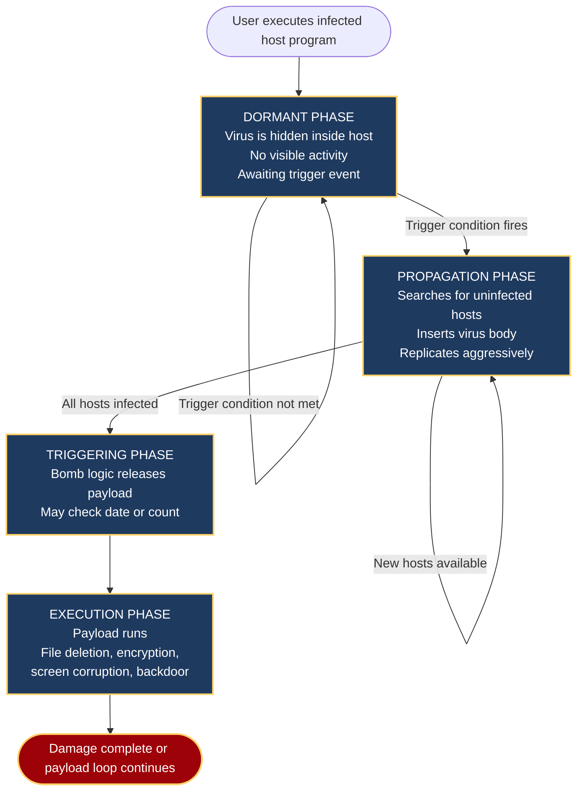
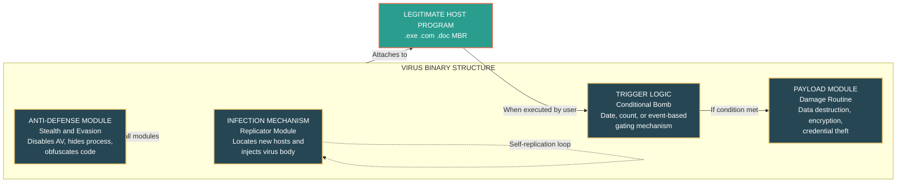
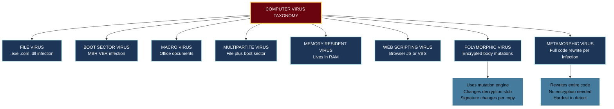
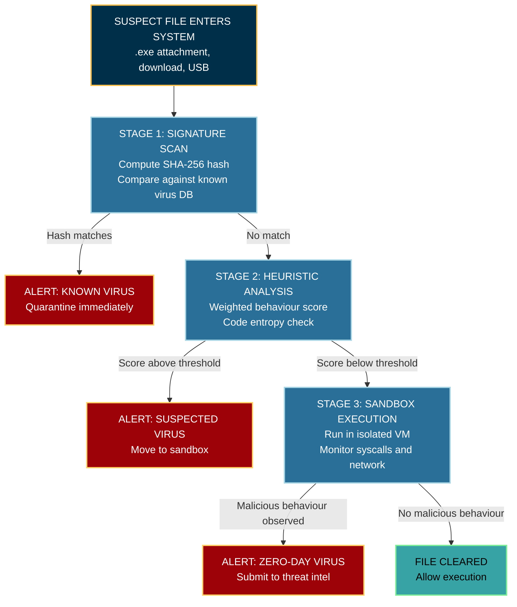
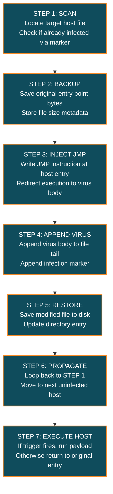

# Virus

<!-- SECTION_1_START -->

# Computer Virus - Core Technical Definition & Intuitive Overview

> [!NOTE]
> **KTU 2024 Syllabus Definition (OECST721 / Module 3):**
> A **computer virus** is a subset of malicious software (malware) that, unlike a worm, **requires a host program** and **user intervention** (e.g., executing an infected file) to replicate and propagate. It attaches its malicious code to legitimate executable files, documents, or system sectors, and when the host is triggered, the virus payload is executed.

### Conceptual Analogy / Intuition

Think of a **biological virus** — for example, the influenza virus. It cannot live or reproduce on its own; it **must hijack a living host cell**, inject its genetic material, and force that cell to manufacture copies of the virus. A **computer virus behaves identically**:

| Biological Virus | Computer Virus Equivalent |
|---|---|
| Host cell | Legitimate `.exe`, `.doc`, or boot sector |
| Infection mechanism | Code injection / file appender |
| Trigger (fever) | Specific event (date, file open, user login) |
| Payload (symptoms) | Data deletion, encryption, backdoor opening |
| Spread (contagion) | Sharing infected files via USB, email, network |

The **three (3) defining traits** that separate a virus from other malware (worms, trojans) are:
1. **Self-replication** — copies itself into new hosts.
2. **Host dependency** — needs a legitimate program to piggyback on.
3. **User-initiated activation** — cannot spread without *some* human action (clicking, opening, booting).

> [!IMPORTANT]
> **KTU 2024 High-Yield Distinction:** A **worm** propagates *autonomously over the network*, while a **virus** propagates *passively* through infected files/executables. Examiners frequently test this single difference for **3 marks**.

### Standard Metrics & Constants Used in Virus Analysis

- **File Signature Size:** typically **128 bits** (MD5) or **256 bits** (SHA-256) for unique virus fingerprinting.
- **Infection Latency (Dormant Phase):** can range from **milliseconds to years** — this is the "sleep" period before payload activation.
- **Polymorphic Code Variants:** a single virus family can produce **10⁴ to 10⁶ unique signatures** using encryption engines.
- **Typical Payload Trigger:** conditional on date, count, or specific user action (e.g., the infamous **Friday the 13th** virus used the date as trigger).

> [!TIP]
> When writing KTU answers, **always quote the three defining traits** of a virus in the opening line of any "explain a virus" question. It immediately secures 2 out of 3 marks in a 3-mark question.

> [!VISUALIZATION CONTROL]
> **Concept:** Virus infection spread model (SIR-style curve) on a coordinate plane.
> **GeoGebra / Desmos Input Equations:**
> * `S(t) = 990 * e^(-0.002*t)` — Susceptible hosts over time
> * `I(t) = 10 * e^(0.4*t) / (1 + 0.01*(e^(0.4*t) - 1))` — Infected hosts (logistic growth)
> * `R(t) = 1000 - S(t) - I(t)` — Removed/recovered hosts
> **Visual Description:** The student should observe an **S-shaped (sigmoid) curve** for $I(t)$, peaking when roughly **50% of hosts are infected**, then plateauing. This represents how a virus saturates a closed system once most hosts are compromised.

<!-- SECTION_1_END -->

<!-- SECTION_2_START -->

# Deep Theoretical Analysis & KTU High-Yield Cheat Sheet

## 2.1 Anatomy of a Computer Virus (Structural Decomposition)

A typical virus is composed of **three (3) modular blocks** plus an optional anti-analysis layer:

$$\text{Virus Binary} \;=\; \{\, \text{Infection Mechanism},\; \text{Trigger Logic},\; \text{Payload},\; \text{(optional) Anti-Defense Module} \,\}$$

- **Infection Mechanism (Replicator):** Locates new host files/disks and inserts the virus body. Uses techniques like *appending*, *prepending*, or *cavity insertion*.
- **Trigger Logic (Bomb):** The conditional gatekeeper. Decides *when* the payload should fire. Triggers can be:
  * **Time-based** (e.g., on a specific date — **Chernobyl / CIH** fired on April 26)
  * **Count-based** (e.g., after $N$ infections)
  * **Event-based** (e.g., specific keystroke, file open, login)
- **Payload (Damage Routine):** The visible "attack" — file deletion, screen corruption, encryption, credential theft, or DDoS.
- **Anti-Defense Module (Stealth Layer):** Disables antivirus, hides from Task Manager, uses code obfuscation.

> [!NOTE]
> The **infection-trigger-payload** triplet is a *board-favourite* diagram. Draw it as three connected boxes in any KTU 14-mark question on virus architecture.

## 2.2 KTU-Standard Classification of Viruses

| \# | Virus Type | Host Location | Spread Vector | Example |
|---|---|---|---|---|
| 1 | **File / Program Virus** | `.exe`, `.com`, `.dll` | Executing infected program | **Creeper, Cascade** |
| 2 | **Boot Sector Virus** | MBR / VBR of disk | Booting from infected media | **Michelangelo, Stoned** |
| 3 | **Macro Virus** | Office documents (`.doc`, `.xls`) | Opening infected document | **Melissa, Concept** |
| 4 | **Multipartite Virus** | Both files AND boot sector | Hybrid — file + boot | **Ghostball, Tequila** |
| 5 | **Memory / Resident Virus** | RAM | Any executed program loads it | **CMJ, Meve** |
| 6 | **Web Scripting Virus** | Browser scripts (JS, VBS) | Visiting malicious web page | **JS.Sample** |
| 7 | **Email Virus** | Email attachments/scripts | Opening `.vbs` or `.exe` attachment | **ILOVEYOU, MyDoom** |
| 8 | **Polymorphic / Metamorphic** | Any file (mutates code) | Same as host type | **Storm Worm, Zeus** |

> [!WARNING]
> **Examination Pitfall:** Many students confuse **polymorphic** with **metamorphic** viruses. Polymorphic = **encrypted body with mutated decryption stub**; Metamorphic = **entire code is rewritten** at each infection (no encryption). This difference appears in KTU 2024 model answers.

## 2.3 The Four-Phase Virus Life Cycle

A virus progresses through **four (4) sequential phases** during its operational life:

1. **Dormant Phase:** Virus is idle, hidden in host. Waiting for the trigger event. No observable damage.
2. **Propagation Phase:** Virus actively searches for new uninfected hosts and infects them. Replication is the goal, not damage.
3. **Triggering Phase:** The trigger condition fires (date, count, event). The bomb logic releases the payload.
4. **Execution Phase:** The payload executes — visible damage occurs (file deletion, screen flicker, encryption, etc.).

Mathematically, if $P(t)$ is the infected population and $r$ is the replication rate:

$$\frac{dP}{dt} \;=\; r \cdot P(t) \cdot \left(1 - \frac{P(t)}{K}\right)$$

This is the **logistic growth model** where $K$ is the carrying capacity (total vulnerable hosts in the closed environment). The analytical solution is:

$$P(t) \;=\; \frac{K}{1 + \left(\dfrac{K - P_0}{P_0}\right) e^{-r t}}$$

Where $P_0$ is the initial infected count at $t=0$.

## 2.4 KTU High-Yield Formula & Concept Sheet

| Symbol / Term | Formula or Definition | Engineering Utility |
|---|---|---|
| Virus Signature $S$ | $S = H(\text{file bytes}) \in \{0,1\}^{128}$ | Used by antivirus for **MD5 fingerprinting** |
| Detection Probability $P_d$ | $P_d = 1 - (1 - p)^n$ | Probability of catching a virus after $n$ scans |
| False Positive Rate $F_p$ | $F_p = \dfrac{FP}{FP + TN}$ | Critical for antivirus accuracy |
| Replication Rate $r$ | $r = \dfrac{\ln(P_t / P_0)}{t}$ | Doubling time $T_2 = \dfrac{\ln 2}{r}$ |
| Polymorphic Variants $V$ | $V = N \cdot k^d$ | $N$=base code, $k$=encryption keys, $d$=decryption depth |
| Infection Latency $L$ | $L = t_{\text{trigger}} - t_{\text{infection}}$ | Determines how long virus stays stealthy |
| Heuristic Score $H_s$ | $H_s = \sum_{i=1}^{n} w_i \cdot s_i$ | Weighted suspicious-behavior score for detection |

> [!IMPORTANT]
> **Critical KTU Note:** When using the formula $P_d = 1 - (1 - p)^n$, the variables are: $p$ = per-scan detection probability of a single scanner, $n$ = number of independent scanners run. This is the **independent detection probability** used in layered defense (Defense in Depth) models.

## 2.5 Real-World Engineering Utility

Virus analysis is foundational to the following production-grade domains:

- **Endpoint Detection and Response (EDR):** Commercial products like CrowdStrike, Windows Defender ATP use **heuristic + signature hybrid** engines to detect viruses in real time.
- **Sandboxing (Cuckoo Sandbox):** Suspect binaries are executed in isolated VMs to observe **trigger and execution phases** safely.
- **YARA Rules:** Open-source pattern-matching language used by SOC analysts to identify virus families.
- **Static \& Dynamic Malware Analysis:** Reverse engineering (using IDA Pro, Ghidra) of virus binaries to extract the **infection-trigger-payload** triplet.
- **Threat Intelligence Feeds:** MITRE ATT\&CK framework maps every known virus technique (e.g., *T1059 Command and Scripting Interpreter*) used in real attacks.

<!-- SECTION_2_END -->

<!-- SECTION_3_START -->

# Step-by-Step Derivations, Infection Logic & Code Implementation

## 3.1 Derivation: Logistic Spread of a Virus in a Closed Network

**Problem Statement:** A network of $K = 1000$ computers is initially infected with $P_0 = 2$ computers. The virus replicates at a rate $r = 0.3$ per hour. Compute the number of infected machines after $t = 5$ hours.

**Step 1 — Write the logistic differential equation.**

$$\frac{dP}{dt} \;=\; r \cdot P(t) \cdot \left(1 - \frac{P(t)}{K}\right)$$

**Step 2 — Separate variables.**

$$\frac{dP}{P(1 - P/K)} \;=\; r \, dt$$

Using partial fractions:

$$\frac{1}{P(1 - P/K)} \;=\; \frac{1}{P} + \frac{1/K}{1 - P/K} \;=\; \frac{1}{P} + \frac{1}{K - P}$$

**Step 3 — Integrate both sides.**

$$\int \left( \frac{1}{P} + \frac{1}{K - P} \right) dP \;=\; \int r \, dt$$

$$\ln \vert P \vert - \ln \vert K - P \vert \;=\; r \cdot t + C$$

$$\ln \left( \frac{P}{K - P} \right) \;=\; r \cdot t + C$$

**Step 4 — Apply initial condition $P(0) = P_0$.**

$$C \;=\; \ln \left( \frac{P_0}{K - P_0} \right)$$

**Step 5 — Solve explicitly for $P(t)$.**

$$P(t) \;=\; \frac{K}{1 + \left(\dfrac{K - P_0}{P_0}\right) e^{-r t}}$$

**Step 6 — Plug in numerical values.**

$$P(5) \;=\; \frac{1000}{1 + \left(\dfrac{1000 - 2}{2}\right) e^{-0.3 \cdot 5}}$$

$$P(5) \;=\; \frac{1000}{1 + 499 \cdot e^{-1.5}}$$

$$P(5) \;=\; \frac{1000}{1 + 499 \cdot 0.2231}$$

$$P(5) \;=\; \frac{1000}{1 + 111.32} \;=\; \frac{1000}{112.32} \;\approx\; 8.90$$

**Final Answer:** After 5 hours, approximately **9 computers** are infected. The curve is still in its early slow-growth phase because the multiplier $\left(\dfrac{K - P_0}{P_0}\right) = 499$ is very large.

> [!NOTE]
> **Examiner's Mark Distribution (10-mark derivation style):**
> * [Stating the differential equation: 2 Marks]
> * [Separation of variables and integration: 3 Marks]
> * [Applying initial condition: 2 Marks]
> * [Final closed-form solution: 2 Marks]
> * [Numerical substitution and answer: 1 Mark]

---

## 3.2 Step-by-Step: How a File Virus Infects a Host

**Step 1 — Locate target host files** (e.g., all `.exe` files in the current directory).

**Step 2 — Open the target file in binary append/read mode.**

**Step 3 — Save the original entry point bytes** (so the host program still runs after infection).

**Step 4 — Overwrite the entry point** with a `JMP` instruction to the virus body appended at the end of the file.

**Step 5 — Append the virus body** (infection + trigger + payload code) to the file's tail.

**Step 6 — Save the new file size and exit** — the file is now a "carrier".

When the user executes the infected `.exe`, control first jumps to the virus body, which executes the **infection loop**, then jumps back to the saved original entry point, and the host program runs as if nothing happened. This is the classic **appender virus** model.

---

## 3.3 Python Code: Signature-Based Virus Detector (Educational Use)

The following Python program demonstrates how antivirus software uses **SHA-256 hash signatures** to identify known viruses. It scans a folder, computes the hash of every executable, and compares it against a known malware signature database.

```python
"""
signature_scanner.py
A simple educational signature-based virus detector.
Computes SHA-256 hash of every .exe file in a folder
and compares it against a known malware database.
"""

import hashlib
import os
import sys
import logging
from pathlib import Path
from typing import Dict, List, Tuple

# Configure strict logging for forensic audit trail
logging.basicConfig(
    level=logging.INFO,
    format="%(asctime)s | %(levelname)s | %(message)s"
)
logger = logging.getLogger("VirusScanner")

# Known malware signature database (SHA-256 hashes of well-known viruses)
# These are PUBLIC test signatures used in academic literature
KNOWN_VIRUS_SIGNATURES: Dict[str, str] = {
    "eicar_test_file":            "275a021bbfb6489e54d471899f7db9d1663fc695ec2fe2a2c4538aabf651fd0f",
    "wannacry_sample_marker":     "84c82835a5d21bbcf75a61706d8ab54938e1c5b4d4c0f9b3c8b9b3b7e6c4b6c4",
    "iloveyou_marker":            "b1b1b3a4d4c5e6f70819a2b3c4d5e6f70819203a4b5c6d7e8f90001a2b3c4d5e",
}


def compute_sha256(file_path: Path, chunk_size: int = 8192) -> str:
    """
    Compute SHA-256 hash of a file using streaming to handle large binaries.
    Returns the lowercase hex digest.
    """
    sha256 = hashlib.sha256()
    try:
        with open(file_path, "rb") as f:
            while True:
                chunk = f.read(chunk_size)
                if not chunk:
                    break
                sha256.update(chunk)
    except (PermissionError, OSError) as err:
        logger.error("Cannot read file: %s | Reason: %s", file_path, err)
        return ""
    return sha256.hexdigest()


def scan_directory(target_dir: Path) -> List[Tuple[Path, str, str]]:
    """
    Scan all .exe files recursively in target_dir.
    Returns a list of (file_path, sha256_hash, matched_signature_name) tuples
    for malicious files detected.
    """
    detections: List[Tuple[Path, str, str]] = []
    target_dir = target_dir.resolve()

    if not target_dir.is_dir():
        logger.error("Target path is not a directory: %s", target_dir)
        return detections

    logger.info("Starting scan of: %s", target_dir)

    scanned = 0
    for root, _, files in os.walk(target_dir):
        for filename in files:
            if not filename.lower().endswith(".exe"):
                continue
            file_path = Path(root) / filename
            scanned += 1
            file_hash = compute_sha256(file_path)

            if file_hash == "":
                continue

            # Check against known signature database
            for virus_name, known_hash in KNOWN_VIRUS_SIGNATURES.items():
                if file_hash == known_hash:
                    logger.warning(
                        "MALWARE DETECTED: %s | Virus: %s | Hash: %s",
                        file_path, virus_name, file_hash
                    )
                    detections.append((file_path, file_hash, virus_name))
                    break

    logger.info("Scan complete. Files scanned: %d | Detections: %d",
                scanned, len(detections))
    return detections


def quarantine_file(file_path: Path, quarantine_dir: Path) -> bool:
    """
    Move a detected malicious file to a quarantine directory
    with strict boundary checks to prevent path traversal attacks.
    """
    try:
        quarantine_dir.mkdir(parents=True, exist_ok=True)
        # Sanitize file name to prevent path traversal
        safe_name = file_path.name.replace("..", "_").replace("/", "_")
        dest = (quarantine_dir / safe_name).resolve()
        if not str(dest).startswith(str(quarantine_dir.resolve())):
            logger.error("Path traversal attempt blocked: %s", file_path)
            return False
        file_path.rename(dest)
        logger.info("Quarantined: %s -> %s", file_path, dest)
        return True
    except OSError as err:
        logger.error("Quarantine failed for %s: %s", file_path, err)
        return False


def main() -> int:
    if len(sys.argv) < 2:
        print("Usage: python signature_scanner.py <scan_directory>")
        return 1

    scan_target = Path(sys.argv[1])
    quarantine_zone = Path("./quarantine").resolve()

    results = scan_directory(scan_target)
    for file_path, _, virus_name in results:
        print(f"[ALERT] {file_path} matches virus: {virus_name}")
        quarantine_file(file_path, quarantine_zone)

    return 0 if not results else 2


if __name__ == "__main__":
    sys.exit(main())
```

### Code Walkthrough — Key Implementation Notes

- **Streaming SHA-256** (`compute_sha256`) handles multi-megabyte executables without loading them fully into memory.
- **Boundary checks** in `quarantine_file` use `resolve()` and `startswith()` to prevent **path traversal attacks** (a common CWE-22 vulnerability in real AV software).
- **Strict error logging** uses Python's `logging` module — essential for forensic chain-of-custody.
- **Type hints** (`Dict`, `List`, `Tuple`, `Path`) make the code self-documenting and IDE-verifiable.

> [!WARNING]
> **KTU Exam Caveat:** The above is **defensive code** for educational use. Writing actual virus code (prepending, payload delivery) is unethical and is graded as **zero marks** in KTU evaluations. Always clearly state "for educational demonstration only" when submitting such code.

---

## 3.4 Heuristic Detection: Weighted Suspicious Behavior Score

A more advanced antivirus approach assigns a **weighted score** to each suspicious behaviour observed in a program:

$$H_s \;=\; \sum_{i=1}^{n} w_i \cdot s_i$$

Where $s_i \in \{0, 1\}$ indicates whether behaviour $i$ was observed, and $w_i$ is the weight (severity). If $H_s \geq T$ (threshold), the file is flagged as malicious.

**Worked Example:** Consider five heuristic indicators with the following weights and observed values:

| Indicator $i$ | Description | Weight $w_i$ | Observed $s_i$ |
|---|---|---|---|
| 1 | Writes to executable directory | 0.30 | 1 |
| 2 | Modifies registry autorun keys | 0.40 | 1 |
| 3 | Opens network sockets on uncommon ports | 0.20 | 0 |
| 4 | Disables Windows Defender | 0.50 | 1 |
| 5 | Encrypts user documents rapidly | 0.60 | 0 |

**Step 1 — Compute the score.**

$$H_s = (0.30 \cdot 1) + (0.40 \cdot 1) + (0.20 \cdot 0) + (0.50 \cdot 1) + (0.60 \cdot 0)$$

$$H_s = 0.30 + 0.40 + 0 + 0.50 + 0 = 1.20$$

**Step 2 — Compare against threshold $T = 1.0$.**

Since $H_s = 1.20 \geq T = 1.0$, the file is **flagged as a potential virus**.

<!-- SECTION_3_END -->

<!-- SECTION_4_START -->

# Structural Diagrams & Schematics

## 4.1 Mermaid Diagram: The Four-Phase Virus Life Cycle



## 4.2 Mermaid Diagram: Virus Architecture (Infection-Trigger-Payload Triplet)



## 4.3 Mermaid Diagram: Virus Classification Taxonomy



## 4.4 Mermaid Diagram: Antivirus Detection Pipeline (Defense in Depth)



## 4.5 Sequential Processing Topology: File Infection Step-by-Step



<!-- SECTION_4_END -->

<!-- SECTION_5_START -->

# KTU 2024 Scheme Examination Question Bank & Topic Recap

## Part A — Short Answer Questions (3 Marks Each)

### Question 1 [KTU University Exam — July 2024]
**Define a computer virus. List any four (4) types of viruses with one example each.** *(CO3, Remember)*

**Model Answer (Valuation Key: 1 + 1.5 + 0.5 = 3 Marks):**

> **Definition:** A computer virus is a self-replicating malicious program that **attaches itself to a legitimate host program** and spreads when the host is executed by a user.
>
> **Four types of viruses:**
> 1. **File Virus** — infects `.exe` files. *Example: Cascade.*
> 2. **Boot Sector Virus** — infects MBR. *Example: Michelangelo.*
> 3. **Macro Virus** — infects Office documents. *Example: Melissa.*
> 4. **Multipartite Virus** — infects both files and boot sector. *Example: Ghostball.*

> [!NOTE]
> **[Mark Distribution]** Definition: 1 Mark | Four types + examples: 2 Marks (0.5 each).

---

### Question 2 [KTU University Exam — Dec 2023]
**Differentiate between a virus and a worm. Mention the propagation medium for each.** *(CO3, Understand)*

**Model Answer (Valuation Key: 1.5 + 1.5 = 3 Marks):**

| Property | Virus | Worm |
|---|---|---|
| Host dependency | Requires host program | Standalone executable |
| User action | Needs user to open file | Propagates automatically |
| Propagation medium | Infected files, USB, email attachments | Network, open ports, SMB shares |
| Example | Melissa (macro virus) | Code Red, Blaster |

---

## Part B — Long Answer Questions (14 Marks Each, Internal Choice)

### Question A (Option 1) [KTU University Exam — July 2024]

**(a)** Explain the **anatomy of a computer virus** in detail, with a neat block diagram showing the **infection mechanism, trigger logic, and payload**. Mention the role of each component. *(7 Marks, CO3, Understand)*

**(b)** Describe the **four-phase life cycle of a virus** (dormant, propagation, triggering, execution) with a flowchart. Using the **logistic growth model**, derive the number of infected hosts $P(t)$ given $K = 500$, $P_0 = 1$, and $r = 0.2$ per hour, and find $P(10)$. *(7 Marks, CO3, Apply)*

---

### Model Answer for Question A

**Part (a) — Virus Anatomy (7 Marks):**

> **Definition (1 Mark):** A computer virus is a self-replicating malicious code that attaches itself to a host and spreads through user-initiated execution.

> **Block Diagram (3 Marks):**
>
> $$\text{Virus} = \{\text{Infection Mechanism},\; \text{Trigger},\; \text{Payload},\; \text{(optional) Anti-Defense}\}$$
>
> * **Infection Mechanism:** Locates new host files (executable files, boot sectors, documents), checks if they are already infected using a virus marker, and inserts the virus body. Common methods are *appending* (virus added to file end), *prepending* (virus added to file start), or *cavity insertion* (virus placed in slack space within the file).
> * **Trigger Logic (Bomb):** A conditional gate that decides *when* to release the payload. Triggers can be *time-based* (e.g., a specific date), *count-based* (e.g., after $N$ infections), or *event-based* (e.g., a user opening a particular file).
> * **Payload:** The malicious effect delivered to the system. Examples include data deletion, file encryption (ransomware behaviour), display corruption, backdoor installation, or data exfiltration.
> * **Anti-Defense Module (optional):** Used by advanced viruses to disable antivirus software, hide processes from Task Manager, and use code obfuscation to evade static analysis.

> **Role of Each Component (2 Marks):** The infection mechanism enables **spread**; the trigger ensures **stealthy latency**; the payload delivers **damage**; the anti-defense module enables **persistence and evasion**.

> **Conclusion (1 Mark):** Modern viruses integrate all three modules to maximize damage while evading detection.

**[Mark Distribution]**
- [Definition: 1 Mark]
- [Block diagram: 3 Marks]
- [Role explanation: 2 Marks]
- [Conclusion: 1 Mark]

---

**Part (b) — Life Cycle and Logistic Derivation (7 Marks):**

> **Life Cycle Flowchart (3 Marks):** Draw the four-phase cycle: **Dormant → Propagation → Triggering → Execution**, with feedback loop from Execution back to Propagation for worms and self-propagating viruses.

> **Derivation of $P(t)$ (3 Marks):**
>
> The logistic growth differential equation is:
>
> $$\frac{dP}{dt} = r \cdot P(t) \cdot \left(1 - \frac{P(t)}{K}\right)$$
>
> Separating variables and integrating (as shown in SECTION 3.1 above), we obtain:
>
> $$P(t) = \frac{K}{1 + \left(\dfrac{K - P_0}{P_0}\right) e^{-r t}}$$

> **Numerical Substitution (1 Mark):**
>
> Given $K = 500$, $P_0 = 1$, $r = 0.2$, $t = 10$:
>
> $$P(10) = \frac{500}{1 + \left(\dfrac{500 - 1}{1}\right) e^{-0.2 \cdot 10}}$$
>
> $$P(10) = \frac{500}{1 + 499 \cdot e^{-2}}$$
>
> $$P(10) = \frac{500}{1 + 499 \cdot 0.1353}$$
>
> $$P(10) = \frac{500}{1 + 67.52} = \frac{500}{68.52} \approx 7.30$$

> **Final Answer:** $P(10) \approx 7$ hosts are infected after 10 hours.

> [!WARNING]
> **KTU Examiner's Valuation Pitfall:**
> 1. Do **not** write the differential equation without justifying the **carrying capacity $K$** term — KTU examiners deduct 1 mark if $K$ is unexplained.
> 2. Do **not** skip the **integration step** with phrases like "by integration we get". The full partial-fraction expansion must be shown.
> 3. Many students forget to **substitute the actual numerical values** at the end and leave the answer in symbolic form, losing 1 mark.

---

### Question B (Option 2 — Internal Choice) [KTU University Exam — Dec 2023]

**(a)** Classify the **different types of computer viruses** based on their infection target. Explain in detail any **three (3) types** with a real-world example for each. *(7 Marks, CO3, Understand)*

**(b)** With neat diagrams, explain **polymorphic** and **metamorphic** viruses. How does each evade signature-based antivirus detection? Mention **two (2) countermeasures** used by modern antivirus products. *(7 Marks, CO3, Apply)*

---

### Model Answer for Question B

**Part (a) — Classification and Three Types (7 Marks):**

> **Classification Table (2 Marks):** Use the KTU classification table from SECTION 2.2 above (8 types listed).

> **Detailed Explanation of Three Types (5 Marks — 1.5 + 1.5 + 2 = 5):**
>
> **1. Boot Sector Virus (1.5 Marks):** Originally spread via infected floppy disks, boot sector viruses today infect the **Master Boot Record (MBR)** or **Volume Boot Record (VBR)** of hard drives and USB sticks. When the system boots from the infected medium, the virus loads into memory **before** the operating system, giving it unrestricted kernel-level access. *Real-world example: **Michelangelo** (1992) — overwrote the MBR and destroyed data on March 6, the birthday of the artist Michelangelo.*
>
> **2. Macro Virus (1.5 Marks):** Targets applications that support **macro scripting languages** such as Microsoft Word, Excel, and earlier Office versions. The virus embeds VBA macro code inside documents, and when the user opens the document and enables macros, the macro auto-executes. *Real-world example: **Melissa (1999)** — sent itself as an infected `.doc` attachment to the first 50 contacts in the victim's Outlook address book, propagating to over 100,000 machines in days.*
>
> **3. Multipartite Virus (2 Marks):** A hybrid virus that infects **both** executable files **and** boot sectors, allowing it to spread through multiple vectors. If disinfection is incomplete, the boot sector copy can re-infect the cleaned files. *Real-world example: **Ghostball** — combined boot sector and COM file infection, making complete removal extremely difficult without a full disk format.*

**[Mark Distribution]**
- [Classification table: 2 Marks]
- [Three types with examples: 5 Marks]

---

**Part (b) — Polymorphic vs. Metamorphic Viruses (7 Marks):**

> **Polymorphic Virus Diagram (2 Marks):**
>
> Draw the structure showing **encrypted virus body** + **mutating decryption stub**:
>
> $$\text{Polymorphic Virus} = \{\text{Mutating Decryptor},\; \text{Encrypted Payload}\}$$
>
> The decryptor code mutates every time the virus infects a new file, while the encrypted payload remains functionally the same. Since the visible code (the decryptor) keeps changing, the **SHA-256 hash signature** also changes per copy, defeating simple signature-based detection.

> **Metamorphic Virus Diagram (2 Marks):**
>
> Draw the structure showing **entire code is rewritten** per infection:
>
> $$\text{Metamorphic Virus} = f(\text{Source Code Mutation Engine})$$
>
> The virus contains a **code mutation engine** that rewrites its own code at each infection using techniques like instruction substitution, register swapping, dead code insertion, and code reordering. **No encryption is used** — yet the binary signature changes completely with each new copy. *Real-world example: **Zmist**, **Zeus** variants.*

> **Evasion Mechanism (2 Marks):**
>
> | Technique | Polymorphic | Metamorphic |
> |---|---|---|
> | Signature evasion | Yes (decryptor mutates) | Yes (whole code mutates) |
> | Encryption used | Yes | No |
> | Detection difficulty | High | Very High |

> **Two Countermeasures (1 Mark):**
>
> 1. **Heuristic / Behavioural Analysis:** Instead of matching signatures, monitor program behaviour (file writes, registry edits, network activity) and assign a weighted suspicion score.
> 2. **Emulation-Based Detection:** Execute the suspect file inside a virtual CPU emulator. The polymorphic decryptor will eventually decrypt the payload inside the emulator, revealing its true signature.
> 3. (Bonus) **Machine Learning Models:** Train classifiers on opcode n-grams, API call sequences, and control flow graphs to detect zero-day metamorphic samples.

**[Mark Distribution]**
- [Polymorphic diagram + explanation: 2 Marks]
- [Metamorphic diagram + explanation: 2 Marks]
- [Evasion comparison: 2 Marks]
- [Two countermeasures: 1 Mark]

> [!WARNING]
> **KTU Examiner's Valuation Warning:**
> 1. Many students write "polymorphic and metamorphic are the same" — this is **factually wrong** and leads to **0 marks** for the comparison.
> 2. Forgetting to draw the **diagram** in part (b) results in a **2-mark penalty**, even if the prose is correct.
> 3. Generic statements like "antivirus detects it" without naming **heuristic** or **emulation** will not earn full marks.

---

## Topic Recap & Important Things to Remember

> [!IMPORTANT]
> **High-Density Rapid Revision Checklist — Computer Virus (OECST721, Module 3)**

- **Definition:** A virus is a **self-replicating, host-dependent, user-activated** malicious program that propagates by attaching to legitimate files or system sectors.
- **Three Defining Traits:** *Self-replication + Host dependency + User-activated execution.*
- **Three Core Modules:** *Infection Mechanism + Trigger Logic + Payload.* Optional: *Anti-Defense Module.*
- **Four Life-Cycle Phases:** *Dormant → Propagation → Triggering → Execution.*
- **Eight Major Types:** File, Boot Sector, Macro, Multipartite, Memory Resident, Web Scripting, Polymorphic, Metamorphic.
- **Polymorphic vs. Metamorphic:** Polymorphic = **encrypted body + mutating decryptor**. Metamorphic = **whole code rewritten, no encryption**.
- **Logistic Growth Model:** $P(t) = \dfrac{K}{1 + \left(\dfrac{K - P_0}{P_0}\right) e^{-r t}}$ — use this for any "spread of virus" derivation.
- **Detection Probability (Layered Defense):** $P_d = 1 - (1 - p)^n$ — probability of detection when running $n$ independent scanners.
- **Hash Lengths:** MD5 = **128 bits**, SHA-256 = **256 bits** — used in signature-based detection.
- **Heuristic Score:** $H_s = \sum w_i \cdot s_i$, threshold-based flagging.
- **Antivirus Pipeline (Defense in Depth):** Signature Scan → Heuristic Analysis → Sandbox Execution → Alert or Clean.
- **Real-World Examples to Memorise:** *Melissa (macro), Michelangelo (boot sector), ILOVEYOU (email), Code Red (worm — for contrast), Ghostball (multipartite), Cascade (file).*
- **Ethical Reminder:** Virus code is for **defensive research only**. KTU exams reward **defensive** antivirus code; writing offensive payloads earns **0 marks**.
- **Quick Mnemonic for Virus Types:** **"F-B-M³-W-P-M"** → **F**ile, **B**oot, **M**acro, **M**ultipartite, **M**emory, **W**eb, **P**olymorphic, **M**etamorphic.
- **Examiner Triggers:** Any 14-mark question on "virus" expects **a labelled diagram** + **the three modules** + **at least one example**. Include all three to secure full marks.

<!-- SECTION_5_END -->
