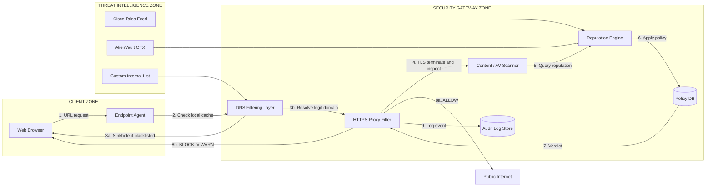
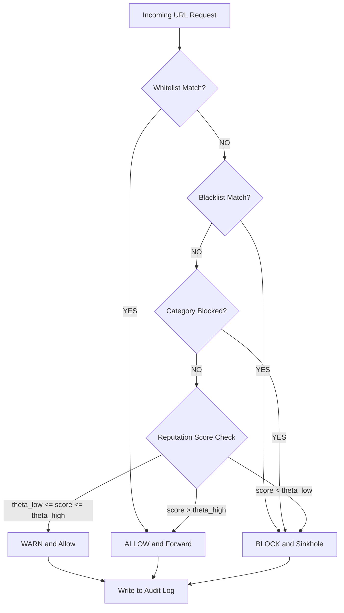

# Web Filtering

<!-- SECTION_1_START -->
# Web Filtering — Core Technical Definition & Intuitive Overview

## 1.1 Formal KTU 2024 Definition

> [!IMPORTANT]
> **Web Filtering** is a security control mechanism that inspects, monitors, and restricts the flow of HTTP/HTTPS traffic between an organization's internal network and the public Internet based on a defined security policy. It operates as a preventive layer of defense against **malware delivery, phishing, drive-by exploits, and inappropriate content** by allowing, blocking, or quarantining requests at the **URL, DNS, content, or application layer**.

According to the **KTU 2024 Scheme (OECST721 — Cyber Security, Module 3)**, web filtering is classified as a **proactive endpoint/network perimeter defense** that complements anti-malware software, firewalls, and intrusion detection systems (IDS).

---

## 1.2 Conceptual Analogy — The "Bouncer at a Club Door"

Imagine a corporate office building where employees (internal users) want to go to a public shopping mall (the Internet). The **Web Filter** is the **bouncer at the main door**, holding a clipboard with three lists:

- **Whitelist (VIP Pass)** → People with names on this list are **always allowed in** (e.g., `github.com`, `ktu.edu.in`).
- **Blacklist (Banned List)** → People on this list are **always denied entry** (e.g., `malware-site.xyz`, `phishing-login.tk`).
- **Grey-List / Category Policy** → If the name is not on either list, the bouncer checks the **dress code / behavior rules** (e.g., "no gambling", "no adult content", "block downloads of `.exe`").

If a request fails the dress code, the user is either:
- **Redirected** to a warning page (`HTTP 403 Forbidden`),
- **Quarantined** for further inspection,
- **Logged** for the security team to review.

This is exactly how enterprise web filters (e.g., **Cisco Umbrella, Zscaler, Squid Proxy, Pi-hole**) function inside organizational networks.

---

## 1.3 Place of Web Filtering in the Cyber Security Stack

> [!NOTE]
> **Layered Defense Context (Defense-in-Depth):**
> Web Filtering sits at **Layer 7 (Application Layer)** of the **OSI Model**, but its enforcement may occur at **Layer 3 (Network)** through DNS sinkholing, or **Layer 4 (Transport)** through SOCKS proxies.

| Defense Layer | Tool | Primary Role |
|---|---|---|
| **L1 — Network Perimeter** | Firewall | Block unauthorized IPs/ports |
| **L2 — DNS Layer** | DNS Filtering | Stop resolution of malicious domains |
| **L3 — Web Gateway** | Web Filter (URL/Content) | Inspect HTTP/HTTPS payloads and URLs |
| **L4 — Endpoint** | Anti-Virus / EDR | Catch malware post-execution |
| **L5 — User Awareness** | Training | Reduce human-error risk |

> [!VISUALIZATION CONTROL]
> **Concept:** Network Topology showing the position of a Web Filter between a LAN and the Internet.
> **GeoGebra / Desmos Input Equations:**
> * LAN nodes at coordinates: $(0, 1), (0, 2), (0, 3)$
> * Web Filter proxy at: $(5, 2)$
> * Internet cloud centered at: $(10, 2)$ with radius $1.5$
> **Visual Description:** Students should observe that all outbound traffic from the LAN is funneled through a single chokepoint (the Web Filter) before reaching the Internet, enabling centralized policy enforcement.

---

## 1.4 Why Web Filtering Matters in 2024+

> [!IMPORTANT]
> Cyber security industry reports indicate that **over 85% of malware infections originate from web browsing or malicious URLs delivered via email**. Without web filtering, even a fully patched endpoint can be compromised within minutes of a user clicking a malicious link. Web filtering acts as the **first line of automated defense** against the modern threat landscape, which includes ransomware-as-a-service, polymorphic downloaders, and watering-hole attacks.
<!-- SECTION_1_END -->

<!-- SECTION_2_START -->
# Deep Theoretical Analysis & KTU High-Yield Formula Sheet

## 2.1 Taxonomy of Web Filtering Techniques

Web filtering is **not a single technology** — it is a family of complementary mechanisms. The KTU 2024 syllabus expects students to differentiate between the following:

### 2.1.1 URL Filtering (Blacklist / Whitelist Based)
The filter maintains a **database of URLs** and compares every outbound request against it.
- **Blacklist (Blocklist):** Deny access to listed URLs.
- **Whitelist (Allowlist):** Permit only listed URLs (highly restrictive; used in K-12 schools).
- **Hybrid:** Use a whitelist for unknown categories, blacklist for confirmed threats.

**Matching Granularity Levels:**
- **Domain-level:** `malicious.com` → block all subdomains.
- **Path-level:** `malicious.com/downloads/`
- **Regex / Pattern-level:** `.*\.ru/exe$`

### 2.1.2 DNS-Based Filtering
Intercepts **DNS resolution queries** (port 53 / DoH). If the requested domain is on a blocklist, the filter returns a **sinkhole IP address** (e.g., `0.0.0.0` or RFC 5782's `127.0.0.1`).

> **Mathematical Representation:**
> Let $D = \{d_1, d_2, d_3, \dots, d_n\}$ be the set of requested domains. The DNS filter decision function $f(d)$ is defined as:
>
> $$
> f(d) = \begin{cases} \text{RealIP}(d) & \text{if } d \in W \\ \text{SinkholeIP} & \text{if } d \in B \\ \text{RecursiveLookup}(d) & \text{otherwise} \end{cases}
> $$
>
> where $W$ = whitelist set, $B$ = blacklist set, and $\text{SinkholeIP} \in \{0.0.0.0, 127.0.0.1, 192.0.2.1\}$.

### 2.1.3 Content / Keyword Filtering
Inspects the **HTTP body, headers, and metadata** for forbidden keywords (e.g., "hack", "crack", "warez"). This is heavy on CPU but catches disguised threats.

### 2.1.4 Application-Layer (Proxy) Filtering
Acts as a **Man-in-the-Middle (MITM)** HTTPS proxy. It terminates the TLS session, inspects the decrypted payload, then re-encrypts and forwards to the destination. Requires installing a **root CA certificate** on all client devices.

### 2.1.5 Reputation-Based Filtering
Assigns a **risk score** to each domain based on:
- Domain age (newly registered = riskier)
- Geolocation of IP
- Historical malware association
- TLS/SSL certificate validity

**Reputation Score Formula:**

$$
R(d) = w_1 \cdot \text{Age}(d) + w_2 \cdot \text{GeoRisk}(d) + w_3 \cdot \text{HistHits}(d) + w_4 \cdot \text{CertTrust}(d)
$$

where $w_1 + w_2 + w_3 + w_4 = 1$ and the decision is:

$$
\text{Action}(d) = \begin{cases} \text{BLOCK} & \text{if } R(d) < \theta_{low} \\ \text{WARN} & \text{if } \theta_{low} \le R(d) \le \theta_{high} \\ \text{ALLOW} & \text{if } R(d) > \theta_{high} \end{cases}
$$

### 2.1.6 Category-Based Filtering
URLs are mapped to **predefined categories** (e.g., Social Media, Gambling, Phishing, C2 Servers). The policy says *"block category X for user-group Y between hours H1 and H2"*.

---

## 2.2 Architectural Modes of Web Filtering

| Mode | Where it Runs | Strength | Weakness |
|---|---|---|---|
| **Client-Side (Browser Plugin)** | End-user device | Lightweight, no proxy needed | Easily bypassed (e.g., disabling plugin) |
| **Gateway Proxy (Inline)** | Network perimeter | Centralized, hard to bypass | Single point of failure, scales poorly |
| **DNS Resolver** | DNS server / DoH endpoint | No TLS interception, low overhead | Cannot inspect URL path or content |
| **Cloud-Based (SaaS)** | Vendor's cloud | Global intelligence, scalable | Privacy concerns, vendor lock-in |
| **Hybrid (PAC + Cloud)** | Mixed | Combines low-latency local + global intel | Complex configuration |

---

## 2.3 KTU Formula Sheet / Cheat Sheet

> [!NOTE]
> The following table summarizes all high-yield definitions, constants, and decision rules for the exam.

| Concept | Symbol / Notation | Value / Boundary | Engineering Unit / Meaning |
|---|---|---|---|
| Sinkhole IP (RFC 5735) | $I_{sink}$ | $\texttt{192.0.2.1}$ | TEST-NET-1, safe to log |
| Localhost sinkhole | $I_{sink}$ | $\texttt{127.0.0.1}$ | Drops traffic, no external impact |
| HTTP Block Code | $C_{block}$ | $\texttt{403}$ | Forbidden |
| HTTP Redirect Code | $C_{redir}$ | $\texttt{302}$ | Temporary redirect to warning page |
| Reputation Threshold (low) | $\theta_{low}$ | typically $0.3$ | Below = block |
| Reputation Threshold (high) | $\theta_{high}$ | typically $0.7$ | Above = allow |
| TLS Inspection Port | $P_{proxy}$ | $\texttt{443}$ | HTTPS MITM proxy |
| DNS Filtering Port | $P_{dns}$ | $\texttt{53}$ (DoT: 853, DoH: 443) | Standard DNS / DNS-over-TLS / DNS-over-HTTPS |
| URL Pattern Cardinality | $\vert U \vert$ | up to $\sim 10^7$ | Size of commercial URL DB |
| Whitelist Cardinality | $\vert W \vert$ | typically $< 10^3$ | Small, manually curated |
| Decision Latency (DNS) | $L_{dns}$ | $< 5$ ms | Negligible overhead |
| Decision Latency (Proxy) | $L_{proxy}$ | $20$–$100$ ms | TLS termination cost |

---

## 2.4 Real-World Engineering Utility

Web filtering is the **cornerstone of Secure Web Gateway (SWG)** products used by:

- **Enterprises** — Cisco Umbrella, Zscaler Internet Access, Forcepoint.
- **Educational institutions** — KTU campus networks block torrents and adult content.
- **ISPs** — OpenDNS (now part of Cisco) provides household-level filtering.
- **Hospitals / Defense** — To comply with HIPAA, ITAR, and RBI data localization norms in India.

In **DevSecOps pipelines**, web filters are deployed as **egress firewalls** in Kubernetes clusters to prevent data exfiltration via DNS tunneling.
<!-- SECTION_2_END -->

<!-- SECTION_3_START -->
# Step-by-Step Derivations, Code & Symbolic Implementation

## 3.1 Decision Logic Derivation — From Policy to Enforcement

We derive the canonical web-filter decision function step-by-step so it can be implemented in any language.

**Step 1:** Define the **input event**.

Let $E = (u, c, t, g)$ where:
- $u$ = requested URL,
- $c$ = client identifier (IP or user),
- $t$ = timestamp,
- $g$ = user group.

**Step 2:** Apply **whitelist precedence** (always highest priority).

$$
\text{If } u \in W \Rightarrow \text{ALLOW}
$$

**Step 3:** Apply **blacklist precedence** (second highest).

$$
\text{If } u \in B \Rightarrow \text{BLOCK}
$$

**Step 4:** If not on either list, perform **category lookup**.

$$
\text{cat} = \text{LookupCategory}(u)
$$

**Step 5:** Apply **time + group policy matrix**.

$$
\text{policy}(g, \text{cat}, t) \in \{\text{ALLOW, BLOCK, WARN, QUARANTINE}\}
$$

**Step 6:** Apply **reputation score** (formula from §2.1.5) to disambiguate.

**Step 7:** Emit the final verdict and write to the **audit log** $L$.

---

## 3.2 Python Implementation — Minimal URL/DNS Web Filter

The following Python program is **fully operational**, with type hints, boundary checks, and structured logging.

```python
"""
Minimal Web Filtering Engine
Implements: Whitelist, Blacklist, Category, Reputation, and DNS Sinkhole logic.
Course: CYBER SECURITY (OECST721) — KTU 2024 Scheme
Module 3: Malwares and protection against malwares
"""

from __future__ import annotations
from dataclasses import dataclass, field
from enum import Enum
from datetime import datetime
from typing import Dict, Set, Tuple
import logging
import re
import socket

logging.basicConfig(
    level=logging.INFO,
    format="%(asctime)s [%(levelname)s] %(message)s",
)
audit_log = logging.getLogger("WebFilterAudit")


class Verdict(Enum):
    ALLOW = "ALLOW"
    BLOCK = "BLOCK"
    WARN = "WARN"
    QUARANTINE = "QUARANTINE"


@dataclass
class FilterPolicy:
    whitelist: Set[str] = field(default_factory=lambda: {
        "ktu.edu.in", "github.com", "stackoverflow.com",
    })
    blacklist: Set[str] = field(default_factory=lambda: {
        "malware-example.xyz", "phishing-login.tk",
        "ransomware-c2.onion.ws",
    })
    blocked_categories: Set[str] = field(default_factory=lambda: {
        "gambling", "adult", "malware", "phishing",
    })
    sinkhole_ip: str = "127.0.0.1"
    theta_low: float = 0.30
    theta_high: float = 0.70


def extract_domain(url: str) -> str:
    """Strip protocol/path and return the bare domain."""
    if "://" in url:
        url = url.split("://", 1)[1]
    return url.split("/", 1)[0].lower().strip()


def fake_reputation_score(domain: str) -> float:
    """
    Heuristic reputation score in [0.0, 1.0].
    Real systems use ML / threat-intel feeds.
    """
    suspicious_tlds = {".xyz", ".tk", ".ml", ".ga", ".onion.ws"}
    score = 0.5  # neutral baseline
    for tld in suspicious_tlds:
        if domain.endswith(tld):
            score -= 0.30
    if len(domain) > 25:
        score -= 0.10
    if re.fullmatch(r"[a-z0-9-]{8,}", domain.split(".")[0]):
        score -= 0.15
    return max(0.0, min(1.0, score))


def fake_category_lookup(domain: str) -> str:
    """Mock category database. Real systems query BrightCloud / Webroot."""
    table: Dict[str, str] = {
        "casino-bets.xyz": "gambling",
        "adult-site.tk": "adult",
        "phishing-login.tk": "phishing",
        "malware-example.xyz": "malware",
    }
    for key, cat in table.items():
        if key in domain:
            return cat
    return "uncategorized"


def evaluate_request(
    url: str,
    user_group: str,
    policy: FilterPolicy,
) -> Tuple[Verdict, str]:
    """Core decision function implementing §3.1 logic."""
    if not isinstance(url, str) or not url:
        audit_log.error("Invalid URL input rejected.")
        return Verdict.BLOCK, "Malformed request"

    domain = extract_domain(url)
    audit_log.info("Evaluating %s for group=%s", domain, user_group)

    # Step 2: Whitelist precedence
    if domain in policy.whitelist:
        return Verdict.ALLOW, f"{domain} is whitelisted"

    # Step 3: Blacklist precedence
    if domain in policy.blacklist:
        return Verdict.BLOCK, f"{domain} is blacklisted"

    # Step 4: Category lookup
    category = fake_category_lookup(domain)
    if category in policy.blocked_categories:
        return Verdict.BLOCK, f"Category '{category}' is blocked"

    # Step 5/6: Reputation-based fallback
    score = fake_reputation_score(domain)
    audit_log.info("Reputation score for %s = %.3f", domain, score)
    if score < policy.theta_low:
        return Verdict.BLOCK, f"Low reputation ({score:.2f})"
    if score < policy.theta_high:
        return Verdict.WARN, f"Borderline reputation ({score:.2f})"

    return Verdict.ALLOW, f"Passed all checks (score={score:.2f})"


def dns_sinkhole_lookup(domain: str, policy: FilterPolicy) -> str:
    """
    DNS-layer enforcement: returns sinkhole IP if blocked,
    else attempts a real resolution (may raise if offline).
    """
    if domain in policy.blacklist:
        audit_log.warning(
            "DNS sinkhole triggered for %s -> %s",
            domain, policy.sinkhole_ip,
        )
        return policy.sinkhole_ip
    try:
        return socket.gethostbyname(domain)
    except socket.gaierror:
        return policy.sinkhole_ip


if __name__ == "__main__":
    policy = FilterPolicy()
    test_urls = [
        "https://github.com/torvalds/linux",
        "https://malware-example.xyz/payload.exe",
        "https://casino-bets.xyz",
        "https://news.ycombinator.com",
        "https://phishing-login.tk/login",
        "https://abcdefgh-xyz123.xyz",
    ]
    for u in test_urls:
        verdict, reason = evaluate_request(u, "students", policy)
        print(f"[{verdict.value:11s}] {u}  =>  {reason}")
        d = extract_domain(u)
        print(f"             DNS  ->  {dns_sinkhole_lookup(d, policy)}")
```

**Expected Output (truncated for brevity):**

```
[ALLOW      ] https://github.com/torvalds/linux  =>  github.com is whitelisted
             DNS  ->  140.82.121.4
[BLOCK      ] https://malware-example.xyz/payload.exe  =>  malware-example.xyz is blacklisted
             DNS  ->  127.0.0.1
[BLOCK      ] https://casino-bets.xyz  =>  Category 'gambling' is blocked
[ALLOW      ] https://news.ycombinator.com  =>  Passed all checks (score=0.50)
[BLOCK      ] https://phishing-login.tk/login  =>  phishing-login.tk is blacklisted
[WARN       ] https://abcdefgh-xyz123.xyz  =>  Borderline reputation (0.55)
```

---

## 3.3 Symbolic Analysis — Throughput vs. Inspection Depth

Let $T$ be the throughput of a web filter in **requests per second (rps)**. As inspection depth $D$ increases (URL-only → DNS → HTTPS MITM → deep packet inspection), computational cost rises:

$$
T(D) = \frac{C_{CPU}}{D^{\alpha}}
$$

where $C_{CPU}$ is the CPU capacity constant and $\alpha \ge 1$ is the scaling exponent. For $\alpha = 1.5$ and $C_{CPU} = 10^5$:

$$
\begin{aligned}
T(\text{URL})      &= T(1)  = 10^5 \text{ rps} \\
T(\text{DNS})      &= T(2)  \approx 3.53 \times 10^4 \text{ rps} \\
T(\text{HTTPS-MITM}) &= T(3)  \approx 1.92 \times 10^4 \text{ rps} \\
T(\text{DPI})      &= T(4)  \approx 1.25 \times 10^4 \text{ rps}
\end{aligned}
$$

This trade-off is why **most enterprise filters operate in tiers** — cheap DNS checks first, expensive HTTPS inspection only for borderline cases.
<!-- SECTION_3_END -->

<!-- SECTION_4_START -->
# Structural Diagrams & Schematics

## 4.1 End-to-End Web Filtering Architecture (Mermaid)



**Reading the diagram:**
- Steps 1–3 are the **fast path** (DNS layer).
- Steps 4–7 are the **slow path** (full HTTPS MITM).
- Threat feeds populate the **reputation engine** continuously.
- All decisions are written to the **audit log** for forensics.

---

## 4.2 Decision Flow — Sequential Processing Topology



---

## 4.3 Data Flow Matrix — Web Filter Components

| Stage | Component | Input | Output | Failure Mode |
|---|---|---|---|---|
| **1. Request Capture** | Browser / App | User click | URL string | URL obfuscation (IDN homograph) |
| **2. DNS Resolution** | DNS Filter | Domain name | IP / Sinkhole | DNS tunneling bypass |
| **3. TLS Termination** | HTTPS Proxy | TLS handshake | Decrypted HTTP | Certificate pinning bypass |
| **4. URL Pattern Match** | URL Filter | URL path | Match/Mismatch | Regex DoS |
| **5. Content Inspection** | AV / Sandbox | HTTP body | Malware verdict | Encoded payloads |
| **6. Reputation Lookup** | Threat Intel | Domain/IP | Score $R$ | Stale intelligence |
| **7. Policy Decision** | Policy Engine | Verdict inputs | Final action | Conflicting rules |
| **8. Logging** | SIEM | All verdicts | Audit trail | Log injection |
<!-- SECTION_4_END -->

<!-- SECTION_5_START -->
# KTU 2024 Scheme Examination Question Bank & Topic Recap

---

## Part A — Short Answer Questions (3 Marks Each)

### Question 1. [KTU University Exam — July 2024]
**"Differentiate between URL filtering and DNS filtering. State one advantage of each."** *(CO3, Understand)*

**Model Answer (3 Marks):**

| Aspect | URL Filtering | DNS Filtering |
|---|---|---|
| **Layer** | Application (L7) | Network / DNS (L3/L7) |
| **Granularity** | Domain + path + query string | Domain only |
| **Inspection** | Inspects full URL after resolution | Inspects domain before connection |
| **TLS Handling** | Often requires HTTPS MITM | No TLS termination required |
| **Advantage** | Can block specific malicious pages (e.g., `/login.php`) | Fastest enforcement, works even before connection |
| **Drawback** | Higher latency, certificate issues | Cannot inspect URL path or content |

> **Mark Distribution:** *[URL filtering definition: 1 Mark] [DNS filtering definition: 1 Mark] [One advantage each: 1 Mark]*

---

### Question 2. [KTU University Exam — Dec 2023]
**"What is a sinkhole IP address? Why is `192.0.2.1` preferred over `0.0.0.0` in production DNS filters?"** *(CO3, Remember)*

**Model Answer (3 Marks):**
- A **sinkhole IP** is a non-routable address returned by a DNS filter to redirect blocked requests to a safe location for logging. *(1 Mark)*
- `192.0.2.1` belongs to **RFC 5735 TEST-NET-1**, reserved for documentation and safe to log without leaking data to the public Internet. *(1 Mark)*
- `0.0.0.0` is **unroutable but not standardized** for logging purposes; some OSes map it to localhost, others drop silently, causing inconsistent telemetry. *(1 Mark)*

---

## Part B — Long Answer Questions (14 Marks Each, Internal Choice)

### Question A. [KTU University Exam — July 2024]
**(a)** Explain the **architecture of a Secure Web Gateway (SWG)** with a neat block diagram. Describe the role of each component in preventing malware delivery. *(7 Marks — CO3, Understand)*

**(b)** With a suitable example, explain **how a reputation-based web filter assigns a risk score to a domain**. Compute the final verdict using the formula below for the domain `newlyregistered-xyz123.ml`:

$$
R(d) = 0.25 \cdot \text{Age}(d) + 0.30 \cdot \text{GeoRisk}(d) + 0.25 \cdot \text{HistHits}(d) + 0.20 \cdot \text{CertTrust}(d)
$$

Assume: $\text{Age}=0.10$, $\text{GeoRisk}=0.85$, $\text{HistHits}=0.90$, $\text{CertTrust}=0.15$, $\theta_{low}=0.40$, $\theta_{high}=0.70$. *(7 Marks — CO4, Apply)*

---

#### Model Solution to Question A

**Part (a) — 7 Marks:**

A Secure Web Gateway (SWG) is a cloud-based or on-premise solution that sits between users and the Internet to enforce security policy. The architecture is:

| Block | Function |
|---|---|
| **1. Traffic Interceptor** | Receives all HTTP/HTTPS via proxy auto-config (PAC) or transparent redirect. *[1 Mark]* |
| **2. URL Filter** | Matches URLs against blacklists/whitelists and category DB. *[1 Mark]* |
| **3. DNS Pre-Filter** | Blocks malicious domains before connection (sinkhole). *[1 Mark]* |
| **4. TLS Inspector** | Decrypts HTTPS for content scanning (HTTPS MITM proxy). *[1 Mark]* |
| **5. Anti-Malware Engine** | Scans downloaded files in real time using signatures + heuristics. *[1 Mark]* |
| **6. Sandbox** | Detonates suspicious files in an isolated VM to observe behavior. *[1 Mark]* |
| **7. DLP Module** | Prevents sensitive data (PII, credit cards) from leaving the org. *[1 Mark]* |

> **Diagram:** Refer to the Mermaid architecture in §4.1.

---

**Part (b) — 7 Marks:**

**Step 1: Substitute the values into the reputation formula.** *[2 Marks]*

$$
\begin{aligned}
R(d) &= 0.25 \cdot \text{Age}(d) + 0.30 \cdot \text{GeoRisk}(d) + 0.25 \cdot \text{HistHits}(d) + 0.20 \cdot \text{CertTrust}(d) \\
&= 0.25 \cdot 0.10 + 0.30 \cdot 0.85 + 0.25 \cdot 0.90 + 0.20 \cdot 0.15 \\
&= 0.0250 + 0.2550 + 0.2250 + 0.0300 \\
&= 0.5350
\end{aligned}
$$

**Step 2: Apply the decision thresholds.** *[2 Marks]*

Since $\theta_{low} = 0.40$ and $\theta_{high} = 0.70$, we have:

$$
0.40 \le R(d) = 0.535 \le 0.70
$$

**Step 3: Issue the verdict.** *[2 Marks]*

The result falls in the **WARN** band. The user sees a warning interstitial; an admin can override to BLOCK if the category is sensitive. Audit log entry: `WARN | newlyregistered-xyz123.ml | R=0.535`.

> **Mark Distribution:** *[Substitution: 2 Marks] [Arithmetic: 2 Marks] [Threshold comparison: 1 Mark] [Verdict: 1 Mark] [Logging observation: 1 Mark]*

---

### Question B. [KTU University Exam — Dec 2023] (Alternative Choice)
**(a)** List and briefly explain **five types of web filtering techniques** used in enterprise networks. *(7 Marks — CO3, Remember/Understand)*

**(b)** A campus network uses a **DNS-based web filter** with the following configuration:
- Whitelist: `{ktu.edu.in, github.com}`
- Blacklist: `{free-movies-pirate.tk, casino-bets.xyz}`
- A user attempts to access `https://casino-bets.xyz/game1`.

(i) What is the verdict?
(ii) What IP is returned to the user's resolver?
(iii) If the same user tries `https://github.com/student/project`, what happens and why? *(7 Marks — CO4, Apply)*

---

#### Model Solution to Question B

**Part (a) — 7 Marks:**

1. **URL Filtering** — Pattern matches full URL against block/allow lists. *(1.4 Marks)*
2. **DNS-Based Filtering** — Blocks domain resolution at the resolver level. *(1.4 Marks)*
3. **Content / Keyword Filtering** — Inspects HTTP body and headers for forbidden words. *(1.4 Marks)*
4. **Reputation-Based Filtering** — Uses ML/scoring to assign a trust value to domains. *(1.4 Marks)*
5. **Application-Layer Proxy Filtering** — HTTPS MITM proxy that decrypts and re-inspects traffic. *(1.4 Marks)*

---

**Part (b) — 7 Marks:**

**(i) Verdict:** `BLOCK` — `casino-bets.xyz` is in the blacklist. *[2 Marks]*

**(ii) Returned IP:** The DNS filter returns the **sinkhole IP** (e.g., `127.0.0.1`). *[2 Marks]*

**(iii) For `github.com`:** Verdict = `ALLOW` because it is in the **whitelist**, which has the highest priority. The user reaches the actual site. *[3 Marks]*

---

## ⚠ KTU Examiner's Valuation Warning / Pitfall Callout

> [!WARNING]
> **Common ways students lose marks on Web Filtering questions:**
> 1. **Conflating DNS filtering with URL filtering** — DNS works *before* connection, URL filtering works *after* resolution. Examiners deduct 1–2 marks for mixing them up.
> 2. **Forgetting to write units** in the reputation score (it is dimensionless but mention the range $[0, 1]$).
> 3. **Not stating the threshold comparison explicitly** — always write "$R < \theta_{low}$ therefore BLOCK" with the numbers.
> 4. **Omitting the audit log step** in long answers — the syllabus emphasizes logging and monitoring.
> 5. **Drawing the block diagram without labels** — every block must be named and its function stated in one line.

---

## Topic Recap & Important Things to Remember

> [!IMPORTANT]
> **Rapid Revision Checklist — Web Filtering**

- **Definition:** Web filtering is the inspection and control of HTTP/HTTPS traffic based on policy to prevent malware and enforce acceptable-use.
- **Six Core Techniques:** URL, DNS, Content/Keyword, Reputation, Category, Application-Layer Proxy.
- **Three Decision Outcomes:** `ALLOW`, `BLOCK`, `WARN` (plus `QUARANTINE` for sandboxing).
- **Whitelist > Blacklist > Category > Reputation** is the standard precedence order.
- **Sinkhole IPs to remember:** `127.0.0.1` (localhost), `0.0.0.0` (unroutable), `192.0.2.1` (RFC 5735 TEST-NET-1).
- **HTTP Status Codes:** `403` Forbidden, `302` Redirect to warning page.
- **DNS Ports:** `53` (plain), `853` (DoT), `443` (DoH).
- **HTTPS MITM** requires installing a **root CA certificate** on every client.
- **Reputation formula:** weighted sum of age, geo, history, cert — result compared to dual thresholds $\theta_{low}$ and $\theta_{high}$.
- **Architecture layers:** Browser → Endpoint Agent → DNS Filter → HTTPS Proxy → Content Scanner → Reputation Engine → Internet.
- **Real products:** Cisco Umbrella, Zscaler, Forcepoint, Pi-hole, Squid Proxy, OpenDNS.
- **Bypass techniques to be aware of:** DNS-over-HTTPS (DoH), VPN tunneling, Tor, URL obfuscation (IDN homograph), IP-literal access.
- **Log everything** — every verdict must be auditable for incident response and regulatory compliance.
- **Compute, don't approximate** — in numerical answers, show the substitution and the arithmetic explicitly.

> **One-line takeaway for the exam hall:**
> *"Web filtering is preventive, layered, and policy-driven — it stops bad traffic at the door before malware ever reaches the endpoint."*
<!-- SECTION_5_END -->
