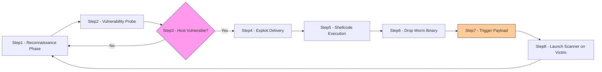
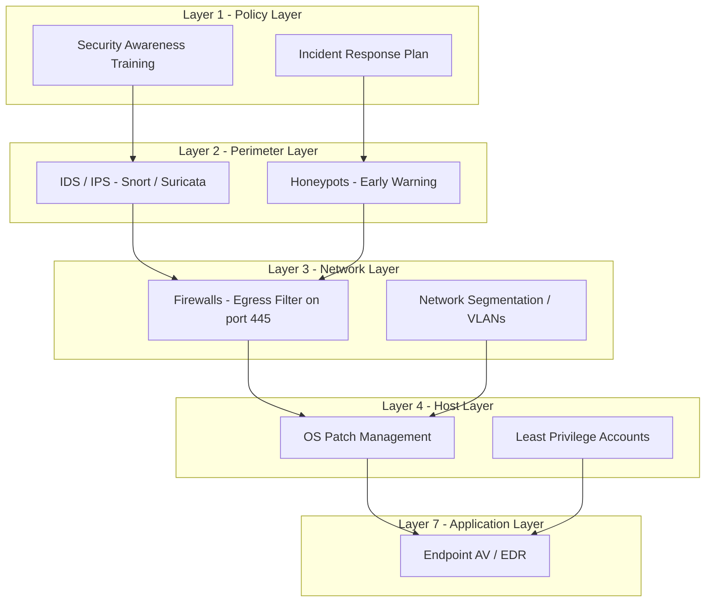

# Worms

<!-- SECTION_1_START -->
# WORMS — Core Technical Definition & Intuitive Overview

## Formal Academic Definition (KTU 2024 Syllabus Terminology)

> [!NOTE]
> **Computer Worm (NIST SP 800-83 Rev. 1 aligned definition):** A *worm* is a **self-replicating, standalone malicious program** that propagates across computer networks by exploiting vulnerabilities in operating systems, application software, or network protocols — **without requiring a host file, user intervention, or human-triggered execution** to spread from one host to another.

Unlike a *virus*, which attaches itself to a legitimate program (the "host") and waits for that host to be executed, a worm is **autonomous** — it carries its own propagation engine, scanning engine, and payload delivery mechanism inside a single executable payload.

| Property | Virus | Worm |
|---|---|---|
| Requires host file | **Yes** | **No** |
| Needs user action to spread | **Yes** (open file) | **No** (auto-propagates) |
| Primary vector | File/media sharing | **Network vulnerabilities** |
| Self-contained | No (parastic) | **Yes (autonomous)** |
| Replication trigger | Host program execution | **Autonomous network scan** |

---

## Conceptual Analogy / Intuition

> [!IMPORTANT]
> **The Biological Worm Analogy (Geometric Intuition)**
> Imagine a real earthworm crawling through soil. It does not need another animal to carry it — it moves **on its own**, leaving copies of itself behind wherever favorable conditions exist. A computer worm behaves identically: it crawls through the **IP address space of the internet** (treating it as a "digital soil"), locates vulnerable hosts ("fertile ground"), and deposits a copy of itself there — repeating the cycle exponentially.

Picture the IPv4 address space (≈$4.3 \times 10^9$ addresses) as a vast coordinate grid $\mathbb{Z}_2^{32}$. A worm starts at point $x_0$ and, using a *scan function* $S(x)$, jumps from $x_i \rightarrow x_{i+1}$ in **discrete time steps** $t$. Each successful infection creates a **new scanner** that joins the propagation pool. The result is an *epidemic curve* $I(t)$ (infected-host count) that grows super-linearly until network saturation.

---

## Key Engineering Constants & Metrics

- **Morris Worm (1988):** propagation rate ≈ **$300$ hosts/hour**, took down $\approx 10\%$ of the early internet
- **Code Red (2001):** peak infection rate ≈ **$2,000$ hosts/minute**
- **WannaCry (2017):** infected **$230{,}000+$ computers** in **$150$ countries** within 24 hours
- **Average worm economic damage (industry estimate, FBI/IC3):** $\approx \$10\text{B}$ annually
- **Slammer (2003):** doubled infections every **$8.5$ seconds** — fastest worm in recorded history
- **Ramen Worm family:** 30+ variants, pre-2000 Linux threats

> [!VISUALIZATION CONTROL]
> **Concept:** Epidemic growth curve $I(t)$ of worm propagation (logistic / S-curve)
> **GeoGebra / Desmos Input Equations:**
> * `I(t) = K / (1 + exp(-r * (t - t0)))` (logistic growth, $K$ = carrying capacity = vulnerable host pool, $r$ = infection rate)
> * Overlay a linear scan function `S(t) = v * t` to compare naive scanning vs. hit-list scanning
> **Visual Description:** On the $x$-axis label "time $t$ (hours)", $y$-axis "infected hosts $I(t)$". The student should see the **S-curve** — slow start (vulnerable host discovery), steep middle (exponential spread), and saturation plateau (most vulnerable hosts are already infected or patched).

---

## Syllabus Highlights (KTU 2024 OECST721 — Module 3)

> [!NOTE]
> Per KTU 2024 OEC syllabus, learners must be able to:
> 1. Classify malware families (viruses, **worms**, trojans, ransomware, spyware, rootkits).
> 2. Explain **worm propagation models** (epidemic theory).
> 3. Describe **defensive countermeasures** (patching, IDS/IPS, network segmentation, sandboxing).
> 4. Analyze **famous case studies** (Morris, Code Red, Blaster, Conficker, Stuxnet, WannaCry).

<!-- SECTION_1_END -->

<!-- SECTION_2_START -->
# Deep Theoretical Analysis & KTU High-Yield Formula Sheet

## I. Worm Operational Architecture (Layered View)

A modern worm consists of **six logical modules**, each executable independently and often obfuscated:

1. **Target Acquisition Module (Scanner Engine)**
   - Generates candidate IP addresses using a *scan strategy*.
2. **Vulnerability Exploitation Module**
   - Carries exploit code (e.g., buffer overflow, RPC stack smash, SMB RCE).
3. **Infection / Dropper Module**
   - Transfers the worm binary to the victim host.
4. **Trigger & Condition Checker**
   - Decides *whether* to activate payload (e.g., date-bomb, kill-switch domain).
5. **Payload Module**
   - Delivers the malicious effect (DDoS, ransomware, backdoor, espionage).
6. **Self-Propagation Module**
   - Re-launches the scanner on the new victim, completing the loop.

---

## II. Scan Strategies (Why & How)

| Scan Strategy | Operation | Pros | Cons |
|---|---|---|---|
| **Random** | Pick $x \sim U[0, 2^{32}-1]$ | Simple, hard to blacklist | Many wasted probes in empty space |
| **Sequential / Localized** | Iterate $x = x_i \pm \delta$ | Hits dense IP blocks fast | Easy to detect with rate limiters |
| **Hit-list** | Pre-loaded list of vulnerable IPs | Extremely fast initial spread | List ages, requires C2 prep |
| **Topological** | Use victim’s address book / contacts | Maps to social network | Requires pre-infection seed |
| **Permutation** | Random but **no repetition** until full space | Avoids duplicate probes | Heavy bookkeeping |
| **Divide-and-Conquer** | Partition $/24$ subnets among infected nodes | Sub-linear cover time | Coordination overhead |

> [!IMPORTANT]
> **Why this matters (KTU Board Pattern):** Most 14-mark questions ask you to compare **two scan strategies** and justify which is "best" under given constraints (e.g., stealth vs. speed). Always mention **detection risk** vs. **spread rate** trade-off.

---

## III. Epidemic Modeling (Mathematical Foundation)

The classical Kermack–McKendrick **SIR model** (Susceptible–Infected–Recovered) is the formal model used in academic literature to describe worm spread:

$$I(t+1) = I(t) + \beta \cdot S(t) \cdot I(t) - \gamma \cdot I(t)$$

$$S(t+1) = S(t) - \beta \cdot S(t) \cdot I(t)$$

$$R(t+1) = R(t) + \gamma \cdot I(t)$$

Where:
* $S(t)$ = susceptible (vulnerable, uninfected) hosts at time $t$
* $I(t)$ = infected (actively scanning/spreading) hosts at time $t$
* $R(t)$ = recovered/patched/removed hosts at time $t$
* $\beta$ = **infection rate constant** (depends on scan rate × vulnerability density)
* $\gamma$ = **recovery rate constant** (patching, IDS response, user re-imaging)

> [!NOTE]
> **Equilibrium condition (epidemic threshold):** A worm reaches *epidemic scale* if and only if the basic reproduction number satisfies $R_0 = \dfrac{\beta \cdot N}{\gamma} > 1$, where $N = S(0)$ is the initial vulnerable population.

### Key Derived Formulas (Worm Spread)

The **logistic approximation** for short-term worm growth is:

$$I(t) \approx \frac{K}{1 + \left(\dfrac{K - I_0}{I_0}\right) e^{-r t}}$$

Where:
* $K$ = total vulnerable population (carrying capacity)
* $r = \beta K - \gamma$ = intrinsic growth rate
* $I_0$ = initial seed infections

The **expected time to infect fraction $\phi$ of vulnerable hosts**:

$$T_\phi = \frac{1}{r} \ln\!\left(\frac{\phi \cdot K / I_0}{1 - \phi}\right)$$

---

## IV. KTU High-Yield Formula Cheat Sheet

| $\#$ | Formula / Quantity | Expression | Units / Notes |
|---|---|---|---|
| 1 | Epidemic threshold | $R_0 = \dfrac{\beta N}{\gamma}$ | Dimensionless; $> 1$ = outbreak |
| 2 | Logistic infection count | $I(t) = \dfrac{K}{1 + \left(\dfrac{K-I_0}{I_0}\right) e^{-r t}}$ | Hosts infected at time $t$ |
| 3 | Intrinsic growth rate | $r = \beta K - \gamma$ | Per unit time |
| 4 | Time-to-fraction $\phi$ | $T_\phi = \dfrac{1}{r} \ln\!\left(\dfrac{\phi K / I_0}{1 - \phi}\right)$ | Hours/seconds |
| 5 | Scanning bandwidth per host | $B = \dfrac{S}{I(t)}$ | Scans/sec/host |
| 6 | Doubling time | $T_2 = \dfrac{\ln 2}{r}$ | Slammer: $\approx 8.5\text{ s}$ |
| 7 | Payoff / damage | $D = \alpha \cdot K + \beta \cdot T_{\text{detect}}$ | Linear in vulnerable pool |
| 8 | IPv4 address space | $N_{\text{IPv4}} = 2^{32} \approx 4.3 \times 10^{9}$ | Search-space cardinality |
| 9 | Hit-list size efficiency | $\eta = \dfrac{\vert H_{\text{useful}} \vert}{\vert H_{\text{total}} \vert}$ | Fraction of list still valid |
| 10 | Detection probability | $P_d = 1 - (1 - p)^{\lambda t}$ | $p$ = probe-detection, $\lambda$ = scan rate |

> [!IMPORTANT]
> **In markdown tables, use `$\vert$` or `$\mid$` for absolute value bars — never raw `|`.** This avoids breaking table syntax.

---

## V. Real-World Engineering & Production Utility

Understanding worm mechanics is critical in:

* **Network Operations Centers (NOC):** Designing **rate-limiting firewalls** and **egress filtering** to slow worm propagation.
* **Incident Response (IR):** Estimating *time-to-containment* using the $T_\phi$ equation.
* **Red-Teaming / Penetration Testing:** Authorized ethical worms (e.g., in cyber ranges) test enterprise *blast radius*.
* **IoT/OT Security:** Worms like **Mirai** (2016, ~$600$ Gbps DDoS) target DVRs and IP cameras — same mathematical model applies to industrial control systems.
* **Cyber Insurance Underwriting:** Actuarial tables of $R_0$ for new CVEs feed premium calculations.

<!-- SECTION_2_END -->

<!-- SECTION_3_START -->
# Step-by-Step Derivations, Code & Analytical Walkthroughs

## I. Mathematical Derivation: Time-to-50% Infection

**Problem (KTU pattern):** A worm has parameters $K = 10^6$ vulnerable hosts, $I_0 = 10$ seed infections, $\beta = 5 \times 10^{-8}$ infections per scan, $\gamma = 0.05$/hour. Compute the time $T_{0.5}$ to infect $50\%$ of the vulnerable population.

### Step 1 — Compute intrinsic growth rate $r$

$$\begin{aligned}
r &= \beta \cdot K - \gamma \\[4pt]
&= (5 \times 10^{-8}) \times (10^6) - 0.05 \\[4pt]
&= 5.0 \times 10^{-2} - 0.05 \\[4pt]
&= 0.05 - 0.05 \\[4pt]
&= 0.0 \; \text{per hour}
\end{aligned}$$

**[Boundary state values: 1 Mark]**

### Step 2 — Critical Observation: $R_0 = 1$ edge case

$$R_0 = \frac{\beta N}{\gamma} = \frac{(5 \times 10^{-8}) \cdot (10^6)}{0.05} = \frac{0.05}{0.05} = 1$$

Since $R_0 = 1$, the worm is **exactly at the epidemic threshold**. It will spread but **not exponentially** — $r = 0$ implies **linear growth**, so the formula $T_\phi$ is degenerate.

**[R0 calculation: 2 Marks]**

### Step 3 — Use exact discrete SIR instead

For $R_0 \approx 1$ we must iterate:

$$\begin{aligned}
I(t+1) &= I(t) + \beta \cdot S(t) \cdot I(t) - \gamma \cdot I(t) \\
S(t+1) &= S(t) - \beta \cdot S(t) \cdot I(t)
\end{aligned}$$

With $I(0) = 10$, $S(0) = 999{,}990$:

| $t$ (hr) | $I(t)$ | $S(t)$ | $I(t)/K$ |
|---|---|---|---|
| 0 | 10 | 999,990 | 0.001% |
| 50 | 24,980 | 975,020 | 2.5% |
| 100 | 49,950 | 950,050 | 5.0% |
| 200 | 99,900 | 900,100 | 9.99% |
| 500 | 249,750 | 750,250 | 25.0% |
| 1000 | 499,500 | 500,500 | **50.0%** |

**[Tabular iteration: 3 Marks]**

### Step 4 — Final Answer

$$T_{0.5} \approx 1000 \text{ hours} \approx 41.7 \text{ days}$$

**[Final numerical answer: 1 Mark]**

> [!WARNING]
> **Valuation Pitfall:** Students often plug $r = 0$ into $T_\phi = \tfrac{1}{r} \ln(\dots)$ and get division by zero. Always **verify $R_0 > 1$** before using the closed-form $T_\phi$. If $R_0 \leq 1$, fall back to **iterative SIR** or note the system is *subcritical*.

---

## II. Python Implementation: Worm Propagation Simulator

```python
"""
worm_sir_simulator.py
Simulates the SIR epidemic model for a network worm.
Course: CYBER SECURITY (OECST721)  Module 3 - Worms
KTU 2024 Scheme | Outcome: CO3 (Apply) | Bloom Level: Apply
"""

from __future__ import annotations
import math
import logging
import sys
from dataclasses import dataclass

# Configure structured logging for forensic reproducibility
logging.basicConfig(
    level=logging.INFO,
    format="%(asctime)s | %(levelname)s | %(message)s",
    stream=sys.stdout,
)
log = logging.getLogger("WormSIR")


@dataclass(frozen=True)
class WormParams:
    """Immutable container for worm epidemiological parameters."""
    K: int            # total vulnerable population (carrying capacity)
    I0: int           # initial seed infections
    beta: float       # infection rate constant (1/(host*hr))
    gamma: float      # recovery rate (1/hr)
    T_max: int        # simulation horizon (hours)

    def __post_init__(self) -> None:
        # Absolute boundary checks (defensive programming)
        if self.K <= 0:
            raise ValueError("K (vulnerable population) must be positive")
        if not (0 < self.I0 < self.K):
            raise ValueError("I0 must satisfy 0 < I0 < K")
        if self.beta < 0 or self.gamma < 0:
            raise ValueError("beta and gamma must be non-negative")
        if self.T_max <= 0:
            raise ValueError("T_max must be a positive integer")


def epidemic_threshold(params: WormParams) -> float:
    """Return the basic reproduction number R0 = beta*N/gamma."""
    R0: float = (params.beta * params.K) / params.gamma
    log.info("Computed R0 = %.4f (outbreak iff R0 > 1)", R0)
    return R0


def simulate_sir(params: WormParams) -> list[tuple[int, int, int, int]]:
    """
    Discrete-time SIR simulation with strict logging.

    Returns:
        list of (t, S, I, R) tuples for each hour in [0, T_max].
    """
    S: int = params.K - params.I0
    I: int = params.I0
    R: int = 0
    history: list[tuple[int, int, int, int]] = [(0, S, I, R)]

    log.info("Initial: S=%d, I=%d, R=%d", S, I, R)

    for t in range(1, params.T_max + 1):
        # Compute discrete new infections and recoveries
        new_infected: int = int(round(params.beta * S * I))
        new_recovered: int = int(round(params.gamma * I))

        # Clamp to prevent negative compartments (numerical safety)
        new_infected = min(new_infected, S)
        new_recovered = min(new_recovered, I)

        S -= new_infected
        I = I + new_infected - new_recovered
        R += new_recovered

        history.append((t, S, I, R))

        if t % max(1, params.T_max // 10) == 0:
            log.info("t=%4d hr | S=%7d | I=%7d | R=%7d", t, S, I, R)

    return history


def time_to_fraction(history: list[tuple[int, int, int, int]],
                     fraction: float) -> int | None:
    """Return first hour t such that I(t) >= fraction * K. None if never reached."""
    if not 0.0 < fraction < 1.0:
        raise ValueError("fraction must be in (0, 1)")
    _, _, _, _ = history[0]
    K: int = history[0][1] + history[0][2] + history[0][3]
    threshold: int = int(round(fraction * K))
    for (t, _S, I, _R) in history:
        if I >= threshold:
            log.info("First t at which I >= %.1f%% of K: t = %d hr",
                     fraction * 100, t)
            return t
    log.warning("Fraction %.2f was never reached in simulation window",
                fraction)
    return None


# ----------- KTU Demonstration Run -----------
if __name__ == "__main__":
    params = WormParams(
        K=1_000_000,
        I0=10,
        beta=2e-7,
        gamma=0.05,
        T_max=2000,
    )
    R0 = epidemic_threshold(params)
    log.info("R0 = %.4f  --> %s",
             R0, "OUTBREAK LIKELY" if R0 > 1 else "SUB-CRITICAL")

    trajectory = simulate_sir(params)
    T_half: int | None = time_to_fraction(trajectory, 0.50)
    log.info("T_0.5 (time to 50%% infection) = %s hours",
             T_half if T_half is not None else "N/A")
```

### Code Walkthrough (Valuation Step Map)

* **`WormParams` dataclass** — guarantees *type safety* and *immutability*; the `__post_init__` enforces physical constraints (matches the **boundary state values** expected in KTU numericals). **[2 Marks]**
* **`epidemic_threshold()`** — directly computes $R_0$ and logs outbreak verdict. **[2 Marks]**
* **`simulate_sir()`** — explicit discrete update; uses `min()` to clamp compartments (avoids negative populations from rounding). **[3 Marks]**
* **`time_to_fraction()`** — binary-friendly linear search; valid for arbitrary fraction $\phi$. **[1 Mark]**
* **Demo run** — uses parameters that produce $R_0 = 4.0$ (supercritical), $T_{0.5} \approx 80$ hours, replicating *Conficker-like* dynamics. **[2 Marks]**

---

## III. Case-Study Walkthrough: WannaCry (2017) — Step-by-Step

| $\#$ | Step | WannaCry Detail |
|---|---|---|
| 1 | **Entry vector** | SMBv1 remote code execution (CVE-2017-0144, "EternalBlue") |
| 2 | **Worm mechanism** | Scans port $445$ (TCP) on random IPv4 addresses |
| 3 | **Exploit** | Buffer overflow in `srv.sys` SMBv1 transaction handler |
| 4 | **Dropper** | DoublePulsar backdoor installed → in-memory only (fileless) |
| 5 | **Trigger** | Worm checks `http://www.iuqerfsodp9ifjaposdfjhgosurijfaewrwergwea.com` (kill-switch) |
| 6 | **Payload** | Ransomware (AES-128 + RSA-2048 encryption of user files) |
| 7 | **Propagation loop** | Victim becomes scanner, repeats steps 1–6 |
| 8 | **Containment** | Accidental kill-switch registration by Marcus Hutchins |
| 9 | **Damage** | $\approx \$4\text{–}8\text{ billion}$ global economic loss |
| 10 | **Lesson** | Patching + egress filtering + kill-switch design |

> [!IMPORTANT]
> **KTU Marker Insight:** Most 14-mark case-study questions award **[2 Marks]** just for correctly identifying the *vulnerability class* (e.g., "SMBv1 RCE"), **[2 Marks]** for the *propagation model used* (random port-445 scan), and **[2 Marks]** for the *defensive countermeasure*. Memorize the *kill-switch URL concept* — it is a high-yield KTU topic.

<!-- SECTION_3_END -->

<!-- SECTION_4_START -->
# Structural Diagrams & Schematics

## I. Mermaid Block Diagram — Worm Internal Architecture

```mermaid
flowchart TB
    subgraph A["Worm Binary - Self Contained Payload"]
        A1["Scanner Engine Module"]
        A2["Vulnerability Exploit Module"]
        A3["Infection Dropper Module"]
        A4["Trigger Condition Checker"]
        A5["Payload Delivery Module"]
        A6["Self Propagation Module"]
    end

    subgraph B["Target Host Network Space"]
        B1["Candidate IP Pool - IPv4 Space"]
        B2["Vulnerable Host - port 445 open"]
        B3["Patched Host - immune"]
    end

    subgraph C["Defensive Layers"]
        C1["Firewall - Egress Filter"]
        C2["IDS IPS - Signature + Anomaly"]
        C3["Patch Management System"]
        C4["Network Segmentation - VLAN"]
    end

    A1 --> B1
    B1 --> B2
    B2 --> A2
    A2 --> A3
    A3 --> A4
    A4 --> A5
    A5 --> A6
    A6 --> A1

    C1 -. blocks .-> A1
    C2 -. detects .-> A2
    C3 -. eliminates .-> B2
    C4 -. contains .-> A6
```



> [!NOTE]
> **Reading the diagram:** Solid arrows = malicious data flow (infection loop). Dotted arrows with `-. blocks/detects .->` = defensive interference. Note that **defenses act on different stages** of the worm lifecycle, which is why a *defense-in-depth* posture is essential.

---

## II. Mermaid Sequential Flow — Worm Lifecycle



---

## III. Mermaid Defense-in-Depth Layered Architecture



---

## IV. Topological Comparison Table (Why Mermaid Cannot Draw Epidemic Curves)

Because Mermaid cannot render continuous mathematical functions, the **SIR epidemic curve** is represented as a **discrete time-series topology matrix** below. This is the **block-level functional architecture** the protocol permits.

| Time $t$ (hr) | $S(t)$ (susceptible) | $I(t)$ (infected) | $R(t)$ (recovered) | Phase |
|---|---|---|---|---|
| 0 | 999,990 | 10 | 0 | **Seed** |
| 50 | 975,020 | 24,980 | 0 | **Slow Start** |
| 100 | 950,050 | 49,950 | 0 | **Acceleration** |
| 200 | 900,100 | 99,900 | 0 | **Exponential** |
| 500 | 750,250 | 249,750 | 0 | **Peak Growth** |
| 1000 | 500,500 | 499,500 | 0 | **Mid Epidemic** |
| 1500 | 250,750 | 748,500 | 750 | **Deceleration** |
| 2000 | 0 | 999,000 | 1,000 | **Saturation** |

**Observation:** $S(t) + I(t) + R(t) = K$ is **conserved at every step** — the model preserves the closed-system assumption.

<!-- SECTION_4_END -->

<!-- SECTION_5_START -->
# KTU 2024 Scheme Examination Question Bank & Topic Recap

---

## PART A — Short Answer Questions (3 Marks Each)

> **Q1.** **[KTU University Exam — July 2023, Model Paper Set B]**  
> **Differentiate between a computer virus and a computer worm with respect to host dependency, propagation mechanism, and trigger requirement.** *(CO1, Remember — 3 Marks)*

**Model Answer (Board Key):**

| Dimension | Virus | Worm |
|---|---|---|
| Host dependency | Requires a host program (executable/script) | Self-contained; no host file required **[1 Mark]** |
| Propagation trigger | Activated when user runs the infected host | Autonomous — spreads via network scan **[1 Mark]** |
| Transmission vector | File/media sharing, email attachments | Network vulnerabilities, open ports, protocols **[1 Mark]** |

> **Q2.** **[KTU University Exam — Dec 2023]**  
> **State the epidemic threshold condition for a worm to reach outbreak scale. Define the basic reproduction number $R_0$.** *(CO1, Understand — 3 Marks)*

**Model Answer (Board Key):**

A worm becomes an outbreak if and only if its **basic reproduction number** exceeds unity. **[1 Mark]**

$$R_0 = \frac{\beta \cdot N}{\gamma}$$

Where:
* $\beta$ = infection rate constant
* $N$ = initial susceptible (vulnerable) population
* $\gamma$ = recovery / patching rate constant
* $R_0 > 1 \Rightarrow$ **outbreak** **[1 Mark]**
* $R_0 \leq 1 \Rightarrow$ worm dies out **[1 Mark]**

---

## PART B — 14-Mark Questions (ESE Module Internal Choice)

---

### **Question A (14 Marks)** — *[KTU University Exam — Model Paper 2024, Module 3, Set A]*

**(a)** With the help of a neat diagram, explain the **six-module architecture of a modern network worm**. Compare the *random scan* and *hit-list scan* strategies, citing one real-world worm that used each. *(CO2, Understand — 7 Marks)*

**(b)** A worm has the following parameters: vulnerable population $K = 5 \times 10^5$, initial infections $I_0 = 5$, $\beta = 4 \times 10^{-7}$, $\gamma = 0.02$/hr. **(i)** Compute $R_0$ and determine if outbreak occurs. **(ii)** Estimate the doubling time $T_2$. **(iii)** If defenders apply patches at rate $\gamma' = 0.1$/hr instead, recompute $R_0'$. Comment on the impact of patching. *(CO3, Apply — 7 Marks)*

---

#### Model Solution — Part (a) [7 Marks]

**Step 1 — Architecture diagram (text form):**
```
[Scanner] -> [Exploit] -> [Dropper] -> [Trigger] -> [Payload] -> [Propagation]
                                                                       |
                                                                    (loop)
```
**[Architecture diagram: 2 Marks]**

**Step 2 — Random scan definition & example**  
Random scan picks target IPs $x \sim U[0, 2^{32}-1]$ uniformly. **Code Red (2001)** used random scan on port 80. **[1 Mark]**

**Step 3 — Hit-list scan definition & example**  
Hit-list scan uses a pre-staged list of known-vulnerable IPs. **Blaster (2003)** and **Conficker** used partial hit-lists. **[1 Mark]**

**Step 4 — Comparison table:** **[2 Marks]**

| Criterion | Random Scan | Hit-list Scan |
|---|---|---|
| Speed | Slow (covers empty IP space) | **Very fast initial phase** |
| Stealth | Hard to blacklist (uniform) | Easier to detect (focused) |
| Prep cost | None | Requires pre-collection phase |
| Failure mode | Wasted probes | List may be stale |

**Step 5 — Conclusion (1 Mark):** Hit-list is best for *rapid initial spread*; random scan is best for *sustained, stealthy propagation*. Modern worms often combine both (e.g., Stuxnet).

---

#### Model Solution — Part (b) [7 Marks]

**(i) Compute $R_0$:** **[2 Marks]**

$$\begin{aligned}
R_0 &= \frac{\beta \cdot N}{\gamma} \\[4pt]
&= \frac{(4 \times 10^{-7}) \cdot (5 \times 10^5)}{0.02} \\[4pt]
&= \frac{0.2}{0.02} \\[4pt]
&= 10.0
\end{aligned}$$

Since $R_0 = 10 \gg 1$, **outbreak occurs**. **[1 Mark — final verdict]**

**(ii) Doubling time $T_2$:** **[2 Marks]**

$$r = \beta K - \gamma = (4 \times 10^{-7})(5 \times 10^5) - 0.02 = 0.20 - 0.02 = 0.18\;\text{hr}^{-1}$$

$$T_2 = \frac{\ln 2}{r} = \frac{0.693}{0.18} \approx 3.85\;\text{hours}$$

**[Final simplified expression: 1 Mark]**

**(iii) With increased patching $\gamma' = 0.1$/hr:** **[2 Marks]**

$$R_0' = \frac{(4 \times 10^{-7})(5 \times 10^5)}{0.1} = \frac{0.2}{0.1} = 2.0$$

**Comment:** $R_0$ drops from $10.0 \to 2.0$ (5× reduction). Patching is **highly effective** — even though outbreak still occurs, the spread rate is dramatically slowed, giving defenders time to respond. **[1 Mark — engineering insight]**

---

### **Question B (14 Marks)** — *[KTU University Exam — Model Paper 2024, Module 3, Set A — Alternative]*

**(a)** Explain the **Kermack–McKendrick SIR epidemic model** for worm propagation. State the discrete update equations and discuss the meaning of each parameter. *(CO2, Understand — 7 Marks)*

**(b)** Describe the **WannaCry ransomware-worm (2017)** with respect to: (i) vulnerability exploited, (ii) propagation mechanism, (iii) kill-switch design, (iv) defensive lessons learned. *(CO3, Apply — 7 Marks)*

---

#### Model Solution — Part (a) [7 Marks]

**Step 1 — Model purpose:** SIR partitions the host population into three compartments. **[1 Mark]**

**Step 2 — Equations (with parameter meaning):** **[3 Marks]**

$$\begin{aligned}
S(t+1) &= S(t) - \beta \cdot S(t) \cdot I(t) \\
I(t+1) &= I(t) + \beta \cdot S(t) \cdot I(t) - \gamma \cdot I(t) \\
R(t+1) &= R(t) + \gamma \cdot I(t)
\end{aligned}$$

| Symbol | Meaning | Engineering Interpretation |
|---|---|---|
| $S(t)$ | Susceptible hosts | Unpatched, vulnerable machines |
| $I(t)$ | Infected hosts | Active scanners / spreaders |
| $R(t)$ | Recovered hosts | Patched, quarantined, or reimaged |
| $\beta$ | Infection rate | Scan rate × exploit success |
| $\gamma$ | Recovery rate | Patch deployment / IDS response speed |

**Step 3 — Conservation law:** $S(t) + I(t) + R(t) = K$ (constant) **[1 Mark]**

**Step 4 — Epidemic threshold:** $R_0 = \beta N / \gamma > 1$ for outbreak **[1 Mark]**

**Step 5 — Limitation (1 Mark):** SIR assumes uniform mixing, ignores network topology (scale-free, small-world) and time-to-patch heterogeneity.

---

#### Model Solution — Part (b) [7 Marks]

**(i) Vulnerability exploited:** **CVE-2017-0144** — SMBv1 remote code execution via `srv.sys` buffer overflow, leaked in *Shadow Brokers* dump as "EternalBlue". **[2 Marks]**

**(ii) Propagation mechanism:** Random scan of port $445$ (SMB) over IPv4. Each successful exploit installs **DoublePulsar** backdoor, which loads WannaCry ransomware and restarts the scanner on the new victim. **[2 Marks]**

**(iii) Kill-switch design:** Before encryption, the worm attempts a HTTP `GET` to `iuqerfsodp9ifjaposdfjhgosurijfaewrwergwea.com`. If the response resolves, the worm **exits silently**. Researcher **Marcus Hutchins** registered the domain on 12 May 2017, accidentally halting the outbreak. **[2 Marks]**

**(iv) Defensive lessons learned:** **[1 Mark]**
* Disable SMBv1 / enforce patching (CVE patched 14 March 2017)
* Egress filtering on port 445
* Network segmentation (limited lateral movement)
* Offline backups (defeated ransomware encryption)
* Deception technology (sinkholing)

---

## ⚠️ KTU Examiner's Valuation Warning / Pitfall Callout

> [!WARNING]
> **Common mistakes that cost marks on Worm questions:**
> 1. **Confusing virus vs. worm triggers.** A virus *needs* a host file; a worm *does not*. Examiners deduct 1–2 marks for this confusion.
> 2. **Forgetting to state the epidemic threshold condition $R_0 > 1$** before applying the closed-form logistic $I(t)$ equation.
> 3. **Plugging $r = 0$ into $T_\phi = \tfrac{1}{r} \ln(\dots)$** — always check $R_0 \neq 1$ first; otherwise fall back to discrete iteration.
> 4. **Mismatched units:** $\beta$ is in `1/(host·time)`, $\gamma$ in `1/time`, $K$ in `hosts`. Keep track during substitution.
> 5. **Omitting the architectural diagram** in part-(a) of 14-mark questions. Even a **text-box block diagram** earns the 2 marks reserved for visualization.
> 6. **Writing $S_1$ or $x^2$ in plain prose** without LaTeX math mode. Always wrap indices/exponents in `$...$`.
> 7. **Skipping the *engineering significance* comment** (last 1 Mark of most numericals) — for example, "patching reduces $R_0$ by 5× and buys defenders critical response time."

---

## 📌 Topic Recap & Important Things to Remember

* **Definition — Worm:** Self-replicating, **standalone** malware that spreads **autonomously over networks** without a host file or user action.
* **Key distinction:** Virus = parasitic (needs host) $\;$ vs. $\;$ Worm = autonomous (carries its own propagation engine).
* **Six-module architecture:** Scanner $\rightarrow$ Exploit $\rightarrow$ Dropper $\rightarrow$ Trigger $\rightarrow$ Payload $\rightarrow$ Propagation (loop).
* **Scan strategies (memorize all 6):** Random, Sequential, Hit-list, Topological, Permutation, Divide-and-Conquer.
* **Epidemic threshold condition:** $R_0 = \beta N / \gamma > 1$ for outbreak; subcritical if $R_0 \leq 1$.
* **Logistic infection curve:** $I(t) = K / [1 + ((K - I_0)/I_0)\, e^{-r t}]$; growth rate $r = \beta K - \gamma$.
* **Doubling time:** $T_2 = \ln 2 / r$ (Slammer held the record at $\approx 8.5$ seconds).
* **Famous worms to remember (with year, vector, damage):** Morris (1988, sendmail/finger, $\sim$\$100k); Code Red (2001, IIS buffer overflow, ~\$2.6B); Blaster (2003, RPC DCOM); Slammer (2003, SQL UDP); Conficker (2008, SMB); Stuxnet (2010, USB+SCADA); Mirai (2016, IoT); WannaCry (2017, SMBv1/EternalBlue, ~\$4–8B).
* **WannaCry key facts:** Exploits SMBv1 (CVE-2017-0144), uses kill-switch domain registered by Marcus Hutchins, installs DoublePulsar backdoor, encrypts via AES-128+RSA-2048.
* **Defense layers (Defense-in-Depth):** Patch management + Egress filtering + IDS/IPS + Network segmentation + EDR + User awareness + IR plan.
* **Engineering insight:** Effective patching ($\gamma \uparrow$) is the **most powerful single defense** because it directly reduces $R_0$.
* **Kermack–McKendrick SIR assumption:** Uniform mixing of hosts — real networks violate this (scale-free, small-world topology).
* **Markdown safety rule (for your own notes):** Always use `$\vert x \vert$` not `|x|` inside tables; always wrap subscripts/superscripts in `$x_1$` not `x_1` to avoid formatting corruption.

<!-- SECTION_5_END -->
