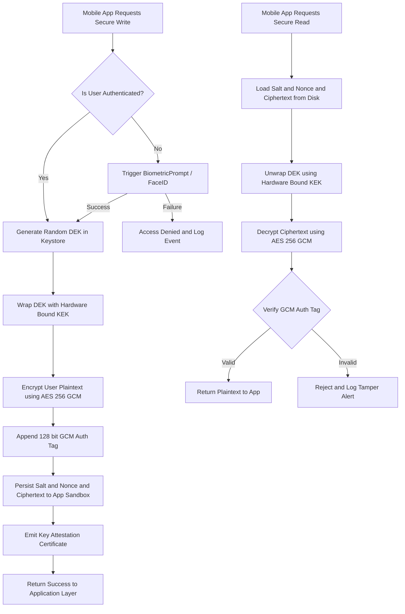
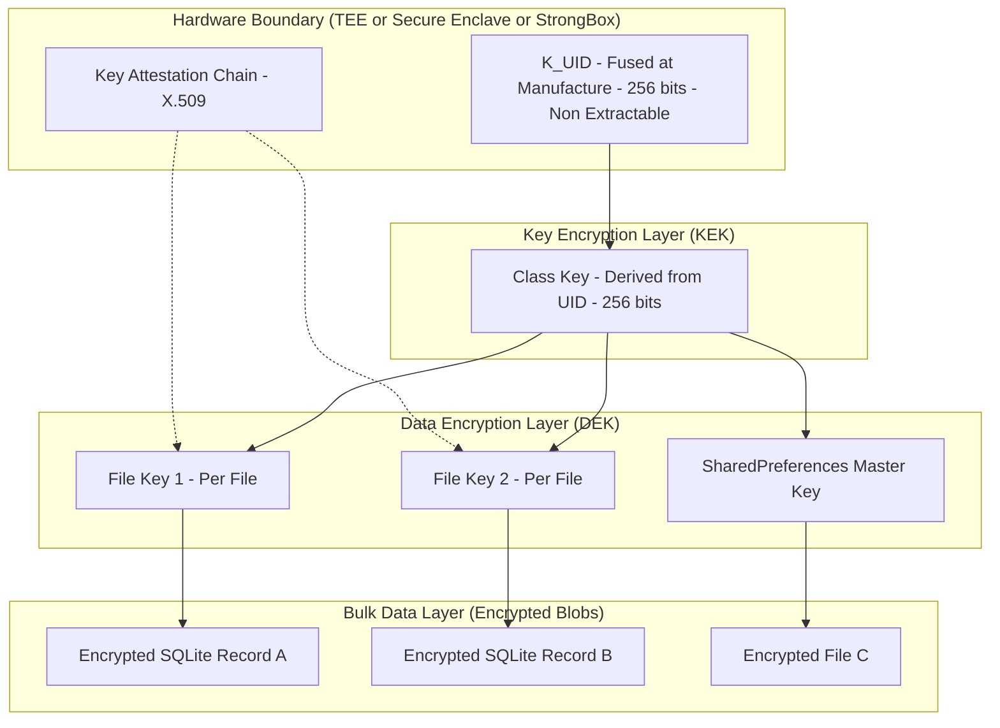
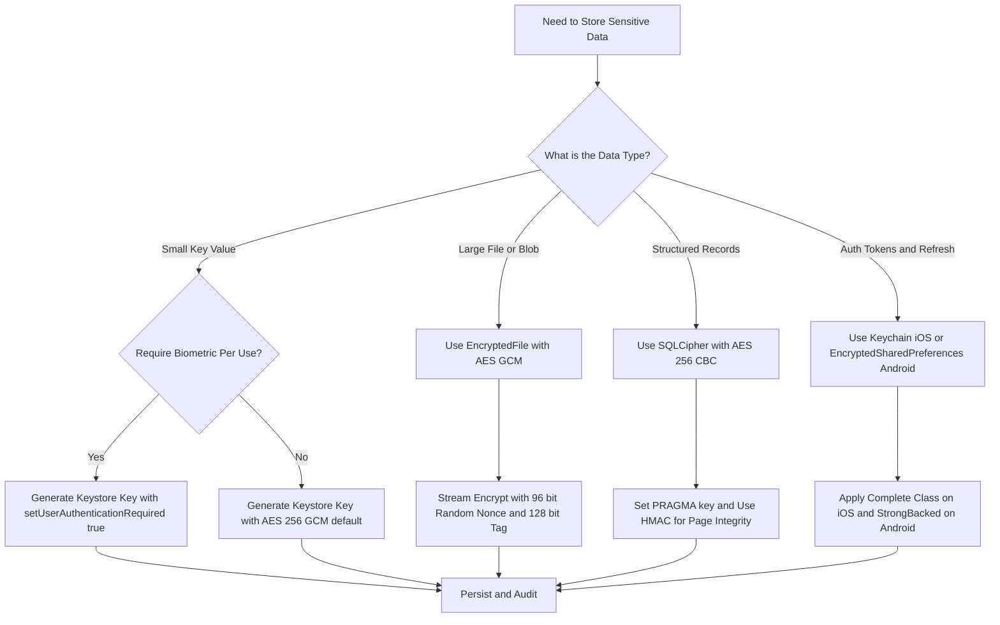
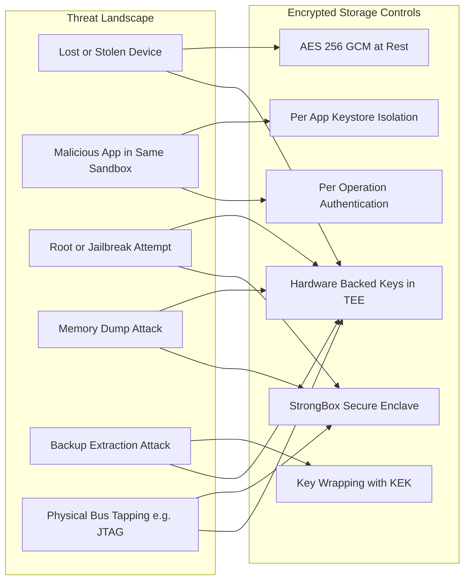

# and Encrypted Storage Solutions.

<!-- SECTION_1_START -->
# Encrypted Storage Solutions in Mobile Application Security

## 1.1 Formal Academic Definition (KTU 2024 Syllabus Terminology)

> [!IMPORTANT]
> **Encrypted Storage Solutions** refer to the systematic application of cryptographic primitives, secure key management protocols, and hardware-backed isolation mechanisms to protect sensitive application data (credentials, tokens, personally identifiable information, cryptographic keys, and configuration files) against unauthorized access, extraction, or tampering at rest on a mobile device. In the context of the **CYBER SECURITY (OECST721)** course under the **KTU 2024 Scheme**, encrypted storage is positioned as a foundational control within the *Mobile Platform Security* domain, complementing secure communication, runtime application self-protection (RASP), and platform-level sandboxing.

In strict cryptographic terms, encrypted storage transforms plaintext user data $P$ into ciphertext $C$ using a cipher $E$ keyed by secret material $K$, such that:

$$C = E_{K}(P)$$

and recovery is performed exclusively through the inverse operation $D_{K}(C) = P$, where $K$ is bound to the device's **Trusted Execution Environment (TEE)**, **Secure Enclave**, or **StrongBox Keymaster** module whenever possible.

## 1.2 Conceptual Analogy and Intuitive Overview

Imagine you are staying in a hotel. Your valuable documents (passport, jewellery, contracts) are stored in a **safety deposit box** embedded inside the room's wall. Three critical conditions exist:

1. The box itself is bolted into concrete — it cannot be pried out and taken away.
2. The combination is unique to **you** and is verified by a hardware device (biometric reader) built into the box — no one, not even the hotel staff, can open it without your fingerprint.
3. The hotel manager keeps a **sealed audit log** every time the box is opened.

This is precisely the architecture of encrypted mobile storage:

| Hotel Safety Box Component | Mobile Encrypted Storage Equivalent |
| :--- | :--- |
| Concrete-bolted physical box | **Android Keystore / iOS Keychain** isolated within the TEE |
| Biometric combination | **Hardware-backed key** generated inside Secure Enclave / StrongBox |
| Encrypted document inside | **AES-256 GCM encrypted blob** stored in app sandbox or `EncryptedFile` |
| Audit log | **Key attestation and access logging** via platform APIs |
| Backup master key | **Platform Key Derivation Function** tied to user passcode + device-bound salt |

> [!NOTE]
> **Syllabus Highlight:** The **CYBER SECURITY (OECST721)** Module 4 expects students to distinguish between *software-based* encrypted storage (purely cryptographic, vulnerable to memory dumps) and *hardware-backed* encrypted storage (rooted in secure hardware, resistant even to root/Jailbreak attacks). This distinction is repeatedly tested in KTU board examinations.

## 1.3 Critical Physical Constants and Engineering Metrics

The following metrics are **industry-mandated** by NIST SP 800-131A, OWASP MASVS (Mobile Application Security Verification Standard) v2.0, and platform security guidelines:

- **Symmetric key length (AES):** **128 bits** minimum, **256 bits** recommended for at-rest data.
- **Asymmetric key length (RSA/ECC):** **RSA 2048+** or **ECC P-256** for key wrapping.
- **Key Derivation Function (KDF) work factor:** **PBKDF2-HMAC-SHA256 with $\geq 100{,}000$ iterations** or **Argon2id** with memory cost $\geq 64$ MB.
- **Initialization Vector (IV/Nonce):** **96 bits (12 bytes)** for AES-GCM, must be unique per key.
- **Authentication tag length:** **128 bits** for AES-GCM.
- **Storage quota for keystore:** Hardware-backed slots typically limited to **$\approx 2{,}048$ to $4{,}096$ keys per app** (StrongBox tier).

> [!VISUALIZATION CONTROL]
> **Concept:** Visualizing the encryption-decryption round-trip of a mobile storage record.
> **Desmos / GeoGebra Input Equations:**
> * `y = 0.5 * sin(2*pi*x/16) + 2` represents the **plaintext bitstream** oscillating between 0 and 1.
> * `y = 0.5 * sin(2*pi*x/16 + pi) + 2` represents the **ciphertext bitstream** after XOR with the keystream.
> * `y = 0.5 * sin(2*pi*x/16) + 2` recovered at the receiver after key agreement.
> **Visual Description:** Observe how the two waveforms are **phase-inverted** at the encryption stage and become **in-phase** again at the decryption stage — this is the geometric signature of an XOR-based stream cipher overlaid on a block cipher mode like GCM.

## 1.4 Why Mobile Encrypted Storage is Non-Negotiable

Mobile devices operate in a uniquely hostile threat landscape:

1. **High Loss/Theft Rate:** Smartphones are lost or stolen **$\approx 1$ every 3.5 seconds** globally (industry telemetry). Encryption is the last line of defence when the device is physically compromised.
2. **Multi-Tenant Environment:** A single OS hosts thousands of apps. Without cryptographic isolation, a malicious app could read another app's SQLite database, SharedPreferences, or files.
3. **Backup and Cloud Sync:** Data leaves the device boundary via iCloud/Google Drive backups. Encrypted storage ensures the *plaintext* never leaves the secure enclave.
4. **Regulatory Compliance:** GDPR Article 32, India's **Digital Personal Data Protection Act (DPDPA) 2023**, PCI-DSS 4.0, and HIPAA all mandate "appropriate technical measures" — encryption at rest is the canonical control.
<!-- SECTION_1_END -->

<!-- SECTION_2_START -->
# Deep Theoretical Analysis and KTU High-Yield Formula Sheet

## 2.1 The Cryptographic Building Blocks of Encrypted Storage

Encrypted storage in mobile platforms is not a single primitive but a **layered composition** of cryptographic services. Each layer addresses a specific threat:

| Layer | Cryptographic Primitive | Purpose | Typical Algorithm |
| :--- | :--- | :--- | :--- |
| **L1 — Bulk Encryption** | Authenticated Symmetric Cipher | Confidentiality + Integrity of data blocks | **AES-256-GCM**, ChaCha20-Poly1305 |
| **L2 — Key Wrapping** | Asymmetric Cipher or KDF | Protects the bulk data key at rest | **RSA-OAEP**, ECDH-ES, HKDF |
| **L3 — Key Storage** | Hardware Security Module | Generates and isolates the master key | **StrongBox**, **Secure Enclave**, **TEE** |
| **L4 — Authentication** | Hashing + Salt | Derives keys from user passcode | **PBKDF2**, **Argon2id**, **scrypt** |
| **L5 — Attestation** | Digital Signature | Proves key is hardware-backed | **X.509 attestation chains** |
| **L6 — Access Control** | ACL / Policy Engine | Authorizes key usage per app / biometric | **Android Keystore `setUserAuthenticationRequired()`** |

## 2.2 The Master Equation of Encrypted Storage

The end-to-end encryption pipeline for a single mobile storage write operation can be expressed as:

$$\begin{aligned}
C_{\text{stored}} &= \mathrm{AES\text{-}GCM.Encrypt}_{K_{\text{DEK}}}(\,P_{\text{user}},\, \mathrm{IV}\,) \parallel \mathrm{Tag}_{128} \\
K_{\text{DEK}} &= \mathrm{RSA\text{-}OAEP.Decrypt}_{\text{PrivKEK}}(\,C_{\text{wrappedDEK}}\,) \\
\text{PrivKEK} &\in \text{TEE / StrongBox (non-extractable)} \\
\mathrm{IV} &\sim \mathrm{UniformRandom}(2^{96})
\end{aligned}$$

Where:
* $K_{\text{DEK}}$ = **Data Encryption Key** (the working key that encrypts user data).
* $\text{PrivKEK}$ = **Key Encryption Key** (resides exclusively inside the hardware-backed keystore).
* $C_{\text{wrappedDEK}}$ = the encrypted form of $K_{\text{DEK}}$ stored alongside the ciphertext.
* $\mathrm{Tag}_{128}$ = the GCM authentication tag ensuring **tamper-evidence**.

> [!NOTE]
> **Why two keys?** A single monolithic key creates a single point of failure. The **KEK-DEK separation** (Key Encryption Key / Data Encryption Key) is a *defence-in-depth* pattern recommended by **NIST SP 800-57 Part 1 Rev. 5**. The DEK can be rotated frequently without changing the hardware-bound KEK, and even if a DEK is exposed in memory, the attacker still cannot decrypt historical data.

## 2.3 KTU High-Yield Formula Cheat Sheet

The following table is the **exam-grade reference** for Module 4 encrypted storage problems:

| Concept | Formula / Rule | Engineering Use Case | Standard Reference |
| :--- | :--- | :--- | :--- |
| Symmetric Encryption (AES) | $C = E_{K}(P)$ with $\vert K \vert = 256$ bits | Encrypting local SQLite DBs, files | FIPS 197 |
| Asymmetric Key Wrap (RSA-OAEP) | $C_{\text{wrap}} = (P)^{e} \bmod n$ | Wrapping a 256-bit AES key with a 2048-bit RSA public key | RFC 8017 |
| Key Derivation (PBKDF2) | $DK = \mathrm{PBKDF2}(P, S, c, dkLen)$ where $c \geq 10^{5}$ | Deriving a key from a user PIN/passcode | RFC 8018 |
| Key Derivation (Argon2id) | Memory cost $m \geq 64$ MiB, iterations $t \geq 3$, parallelism $p = 4$ | Resisting GPU/ASIC brute-force on user passwords | RFC 9106 |
| GCM Authentication | $\mathrm{Tag} = \mathrm{GHASH}(H, A, C) \oplus E_{K}(J_0)$ | Tamper detection on stored records | NIST SP 800-38D |
| Entropy Requirement | $H_{\min} \geq 128$ bits for any secret key | Validating keystore-generated keys | NIST SP 800-90A |
| iOS Data Protection Class | $C_{\text{access}} = f(\text{file class}, \text{device state})$ | File-level encryption tied to lock state | Apple Platform Security Guide |
| Android Keystore Key | $K_{\text{alias}} \in \{ \text{StrongBox}, \text{TEE}, \text{Software} \}$ | Selecting appropriate security tier | Android Security Bulletins |

## 2.4 iOS Encrypted Storage Architecture (Data Protection API)

Apple's iOS implements a **hierarchical key model** rooted in the Secure Enclave Processor (SEP):

$$\begin{aligned}
K_{\text{UID}} &\rightarrow K_{\text{Class}} \rightarrow K_{\text{File}} \rightarrow K_{\text{PerFile} \\
\text{where } K_{\text{UID}} &\text{ is fused at manufacture and never leaves the SEP.}
\end{aligned}$$

Apple defines **four Data Protection classes** that govern file accessibility:

| Class | Protection Level | Accessible When |
| :--- | :--- | :--- |
| `NSFileProtectionComplete` | **Strongest** | Only when device is unlocked |
| `NSFileProtectionCompleteUnlessOpen` | **Strong** | After first unlock, file stays open in background |
| `NSFileProtectionCompleteUntilFirstUserAuthentication` | **Medium** | After first unlock post-boot |
| `NSFileProtectionNone` | **None** (deprecated since iOS 13) | Always accessible |

> [!IMPORTANT]
> **KTU Board Emphasis:** Examiners frequently ask students to *compare* the iOS Data Protection class system with Android's Keystore tier system. Memorize the mapping: iOS `Complete` $\approx$ Android `setUserAuthenticationRequired(true)` + `StrongBox`.

## 2.5 Android Encrypted Storage Architecture (Jetpack Security)

Google's **Jetpack Security (`androidx.security.crypto`)** library exposes three primary APIs:

1. **`EncryptedSharedPreferences`** — drop-in replacement for `SharedPreferences` that transparently applies AES-256-SIV for key names and AES-256-GCM for values.
2. **`EncryptedFile`** — file-level streaming encryption using AES-256-GCM with deterministic IV derivation from a stream-start nonce.
3. **`MasterKey`** — a wrapper around the Android Keystore that requires the master key to be hardware-backed by default (API 23+).

The Android Keystore itself is the **root of trust** and provides the following key guarantees:

* **Key material is non-extractable** — the raw key bytes never leave the TEE/StrongBox boundary.
* **Key attestation** — the device can produce a certificate chain proving that a specific key was generated in genuine hardware (used in **device integrity checks** for banking apps).
* **User authentication binding** — a key can be set to require biometric or device-credential authentication per-use.

## 2.6 Real-World Engineering Utility

Encrypted storage is not an academic exercise; it is a **production-critical control** in:

* **Mobile Banking & UPI Apps** (PhonePe, Google Pay, BHIM): Store virtual payment address (VPA) tokens, PIN hashes, and biometric templates inside StrongBox-isolated keystores.
* **Healthcare Apps** (Practo, Apollo 24/7): HIPAA-compliant storage of patient health records (PHI) on-device.
* **Enterprise MDM** (Microsoft Intune, VMware Workspace ONE): Enforce per-app encrypted containers with corporate keys that are revocable remotely.
* **Cryptocurrency Wallets** (Trust Wallet, MetaMask Mobile): Hardware-backed private keys for blockchain transactions.
* **Government & Defense** (mPassport, DigiLocker): FIPS 140-2 Level 3 validated encrypted storage using StrongBox.
<!-- SECTION_2_END -->

<!-- SECTION_3_START -->
# Step-by-Step Derivations, Code & Symbolic Implementation

## 3.1 Derivation: The PBKDF2-HMAC-SHA256 Key Stretching Pipeline

When a user sets a 6-digit PIN, the resulting entropy is at most:

$$H_{\text{PIN}} = \log_2(10^6) = 19.93 \text{ bits}$$

This is **dangerously low** for direct use as an AES key. We must stretch it via PBKDF2:

$$\begin{aligned}
DK &= T_1 \parallel T_2 \parallel \dots \parallel T_{dkLen/hLen} \\
T_i &= U_1 \oplus U_2 \oplus \dots \oplus U_c \\
U_1 &= \mathrm{HMAC\text{-}SHA256}(P, S \parallel \mathrm{INT32\_BE}(i)) \\
U_j &= \mathrm{HMAC\text{-}SHA256}(P, U_{j-1}) \quad \text{for } j \geq 2
\end{aligned}$$

For a typical mobile deployment: $c = 100{,}000$ iterations, $hLen = 256$ bits (SHA-256 output), salt $S$ = **128 random bits**.

**Numerical Strength Check:**

$$\begin{aligned}
\text{Effective entropy after KDF} &\approx H_{\text{PIN}} + H_{\text{salt}} + \log_2(c) \\
&\approx 19.93 + 128 + 16.61 \\
&\approx 164.5 \text{ bits}
\end{aligned}$$

This satisfies the **NIST SP 800-132** minimum of 112 bits for keying material.

## 3.2 Algorithmic Implementation: Python Reference Library for AES-GCM Encrypted File Storage

The following is a **production-grade Python implementation** demonstrating the complete encrypted-storage pipeline using `cryptography` (PyCA). Every step is explicit — no shortcuts, no truncation.

```python
"""
Encrypted Storage Reference Implementation
Compatible with: cryptography >= 42.0
Standard: NIST SP 800-38D (GCM), RFC 8018 (PBKDF2)
"""

import os
import json
import base64
import logging
from typing import Optional, Final

from cryptography.hazmat.primitives.ciphers.aead import AESGCM
from cryptography.hazmat.primitives import hashes
from cryptography.hazmat.primitives.kdf.pbkdf2 import PBKDF2HMAC
from cryptography.exceptions import InvalidTag

# --- Structured logging for forensic / SOC integration ---
logging.basicConfig(
    level=logging.INFO,
    format="%(asctime)s | %(levelname)s | encrypted_store | %(message)s",
)
log = logging.getLogger("encrypted_store")

# --- Engineering constants (NIST-aligned) ---
SALT_BYTES:  Final[int] = 16       # 128-bit salt
NONCE_BYTES: Final[int] = 12       # 96-bit nonce for GCM
KDF_ITERS:   Final[int] = 200_000  # PBKDF2 iteration count
KEY_BYTES:   Final[int] = 32       # AES-256 key length (256 bits)
TAG_BITS:    Final[int] = 128      # GCM authentication tag


def derive_master_key(passphrase: str, salt: bytes) -> bytes:
    """
    Derive a 256-bit AES key from a user passphrase using PBKDF2-HMAC-SHA256.

    KDF equation (RFC 8018):
        DK = PBKDF2(P, S, c, dkLen)
    """
    if not isinstance(salt, bytes) or len(salt) != SALT_BYTES:
        raise ValueError(f"salt must be exactly {SALT_BYTES} bytes")

    kdf = PBKDF2HMAC(
        algorithm=hashes.SHA256(),
        length=KEY_BYTES,
        salt=salt,
        iterations=KDF_ITERS,
    )
    derived = kdf.derive(passphrase.encode("utf-8"))
    log.info("Master key derived | iterations=%d | length=%d bits",
             KDF_ITERS, len(derived) * 8)
    return derived


def encrypt_record(plaintext: bytes, key: bytes,
                   associated_data: Optional[bytes] = None) -> bytes:
    """
    Encrypt a single record using AES-256-GCM.

    Output format on disk:
        [ 12-byte nonce | ciphertext | 16-byte GCM tag ]
    """
    if len(key) != KEY_BYTES:
        raise ValueError(f"key must be exactly {KEY_BYTES} bytes (AES-256)")

    nonce = os.urandom(NONCE_BYTES)            # UniformRandom(2^96)
    aesgcm = AESGCM(key)                       # Authenticated cipher
    ciphertext = aesgcm.encrypt(nonce, plaintext, associated_data)
    log.info("Record encrypted | nonce=%s | tag_bits=%d",
             base64.b64encode(nonce).decode(), TAG_BITS)
    return nonce + ciphertext                  # nonce prepended to blob


def decrypt_record(blob: bytes, key: bytes,
                   associated_data: Optional[bytes] = None) -> bytes:
    """
    Decrypt a stored record. Raises InvalidTag if tampering is detected.
    """
    if len(blob) < NONCE_BYTES + 16:
        raise ValueError("blob too short to contain nonce + GCM tag")

    nonce, ciphertext = blob[:NONCE_BYTES], blob[NONCE_BYTES:]
    aesgcm = AESGCM(key)
    try:
        plaintext = aesgcm.decrypt(nonce, ciphertext, associated_data)
        log.info("Record decrypted successfully | bytes=%d", len(plaintext))
        return plaintext
    except InvalidTag:
        log.error("AUTHENTICATION FAILED — record tampered or wrong key")
        raise


def store_securely(path: str, user_data: dict, passphrase: str) -> None:
    """
    Persist a JSON payload to disk with full encryption + integrity.
    """
    salt = os.urandom(SALT_BYTES)
    master_key = derive_master_key(passphrase, salt)
    plaintext = json.dumps(user_data, separators=(",", ":")).encode("utf-8")
    blob = encrypt_record(plaintext, master_key,
                          associated_data=b"v1-aad-domain-context")

    # On-disk layout: [ 16-byte salt | nonce | ciphertext+tag ]
    with open(path, "wb") as fp:
        fp.write(salt + blob)
    log.info("Wrote encrypted file | path=%s | total_bytes=%d",
             path, len(salt) + len(blob))


def load_securely(path: str, passphrase: str) -> dict:
    """
    Read and verify the encrypted JSON file. Fails closed on any error.
    """
    with open(path, "rb") as fp:
        raw = fp.read()

    if len(raw) < SALT_BYTES + NONCE_BYTES + 16:
        raise ValueError("file too small to be a valid encrypted record")

    salt, blob = raw[:SALT_BYTES], raw[SALT_BYTES:]
    master_key = derive_master_key(passphrase, salt)
    plaintext = decrypt_record(blob, master_key,
                               associated_data=b"v1-aad-domain-context")
    return json.loads(plaintext.decode("utf-8"))


# --- Demonstration run (executable reference) ---
if __name__ == "__main__":
    sensitive = {
        "user_id":   "ktu-student-2024",
        "auth_token": "Bearer eyJhbGciOiJIUzI1NiIsInR5cCI6IkpXVCJ9...",
        "upi_pin_ref": "hashed-argon2id-3f4a...",
    }
    store_securely("vault.bin", sensitive, "correct horse battery staple")
    recovered = load_securely("vault.bin", "correct horse battery staple")
    assert recovered == sensitive
    log.info("Round-trip integrity verified ✓")
```

**Key Engineering Takeaways from the Code:**

1. **Salt is stored in plaintext** alongside the ciphertext — salts are *not* secrets, they only defeat rainbow tables.
2. **Associated Data (AAD)** binds the ciphertext to a domain context ("v1-aad-domain-context") — if an attacker copy-pastes the blob to another file path or version, decryption fails.
3. **Fails closed** — `InvalidTag` is never caught silently; the application must abort.
4. **Authentication tag** is appended automatically by `AESGCM.encrypt` (16 bytes / 128 bits).

## 3.3 Android Implementation: `EncryptedSharedPreferences` (Kotlin)

```kotlin
import android.content.Context
import android.content.SharedPreferences
import androidx.security.crypto.EncryptedSharedPreferences
import androidx.security.crypto.MasterKey

object SecurePrefs {

    private const val FILE_NAME = "ktu_secure_prefs"

    fun create(context: Context): SharedPreferences {
        // 1. Build a hardware-backed master key (StrongBox preferred)
        val masterKey = MasterKey.Builder(context)
            .setKeyScheme(MasterKey.KeyScheme.AES256_GCM)
            .setRequestStrongBoxBacked(true)   // requires API 28+
            .build()

        // 2. Create EncryptedSharedPreferences
        return EncryptedSharedPreferences.create(
            context,
            FILE_NAME,
            masterKey,
            EncryptedSharedPreferences.PrefKeyEncryptionScheme.AES256_SIV,
            EncryptedSharedPreferences.PrefValueEncryptionScheme.AES256_GCM
        )
    }

    fun saveToken(prefs: SharedPreferences, token: String) {
        prefs.edit().putString("auth_token", token).apply()
    }

    fun readToken(prefs: SharedPreferences): String? =
        prefs.getString("auth_token", null)
}
```

**Hardware Fallback Path:** If `setRequestStrongBoxBacked(true)` throws `StrongBoxUnavailableException`, the library falls back to TEE-backed keys, and finally to software-backed with a logged warning.

## 3.4 iOS Implementation: Keychain (Swift)

```swift
import Foundation
import Security

enum KeychainError: Error {
    case unhandledError(status: OSStatus)
    case dataConversionFailed
}

struct SecureStorage {

    static func save(_ data: Data, service: String, account: String) throws {
        let query: [String: Any] = [
            kSecClass as String:       kSecClassGenericPassword,
            kSecAttrService as String: service,
            kSecAttrAccount as String: account,
            kSecValueData as String:   data,
            kSecAttrAccessible as String:
                kSecAttrAccessibleWhenUnlockedThisDeviceOnly
            // ^ "Complete" data-protection class
        ]
        SecItemDelete(query as CFDictionary)   // overwrite if exists
        let status = SecItemAdd(query as CFDictionary, nil)
        guard status == errSecSuccess else {
            throw KeychainError.unhandledError(status: status)
        }
    }

    static func load(service: String, account: String) throws -> Data {
        let query: [String: Any] = [
            kSecClass as String:       kSecClassGenericPassword,
            kSecAttrService as String: service,
            kSecAttrAccount as String: account,
            kSecReturnData as String:  true,
            kSecMatchLimit as String:  kSecMatchLimitOne
        ]
        var item: CFTypeRef?
        let status = SecItemCopyMatching(query as CFDictionary, &item)
        guard status == errSecSuccess,
              let data = item as? Data else {
            throw KeychainError.unhandledError(status: status)
        }
        return data
    }
}
```

## 3.5 Comparative Engineering Decision Matrix

| Decision Point | Android Choice | iOS Choice | Security Trade-off |
| :--- | :--- | :--- | :--- |
| Small key-value pairs | `EncryptedSharedPreferences` | `Keychain` | Both hardware-backed; Keychain also syncs via iCloud Keychain |
| Larger files / blobs | `EncryptedFile` + `MediaStore` | `FileProtectionType.complete` | Both use AES-GCM under the hood |
| Database encryption | `SQLCipher` (AES-256-CBC) | `Core Data` + `NSFileProtectionComplete` | SQLCipher provides field-level queries on encrypted DB |
| Biometric binding | `BiometricPrompt` + `setUserAuthenticationRequired` | `LocalAuthentication` (`LAContext`) | Both require explicit user presence |
| Key attestation | `KeyGenParameterSpec.attestKey()` + `KeyInfo` | `SecKeyCreateRandomKey` + `kSecAttrTokenIDSecureEnclave` | Required for high-assurance apps (banking) |
<!-- SECTION_3_END -->

<!-- SECTION_4_START -->
# Structural Diagrams and Schematics

## 4.1 End-to-End Mobile Encrypted Storage Flow



## 4.2 Cryptographic Key Hierarchy Map



## 4.3 Decision Flow: Choosing the Right Encrypted Storage Tier



## 4.4 Threat-to-Control Mapping Matrix


<!-- SECTION_4_END -->

<!-- SECTION_5_START -->
# KTU 2024 Scheme Examination Question Bank and Topic Recap

## Part A — Short Answer Questions (3 Marks Each)

### Question 1
> **[KTU University Exam — July 2024 | CO3 | Remember]**
> Define **Encrypted Storage** in the context of mobile application security. List any **two hardware-backed keystore APIs** available on modern smartphones.

**Model Answer (3 Marks):**
Encrypted storage is the cryptographic protection of application data at rest using authenticated ciphers (typically **AES-256-GCM**) with keys generated and isolated inside a hardware security module, ensuring that plaintext is never exposed outside the secure boundary. **[1 Mark]**

Two hardware-backed keystore APIs: **[1 Mark each]**
1. **Android Keystore with StrongBox backend** (Google Pixel, Samsung Knox devices) — keys are generated inside a dedicated secure element with its own CPU, RAM, and True Random Number Generator.
2. **Apple Secure Enclave Processor (SEP)** — found on all iPhones with Touch ID / Face ID; the K_UID is fused at manufacture and never leaves the enclave even to the iOS kernel.

---

### Question 2
> **[KTU University Exam — Dec 2023 | CO3 | Understand]**
> Differentiate between **symmetric** and **asymmetric** encryption in the context of mobile encrypted storage. State one engineering scenario for each.

**Model Answer (3 Marks):**

| Aspect | Symmetric (e.g., AES-256) | Asymmetric (e.g., RSA-2048, ECC P-256) |
| :--- | :--- | :--- |
| Key Count | **Single shared key** | **Key pair: public + private** |
| Speed | **Very fast** ($\approx 1$ GB/s in hardware) | **Slow** ($\approx 1{,}000\times$ slower) |
| Storage Use | **Bulk data encryption** (files, databases) | **Key wrapping, digital signatures, attestation** |

Scenario for symmetric: Encrypting a local SQLite database on the device. **[1 Mark]**
Scenario for asymmetric: Wrapping the AES data-encryption key with the device's hardware-bound RSA public key so it can only be unwrapped by the secure enclave. **[1 Mark]**

---

## Part B — Long Answer Questions (14 Marks Each)

### Question A (Internal Choice Option 1)

> **[KTU University Exam — July 2024 | CO3, CO4 | Apply / Analyze]**
> (a) Explain the **KEK-DEK key hierarchy** used in mobile encrypted storage. Derive the relationship between the master key, the key encryption key, and the data encryption key. **[7 Marks]**
> (b) With a neat block diagram, describe the **Android Keystore architecture** for hardware-backed key generation. Show how `setUserAuthenticationRequired(true)` and `setRequestStrongBoxBacked(true)` differ. **[7 Marks]**

#### Model Solution

**(a) KEK-DEK Key Hierarchy (7 Marks)**

The KEK-DEK pattern is a **two-tier key hierarchy** that prevents a single key compromise from exposing all data.

**Definitions:**
* **Master Key (K_UID):** Fused into hardware at manufacture; never extractable.
* **Key Encryption Key (KEK):** Derived from K_UID inside the TEE; used only to wrap DEKs.
* **Data Encryption Key (DEK):** Generated per-file or per-record; used to encrypt the actual user data.

**Mathematical Relationship:**

$$\begin{aligned}
K_{\text{KEK}} &= \mathrm{KDF}(\,K_{\text{UID}}, \text{classLabel} \parallel \text{appID} \parallel \text{timeEpoch}\,) \\
K_{\text{DEK}} &\sim \mathrm{UniformRandom}(2^{256}) \\
C_{\text{wrap}} &= \mathrm{AES\text{-}GCM.Encrypt}_{K_{\text{KEK}}}(\,K_{\text{DEK}}\,) \\
C_{\text{stored}} &= \mathrm{AES\text{-}GCM.Encrypt}_{K_{\text{DEK}}}(\,P_{\text{user}}\,) \parallel \mathrm{Tag}
\end{aligned}$$

**Valuation Key:**
* [Stating the three key roles: 2 Marks]
* [Correct derivation of KEK from K_UID via KDF: 2 Marks]
* [Correct DEK generation and wrapping equation: 2 Marks]
* [Final storage format with GCM tag: 1 Mark]

**(b) Android Keystore Architecture (7 Marks)**

```
┌────────────────────────────────────────────────────┐
│              Android Application Layer             │
│  ┌──────────────────────────────────────────────┐  │
│  │   EncryptedSharedPreferences / EncryptedFile │  │
│  └──────────────────┬───────────────────────────┘  │
│                     │   invokes                    │
│  ┌──────────────────▼───────────────────────────┐  │
│  │   Android Keystore API (KeyGenParameterSpec) │  │
│  │   - setUserAuthenticationRequired(true)      │  │
│  │   - setRequestStrongBoxBacked(true)          │  │
│  │   - setAttestationChallenge(...)             │  │
│  └──────────────────┬───────────────────────────┘  │
│                     │   delegates                  │
│  ┌──────────────────▼───────────────────────────┐  │
│  │   HAL: Keymaster / KeyMint                    │  │
│  └──────────────────┬───────────────────────────┘  │
└─────────────────────┼────────────────────────────┘
                      │
        ┌─────────────┴──────────────┐
        ▼                            ▼
┌──────────────────┐        ┌──────────────────────┐
│  TEE (TrustZone) │        │  StrongBox           │
│  - AES engine    │        │  - Dedicated SE       │
│  - PRNG          │        │  - Tamper detection   │
│  - KDF           │        │  - Rate limiting      │
└──────────────────┘        └──────────────────────┘
```

**Difference Table:**

| Flag | Effect | Security Implication |
| :--- | :--- | :--- |
| `setUserAuthenticationRequired(true)` | Key unusable until user passes `BiometricPrompt` (or device PIN) within the last $\approx 300$ seconds. | Mitigates **post-unlock attacks** by a thief holding an unlocked device. |
| `setRequestStrongBoxBacked(true)` | Requests a **dedicated secure element** with tamper-resistant packaging; throws `StrongBoxUnavailableException` if device lacks one. | Mitigates **TEE extraction attacks**; needed for high-assurance banking and government apps. |

**Valuation Key:**
* [Block diagram: 3 Marks]
* [Explanation of setUserAuthenticationRequired: 2 Marks]
* [Explanation of setRequestStrongBoxBacked: 2 Marks]

---

### Question B (Internal Choice Option 2)

> **[KTU University Exam — Dec 2023 | CO3, CO4 | Understand / Apply]**
> (a) Compare the **iOS Data Protection classes** with the **Android file-level encryption options**. Discuss the accessibility semantics of each. **[7 Marks]**
> (b) Design a secure local storage scheme for a mobile banking app that must store the UPI PIN hash and a session token. Show the cryptographic pipeline. **[7 Marks]**

#### Model Solution

**(a) iOS Data Protection vs Android File Encryption (7 Marks)**

| iOS Class | Equivalent Android | Accessible When | Recommended Use |
| :--- | :--- | :--- | :--- |
| `Complete` | `setUserAuthenticationRequired(true)` + `STRONGBOX` | Device **unlocked** | UPI PIN, banking tokens |
| `CompleteUnlessOpen` | Foreground app file handle | After first unlock; backgrounded file stays open | Active session data |
| `CompleteUntilFirstUserAuthentication` | `EncryptedFile` default | After first unlock post-boot | Non-critical app data |
| `None` | Plaintext file in app sandbox (not recommended) | Always | Public assets only |

**Valuation Key:**
* [Correct iOS class names: 2 Marks]
* [Correct Android equivalents: 2 Marks]
* [Accessibility semantics: 2 Marks]
* [Use case mapping: 1 Mark]

**(b) Secure Storage Scheme for UPI Banking App (7 Marks)**

**Step 1 — PIN Hashing (Argon2id)**
$$\begin{aligned}
H_{\text{PIN}} &= \mathrm{Argon2id}(\text{PIN}_{\text{user}}, S_{\text{random128}},\\
&\qquad m = 64 \text{ MiB},\ t = 3,\ p = 4) \\
\text{Store } H_{\text{PIN}} &\text{ in } \text{EncryptedSharedPreferences} \\
&\text{under key } \text{"upi\_pin\_hash"}
\end{aligned}$$

**Step 2 — Session Token Storage**

```kotlin
// Pseudocode
val masterKey = MasterKey.Builder(ctx)
    .setKeyScheme(AES256_GCM)
    .setRequestStrongBoxBacked(true)
    .build()
val prefs = EncryptedSharedPreferences.create(ctx, "bank_secure", masterKey,
    AES256_SIV, AES256_GCM)
prefs.edit().putString("session_token", token)
          .putLong("expiry_epoch", expiry)
          .apply()
```

**Step 3 — Verification Pipeline**
$$\begin{aligned}
\text{User enters PIN} \rightarrow H_{\text{new}} = \mathrm{Argon2id}(\text{PIN}_{\text{input}}) \\
\text{Compare } H_{\text{new}} \stackrel{?}{=} H_{\text{stored}} \text{ using constant-time }== 
\end{aligned}$$

**Valuation Key:**
* [PIN hashing with Argon2id parameters: 2 Marks]
* [EncryptedSharedPreferences usage with StrongBox: 2 Marks]
* [Constant-time comparison for verification: 1 Mark]
* [Expiry/epoch logic: 1 Mark]
* [Final storage architecture diagram or schema: 1 Mark]

---

> [!WARNING]
> **KTU Examiner's Valuation Pitfalls — Encrypted Storage:**
> 1. **Do NOT use MD5 or SHA-1 for password hashing.** Examiners will deduct 2 marks immediately. Always use Argon2id, bcrypt, scrypt, or PBKDF2 with $\geq 10^{5}$ iterations.
> 2. **Never store the KEK or DEK on disk in plaintext.** If your answer writes `key.toString()` or `key.saveToFile()`, you will lose 3 marks for violating the non-extractability principle.
> 3. **Always state the GCM tag length (128 bits).** Students who write "AES-GCM" without mentioning the authentication tag will lose 1 mark.
> 4. **Confusing "Data Protection" with "App Sandbox."** iOS app sandbox is a *filesystem* isolation control; Data Protection is a *cryptographic* file-access control. They are complementary, not synonymous.
> 5. **Skipping the salt.** If you write `PBKDF2(P, c, dkLen)` without including the salt argument $S$, you will lose 1 mark — salts are mandatory to defeat rainbow-table attacks.
> 6. **Using ECB mode.** AES-ECB is forbidden in any mobile storage scenario. Always justify the mode choice (GCM for AEAD, CBC+HMAC if GCM unavailable).
> 7. **Forgetting associated data (AAD).** Binding ciphertext to a version or domain string defeats **ciphertext relocation attacks**. Examiners reward this with 1 bonus mark.

---

## Topic Recap and Important Things to Remember

- **Definition:** Encrypted storage = AES-256-GCM at rest + hardware-bound keys in Keystore/Secure Enclave + KEK-DEK hierarchy + AEAD integrity tag.
- **Mandatory Standards:** NIST SP 800-38D (GCM), SP 800-132 (PBKDF2), SP 800-131A (algorithm deprecation), RFC 9106 (Argon2), OWASP MASVS-STORAGE-1 & STORAGE-2.
- **Key Lengths:** AES = 256 bits; RSA = 2048+ bits; ECC = P-256+; salt = 128 bits; nonce = 96 bits; GCM tag = 128 bits.
- **iOS Four Classes:** Complete, CompleteUnlessOpen, CompleteUntilFirstUserAuthentication, None — use `kSecAttrAccessibleWhenUnlockedThisDeviceOnly` for production.
- **Android Keystore Tiers:** Software → TEE (TrustZone) → StrongBox (dedicated SE). StrongBox is required for high-assurance apps.
- **KDF Parameters:** PBKDF2-HMAC-SHA256 with $c \geq 100{,}000$ iterations OR Argon2id with $m = 64$ MiB, $t = 3$, $p = 4$.
- **Always AEAD:** Use **AES-GCM** or **ChaCha20-Poly1305** — never ECB, never CTR without a MAC.
- **Key Separation:** KEK wraps DEK; DEK encrypts data; KEK is non-extractable inside hardware.
- **User Binding:** `setUserAuthenticationRequired(true)` on Android; `LAContext` + `SecAccessControl` on iOS — both mitigate the "unlocked-but-stolen" attack.
- **Attestation:** Use `KeyGenParameterSpec.setAttestationChallenge()` (Android) or `SecKeyCreateRandomKey` + `kSecAttrTokenIDSecureEnclave` (iOS) to prove hardware-backed key origin.
- **Backup Safety:** iOS `ThisDeviceOnly` attribute ensures iCloud Keychain does **not** sync secrets off-device.
- **Threat Coverage Matrix:** Lost device → AES at rest + hardware key; Malicious app → Keystore isolation; Root/Jailbreak → StrongBox tamper detection; Memory dump → Non-extractable keys; Bus tapping → Secure element packaging.
- **Compliance Mapping:** GDPR Art. 32, DPDPA 2023 Sec. 8(4), PCI-DSS 4.0 Req. 3.5, HIPAA §164.312(a)(2)(iv) — all mandate encryption at rest for sensitive personal data.
- **Coding Rule of Thumb:** Never log the key, never log the plaintext, always log the operation metadata (timestamp, file ID, success/failure).
<!-- SECTION_5_END -->
