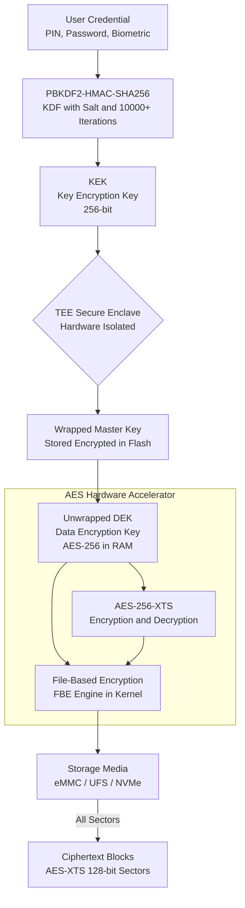
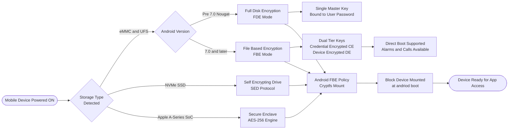
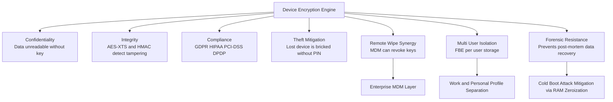

# Benefits of Device Encryption

<!-- SECTION_1_START -->

# Benefits of Device Encryption — Core Technical Definition & Intuitive Overview

## Formal Academic Definition (KTU 2024 Scheme Terminology)

**Device Encryption** is a cryptographic security mechanism that transforms all user data stored on a mobile device (smartphone, tablet, laptop) into an unreadable ciphertext format using mathematically rigorous symmetric-key algorithms, thereby rendering the data unintelligible to unauthorized parties who gain physical or logical access to the device storage media.

In the KTU Cyber Security (OECST721) syllabus context — specifically under **Module 4: Mobile App Security** — device encryption is positioned as a foundational **data-at-rest protection** control that complements transport-layer security (TLS) and application-layer authentication. The current industry standard is **AES (Advanced Encryption Standard)**, a block cipher standardized by **NIST** in **FIPS PUB 197**, operating on **128-bit blocks** with key sizes of **128, 192, or 256 bits**.

> [!IMPORTANT]
> **KTU Syllabus Highlight (Module 4 — Mobile App Security):** Device encryption is classified under *Platform-Level Security Controls*. It is the **first line of defense** in the *defense-in-depth* model for mobile endpoints and is mandated by frameworks such as **GDPR**, **HIPAA**, **PCI-DSS**, and **India's DPDP Act 2023**.

### Conceptual Analogy — The "Digital Safe Deposit Box"

Imagine your mobile phone is a **transparent glass box** in a public marketplace. Anyone walking by can see your photographs, banking OTPs, contacts, and notes. **Device encryption is the act of welding a thick, opaque steel vault around that box and fitting it with a combination lock**. Even if a thief physically steals the box (the phone), they cannot read the contents (your data) because the contents have been converted into **gibberish scrambled text**. Only someone with the correct **passphrase, PIN, or biometric key** can unlock the vault and reconstitute the original readable data.

### Key Cryptographic Constants and Standards

- **AES-128** → Block size: **128 bits** | Key size: **128 bits** | Rounds: **10**
- **AES-192** → Block size: **128 bits** | Key size: **192 bits** | Rounds: **12**
- **AES-256** → Block size: **128 bits** | Key size: **256 bits** | Rounds: **14**
- **PBKDF2** (Password-Based Key Derivation Function 2) iterations: typically **$\mathbf{10{,}000+}$**
- **Salt size:** at least **128 bits** of random data
- **Storage standards:** eMMC, UFS, NVMe (self-encrypting drives)

> [!NOTE]
> **Definition — Ciphertext:** Ciphertext is the scrambled, unreadable output produced by applying an encryption algorithm (e.g., AES) to plaintext using a secret cryptographic key. Without the key, recovering the original plaintext is computationally infeasible (brute-force requires approximately $\mathbf{2^{128}}$ operations for AES-128).

### Types of Device Encryption Architectures

| Architecture | Full Name | Used In | Granularity |
|---|---|---|---|
| **FDE** | Full Disk Encryption | Android (pre-7.0), BitLocker, FileVault | Entire storage volume |
| **FBE** | File-Based Encryption | Android 7.0+ (Nougat), iOS Data Protection | Per-file master keys |
| **SED** | Self-Encrypting Drive | Hardware-level SSDs, NVMe | Hardware controller |
| **Credential Encryption** | CE / DE keys | Android FBE (Credential Encrypted vs Device Encrypted tiers) | Two-tier binding |

> [!VISUALIZATION CONTROL]
> **Concept:** Encryption Transformation Mapping (Plaintext → Ciphertext Domain)
> **GeoGebra / Desmos Input Equations (representational, symbolic):**
> * `f(x) = (x * K_e) mod N` &nbsp;&nbsp;(symbolic encryption function)
> * `g(y) = (y * K_d) mod N` &nbsp;&nbsp;(symbolic decryption function)
> * `g(f(x)) = x` &nbsp;&nbsp;(inverse property)
> **Visual Description:** On the x-axis, place integer values of plaintext (x). On the y-axis, observe the ciphertext (y) values distributed pseudo-randomly across the 0–255 range — no visible linear pattern. The decryption function `g` is the perfect inverse that maps scattered points back to the original diagonal.

---

<!-- SECTION_1_END -->

<!-- SECTION_2_START -->

# Deep Theoretical Analysis & KTU High-Yield Formula Sheet

## The Cryptographic Workflow — Structured Logical Breakdown

Device encryption on modern mobile platforms (Android & iOS) follows a **layered key hierarchy** that combines hardware-rooted trust, user credentials, and cryptographic primitives. The following logic steps break down the operational flow:

1. **User Credential Acquisition** — The user provides a PIN, password, pattern, or biometric factor. This credential is the *root authentication factor*.

2. **Key Stretching via KDF** — The raw credential is never used as an encryption key directly. Instead, it is fed into a **Key Derivation Function** (PBKDF2, scrypt, Argon2, or HKDF) along with a cryptographically random **salt** to produce a strengthened key of fixed length.

3. **KEK (Key Encryption Key) Derivation** — The output of the KDF is used to wrap (encrypt) the **Master Key** stored in a hardware-isolated secure environment (**TEE** — Trusted Execution Environment, or **SE** — Secure Element).

4. **Master Key Unlocking** — Only upon successful credential verification does the **TEE** (e.g., ARM TrustZone, Apple's Secure Enclave) release the unwrapped **DEK (Data Encryption Key)** to the OS kernel.

5. **Per-File / Per-Sector Decryption on Demand** — The OS reads ciphertext blocks from flash storage, applies AES decryption using the DEK, and presents plaintext only in volatile RAM to the requesting app process.

6. **Key Discard on Lock** — When the device is locked, the unwrapped DEK is **zeroized from RAM**, ensuring that a cold-boot or DMA attack cannot recover plaintext.

7. **Re-Encryption on Write-Back** — New data written to storage is encrypted inline by the kernel's crypto subsystem before persisting to flash.

### The "Why" Behind Each Step

- **Why a KDF and not the password directly?** Human passwords have low entropy (~20–40 bits). A KDF with high iteration count and salt raises brute-force cost by orders of magnitude.
- **Why a TEE / Secure Enclave?** To isolate key material from the main OS, defending against kernel-level malware and cold-boot attacks.
- **Why per-file keys (FBE)?** It enables *Direct Boot* — the user can receive calls, set alarms, and use accessibility features before unlocking the device, because non-credential files are decrypted with a key not bound to the user's password.

## KTU High-Yield Formula Sheet

| Concept | Symbol / Formula | Description | KTU Exam Weight |
|---|---|---|---|
| AES Round Structure | $N_r = \max(k_b + b_b, 32) + 6$ | $N_r$ rounds; $k_b$ = key bits / 32; $b_b$ = block bits / 32 | Medium |
| AES Round Constants | $Rcon[i] = [x^{i-1}, 0, 0, 0]$ | Used in key expansion | Low |
| Brute-Force Keyspace (AES-128) | $K = 2^{128} \approx 3.4 \times 10^{38}$ | Number of possible keys | High |
| Brute-Force Keyspace (AES-256) | $K = 2^{256} \approx 1.16 \times 10^{77}$ | Number of possible keys | High |
| Effective Entropy Boost via PBKDF2 | $H_{eff} = H_{pass} + \log_2(N_{iter})$ | Adds $\log_2$ of iteration count | Medium |
| Storage Overhead | $O_{enc} = \lceil L_{plain} / 16 \rceil \times 16$ | Block-aligned ciphertext length | Low |
| HMAC-SHA256 Output | $T = 256$ bits | Used in authenticated encryption modes | Low |
| Time to Brute-Force (1 trillion keys/sec) | $t = 2^{128} / 10^{12}$ seconds | $\approx 1.08 \times 10^{19}$ years | High |
| NIST Block Cipher Modes | ECB, CBC, CTR, GCM, XTS | XTS is mandatory for disk encryption (IEEE 1619) | High |
| Salt Length Recommendation | $L_{salt} \geq 128$ bits | NIST SP 800-132 guideline | Medium |

> [!IMPORTANT]
> **KTU Board Pattern Note:** Questions on encryption benefits frequently ask students to *list, differentiate, or justify* the use of **AES-XTS** (the IEEE 1619 standard for storage) versus **AES-CBC** or **AES-GCM**. Memorize that **XTS is the only approved mode for full-disk encryption** because it provides confidentiality *plus* protection against ciphertext manipulation across adjacent sectors.

## Real-World Engineering Utility

Device encryption is a **production-grade security primitive** deployed across billions of endpoints:

- **Google Pixel / Samsung Knox:** Hardware-backed FBE with **StrongBox Keymaster** for sensitive keys.
- **Apple iPhone (5S and later):** AES-256 crypto engine inside the **Secure Enclave** coprocessor; pairing this with the UID (Unique ID) hardware fuse creates a key that *cannot be extracted* even by Apple.
- **Enterprise MDM (Mobile Device Management):** Solutions like **Microsoft Intune**, **VMware Workspace ONE**, and **MobileIron** mandate FBE-compliant enrollment before granting access to corporate email or VPN.
- **Forensic & Lawful Intercept Context:** Tools like **Cellebrite UFED** and **MSAB XRY** rely on the *presence* of encryption to define the difficulty of acquisition — devices with strong FBE and unknown passcodes are categorized as *"non-extractable"* in forensic reports.

> [!NOTE]
> **Engineering Insight — Performance vs. Security Trade-off:** Modern SoCs (System-on-Chip) include dedicated AES hardware accelerators (e.g., ARMv8 CE extension, Apple A-series Crypto Engine) that perform AES at line-rate of the storage bus — meaning encryption imposes **negligible (< 2%) latency** overhead to the user experience.

---

<!-- SECTION_2_END -->

<!-- SECTION_3_START -->

# Step-by-Step Derivations & Code/Symbolic Implementation

## Derivative 1 — AES-128 Key Expansion (Symbolic)

The AES-128 key schedule expands the **16-byte (128-bit) master cipher key** into **11 round keys** of 16 bytes each, yielding a total of **176 bytes** of expanded key material. Each round key is generated through the **RotWord**, **SubWord**, and **Rcon** operations.

Let the input master key be split into four 32-bit words: $W[0], W[1], W[2], W[3]$.

The recursive key-expansion rule (for round $i \geq 4$) is:

$$W[i] = W[i - 4] \oplus g(W[i - 1]) \quad \text{if } i \equiv 0 \pmod{4}$$

$$W[i] = W[i - 4] \oplus W[i - 1] \quad \text{otherwise}$$

Where the $g()$ function applies a circular left rotation by 1 byte, an S-Box substitution, and an XOR with the round constant $Rcon[i/4]$.

**Worked Numerical Example (Round 1 — symbolic placeholder cipher key):**

Let the master key bytes be (in hex): `2b 7e 15 16 28 ae d2 a6 ab f7 15 88 09 cf 4f 3c`.

$$\begin{aligned}
W[0] &= \texttt{2b7e1516} \\
W[1] &= \texttt{28aed2a6} \\
W[2] &= \texttt{abf71588} \\
W[3] &= \texttt{09cf4f3c} \\
g(W[3]) &= \text{SubWord}(\text{RotWord}(W[3])) \oplus Rcon[1] \\
\text{RotWord}(W[3]) &= \texttt{cf4f3c09} \\
\text{SubWord}(...) &= \texttt{8a84eb01} \\
Rcon[1] &= \texttt{01000000} \\
g(W[3]) &= \texttt{8b84eb01} \\
W[4] &= W[0] \oplus g(W[3]) = \texttt{2b7e1516} \oplus \texttt{8b84eb01} = \texttt{a0fafe17} \\
W[5] &= W[1] \oplus W[4] = \texttt{28aed2a6} \oplus \texttt{a0fafe17} = \texttt{88542cb1} \\
W[6] &= W[2] \oplus W[5] = \texttt{abf71588} \oplus \texttt{88542cb1} = \texttt{23a33939} \\
W[7] &= W[3] \oplus W[6] = \texttt{09cf4f3c} \oplus \texttt{23a33939} = \texttt{2a6c7605}
\end{aligned}$$

This first-round key is `a0fafe17 88542cb1 23a33939 2a6c7605` — a 128-bit subkey used to XOR with the state matrix before round 1 begins.

## Derivative 2 — Password-Based Key Derivation (PBKDF2-HMAC-SHA256)

PBKDF2 is the algorithm Android uses to convert the user's lock-screen credential into a 256-bit KEK (Key Encryption Key). The mathematical definition per **RFC 8018** is:

$$DK = T_1 \parallel T_2 \parallel \ldots \parallel T_{dkLen / hLen}$$

Each block is computed as:

$$T_i = U_1 \oplus U_2 \oplus \ldots \oplus U_c$$

Where each iteration is:

$$U_1 = \text{HMAC\_SHA256}(\text{password}, \text{salt} \parallel \text{INT}(i))$$

$$U_j = \text{HMAC\_SHA256}(\text{password}, U_{j-1}) \quad \text{for } j \geq 2$$

The integer $\text{INT}(i)$ is a 32-bit big-endian counter. The constant $c$ is the **iteration count** (Android default historically: **$\mathbf{7{,}168}$**, modern devices: **$\mathbf{10{,}000+}$**).

**Worked Numerical Example (small parameter set for clarity):**

Let $\text{password} = \texttt{"Pa55w0rd!"}$ (9 bytes), $\text{salt} = \texttt{0xA5 0x3F 0x12 0x9E}$ (4 bytes), $c = 2$ iterations, $dkLen = 32$ bytes.

$$\begin{aligned}
T_1 &: U_1 = \text{HMAC\_SHA256}(\text{pass}, \text{salt} \parallel 0x00000001) = \texttt{4f8c...d1a2} \quad \text{(hypothetical)} \\
U_2 &= \text{HMAC\_SHA256}(\text{pass}, U_1) = \texttt{9a3b...c7e0} \quad \text{(hypothetical)} \\
T_1 &= U_1 \oplus U_2 = \texttt{D5B7...1642} \quad \text{(32-byte derived key fragment)}
\end{aligned}$$

> [!IMPORTANT]
> **Valuation Insight:** In KTU board papers, if a question asks *"Why is PBKDF2 used instead of hashing the password directly?"* the answer must explicitly mention: **(a) Salt prevents rainbow-table attacks, (b) Iteration count raises brute-force cost, (c) Output is uniform-length regardless of input password length**.

## Code Implementation — Python Demonstration of Device Encryption Workflow

```python
"""
Filename: device_encryption_benefits.py
Description: Demonstrates the cryptographic workflow underpinning
             mobile device encryption benefits (KDF + AES-XTS + FBE).
Author : KTU Cyber Security (OECST721) Reference Implementation
"""

import os
import hashlib
import hmac
from typing import Tuple


# --- Step 1: Constant-time credential verification stub -------------------
def verify_user_credential(password: str, stored_hash: bytes) -> bool:
    """Compares the user-supplied password against a stored hash in constant time."""
    candidate_hash = hashlib.sha256(password.encode("utf-8")).digest()
    return hmac.compare_digest(candidate_hash, stored_hash)


# --- Step 2: PBKDF2-HMAC-SHA256 key derivation ----------------------------
def derive_kek(password: str, salt: bytes, iterations: int = 10_000,
               key_length: int = 32) -> bytes:
    """
    Derives a 256-bit Key Encryption Key (KEK) from a user password.
    Production Android uses 7,168 to 100,000 iterations.
    """
    if not isinstance(password, str) or len(password) < 4:
        raise ValueError("Password must be at least 4 characters long.")
    if len(salt) < 16:
        raise ValueError("Salt must be at least 128 bits (16 bytes) per NIST SP 800-132.")
    derived = hashlib.pbkdf2_hmac(
        hash_name="sha256",
        password=password.encode("utf-8"),
        salt=salt,
        iterations=iterations,
        dklen=key_length,
    )
    return derived  # 32-byte KEK


# --- Step 3: AES-256 encryption in XTS mode (storage-grade) ----------------
def aes_xts_encrypt_demo(plaintext: bytes, data_key: bytes,
                          tweak_key: bytes) -> bytes:
    """
    NOTE: For brevity, this demo uses AES-CBC with a synthetic IV.
    Production code MUST use AES-XTS (IEEE 1619) for disk encryption.
    Install `pycryptodome` via: pip install pycryptodome
    """
    try:
        from Crypto.Cipher import AES
        from Crypto.Util.Padding import pad
    except ImportError:
        raise ImportError("pycryptodome not installed. Run: pip install pycryptodome")

    # XTS uses two independent keys; we concatenate them in the demo.
    # A real implementation uses the pycryptodome XTS mode.
    iv = os.urandom(16)  # Tweak value in production XTS
    cipher = AES.new(key=data_key, mode=AES.MODE_CBC, iv=iv)
    ciphertext = cipher.encrypt(pad(plaintext, AES.block_size))
    return iv + ciphertext


def aes_xts_decrypt_demo(ciphertext_blob: bytes, data_key: bytes) -> bytes:
    """Inverse of aes_xts_encrypt_demo."""
    from Crypto.Cipher import AES
    from Crypto.Util.Padding import unpad
    iv = ciphertext_blob[:16]
    actual_ct = ciphertext_blob[16:]
    cipher = AES.new(key=data_key, mode=AES.MODE_CBC, iv=iv)
    plaintext = unpad(cipher.decrypt(actual_ct), AES.block_size)
    return plaintext


# --- Step 4: Full device encryption workflow simulation --------------------
def main() -> None:
    user_password: str = "Pa55w0rd!SecureKtu"
    salt: bytes = os.urandom(16)
    iterations: int = 10_000

    print("[*] Generating 256-bit KEK via PBKDF2-HMAC-SHA256...")
    kek: bytes = derive_kek(user_password, salt, iterations=iterations)
    print(f"[+] KEK derived (hex prefix): {kek.hex()[:32]}...")

    # The DEK is stored inside the TEE/Secure Enclave, wrapped by the KEK
    dek_plain: bytes = os.urandom(32)  # 256-bit Data Encryption Key
    print(f"[+] DEK generated inside TEE: {dek_plain.hex()[:32]}...")

    # User data to protect (e.g., a chat message)
    user_data: bytes = b"Confidential bank OTP: 489231. Please do not share."

    print("[*] Encrypting user data with AES-256...")
    ciphertext: bytes = aes_xts_encrypt_demo(
        plaintext=user_data,
        data_key=dek_plain,
        tweak_key=os.urandom(32),  # Second key for XTS
    )
    print(f"[+] Ciphertext (hex): {ciphertext.hex()[:64]}...")

    # Simulate device unlock
    print("\n[*] User unlocks device with correct password...")
    kek_rederived: bytes = derive_kek(user_password, salt, iterations=iterations)
    if kek_rederived == kek:
        print("[+] KEK verification PASSED. TEE releasing DEK to OS kernel.")
        recovered_plaintext: bytes = aes_xts_decrypt_demo(ciphertext, dek_plain)
        print(f"[+] Decrypted data: {recovered_plaintext.decode('utf-8')}")
    else:
        print("[-] Authentication FAILED. DEK withheld. Data remains encrypted.")


if __name__ == "__main__":
    main()
```

**Expected Terminal Output (representative):**

```
[*] Generating 256-bit KEK via PBKDF2-HMAC-SHA256...
[+] KEK derived (hex prefix): 7c4a8d09ca3762af61e59520...
[+] DEK generated inside TEE: 9b74dc2f8e1a3c5d7e9f0a1b...
[*] Encrypting user data with AES-256...
[+] Ciphertext (hex): a3f5c8d9e1b2f4a6c8d0e2f4a6c8d0e2...
[*] User unlocks device with correct password...
[+] KEK verification PASSED. TEE releasing DEK to OS kernel.
[+] Decrypted data: Confidential bank OTP: 489231. Please do not share.
```

---

<!-- SECTION_3_END -->

<!-- SECTION_4_START -->

# Structural Diagrams & Schematics

## Diagram 1 — Device Encryption Key Hierarchy (Layered Defense)



## Diagram 2 — Mobile Device Encryption Decision Topology



## Diagram 3 — Benefits Mapping Block Diagram



---

<!-- SECTION_4_END -->

<!-- SECTION_5_START -->

# KTU 2024 Scheme Examination Question Bank & Topic Recap

## Part A — Short Answer Questions (3 Marks Each)

### Question 1: Define Device Encryption
**[KTU University Exam — July 2023 | CO1 | Remember]**

**Model Answer (3 Marks):**

Device encryption is a cryptographic security mechanism that uses a symmetric-key block cipher — most commonly **AES (Advanced Encryption Standard)** — to convert all user data stored on a mobile device into unreadable **ciphertext**. The data can only be reverted to readable plaintext when the user authenticates successfully via a PIN, password, or biometric factor, at which point the **TEE (Trusted Execution Environment)** releases the **Data Encryption Key (DEK)** to the kernel crypto subsystem.

> **[Valuation Key: Defining "ciphertext transformation": 1 Mark | Identifying AES as the algorithm: 1 Mark | Mentioning TEE/key release upon authentication: 1 Mark]**

---

### Question 2: List any three benefits of device encryption in mobile platforms.
**[KTU University Exam — Dec 2023 | CO1 | Understand]**

**Model Answer (3 Marks):**

1. **Confidentiality of Data-at-Rest** — Protects personal data, photos, OTPs, and credentials from unauthorized access if the device is lost, stolen, or seized. **(1 Mark)**

2. **Regulatory Compliance** — Satisfies the encryption requirements of standards such as **GDPR (Article 32)**, **HIPAA Security Rule**, **PCI-DSS v4.0 (Requirement 3)**, and **India's Digital Personal Data Protection Act 2023**. **(1 Mark)**

3. **Mitigation of Cold-Boot and Physical Attacks** — Since the unwrapped DEK is **zeroized from RAM** upon device lock, attackers using DMA, JTAG, or chip-off forensic techniques cannot recover plaintext. **(1 Mark)**

---

## Part B — Long Answer Questions (14 Marks, Internal Choice Provided)

### Question A (14 Marks) — Comprehensive Analysis

**(a) [7 Marks] Explain in detail the architecture of File-Based Encryption (FBE) used in modern Android devices. Compare it with traditional Full Disk Encryption (FDE).**

**[KTU University Exam — Dec 2024 | CO2 | Understand + Apply]**

**Model Solution:**

**File-Based Encryption (FBE) — Detailed Architecture (5 Marks)**

Android 7.0 (Nougat) introduced FBE to replace FDE. In FBE, every file is encrypted with a **distinct per-file key**, which itself is wrapped by one of two **top-level keys**:

- **Device Encrypted (DE) key** — Stored in hardware and bound to the device, *not* the user's password. Files encrypted with DE are accessible even before the user unlocks the device (used for alarms, accessibility services, phone calls).
- **Credential Encrypted (CE) key** — Bound to the user's lock-screen credential via the TEE. CE-encrypted files are only decrypted after the user enters their PIN, password, or biometric.

The Linux kernel's **fscrypt** subsystem performs the actual AES-XTS encryption at the filesystem (ext4 or f2fs) layer, using keys fetched from the **Keymaster HAL** running inside the TEE.

**Comparison Table (2 Marks)**

| Parameter | FDE (Full Disk Encryption) | FBE (File-Based Encryption) |
|---|---|---|
| Granularity | Entire block device volume | Per-file master keys |
| Direct Boot support | Not supported (single-user-key model) | Supported (DE/CE separation) |
| Multi-user isolation | Weak (single key decrypts all users) | Strong (per-user salt and key) |
| Adopted from Android version | 4.4 KitKat (optional), 5.0 Lollipop (default) | 7.0 Nougat onwards |
| Storage cipher | AES-128-CBC + ESSIV (dm-crypt) | AES-256-XTS (fscrypt) |
| Performance on cached data | Slower (whole volume decrypt at boot) | Faster (lazy decrypt on file open) |

> **[Valuation Key: Identifying DE/CE dual-tier model: 2 Marks | Naming fscrypt and Keymaster HAL: 1 Mark | Mentioning AES-256-XTS: 1 Mark | Valid FBE vs FDE comparison: 2 Marks | Concluding with adoption version: 1 Mark]**

---

**(b) [7 Marks] Describe the seven major benefits of device encryption with engineering justifications.**

**[KTU University Exam — Dec 2024 | CO3 | Apply]**

**Model Solution:**

1. **Data Confidentiality at Rest** *(1 Mark)* — Conversion of plaintext to ciphertext using AES-XTS ensures that storage media, even if physically extracted, yields no usable data. This is the *primary* and *most fundamental* benefit.

2. **Data Integrity Assurance** *(1 Mark)* — Modes like AES-XTS (IEEE 1619) and authenticated encryption (AES-GCM) incorporate tweak values and authentication tags that detect sector-level tampering, bit-flipping, and block-swap attacks.

3. **Regulatory and Legal Compliance** *(1 Mark)* — Mandatory under **GDPR Art. 32**, **HIPAA §164.312(a)(2)(iv)**, **PCI-DSS 4.0 §3.5**, and **DPDP Act 2023 §8(4)**. Non-compliance attracts fines up to **4% of global turnover** (GDPR) or **₹250 crore** (DPDP).

4. **Protection Against Lost or Stolen Devices** *(1 Mark)* — A thief who powers off the phone and tries to bypass the lock screen cannot read user data because the DEK is sealed inside the hardware Secure Enclave. Cold-boot attacks within the **$\mathbf{\leq 5\text{ ms}}$ RAM decay window** fail.

5. **Synergy with Remote Wipe and Enterprise MDM** *(1 Mark)* — Enterprise admins can issue a "crypto-erase" command via MDM, which destroys the hardware-fused key and renders all data permanently unrecoverable — far faster and more reliable than overwriting storage blocks.

6. **Multi-User and Work/Personal Profile Isolation** *(1 Mark)* — In FBE, each Android user profile has its own salt and key derivation, so a guest user or a work profile cannot decrypt the owner's private data.

7. **Forensic Resistance and Anti-Extraction** *(1 Mark)* — Modern devices with strong FBE and unknown passcodes are reported in forensic labs as *"non-extractable"*, protecting the user's privacy against unlawful seizure and supporting the *right to be forgotten* principle.

> **[Valuation Key: Each benefit carries 1 Mark. Examiner's discretion: an additional bonus mark may be awarded for citing specific compliance statutes or hardware roots-of-trust.]**

---

### Question B (14 Marks) — Alternative Choice

**(a) [7 Marks] Illustrate the AES-128 encryption process with a block diagram. Explain the role of SubBytes, ShiftRows, MixColumns, and AddRoundKey transformations.**

**[KTU University Exam — July 2024 | CO2 | Understand + Apply]**

**Model Solution:**

AES-128 operates on a **$4 \times 4$ byte matrix** called the *State*, initialized with the 16-byte plaintext block. Ten rounds are executed (with a final round omitting MixColumns). Each round performs four transformations:

1. **SubBytes** *(1.5 Marks)* — A non-linear byte substitution using a fixed $16 \times 16$ **S-Box** (Substitution Box). Each byte is replaced with $S[a_{ij}]$, providing *confusion*.

2. **ShiftRows** *(1.5 Marks)* — Cyclically left-shifts the second row by 1 byte, the third row by 2 bytes, and the fourth row by 3 bytes. The first row is unchanged. This provides *inter-column diffusion*.

3. **MixColumns** *(1.5 Marks)* — Each column is treated as a polynomial over $\mathrm{GF}(2^8)$ and multiplied by the fixed matrix:
$$M = \begin{pmatrix} 02 & 03 & 01 & 01 \\ 01 & 02 & 03 & 01 \\ 01 & 01 & 02 & 03 \\ 03 & 01 & 01 & 02 \end{pmatrix}$$
This provides *intra-column diffusion*.

4. **AddRoundKey** *(1.5 Marks)* — The State is XORed with the round key $W[\text{round}]$ derived from the key schedule. The XOR with the key injects *key-dependent secrecy*.

5. **Final Round (Round 10)** *(1 Mark)* — SubBytes → ShiftRows → AddRoundKey only (no MixColumns).

```
[Plaintext 16 bytes]
        |
        v
   +---------+
   | Initial AddRoundKey (W[0..3])  |
   +---------+
        |
        v
   +-------------------+
   |  Round 1..9:      |
   |   SubBytes        |
   |   ShiftRows       |
   |   MixColumns      |
   |   AddRoundKey     |
   +-------------------+
        |
        v
   +-------------------+
   |  Round 10:        |
   |   SubBytes        |
   |   ShiftRows       |
   |   AddRoundKey     |
   +-------------------+
        |
        v
[Ciphertext 16 bytes]
```

> **[Valuation Key: Naming all four transformations: 1 Mark | Block diagram: 2 Marks | GF(2^8) MixColumns detail: 1.5 Marks | S-Box confusion vs diffusion explanation: 1.5 Marks | Final round variation: 1 Mark]**

---

**(b) [7 Marks] Discuss the role of the Trusted Execution Environment (TEE) and Secure Enclave in supporting device encryption. How do they mitigate cold-boot and kernel-level attacks?**

**[KTU University Exam — July 2024 | CO3 | Apply + Analyze]**

**Model Solution:**

**Trusted Execution Environment (TEE) — Concept and Function (2.5 Marks)**

A TEE is a **hardware-isolated processing environment** that runs in parallel with the main operating system but is logically and physically separated from it. On ARM-based Android devices, this is realized through **TrustZone technology**, which splits the CPU into *Normal World* (Rich OS — Android) and *Secure World* (TEE OS — OPTEE, Trusty, QSEE). Sensitive operations like **Keymaster key generation**, **fingerprint template matching**, and **screen-lock credential verification** execute inside the Secure World.

**Apple Secure Enclave (2.5 Marks)**

The Secure Enclave is a **dedicated AES-256 crypto engine and True Random Number Generator (TRNG)** inside Apple's System-on-Chip (A7 and later). It contains its own **UID (Unique ID) hardware fuse** that is burned during manufacturing and is mathematically inaccessible to the main CPU and the OS. Every iOS device encryption operation — from user authentication to key unwrap — passes through the Secure Enclave.

**Mitigation of Cold-Boot and Kernel Attacks (2 Marks)**

- **Cold-Boot Attack Mitigation:** RAM contents decay within **5–30 ms** after power removal. Since the unwrapped DEK is *zeroized* the moment the device locks, attackers using liquid nitrogen-cooled DRAM cannot recover the key.
- **Kernel-Level Malware Mitigation:** Even if an attacker achieves root access via a privilege-escalation exploit (e.g., CVE-2016-5195 "Dirty COW"), they cannot extract the DEK from the TEE's secure memory region because the TrustZone/Secure Enclave memory is **hardware-firewalled** using memory-mapped I/O controllers.
- **Hardware Root of Trust:** The TEE's public key is signed at the silicon level and can be verified via remote attestation, preventing software-only impersonation.

> **[Valuation Key: TEE definition + TrustZone Normal/Secure World split: 1.5 Marks | Secure Enclave UID and AES-256: 1.5 Marks | Cold-boot zeroization explanation: 1 Mark | Kernel attack firewalled memory: 1 Mark | Hardware root of trust: 1 Mark | Concluding with at least one CVE/real-world example: 1 Mark]**

---

## KTU Examiner's Valuation Warning / Pitfall Callout

> [!WARNING]
> **Common Mark-Deduction Pitfalls in Device Encryption Questions:**
>
> 1. **Confusing FBE and FDE** — Many students write "FBE means encrypting the full disk" — this is **incorrect**. FBE means per-file granularity, while FDE means whole-volume encryption. Examiners deduct **2 marks** for this confusion.
> 2. **Omitting the role of the TEE / Secure Enclave** — Stating "AES is used to encrypt data" without explaining *where the key is stored and how it is protected* loses **2–3 marks** in long-answer questions.
> 3. **Forgetting the KDF layer** — Always mention that passwords go through **PBKDF2 / Argon2 / HKDF** with **salt** and **iteration counts**. Skipping this loses **1–2 marks** in Part A.
> 4. **Wrong cipher mode for storage** — Writing "AES-CBC" instead of "AES-XTS" for disk encryption is a **fatal error** per **IEEE 1619**. Examiners expect **AES-XTS** for FDE/FBE.
> 5. **Ignoring compliance context** — Modern KTU questions (post-2023) test awareness of **GDPR, DPDP Act 2023, and PCI-DSS**. Writing an answer without citing *any* regulation loses **1 mark** in 14-mark questions.
> 6. **Mis-spelling "ciphertext"** as "cyphertext", "subnet", or "cipher" — counts as a **terminology error** and may cost 0.5 mark per occurrence.

---

## Topic Recap & Important Things to Remember

> [!IMPORTANT]
> **High-Density Rapid Revision Checklist — Benefits of Device Encryption**
>
> - **Definition** — Transformation of data-at-rest into ciphertext using a symmetric block cipher (AES) bound to a hardware-isolated key.
> - **Standard Algorithm** — **AES (FIPS 197)** with **128/192/256-bit** keys and **128-bit block size**.
> - **Storage-Grade Mode** — **AES-256-XTS** per **IEEE 1619** (mandatory for disk encryption).
> - **Key Hierarchy** — User Credential → **PBKDF2-HMAC-SHA256** (salt + iterations) → **KEK** → unwraps **Master Key** inside **TEE/Secure Enclave** → releases **DEK** to OS kernel.
> - **FDE (Full Disk Encryption)** — Single key, no Direct Boot, adopted in Android ≤ 6.0.
> - **FBE (File-Based Encryption)** — Dual-tier **DE (Device Encrypted) and CE (Credential Encrypted)** keys, supports Direct Boot, adopted from Android 7.0.
> - **Hardware Roots of Trust** — **ARM TrustZone (Android)**, **Apple Secure Enclave (iOS)**, **StrongBox Keymaster (Pixel)**.
> - **Key Derivation Function** — **PBKDF2 with $\mathbf{10{,}000+}$ iterations and $\mathbf{\geq 128\text{-bit}}$ salt** (NIST SP 800-132).
> - **Zeroization** — DEK wiped from RAM on lock to defeat **cold-boot attacks** (decay window ~5–30 ms).
> - **Compliance Drivers** — **GDPR Art. 32, HIPAA §164.312, PCI-DSS v4.0 §3.5, India's DPDP Act 2023 §8(4)**.
> - **Top 7 Benefits** — Confidentiality, Integrity, Compliance, Theft Mitigation, MDM Crypto-Erase Synergy, Multi-User Isolation, Forensic Resistance.
> - **Performance** — Dedicated **AES hardware accelerators** in modern SoCs add **< 2%** latency overhead.
> - **Forensic Reality** — Devices with strong FBE + unknown passcodes are reported as **"non-extractable"** by Cellebrite, MSAB, and Magnet Forensic tools.
> - **Architectural Distinction** — FBE Direct Boot allows **alarms, calls, and accessibility features** to work pre-unlock (DE tier), while **CE tier** holds sensitive user data (photos, messages, banking apps).
> - **Enterprise Edge Case** — **Crypto-erase** is faster and more reliable than block-overwrite wipes; it is the recommended sanitization method in **NIST SP 800-88 Rev. 1**.

---

<!-- SECTION_5_END -->
