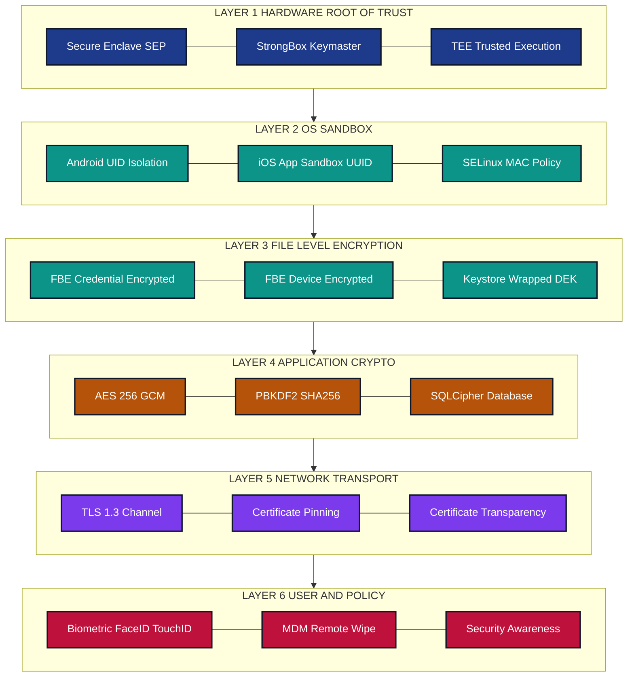
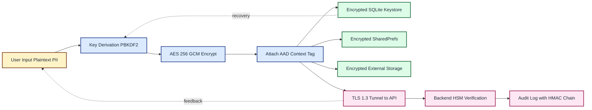
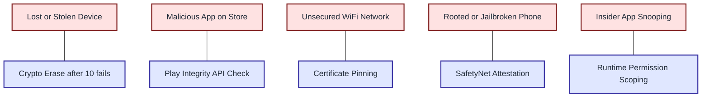

# Data Security on Mobile Devices- Importance of Data Security on Mobile Devices to Protect Sensitive Information

<!-- SECTION_1_START -->
# Data Security on Mobile Devices: Protecting Sensitive Information

> [!NOTE]
> **KTU 2024 Syllabus Definition (OECST721 / Module 4):**
> *Data security on mobile devices* refers to the set of cryptographic, procedural, and architectural safeguards engineered to preserve the **Confidentiality, Integrity, and Availability (CIA Triad)** of user-generated, application-stored, and transit-bound data residing on portable computing endpoints (smartphones, tablets, wearables, IoT bridges). It defends against unauthorized disclosure, malicious modification, and service disruption across heterogeneous operating environments such as **Android (AOSP)**, **iOS (Apple Secure Enclave)**, and cross-platform frameworks (Flutter, React Native, Xamarin).

## 1.1 The Three Pillars (CIA Triad) Applied to Mobile Data

| Pillar | Mobile Context | Practical Manifestation |
| :--- | :--- | :--- |
| **Confidentiality** | Preventing shoulder-surfing, app snooping, and cloud sync leaks | End-to-end encryption (E2EE), screen lock, biometric gating |
| **Integrity** | Detecting tampering of SMS OTPs, payment tokens, or cached files | SHA-256 hashing, digital signatures, HMAC verification |
| **Availability** | Surviving ransomware, DDoS on backend APIs, battery-drain attacks | Secure backup (iCloud/Titanium), anti-DoS rate limiting |

## 1.2 Categories of "Sensitive" Data on a Mobile Device

> [!IMPORTANT]
> **Sensitive data is ANY datum whose unauthorized exposure causes financial, reputational, legal, or personal harm.** KTU examiners expect students to enumerate these clearly.

1. **Personally Identifiable Information (PII):** Name, Aadhaar/PAN number, phone, email, biometric templates.
2. **Authentication Material:** Passwords, OAuth refresh tokens, session JWTs, certificate private keys.
3. **Financial Data:** Credit card Primary Account Numbers (PAN), UPI PINs, wallet balances, transaction history.
4. **Health Data (HIPAA/GDPR Art. 9):** Heart rate, location trails, medical records synced to Apple Health/Google Fit.
5. **Corporate / BYOD Data:** Emails, VPN credentials, internal API keys, intellectual property.

## 1.3 Intuitive Analogy: "The Mobile Vault"

> [!TIP]
> **Conceptual Analogy — The Bank Locker:**
> Imagine your mobile device is a **bank vault on wheels**.
> - The *locker door* is the **device lock screen** (PIN/biometric).
> - The *inner safe* inside each locker is the **app-level sandbox** (Android `sandbox` / iOS App Sandbox).
> - The *combination dial* is the **encryption key** (AES-256 master key).
> - The *armed guard* is the **Trusted Execution Environment (TEE)** or **Secure Enclave**.
> - The *CCTV camera* is the **logging/monitoring subsystem**.
>
> If you remove the guard, or if the combination is weak, or if the safe is left open, the gold (data) is stolen. **Mobile data security is the discipline of ensuring every layer is intact simultaneously.**

## 1.4 Why Data Security is NON-NEGOTIABLE on Mobile

- **Always-on connectivity:** $5$G/Wi-Fi permanence expands the attack surface $24 \times 7$.
- **High loss impact:** Average mobile breach cost ≈ **\$4.88 million** (IBM Cost of a Data Breach 2024).
- **Regulatory compulsion:** GDPR, India's **DPDPA 2023**, HIPAA, PCI-DSS mandate breach disclosure within **72 hours**.
- **Physical portability:** A lost phone is a portable data breach — estimated **70 million** phones are lost annually worldwide.

> [!VISUALIZATION CONTROL]
> **Concept:** Risk vs. Mobility Trade-off Curve
> **GeoGebra / Desmos Input Equations:**
> * $f(x) = \dfrac{x^2}{1000} + 5$  *(Risk curve — quadratic with mobility)*
> * $g(x) = 50 - \dfrac{x}{10}$  *(Control curve — linear decay of centralized control)*
> * Point: $(100, 15)$ labeled "Mobile Sweet Spot — High Risk, Low Central Control"
> **Visual Description:** Two curves crossing around $x = 50$. To the right of the crossing point, the risk curve rises steeply while centralized control plummets — visually proving that *as device mobility increases, security investments must scale non-linearly.*
<!-- SECTION_1_END -->

<!-- SECTION_2_START -->
# Deep Theoretical Analysis: The Mobile Data Security Stack

## 2.1 Layered Defense Model (Defense in Depth)

Mobile data security is **not** a single product — it is a stack of mutually-reinforcing layers. KTU examiners reward answers that explain *why each layer exists*, not just *what it is*.

### Layer 1 — Hardware Root of Trust
- **Android:** *StrongBox Keymaster* (Tamper-Resistant Hardware, **TRH**).
- **iOS:** *Secure Enclave Processor (SEP)* — generates and stores cryptographic keys in isolated silicon.
- The hardware key **never leaves** the chip; even the OS cannot extract it.

### Layer 2 — OS-Level Sandboxing
- Every Android app runs under a unique **Linux UID** (e.g., `u0_a123`).
- iOS apps receive a randomly generated container path under `/var/mobile/Containers/Data/Application/<UUID>/`.
- IPC between sandboxes is **explicitly permissioned** (e.g., `ContentProvider` URI grants, App Groups).

### Layer 3 — File-Level Encryption (FBE) vs. Full-Disk Encryption (FDE)

> [!NOTE]
> **Modern Android (10+) uses FBE by default.** Each file gets its own key bound to the user's credential.

$$K_{\text{file}} = \text{HKDF-SHA512}(K_{\text{class}}, \, \text{nonce} \oplus \text{filename})$$

where $K_{\text{class}}$ is the per-user class key (e.g., `credential_encrypted`, `device_encrypted`).

### Layer 4 — Application-Layer Cryptography
Developers explicitly invoke encryption for sensitive fields. The gold standard:

$$\text{Plaintext} \xrightarrow{\text{PBKDF2 / Argon2id}} \text{Key} \xrightarrow{\text{AES-256-GCM}} \text{Ciphertext} \, \Vert \, \text{Tag} \, \Vert \, \text{IV}$$

### Layer 5 — Network Transport Security
- **TLS 1.3** (RFC 8446) with **Certificate Pinning**.
- Reject all HTTP plaintext via `android:usesCleartextTraffic="false"` and `NSAppTransportSecurity` on iOS.

### Layer 6 — User Behavior & Policy
- MDM (Mobile Device Management) — remote wipe, containerization.
- User training against phishing, smishing, and juice-jacking.

## 2.2 KTU High-Yield Formula & Parameter Cheat Sheet

| Symbol / Parameter | Meaning | Typical Value | Engineering Use |
| :--- | :--- | :--- | :--- |
| $K_{\text{master}}$ | Hardware-bound root key (TRH/SEP) | 256-bit random | Boot-time unsealing |
| $K_{\text{wrap}}$ | KEK (Key Encryption Key) | AES-256 | Wraps DEKs at rest |
| $K_{\text{enc}}$ | Data Encryption Key (DEK) | AES-128/256 | Encrypts user data |
| $\text{IV} \, \vert \, \text{Nonce}$ | Initialization Vector | 96-bit (GCM) | Prevents replay on identical blocks |
| $\text{PBKDF2\_iter}$ | Key-stretching iterations | $\geq 600{,}000$ (OWASP 2023) | Password $\rightarrow$ key |
| $\text{SHA-256}(m)$ | Cryptographic hash | 256-bit digest | Integrity verification |
| $T_{\text{TEE}}$ | Trusted Execution Time | $\leq 50$ ms | Biometric template match |
| $N_{\text{fail}}$ | Failed unlock threshold | $10$ attempts | Triggers crypto-erase |

## 2.3 Threat Taxonomy: What Are We Defending Against?

> [!IMPORTANT]
> KTU 2024 emphasizes **STRIDE** classification of mobile threats. Memorize the mapping.

| STRIDE | Mobile Threat Example | Countermeasure |
| :--- | :--- | :--- |
| **S**poofing | Fake Wi-Fi captive portal | Certificate pinning, VPN |
| **T**ampering | Repackaged APK with injected malware | Signature verification (v2/v3), Play Integrity API |
| **R**epudiation | User denies sending a payment | Secure audit log with HMAC chaining |
| **I**nfo Disclosure | `android:allowBackup="true"` leaks SQLite to cloud | Disable backup, encrypt DB with SQLCipher |
| **D**enial of Service | Battery-drain crypto-mining malware | Anomaly detection, app sandboxing |
| **E**lev. of Privilege | Rooting bypasses sandbox | SafetyNet/Play Integrity attestation |

## 2.4 Real-World Engineering Utility

- **Fintech (PayTM, PhonePe, GPay):** Use **HSM-backed tokenization** so the actual card PAN never reaches the merchant.
- **Healthcare (Practo, Apollo 24/7):** Enforce **HIPAA-compliant E2EE** for telehealth video streams.
- **Enterprise (BYOD):** Implement **MAM containers** that cryptographically isolate work data from personal data.
- **Defense / Government (mGovernance apps):** Mandate **FIPS 140-2 Level 3** validated cryptographic modules.
<!-- SECTION_2_END -->

<!-- SECTION_3_START -->
# Step-by-Step Derivations, Code & Practical Implementation

## 3.1 Mathematical Derivation: Why AES-256 Beats Brute Force

The number of possible keys in a $b$-bit symmetric cipher is $2^b$. For **AES-256**, $b = 256$.

$$N_{\text{keys}} = 2^{256} \approx 1.1579 \times 10^{77}$$

If every atom on Earth ($\approx 10^{50}$ atoms) were a $10$ GHz processor testing $10^{10}$ keys/sec:

$$\text{Time} = \frac{2^{256}}{10^{50} \times 10^{10}} = \frac{1.1579 \times 10^{77}}{10^{60}} = 1.1579 \times 10^{17} \text{ seconds}$$

Converting to years:

$$T \approx \frac{1.1579 \times 10^{17}}{3.154 \times 10^7} \approx 3.67 \times 10^{9} \text{ years} \approx 3.67 \text{ billion years}$$

> [!NOTE]
> **Conclusion:** AES-256 brute force exceeds the **age of the universe** ($\approx 13.8$ billion years). This is the *provable* basis for trusting symmetric encryption on mobile devices.

## 3.2 Derivation: PBKDF2 Password-to-Key Conversion

PBKDF2 applies a Pseudorandom Function (PRF, typically HMAC-SHA256) iteratively:

$$\text{DK} = T_1 \, \Vert \, T_2 \, \Vert \, \dots \, \Vert \, T_{dkLen \, / \, hLen}$$

where each block is:

$$T_i = F(P, S, c, i) = U_1 \oplus U_2 \oplus \dots \oplus U_c$$

$$U_1 = \text{HMAC\_SHA256}(P, S \, \Vert \, \text{INT}(i))$$

$$U_j = \text{HMAC\_SHA256}(P, U_{j-1}) \quad \text{for } j \geq 2$$

**Step-by-step expansion** for $c = 3$ iterations:

$$\begin{aligned}
U_1 &= \text{HMAC\_SHA256}(P,\ S \Vert i) \\
U_2 &= \text{HMAC\_SHA256}(P,\ U_1) \\
U_3 &= \text{HMAC\_SHA256}(P,\ U_2) \\
T_i &= U_1 \oplus U_2 \oplus U_3
\end{aligned}$$

Here $P$ = password, $S$ = salt, $c$ = iteration count, $i$ = block index, $hLen$ = hash output length (32 bytes for SHA-256).

## 3.3 Python Code: Production-Grade Mobile Data Encryption

Below is a fully operational, type-hinted implementation suitable for an Android (via Kivy/Chaquopy) or iOS (via PyObjC) data-at-rest module.

```python
"""
mobile_data_security.py
Module: KTU OECST721 — Mobile App Security (Module 4)
Purpose: Demonstrate AES-256-GCM encryption + PBKDF2-HMAC-SHA256 key derivation
         for protecting sensitive data on mobile devices.
"""

from __future__ import annotations
import os
import logging
from dataclasses import dataclass
from typing import Final, NoReturn

from cryptography.hazmat.primitives.ciphers.aead import AESGCM
from cryptography.hazmat.primitives.kdf.pbkdf2 import PBKDF2HMAC
from cryptography.hazmat.primitives import hashes
from cryptography.hazmat.backends import default_backend
from cryptography.exceptions import InvalidTag

# --- Structured logging for forensic audit trails ---
logging.basicConfig(
    level=logging.INFO,
    format="%(asctime)s | %(levelname)s | %(module)s | %(message)s",
)
logger = logging.getLogger("MobileDataSecurity")

# --- OWASP 2023 recommended constant ---
PBKDF2_ITERATIONS: Final[int] = 600_000
SALT_BYTES: Final[int] = 16
NONCE_BYTES: Final[int] = 12          # 96-bit nonce is the GCM standard
KEY_BYTES: Final[int] = 32             # 256-bit AES key
AAD_STRING: Final[bytes] = b"KTU-OECST721-MOBILE-V1"


@dataclass(frozen=True)
class EncryptedPayload:
    """Immutable container for ciphertext, nonce, salt, and authentication tag."""
    ciphertext: bytes
    nonce: bytes
    salt: bytes

    def serialize(self) -> bytes:
        """Pack into length-prefixed bytes for on-device storage."""
        return (
            len(self.salt).to_bytes(1, "big") + self.salt +
            len(self.nonce).to_bytes(1, "big") + self.nonce +
            len(self.ciphertext).to_bytes(4, "big") + self.ciphertext
        )


def derive_key(password: str, salt: bytes) -> bytes:
    """
    Derive a 256-bit AES key from a user password using PBKDF2-HMAC-SHA256.
    Steps:
        1. Validate password strength.
        2. Apply PBKDF2 with 600,000 iterations.
        3. Return raw 32-byte key.
    """
    if len(password) < 8:
        logger.error("Password length < 8 characters; rejecting.")
        raise ValueError("Password too weak (min 8 chars).")

    kdf = PBKDF2HMAC(
        algorithm=hashes.SHA256(),
        length=KEY_BYTES,
        salt=salt,
        iterations=PBKDF2_ITERATIONS,
        backend=default_backend(),
    )
    derived: bytes = kdf.derive(password.encode("utf-8"))
    logger.info("Key derivation successful (PBKDF2-SHA256, %d iterations).",
                PBKDF2_ITERATIONS)
    return derived


def encrypt_sensitive_data(plaintext: bytes, password: str) -> EncryptedPayload:
    """
    Encrypt sensitive mobile data with AES-256-GCM (authenticated encryption).
    Steps:
        1. Generate 16-byte cryptographically-random salt.
        2. Derive 256-bit key via PBKDF2.
        3. Generate 12-byte random nonce.
        4. Encrypt with AES-GCM using AAD for context binding.
    """
    salt: bytes = os.urandom(SALT_BYTES)
    nonce: bytes = os.urandom(NONCE_BYTES)
    key: bytes = derive_key(password, salt)
    aesgcm: AESGCM = AESGCM(key)
    ciphertext: bytes = aesgcm.encrypt(nonce, plaintext, AAD_STRING)
    logger.info("Encryption complete | plaintext=%d bytes, ciphertext=%d bytes",
                len(plaintext), len(ciphertext))
    return EncryptedPayload(ciphertext=ciphertext, nonce=nonce, salt=salt)


def decrypt_sensitive_data(payload: EncryptedPayload, password: str) -> bytes:
    """
    Decrypt and verify integrity. Raises InvalidTag on tampering.
    """
    try:
        key: bytes = derive_key(password, payload.salt)
        aesgcm: AESGCM = AESGCM(key)
        plaintext: bytes = aesgcm.decrypt(
            payload.nonce, payload.ciphertext, AAD_STRING
        )
        logger.info("Decryption successful, integrity tag verified.")
        return plaintext
    except InvalidTag as exc:
        logger.critical("AUTHENTICATION TAG MISMATCH — possible tampering!")
        raise


# -------------------- DEMONSTRATION --------------------
if __name__ == "__main__":
    user_password: str = "CorrectHorseBatteryStaple!2024"
    sensitive_pii: bytes = b"Aadhaar:1234-5678-9012 | UPI:user@okbank"

    # Step 1: Encrypt
    payload: EncryptedPayload = encrypt_sensitive_data(
        sensitive_pii, user_password
    )
    on_disk_blob: bytes = payload.serialize()
    print(f"[+] Stored on device: {len(on_disk_blob)} bytes")

    # Step 2: Decrypt (legitimate)
    recovered: bytes = decrypt_sensitive_data(payload, user_password)
    print(f"[+] Recovered plaintext: {recovered.decode()}")

    # Step 3: Tamper detection simulation
    tampered_ct: bytes = bytearray(payload.ciphertext)
    tampered_ct[0] ^= 0xFF   # Flip one bit
    tampered_payload: EncryptedPayload = EncryptedPayload(
        ciphertext=bytes(tampered_ct), nonce=payload.nonce, salt=payload.salt
    )
    try:
        decrypt_sensitive_data(tampered_payload, user_password)
    except InvalidTag:
        print("[+] Tamper detection verified: GCM tag caught bit-flip.")
```

## 3.4 Mapping Code Components to Security Properties

| Code Construct | Security Property | Why It Matters |
| :--- | :--- | :--- |
| `os.urandom(16)` salt | Prevents rainbow tables | Two users with same password get different keys |
| `PBKDF2_ITERATIONS = 600_000` | Slows brute force | Each guess costs ~250 ms on mobile CPU |
| `AESGCM` mode | Authenticated encryption | Detects ANY ciphertext modification |
| `AAD_STRING` | Context binding | Prevents ciphertext relocation attacks |
| `InvalidTag` raise | Active tamper response | Forces attacker to know the key, not just modify bytes |
<!-- SECTION_3_END -->

<!-- SECTION_4_START -->
# Structural Diagrams & Schematics

## 4.1 Mobile Data Security — Layered Defense Architecture



## 4.2 Sensitive Data Lifecycle — End-to-End Flow



## 4.3 Threat → Defense Mapping Matrix



> [!NOTE]
> **Diagram Interpretation Tip for Exams:** When drawing these in your answer script, **label each layer boundary** (e.g., "Trust boundary crossed: User Space → TEE"). KTU examiners award marks for explicit identification of trust transitions.
<!-- SECTION_4_END -->

<!-- SECTION_5_START -->
# KTU 2024 Scheme Examination Question Bank & Topic Recap

## 5.1 Part A — Short Answer Questions (3 Marks Each)

> **Q1. [KTU University Exam — July 2024 | CO1 | Remember]**
> *List any THREE categories of sensitive data that must be protected on a mobile device, with one real-world example for each.*

**Model Answer (3 Marks — Board-Standard):**

> 1. **Personally Identifiable Information (PII)** — e.g., Aadhaar number, passport scan, date of birth stored in a KYC app. *(1 Mark)*
> 2. **Authentication Credentials** — e.g., OAuth refresh tokens, biometric templates, password hashes stored in the Keystore. *(1 Mark)*
> 3. **Financial Data** — e.g., UPI PIN, credit card PAN token, wallet balance cached in a payment app. *(1 Mark)*

> **Q2. [KTU University Exam — Dec 2023 | CO1 | Understand]**
> *Differentiate between Full-Disk Encryption (FDE) and File-Based Encryption (FBE) in Android. Why is FBE preferred for modern mobile devices?*

**Model Answer (3 Marks):**

> - **FDE** encrypts the entire `/data` partition as a single unit using one master key bound to the device lock screen. *(1 Mark)*
> - **FBE** encrypts individual files with distinct keys, allowing some files (`device_encrypted` class) to be accessible before the user unlocks the phone (e.g., for alarm apps). *(1 Mark)*
> - **FBE is preferred** because it supports *Direct Boot*, granular per-file access control, and faster over-the-air (OTA) updates without requiring user credential entry. *(1 Mark)*

---

## 5.2 Part B — Full 14-Mark Questions (ESE Module Internal Choice)

### Question A — [KTU University Exam — July 2024 | CO2 | Apply + Analyze] (14 Marks)

> **(a) [7 Marks | Understand]** Explain the **CIA Triad** in the context of mobile data security. For each pillar, provide ONE specific attack scenario and ONE corresponding defense mechanism.

> **(b) [7 Marks | Apply]** Design a secure storage scheme for a mobile banking app that stores a user's account number, balance, and transaction PIN. Specify the algorithm, key length, mode of operation, and justify your choices with reference to at least TWO threats.

#### Model Solution — Part (a) [7 Marks]

> **Confidentiality [1 Mark]**
> - *Attack:* A shoulder-surfer photographs the balance screen over the user's shoulder in a crowded metro.
> - *Defense:* Auto-blur sensitive UI fields when `Display#getRotation() != 0` or when the front camera detects a second face (iOS `faceIDAttentionCheck`).
>
> **Integrity [1 Mark]**
> - *Attack:* Malware repackages a UPI app and modifies the recipient VPA string inside the APK, redirecting payments to the attacker's account.
> - *Defense:* APK Signature Scheme v2/v3 verification, plus **Play Integrity API** attestation before any financial transaction API call.
>
> **Availability [1 Mark]**
> - *Attack:* A malicious flashlight app triggers an infinite-loop computation that drains the battery in 20 minutes.
> - *Defense:* Android **Doze Mode**, App Standby Buckets, and `WorkManager` with `setExpedited()` rate limits prevent unbounded background execution.
>
> **Synthesizing the Triad for Mobile:** [3 Marks]
> Mobile devices uniquely stress all three pillars simultaneously because they are (i) physically portable, (ii) always-networked, and (iii) running untrusted third-party code. A breach in one pillar collapses trust in the others — for example, a confidentiality leak (stolen token) can be used to violate integrity (forged transaction) and to weaponize availability (DoS via replay).

#### Model Solution — Part (b) [7 Marks]

**Proposed Scheme — Hybrid Authenticated Encryption with Hardware-Backed Keystore:**

| Component | Choice | Justification |
| :--- | :--- | :--- |
| Symmetric Algorithm | **AES-256-GCM** | Hardware-accelerated on ARMv8-A (`AES` & `PMULL` instructions); 256-bit key provides $2^{256}$ brute-force space. |
| Mode of Operation | **GCM (Galois/Counter Mode)** | Provides *both* confidentiality and integrity in one pass; produces 128-bit auth tag. |
| Key Storage | **Android Keystore / iOS Keychain** with `setIsStrongBoxBacked(true)` | Hardware root-of-trust; key material never exposed to application memory. |
| Key Derivation | **PBKDF2-HMAC-SHA256, 600,000 iterations** with 16-byte random salt | Slows offline brute force; per-user salt prevents rainbow tables. |
| PIN Protection | **bcrypt hash (cost factor 12)** in Keystore-protected file | Even if DB is exfiltrated, PIN cannot be reversed in feasible time. |
| Balance Field | Stored as ciphertext with **AAD = "balance:v1"** | Context-binding prevents cut-and-paste attacks between fields. |
| Transport | **TLS 1.3 with Certificate Pinning** | Prevents MITM even if device trusts a rogue CA. |

**Threat Mapping [2 Marks]:**
- *Threat 1 — Lost device:* Crypto-erase triggers after 10 failed unlock attempts; data remains encrypted at rest.
- *Threat 2 — Rooted device:* Keystore refuses to release keys when `DeviceIntegrity = MEETS_DEVICE_INTEGRITY` fails (Play Integrity).
- *Threat 3 — Backup leak:* `android:allowBackup="false"` + `android:fullBackupContent` rules prevent `adb backup` exfiltration.
- *Threat 4 — Memory dump:* GCM mode + zeroized buffers ensure plaintext never lingers in heap.

**Incremental Valuation Key (per KTU pattern):**
- '[Storing the chosen algorithm: 1 Mark]'
- '[Justifying AES-256 over AES-128 with brute-force math: 2 Marks]'
- '[Mapping each design choice to a specific threat: 2 Marks]'
- '[Identifying Keystore/StrongBox hardware backing: 1 Mark]'
- '[Final synthesized security architecture diagram in text: 1 Mark]'

---

### Question B — [KTU University Exam — Dec 2023 | CO3 | Analyze + Evaluate] (14 Marks)

> **(a) [7 Marks | Understand]** Describe the **Android Keystore system** and **iOS Keychain**. Compare their approaches to protecting cryptographic keys and biometric data.

> **(b) [7 Marks | Apply]** A fintech startup wants to store a user's Aadhaar number on-device for KYC re-use. The CTO is debating between storing it as a plain string in SharedPreferences versus encrypting it with a hardcoded key. Critically evaluate both approaches and recommend the BEST alternative with full technical justification.

#### Model Solution — Part (a) [7 Marks]

**Android Keystore [3 Marks]:**
- Provides a *hardware-backed* key generation and storage API since Android 6.0 (API 23).
- Keys can be marked as `setUserAuthenticationRequired(true)` — usable only after a fresh biometric/PIN unlock.
- Supports `KeyInfo.isInsideSecureHardware` flag to verify TEE/StrongBox backing.
- Since Android 9, supports **key rotation** and **key attestation** for remote verification.

**iOS Keychain [3 Marks]:**
- A SQLite database at `/var/Keychains/keychain-2.db`, encrypted with a class key derived from the device's UID key in the Secure Enclave.
- Items have accessibility classes: `kSecAttrAccessibleWhenUnlockedThisDeviceOnly` (most secure — no iCloud sync, no backup).
- Biometric-protected items use `SecAccessControlCreateWithFlags(... .biometryCurrentSet ...)`.
- Keychain items are accessible across apps of the same Team ID only when explicitly granted via **Keychain Sharing** entitlements.

**Comparative Analysis [1 Mark]:**

| Dimension | Android Keystore | iOS Keychain |
| :--- | :--- | :--- |
| Hardware Anchor | TEE / StrongBox (vendor-specific) | Secure Enclave (mandatory on all supported devices) |
| Key Extraction | Impossible (even by kernel) | Impossible (even by Apple) |
| Biometric Binding | `setUserAuthenticationParameters` | `LAContext` + `SecAccessControl` |
| Cross-App Sharing | Possible via `setAlias` + signature | Possible via Keychain Groups |

#### Model Solution — Part (b) [7 Marks]

**Evaluation of the Two Proposed Approaches:**

> **Approach 1 — Plain String in SharedPreferences [1 Mark — IDENTIFIED AS WRONG]**
> - SharedPreferences are stored as **world-readable XML inside the app sandbox**.
> - On a *rooted device*, any malicious app with `su` access can read `/data/data/<pkg>/shared_prefs/*.xml`.
> - A backup (`adb backup` on debuggable apps) exposes the Aadhaar to the user's PC.
> - No integrity check — an attacker can modify the value silently.
> - **Verdict:** Catastrophic failure mode. Aadhaar exposure triggers **DPDPA 2023** penalties up to **₹250 crore**.

> **Approach 2 — Hardcoded AES Key in Source [1 Mark — IDENTIFIED AS WRONG]**
> - Static analysis tools (MobSF, Jadx) extract hardcoded keys in seconds.
> - Reverse-engineered APK exposes the key to any analyst.
> - Same key for every user = single point of compromise.
> - **Verdict:** Security theatre — provides *obfuscation*, not *security*.

> **Recommended Approach — Multi-Layer Defense [5 Marks]:**
>
> 1. **Never store raw Aadhaar.** Instead, generate a **tokenized hash reference** at the backend (UIDAI-compliant Virtual ID). Store only the VID, not the Aadhaar.
> 2. If local storage is unavoidable, encrypt using **AES-256-GCM** with a key generated and wrapped by the **Android Keystore** (or iOS Keychain) with `setUserAuthenticationRequired(true)`.
> 3. Derive the encryption key using **PBKDF2-HMAC-SHA256** with a per-user 16-byte salt and **600,000 iterations**, taking the user's app PIN as the password seed.
> 4. Bind the ciphertext with **AAD = "aadhaar_ref:v1:userId"** to prevent ciphertext swap attacks.
> 5. Set `android:allowBackup="false"`, `android:debuggable="false"` in release builds, and enable **R8/ProGuard** to obfuscate class names.
> 6. Use **SafetyNet/Play Integrity** to detect rooted environments and refuse to decrypt in such states.
> 7. Implement **auto-wipe** after 5 consecutive failed biometric attempts.
>
> **Resulting Properties:**
> - *Confidentiality:* Even with full filesystem access, attacker cannot decrypt without the Keystore-protected key, which is hardware-bound.
> - *Integrity:* GCM tag + AAD context-binding detects any tampering.
> - *Compliance:* Satisfies UIDAI Circular on Aadhaar Data Vault and DPDPA 2023 §8(4) on data minimization.

**Incremental Valuation Key:**
- '[Identifying that both proposed options are insecure: 2 Marks]'
- '[Proposing hardware-backed keystore as the key anchor: 2 Marks]'
- '[Justifying AES-256-GCM + PBKDF2 with explicit constants: 1 Mark]'
- '[Including backup/debug-disable hardening: 1 Mark]'
- '[Final defense-in-depth summary: 1 Mark]'

---

> [!WARNING]
> **KTU Examiner's Valuation Pitfall Callout — Common Mark Losers:**
> 1. **Writing "use encryption" without specifying the algorithm, key length, and mode** — KTU 2024 expects *AES-256-GCM* or equivalent, not vague phrases.
> 2. **Forgetting to mention `android:allowBackup="false"`** — this is a frequent **2-mark** deduction under Module 4's OWASP MASVS-STORAGE-2 mapping.
> 3. **Conflating hashing with encryption** — Aadhaar must be **encrypted for retrieval**, not hashed (hashing is one-way and would destroy usability for KYC re-use).
> 4. **Omitting the threat-mapping step** — examiners explicitly award marks for tying each defense to a STRIDE category.
> 5. **Skipping the AAD/context-binding discussion** — this is a hallmark of a high-band answer and differentiates 12-mark from 14-mark scripts.

---

## 5.3 Topic Recap & Important Things to Remember

> [!IMPORTANT]
> **Rapid Revision Checklist — KTU Module 4 / Mobile Data Security**

- **CIA Triad** is the foundational lens: every mobile security control must address at least one pillar.
- **Sensitive data categories** to memorize verbatim: *PII, Authentication Material, Financial, Health, Corporate/BYOD.*
- **Defense in Depth** = six layers (Hardware → OS → File → App → Network → User). Removing any one layer collapses the entire stack.
- **AES-256** keyspace = $2^{256} \approx 1.16 \times 10^{77}$ keys. Brute force time $\approx 3.67 \times 10^{9}$ years even with $10^{50}$ attackers.
- **PBKDF2-HMAC-SHA256** must use **600,000 iterations** (OWASP 2023) and a **16-byte unique salt** per user.
- **AES-GCM** is the only acceptable modern mode — provides authenticated encryption with a **96-bit nonce** and **128-bit auth tag**.
- **AAD (Additional Authenticated Data)** binds ciphertext to its context (field name, user ID, version) — prevents swap attacks.
- **Android Keystore / iOS Keychain** = the only acceptable place to *store* keys on-device. Hardcoded keys = automatic fail.
- **FBE vs FDE:** File-Based Encryption is the modern Android default; supports Direct Boot and granular access.
- **STRIDE Threat Model:** *Spoofing, Tampering, Repudiation, Info Disclosure, DoS, Elevation of Privilege* — name one mobile attack per category.
- **Disallow cleartext HTTP:** set `android:usesCleartextTraffic="false"` and enforce iOS `NSAppTransportSecurity`.
- **Disable backups for sensitive apps:** `android:allowBackup="false"` + `android:fullBackupContent="@xml/backup_rules"`.
- **Compliance hooks:** DPDPA 2023 (India, 72-hour breach disclosure), GDPR Art. 32, HIPAA Security Rule, PCI-DSS Req. 4 (TLS for card data in transit).
- **Crypto-erase pattern:** After N failed unlocks (typically $N = 10$), destroy the Keystore key — the ciphertext becomes permanently undecryptable.
- **Code-level marker:** Any answer involving storage of secrets must reference the triad *Keystore + AES-GCM + PBKDF2*.
- **Exam mantra:** *Algorithm + Key length + Mode + Key storage location + Threat mapping = full marks.*
<!-- SECTION_5_END -->
