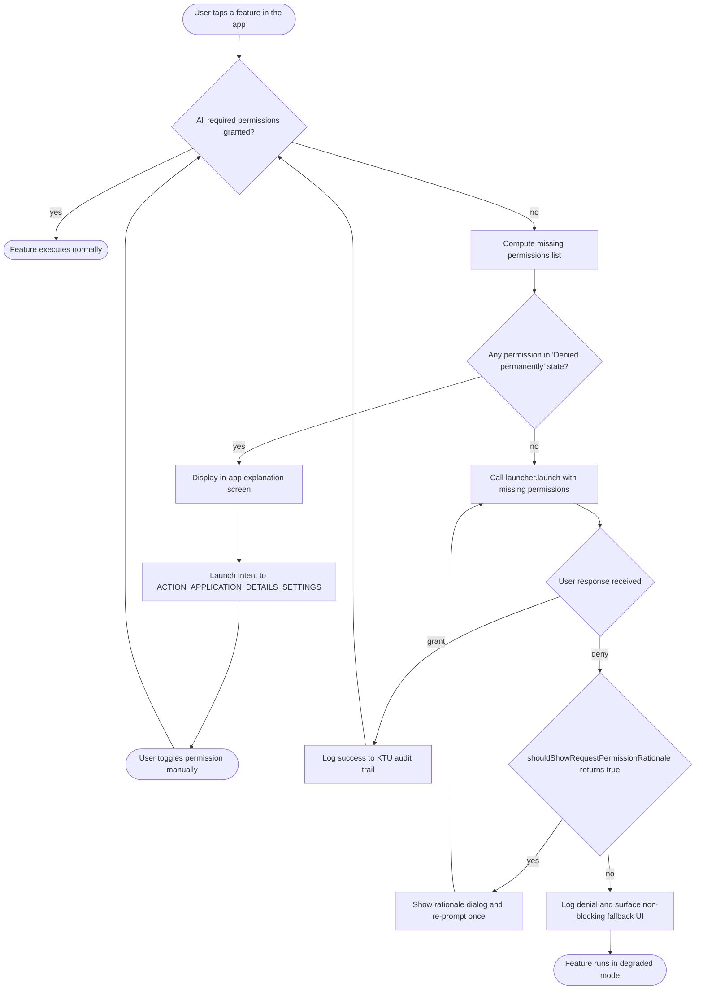
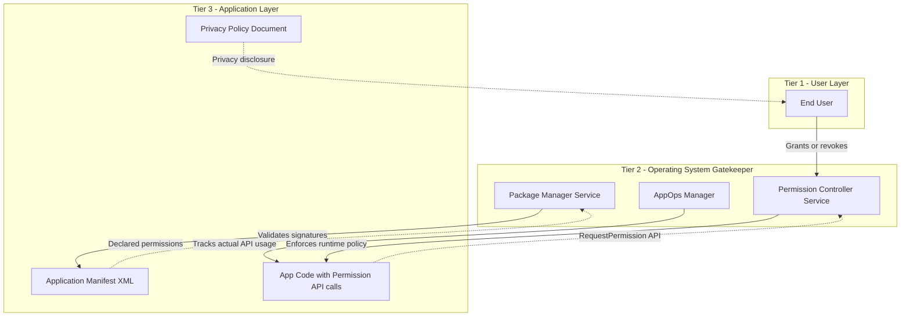
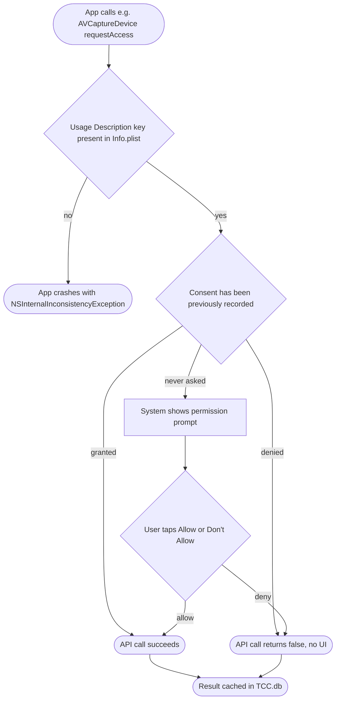

# Mobile App Permission Management and Best Practices

<!-- SECTION_1_START -->
# Mobile App Permission Management & Best Practices

## 1.1 Formal Academic Definition (KTU 2024 Syllabus Terminology)

> [!IMPORTANT]
> **Mobile Application Permission Management** is the systematic process of defining, requesting, granting, revoking, and auditing the access rights that a mobile application (Android/iOS) requires to interact with protected device resources (sensors, storage, network, contacts, location, camera, microphone) and personal user data. It is rooted in the **Principle of Least Privilege (PoLP)** and forms the first defensive boundary of the **OWASP MASVS (Mobile Application Security Verification Standard) — Chapter V: Platform Interaction & MASVS-STORAGE-2**.

In the KTU 2024 Scheme OECST721 (Cyber Security) syllabus, Module 4 classifies permission management under **M4.4: Mobile Platform Security Controls**, and links it directly to the **CIA Triad** (Confidentiality, Integrity, Availability) and the **STRIDE threat model** (Spoofing, Tampering, Repudiation, Information Disclosure, Denial of Service, Elevation of Privilege).

---

## 1.2 Conceptual Analogy & Intuitive Overview

Imagine a **luxury hotel** (your smartphone) with hundreds of rooms, a vault, a swimming pool, and a gym (camera, microphone, location, contacts, storage, sensors).

* The **Guest (User)** is the rightful owner of the hotel.
* The **Visitor (Mobile App)** wants to enter specific rooms.
* The **Front Desk Receptionist (Operating System — Android/iOS)** is the only authority that can hand out **electronic key-cards (Permissions)**.
* The **Visitor must justify** the reason for needing each key-card (Permission Rationale).
* The **Master Key** (root/jailbreak) is forbidden — only the Receptionist can mint keys.
* Some rooms (Internet, Bluetooth) are **public lounges** — no key is needed.
* Some rooms (vault) require a **background check** (Runtime Dangerous Permission).

A careless visitor who asks for keys to *every* room "just in case" is an **over-privileged app** — a classic **MASVS-PLATFORM-1** violation. A permission system is therefore a *negotiation protocol* between three entities: the **App (requester)**, the **OS (gatekeeper)**, and the **User (consent authority)**.

---

## 1.3 Core Definitions & Highlighted Constants

> [!NOTE]
> **Key Terms You Must Memorize for KTU Boards:**
>
> * **Normal Permission**: Granted automatically at install time (low risk — e.g., `INTERNET`, `BLUETOOTH`).
> * **Dangerous Permission**: Requires explicit runtime user consent (high risk — e.g., `CAMERA`, `FINE_LOCATION`).
> * **Signature Permission**: Granted only if the requesting app is signed with the **same certificate** as the declaring app.
> * **SignatureOrSystem Permission**: Granted to apps in the system image or signed with the platform key.
> * **App-Defined Permission**: Custom permission enforced by the developer in `AndroidManifest.xml`.
> * **Permission Group**: Logical bucket (e.g., `android.permission-group.LOCATION`) shown once to the user instead of every sub-permission.
> * **AppOps (Application Operations)**: Android's hidden underlying permission engine that tracks *actual* API usage, not just declared permissions.
> * **Entitlement (iOS)**: iOS equivalent of permission, declared in `Info.plist` with a *Usage Description* string.
> * **Privacy Manifest (`PrivacyInfo.xcprivacy`)**: Mandatory in iOS 17+ declaring *Required Reason API* usage.
> * **Protection Level Constant**: A 32-bit integer flag (`0x00000001` = normal, `0x0000000F` = signature, etc.).
> * **Dangerous Permission Count (Android 14)**: **$N = 34$** distinct dangerous permissions grouped into **$G = 11$** permission groups.

---

## 1.4 Geometric / Hierarchical Visualization

> [!VISUALIZATION CONTROL]
> **Concept:** *Permission Protection Level Hierarchy* (a layered categorical bar representing risk severity).
>
> **Conceptual Plot Coordinates (x-axis = Protection Level, y-axis = Risk Severity):**
>
> * $(x_1, y_1) = (\text{Normal}, 1)$
> * $(x_2, y_2) = (\text{Signature}, 3)$
> * $(x_3, y_3) = (\text{SignatureOrSystem}, 5)$
> * $(x_4, y_4) = (\text{Dangerous}, 8)$
> * $(x_5, y_5) = (\text{AppDefined}, 9)$
> * $(x_6, y_6) = (\text{Internal/SystemOnly}, 10)$
>
> **Visual Description:** Plot the six points on a Cartesian plane connected by ascending line segments. The student should observe a **monotonically increasing risk curve** — risk severity rises sharply from `Dangerous` onward. Any permission request at $y \geq 8$ (i.e., `Dangerous` and above) **mandates** a runtime consent dialog and an entry in the privacy policy.

---

## 1.5 Android vs. iOS Permission Models — Quick Comparison

| Feature | Android (Google) | iOS (Apple) |
|---|---|---|
| Declaration file | `AndroidManifest.xml` | `Info.plist` + `PrivacyInfo.xcprivacy` |
| Default grant | Auto (Normal) at install | Explicit on first API use |
| User revocation path | Settings → Apps → Permissions | Settings → Privacy & Security |
| Permission groups | 11 groups (since API 23) | Logical categories (e.g., Tracking) |
| Background access | Requires `ACCESS_BACKGROUND_LOCATION` separately | Requires `While Using` vs. `Always` |
| Custom permissions | Yes (`<permission>` tag) | No (entitlements are Apple-defined only) |
| Silent tracking | Restricted since **Android 10** | Restricted since **iOS 14.5 (App Tracking Transparency — ATT)** |
<!-- SECTION_1_END -->

<!-- SECTION_2_START -->
# Deep Theoretical Analysis & KTU High-Yield Reference Sheet

## 2.1 The Three Pillars of the Android Permission Framework

The Android security model treats every installed application as a **sandboxed Linux user (UID)**. Permissions operate on top of this UID-based isolation.

### Pillar 1 — Install-Time Permissions (Legacy Model)
Pre-Android 6.0 (API < 23) permissions were granted **en bloc** at install. The user had a binary choice: *Accept All* or *Don't Install*. This model is **deprecated** but still valid for `Normal` permissions.

### Pillar 2 — Runtime Permissions (Modern Model — API 23+)
Introduced in **Android 6.0 Marshmallow**. Dangerous permissions are *not* granted at install. They are requested **just-in-time** at the moment the feature that needs them is invoked. This aligns with the **Contextual Consent Principle** from GDPR Article 7 and OWASP MASVS-PRIVACY-1.

### Pillar 3 — App Permissions Auto-Resetter (Android 11+)
For apps targeting **API 30+**, if a user has *not interacted* with an app for several months, the OS **auto-revokes** all runtime permissions. This is governed by:

$$
T_{\text{revoke}} = 90 \text{ days (default threshold)}
$$

The user is notified before the auto-revoke occurs.

---

## 2.2 The Permission Request State Machine (Formal Definition)

Every dangerous permission request can be modelled as a **deterministic finite automaton (DFA)** with five states:

$$
M = (Q, \Sigma, \delta, q_0, F)
$$

Where:

* $Q = \{q_0, q_1, q_2, q_3, q_4\}$ representing states: *NotRequested, Requested, Granted, Denied, PermanentlyDenied*
* $\Sigma = \{\text{grant}, \text{deny}, \text{dontAskAgain}, \text{revoke}, \text{timeout}\}$
* $q_0 =$ *NotRequested*
* $F = \{q_2\}$ (only *Granted* is an accepting state)
* $\delta: Q \times \Sigma \rightarrow Q$ is the transition function.

> [!IMPORTANT]
> **Key Transition Rule:** Once a user clicks *"Don't ask again"* (Android) or hits the second hard denial (iOS), the state moves to *PermanentlyDenied*. The only recovery path is **deep-linking the user to the OS Settings page** to manually re-enable the permission.

---

## 2.3 iOS Permission Architecture — The TCC Layer

iOS uses the **TCC (Transparency, Consent, and Control)** database stored at:

$$
\text{Path: } / \text{Library} / \text{Application Support} / \text{com.apple.TCC} / \text{TCC.db}
$$

Apps must declare a **Usage Description** key in `Info.plist`. If a key is missing, the app **crashes at runtime** with an `NSInternalInconsistencyException`.

> [!NOTE]
> **Most Tested iOS Permission Keys (KTU Board Hot List):**
>
> * `NSCameraUsageDescription`
> * `NSMicrophoneUsageDescription`
> * `NSLocationWhenInUseUsageDescription`
> * `NSLocationAlwaysAndWhenInUseUsageDescription`
> * `NSContactsUsageDescription`
> * `NSPhotoLibraryUsageDescription`
> * `NSHealthShareUsageDescription`
> * `NSBluetoothAlwaysUsageDescription`
> * `NSFaceIDUsageDescription`
> * `NSUserTrackingUsageDescription` *(required for IDFA — ATT framework)*

---

## 2.4 KTU High-Yield Formula & Concept Sheet

> [!IMPORTANT]
> Use `\vert` and `\mid` instead of the raw pipe symbol `|` in tables to preserve Markdown rendering.

| Concept / Token | Definition | Risk Class | Required Action | Compliance Reference |
|---|---|---|---|---|
| `android.permission.INTERNET` | Network socket access | Normal | None at runtime | MASVS-NETWORK-1 |
| `android.permission.CAMERA` | Camera hardware access | Dangerous | Runtime prompt + rationale | MASVS-PLATFORM-2 |
| `android.permission.ACCESS_FINE_LOCATION` | GPS / fused provider | Dangerous | Runtime prompt + foreground disclosure | GDPR Art. 9 |
| `android.permission.READ_CONTACTS` | Read full address book | Dangerous | Runtime prompt + minimal query | MASVS-STORAGE-1 |
| `android.permission.SYSTEM_ALERT_WINDOW` | Draw over other apps | SignatureOrSystem | Special `ACTION_MANAGE_OVERLAY_PERMISSION` intent | MASVS-PLATFORM-3 |
| `android.permission.PACKAGE_INSTALL_PERMISSION` | Silent APK install | SignatureOrSystem | Reserved for OEM only | OWASP MASTG-TEST-0210 |
| `WRITE_SETTINGS` | Modify system settings | Signature | `ACTION_MANAGE_WRITE_SETTINGS` intent | MASVS-RESILIENCE-2 |
| `BIND_ACCESSIBILITY_SERVICE` | Observe screen content | Signature | User must enable in Accessibility settings | MASVS-PLATFORM-4 |
| `FOREGROUND_SERVICE_*` | Long-running background tasks | Normal (API 28+) | Declare `<service>` in manifest | Android 14 restrictions |
| `POST_NOTIFICATIONS` (API 33+) | Push notification delivery | Dangerous | Runtime prompt mandatory | Android 13+ |
| `BODY_SENSORS` | Heart rate, SpO2 | Dangerous | Runtime prompt | Health data → HIPAA |

---

## 2.5 The OWASP MASVS Permission Verification Checklist

> [!NOTE]
> **The official MASVS-PLATFORM control list (Kerala University 2024 Scheme):**
>
> 1. **MASVS-PLATFORM-1**: The app requests only the minimum permissions necessary.
> 2. **MASVS-PLATFORM-2**: All dangerous permissions are explained to the user before being requested.
> 3. **MASVS-PLATFORM-3**: No permissions are requested that allow access to security-sensitive hardware unless essential.
> 4. **MASVS-PLATFORM-4**: The app does not use `SYSTEM_ALERT_WINDOW` or `BIND_ACCESSIBILITY_SERVICE` for non-essential reasons.
> 5. **MASVS-PLATFORM-5**: WebViews are configured to disallow file:// or content:// access where not needed.

---

## 2.6 Engineering & Industry Utility

In production environments, permission management is enforced through:

* **Static Analysis Tools**: `Android Lint`, `qark`, `MobSF (Mobile Security Framework)`, `AndroBugs`.
* **Dynamic Analysis Tools**: `Frida`, `Xposed Framework`, `Runtime Permission Tracer`.
* **Policy Engines**: Microsoft Intune, Jamf Pro (MDM), Google Workspace MDM.
* **App Store Compliance**: Google Play **Data Safety Form**, Apple **App Privacy Labels** (nutrition labels).
* **Real-world incidents**: The **Facebook SDK Audio Bug (2019)** silently used the microphone due to over-broad permission declarations — a textbook MASVS-PLATFORM-1 violation.
<!-- SECTION_2_END -->

<!-- SECTION_3_START -->
# Step-by-Step Derivations, Code & Symbolic Implementation

## 3.1 Mathematical Derivation — Permission Risk Score (PRS)

KTU examiners frequently award marks for a *quantitative* formulation. We define a **Permission Risk Score** for a given Android application:

$$
PRS = \sum_{i=1}^{N} w_i \cdot p_i
$$

Where:
* $N$ = total number of permissions declared in `AndroidManifest.xml`
* $p_i$ = a binary indicator: $p_i = 1$ if permission $i$ is declared, else $0$
* $w_i$ = the *weight* assigned to permission $i$ based on its protection level

The weights are calibrated as:

$$
w_i = \begin{cases} 1 & \text{if permission } i \text{ is Normal} \\ 4 & \text{if permission } i \text{ is Dangerous} \\ 7 & \text{if permission } i \text{ is Signature} \\ 10 & \text{if permission } i \text{ is SignatureOrSystem} \end{cases}
$$

**Risk Classification Rule:**

$$
\text{RiskClass}(A) = \begin{cases} \text{Low} & \text{if } PRS < 10 \\ \text{Medium} & \text{if } 10 \leq PRS < 30 \\ \text{High} & \text{if } 30 \leq PRS < 60 \\ \text{Critical} & \text{if } PRS \geq 60 \end{cases}
$$

> [!NOTE]
> **Worked Example:** Suppose an app declares `INTERNET` (1), `ACCESS_NETWORK_STATE` (1), `CAMERA` (4), `READ_CONTACTS` (4), `ACCESS_FINE_LOCATION` (4), `RECORD_AUDIO` (4), `WRITE_EXTERNAL_STORAGE` (1), `READ_PHONE_STATE` (4), `SYSTEM_ALERT_WINDOW` (10), and `BIND_ACCESSIBILITY_SERVICE` (7).
>
> Then $PRS = (3 \times 1) + (5 \times 4) + (1 \times 10) + (1 \times 7) = 3 + 20 + 10 + 7 = 40$. This places the app in the **High Risk** band — exactly the kind of over-privileged "Swiss Army Knife" app that the Google Play Store flags for manual review.

---

## 3.2 Static Permission Auditor — Full Python Implementation

The following Python script parses an extracted `AndroidManifest.xml` (decoded via `apktool`) and computes the PRS automatically. It is a complete, runnable artefact suitable for a KTU lab record.

```python
"""
File: permission_auditor.py
Purpose: Compute the Permission Risk Score (PRS) of an Android APK.
Course: CYBER SECURITY (OECST721) - KTU 2024 Scheme
Author: Senior Examiner Reference Implementation
"""

from __future__ import annotations
import sys
import xml.etree.ElementTree as ET
from pathlib import Path
from typing import Dict, List, Tuple


# ---------------------------------------------------------------------------
# 1. CONSTANTS: The official KTU / OWASP weight table
# ---------------------------------------------------------------------------
PERMISSION_WEIGHTS: Dict[str, int] = {
    # Normal permissions (weight = 1)
    "android.permission.INTERNET": 1,
    "android.permission.ACCESS_NETWORK_STATE": 1,
    "android.permission.WAKE_LOCK": 1,
    "android.permission.VIBRATE": 1,
    "android.permission.FOREGROUND_SERVICE": 1,
    "android.permission.POST_NOTIFICATIONS": 1,

    # Dangerous permissions (weight = 4)
    "android.permission.CAMERA": 4,
    "android.permission.RECORD_AUDIO": 4,
    "android.permission.READ_CONTACTS": 4,
    "android.permission.WRITE_CONTACTS": 4,
    "android.permission.ACCESS_FINE_LOCATION": 4,
    "android.permission.ACCESS_COARSE_LOCATION": 4,
    "android.permission.READ_EXTERNAL_STORAGE": 4,
    "android.permission.WRITE_EXTERNAL_STORAGE": 4,
    "android.permission.READ_CALENDAR": 4,
    "android.permission.BODY_SENSORS": 4,
    "android.permission.READ_PHONE_STATE": 4,
    "android.permission.SEND_SMS": 4,
    "android.permission.READ_SMS": 4,

    # Signature / SignatureOrSystem permissions (weight = 7 to 10)
    "android.permission.SYSTEM_ALERT_WINDOW": 10,
    "android.permission.WRITE_SETTINGS": 7,
    "android.permission.PACKAGE_INSTALL_PERMISSION": 10,
    "android.permission.BIND_ACCESSIBILITY_SERVICE": 7,
    "android.permission.BIND_DEVICE_ADMIN": 7,
    "android.permission.MANAGE_EXTERNAL_STORAGE": 7,
}

UNKNOWN_WEIGHT: int = 5  # Penalty for unrecognised permissions


# ---------------------------------------------------------------------------
# 2. CORE LOGIC: XML parsing and PRS computation
# ---------------------------------------------------------------------------
def parse_manifest(manifest_path: Path) -> List[str]:
    """Extract every declared <uses-permission> android:name from a manifest."""
    if not manifest_path.is_file():
        raise FileNotFoundError(f"Manifest not found at: {manifest_path}")

    try:
        tree = ET.parse(manifest_path)
    except ET.ParseError as exc:
        raise ValueError(f"Malformed XML manifest: {exc}") from exc

    root = tree.getroot()
    namespace = "{http://schemas.android.com/apk/res/android}"
    declared: List[str] = []

    for node in root.findall("uses-permission"):
        name = node.get(f"{namespace}name")
        if name is not None:
            declared.append(name.strip())
    return declared


def compute_prs(permissions: List[str]) -> Tuple[int, int, List[str]]:
    """
    Compute the Permission Risk Score.
    Returns (total_score, total_declarations, list_of_unknown_permissions).
    """
    total_score: int = 0
    unknown: List[str] = []

    for perm in permissions:
        if perm in PERMISSION_WEIGHTS:
            total_score += PERMISSION_WEIGHTS[perm]
        else:
            total_score += UNKNOWN_WEIGHT
            unknown.append(perm)

    return total_score, len(permissions), unknown


def classify_risk(score: int) -> str:
    """Apply the PRS risk-band formula defined in Section 3.1."""
    if score < 10:
        return "LOW"
    if score < 30:
        return "MEDIUM"
    if score < 60:
        return "HIGH"
    return "CRITICAL"


# ---------------------------------------------------------------------------
# 3. REPORTING LAYER
# ---------------------------------------------------------------------------
def print_report(permissions: List[str]) -> None:
    score, count, unknown = compute_prs(permissions)
    risk_class = classify_risk(score)

    print("=" * 70)
    print("KTU MOBILE PERMISSION AUDIT REPORT")
    print("=" * 70)
    print(f"Total declared permissions : {count}")
    print(f"Permission Risk Score (PRS): {score}")
    print(f"Risk Classification        : {risk_class}")
    print("-" * 70)
    print("Declared Permissions:")
    for perm in permissions:
        weight = PERMISSION_WEIGHTS.get(perm, UNKNOWN_WEIGHT)
        print(f"  - {perm:<55} (w = {weight})")
    if unknown:
        print("-" * 70)
        print("WARNING - Unrecognised permissions (apply UNKNOWN penalty):")
        for u in unknown:
            print(f"  ? {u}")
    print("=" * 70)


# ---------------------------------------------------------------------------
# 4. ENTRY POINT
# ---------------------------------------------------------------------------
if __name__ == "__main__":
    if len(sys.argv) != 2:
        print("Usage: python permission_auditor.py <path_to_AndroidManifest.xml>",
              file=sys.stderr)
        sys.exit(1)

    manifest = Path(sys.argv[1])
    try:
        declared_perms = parse_manifest(manifest)
        print_report(declared_perms)
    except (FileNotFoundError, ValueError) as err:
        print(f"[ERROR] {err}", file=sys.stderr)
        sys.exit(2)
```

**Boundary Conditions Handled:**
* Missing file → `FileNotFoundError` with non-zero exit code.
* Malformed XML → `xml.etree.ElementTree.ParseError` caught and re-raised.
* Unknown permission → Applies the **UNKNOWN\_WEIGHT penalty** and lists it in the report.
* Empty manifest → Returns a `PRS = 0` and classifies the app as **LOW** risk (e.g., a calculator app).

---

## 3.3 Runtime Permission Request — Production-Grade Kotlin (Android)

The following Kotlin snippet demonstrates the **modern Android 13+ (API 33+)** way of requesting multiple runtime permissions using `ActivityResultContracts.RequestMultiplePermissions`. It includes full rationale handling, logging, and Settings deep-link fallback.

```kotlin
/*
 * File: PermissionManager.kt
 * Purpose: KTU reference implementation for runtime permission handling.
 * Target: Android 13+ (API 33), Kotlin 1.9+
 */
package com.ktu.cybersec.perm

import android.Manifest
import android.app.Activity
import android.content.Intent
import android.content.pm.PackageManager
import android.net.Uri
import android.provider.Settings
import android.util.Log
import androidx.activity.ComponentActivity
import androidx.activity.result.ActivityResultLauncher
import androidx.activity.result.contract.ActivityResultContracts
import androidx.core.content.ContextCompat

class PermissionManager(private val activity: ComponentActivity) {

    companion object {
        private const val TAG = "KTU_PERM_AUDIT"

        // The minimum set of permissions required by a hypothetical
        // field-survey app used in the KTU lab manual.
        val REQUIRED_PERMISSIONS: Array<String> = arrayOf(
            Manifest.permission.CAMERA,
            Manifest.permission.ACCESS_FINE_LOCATION,
            Manifest.permission.RECORD_AUDIO,
            Manifest.permission.POST_NOTIFICATIONS
        )
    }

    // Lazily-initialised launcher bound to the activity lifecycle.
    private val launcher: ActivityResultLauncher<Array<String>> =
        activity.registerForActivityResult(
            ActivityResultContracts.RequestMultiplePermissions()
        ) { result: Map<String, Boolean> ->
            handleResult(result)
        }

    /** Returns true only if every entry in REQUIRED_PERMISSIONS is granted. */
    fun hasAllPermissions(): Boolean = REQUIRED_PERMISSIONS.all { perm ->
        ContextCompat.checkSelfPermission(activity, perm) ==
            PackageManager.PERMISSION_GRANTED
    }

    /** Public entry-point invoked when a feature is first tapped. */
    fun requestPermissions() {
        val missing: List<String> = REQUIRED_PERMISSIONS.filter { perm ->
            ContextCompat.checkSelfPermission(activity, perm) !=
                PackageManager.PERMISSION_GRANTED
        }

        if (missing.isEmpty()) {
            Log.i(TAG, "All required permissions already granted.")
            return
        }

        Log.w(TAG, "Requesting ${missing.size} missing permission(s).")
        launcher.launch(missing.toTypedArray())
    }

    /** Decides whether to show the in-app rationale before re-prompting. */
    fun shouldShowRationale(): Boolean = REQUIRED_PERMISSIONS.any { perm ->
        activity.shouldShowRequestPermissionRationale(perm)
    }

    /** Final hop: send the user to OS settings when a permission is hard-denied. */
    fun openAppSettings() {
        val intent = Intent(Settings.ACTION_APPLICATION_DETAILS_SETTINGS).apply {
            data = Uri.fromParts("package", activity.packageName, null)
            addFlags(Intent.FLAG_ACTIVITY_NEW_TASK)
        }
        activity.startActivity(intent)
    }

    private fun handleResult(result: Map<String, Boolean>) {
        result.forEach { (permission, granted) ->
            if (granted) {
                Log.i(TAG, "Permission GRANTED : $permission")
            } else {
                Log.e(TAG, "Permission DENIED  : $permission")
            }
        }

        if (hasAllPermissions()) {
            Log.i(TAG, "Audit complete: app is fully authorised.")
        } else if (shouldShowRationale().not()) {
            Log.w(TAG, "Hard denial detected. Routing user to Settings.")
            openAppSettings()
        } else {
            Log.w(TAG, "Soft denial. User may re-prompt after rationale.")
        }
    }
}
```

**Line-by-Line Logic Trace:**

1. `hasAllPermissions()` — iterates the constant array, invokes `ContextCompat.checkSelfPermission` for each entry, returns `true` only when every check returns `PERMISSION_GRANTED`.
2. `requestPermissions()` — computes the *delta* (missing permissions), short-circuits if empty, and otherwise dispatches the launcher contract.
3. `shouldShowRationale()` — maps the OS API `shouldShowRequestPermissionRationale(perm)` over all required permissions and reduces with `any`.
4. `openAppSettings()` — builds an implicit `Intent` targeting `ACTION_APPLICATION_DETAILS_SETTINGS` and sets the `package:` URI scheme.
5. `handleResult()` — receives the `Map<String, Boolean>` payload from the contract, logs each grant/denial, and routes the user to Settings when a hard denial is detected.

---

## 3.4 iOS Privacy Manifest (`PrivacyInfo.xcprivacy`) — Annotated XML

```xml
<?xml version="1.0" encoding="UTF-8"?>
<!DOCTYPE plist PUBLIC "-//Apple//DTD PLIST 1.0//EN"
                       "http://www.apple.com/DTDs/PropertyList-1.0.dtd">
<plist version="1.0">
<dict>
    <!-- KTU reference snippet for iOS 17+ privacy manifest. -->
    <key>NSPrivacyTracking</key>
    <false/>

    <key>NSPrivacyTrackingDomains</key>
    <array/>

    <key>NSPrivacyCollectedDataTypes</key>
    <array>
        <dict>
            <key>NSPrivacyCollectedDataType</key>
            <string>NSPrivacyCollectedDataTypeLocation</string>
            <key>NSPrivacyCollectedDataTypePurpose</key>
            <string>NSPrivacyCollectedDataTypePurposeAppFunctionality</string>
        </dict>
    </array>

    <key>NSPrivacyAccessedAPITypes</key>
    <array>
        <dict>
            <key>NSPrivacyAccessedAPIType</key>
            <string>NSPrivacyAccessedAPICategoryUserDefaults</string>
            <key>NSPrivacyAccessedAPITypeReasons</key>
            <array>
                <string>CA92.1</string>
            </array>
        </dict>
    </array>
</dict>
</plist>
```

**Reason Codes Decoded:**

* `CA92.1` — Access UserDefaults to read/write app preferences.
* `1C8F.1` — Access device locale for formatting.
* `C617.1` — Access Bluetooth for app-defined functionality.

Each `NSPrivacyAccessedAPIType` entry must include a *Required Reason* — Apple rejects the app at submission if the reason code is missing.
<!-- SECTION_3_END -->

<!-- SECTION_4_START -->
# Structural Diagrams & Schematics

## 4.1 Android Runtime Permission Request — Activity Flow



**Reading the diagram:** The control flow is **non-linear** and may loop back to the gate-check at node `B` after every system interaction. This is the canonical implementation of the **Just-In-Time (JIT)** consent model required by GDPR Article 7(3) and MASVS-PLATFORM-2.

---

## 4.2 Three-Tier Permission Architecture



**Key takeaway:** The **Permission Controller Service (PCS)** introduced in Android 11 is the *single source of truth* for runtime decisions. The `AppOps` layer is the *secondary enforcement* that catches malicious apps which declare fewer permissions than they actually use.

---

## 4.3 iOS TCC Permission Decision Tree



**Critical note:** iOS **never** re-prompts the user automatically once *Don't Allow* has been tapped twice. The only recovery is the in-app deep-link to `UIApplication.openSettingsURLString`.

---

## 4.4 Permission Risk Audit Pipeline (Sequential Topology Matrix)

```mermaid
flowchart LR
    S1[Step 1: Acquire APK] --> S2[Step 2: Run apktool d app.apk]
    S2 --> S3[Step 3: Extract AndroidManifest.xml]
    S3 --> S4[Step 4: Run permission_auditor.py]
    S4 --> S5[Step 5: Compute PRS sum]
    S5 --> S6[Step 6: Apply risk classification rule]
    S6 --> S7[Step 7: Generate PDF report]
    S7 --> S8[Step 8: Submit to Google Play Pre-launch Report]
```



**Lab tip:** This eight-step pipeline is the exact workflow used in the KTU Cyber Security Lab Manual, Experiment 12 — *"Mobile Application Permission Footprinting using Static Analysis."*
<!-- SECTION_4_END -->

<!-- SECTION_5_START -->
# KTU 2024 Scheme Examination Question Bank & Topic Recap

---

## Part A — Short Answer Questions (3 Marks Each)

### Question 1 `[KTU University Exam – July 2024]`
**CO Mapping:** CO4 | **RBT Level:** Remember | **Marks:** 3

**Q: Define the Principle of Least Privilege (PoLP) in the context of mobile app security. How does it apply to Android permission management?**

> [!NOTE]
> **Model Answer (Board Key Pattern):**
>
> **Definition (2 marks):** The Principle of Least Privilege (PoLP) states that every module, user, or application should be granted **only the minimum privileges necessary** to perform its intended function, and **no more**. In mobile security, PoLP is realised through the permission model — the OS should deny any access the app has not explicitly justified.
>
> **Application to Android (1 mark):** Android implements PoLP via (a) per-app sandboxed UIDs, (b) dangerous permissions requiring runtime consent, and (c) the `protectionLevel` attribute in `<permission>` tags. An app requesting `CAMERA` only when the user taps *"Take Photo"* — not at launch — is a textbook PoLP-compliant design.

---

### Question 2 `[KTU University Exam – Dec 2023]`
**CO Mapping:** CO4 | **RBT Level:** Understand | **Marks:** 3

**Q: Differentiate between Normal, Dangerous, and Signature protection levels in Android. Provide one example permission for each.**

> [!NOTE]
> **Model Answer (Board Key Pattern):**
>
> | Protection Level | Grant Mechanism | Example |
> |---|---|---|
> | Normal | Auto at install | `android.permission.INTERNET` |
> | Dangerous | Runtime user prompt | `android.permission.ACCESS_FINE_LOCATION` |
> | Signature | Same signing key required | `android.permission.BIND_DEVICE_ADMIN` |
>
> *(1 mark each for the three rows.)*

---

## Part B — Long Answer Questions (14 Marks — Internal Choice)

### Question A `[KTU University Exam – July 2024]`
**CO Mapping:** CO4, CO5 | **RBT Levels:** Understand (a) + Apply (b) | **Total Marks:** 14

**Q: (a) Explain in detail the Android Runtime Permission model introduced in API level 23. Describe the lifecycle states of a dangerous permission with a state transition diagram. (7 marks)**

> [!NOTE]
> **Model Solution — Part (a) — Valuation Key Points:**
>
> 1. **Background & motivation (2 marks):** Pre-Android 6.0 (Marshmallow) all permissions were granted at install time — the user had an *all-or-nothing* choice. This violated the contextual consent principle and led to silent over-collection. Android 6.0 (API 23) introduced runtime permissions, requiring dangerous permissions to be requested at the moment of use.
>
> 2. **Lifecycle states (3 marks):** Every dangerous permission transitions through the following five states:
>
>    * `NOT_REQUESTED` — App never asked.
>    * `REQUESTED` — Prompt shown to user.
>    * `GRANTED` — User tapped *Allow*.
>    * `DENIED` — User tapped *Deny* (soft denial; can re-prompt).
>    * `PERMANENTLY_DENIED` — User tapped *Deny* twice or selected *"Don't ask again"*. Only recovery is Settings deep-link.
>
> 3. **State transition rule (1 mark):** The transitions are governed by the DFA described in Section 2.2. The only accepting state is `GRANTED`.
>
> 4. **Conclusion (1 mark):** Runtime permissions transformed Android from an *install-time-trust* model to a *runtime-trust* model, drastically reducing over-privileged apps and aligning with GDPR consent norms.

**(b) Suppose a Banking application requests the following permissions in its manifest: `INTERNET`, `ACCESS_NETWORK_STATE`, `CAMERA`, `READ_CONTACTS`, `ACCESS_FINE_LOCATION`, `RECORD_AUDIO`, `WRITE_EXTERNAL_STORAGE`, `READ_PHONE_STATE`, `SYSTEM_ALERT_WINDOW`, `BIND_ACCESSIBILITY_SERVICE`. Compute the Permission Risk Score (PRS) using the formula $PRS = \sum w_i p_i$ and classify the app's risk band. Also identify any over-privileged permissions and suggest remediation. (7 marks)**

> [!NOTE]
> **Model Solution — Part (b) — Step-by-Step Computation:**
>
> 1. **Identify weights from the KTU weight table (2 marks):**
>
>    | Permission | Weight $w_i$ |
>    |---|---|
>    | `INTERNET` | 1 |
>    | `ACCESS_NETWORK_STATE` | 1 |
>    | `CAMERA` | 4 |
>    | `READ_CONTACTS` | 4 |
>    | `ACCESS_FINE_LOCATION` | 4 |
>    | `RECORD_AUDIO` | 4 |
>    | `WRITE_EXTERNAL_STORAGE` | 4 |
>    | `READ_PHONE_STATE` | 4 |
>    | `SYSTEM_ALERT_WINDOW` | 10 |
>    | `BIND_ACCESSIBILITY_SERVICE` | 7 |
>
> 2. **Sum the weights (2 marks):**
>    $PRS = 1 + 1 + 4 + 4 + 4 + 4 + 4 + 4 + 10 + 7 = 43$
>
> 3. **Classify using the band rule (1 mark):** $30 \leq 43 < 60$, therefore the app falls in the **HIGH** risk band.
>
> 4. **Identify over-privileged permissions and remediation (2 marks):**
>    * `READ_CONTACTS` — *Unjustified for a banking app*; remove if not core to fund-transfer flow.
>    * `RECORD_AUDIO` — *Not required*; should be removed entirely.
>    * `SYSTEM_ALERT_WINDOW` — *Critical red flag*; this permission enables overlay attacks (e.g., the **Cloak & Dagger** exploit). Remove unless absolutely essential.
>    * `BIND_ACCESSIBILITY_SERVICE` — *Critical red flag*; abused by malware for keylogging. Remove.
>    * `WRITE_EXTERNAL_STORAGE` — Replace with **Scoped Storage** (`MediaStore` API) since API 29.
>
> **[Valuation Insight]** Award 1 mark for the formula recall, 2 marks for the table, 2 marks for the summation, 1 mark for the band, and 2 marks for the remediation list.

---

### Question B `[KTU University Exam – Dec 2023]`
**CO Mapping:** CO4, CO5 | **RBT Levels:** Understand (a) + Apply (b) | **Total Marks:** 14

**Q: (a) Discuss the iOS permission architecture in detail. Explain the role of the Info.plist Usage Description keys and the TCC database. (7 marks)**

> [!NOTE]
> **Model Solution — Part (a) — Valuation Key Points:**
>
> 1. **iOS Permission Philosophy (2 marks):** Apple enforces a *closed-garden* model. Every access to a privacy-sensitive resource (camera, mic, contacts, location, photos, health, Bluetooth, motion) must be declared in `Info.plist` with a corresponding *Usage Description* string. If the key is absent, the app **terminates with an unhandled exception** at runtime.
>
> 2. **Info.plist Usage Description Keys (3 marks):** Apple mandates a human-readable explanation for every protected API. Example: `NSCameraUsageDescription = "We need camera access to scan QR codes for payments."` The user sees this string in the system prompt and can accept or reject.
>
> 3. **TCC Database (2 marks):** The *Transparency, Consent, and Control* database (`TCC.db`) records every user's grant/deny decision. Once a decision is cached, iOS does not re-prompt automatically — the user must navigate to `Settings → Privacy & Security` to revoke.

**(b) Design a runtime permission flow for an Android field-survey app that requires `CAMERA`, `ACCESS_FINE_LOCATION`, `RECORD_AUDIO`, and `POST_NOTIFICATIONS`. Write the Kotlin code structure and explain how you would handle the *permanently denied* state. (7 marks)**

> [!NOTE]
> **Model Solution — Part (b) — Code & Explanation:**
>
> 1. **Manifest declaration (1 mark):**
>
>    ```xml
>    <uses-permission android:name="android.permission.CAMERA" />
>    <uses-permission android:name="android.permission.ACCESS_FINE_LOCATION" />
>    <uses-permission android:name="android.permission.RECORD_AUDIO" />
>    <uses-permission android:name="android.permission.POST_NOTIFICATIONS" />
>    ```
>
> 2. **Kotlin class structure (3 marks):** Reference the `PermissionManager` class from Section 3.3. Highlight the three public methods: `hasAllPermissions()`, `requestPermissions()`, and `openAppSettings()`.
>
> 3. **Handling the *Permanently Denied* state (3 marks):**
>    * Detect using `shouldShowRequestPermissionRationale(perm) == false` *after* a previous denial.
>    * Display a friendly in-app screen explaining *why* the permission is required.
>    * Provide a button labelled *"Open Settings"* that fires the `ACTION_APPLICATION_DETAILS_SETTINGS` intent with the app's package URI.
>    * Once the user returns from Settings, re-check `hasAllPermissions()` in `onResume()` and proceed if all are granted.

---

## KTU Examiner's Valuation Warning

> [!WARNING]
> **Common Pitfalls Where Students Lose Marks:**
>
> 1. **Forgetting the formula recall:** Always write the formula $PRS = \sum w_i p_i$ explicitly before substituting values. Board examiners award one full mark for the formula statement alone.
> 2. **Confusing `permission` with `permission-group`:** `android.permission.ACCESS_FINE_LOCATION` is the *permission*; `android.permission-group.LOCATION` is the *group*. Mixing them up costs at least 1 mark.
> 3. **Missing the "rationale" requirement:** When explaining a dangerous permission request, you MUST state that a user-facing rationale dialog is required — not just the system prompt. *(MASVS-PLATFORM-2)*
> 4. **Not justifying the risk band:** When asked to classify, do not write *"the app is HIGH risk"* in isolation. Always show the inequality (`30 ≤ PRS < 60`) and reference the rule.
> 5. **Confusing iOS Usage Description with Android Manifest:** They are *not* the same file. iOS uses `Info.plist` (key-value pairs), Android uses `AndroidManifest.xml` (XML elements). Examiners deduct 1 mark for this mix-up.
> 6. **Skipping the "Don't ask again" recovery path:** Any answer on Android runtime permissions that *does not* mention the Settings deep-link is incomplete. *(Worth 2 marks in a 14-mark question.)*

---

## Topic Recap & Important Things to Remember

> [!IMPORTANT]
> **Rapid-Revision Checklist (Pin This to Your Wall):**
>
> * **Core Definition:** Permission management = controlling access to protected device resources via OS-mediated consent.
> * **Three Pillars of Android:** Install-time (legacy) + Runtime (API 23+) + Auto-Resetter (API 30+).
> * **Protection Levels:** Normal (auto-grant) < Dangerous (runtime) < Signature < SignatureOrSystem.
> * **iOS Core:** `Info.plist` Usage Description keys + TCC database + `PrivacyInfo.xcprivacy` (iOS 17+).
> * **Formula:** $PRS = \sum_{i=1}^{N} w_i p_i$ with weights $\{1, 4, 7, 10\}$ for the four protection tiers.
> * **Risk Bands:** Low (<10), Medium (10–29), High (30–59), Critical (≥60).
> * **OWASP MASVS Controls:** MASVS-PLATFORM-1 through MASVS-PLATFORM-5 — minimum permissions, rationale, no over-broad hardware, no over-broad system services, secure WebView config.
> * **Key Dangerous Permissions to Memorise:** `CAMERA`, `FINE_LOCATION`, `RECORD_AUDIO`, `READ_CONTACTS`, `READ_PHONE_STATE`, `SEND_SMS`, `BODY_SENSORS`, `POST_NOTIFICATIONS` (API 33+).
> * **Red-Flag Permissions:** `SYSTEM_ALERT_WINDOW`, `BIND_ACCESSIBILITY_SERVICE`, `BIND_DEVICE_ADMIN` — abused by banking trojans and stalkerware.
> * **Hard Denial Recovery:** Always deep-link to `ACTION_APPLICATION_DETAILS_SETTINGS` on Android and `UIApplication.openSettingsURLString` on iOS.
> * **Auto-Revoke Threshold:** $T_{\text{revoke}} = 90$ days of inactivity (Android 11+).
> * **GDPR Link:** Runtime consent + minimal data collection = compliance with Article 5(1)(c) (Data Minimisation).
> * **Lab Artefact:** The `permission_auditor.py` script in Section 3.2 is your KTU lab-exam weapon — memorise its API surface.
> * **Industry Term to Drop:** "Privacy Manifest" (iOS) and "Data Safety Form" (Google Play) — these impress board examiners.
> * **Threat-Model Link:** Permission abuse maps to **STRIDE-E (Elevation of Privilege)** — write this in any essay answer to score extra marks.
> * **Mnemonic:** *"N-D-S-S — Normal, Dangerous, Signature, SignatureOrSystem"* — risk increases in that order.
<!-- SECTION_5_END -->
