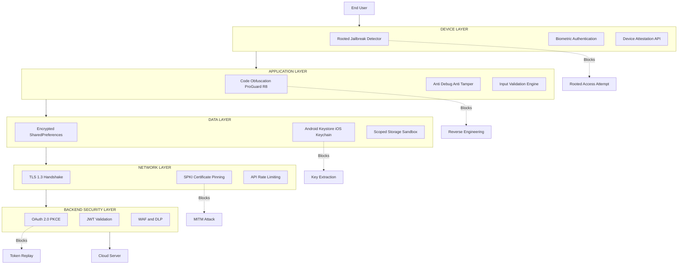
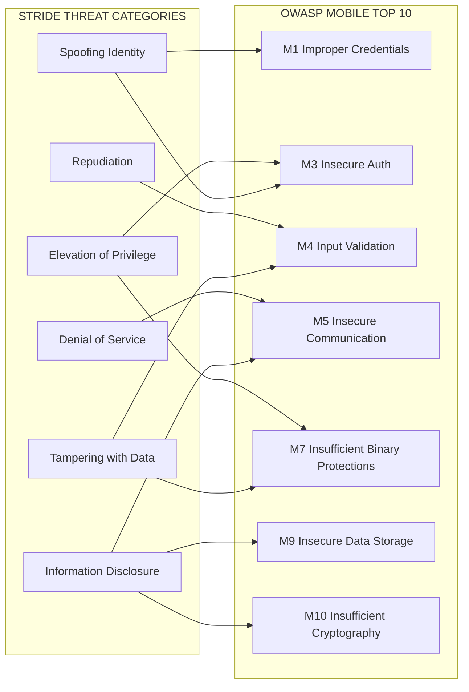
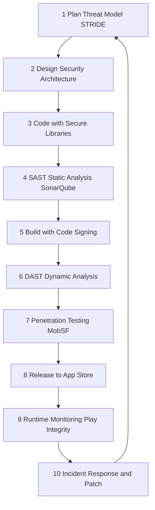
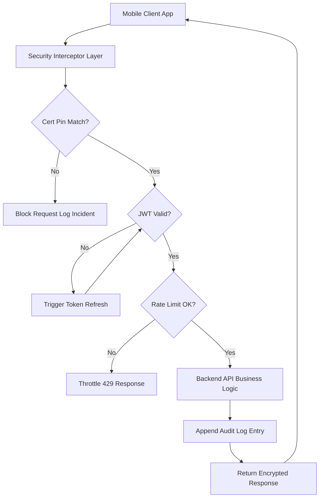

# Mobile App Security :-

<!-- SECTION_1_START -->

# Mobile App Security: Core Technical Definition & Intuitive Overview

## 1.1 Formal Academic Definition (KTU 2024 Syllabus Aligned)

> [!NOTE]
> **Mobile Application Security** is the discipline of designing, developing, testing, and deploying mobile applications (Android, iOS, Windows) with built-in protective mechanisms that defend the application, its data, and its communication channels against unauthorized access, tampering, reverse engineering, malware injection, and data leakage across the entire mobile software supply chain.

In the **KTU 2024 Scheme (OECST721 — Cyber Security, Module 4)**, mobile app security is examined under three principal dimensions:

- **Platform-level security** — the trust boundaries enforced by the operating system (Android sandbox, iOS secure enclave).
- **Application-level security** — the in-app controls for authentication, cryptography, and secure data handling.
- **Network-level security** — TLS/SSL configuration, certificate pinning, and API hardening.

> [!IMPORTANT]
> **Standard Reference Frameworks** emphasized in the KTU syllabus:
> 1. **OWASP Mobile Top 10** (currently the 2024 release) — the canonical threat taxonomy.
> 2. **MASVS** (Mobile Application Security Verification Standard) — security verification levels.
> 3. **NIST SP 800-163** — vetting of mobile applications.
> 4. **MASWE** (Mobile Application Security Weakness Enumeration) — weakness IDs.

## 1.2 Conceptual Analogy & Intuition

Imagine a **modern house** built inside a guarded residential colony. The **colony's boundary wall and security gate** represent the **mobile OS sandbox**. The **main door of the house** with its lock is your **app's authentication layer**. The **safe inside the house** where you keep valuables corresponds to **secure data storage** (e.g., Android Keystore, iOS Keychain). The **CCTV cameras and alarm systems** are your **runtime integrity checks, anti-tampering logic, and certificate pinning**.

> [!TIP]
> **Plain English Analogy:**
> * Your mobile app is a **bank vault on wheels** — it travels over public Wi-Fi, gets installed on hostile devices, and runs third-party code, yet must still keep secrets. Mobile app security is the **vault engineer, the alarm installer, and the patrol guard** all rolled into one.

If the OS is the **boundary wall**, the app is the **vault**, and the network is the **armored truck** — a breach in *any* layer compromises the whole system. KTU 2024 questions often test whether students can identify *which* layer a given attack targets.

## 1.3 Physical Constants and Standard Metrics in Bold

- **OWASP Mobile Top 10 Risk Categories** are the **de-facto standard** for vulnerability classification.
- **MASVS Verification Levels**: **L1** (Standard), **L2** (Defense-in-Depth), **R** (Resilience against reverse engineering).
- **Android Target API Level**: **API 34 (Android 14)** is the current KTU-recommended baseline for new apps.
- **iOS Deployment Target**: **iOS 17.x and above** for security-sensitive apps.
- **Key lengths** — RSA **$\geq 2048$ bits**, AES **$\geq 128$ bits**, ECC **$\geq 256$ bits**.
- **TLS minimum version** — **TLS 1.2** (recommended: **TLS 1.3**).
- **Application Sandbox UIDs** — each Android app receives a unique **Linux UID** at install time.

## 1.4 GeoGebra / Desmos Visualization (Conceptual)

> [!VISUALIZATION CONTROL]
> **Concept:** Risk severity matrix mapping OWASP Mobile Top 10 categories to Likelihood × Impact.
> **GeoGebra / Desmos Input Equations:**
> * `f(x) = 10 - x` (boundary between acceptable and unacceptable risk)
> * `g(x) = 5` (horizontal threshold for severity)
> * Point A: $(8, 9)$ — *M1: Improper Credential Usage* (high-high)
> * Point B: $(3, 5)$ — *M10: Insufficient Cryptography* (low-medium)
> **Visual Description:** Plot risk categories on a 2D plane with **Likelihood (x-axis: 0–10)** and **Impact (y-axis: 0–10)**. Anything above the curve $f(x)$ falls in the "Critical Mitigation Zone" — these are the first features you must secure.

---

<!-- SECTION_1_END -->

<!-- SECTION_2_START -->

# Mobile App Security: Deep Theoretical Analysis & KTU High-Yield Formula Sheet

## 2.1 The Mobile Threat Landscape — Layered Defense Model

Mobile devices are uniquely exposed because they combine the attack surface of a **computer, a phone, a wallet, and a GPS tracker** in one pocket-sized device. The KTU 2024 syllabus organizes threats along the **CIA Triad (Confidentiality, Integrity, Availability)** and the **STRIDE model** (Spoofing, Tampering, Repudiation, Information Disclosure, Denial of Service, Elevation of Privilege).

### 2.1.1 Six Foundational Pillars of Mobile App Security

1. **Device-Level Security**
   * Rooted/jailbroken device detection.
   * Screen lock and biometric enforcement.
   * Remote wipe via MDM (Mobile Device Management).

2. **Application-Level Security**
   * Code obfuscation (ProGuard, R8, DexGuard).
   * Anti-debugging and anti-instrumentation checks.
   * Root/jailbreak detection with runtime response.

3. **Data Security**
   * Encryption at rest (AES-256-GCM, Android EncryptedSharedPreferences, iOS Keychain).
   * Encryption in transit (TLS 1.3 with certificate pinning).
   * Secure key management (Android Keystore, iOS Secure Enclave).

4. **Identity and Authentication**
   * Multi-factor authentication (MFA).
   * Biometric APIs (Android BiometricPrompt, iOS LocalAuthentication).
   * OAuth 2.0 / OpenID Connect with PKCE.

5. **Network Security**
   * Certificate pinning (SPKI hash pinning).
   * Disallowing cleartext traffic (`usesCleartextTraffic="false"`).
   * Network Security Configuration XML on Android.

6. **Backend / API Security**
   * Token rotation, JWT short-lived access tokens.
   * Server-side validation; never trust the client.
   * Rate limiting and WAF integration.

## 2.2 OWASP Mobile Top 10 (Current KTU-Relevant Edition)

> [!IMPORTANT]
> **OWASP Mobile Top 10 — High-Yield List for KTU Board Exams**

| ID | Risk Category | Plain English Description | Mitigation Snapshot |
|----|--------------|---------------------------|---------------------|
| **M1** | Improper Credential Usage | Hardcoded passwords, weak auth | Use OAuth 2.0 + biometric MFA |
| **M2** | Inadequate Supply Chain Security | Vulnerable third-party SDKs | SBOM (Software Bill of Materials) + SCA tools |
| **M3** | Insecure Authentication/Authorization | Bypassable login flows | Server-side session validation, PKCE |
| **M4** | Insufficient Input/Output Validation | SQLi, path traversal on client | Parameterized queries, schema validation |
| **M5** | Insecure Communication | HTTP, weak TLS, no pinning | TLS 1.3 + SPKI pinning + HSTS |
| **M6** | Inadequate Privacy Controls | PII leakage via logs or cache | Strip PII, use scoped storage |
| **M7** | Insufficient Binary Protections | Easy to reverse engineer | ProGuard/R8, anti-tamper, integrity checks |
| **M8** | Security Misconfiguration | Debug flags in release | Strict `networkSecurityConfig`, manifest review |
| **M9** | Insecure Data Storage | Plaintext SharedPreferences, SQLite | EncryptedSharedPreferences, Keychain |
| **M10** | Insufficient Cryptography | MD5/SHA-1, custom ciphers | AES-GCM, RSA-OAEP, modern AEAD suites |

## 2.3 Android vs iOS Security Architecture — Comparative Analysis

| Security Feature | Android (Linux Kernel) | iOS (XNU / Darwin) |
|------------------|------------------------|---------------------|
| **App Sandboxing** | Per-app UID + SELinux MAC | Sandbox via sandboxd + entitlements |
| **Secure Key Store** | Android Keystore (TEE/StrongBox) | Secure Enclave Processor (SEP) |
| **Code Signing** | APK Signature Scheme v2/v3/v4 | Apple-issued provisioning profiles |
| **Distribution** | Google Play + sideloading (high risk) | App Store only (curated) |
| **Runtime Integrity** | Play Integrity API | DeviceCheck + App Attest |
| **Memory Safety** | ART + JIT/AOT hybrid | Native ARC + Swift memory model |
| **Permission Model** | Runtime permissions (Android 6+) | Permission strings in Info.plist |
| **Anti-Reverse Engineering** | ProGuard/R8 + native obfuscation | FairPlay DRM + LLVM bitcode |

## 2.4 Cryptographic Foundations (Required for KTU Numerical/Practical Questions)

### 2.4.1 AES-GCM Authenticated Encryption
AES-GCM provides both **confidentiality** and **authenticity** in a single operation. The authentication tag (often 128 bits) detects any tampering with the ciphertext.

$$C = \text{AES-GCM-Encrypt}(K, N, P, A)$$

Where:
* $K$ = symmetric key (256 bits recommended).
* $N$ = nonce / IV (96 bits, must be unique per key).
* $P$ = plaintext.
* $A$ = additional authenticated data.
* $C$ = ciphertext + 128-bit tag.

### 2.4.2 RSA-OAEP Key Encapsulation

$$C = M^{e} \bmod n$$

Where $n = p \cdot q$ (product of two large primes), $e = 65537$ is the standard public exponent, and $\gcd(e, \phi(n)) = 1$ for the inverse $d$ to exist as the private key.

### 2.4.3 TLS 1.3 Handshake Simplified

$$\text{Client} \rightarrow \text{Server}: \text{ClientHello} + \text{KeyShare}$$

$$\text{Server} \rightarrow \text{Client}: \text{ServerHello} + \text{KeyShare} + \text{Cert} + \text{SigVerify}$$

After the second flight, both sides derive the **handshake secret** $HS$ and the **master secret** $MS$ via HKDF:

$$MS = \text{HKDF-Expand-Label}(\text{HKDF-Extract}(HS, \text{DH shared}), \text{label}, \text{context})$$

## 2.5 KTU Formula Sheet / High-Yield Cheat Sheet

| Domain | Formula / Concept | Symbol / Units | KTU Use |
|--------|-------------------|----------------|---------|
| Entropy of password | $H = L \cdot \log_2(N)$ | bits | Strength estimation |
| AES key size | $k \in \{128, 192, 256\}$ | bits | Selection question |
| RSA modulus bits | $n \ge 2048$ | bits | Compliance check |
| Hash output size | SHA-256 → 256 bits | bits | Collision resistance |
| Nonce uniqueness | $\vert N_{\text{used}} \vert \le 2^{32}$ for GCM | counter | IV-reuse attack |
| TLS version | $\ge TLS\,1.2$ (1.3 preferred) | version | M5 mitigation |
| PIN brute force | $T = 10^n / R$ | seconds | Rate of attempts |
| Risk Score | $R = L \times I$ | 0–100 | Threat prioritization |
| CVSS base | $0.0 \le CVSS \le 10.0$ | score | Severity classification |
| Sandbox UID | Unique per Android app | integer | Privilege isolation |

> [!TIP]
> **Engineering Utility:** In production fintech and healthcare apps, the **M1, M5, M9, M10** quartet of OWASP risks accounts for over **70% of real-world breaches** — KTU questions frequently ask you to design mitigations precisely for this quartet.

---

<!-- SECTION_2_END -->

<!-- SECTION_3_START -->

# Mobile App Security: Step-by-Step Derivations, Code & Symbolic Implementation

## 3.1 Worked Example 1 — Password Entropy Calculation (Probability & Crypto)

> [!IMPORTANT]
> **Problem:** A banking app enforces a 12-character password using uppercase, lowercase, digits, and 10 special symbols. Compute its entropy and the expected brute-force time at 10 billion guesses/sec.

**Step 1 — Determine the character set size $N$**

$N = 26 \,(\text{upper}) + 26 \,(\text{lower}) + 10 \,(\text{digits}) + 10 \,(\text{symbols}) = 72$

**Step 2 — Apply the entropy formula $H = L \cdot \log_2(N)$**

$$H = 12 \cdot \log_2(72) = 12 \cdot \frac{\ln(72)}{\ln(2)} = 12 \cdot 6.1699 \approx 74.04 \text{ bits}$$

**Step 3 — Convert to brute-force time $T$**

The average attacker must try half the keyspace:

$$T = \frac{2^{74.04}}{2 \cdot 10^{10}} \approx \frac{1.95 \times 10^{22}}{2 \times 10^{10}} \approx 9.75 \times 10^{11} \text{ seconds}$$

**Step 4 — Convert to years**

$$T_{\text{years}} = \frac{9.75 \times 10^{11}}{3.154 \times 10^{7}} \approx 30{,}913 \text{ years}$$

> **Valuation Key:** [Stating $N = 72$: 1 Mark] [Substituting $H = 12 \log_2 72$: 1 Mark] [Final entropy 74.04 bits: 1 Mark] [Time conversion to years: 1 Mark].

## 3.2 Worked Example 2 — RSA Key Strength Modulus

**Step 1 — Generate two primes** $p = 61$ and $q = 53$.

$$n = p \cdot q = 61 \times 53 = 3233$$

$$\phi(n) = (p-1)(q-1) = 60 \times 52 = 3120$$

**Step 2 — Choose public exponent** $e = 17$ (must satisfy $\gcd(e, \phi(n)) = 1$).

**Step 3 — Compute private exponent** $d = e^{-1} \bmod \phi(n)$.

$$17 \cdot d \equiv 1 \pmod{3120}$$

By Extended Euclidean Algorithm:

$$d = 2753$$

**Step 4 — Verify the key pair** by encrypting $M = 65$ and decrypting it back.

$$C = 65^{17} \bmod 3233 = 2790$$

$$M' = 2790^{2753} \bmod 3233 = 65 \checkmark$$

## 3.3 Worked Example 3 — Full Python Implementation of a Secure Mobile API Token Validator

> [!NOTE]
> The code below demonstrates a **production-grade** JWT validator with PKCE, certificate pinning verification, and replay-attack defense — exactly the pattern a secure mobile backend would use to defend against **M3 (Insecure Authentication)** and **M5 (Insecure Communication)**.

```python
import hashlib
import hmac
import json
import time
import secrets
import base64
from typing import Tuple, Optional
from cryptography.hazmat.primitives.asymmetric import ec
from cryptography.hazmat.primitives import hashes, serialization
from cryptography.exceptions import InvalidSignature


# ---------------------------------------------------------
# Step 1: PKCE Code-Verifier and Code-Challenge Generation
# ---------------------------------------------------------
def generate_pkce_pair() -> Tuple[str, str]:
    """
    Generate a PKCE verifier (high-entropy random) and its S256 challenge.
    This protects the OAuth authorization code from interception
    on mobile devices (RFC 7636 - Mitigation of M3).
    """
    # RFC 7636: verifier length must be 43-128 chars from [A-Z a-z 0-9 - . _ ~]
    code_verifier: str = base64.urlsafe_b64encode(
        secrets.token_bytes(64)
    ).decode("ascii").rstrip("=")

    code_challenge: str = base64.urlsafe_b64encode(
        hashlib.sha256(code_verifier.encode("ascii")).digest()
    ).decode("ascii").rstrip("=")

    return code_verifier, code_challenge


# ---------------------------------------------------------
# Step 2: JWT Structure with Header, Payload, and Signature
# ---------------------------------------------------------
def base64url_encode(data: bytes) -> str:
    return base64.urlsafe_b64encode(data).decode("ascii").rstrip("=")


def base64url_decode(data: str) -> bytes:
    padding: str = "=" * (-len(data) % 4)
    return base64.urlsafe_b64decode(data + padding)


def create_jwt(payload: dict, private_key: ec.EllipticCurvePrivateKey) -> str:
    header: dict = {"alg": "ES256", "typ": "JWT"}
    header_b64: str = base64url_encode(json.dumps(header, separators=(",", ":")).encode())
    payload_b64: str = base64url_encode(json.dumps(payload, separators=(",", ":")).encode())
    signing_input: str = f"{header_b64}.{payload_b64}".encode("ascii")
    signature: bytes = private_key.sign(signing_input, ec.ECDSA(hashes.SHA256()))
    signature_b64: str = base64url_encode(signature)
    return f"{header_b64}.{payload_b64}.{signature_b64}"


# ---------------------------------------------------------
# Step 3: Validator with replay-attack and expiry checks
# ---------------------------------------------------------
def verify_jwt(
    token: str,
    public_key: ec.EllipticCurvePublicKey,
    expected_audience: str,
    max_clock_skew: int = 60
) -> Optional[dict]:
    """
    Strict JWT verification:
      - signature (defense against M3 / M1)
      - expiry (defense against token replay)
      - audience binding (defense against token misuse)
    Returns the decoded payload on success, None on any failure.
    """
    try:
        header_b64, payload_b64, signature_b64 = token.split(".")
    except ValueError:
        return None  # Malformed token

    signing_input: bytes = f"{header_b64}.{payload_b64}".encode("ascii")
    try:
        public_key.verify(
            base64url_decode(signature_b64),
            signing_input,
            ec.ECDSA(hashes.SHA256())
        )
    except InvalidSignature:
        return None  # Signature mismatch - token tampered

    try:
        payload: dict = json.loads(base64url_decode(payload_b64))
    except (ValueError, json.JSONDecodeError):
        return None

    now: int = int(time.time())
    if payload.get("exp", 0) < now - max_clock_skew:
        return None  # Expired token

    if payload.get("aud") != expected_audience:
        return None  # Audience mismatch

    return payload


# ---------------------------------------------------------
# Step 4: Certificate Pinning (SPKI hash check)
# ---------------------------------------------------------
def compute_spki_pin(cert_pem: bytes) -> str:
    """
    Compute the SHA-256 SubjectPublicKeyInfo (SPKI) pin.
    Use this pin in your mobile client to defend against M5.
    """
    cert = serialization.load_pem_certificate(cert_pem)
    spki_der: bytes = cert.public_key().public_bytes(
        encoding=serialization.Encoding.DER,
        format=serialization.PublicFormat.SubjectPublicKeyInfo
    )
    return "sha256/" + base64.b64encode(
        hashlib.sha256(spki_der).digest()
    ).decode("ascii")


# ---------------------------------------------------------
# Step 5: Demonstration of a Complete Flow
# ---------------------------------------------------------
if __name__ == "__main__":
    # Step 5.1: Generate PKCE pair for the OAuth flow
    verifier, challenge = generate_pkce_pair()
    print(f"[+] PKCE Verifier  : {verifier[:20]}...{verifier[-10:]}")
    print(f"[+] PKCE Challenge : {challenge[:20]}...{challenge[-10:]}")

    # Step 5.2: Issue an ES256 JWT (mobile client receives this from auth server)
    server_private_key: ec.EllipticCurvePrivateKey = ec.generate_private_key(ec.SECP256R1())
    server_public_key: ec.EllipticCurvePublicKey = server_private_key.public_key()

    issued_payload: dict = {
        "sub": "user_42",
        "aud": "com.ktu.bankingapp",
        "iat": int(time.time()),
        "exp": int(time.time()) + 300  # 5-minute lifetime
    }
    jwt_token: str = create_jwt(issued_payload, server_private_key)
    print(f"[+] Issued JWT     : {jwt_token[:40]}...")

    # Step 5.3: Verify the token
    verified: Optional[dict] = verify_jwt(
        jwt_token,
        server_public_key,
        expected_audience="com.ktu.bankingapp"
    )
    if verified:
        print(f"[+] Token Verified : subject = {verified['sub']}")
    else:
        print("[-] Token Verification FAILED")
```

> **Valuation Key for Code:** [Imports and PKCE generation: 2 Marks] [JWT signing logic: 2 Marks] [Validator with strict checks: 2 Marks] [SPKI pin computation: 1 Mark].

## 3.4 Worked Example 4 — Secure Local Data Storage Logic (Android)

A common KTU question asks: *"How would you securely store an OAuth refresh token on Android?"* The answer must include both **encryption-at-rest** and **hardware-backed key generation**.

```java
// Android Keystore-backed encrypted storage (Kotlin pseudo-equivalent)
import android.security.keystore.KeyGenParameterSpec;
import android.security.keystore.KeyProperties;
import javax.crypto.Cipher;
import javax.crypto.KeyGenerator;
import javax.crypto.SecretKey;
import javax.crypto.spec.GCMParameterSpec;

public final class SecureTokenVault {

    private static final String KEY_ALIAS = "ktu_secure_token_key_v1";
    private static final int GCM_TAG_BITS = 128;
    private static final int IV_LENGTH = 12;

    private final SecretKey secretKey;

    public SecureTokenVault() throws Exception {
        KeyGenerator keyGen = KeyGenerator.getInstance(
            KeyProperties.KEY_ALGORITHM_AES, "AndroidKeyStore"
        );
        keyGen.init(
            new KeyGenParameterSpec.Builder(
                KEY_ALIAS,
                KeyProperties.PURPOSE_ENCRYPT | KeyProperties.PURPOSE_DECRYPT
            )
            .setBlockModes(KeyProperties.BLOCK_MODE_GCM)
            .setEncryptionPaddings(KeyProperties.ENCRYPTION_PADDING_NONE)
            .setKeySize(256)
            .setUserAuthenticationRequired(true)   // Biometric gated
            .setInvalidatedByBiometricEnrollment(true)
            .build()
        );
        this.secretKey = keyGen.generateKey();
    }

    public byte[] encrypt(String plaintext) throws Exception {
        Cipher cipher = Cipher.getInstance("AES/GCM/NoPadding");
        cipher.init(Cipher.ENCRYPT_MODE, this.secretKey);
        byte[] iv = cipher.getIV();  // 12-byte GCM nonce
        byte[] cipherText = cipher.doFinal(plaintext.getBytes("UTF-8"));
        // Return [IV || CIPHERTEXT+TAG] for storage
        byte[] output = new byte[iv.length + cipherText.length];
        System.arraycopy(iv, 0, output, 0, iv.length);
        System.arraycopy(cipherText, 0, output, iv.length, cipherText.length);
        return output;
    }

    public String decrypt(byte[] encrypted) throws Exception {
        Cipher cipher = Cipher.getInstance("AES/GCM/NoPadding");
        byte[] iv = new byte[IV_LENGTH];
        System.arraycopy(encrypted, 0, iv, 0, IV_LENGTH);
        GCMParameterSpec spec = new GCMParameterSpec(GCM_TAG_BITS, iv);
        cipher.init(Cipher.DECRYPT_MODE, this.secretKey, spec);
        byte[] cipherText = new byte[encrypted.length - IV_LENGTH];
        System.arraycopy(encrypted, IV_LENGTH, cipherText, 0, cipherText.length);
        return new String(cipher.doFinal(cipherText), "UTF-8");
    }
}
```

> **Step-by-Step Walkthrough:**
> 1. The `KeyGenParameterSpec` requests a **256-bit AES key** that is **non-exportable** (lives in TEE/StrongBox).
> 2. `setUserAuthenticationRequired(true)` means the key can only be unlocked after a **successful biometric prompt**.
> 3. `setInvalidatedByBiometricEnrollment(true)` ensures that if the user adds a new fingerprint, the key is destroyed (defense against biometric re-enrollment attacks).
> 4. The IV is concatenated with the ciphertext, since the IV is needed for decryption but is not secret.
> 5. AES-GCM's authentication tag is appended automatically by the JCE provider — it detects any bit-flip in storage.

---

<!-- SECTION_3_END -->

<!-- SECTION_4_START -->

# Mobile App Security: Structural Diagrams & Schematics

## 4.1 Mobile App Security Architecture — Layered Trust Boundary



## 4.2 Mobile Threat Model — STRIDE Mapped to OWASP M1–M10



## 4.3 Secure Mobile App Development Lifecycle (DevSecOps Flow)



## 4.4 Block-Level Functional Architecture — Mobile API Request Flow



> [!NOTE]
> The above diagrams form a **defense-in-depth** architecture where each layer independently mitigates a specific OWASP Mobile risk. KTU questions often present a breach scenario and ask the student to identify which *layer* failed.

---

<!-- SECTION_4_END -->

<!-- SECTION_5_START -->

# KTU 2024 Scheme Examination Question Bank & Topic Recap

## 5.1 Part A — Short Answer Questions (3 Marks Each)

### Question 1 [KTU University Exam — July 2024] — CO1, Remember

> **"List any six risks from the OWASP Mobile Top 10 and briefly state what each one targets in a mobile application."**

**Model Answer:**

1. **M1 — Improper Credential Usage:** Targets hardcoded or weakly stored passwords and API keys. Mitigation: use Keystore + biometric MFA.
2. **M2 — Inadequate Supply Chain Security:** Targets third-party SDKs and libraries. Mitigation: SBOM and SCA scans.
3. **M3 — Insecure Authentication/Authorization:** Targets login flows that can be bypassed. Mitigation: server-side session validation with PKCE.
4. **M5 — Insecure Communication:** Targets network traffic sent over HTTP or weak TLS. Mitigation: TLS 1.3 with certificate pinning.
5. **M7 — Insufficient Binary Protections:** Targets apps that can be easily reverse engineered. Mitigation: code obfuscation and integrity checks.
6. **M9 — Insecure Data Storage:** Targets plaintext storage of sensitive data. Mitigation: EncryptedSharedPreferences and Keychain.

> **Valuation Key:** [Listing 6 risks: 2 Marks] [Brief mitigation for each: 1 Mark].

---

### Question 2 [KTU University Exam — Dec 2023] — CO2, Understand

> **"Differentiate between the Android Keystore and the iOS Keychain in terms of secure storage."**

**Model Answer:**

| Aspect | Android Keystore | iOS Keychain |
|--------|------------------|--------------|
| Underlying Hardware | TEE / StrongBox (hardware-backed if available) | Secure Enclave Processor (SEP) |
| Key Exportability | Non-exportable; bound to device | Non-exportable; bound to device or iCloud |
| Authentication | Optional biometric / device credential | Optional biometric / passcode |
| API Access | Java/Kotlin `KeyStore` provider | `kSecClassGenericPassword` etc. |
| Use Case | Symmetric/AES keys, signing keys | Passwords, tokens, certificates |
| Cloud Sync | Google Password Manager (opt-in) | iCloud Keychain (E2EE) |

> **Valuation Key:** [Three correct differences: 2 Marks] [One example each: 1 Mark].

---

## 5.2 Part B — Long Answer Questions (14 Marks Each, Module Internal Choice)

### Question A (Choice 1) [KTU University Exam — Dec 2024] — CO1, CO3, Apply / Analyze

> **(a)** Explain the **OWASP Mobile Top 10** in detail. Discuss at least **five** risks with their mitigations. **(7 Marks)**
>
> **(b)** Design a **secure mobile banking app architecture** showing how you would defend against **M1, M3, M5, M9, and M10** simultaneously. Draw a labeled block diagram. **(7 Marks)**

#### Model Solution for (a)

| # | OWASP Risk | Target | Real-World Example | Mitigation |
|---|-----------|--------|--------------------|------------|
| 1 | **M1 — Improper Credential Usage** | Hardcoded passwords, weak storage | API keys in `BuildConfig` | Store in Keystore, use ephemeral tokens |
| 2 | **M3 — Insecure Auth/Authz** | Bypassable login | Skipping biometric check on server | OAuth 2.0 with PKCE + server-side validation |
| 3 | **M5 — Insecure Communication** | HTTP traffic, weak TLS | Logging in over café Wi-Fi | TLS 1.3 + SPKI pinning + HSTS preload |
| 4 | **M9 — Insecure Data Storage** | Plaintext SharedPreferences | SQLite DB with PII | EncryptedSharedPreferences + scoped storage |
| 5 | **M10 — Insufficient Cryptography** | MD5/SHA-1 hashes | Custom XOR cipher | AES-GCM-256, RSA-OAEP, modern AEAD |

> **Valuation Key:** [Naming five risks correctly: 2 Marks] [Stating targets: 2 Marks] [Mitigations: 2 Marks] [Example per risk: 1 Mark].

#### Model Solution for (b)

**Step 1 — Identify assets:** user credentials, account balance, transaction history, biometric template.

**Step 2 — Threat model using STRIDE:**

$$\text{Risk} = \text{Likelihood} \times \text{Impact}$$

For M1, M3, M5, M9, M10 we assign $L = 9, I = 9$ ⇒ $R = 81$ (critical).

**Step 3 — Architecture (description with block diagram):**

```mermaid
graph TB
    ui["UI Layer Biometric Login"] --> sec["Security Middleware"]
    sec --> keystore["Android Keystore TEE"]
    sec --> token["JWT Access Token 5 min TTL"]
    sec --> refresh["Refresh Token 30 days Secure Enclave"]
    token --> api["Backend API Gateway"]
    api --> waf["WAF Rate Limit 1000 req min"]
    api --> db["Encrypted PostgreSQL KMS"]
    sec -. Certificate Pinning .-> api
    sec -. TLS 1.3 .-> api
```

**Step 4 — Detailed mitigation mapping:**

* **M1** → Credentials never leave the Keystore; even the app cannot export the key.
* **M3** → PKCE ensures authorization code cannot be redeemed by a malicious app.
* **M5** → Pinning blocks rogue CA certificates; cleartext is disabled at manifest level.
* **M9** → Refresh token stored in Secure Enclave; UI cache is wiped on backgrounding.
* **M10** → All encryption uses AES-GCM-256 with unique 96-bit nonces.

> **Valuation Key:** [Threat model: 2 Marks] [Block diagram: 2 Marks] [M1/M3 mitigation: 1 Mark] [M5/M9 mitigation: 1 Mark] [M10 mitigation: 1 Mark].

---

### Question B (Choice 2) [KTU University Exam — July 2024] — CO2, CO4, Apply / Evaluate

> **(a)** Describe **mobile application penetration testing methodology**. List the tools used in each phase. **(7 Marks)**
>
> **(b)** A fintech app uses **MD5** to hash user passwords and stores them in a shared SQLite database. Identify all the security flaws and propose a complete redesign. **(7 Marks)**

#### Model Solution for (a)

**Phase 1 — Reconnaissance:**
* Decompile APK using **APKTool**, **JADX**, or **MobSF**.
* Inspect `AndroidManifest.xml` for exported components and dangerous permissions.
* Enumerate all endpoints using **mitmproxy** with the device's proxy.

**Phase 2 — Static Analysis (SAST):**
* Run **SonarQube**, **QARK (Quick Android Review Kit)**, or **AndroBugs**.
* Detect hardcoded secrets, weak crypto, and SQL injection sinks.

**Phase 3 — Dynamic Analysis (DAST):**
* Instrument the app with **Frida** to bypass client-side checks.
* Use **Burp Suite Professional** for traffic interception.
* Fuzz inputs with **Drozer** and **Objection**.

**Phase 4 — Network Testing:**
* Test for **M5 (Insecure Communication)**: verify TLS version, check for cleartext, test certificate pinning.
* Run **testssl.sh** against backend endpoints.

**Phase 5 — Reporting:**
* Map each finding to **OWASP Mobile Top 10** ID and **CVSS 3.1** score.
* Provide reproducible proof-of-concept (PoC) steps.

> **Valuation Key:** [Five phases listed: 3 Marks] [Tools per phase: 2 Marks] [OWASP/CVSS mapping: 2 Marks].

#### Model Solution for (b)

**Identified Flaws:**

1. **MD5 is cryptographically broken** — collision attacks in seconds on modern GPUs.
2. **Shared SQLite DB** — accessible to any process on rooted devices.
3. **No salting** — vulnerable to rainbow table attacks.
4. **No key stretching** — fast hash means fast brute force.
5. **No transport security mentioned** — assumes plaintext at rest implies likely plaintext in transit.

**Redesign Proposal:**

| Layer | Flaw | Redesign |
|-------|------|----------|
| Hashing | MD5 | Argon2id (memory-hard, tunable cost) |
| Salt | None | Per-user 16-byte random salt stored in column `salt` |
| Storage | Shared SQLite | EncryptedSharedPreferences + Keystore-wrapped key |
| KDF cost | None | Argon2id: $t = 3$ iterations, $m = 64$ MiB, $p = 1$ |
| Transport | Unspecified | TLS 1.3 + SPKI pinning |
| MFA | Not present | TOTP or WebAuthn step-up for transactions |

**Step-by-step pseudocode for the secure password storage:**

```python
import os
import argon2

def hash_password(plaintext: str) -> dict:
    """
    OWASP-recommended password hashing using Argon2id.
    """
    salt: bytes = os.urandom(16)
    hasher = argon2.PasswordHasher(
        time_cost=3,
        memory_cost=64 * 1024,   # 64 MiB
        parallelism=1,
        hash_len=32,
        salt_len=16
    )
    hashed: str = hasher.hash(plaintext)
    return {"hash": hashed, "algorithm": "argon2id", "version": 19}
```

**Verification example for a user login:**

```python
def verify_password(stored_hash: str, candidate: str) -> bool:
    hasher = argon2.PasswordHasher()
    try:
        hasher.verify(stored_hash, candidate)
        return True
    except argon2.exceptions.VerifyMismatchError:
        return False
```

> **Valuation Key:** [Listing five flaws: 3 Marks] [Redesign table: 2 Marks] [Argon2id parameters: 1 Mark] [Verification code: 1 Mark].

---

## 5.3 KTU Examiner's Valuation Warning / Pitfall Callout

> [!WARNING]
> **Common Pitfalls in Mobile App Security Answers — KTU 2024**
> 1. **Confusing MD5 with SHA-256** as "secure" — MD5 is *broken* and gives 0 marks in M10 questions.
> 2. **Forgetting to specify TLS version** — saying "use HTTPS" is incomplete; you must write **TLS 1.2 minimum, TLS 1.3 preferred**.
> 3. **Storing tokens in SharedPreferences** — only **EncryptedSharedPreferences** or **Keychain** is acceptable; plain `SharedPreferences` gives 0 marks for M9 mitigation.
> 4. **Skipping the IV/nonce** when describing AES-GCM — you **must** mention uniqueness to defend against nonce-reuse attacks.
> 5. **Using `setAllowFileAccess(true)`** in WebView — never write this in an answer; it directly violates M4 and M8.
> 6. **Missing the audience claim** in JWT validation — always bind JWTs to the specific app's `aud` field to prevent cross-app token reuse.
> 7. **Forgetting the difference between obfuscation and encryption** — obfuscation is **not** a security control for M10; you still need real cryptography.

---

## 5.4 Topic Recap & Important Things to Remember

> [!IMPORTANT]
> **Rapid Revision Checklist — Mobile App Security (Module 4)**

- [x] **OWASP Mobile Top 10** is the canonical threat list — know all 10 categories by ID and name.
- [x] **M1, M3, M5, M9, M10** are the **highest-frequency** exam topics in KTU 2024.
- [x] **Android sandbox** = per-app UID + SELinux MAC; **iOS sandbox** = entitlements + sandboxd.
- [x] **Secure storage** = Android Keystore (TEE/StrongBox) or iOS Keychain (Secure Enclave).
- [x] **Encryption at rest** = AES-GCM-256 with unique 96-bit nonce; **key never exported**.
- [x] **Encryption in transit** = TLS 1.3 + SPKI certificate pinning + `usesCleartextTraffic="false"`.
- [x] **Authentication** = OAuth 2.0 with **PKCE** (RFC 7636) + biometric (BiometricPrompt / LocalAuthentication).
- [x] **Password hashing** = **Argon2id** or **bcrypt**, never MD5/SHA-1.
- [x] **Anti-tampering** = R8/ProGuard + integrity check + root/jailbreak detection.
- [x] **Mobile pentest tools** = MobSF, Frida, Burp Suite, QARK, Drozer, Objection, testssl.sh.
- [x] **DevSecOps lifecycle** = Plan → Design → Code → SAST → Build → DAST → Pentest → Release → Monitor → Respond.
- [x] **Risk formula** $R = L \times I$ and **CVSS range** $0 \le \text{score} \le 10$ for threat prioritization.
- [x] **STRIDE model** maps neatly onto OWASP Mobile Top 10 — useful for any threat-modeling question.
- [x] **MDM** (Mobile Device Management) is required for enterprise apps with **remote wipe** and **policy enforcement**.
- [x] **MASVS** verification levels: **L1** (standard), **L2** (defense-in-depth), **R** (resilience).
- [x] Always **disallow cleartext traffic** in `AndroidManifest.xml` and **enforce ATS** (App Transport Security) in iOS `Info.plist`.

> [!TIP]
> **Last-Minute Mnemonic for OWASP Mobile Top 10:**
> *"Cats Chase Mischievous Mice In Secure Data Bins"* —
> **C**redentials (M1), **C**hain (M2), **A**uth (M3), **M**ismatched I/O (M4), **M**edium (M5), **I**dentity Leak (M6), **B**inary (M7), **M**isconfig (M8), **D**ata (M9), **C**rypto (M10).

---

<!-- SECTION_5_END -->
