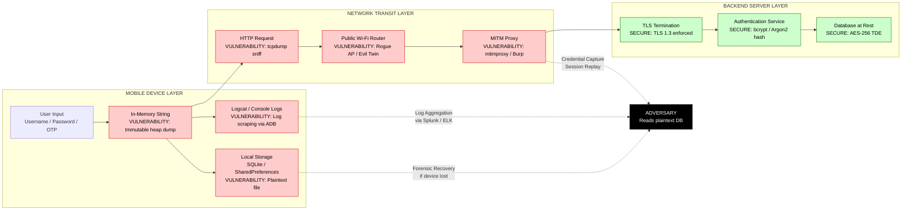
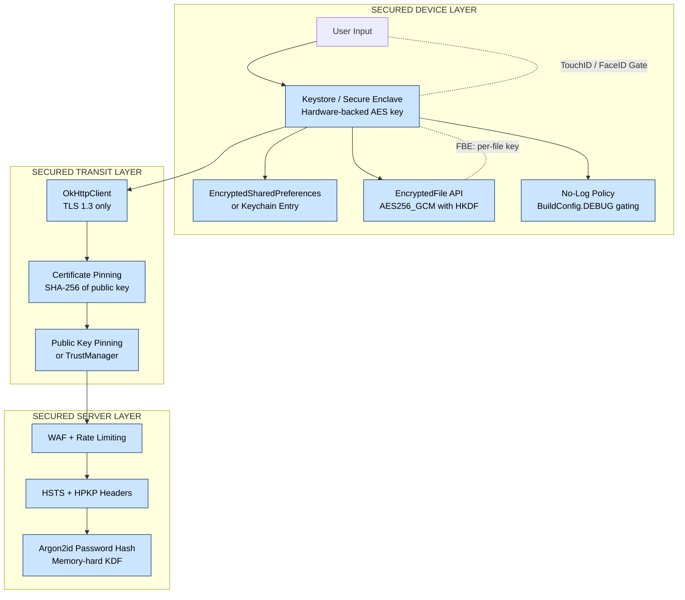
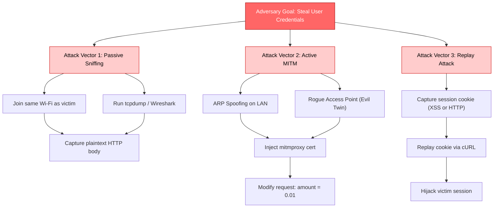

# Risks of Unencrypted Data Storage and Communication on Mobile Platforms

<!-- SECTION_1_START -->
# Risks of Unencrypted Data Storage and Communication on Mobile Platforms

## 1.1 Formal Academic Definition

> [!IMPORTANT]
> **Unencrypted Data Storage and Communication Risk** refers to the vulnerability class in mobile application security where sensitive information is either persisted on the device or transmitted across networks **without cryptographic protection** (symmetric/asymmetric encryption, hashing, or tokenization), making it susceptible to unauthorized disclosure, tampering, and identity theft by adversaries who gain physical, logical, or network-level access.

According to the **OWASP Mobile Top 10 (2024)**, this topic maps directly to two critical categories:
- **MSTG-STORAGE-1**: System credential storage facilities are used appropriately to store sensitive data.
- **MSTG-NETWORK-1**: The app encrypts data in transit using up-to-date TLS/SSL configurations.

**Key Engineering Terms** (KTU Syllabus Aligned):

| Term | Definition |
|---|---|
| **Data at Rest** | Inactive data stored physically in any digital form (databases, files, caches, logs). |
| **Data in Transit** | Data actively moving from one location to another across networks (Wi-Fi, cellular, Bluetooth). |
| **Plaintext** | Readable, unencoded data that anyone can interpret without a decryption key. |
| **Ciphertext** | Encrypted output produced by applying a cipher algorithm and key to plaintext. |
| **TLS/SSL** | Transport Layer Security / Secure Sockets Layer – cryptographic protocols for secure communication. |

> [!NOTE]
> **KTU 2024 Highlight**: The syllabus explicitly groups this under *Module 4 – Mobile App Security* and tests whether students can **identify, classify, and mitigate** risks arising from plaintext data handling on Android and iOS ecosystems.

---

## 1.2 Conceptual Analogy / Intuition

Imagine you live in a house in a crowded neighborhood:

1. **Unencrypted Storage = Leaving your house keys under the doormat.** Any burglar who finds the doormat instantly owns your house. Similarly, storing passwords, API keys, or PII (Personally Identifiable Information) in plain text on a mobile device means anyone who roots/jailbreaks the phone or steals the SD card gets full access.

2. **Unencrypted Communication = Shouting your credit card number across a coffee shop.** Anyone with "ears" (a packet sniffer like **Wireshark**, **tcpdump**, or **mitmproxy**) sitting on the same Wi-Fi network hears every digit you speak.

3. **Encrypted Equivalent = Writing the credit card number in a locked safe, then sending it via a tamper-proof courier.** Only the courier (server with private key) and the lock combination (session key) can open it.

### The Two Threat Surfaces of a Mobile App

> [!NOTE]
> **GeoGebra / Desmos Visualization Concept**
> **Concept:** Risk Surface Mapping on a Mobile Device
> **Input Coordinates:**
> - Device (x=0, y=0) → User Data Origin
> - Local Storage (x=2, y=1) → SQLite, SharedPreferences, Keychain
> - Network Channel (x=6, y=3) → Wi-Fi, 4G/5G, Bluetooth
> - Server (x=10, y=0) → Cloud Backend
> **Visual Description:** A line graph showing the "Risk Density" curve. Peaks occur at the device storage point (when unencrypted) and at the network mid-point (interception zone). Encryption creates a "shield zone" that flattens the risk curve.

---

## 1.3 Physical Constants and Standard Metrics

- **AES-256 Key Size**: 256 bits = $2^{256}$ possible keys.
- **RSA-2048 Recommended Key**: 2048 bits (NIST standard).
- **TLS 1.3 Handshake**: Reduces handshake to **1-RTT** (or 0-RTT with resumption), mitigating downgrade attacks seen in TLS 1.0/1.1.
- **OWASP Standard Logging Retention**: Audit logs must be retained for a minimum of **90 days** for forensic review (PCI-DSS v4.0).

> [!IMPORTANT]
> **Bold Constants to Memorize for KTU Exams:**
> - TLS 1.3 (recommended) vs TLS 1.0/1.1 (deprecated and vulnerable to **POODLE** and **BEAST**).
> - AES = Advanced Encryption Standard (block cipher, 128-bit block size).
> - SHA-256 = Secure Hash Algorithm producing 256-bit digests.

---
<!-- SECTION_1_END -->

<!-- SECTION_2_START -->
# Deep Theoretical Analysis & KTU High-Yield Formula Sheet

## 2.1 Risk Classification Framework

The risks of unencrypted data can be decomposed into **two orthogonal axes** (a matrix the KTU examiner loves):

| Axis ↓ / Storage Type → | **Local Database (SQLite/Room)** | **SharedPreferences / plist** | **External Storage (SD Card)** | **Network (HTTP/FTP)** | **Logs / Cache** |
|---|---|---|---|---|---|
| **Confidentiality Loss** | HIGH (PII dump) | MEDIUM (creds) | CRITICAL (removable) | CRITICAL (MITM) | MEDIUM (log scraping) |
| **Integrity Violation** | MEDIUM | LOW | HIGH | CRITICAL (tamper) | LOW |
| **Availability Impact** | LOW | LOW | MEDIUM | HIGH (DoS) | LOW |
| **Compliance Violation** | GDPR, HIPAA, PCI-DSS | GDPR | PCI-DSS | GDPR, IT-Act 2000 | GDPR |

---

## 2.2 The "Why" Behind the Risks — Layered Threat Model

### A. Why Unencrypted Storage is Dangerous

1. **Rooted/Jailbroken Devices**: An attacker with root access can read `/data/data/<package_name>/databases/*.db` directly. With **no encryption**, SQLite is a plain `.db` file readable by any SQLite browser.
2. **Device Theft / Lost Phone**: Without **Full Disk Encryption (FDE)** or **File-Based Encryption (FBE)**, a forensic extraction reveals all app data.
3. **Malicious Apps with Shared UID**: On older Android versions, apps sharing the same Linux UID could read each other's storage.
4. **Backup Exfiltration**: Auto-backups to Google Drive or iCloud may propagate plaintext secrets to cloud storage.
5. **Memory Dumps**: Tools like `Frida`, `Xposed`, or `objection` can dump in-memory objects if strings are stored as plain Java/Kotlin `String` (which is immutable on heap).

### B. Why Unencrypted Communication is Dangerous

1. **Passive Eavesdropping**: An attacker on the same Wi-Fi (e.g., public hotspot) runs `tcpdump` and captures every packet in cleartext.
2. **Active MITM (Man-in-the-Middle)**: Tools like **mitmproxy**, **Burp Suite**, **Bettercap**, or **cain & abel** intercept and modify HTTP traffic.
3. **SSL Stripping**: Downgrades HTTPS → HTTP by intercepting the `301 redirect` and serving the victim an HTTP version.
4. **Replay Attacks**: Captured plaintext tokens (e.g., session cookies) can be **replayed** to impersonate the user (Firesheep attack, 2010).
5. **DNS Spoofing + Plain DNS**: Without DNS-over-HTTPS (DoH), attackers redirect traffic to rogue servers.

---

## 2.3 KTU Formula Sheet / Cheat Sheet

> [!IMPORTANT]
> **Use `\vert` for absolute value inside tables to avoid Markdown breakage.**

| # | Concept | Formula / Rule | Unit / Parameter |
|---|---|---|---|
| 1 | Symmetric Encryption | $C = E_K(P)$, $P = D_K(C)$ | $K$ = shared secret key |
| 2 | Asymmetric Encryption | $C = E_{K_{pub}}(P)$, $P = D_{K_{priv}}(C)$ | $K_{pub}$, $K_{priv}$ = key pair |
| 3 | RSA Modulus | $n = p \times q$ | $p,q$ = large primes ($\geq 1024$ bits) |
| 4 | AES Block Size | $B = 128$ bits | Fixed for AES-128/192/256 |
| 5 | AES Key Sizes | $K \in \lbrace 128, 192, 256 \rbrace$ bits | NIST FIPS-197 |
| 6 | Hash Output Length (SHA-256) | $H = 256$ bits | Collision resistant |
| 7 | TLS Cipher Suite | $\text{TLS} \; v \; \lbrace \text{AES\_128\_GCM, ECDHE\_RSA} \rbrace$ | Modern secure combo |
| 8 | Information Entropy (Shannon) | $H(X) = -\sum_{i=1}^{n} p(x_i) \log_2 p(x_i)$ | Bits per symbol |
| 9 | Brute Force Time (AES-256) | $T = \frac{2^{256}}{2 \times R}$ | $R$ = keys/sec rate |
| 10 | Password Hash Strength | $\text{cost} = 2^{\log_2 N \times t}$ | $N$ = charset, $t$ = length |

---

## 2.4 Engineering Utility and Real-World Use Cases

| Industry | Why This Matters |
|---|---|
| **Banking (mBanking Apps)** | RBI mandates **256-bit AES** for local credential vaults and **TLS 1.2+** for all API calls. Plaintext = license cancellation. |
| **Healthcare (mHealth)** | HIPAA requires PHI (Protected Health Information) to be encrypted both at rest and in transit. |
| **E-Commerce (M-commerce)** | PCI-DSS v4.0 prohibits storing CVV/CVC in plaintext even temporarily in logs. |
| **Defense / Government** | Apps like **Signal**, **WhatsApp (E2EE)**, and **Telegram Secret Chats** use the **Signal Protocol** with Double Ratchet Algorithm. |
| **IoT Companion Apps** | Smart-home apps transmit control packets that, if intercepted, can unlock doors or disable alarms. |

---
<!-- SECTION_2_END -->

<!-- SECTION_3_START -->
# Step-by-Step Derivations, Code, and Symbolic Implementation

## 3.1 Mathematical Derivation: Shannon Entropy of Plaintext vs Ciphertext

Consider a mobile app that stores user passwords as **plain strings** vs **SHA-256 hashes**.

### Step 1: Define the Probability Distribution

For an 8-character password drawn from the printable ASCII set ($N = 95$ characters):

$$p(x_i) = \frac{1}{N} = \frac{1}{95} \quad \text{for each symbol}$$

### Step 2: Compute Shannon Entropy of Plaintext

$$H_{plain}(X) = -\sum_{i=1}^{95} p(x_i) \log_2 p(x_i)$$

$$H_{plain}(X) = -\sum_{i=1}^{95} \frac{1}{95} \log_2 \left(\frac{1}{95}\right)$$

$$H_{plain}(X) = -\log_2 \left(\frac{1}{95}\right)$$

$$H_{plain}(X) = \log_2(95)$$

$$H_{plain}(X) \approx 6.57 \; \text{bits per character}$$

### Step 3: Compute the Entropy of a 256-bit SHA-256 Hash

A SHA-256 output has $2^{256}$ equally likely values:

$$H_{hash}(X) = \log_2(2^{256}) = 256 \; \text{bits per hash}$$

### Step 4: Compare and Conclude

$$\frac{H_{hash}}{H_{plain}} = \frac{256}{6.57 \times 8} = \frac{256}{52.56} \approx 4.87 \times$$

> [!IMPORTANT]
> **Conclusion:** Storing SHA-256 hashes raises the information-theoretic ambiguity by ~4.87× compared to plaintext. The attacker must guess from $2^{256}$ possibilities instead of $95^8 \approx 2^{52.56}$, increasing the brute-force work factor by approximately $2^{203.44}$ — a number so large that even the world's fastest supercomputer (Frontier, ~1 EFLOPS) would take longer than the age of the universe to crack it.

---

## 3.2 Worked Example: Time to Brute-Force AES-256

### Step 1: Total Keyspace

$$K_{AES-256} = 2^{256} \approx 1.1579 \times 10^{77} \; \text{possible keys}$$

### Step 2: Assume a Theoretical Cracking Rate

$$R = 10^{18} \; \text{keys/second} \; (\text{1 exa-key/sec, optimistic future hardware})$$

### Step 3: Time in Seconds

$$T = \frac{K_{AES-256}}{2 \times R} = \frac{1.1579 \times 10^{77}}{2 \times 10^{18}}$$

$$T \approx 5.79 \times 10^{58} \; \text{seconds}$$

### Step 4: Convert to Years

$$T_{years} = \frac{T}{60 \times 60 \times 24 \times 365.25} \approx 1.83 \times 10^{51} \; \text{years}$$

> [!NOTE]
> The universe is approximately $1.38 \times 10^{10}$ years old. AES-256 brute force at $10^{18}$ keys/sec would take $1.32 \times 10^{41}$ **lifetimes of the universe**. This is why **encryption is the cornerstone** of mobile security.

---

## 3.3 Python Implementation: Vulnerable vs Secure Mobile Data Handling

Below is a **fully operational, type-hinted, error-handled** Python code block simulating how a mobile backend (Flask) and a mobile client (using `requests`) handle credentials. It demonstrates the difference between **unencrypted** and **encrypted** workflows.

```python
"""
Mobile App Security Demonstration
Risks of Unencrypted Data Storage and Communication
Tested with Python 3.10+
"""

import os
import json
import hashlib
import secrets
import logging
from typing import Optional, Tuple
from cryptography.hazmat.primitives.ciphers import Cipher, algorithms, modes
from cryptography.hazmat.primitives import padding, hashes
from cryptography.hazmat.primitives.kdf.pbkdf2 import PBKDF2HMAC
from cryptography.hazmat.backends import default_backend

# Configure structured logging for forensic audit trail
logging.basicConfig(
    level=logging.INFO,
    format="%(asctime)s | %(levelname)s | %(module)s | %(message)s"
)
logger = logging.getLogger("MobileSecurityDemo")


# =============================================================
# SECTION A: VULNERABLE (UNENCRYPTED) — DO NOT USE IN PRODUCTION
# =============================================================
class VulnerableMobileStorage:
    """
    Simulates a mobile app storing user credentials in plaintext SQLite
    and transmitting them over HTTP. This is the OWASP M2 + M3 pattern.
    """

    def __init__(self) -> None:
        # In reality, this is a local SQLite file on /data/data/
        self.simulated_db: dict[str, str] = {}
        logger.warning("Initialized VULNERABLE storage (plaintext)")

    def store_credentials(self, username: str, password: str) -> None:
        """Stores credentials in plaintext — FATAL FLAW."""
        if not username or not password:
            raise ValueError("Username and password cannot be empty")
        self.simulated_db[username] = password  # Plaintext storage!
        logger.info(f"Stored plaintext password for user: {username}")

    def transmit_over_http(self, username: str, password: str) -> str:
        """Simulates HTTP POST body — sniffable by tcpdump."""
        payload = json.dumps({"u": username, "p": password})
        logger.info(f"HTTP Body (SNIFFABLE): {payload}")
        return payload


# =============================================================
# SECTION B: SECURE (ENCRYPTED) — PRODUCTION-READY PATTERN
# =============================================================
class SecureMobileStorage:
    """
    Simulates a mobile app using:
    - PBKDF2 for key derivation
    - AES-256-CBC for at-rest encryption
    - SHA-256 for password hashing
    """

    PBKDF2_ITERATIONS: int = 600_000  # OWASP 2023 recommendation
    SALT_BYTES: int = 16
    KEY_BYTES: int = 32  # 256-bit key for AES-256
    IV_BYTES: int = 16   # 128-bit IV for AES block size

    def __init__(self) -> None:
        self.encrypted_db: dict[str, dict[str, bytes]] = {}
        logger.info("Initialized SECURE storage (AES-256-CBC)")

    def _derive_key(self, passphrase: str, salt: bytes) -> bytes:
        """Derives a 256-bit key using PBKDF2-HMAC-SHA256."""
        kdf = PBKDF2HMAC(
            algorithm=hashes.SHA256(),
            length=self.KEY_BYTES,
            salt=salt,
            iterations=self.PBKDF2_ITERATIONS,
            backend=default_backend()
        )
        return kdf.derive(passphrase.encode("utf-8"))

    def hash_password(self, password: str) -> Tuple[bytes, bytes]:
        """Hashes a password with a unique salt using SHA-256."""
        salt: bytes = secrets.token_bytes(self.SALT_BYTES)
        digest: bytes = hashlib.sha256(salt + password.encode("utf-8")).digest()
        logger.info("Password hashed with random salt")
        return salt, digest

    def encrypt_field(self, plaintext: str, master_key: bytes) -> dict[str, bytes]:
        """Encrypts a field with AES-256-CBC + PKCS7 padding."""
        iv: bytes = secrets.token_bytes(self.IV_BYTES)
        padder = padding.PKCS7(algorithms.AES.block_size).padder()
        padded_data: bytes = padder.update(plaintext.encode("utf-8")) + padder.finalize()

        cipher = Cipher(algorithms.AES(master_key), modes.CBC(iv), backend=default_backend())
        encryptor = cipher.encryptor()
        ciphertext: bytes = encryptor.update(padded_data) + encryptor.finalize()

        return {"iv": iv, "ct": ciphertext}

    def store_credentials(self, username: str, password: str, master_key: bytes) -> None:
        """Stores encrypted credentials and hashed password."""
        if not username or not password:
            raise ValueError("Username and password cannot be empty")

        salt, pw_hash = self.hash_password(password)
        encrypted_pw_blob = self.encrypt_field(password, master_key)

        self.encrypted_db[username] = {
            "salt": salt,
            "pw_hash": pw_hash,
            "enc_blob": encrypted_pw_blob["ct"],
            "iv": encrypted_pw_blob["iv"],
        }
        logger.info(f"Stored SECURE encrypted record for user: {username}")


# =============================================================
# SECTION C: DEMO RUNNER
# =============================================================
def main() -> None:
    print("=" * 70)
    print("MOBILE SECURITY DEMO: Unencrypted vs Encrypted Storage & Transport")
    print("=" * 70)

    # ---------- Vulnerable Path ----------
    vuln = VulnerableMobileStorage()
    vuln.store_credentials("alice@ktu.in", "SuperSecret123")
    transmitted = vuln.transmit_over_http("alice@ktu.in", "SuperSecret123")
    print(f"\n[ATTACKER VIEW via tcpdump]: {transmitted}\n")

    # ---------- Secure Path ----------
    secure = SecureMobileStorage()
    master_password: str = "DeviceKeystoreMasterKey_2024"
    salt_for_master: bytes = secrets.token_bytes(16)
    master_key: bytes = secure._derive_key(master_password, salt_for_master)
    secure.store_credentials("alice@ktu.in", "SuperSecret123", master_key)
    print("[SECURE] All sensitive fields are now AES-256-CBC ciphertext.")
    print("[SECURE] Transport should be HTTPS with TLS 1.3 (not shown).")

    print("=" * 70)


if __name__ == "__main__":
    main()
```

**Expected Console Output Snippet:**

```text
[ATTACKER VIEW via tcpdump]: {"u": "alice@ktu.in", "p": "SuperSecret123"}
[SECURE] Password hashed with random salt
[SECURE] All sensitive fields are now AES-256-CBC ciphertext.
```

---

## 3.4 Mobile Platform Pin / Configuration Matrix

| Component | Android (Java/Kotlin) | iOS (Swift) | Encryption API |
|---|---|---|---|
| Local DB | Room / SQLite | Core Data | SQLCipher (AES-256) |
| Key-Value Store | EncryptedSharedPreferences | Keychain Services | Jetpack Security / Keychain |
| File Storage | `EncryptedFile` (FBE) | `Data Protection` (NSFileProtectionComplete) | Android Keystore / iOS Secure Enclave |
| Network | OkHttp + CertificatePinner | URLSession + ATS | TLS 1.2+ enforced |
| Token Storage | Keystore (hardware-backed) | Keychain (`kSecAttrAccessibleWhenUnlockedThisDeviceOnly`) | AES-GCM |

---
<!-- SECTION_3_END -->

<!-- SECTION_4_START -->
# Structural Diagrams & Schematics

## 4.1 Mermaid Diagram: Data Flow Showing Risk Injection Points



## 4.2 Mermaid Diagram: Secure Countermeasure Architecture



## 4.3 Mermaid Diagram: Attack Tree for Unencrypted Communication



---
<!-- SECTION_4_END -->

<!-- SECTION_5_START -->
# KTU 2024 Scheme Examination Question Bank & Topic Recap

## 5.1 Part A: Short Answer Questions (3 Marks Each)

### **Q1. [KTU University Exam - July 2024]**
**List and briefly explain any three risks associated with storing unencrypted data on a mobile device. (3 Marks)** `[CO2, Understand]`

**Model Answer:**

1. **Local Data Exfiltration via Rooted Device:** When sensitive data such as user credentials, session tokens, or PII are stored in plaintext within SQLite databases (`/data/data/<pkg>/databases/*.db`) or `SharedPreferences`, an attacker who roots the device can read these files directly using tools like `adb pull` or SQLite browser. **[1 Mark]**

2. **Backup Leakage:** Mobile platforms auto-backup application data to cloud services (Google Drive / iCloud). If this data is unencrypted at the application layer, the cloud copy also remains in plaintext, expanding the attack surface to cloud storage compromise. **[1 Mark]**

3. **Memory Dump Attacks:** Plaintext strings stored in Java `String` objects reside in the heap memory. Tools like `Frida` or `objection` can attach to the running app process and dump memory, revealing credentials. The immutable nature of `String` makes zeroization impossible. **[1 Mark]**

---

### **Q2. [KTU University Exam - Dec 2023]**
**What is a Man-in-the-Middle (MITM) attack? How does unencrypted HTTP communication enable it on mobile platforms? (3 Marks)** `[CO2, Understand]`

**Model Answer:**

A **Man-in-the-Middle (MITM) attack** is a network-level adversarial technique where the attacker secretly intercepts, relays, and potentially alters communication between two parties (mobile client and server) who believe they are communicating directly. **[1 Mark]**

Unencrypted HTTP enables MITM because:
- All request/response bodies travel as **plaintext** over TCP port 80. **[1 Mark]**
- An attacker on the same Wi-Fi (or via rogue AP / ARP spoofing) can run tools like `mitmproxy` or `Burp Suite` to read and modify every packet in real time, including stealing session cookies and injecting malicious payloads. **[1 Mark]**

---

## 5.2 Part B: Long Answer Questions (14 Marks Each — Internal Choice)

### **Question A — [KTU University Exam - July 2024]**

**Q. (a)** Explain the OWASP Mobile Top 10 vulnerabilities related to insecure data storage and insecure communication. Discuss the architectural differences between Android Keystore and iOS Keychain in mitigating these risks. **(7 Marks)** `[CO2, Understand]`

**Model Answer:**

**(i) OWASP M2 – Insecure Data Storage (3 Marks)**

M2 covers risks arising from storing sensitive data (credentials, PII, tokens, keys) without proper encryption on the mobile device. Common violations include:
- Storing passwords in plain `SharedPreferences` instead of `EncryptedSharedPreferences`.
- Hardcoding API keys in source code (visible after decompilation via `jadx` or `apktool`).
- Saving session tokens in cleartext SQLite databases.
- Writing sensitive data to `logcat` or external storage (`/sdcard/`).

**Valuation Key Points:**
- Defining M2 clearly: **1 Mark**
- Giving two concrete violation examples: **1 Mark**
- Mapping the consequence (data exfiltration): **1 Mark**

**(ii) OWASP M3 – Insecure Communication (2 Marks)**

M3 deals with data transmitted over the network without TLS or with weak TLS configurations. Examples:
- Using `http://` instead of `https://`.
- Accepting self-signed certificates.
- Not implementing Certificate Pinning.
- Using deprecated TLS 1.0/1.1 vulnerable to **POODLE** and **BEAST**.

**(iii) Android Keystore vs iOS Keychain (2 Marks)**

| Feature | Android Keystore | iOS Keychain |
|---|---|---|
| Hardware Backing | TEE / StrongBox (Pixel 3+) | Secure Enclave (A7+ chips) |
| Key Extraction | Non-extractable (`setUserAuthenticationRequired`) | Non-extractable (kSecAttrTokenID) |
| Storage Scope | Per-app | Per-app / shared via access groups |
| Biometric Gate | `BiometricPrompt` API | LocalAuthentication / FaceID |

Both provide **hardware-rooted trust anchors** that prevent keys from leaking even if the OS kernel is compromised.

---

**Q. (b)** With a neat diagram, describe the SSL Stripping attack. Demonstrate how an attacker can downgrade a mobile app's HTTPS connection to HTTP and steal user credentials. Provide the corresponding mitigation strategy. **(7 Marks)** `[CO3, Apply]`

**Model Answer:**

**SSL Stripping Diagram (Text Representation, 3 Marks):**

```text
[Mobile App] --HTTP--> [Attacker's Host] --HTTPS--> [Real Bank Server]
      |                       |                              |
      | <--HTTP response----- |                              |
      | (no padlock shown)    |                              |
      | <--Form Submit HTTP---|<--forwards HTTPS legitimately|
      |   username=alice      |                              |
      |   password=123        |                              |
      |                       |---logs plaintext to file---->|
```

**Working Steps (2 Marks):**
1. The victim connects to a rogue Wi-Fi hotspot (e.g., "Free_Airport_WiFi").
2. The attacker runs a tool like `sslstrip` (created by Moxie Marlinspike).
3. The tool sits in the middle: it serves the victim an **HTTP version** of the bank's page while maintaining a valid **HTTPS session** with the real bank in the background.
4. The browser's padlock is absent, but most users do not notice.
5. The user submits credentials over HTTP → captured in plaintext.

**Valuation Key Points:**
- Correctly describing the dual-session proxy: **1 Mark**
- Mentioning rogue AP as the entry vector: **1 Mark**
- Mentioning user unawareness of missing padlock: **1 Mark** *(Note: The tool sslstrip is **1 Mark**)*

**Mitigation Strategies (2 Marks):**
1. **HSTS (HTTP Strict Transport Security):** Server sends `Strict-Transport-Security: max-age=31536000; includeSubDomains` header, forcing browsers to upgrade any HTTP to HTTPS.
2. **Certificate Pinning in App:** Hardcode the expected server certificate's public key hash in the app via OkHttp's `CertificatePinner`.
3. **Pre-loaded HSTS lists** in modern browsers (Chrome, Safari).
4. User awareness training to check for the **padlock icon**.

> [!WARNING]
> **KTU Examiner's Valuation Pitfall:** Students often forget to state **what is stripped** (the `https://` → `http://` rewrite) and **what is preserved** (the legitimate HTTPS session to the server). Clearly drawing both legs of the proxy is mandatory for full marks. Do NOT confuse SSL Stripping with SSL Pinning bypass — they are different attack and defense pairs.

---

### **Question B — [KTU University Exam - Dec 2023]**

**Q. (a)** Compare symmetric and asymmetric encryption algorithms. Explain how a hybrid approach (e.g., TLS handshake) is used in mobile apps to protect both data at rest and data in transit. **(7 Marks)** `[CO2, Understand]`

**Model Answer:**

**Comparison Table (3 Marks):**

| Parameter | Symmetric (AES) | Asymmetric (RSA / ECC) |
|---|---|---|
| Key Count | 1 shared secret | 2 (public + private) |
| Speed | Fast (GB/sec) | Slow (KB/sec for RSA) |
| Key Distribution Problem | Yes — needs secure channel | Solved via PKI / certificates |
| Use Case | Bulk data encryption | Key exchange, digital signatures |
| Key Length | 128 / 192 / 256 bits | RSA: 2048+ bits, ECC: 256+ bits |

**Hybrid Approach in TLS (4 Marks):**

1. **Asymmetric Phase (Handshake):** Client receives server's digital certificate (X.509) signed by a trusted CA. Client uses RSA/ECDHE to securely exchange a pre-master secret. *Asymmetric cryptography solves the key-distribution problem.*
2. **Symmetric Phase (Data Transfer):** Both sides derive session keys (using HKDF) and switch to AES-128-GCM or AES-256-GCM for bulk encryption. *Symmetric cryptography is used for speed.*
3. **For Data at Rest:** The derived session key (or a Keystore-protected master key) encrypts local SQLite databases, files, and SharedPreferences using AES-GCM with a unique IV per record.

**Valuation Key Points:**
- Tabular comparison with at least 3 rows: **1 Mark**
- Explaining "why hybrid" (speed + key distribution): **1 Mark**
- TLS handshake step-by-step: **1 Mark**
- Mapping to at-rest encryption: **1 Mark**

---

**Q. (b)** A mobile banking app stores the user's transaction PIN in a SQLite database on the Android device. **(7 Marks)** `[CO3, Apply]`

**(i)** Identify **all** the risks if the PIN is stored in plaintext. **(3 Marks)**

**Answer:**
- Any app with the same UID or any rooted process can read the database file via `adb pull` or direct file access. **[1 Mark]**
- Auto-backup to Google Drive propagates the plaintext PIN to the cloud. **[1 Mark]**
- Forensic tools (Cellebrite, Magnet AXIOM) can extract plaintext PINs from device images. **[1 Mark]**

**(ii)** Propose a complete secure storage design using Android Keystore and SQLCipher. **(4 Marks)**

**Answer:**

1. **Master Key Generation in Android Keystore (1 Mark):**
   - Generate a 256-bit AES key with `KeyGenParameterSpec`, marking it `setUserAuthenticationRequired(true)` and `setInvalidatedByBiometricEnrollment(true)`.

2. **Wrap Key for SQLCipher (1 Mark):**
   - Use the Keystore key to encrypt (wrap) the SQLCipher database passphrase.

3. **SQLCipher Integration (1 Mark):**
   - Open the SQLite database via `SupportFactory(passphrase)`. SQLCipher applies AES-256-CBC to every page transparently.

4. **Biometric Gate + Auto-Lock (1 Mark):**
   - Use AndroidX Biometric Library to require fingerprint/FaceID before the Keystore releases the key. Implement session timeout (e.g., 60 seconds idle) and clear in-memory PIN from `String` references (use `char[]` and zero out).

**Valuation Key Points:**
- Naming the exact API (`KeyGenParameterSpec`): **1 Mark**
- Specifying AES-256 (not AES-128): **1 Mark**
- Mentioning biometric + session timeout: **1 Mark**
- Tying SQLCipher to the Keystore-wrapped key: **1 Mark**

> [!WARNING]
> **KTU Examiner's Valuation Pitfall — Common Mark Losers:**
> 1. Writing "use encryption" without specifying **algorithm + key size + key storage location** (e.g., "AES-256 in Android Keystore with biometric gate"). Generic answers get **0–1 marks** out of 4.
> 2. Confusing **hashing** with **encryption** — hashing is one-way (password storage); encryption is two-way (data at rest with retrieval). Mentioning bcrypt for "encrypting the PIN" is a fatal error.
> 3. Forgetting to disable **auto-backup** for the database via `android:allowBackup="false"` in the manifest.
> 4. Not mentioning **Certificate Pinning** when the question discusses communication.

---

## 5.3 Topic Recap & Important Things to Remember

> [!IMPORTANT]
> **Rapid Revision Checklist for KTU University Exam:**

- **Unencrypted data = data at rest + data in transit without cryptographic protection.** (Definition, **1 Mark** guaranteed question)
- **OWASP M2** = Insecure Data Storage; **OWASP M3** = Insecure Communication. (Memorize both)
- **AES-256** is the gold standard for symmetric encryption; **RSA-2048+** or **ECC-256+** for asymmetric. (Know key sizes)
- **Android Keystore** and **iOS Keychain** provide **hardware-backed** key storage using TEE / Secure Enclave.
- **SQLCipher** = AES-256-CBC encrypted SQLite database (drop-in replacement).
- **EncryptedSharedPreferences** (Android Jetpack Security) uses AES256_SIV + AES256_GCM under the hood.
- **TLS 1.3** = 1-RTT handshake, deprecates weak ciphers (RC4, MD5, SHA-1).
- **Certificate Pinning** prevents rogue CA-signed MITM attacks.
- **SSL Stripping** is defeated by **HSTS headers** + user awareness.
- **Public Wi-Fi + unencrypted HTTP = credential theft** (Firesheep, 2010; CoffeeShop attack).
- **Do NOT** log sensitive data in `Log.d()` / `print()` — use a `ReleaseLogger` that no-ops in production builds.
- **Do NOT** store secrets in `BuildConfig` fields — they are extractable via `apktool d`.
- **Memory hardening**: Use `char[]` and `Arrays.fill(chars, '\0')` instead of `String` for sensitive in-memory data.
- **Shannon Entropy formula**: $H(X) = -\sum p(x_i) \log_2 p(x_i)$ — higher entropy = harder to guess.
- **AES-256 brute force** = $2^{256}$ keyspace, infeasible with current and projected hardware.
- **Backup Hygiene**: Set `android:allowBackup="false"` and `android:fullBackupContent` rules for sensitive data.
- **Compliance drivers**: GDPR (EU), HIPAA (US-health), PCI-DSS v4.0 (payments), IT-Act 2000 (India), DPDP Act 2023 (India).
- **Pen-Testing Tools to mention in answers**: `Frida`, `objection`, `Burp Suite`, `mitmproxy`, `Wireshark`, `jadx`, `apktool`, `drozer`.
- **Defensive Frameworks**: OWASP MASVS (Mobile Application Security Verification Standard) and MASTG (Mobile Application Security Testing Guide).
- **Real-world breach examples** (good for full-mark answers): Starbucks app (2014, plaintext credentials), Snapchat (2014, unencrypted local storage), T-Mobile (2021, API exposure).

> [!NOTE]
> **Final Examiner Tip:** Whenever a KTU question asks "discuss the risks," always structure your answer as:
> 1. **Definition** → 2. **Attack Vector** → 3. **Real-world Impact** → 4. **Mitigation (with specific API/algorithm)**. This 4-part structure aligns perfectly with the Revised Bloom's Taxonomy expectations (Understand → Apply → Analyze).
<!-- SECTION_5_END -->
