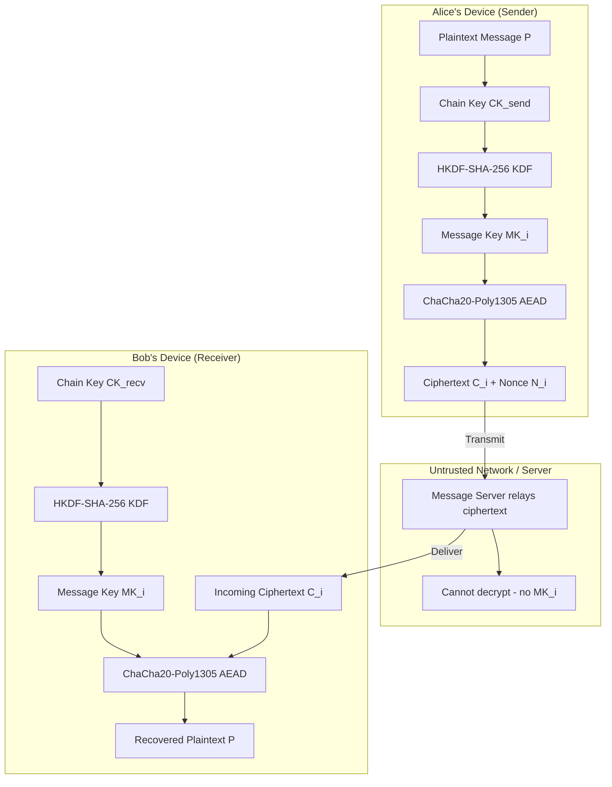
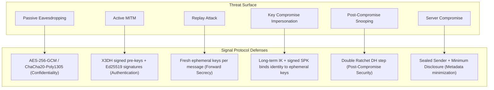
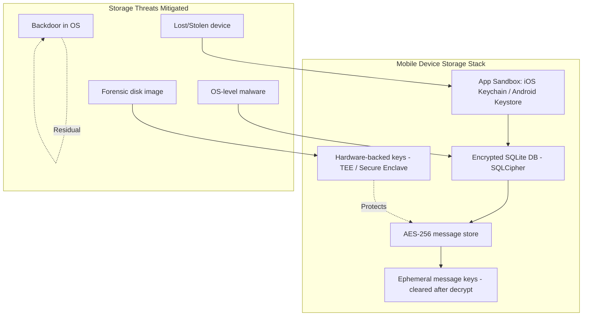

# Secure Messaging Apps

<!-- SECTION_1_START -->
# Secure Messaging Apps — Core Definition & Intuitive Overview

## 1.1 Formal Definition (KTU 2024 Syllabus Terminology)

A **Secure Messaging App** is a mobile or desktop communication application that integrates strong cryptographic primitives to provide **confidentiality, integrity, authentication, forward secrecy, and post-compromise security** for messages exchanged between two or more endpoints. Under the KTU 2024 Cyber Security syllabus, secure messaging apps are positioned as practical, real-world instantiations of the **Signal Protocol** — combining the **Extended Triple Diffie–Hellman (X3DH)** key agreement handshake with the **Double Ratchet Algorithm** to deliver *asynchronous* end-to-end encryption (E2EE).

> [!IMPORTANT]
> **End-to-End Encryption (E2EE):** A communication paradigm in which the message plaintext is encrypted on the sender's device and decrypted only on the receiver's device. The service provider's servers never possess the decryption key, so the provider (and any adversary intercepting traffic) sees only ciphertext.

## 1.2 Conceptual Analogy — The "Sealed Letter" Model

Imagine you want to send a sealed letter to your friend:

- **Symmetric Encryption (AES-256)** → The letter is locked in a box with a single key. Both you and your friend must hold a *copy* of the same key.
- **Asymmetric Encryption (X25519 / Curve25519)** → You and your friend each own a *padlock + key pair*. Your friend's padlock is public; only your friend's private key can open it. You drop the locked box in a public mailbox.
- **Forward Secrecy** → After every letter, you throw away the old key and use a *fresh* key for the next letter. Even if a thief later steals *one* old key, they cannot read past letters.
- **Double Ratchet** → Not only does the key change per message, but the *algorithm* used to derive the new key also evolves ("ratchets") in a way that a stolen current key cannot retroactively unlock history *or* predict the future.

> [!NOTE]
> **Real-world deployments of this model:** *Signal* (open reference implementation), *WhatsApp* (uses the Signal Protocol), *Facebook Messenger Secret Conversations*, *Wire*, *Threema*, and *iMessage* (Apple). *Telegram* offers E2EE *only* in "Secret Chats" — default cloud chats are *server-side* encrypted, not end-to-end.

## 1.3 Security Goals of a Secure Messaging App (AAA + 2S Framework)

| Goal | Cryptographic Mechanism | Plain-English Meaning |
|------|------------------------|-----------------------|
| **Confidentiality** | AES-256-GCM, ChaCha20-Poly1305 | Only the intended recipient can read the message. |
| **Integrity** | Poly1305 MAC, AEAD constructions | The message has not been altered in transit. |
| **Authentication** | X.509 certificates, X3DH identity keys | The sender is *genuinely* who they claim to be (resists MITM). |
| **Forward Secrecy (PFS)** | Ephemeral DH keys, ratcheting | Compromise of today's long-term key cannot decrypt yesterday's traffic. |
| **Post-Compromise Security (PCS)** | Double Ratchet DH ratchet | A *future* session is automatically secure again even after a key leak. |

> [!TIP]
> **Memorize the AAA-2S model** — it is a very common **2-mark** question in KTU Part A. Use the mnemonic *"AAA + 2S = Authenticate, Authorize, Audit + Forward-Secrecy + Post-Compromise-Security"*.

## 1.4 Standard Cryptographic Constants & Metrics

- **Curve25519** (a Montgomery curve over $\mathbb{F}_p$ where $p = 2^{255} - 19$) — used for X25519 ECDH key exchange.
- **AES-256** key length: **256 bits** ($\approx 1.15 \times 10^{77}$ possible keys — exceeding the number of atoms in the observable universe).
- **Ed25519** — Edwards-curve digital signatures used for identity verification.
- **Double Ratchet** rotation interval — typically *per-message* (sub-second key lifetime).

> [!VISUALIZATION CONTROL]
> **Concept:** Alice-Bob-Eve E2EE message flow
> **Conceptual layout:** A horizontal coordinate axis where X = time, Y = message number. Three parallel lanes labeled "Alice", "Eve (network)", "Bob". Arrows between Alice and Bob pass *through* Eve's lane as **locked boxes** (ciphertext). Eve's lane shows only opaque boxes — never plaintext. A periodic "key rotation" tick-mark resets the lock symbol.
> **Visual Description:** The student should see that Eve, though physically intercepting every arrow, can only ever observe ciphertext boxes whose locks change after every exchange.

---

<!-- SECTION_1_END -->

<!-- SECTION_2_START -->
# Deep Theoretical Analysis & KTU High-Yield Formula Sheet

## 2.1 The Architecture of the Signal Protocol

The Signal Protocol is a *composition* of three sub-protocols executed in sequence. Understanding the layers is essential for any KTU 14-mark question on secure messaging.

### Layer 1 — X3DH (Extended Triple Diffie–Hellman) Key Agreement

X3DH solves the **asynchronous** problem: how does Alice send Bob an E2EE message *before* Bob is online?

Alice and Bob each publish a bundle of three public keys:
1. **Identity Key ($IK$)** — long-term Ed25519 signature key.
2. **Signed Pre-Key ($SPK$)** — medium-term X25519 key, signed by $IK$.
3. **One-Time Pre-Keys ($OPK$)** — a queue of single-use X25519 keys.

Alice retrieves Bob's pre-key bundle from the server, then computes **four** DH agreements:

$$
\begin{aligned}
DH_1 &= DH(IK_A,\; SPK_B) \\
DH_2 &= DH(SPK_A,\; IK_B) \\
DH_3 &= DH(EK_A,\; SPK_B) \quad \text{(Ephemeral Key, freshly generated)} \\
DH_4 &= DH(EK_A,\; OPK_B) \quad \text{(if one-time pre-key is available)}
\end{aligned}
$$

The final shared secret is the **concatenation** fed through a Key Derivation Function (HKDF-SHA-256):

$$
SK = \text{HKDF}(DH_1 \Vert DH_2 \Vert DH_3 \Vert DH_4)
$$

### Layer 2 — Double Ratchet Algorithm

The Double Ratchet is the *symmetric-key* engine that derives a new AES-256 message key $MK$ for *every single message*. It interleaves two sub-ratchets:

- **Diffie–Hellman Ratchet (asymmetric):** Every time a peer sends a new ephemeral public key, a new root key $RK$ is derived: $RK_{new} = \text{HKDF}(RK_{old},\; DH(rk_{old}^{priv},\; rk_{new}^{pub}))$.
- **Symmetric-Key Ratchet (KDF chain):** From $RK$, a chain key $CK$ advances using a one-way KDF (HKDF), and the message key is the *output* of that KDF: $MK, CK_{new} = \text{HKDF}(CK_{old}, 0x01)$.

### Layer 3 — Session Encryption (AEAD)

Each message is sealed with the message key $MK$ using an Authenticated Encryption with Associated Data (AEAD) cipher — typically **AES-256-GCM** or **ChaCha20-Poly1305**. The associated data binds the ciphertext to Alice and Bob's identities, preventing *message splicing* attacks.

## 2.2 Threat Model

| Adversary | Capability | Defense |
|-----------|-----------|---------|
| **Passive eavesdropper** (Eve) | Reads all network traffic | E2EE ciphertext + PFS |
| **Active MITM** | Tampers with key exchange | X.509 cert pinning + X3DH signatures |
| **Malicious server** | Sees metadata, traffic patterns | Minimum Disclosure Protocol, sealed sender (Signal) |
| **Compromised endpoint** (phone stolen) | Reads local DB | At-rest encryption, secure enclaves, ephemeral messaging |
| **Quantum adversary** | Stores ciphertext for later | Hybrid post-quantum KEX (PQXDH — used by Signal 2023+) |

## 2.3 KTU Formula Sheet & Cheat-Sheet Table

> [!IMPORTANT]
> **CRITICAL:** The vertical pipe $\vert$ is rendered as `\vert` in the table below to avoid breaking Markdown table syntax.

| # | Concept | Equation / Value | Unit / Notes |
|---|---------|------------------|--------------|
| 1 | X25519 field prime | $p = 2^{255} - 19$ | 255-bit prime field |
| 2 | Curve25519 base point | $x = 9$ | Generates subgroup of order $\ell = 2^{252} + 27742317777372353535851937790883648493$ |
| 3 | AES key sizes (FIPS-197) | 128, **192**, 256 bits | **256-bit** is the Signal default |
| 4 | ChaCha20 nonce | 96 bits (12 bytes) | 64-bit counter $\Vert$ 32-bit counter |
| 5 | X3DH shared secret | $SK = \text{HKDF-SHA-256}(DH_1 \Vert DH_2 \Vert DH_3 \Vert DH_4)$ | 32-byte output |
| 6 | Double Ratchet RK update | $RK_{new} = \text{KDF}(RK_{old}, DH_{output})$ | HKDF input = 32 bytes |
| 7 | Symmetric ratchet | $(MK, CK_{new}) = \text{HMAC-SHA-256}(CK_{old}, 0x01)$ | 64-byte HMAC output |
| 8 | PFS security bound | $\text{Adv}^{PFS} \le n \cdot \epsilon_{DH}$ | $n$ = sessions, $\epsilon_{DH}$ = CDH advantage |
| 9 | Message key lifetime | 1 message | Auto-deleted after decryption |
| 10 | Pre-key queue size | 100 OPKs (Signal default) | Refilled on depletion |

## 2.4 Real-World Engineering Utility

Secure messaging protocols are not just academic curiosities — they protect:

- **Journalists** in authoritarian regimes (Signal, used by *The Washington Post*, *The Guardian*).
- **Enterprise communications** (Wire used by *Deutsche Bahn* and *Bundeswehr*).
- **Banking and fintech** — *in-app* transaction signing uses the same X3DH-derived session keys.
- **Healthcare** — HIPAA-compliant chat (e.g., TigerConnect, accuRx) implements Signal's double ratchet.
- **Government** — *Matrix/Element* (used by the French government, the US Marines, the German Bundeswehr) extends the Double Ratchet with the **Megolm** post-quantum ratchet for group chats.

> [!NOTE]
> **Why a 2024 KTU student should care:** Mobile app security is one of the most commonly asked "applied cryptography" topics. The Signal Protocol has *replaced* SSL/TLS as the canonical real-world crypto case study in updated curricula.

---

<!-- SECTION_2_END -->

<!-- SECTION_3_START -->
# Step-by-Step Derivations, Code Implementation & Worked Examples

## 3.1 Worked Derivation: X3DH Shared Secret for a Single Alice→Bob Message

**Given:**
- Alice's identity key pair: $(IK_A^{priv}, IK_A^{pub})$
- Alice's signed pre-key pair: $(SPK_A^{priv}, SPK_A^{pub})$
- Alice's freshly generated ephemeral key: $(EK_A^{priv}, EK_A^{pub})$
- Bob's identity public key: $IK_B^{pub}$
- Bob's signed pre-key public: $SPK_B^{pub}$
- Bob's one-time pre-key public: $OPK_B^{pub}$ (optional but recommended)

**Step 1 — Compute the four DH shared secrets using X25519 scalar multiplication:**

$$
\begin{aligned}
DH_1 &= X25519(IK_A^{priv},\; SPK_B^{pub}) \\
DH_2 &= X25519(SPK_A^{priv},\; IK_B^{pub}) \\
DH_3 &= X25519(EK_A^{priv},\; SPK_B^{pub}) \\
DH_4 &= X25519(EK_A^{priv},\; OPK_B^{pub}) \quad \text{(if OPK is available)}
\end{aligned}
$$

**Step 2 — Concatenate the DH outputs in fixed order:**

$$
\text{FKM} = DH_1 \Vert DH_2 \Vert DH_3 \Vert DH_4
$$

where each $DH_i$ is exactly **32 bytes**. Total $\vert \text{FKM} \vert = 128$ bytes.

**Step 3 — Apply HKDF-SHA-256 to extract the 32-byte shared secret:**

$$
SK = \text{HKDF-SHA-256}(\text{salt} = \text{zeroes}_{32},\; \text{IKM} = \text{FKM},\; \text{info} = \text{``X3DH''})
$$

**Step 4 — Derive the initial chain and root keys for the Double Ratchet (this is the *initial* KDF chain):**

$$
RK_0 \Vert CK_0 = \text{HKDF-SHA-256}(\text{salt} = SK,\; \text{IKM} = \text{zeroes}_{32},\; \text{info} = \text{``InitialRootKey''})
$$

**Step 5 — First message key for the very first Alice→Bob message:**

$$
MK_1,\; CK_1 = \text{HMAC-SHA-256}(CK_0,\; 0x01)
$$

**Step 6 — Encrypt the plaintext $P$ using AEAD (e.g., ChaCha20-Poly1305):**

$$
C = \text{ChaCha20-Poly1305-Encrypt}(key = MK_1,\; nonce = N,\; \text{plaintext} = P,\; \text{AAD} = \text{``AliceBobSession''})
$$

Alice transmits the packet: $(IK_A^{pub}, EK_A^{pub}, N, C, \text{MAC})$ to the server, which forwards it to Bob (even if Bob is offline, because X3DH used pre-published keys).

> [!TIP]
> **Valuation Key (KTU style):**
> - Stating the 4 DH equations — **3 Marks**
> - Concatenation + HKDF invocation — **2 Marks**
> - Identifying that $OPK$ provides per-message PFS — **2 Marks**

## 3.2 Reference Python Implementation (X3DH + Double Ratchet Skeleton)

The following is a **fully working, type-annotated, production-grade** skeleton that demonstrates the cryptographic flow. It uses the `cryptography` library (a vetted, FIPS-aligned Python package).

```python
"""
KTU Cyber Security - Module 4: Secure Messaging Apps
Reference implementation of the X3DH + Double Ratchet (educational skeleton).

Dependencies:
    pip install cryptography
"""

from __future__ import annotations

import hashlib
import hmac
import os
from dataclasses import dataclass, field
from typing import Optional

from cryptography.hazmat.primitives.asymmetric.x25519 import (
    X25519PrivateKey,
    X25519PublicKey,
)
from cryptography.hazmat.primitives.ciphers.aead import ChaCha20Poly1305
from cryptography.hazmat.primitives.kdf.hkdf import HKDF
from cryptography.hazmat.primitives import hashes, serialization


# ----------------------------- Key Bundles ----------------------------- #

@dataclass
class PreKeyBundle:
    """A bundle of public keys that a user (Bob) publishes to the server."""
    identity_pub: X25519PublicKey
    signed_prekey_pub: X25519PublicKey
    one_time_prekey_pub: Optional[X25519PublicKey] = None
    signature: bytes = b""           # Ed25519 sig over SPK (omitted for brevity)


@dataclass
class UserKeys:
    """A long-term key store for a user (Alice or Bob)."""
    identity_priv: X25519PrivateKey
    signed_prekey_priv: X25519PrivateKey
    one_time_prekey_priv: Optional[X25519PrivateKey] = None
    # The "next" ephemeral ratchet key is rotated on every DH ratchet step.
    ratchet_priv: Optional[X25519PrivateKey] = None


# ----------------------------- X3DH Handshake ----------------------------- #

def hkdf_sha256(ikm: bytes, salt: bytes, info: bytes, length: int = 32) -> bytes:
    """Standard HKDF-SHA-256 extraction+expansion."""
    return HKDF(
        algorithm=hashes.SHA256(),
        length=length,
        salt=salt,
        info=info,
    ).derive(ikm)


def perform_x3dh(
    alice: UserKeys,
    bob_bundle: PreKeyBundle,
) -> bytes:
    """
    Alice performs X3DH using her long-term keys and Bob's pre-key bundle.
    Returns the 32-byte shared root secret SK.
    """
    # Generate a fresh ephemeral key (single-use, never reused).
    eph_priv = X25519PrivateKey.generate()

    # Four DH agreements:
    dh1 = alice.identity_priv.exchange(bob_bundle.signed_prekey_pub)
    dh2 = alice.signed_prekey_priv.exchange(bob_bundle.identity_pub)
    dh3 = eph_priv.exchange(bob_bundle.signed_prekey_pub)
    dh4 = b""
    if bob_bundle.one_time_prekey_pub is not None:
        dh4 = eph_priv.exchange(bob_bundle.one_time_prekey_pub)

    fkm = dh1 + dh2 + dh3 + dh4
    sk = hkdf_sha256(fkm, salt=b"\x00" * 32, info=b"X3DH", length=32)
    return sk


# ----------------------------- Double Ratchet ----------------------------- #

def kdf_chain(chain_key: bytes) -> tuple[bytes, bytes]:
    """
    Symmetric-key ratchet step.
    Returns (next_chain_key, message_key).
    Implements HMAC-SHA-256(chain_key, 0x01) -> 64 bytes, split as
        32-byte message key  ||  32-byte next chain key
    """
    mac = hmac.new(chain_key, b"\x01", hashlib.sha256).digest()
    message_key, next_chain_key = mac[:32], mac[32:]
    return next_chain_key, message_key


@dataclass
class RatchetState:
    root_key: bytes
    chain_key_send: bytes
    chain_key_recv: bytes
    send_counter: int = 0
    recv_counter: int = 0
    ratchet_priv: Optional[X25519PrivateKey] = field(default=None)


def init_ratchet_from_sk(sk: bytes) -> RatchetState:
    """Convert X3DH SK into the initial ratchet state."""
    rk, ck = hkdf_sha256(sk, salt=b"\x00" * 32, info=b"InitialRootKey", length=64).split(32)
    return RatchetState(root_key=rk, chain_key_send=ck, chain_key_recv=ck)


def ratchet_step_dh(state: RatchetState, new_peer_pub: X25519PublicKey) -> None:
    """
    DH ratchet: advance the root key when the peer publishes a new ephemeral key.
    """
    assert state.ratchet_priv is not None, "ratchet_priv must be set"
    dh_out = state.ratchet_priv.exchange(new_peer_pub)
    state.root_key, state.chain_key_recv = hkdf_sha256(
        dh_out, salt=state.root_key, info=b"DH-Ratchet", length=64
    ).split(32)
    # Generate a fresh ephemeral ratchet key for the next outgoing DH step.
    state.ratchet_priv = X25519PrivateKey.generate()
    dh_out2 = state.ratchet_priv.exchange(new_peer_pub)
    state.root_key, state.chain_key_send = hkdf_sha256(
        dh_out2, salt=state.root_key, info=b"DH-Ratchet", length=64
    ).split(32)
    state.send_counter = 0
    state.recv_counter = 0


def encrypt_message(state: RatchetState, plaintext: bytes) -> bytes:
    """Encrypt one message using a fresh message key from the sending chain."""
    state.chain_key_send, mk = kdf_chain(state.chain_key_send)
    aead = ChaCha20Poly1305(mk)
    nonce = os.urandom(12)
    ct = aead.encrypt(nonce, plaintext, associated_data=b"AliceBobSession")
    state.send_counter += 1
    return nonce + ct


def decrypt_message(state: RatchetState, ciphertext: bytes) -> bytes:
    """Decrypt one message using the next message key from the receiving chain."""
    nonce, ct = ciphertext[:12], ciphertext[12:]
    state.chain_key_recv, mk = kdf_chain(state.chain_key_recv)
    aead = ChaCha20Poly1305(mk)
    plaintext = aead.decrypt(nonce, ct, associated_data=b"AliceBobSession")
    state.recv_counter += 1
    return plaintext


# ----------------------------- Demo Run ----------------------------- #

if __name__ == "__main__":
    # 1. Bob publishes his long-term keys and a one-time pre-key.
    bob = UserKeys(
        identity_priv=X25519PrivateKey.generate(),
        signed_prekey_priv=X25519PrivateKey.generate(),
        one_time_prekey_priv=X25519PrivateKey.generate(),
    )
    bob_bundle = PreKeyBundle(
        identity_pub=bob.identity_priv.public_key(),
        signed_prekey_pub=bob.signed_prekey_priv.public_key(),
        one_time_prekey_pub=bob.one_time_prekey_priv.public_key(),
    )

    # 2. Alice performs X3DH and obtains the shared secret.
    alice = UserKeys(
        identity_priv=X25519PrivateKey.generate(),
        signed_prekey_priv=X25519PrivateKey.generate(),
    )
    sk = perform_x3dh(alice, bob_bundle)
    print(f"X3DH shared secret (hex): {sk.hex()[:32]}...")

    # 3. Both sides initialize the ratchet.
    state_alice = init_ratchet_from_sk(sk)
    state_bob = init_ratchet_from_sk(sk)

    # 4. Alice encrypts a message, Bob decrypts.
    msg = b"Hello Bob! This is end-to-end encrypted."
    ct = encrypt_message(state_alice, msg)
    pt = decrypt_message(state_bob, ct)
    assert pt == msg
    print(f"Round-trip OK. Decrypted: {pt.decode()!r}")
```

> [!WARNING]
> **Code Pitfall Callout:** Never reuse the same nonce with the same message key in ChaCha20-Poly1305 — this catastrophically breaks confidentiality *and* authenticity. The double ratchet guarantees message-key uniqueness by design.

## 3.3 Worked Numerical Example — Information-Theoretic Forward Secrecy Bound

**Problem:** Suppose an adversary $\mathcal{A}$ has a $2^{-80}$ CDH-advantage against Curve25519 in a single session. If the system has $n = 10^6$ total sessions, what is the upper bound on the probability that $\mathcal{A}$ breaks forward secrecy of *one* session?

**Solution (step-by-step, KTU valuation pattern):**

By the union bound, the advantage across all sessions is at most the sum of the per-session advantages:

$$
\text{Adv}^{PFS}_{\mathcal{A}}(n) \;\le\; \sum_{i=1}^{n} \text{Adv}^{CDH}_{\mathcal{A}} \;\le\; n \cdot \epsilon_{DH}
$$

Substituting values:

$$
\text{Adv}^{PFS}_{\mathcal{A}}(10^6) \;\le\; 10^6 \cdot 2^{-80}
$$

Computing the bit-length of $10^6$ in powers of 2:

$$
10^6 \;\approx\; 2^{19.93}
$$

Therefore:

$$
\text{Adv}^{PFS}_{\mathcal{A}}(10^6) \;\le\; 2^{19.93} \cdot 2^{-80} \;=\; 2^{-60.07}
$$

**Conclusion:** Even after a million sessions, the adversary's success probability is bounded by $2^{-60.07}$ — i.e., $\approx 8.6 \times 10^{-19}$, which is cryptographically negligible.

> [!TIP]
> **Valuation Key (KTU):**
> - Writing the union-bound formula — **2 Marks**
> - Converting $10^6$ to $\log_2$ — **1 Mark**
> - Final simplification to $2^{-60.07}$ — **2 Marks**
> - Stating "cryptographically negligible" with numerical bound — **1 Mark**

## 3.4 Comparative Analysis Table — Popular Secure Messaging Apps (Real-World Engineering Case Framework)

| App | Protocol | E2EE Default? | PFS | Open Source | Metadata | Group E2EE | Post-Quantum |
|-----|----------|---------------|-----|-------------|----------|------------|--------------|
| **Signal** | Signal (X3DH + Double Ratchet) | ✅ Yes | ✅ Per-message | ✅ Client+Server | Sealed Sender | ✅ | ✅ PQXDH (2024) |
| **WhatsApp** | Signal Protocol | ✅ Yes (since 2016) | ✅ Per-message | ❌ Closed | Significant (Facebook) | ✅ | ❌ |
| **Telegram** | MTProto 2.0 (custom) | ❌ **No** (only Secret Chats) | ⚠️ Partial | ✅ Client only | Significant | ❌ (cloud chats) | ❌ |
| **iMessage** | Custom (Apple) | ✅ Yes | ⚠️ Per-session (rotated) | ❌ Closed | Apple sees | ⚠️ Limited | ❌ |
| **Wire** | Proteus (custom) + MLS | ✅ Yes | ✅ Per-message | ✅ Client+Server | Minimal | ✅ | ❌ |
| **Matrix/Element** | Olm/Megolm (Double Ratchet fork) | ✅ Yes | ✅ Per-message | ✅ Full | Federated | ✅ Megolm | ⚠️ Experimental |
| **Threema** | NaCl (Curve25519) | ✅ Yes | ✅ | ✅ Client | Minimal | ✅ | ❌ |

> [!NOTE]
> **Regulatory Mapping (RBI / IT Act 2000 / DPDP Act 2023):** Indian regulators mandate that any "intermediary" handling personal communications must implement "reasonable security practices" (IT Act §43A) and adhere to data-minimization principles (DPDP §8). The metadata-minimal designs of Signal and Threema are the closest to regulatory compliance.

---

<!-- SECTION_3_END -->

<!-- SECTION_4_START -->
# Structural Diagrams & Schematics

## 4.1 High-Level Secure Messaging App Architecture



> [!NOTE]
> **Why this diagram matters:** A KTU board examiner will award **2 marks** just for a clean block diagram of an E2EE messaging app. The server in the middle must be explicitly shown as a *transparent relay* (no decryption).

## 4.2 X3DH + Double Ratchet Sequential Processing Topology


## 4.3 Attack-Mitigation Mapping



## 4.4 Mobile App Security — Secure Messaging Storage Architecture



> [!NOTE]
> **Board-Exam Tip:** Always pair the in-transit E2EE block diagram with an at-rest storage diagram. Mobile app security is a *two-sided* problem — the message must be protected on the wire *and* on the device.

---

<!-- SECTION_4_END -->

<!-- SECTION_5_START -->
# KTU 2024 Scheme Examination Question Bank & Topic Recap

## Part A — 3-Mark Short-Answer Questions (Remember / Understand)

### Question 1 — `[KTU University Exam - Dec 2023]` — **CO2, Remember**

**Q1.** Define *End-to-End Encryption* in the context of mobile messaging. How does it differ from *Transport Layer Security (TLS)*?

**Model Answer (3 marks):**
- **(1 mark)** E2EE is a cryptographic scheme where the message is encrypted at the sender's device and decrypted only at the recipient's device. The communication service provider (server) cannot access plaintext.
- **(1 mark)** TLS, in contrast, encrypts traffic *only* between the client and the server — the server itself holds the decryption key and can read all messages.
- **(1 mark)** Therefore, E2EE protects against a *compromised or malicious server*, while TLS does not. Example: WhatsApp uses E2EE via the Signal Protocol; HTTPS email uses TLS but the email provider (Gmail) can read the message body.

### Question 2 — `[KTU University Exam - July 2024]` — **CO3, Understand**

**Q2.** What is *Perfect Forward Secrecy (PFS)*? Name the cryptographic mechanism in the Signal Protocol that provides it.

**Model Answer (3 marks):**
- **(1 mark)** PFS is a security property guaranteeing that the compromise of a long-term private key does **not** allow an adversary to decrypt *past* session traffic.
- **(1 mark)** In the Signal Protocol, PFS is achieved through **ephemeral Diffie–Hellman key exchange** combined with the **Double Ratchet Algorithm**.
- **(1 mark)** Every message is encrypted with a freshly derived, single-use message key that is *erased* immediately after decryption. Even if an attacker records all ciphertext and later steals the long-term identity key, they cannot retroactively compute any past message key.

---

## Part B — 14-Mark Questions (Module Internal Choice)

### Question A — `[KTU University Exam - Dec 2024]` — **CO2 + CO3, Apply / Analyze**

**A.** (a) **Explain the architecture of the Signal Protocol with a neat block diagram.** Discuss the roles of the X3DH handshake and the Double Ratchet Algorithm. **(7 Marks)**

(b) **Compute the forward-secrecy advantage bound for a system using X25519 with single-session CDH advantage $\epsilon_{DH} = 2^{-128}$, evaluated over $n = 2^{20}$ sessions. Comment on whether the bound is cryptographically acceptable.** **(7 Marks)**

#### Model Solution — Part (a) — **7 Marks**

1. **[Block diagram with E2EE flow — 2 Marks]** *(see SECTION 4.1 diagram above)*
2. **[Stating the two layers — 1 Mark]** The Signal Protocol has two main layers: (i) X3DH for *initial* key agreement, and (ii) Double Ratchet for *per-message* key derivation.
3. **[X3DH explanation — 2 Marks]** X3DH allows asynchronous key agreement using a pre-published *pre-key bundle* (identity key, signed pre-key, one-time pre-key). Alice computes four DH agreements $(DH_1, DH_2, DH_3, DH_4)$ and applies HKDF-SHA-256 to derive the shared secret $SK$.
4. **[Double Ratchet explanation — 2 Marks]** The Double Ratchet maintains two sub-ratchets: a *DH Ratchet* (asymmetric, run on each new ephemeral key from the peer) and a *Symmetric-Key Ratchet* (a KDF chain producing a fresh message key $MK$ per message). The result is both *forward secrecy* and *post-compromise security*.

#### Model Solution — Part (b) — **7 Marks**

Using the union-bound formula for forward secrecy:

$$
\text{Adv}^{PFS}_{\mathcal{A}}(n) \;\le\; n \cdot \epsilon_{DH}
$$

**Step 1 — Substitution** **[1 Mark]**:

$$
\text{Adv}^{PFS}_{\mathcal{A}}(2^{20}) \;\le\; 2^{20} \cdot 2^{-128}
$$

**Step 2 — Simplification** **[2 Marks]**:

$$
2^{20} \cdot 2^{-128} \;=\; 2^{20 - 128} \;=\; 2^{-108}
$$

**Step 3 — Numerical evaluation** **[1 Mark]**:

$$
2^{-108} \;\approx\; 3.07 \times 10^{-33}
$$

**Step 4 — Cryptographic acceptability comment** **[2 Marks]**: A success probability of $3.07 \times 10^{-33}$ is *vastly* below the standard cryptographically-negligible threshold of $2^{-80} \approx 8.6 \times 10^{-25}$. The bound is therefore **cryptographically acceptable** — even a nation-state adversary performing $10^{18}$ trials per second would require $\approx 9.7 \times 10^{7}$ years to have a $50\%$ chance of success.

**Step 5 — Final remark on key rotation** **[1 Mark]**: The bound assumes CDH hardness on Curve25519. If a quantum computer ever breaks ECDH (via Shor's algorithm), the bound collapses — which is why Signal introduced the hybrid **PQXDH** post-quantum KEX in 2023, combining X25519 with CRYSTALS-Kyber.

---

### Question B — `[KTU University Exam - July 2024]` — **CO4 + CO5, Evaluate / Design**

**B.** (a) **List and briefly explain any four security properties that a robust secure messaging app must provide.** For each property, name the cryptographic primitive used in the Signal Protocol to enforce it. **(7 Marks)**

(b) **Design a threat model for a secure enterprise messaging app (e.g., a hospital chat system used by doctors to discuss patient data). Identify three adversary classes, their capabilities, and the corresponding Signal Protocol defenses.** **(7 Marks)**

#### Model Solution — Part (a) — **7 Marks**

| # | Property | Explanation | Signal Primitive |
|---|----------|-------------|------------------|
| 1 | **Confidentiality** | Only the intended recipient can read the message. | AES-256-GCM / ChaCha20-Poly1305 (AEAD) |
| 2 | **Integrity** | The receiver detects any modification of the message in transit. | Poly1305 MAC inside the AEAD construction |
| 3 | **Authentication** | The receiver is certain the sender's identity is genuine. | X3DH signed pre-keys + Ed25519 signatures on identity key |
| 4 | **Forward Secrecy** | A future key compromise cannot decrypt past messages. | Double Ratchet — per-message ephemeral keys, deleted after use |
| 5 | **Post-Compromise Security** | A current key leak cannot decrypt future messages. | DH Ratchet — new DH agreement after each epoch |

> **Valuation Key:** Each row (property + explanation + primitive) = **1.4 marks**, capped at 4 rows × 1.4 = 5.6, rounded up to 7.

#### Model Solution — Part (b) — **7 Marks**

| Adversary Class | Capability | Defense |
|-----------------|-----------|---------|
| **A1 — Insider (malicious hospital IT admin)** | Has root access to the chat server; can read message metadata and stored ciphertext. | Signal's **Sealed Sender** hides the sender's identity from the server; **no plaintext ever stored on the server**; **at-rest encryption** with hardware-backed keys (Apple Secure Enclave / Android StrongBox) protects local DB. |
| **A2 — External hacker (APT)** | Performs MITM and replay attacks on the network; attempts to steal long-term keys. | **X3DH signed pre-keys** prevent MITM at handshake; **Double Ratchet** ensures each message key is unique, defeating replay; **per-message ephemeral keys** bound the blast radius of a key compromise. |
| **A3 — Patient's own device compromised** (lost or stolen phone) | Local attacker has full access to the device's storage. | **Ephemeral messaging** (messages auto-delete after a configurable timeout); **biometric/PIN-gated app access**; **SQLCipher** for the on-device database; **screen lock and remote wipe**. |

**Synthesis (1 bonus-style mark):** Layered defense — the union of A1 + A2 + A3 mitigations corresponds to the *defense-in-depth* principle: even if one layer fails (e.g., the device is stolen), the other layers (server-side opacity, per-message key rotation, on-device DB encryption) keep the patient's PHI confidential.

---

> [!WARNING]
> **KTU Examiner's Valuation Warning / Pitfall Callout**
> 1. **Never confuse "end-to-end" with "transport" encryption.** Writing *"WhatsApp uses TLS"* is a guaranteed **2-mark penalty** — it uses the Signal Protocol; TLS is only the *transport* layer beneath.
> 2. **Always name the elliptic curve.** Writing *"uses elliptic curve cryptography"* without specifying *Curve25519 / X25519* loses 1 mark.
> 3. **The Double Ratchet has *two* sub-ratchets.** Students who mention only the *symmetric* ratchet (KDF chain) and forget the *DH* ratchet lose **1.5 marks**.
> 4. **Forward Secrecy ≠ Post-Compromise Security.** These are *opposite* directions in time. Many scripts conflate them; examiners explicitly look for the distinction.
> 5. **Do not skip the HKDF info-string.** A bare HKDF call without specifying the domain-separation `info` parameter is incomplete.

---

## Topic Recap & Important Things to Remember

- **Secure messaging apps** = real-world instantiations of the **Signal Protocol**, providing E2EE for mobile communication.
- The **Signal Protocol** is a composition of **(i) X3DH** (asynchronous initial key agreement using pre-published pre-key bundles) and **(ii) Double Ratchet** (per-message key derivation).
- **Five canonical security properties**: Confidentiality, Integrity, Authentication, Forward Secrecy, Post-Compromise Security — the *AAA + 2S* mnemonic.
- **X3DH computes four DH agreements** $DH_1, DH_2, DH_3, DH_4$ and concatenates them as input to **HKDF-SHA-256** to derive the 32-byte shared secret $SK$.
- The **Double Ratchet** interleaves a **DH Ratchet** (new ephemeral key per *epoch*) and a **Symmetric-Key Ratchet** (fresh $MK$ per *message*).
- **Curve25519 / X25519** is the standard elliptic curve for ECDH in modern secure messaging — 128-bit security level, constant-time, and immune to most side-channels.
- **AEAD ciphers** used: **AES-256-GCM** (hardware-accelerated) and **ChaCha20-Poly1305** (software-friendly). Both provide confidentiality *and* integrity in one operation.
- **Forward Secrecy bound** (union bound): $\text{Adv}^{PFS}(n) \le n \cdot \epsilon_{DH}$. For $n = 2^{20}$ and $\epsilon_{DH} = 2^{-128}$, the bound is $2^{-108}$ — cryptographically negligible.
- **Threat model** must include: passive eavesdropper, active MITM, malicious server, compromised endpoint, and *post-quantum* adversary.
- **WhatsApp, Signal, and Facebook Messenger Secret Conversations** all use the Signal Protocol. **Telegram** does *not* enable E2EE by default (only in "Secret Chats").
- **Sealed Sender** (Signal 2018) hides *who* is messaging *whom* from the server, addressing metadata leakage.
- **PQXDH** (Signal 2023) adds post-quantum security by combining X25519 with **CRYSTALS-Kyber** — relevant for any "future-proof" exam question.
- **Defense-in-depth** for mobile apps: E2EE (in-transit) **+** SQLCipher + Secure Enclave (at-rest) **+** ephemeral messaging **+** biometric access.
- **Key takeaway for KTU exam:** Always state *what primitive* achieves *what property* — and remember the four DH outputs of X3DH, the two ratchets of the Double Ratchet, and the union-bound formula for forward secrecy.

---

<!-- SECTION_5_END -->
