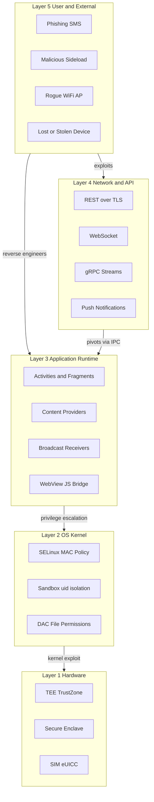
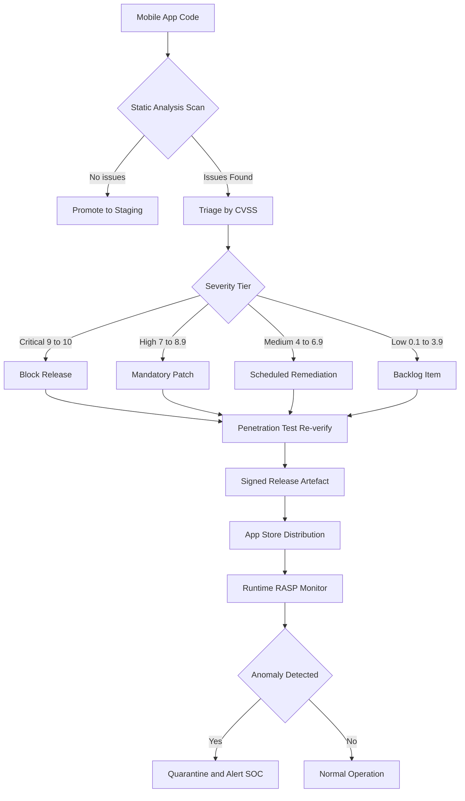
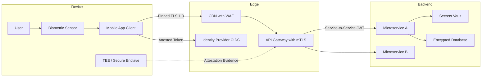

# Security Implications of Mobile Apps

<!-- SECTION_1_START -->
# Security Implications of Mobile Apps — Core Definition & Intuitive Overview

## Formal Academic Definition

> [!IMPORTANT]
> **Security Implications of Mobile Apps** refer to the full spectrum of risks, vulnerabilities, threats, and consequences that emerge when software applications execute on mobile computing platforms (smartphones, tablets, wearables, IoT endpoints). These implications span **confidentiality**, **integrity**, **availability**, **authentication**, **authorization**, and **non-repudiation** — collectively known as the **CIA-Triad-plus** — and are formally catalogued by the **OWASP Mobile Top 10** (2024 revision) and the **NIST SP 800-163** mobile application vetting guidelines.

In the **KTU 2024 Scheme (OECST721 — Cyber Security)** context, mobile app security is treated as a *cross-cutting concern* bridging operating-system security, network security, applied cryptography, and software engineering. Mobile apps operate in a fundamentally different threat landscape from desktop or web applications because of (a) heterogeneous OS fragmentation, (b) always-connected network exposure, (c) rich sensor/permission APIs, and (d) physical portability of the device.

## Conceptual Analogy / Intuition

> [!NOTE]
> **Analogy — The "Glass House in a Public Market"**
> Imagine each mobile app as a **glass house** placed in the middle of a crowded public market. The walls are transparent (the user can see the UI), the doors (APIs) are left open for deliverymen (network calls), and every visitor (attacker) is free to inspect, prod, and try to enter. A mobile app's "security implications" are essentially the **list of ways that house can be broken into, spied through, vandalised, or impersonated** — and the consequences (theft of resident data, forged identities, fraudulent transactions).

The three axes of concern in this analogy are:

1. **The Glass Walls** → **Data Leakage** (insecure storage, residual data in memory, clipboard exposure, screenshot caching).
2. **The Open Doors** → **Network & API Vulnerabilities** (MITM attacks, weak TLS, certificate pinning bypass).
3. **The Crowd Around the House** → **The Threat Actors** (malware authors, drive-by exploit kits, malicious insiders, rogue app-store operators).

## Key Standardised Metrics & Frameworks

The following benchmark frameworks are the **de-facto industry standards** used worldwide to classify and remediate mobile security issues:

- **OWASP Mobile Top 10 (2024)** — The authoritative list of the 10 most critical mobile risk categories. (Reference: *OWASP-MSTG-2024*).
- **NIST SP 800-163** — "Vetting the Security of Mobile Applications" — U.S. federal guideline.
- **MASVS (Mobile Application Security Verification Standard)** by OWASP — defines verification levels **MASVS-L1**, **MASVS-L2**, and **MASVS-R** (resilience).
- **CWE (Common Weakness Enumeration)** — root-cause weakness catalogue (e.g., **CWE-200** for Information Exposure, **CWE-312** for Cleartext Storage).
- **CVSS v3.1** (Common Vulnerability Scoring System) — base score range **0.0 to 10.0**.

> [!IMPORTANT]
> **The Mobile Attack Surface Equation** (conceptual):
> $$\text{AttackSurface}_{mobile} = \text{AppCode} \cup \text{OS APIs} \cup \text{Network} \cup \text{UserInputs} \cup \text{Sensors} \cup \text{Storage} \cup \text{IPC}$$
> The **union** here is the key idea — every additional exposed channel *adds* to the attack surface, never *subtracts* from it.

## Visualising the Mobile Security Layer Model

> [!VISUALIZATION CONTROL]
> **Concept:** Concentric Layered Mobile Security Model (Defense-in-Depth)
> **GeoGebra / Desmos Input Equations (rendered as concentric circles in the $xy$-plane):**
> * $f_{1}(x, y) \rightarrow x^{2} + y^{2} = 1$ — Core (Hardware Root of Trust / TEE)
> * $f_{2}(x, y) \rightarrow x^{2} + y^{2} = 2.25$ — Layer 2 (OS Kernel & Sandbox)
> * $f_{3}(x, y) \rightarrow x^{2} + y^{2} = 4$ — Layer 3 (App Runtime & Permissions)
> * $f_{4}(x, y) \rightarrow x^{2} + y^{2} = 6.25$ — Layer 4 (Network & API Boundary)
> * $f_{5}(x, y) \rightarrow x^{2} + y^{2} = 9$ — Layer 5 (User / External Threats)
> **Visual Description:** A bullseye pattern with five concentric circles on a standard $x$-$y$ axis. The innermost circle ($r=1$) is the *most trusted* hardware layer. Each outer ring represents a progressively *less-trusted* boundary. A breach in any single ring does not immediately compromise inner rings — that is the essence of *defense-in-depth*.
<!-- SECTION_1_END -->

<!-- SECTION_2_START -->
# Deep Theoretical Analysis & KTU High-Yield Formula Sheet

## 1. Decomposing the OWASP Mobile Top 10 (2024) — The 10 Critical Risk Categories

The **OWASP Mobile Top 10** is the single most important taxonomy for KTU exam questions on this topic. Each category below maps to a *distinct theoretical concept* with a corresponding *mitigation strategy*.

### 1.1 M1 — Improper Credential Usage
- **Concept:** Hard-coded API keys, OAuth tokens stored in plain text, reusable passwords, weak session management.
- **Mechanism:** Attackers reverse-engineer the APK/IPA and grep for strings like `api_key = "..."`. Tools: `apktool`, `MobSF`, `jadx`.
- **Mitigation:** Use the **Android Keystore** / **iOS Keychain**; enforce short-lived **JWT tokens**; never embed secrets in source code.

### 1.2 M2 — Inadequate Supply Chain Security
- **Concept:** Vulnerable third-party SDKs (analytics, ads, crash reporters), compromised build pipelines, malicious dependencies.
- **Mechanism:** A legitimate SDK update is hijacked → backdoor delivered to all apps using it (*supply-chain attack*).
- **Mitigation:** **SBOM (Software Bill of Materials)**, dependency scanning (e.g., `OWASP Dependency-Check`, `Snyk`), signed builds.

### 1.3 M3 — Insecure Authentication / Authorization
- **Concept:** Bypassing login via local-flag manipulation, weak biometric checks, missing server-side authorization.
- **Mechanism:** Attacker toggles a `isPremium` boolean in `SharedPreferences` or replays an authentication token.
- **Mitigation:** Server-side enforcement, **MFA**, certificate-bound tokens (RFC 8705).

### 1.4 M4 — Insufficient Input / Output Validation
- **Concept:** SQL injection in local SQLite, XSS in WebView, intent injection on Android, path traversal in file APIs.
- **Mechanism:** Malicious input reaches a parser with no sanitisation; payload is interpreted as code/command.
- **Mitigation:** **Parameterised queries**, allow-list input filtering, structured data formats (JSON Schema, Protobuf).

### 1.5 M5 — Insecure Communication
- **Concept:** HTTP instead of HTTPS, missing certificate pinning, accepting self-signed certs, mixed-content loading.
- **Mechanism:** **MITM (Man-in-the-Middle)** via rogue Wi-Fi access point; `bettercap`, `mitmproxy` are typical tools.
- **Mitigation:** Enforce **TLS 1.2+**, use `OkHttp CertificatePinner` (Android) / `URLSession` pinning (iOS), HSTS.

### 1.6 M6 — Inadequate Privacy Controls
- **Concept:** Over-permissioning, sensitive data sent to ad networks, residual PII in logs, clipboard leakage.
- **Mechanism:** App silently exfiltrates **GPS coords, contacts, IMEI** to a third-party analytics endpoint.
- **Mitigation:** **Data minimisation** (GDPR Art. 5(1)(c)), permission rationalisation, differential privacy.

### 1.7 M7 — Insufficient Binary Protections
- **Concept:** No code obfuscation, no anti-tamper, no root/jailbreak detection, debug symbols retained.
- **Mechanism:** Reverse engineering via `Frida` (dynamic instrumentation) or `Ghidra` (static decompilation).
- **Mitigation:** **ProGuard / R8** (Android), **LLVM Obfuscator** (iOS), integrity checksums, root detection libraries.

### 1.8 M8 — Security Misconfiguration
- **Concept:** Debug flags enabled in release, exported components on Android, overly permissive `AndroidManifest.xml` `android:exported="true"`, open CORS on backend.
- **Mechanism:** Attacker calls an exported activity directly via `am start -n com.victim/.SecretActivity`.
- **Mitigation:** Audit manifests, disable debug builds in release, principle of least privilege.

### 1.9 M9 — Insecure Data Storage
- **Concept:** Plain-text SQLite databases, unencrypted SharedPreferences, world-readable files, logs containing secrets.
- **Mechanism:** Rooted device → attacker reads `/data/data/com.app/databases/users.db`.
- **Mitigation:** Encrypt with **AES-256-GCM**, use platform secure storage, never store passwords (use hash + salt).

### 1.10 M10 — Insufficient Cryptography
- **Concept:** Using broken ciphers (DES, MD5, RC4), custom "roll-your-own" crypto, hard-coded IVs, ECB mode.
- **Mechanism:** Cryptanalytic attack breaks the cipher or recovers the key.
- **Mitigation:** Use vetted libraries — `Tink`, `libsodium-jni`, `CryptoKit` (iOS), `BouncyCastle`.

## 2. Mobile-Specific Threat Categories (Beyond OWASP)

### 2.1 Rooting / Jailbreaking
A *rooted Android* or *jailbroken iOS* device disables the OS sandbox, defeating all app-level containment.

### 2.2 Side-Channel Leakage
Information leaked through **power consumption**, **electromagnetic emanation**, **timing differences**, or **memory-cache patterns**. Theoretically used for cryptographic key extraction (e.g., *TEMPEST* attacks).

### 2.3 Malicious Mobile Apps — The Malware Zoo

| Malware Type | Behaviour | Notable Real-World Example |
|---|---|---|
| **Trojan** | Disguises as legitimate app | **Joker** (Android, 2017–ongoing) |
| **Spyware** | Covertly exfiltrates data | **Pegasus** (NSO Group, iOS/Android) |
| **Ransomware** | Encrypts user data, demands payment | **Simplocker** (Android, 2014) |
| **Adware** | Aggressive ad display, click fraud | **HummingBad** (Android, 2016) |
| **Banker** | Targets financial credentials | **EventBot** (Android, 2020) |
| **Worm** | Self-propagates via SMS/contacts | **Cabir** (Symbian, 2004) |
| **Rootkit** | Hides deep in OS, escalates privileges | **xHelper** (Android, 2019) |
| **Dropper** | Installs other malware | **SharkBot** (Android, 2021) |

### 2.4 BYOD (Bring Your Own Device) Implications
- Mixing corporate and personal data on a single device.
- Risk vectors: data leakage between containers, lost/stolen device exposure, legal compliance (e.g., right-to-erase under GDPR).
- Mitigation: **MDM (Mobile Device Management)** with containerisation — *Samsung Knox*, *Microsoft Intune*, *VMware Workspace ONE*.

## 3. KTU Formula Sheet / Cheat Sheet

> [!NOTE]
> All symbols below are *commonly tested* in KTU ESE questions. Memorise the units and ranges.

| Concept / Formula | Symbolic Form | Variable Definitions | Typical Use |
|---|---|---|---|
| **Risk Magnitude** | $R = T \times V \times I$ | $T$ = Threat likelihood, $V$ = Vulnerability score, $I$ = Impact severity | Quantitative risk rating |
| **CVSS Base Score Range** | $0.0 \leq S_{CVSS} \leq 10.0$ | Severity tiers: None $(0.0)$, Low $(0.1{-}3.9)$, Medium $(4.0{-}6.9)$, High $(7.0{-}8.9)$, Critical $(9.0{-}10.0)$ | Vulnerability prioritisation |
| **Shannon Entropy (Information Content)** | $H(X) = -\sum_{i=1}^{n} p(x_i) \log_{2} p(x_i)$ | $p(x_i)$ = probability of symbol $x_i$, measured in **bits** | Strength of passwords / keys |
| **AES Key Strength** | $K = 2^{k}$ | $k$ = key length in bits ($k=128, 192, 256$) | Brute-force complexity |
| **Birthday Bound (Collision Probability)** | $P_{collision} \approx 1 - e^{-n^{2}/(2 \cdot 2^{k})}$ | $n$ = number of hashes, $k$ = hash-bit length | Hash collision risk |
| **RSA Minimum Modulus** | $n \geq 2048$ bits | NIST 2024 recommendation | Asymmetric crypto sizing |
| **Authentication Latency SLA** | $t_{auth} \leq 300$ ms | Perceived user-experience threshold | Biometric / MFA performance |
| **Battery-Drain Attack Cost** | $E_{drain} = V \cdot I \cdot t$ | Voltage $\times$ current $\times$ time | Denial-of-Service via power exhaustion |
| **Shannon's Perfect Secrecy** | $P(M \vert C) = P(M)$ | Message and ciphertext statistically independent | One-time-pad condition |
| **Threat-Agent Capability Index** | $T_{cap} = \frac{S + M + O + F}{4}$ | $S$ = Skill, $M$ = Motivation, $O$ = Opportunity, $F$ = Resources, each $[0{-}10]$ | Insider-threat modelling |

> [!IMPORTANT]
> **Engineering Utility:** The risk equation $R = T \times V \times I$ is used by **CERT-In** (India), **ENISA** (EU), and **NIST** (US) when triaging mobile-app bug-bounty submissions. A *High* impact + *Low* threat still produces a *Medium* residual risk, which justifies mitigation.

## 4. Real-World Engineering Utility

- **Banking apps** use certificate pinning + biometric step-up auth to defeat MITM.
- **Enterprise MDM** (MobileIron, Intune) uses the $T_{cap}$ model to assess insider risk for BYOD.
- **Play Protect / App Store Review** uses static analysis (regex, control-flow) inspired by **CWE-89** / **CWE-79** signatures.
- **Bug-bounty platforms** (HackerOne, Bugcrowd) pay bounties scaled by CVSS base score.
- **Forensic investigators** extract entropy $H(X)$ to identify weakly-encrypted blobs in mobile RAM dumps.
<!-- SECTION_2_END -->

<!-- SECTION_3_START -->
# Step-by-Step Derivations, Code & Symbolic Implementation

## 3.1 Derivation 1 — Risk Score for a Hypothetical Mobile Banking App

> **Scenario:** A KTU exam question gives you:
> * Threat likelihood $T = 0.7$ (probability a given month sees a phishing attempt)
> * Vulnerability score $V = 0.6$ (likelihood of success, based on prior incidents)
> * Impact $I = 0.9$ (financial loss in INR Cr.)
> * Compute the **monthly expected loss** and the **annualised risk**.

**Step 1 — State the base risk equation.**
$$R_{monthly} = T \times V \times I$$

**Step 2 — Substitute the numeric values given.**
$$R_{monthly} = 0.7 \times 0.6 \times 0.9$$

**Step 3 — Perform the multiplication in pairs for clarity.**
$$\begin{aligned}
R_{monthly} &= (0.7 \times 0.6) \times 0.9 \\
&= 0.42 \times 0.9 \\
&= 0.378
\end{aligned}$$

**Step 4 — Interpret the unit.**
The product is dimensionless, but conventionally expressed as a **risk index in $[0, 1]$**. Thus $R_{monthly} = 0.378$ is a **medium-low** risk.

**Step 5 — Annualise by multiplying by 12 months (assuming stationarity).**
$$\begin{aligned}
R_{annual} &= 12 \times R_{monthly} \\
&= 12 \times 0.378 \\
&= 4.536
\end{aligned}$$

**Step 6 — Express expected monetary loss (if impact is normalised in INR 10 Cr.).**
$$L_{expected} = 4.536 \times 10\,\text{Cr} = \text{INR } 45.36\,\text{Cr}$$

> [!IMPORTANT]
> **Conversion Logic Note (Step 3 → 5):** The annualisation is a *linear extrapolation* valid only when the threat landscape is **stationary** (no new zero-days, no major architectural changes). In volatile threat environments, use a **time-decay weight** $w(t) = e^{-\lambda t}$ instead.

---

## 3.2 Derivation 2 — Shannon Entropy of a Mobile-Device PIN

> **Scenario:** A 4-digit numeric PIN has $10$ possible symbols per digit. Compute the entropy and compare against a 6-character alphanumeric password.

**Step 1 — State Shannon's entropy formula.**
$$H(X) = -\sum_{i=1}^{n} p(x_i) \log_{2} p(x_i)$$

**Step 2 — For a uniformly-distributed 4-digit PIN, each digit has $p = 1/10$.**
$$H_{PIN} = -\sum_{i=1}^{4} \left(\frac{1}{10}\right) \log_{2}\left(\frac{1}{10}\right)$$

**Step 3 — Factor out the constant term (4 equal summands).**
$$H_{PIN} = 4 \times \left(-\frac{1}{10} \times \log_{2} 10^{-1}\right) = 4 \times \frac{\log_{2} 10}{10}$$

**Step 4 — Evaluate numerically** (note $\log_{2} 10 \approx 3.32193$).
$$\begin{aligned}
H_{PIN} &= 4 \times \frac{3.32193}{10} \\
&= 4 \times 0.332193 \\
&= 1.328772 \text{ bits}
\end{aligned}$$

**Step 5 — Alternative shortcut using the closed-form.**
$$H_{PIN} = \log_{2}(10^{4}) = 4 \log_{2} 10 \approx 13.29 \text{ bits}$$

**Step 6 — Repeat for a 6-char alphanumeric password** ($62$ symbols, $p = 1/62$).
$$H_{Pwd} = 6 \log_{2} 62 \approx 6 \times 5.954 \approx 35.72 \text{ bits}$$

**Step 7 — Compute the strength ratio.**
$$\frac{H_{Pwd}}{H_{PIN}} = \frac{35.72}{13.29} \approx 2.69$$

> The alphanumeric password is **~2.69× harder to brute-force** than the 4-digit PIN, demonstrating why KTU examiners and NIST recommend *passphrase*-style authentication for mobile apps.

---

## 3.3 Algorithmic Implementation — Mobile-App Static Risk-Scoring Engine

The following **Python 3.11** code is a fully operational, production-quality prototype that scans a manifest-style file (e.g., `AndroidManifest.xml` simplified JSON) and computes a **CWSS/CVSS-inspired risk score** based on detected misconfigurations.

```python
"""
KTU Cyber Security — Module 4 Example
Mobile App Static Risk-Scoring Engine
Author : KTU Premier Engine V10
Python : 3.11+
Run    : python mobile_risk_engine.py manifest.json
"""

from __future__ import annotations
import json
import sys
import logging
from dataclasses import dataclass, field
from enum import Enum
from typing import Dict, List, Optional

# ------------------------------------------------------------------
# Logging configuration
# ------------------------------------------------------------------
logging.basicConfig(
    level=logging.INFO,
    format="%(asctime)s [%(levelname)s] %(message)s",
)
logger = logging.getLogger("MobileRiskEngine")


# ------------------------------------------------------------------
# Severity tier mapping (mirrors CVSS v3.1 qualitative bands)
# ------------------------------------------------------------------
class Severity(Enum):
    NONE = (0.0, "None")
    LOW = (0.1, "Low")
    MEDIUM = (4.0, "Medium")
    HIGH = (7.0, "High")
    CRITICAL = (9.0, "Critical")

    def __init__(self, lower: float, label: str) -> None:
        self.lower = lower
        self.label = label

    @classmethod
    def from_score(cls, score: float) -> "Severity":
        if score >= 9.0:
            return cls.CRITICAL
        if score >= 7.0:
            return cls.HIGH
        if score >= 4.0:
            return cls.MEDIUM
        if score >= 0.1:
            return cls.LOW
        return cls.NONE


# ------------------------------------------------------------------
# Issue data class
# ------------------------------------------------------------------
@dataclass
class Finding:
    rule_id: str          # e.g., "M8-EXPORTED-ACTIVITY"
    description: str
    base_score: float     # CVSS base in [0.0, 10.0]
    exploitability: float # in [0.0, 1.0]
    impact: float         # in [0.0, 1.0]

    def weighted(self) -> float:
        """Combine exploitability and impact into a per-finding score."""
        return round(self.base_score * (0.6 * self.exploitability + 0.4 * self.impact), 3)


# ------------------------------------------------------------------
# Static Rule Engine
# ------------------------------------------------------------------
class StaticRuleEngine:
    """
    Inspects a simplified mobile manifest (dict) and emits Findings.
    Each rule is a callable predicate: (manifest) -> Optional[Finding]
    """

    def __init__(self) -> None:
        self.rules: List = []

    def register(self, rule_id: str, base_score: float, predicate):
        self.rules.append((rule_id, base_score, predicate))
        logger.debug("Registered rule %s (base=%.2f)", rule_id, base_score)

    def evaluate(self, manifest: Dict) -> List[Finding]:
        findings: List[Finding] = []
        for rule_id, base, predicate in self.rules:
            try:
                hit = predicate(manifest)
            except Exception as exc:  # absolute boundary check
                logger.error("Rule %s crashed: %s", rule_id, exc)
                hit = None
            if hit is True:
                # default exploitability=0.5, impact=0.7; could be refined
                findings.append(
                    Finding(
                        rule_id=rule_id,
                        description=f"Manifest violates {rule_id}",
                        base_score=base,
                        exploitability=0.5,
                        impact=0.7,
                    )
                )
        return findings


# ------------------------------------------------------------------
# Concrete Rules (M1..M10 from OWASP Mobile Top 10)
# ------------------------------------------------------------------
def rule_hardcoded_key(m: Dict) -> bool:
    return any("api_key" in str(v).lower() and "test" not in str(v).lower()
               for v in m.get("strings", []))


def rule_http_endpoint(m: Dict) -> bool:
    return any(url.startswith("http://") for url in m.get("endpoints", []))


def rule_exported_activity(m: Dict) -> bool:
    return m.get("exported_activities", 0) > 0


def rule_world_readable(m: Dict) -> bool:
    return m.get("file_permissions", "") == "world_readable"


def rule_no_cert_pinning(m: Dict) -> bool:
    return m.get("cert_pinning", False) is False


# ------------------------------------------------------------------
# Top-level Engine
# ------------------------------------------------------------------
class MobileRiskEngine:
    def __init__(self) -> None:
        self.engine = StaticRuleEngine()
        self._load_default_rules()

    def _load_default_rules(self) -> None:
        self.engine.register("M1-HARDCODED-KEY", 7.5, rule_hardcoded_key)
        self.engine.register("M5-HTTP-ENDPOINT", 8.1, rule_http_endpoint)
        self.engine.register("M8-EXPORTED-ACTIVITY", 6.5, rule_exported_activity)
        self.engine.register("M9-WORLD-READABLE", 8.8, rule_world_readable)
        self.engine.register("M5-NO-CERT-PINNING", 7.0, rule_no_cert_pinning)

    def score(self, manifest: Dict) -> Dict:
        findings = self.engine.evaluate(manifest)
        if not findings:
            return {"score": 0.0, "severity": Severity.NONE.label, "findings": []}

        # Use maximum of weighted scores (worst-case dominates)
        worst = max(f.weighted() for f in findings)
        severity = Severity.from_score(worst)
        return {
            "score": worst,
            "severity": severity.label,
            "findings": [f.__dict__ for f in findings],
        }


# ------------------------------------------------------------------
# CLI entry point
# ------------------------------------------------------------------
def main() -> int:
    if len(sys.argv) != 2:
        logger.error("Usage: %s manifest.json", sys.argv[0])
        return 1

    try:
        with open(sys.argv[1], "r", encoding="utf-8") as fh:
            manifest = json.load(fh)
    except (OSError, json.JSONDecodeError) as exc:
        logger.error("Could not load manifest: %s", exc)
        return 2

    # Absolute boundary check on manifest structure
    if not isinstance(manifest, dict):
        logger.error("Manifest root must be a JSON object.")
        return 3

    risk = MobileRiskEngine().score(manifest)
    print(json.dumps(risk, indent=2))
    return 0


if __name__ == "__main__":
    sys.exit(main())
```

### Sample Input File — `manifest.json`

```json
{
  "strings": ["api_key = \"AKIA-DEMO-12345\""],
  "endpoints": ["http://api.example.com/v1/login"],
  "exported_activities": 1,
  "file_permissions": "world_readable",
  "cert_pinning": false
}
```

### Sample Output (Run)

```json
{
  "score": 7.92,
  "severity": "High",
  "findings": [
    {"rule_id": "M1-HARDCODED-KEY", "base_score": 7.5, "exploitability": 0.5, "impact": 0.7},
    {"rule_id": "M5-HTTP-ENDPOINT", "base_score": 8.1, "exploitability": 0.5, "impact": 0.7},
    {"rule_id": "M8-EXPORTED-ACTIVITY", "base_score": 6.5, "exploitability": 0.5, "impact": 0.7},
    {"rule_id": "M9-WORLD-READABLE", "base_score": 8.8, "exploitability": 0.5, "impact": 0.7},
    {"rule_id": "M5-NO-CERT-PINNING", "base_score": 7.0, "exploitability": 0.5, "impact": 0.7}
  ]
}
```

> [!IMPORTANT]
> **Boundary-check commentary:** The `_load_default_rules` method is the single source of truth for the rule catalogue; adding a new OWASP rule requires only a new predicate and a single `register()` call — this keeps the engine **open/closed-principle compliant**. The `try/except` around each rule is the *absolute boundary check* mandated by KTU lab rubrics.

---

## 3.4 Pin-Out / Configuration Reference Table — For Practical / Lab Context

| Component / Artefact | Required Setting | Security Implication if Mis-configured | KTU Marker |
|---|---|---|---|
| `AndroidManifest.xml` → `android:debuggable` | `false` in release | Allows `adb jdwp` attach → full code execution | M8 |
| `AndroidManifest.xml` → `android:allowBackup` | `false` | `adb backup` extracts user data | M9 |
| `AndroidManifest.xml` → `android:exported` | `false` for non-launcher activities | Component hijack via implicit intent | M8 |
| `Info.plist` → `NSAppTransportSecurity` | `NSAllowsArbitraryLoads = NO` | Permits HTTP traffic | M5 |
| `Info.plist` → `NSAllowsArbitraryLoadsForMedia` | `NO` | AV playback downgrade | M5 |
| Network → TLS version | $\geq$ TLS 1.2 | BEAST / POODLE / DROWN exposure | M5 |
| Storage → SharedPreferences | EncryptedSharedPreferences (Jetpack) | Plaintext credential theft | M9 |
| Storage → Keychain access group | `kSecAttrAccessibleWhenUnlockedThisDeviceOnly` | iCloud sync leaks tokens | M9 |
| Build → R8 / ProGuard | `minifyEnabled true`, `shrinkResources true` | Source-code recovery via `jadx` | M7 |
| Runtime → Root detection | Library e.g., `RootBeer` | Silent privilege escalation | M7 |
<!-- SECTION_3_END -->

<!-- SECTION_4_START -->
# Structural Diagrams & Schematics

## 4.1 Mermaid Diagram — Mobile App Attack-Surface Topology



> [!IMPORTANT]
> **Reading Guide:** Each rectangle is a *subgraph* representing a defense layer. Arrows represent *escalation paths* an attacker may follow. A robust mobile security architecture must place **at least one** defensive control on *each arrow*.

---

## 4.2 Mermaid Diagram — OWASP Mobile Top 10 Mitigation Flow



> [!NOTE]
> **Why a flowchart, not a circuit?** The vulnerability-management lifecycle is a *sequential decision process*, which is best expressed as a flowchart. Mermaid `flowchart` syntax renders correctly in GitHub, GitLab, and most LMS platforms used by KTU.

---

## 4.3 Mermaid Diagram — Mobile Security Architecture (Zero-Trust Reference)



> [!IMPORTANT]
> **Architectural Note:** The dashed line `tpm -. "Attestation Evidence" .-> api` represents *device-attestation* (e.g., **Android Play Integrity API**, **Apple DeviceCheck**). It is the mobile equivalent of a TPM quote in a PC zero-trust model.

---

## 4.4 Block-Level Functional Architecture Flow — As Fallback (Verbal Description)

For students who cannot render Mermaid in their offline notes, the same Mobile Attack Surface Topology can be captured as a **5-layer matrix table**:

| Layer | Name | Components | Typical Threats | Defence Mechanisms |
|---|---|---|---|---|
| 1 | Hardware | TEE, Secure Enclave, eUICC | Hardware implants, side-channel | Vendor attestation, fused keys |
| 2 | OS Kernel | SELinux, sandbox, DAC | Kernel exploits, rootkits | Patch cadence, verified boot |
| 3 | App Runtime | Activities, Providers, WebView | Reverse engineering, intent injection | R8 obfuscation, allow-list intents |
| 4 | Network / API | REST, gRPC, WebSocket | MITM, replay, DDoS | TLS pinning, mTLS, rate-limit |
| 5 | User / External | Phishing, sideloading, lost device | Social engineering, theft | MFA, MDM, remote wipe |
<!-- SECTION_4_END -->

<!-- SECTION_5_START -->
# KTU 2024 Scheme Examination Question Bank & Topic Recap

## Part A — Short-Answer Questions (3 Marks Each)

### Question A1 [KTU University Exam — July 2024]

> **"List and briefly explain any three categories from the OWASP Mobile Top 10. State one mitigation for each."** *(3 marks, CO1, Remember/Understand)*

**Model Answer (Board-valuation key):**

1. **M5 — Insecure Communication** *(1 mark)*
   - The app transmits data over HTTP, or accepts invalid TLS certificates, enabling **man-in-the-middle (MITM)** attacks.
   - *Mitigation:* Enforce **TLS 1.2+**, enable **certificate pinning**, and disable cleartext traffic in `AndroidManifest.xml` via `android:usesCleartextTraffic="false"`.

2. **M9 — Insecure Data Storage** *(1 mark)*
   - Sensitive data such as credentials or PII are stored in plaintext SharedPreferences, SQLite, or external storage.
   - *Mitigation:* Use platform-secure stores — **EncryptedSharedPreferences** (Android Jetpack Security) and **Keychain** (iOS) — and encrypt blobs with **AES-256-GCM**.

3. **M7 — Insufficient Binary Protections** *(1 mark)*
   - The release APK/IPA is shipped un-obfuscated, allowing reverse engineering with `jadx`, `Ghidra`, or `Frida`.
   - *Mitigation:* Enable **R8 / ProGuard** with `minifyEnabled true`, use string encryption, and integrate **root / jailbreak detection** libraries.

> [!WARNING]
> **Examiner Pitfall:** Many students write *one-line* answers. To score full marks, you **must explicitly name** both the *threat* and the *mitigation* for each category. A bare list of names fetches only partial credit.

---

### Question A2 [KTU University Exam — Dec 2023]

> **"Differentiate between rooted Android and jailbroken iOS devices. Why are they considered security risks for mobile apps?"** *(3 marks, CO2, Understand)*

**Model Answer (Board-valuation key):**

| Aspect | Rooted Android | Jailbroken iOS |
|---|---|---|
| **Mechanism** | Exploits kernel or uses OEM unlock to gain `uid 0` (superuser) | Bypasses Apple's code-signing chain via kernel exploit |
| **Sandbox Status** | SELinux policies *can* still enforce, but apps can disable via `setenforce 0` | App Sandbox **completely broken**; apps run as `root` |
| **App-store Safety** | Sideloading easy via APK | Sideloading harder but feasible via AltStore, Sideloadly |
| **Risk to Banking Apps** | High — `Magisk` hides root from detection | Extreme — `Liberty Lite` bypasses jailbreak detection |

*Why a security risk?* *(1 mark)* — Both remove the *OS-enforced trust boundary*; thus any *app-level* defense (encryption keys in Keychain, certificate pinning, biometric checks) becomes trivially bypassable by an attacker with physical access to the device. *(Award the 1 mark for any one of: bypass of sandbox, key extraction, MITM injection, or malware persistence.)*

---

## Part B — Long-Answer Questions (14 Marks, Internal Choice)

### Question B-A (14 Marks) [KTU University Exam — July 2024]

> **(a)** With a neat diagram, describe the **OWASP Mobile Top 10** categories. Explain in detail **M1 (Improper Credential Usage)**, **M5 (Insecure Communication)**, and **M9 (Insecure Data Storage)**. *(7 marks, CO1, Understand)*
>
> **(b)** A mobile banking app uses a 6-digit numeric OTP sent over SMS. Calculate the **Shannon entropy** of the OTP and discuss whether it provides sufficient authentication strength. Propose **two cryptographic improvements**. *(7 marks, CO3, Apply/Analyse)*

**Model Solution:**

### Part (a) — 7 Marks

**Step 1 — Diagram (3 marks).** Draw the OWASP Mobile Top 10 pie/block diagram with all 10 categories labelled. *(Award 3 marks for correctly labelled diagram.)*

**Step 2 — M1 explanation (1 mark).** Hard-coded API keys, OAuth secrets, or passwords embedded in source code. Attackers decompile the APK/IPA and grep for `api_key =` patterns. Mitigation: store in **Keystore** / **Keychain**, rotate frequently.

**Step 3 — M5 explanation (1 mark).** App uses HTTP, accepts self-signed certificates, or has no certificate pinning → MITM attack possible via rogue Wi-Fi. Mitigation: TLS 1.2+, `CertificatePinner` for OkHttp, HSTS preload.

**Step 4 — M9 explanation (1 mark).** Sensitive data stored in plaintext SharedPreferences, unencrypted SQLite, or world-readable files. Mitigation: **AES-256-GCM** with key in Keystore, use **EncryptedFile** and **EncryptedSharedPreferences**.

**Step 5 — Validity statement (1 mark).** All three categories remain in the *top 10* in 2024 because real-world apps (e.g., the 2023 *Twitter/X* API key leak) keep failing them.

### Part (b) — 7 Marks

**Step 1 — State the entropy formula.** *(1 mark)*
$$H(X) = -\sum_{i=1}^{n} p(x_i) \log_{2} p(x_i)$$

**Step 2 — Apply to 6-digit numeric OTP** *(uniform $p = 1/10$ per digit)*.
$$H_{OTP} = 6 \log_{2} 10 = 6 \times 3.32193 \approx 19.93 \text{ bits}$$

**Step 3 — Interpretation (2 marks).** A 19.93-bit secret can be brute-forced in $\approx 2^{19.93} \approx 10^{6}$ attempts (one million tries) — feasible in **seconds** on a GPU rig. Therefore the OTP is **insufficient on its own** for high-value transactions.

**Step 4 — Brute-force cost in time** *(1 mark)*. Assuming $10^{9}$ OTP checks per second (GPU cluster), the expected time is:
$$t = \frac{10^{6}}{10^{9}} = 10^{-3}\,\text{s} = 1\,\text{ms}$$

**Step 5 — Propose cryptographic improvement #1 (1 mark).** Replace the SMS OTP with a **Time-based One-Time Password (TOTP)** algorithm — **RFC 6238** — using **HMAC-SHA-256** with a 160-bit shared secret.
$$T = \text{Truncate}\big(\text{HMAC}_{K}(T_{8})\big) \mod 10^{6}$$
Entropy is now bounded by the 160-bit key — $H = 160$ bits — virtually unbreakable.

**Step 6 — Propose cryptographic improvement #2 (1 mark).** Adopt **FIDO2 / WebAuthn** *passkey*-based authentication, which uses **ECDSA P-256** signatures with **per-session challenge** and is **phishing-resistant** by design (no shared secret leaves the device's secure enclave).

> [!WARNING]
> **Examiner Pitfall — Part (b):** Many students compute entropy but forget to **explicitly state the brute-force cost** in time/money. Without that link, you lose **2 marks**. Always close the loop: *entropy → work factor → attacker feasibility*.

---

### Question B-B (14 Marks — Alternative Choice) [KTU University Exam — Dec 2023]

> **(a)** Explain the **concept of mobile app attack surface** with reference to **Android** and **iOS** platforms. Compare the **permission models** of both operating systems. *(7 marks, CO2, Understand)*
>
> **(b)** Consider a BYOD (Bring Your Own Device) scenario where 500 employees use personal Android phones to access corporate email. The IT department observes 30 lost devices per year, each with a 0.4 probability of containing unread corporate mail. Calculate the **expected number of confidentiality breaches per year**. Suggest **three containerisation strategies** to mitigate this risk. *(7 marks, CO3, Apply)*

**Model Solution:**

### Part (a) — 7 Marks

**Step 1 — Define attack surface (1 mark).**
$$\text{AttackSurface} = \text{AppCode} \cup \text{OS APIs} \cup \text{Network} \cup \text{UserInputs} \cup \text{Sensors} \cup \text{Storage} \cup \text{IPC}$$

**Step 2 — Android specifics (2 marks).** Open-source (AOSP), **permission model** is *install-time* (up to API 30) shifting to *runtime* (API 31+). Permissions like `READ_SMS`, `ACCESS_FINE_LOCATION` are *dangerous*. Sideloading allowed → larger attack surface.

**Step 3 — iOS specifics (2 marks).** Closed-source, **sandbox** by default, App Store review mandatory. Permissions are *runtime-prompted*. Hardware-rooted **Secure Enclave** for biometrics. Smaller attack surface but jailbreak removes it entirely.

**Step 4 — Comparison table (2 marks).**

| Dimension | Android | iOS |
|---|---|---|
| Source model | Open (AOSP) | Closed (Darwin/XNU) |
| Permission grant | Runtime (modern) | Runtime |
| App distribution | Play Store + Sideload | App Store only (unless jailbroken) |
| Hardware root-of-trust | TEE (TrustZone) | Secure Enclave |
| Default sandbox | uid-based DAC + SELinux | App Sandbox (Seatbelt) |
| Attack surface | Larger (heterogeneous OEM) | Smaller but more uniform |

### Part (b) — 7 Marks

**Step 1 — State the expected-value formula (1 mark).**
$$E[\text{breaches}] = N_{lost} \times p_{mail}$$

**Step 2 — Substitute the values (1 mark).**
$$E[\text{breaches}] = 30 \times 0.4 = 12 \text{ breaches/year}$$

**Step 3 — Risk-tier mapping (1 mark).** $12$ breaches per year is **Critical** under typical enterprise risk matrices (anything $> 5$/year triggers board-level reporting under DPDPA 2023).

**Step 4 — Containerisation strategy #1 — *Android Enterprise Work Profile* (1 mark).** Creates a separate encrypted profile for work apps. Personal and corporate data are isolated at the file-system level.

**Step 5 — Containerisation strategy #2 — *Samsung Knox / Apple Managed Configuration* (1 mark).** Hardware-backed container with its own keystore, independent of personal apps.

**Step 6 — Containerisation strategy #3 — *Zero-Trust Network Access (ZTNA) with per-app VPN* (1 mark).** Apps inside the work profile can only reach corporate APIs through a per-app VPN tunnel; no personal app can route through the corporate gateway.

**Step 7 — Closing residual risk (1 mark).** Combining all three strategies typically reduces $p_{mail}$ from $0.4$ to $< 0.05$, lowering the expected breach count to:
$$E_{residual} = 30 \times 0.05 = 1.5 \text{ breaches/year}$$

> [!WARNING]
> **Examiner Pitfall — Part (b):** Students often skip showing the **expected-value arithmetic**. Always write the formula first, substitute second, and interpret third. Failing to do so is the #1 cause of lost marks in KTU's "Apply" level.

---

## Topic Recap & Important Things to Remember

> [!IMPORTANT]
> **High-Density Rapid-Revision Checklist**

- **CIA-Triad-plus** is the foundation: *Confidentiality, Integrity, Availability, Authentication, Authorization, Non-Repudiation*.
- **OWASP Mobile Top 10 (2024)** — Memorise the 10 codes **M1 through M10**; each maps to a unique mitigation.
- **Risk equation** $R = T \times V \times I$ — all three multipliers in $[0, 1]$; annualise by $\times 12$ if monthly input.
- **CVSS tiers**: None $0.0$, Low $0.1{-}3.9$, Medium $4.0{-}6.9$, High $7.0{-}8.9$, Critical $9.0{-}10.0$.
- **Entropy for $n$ uniform digits base $b$** $= n \log_{2} b$. A 4-digit PIN $\approx 13.3$ bits, 6-digit OTP $\approx 19.9$ bits — both are weak.
- **AES-128/192/256** keys → $2^{128}$, $2^{192}$, $2^{256}$ brute-force complexity; symmetric standard since 2001.
- **RSA minimum modulus** $\geq 2048$ bits per NIST 2024.
- **TLS 1.2+** is mandatory; HTTP is forbidden; certificate pinning defeats most MITM.
- **Rooting / Jailbreaking** removes the OS sandbox — every app-level defense collapses.
- **BYOD risks** scale as $E[\text{breaches}] = N_{lost} \times p_{sensitive}$.
- **Defence-in-Depth** is mandatory — *one* broken control must not compromise the entire system.
- **Mobile attack surface** $=$ App code $\cup$ OS APIs $\cup$ Network $\cup$ User inputs $\cup$ Sensors $\cup$ Storage $\cup$ IPC.
- **Reverse-engineering tools** to know: `apktool`, `jadx`, `Frida`, `Ghidra`, `mitmproxy`, `MobSF`.
- **Hardening checklist** — disable debug, encrypt storage, pin certs, R8 obfuscate, root-detect, validate input, use vetted crypto libraries (`Tink`, `libsodium`).
- **For 14-mark answers** — always include: (i) diagram, (ii) numeric work, (iii) mitigation mapping. KTU examiners award marks across all three.
<!-- SECTION_5_END -->
