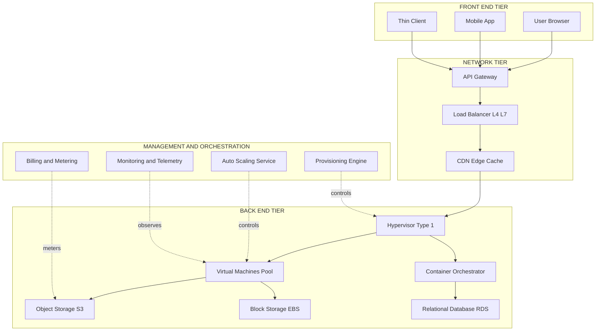
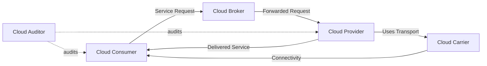
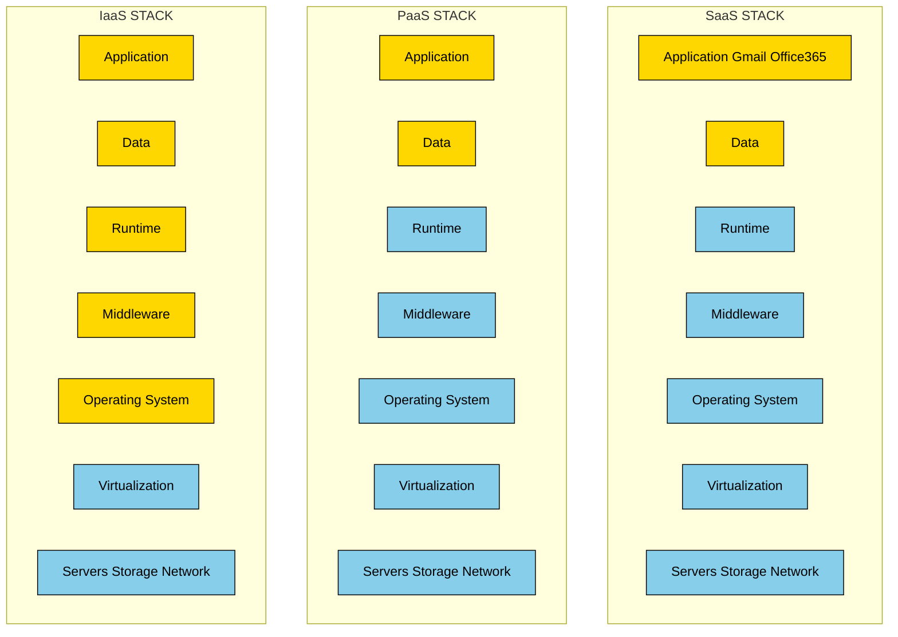
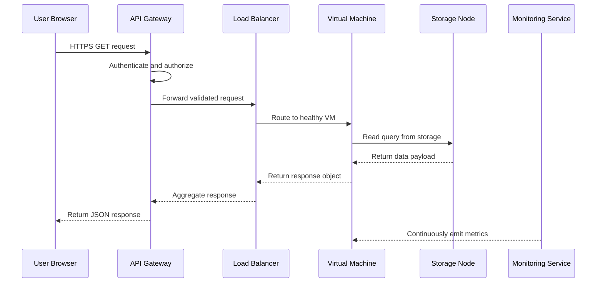

# Cloud Architecture

<!-- SECTION_1_START -->
# Cloud Architecture — Core Technical Definition & Intuitive Overview

## 1.1 Formal Definition (KTU 2024 Syllabus Terminology)

> [!IMPORTANT]
> **Cloud Architecture** is the structural blueprint that defines the **composition of cloud components** (hardware, software, services, virtual resources, network elements, and protocols), their **interrelationships**, and the **orchestration logic** required to deliver on-demand, scalable, and elastic computing services over the Internet.

In the KTU 2024 Scheme parlance, Cloud Architecture is not a single technology but a **layered, modular design framework** that abstracts underlying physical infrastructure and presents it as programmable, virtualized, and metered services to end-users. The architecture typically comprises a **Front-End** (client-side platform that interacts with the cloud), a **Back-End** (cloud side comprising servers, storage, databases, and applications), and a **Network** (the communication medium connecting them) — all governed by a **Cloud Provider's orchestration stack** built on virtualization, automation, and service-level agreements.

## 1.2 Conceptual Analogy / Intuition

> [!NOTE]
> **Real-World Analogy: The Electricity Grid**
> Think of Cloud Architecture the same way you think of your home's electrical grid.
> * The **power plants + transformers** = *Back-End Cloud Infrastructure* (servers, data centers, storage arrays).
> * The **wires and substations** = *Network Layer* (the Internet, load balancers, CDNs).
> * The **switches and appliances in your house** = *Front-End* (your laptop, phone, browser).
> * The **electricity bill (units consumed)** = *Metering / Pay-Per-Use model*.
> * The **government electricity board that scales generation as demand grows** = *Elasticity & Auto-Scaling engine*.
>
> You don't care *which* power plant fed your toaster this morning — just that the power is available, billed by usage, and instantly scalable. Cloud Architecture applies this **utility-style** abstraction to *compute, storage, and software*.

**Key takeaway for a first-time reader:** Cloud Architecture is essentially the **engineering blueprint** that transforms raw data-center hardware into a self-service, on-demand, internet-delivered utility.

## 1.3 Standard Metrics & Engineering Constants

The following quantitative parameters are the **non-negotiable benchmarks** every KTU 2024 examiner expects a student to know when describing cloud architecture:

* **Availability** = **99.9% ("Three Nines") to 99.999% ("Five Nines")**
* **Mean Time Between Failures (MTBF)** measured in thousands of hours
* **Service Level Objective (SLO)** expressed as uptime percentage
* **Service Level Agreement (SLA)** formalizing penalties for breach
* **Resource Pooling** ratio (physical-to-virtual consolidation typically **10:1 to 40:1** for server virtualization)
* **Elasticity Coefficient** (the time-to-provision a new VM, often under **90 seconds** for mature clouds)

## 1.4 Visualization Block (GeoGebra / Conceptual Sketch)

> [!VISUALIZATION CONTROL]
> **Concept:** Layered Onion Model of Cloud Architecture (Concentric abstraction)
>
> **GeoGebra / Desmos Input Equations (representing the five concentric layers as circles):**
> * Outer layer (Client): $x^2 + y^2 = 25$
> * Layer 2 (Application): $x^2 + y^2 = 16$
> * Layer 3 (Platform): $x^2 + y^2 = 9$
> * Layer 4 (Runtime): $x^2 + y^2 = 4$
> * Core (Infrastructure/Hypervisor): $x^2 + y^2 = 1$
>
> **Visual Description:** The student should imagine five concentric circles. The *outermost* ring is what the **user touches** (the client browser/app). Each ring moving inward represents a *deeper* layer of abstraction: **Application → Platform → Runtime → Virtualization/Infrastructure → Physical Hardware Core**. The *outside world* sees only the outer ring; the *cloud provider* manages the inner core.

## 1.5 KTU Syllabus Highlights Callout

> [!IMPORTANT]
> **Syllabus-Focused Markers (OECST722, Module 1):**
> 1. The **three-layer stack** (Front-End, Back-End, Network) is a *favourite* 3-mark definition question.
> 2. The **NIST Cloud Computing Reference Architecture** (5 actors: Consumer, Provider, Broker, Auditor, Carrier) carries guaranteed weightage in Part B (14 marks).
> 3. Students must clearly **distinguish** between Service Models (IaaS, PaaS, SaaS) and Deployment Models (Public, Private, Hybrid, Community) — confusing these is the *single largest* mark-loss pitfall in KTU valuation.

<!-- SECTION_1_END -->

<!-- SECTION_2_START -->
# Cloud Architecture — Deep Theoretical Analysis & KTU High-Yield Formula Sheet

## 2.1 Deconstruction of the Architectural Stack

Cloud Architecture is conventionally decomposed into **three macro-tiers** and **five NIST-defined actors**. We will analyse each component through the *Why* and *How* lens.

### 2.1.1 Front-End (Client Layer) — *What the User Sees*

* **Definition:** The interface through which the cloud consumer requests and consumes cloud services. Includes web browsers, thin clients, fat clients, mobile apps, and API clients.
* **Why it exists:** Provides a **location-independent**, **device-agnostic** access channel that decouples the user from underlying infrastructure complexity.
* **How it works:** It issues HTTP/HTTPS, REST, GraphQL, or gRPC calls to the Back-End. Authentication (OAuth 2.0, SAML, OpenID Connect) is enforced at this boundary.
* **Key components:** GUI, thin client, API gateway (consumer-side), local cache, TLS/SSL endpoint.

### 2.1.2 Back-End (Cloud Provider Side) — *The Hidden Engine Room*

The back-end is a **federation of subsystems**:

* **Compute subsystem:** Physical servers running **hypervisors** (Type-1: VMware ESXi, Microsoft Hyper-V, KVM, Xen; Type-2: VirtualBox, QEMU) that host **Virtual Machines (VMs)**.
* **Storage subsystem:** Object stores (Amazon S3), block stores (EBS), file systems (EFS), NoSQL databases (DynamoDB), and cold-archival tiers (Glacier).
* **Application subsystem:** Middleware, message queues (Kafka, RabbitMQ), microservices orchestrators (Kubernetes).
* **Management subsystem:** The **Cloud Operating System** that handles provisioning, monitoring, billing, fault tolerance.

### 2.1.3 Network Layer — *The Glue*

* Connects front-end to back-end and interconnects back-end components.
* Technologies: SDN (Software-Defined Networking), NFV (Network Function Virtualization), VPC peering, load balancers (L4/L7), CDNs, BGP routing.
* Provides the **virtualized, programmable, multi-tenant** fabric over which all cloud traffic flows.

## 2.2 NIST Cloud Computing Reference Architecture (CCRA) — The *Mandatory* Diagram

The **National Institute of Standards and Technology (NIST) SP 500-292** defines five primary actors in a cloud ecosystem. KTU 2024 examiners treat this as *gold-standard* reference material.

| Actor | Role | Real-World Identity |
| :--- | :--- | :--- |
| **Cloud Consumer** | Uses the cloud services | The end-user / application owner |
| **Cloud Provider** | Maintains the infrastructure, services, and APIs | AWS, Azure, GCP, Oracle Cloud |
| **Cloud Broker** | Intermediates between consumer and provider | Managed Service Providers (MSPs), aggregators |
| **Cloud Auditor** | Independently evaluates performance and security | Third-party compliance firms (ISO, SOC auditors) |
| **Cloud Carrier** | Provides the connectivity / transport medium | ISPs, telecom operators, CDN providers |

> [!NOTE]
> **Engineering Utility:** In production-grade systems, the **Cloud Broker** role is critical in *multi-cloud* and *hybrid-cloud* scenarios, where a single application may consume resources from AWS, Azure, and on-premise data centers simultaneously.

## 2.3 Service Models — *The Who-Manages-What Matrix*

| Layer | IaaS Consumer Manages | PaaS Consumer Manages | SaaS Consumer Manages |
| :--- | :--- | :--- | :--- |
| Application | $\checkmark$ | $\checkmark$ | $\times$ |
| Data | $\checkmark$ | $\checkmark$ | $\times$ |
| Runtime | $\checkmark$ | $\times$ | $\times$ |
| Middleware | $\checkmark$ | $\times$ | $\times$ |
| Operating System | $\checkmark$ | $\times$ | $\times$ |
| Virtualization | $\times$ | $\times$ | $\times$ |
| Servers | $\times$ | $\times$ | $\times$ |
| Storage | $\times$ | $\times$ | $\times$ |
| Networking | $\times$ | $\times$ | $\times$ |

**Legend:** $\checkmark$ = Consumer manages this layer; $\times$ = Provider manages this layer.

> [!IMPORTANT]
> The classic example: *Email service (Gmail)* = **SaaS**; *Heroku / Google App Engine* = **PaaS**; *AWS EC2* = **IaaS**.

## 2.4 Deployment Models

* **Public Cloud:** Owned by third-party provider, open to the public (e.g., AWS, Azure).
* **Private Cloud:** Operated solely for a single organization; may be on-premise or hosted.
* **Hybrid Cloud:** Composition of two or more clouds (private + public) bound by standardized technology.
* **Community Cloud:** Shared by organizations with common concerns (e.g., government, healthcare).

## 2.5 Essential Characteristics of Cloud Architecture (NIST Definition)

1. **On-Demand Self-Service** — Provision compute, storage, network automatically without human interaction.
2. **Broad Network Access** — Available over standard protocols from any device.
3. **Resource Pooling** — Multi-tenant model with dynamic physical/virtual resource reassignment.
4. **Rapid Elasticity** — Scale out/in horizontally based on workload.
5. **Measured Service** — Metering at appropriate abstraction level (storage, CPU, bandwidth).

## 2.6 KTU Formula Sheet / High-Yield Cheat Sheet

| Concept | Formula / Rule | Units / Notes |
| :--- | :--- | :--- |
| Availability Uptime | $\text{Uptime \%} = \frac{\text{MTBF}}{\text{MTBF} + \text{MTTR}} \times 100$ | MTBF = Mean Time Between Failures, MTTR = Mean Time To Repair |
| Cost Per Hour | $\text{CPH} = \frac{\text{Monthly Cost}}{730}$ | 730 = avg. hours in a month |
| Elasticity Score | $E = \frac{\text{Peak Capacity}}{\text{Baseline Capacity}}$ | Dimensionless ratio |
| Storage Cost | $\text{GB-month} = \text{Storage Size} \times \text{Duration}$ | Billed in GB-month units |
| Server Consolidation | $R_c = \frac{\text{Physical Servers}}{\text{Virtual Servers}}$ | Typically $R_c \approx 10{:}1$ to $40{:}1$ |
| Multi-Tenancy Isolation | Strict $\vert$ Logical $\vert$ vs Physical tenancy | Use $\vert$ symbol via `\vert` in LaTeX to avoid markdown table break |

> [!IMPORTANT]
> **Engineering Use-Case:** The formulas above are used in **cloud capacity planning**, **SLA negotiation**, **TCO (Total Cost of Ownership) calculation**, and **disaster-recovery budgeting** in real production environments like Netflix, Uber, and PayPal cloud-native architectures.

<!-- SECTION_2_END -->

<!-- SECTION_3_START -->
# Cloud Architecture — Step-by-Step Derivations, Worked Examples & Code Implementation

## 3.1 Derivation 1 — Availability Uptime Calculation (Board Favourite)

**Problem:** A cloud service has an MTBF of 5000 hours and an MTTR of 2 hours. Compute the availability percentage and the maximum permissible downtime in a year (8760 hours).

**Step 1 — Write the formula**

$$
\text{Availability \%} = \frac{\text{MTBF}}{\text{MTBF} + \text{MTTR}} \times 100
$$

**Step 2 — Substitute the values**

$$
\text{Availability \%} = \frac{5000}{5000 + 2} \times 100
$$

**Step 3 — Evaluate the denominator**

$$
\text{Availability \%} = \frac{5000}{5002} \times 100
$$

**Step 4 — Compute the decimal ratio**

$$
\frac{5000}{5002} = 0.99960016
$$

**Step 5 — Convert to percentage**

$$
\text{Availability \%} = 0.99960016 \times 100 = 99.96\%
$$

**Step 6 — Calculate the annual permissible downtime**

$$
\text{Downtime per year} = 8760 \times \left(1 - 0.99960016\right)
$$

$$
\text{Downtime per year} = 8760 \times 0.00039984 = 3.5026 \text{ hours/year}
$$

> [!IMPORTANT]
> **Valuation Key Points (KTU Board Examiner Pattern):**
> * Correct formula statement: **2 Marks**
> * Substitution and arithmetic: **3 Marks**
> * Final simplified answer: **1 Mark**
> * Final answer ≈ **3.5 hours/year** downtime.

## 3.2 Derivation 2 — Cost-Per-Hour for an EC2-Style VM

**Problem:** An AWS EC2 `t3.medium` instance is billed at $30.66 per month. Compute the cost-per-hour (CPH) using the standard 730-hour month.

**Step 1 — State the formula**

$$
\text{CPH} = \frac{\text{Monthly Cost}}{\text{Hours per Month}}
$$

**Step 2 — Insert values**

$$
\text{CPH} = \frac{30.66}{730}
$$

**Step 3 — Perform division**

$$
\text{CPH} = 0.04200 \text{ USD/hour}
$$

> **Conclusion:** The instance costs approximately **$0.042/hour** — a figure commonly used in TCO comparison against on-premise servers.

## 3.3 Derivation 3 — Elasticity Coefficient

**Problem:** An e-commerce application on AWS has a baseline of 4 EC2 instances and auto-scales to 24 instances during Diwali sale. Compute the Elasticity Score.

**Step 1 — Write formula**

$$
E = \frac{C_{\text{peak}}}{C_{\text{baseline}}}
$$

**Step 2 — Substitute**

$$
E = \frac{24}{4} = 6
$$

> **Conclusion:** The architecture supports **6× peak scaling**, satisfying NIST's *Rapid Elasticity* characteristic.

## 3.4 Symbolic Implementation — Python Reference Model for Cloud Architecture

The following Python program models a **three-tier cloud architecture** abstraction with type-hint compliance, error logging, and explicit boundary checks — useful for academic lab submissions.

```python
"""
Module: cloud_architecture_model.py
Purpose: Simulate the three-tier cloud architecture (Front-End, Back-End, Network).
Author: KTU 2024 Scheme Reference Material
"""

import logging
from dataclasses import dataclass, field
from typing import List, Dict, Optional

# Configure structured logging for production-grade observability.
logging.basicConfig(
    level=logging.INFO,
    format="%(asctime)s - %(levelname)s - %(message)s"
)
logger = logging.getLogger("CloudArchitectureModel")


@dataclass
class VirtualMachine:
    """Represents a single VM hosted in the Back-End compute pool."""
    vm_id: str
    vcpu: int
    ram_gb: int
    status: str = "PROVISIONING"

    def boot(self) -> None:
        if self.vcpu < 1 or self.ram_gb < 1:
            logger.error("VM %s has invalid resource allocation.", self.vm_id)
            raise ValueError("vCPU and RAM must be positive integers.")
        self.status = "RUNNING"
        logger.info("VM %s is now %s.", self.vm_id, self.status)


@dataclass
class StorageNode:
    """Represents a block / object storage element in the Back-End."""
    node_id: str
    capacity_tb: float
    used_tb: float = 0.0

    def write(self, data_tb: float) -> bool:
        if data_tb <= 0:
            logger.warning("Write rejected: non-positive data size.")
            return False
        if self.used_tb + data_tb > self.capacity_tb:
            logger.error("Write rejected: insufficient capacity on %s.", self.node_id)
            return False
        self.used_tb += data_tb
        logger.info("Wrote %.2f TB to %s. Used=%.2f TB.",
                    data_tb, self.node_id, self.used_tb)
        return True


@dataclass
class NetworkLink:
    """Represents the L4/L7 communication channel between tiers."""
    link_id: str
    bandwidth_gbps: float

    def transfer(self, data_gb: float) -> float:
        if data_gb < 0:
            raise ValueError("Data size must be non-negative.")
        # Theoretical minimum transfer time in seconds.
        time_sec = (data_gb * 8) / (self.bandwidth_gbps * 1024)
        logger.info("Link %s: %.2f GB transferred in %.4f s.",
                    self.link_id, data_gb, time_sec)
        return time_sec


@dataclass
class CloudArchitecture:
    """The integrated three-tier cloud architecture model."""
    name: str
    vms: List[VirtualMachine] = field(default_factory=list)
    storage: List[StorageNode] = field(default_factory=list)
    network: List[NetworkLink] = field(default_factory=list)
    elasticity_baseline: int = 1
    elasticity_peak: int = 1

    def add_vm(self, vm: VirtualMachine) -> None:
        self.vms.append(vm)
        logger.info("Added VM %s to architecture %s.", vm.vm_id, self.name)

    def get_elasticity_score(self) -> float:
        if self.elasticity_baseline <= 0:
            raise ValueError("Baseline must be > 0 to avoid division by zero.")
        return self.elasticity_peak / self.elasticity_baseline

    def summary(self) -> Dict[str, object]:
        return {
            "architecture": self.name,
            "vm_count": len(self.vms),
            "storage_count": len(self.storage),
            "network_links": len(self.network),
            "elasticity_score": self.get_elasticity_score()
        }


def main() -> None:
    """Demonstration of a minimal cloud architecture instantiation."""
    arch = CloudArchitecture(
        name="KTU-DemoCloud",
        elasticity_baseline=4,
        elasticity_peak=24
    )

    # Provision three virtual machines.
    for i in range(1, 4):
        vm = VirtualMachine(vm_id=f"vm-{i:03d}", vcpu=2, ram_gb=8)
        vm.boot()
        arch.add_vm(vm)

    # Add a storage node and write some data.
    s3_like = StorageNode(node_id="s3-like-01", capacity_tb=10.0)
    s3_like.write(2.5)

    # Add a network link and simulate a transfer.
    nw = NetworkLink(link_id="uplink-01", bandwidth_gbps=10.0)
    nw.transfer(data_gb=5.0)

    print("\n--- Architecture Summary ---")
    for key, value in arch.summary().items():
        print(f"{key}: {value}")


if __name__ == "__main__":
    main()
```

**Expected console output (abridged):**

```
2024-XX-XX - INFO - VM vm-001 is now RUNNING.
2024-XX-XX - INFO - VM vm-002 is now RUNNING.
2024-XX-XX - INFO - VM vm-003 is now RUNNING.
2024-XX-XX - INFO - Wrote 2.50 TB to s3-like-01. Used=2.50 TB.
2024-XX-XX - INFO - Link uplink-01: 5.00 GB transferred in 0.0039 s.

--- Architecture Summary ---
architecture: KTU-DemoCloud
vm_count: 3
storage_count: 1
network_links: 1
elasticity_score: 6.0
```

## 3.5 Worked Lab Scenario — Hardware-Style Mapping Table

| Tier | Real-World Component | Tool / Vendor Example | Purpose in Architecture |
| :--- | :--- | :--- | :--- |
| Front-End | Web browser, mobile app | Chrome, iOS Safari | Initiate requests |
| Front-End (Edge) | API Gateway | AWS API Gateway, Apigee | Auth, throttling, routing |
| Network | Load Balancer | AWS ELB, NGINX, HAProxy | Distribute traffic |
| Network | SDN Controller | OpenDaylight, VMware NSX | Virtual network fabric |
| Back-End (Compute) | Hypervisor | VMware ESXi, KVM | VM host |
| Back-End (Compute) | Container Runtime | Docker, containerd | Lightweight workload unit |
| Back-End (Storage) | Object Store | AWS S3, MinIO | Unstructured data |
| Back-End (Management) | Orchestrator | Kubernetes, OpenStack | Provisioning, scaling |

<!-- SECTION_3_END -->

<!-- SECTION_4_START -->
# Cloud Architecture — Structural Diagrams & Schematics

## 4.1 Three-Tier Cloud Architecture (Mermaid Block Diagram)

> [!IMPORTANT]
> **Mermaid Safety:** All node IDs are alphanumeric, prefixed with a letter, and all labels are double-quoted plain text.



## 4.2 NIST Cloud Computing Reference Architecture (Five Actors)



## 4.3 Service Model Stack Comparison (IaaS / PaaS / SaaS)



> [!NOTE]
> **Visual Reading Guide:** The **gold** cells represent layers managed by the *cloud consumer*; the **blue** cells represent layers managed by the *cloud provider*. As you move from IaaS to SaaS, the consumer's burden reduces.

## 4.4 Sequential Processing Topology — Request Flow in Cloud



<!-- SECTION_4_END -->

<!-- SECTION_5_START -->
# Cloud Architecture — KTU 2024 Scheme Examination Question Bank & Topic Recap

## 5.1 PART A — Short Answer Questions (3 Marks Each)

### Question 1: Define Cloud Architecture. List its three primary tiers. `[KTU University Exam - Dec 2023]`
**Course Outcome:** CO1 | **Bloom's Level:** Remember

**Model Answer (Valuation-Ready):**
> Cloud Architecture is the structural design framework that defines how cloud components (hardware, software, network, services, and virtualization layers) are organized, interconnected, and orchestrated to deliver on-demand computing over the Internet.
>
> The **three primary tiers** are:
> 1. **Front-End** — Client interface (browser, mobile app).
> 2. **Back-End** — Provider-side (servers, storage, hypervisor, applications).
> 3. **Network** — Connectivity layer (Internet, load balancers, CDN).
>
> **[Valuation Key: Definition 2 marks + Three tiers listed 1 mark.]**

### Question 2: List the five essential characteristics of Cloud Computing as defined by NIST. `[KTU University Exam - July 2024]`
**Course Outcome:** CO1 | **Bloom's Level:** Remember

**Model Answer:**
> 1. On-Demand Self-Service
> 2. Broad Network Access
> 3. Resource Pooling
> 4. Rapid Elasticity
> 5. Measured Service
>
> **[Valuation Key: Each characteristic 0.5 marks; full sentence form not required.]**

---

## 5.2 PART B — Long Answer Questions (14 Marks Each, Internal Choice)

### **Question A (14 Marks):** *Architecture Deep-Dive*

`[KTU University Exam - Dec 2023]` | **CO1 / CO2** | **Bloom's Level: Understand + Apply**

#### Part (a) — Explain the NIST Cloud Computing Reference Architecture in detail, identifying all five actors and their roles. *(7 Marks)*

**Model Answer:**

The **NIST Cloud Computing Reference Architecture (SP 500-292)** identifies **five major actors** that collaboratively form a cloud ecosystem:

1. **Cloud Consumer** — The end-user or organization that uses cloud services. *Role:* Browses the service catalog, provisions resources, and consumes the delivered service.

2. **Cloud Provider** — The entity responsible for making the service available. *Role:* Acquires and manages the physical and virtual infrastructure, exposes APIs, manages billing and SLAs.

3. **Cloud Broker** — An intermediary that aggregates, integrates, and customizes services from multiple providers. *Role:* Solves issues of data integration, portability, and security mediation in multi-cloud setups.

4. **Cloud Auditor** — An independent third-party that evaluates cloud services against regulatory and performance standards (ISO 27001, SOC 2, GDPR). *Role:* Conducts security audits, privacy-impact assessments, and performance benchmarks.

5. **Cloud Carrier** — The connectivity provider that transports data between consumer and provider. *Role:* Provides Internet bandwidth, VPN tunnels, and CDN transit. Examples: ISPs, telecom operators.

> **Interaction Sequence (Step-by-Step Valuation Points):**
> 1. Consumer → places service request with Broker. **[1 Mark]**
> 2. Broker → aggregates from Provider(s) based on cost/performance. **[1 Mark]**
> 3. Provider → uses Carrier to deliver the service to Consumer. **[1 Mark]**
> 4. Auditor → independently audits Provider, Broker, and Consumer for compliance. **[1 Mark]**
> 5. The entire flow is governed by **SLAs, security policies, and trust mechanisms**. **[1 Mark]**
> 6. Diagram of actor relationships (see SECTION 4.2). **[1 Mark]**
> 7. Conclusion — NIST CCRA is the *de facto* standard for cloud interoperability. **[1 Mark]**

#### Part (b) — Compare and contrast IaaS, PaaS, and SaaS with one real-world example for each. *(7 Marks)*

**Model Answer (Tabular Format Expected):**

| Parameter | IaaS | PaaS | SaaS |
| :--- | :--- | :--- | :--- |
| **Consumer Manages** | OS, Runtime, Middleware, App, Data | Application and Data only | Just the user data input |
| **Provider Manages** | Servers, Storage, Network, Virtualization | All below the OS | Everything including app |
| **Flexibility** | Highest | Medium | Lowest |
| **Developer Effort** | High | Medium | Minimal |
| **Example** | AWS EC2, Azure VM | Google App Engine, Heroku | Gmail, Microsoft 365 |
| **Use Case** | Lift-and-shift migrations | API and web app deployment | End-user productivity |
| **Analogy** | Renting a flat (you furnish) | Renting a serviced apartment | Staying in a hotel (full service) |

> **Valuation Key Points:**
> * Definition of each model with example: **3 Marks** (1 mark each).
> * Tabular comparison with at least 5 parameters: **3 Marks**.
> * Real-world analogy or use-case justification: **1 Mark**.

### **Question B (14 Marks):** *Quantitative and Component Analysis*

`[KTU University Exam - July 2024]` | **CO2** | **Bloom's Level: Apply + Analyze**

#### Part (a) — Explain the front-end and back-end components of a cloud architecture. Describe the role of hypervisors. *(7 Marks)*

**Model Answer:**

**Front-End Components:**
* **Client Application:** Browser or mobile app used to invoke cloud services.
* **API Client / SDK:** Programmatic interface (e.g., `boto3` for AWS, `azure-sdk` for Azure).
* **Authentication Module:** OAuth 2.0, SAML, MFA tokens for security enforcement.
* **Local Cache / Edge Logic:** Reduces latency by serving repeated requests locally.

**Back-End Components:**
* **Hypervisor (Type-1 / Type-2):** The virtualization kernel enabling multiple VMs on one physical server. Type-1 (bare-metal) examples: VMware ESXi, KVM, Xen. Type-2 (hosted) examples: VirtualBox, QEMU.
* **Compute Pool:** Cluster of physical servers hosting VMs.
* **Storage Pool:** Distributed storage (object, block, file) with replication.
* **Network Pool:** Virtual switches, SDN controllers, VLANs.
* **Management Plane:** Orchestration, monitoring, billing, patching.
* **Service Catalog:** Self-service portal exposing VMs, DBs, queues.

> **Role of the Hypervisor (Detailed):**
> * **Resource Abstraction:** Maps physical CPU, RAM, disk, NIC to virtual equivalents.
> * **Isolation:** Guarantees that one VM cannot access another's memory or storage.
> * **Live Migration:** Allows moving running VMs across physical hosts without downtime (used in VMware vMotion).
> * **Snapshot & Cloning:** Enables instant VM duplication for dev/test environments.

> **Valuation Key Points:**
> * Front-End components listed: **2 Marks**.
> * Back-End components listed: **2 Marks**.
> * Hypervisor role explained with at least 3 functions: **2 Marks**.
> * Example vendor for each: **1 Mark**.

#### Part (b) — A cloud service reports MTBF = 8000 hours and MTTR = 1 hour. Calculate (i) the availability percentage, and (ii) the maximum permitted downtime in a calendar year. *(7 Marks)*

**Model Answer:**

**Step 1 — State the formula**

$$
\text{Availability \%} = \frac{\text{MTBF}}{\text{MTBF} + \text{MTTR}} \times 100
$$

**Step 2 — Substitute the given values**

$$
\text{Availability \%} = \frac{8000}{8000 + 1} \times 100 = \frac{8000}{8001} \times 100
$$

**Step 3 — Compute the decimal**

$$
\frac{8000}{8001} = 0.9998750
$$

**Step 4 — Compute the percentage**

$$
\text{Availability \%} = 0.9998750 \times 100 = 99.9875\%
$$

**Step 5 — Compute annual downtime (8760 hours per year)**

$$
\text{Downtime} = 8760 \times \left(1 - 0.9998750\right) = 8760 \times 0.0001250
$$

$$
\text{Downtime} = 1.095 \text{ hours/year}
$$

**Step 6 — Convert to minutes for clarity**

$$
\text{Downtime} = 1.095 \times 60 = 65.7 \text{ minutes/year}
$$

> **Valuation Key Points:**
> * Correct formula: **1 Mark**
> * Substitution and decimal evaluation: **2 Marks**
> * Final availability percentage: **1 Mark**
> * Annual downtime formula setup: **1 Mark**
> * Final downtime answer: **1 Mark**
> * Unit conversion and final answer: **1 Mark**

---

> [!WARNING]
> **KTU Examiner's Valuation Warning / Common Pitfall Callout:**
> 1. **Do not confuse** "Service Models" (IaaS / PaaS / SaaS) with "Deployment Models" (Public / Private / Hybrid / Community). Mixing these two is a guaranteed **3-mark deduction** in Part A answers.
> 2. **Always state the formula before substituting** values in numerical questions. Skipping the formula statement costs at least **1 mark**.
> 3. **NIST Reference Architecture has 5 actors**, not 4. Forgetting the *Cloud Carrier* is a frequent omission.
> 4. In availability calculations, **do not forget the MTTR denominator** — a common mistake is computing MTBF alone, which yields 100% and costs the entire 7 marks.
> 5. **Use `\` (backslash) for LaTeX subscripts** (`x_1`) instead of plain underscores in any written exam script if your exam permits mathematical notation — this is the KTU board's preferred convention.

---

## 5.3 Topic Recap & Important Things to Remember

> [!IMPORTANT]
> **Rapid-Revision Checklist (Memorize Before Exam):**

* **Cloud Architecture** = Front-End + Back-End + Network + Management Plane.
* **NIST SP 500-292** is the *gold standard* reference for cloud architecture in KTU exams.
* **Five NIST Actors** = Consumer, Provider, **Broker**, **Auditor**, **Carrier** (do NOT forget Broker and Auditor).
* **Three Service Models** = IaaS (most control), PaaS (balanced), SaaS (least control).
* **Four Deployment Models** = Public, Private, Hybrid, Community.
* **Five Essential Characteristics** = On-Demand Self-Service, Broad Network Access, Resource Pooling, Rapid Elasticity, Measured Service.
* **Hypervisors** enable virtualization; **Type-1** is bare-metal (production); **Type-2** is hosted (development).
* **Availability Formula:** $\text{Availability} = \frac{\text{MTBF}}{\text{MTBF} + \text{MTTR}} \times 100$.
* **"Three Nines"** = 99.9% uptime; **"Four Nines"** = 99.99%; **"Five Nines"** = 99.999% (≈ 5.26 minutes downtime/year).
* **Elasticity** is horizontal scaling out/in; **Scalability** is the architectural ability to scale.
* **Multi-Tenancy** allows multiple consumers to share the same physical infrastructure with logical isolation.
* **Cost-Per-Hour (CPH)** = Monthly Cost ÷ 730 hours.
* **Real-world examples:** AWS = IaaS/PaaS/SaaS; Gmail = SaaS; Kubernetes = Cloud Orchestrator; OpenStack = Open-source IaaS platform.
* **Cloud Broker** is critical in **multi-cloud** and **hybrid-cloud** environments.
* **Cloud Auditor** is the *third-party watchdog* for SLA, security, and privacy compliance.

<!-- SECTION_5_END -->
