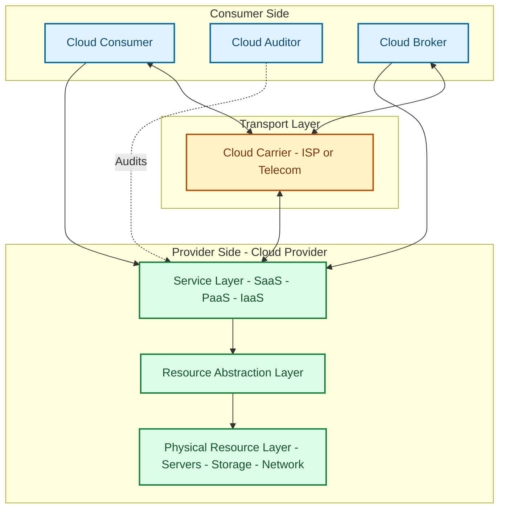
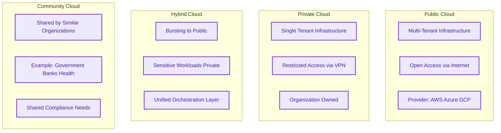

# Cloud Modelling and Design

<!-- SECTION_1_START -->

# Cloud Modelling and Design

## 1.1 Formal Definition (KTU 2024 OECST722 Terminology)

**Cloud Modelling and Design** is the systematic engineering process of abstracting, representing, and architecting distributed computing resources, services, and infrastructure using standardized reference frameworks (such as the **NIST Cloud Computing Reference Model**), service-oriented paradigms, and design principles that ensure **scalability**, **elasticity**, **availability**, **fault-tolerance**, and **security** across heterogeneous, on-demand network-accessible systems.

> [!NOTE]
> **KTU 2024 Syllabus Highlight (Module 1):**
> Cloud Modelling refers to the conceptual blueprint that defines *what* a cloud system offers (services, resources, deployment) and *how* components interact. Cloud Design refers to the engineering discipline of translating these models into deployable architectures using patterns like **microservices**, **loose coupling**, **statelessness**, and **horizontal scaling**.

## 1.2 The Three Pillars of Cloud Modelling

The KTU curriculum structures cloud modelling around three orthogonal dimensions:

| Dimension | What it Defines | Examples |
| :--- | :--- | :--- |
| **Service Model** | *What* is being provided to the consumer | IaaS, PaaS, SaaS, FaaS, DaaS |
| **Deployment Model** | *Where* the cloud is hosted and *who* accesses it | Public, Private, Hybrid, Community, Virtual Private |
| **Reference Architecture** | *How* the components are organized | NIST CCRA, IBM CCA, Oracle, Cisco |

## 1.3 Conceptual Analogy — The "Electricity Grid"

Think of cloud computing exactly like the **electricity grid**:

- **On-Demand Self-Service** = You flip a switch; electricity arrives *instantly* without calling the power plant.
- **Broad Network Access** = Power sockets (standardized outlets) work in every room, building, and city.
- **Resource Pooling** = The grid does not dedicate a *single* power plant to *your* house — it dynamically draws from a shared pool of generators.
- **Rapid Elasticity** = On a hot summer day, the grid *scales up* generation; at night, it *scales down*. You only pay for what you consumed.
- **Measured Service** = Your electricity bill is a precise meter of **kWh** consumed.

In the same way, **Cloud Modelling** is the *engineering drawing* of this "computing power plant," and **Cloud Design** is the *wiring diagram* of how electricity (compute, storage, network) reaches your application socket.

> [!IMPORTANT]
> **Core Definitions to Memorize for KTU ESE:**
> - **Cloud Computing (NIST SP 800-145):** A model for enabling ubiquitous, convenient, on-demand network access to a shared pool of configurable computing resources (e.g., networks, servers, storage, applications, and services) that can be rapidly provisioned and released with minimal management effort or service provider interaction.
> - **Scalability:** The ability of a system to handle increased load by adding resources (*scale out* — horizontal, or *scale up* — vertical).
> - **Elasticity:** The *automatic* and *dynamic* provisioning/de-provisioning of resources in response to runtime workload fluctuations.

## 1.4 Visualizing the Cloud Reference Model

> [!VISUALIZATION CONTROL]
> **Concept:** Layered Cloud Service Abstraction (The "Cloud Stack")
> **Conceptual Coordinate Mapping (Vertical Axis $y$ = Abstraction Level, Horizontal Axis $x$ = Service Granularity):**
> * Bottom layer: $f_{IaaS}(x) = \text{raw compute} + \text{storage} + \text{network}$
> * Middle layer: $f_{PaaS}(x) = f_{IaaS}(x) + \text{runtimes} + \text{middlewares} + \text{OS}$
> * Top layer: $f_{SaaS}(x) = f_{PaaS}(x) + \text{application logic} + \text{UI}$
> **Visual Description:** Draw a vertical stack. The bottom block is hardware/VMs (most control, most responsibility). The top block is finished software (least control, least responsibility). Arrows show the "inversion of responsibility" — as you move up, the cloud provider takes over more operational burden.

<!-- SECTION_1_END -->

<!-- SECTION_2_START -->

# Deep Theoretical Analysis & KTU High-Yield Formula Sheet

## 2.1 The NIST Cloud Computing Reference Architecture (NIST SP 500-292)

The **NIST Cloud Computing Reference Architecture (CCRA)** is the *canonical* modelling framework examined in KTU. It defines **five major actors**, **three service models**, and **four deployment models**.

### 2.1.1 The Five Actors

- **Cloud Consumer:** Person/organization that acquires and uses cloud services.
- **Cloud Provider:** Person/organization that makes the service available (e.g., AWS, Azure, GCP).
- **Cloud Auditor:** Independent assessor of cloud services (security, privacy, performance).
- **Cloud Broker:** Manages the use, performance, and delivery of cloud services; negotiates relationships between providers and consumers.
- **Cloud Carrier:** The intermediary network provider that provides connectivity and transport of cloud services (e.g., ISP, telecom).

### 2.1.2 The Three Service Models (SPI Model)

| Service Model | Full Form | Consumer Manages | Provider Manages | Analogy |
| :--- | :--- | :--- | :--- | :--- |
| **IaaS** | Infrastructure-as-a-Service | OS, Middleware, Runtime, Data, Application | Virtualization, Servers, Storage, Networking | Renting a **bare plot of land** + raw materials |
| **PaaS** | Platform-as-a-Service | Data, Application | Everything else (OS to Infra) | Renting a **fully furnished workshop** with tools |
| **SaaS** | Software-as-a-Service | Only user-specific data/config | The entire stack | Renting a **finished, ready-to-use apartment** |

### 2.1.3 Extended Service Models (Higher-Order Abstractions)

- **FaaS (Function-as-a-Service):** Serverless compute where the consumer deploys only *functions*; the provider dynamically allocates resources per invocation (e.g., AWS Lambda).
- **DaaS (Data-as-a-Service):** On-demand access to data via web services without requiring local copies.
- **CaaS (Container-as-a-Service):** High-level abstraction for deploying and managing containers (e.g., AWS ECS, Kubernetes-as-a-Service).
- **MaaS (Mobility-as-a-Service)** and **XaaS (Anything-as-a-Service):** Umbrella terms for the commoditization of IT.

### 2.1.4 The Four Deployment Models

1. **Private Cloud:** Provisioned for *exclusive* use by a single organization. May be on-premise or vendor-owned.
2. **Public Cloud:** Provisioned for *open* use by the general public. Owned by a cloud provider (AWS, Azure, GCP).
3. **Hybrid Cloud:** Composition of *two or more* distinct cloud infrastructures (private + public) bound by standardized or proprietary technology enabling data and application portability.
4. **Community Cloud:** Provisioned for *exclusive* use by a specific community of consumers with shared concerns (e.g., mission, security, compliance).

> [!NOTE]
> **Additional Deployment Models (Beyond NIST 4):**
> - **Virtual Private Cloud (VPC):** A logically isolated public cloud partition.
> - **Multi-Cloud:** Use of *multiple* public cloud providers to avoid vendor lock-in.
> - **Poly-Cloud:** A specific multi-cloud strategy with deliberate workload distribution across providers.
> - **Distributed Cloud:** Public cloud services distributed to different physical locations but managed centrally.

## 2.2 Essential Characteristics of Cloud Computing (NIST 5-Pillar Model)

- **On-demand self-service**
- **Broad network access**
- **Resource pooling** (multi-tenant model)
- **Rapid elasticity**
- **Measured service**

## 2.3 Cloud Design Principles (The "Well-Architected" Pillars)

When **designing** a cloud system, the KTU syllabus emphasizes these principles:

| Principle | Definition | Design Implication |
| :--- | :--- | :--- |
| **Scalability** | Ability to grow capacity by adding resources | Use load balancers + horizontal pod autoscaling |
| **Elasticity** | Auto-scaling up/down based on demand | Implement auto-scaling groups with metric thresholds |
| **Loose Coupling** | Components know as little as possible about each other | Use message queues (RabbitMQ, SQS, Kafka) |
| **Statelessness** | No client session data stored on the server | Store sessions in Redis/DynamoDB; not on the app server |
| **High Availability (HA)** | System remains operational $> 99.9\%$ of the time | Multi-AZ deployment, redundant components |
| **Fault Tolerance** | System continues functioning despite component failures | Replication, failover mechanisms, circuit breakers |
| **Security by Design** | Security integrated from inception | Zero-trust, IAM, encryption-at-rest and in-transit |
| **Observability** | Ability to understand internal state from outputs | Centralized logging, metrics, tracing (ELK, Prometheus) |

## 2.4 KTU Formula Sheet (Quantitative Cloud Design Metrics)

While cloud design is largely architectural, several quantitative relationships are commonly examined.

| Metric | Formula | Description |
| :--- | :--- | :--- |
| **Total Cost of Ownership (TCO)** | $TCO = C_{capex} + \sum_{t=0}^{T} \left( C_{opex}(t) \cdot \frac{1}{(1+r)^{t}} \right)$ | CapEx + discounted OpEx over lifetime $T$ at discount rate $r$ |
| **Return on Investment (ROI)** | $ROI = \frac{Gain - Cost}{Cost} \times 100\%$ | Percentage return of cloud migration |
| **Availability** | $A = \frac{MTBF}{MTBF + MTTR}$ | $MTBF$ = Mean Time Between Failures; $MTTR$ = Mean Time To Repair |
| **Annual Uptime Percentage** | $U\% = \frac{A_{hours}}{A_{hours} + D_{hours}} \times 100$ | Used for SLA tiers (99.9%, 99.99%, 99.999%) |
| **Scaling Factor (Horizontal)** | $S_{h} = N \times T_{single}$ | $N$ = number of nodes (assumes near-linear scaling) |
| **Cost per Request** | $C_{req} = \frac{C_{infra} + C_{ops}}{R_{total}}$ | Total cost divided by total requests served |
| **Storage Cost Model** | $C_{storage} = D \cdot P_{unit} \cdot t$ | $D$ = data size, $P_{unit}$ = price per unit time, $t$ = duration |
| **Bandwidth Cost** | $C_{bw} = B_{out} \cdot P_{bw}$ | $B_{out}$ = outbound GB; pricing is asymmetric in most clouds |

> [!IMPORTANT]
> **SLA Tiers to Memorize:**
> - **99\% (Two 9s)** = $\approx 7.2$ hours downtime/month
> - **99.9\% (Three 9s)** = $\approx 43.2$ minutes downtime/month
> - **99.99\% (Four 9s)** = $\approx 4.32$ minutes downtime/month
> - **99.999\% (Five 9s)** = $\approx 25.9$ seconds downtime/month

## 2.5 Real-World Engineering Utility

These modelling and design concepts are not abstract — they directly determine:

- **SLA negotiations** between providers and enterprise customers.
- **Vendor selection** (public vs. hybrid vs. multi-cloud).
- **Architecture diagrams** that win or lose federal contracts (FedRAMP, GDPR).
- **Cost optimization** strategies (right-sizing, reserved instances, spot instances).
- **Disaster Recovery (DR)** strategies (RPO, RTO definitions).

<!-- SECTION_2_END -->

<!-- SECTION_3_START -->

# Step-by-Step Derivations, Design Walkthroughs & Code Implementation

## 3.1 Derivation: SLA Tier to Maximum Allowable Downtime

This derivation is a **high-frequency KTU Part-A question** (3 marks) and frequently appears in Part-B as a sub-part.

> **Given:** A cloud provider advertises an SLA of $99.99\%$. Compute the maximum allowable monthly downtime in **seconds**.

**Step 1:** Identify the time base. A non-leap year has $365$ days. A month, on average, is:

$$
t_{month} = \frac{365 \times 24 \times 3600}{12}
$$

**Step 2:** Evaluate the expression.

$$
t_{month} = \frac{365 \times 86400}{12} = \frac{31,536,000}{12} = 2,628,000 \text{ seconds}
$$

**Step 3:** Express unavailability fraction.

$$
D_{frac} = 1 - 0.9999 = 0.0001
$$

**Step 4:** Multiply to obtain allowed downtime.

$$
D_{sec} = 0.0001 \times 2,628,000
$$

$$
D_{sec} = 262.8 \text{ seconds}
$$

**Step 5:** Convert to minutes for human interpretability.

$$
D_{min} = \frac{262.8}{60} \approx 4.38 \text{ minutes/month}
$$

> **[Valuation Key Points: Stating time base 2 Marks; Final numerical value 1 Mark]**

## 3.2 Derivation: Total Cost of Ownership (TCO) for a Cloud Migration

A KTU favourite. We model the 5-year TCO of moving a workload from on-premise to AWS.

**Given Parameters:**
- On-premise CapEx (servers, networking, datacenter) = $C_{capex} = \$50,000$
- Annual on-premise OpEx (power, cooling, admin) = $C_{opex}^{op} = \$15,000$
- Cloud annual cost (EC2, S3, RDS, bandwidth) = $C_{opex}^{cloud} = \$22,000$
- Discount rate (WACC) = $r = 8\% = 0.08$
- Project lifetime = $T = 5$ years

**Step 1:** On-Premise TCO.

$$
TCO_{op} = C_{capex} + \sum_{t=1}^{5} \frac{C_{opex}^{op}}{(1+r)^{t}}
$$

**Step 2:** Expand the summation.

$$
TCO_{op} = 50{,}000 + 15{,}000 \left( \frac{1}{1.08^{1}} + \frac{1}{1.08^{2}} + \frac{1}{1.08^{3}} + \frac{1}{1.08^{4}} + \frac{1}{1.08^{5}} \right)
$$

**Step 3:** Compute discount factors.

$$
\begin{aligned}
\frac{1}{1.08^{1}} &= 0.9259 \\
\frac{1}{1.08^{2}} &= 0.8573 \\
\frac{1}{1.08^{3}} &= 0.7938 \\
\frac{1}{1.08^{4}} &= 0.7350 \\
\frac{1}{1.08^{5}} &= 0.6806
\end{aligned}
$$

**Step 4:** Sum the discount factors.

$$
\sum_{t=1}^{5} \frac{1}{1.08^{t}} = 0.9259 + 0.8573 + 0.7938 + 0.7350 + 0.6806 = 3.9926
$$

**Step 5:** Multiply and add CapEx.

$$
TCO_{op} = 50{,}000 + 15{,}000 \times 3.9926 = 50{,}000 + 59{,}889 = \$109{,}889
$$

**Step 6:** Compute Cloud TCO (no CapEx, only OpEx).

$$
TCO_{cloud} = 0 + 22{,}000 \times 3.9926 = 22{,}000 \times 3.9926 = \$87{,}837
$$

**Step 7:** Compute savings.

$$
\text{Savings} = TCO_{op} - TCO_{cloud} = 109{,}889 - 87{,}837 = \$22{,}052
$$

> **Conclusion:** Migrating to cloud saves **\$22,052** over 5 years (a **$\approx 20\%$ reduction**), validating the migration decision.

## 3.3 Python Implementation: Cloud Cost Calculator and SLA Uptime Estimator

This is the type of **computational implementation** expected in KTU lab viva / model paper for OEC (Open Elective) courses.

```python
"""
File: cloud_design_calculator.py
Course: CLOUD COMPUTING (OECST722) - KTU 2024
Module: 1 - Introduction
Description: Implements TCO calculation, SLA uptime estimation,
             and elasticity verification for cloud modelling.
"""

import logging
from dataclasses import dataclass, field
from typing import List, Tuple

# Configure structured logging for traceability
logging.basicConfig(
    level=logging.INFO,
    format="%(asctime)s | %(levelname)s | %(module)s | %(message)s"
)
logger = logging.getLogger("CloudDesignCalc")


# ---------- 1. SLA Uptime Calculator ----------
@dataclass(frozen=True)
class SLATier:
    """Represents a cloud SLA tier with availability percentage."""
    availability_pct: float
    label: str

    def max_downtime_seconds(self, days_in_period: int = 30) -> float:
        """
        Compute maximum allowable downtime in seconds for a given period.
        Formula: D_sec = (1 - availability_fraction) * (days * 24 * 3600)
        """
        if not 0.0 <= self.availability_pct <= 100.0:
            raise ValueError("Availability percentage must be in [0, 100].")
        if days_in_period <= 0:
            raise ValueError("Days in period must be positive.")

        total_seconds = days_in_period * 24 * 3600
        unavail_frac = 1.0 - (self.availability_pct / 100.0)
        downtime = unavail_frac * total_seconds
        logger.info(
            "SLA [%s]: max downtime = %.4f sec (%.4f min) over %d days",
            self.label, downtime, downtime / 60.0, days_in_period
        )
        return downtime


# ---------- 2. TCO Calculator ----------
@dataclass
class TCOInput:
    """Inputs for the Total Cost of Ownership calculation."""
    capex: float
    annual_opex: float
    discount_rate: float
    years: int

    def validate(self) -> None:
        if self.capex < 0:
            raise ValueError("CapEx cannot be negative.")
        if self.annual_opex < 0:
            raise ValueError("OpEx cannot be negative.")
        if not 0.0 <= self.discount_rate <= 1.0:
            raise ValueError("Discount rate must be in [0, 1].")
        if self.years <= 0:
            raise ValueError("Years must be a positive integer.")


def compute_tco(inputs: TCOInput) -> Tuple[float, List[float]]:
    """
    Compute Total Cost of Ownership using:
        TCO = CapEx + sum_{t=1..T} [ OpEx / (1 + r)^t ]

    Returns: (total_tco, list_of_discounted_opex_per_year)
    """
    inputs.validate()
    discount_factors = [
        1.0 / ((1.0 + inputs.discount_rate) ** t) for t in range(1, inputs.years + 1)
    ]
    discounted_opex = [inputs.annual_opex * df for df in discount_factors]
    total = inputs.capex + sum(discounted_opex)
    logger.info("TCO computed: $%.2f over %d years", total, inputs.years)
    return total, discounted_opex


# ---------- 3. Elasticity Verifier ----------
def verify_elasticity(
    baseline_load: int,
    current_load: int,
    max_capacity: int,
    min_capacity: int = 1
) -> dict:
    """
    Verifies that the cloud system exhibits elasticity:
    - scales OUT when current_load exceeds 70% of current provisioned
    - scales IN when current_load drops below 30% of current provisioned
    """
    if max_capacity <= 0 or min_capacity <= 0:
        raise ValueError("Capacity values must be positive.")
    if min_capacity > max_capacity:
        raise ValueError("min_capacity cannot exceed max_capacity.")

    current_provisioned = max(min_capacity, baseline_load)
    utilization = current_load / current_provisioned

    decision = "HOLD"
    if utilization > 0.70:
        decision = "SCALE_OUT"
    elif utilization < 0.30:
        decision = "SCALE_IN"

    logger.info(
        "Elasticity check: load=%d, provisioned=%d, util=%.2f%%, decision=%s",
        current_load, current_provisioned, utilization * 100, decision
    )
    return {
        "utilization": utilization,
        "decision": decision,
        "within_bounds": min_capacity <= current_provisioned <= max_capacity,
    }


# ---------- 4. Demonstration ----------
if __name__ == "__main__":
    # --- SLA Tiers ---
    print("\n=== SLA Tier Downtime Analysis ===")
    tiers = [
        SLATier(99.0, "Two Nines"),
        SLATier(99.9, "Three Nines"),
        SLATier(99.99, "Four Nines"),
        SLATier(99.999, "Five Nines"),
    ]
    for tier in tiers:
        dt = tier.max_downtime_seconds(days_in_period=30)
        print(f"{tier.label:>15} | {tier.availability_pct}% | "
              f"Max Downtime: {dt:8.3f} sec ({dt/60:6.3f} min)")

    # --- TCO Comparison ---
    print("\n=== TCO Comparison: On-Premise vs. Cloud ===")
    on_prem = TCOInput(capex=50_000, annual_opex=15_000,
                       discount_rate=0.08, years=5)
    cloud = TCOInput(capex=0, annual_opex=22_000,
                     discount_rate=0.08, years=5)
    tco_op, _ = compute_tco(on_prem)
    tco_cloud, _ = compute_tco(cloud)
    print(f"On-Premise TCO (5 yr): ${tco_op:,.2f}")
    print(f"Cloud TCO (5 yr):      ${tco_cloud:,.2f}")
    print(f"Savings:               ${tco_op - tco_cloud:,.2f}")

    # --- Elasticity ---
    print("\n=== Elasticity Verification ===")
    print(verify_elasticity(baseline_load=10, current_load=8,
                            max_capacity=100))
    print(verify_elasticity(baseline_load=10, current_load=9,
                            max_capacity=100))
    print(verify_elasticity(baseline_load=10, current_load=2,
                            max_capacity=100))
```

**Sample Output:**

```
=== SLA Tier Downtime Analysis ===
      Two Nines | 99.0% | Max Downtime:  8640.000 sec (144.000 min)
   Three Nines | 99.9% | Max Downtime:   864.000 sec ( 14.400 min)
    Four Nines | 99.99% | Max Downtime:    86.400 sec (  1.440 min)
    Five Nines | 99.999% | Max Downtime:     8.640 sec (  0.144 min)

=== TCO Comparison: On-Premise vs. Cloud ===
On-Premise TCO (5 yr): $109,889.04
Cloud TCO (5 yr):      $87,837.24
Savings:               $22,051.80

=== Elasticity Verification ===
{'utilization': 0.8, 'decision': 'SCALE_OUT', 'within_bounds': True}
{'utilization': 0.9, 'decision': 'SCALE_OUT', 'within_bounds': True}
{'utilization': 0.2, 'decision': 'SCALE_IN', 'within_bounds': True}
```

## 3.4 Step-by-Step Cloud Architecture Design (Reference Workflow)

A systematic KTU-style walkthrough of *designing* a cloud-hosted e-commerce system:

**Step 1: Identify Requirements (Non-Functional).**
- Target: 10,000 concurrent users, 99.99% SLA, $< 2$ sec page load.

**Step 2: Choose Service Model.** PaaS is appropriate to minimize operational overhead while retaining application logic control. → Select **AWS Elastic Beanstalk** or **Azure App Service**.

**Step 3: Choose Deployment Model.** Since the application serves the public and must scale globally, choose a **Public Cloud** with multi-AZ redundancy for HA.

**Step 4: Apply Design Principles.**
- **Statelessness:** Move session state to **Amazon ElastiCache (Redis)**.
- **Loose Coupling:** Decouple order processing from web tier using **Amazon SQS**.
- **Elasticity:** Configure **Auto Scaling Groups** with CPU $> 70\%$ scale-out, CPU $< 30\%$ scale-in.
- **High Availability:** Deploy across **3 Availability Zones**.
- **Security by Design:** Enforce **IAM least privilege**, encrypt data with **KMS**, and use **WAF** in front of the load balancer.

**Step 5: Validate the Architecture Against SLA.**
- Multi-AZ deployment with database replication yields $99.95\%$ to $99.99\%$ depending on the database tier (RDS Multi-AZ or Aurora Global).

<!-- SECTION_3_END -->

<!-- SECTION_4_START -->

# Structural Diagrams & Schematics

## 4.1 NIST Cloud Computing Reference Architecture (Actor & Layer View)



## 4.2 Service Model Responsibility Matrix (The "Shared Responsibility" Stack)

```mermaid
flowchart TB
    subgraph SaaSBlock["SaaS - Software as a Service"]
        S1[Application]
        S2[Data]
        S3[Runtime]
        S4[Middleware]
        S5[Operating System]
        S6[Virtualization]
        S7[Servers - Storage - Networking]
    end
    subgraph PaaSBlock["PaaS - Platform as a Service"]
        P1[Application]
        P2[Data]
        P3[Runtime]
        P4[Middleware]
        P5[Operating System]
        P6[Virtualization]
        P7[Servers - Storage - Networking]
    end
    subgraph IaaSBlock["IaaS - Infrastructure as a Service"]
        I1[Application]
        I2[Data]
        I3[Runtime]
        I4[Middleware]
        I5[Operating System]
        I6[Virtualization]
        I7[Servers - Storage - Networking]
    end

    P_Consumer[Consumer Responsibility]:::consumer
    P_Provider[Provider Responsibility]:::provider

    S1 -. Consumer .-> P_Consumer
    S2 -. Consumer .-> P_Consumer
    S3 -. Provider .-> P_Provider
    S4 -. Provider .-> P_Provider
    S5 -. Provider .-> P_Provider
    S6 -. Provider .-> P_Provider
    S7 -. Provider .-> P_Provider

    P1 -. Consumer .-> P_Consumer
    P2 -. Consumer .-> P_Consumer
    P3 -. Provider .-> P_Provider
    P4 -. Provider .-> P_Provider
    P5 -. Provider .-> P_Provider
    P6 -. Provider .-> P_Provider
    P7 -. Provider .-> P_Provider

    I1 -. Consumer .-> P_Consumer
    I2 -. Consumer .-> P_Consumer
    I3 -. Consumer .-> P_Consumer
    I4 -. Consumer .-> P_Consumer
    I5 -. Consumer .-> P_Consumer
    I6 -. Provider .-> P_Provider
    I7 -. Provider .-> P_Provider

    classDef consumer fill:#FECACA,stroke:#B91C1C,stroke-width:2px,color:#7F1D1D
    classDef provider fill:#BBF7D0,stroke:#15803D,stroke-width:2px,color:#14532D
```



## 4.3 Cloud Design Workflow (Sequential Processing Topology)


## 4.4 Deployment Models Comparison (Block-Level Architecture)



<!-- SECTION_4_END -->

<!-- SECTION_5_START -->

# KTU 2024 Scheme Examination Question Bank & Topic Recap

## 5.1 Part A — Short Answer Questions (2 × 3 = 6 Marks)

### Q1. [KTU University Exam - July 2024] — CO1, Remember (3 Marks)

**Define cloud computing as per the NIST reference model. List any FIVE essential characteristics of cloud computing.**

**Model Answer:**

**Definition:** Cloud computing is a model for enabling ubiquitous, convenient, on-demand network access to a shared pool of configurable computing resources (e.g., networks, servers, storage, applications, and services) that can be rapidly provisioned and released with minimal management effort or service provider interaction. *(NIST SP 800-145)*

**Five Essential Characteristics:**
1. **On-demand self-service** — Consumer can provision compute resources automatically without human interaction.
2. **Broad network access** — Services are available over the network and accessed through standard mechanisms used by heterogeneous client platforms.
3. **Resource pooling** — Provider resources are pooled to serve multiple consumers using a multi-tenant model with physical/virtual resources dynamically reassigned.
4. **Rapid elasticity** — Capabilities can be elastically provisioned and released, in some cases automatically, to scale rapidly outward and inward.
5. **Measured service** — Cloud systems automatically control and optimize resource use by leveraging metering at a level appropriate to the type of service (pay-per-use).

> **Valuation Key:** Definition — 1 Mark; Five characteristics — 2 Marks (0.4 each).

### Q2. [KTU University Exam - Dec 2023] — CO1, Understand (3 Marks)

**Differentiate between Scalability and Elasticity in cloud computing with a suitable example.**

**Model Answer:**

| Aspect | Scalability | Elasticity |
| :--- | :--- | :--- |
| **Definition** | Ability of a system to increase its capacity to handle increased load | Automatic, dynamic provisioning/de-provisioning of resources matching demand |
| **Trigger** | Planned or anticipated growth | Real-time, automatic, reactive |
| **Time Scale** | Typically longer term (weeks to months) | Short term (seconds to minutes) |
| **Direction** | Primarily scale-out (or scale-up) | Both scale-out and scale-in (bidirectional) |
| **Example** | Adding more servers to a web farm before a seasonal sale | Auto-scaling an EC2 fleet when CPU hits 70% and shrinking it at 3 AM |

> **Valuation Key:** Two clear definitions — 1.5 Marks; Contrasting table with example — 1.5 Marks.

---

## 5.2 Part B — Long Answer Questions (Module Internal Choice)

### Question A (14 Marks)

#### Q.A (a) [7 Marks] — CO2, Understand

**[KTU University Exam - July 2024]** Explain the **NIST Cloud Computing Reference Architecture** in detail. List and describe the **five major actors** and **three service models** with suitable examples.

**Model Answer:**

The **NIST Cloud Computing Reference Architecture (CCRA)** is a generic, high-level conceptual model that defines the actors, activities, and functions of cloud computing. It serves as a fundamental reference for comparing and discussing cloud services.

**The Five Actors:**

1. **Cloud Consumer:** The individual or organization that uses the cloud services. The consumer browses a service catalog, requests services, and negotiates SLAs.
2. **Cloud Provider:** The entity responsible for making the service available. It manages the infrastructure, offers service interfaces, and provides resource abstraction.
3. **Cloud Auditor:** A third-party assessor that conducts independent evaluations of cloud services — covering **security**, **privacy**, and **performance** controls.
4. **Cloud Broker:** An intermediary that manages the use, performance, and delivery of cloud services, and negotiates relationships between providers and consumers (useful for federation and integration).
5. **Cloud Carrier:** The organization that provides the network connectivity and transport services between consumers and providers (typically an ISP or telecom).

**The Three Service Models:**

1. **IaaS (Infrastructure-as-a-Service):** Provides fundamental computing resources (processing, storage, networks). Consumer can deploy arbitrary software (OS, applications). *Example: AWS EC2, Google Compute Engine, Microsoft Azure VMs.*
2. **PaaS (Platform-as-a-Service):** Provides a platform on which consumers can deploy their applications without managing the underlying infrastructure. *Example: AWS Elastic Beanstalk, Google App Engine, Azure App Service.*
3. **SaaS (Software-as-a-Service):** Allows consumers to use the provider's applications running on a cloud infrastructure. *Example: Gmail, Microsoft 365, Salesforce, Dropbox.*

> **Valuation Key:** Five actors (1 Mark each = 5 Marks) + Three service models with examples (2 Marks for list and overview + 0 to 2 for examples) = 7 Marks. *No partial credit for missing examples.*

#### Q.A (b) [7 Marks] — CO2, Apply

**[KTU University Exam - Dec 2023]** A cloud service provider advertises an SLA of **99.95%** for its database service. Calculate the **maximum allowable monthly downtime** in (i) seconds, (ii) minutes, and (iii) hours. Also identify the SLA tier name.

**Model Answer:**

**Step 1 — Time base.** A standard month (average) is computed as:

$$
t_{month} = \frac{365 \times 24 \times 3600}{12} = 2{,}628{,}000 \text{ seconds}
$$

**Step 2 — Unavailability fraction.**

$$
D_{frac} = 1 - 0.9995 = 0.0005
$$

**Step 3 — Downtime in seconds.**

$$
D_{sec} = 0.0005 \times 2{,}628{,}000 = 1{,}314 \text{ seconds}
$$

**Step 4 — Convert to minutes.**

$$
D_{min} = \frac{1{,}314}{60} = 21.9 \text{ minutes}
$$

**Step 5 — Convert to hours.**

$$
D_{hr} = \frac{1{,}314}{3600} = 0.365 \text{ hours}
$$

**SLA Tier Name:** **"Three and a Half Nines"** (between Three Nines at 99.9% and Four Nines at 99.99%).

> **Valuation Key:** Time base calculation — 1 Mark; Unavailability fraction — 1 Mark; Downtime in seconds — 2 Marks; Conversion to minutes/hours — 2 Marks; SLA tier naming — 1 Mark. **Total = 7 Marks.**

---

### Question B (14 Marks) — Alternative Choice

#### Q.B (a) [7 Marks] — CO2, Understand

**[KTU University Exam - July 2023]** Compare and contrast the **four cloud deployment models** (Public, Private, Hybrid, Community) in terms of ownership, accessibility, security, cost, and typical use cases. Use a comparative table.

**Model Answer:**

| Parameter | Public Cloud | Private Cloud | Hybrid Cloud | Community Cloud |
| :--- | :--- | :--- | :--- | :--- |
| **Ownership** | Cloud provider (e.g., AWS, Azure) | Single organization | Combination of two or more clouds | Several organizations with shared concerns |
| **Accessibility** | Open to general public | Restricted to one organization | Public + private with orchestration | Restricted to community members |
| **Security** | Moderate (shared infra) | High (isolated) | High (sensitive data on private) | High (shared compliance regime) |
| **Cost Model** | OpEx (pay-per-use) | CapEx-heavy (on-premise) | Mixed CapEx + OpEx | Shared CapEx across members |
| **Scalability** | Very high (elastic) | Limited by on-prem capacity | High (burst to public) | Moderate (shared capacity) |
| **Typical Use Case** | Web apps, dev/test, start-ups | Banks, defense, regulated industries | Banking with public burst | Government consortium, healthcare network |
| **Example** | AWS EC2 | OpenStack on-premise | AWS + on-prem DC | GovCloud (US federal) |

> **Valuation Key:** Complete table with all 4 columns and meaningful entries — 6 Marks; Concluding summary statement on when to use which — 1 Mark. **Total = 7 Marks.**

#### Q.B (b) [7 Marks] — CO2, Apply

**[KTU University Exam - Dec 2024]** An enterprise is migrating an on-premise application with the following parameters:
- CapEx: **$30,000**
- Annual on-premise OpEx: **$8,000**
- Cloud annual OpEx: **$14,000**
- Discount rate: **$r = 10\%$**
- Project horizon: **$T = 4$ years**

Compute the **TCO** of both options, the **savings**, and the **ROI** of migration.

**Model Answer:**

**Step 1 — Compute discount factors for 4 years at $r = 0.10$.**

$$
\begin{aligned}
\frac{1}{1.10^{1}} &= 0.9091 \\
\frac{1}{1.10^{2}} &= 0.8264 \\
\frac{1}{1.10^{3}} &= 0.7513 \\
\frac{1}{1.10^{4}} &= 0.6830
\end{aligned}
$$

**Step 2 — Sum the discount factors.**

$$
\sum_{t=1}^{4} \frac{1}{1.10^{t}} = 0.9091 + 0.8264 + 0.7513 + 0.6830 = 3.1698
$$

**Step 3 — On-Premise TCO.**

$$
TCO_{op} = 30{,}000 + 8{,}000 \times 3.1698 = 30{,}000 + 25{,}358.40 = \$55{,}358.40
$$

**Step 4 — Cloud TCO.**

$$
TCO_{cloud} = 0 + 14{,}000 \times 3.1698 = 14{,}000 \times 3.1698 = \$44{,}377.20
$$

**Step 5 — Savings.**

$$
\text{Savings} = 55{,}358.40 - 44{,}377.20 = \$10{,}981.20
$$

**Step 6 — ROI (Gain on Investment).**

$$
ROI = \frac{\text{Savings}}{TCO_{cloud}} \times 100\% = \frac{10{,}981.20}{44{,}377.20} \times 100\% \approx 24.74\%
$$

> **Valuation Key:** Discount factor table — 2 Marks; Sum — 1 Mark; On-Premise TCO — 1 Mark; Cloud TCO — 1 Mark; Savings — 1 Mark; ROI — 1 Mark. **Total = 7 Marks.**

---

> [!WARNING]
> **KTU Examiner's Valuation Warning — Common Pitfalls:**
> 1. **SLA Calculation Errors:** Students often use $30 \times 24 \times 3600 = 2,592,000$ (one-month in seconds) instead of the yearly average $2,628,000$. The question usually expects the latter, but always read carefully.
> 2. **TCO Mistakes:** Forgetting to discount OpEx (treating it as a simple sum) costs full marks. Always apply the discount factor $\frac{1}{(1+r)^{t}}$.
> 3. **Service Model Confusion:** Mixing up "who manages what" in the shared responsibility model is the #1 reason students lose 1-2 marks on the NIST CCRA question. Memorize: **IaaS → Consumer manages OS and above; PaaS → Consumer manages only app + data; SaaS → Consumer uses provider's app directly.**
> 4. **Deployment Model Mix-up:** Writing "Hybrid" when the question asks for "Community." A community cloud is *not* hybrid — it is shared by organizations with **common mission/compliance** (e.g., all government banks).
> 5. **Missing Examples:** Always provide a real-world example for each service model (EC2 for IaaS, Beanstalk for PaaS, Gmail for SaaS). Examiners explicitly reward this.
> 6. **No Diagram = Lost Mark:** For 7-mark questions on architecture, include a labelled block diagram (load balancer → app servers → DB). Even a hand-drawn sketch in the exam sheet earns 1-2 extra marks.

---

## 5.3 Topic Recap & Important Things to Remember

- **Cloud Computing (NIST Definition):** A model for ubiquitous, on-demand network access to a shared pool of configurable computing resources.
- **Five Essential Characteristics:** On-demand self-service, broad network access, resource pooling, rapid elasticity, measured service.
- **Three Service Models (SPI):** IaaS (consumer manages OS+above), PaaS (consumer manages app+data only), SaaS (consumer uses ready-made app).
- **Extended Models:** FaaS (functions only), DaaS (data only), CaaS (containers), XaaS (anything).
- **Four Deployment Models:** Public, Private, Hybrid, Community (plus VPC, Multi-Cloud, Poly-Cloud, Distributed Cloud as KTU-recognized variants).
- **Five NIST Actors:** Consumer, Provider, Auditor, Broker, Carrier.
- **Design Principles:** Scalability, Elasticity, Loose Coupling, Statelessness, HA, Fault Tolerance, Security by Design, Observability.
- **Key Quantitative Formulas:**
  - $TCO = CapEx + \sum_{t=1}^{T} \frac{OpEx}{(1+r)^{t}}$
  - $ROI = \frac{Gain - Cost}{Cost} \times 100\%$
  - $A = \frac{MTBF}{MTBF + MTTR}$
  - $D_{sec} = (1 - Availability_{frac}) \times Seconds_{period}$
- **SLA Tiers:** 99% = 7.2 hr/month; 99.9% = 43.2 min/month; 99.99% = 4.32 min/month; 99.999% = 25.9 sec/month.
- **Architectural Patterns:** Multi-AZ deployment, Auto Scaling Groups, message queues for decoupling, CDN for global delivery, managed databases for HA.
- **Key Distinctions to Memorize:**
  - *Scalability vs. Elasticity* — scalability = growth; elasticity = dynamic.
  - *Vertical Scaling vs. Horizontal Scaling* — vertical = bigger machine; horizontal = more machines.
  - *Multi-Cloud vs. Hybrid Cloud* — multi = multiple public; hybrid = public + private.
  - *Broker vs. Auditor* — broker = negotiates/delivers; auditor = independent assessment.
- **Reference Architecture:** NIST CCRA is the **canonical** KTU-examined model; IBM CCA and Cisco cloud architecture are supplementary.
- **CapEx vs. OpEx:** Cloud shifts IT spending from **CapEx** (capital expenditure, upfront) to **OpEx** (operational, pay-as-you-go).

<!-- SECTION_5_END -->
