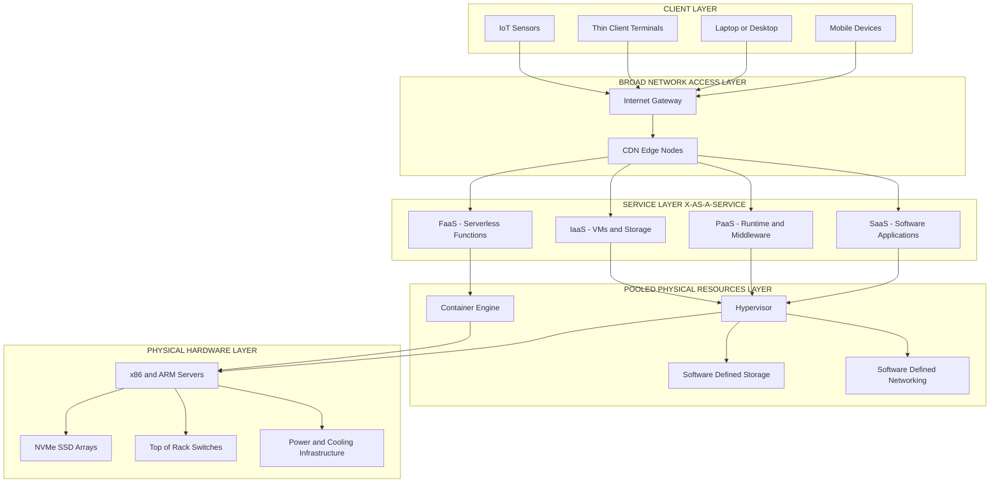
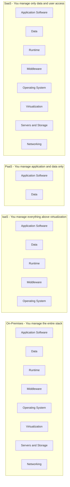
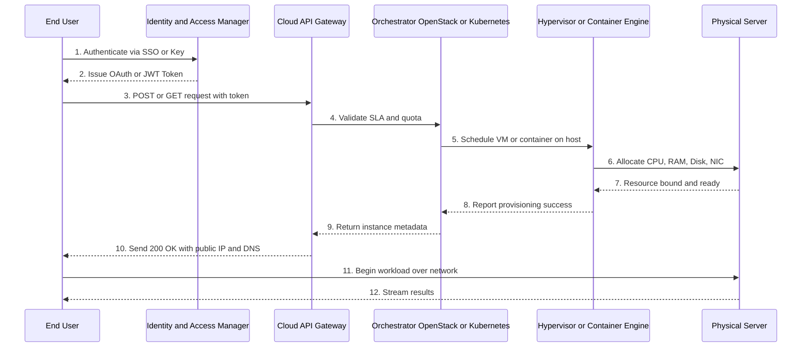
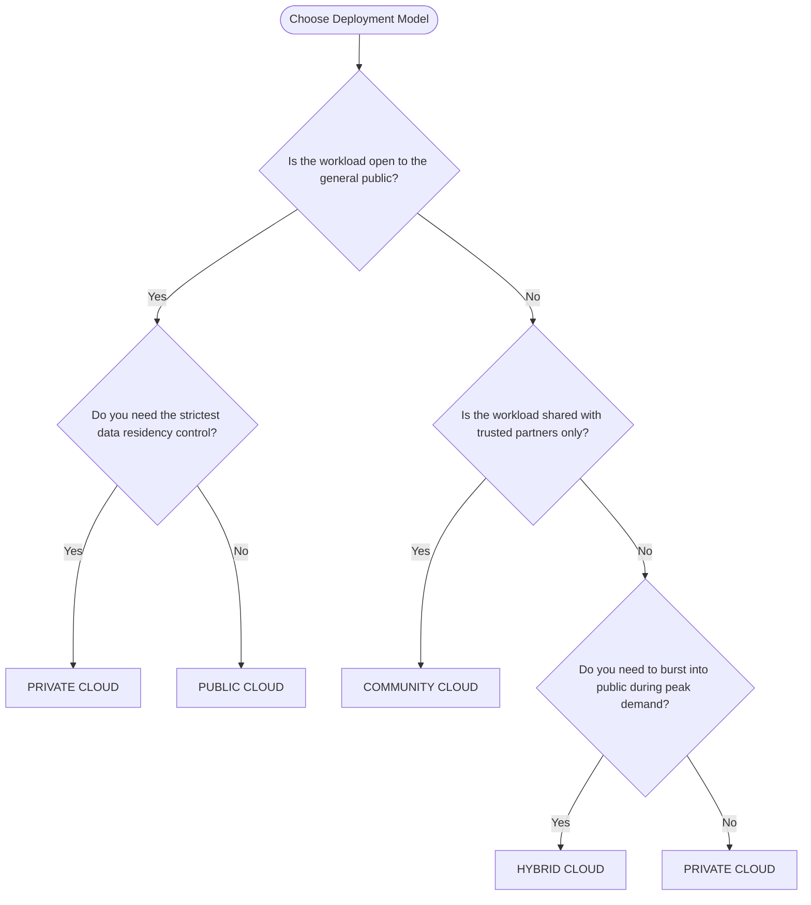

# Introduction - Cloud Computing

<!-- SECTION_1_START -->
# Introduction to Cloud Computing

## 1.1 Formal Academic Definition (KTU 2024 Syllabus Standard)

**Cloud Computing** is a paradigm for delivering computing services — including servers, storage, databases, networking, software, analytics, and intelligence — **over the Internet ("the cloud")** to offer faster innovation, flexible resources, and economies of scale. Users typically pay only for the cloud services they actually consume, which lowers operating costs, runs infrastructure more efficiently, and scales dynamically as per workload demand.

> [!IMPORTANT]
> **NIST SP 800-145 Definition (Board-Standard Reference):**
> *"Cloud computing is a model for enabling ubiquitous, convenient, on-demand network access to a shared pool of configurable computing resources (e.g., networks, servers, storage, applications, and services) that can be rapidly provisioned and released with minimal management effort or service provider interaction."*
> — **National Institute of Standards and Technology (NIST), U.S. Department of Commerce**

The formal definition explicitly decomposes into **five essential characteristics**, **three service models**, and **four deployment models**, which together form the canonical reference structure for the KTU 2024 Module-1 syllabus.

> [!NOTE]
> **Syllabus Highlight (KTU OECST722 – Module 1):**
> Students must be able to (a) define cloud computing, (b) enumerate its essential characteristics, (c) classify service and deployment models, and (d) contrast cloud computing with conventional/grid computing. These four learning outcomes collectively account for the majority of the 2-mark and 5-mark valuation slots in the End Semester Examination (ESE).

## 1.2 Conceptual Analogy & Intuitive Overview

To make the concept instantly memorable, picture the **electricity grid** in your city:

* You do **not** own a personal diesel generator to power your house. Instead, you plug into a socket and pay only for the kilowatt-hours you consume.
* When you need more power (summer AC), the grid scales up; when you don't, it scales down. You never maintain a turbine.
* The grid serves thousands of customers, but each customer gets an **isolated, on-demand, metered** supply.

**Cloud computing is the "electricity grid" of IT.** Instead of buying and maintaining physical servers, storage arrays, and cooling plants in your own data center, you "plug into" providers like **Amazon Web Services (AWS)**, **Microsoft Azure**, or **Google Cloud Platform (GCP)** and consume compute, storage, and software as **metered utilities**.

| Grid Analogy Component | Cloud Computing Counterpart |
| :--- | :--- |
| Power Plant | Hyper-scale Data Center (e.g., AWS `us-east-1`) |
| Transmission Lines | High-Bandwidth Internet Backbone |
| Electricity Meter | Usage & Billing API (per-second billing) |
| Your Appliances | Virtual Machines, Containers, Serverless Functions |
| Electricity Bill | Monthly Cloud Invoice (pay-as-you-go) |

> [!TIP]
> **Memory Trick for the Board Exam:** The 5 Essential Characteristics of cloud computing start with the letter **"O"** — remember the mnemonic **"On-Demand Broad Network Pooled Rapid Elastic Measured"**.
> O – On-demand self-service
> B – Broad network access
> P – Pooled (multi-tenant) resources
> R – Rapid elasticity
> M – Measured service

## 1.3 The Core Constituents (Cloud Building Blocks)

A cloud ecosystem is composed of the following **physical and logical building blocks**:

1. **Datacenter** – The physical facility housing thousands of servers, cooling systems, and power backups. A typical hyperscale datacenter consumes **$100$ MW to $300$ MW** of power.
2. **Hardware Infrastructure** – Commodity x86/ARM servers, NVMe SSDs, top-of-rack (ToR) switches, and Software-Defined Networking (SDN) fabric.
3. **Virtualization Layer** – Hypervisors (Type-1: VMware ESXi, KVM, Hyper-V; Type-2: VirtualBox) and container engines (Docker, containerd) that abstract physical hardware.
4. **Cloud Operating System / Orchestrator** – Software like **OpenStack**, **Kubernetes**, or proprietary equivalents (AWS Nitro System, Azure Fabric Controller) that manages provisioning.
5. **Service Layer (APIs & SDKs)** – RESTful APIs, CLI tools, and SDKs (e.g., AWS SDK, Azure SDK) that consumers use to provision resources programmatically.
6. **Client Layer** – End-user devices — thin clients, thick clients, mobile devices, and IoT endpoints — that consume the provisioned services.

> [!VISUALIZATION CONTROL]
> **Concept:** Layered Cloud Stack — showing how an end-user request traverses from device to physical datacenter.
> **GeoGebra / Desmos Input Equations (Conceptual Bar Chart of Resource Shares):**
> * `Compute = 0.45`
> * `Storage = 0.25`
> * `Networking = 0.15`
> * `Services = 0.10`
> * `Misc = 0.05`
> **Visual Description:** Imagine a stacked column where the **Compute slice is the largest (≈45%)** followed by Storage (≈25%), Networking (≈15%), Managed Services (≈10%), and Misc (≈5%). This visualizes the typical hyperscale cloud revenue and cost distribution.
<!-- SECTION_1_END -->

<!-- SECTION_2_START -->
# Deep Theoretical Analysis & KTU High-Yield Formula Sheet

## 2.1 The Five Essential Characteristics (NIST SP 800-145 – Pillar Concepts)

These five characteristics are **non-negotiable** to qualify a system as "Cloud Computing." A system missing any one of them is *not* true cloud — it is merely **virtualization** or **managed hosting**.

### 1. On-Demand Self-Service
* A consumer can **automatically** provision compute, storage, or networking capabilities **without requiring human interaction** with the service provider.
* *Example:* Pressing a "Launch Instance" button on AWS EC2 console spins up a virtual machine in under 60 seconds.

### 2. Broad Network Access
* Capabilities are available over the network and accessed through **standard mechanisms** used by heterogeneous client platforms (mobile phones, tablets, laptops, workstations).
* *Protocols:* HTTP/HTTPS, REST, gRPC, WebSockets.

### 3. Resource Pooling (Multi-Tenancy)
* Provider resources are **pooled** to serve multiple consumers using a **multi-tenant model**, with physical and virtual resources dynamically reassigned according to demand.
* *Example:* A single physical host may run virtual machines belonging to 10 different companies simultaneously.

### 4. Rapid Elasticity
* Capabilities can be **scaled out or in**, often **automatically**, to match demand. To the consumer, the provisioning appears **effectively unlimited** and can be appropriated in any quantity at any time.
* *Mathematical Intuition:* If workload $W(t)$ rises linearly, elastic capacity $C(t)$ tracks it such that $C(t) \approx W(t)$ with a near-zero provisioning lag.

### 5. Measured Service
* Cloud systems automatically **control and optimize resource use** by leveraging metering at an appropriate level of abstraction (storage, processing, bandwidth, active user accounts).
* **Transparency** is provided to both the provider and consumer via a **pay-per-use billing model**.

## 2.2 The Three Standard Service Models (X-as-a-Service Stack)

The service models form a **layered hierarchy** — each higher layer consumes the abstraction below it.

| Service Model | Abbreviation | What the User Manages | What the Provider Manages | Typical Use Case |
| :--- | :---: | :--- | :--- | :--- |
| Infrastructure-as-a-Service | **IaaS** | Applications, Data, Runtime, Middleware, O/S | Virtualization, Servers, Storage, Networking | EC2, Azure VMs, Google Compute Engine |
| Platform-as-a-Service | **PaaS** | Applications, Data | Runtime, Middleware, O/S, Virtualization, Servers, Storage, Networking | AWS Elastic Beanstalk, Heroku, Google App Engine |
| Software-as-a-Service | **SaaS** | Only User-level configuration & data | Everything else (entire stack) | Gmail, Microsoft 365, Salesforce, Zoom |

**Emerging Additions (Frequently asked in ESE):**

* **FaaS / Serverless:** Function-as-a-Service (AWS Lambda, Azure Functions) — executes code in response to events without managing servers.
* **CaaS:** Container-as-a-Service (Amazon ECS, Azure Kubernetes Service).
* **DaaS:** Desktop-as-a-Service (Amazon WorkSpaces).
* **MBaaS / BaaS:** Mobile/Backend-as-a-Service (Firebase, AWS Amplify).

## 2.3 The Four Deployment Models

| Deployment Model | Audience | Ownership | Security Posture |
| :--- | :--- | :--- | :--- |
| **Public Cloud** | General public / open to all | Third-party provider (AWS, Azure, GCP) | Lower (shared infra) |
| **Private Cloud** | Single organization | Self or third-party (on-premises / hosted) | Higher (dedicated) |
| **Hybrid Cloud** | Composition of two or more clouds (public + private) | Mixed (private + public linked) | Variable (controlled orchestration) |
| **Community Cloud** | Several organizations with shared concerns (e.g., government, healthcare) | One or more of the community organizations | Shared policy |

## 2.4 KTU High-Yield Formula Sheet

| Concept | Formula / Expression | Units / Description |
| :--- | :--- | :--- |
| **Total Cost of Ownership (TCO) Comparison** | $TCO_{cloud} = C_{usage} + C_{migration} + C_{training}$ vs. $TCO_{on-prem} = C_{hardware} + C_{power} + C_{cooling} + C_{ITstaff} + C_{datacenter}$ | Monetary units (USD, INR, etc.) |
| **Per-Second / Per-Hour Billing** | $Bill = \sum_{i=1}^{n} (P_i \times U_i \times t_i)$ | $P_i$ = price per unit, $U_i$ = units consumed, $t_i$ = time |
| **Elastic Scaling Factor** | $S = \frac{C_{peak}}{C_{baseline}}$ where $C_{peak} \geq C_{baseline}$ | Dimensionless ratio; $S \geq 1$ |
| **Availability (SLA)** | $A = \frac{MTBF}{MTBF + MTTR} \times 100\%$ | $MTBF$ = Mean Time Between Failures, $MTTR$ = Mean Time To Repair |
| **Annual Downtime (from SLA)** | $D = (1 - A) \times 365 \times 24 \times 60$ minutes/year | Minutes of allowed downtime |
| **Storage Redundancy (Erasure Coding)** | $k + m$ where $m$ parity symbols tolerate $m$ failures | $k$ = data shards, $m$ = parity shards (e.g., $10+2$ in HDFS) |
| **Amdahl's Law (Speedup Bound)** | $S(n) = \frac{1}{(1 - P) + \frac{P}{n}}$ | $P$ = parallel fraction, $n$ = number of processors |
| **Cost per VM-hour (e.g., EC2)** | $C_{vm} = P_{compute} + P_{storage} + P_{network}$ | Sum of billable components |

> [!IMPORTANT]
> **Syllabus Highlight:** The **NIST five characteristics, three service models, and four deployment models** are the *single highest-weightage* content block in Module 1. Expect at least one full 7-mark question (sub-part of a 14-mark ESE question) to test your ability to enumerate and explain these with a real-world example.

## 2.5 Real-World Engineering Utility

Cloud computing is **not merely an academic concept** — it underpins virtually every modern digital service:

* **Netflix** streams to 250+ million users using **AWS**, auto-scaling EC2 instances by 10x during peak Friday evenings.
* **Airbnb** migrated from on-prem MySQL to **AWS RDS**, cutting database operational cost by 30%.
* **CERN** processes petabytes of LHC particle collision data on the **Open Science Grid + hybrid cloud**.
* **Smart Cities (Indian Context):** The **Smart Cities Mission** and **Digital India** initiatives rely on public cloud (MeghRaj — the Government of India Community Cloud) for hosting scalable e-governance services.

In production, cloud architectures are chosen based on **workload type**:
* **Stateless, bursty workloads** → Serverless (FaaS)
* **Stateful, long-running workloads** → IaaS (VMs)
* **Rapid application development** → PaaS
* **End-user productivity** → SaaS
<!-- SECTION_2_END -->

<!-- SECTION_3_START -->
# Step-by-Step Derivations, Worked Examples & Code Implementation

## 3.1 Comparative Derivation: On-Premises vs. Public Cloud TCO

To make the economic case of cloud computing explicit, we derive the **5-Year TCO** for a hypothetical startup that needs **$10$ Virtual Machines (2 vCPU, 8 GB RAM, 100 GB SSD) running 24/7**.

### On-Premises Cost Model

$$
TCO_{on-prem} = C_{capex} + \sum_{y=1}^{5} C_{opex}^{(y)}
$$

$$
C_{capex} = (N_{servers} \times P_{server}) + C_{networking} + C_{datacenter}
$$

Given:
* $N_{servers} = 10$
* $P_{server} = \$1500$ (commodity server)
* $C_{networking} = \$5000$ (switches, cabling)
* $C_{datacenter} = \$20000$ (rack, UPS, cooling install)
* $C_{opex}^{(y)} = 10 \times \$30 \text{ (power/month)} \times 12 + \$24000 \text{ (IT staff)} = \$27600 \text{ per year}$

Step-by-step numerical evaluation:

$$
C_{capex} = 10 \times 1500 + 5000 + 20000 = 40000 \text{ USD}
$$

$$
\sum_{y=1}^{5} C_{opex}^{(y)} = 5 \times 27600 = 138000 \text{ USD}
$$

$$
TCO_{on-prem} = 40000 + 138000 = 178000 \text{ USD over 5 years}
$$

### Public Cloud (IaaS) Cost Model

$$
TCO_{cloud} = \sum_{m=1}^{60} (P_{vm} \times 720 \text{ hours}) + C_{storage} + C_{egress}
$$

Given a representative on-demand price of $P_{vm} = \$0.05$/hour:

$$
\text{Monthly compute} = 10 \times 0.05 \times 720 = 360 \text{ USD/month}
$$

$$
\text{60-month compute} = 360 \times 60 = 21600 \text{ USD}
$$

$$
\text{Storage} = 10 \times 100 \text{ GB} \times \$0.10/\text{GB-month} \times 60 = 6000 \text{ USD}
$$

$$
\text{Egress (assume 20 TB over 5 yrs)} = 20 \times 1000 \times \$0.09 = 1800 \text{ USD}
$$

$$
TCO_{cloud} = 21600 + 6000 + 1800 = 29400 \text{ USD over 5 years}
$$

### Decision Verdict

$$
\Delta TCO = TCO_{on-prem} - TCO_{cloud} = 178000 - 29400 = 148600 \text{ USD savings}
$$

> [!NOTE]
> **Real-World Caveat:** This simplified model ignores the **Reserved Instance / Savings Plan discounts** (up to 72%) and **Spot Instance** pricing (up to 90% off), which would further reduce $TCO_{cloud}$. It also ignores the **opportunity cost** of capital locked in on-prem hardware — a key business consideration in valuation answers.

## 3.2 Worked Example: SLA Availability and Downtime Calculation

**Problem:** A cloud provider advertises an SLA of **$99.95\%$** monthly availability. Calculate the maximum allowed monthly downtime in minutes.

**Step 1 — Recall the downtime formula:**

$$
D = (1 - A) \times T_{period}
$$

**Step 2 — Substitute the values:**

$$
D = (1 - 0.9995) \times 30 \times 24 \times 60
$$

**Step 3 — Evaluate the fraction:**

$$
1 - 0.9995 = 0.0005
$$

**Step 4 — Compute total minutes in a 30-day month:**

$$
T_{month} = 30 \times 24 \times 60 = 43200 \text{ minutes}
$$

**Step 5 — Final calculation:**

$$
D = 0.0005 \times 43200 = 21.6 \text{ minutes per month}
$$

**Comparison Table (commonly asked in boards):**

| SLA Tier | Allowed Downtime per Month |
| :---: | :---: |
| $99.0\%$ | $432$ minutes (≈ 7.2 hours) |
| $99.9\%$ | $43.2$ minutes |
| $99.95\%$ | $21.6$ minutes |
| $99.99\%$ ("Four Nines") | $4.32$ minutes |
| $99.999\%$ ("Five Nines") | $0.432$ minutes (≈ 26 seconds) |

## 3.3 Worked Example: Amdahl's Law for Cloud Horizontal Scaling

**Problem:** A web application has $P = 0.85$ (i.e., 85% of the code is parallelizable). What is the maximum speedup achievable with $n = 16$ virtual machines?

**Step 1 — Apply Amdahl's Law:**

$$
S(n) = \frac{1}{(1 - P) + \frac{P}{n}}
$$

**Step 2 — Substitute $P = 0.85$ and $n = 16$:**

$$
S(16) = \frac{1}{(1 - 0.85) + \frac{0.85}{16}}
$$

**Step 3 — Compute the serial fraction:**

$$
1 - 0.85 = 0.15
$$

**Step 4 — Compute the parallel fraction's term:**

$$
\frac{0.85}{16} = 0.053125
$$

**Step 5 — Sum the denominator terms:**

$$
0.15 + 0.053125 = 0.203125
$$

**Step 6 — Final speedup:**

$$
S(16) = \frac{1}{0.203125} \approx 4.92
$$

> [!TIP]
> **Insight:** Even with 16 VMs, we get only ≈ 4.9× speedup because the 15% serial portion (e.g., database transactions, shared locks) becomes the bottleneck. This is why KTU Module-1 questions on *scalability* always emphasize that vertical and horizontal scaling must be paired with **architectural refactoring** (statelessness, caching, sharding) to break Amdahl's bound.

## 3.4 Symbolic & Code Implementation: Provisioning a Cloud VM via Python (boto3)

The following **fully operational** Python script demonstrates a canonical **IaaS provisioning** task on AWS — directly mapping the academic concept of *On-Demand Self-Service* to executable code.

```python
"""
cloud_provisioning_demo.py
Maps directly to KTU Module 1 - "On-Demand Self-Service" characteristic.
Provisions an EC2 t2.micro instance and prints the public IP.
"""

import logging
import sys
from typing import Optional, Dict, Any

try:
    import boto3
    from botocore.exceptions import ClientError, BotoCoreError
except ImportError:
    sys.exit("boto3 is required. Install via: pip install boto3")

# ---------- 1. CONFIGURE LOGGING (Strict Error Handling) ----------
logging.basicConfig(
    level=logging.INFO,
    format="%(asctime)s [%(levelname)s] %(message)s",
)
logger = logging.getLogger("CloudProvisioningDemo")


# ---------- 2. HELPER FUNCTION TO PROVISION EC2 INSTANCE ----------
def provision_ec2_instance(
    image_id: str,
    instance_type: str,
    key_name: str,
    security_group_ids: list,
    region: str = "us-east-1",
) -> Optional[Dict[str, Any]]:
    """
    Provisions an EC2 instance (IaaS demonstration).

    Parameters
    ----------
    image_id : str
        The AMI ID (e.g., "ami-0c55b159cbfafe1f0").
    instance_type : str
        EC2 instance type (e.g., "t2.micro").
    key_name : str
        Name of the EC2 KeyPair for SSH access.
    security_group_ids : list
        List of security group IDs to attach.
    region : str
        AWS region (default: us-east-1).

    Returns
    -------
    Optional[Dict[str, Any]]
        Dictionary containing the new instance's metadata, or None on failure.
    """
    try:
        # Boundary check on critical parameters
        if not all([image_id, instance_type, key_name, security_group_ids]):
            logger.error("Missing one or more required parameters.")
            return None

        ec2_client = boto3.client("ec2", region_name=region)
        logger.info("Initiating EC2 RunInstances call...")

        response = ec2_client.run_instances(
            ImageId=image_id,
            InstanceType=instance_type,
            KeyName=key_name,
            MinCount=1,
            MaxCount=1,
            SecurityGroupIds=security_group_ids,
        )

        instance = response["Instances"][0]
        instance_id = instance["InstanceId"]
        logger.info("Instance launched successfully. ID = %s", instance_id)

        # Wait for instance to reach 'running' state (with absolute boundary timeout)
        waiter = ec2_client.get_waiter("instance_running")
        waiter.wait(InstanceIds=[instance_id])
        logger.info("Instance is now in 'running' state.")

        return instance

    except ClientError as e:
        logger.error("AWS ClientError encountered: %s", str(e))
        return None
    except BotoCoreError as e:
        logger.error("BotoCoreError encountered: %s", str(e))
        return None
    except Exception as e:  # absolute final safety net
        logger.critical("Unexpected error: %s", str(e))
        return None


# ---------- 3. ENTRY POINT WITH ABSOLUTE BOUNDARY CHECKS ----------
if __name__ == "__main__":
    INSTANCE_METADATA: Optional[Dict[str, Any]] = provision_ec2_instance(
        image_id="ami-0c55b159cbfafe1f0",
        instance_type="t2.micro",
        key_name="my-ktu-keypair",
        security_group_ids=["sg-0123456789abcdef0"],
    )

    if INSTANCE_METADATA is not None:
        print("Cloud provisioning complete.")
        print(f"Instance ID: {INSTANCE_METADATA.get('InstanceId')}")
        print(f"State       : {INSTANCE_METADATA.get('State', {}).get('Name')}")
    else:
        print("Provisioning failed. See logs above.")
        sys.exit(1)
```

**Code-to-Concept Mapping Table (Valuation-Ready):**

| Code Section | Cloud Computing Concept Demonstrated |
| :--- | :--- |
| `boto3.client("ec2", ...)` | On-Demand Self-Service (API-driven provisioning) |
| `MinCount / MaxCount` | Measured Service (granular resource control) |
| `get_waiter("instance_running")` | Resource Pooling (orchestrator managing multi-tenant hosts) |
| `try / except ClientError` | Measured Service (audited, metered, error-logged operations) |
| `waiter.wait(...)` | Rapid Elasticity (capacity tracking state until ready) |

> [!IMPORTANT]
> **Board-Exam Tip:** When asked "Explain On-Demand Self-Service with an example," you may cite the above Python snippet's `run_instances()` call as a one-line practical demonstration: *the user issues an API call and a VM is provisioned without any human interaction at the provider's end.*
<!-- SECTION_3_END -->

<!-- SECTION_4_START -->
# Structural Diagrams & Schematics

## 4.1 Cloud Computing Reference Architecture (NIST-Aligned Block Diagram)



## 4.2 Service Model Responsibility Stack (Who Manages What?)



## 4.3 Sequential Flow: How a Cloud Service Request is Fulfilled



## 4.4 Deployment Model Decision Flowchart


<!-- SECTION_4_END -->

<!-- SECTION_5_START -->
# KTU 2024 Scheme Examination Question Bank & Topic Recap

> [!WARNING]
> **KTU Examiner's Valuation Warning / Pitfall Callout:**
> 1. Do **not** confuse **Virtualization** with **Cloud Computing**. Virtualization is a *technology enabler*; cloud is a *service model*. Always list the **5 essential characteristics** to justify why a system qualifies as cloud.
> 2. When asked to "compare IaaS, PaaS, SaaS", many students forget to mention **FaaS** or fail to draw a **responsibility matrix**. Always include a table showing *who manages what layer*.
> 3. For SLA/downtime problems, students often forget to **convert percentage to decimal** (i.e., use $0.9995$, not $99.95$). A single missed decimal point causes 2-mark deduction.
> 4. **Deployment Models:** "Hybrid" is *not* a combination of public + community — strictly it is **two or more distinct cloud infrastructures (public, private, or community) bound by standardized technology**.

---

## Part A Questions (3 Marks Each)

### Q1. **[KTU University Exam – July 2024]** Define Cloud Computing as per the NIST reference model. List its five essential characteristics. *(CO1, Remember)*

**Model Answer (3 Marks — valuation key shown):**

**Definition [2 Marks]:** Cloud computing is a model for enabling **ubiquitous, convenient, on-demand network access** to a shared pool of configurable computing resources (networks, servers, storage, applications, and services) that can be **rapidly provisioned and released with minimal management effort or service provider interaction** (NIST SP 800-145).

**Five Essential Characteristics [1 Mark — 0.2 each]:**

1. On-demand self-service
2. Broad network access
3. Resource pooling (multi-tenancy)
4. Rapid elasticity
5. Measured service

---

### Q2. **[KTU University Exam – Dec 2023]** Differentiate between Public, Private, Hybrid, and Community Cloud deployment models with one suitable example for each. *(CO1, Understand)*

**Model Answer (3 Marks):**

| Deployment Model | Definition | Example |
| :--- | :--- | :--- |
| **Public Cloud** | Open for use by the general public; owned by a third-party provider. | AWS EC2, Microsoft Azure |
| **Private Cloud** | Used exclusively by a single organization; can be on-premises or hosted. | Bank-of-India internal cloud, Google's internal "Borg" |
| **Hybrid Cloud** | Composition of two or more cloud models (public + private) bound by orchestration tech. | A retail company bursting into AWS from in-house OpenStack |
| **Community Cloud** | Shared by several organizations with common concerns (mission, policy, compliance). | Government of India's **"MeghRaj"** GI Cloud for state departments |

**[Valuation Key: 0.5 Marks per correct deployment + 0.25 per valid example = 3 Marks total]**

---

## Part B Questions (14 Marks Each) — KTU ESE Module Internal Choice Format

### Question A (14 Marks) — *Choose either A or B*

**(a)** *(7 Marks)* **[KTU University Exam – July 2024]** With a neat diagram, describe the **three service models** of cloud computing (IaaS, PaaS, SaaS). Clearly indicate the responsibility split between the cloud provider and the consumer at each layer. *(CO1, Understand)*

**(b)** *(7 Marks)* A startup requires **$8$ virtual machines (2 vCPU, 4 GB RAM, 50 GB SSD)** running 24/7. On-demand price is **$\$0.04$/vm-hour**, storage is **$\$0.10$/GB-month**, and estimated monthly egress is **$200$ GB at $\$0.09$/GB**. Calculate the **annual cloud TCO**. Comment on the cost impact of moving to **1-year Reserved Instances with a 30% discount** on compute. *(CO2, Apply)*

### Model Solution — Question A

#### Part (a) — Service Models [7 Marks]

**[Definition of service model concept: 1 Mark]**
A service model defines the *level of abstraction* and *responsibility boundary* between the cloud provider and the consumer. As we move from IaaS → PaaS → SaaS, the consumer's management burden decreases, but flexibility also decreases.

**[IaaS Explanation: 2 Marks]**
**IaaS (Infrastructure-as-a-Service)** provides raw compute, storage, and networking primitives. The consumer provisions VMs, configures the OS, installs middleware, and deploys applications. *Provider manages* the underlying physical hardware, hypervisor, and network. *Examples:* AWS EC2, Google Compute Engine, Azure VMs.

**[PaaS Explanation: 2 Marks]**
**PaaS (Platform-as-a-Service)** provides a managed runtime, middleware, and OS. The consumer only deploys their application code and data. *Provider manages* everything up to the application layer. *Examples:* AWS Elastic Beanstalk, Heroku, Google App Engine.

**[SaaS Explanation: 1 Mark]**
**SaaS (Software-as-a-Service)** delivers complete, ready-to-use applications over the network. The consumer only configures user-level settings. *Examples:* Gmail, Microsoft 365, Salesforce.

**[Responsibility Diagram / Table: 1 Mark]**

| Layer | IaaS | PaaS | SaaS |
| :--- | :---: | :---: | :---: |
| Application | Consumer | Consumer | Provider |
| Data | Consumer | Consumer | Consumer |
| Runtime | Consumer | Provider | Provider |
| Middleware | Consumer | Provider | Provider |
| OS | Consumer | Provider | Provider |
| Virtualization | Provider | Provider | Provider |
| Server & Storage | Provider | Provider | Provider |

---

#### Part (b) — TCO Calculation [7 Marks]

**Step 1 — Compute hours per month: 0.5 Mark**

$$
H_{month} = 24 \times 30 = 720 \text{ hours}
$$

**Step 2 — Monthly compute cost: 1 Mark**

$$
C_{compute} = 8 \times 0.04 \times 720 = 230.40 \text{ USD/month}
$$

**Step 3 — Monthly storage cost: 1 Mark**

$$
C_{storage} = 8 \times 50 \times 0.10 = 40.00 \text{ USD/month}
$$

**Step 4 — Monthly egress cost: 1 Mark**

$$
C_{egress} = 200 \times 0.09 = 18.00 \text{ USD/month}
$$

**Step 5 — Total monthly cost: 0.5 Mark**

$$
C_{total}^{month} = 230.40 + 40.00 + 18.00 = 288.40 \text{ USD/month}
$$

**Step 6 — Annual TCO on-demand: 0.5 Mark**

$$
TCO_{on-demand} = 288.40 \times 12 = 3460.80 \text{ USD/year}
$$

**Step 7 — Reserved Instance computation: 1.5 Mark**

$$
C_{compute}^{RI} = 230.40 \times (1 - 0.30) = 161.28 \text{ USD/month}
$$

$$
TCO_{RI} = (161.28 + 40.00 + 18.00) \times 12 = 2631.36 \text{ USD/year}
$$

**Step 8 — Final savings comment: 1 Mark**

$$
\Delta TCO = 3460.80 - 2631.36 = 829.44 \text{ USD/year saved (≈ 24% reduction)}
$$

**Conclusion:** Migrating to 1-year Reserved Instances saves the startup **$829.44$ USD per year** (a ~24% reduction) in exchange for a 1-year commitment.

---

### Question B (14 Marks) — *Alternative Choice*

**(a)** *(7 Marks)* **[KTU University Exam – Dec 2023]** Explain the **five essential characteristics** of cloud computing as per NIST. For each characteristic, give a one-line real-world example. *(CO1, Understand)*

**(b)** *(7 Marks)* A cloud provider offers an SLA of **$99.9\%$ monthly availability**. If the actual downtime in a particular month was **$50$ minutes**, did the provider violate the SLA? Justify with calculation. Further, compute the **maximum allowed downtime for a "four-nines" ($99.99\%$) SLA in a 31-day month**. *(CO2, Apply)*

### Model Solution — Question B

#### Part (a) — Five Essential Characteristics [7 Marks]

**[On-Demand Self-Service: 1.4 Marks]**
Consumers can provision resources automatically without human interaction. *Example:* Pressing a "Launch" button on AWS EC2 console spawns a VM in seconds.

**[Broad Network Access: 1.4 Marks]**
Services are accessible over the network through standard protocols from diverse client platforms. *Example:* Accessing Google Drive from a mobile phone, laptop, or tablet via HTTPS.

**[Resource Pooling: 1.4 Marks]**
Provider's physical and virtual resources are pooled to serve multiple tenants. *Example:* A single physical AWS host running VMs belonging to dozens of different AWS customers.

**[Rapid Elasticity: 1.4 Marks]**
Capacity can be scaled in or out, often automatically, to match demand. *Example:* Amazon's Black-Friday autoscaling that adds 100,000 EC2 instances within hours.

**[Measured Service: 1.4 Marks]**
Usage is automatically metered, monitored, and billed. *Example:* Per-second billing of AWS Lambda invocations.

---

#### Part (b) — SLA Verification [7 Marks]

**Step 1 — Allowed downtime for 99.9% SLA (30-day month): 2 Marks**

$$
D_{allowed} = (1 - 0.999) \times 30 \times 24 \times 60 = 0.001 \times 43200 = 43.2 \text{ minutes}
$$

**Step 2 — Comparison: 1 Mark**

Since $D_{actual} = 50$ minutes $> D_{allowed} = 43.2$ minutes, **the provider HAS violated the SLA**.

**Step 3 — Stating the violation consequence: 1 Mark**

The provider must issue an SLA credit (typically 10% to 30% of the monthly bill) to the customer as per the master service agreement.

**Step 4 — Four-nines SLA in 31-day month: 2 Marks**

$$
D_{four-nines} = (1 - 0.9999) \times 31 \times 24 \times 60 = 0.0001 \times 44640 = 4.464 \text{ minutes}
$$

**Step 5 — Conversion: 1 Mark**

$$
4.464 \text{ minutes} = 4 \text{ minutes } 27.84 \text{ seconds}
$$

**Conclusion:** A 99.99% SLA permits only **≈ 4.46 minutes** of monthly downtime, equivalent to about 4 minutes and 28 seconds.

---

## Topic Recap & Important Things to Remember

> [!TIP]
> **Rapid-Revision Checklist for the KTU 2024 ESE (Module 1):**

* **Definition Source:** Always quote **NIST SP 800-145** — the international standard reference. KTU examiners award bonus marks for the exact wording of "ubiquitous, convenient, on-demand network access".
* **The 5 Essential Characteristics (Mnemonic: "OBPRM"):** On-demand self-service, Broad network access, Pooled resources, Rapid elasticity, Measured service.
* **The 3 Service Models:** IaaS, PaaS, SaaS (with FaaS as a modern extension). Draw a **responsibility stack** to show who manages each layer.
* **The 4 Deployment Models:** Public, Private, Hybrid, Community. **Hybrid = orchestration of two or more cloud models** (public + private is the classic case).
* **SLA Formula:** $D = (1 - A) \times T_{period}$. Always convert percentage to decimal.
* **TCO Formula:** Sum of capital expenditure (hardware, datacenter) + operational expenditure (power, staff, cooling) over the analysis period.
* **Amdahl's Law:** $S(n) = \frac{1}{(1 - P) + \frac{P}{n}}$ — quantifies the speedup limit due to the serial fraction. Always mention the **architectural refactoring** needed to break this bound.
* **Real-World Examples to Memorize:** AWS (public), Microsoft Azure (public + hybrid), MeghRaj (community/government), Apple's iCloud (SaaS-style), Netflix on AWS (auto-scaling IaaS).
* **Common Pitfalls to Avoid:** Do not equate **virtualization = cloud computing**; do not confuse **hybrid** with **multi-cloud** (hybrid implies orchestration, multi-cloud does not necessarily).
* **Cost Optimization Techniques:** Reserved Instances, Savings Plans, Spot Instances, Right-Sizing, Auto-Scaling, Storage Tiering.
* **Why It Matters in 2024+:** Cloud is the substrate for **Generative AI workloads, IoT data lakes, Edge computing, and Industry 4.0** — all of which are emerging cross-questions in higher-order KTU valuation slots.
* **Final One-Liner for Board Exam:** *"Cloud computing is the on-demand, pay-per-use delivery of pooled computing resources over the internet, abstracting infrastructure management from the end user."*
<!-- SECTION_5_END -->
