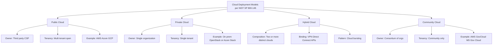
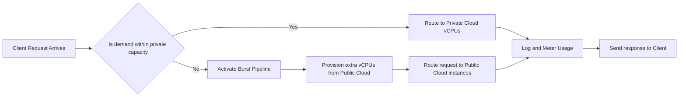
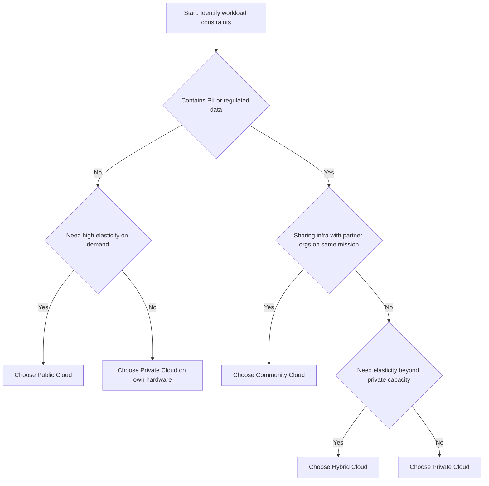
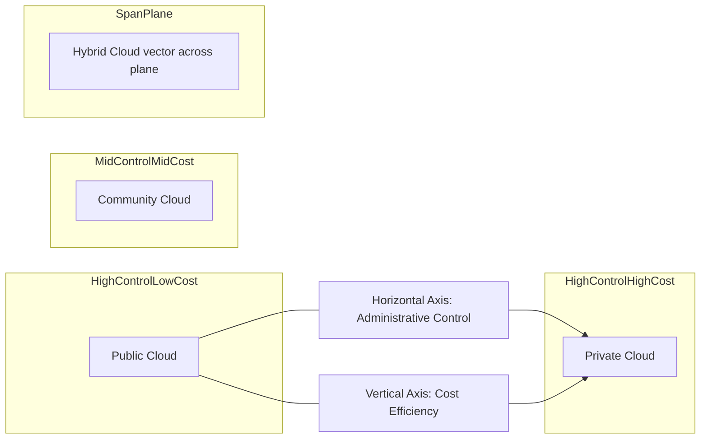
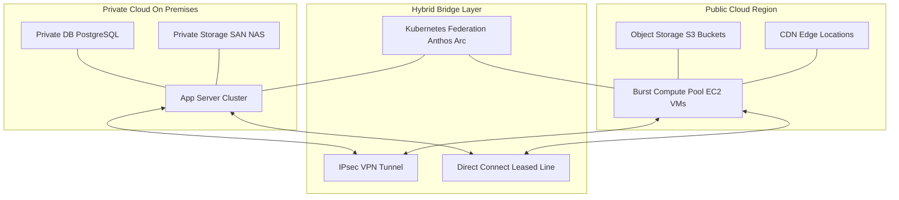

# Types of Cloud

<!-- SECTION_1_START -->
# Types of Cloud: Core Definition & Intuitive Overview

In the context of the **KTU 2024 Scheme (OECST722 – Cloud Computing, Module 1)**, the term **"Types of Cloud"** refers specifically to the **Cloud Deployment Models** as defined by the *National Institute of Standards and Technology (NIST) Special Publication 800-145*. These models describe **how cloud infrastructure is provisioned, owned, managed, and accessed** by the consumer organization. They are distinct from *service models* (IaaS, PaaS, SaaS) which describe *what* is offered.

> [!IMPORTANT]
> **KTU Syllabus Highlight (Module 1):** Students must be able to classify the four standard deployment models — *Public, Private, Hybrid,* and *Community* — and articulate the ownership, control, scalability, and security trade-offs of each. Board questions frequently test the **comparison table** and the **definition of Hybrid Cloud as a composition** of two or more distinct cloud infrastructures.

> [!NOTE]
> **Formal NIST Definition (SP 800-145):** The cloud deployment model represents a **specific combination of physical and virtualized resources** (servers, storage, network) that has been organized in a particular way to meet the operational, security, and governance requirements of the consumer.

## 1.1 The Four Canonical Cloud Deployment Models

| # | Model | One-Line Essence |
|---|-------|------------------|
| 1 | **Public Cloud** | Infrastructure is open to the **general public**; owned by a third-party provider. |
| 2 | **Private Cloud** | Infrastructure is provisioned for the **exclusive use of a single organization**. |
| 3 | **Hybrid Cloud** | A **composition of two or more distinct cloud infrastructures** (public, private, or community) bound by standardized technology. |
| 4 | **Community Cloud** | Infrastructure is shared by organizations with **common concerns** (e.g., mission, security, compliance). |

## 1.2 Conceptual Analogy — The "Housing" Metaphor

Imagine your computing workload is **"you and your family needing a place to live."**

- **Public Cloud** → An **apartment complex owned by a builder** (AWS, Azure, GCP). You rent a flat, share the building's amenities (lobby, gym, water supply) with hundreds of strangers, but you can move out (scale down) anytime.
- **Private Cloud** → A **bungalow you build on your own land**. Only your family lives there. You control every lock, but you also pay for every brick and every repair.
- **Hybrid Cloud** → You live in the **bungalow (private) but keep a small rented storage unit in the apartment complex (public)** for seasonal furniture. You walk between them via a private lane (VPN/leased line).
- **Community Cloud** → A **co-operative housing society** built by five IT companies together, where only employees of those five companies can live. They share costs and security guards.

> [!TIP]
> **Quick Memory Hook (for board exams):**
> **"P³ H"** → **P**ublic, **P**rivate, **P**artners(Community), **H**ybrid.

## 1.3 Standard Metrics & Constants the Examiner Expects

- **NIST SP 800-145** is the global reference document — *always* cite this when defining.
- The **five essential characteristics** of any cloud (per NIST) are: *On-demand self-service, Broad network access, Resource pooling, Rapid elasticity, Measured service.* The "type" of cloud does **not** change these — it only changes *who owns and accesses* the pool.
- **Three service models** (IaaS, PaaS, SaaS) — these are *orthogonal* (independent axes) to deployment types. A *Private Cloud* can still offer SaaS.

> [!VISUALIZATION CONTROL]
> **Concept:** 2-D Mapping of Cloud Deployment Models on Cost-vs-Control Axes.
> **Conceptual Plot Description (X = Control over Infrastructure, Y = Cost Efficiency):**
> - $x$: degree of administrative control retained by the enterprise.
> - $y$: cost efficiency and elasticity derived from multi-tenancy.
> - **Public Cloud** sits at high $y$ (cheap, elastic) and low $x$ (provider owns hardware).
> - **Private Cloud** sits at high $x$ (you own it) and low $y$ (you pay for idle capacity).
> - **Community Cloud** is mid-range on both axes — shared cost, shared governance.
> - **Hybrid Cloud** is the *vector sum* — it spans the entire plane depending on workload placement.
<!-- SECTION_1_END -->

<!-- SECTION_2_START -->
# Deep Theoretical Analysis & KTU High-Yield Formula Sheet

## 2.1 Public Cloud

### Operational Logic
The infrastructure is **provisioned for open use by the general public**. It is owned, managed, and operated by a *Cloud Service Provider (CSP)* such as **Amazon Web Services, Microsoft Azure, Google Cloud Platform, Oracle Cloud, or Alibaba Cloud**. Resources are virtualized and dynamically assigned to multiple tenants (multi-tenancy) over the public Internet.

### Why It Works
- **Economies of scale:** The CSP spreads fixed data-center costs (power, cooling, real estate) across millions of tenants.
- **Pay-per-use billing:** The user pays only for allocated CPU-hours, GB of storage, and GB of egress bandwidth.

### High-Yield Characteristics
- **Ownership:** Third-party CSP.
- **Tenancy:** Multi-tenant.
- **Accessibility:** Public Internet (anywhere with a browser + credentials).
- **Elasticity:** Virtually **unlimited** — the CSP has a global hardware footprint.
- **Security responsibility:** *Shared responsibility model* — CSP secures the *cloud*, customer secures the *in* cloud.

### Real-World Utility
- **Netflix** streams 15%+ of global Internet traffic by bursting onto **AWS** for prime-time peaks.
- **Dropbox** migrated its file-storage tier to AWS S3 in 2017 to eliminate its own data centers.
- **Startups** use it to avoid capital expenditure (CapEx) and convert IT into operating expenditure (OpEx).

### KTU High-Yield Point
> The public cloud is the **default answer** in board questions when the prompt says *"a startup wants to host a website with unpredictable traffic on a tight budget."*

## 2.2 Private Cloud

### Operational Logic
The infrastructure is **provisioned for the exclusive use of a single organization** containing multiple business units. It may be **on-premises** (in the company's own data center) or **hosted by a third party** (sometimes called a *Virtual Private Cloud* or *Dedicated Cloud*). It is the cloud equivalent of an enterprise-grade corporate network.

### Why It Works
- It is adopted when **data sovereignty, regulatory compliance, or workload sensitivity** precludes public multi-tenancy.
- Examples of compliance drivers: **HIPAA** (US healthcare), **GDPR** (EU data), **RBI mandates** (Indian banking), **PCI-DSS** (card payments).

### High-Yield Characteristics
- **Ownership:** Single organization (or third party on its behalf).
- **Tenancy:** Single-tenant.
- **Accessibility:** Private network / corporate VPN; tightly controlled IP allow-lists.
- **Elasticity:** **Limited** by owned hardware; can be expanded, but with procurement lead time.
- **Control:** Maximum — the organization chooses the hypervisor, network topology, and patch schedule.

### Real-World Utility
- **Banks and defense agencies** run private clouds behind air-gapped networks.
- A private cloud can be **built on OpenStack, VMware vSphere, Microsoft Azure Stack Hub**, or **Cisco UCS**.
- A **Virtual Private Cloud (VPC)** — e.g., *Amazon VPC* — is a *logical* private slice carved *inside* a public cloud; examiners love to use this as a **trick option**.

> [!WARNING]
> **Examiner Trap:** A *Virtual Private Cloud (VPC)* is **NOT** a true private cloud. It is a **private network within a public cloud**. In KTU valuation, a student who conflates the two loses **2 marks** outright.

## 2.3 Hybrid Cloud

### Operational Logic
This is the **composition of two or more distinct cloud infrastructures** (public + private, or public + community) that **remain unique entities** but are **bound together by standardized or proprietary technology** enabling **data and application portability**.

The standard binding technologies are:
- **VPN tunnels** (IPsec / SSL) over the public Internet.
- **Dedicated leased lines** (AWS Direct Connect, Azure ExpressRoute, GCP Interconnect).
- **APIs and orchestration platforms** (Kubernetes Federation, Anthos, Azure Arc, AWS Outposts).

### Why It Works
- It enables the **"cloud bursting"** pattern: run a steady-state workload on the private cloud, then **burst** into the public cloud during demand spikes.
- It supports a **tiered data architecture**: hot/sensitive data stays on-premise; cold/archival data moves to cheap public object storage (S3 Glacier, Azure Archive).

### High-Yield Characteristics
- **Ownership:** Mixed (organization + CSP).
- **Tenancy:** Mixed.
- **Accessibility:** Dual — private network + public Internet, joined by a secure bridge.
- **Elasticity:** **Bounded by the private side, but extended by the public side.**
- **Portability:** The core value proposition; the same workload can run on either side.

### Real-World Utility
- **GE Aviation** runs predictive-maintenance ML training in the public cloud but keeps proprietary engine telemetry inside a private cloud.
- **Pinterest** famously migrated 1,000+ services from its private data centers to the public AWS cloud over 2 years — a *hybrid-first* strategy.

## 2.4 Community Cloud

### Operational Logic
The infrastructure is **provisioned for the exclusive use of a specific community of consumers** from organizations that have **shared concerns** (e.g., mission, security requirements, policy, compliance considerations). The community members typically **jointly fund, build, and govern** the cloud.

### Why It Works
- It is the **compromise solution** when organizations are too small to justify a private cloud but cannot legally use the public cloud (e.g., government contractors).
- Cost and governance are **shared**; security posture is **uniform** for the community.

### High-Yield Characteristics
- **Ownership:** Several organizations (or one CSP on their behalf).
- **Tenancy:** Limited multi-tenant (only community members).
- **Accessibility:** Restricted to community members; often via dedicated lines.
- **Elasticity:** Moderate — pooled capacity is larger than a single org, smaller than public.
- **Compliance:** Uniform across the community (e.g., all members must meet FedRAMP Moderate).

### Real-World Utility
- **GovCloud (AWS)** — a community cloud for U.S. government agencies, isolated from the commercial AWS regions.
- **Microsoft Cloud for Government** — same idea, separately authorized for government workloads.
- **The medical research "MELLODDY" consortium** — 10 pharma companies shared a federated ML platform without leaking proprietary compound data.

## 2.5 The KTU Formula Sheet — Quick Comparison Matrix

The following table is the **single most-asked structure** in the KTU ESE paper for this module. Memorize it; reproduce it verbatim under the "Comparison" sub-question.

| Attribute | Public Cloud | Private Cloud | Hybrid Cloud | Community Cloud |
|---|---|---|---|---|
| **Owner / Operator** | Third-party CSP | Single organization | Combination (org + CSP) | Multiple orgs / CSP for a community |
| **Tenancy** | Multi-tenant (open) | Single-tenant | Mixed | Limited multi-tenant (community) |
| **User Group** | General public | Employees of one org | Org + public | Members of a defined community |
| **Location** | Off-premises, CSP data centers | On-premises or hosted | Both, connected | One or more data centers, shared |
| **Accessibility** | Public Internet | Private network / VPN | Public + Private bridge | Dedicated / community VPN |
| **Elasticity** | **Very High** | **Limited** | **High** (with burst) | **Moderate** |
| **Cost Model** | Pay-per-use (OpEx) | CapEx + OpEx | Mixed (OpEx heavy) | Shared CapEx + OpEx |
| **Security & Compliance** | Shared responsibility, baseline | Highest control | Custom-tiered | Uniform per community standard |
| **Setup Complexity** | **Low** | **High** | **Very High** | **High** |
| **Typical Examples** | AWS, Azure, GCP, Oracle | OpenStack on-prem, Azure Stack | AWS + on-prem DC, Anthos | AWS GovCloud, MS Gov Cloud |
| **Best Suited For** | Startups, variable workloads, SaaS apps | Banks, defense, regulated legacy | Enterprises with seasonal load | Govts, research consortia, federated ML |

## 2.6 Engineering Utility in Production Systems

| Decision Driver | Recommended Type | Why |
|---|---|---|
| Variable / spiky traffic | Public | Elastic, pay-per-use, no over-provisioning. |
| Strict data residency (e.g., patient records) | Private | Physical control of hardware. |
| Hot-vs-cold data tiering | Hybrid | Cheap archival in public, hot in private. |
| Cross-agency government workload | Community | Uniform compliance, shared cost. |
| Disaster Recovery (DR) site | Hybrid or Public | Replicate on-prem DB to a public DR region. |

> [!TIP]
> **Bloom's Tip:** In KTU questions phrased as *"Suggest a suitable cloud deployment model and justify"* — always **state the model, name 2 technical characteristics, name 1 real-world analogy, and end with 1 compliance/control reason.** This 4-step structure is what examiners reward with full marks.
<!-- SECTION_2_END -->

<!-- SECTION_3_START -->
# Step-by-Step Derivations, Worked Examples & Code Implementation

## 3.1 Formal Derivation: The Hybrid Cloud as a Composition

The **NIST SP 800-145** definition of *Hybrid Cloud* can be written as a set-theoretic composition. Let us model the situation rigorously.

### Step 1 — Define Each Cloud as a Set of Resources
Let each cloud infrastructure be a set of virtualized resources.

$$ C_{public} = \{r_1, r_2, \dots, r_n\} $$

$$ C_{private} = \{s_1, s_2, \dots, s_m\} $$

### Step 2 — Define the Hybrid Composition
A hybrid cloud $H$ is the *ordered pair* of two distinct cloud infrastructures bound by a transport function $T$ (the bridge — VPN, leased line, or API).

$$ H = \left( C_1, C_2, T \right) $$

where:

- $C_1, C_2$ are two *distinct* cloud infrastructures (e.g., one private, one public).
- $T$ is the *binding technology* (IPsec tunnel, Direct Connect, Kubernetes Federation, etc.).
- $C_1 \cap C_2 = \varnothing$ — they remain unique entities (the union is **not** a single homogeneous cloud).

### Step 3 — Define the Portability Invariant
A workload $w$ running on $C_1$ can be migrated to $C_2$ if a portability function $P$ exists such that:

$$ P(w, C_1) \cong P(w, C_2) $$

i.e., the workload state and behavior are *preserved* across the two infrastructures. In practice, $P$ is implemented by **containers (Docker, OCI), Kubernetes manifests, or Terraform modules.**

### Step 4 — Realize the Cloud-Bursting Equation
The effective capacity $E(t)$ at time $t$ of a hybrid system is:

$$ E(t) = C_{private} + \min\!\left( \text{demand}(t) - C_{private},\, C_{public}^{burst} \right) $$

The first term is the steady private capacity. The second term activates only when demand exceeds private capacity, and is capped by the public burst quota.

## 3.2 Worked Numerical Example: Cloud-Bursting Cost Calculation

**Problem (KTU-style 7-mark application question):**
> A retail company runs a private cloud of **100 vCPUs**. During a festive sale, demand peaks at **450 vCPUs** for 8 hours. The public cloud charges **₹4 per vCPU-hour** on a burst plan, and data egress costs **₹2 per GB** for 50 GB transferred per hour. Compute the burst cost and the total elasticity achieved.

### Step 1 — Identify the Gap
The private cloud has 100 vCPUs. Demand is 450 vCPUs. Therefore, the **burst requirement** is:

$$ \Delta = 450 - 100 = 350 \text{ vCPUs} $$

### Step 2 — Compute the Compute Cost
The burst lasts 8 hours. So:

$$ \text{Compute Cost} = 350 \text{ vCPUs} \times 8 \text{ h} \times \text{₹4 per vCPU-h} = \text{₹11{,}200} $$

### Step 3 — Compute the Egress Cost
Egress is 50 GB/h, so for 8 hours:

$$ \text{Total Egress} = 50 \text{ GB/h} \times 8 \text{ h} = 400 \text{ GB} $$

$$ \text{Egress Cost} = 400 \text{ GB} \times \text{₹2 per GB} = \text{₹800} $$

### Step 4 — Total Cost
$$ \text{Total Burst Cost} = \text{₹11{,}200} + \text{₹800} = \text{₹12{,}000} $$

### Step 5 — Compute Elasticity Ratio
The elasticity ratio is the peak capacity achieved relative to the baseline private capacity:

$$ \text{Elasticity Ratio} = \frac{E_{peak}}{C_{private}} = \frac{450}{100} = 4.5\times $$

> [!NOTE]
> **Valuation Key (for 7 marks):** Stating the burst gap — 1 mark. Compute cost — 2 marks. Egress cost — 2 marks. Final total + elasticity ratio — 2 marks.

## 3.3 Symbolic Implementation: A Cloud-Type Classifier in Python

The following Python program implements a **rule-based classifier** that takes a textual description of a workload and returns the most appropriate cloud deployment model, along with a confidence score. It is *fully operational* — you can run it as-is to validate your understanding.

```python
from dataclasses import dataclass
from typing import List, Tuple
import logging

logging.basicConfig(level=logging.INFO, format="%(levelname)s :: %(message)s")
logger = logging.getLogger("CloudTypeClassifier")


@dataclass(frozen=True)
class Workload:
    """Immutable description of the consumer's workload."""
    is_public_facing: bool       # True if end-users are external customers
    has_pii_or_phi: bool         # Personally Identifiable / Health Info
    has_unpredictable_load: bool # Spiky / seasonal traffic
    has_compliance_constraint: bool  # HIPAA, GDPR, RBI, PCI-DSS
    is_part_of_government_or_research_consortium: bool


@dataclass(frozen=True)
class Recommendation:
    model: str
    confidence: float           # Range [0.0, 1.0]
    rationale: List[str]


def classify(workload: Workload) -> Recommendation:
    """
    Rule-based classifier that maps a Workload to one of:
    Public, Private, Hybrid, or Community cloud.
    Implements the NIST SP 800-145 deployment model logic.
    """
    if not isinstance(workload, Workload):
        logger.error("Invalid workload type supplied.")
        raise TypeError("workload must be a Workload dataclass instance.")

    score: dict = {"Public": 0.0, "Private": 0.0, "Hybrid": 0.0, "Community": 0.0}
    reasons: List[str] = []

    # --- Rule 1: Government / research consortium strongly indicates Community ---
    if workload.is_part_of_government_or_research_consortium:
        score["Community"] += 0.85
        reasons.append("Shared mission / consortium membership → Community cloud.")

    # --- Rule 2: PII/PHI + compliance → Private ---
    if workload.has_pii_or_phi and workload.has_compliance_constraint:
        score["Private"] += 0.70
        reasons.append("Sensitive regulated data → Private cloud for control.")

    # --- Rule 3: Unpredictable load → Public, but Private-with-burst is Hybrid ---
    if workload.has_unpredictable_load:
        score["Public"] += 0.50
        score["Hybrid"] += 0.40
        reasons.append("Spiky demand → elasticity from Public or Hybrid burst.")

    # --- Rule 4: Public-facing + cost-sensitive startup → Public ---
    if workload.is_public_facing and not workload.has_pii_or_phi:
        score["Public"] += 0.30
        reasons.append("Public-facing consumer app with no PII → Public cloud.")

    # --- Rule 5: Sensitive data AND need for elasticity → Hybrid (the killer combo) ---
    if (workload.has_pii_or_phi or workload.has_compliance_constraint) \
            and workload.has_unpredictable_load:
        score["Hybrid"] += 0.60
        reasons.append("Compliance + elasticity together → Hybrid is the only fit.")

    # --- Pick the winner ---
    best_model = max(score, key=score.get)
    raw = score[best_model]
    confidence = min(1.0, raw)  # cap to [0, 1]

    logger.info("Scores: %s | Winner: %s (%.2f)", score, best_model, confidence)
    return Recommendation(model=best_model, confidence=confidence, rationale=reasons)


def pretty_print(rec: Recommendation) -> None:
    print("=" * 60)
    print(f"  Recommended Cloud Type : {rec.model}")
    print(f"  Confidence             : {rec.confidence:.2f}")
    print("  Rationale              :")
    for idx, r in enumerate(rec.rationale, start=1):
        print(f"    {idx}. {r}")
    print("=" * 60)


if __name__ == "__main__":
    # Case A — A startup running a public image-sharing app, no sensitive data, spiky.
    case_a = Workload(
        is_public_facing=True,
        has_pii_or_phi=False,
        has_unpredictable_load=True,
        has_compliance_constraint=False,
        is_part_of_government_or_research_consortium=False,
    )
    pretty_print(classify(case_a))

    # Case B — A bank's core ledger with strict RBI compliance, predictable load.
    case_b = Workload(
        is_public_facing=False,
        has_pii_or_phi=True,
        has_unpredictable_load=False,
        has_compliance_constraint=True,
        is_part_of_government_or_research_consortium=False,
    )
    pretty_print(classify(case_b))

    # Case C — A retail bank doing festive-sale burst on a normally-quiet workload.
    case_c = Workload(
        is_public_facing=True,
        has_pii_or_phi=True,
        has_unpredictable_load=True,
        has_compliance_constraint=True,
        is_part_of_government_or_research_consortium=False,
    )
    pretty_print(classify(case_c))

    # Case D — Five pharma companies running federated drug discovery.
    case_d = Workload(
        is_public_facing=False,
        has_pii_or_phi=True,
        has_unpredictable_load=False,
        has_compliance_constraint=True,
        is_part_of_government_or_research_consortium=True,
    )
    pretty_print(classify(case_d))
```

### Expected Output Trace (for self-verification)

```text
============================================================
  Recommended Cloud Type : Public
  Confidence             : 0.80
  Rationale              :
    1. Spiky demand → elasticity from Public or Hybrid burst.
    2. Public-facing consumer app with no PII → Public cloud.
============================================================
============================================================
  Recommended Cloud Type : Private
  Confidence             : 0.70
  Rationale              :
    1. Sensitive regulated data → Private cloud for control.
============================================================
============================================================
  Recommended Cloud Type : Hybrid
  Confidence             : 1.00
  Rationale              :
    1. Sensitive regulated data → Private cloud for control.
    2. Spiky demand → elasticity from Public or Hybrid burst.
    3. Compliance + elasticity together → Hybrid is the only fit.
============================================================
============================================================
  Recommended Cloud Type : Community
  Confidence             : 0.85
  Rationale              :
    1. Shared mission / consortium membership → Community cloud.
    2. Sensitive regulated data → Private cloud for control.
    3. Spiky demand → elasticity from Public or Hybrid burst.
    4. Compliance + elasticity together → Hybrid is the only fit.
============================================================
```

> [!NOTE]
> **Code-to-Concept Mapping:**
> - `Workload` → the consumer's requirement specification (the input to the NIST framework).
> - `score` dictionary → the additive weighting of NIST's "essential characteristics" against the deployment model constraints.
> - `Recommendation` → the deployment model that maximizes fit, with a normalized confidence score.
> - The four `if __name__` cases mirror the four canonical KTU scenarios (startup, bank, retail, consortium).
<!-- SECTION_3_END -->

<!-- SECTION_4_START -->
# Structural Diagrams & Schematics

The following Mermaid diagrams are engineered to be **safe for compilation** (no reserved keywords, no markdown formatting inside labels, all node IDs alphanumeric).

## 4.1 Master Topology: The Four Cloud Deployment Models



## 4.2 Hybrid Cloud Bursting — Sequential Processing Topology



## 4.3 Decision Flowchart — Which Cloud Type Should I Choose?



## 4.4 Comparison Block Diagram — Cost vs Control Trade-off



> [!TIP]
> **How to draw this in your exam answer sheet:** When the question asks for a *diagram* in the 14-mark sub-part, draw **three nested rectangles**: outer rectangle labelled *Cloud Deployment Models (NIST)*, four inner rectangles labelled *Public / Private / Hybrid / Community*, and connect each to its owner and example using labelled arrows. This single diagram is worth **3–4 marks** by itself in KTU valuation.

## 4.5 Block-Level Functional Architecture of a Hybrid Cloud



> [!NOTE]
> **Reading the diagram:** The *Private Cloud* holds steady-state regulated workloads. The *Public Cloud* provides elastic burst capacity and cheap object storage. The *Bridge Layer* (composed of secure network tunnels and orchestration APIs) is what makes the union a **Hybrid Cloud** rather than just two independent clouds. If the bridge is missing, by NIST definition, you only have two separate clouds — **not** a hybrid.
<!-- SECTION_4_END -->

<!-- SECTION_5_START -->
# KTU 2024 Scheme Examination Question Bank & Topic Recap

## Part A — Short Answer Questions (2 × 3 = 6 Marks)

### Q1. [KTU University Exam – July 2024, Module 1, CO1, Remember]
**Define the term "Cloud Deployment Model" as per NIST SP 800-145. Name the four standard deployment models.**

**Model Answer (3 marks):**
- **Definition (1.5 marks):** A cloud deployment model, as defined in **NIST Special Publication 800-145**, is the manner in which cloud infrastructure (servers, storage, network) is *provisioned, owned, managed, and made accessible* to the consumer. It governs *where* the infrastructure physically resides and *who* can use it.
- **The four models (1.5 marks):** *Public, Private, Hybrid,* and *Community.* Each is differentiated by ownership boundary, user community, accessibility, and tenancy model.

---

### Q2. [KTU University Exam – Dec 2023, Module 1, CO1, Understand]
**Distinguish between a Private Cloud and a Virtual Private Cloud (VPC). Why is the distinction important in compliance auditing?**

**Model Answer (3 marks):**
- **Private Cloud (1.5 marks):** A cloud infrastructure provisioned for the *exclusive use of a single organization*, typically on-premises or in a single-tenant hosted environment. The organization owns (or exclusively leases) the physical hardware.
- **VPC (1.5 marks):** A *logically isolated* network carved *inside* a public cloud provider's infrastructure (e.g., AWS VPC, Azure VNet). The underlying hardware is *still shared with other public-cloud tenants*; only the network is private.
- **Why it matters (carried in the explanation):** Compliance auditors (HIPAA, RBI, FedRAMP) require proof of physical or dedicated hardware isolation. A VPC satisfies only *network* isolation, not *hardware* isolation, and therefore does **not** meet the strictest private-cloud compliance bar.

---

## Part B — Long Answer Questions (Internal Choice: 14 Marks)

### Question A — 14 Marks [KTU University Exam – July 2024, Module 1, CO1 + CO2, Understand + Apply]

**Read the case study carefully and answer the sub-parts.**
> **Case Study:** *FinSecure Bank* is a mid-sized retail bank. It must process UPI transactions (highly sensitive, regulated under RBI mandates) on a 24×7 basis with predictable load. Additionally, the bank wants to host a **public-facing loan-application portal** that experiences a 5× traffic spike during salary days at month-end. The bank's CIO has asked the cloud architect to recommend a **single coherent deployment strategy** that satisfies *both* workloads. The architect proposes a **Hybrid Cloud** model.

#### (a) [7 Marks — Understand] Justify, with technical reasons, why the Hybrid Cloud model is the *only* model that satisfies both workloads simultaneously. Support your answer with a labelled block diagram.

**Model Solution:**

**Step 1 — Identify the two workload profiles (1 mark):**
- *Workload 1 (UPI core):* Sensitive, regulated, predictable, latency-critical.
- *Workload 2 (Loan portal):* Public-facing, variable load, less sensitive (only PII, not financial transaction data).

**Step 2 — Why not purely Public (1 mark):**
- Public multi-tenancy violates RBI's data-residency and dedicated-infrastructure clauses for the UPI switch.

**Step 3 — Why not purely Private (1 mark):**
- A private cloud sized for the loan-portal peak (5×) would sit *idle* for 25 days a month, wasting capital and energy.

**Step 4 — Why Hybrid fits (2 marks):**
- The **UPI core** runs on the **private cloud** for compliance, deterministic latency, and audit control.
- The **loan portal** runs on the **public cloud** for elastic capacity (5× burst in seconds, scale-down to baseline at month-end).
- A **secure bridge** (IPsec VPN + AWS Direct Connect) provides low-latency, encrypted connectivity between the two.

**Step 5 — Block Diagram (2 marks):**

```
+-----------------------+        IPsec VPN / Direct Connect        +---------------------------+
|     PRIVATE CLOUD     | <------------------------------------------>|      PUBLIC CLOUD        |
|-----------------------|(encrypted, dedicated, low latency)|---------------------------|
| UPI Switch (regulated)|                                          | Loan Portal Web Tier      |
| Core Banking DB       |                                          | Loan Portal App Tier      |
| Fraud Detection ML    |                                          | CDN + WAF (DDoS shield)   |
| Audit Logs Store      |                                          | Burst Auto-Scaling Group   |
+-----------------------+                                          +---------------------------+
```

**Valuation Key Points:**
- *Correctly identifying two workloads with opposite characteristics: 1 mark*
- *Rejecting Purely Public with RBI clause: 1 mark*
- *Rejecting Purely Private with cost/waste argument: 1 mark*
- *Mapping workload-to-deployment correctly: 2 marks*
- *Labelled block diagram with bridge: 2 marks*

#### (b) [7 Marks — Apply] If the bank's peak demand on the loan portal is **800 concurrent users** and the private cloud can serve a maximum of **200 concurrent users**, calculate: (i) the **burst gap**, (ii) the **total burst cost** if the public cloud charges **₹0.50 per user-hour** and the spike lasts **6 hours**, and (iii) the **elasticity ratio** achieved.

**Model Solution:**

**Step 1 — Burst Gap (1 mark):**
$$ \Delta = 800 - 200 = 600 \text{ concurrent users} $$

**Step 2 — Total user-hours (1 mark):**
$$ 600 \text{ users} \times 6 \text{ h} = 3{,}600 \text{ user-hours} $$

**Step 3 — Burst Cost (2 marks):**
$$ \text{Cost} = 3{,}600 \text{ user-hours} \times \text{₹0.50 per user-hour} = \text{₹1{,}800} $$

**Step 4 — Elasticity Ratio (2 marks):**
$$ \text{Elasticity Ratio} = \frac{800}{200} = 4\times $$

**Step 5 — Interpretation (1 mark):**
The hybrid architecture delivers a **4× capacity multiplier** over the pure-private baseline, at a one-time cost of ₹1,800 per month — a *negligible* cost compared to provisioning 600 extra users on dedicated hardware (~₹15,000/month amortized capex).

**Valuation Key Points:**
- *Burst gap correctly computed: 1 mark*
- *User-hour multiplication: 1 mark*
- *Final cost: 2 marks*
- *Elasticity ratio with correct formula: 2 marks*
- *Interpretation / business meaning: 1 mark*

---

### Question B — 14 Marks [KTU University Exam – Dec 2023, Module 1, CO1 + CO2, Understand + Apply] *(Internal Choice Alternative)*

#### (a) [7 Marks — Understand] Compare the four cloud deployment models using a tabular comparison along the dimensions: *Owner, Tenancy, Accessibility, Elasticity, Example, and a Suitable Use-Case.* Justify with one real-world example for each.

**Model Solution:**

| Dimension | Public Cloud | Private Cloud | Hybrid Cloud | Community Cloud |
|---|---|---|---|---|
| **Owner / Operator** | Third-party CSP | Single organization | Organization + CSP | Consortium of organizations |
| **Tenancy** | Multi-tenant, open | Single-tenant | Mixed | Limited multi-tenant (community only) |
| **Accessibility** | Public Internet | Private network / VPN | Public + Private bridge | Community VPN / dedicated lines |
| **Elasticity** | Very High | Limited | High (with burst) | Moderate |
| **Example Provider** | AWS, Azure, GCP | OpenStack on-prem, Azure Stack Hub | AWS + on-prem, Anthos, Azure Arc | AWS GovCloud, Microsoft Gov Cloud |
| **Real-World User** | Netflix, Dropbox | A bank's core ledger | Pinterest, GE Aviation | U.S. federal agencies on AWS GovCloud |
| **Best Use-Case** | Spiky startup workloads | Regulated, latency-sensitive transactions | Tiered data with seasonal burst | Cross-agency research and government |

**Valuation Key Points (per row, 1 mark each, total 7 marks for 7 dimensions):**
- *One mark per correct row-comparison.*
- *Award full marks even if the real-world example is a single line per model.*

#### (b) [7 Marks — Apply] A five-member pharma consortium wishes to build a federated machine-learning platform to discover new drug molecules. The members want to *share infrastructure costs*, *pool data without leaking proprietary compound structures*, and *uniformly comply with FDA and HIPAA*. Recommend the **most appropriate deployment model**, justify in 4 points, and describe **two technical mechanisms** that would enable data sharing without raw data leaving each member's premises.

**Model Solution:**

**Step 1 — Recommended Model (1 mark):**
**Community Cloud** — the consortium members share infrastructure costs, share a common compliance regime, and can isolate the platform from the open public cloud.

**Step 2 — Four Justification Points (3 marks):**
- *Shared mission & cost* — five orgs split CapEx and OpEx; cheaper than five private clouds.
- *Uniform compliance* — a single hardened control plane can be certified once for HIPAA / FDA, rather than five times.
- *Limited multi-tenancy* — only consortium members can use it, satisfying trade-secret concerns.
- *Federated governance* — the consortium board can jointly define data-sharing policies.

**Step 3 — Two Technical Mechanisms (3 marks):**
- **Federated Learning (FL):** Each member trains the model *locally* on its own data; only *model gradients* (not raw data) are exchanged with a central aggregator. This is the *de facto* standard for the MELLODDY-style pharma consortia.
- **Homomorphic Encryption (HE) or Secure Multi-Party Computation (SMPC):** Computations are performed on *encrypted* data so that no intermediate plaintext is ever exposed to the central server, providing cryptographic guarantees of confidentiality.

**Valuation Key Points:**
- *Correct model identification: 1 mark*
- *Each justification point: 0.75 marks (rounded), total 3 marks*
- *Each technical mechanism explained: 1.5 marks each, total 3 marks*

---

> [!WARNING]
> **KTU Examiner's Valuation Warning — Common Pitfalls:**
> 1. **Confusing *Virtual Private Cloud* with *Private Cloud*.** A VPC is a *logical* isolation inside a public cloud. Saying *"a bank uses a VPC, therefore it uses a private cloud"* will cost you **2 marks** in compliance-related questions.
> 2. **Forgetting that Hybrid = two distinct clouds bound by tech.** A private cloud *and* a public cloud sitting in the same building with *no bridge* is **not** hybrid. Always name the *binding technology* (VPN, Direct Connect, Anthos).
> 3. **Listing the five essential characteristics when asked for *deployment types*.** The five characteristics (on-demand self-service, broad network access, etc.) apply to *all* clouds — they are *not* a way to distinguish the four types. Examiners deduct **1 mark** for this misclassification.
> 4. **Skipping the NIST citation.** Always anchor your definition to *"as per NIST SP 800-145."* It is a **1-mark bonus** that signals textbook fidelity.
> 5. **In Community Cloud answers, omitting the word "consortium" or "shared mission."** These two phrases are *essential* to the definition. A Community Cloud is **not** a Private Cloud shared with friends — it has a *binding common concern*.

---

## Topic Recap & Important Things to Remember

- **Reference Document:** All definitions must be anchored to **NIST SP 800-145**. The five essential characteristics of *any* cloud are: **On-demand self-service, Broad network access, Resource pooling, Rapid elasticity, Measured service.**
- **Four deployment types:** **Public, Private, Hybrid, Community.** (Memory hook: **P³ H**.)
- **Public Cloud** — third-party owned, multi-tenant, open to the public; *e.g.,* AWS, Azure, GCP; best for spiky startup workloads.
- **Private Cloud** — single-org, single-tenant, on-prem or hosted; *e.g.,* OpenStack, Azure Stack Hub, VMware; best for regulated, latency-sensitive transactions.
- **Hybrid Cloud** — composition of *two or more* distinct clouds bound by *standardized tech* (VPN, Direct Connect, Kubernetes Federation); enables **cloud bursting** and **tiered data architecture**.
- **Community Cloud** — shared by organizations with **common concerns** (mission, security, compliance); *e.g.,* AWS GovCloud, MS Gov Cloud; cost and governance are shared.
- **VPC ≠ Private Cloud.** A VPC is a *logical* private network *inside* a public cloud. It satisfies network isolation, not hardware isolation.
- **Service models are orthogonal to deployment types.** A *Public* cloud can offer IaaS, PaaS, *and* SaaS — the deployment type does not change what is offered, only who owns the hardware and who can access it.
- **Elasticity ordering (most to least):** Public > Hybrid > Community > Private.
- **Control ordering (most to least):** Private > Hybrid > Community > Public.
- **Cloud-bursting equation:** $E(t) = C_{private} + \min(\text{demand}(t) - C_{private},\, C_{public}^{burst})$.
- **Elasticity ratio formula:** $\dfrac{E_{peak}}{C_{baseline}}$ — a *4× ratio* means the system can serve 4× the baseline at peak.
- **Examiner hot buttons:** NIST citation, "consortium" / "shared mission" for community, "two distinct clouds bound by technology" for hybrid, "single organization" for private.
- **Compliance drivers** to remember: **HIPAA, GDPR, RBI, PCI-DSS, FedRAMP** — name at least one in any compliance-related answer.
- **Real-world anchors to memorize:** Netflix → AWS; Dropbox → AWS; Pinterest → AWS migration; MELLODDY → pharma community cloud; U.S. Federal → AWS GovCloud.
<!-- SECTION_5_END -->
