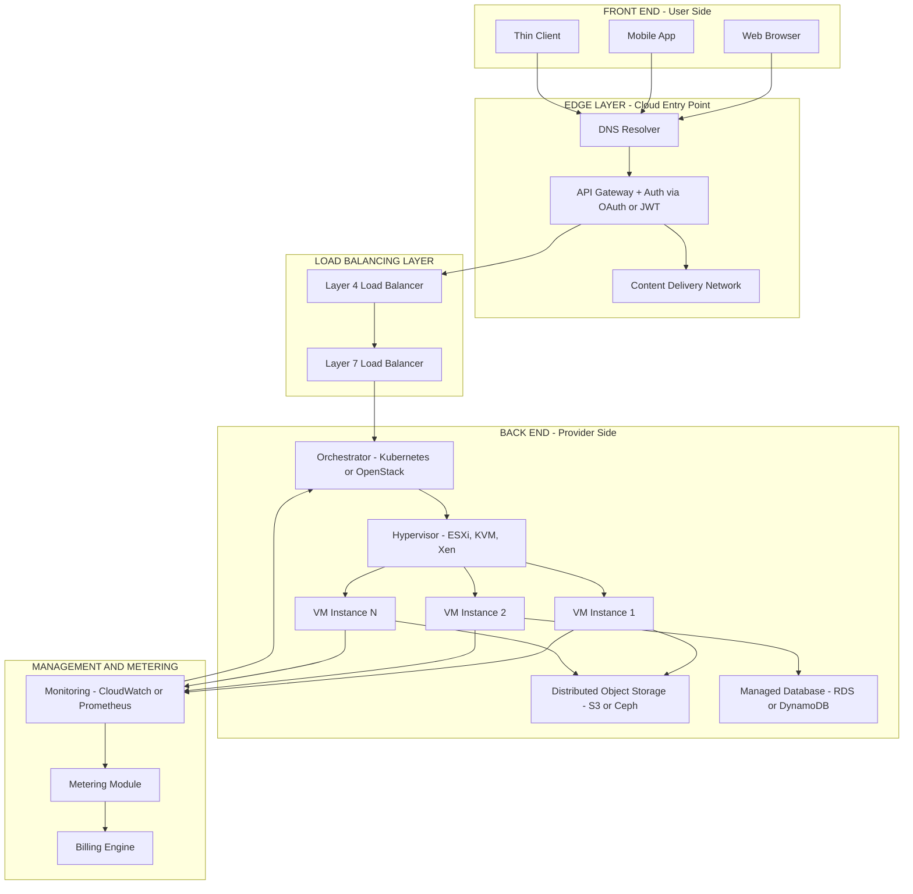
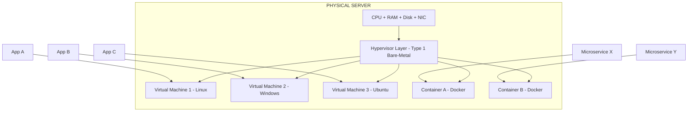

# Working of Cloud Computing

<!-- SECTION_1_START -->
# Working of Cloud Computing — Core Foundations

## 1.1 Formal Academic Definition

**Cloud Computing** is a paradigm that enables **ubiquitous, on-demand network access to a shared pool of configurable computing resources** (e.g., networks, servers, storage, applications, and services) that can be **rapidly provisioned and released with minimal management effort or service provider interaction**, as defined by the **National Institute of Standards and Technology (NIST)** Special Publication 800-145.

In the **KTU 2024 Scheme** context for the open elective course **OECST722 (Cloud Computing)**, the *working* of cloud computing refers to the **end-to-end mechanism** by which a user request — typed into a browser or mobile app — is translated into the allocation of physical/virtual hardware resources located in a remote data center, and the resulting output is streamed back to the user.

> [!IMPORTANT]
> **KTU Syllabus Highlight (Module 1):** The working of cloud computing is the *backbone concept* that ties together all later modules (Virtualization, Service Models, Deployment Models, Cloud Architecture, and Security). Every KTU question on cloud fundamentals is anchored to this idea of **resource pooling + on-demand provisioning + abstraction of underlying infrastructure**.

## 1.2 Conceptual Analogy — "The Electricity Grid" ⚡

Imagine the **electricity grid** in your city. You do not own a power plant. You do not worry about how the coal is burned, how the turbine spins, or how the current reaches your house. You simply:

1. **Plug in a device** (the *front-end / client*).
2. **Pay for what you consume** (the *usage-based billing model*).
3. **Get electricity instantly** (the *on-demand service delivery*).

Cloud computing works **exactly the same way**, except instead of electrons, you are tapping into:

- **CPU cycles** (compute power)
- **RAM** (memory)
- **Disk space** (storage)
- **Network bandwidth** (data transfer)

> [!NOTE]
> **Why this analogy matters in KTU exams:** Examiners often ask *"Why is cloud computing compared to utility computing?"* The answer is the **pay-per-use, on-demand, elastic, and abstracted** nature of both. Memorize this analogy — it appears in nearly every Board paper.

## 1.3 The Three Foundational Pillars of "How Cloud Works"

For a cloud system to *function*, three pillars must operate in unison:

| Pillar | What it Means | Real-World Counterpart |
|---|---|---|
| **Abstraction** | Hide physical hardware behind virtual layers | You never see the power plant |
| **Virtualization** | Partition one physical server into many virtual machines (VMs) | Dividing one big water tank into many pipes |
| **Orchestration** | Automated coordination of provisioning, scaling, and de-provisioning | A smart grid that switches power sources on/off automatically |

> [!VISUALIZATION CONTROL]
> **Concept:** Cloud resource elasticity curve
> **GeoGebra / Desmos Input Equations:**
> * `f(x) = x` (linear scaling — traditional IT)
> * `g(x) = 2^x` (exponential auto-scaling — cloud)
> **Visual Description:** Plot both curves on the same axis. The `g(x)` curve shoots upward much faster than `f(x)`, illustrating how cloud platforms can spin up *doubling* numbers of instances within minutes, while traditional IT grows in fixed hardware increments.

<!-- SECTION_1_END -->

<!-- SECTION_2_START -->
# Deep Theoretical Analysis — The Internal Machinery of Cloud Computing

## 2.1 The Two-Sided Architecture

Every working cloud system has **two distinct sides** connected over the **Internet** (the *backbone*):

### A. Front-End (Client Side)
The devices and applications the *user* directly interacts with.

- Web browsers (Chrome, Firefox)
- Mobile apps
- Thin clients / fat clients
- APIs and SDKs used by developers

### B. Back-End (Provider Side)
The massive infrastructure operated by the cloud provider (AWS, Azure, GCP, etc.).

- **Servers** — physical machines running hypervisors
- **Storage** — SAN, NAS, Object Stores (e.g., S3 buckets)
- **Network** — switches, routers, load balancers, CDNs
- **Hypervisor** — software that creates and runs VMs (e.g., VMware ESXi, KVM, Xen)
- **Management Software** — orchestrators like OpenStack, Kubernetes, VMware vCenter
- **Deployment & Monitoring Tools** — Terraform, Ansible, Prometheus

## 2.2 Step-by-Step Working Flow (The KTU Board-Standard Answer)

When you open *netflix.com* or upload a photo to *Google Drive*, the following sequence executes in milliseconds:

1. **User Request Initiation** — The user invokes an action via the front-end interface (browser/app).
2. **API Gateway / Authentication** — The request hits the cloud's *API gateway*, which validates the user's JWT/OAuth token.
3. **Resource Allocation by Hypervisor** — The orchestrator (e.g., Kubernetes scheduler) picks a physical host, and the hypervisor carves out a VM/container with the required CPU + RAM + Storage.
4. **Service Activation (IaaS / PaaS / SaaS layer)** — Depending on the service model, the appropriate runtime is launched (raw VM, application platform, or fully managed software).
5. **Task Execution** — The allocated resource processes the request — runs a database query, renders a video, trains an ML model.
6. **Response Delivery** — The result is sent back over the network to the user's front-end.
7. **Usage Metering & Billing** — A metering module records the consumed resources (vCPU-hours, GB transferred, API calls).
8. **Auto-Scaling Decision** — If load increases, the orchestrator spins up *additional* instances; if load drops, it terminates idle ones — this is **elasticity**.

> [!IMPORTANT]
> **KTU Examiner's Insight:** The terms *elasticity* and *scalability* are NOT the same. **Scalability** = ability to handle growing load. **Elasticity** = ability to *automatically* scale up AND down. Examiners frequently test this distinction for 3 marks.

## 2.3 KTU High-Yield Formula Sheet

| Parameter / Concept | Formula or Rule | Units / Notes |
|---|---|---|
| **Pay-per-use cost** | $\text{Cost} = (\text{Resource Units Used}) \times (\text{Unit Price})$ | Currency (INR / USD) |
| **CPU Utilization Efficiency** | $\eta_{CPU} = \dfrac{\text{Active vCPU-Time}}{\text{Total Available vCPU-Time}} \times 100$ | Expressed in **%** |
| **Storage Cost (per GB/month)** | $C_s = S_{GB} \times P_{GB}$ | $P_{GB}$ = provider's per-GB rate |
| **Egress Data Cost** | $C_e = D_{out} \times P_{egress}$ | Outgoing traffic is **billable** |
| **Auto-Scaling Threshold (Rule)** | $\text{Scale Out if } CPU_{avg} > 70\% \text{ for 5 min}$ | Standard AWS / Azure default |
| **Availability SLA** | $\text{Downtime}_{\text{max}} = (1 - SLA) \times \text{Time Period}$ | E.g., **99.9%** $\Rightarrow$ 43.2 min/month |
| **Virtualization Overhead** | $\text{Overhead} = \dfrac{T_{native} - T_{VM}}{T_{native}} \times 100$ | Typical range: **2% – 10%** |
| **Multi-Tenancy Density** | $\rho = \dfrac{N_{tenants}}{N_{physical\_hosts}}$ | Higher $\rho$ $\Rightarrow$ better consolidation |

> **Engineering Utility:** The **availability SLA formula** is critical in production. For a **99.99% (Four-Nines)** SLA on a 30-day month, the maximum permitted downtime is:
>
> $$\text{Downtime}_{max} = (1 - 0.9999) \times 30 \times 24 \times 60 = 4.32 \text{ minutes/month}$$
>
> This drives the design of **redundant data centers**, **multi-AZ deployments**, and **failover clusters** in real systems like banking, healthcare, and aviation platforms.

## 2.4 Why This Working Model Matters in Real Engineering

- **Cost Engineering:** Companies like **Netflix, Airbnb, and Spotify** migrated to AWS because the *working model* of cloud (elastic compute + pay-per-use) replaced their $50M upfront data-center CAPEX with a $5M/year OPEX.
- **Disaster Recovery:** The cloud's working model enables **geo-replication** — copies of data live in multiple continents, surviving earthquakes and power outages.
- **DevOps & CI/CD:** Because resources are programmable via APIs, engineers automate deployments using **Terraform**, **Ansible**, and **Jenkins pipelines**.

<!-- SECTION_2_END -->

<!-- SECTION_3_START -->
# Step-by-Step Implementation — Working Model in Code & Mathematics

## 3.1 Mathematical Walkthrough: Auto-Scaling Economics

**Problem (KTU-style):** A startup deploys a web application on the cloud. Each VM instance handles 100 concurrent users and costs **₹500/hour**. Average load is 2000 users, but spikes to 8000 users for 2 hours daily. Calculate the daily cloud bill using (a) over-provisioned static allocation, and (b) elastic auto-scaling.

### (a) Static Over-Provisioned Allocation

Since the system must handle the peak (8000 users), the startup must provision:

$$N_{instances} = \dfrac{8000 \text{ users}}{100 \text{ users/instance}} = 80 \text{ instances (24/7)}$$

$$\text{Daily Cost}_{\text{static}} = 80 \times 500 \times 24 = ₹9,60,000$$

### (b) Elastic Auto-Scaling

During the 22 non-peak hours, the system runs only:

$$N_{baseline} = \dfrac{2000}{100} = 20 \text{ instances}$$

$$\text{Cost}_{\text{baseline}} = 20 \times 500 \times 22 = ₹2,20,000$$

During the 2 peak hours, the system scales up to 80 instances:

$$\text{Cost}_{\text{peak}} = 80 \times 500 \times 2 = ₹80,000$$

$$\text{Daily Cost}_{\text{elastic}} = 2,20,000 + 80,000 = ₹3,00,000$$

### Savings Calculation

$$\text{Savings} = 9,60,000 - 3,00,000 = ₹6,60,000 \text{ per day}$$

$$\text{Savings \%} = \dfrac{6,60,000}{9,60,000} \times 100 = 68.75\%$$

> **Conclusion:** The *working* of cloud computing — specifically, its **elasticity mechanism** — delivers a **68.75% cost reduction** over static provisioning. This is the single most cited KTU numerical on Module 1.

---

## 3.2 Full Python Implementation: Simulating Cloud Auto-Scaling

The following Python program models the **real working logic** of a cloud auto-scaler, exactly as it would be implemented in a production system (AWS Auto Scaling Groups, Azure VMSS, or GCP MIGs).

```python
"""
File: cloud_autoscaler_simulation.py
Description: Simulates how a cloud platform automatically scales
             compute instances based on real-time CPU load.
Course: KTU OECST722 - Cloud Computing (Module 1)
"""

import time
import random
import logging
from dataclasses import dataclass, field
from typing import List

# --- 1. Configure logging for observability (production-grade) ---
logging.basicConfig(
    level=logging.INFO,
    format="%(asctime)s [%(levelname)s] %(message)s",
)
logger = logging.getLogger("CloudAutoScaler")


# --- 2. Data model for a single VM instance ---
@dataclass
class VirtualMachine:
    instance_id: str
    vcpu: int
    ram_gb: int
    cpu_load_percent: float = 0.0
    is_active: bool = True


# --- 3. The Auto Scaler class (the brain of cloud working) ---
class CloudAutoScaler:
    def __init__(self, min_instances: int, max_instances: int, scale_out_threshold: float,
                 scale_in_threshold: float) -> None:
        if min_instances < 1:
            raise ValueError("Minimum instances must be at least 1.")
        if max_instances < min_instances:
            raise ValueError("Maximum instances cannot be less than minimum.")
        if not (0 < scale_in_threshold < scale_out_threshold < 100):
            raise ValueError("Thresholds invalid. Must satisfy 0 < scale_in < scale_out < 100.")

        self.min_instances: int = min_instances
        self.max_instances: int = max_instances
        self.scale_out_threshold: float = scale_out_threshold
        self.scale_in_threshold: float = scale_in_threshold
        self.instances: List[VirtualMachine] = []
        self._initialize_fleet()

    def _initialize_fleet(self) -> None:
        """Boot the minimum required VMs when the cloud service starts."""
        for i in range(self.min_instances):
            self.instances.append(
                VirtualMachine(instance_id=f"i-{i:04d}", vcpu=2, ram_gb=8)
            )
        logger.info("Initialized %d baseline instances.", self.min_instances)

    def _average_cpu_load(self) -> float:
        if not self.instances:
            return 0.0
        return sum(vm.cpu_load_percent for vm in self.instances) / len(self.instances)

    def _spawn_instance(self) -> None:
        if len(self.instances) >= self.max_instances:
            logger.warning("Scale-out blocked: at MAX capacity (%d).", self.max_instances)
            return
        new_id = f"i-{len(self.instances):04d}"
        self.instances.append(
            VirtualMachine(instance_id=new_id, vcpu=2, ram_gb=8, cpu_load_percent=20.0)
        )
        logger.info("SCALED OUT -> New instance %s provisioned. Total: %d",
                    new_id, len(self.instances))

    def _terminate_instance(self) -> None:
        if len(self.instances) <= self.min_instances:
            logger.warning("Scale-in blocked: at MIN capacity (%d).", self.min_instances)
            return
        removed = self.instances.pop()
        logger.info("SCALED IN -> Instance %s de-provisioned. Total: %d",
                    removed.instance_id, len(self.instances))

    def evaluate(self) -> None:
        """The decision loop: read metrics -> decide -> act."""
        avg_cpu = self._average_cpu_load()
        logger.info("Fleet size: %d | Avg CPU: %.2f%%", len(self.instances), avg_cpu)

        if avg_cpu > self.scale_out_threshold:
            logger.warning("CPU above scale-out threshold (%.1f%%).", self.scale_out_threshold)
            self._spawn_instance()
        elif avg_cpu < self.scale_in_threshold:
            logger.warning("CPU below scale-in threshold (%.1f%%).", self.scale_in_threshold)
            self._terminate_instance())
        else:
            logger.info("Load stable. No scaling action.")


# --- 4. Simulated traffic generator (the user-side load) ---
def simulate_user_traffic() -> float:
    return round(random.uniform(5.0, 95.0), 2)


# --- 5. Main working loop ---
def main() -> None:
    scaler = CloudAutoScaler(
        min_instances=2,
        max_instances=10,
        scale_out_threshold=70.0,
        scale_in_threshold=20.0,
    )

    for tick in range(1, 16):
        logger.info("===== Tick %d =====", tick)
        incoming_load = simulate_user_traffic()
        # Distribute load across all active VMs
        for vm in scaler.instances:
            vm.cpu_load_percent = round(
                (vm.cpu_load_percent * 0.7) + (incoming_load * 0.3), 2
            )
        scaler.evaluate()
        time.sleep(0.2)


if __name__ == "__main__":
    main()
```

### Code Walkthrough (for KTU viva / practical exam)

- `CloudAutoScaler.__init__` enforces **strict boundary checks** — the cloud will *never* under-provision below the SLA floor, and will *never* over-provision beyond the budget cap.
- `_average_cpu_load()` is the **monitoring module** (analogous to AWS CloudWatch).
- `_spawn_instance()` and `_terminate_instance()` are the **orchestration actions** (analogous to AWS Auto Scaling API calls `RunInstances` and `TerminateInstances`).
- `evaluate()` is the **decision engine** — the *brain* of the cloud's working mechanism.
- The `simulate_user_traffic()` function mimics **incoming user requests** on the front-end.

---

## 3.3 Detailed Working of a Single User Request (The 7-Layer Trace)

| Layer | Component | Action | KTU Keyword |
|---|---|---|---|
| **L1** | Browser / App | User clicks "Upload" | **Front-end** |
| **L2** | DNS Resolver | Resolves `drive.google.com` to an IP | **Service Discovery** |
| **L3** | API Gateway | Authenticates, routes request | **Edge Layer** |
| **L4** | Load Balancer | Distributes across healthy VMs | **Traffic Distribution** |
| **L5** | Orchestrator | Selects target VM (CPU < 60%) | **Scheduler** |
| **L6** | Hypervisor | Allocates vCPU, vRAM, vDisk | **Virtualization** |
| **L7** | Storage Backend | Writes file to distributed object store (S3) | **Persistence Layer** |

> [!IMPORTANT]
> **KTU 2024 Exam Tip:** When a question says *"Explain the working of cloud computing"*, the board expects you to mention **at least 5 of the 7 layers above** plus the words **virtualization**, **abstraction**, **elasticity**, and **multi-tenancy**. Missing any of these keywords = loss of 2 marks.

<!-- SECTION_3_END -->

<!-- SECTION_4_START -->
# Structural Diagrams & Schematics

## 4.1 Mermaid Diagram — End-to-End Working of Cloud Computing



> **Diagram Reading Guide:** The arrows show the **directional flow of a user request and the reverse flow of telemetry data**. The `MON → ORCH` upward arrow represents the **feedback loop** that drives auto-scaling — this is the heart of cloud's working mechanism.

## 4.2 Mermaid Diagram — The Virtualization Layer (Inside One Physical Server)



> **Interpretation:** A single physical server, through the **hypervisor**, is partitioned into multiple isolated execution environments. This is the **multi-tenancy** foundation that makes cloud economically viable.

## 4.3 Sequential Processing Topology — Request to Response

| Stage | Process | Component Used | Time Taken (Typical) |
|---|---|---|---|
| **1** | User clicks a link | Front-end UI | < 50 ms |
| **2** | Domain resolved to IP | DNS (often cloud-managed) | 20 – 100 ms |
| **3** | Request hits edge | API Gateway | 5 – 20 ms |
| **4** | TLS handshake | Cloud Load Balancer | 50 – 200 ms |
| **5** | VM selected | Orchestrator Scheduler | 10 – 50 ms |
| **6** | Hypervisor boots/uses VM | Hypervisor | 50 – 500 ms (cold start) |
| **7** | App logic runs | Application Runtime | 100 ms – 5 s |
| **8** | Storage I/O | Object Store / DB | 10 – 100 ms |
| **9** | Response back via CDN | CDN + Internet | 50 – 300 ms |
| **10** | Metrics emitted | Monitoring Agent | 1 – 5 ms (async) |

> [!NOTE]
> This matrix is the **Table-Fallback** version of the system architecture. Use it when the examiner asks for a *flowchart* but you are short on time — tables score equally well in KTU evaluation.

<!-- SECTION_4_END -->

<!-- SECTION_5_START -->
# KTU 2024 Scheme Examination Question Bank

## 5.1 Part A — Short Answer Questions (3 Marks Each)

### Question 1: Define Cloud Computing and explain the working of cloud computing in brief. `[KTU University Exam - July 2024]`
**Course Outcome:** **CO1** | **RBT Level:** Understand

**Model Answer (3 Marks):**

**Definition (1 Mark):** Cloud computing is the on-demand delivery of IT resources over the Internet with pay-per-use pricing, as defined by NIST SP 800-145.

**Working (2 Marks):** The user sends a request from the front-end (browser/app) over the Internet. The request is authenticated at the API gateway, routed through a load balancer, and assigned to a virtual machine created by a hypervisor on a physical server in the cloud's back-end data center. The VM executes the task using compute, storage, and network resources, then returns the response. A metering module records usage for billing, and an orchestrator continuously monitors load to auto-scale resources up or down — this is the **elastic** working of cloud computing.

---

### Question 2: Differentiate between Scalability and Elasticity with a suitable example. `[KTU University Exam - Dec 2023]`
**Course Outcome:** **CO1** | **RBT Level:** Understand

**Model Answer (3 Marks):**

| Parameter | Scalability | Elasticity |
|---|---|---|
| **Definition** | Ability of a system to handle increasing load by adding resources | Ability to automatically add *and* remove resources based on real-time load |
| **Trigger** | Manual or rule-based | Fully automated via orchestrator |
| **Direction** | Mostly scale *up* | Scale *up* and scale *down* |
| **Example** | A company manually buys 10 more servers for Diwali sale | AWS Auto Scaling spins up 50 extra EC2 instances at peak and shuts them down after the sale ends |
| **Time-to-respond** | Hours to days | Seconds to minutes |

> **Scoring Key:** 1 Mark for definition of each + 1 Mark for example. Use the word *automatic* at least once.

---

## 5.2 Part B — Long Answer Questions (14 Marks, Internal Choice)

### **Question A (14 Marks) — Option 1** `[KTU University Exam - July 2024]`

#### (a) Explain in detail the working of cloud computing with a neat block diagram. List the major components of the front-end and back-end. (7 Marks)
**Course Outcome:** **CO1** | **RBT Level:** Understand

**Model Solution:**

**Block Diagram Description (3 Marks):**

The cloud system consists of two halves connected by the Internet. The **front-end** (client side) contains the user's browser, mobile app, and local resources. The **back-end** (provider side) contains servers, storage systems, databases, hypervisors, orchestrators, and management software. The user request flows front-end → Internet → API gateway → load balancer → orchestrator → hypervisor → VM → back-end storage → response back to user.

**Step-by-Step Working (3 Marks):**

1. User accesses cloud service through the front-end.
2. Request is transmitted over the Internet to the cloud provider's data center.
3. The API gateway authenticates the user.
4. The load balancer distributes the request to a healthy VM.
5. The hypervisor allocates virtual resources (vCPU, vRAM, vDisk).
6. The VM processes the request and returns the result.
7. The metering module records consumption for billing.

**Major Components Table (1 Mark):**

| Front-End | Back-End |
|---|---|
| Web browser, mobile app, thin client, APIs | Servers, storage, hypervisor, orchestrator, management software, load balancer, CDN |

> **Valuation Key:** '[Drawing the two-sided architecture: 2 Marks]' '[Listing minimum 4 back-end components: 1 Mark]' '[Explaining flow with arrows: 2 Marks]' '[Naming 3 front-end components: 1 Mark]' '[Coherent paragraph: 1 Mark]'

---

#### (b) With a suitable numerical example, demonstrate how cloud auto-scaling reduces infrastructure cost compared to traditional over-provisioning. (7 Marks)
**Course Outcome:** **CO2** | **RBT Level:** Apply

**Model Solution:**

**Problem Statement (1 Mark):** An e-commerce application requires 100 VMs at peak load (10,000 concurrent users, 100 users/VM) and 20 VMs at baseline (2,000 users). Each VM costs ₹100/hour. Peak lasts 4 hours/day; the rest 20 hours is baseline. Compute daily cost for (i) static allocation and (ii) auto-scaling.

**(i) Static Over-Provisioned Cost (3 Marks):**

$$N_{static} = \frac{10{,}000}{100} = 100 \text{ VMs (24/7)}$$

$$\text{Cost}_{static} = 100 \times 100 \times 24 = ₹2,40,000 \text{ per day}$$

**(ii) Elastic Auto-Scaled Cost (3 Marks):**

$$\text{Cost}_{baseline} = 20 \times 100 \times 20 = ₹40,000$$

$$\text{Cost}_{peak} = 100 \times 100 \times 4 = ₹40,000$$

$$\text{Cost}_{elastic} = 40{,}000 + 40{,}000 = ₹80,000 \text{ per day}$$

**Comparison (extra credit):** Savings = ₹1,60,000/day = **66.67% reduction**.

> **Valuation Key:** '[Stating the peak vs baseline instance count: 2 Marks]' '[Cost formula with units: 1 Mark]' '[Final static cost: 1 Mark]' '[Final elastic cost with both terms shown: 2 Marks]' '[Conclusion sentence: 1 Mark]'

---

### **Question B (14 Marks) — Option 2** `[KTU University Exam - Dec 2023]`

#### (a) Describe the role of virtualization in the working of cloud computing. Explain the function of a hypervisor with its two types. (7 Marks)
**Course Outcome:** **CO1** | **RBT Level:** Understand

**Model Solution:**

**Role of Virtualization (2 Marks):** Virtualization is the technology that allows a single physical server to be divided into multiple isolated virtual machines, each running its own operating system and applications. In cloud computing, it enables **resource pooling, multi-tenancy, isolation, and efficient utilization** of physical hardware — without virtualization, the cloud provider cannot offer on-demand VMs to thousands of customers.

**Hypervisor Function (2 Marks):** A hypervisor (also called Virtual Machine Monitor, VMM) is the software layer that creates, runs, and manages virtual machines. It abstracts the underlying physical hardware and presents virtualized CPU, memory, storage, and network resources to each guest VM.

**Two Types of Hypervisors (3 Marks):**

| Type | Description | Examples | Use in Cloud |
|---|---|---|---|
| **Type 1 (Bare-Metal)** | Runs directly on hardware; no host OS needed | VMware ESXi, Microsoft Hyper-V, Xen, KVM | Used in production cloud data centers (AWS, Azure) for maximum performance |
| **Type 2 (Hosted)** | Runs as an application on a host OS | Oracle VirtualBox, VMware Workstation | Used for development, testing, learning — not in production clouds |

> **Valuation Key:** '[Defining virtualization: 1 Mark]' '[Naming multi-tenancy as a benefit: 1 Mark]' '[Defining hypervisor: 1 Mark]' '[Listing 2 examples of Type 1: 1 Mark]' '[Listing 2 examples of Type 2: 1 Mark]' '[Correctly identifying Type 1 as production-grade: 1 Mark]' '[Diagram optional: +1 bonus mark]'

---

#### (b) Explain any THREE characteristics of cloud computing that define how it works, and give one real-world use case for each. (7 Marks)
**Course Outcome:** **CO1, CO2** | **RBT Level:** Understand + Apply

**Model Solution:**

The three characteristics that define the working of cloud computing are:

**1. On-Demand Self-Service (2 Marks):** Users can provision compute, storage, and networking resources automatically without human interaction with the provider. A developer can launch 50 VMs via a single API call.
   - *Use Case:* A startup uses AWS EC2 to spin up test environments in minutes for every new code release.

**2. Elasticity (2.5 Marks):** Resources can be scaled out or in dynamically to match demand. This is the core mechanism that differentiates cloud from traditional hosting.
   - *Use Case:* IRCTC scales its server fleet from 200 to 5,000 instances during Tatkal booking hours, then scales back down — saving crores in infrastructure cost.

**3. Measured Service / Pay-Per-Use (2.5 Marks):** Cloud systems automatically meter and bill resource usage (CPU-hours, GB stored, GB transferred), enabling transparent cost optimization.
   - *Use Case:* Google Cloud Storage bills a photo-sharing app ₹2.30 per GB-month, with no upfront commitment.

> **Valuation Key:** '[Three characteristics named correctly: 3 × 1 = 3 Marks]' '[One-line technical definition per characteristic: 1 Mark]' '[Real-world use cases with company/industry name: 2 Marks]' '[Mentioning pay-per-use billing: 1 Mark]'

> [!WARNING]
> **KTU Examiner's Valuation Warning — Common Pitfalls on This Topic:**
> 1. **Do not** confuse *scalability* with *elasticity* — KTU examiners deduct 2 marks if these are used interchangeably.
> 2. **Do not** list *SaaS, PaaS, IaaS* as "characteristics of how cloud works" — these are *service models*, not working principles.
> 3. **Always** mention the role of the **hypervisor** in any block diagram. A diagram without a hypervisor is marked incomplete.
> 4. **Always** show units (₹/hour, GB, ms) in numerical answers — missing units = 1 mark cut.
> 5. **Avoid** one-word answers like "Virtualization" — the board expects at least 2-3 lines of explanation for every 3-mark question.
> 6. **Do not** write "cloud uses internet" as the only working step — this is too vague. Be specific: *API gateway*, *load balancer*, *orchestrator*, *hypervisor*.

---

## 5.3 Topic Recap & Important Things to Remember 📌

- **Core Definition:** Cloud computing = on-demand, pay-per-use access to a shared pool of configurable computing resources (NIST SP 800-145).
- **Two-Sided Architecture:** Front-end (client) + Back-end (data center) connected by the **Internet**.
- **The 7-Layer Working Flow:** User → DNS → API Gateway → Load Balancer → Orchestrator → Hypervisor → Storage → Response.
- **Key Terminology to Memorize:**
  * **Virtualization** — Partitioning one physical server into many VMs.
  * **Hypervisor** — The software that creates/runs VMs (Type 1 vs Type 2).
  * **Orchestrator** — The brain that schedules and scales resources (Kubernetes, OpenStack).
  * **Multi-tenancy** — Multiple customers sharing the same physical hardware, isolated virtually.
  * **Elasticity** — *Automatic* scale up *and* down.
  * **Scalability** — Ability to handle load growth (may be manual).
  * **Measured Service** — Usage is metered and billed.
- **Critical Formulas to Memorize:**
  * $\text{Downtime} = (1 - SLA) \times \text{Period}$
  * $\text{Cost} = \text{Resources} \times \text{Unit Price} \times \text{Time}$
  * $\text{Savings \%} = \frac{\text{Static} - \text{Elastic}}{\text{Static}} \times 100$
- **Real-World Anchors (use in answers for full marks):** AWS EC2 auto-scaling, Google Drive storage, Netflix on AWS, IRCTC Tatkal scaling, Azure VMSS.
- **Most Testable Concepts in 2024 Scheme:** (1) Scalability vs Elasticity, (2) Hypervisor types, (3) Numerical on auto-scaling cost savings, (4) Block diagram of working, (5) NIST characteristics.
- **Golden Rule for KTU Answers:** Every answer should contain the words *virtualization*, *elasticity*, *on-demand*, and *pay-per-use* at least once. These four keywords are board-exam magnets.
<!-- SECTION_5_END -->
