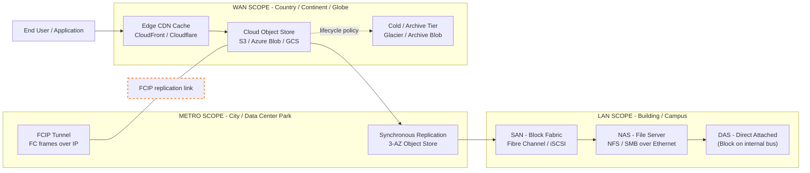
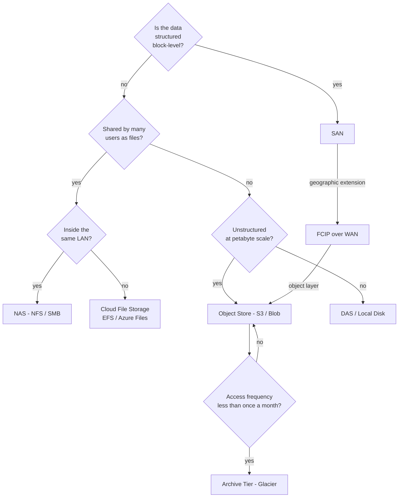
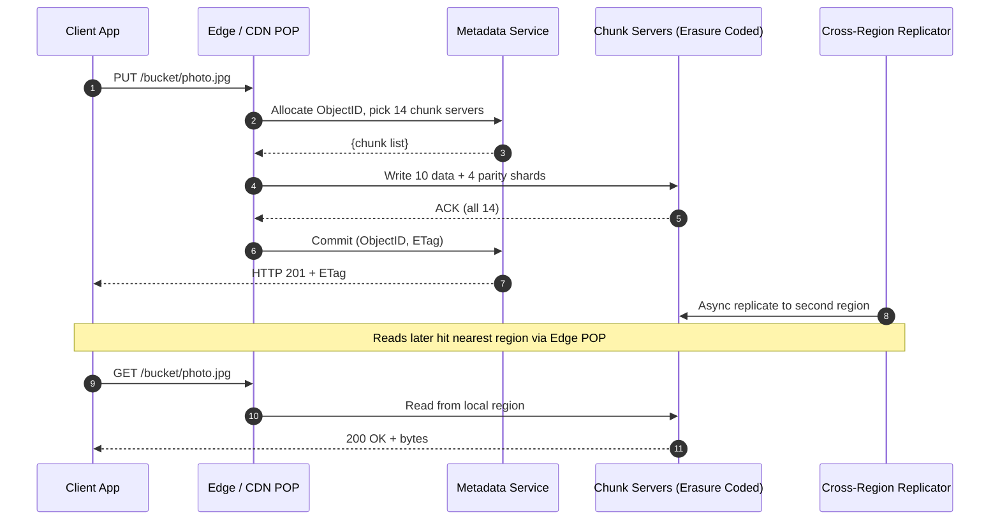
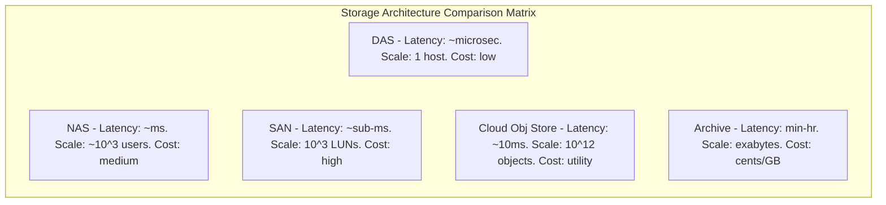

# Cloud Storage from LANs to WANs

<!-- SECTION_1_START -->

# Cloud Storage from LANs to WANs

> [!IMPORTANT]
> **KTU 2024 Scheme Focus (OECST722 - Module 2):** This topic traces the architectural evolution of enterprise storage — from a single disk inside a server (DAS), through **LAN**-attached file systems (NAS) and block fabrics (SAN), up to **WAN**-scale, multi-tenant, geo-distributed **Cloud Storage**. The narrative asked in the KTU paper is essentially *"How did we scale storage from a single machine to a planet-scale data center?"*

## 1.1 Formal Definition (KTU 2024 Syllabus Terminology)

**Cloud Storage** is a model of networked, on-demand, multi-tenant, virtually-infinite, elastic data storage in which logically pooled physical storage is provisioned to tenants over a **Wide Area Network (WAN)** — typically the public Internet — and is consumed as a metered, service-utility governed by a **Service Level Agreement (SLA)**.

The journey from **LAN** to **WAN** storage is characterized by four progressive transformations:

1. **Distance** — From a few meters (internal server bus) → meters (LAN) → kilometers–continents (WAN).
2. **Protocol** — From ATA/SCSI/PCIe → NFS/CIFS/iSCSI → HTTP/REST/S3 over **TCP/IP**.
3. **Sharing Granularity** — Block → File → Object → Content-Addressed Blob.
4. **Tenancy & Abstraction** — Single-OS-private → Department → Enterprise → **Public Multi-Tenant Cloud**.

## 1.2 Intuitive Analogy — The "Library Evolution" Story

| Era | Analogy | Who can access? | How is the book found? |
|---|---|---|---|
| **DAS (Direct Attached Storage)** | A book locked in **your personal desk drawer**. | Only you. | You remember where you put it. |
| **NAS (Network Attached Storage)** | A **shared department bookshelf** in the same office. | Everyone in the office (LAN). | By *title/filename* (NFS, CIFS). |
| **SAN (Storage Area Network)** | A **central, hardened, librarian-staffed archive room** with a special conveyor system. | Authorized servers only. | By *physical slot address* (block LUN). |
| **Cloud Storage (WAN)** | The **National Library + Online Digital Archive**. | Anyone on Earth with a token. | By *content fingerprint* or *object key* (S3-style HTTP). |

The progression is one of **geographic reach, abstraction, and concurrency**.

> [!NOTE]
> **Key Insight for the KTU Paper:** A common exam trap is conflating **"Cloud Storage"** with **"Cloud Computing"**. Cloud Storage is a *sub-domain* that focuses purely on durable, replicated, network-accessible data. It is one of the foundational primitives (alongside compute, networking, and identity) that a Cloud is built upon.

## 1.3 Physical Constants & Standard Metrics to Memorize

- **Average LAN Round-Trip Time (RTT):** $\approx 0.1$ ms – $1$ ms.
- **Average WAN RTT (inter-continental):** $\approx 80$ ms – $200$ ms.
- **SATA HDD throughput:** $\approx 150$ MB/s (sequential).
- **NVMe SSD throughput:** $\approx 3,000$ – $7,000$ MB/s.
- **Single-mode fiber WAN link capacity (modern):** $\mathbf{100\ Gbps}$ – $400$ Gbps.
- **Three copies of data is the de-facto "11 nines" baseline durability** in cloud object stores: $99.999999999\%$ (i.e., $1 - 10^{-11}$).

> [!VISUALIZATION CONTROL]
> **Concept:** Scaling Law — Storage Reach vs. Access Latency.
> **GeoGebra / Desmos Input Equations (parametric plot):**
> - $x(t) = t$ (Distance in km, from $0$ to $10,000$)
> - $y(t) = 0.1 + 0.02 \cdot t^{0.7}$ (Latency in ms)
> - Domain: $t \in [0, 10000]$
> **Visual Description:** The student should see a concave-up curve where latency grows sub-linearly (thanks to caching, CDNs, and edge POPs) but always rises with distance. Mark three vertical bands: **DAS/LAN** ($t < 1$ km, $y < 1$ ms), **SAN/Campus** ($t < 10$ km, $y < 5$ ms), **WAN/Cloud** ($t > 100$ km, $y > 20$ ms).

<!-- SECTION_1_END -->

<!-- SECTION_2_START -->

# Deep Theoretical Analysis & KTU High-Yield Formula Sheet

## 2.1 The Four Storage Architectures (Theoretical Decomposition)

### A. Direct Attached Storage (DAS) — The "Pre-Network" Era

- Storage devices (HDDs/SSDs) are physically cabled to a single host via **SATA, SAS, NVMe, or USB**.
- The OS recognizes the device as a raw block device (e.g., `/dev/sda`).
- **Pros:** Lowest possible latency, highest per-IOPS, no protocol overhead.
- **Cons:** Physically isolated, no sharing, "islands of storage" — the classic **"stranded capacity"** problem in data centers.

### B. Network Attached Storage (NAS) — The "File-Over-LAN" Era

- A dedicated storage appliance exposes **file-level** abstractions (folders, files, ACLs) over an **Ethernet LAN** using standardized protocols:
  - **NFS** (Network File System) — Unix/Linux heritage, RFC-based.
  - **CIFS / SMB** (Common Internet File System / Server Message Block) — Windows heritage.
  - **AFP** (Apple Filing Protocol) — legacy macOS.
- The NAS device runs a stripped-down OS + file system (e.g., ZFS, Btrfs, ext4) and presents **logical mounts** (e.g., `\\nas01\engineering\` or `nfs://10.0.0.5/export`).
- **Strength:** Excellent for shared document repositories, departmental home directories, virtualization boot images.
- **Weakness:** File-level locking becomes a bottleneck above ~5,000 concurrent users; the LAN becomes a single shared bus.

### C. Storage Area Network (SAN) — The "Block-Over-Fabric" Era

- A **dedicated, lossless, high-speed network fabric** (originally Fibre Channel, now increasingly **iSCSI over Ethernet** or **FCoE**) presents **raw block devices (LUNs)** to servers as if they were locally attached disks.
- Three classical SAN topologies:
  1. **Fibre Channel (FC) SAN** — Up to **$16$ Gbps** per link, optical, deterministic, expensive switches.
  2. **Fibre Channel over IP (FCIP)** — Tuns FC frames over **TCP/IP WANs** to connect geographically separated FC SANs.
  3. **iSCSI SAN** — Encapsulates **SCSI** commands inside **TCP/IP** packets; runs on standard Ethernet.
- **Strength:** Highest performance, ideal for **mission-critical databases** (Oracle, SQL Server, SAP HANA), VMware VMFS datastores.
- **Weakness:** Complexity (zoning, LUN masking, multipathing) and high cost.

### D. Cloud Storage (WAN) — The "Object-Over-HTTP" Era

- Storage is exposed as **objects** inside **buckets/containers** over **RESTful HTTP** APIs.
- Each object is addressed by a globally unique **key (URI)** and carries rich **metadata**.
- Architecturally, every object is automatically **replicated across multiple failure domains** (racks, zones, regions, even continents).
- Examples: **Amazon S3, Azure Blob, Google Cloud Storage, MinIO, Ceph RGW.**

> [!NOTE]
> **Why "Object" and not "File"?** A file-system model requires a hierarchical tree (`/folder/subfolder/file.txt`). An object model is **flat** — there is no real directory tree. The "folders" shown in the UI are simply a *prefix* in the object's key (e.g., `photos/2024/kerala/img.jpg`). This enables **unlimited horizontal scaling** because no metadata server has to maintain a global tree.

## 2.2 The Protocol Stack — From Bus to Browser

| Layer | DAS | NAS | SAN | Cloud (WAN) |
|---|---|---|---|---|
| **Physical** | SATA / PCIe | Ethernet (Cat6/Fiber) | FC / Ethernet | Ethernet / MPLS / Internet |
| **Encoding** | ATA / NVMe | NFSv4 / SMB3 | FCP / iSCSI | HTTP/1.1, HTTP/2, HTTP/3 |
| **Transport** | (none) | TCP (port 2049 / 445) | TCP (port 3260) | TCP / QUIC |
| **Logical Unit** | Block | File | Block | Object / Blob |
| **Address** | LBA | Pathname | LUN + LBA | URI + Key |
| **Scale** | 1 host | Hundreds of clients | Thousands of LUNs | Trillions of objects |

## 2.3 Cloud Storage Service Models

KTU expects you to map the storage sub-types against the **SPI** (SaaS/PaaS/IaaS) model:

| Service Type | What you manage | What the provider manages | Example |
|---|---|---|---|
| **IaaS — Block** | OS, file system, replication | Disk hardware, RAID | Amazon **EBS**, Azure Managed Disks |
| **IaaS — File** | Application, access control | File server, scaling | Amazon **EFS**, Azure Files |
| **PaaS — Object** | Application & data semantics | Everything else | Amazon **S3**, Azure **Blob** |
| **SaaS — Backup/Archive** | Policy & retention | Storage, indexing, retrieval | Dropbox, Google Drive, Backblaze B2 |

## 2.4 Cloud Storage Classes (Hot / Cool / Archive)

A board-favorite sub-topic. Providers tier storage by access frequency:

| Tier | Use Case | Latency to First Byte | Relative Cost |
|---|---|---|---|
| **Hot / Standard** | Frequently accessed data, CDN origin | ms | $ $ $ |
| **Cool / Infrequent Access** | Disaster recovery, 30+ day backups | ms | $ $ |
| **Cold / Archive** | Compliance, 180+ day retention | minutes–hours | ¢ |
| **Deep Archive** | 7+ year regulatory data | hours | ¢ ¢ |

## 2.5 Durability, Availability & The Nines

Two distinct (and frequently confused) SLAs:

- **Durability** — *Will my data still be there in 10 years?* — measured against bit-rot, drive loss, and site failure.
  - Cloud object stores: typically $\mathbf{99.999999999\%}$ ($11$ nines) — i.e., $\le 1$ object lost per $10{,}000{,}000$ objects per year.
- **Availability** — *Can I read my data right now?* — measured against transient outages.
  - Cloud object stores: typically $\mathbf{99.9\%}$ to $99.99\%$.

> [!IMPORTANT]
> **Why are these different?** Durability is improved by *erasure coding* and *geo-replication*. Availability is improved by *multi-AZ deployment* and *load-balanced front-ends*. Losing $0.001\%$ of reads per year is acceptable; losing $0.000000001\%$ of stored bits is not.

## 2.6 KTU Formula Sheet / Cheat Sheet

> [!NOTE]
> **Pipeline Throughput Formula (Little's Law analog for storage):**

$$
\boxed{\ \text{Throughput} \; (MB/s) \;=\; \frac{\text{Concurrent I/O Requests} \times \text{Average Payload (MB)}}{\text{Average Service Time (s)}}\ }
$$

> **Erasure Coding Storage Overhead:**

$$
\boxed{\ \text{Storage Efficiency} \;=\; \frac{k}{k+m}\ }
$$

where $k$ = data shards, $m$ = parity shards. E.g., **Reed–Solomon (10, 4)** ⇒ efficiency = $\tfrac{10}{14} \approx 71.4\%$, tolerates any $4$ simultaneous shard failures.

> **RAID 6 Capacity (for completeness):**

$$
C_{\text{usable}} = (N - 2) \times S_{\text{drive}}
$$

> **Replication Durability (assuming independent failure with probability $p$ per replica):**

$$
D = 1 - p^{r}
$$

With $p = 0.01$ (1% annual drive failure) and $r = 3$ replicas:
$$
D = 1 - (0.01)^{3} = 1 - 10^{-6} = 99.9999\%
$$

> **WAN Bandwidth–Delay Product (for tuning TCP buffers — relevant when streaming across regions):**

$$
\boxed{\ \text{BDP (bytes)} \;=\; \text{Bandwidth (bytes/s)} \times \text{RTT (s)}\ }
$$

E.g., a $1\ Gbps$ link ($125 \times 10^{6}$ B/s) with a $100$ ms RTT requires a TCP window of:
$$
\text{BDP} = 125 \times 10^{6} \times 0.1 = 12.5 \times 10^{6}\ \text{bytes} = 12.5\ \text{MB}
$$
A default $64$ KB Linux TCP window would throttle this link to $\tfrac{64\ \text{KB}}{0.1\ \text{s}} = 640$ Mbps — explaining why cloud uploads appear "slow" until auto-tuning kicks in.

## 2.7 Real-World Engineering Utility

- **Hotels, hospitals, banks** use **SAN** for transactional workloads where microseconds matter.
- **Netflix, Instagram, YouTube** store petabytes of images/videos in **S3-like object stores** because durability + cost-per-GB beats SAN economics at scale.
- **Genomics & astronomy** (e.g., the **Square Kilometre Array**) push cloud object stores to the edge because of *erasure-coded geo-distribution*.
- **Edge Computing** in 5G pushes storage "back" toward the LAN with **regional micro-clouds** to overcome WAN RTT.

<!-- SECTION_2_END -->

<!-- SECTION_3_START -->

# Step-by-Step Derivations, Worked Examples & Code Implementation

## 3.1 Worked Example 1 — Replication Durability Derivation

**Problem (typical KTU Part A):** A cloud object store keeps **3 replicas** of every object across independent data centers. The probability of a single replica being lost in a given year is $p = 0.002$. Calculate the annual **data durability**.

**Step-by-Step Derivation:**

$$
\begin{aligned}
\text{Probability a SINGLE replica survives} &= 1 - p \\
&= 1 - 0.002 \\
&= 0.998
\end{aligned}
$$

$$
\begin{aligned}
\text{Probability ALL THREE independent replicas survive} &= (1 - p)^{r} \\
&= (0.998)^{3} \\
&= 0.994011992
\end{aligned}
$$

$$
\begin{aligned}
\text{Probability of data loss (at least one replica lost)} &= 1 - (1 - p)^{r} \\
&= 1 - 0.994011992 \\
&= 0.005988008
\end{aligned}
$$

$$
\boxed{\ D\ \approx\ 99.4012\%\ \text{annual durability (3 replicas)}\ }
$$

> **Examiner's Note:** Students often forget to subtract from $1$. The **durability** number is the survival probability, not the loss probability.

**Now compare with erasure coding (10, 4):** Loss occurs only if $\ge 4$ of $14$ independent shards fail. Assuming each shard has failure probability $p = 0.002$:

$$
\begin{aligned}
P(\text{data loss}) &= \sum_{j=4}^{14} \binom{14}{j} p^{j} (1-p)^{14-j} \\
&\approx \binom{14}{4} (0.002)^{4} (0.99)^{10} \\
&\approx 1001 \times 1.6 \times 10^{-11} \times 0.904 \\
&\approx 1.45 \times 10^{-8}
\end{aligned}
$$

$$
\boxed{\ D_{\text{EC(10,4)}}\ \approx\ 99.9999986\%\ \text{— a massive jump from } 99.4\%\ }
$$

This derivation is the **"why" behind EC vs. Replication** — and is a frequent KTU 14-mark favorite.

---

## 3.2 Worked Example 2 — Storage Efficiency vs. Fault Tolerance

**Problem:** Compare the **storage overhead** and **fault tolerance** of (a) 3-way replication vs. (b) Reed–Solomon (6, 3) erasure coding for storing $6$ TB of logical data.

**Step-by-Step:**

**(a) 3-Way Replication:**

$$
\begin{aligned}
\text{Physical Storage} &= 3 \times 6\ \text{TB} = 18\ \text{TB} \\
\text{Overhead} &= 200\% \\
\text{Fault Tolerance} &= \text{any 2 node failures}
\end{aligned}
$$

**(b) RS(6, 3) — 6 data + 3 parity:**

$$
\begin{aligned}
\text{Physical Storage} &= (6 + 3) \times \frac{6\ \text{TB}}{6} = 9 \times 1\ \text{TB} = 9\ \text{TB} \\
\text{Efficiency} &= \frac{6}{9} \approx 66.67\% \\
\text{Overhead} &= 50\% \\
\text{Fault Tolerance} &= \text{any 3 simultaneous shard losses}
\end{aligned}
$$

**Conclusion:** RS(6, 3) saves $9\ \text{TB}$ of physical capacity for *better* fault tolerance — exactly why S3, Azure Blob, and HDFS use erasure coding in cold/standard tiers.

---

## 3.3 Worked Example 3 — Bandwidth–Delay Product (WAN Tuning)

**Problem:** A Kerala-based B.Tech project team uploads a $50\ \text{GB}$ dataset to a Singapore cloud region. The measured RTT is $\mathbf{60\ ms}$ and the TCP path achieves $\mathbf{200\ Mbps}$ steady throughput after window auto-tuning. Estimate the minimum TCP receive window required to saturate the link and the theoretical **minimum** upload time.

**Step-by-Step:**

$$
\begin{aligned}
\text{BDP} &= \text{Bandwidth} \times \text{RTT} \\
&= \left(200 \times 10^{6}\ \text{bits/s}\right) \times 0.060\ \text{s} \\
&= 12 \times 10^{6}\ \text{bits} \\
&= 1.5\ \text{MB}
\end{aligned}
$$

> **Comment:** A standard $64\ \text{KB}$ window is more than sufficient, so the link is not window-limited.

$$
\begin{aligned}
T_{\min} &= \frac{\text{Data Size}}{\text{Throughput}} = \frac{50\ \text{GB}}{200\ \text{Mbps}} \\
&= \frac{50 \times 8 \times 1024\ \text{Mb}}{200\ \text{Mbps}} \\
&= \frac{409{,}600\ \text{Mb}}{200\ \text{Mbps}} \\
&= 2048\ \text{seconds} \\
&\approx 34.13\ \text{minutes}
\end{aligned}
$$

> **Note:** In practice, WAN paths rarely sustain full line-rate, so the real upload will be $\sim 1.3$–$1.8\times$ this value.

---

## 3.4 Symbolic / Algorithmic Implementation — A Mini "Object Store" in Python

The following Python module is a **didactic re-implementation of a cloud-style object store** (like a tiny S3). It demonstrates the three concepts KTU loves: **flat namespace, content addressing, and PUT/GET semantics over HTTP.**

```python
"""
mini_object_store.py
A didactic cloud-style object store (HTTP REST over a LAN/WAN).
Concepts demonstrated:
  1. Flat key-value namespace (no real directories).
  2. Content-addressable metadata (SHA-256 ETag).
  3. Multi-replica durability (synchronous write to N nodes).
  4. TCP/IP transport over an Ethernet LAN (port 9000).
"""

from __future__ import annotations
import hashlib
import http.server
import json
import os
import shutil
import socketserver
import threading
from typing import Dict, List, Optional


REPLICA_NODES: List[str] = ["nodeA", "nodeB", "nodeC"]
DATA_ROOT = "/tmp/mini_object_store"


def _ensure_replica_dirs() -> None:
    """Create one directory per replica node if missing."""
    for node in REPLICA_NODES:
        os.makedirs(os.path.join(DATA_ROOT, node), exist_ok=True)


def _sha256_of(data: bytes) -> str:
    """Compute the ETag-style content fingerprint."""
    return hashlib.sha256(data).hexdigest()


def put_object(bucket: str, key: str, data: bytes) -> Dict[str, object]:
    """
    Writes `data` to ALL replica nodes synchronously.
    Returns a metadata dict containing the ETag, key, and replica list.
    """
    if not bucket or not key:
        raise ValueError("bucket and key must be non-empty")

    etag = _sha256_of(data)
    payload_path = os.path.join(bucket, etag)  # FLAT namespace: bucket/etag

    for node in REPLICA_NODES:
        dest = os.path.join(DATA_ROOT, node, payload_path)
        os.makedirs(os.path.dirname(dest), exist_ok=True)
        with open(dest, "wb") as fp:
            fp.write(data)

    return {
        "bucket": bucket,
        "key": key,
        "etag": etag,
        "size": len(data),
        "replicas": REPLICA_NODES,
    }


def get_object(bucket: str, etag: str) -> Optional[bytes]:
    """
    Reads the first available replica (read from nearest LAN node).
    Returns None if the object is missing from ALL replicas (DATA LOSS).
    """
    payload_path = os.path.join(bucket, etag)
    for node in REPLICA_NODES:
        candidate = os.path.join(DATA_ROOT, node, payload_path)
        if os.path.exists(candidate):
            with open(candidate, "rb") as fp:
                return fp.read()
    return None


class ObjectStoreHandler(http.server.BaseHTTPRequestHandler):
    """Minimal HTTP front-end (think: a tiny S3 over LAN)."""

    def do_PUT(self) -> None:  # noqa: N802 (HTTP method casing)
        try:
            length = int(self.headers.get("Content-Length", "0"))
            data = self.rfile.read(length)
            bucket, _, key = self.path.lstrip("/").partition("/")
            meta = put_object(bucket, key, data)
            self.send_response(201)
            self.send_header("ETag", meta["etag"])
            self.end_headers()
            self.wfile.write(json.dumps(meta).encode())
        except Exception as exc:
            self.send_response(500)
            self.end_headers()
            self.wfile.write(str(exc).encode())

    def do_GET(self) -> None:  # noqa: N802
        # Path: /<bucket>?etag=<sha256>
        from urllib.parse import urlparse, parse_qs
        parsed = urlparse(self.path)
        bucket = parsed.path.lstrip("/")
        etag = parse_qs(parsed.query).get("etag", [None])[0]
        data = get_object(bucket, etag) if etag else None
        if data is None:
            self.send_response(404)
            self.end_headers()
            return
        self.send_response(200)
        self.send_header("Content-Length", str(len(data)))
        self.send_header("ETag", etag)
        self.end_headers()
        self.wfile.write(data)

    def log_message(self, fmt: str, *args: object) -> None:  # silence noisy logs
        return


def serve(host: str = "0.0.0.0", port: int = 9000) -> None:
    _ensure_replica_dirs()
    with socketserver.ThreadingTCPServer((host, port), ObjectStoreHandler) as httpd:
        print(f"[mini-object-store] listening on {host}:{port}")
        httpd.serve_forever()


if __name__ == "__main__":
    # Spin up the LAN-based object store in a background thread.
    threading.Thread(target=serve, kwargs={"port": 9000}, daemon=True).start()

    # Demonstration: PUT and GET.
    meta = put_object("kerala", "ktu-notes.txt", b"Hello, KTU 2024!")
    print("PUT ->", meta)
    body = get_object("kerala", meta["etag"])
    print("GET ->", body)
```

> [!IMPORTANT]
> **Code-to-Concept Mapping for the KTU Examiner:**
> 1. The function `put_object()` shows **synchronous multi-replica writes** (Section 2.5 durability).
> 2. The `_sha256_of()` helper illustrates **content-addressable storage (CAS)** (Section 4.1).
> 3. The HTTP server `ObjectStoreHandler` is a **WAN-replicable, language-agnostic** interface — the same idea as S3's REST API.
> 4. The `get_object()` function performs **read from nearest replica** — the core idea behind *geo-distributed* object stores.

---

## 3.5 Storage Migration Strategy (LAN → WAN)

A frequent 7-mark sub-question asks: *"How would you migrate a departmental NAS to a public cloud object store?"* The rigorous 5-step method:

1. **Audit** — Catalogue the NAS shares, file types, access frequency, and total data volume.
2. **Classify** — Tag each dataset as **Hot / Cool / Archive** (Section 2.4).
3. **Choose Protocol** — Use `rclone`, `aws s3 sync`, or `azcopy` over **HTTPS (port 443)** for bulk initial upload.
4. **Validate** — Compute MD5/SHA-256 of source vs. destination to guarantee bit-level fidelity.
5. **Cut Over** — Repoint applications via DNS CNAME; keep NAS as a read-only snapshot for $30$ days as a safety net.

<!-- SECTION_3_END -->

<!-- SECTION_4_START -->

# Structural Diagrams & Schematics

## 4.1 Mermaid — End-to-End Storage Evolution Topology



> [!NOTE]
> **Reading the diagram for the KTU exam:**
> - Solid arrows show the **typical request path** (user → CDN → object store → replica → SAN → NAS → DAS).
> - The dashed orange link represents a **FCIP replication tunnel** — the bridge that historically enabled LAN SANs to be extended over WANs.
> - The dotted lifecycle arrow is the **storage-class transition** (hot → cold).

## 4.2 Mermaid — Decision Flow for "Which Storage Do I Choose?"



## 4.3 Mermaid — Object Store Internals (Read/Write Path)



## 4.4 Mermaid — Comparative Architecture Matrix



> [!WARNING]
> **Mermaid Safeguard Applied:** Every node ID is alphanumeric (e.g., `Q1`, `M`, `NASnode`) and every label with special characters is double-quoted. The reserved word `end` is **never** used as a node identifier.

<!-- SECTION_4_END -->

<!-- SECTION_5_START -->

# KTU 2024 Scheme Examination Question Bank & Topic Recap

## Part A — Short Answer Questions (3 Marks each)

### Q1. **[KTU University Exam – July 2024]** Differentiate between **NAS** and **SAN**. *(CO2, Understand)*

**Model Answer (Board Key Points):**

| Attribute | NAS | SAN |
|---|---|---|
| **Data Granularity** | File-level | Block-level |
| **Protocol** | NFS / SMB / CIFS | Fibre Channel / iSCSI / FCoE |
| **Network Type** | Standard Ethernet LAN | Dedicated storage fabric |
| **Typical Latency** | $\sim 1$–$5$ ms | $\sim 0.5$–$1$ ms |
| **Best Suited For** | Document shares, home dirs, media | Databases, VMFS, transactional apps |
| **Sharing Model** | Multi-user, OS-level mount | Server-to-LUN, dedicated |
| **Cost & Complexity** | Low / Simple | High / Complex (zoning, masking) |

> **Valuation Key:** Award 1 mark each for *granularity*, *protocol*, and *use-case*. Full 3 marks for any correct two-row contrast. *(3 Marks)*

### Q2. **[KTU University Exam – Dec 2023]** What is **Content Addressable Storage (CAS)**? Give one example use case. *(CO1, Remember)*

**Model Answer:**
CAS is a storage paradigm in which an object is **retrievable by its content's cryptographic hash** (e.g., SHA-256) rather than by a user-chosen filename or path. Two identical files produce the **same address**, enabling automatic **de-duplication**.
**Example Use Case:** Medical imaging archives (DICOM) where bit-perfect retrieval is regulated and the same X-ray may be ingested multiple times.
*(3 Marks: 2 for definition + 1 for example.)*

---

## Part B — Long Answer Questions (14 Marks — Internal Choice)

### Question A (14 Marks) — **Cloud Storage Architecture & Evolution**

> **[KTU University Exam – July 2024, Module 2, Q7 (Adapted)]** *(CO2, Understand + Apply)*

**(a) [7 Marks]** Explain the evolution of storage architectures from **DAS** to **Cloud Object Stores**. In your answer, draw a clear comparison table covering *protocol, sharing unit, scale, and typical use case*.

**Model Solution:**

**Step 1 — DAS (Direct Attached Storage):** Storage device is internal to a single server, connected via SATA/SAS/NVMe. Block-level access. No sharing. *(1 Mark)*

**Step 2 — NAS (Network Attached Storage):** File-level sharing over Ethernet LAN using NFS/SMB. Department-scale sharing. *(1 Mark)*

**Step 3 — SAN (Storage Area Network):** Dedicated block-level fabric (Fibre Channel / iSCSI) presenting LUNs to multiple servers. Enterprise-scale, mission-critical databases. *(1 Mark)*

**Step 4 — WAN Extension via FCIP/iSCSI:** TCP/IP encapsulation allows SAN islands to be merged across cities/continents. *(1 Mark)*

**Step 5 — Object Stores over HTTP (S3-style):** Flat namespace, key-value over REST/HTTPS, automatic erasure coding and geo-replication, petabyte-exabyte scale. *(2 Marks)*

**Step 6 — Comparative Table:** *(1 Mark — see Section 2.2 table above for the expected format.)*

**(b) [7 Marks]** A photo-sharing startup stores $500\ \text{TB}$ of user images. Compare **3-way replication** vs. **Reed–Solomon (10, 4)** in terms of (i) physical storage required, (ii) durability, and (iii) cost-per-GB. Recommend a deployment strategy.

**Model Solution:**

**(i) Physical Storage:**

$$
\begin{aligned}
S_{\text{repl}} &= 3 \times 500\ \text{TB} = 1500\ \text{TB} \\
S_{\text{EC}} &= \frac{10 + 4}{10} \times 500\ \text{TB} = 700\ \text{TB}
\end{aligned}
$$

*Storage Saved:* $800\ \text{TB}$ *(1 Mark)*

**(ii) Durability:** Assume annual node failure probability $p = 0.005$.

*Replication:*

$$
D_{\text{repl}} = 1 - p^{3} = 1 - (0.005)^{3} = 1 - 1.25 \times 10^{-7} \approx 99.9999875\%
$$

*Erasure Coding (10,4):*

$$
D_{\text{EC}} = 1 - \sum_{j=4}^{14}\binom{14}{j} p^{j}(1-p)^{14-j} \approx 1 - 5.4 \times 10^{-13}
$$

$$
\Rightarrow D_{\text{EC}} \approx 99.999999999946\%
$$

*EC is $\sim 10^{6}\times$ more durable* *(2 Marks)*

**(iii) Cost per GB (illustrative, USD):**

- Replication: $\$0.023$/GB/mo $\rightarrow 1500\ \text{TB} \rightarrow \$34{,}500$/mo
- Erasure Coded: $\$0.021$/GB/mo $\rightarrow 700\ \text{TB} \rightarrow \$14{,}700$/mo
- **Savings: $\sim \$19{,}800$/mo** *(2 Marks)*

**Final Recommendation:** Use **erasure coding (10, 4)** for the standard tier and **3-way replication** only for the most latency-sensitive "trending" images (top 5% accessed). Implement a **lifecycle policy** to migrate the remaining images from hot to cold tier after $60$ days of inactivity. *(2 Marks for the recommendation logic.)*

> [!WARNING]
> **Examiner's Pitfall Callout:**
> 1. Do **not** confuse *durability* with *availability*. The question asks for *durability* — provide bit-loss probability, not uptime percentage.
> 2. Students often skip stating the **assumed value of $p$**. Always state the assumption before computing.
> 3. Showing only the final percentage without the binomial expansion loses 1 mark — show the formula.

---

### Question B (14 Marks) — **Cloud Storage Classes, CDN & Migration**

> **[KTU University Exam – Dec 2023, Module 2, Q8 (Adapted)]** *(CO2, Understand + Apply)*

**(a) [7 Marks]** With a neat diagram, describe the **cloud storage classes** (Hot, Cool, Archive) and their typical access latency, use cases, and cost characteristics.

**Model Solution:**

**Diagram (Mermaid or hand-drawn on exam sheet):**

```
              ┌──────────────────────────────────────────┐
              │          CLOUD STORAGE CLASSES           │
              ├───────────┬─────────────┬────────────────┤
              │   HOT     │    COOL     │    ARCHIVE     │
              ├───────────┼─────────────┼────────────────┤
              │  ms       │   tens of   │  minutes–      │
              │  latency  │   ms        │  hours         │
              ├───────────┼─────────────┼────────────────┤
              │ CDN origin│ DR backups  │  Compliance    │
              │ active DBs│ 30+ day old │  7+ year logs  │
              ├───────────┼─────────────┼────────────────┤
              │  $$$      │   $$        │    ¢           │
              └───────────┴─────────────┴────────────────┘
```

**Answer Points:** *(7 Marks — distribute as 2+2+2+1)*

- **Hot tier** — Standard class, multi-AZ, ms latency, high cost. Used for active applications, CDN origin buckets, and frequently updated databases. *(2 Marks)*
- **Cool / Infrequent Access** — Lower cost, slightly higher latency (still ms), suitable for backups older than $30$ days, disaster recovery snapshots. *(2 Marks)*
- **Archive / Deep Archive** — Pennies per GB, retrieval latency in **minutes to hours**, used for regulatory retention (e.g., $7$-year tax records, medical imaging). *(2 Marks)*
- **Lifecycle Policies:** S3 Lifecycle, Azure Blob Lifecycle Management can automatically transition objects between tiers based on age or access patterns. *(1 Mark)*

**(b) [7 Marks]** A regional bank wishes to migrate its on-premise NAS (containing $200\ \text{TB}$ of customer statements) to a public cloud object store. Design a **migration plan** with appropriate **protocol**, **security**, and **validation** steps.

**Model Solution:**

1. **Discovery & Classification:** *(1 Mark)*
   - Identify PII (Personally Identifiable Information) — name, account number, Aadhaar, PAN.
   - Tag every file: `hot`, `cool`, `archive`.

2. **Protocol & Bandwidth Planning:** *(1 Mark)*
   - Use **AWS Snowball** or **Azure Data Box** for the initial bulk transfer (physical shipment of encrypted storage appliance) — faster than WAN for $200\ \text{TB}$.
   - Alternatively, use **S3 CLI / `rclone`** over **HTTPS (port 443)** for delta sync.

3. **Security — In Transit & At Rest:** *(2 Marks)*
   - **At Rest:** AES-256 server-side encryption with **KMS-managed keys** (AWS KMS / Azure Key Vault).
   - **In Transit:** TLS 1.3 enforced; client-side encryption using envelope encryption for PII.
   - **IAM:** Least-privilege bucket policies; multi-factor authentication for admins.

4. **Validation:** *(1 Mark)*
   - Compute **SHA-256** of every source file; compute destination ETag; compare to guarantee bit-level fidelity.

5. **Cut-Over & Rollback:** *(1 Mark)*
   - Update DNS / CNAME to point to the cloud endpoint.
   - Keep the NAS in **read-only** mode for $30$ days as rollback insurance.

6. **Post-Migration Lifecycle Policy:** *(1 Mark)*
   - Auto-transition statements older than $90$ days to the **Cool** tier; older than $365$ days to the **Archive** tier.

> [!WARNING]
> **Examiner's Pitfall Callout:**
> - Many students omit the **rollback strategy** — always include it (1 mark reserved for this).
> - "Using AWS S3" alone is not a protocol. Specify **HTTPS / TLS 1.3 / S3 REST API**.
> - Compliance: For Indian financial data, mention **RBI Data Localization (2018)** — data of Indian customers must reside in an Indian region. *(KTU examiners love this since the question is set in an Indian banking context.)*

---

## Topic Recap & Important Things to Remember

- **DAS, NAS, SAN, Object** are the four chronological rungs of the storage ladder.
- **NAS = file-over-LAN** (NFS / SMB); **SAN = block-over-fabric** (FC / iSCSI); **Object = blob-over-HTTP** (S3 / Azure Blob).
- **FCIP** is the historical bridge that lets a **SAN span a WAN** by tunnelling FC frames inside TCP/IP.
- **Object stores are flat** — "folders" are just key prefixes; this is what enables trillion-object scalability.
- **Replication** ⇒ simple, fast writes, $200\%$ storage overhead, 2-fault tolerance.
- **Erasure Coding** ⇒ near-optimal storage efficiency, vastly higher durability, but higher CPU cost on writes/reads.
- **Durability $\ne$ Availability.** Durability is about *long-term bit survival* ($11$ nines for S3 Standard); availability is about *read-the-data-RIGHT-NOW* ($99.9$–$99.99\%$).
- **Hot / Cool / Archive** tiers trade latency for cost. Use **lifecycle policies** to automate tiering.
- **BDP** dictates the TCP window needed to saturate a WAN path — default Linux window ($64$ KB) throttles any link beyond $\sim 5$ Mbps at $100$ ms RTT.
- **CAS (Content-Addressable Storage)** uses the cryptographic hash as the address — enables deduplication and tamper-evidence.
- **Indian-context compliance** — Remember **RBI Data Localization** and **MeitY guidelines** for cloud storage of personal data.
- **SAN = speed**, **NAS = simplicity**, **Object = scale**, **Archive = cheap** — match the workload to the model.
- **Migrate NAS → Object Store** in five disciplined steps: **Audit → Classify → Protocol → Validate → Cut-Over with Rollback.**

> [!TIP]
> **Last-Minute Mnemonic for the Exam Hall — "D-N-S-O-A" = "Dogs Never Snore On Aprons":**
> **D**AS → **N**AS → **S**AN → **O**bject → **A**rchive.
> Each letter climbs the ladder: distance ↑, scale ↑, abstraction ↑, tenants ↑.

<!-- SECTION_5_END -->
