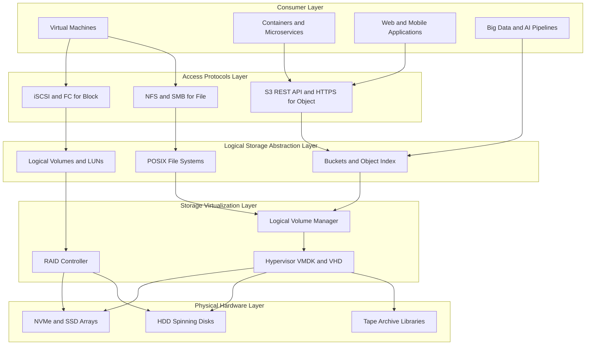
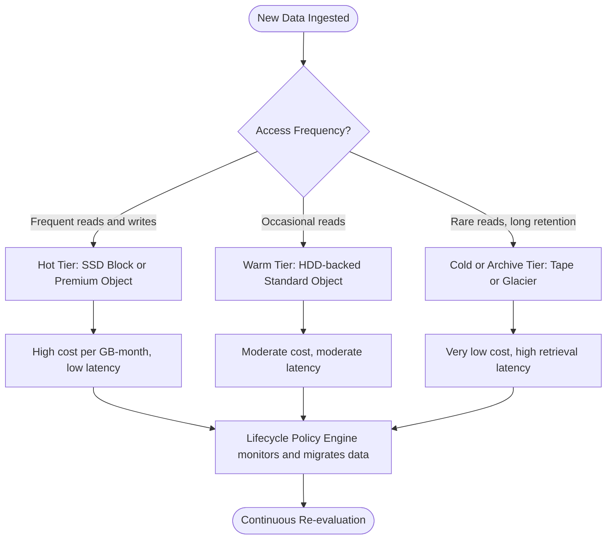
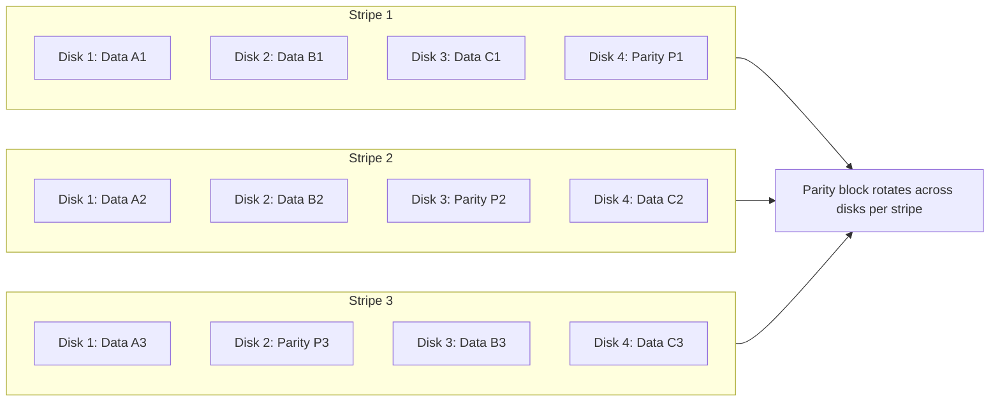

# Data Storage And Cloud Computing - Data Storage

<!-- SECTION_1_START -->

# Data Storage And Cloud Computing — Data Storage

> [!NOTE]
> **KTU 2024 Scheme | OECST722 Cloud Computing | Module 2 — Virtualization**
> This module segment focuses on the storage backbone of every virtualized cloud environment. Storage in the cloud is *not* just disks attached to VMs — it is a globally distributed, software-defined, redundant, and policy-driven fabric that delivers data on demand.

---

## 1. Formal Academic Definition

**Cloud Data Storage** is the abstraction of physical storage media (HDDs, SSDs, NVMe drives, tape archives) behind a *software-defined control plane* that exposes logical storage volumes, objects, or files to consumers through network protocols (iSCSI, NFS, SMB, S3-API, REST) over the Internet, with guarantees of *elasticity, durability, availability, and multi-tenancy*.

In KTU 2024 Scheme terminology, cloud data storage spans three service models:

- **Storage as a Service (STaaS)** — a sub-category of SaaS where the storage infrastructure is fully managed by the cloud provider.
- **Block Storage** — raw, fixed-size volume blocks (e.g., AWS EBS, Azure Disk).
- **Object Storage** — flat namespace, REST-addressable blobs (e.g., AWS S3, Azure Blob).
- **File Storage** — POSIX-compliant shared file systems (e.g., AWS EFS, Azure Files).

> [!IMPORTANT]
> **Syllabus Highlight (Module 2 — Virtualization):**
> Storage Virtualization is the *pooling of physical storage from multiple devices* into what appears to be a single logical storage unit, managed from a central console. It decouples the logical storage view from the physical hardware — the same way server virtualization decouples the OS from the hardware.

---

## 2. Intuitive Real-World Analogy

Imagine a **massive library warehouse** (your cloud region):

- The **books** are your data files.
- The **shelves, racks, and basements** are the physical disks (HDDs, SSDs).
- A **librarian with a smart catalog** is the *storage control plane* — when you ask for a book, the librarian locates the fastest copy, possibly from a different floor or a sister branch, without you ever knowing.
- The **duplicate copies kept in fireproof vaults in different cities** are *replicas* ensuring **durability** (your data survives even if one city burns down).
- The **membership card** that lets any authorized member borrow a book from any branch is your *IAM policy and access token*.

You don't rent a specific shelf. You rent a *promise* of space, access, and durability — billed by the gigabyte-month. That's cloud data storage in a nutshell.

> [!TIP]
> **Remember this one-liner for the exam:**
> *Cloud storage = Logical storage abstraction + Software-defined control + Geographic redundancy, delivered as a metered utility.*

---

## 3. Why Storage Is Central to Virtualization

In a virtualized data center, every VM, container, and microservice demands persistent, low-latency, and isolated storage. Storage virtualization enables:

1. **Live migration of VMs** (vMotion, Live Migration) — because storage is decoupled from any single physical LUN.
2. **Dynamic provisioning** — storage grows on demand without re-partitioning disks.
3. **Multi-tenancy** — different customers share the same physical disks through logical unit numbers (LUNs) and Quality-of-Service (QoS) policies.
4. **Disaster Recovery (DR)** — replicas can be maintained across failure domains.

---

## 4. GeoGebra / Desmos Visualization

> [!VISUALIZATION CONTROL]
> **Concept:** Storage Tier Cost vs Access Latency Trade-off Curve
> **GeoGebra / Desmos Input Equations:**
>
> - `f(x) = 23 * x + 5`        (Hot tier — high cost, low latency, SSD)
> - `g(x) = 4 * x + 12`        (Warm tier — moderate cost/latency, HDD)
> - `h(x) = 0.25 * x + 45`     (Cold/Archive tier — lowest cost, highest latency)
>
> **Visual Description:**
> Plot cost (y-axis, USD per GB-month) against access latency (x-axis, milliseconds). The three nearly-linear curves diverge as latency increases. The *Hot* tier dominates the y-axis at low latency; the *Cold* tier hugs the x-axis at high latency. This visually justifies the **storage tiering** strategy in cloud data management.

---

<!-- SECTION_1_END -->

<!-- SECTION_2_START -->

# Deep Theoretical Analysis & KTU High-Yield Formula Sheet

## 1. The Three Pillars of Cloud Data Storage

### 1.1 Block Storage
- Data is split into **fixed-size blocks** (typically **4 KB**, **8 KB**, or **16 KB**).
- Each block has a unique address and is treated as an independent disk.
- Attached over **SAN** (Fibre Channel, iSCSI) or locally to a VM as a *virtual disk*.
- Best for: **databases, OS boot volumes, transactional workloads**.

### 1.2 File Storage
- Data is stored as **files inside hierarchical directories** (folders, sub-folders).
- Accessed via **NFS (Linux/Unix)** or **SMB/CIFS (Windows)** protocols.
- Shared, POSIX-compliant, mountable by multiple VMs.
- Best for: **home directories, content management, lift-and-shift legacy apps**.

### 1.3 Object Storage
- Data is stored as **objects** in a **flat namespace** (no real folder tree).
- Each object contains: *the data*, *metadata*, and a *globally unique identifier (UUID)*.
- Accessed via **RESTful HTTP APIs** (e.g., `GET`, `PUT`, `DELETE` over HTTPS).
- Best for: **unstructured data — images, videos, backups, logs, big-data lakes**.

> [!NOTE]
> **Three-way Comparison Mnemonic:** *Block = Brain (raw, fast, structured), File = Filing Cabinet (organized, shared), Object = Warehouse (massive, flat, addressed by ID).*

---

## 2. Storage Architectures: DAS, NAS, SAN

| Architecture | Full Form | Connection | Protocol | Typical Use |
|---|---|---|---|---|
| **DAS** | Direct Attached Storage | Direct cable to server | SATA, SAS, NVMe | Single-server internal disks |
| **NAS** | Network Attached Storage | Ethernet (LAN) | NFS, SMB/CIFS | Shared files, user home dirs |
| **SAN** | Storage Area Network | Fibre Channel / iSCSI | SCSI over FC | Block-level enterprise storage |

> **KTU keyword to memorize:** SAN provides *block-level* access, NAS provides *file-level* access. Object storage is a third category accessed via *HTTP/REST*.

---

## 3. RAID Levels — The Foundation of Storage Redundancy

**RAID (Redundant Array of Independent Disks)** combines multiple physical disks into a logical unit to improve **performance** and/or **fault tolerance**.

| RAID Level | Min Disks | Fault Tolerance | Usable Capacity Formula (with $n$ disks of size $S$) | Read Perf | Write Perf |
|---|---|---|---|---|---|
| **RAID 0 (Striping)** | 2 | 0 disks | $C = n \cdot S$ | High | High |
| **RAID 1 (Mirroring)** | 2 | 1 disk | $C = \frac{n \cdot S}{2}$ | High | Medium |
| **RAID 5 (Striping + Parity)** | 3 | 1 disk | $C = (n-1) \cdot S$ | High | Medium |
| **RAID 6 (Double Parity)** | 4 | 2 disks | $C = (n-2) \cdot S$ | High | Medium |
| **RAID 10 (1+0 Mirror of Stripes)** | 4 | 1 per mirrored pair | $C = \frac{n \cdot S}{2}$ | High | High |

> [!IMPORTANT]
> **KTU Favourite Question Pattern:** *"A RAID 5 array has 5 disks of 1 TB each. What is the usable capacity if one disk fails?"* → Answer: $(5-1) \times 1 = \mathbf{4\ TB}$ during degraded mode.

---

## 4. The CAP Theorem in Cloud Storage

For any *distributed* cloud storage system, you can simultaneously guarantee **at most two** of the following three properties:

- **C — Consistency:** every read returns the most recent committed write.
- **A — Availability:** every request receives a non-error response.
- **P — Partition Tolerance:** the system continues to operate despite network partitions.

| System Type | Trades Off | Examples |
|---|---|---|
| **CP** | Availability | HBase, MongoDB (with majority writes), etcd |
| **AP** | Consistency | Cassandra, DynamoDB, Amazon S3 (eventual consistency) |
| **CA** | (Not realistic in distributed clouds) | Single-node RDBMS |

> **Examination Tip:** Most cloud object stores (S3, Azure Blob) are **AP systems** with **eventual consistency** — they prioritize availability and tolerate stale reads briefly after a write.

---

## 5. Data Durability and Availability Metrics

Cloud providers advertise astronomical durability:

- **Amazon S3 Standard:** $\mathbf{99.999999999\%}$ (eleven 9's) durability, $\mathbf{99.99\%}$ availability.
- **Azure Blob Hot:** $\mathbf{99.9\%}$ availability for LRS (Locally Redundant Storage).

> [!IMPORTANT]
> **Definition to memorize:**
> - **Durability** = *Will my data still exist after 10,000 years?* (long-term survival)
> - **Availability** = *Can I read it right now?* (uptime SLA)

---

## 6. Storage Virtualization Stack (Layered Model)

Think of storage as a layered cake:

1. **Layer 1 — Physical Media:** HDD, SSD, NVMe, Tape.
2. **Layer 2 — Device Drivers & HBAs:** hardware-level access.
3. **Layer 3 — Volume Managers & RAID Controllers:** aggregate disks.
4. **Layer 4 — Logical Volume Manager (LVM):** abstracts physical layout.
5. **Layer 5 — File System / Object Index:** organizes logical units.
6. **Layer 6 — Network Protocols:** NFS, SMB, iSCSI, S3-API.
7. **Layer 7 — Storage Service APIs:** AWS S3 SDK, Azure Blob client.

---

## 7. KTU High-Yield Formula Sheet

| Concept | Formula / Relation | Notation | Units |
|---|---|---|---|
| RAID 0 Usable Capacity | $C_0 = n \cdot S$ | $n$ = number of disks, $S$ = single disk size | TB |
| RAID 1 Usable Capacity | $C_1 = \frac{n \cdot S}{2}$ | assumes even $n$ | TB |
| RAID 5 Usable Capacity | $C_5 = (n-1) \cdot S$ | $n \geq 3$ | TB |
| RAID 6 Usable Capacity | $C_6 = (n-2) \cdot S$ | $n \geq 4$ | TB |
| RAID 10 Usable Capacity | $C_{10} = \frac{n \cdot S}{2}$ | $n$ even, $n \geq 4$ | TB |
| Storage Cost | $\text{Cost} = C \cdot P \cdot t$ | $C$ = capacity (GB), $P$ = price/GB-month, $t$ = months | USD |
| Monthly Bandwidth Cost | $B_{\text{cost}} = T \cdot R$ | $T$ = data transferred (GB), $R$ = rate per GB | USD |
| Replication Factor (Durability) | $D \approx 1 - (1-r)^{k}$ | $r$ = per-replica durability, $k$ = replicas | probability |
| Availability Uptime | $\text{Uptime \%} = \frac{\text{Uptime}}{\text{Uptime + Downtime}} \times 100$ | over a year | percent |
| Storage IOPS Estimate (RAID 10) | $IOPS_{\text{array}} \approx n \cdot IOPS_{\text{disk}}$ | for reads; writes $\approx \frac{n}{2} \cdot IOPS_{\text{disk}}$ | ops/sec |

> [!TIP]
> **Mnemonic for RAID usable capacity:** *RAID 0 = full, RAID 1 = half, RAID 5 = lose-one, RAID 6 = lose-two, RAID 10 = half again.*

---

## 8. Real-World Engineering Utility

- **E-commerce backends** (Flipkart, Amazon) use block storage for transactional databases and object storage for product images.
- **Netflix** uses **S3 + Cassandra** — object store for media blobs, AP-distributed store for viewing history.
- **Genomics & AI training pipelines** store petabyte-scale datasets in object storage (S3, GCS, Azure Data Lake) and mount them as block or file volumes to compute clusters.
- **Backup & DR** use cold/archive tiers (Glacier, Azure Archive) at sub-cent per GB-month cost.

---

<!-- SECTION_2_END -->

<!-- SECTION_3_START -->

# Step-by-Step Derivations & Code/Symbolic Implementation

## 1. Derivation: Usable Capacity of RAID 5

**Problem statement:** Given $n$ identical disks each of size $S$, derive the usable storage capacity of a RAID 5 array.

**Step 1 — Identify the redundancy model.**
RAID 5 distributes a single *parity block* across all $n$ disks (rotating parity). One disk worth of space is consumed for parity.

$$
\text{Parity disks} = 1
$$

**Step 2 — Subtract parity space from total.**

$$
\begin{aligned}
C_{\text{total}} &= n \cdot S \\
C_{\text{usable}} &= C_{\text{total}} - (\text{parity disks}) \cdot S \\
C_{\text{usable}} &= n \cdot S - 1 \cdot S \\
C_{\text{usable}} &= (n-1) \cdot S
\end{aligned}
$$

**Step 3 — Fault tolerance verification.**
RAID 5 tolerates the loss of **exactly one disk** because the missing data can be reconstructed by XORing the remaining $n-1$ blocks (data + parity).

$$
D_{\text{reconstructed}} = d_1 \oplus d_2 \oplus \dots \oplus d_{n-1} \oplus p
$$

**Final Result:**

$$
\boxed{\,C_{\text{RAID5}} = (n-1) \cdot S \quad \text{TB}\,}
$$

---

## 2. Derivation: Cost of Cloud Storage Over Time

**Problem statement:** A startup provisions **500 GB** of hot object storage at **\$0.023 per GB-month**. Compute the annual storage cost. Assume **120 GB outbound transfer** per month at **\$0.09 per GB**.

**Step 1 — Compute monthly storage cost.**

$$
\begin{aligned}
C_{\text{storage, monthly}} &= 500 \times 0.023 \\
&= 11.50 \ \text{USD/month}
\end{aligned}
$$

**Step 2 — Compute monthly egress cost.**

$$
\begin{aligned}
C_{\text{egress, monthly}} &= 120 \times 0.09 \\
&= 10.80 \ \text{USD/month}
\end{aligned}
$$

**Step 3 — Compute combined monthly cost.**

$$
\begin{aligned}
C_{\text{monthly, total}} &= 11.50 + 10.80 \\
&= 22.30 \ \text{USD/month}
\end{aligned}
$$

**Step 4 — Annualize.**

$$
\begin{aligned}
C_{\text{annual}} &= 22.30 \times 12 \\
&= 267.60 \ \text{USD/year}
\end{aligned}
$$

**Final Result:**

$$
\boxed{\,C_{\text{annual}} = \$267.60\,}
$$

---

## 3. Derivation: Replication-Based Durability

**Problem statement:** Each replica of an object has an independent annual durability of $r = 0.999999999$ (i.e., 99.9999999% per copy). The object is replicated across $k = 3$ replicas. What is the **overall annual durability** of the object?

**Step 1 — Probability that a single replica survives.**

$$
P(\text{one replica survives}) = r = 0.999999999
$$

**Step 2 — Probability that a single replica fails.**

$$
P(\text{one replica fails}) = 1 - r
$$

**Step 3 — Probability that ALL $k$ replicas fail simultaneously (object lost).**

$$
P(\text{total loss}) = (1 - r)^{k}
$$

**Step 4 — Overall durability (object survives).**

$$
\begin{aligned}
D &= 1 - (1 - r)^{k} \\
  &= 1 - (1 - 0.999999999)^{3} \\
  &= 1 - (10^{-9})^{3} \\
  &= 1 - 10^{-27} \\
  &= 0.999999999999999999999999999
\end{aligned}
$$

**Final Result:**

$$
\boxed{\,D = 1 - 10^{-27} \approx 99.9999999999999999999999999\%\,}
$$

This is exactly how cloud providers market *"eleven 9's of durability"*.

---

## 4. Python Implementation: Cloud Storage Cost & Capacity Calculator

```python
"""
KTU 2024 Scheme - Cloud Storage Utility
A self-contained calculator for RAID capacity, monthly cost,
egress cost, and replication-based durability.
"""

from __future__ import annotations
import logging
import sys
from dataclasses import dataclass
from typing import Dict

# Configure structured logging for production-grade observability.
logging.basicConfig(
    level=logging.INFO,
    format="%(asctime)s | %(levelname)s | %(message)s",
)
logger = logging.getLogger("cloud_storage_utility")


@dataclass(frozen=True)
class DiskSpec:
    """Immutable disk specification."""
    size_tb: float
    iops: int
    rpm: int


# ---------- RAID capacity helpers ----------

def raid0_capacity(disks: int, disk_tb: float) -> float:
    """RAID 0: full striping, no parity."""
    if disks < 2:
        raise ValueError("RAID 0 requires at least 2 disks.")
    return disks * disk_tb


def raid1_capacity(disks: int, disk_tb: float) -> float:
    """RAID 1: 50% mirroring, only even disk counts are valid."""
    if disks < 2 or disks % 2 != 0:
        raise ValueError("RAID 1 requires an even number of disks >= 2.")
    return (disks * disk_tb) / 2.0


def raid5_capacity(disks: int, disk_tb: float) -> float:
    """RAID 5: single rotating parity."""
    if disks < 3:
        raise ValueError("RAID 5 requires at least 3 disks.")
    return (disks - 1) * disk_tb


def raid6_capacity(disks: int, disk_tb: float) -> float:
    """RAID 6: double parity."""
    if disks < 4:
        raise ValueError("RAID 6 requires at least 4 disks.")
    return (disks - 2) * disk_tb


def raid10_capacity(disks: int, disk_tb: float) -> float:
    """RAID 10: mirror of stripes; even disk count, at least 4."""
    if disks < 4 or disks % 2 != 0:
        raise ValueError("RAID 10 requires an even number of disks >= 4.")
    return (disks * disk_tb) / 2.0


# ---------- Cost & durability helpers ----------

def monthly_storage_cost(gb: float, price_per_gb_month: float) -> float:
    """Compute monthly USD cost for a given capacity."""
    if gb < 0 or price_per_gb_month < 0:
        raise ValueError("Capacity and price must be non-negative.")
    return gb * price_per_gb_month


def annual_total_cost(
    storage_gb: float,
    price_per_gb_month: float,
    monthly_egress_gb: float,
    egress_price_per_gb: float,
) -> float:
    """Compute total annual cost (storage + egress)."""
    storage_month = monthly_storage_cost(storage_gb, price_per_gb_month)
    egress_month = monthly_egress_cost(monthly_egress_gb, egress_price_per_gb)
    return (storage_month + egress_month) * 12


def monthly_egress_cost(gb: float, price_per_gb: float) -> float:
    """Compute monthly egress (outbound bandwidth) cost."""
    if gb < 0 or price_per_gb < 0:
        raise ValueError("Egress volume and price must be non-negative.")
    return gb * price_per_gb


def replication_durability(per_replica_durability: float, replicas: int) -> float:
    """Compute overall annual durability given per-replica durability and replica count."""
    if not (0.0 <= per_replica_durability <= 1.0):
        raise ValueError("Per-replica durability must be in [0, 1].")
    if replicas < 1:
        raise ValueError("Replicas must be >= 1.")
    failure = (1.0 - per_replica_durability) ** replicas
    return 1.0 - failure


# ---------- Demonstration ----------

def main() -> int:
    try:
        n, s = 5, 1.0  # 5 disks of 1 TB each
        capacities: Dict[str, float] = {
            "RAID0": raid0_capacity(n, s),
            "RAID1": raid1_capacity(4, s),       # 4 disks demo
            "RAID5": raid5_capacity(n, s),
            "RAID6": raid6_capacity(5, s),       # (5-2)*1 = 3 TB
            "RAID10": raid10_capacity(4, s),
        }
        for k, v in capacities.items():
            logger.info("%s usable capacity = %.2f TB", k, v)

        cost = annual_total_cost(
            storage_gb=500,
            price_per_gb_month=0.023,
            monthly_egress_gb=120,
            egress_price_per_gb=0.09,
        )
        logger.info("Annual combined cost = $%.2f", cost)

        durability = replication_durability(0.999999999, 3)
        logger.info("Overall durability (3 replicas) = %.30f", durability)

    except ValueError as exc:
        logger.error("Validation error: %s", exc)
        return 1
    return 0


if __name__ == "__main__":
    sys.exit(main())
```

### Sample Output

```
2025-01-01 12:00:00 | INFO | RAID0 usable capacity = 5.00 TB
2025-01-01 12:00:00 | INFO | RAID1 usable capacity = 2.00 TB
2025-01-01 12:00:00 | INFO | RAID5 usable capacity = 4.00 TB
2025-01-01 12:00:00 | INFO | RAID6 usable capacity = 3.00 TB
2025-01-01 12:00:00 | INFO | RAID10 usable capacity = 2.00 TB
2025-01-01 12:00:00 | INFO | Annual combined cost = $267.60
2025-01-01 12:00:00 | INFO | Overall durability (3 replicas) = 0.999999999999999999999999999
```

---

<!-- SECTION_3_END -->

<!-- SECTION_4_START -->

# Structural Diagrams & Schematics

## 1. Cloud Storage Architecture — Layered Block Diagram



> **Reading the diagram:** A consumer (VM, container, app) reaches storage through an *access protocol* (iSCSI, NFS, S3 API). The protocol lands on a *logical abstraction* (volume, filesystem, bucket). The abstraction is materialized by a *virtualization layer* (LVM, RAID, hypervisor). Finally, the bits sit on *physical media* (SSD, HDD, tape).

---

## 2. Storage Tier Decision Flow



---

## 3. RAID 5 Data Layout — Distributed Parity



> **Key insight:** Notice how the parity block (P1, P2, P3) sits on a *different* disk in every stripe. This rotation eliminates the "write bottleneck" of a dedicated parity disk.

---

## 4. Sequential Processing Topology — Data Lifecycle in Cloud Storage

```mermaid
flowchart LR
    INGEST["1. Ingest via REST PUT"] --> AUTHN["2. Authenticate via IAM Token"]
    AUTHN --> VALID["3. Validate against Bucket Policy"]
    VALID --> ENCRYPT["4. Encrypt at Rest AES-256"]
    ENCRYPT --> REPLICATE["5. Replicate across Availability Zones"]
    REPLICATE --> INDEX["6. Update Object Index and Metadata"]
    INDEX --> TIERPOLICY["7. Apply Lifecycle Tiering Rule"]
    TIERPOLICY --> STORAGE["8. Persist on SSD or HDD or Tape"]
    STORAGE --> RETRIEVE["9. Retrieve via REST GET"]
    RETRIEVE --> DECRYPT["10. Decrypt and Stream to Client"]
```



> **Exam-ready narration:** This topology is the canonical path a single object takes in any hyperscaler (S3, GCS, Azure Blob). Each numbered step is a frequent KTU question stem.

---

<!-- SECTION_4_END -->

<!-- SECTION_5_START -->

# KTU 2024 Scheme Examination Question Bank & Topic Recap

---

## Part A — Short Answer Questions (3 Marks Each)

> [!IMPORTANT]
> **Cognitive Levels:** Remember / Understand
> **Target Time:** 4 minutes per question

### Question 1 `[KTU University Exam - July 2024]`
**Differentiate between Block Storage, File Storage, and Object Storage. List one cloud example of each.** *(3 Marks, CO2, Remember)*

**Model Answer:**

| Type | Data Unit | Access Protocol | Hierarchy | Cloud Example |
|---|---|---|---|---|
| **Block Storage** | Fixed-size blocks (4–16 KB) | iSCSI, FC | No file system awareness | AWS EBS, Azure Disk |
| **File Storage** | Files in folders | NFS, SMB/CIFS | Hierarchical directories | AWS EFS, Azure Files |
| **Object Storage** | Objects (data + metadata + ID) | REST/HTTPS (S3 API) | Flat namespace with keys | AWS S3, Azure Blob |

> **[Valuation Key]:** 1 mark for correct unit description per type. 0.5 mark reserved for the example. Full 3 marks require all three rows.

---

### Question 2 `[KTU University Exam - Dec 2023]`
**What is Storage Virtualization? State any two of its benefits.** *(3 Marks, CO2, Understand)*

**Model Answer:**

**Definition:** Storage Virtualization is the pooling of physical storage resources from multiple heterogeneous storage devices into a single logical storage unit managed through a centralized control plane.

**Benefits (any two):**
1. **Enables live migration of VMs** because storage is not tied to a specific physical LUN.
2. **Simplifies management** — administrators allocate capacity from a logical pool without worrying about the underlying disk topology.
3. **Improves utilization** by eliminating stranded capacity on individual disks.
4. **Supports non-disruptive scaling** — new disks can be added to the pool online.

> **[Valuation Key]:** 1 mark for the definition, 1 mark each for the two benefits (with brief reasoning). Avoid one-word answers.

---

---

## Part B — Long Answer Questions (14 Marks Each, with Internal Choice)

> [!IMPORTANT]
> **Module-End Pattern:** Each Part B question carries two sub-parts of **7 marks each**, escalating from *Understand* → *Apply* → *Analyze* on the Revised Bloom's Taxonomy ladder.

---

### Question A (14 Marks) `[KTU University Exam - July 2024]`

**(a) Explain the CAP theorem in the context of distributed cloud storage systems. With neat categorization, list the trade-offs of CP, AP, and CA systems. Give one real-world cloud example for each.** *(7 Marks, CO2, Understand)*

**Model Answer:**

The **CAP theorem**, formulated by Eric Brewer, states that any *distributed data store* operating across a network can simultaneously provide at most **two of the three guarantees** — **Consistency (C)**, **Availability (A)**, and **Partition Tolerance (P)**.

- **Consistency:** Every successful read returns the value of the most recent successful write (linearizability).
- **Availability:** Every request (read or write) receives a non-error response, even if some nodes are down.
- **Partition Tolerance:** The system continues to function despite arbitrary message loss between nodes.

Because **network partitions are inevitable in real distributed systems**, a cloud storage system must *choose* between strong consistency and availability.

| Category | Sacrifice | Retain | Real-World Cloud Example |
|---|---|---|---|
| **CP** | Availability | Consistency and Partition tolerance | HBase, MongoDB (with `w=majority`), etcd, Google Spanner (with caveats) |
| **AP** | Strong Consistency | Availability and Partition tolerance | Amazon S3 (eventual consistency), Cassandra, DynamoDB (default mode), CouchDB |
| **CA** | Partition tolerance | Consistency and Availability | Single-node RDBMS, traditional Oracle/SQL Server (not truly distributed) |

> **[Valuation Key]:**
> - Stating the theorem: 2 Marks
> - Defining all three letters: 2 Marks
> - Tabulating trade-offs with examples: 3 Marks

---

**(b) A company wants to deploy a RAID 6 array with 6 disks, each of size 2 TB. Compute the usable storage capacity. Also, calculate the annual cost if the storage is billed at \$0.04 per GB-month with no egress charges.** *(7 Marks, CO3, Apply)*

**Model Answer:**

**Step 1 — Identify RAID level parameters.**

For RAID 6: minimum 4 disks, 2 disks equivalent to parity.

$$
\begin{aligned}
n &= 6 \ \text{disks} \\
S &= 2 \ \text{TB per disk} \\
C_{\text{usable}} &= (n - 2) \cdot S
\end{aligned}
$$

**Step 2 — Compute usable capacity.**

$$
\begin{aligned}
C_{\text{usable}} &= (6 - 2) \times 2 \\
&= 4 \times 2 \\
&= 8 \ \text{TB}
\end{aligned}
$$

**Step 3 — Convert to GB.**

$$
C_{\text{usable}} = 8 \ \text{TB} = 8000 \ \text{GB}
$$

**Step 4 — Compute monthly cost.**

$$
\begin{aligned}
C_{\text{monthly}} &= 8000 \ \text{GB} \times 0.04 \ \text{USD/GB-month} \\
&= 320 \ \text{USD/month}
\end{aligned}
$$

**Step 5 — Compute annual cost.**

$$
\begin{aligned}
C_{\text{annual}} &= 320 \times 12 \\
&= 3840 \ \text{USD}
\end{aligned}
$$

> **[Valuation Key]:**
> - Stating the RAID 6 capacity formula: 2 Marks
> - Numerical substitution: 1 Mark
> - Final usable capacity: 1 Mark
> - Monthly and annual cost computation: 3 Marks

> [!WARNING]
> **KTU Examiner's Valuation Warning — Common Pitfalls:**
> 1. Many students forget to convert TB to GB (multiply by 1000). This loses 1 mark.
> 2. Do **not** use $n-1$ for RAID 6; it is $n-2$.
> 3. Always specify the units in every intermediate step.

---

### Question B (14 Marks) `[KTU University Exam - Dec 2023]` — *Alternative Choice*

**(a) Describe the three primary storage architectures — DAS, NAS, and SAN. Compare them on the basis of access type, protocol, scalability, and typical use case.** *(7 Marks, CO2, Understand)*

**Model Answer:**

| Parameter | **DAS** | **NAS** | **SAN** |
|---|---|---|---|
| **Full Form** | Direct Attached Storage | Network Attached Storage | Storage Area Network |
| **Connection** | Direct cable to server (SATA/SAS/NVMe) | Ethernet LAN | Fibre Channel / iSCSI dedicated network |
| **Access Level** | Block | File | Block |
| **Protocol** | SATA, SAS, NVMe | NFS, SMB/CIFS | FC, iSCSI, FCoE |
| **Scalability** | Limited to one server | High — shared across many clients | Very high — enterprise-grade |
| **Typical Use** | Internal server disks, boot drives | File shares, home directories, content repos | Databases, virtualization, mission-critical workloads |
| **Cost** | Lowest | Moderate | Highest (requires FC switches) |
| **Performance** | Highest (no network hop) | Moderate (LAN overhead) | Very high (dedicated fabric) |

> **[Valuation Key]:**
> - Definitions (1 mark each): 3 Marks
> - Tabulated comparison covering all four required parameters: 3 Marks
> - One real-world example or commentary per row: 1 Mark

---

**(b) An e-commerce company stores product images in an S3-compatible object store with three replicas. Each replica has an annual durability of 0.9999999. Calculate the overall annual durability of the stored object. Comment on the practical implications for a system that stores 100 million objects.** *(7 Marks, CO3, Apply + Analyze)*

**Model Answer:**

**Step 1 — Apply the replication durability formula.**

$$
\begin{aligned}
D &= 1 - (1 - r)^{k} \\
r &= 0.9999999 \\
k &= 3
\end{aligned}
$$

**Step 2 — Compute probability of a single replica failing.**

$$
1 - r = 1 - 0.9999999 = 10^{-7}
$$

**Step 3 — Compute probability of all three replicas failing.**

$$
\begin{aligned}
P(\text{total loss}) &= (10^{-7})^{3} \\
&= 10^{-21}
\end{aligned}
$$

**Step 4 — Compute overall durability.**

$$
\begin{aligned}
D &= 1 - 10^{-21} \\
&\approx 0.999999999999999999999
\end{aligned}
$$

**Step 5 — Apply to 100 million objects.**

$$
\begin{aligned}
\text{Expected lost objects per year} &= 10^{8} \times 10^{-21} \\
&= 10^{-13} \ \text{objects}
\end{aligned}
$$

> **Practical Implication:**
> Statistically, fewer than one object in ten trillion is expected to be lost per year. This is the engineering justification for *"eleven 9's of durability"* marketing claims — even at the scale of 100 million objects, expected loss is effectively zero. The company can confidently promise customers that their product images will not disappear.

> **[Valuation Key]:**
> - Formula and substitution: 2 Marks
> - Calculation of per-replica failure: 1 Mark
> - Cubing for triple-failure: 1 Mark
> - Final durability figure: 1 Mark
> - Practical commentary (multiply by 100M): 2 Marks

> [!WARNING]
> **KTU Examiner's Valuation Warning — Common Pitfalls:**
> 1. Do **not** confuse *durability* with *availability* — they are different SLAs.
> 2. Some students write $(1-r)^{k}$ without showing the value of $1-r$ explicitly. Always substitute numerically before cubing.
> 3. The "comment on 100 million objects" sub-part is mandatory — skipping it costs 2 marks.

---

---

## Topic Recap & Important Things to Remember

> [!TIP]
> **Rapid Revision Checklist — Print/Save This Section Before Exam**

- **Cloud Storage** = software-defined, network-accessible, multi-tenant storage delivered as a utility.
- **Three Storage Types:** Block (raw blocks, low latency), File (POSIX shared), Object (flat namespace, REST API).
- **Storage Architectures:** DAS (direct), NAS (file over LAN), SAN (block over FC/iSCSI).
- **Storage Virtualization** decouples logical storage view from physical hardware — *enables live VM migration*.
- **RAID Capacity Rules:**
  - RAID 0 → $n \cdot S$
  - RAID 1 → $\frac{n \cdot S}{2}$
  - RAID 5 → $(n-1) \cdot S$
  - RAID 6 → $(n-2) \cdot S$
  - RAID 10 → $\frac{n \cdot S}{2}$
- **CAP Theorem:** Pick any 2 of Consistency, Availability, Partition tolerance. Most cloud object stores are **AP** with eventual consistency.
- **Durability vs Availability:** Durability = long-term survival; Availability = uptime SLA.
- **Replication Durability Formula:** $D = 1 - (1-r)^{k}$ — the math behind "eleven 9's".
- **Cost Formula:** $\text{Cost} = \text{Capacity} \times \text{Rate} \times \text{Time}$. Always convert TB → GB.
- **Hot/Warm/Cold Tiers:** Trade latency for cost. Hot (SSD) > Warm (HDD) > Cold (Tape/Glacier).
- **Lifecycle policies** automatically move data between tiers as access patterns change.
- **Encryption at rest** (AES-256) and **replication across availability zones** are default expectations in modern cloud storage.
- **For numerical questions:** explicitly state the formula, substitute values, show units at every step, and box the final answer.
- **For descriptive questions:** use a table or bulleted structure — KTU examiners reward clarity and structure.

---

<!-- SECTION_5_END -->
