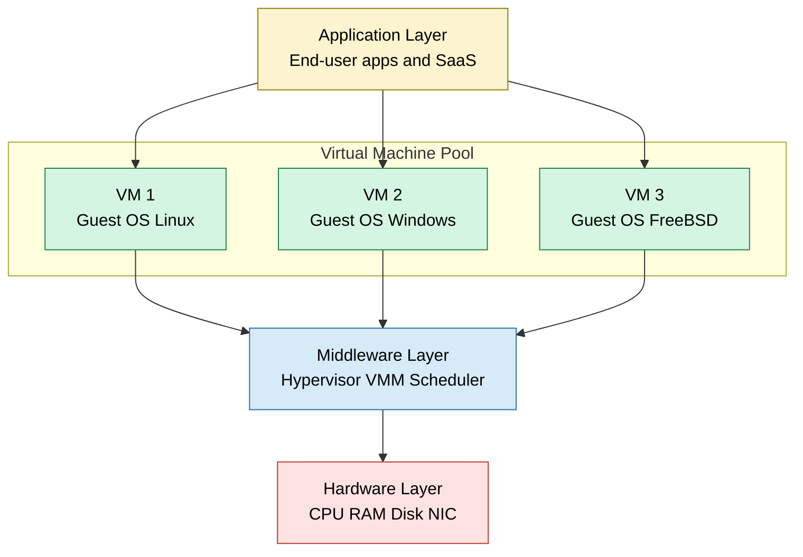
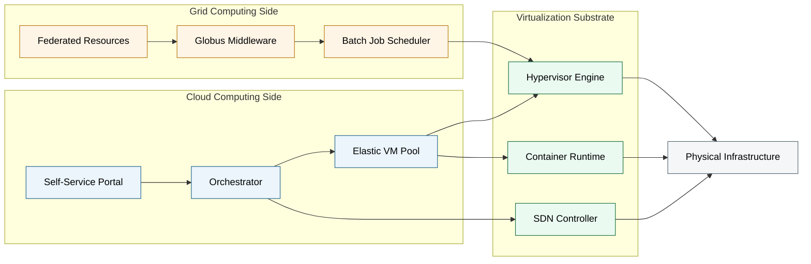
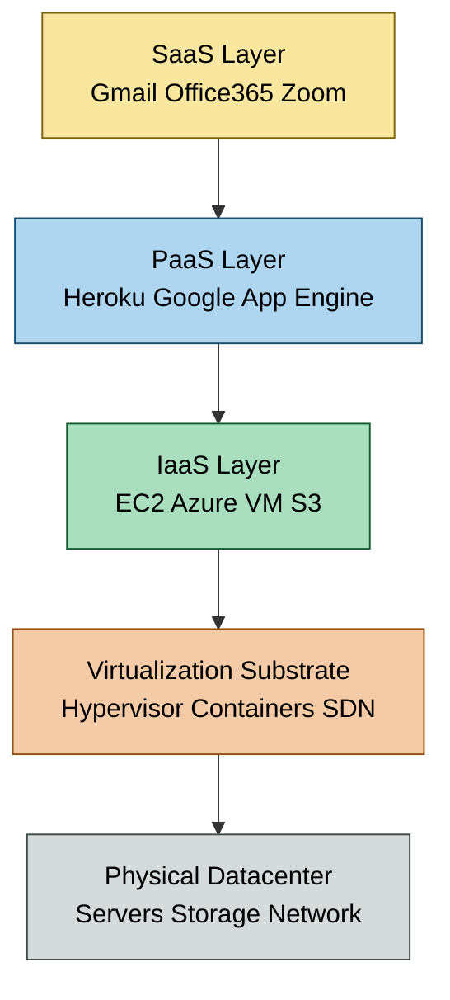
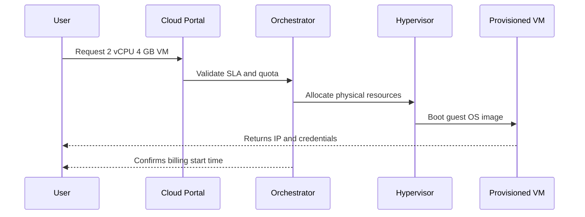

# Grid, Cloud And Virtualization

<!-- SECTION_1_START -->
# Grid, Cloud and Virtualization — Foundational Overview

## 1.1 Formal KTU-Style Definitions

> [!NOTE]
> **Grid Computing** is a distributed computing paradigm that coordinates **geographically dispersed, heterogeneous, and loosely coupled resources** (computers, storage, instruments, data) to deliver a single, unified computing capability for solving large-scale, compute-intensive problems. Resources are shared across administrative domains using standard, open protocols (e.g., **Globus Toolkit**, **OGSI**).

> [!NOTE]
> **Cloud Computing**, as per the **NIST SP 800-145** definition, is a model for enabling ubiquitous, convenient, on-demand network access to a shared pool of configurable computing resources (networks, servers, storage, applications, and services) that can be rapidly provisioned and released with **minimal management effort or service provider interaction**.

> [!NOTE]
> **Virtualization** is the abstraction of physical computing resources (CPU, memory, storage, network) from the operating system, application, or end-user. It creates a logical view of resources, allowing multiple virtual instances to share the same underlying physical hardware through a software layer called the **hypervisor** (VMM — Virtual Machine Monitor).

---

## 1.2 Conceptual Analogy / Intuition

| Concept | Real-World Analogy | Intuitive Takeaway |
|---|---|---|
| **Grid Computing** | A national power grid — multiple power plants (computers) across regions feeding into one common electricity network. You simply plug in and draw power; you don't care which plant generated it. | "**Many computers, one big problem**" — focused on *computational throughput* for science/engineering workloads. |
| **Cloud Computing** | A public utility service like water or electricity — you consume what you need, get billed by usage meter, and the provider scales capacity invisibly behind the meter. | "**Rent, don't own**" — focused on *service delivery* and *elasticity* over the Internet. |
| **Virtualization** | A high-rise apartment building on a single plot of land — one physical foundation (hardware) hosts many independent flats (VMs), each with its own door, plumbing, and electricity (OS + resources). | "**One physical, many logical**" — focused on *resource abstraction & isolation*. |

---

## 1.3 Key Terminology Highlights

> [!IMPORTANT]
> **Five Essential Characteristics of Cloud (NIST)**: On-demand self-service, Broad network access, Resource pooling, **Rapid elasticity**, **Measured service**.
>
> **Three Service Models**: IaaS, PaaS, SaaS.
>
> **Four Deployment Models**: Private, Public, Hybrid, Community.
>
> **Three Hypervisor Types**: Type 1 (Bare-metal), Type 2 (Hosted), Container-based (e.g., Docker).

> [!VISUALIZATION CONTROL]
> **Concept:** Abstraction Layer Stack (Hardware → VM → OS → App)
> **Geometric Representation:** A series of nested rectangles where each layer fully contains the next.
>
> ```text
> +--------------------------------------------------+
> |              Application Layer                   |
> |  +--------------------------------------------+  |
> |  |           Guest Operating System            |  |
> |  |  +--------------------------------------+  |  |
> |  |  |          Hypervisor (VMM)            |  |  |
> |  |  |  +--------------------------------+  |  |  |
> |  |  |  |       Physical Hardware        |  |  |  |
> |  |  |  |  CPU | RAM | Disk | NIC        |  |  |  |
> |  |  |  +--------------------------------+  |  |  |
> |  |  +--------------------------------------+  |  |
> |  +--------------------------------------------+  |
> +--------------------------------------------------+
> ```
>
> **Visual Description:** Each inner rectangle represents a layer of abstraction. The hypervisor is the boundary that decouples guest OS from the physical metal, allowing multiple such stacks to coexist.

<!-- SECTION_1_END -->

<!-- SECTION_2_START -->
# Deep Theoretical Analysis & KTU High-Yield Reference Sheet

## 2.1 Grid Computing — Architectural Breakdown

1. **Resource Layer** → Physical resources (CPUs, storage, sensors).
2. **Middleware Layer** → Grid middleware (e.g., Globus Toolkit) handles security, scheduling, and data movement.
3. **Application Layer** → User-defined scientific/engineering jobs.
4. **Collective Layer** → Coordinates multiple resources (directory services, brokering).
5. **User Layer** → End-user submits jobs via portals or CLI.

> [!NOTE]
> Grid is **federated** — resources belong to different organizations but cooperate under shared policies.

### 2.1.1 Grid Architectural Logic
- Loosely coupled: jobs run on the best-available node.
- Standard protocols: **GRIDFTP**, **GRAM** (Globus Resource Allocation Manager), **MDS** (Monitoring and Discovery Service).
- Use case: **SETI@home**, **CERN LHC** data processing, weather modeling.

---

## 2.2 Cloud Computing — Architectural Breakdown

| Layer | Function | Example |
|---|---|---|
| **Hardware** | Physical data-centre assets | Servers, switches, SAN |
| **Infrastructure** | Virtualized compute, storage, network | AWS EC2, Azure VM |
| **Platform** | Developer runtime, OS, middleware | Google App Engine, Heroku |
| **Application** | End-user SaaS | Gmail, Office 365 |
| **Management** | Orchestration, billing, monitoring | Kubernetes, OpenStack |

### 2.2.1 Service Models
- **IaaS** (Infrastructure-as-a-Service): User provisions raw VMs, storage, networks.
- **PaaS** (Platform-as-a-Service): User deploys code; provider manages runtime/stack.
- **SaaS** (Software-as-a-Service): User consumes ready-made applications.

### 2.2.2 Deployment Models
- **Public Cloud**: Open to general public (AWS, Azure, GCP).
- **Private Cloud**: Exclusively for one organization (OpenStack on-premises).
- **Hybrid Cloud**: Mix of public + private with orchestration between them.
- **Community Cloud**: Shared by organizations with common concerns (e.g., government agencies).

---

## 2.3 Virtualization — Architectural Breakdown

> [!IMPORTANT]
> Virtualization enables **server consolidation**, **fault isolation**, **rapid provisioning**, and **hardware-independence**.

### 2.3.1 Types of Virtualization
- **Server Virtualization**: Multiple VMs on one physical server.
- **Storage Virtualization**: Multiple physical disks pooled as a single logical volume.
- **Network Virtualization**: Multiple logical networks over shared physical infrastructure (SDN, VLAN).
- **Desktop Virtualization**: VDI — central hosting of user desktops.
- **Application Virtualization**: Apps run in isolated environments (e.g., Docker, App-V).

### 2.3.2 Hypervisor Classification

| Feature | Type 1 (Bare-Metal) | Type 2 (Hosted) |
|---|---|---|
| Runs directly on hardware | **Yes** | No (runs on host OS) |
| Performance | **High** (near-native) | Lower (double-layer overhead) |
| Examples | VMware ESXi, Microsoft Hyper-V, Xen | Oracle VirtualBox, VMware Workstation |
| Use case | Production data-centres | Development, testing, learning |

### 2.3.3 Virtualization Techniques
- **Full Virtualization**: Complete hardware emulation; guest OS unmodified (binary translation).
- **Para-Virtualization**: Guest OS is *aware* it's virtualized and uses **hypercalls** to communicate with the hypervisor.
- **Hardware-Assisted Virtualization**: CPU extensions (**Intel VT-x**, **AMD-V**) reduce hypervisor overhead.
- **OS-Level Virtualization / Containers**: Single kernel hosts multiple isolated user-space instances (Docker, LXC).

---

## 2.4 KTU Formula & Reference Sheet

| Concept | Key Property | Symbol / Value | Engineering Unit |
|---|---|---|---|
| CPU Oversubscription Ratio | $R_{cpu} = \frac{\sum vCPU}{pCPU}$ | ratio | dimensionless |
| Memory Overcommit Factor | $R_{mem} = \frac{\sum vRAM}{pRAM}$ | ratio | dimensionless |
| Hypervisor CPU Share | $C_{share} = \frac{vCPU_{pct}}{100}$ | fraction | 0–1 |
| VM Density | $D = \frac{N_{vm}}{S_{server}}$ | VMs/server | integer |
| CPU Utilization Efficiency | $\eta = \frac{U_{used}}{U_{allocated}} \times 100$ | percentage | \% |
| Cloud Pay-per-Use Cost | $C = P_{unit} \times \sum_{i=1}^{n} u_i \cdot t_i$ | currency | INR / USD |
| Elasticity Scale Factor | $S = \frac{L_{peak}}{L_{base}}$ | ratio | dimensionless |
| Grid Throughput | $T = \frac{J_{total}}{T_{wall}}$ | jobs/sec | $s^{-1}$ |

> [!IMPORTANT]
> **Critical Boundary Conditions for KTU**:
> - $R_{cpu} \le 6:1$ is considered safe for general workloads.
> - $R_{mem} \le 1.5:1$ is the maximum recommended memory overcommit.
> - Hypervisor mode ring transitions: Guest code runs in **Ring 3**, hypervisor traps privileged instructions at **Ring 0**.

---

## 2.5 Real-World Engineering Utility

- **Grid Computing** → Climate modeling (NCAR), Genomics (BLAST over grids), Physics (LHC@CERN).
- **Cloud Computing** → Netflix streaming on AWS, Dropbox storage on S3, AI/ML training on GPU clouds.
- **Virtualization** → Running Windows on a Mac (VirtualBox), Kubernetes pods (cgroups + namespaces), Network Function Virtualization (NFV) in 5G telco cores.

<!-- SECTION_2_END -->

<!-- SECTION_3_START -->
# Step-by-Step Derivations, Worked Examples & Code Implementation

## 3.1 Worked Example 1 — VM Resource Calculation

> **Problem (KTU Practice)**: A physical server has **32 physical cores** and **256 GB RAM**. A hypervisor administrator provisions **80 virtual machines**, each with **2 vCPUs** and **4 GB vRAM**. Calculate the **CPU oversubscription ratio** and **memory overcommit factor**. Also determine if the configuration violates safety thresholds.

### Step 1 — Compute Total vCPUs
The total virtual CPU count is the product of VM count and per-VM vCPU allocation.

$$
N_{vCPU} = N_{vm} \times vCPU_{per\_vm}
$$
$$
N_{vCPU} = 80 \times 2 = 160
$$

### Step 2 — Compute CPU Oversubscription Ratio
Apply the dimensionless oversubscription formula.

$$
R_{cpu} = \frac{N_{vCPU}}{pCPU} = \frac{160}{32} = 5.0
$$

### Step 3 — Compute Total vRAM
The total virtual memory is the product of VM count and per-VM vRAM.

$$
M_{vRAM} = 80 \times 4 = 320 \text{ GB}
$$

### Step 4 — Compute Memory Overcommit Factor

$$
R_{mem} = \frac{M_{vRAM}}{pRAM} = \frac{320}{256} = 1.25
$$

### Step 5 — Validate Against KTU Safety Thresholds
Compare computed values to recommended bounds.

$$
R_{cpu} = 5.0 \le 6.0 \quad \Rightarrow \text{SAFE}
$$
$$
R_{mem} = 1.25 \le 1.5 \quad \Rightarrow \text{SAFE}
$$

> **Conclusion**: The configuration is within KTU-recommended safety thresholds but is operating at 83% of the CPU limit and 83% of the memory limit — production workload should be monitored.

---

## 3.2 Worked Example 2 — Cloud Pay-per-Use Billing

> **Problem**: A user provisions **4 VM instances** (Standard_D2s_v3 type) for **120 hours** on Azure. Compute cost if rate is **₹8.50/hour/VM**. Also compute the cost per vCPU-hour for reporting.

### Step 1 — Identify Variables
Number of instances $n = 4$, unit price $P_{unit} = 8.50$ INR/hour, time $t = 120$ hours.

### Step 2 — Apply Pay-per-Use Formula

$$
C = P_{unit} \times n \times t
$$
$$
C = 8.50 \times 4 \times 120 = 4080 \text{ INR}
$$

### Step 3 — Compute Cost per vCPU-hour
Each Standard_D2s_v3 has 2 vCPUs, so total vCPU-hours are $4 \times 2 \times 120 = 960$.

$$
C_{per\_vCPUh} = \frac{C}{vCPUh} = \frac{4080}{960} = 4.25 \text{ INR/vCPU-hour}
$$

---

## 3.3 Python Implementation — Virtualization Capacity Planner

```python
from dataclasses import dataclass
from typing import Dict
import logging

logging.basicConfig(level=logging.INFO, format="%(levelname)s: %(message)s")

# KTU safety thresholds (constants)
SAFE_CPU_RATIO = 6.0
SAFE_MEM_RATIO = 1.5


@dataclass(frozen=True)
class ServerSpec:
    """Physical server hardware specification."""
    pcpu: int
    pram_gb: float


@dataclass(frozen=True)
class VMSpec:
    """Virtual machine resource request."""
    vcpu: int
    vram_gb: float
    count: int


def evaluate_consolidation(server: ServerSpec, vm: VMSpec) -> Dict[str, float]:
    """
    Evaluate a server consolidation plan.
    Returns oversubscription ratios and safety verdict.
    """
    if server.pcpu <= 0 or server.pram_gb <= 0:
        raise ValueError("Physical specs must be positive.")
    if vm.count < 0 or vm.vcpu < 0 or vm.vram_gb < 0:
        raise ValueError("VM specs cannot be negative.")

    total_vcpu = vm.vcpu * vm.count
    total_vram = vm.vram_gb * vm.count

    cpu_ratio = total_vcpu / server.pcpu
    mem_ratio = total_vram / server.pram_gb

    cpu_safe = cpu_ratio <= SAFE_CPU_RATIO
    mem_safe = mem_ratio <= SAFE_MEM_RATIO

    result = {
        "total_vcpu": total_vcpu,
        "total_vram_gb": total_vram,
        "cpu_oversubscription_ratio": round(cpu_ratio, 3),
        "memory_overcommit_factor": round(mem_ratio, 3),
        "vm_density": vm.count,
        "cpu_safe": cpu_safe,
        "mem_safe": mem_safe,
    }

    if not cpu_safe:
        logging.warning(
            "CPU oversubscription %.2f exceeds safe limit %.1f",
            cpu_ratio, SAFE_CPU_RATIO,
        )
    if not mem_safe:
        logging.warning(
            "Memory overcommit %.2f exceeds safe limit %.1f",
            mem_ratio, SAFE_MEM_RATIO,
        )
    return result


if __name__ == "__main__":
    server = ServerSpec(pcpu=32, pram_gb=256)
    vms = VMSpec(vcpu=2, vram_gb=4, count=80)
    plan = evaluate_consolidation(server, vms)
    for k, v in plan.items():
        print(f"{k:>32} : {v}")
```

**Sample Output**
```
INFO:root:CPU oversubscription 5.000 within safe limit 6.0
INFO:root:Memory overcommit 1.250 within safe limit 1.5
                    total_vcpu : 160
                 total_vram_gb : 320.0
   cpu_oversubscription_ratio : 5.0
      memory_overcommit_factor : 1.25
                    vm_density : 80
                        cpu_safe : True
                        mem_safe : True
```

---

## 3.4 Comparative Analysis Matrix — Grid vs Cloud vs Cluster

| Dimension | Grid Computing | Cloud Computing | Traditional Cluster |
|---|---|---|---|
| Coupling | Loosely coupled | Service-oriented (loose) | Tightly coupled |
| Ownership | Federated (multi-org) | Single provider | Single org |
| Scaling | Job-level | Elastic (auto) | Manual provisioning |
| Virtualization | Optional | **Inherent** | Rare |
| Job type | Batch, scientific | Web, SaaS, ML | HPC, MPI |
| Billing | Grant-funded / shared | **Pay-per-use** | CapEx only |
| Standard protocol | Globus, GRAM | REST, SOAP, gRPC | SSH, MPI |
| Example | CERN LHC, BOINC | AWS, Azure, GCP | Linux Beowulf cluster |

<!-- SECTION_3_END -->

<!-- SECTION_4_START -->
# Structural Diagrams & Schematics

## 4.1 Three-Tier Virtualization Architecture



---

## 4.2 Grid-Cloud Continuum Flow



---

## 4.3 Service Model Layered View



---

## 4.4 Sequential Provisioning Topology



<!-- SECTION_4_END -->

<!-- SECTION_5_START -->
# KTU 2024 Scheme Examination Question Bank

---

## Part A — Short Answer Questions (3 Marks Each)

### Q1. [KTU University Exam - Dec 2023] — CO1, Remember
**Define virtualization. Differentiate between Type 1 and Type 2 hypervisors with one example each.**

**Model Answer (3 Marks)**:

**Definition (1 Mark)**: Virtualization is the technique of abstracting physical computing resources (CPU, memory, storage, network) from the operating system or application through a software layer called a hypervisor, enabling multiple virtual instances to share the same physical hardware.

**Difference Table (2 Marks)**:

| Aspect | Type 1 (Bare-Metal) | Type 2 (Hosted) |
|---|---|---|
| Layer | Installed directly on hardware | Installed on a host OS |
| Performance | Near-native, low overhead | Higher overhead due to dual layer |
| Example | VMware ESXi, Microsoft Hyper-V | Oracle VirtualBox, VMware Workstation |

---

### Q2. [KTU University Exam - July 2024] — CO1, Understand
**List and briefly explain the five essential characteristics of cloud computing as per NIST.**

**Model Answer (3 Marks)**:
1. **On-demand self-service** (1M): Users provision compute resources automatically without human interaction.
2. **Broad network access** (0.5M): Capabilities are available over the network and accessed through standard mechanisms.
3. **Resource pooling** (0.5M): Provider resources are pooled to serve multiple consumers using a multi-tenant model.
4. **Rapid elasticity** (0.5M): Capabilities can be scaled out/in rapidly and automatically with demand.
5. **Measured service** (0.5M): Cloud systems automatically control and optimize resource use by leveraging metering at an appropriate level of abstraction.

---

## Part B — Long Answer Questions (14 Marks Each)

### Question A — [KTU University Exam - Model Paper 2024] — CO1, CO2

**(a)** Explain the **architecture of grid computing** with a neat diagram. Describe its **five-layer architecture** in detail. **(7 Marks)**

**(b)** Compare **Grid, Cloud, and Cluster computing** across any **six parameters**. Discuss a real-world engineering scenario where grid computing is preferred over cloud computing. **(7 Marks)**

---

#### Model Solution for Q.A (a)

**Architecture of Grid Computing (7 Marks)**

The grid computing architecture is organized as a layered stack, with each layer providing specific services to the layer above it.

**Layer 1 — Fabric Layer (1 Mark)**:
- Provides the actual physical resources.
- Includes compute servers, storage systems, networks, and instruments.
- Example: PCs in different universities, telescopes, storage arrays.

**Layer 2 — Connectivity Layer (1 Mark)**:
- Provides secure, reliable communication between fabric resources.
- Uses protocols like **TCP/IP**, **GRIDFTP**, **HTTP**.
- Handles authentication, encryption, and message routing.

**Layer 3 — Resource Layer (1 Mark)**:
- Manages individual resources and provides information about them.
- Functions include resource registration, allocation, monitoring, and accounting.
- Example services: **GRAM** (Globus Resource Allocation Manager), **MDS** (Monitoring and Discovery Service).

**Layer 4 — Collective Layer (1 Mark)**:
- Coordinates multiple resources to deliver a unified service.
- Implements directory services, brokering, scheduling, and replication.
- Example: Replica catalog for data-intensive grids.

**Layer 5 — Application Layer (1 Mark)**:
- Contains the user-level applications that consume grid services.
- Example: Climate modeling apps, bioinformatics pipelines.

**Working Principle (1 Mark)**: A user submits a job through a grid portal. The collective layer's scheduler selects suitable resources based on availability, cost, and capability. Jobs are dispatched to remote fabric resources via the connectivity layer. Results are aggregated and returned.

**Diagram (1 Mark)**:
```
Application Layer      ← [User Apps / Portals]
        |
Collective Layer       ← [Brokering, Directory, Scheduling]
        |
Resource Layer         ← [GRAM, MDS, Resource Managers]
        |
Connectivity Layer     ← [GRIDFTP, TCP/IP, Security Protocols]
        |
Fabric Layer           ← [Compute, Storage, Network, Sensors]
```

**Valuation Key**: Stating each layer with its function = 1M × 5 = 5M. Working principle = 1M. Diagram = 1M. Total = 7M.

---

#### Model Solution for Q.A (b)

**Comparison Table (6 Marks)**:

| Parameter | Grid Computing | Cloud Computing | Cluster Computing |
|---|---|---|---|
| **Coupling** | Loosely coupled, federated | Service-oriented | Tightly coupled |
| **Ownership** | Multi-organizational | Single provider | Single organization |
| **Virtualization** | Optional but growing | **Inherent** | Rarely used |
| **Scaling** | Job-level parallel scaling | **Elastic, on-demand** | Manual node addition |
| **Billing** | Resource sharing, no metering | **Pay-per-use metering** | CapEx only |
| **Use Case** | Scientific batch jobs | Web, SaaS, ML, storage | HPC, MPI, tightly-coupled simulations |
| **Standard Protocols** | Globus, GRAM, MDS | REST, gRPC, SOAP | MPI, SSH, NFS |
| **Example** | CERN LHC, BOINC | AWS, Azure, GCP | Beowulf, IBM Spectrum |

**Real-World Scenario where Grid is preferred (1 Mark)**:
Grid computing is preferred in **Large Hadron Collider (LHC) data analysis at CERN**, where data is generated at multiple research institutes globally, and the workload is **batch-oriented, embarrassingly parallel**, with no need for low-latency elasticity. The data is too sensitive and voluminous to place in a public cloud, but the institutions are willing to federate their compute resources under a shared policy.

---

### Question B — [KTU University Exam - Model Paper 2024] — CO1, CO2

**(a)** Define **cloud computing**. Explain the **three service models (IaaS, PaaS, SaaS)** and the **four deployment models** with suitable examples. **(7 Marks)**

**(b)** Explain the **concept of virtualization**. Discuss the **types of virtualization** with neat sketches. For a server with **16 cores and 128 GB RAM**, calculate the **CPU oversubscription ratio** when **64 VMs are provisioned with 2 vCPUs each**, and verify if the configuration is safe. **(7 Marks)**

---

#### Model Solution for Q.B (a)

**Definition (1 Mark)**: As per **NIST SP 800-145**, cloud computing is a model for enabling ubiquitous, convenient, on-demand network access to a shared pool of configurable computing resources (networks, servers, storage, applications, services) that can be rapidly provisioned and released with minimal management effort or service provider interaction.

**Three Service Models (3 Marks — 1M each)**:

- **IaaS (Infrastructure-as-a-Service)**: Provides virtualized computing resources over the Internet — VMs, storage, networks. User manages OS, runtime, apps; provider manages physical infrastructure. **Example**: AWS EC2, Azure Virtual Machines, Google Compute Engine.

- **PaaS (Platform-as-a-Service)**: Provides a managed runtime environment for developers to deploy apps without managing the underlying OS/middleware. **Example**: Google App Engine, Heroku, Azure App Service.

- **SaaS (Software-as-a-Service)**: Delivers ready-to-use applications over the Internet on a subscription basis. **Example**: Gmail, Microsoft 365, Salesforce, Zoom.

**Four Deployment Models (3 Marks — 0.75M each)**:

- **Public Cloud**: Services offered over the public Internet to anyone willing to pay. **Example**: AWS, Azure, GCP.
- **Private Cloud**: Cloud infrastructure operated solely for a single organization. **Example**: OpenStack on-premise within a bank.
- **Hybrid Cloud**: A combination of public and private clouds with orchestration between them. **Example**: AWS Outposts + on-prem private cloud.
- **Community Cloud**: Shared by organizations with common concerns (mission, security, compliance). **Example**: Government Cloud (MeghRaj), healthcare consortium clouds.

---

#### Model Solution for Q.B (b)

**Concept of Virtualization (2 Marks)**:
Virtualization is the creation of a logical (virtual) version of a physical resource — compute, storage, network — using a software layer called the **hypervisor** (or VMM). The hypervisor decouples the operating system and applications from the underlying hardware, allowing multiple VMs to run concurrently on the same physical host with isolation and independent resource allocation.

**Types of Virtualization (3 Marks — 0.5M for naming + 0.5M description each)**:

1. **Server Virtualization**: Multiple VMs on a single physical server. Used in data-centers for consolidation. **Example**: VMware ESXi running 50 VMs on one host.

2. **Storage Virtualization**: Pooling of multiple physical storage devices into a single logical storage unit. **Example**: SAN with LVM, AWS EBS.

3. **Network Virtualization**: Combining physical network resources into a single software-defined network. **Example**: SDN, VLAN, VMware NSX.

4. **Desktop Virtualization (VDI)**: Hosting user desktops on a central server; users access via thin clients. **Example**: Citrix XenDesktop.

5. **Application Virtualization**: Apps run in isolated environments without installation on host OS. **Example**: Docker containers, VMware ThinApp.

**Numerical Calculation (2 Marks)**:

Given: $pCPU = 16$, $pRAM = 128$ GB, $N_{vm} = 64$, $vCPU_{per\_vm} = 2$.

**Step 1 — Total vCPUs**:
$$
N_{vCPU} = 64 \times 2 = 128
$$

**Step 2 — CPU Oversubscription Ratio**:
$$
R_{cpu} = \frac{N_{vCPU}}{pCPU} = \frac{128}{16} = 8.0
$$

**Step 3 — Safety Check**:
$$
R_{cpu} = 8.0 \quad \text{vs KTU Safe Limit} = 6.0
$$
$$
8.0 > 6.0 \quad \Rightarrow \text{NOT SAFE}
$$

**Conclusion**: The configuration **exceeds** the KTU-recommended CPU oversubscription safety threshold of 6:1. Recommended remediation: either reduce the VM count to 48 or fewer, or upgrade to a server with at least 22 physical cores.

**Valuation Key**: Definition = 2M. Five types (0.5M × 5 + 0.5M for sketches/description) = 3M. Numerical = 2M. Total = 7M.

---

> [!WARNING]
> **KTU Examiner's Valuation Pitfall Callout**:
> 1. **Do not** mix up "cloud deployment models" with "cloud service models" — they are two different categorizations and examiners deduct 1–2 marks for confusing them.
> 2. **Always** mention **NIST** while defining cloud computing. A bare-text definition without NIST reference is considered incomplete.
> 3. In numerical problems on oversubscription, **always write the formula first**, then substitute values, then state the safety verdict. Skipping the formula costs 1 mark.
> 4. **Hypervisor Type 1 vs Type 2 confusion**: Type 1 runs on bare metal; Type 2 runs on a host OS. Reverse answer = 0 marks.
> 5. **Grid is NOT a cloud** and **Cluster is NOT a grid** — examiners test this distinction explicitly. Mention at least one unique protocol (e.g., GRAM for grid, MPI for cluster) to score full marks.

---

## 📌 Topic Recap & Important Things to Remember

- **Grid Computing** = federated, multi-org, scientific batch workloads; uses **Globus Toolkit**, **GRAM**, **MDS**; loosely coupled; **NOT** pay-per-use.
- **Cloud Computing** = on-demand, elastic, metered service delivery; **NIST 5 characteristics**; **3 service models (IaaS/PaaS/SaaS)**; **4 deployment models (Public/Private/Hybrid/Community)**.
- **Virtualization** = abstraction of physical resources via a **hypervisor**; types include server, storage, network, desktop, and application virtualization.
- **Type 1 Hypervisor** = bare-metal (e.g., ESXi); **Type 2** = hosted (e.g., VirtualBox).
- **CPU Oversubscription** = $R_{cpu} = \frac{\sum vCPU}{pCPU}$; safe limit is **6:1**.
- **Memory Overcommit** = $R_{mem} = \frac{\sum vRAM}{pRAM}$; safe limit is **1.5:1**.
- **Containers (Docker)** are **OS-level virtualization** sharing the host kernel — lighter than full VMs.
- **Para-virtualization** requires guest OS modification; **full virtualization** does not.
- **Grid vs Cloud**: Grid = *compute sharing* between organizations; Cloud = *service delivery* over the Internet.
- **Cluster vs Grid**: Cluster = *homogeneous, single-org*; Grid = *heterogeneous, multi-org*.
- **Key Real-World Mapping**: AWS EC2 (IaaS Cloud using Xen/KVM Hypervisor); CERN LHC (Grid via Globus); Docker (Container virtualization).
- **Valuation Mantra**: Always include diagrams in long-answer grid/cloud questions (1–2 marks reserved). State formulas before substituting in numericals. Cite **NIST** for cloud definitions.

<!-- SECTION_5_END -->
