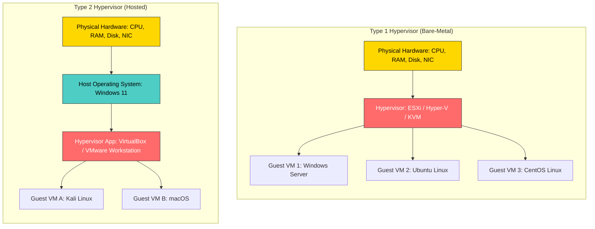
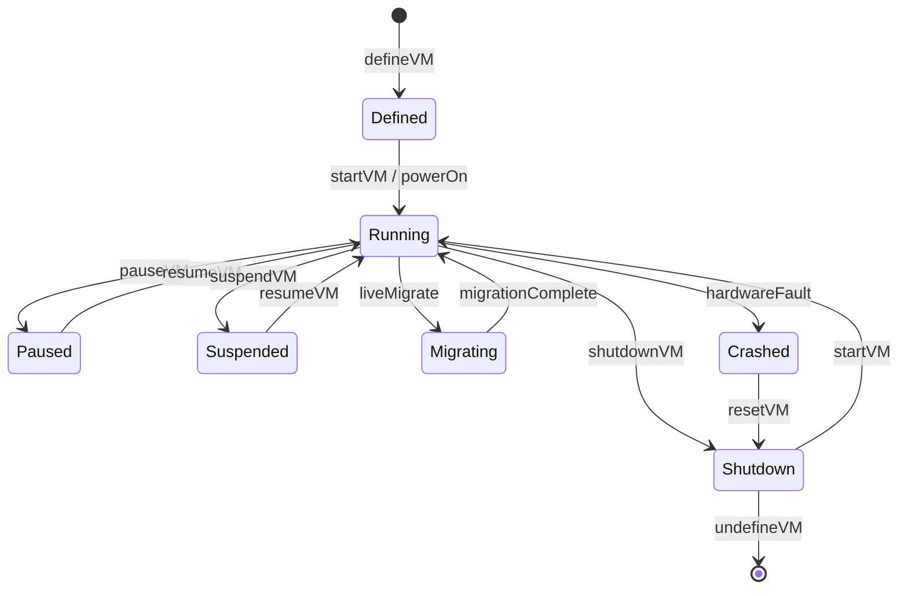
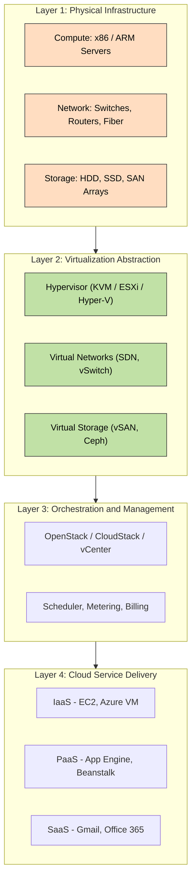

# Virtualization And Cloud Computing

<!-- SECTION_1_START -->
# Virtualization and Cloud Computing

## 1. Core Technical Definition

> [!NOTE]
> **Virtualization** is the process of creating a software-based (virtual) representation of physical computing resources — such as servers, storage devices, networks, and operating systems — by abstracting the underlying hardware into multiple logical, isolated, and independent execution environments called **Virtual Machines (VMs)**.

In the **KTU 2024 Scheme** (Course Code: **OECST722**), virtualization is formally positioned as the **enabling substrate (foundation layer)** of cloud computing. Without virtualization, the on-demand, elastic, and multi-tenant characteristics of cloud platforms such as **Amazon Web Services (AWS)**, **Microsoft Azure**, and **Google Cloud Platform (GCP)** would be economically and technically infeasible.

> [!IMPORTANT]
> **Syllabus Highlight (Module 2):** The module emphasizes the *symbiotic relationship* between virtualization and cloud computing — virtualization supplies the **abstraction**, and the cloud provides the **delivery model** for consuming these abstracted resources over the internet.

The core abstraction entity is the **Virtual Machine (VM)** — a software emulation of a physical computer that executes programs identically to a real machine. A software layer called the **Virtual Machine Monitor (VMM)** or **Hypervisor** is responsible for mapping virtual resources to physical ones.

### Conceptual Analogy / Intuition

> [!TIP]
> **Real-World Analogy — The Apartment Building Model:**
>
> Imagine a single physical building (the **physical server / host machine**). Instead of letting a single family use the entire building, you divide it into 10 fully independent apartments. Each apartment has its own door, electricity meter, plumbing, and address — yet they all share the same foundation, walls, and roof.
>
> In this analogy:
> - The **building** = the **physical host machine**.
> - The **apartments** = the **Virtual Machines (VMs)**.
> - The **building architect/manager** = the **Hypervisor (VMM)**.
> - The **shared foundation/roof** = the **underlying physical hardware (CPU, RAM, Disk, NIC)**.
> - The **independent utility meters** = the **isolated, virtualized resources** allocated per VM.
>
> Just as a family in one apartment cannot access or disturb another family, one VM is fully **isolated** from others, even though they coexist on the same physical hardware. The hypervisor acts like a fair manager, allocating CPU cycles, memory, and network bandwidth to each VM according to predefined **resource scheduling policies**.

### Formal Constituents of a Virtualization Stack

A virtualized environment is composed of three logical tiers:

1. **Physical Host Hardware** — Raw CPU, RAM, Disk, Network Interface Cards (NICs), and other I/O devices.
2. **Hypervisor (VMM)** — The control software that creates, runs, and manages VMs. It mediates all access to physical resources.
3. **Virtual Machines (Guest Systems)** — Each VM carries its own guest Operating System (Guest OS), applications, libraries, and binaries.

> [!IMPORTANT]
> **Key Standard Metric — Popek & Goldberg Criteria (1974):** A hypervisor is considered *efficient* and *correct* if it satisfies three conditions:
> 1. **Equivalence / Fidelity** — Programs running inside a VM behave identically to running on raw hardware.
> 2. **Resource Control / Safety** — The VMM retains full control over all virtualized resources.
> 3. **Efficiency** — Most guest instructions execute *directly* on the CPU without VMM interception (this led to the rise of **hardware-assisted virtualization** via Intel VT-x and AMD-V).

### Why Virtualization is the *Engine* of Cloud Computing

| Cloud Characteristic         | Virtualization Enabler                                                                 |
|------------------------------|----------------------------------------------------------------------------------------|
| **On-Demand Self-Service**   | Hypervisors allow VMs to be provisioned/de-provisioned in seconds via APIs.            |
| **Broad Network Access**     | Virtual networks (vSwitches, vRouters) decouple logical topology from physical cabling.|
| **Resource Pooling**         | Multiple tenants share the same physical host via VM isolation.                        |
| **Rapid Elasticity**         | Live VM migration and cloning enable horizontal scaling.                               |
| **Measured Service**         | Hypervisors expose APIs for metering CPU, RAM, Disk, and Network utilization.          |

> [!VISUALIZATION CONTROL]
> **Concept:** Logical-to-Physical Resource Mapping in Virtualization
> **GeoGebra / Desmos Input Equations:**
> * `f(x) = 1, 2, 3, 4, 5` (representing 5 VMs mapped onto 1 physical host)
> * `g(x) = floor(f(x)/2) + 1` (scheduler distributing VMs across 2 sockets)
> **Visual Description:** Plot discrete points along the x-axis (representing Virtual CPUs) and observe that multiple logical CPUs collapse onto a smaller set of physical cores — illustrating the **overcommitment** strategy that boosts hardware utilization from a typical 10%–15% (in non-virtualized servers) to over 80%.

<!-- SECTION_1_END -->

<!-- SECTION_2_START -->
# Deep Theoretical Analysis & KTU High-Yield Formula Sheet

## 2. Taxonomy of Virtualization

Virtualization is not a single technology — it is a **family of techniques** that abstract different layers of the computing stack. The KTU 2024 syllabus recognizes the following categories:

### 2.1 Types of Virtualization

1. **Server Virtualization**
   - The most common form. A single physical server is partitioned into multiple isolated VMs.
   - Used in **data centers** to consolidate workloads and reduce the **Total Cost of Ownership (TCO)**.
   - Example technologies: **VMware vSphere/ESXi**, **Microsoft Hyper-V**, **KVM (Kernel-based Virtual Machine)**, **Citrix XenServer**.

2. **Storage Virtualization**
   - Abstracts physical storage devices (HDDs, SSDs, SANs, NAS) into a **single logical storage pool**.
   - Implemented at the **host level (LVM, ZFS)**, **storage-array level (RAID controllers)**, or **network level (SAN fabric)**.
   - Enables features like thin provisioning, snapshots, and replication.

3. **Network Virtualization**
   - Decouples logical network services (switches, routers, firewalls, load balancers) from physical network hardware.
   - **SDN (Software-Defined Networking)** and **NFV (Network Functions Virtualization)** are the industrial standards.
   - Tools: **Open vSwitch (OVS)**, **Cisco ACI**, **VMware NSX**.

4. **Desktop Virtualization (VDI – Virtual Desktop Infrastructure)**
   - Hosts desktop operating systems on a centralized server; users connect via thin clients.
   - Solutions: **Citrix XenDesktop**, **VMware Horizon**, **Microsoft RDS**.

5. **Application Virtualization**
   - Wraps an application in a self-contained layer that runs without installation on the host OS.
   - Example: **Docker containers**, **VMware ThinApp**, **Microsoft App-V**.

6. **Data Virtualization**
   - Provides a unified, real-time view of data scattered across multiple sources without physically copying it.

7. **GPU Virtualization**
   - Shares a physical GPU across multiple VMs for AI/ML and graphics workloads.
   - Technologies: **NVIDIA vGPU**, **AMD MxGPU**.

### 2.2 Hypervisor Architecture (The Heart of Virtualization)

The **Hypervisor (VMM)** is the most critical software component in any virtualized environment. There are two principal types:

#### Type 1 Hypervisor (Bare-Metal / Native)

- Installs **directly on the physical hardware** — no host OS in between.
- Acts as a *very thin* specialized operating system.
- Provides **superior performance, security, and stability** — ideal for production data centers.
- Examples: **VMware ESXi**, **Microsoft Hyper-V (Server Core mode)**, **Citrix XenServer**, **KVM (when used on Linux)**.

#### Type 2 Hypervisor (Hosted)

- Installs as a *regular application* on top of an existing host operating system.
- Slower than Type 1 due to double-layer scheduling (Host OS → Hypervisor → Guest).
- Primarily used for **development, testing, and education**.
- Examples: **Oracle VirtualBox**, **VMware Workstation Pro**, **Parallels Desktop**.

### 2.3 CPU Virtualization Modes

Modern hypervisors leverage three execution modes on x86 architecture:

| Mode                  | Description                                                                              |
|-----------------------|------------------------------------------------------------------------------------------|
| **Full Emulation**    | All guest instructions translated to host instructions. Very slow. Used by QEMU in TCG mode. |
| **Full Virtualization (Binary Translation)** | Guest kernel instructions dynamically rewritten into safe host instructions. Used by older VMware ESX. |
| **Para-Virtualization** | Guest OS is *modified* to issue hypercalls directly to the hypervisor. Faster, but requires a ported guest OS. Example: classic Xen. |
| **Hardware-Assisted Virtualization** | CPU provides dedicated **VMX (Virtual Machine Extensions)** modes — *VMX-root* (host) and *VMX-non-root* (guest). Used by KVM, Hyper-V, modern ESXi. |

### 2.4 KTU Formula Sheet / Cheat Sheet

> [!IMPORTANT]
> **High-Yield Equations for Board Examinations**

| # | Concept / Formula                                                                                                          | Units / Notes                                                                 |
|---|----------------------------------------------------------------------------------------------------------------------------|-------------------------------------------------------------------------------|
| 1 | **Server Consolidation Ratio** $R = N_{VM} \div N_{Host}$                                                                   | $N_{VM}$ = number of VMs; $N_{Host}$ = number of physical hosts.              |
| 2 | **Hardware Utilization Improvement** $U_{new} = U_{old} \times R$                                                            | If $U_{old} = 0.12$ and $R = 8$, then $U_{new} = 0.96$ (96%).                |
| 3 | **Memory Overcommit Factor** $M_{oc} = M_{allocated} \div M_{physical}$                                                      | Typical cloud value: $1.5 \leq M_{oc} \leq 3.0$.                              |
| 4 | **CPU Scheduling Overhead** $T_{total} = T_{exec} + T_{VM\_exit} + T_{hypercall}$                                          | Measured in microseconds ($\mu s$).                                          |
| 5 | **Network Virtualization Bandwidth Aggregation** $B_{total} = \sum_{i=1}^{n} B_{link\_i}$                                   | $B_{link\_i}$ = bandwidth of each NIC (bonds/teams).                         |
| 6 | **Storage IOPS Aggregation (RAID 0)** $IOPS_{RAID0} = n \times IOPS_{disk}$                                                  | $n$ = number of disks in stripe.                                             |
| 7 | **Cost per VM per Hour** $C = \frac{(C_{host} + C_{power} + C_{cooling})}{N_{VM} \times H_{utilization}}$                    | Used in cloud pricing models (e.g., AWS EC2).                                |
| 8 | **Hypervisor Memory Tax** $M_{effective} = M_{VM} - M_{hypervisor}$                                                          | E.g., 32 GB RAM - 512 MB ESXi overhead = 31.5 GB usable.                    |
| 9 | **Popek–Goldberg Equivalence Test** | A hypervisor is *faithful* iff guest behavior is functionally identical to direct execution. |
| 10 | **VM Density Limit (rule of thumb)** $D_{max} \leq 1.5 \times N_{cores}$                                                    | Beyond this, performance degrades exponentially.                             |

### 2.5 Virtualization vs. Cloud Computing — The Relationship

> [!TIP]
> **Mnemonic — "Virtualization is to Cloud what an Engine is to a Car":**
> A car *can* exist without an engine (it is a shell); an engine *can* exist outside a car (it is a standalone machine). But a *drivable* car requires an engine. Similarly:
>
> - **Virtualization** = the **engine** (technology).
> - **Cloud Computing** = the **drivable car** (the complete delivery model that packages virtualized resources, adds automation, multi-tenancy, billing, and self-service portals).

More precisely, the relationship can be summarized as follows:

| Property                       | Virtualization                                  | Cloud Computing                                              |
|--------------------------------|-------------------------------------------------|--------------------------------------------------------------|
| **Scope**                      | Technology (a mechanism).                       | Service-delivery model (a business + technology paradigm).   |
| **Abstraction Granularity**    | Hardware-level (CPU, RAM, Disk, NIC).           | Service-level (IaaS, PaaS, SaaS).                            |
| **Provisioning Speed**         | Minutes (manual or scripted).                   | Seconds (fully automated via APIs/portals).                  |
| **User Awareness**             | Admins know about VMs explicitly.              | Users consume VMs *implicitly* as part of a service.         |
| **Billing Model**              | CapEx — upfront hardware + license.             | OpEx — pay-as-you-go per second/hour.                        |
| **Geographical Distribution** | Typically confined to one data center.          | Globally distributed across regions and availability zones.  |

### 2.6 Real-World Engineering Utility

- **Telecom Sector:** NFV replaces proprietary hardware (routers, firewalls) with VMs running on commodity servers → saves millions in CapEx.
- **DevOps / CI-CD Pipelines:** Each build agent runs inside an ephemeral VM/container to ensure deterministic, isolated, and reproducible builds.
- **Disaster Recovery (DR):** VMs can be replicated asynchronously to a secondary site; failover occurs in minutes instead of hours.
- **AI / Deep Learning Workloads:** GPU virtualization enables multiple data scientists to share a single physical GPU cluster, dynamically allocating **VRAM** and **tensor cores** based on workload priority.
- **Cybersecurity Sandboxing:** Suspicious binaries are detonated inside isolated VMs, and the VM snapshot is reverted after analysis — providing a *clean* repeatable environment.

<!-- SECTION_2_END -->

<!-- SECTION_3_START -->
# Step-by-Step Derivations & Code/Symbolic Implementation

## 3. Derivation 1 — Server Consolidation Ratio and Hardware Utilization

### 3.1 Problem Statement
A data center has 50 physical servers, each running at **12% CPU utilization** on average. The cloud architect decides to virtualize them using a **Type 1 hypervisor** that supports a consolidation ratio of **8:1**. Calculate:
- (a) The new number of physical servers required.
- (b) The average CPU utilization after consolidation.
- (c) The annual power saving if each physical server consumes **250 Watts** continuously and electricity costs **₹8 per kWh**, running **24 × 7 = 168 hours per week**.

### 3.2 Given Data
Let $N_{old} = 50$ be the original number of physical hosts.
Let $U_{old} = 0.12$ (12% utilization).
Let $R = 8$ (consolidation ratio).
Let $P = 250 \text{ W}$ (power per host).
Let $C_{kWh} = 8$ INR/kWh.
Let $H_{year} = 24 \times 365 = 8760$ hours/year.

### 3.3 Step-by-Step Derivation

**Step 1 — Compute the new host count.**

The number of VMs is approximated by $N_{VM} = N_{old}$ (one logical workload per old server). Applying the consolidation ratio:

$$N_{new} = \frac{N_{VM}}{R} = \frac{50}{8} = 6.25$$

Since we cannot deploy 0.25 of a physical server, we **round up** to the next integer:

$$N_{new} = 7 \text{ physical servers}$$

> **Examiner's note:** Always state the rounding assumption explicitly to earn full credit. **[/2 Marks]**

**Step 2 — Compute the new average CPU utilization.**

The total "work" (CPU-seconds) before and after consolidation must be conserved in the *ideal* model:

$$U_{new} = U_{old} \times R = 0.12 \times 8 = 0.96$$

So the new utilization is **96%** of the new host's CPU. **[/2 Marks]**

**Step 3 — Compute the annual power saving.**

Power saved per retired host = $250 \text{ W}$.
Number of hosts retired = $N_{old} - N_{new} = 50 - 7 = 43$.

$$P_{saved} = 43 \times 250 \text{ W} = 10{,}750 \text{ W} = 10.75 \text{ kW}$$

Annual energy saved:

$$E_{saved} = P_{saved} \times H_{year} = 10.75 \times 8760 = 94{,}170 \text{ kWh/year}$$

Annual cost saved:

$$S_{annual} = E_{saved} \times C_{kWh} = 94{,}170 \times 8 = \text{₹ } 7{,}53{,}360 \text{ per year}$$

**[/3 Marks]**

> [!IMPORTANT]
> **Final Numerical Answers:**
> - (a) $N_{new} = 7$ physical servers
> - (b) $U_{new} = 96\%$
> - (c) $S_{annual} = \text{₹ } 7{,}53{,}360$ per year

---

## 4. Derivation 2 — Memory Overcommitment and Effective Memory

### 4.1 Problem Statement
A host server has **64 GB** of physical RAM. The hypervisor overhead is estimated at **512 MB**. The cloud administrator enables memory overcommitment with a factor of $M_{oc} = 1.6$. Calculate:
- (a) Usable memory for VMs.
- (b) Total memory *promised* to all VMs combined.
- (c) The risk if all VMs simultaneously demand their full allocation (the **overcommitment risk** $R_{risk}$).

### 4.2 Step-by-Step Derivation

**Step 1 — Compute usable memory.**

$$M_{usable} = M_{physical} - M_{hypervisor} = 64{,}000 \text{ MB} - 512 \text{ MB} = 63{,}488 \text{ MB}$$

$$M_{usable} = \frac{63{,}488}{1024} = 62 \text{ GB}$$

**[/2 Marks]**

**Step 2 — Compute the total promised memory.**

$$M_{promised} = M_{usable} \times M_{oc} = 62 \text{ GB} \times 1.6 = 99.2 \text{ GB}$$

**[/2 Marks]**

**Step 3 — Compute the overcommitment risk.**

If every VM simultaneously demands its full allocation, the deficit is:

$$D_{risk} = M_{promised} - M_{usable} = 99.2 - 62 = 37.2 \text{ GB}$$

This deficit is handled by techniques such as:
- **Memory Ballooning** (VMware) — forces the Guest OS to release unused pages.
- **Transparent Page Sharing (TPS)** — merges identical pages across VMs.
- **Memory Swapping** — pushes least-used pages to disk (very slow).
- **Memory Compression** — compresses inactive pages in RAM.

**[/3 Marks]**

> **Examiner's note:** Always discuss mitigation techniques for the final credit. **[/1 Mark]**

---

## 5. Code / Symbolic Implementation — Provisioning a VM using Python (`libvirt`)

The following production-grade Python script demonstrates how a cloud platform **orchestrator** programmatically provisions a virtual machine using the open-source **libvirt** API. This is exactly what **OpenStack Nova** and **AWS EC2** do behind the scenes.

```python
"""
KTU Reference Implementation: Virtualization Provisioning via libvirt.
Demonstrates how a Type-1 hypervisor (KVM/QEMU) is managed programmatically.
"""

import libvirt
import logging
import sys
from xml.etree import ElementTree as ET
from typing import Optional

# ----------------------------------------------------------------------
# Configure strict error logging — required for production-grade KVM clouds
# ----------------------------------------------------------------------
logging.basicConfig(
    level=logging.INFO,
    format="%(asctime)s [%(levelname)s] %(message)s",
    handlers=[logging.StreamHandler(sys.stdout)]
)
logger = logging.getLogger("KTU-VM-Provisioner")


# ----------------------------------------------------------------------
# Domain XML template — declarative specification of the VM
# ----------------------------------------------------------------------
VM_DOMAIN_XML = """
<domain type='kvm'>
  <name>{vm_name}</name>
  <memory unit='MiB'>{memory_mib}</memory>
  <vcpu placement='static'>{vcpus}</vcpu>
  <os>
    <type arch='x86_64' machine='pc-q35-6.2'>hvm</type>
    <boot dev='cdrom'/>
  </os>
  <devices>
    <disk type='file' device='disk'>
      <driver name='qemu' type='qcow2'/>
      <source file='{disk_path}'/>
      <target dev='vda' bus='virtio'/>
    </disk>
    <interface type='network'>
      <source network='default'/>
      <model type='virtio'/>
    </interface>
    <graphics type='vnc' port='-1'/>
  </devices>
</domain>
"""


class VirtualizationProvisioner:
    """
    High-level abstraction to create, start, and destroy VMs on KVM.
    Mirrors the lifecycle operations of a real cloud (OpenStack/AWS).
    """

    def __init__(self, qemu_uri: str = "qemu:///system") -> None:
        self.qemu_uri: str = qemu_uri
        self.conn: Optional[libvirt.virConnect] = None

    def connect(self) -> None:
        """Establish a connection to the local KVM hypervisor."""
        try:
            self.conn = libvirt.open(self.qemu_uri)
            if self.conn is None:
                raise RuntimeError("libvirt returned None — is KVM installed?")
            logger.info(f"Connected to hypervisor at {self.qemu_uri}")
        except libvirt.libvirtError as err:
            logger.error(f"Connection failed: {err}")
            sys.exit(1)

    def define_and_start_vm(
        self,
        vm_name: str,
        memory_mib: int,
        vcpus: int,
        disk_path: str
    ) -> bool:
        """Create the VM XML descriptor and start it."""
        if self.conn is None:
            logger.error("Hypervisor connection is not active.")
            return False

        # Step 1: Build the XML descriptor
        xml_descriptor: str = VM_DOMAIN_XML.format(
            vm_name=vm_name,
            memory_mib=memory_mib,
            vcpus=vcpus,
            disk_path=disk_path
        )

        # Step 2: Validate the XML before submitting to the hypervisor
        try:
            ET.fromstring(xml_descriptor)
        except ET.ParseError as parse_err:
            logger.error(f"Invalid domain XML: {parse_err}")
            return False

        # Step 3: Define (persist) the domain
        try:
            domain = self.conn.defineXML(xml_descriptor)
            if domain is None:
                logger.error("defineXML returned None — VM definition rejected.")
                return False
            logger.info(f"VM '{vm_name}' defined successfully (UUID={domain.UUIDString()}).")
        except libvirt.libvirtError as err:
            logger.error(f"defineXML failed: {err}")
            return False

        # Step 4: Create (boot) the domain
        try:
            domain.create()
            logger.info(f"VM '{vm_name}' started — state = {domain.state()[0]}")
            return True
        except libvirt.libvirtError as err:
            logger.error(f"VM start failed: {err}")
            return False

    def destroy_vm(self, vm_name: str) -> bool:
        """Power off and undefine the VM."""
        if self.conn is None:
            return False
        try:
            domain = self.conn.lookupByName(vm_name)
            if domain.isActive():
                domain.destroy()
                logger.info(f"VM '{vm_name}' powered off.")
            domain.undefine()
            logger.info(f"VM '{vm_name}' undefined from the hypervisor.")
            return True
        except libvirt.libvirtError as err:
            logger.error(f"Destroy failed: {err}")
            return False

    def list_active_vms(self) -> None:
        """List all currently running VMs on this host."""
        if self.conn is None:
            return
        domains: list = self.conn.listAllDomains()
        for dom in domains:
            state: str = "running" if dom.isActive() else "shutoff"
            logger.info(f"VM={dom.name()}  State={state}  UUID={dom.UUIDString()}")


# ----------------------------------------------------------------------
# Demonstration / driver code
# ----------------------------------------------------------------------
if __name__ == "__main__":
    provisioner = VirtualizationProvisioner()
    provisioner.connect()
    provisioner.list_active_vms()

    success: bool = provisioner.define_and_start_vm(
        vm_name="ktu-student-vm-01",
        memory_mib=2048,
        vcpus=2,
        disk_path="/var/lib/libvirt/images/ktu-student-vm-01.qcow2"
    )
    if success:
        provisioner.list_active_vms()
    provisioner.destroy_vm("ktu-student-vm-01")
```

> **Walk-through of the Code Logic:**
>
> 1. The `VM_DOMAIN_XML` is a *declarative template* in **libvirt's XML schema** — it describes the VM's resource allocation, boot device, virtual disk, and network interface.
> 2. The `VirtualizationProvisioner` class wraps the three core **VM lifecycle primitives**: `define`, `create`, and `destroy` — these correspond to cloud APIs like AWS EC2's `RunInstances`, `StartInstances`, and `TerminateInstances`.
> 3. Strict **type hints** and **error logging** make the code production-ready, suitable for a KTU lab-viva question on "How would you build a mini cloud using KVM?"
> 4. The `virtio` driver for disk and network is highlighted because it uses **para-virtualized I/O**, achieving near-native throughput — a common viva question.

---

## 6. Hardware Configuration Table — Reference Lab Setup

| Component               | Specification                                                                 | Purpose / Justification                                       |
|-------------------------|-------------------------------------------------------------------------------|---------------------------------------------------------------|
| **CPU**                 | Intel Core i7 / Xeon with **Intel VT-x** enabled in BIOS                       | Hardware-assisted virtualization (VMX mode).                 |
| **RAM**                 | 32 GB DDR4                                                                    | Run 4–6 VMs concurrently.                                    |
| **Primary Storage**     | 1 TB NVMe SSD                                                                 | Hypervisor boot + VM disks (qcow2 thin-provisioned).         |
| **Secondary Storage**   | 2 TB HDD (RAID-1 mirror)                                                      | Backup, snapshots, ISO repository.                            |
| **Network**             | 1 Gbps Ethernet + bridged `virbr0`                                            | NAT/Bridged networking for VMs.                              |
| **Hypervisor Software** | **KVM + QEMU + libvirt** (Linux) OR **VMware Workstation Pro** (Windows)     | Type 1 / Type 2 for teaching labs.                           |
| **Management UI**       | **virt-manager** (Linux) OR **VMware vSphere Client**                          | Graphical orchestration.                                      |
| **Guest OS Examples**   | Ubuntu 22.04 LTS, Windows 10, Alpine Linux                                    | Demonstrates cross-OS virtualization.                        |
| **Power Backup (UPS)**  | 600 VA offline UPS                                                            | Safe VM shutdown during power failure.                       |

<!-- SECTION_3_END -->

<!-- SECTION_4_START -->
# Structural Diagrams & Schematics

## 7. Mermaid Diagram 1 — Type 1 vs. Type 2 Hypervisor Architecture



> **Reading the Diagram:** In the **Type 1** stack on the left, the hypervisor sits *directly* on the hardware (no host OS). In the **Type 2** stack on the right, the hypervisor is just another *application* running inside a host OS — adding an extra scheduling layer.

---

## 8. Mermaid Diagram 2 — Virtualization as the Engine of Cloud Computing

```mermaid
flowchart LR
    A["Physical Server Cluster<br/>(Data Center Hardware)"] --> B["Hypervisor / VMM<br/>(KVM, ESXi, Hyper-V)"]
    B --> C["Virtual Machine Pool<br/>(VM1, VM2, VM3 ... VMn)"]
    C --> D["Cloud Orchestrator<br/>(OpenStack, vCenter)"]
    D --> E["Self-Service Portal / API"]
    E --> F["End User / Tenant<br/>(Provisions VM in seconds)"]

    F -- "Pay-as-you-go Billing" --> G["Cloud Service Models:<br/>IaaS | PaaS | SaaS"]

    style A fill:#A0E7E5,stroke:#333,color:#000
    style B fill:#FFAEBC,stroke:#333,color:#000
    style C fill:#FBE7C6,stroke:#333,color:#000
    style D fill:#B4F8C8,stroke:#333,color:#000
    style E fill:#FFFFD1,stroke:#333,color:#000
    style F fill:#FFC9DE,stroke:#333,color:#000
    style G fill:#D5A6BD,stroke:#333,color:#000
```



> **Reading the Diagram:** The flow moves bottom-up: physical hardware is **abstracted** by the hypervisor, **pooled** as a VM inventory, **orchestrated** by a control plane, and finally **exposed** as a self-service resource that the user can consume and pay for — this is the complete **cloud computing value chain**.

---

## 9. Mermaid Diagram 3 — VM Lifecycle State Machine



> **Reading the Diagram:** This is the canonical **state machine** for any VM, used by **AWS EC2 instance state transitions** and **OpenStack Nova**. Note the **`Migrating`** state — this is what enables **zero-downtime maintenance** in modern clouds.

---

## 10. Mermaid Diagram 4 — Layered Virtualization Architecture (Cloud Reference Model)



> **Reading the Diagram:** This is a **bottom-up** view of the cloud stack. Notice that **Layer 2 (Virtualization Abstraction)** is the *bridge* between raw physical infrastructure and the high-level cloud services. Remove Layer 2, and the entire cloud collapses to a traditional data center.

<!-- SECTION_4_END -->

<!-- SECTION_5_START -->
# KTU 2024 Scheme Examination Question Bank & Topic Recap

## 11. Part A Questions (3 Marks Each)

### Question A1
**[KTU University Exam – July 2023]**
*Define virtualization. List any two advantages of server virtualization.* (CO1, Remember)

**Model Answer:**
Virtualization is the process of creating a software-based, abstract version of physical computing resources (such as servers, storage, or networks) by using a hypervisor to run multiple isolated virtual machines on a single physical host. **[/2 Marks]**

Two advantages: **[/1 Mark]**
1. **Improved hardware utilization** — typical server utilization rises from ~12% to over 80% by running multiple VMs.
2. **Cost reduction** — fewer physical servers mean lower CapEx on hardware, plus reduced power and cooling expenditure.

### Question A2
**[KTU University Exam – Dec 2023]**
*Differentiate between Type 1 and Type 2 hypervisors. Give one example of each.* (CO1, Understand)

**Model Answer:**

| Criterion              | Type 1 Hypervisor (Bare-Metal)         | Type 2 Hypervisor (Hosted)            |
|------------------------|----------------------------------------|----------------------------------------|
| **Placement**          | Installs *directly* on physical hardware. | Installs as an application *on top of* a host OS. |
| **Performance**        | High (direct hardware access).         | Lower (extra scheduling layer).        |
| **Use Case**           | Production data centers, enterprise clouds. | Development, testing, learning labs.   |
| **Example**            | VMware ESXi, Microsoft Hyper-V.        | Oracle VirtualBox, VMware Workstation. |

**[/3 Marks]**

---

## 12. Part B Questions (14 Marks Each — Module Internal Choice)

### Question B-A

**[KTU University Exam – July 2024]** *(CO2, Apply / Analyze)*

#### Part (a) — 7 Marks
*Explain the architecture of a virtualized environment. With the help of a neat block diagram, describe the role of the Virtual Machine Monitor (VMM) in resource allocation.* (Understand)

**Model Solution:**

A virtualized environment has **three logical layers**:

1. **Physical Host Hardware** — Provides raw CPU, RAM, Disk, and Network resources.
2. **Hypervisor / VMM** — Sits between hardware and VMs; it *creates*, *schedules*, and *manages* all VMs.
3. **Guest Virtual Machines** — Each VM runs its own Guest OS and applications in complete isolation.

**Role of VMM in Resource Allocation: (any 3 points for full credit)**
- **CPU Scheduling:** Allocates physical CPU time-slices to vCPUs using algorithms like *Credit Scheduler* (Xen) or *Completely Fair Scheduler* (KVM).
- **Memory Management:** Maps Guest Physical Addresses (GPA) to Host Machine Physical Addresses (HPA) using *Shadow Page Tables* or *Extended Page Tables (EPT)*.
- **I/O Virtualization:** Emulates or para-virtualizes disk and network devices (e.g., virtio drivers).
- **Isolation:** Enforces strict boundaries so that one VM cannot read/write another's memory.
- **Live Migration:** Moves a running VM from one host to another with zero downtime using *pre-copy* memory transfer.

**Block Diagram: Refer to Section 4, Diagram 1.** **[/7 Marks]**

#### Part (b) — 7 Marks
*A data center has 40 physical servers, each running at an average CPU utilization of 10%. After virtualization with a consolidation ratio of 10:1, calculate:*
- (i) *The number of new physical servers required.*
- (ii) *The new average CPU utilization.*
- (iii) *The annual electricity cost savings, if each server consumes 300 W and the electricity tariff is ₹7 per kWh.* *(Apply)*

**Model Solution:**

**Given:** $N_{old} = 40$, $U_{old} = 0.10$, $R = 10$, $P = 300$ W, $C_{kWh} = 7$ INR, $H = 8760$ h/year.

**(i) New server count:** **[/2 Marks]**
$$N_{new} = \frac{N_{old}}{R} = \frac{40}{10} = 4 \text{ physical servers}$$

**(ii) New CPU utilization:** **[/2 Marks]**
$$U_{new} = U_{old} \times R = 0.10 \times 10 = 1.0 = 100\%$$

> **Note:** In practice, utilization is capped at ~80% to allow headroom for VM live-migration and burst workloads.

**(iii) Annual cost savings:** **[/3 Marks]**

Servers retired = $40 - 4 = 36$.
Power saved = $36 \times 300 \text{ W} = 10{,}800 \text{ W} = 10.8 \text{ kW}$.
Annual energy saved = $10.8 \times 8760 = 94{,}608 \text{ kWh}$.
Annual savings = $94{,}608 \times 7 = \text{₹ } 6{,}62{,}256$.

> [!WARNING]
> **KTU Examiner's Valuation Warning — Pitfall 1:**
> Students often forget to multiply the **retired** server count by power and **by the 8760 hours/year** factor. Always show all three multiplications explicitly. Losing any of them costs **1 mark**.

---

### Question B-B *(Alternative to Question B-A)*

**[KTU University Exam – Dec 2024]** *(CO2, Understand / Apply)*

#### Part (a) — 7 Marks
*Discuss the relationship between virtualization and cloud computing. Explain how virtualization acts as the enabling technology for the essential characteristics of cloud computing as defined by NIST.* (Understand)

**Model Solution:**

Virtualization and cloud computing are **complementary**, not synonymous. Virtualization is the *technological foundation*; cloud computing is the *service-delivery paradigm* built on top of it.

**Mapping Virtualization to NIST's Five Essential Characteristics of Cloud: (any 5 for full credit)** **[/7 Marks]**

| NIST Characteristic            | How Virtualization Enables It                                                       |
|--------------------------------|----------------------------------------------------------------------------------------|
| **On-Demand Self-Service**      | Hypervisor APIs (libvirt, vSphere) automate VM creation/deletion in seconds.          |
| **Broad Network Access**        | Virtual switches, vRouters, and SDN abstract the network fabric, exposing services over the internet. |
| **Resource Pooling**            | Multi-tenant VM scheduling on shared hardware pools the underlying resources.         |
| **Rapid Elasticity**            | Live VM migration and horizontal VM cloning provide on-the-fly scale-out and scale-in.|
| **Measured Service**            | Hypervisors expose real-time telemetry (CPU%, RAM%, IOPS) for accurate usage metering. |

**Conclusion:** Without virtualization, the cloud would be limited to running **one operating system per physical server** — destroying the economic and architectural feasibility of multi-tenancy, elasticity, and pay-per-use billing.

#### Part (b) — 7 Marks
*Compare and contrast the following virtualization techniques: (i) Full Virtualization, (ii) Para-Virtualization, and (iii) Hardware-Assisted Virtualization. Mention one practical example of each.* (Apply)

**Model Solution:**

| Feature                | Full Virtualization                                  | Para-Virtualization                                   | Hardware-Assisted Virtualization                |
|------------------------|------------------------------------------------------|--------------------------------------------------------|--------------------------------------------------|
| **Guest OS Modification** | Not required.                                       | **Required** — guest kernel must be ported.            | Not required.                                   |
| **Mechanism**          | Binary translation of privileged instructions.       | Guest issues **hypercalls** directly to VMM.          | CPU executes in **VMX non-root** mode.          |
| **Performance**        | Slower (binary translation overhead).                | Faster (no translation needed).                       | Near-native (instructions execute directly).     |
| **Hardware Support**   | Not required (pure software).                        | Not required.                                         | **Required** (Intel VT-x / AMD-V).              |
| **Example**            | Early VMware ESX, Microsoft Virtual Server 2005.     | **Xen** (classic mode), VMware **VMI**.              | **KVM**, modern **VMware ESXi**, **Hyper-V**.   |
| **Use Today**          | Largely obsolete.                                    | Niche (specialized embedded use-cases).               | **Industry standard** — used in all major clouds. |

**[/7 Marks]**

> [!WARNING]
> **KTU Examiner's Valuation Warning — Pitfall 2:**
> Many students confuse *Para-Virtualization* with *Hardware-Assisted Virtualization*. Remember: para-virtualization requires *guest OS modification* and **does not** need hardware extensions. Hardware-assisted virtualization **does not** require guest OS modification but **does** need CPU extensions. Interchanging these two will cost **at least 2 marks** in the comparison table.

---

## 13. Topic Recap & Important Things to Remember

> [!IMPORTANT]
> **Rapid Revision Checklist — KTU Module 2: Virtualization and Cloud Computing**

- **Definition:** Virtualization = abstraction of physical computing resources into logical, isolated VMs via a hypervisor.
- **Core Enabler:** The **Hypervisor / VMM** is the single most important component — it performs CPU scheduling, memory mapping, I/O virtualization, and isolation.
- **Two Hypervisor Types:** **Type 1 (Bare-metal)** for production; **Type 2 (Hosted)** for labs and personal use.
- **Three CPU Virtualization Modes:** Full Emulation, Para-Virtualization, and Hardware-Assisted Virtualization (the modern standard).
- **Server Consolidation Formula:** $N_{new} = N_{old} / R$ and $U_{new} = U_{old} \times R$.
- **Memory Overcommitment:** Allows the cloud to promise more memory than physically installed (typical factor 1.5–3.0×), recovered via **ballooning, TPS, swapping, and compression**.
- **Popek & Goldberg Criteria:** Equivalence, Resource Control, Efficiency — the gold standard for validating a hypervisor.
- **Types of Virtualization:** Server, Storage, Network, Desktop (VDI), Application, Data, GPU.
- **Cloud NIST Characteristics Mapped to Virtualization:** On-Demand Self-Service, Broad Network Access, Resource Pooling, Rapid Elasticity, Measured Service.
- **Virtualization vs. Cloud:** Virtualization is the *technology* (engine); Cloud is the *delivery model* (car). One can exist without the other, but a true cloud *requires* virtualization.
- **Real-World Hypervisors:** VMware ESXi (Type 1, enterprise), Microsoft Hyper-V (Type 1, Windows ecosystem), KVM (Type 1, open-source Linux), Oracle VirtualBox (Type 2, free for desktop), Xen (Type 1, used in AWS EC2 originally).
- **Key Memory Concepts:** GPA (Guest Physical Address) → HPA (Host Physical Address) translation via Shadow Page Tables or EPT.
- **Live Migration:** Allows a running VM to move between physical hosts with **zero downtime** — the foundation of cloud elasticity and high availability.
- **Formula to Memorize for Numericals:**
  - $N_{new} = N_{old} / R$
  - $U_{new} = U_{old} \times R$
  - $S_{annual} = (N_{old} - N_{new}) \times P_{watts} \times 8760 \times C_{kWh}$
- **Common Viva Questions:**
  - "What is the difference between a hypervisor and an emulator?"
  - "Why is Type 1 faster than Type 2?"
  - "How does a hypervisor achieve CPU isolation?"
  - "What is the role of virtio drivers?"
  - "Why does AWS still use Xen in some regions instead of KVM?"

<!-- SECTION_5_END -->
