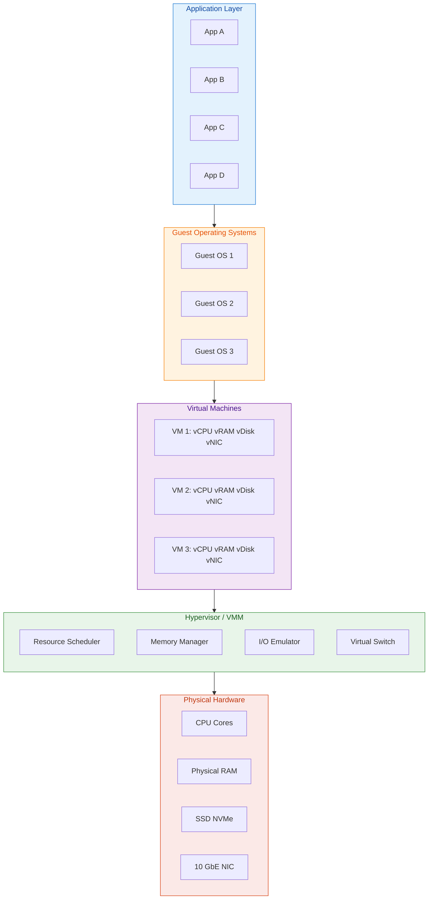
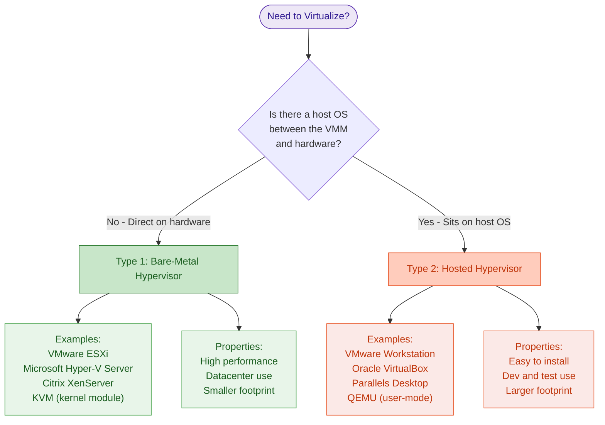
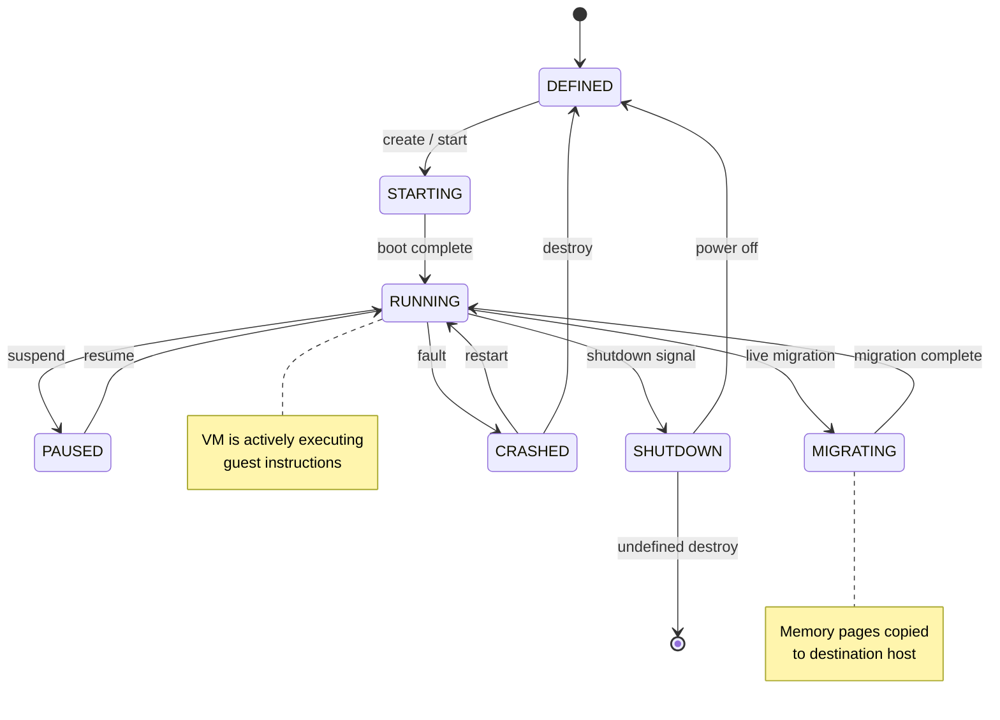
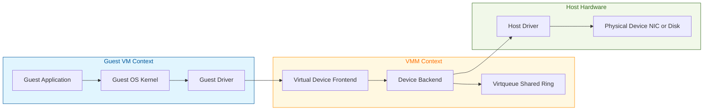

# Virtualization - Foundations

<!-- SECTION_1_START -->
# Virtualization — Foundations

## 1.1 Formal Academic Definition (KTU 2024 Syllabus Terminology)

**Virtualization** is the abstraction of physical computing resources (CPU, memory, storage, and networking) from their physical hardware constraints through a software-defined layer, allowing multiple operating environments to share the same underlying physical infrastructure concurrently while maintaining strong isolation boundaries.

In the context of the **APJ Abdul Kalam Technological University (KTU) 2024 Scheme** syllabus for *OECST722 — Cloud Computing*, Module 2 defines virtualization as the *core enabling technology* upon which the entire cloud delivery model (IaaS, PaaS, SaaS) is built. The module treats it as the **logical partitioning primitive** that converts a single physical machine into multiple, independent, programmable virtual machines.

> [!IMPORTANT]
> **KTU Board Definition (verbatim-friendly):**
> "Virtualization is a technology that creates software-based (virtual) representations of physical computing resources, enabling a single physical resource to function as multiple logical resources, thereby improving scalability, utilization, and portability of compute infrastructure."

---

## 1.2 Conceptual Analogy — The "Apartment Building" Model

Imagine you own a **single, large plot of land** (the physical server). Instead of building one big house, you construct a **multi-story apartment building**. Each apartment:

* Has its **own door, kitchen, electricity meter, and water supply** (isolated OS + virtual hardware).
* Shares the **same foundation, land, and central utilities** (physical CPU, RAM, power).
* The **building architect and structural engineer** act as the *hypervisor* — they manage who gets what, ensure walls don't collapse (isolation), and re-route utilities (resource scheduling) when one apartment is empty.

**Geometric Intuition:**

| Concept | Apartment Analogy | Real KTU Equivalent |
|---|---|---|
| Physical land | Hardware (x86 server) | Bare-metal hardware |
| Building architect | Building manager | **Hypervisor / VMM** |
| Individual apartment | Self-contained unit | **Virtual Machine (VM)** |
| Tenant | Resident | End-user / application |
| Apartment rules | Lease agreement | **Isolation & SLA policies** |

> [!NOTE]
> **Why this analogy works:** It captures the three pillars the KTU board examiner expects you to mention — *partitioning* (apartments are divided), *isolation* (one tenant cannot break another's walls), and *sharing* (common infrastructure is reused).

---

## 1.3 The Three Pillars of Virtualization (Syllabus Highlight)

The KTU 2024 scheme lists three foundational properties that any virtualization solution **must** provide. Memorize these — they appear in Part A almost every semester.

1. **Partitioning** — Ability to divide a single physical resource into many smaller, independent virtual units.
2. **Isolation** — Faults, crashes, and security breaches in one VM **must not** propagate to others.
3. **Encapsulation** — A VM, including its entire software stack, is stored as a **single file** (e.g., `.vmdk`, `.vhd`, `.qcow2`) that can be copied, moved, or backed up like a normal file.

---

## 1.4 Key Metrics & Engineering Constants

| Metric | Standard Value | Relevance in Virtualization |
|---|---|---|
| **Overhead** | Typically **2%–10%** for hardware-assisted | Performance cost introduced by the VMM |
| **Hypervisor footprint (Type 1)** | $\approx$ **150 MB** | Memory consumed by bare-metal hypervisor |
| **VM density ratio** | 1 : 10 to 1 : 20 (server consolidation) | Number of VMs per physical host |
| **VM boot time** | **10 – 60 seconds** | Time from VM start to OS ready state |
| **Standard VM file formats** | `.vmdk`, `.vhd`, `.qcow2`, `.vdi` | Industry portability standards |

> [!TIP]
> If a KTU question asks *"Why is hardware-assisted virtualization faster than pure software emulation?"*, the keyword examiners look for is **VT-x / AMD-V** ring de-privileging (we will derive this formally in Section 3).

---

<!-- SECTION_1_END -->

<!-- SECTION_2_START -->
# Deep Theoretical Analysis & KTU High-Yield Formula Sheet

## 2.1 The Popek and Goldberg Virtualization Requirements (1974)

The *foundational theorem* of virtualization, published by Gerald J. Popek and Robert P. Goldberg, is still the **gold standard** the KTU board uses to test a student's understanding of *what makes a system virtualizable*. The theorem uses the concept of **privileged instructions** — CPU instructions that are only legal in a special execution mode (kernel/supervisor mode).

Let:

* $P$ = the set of all **privileged** instructions of an ISA.
* $S$ = the set of **sensitive** instructions (instructions whose behavior depends on the resource configuration or mode).
* $U$ = the set of **unprivileged** instructions.

### The Three Formal Conditions

A machine architecture is **virtualizable** if and only if:

$$
S \cap P \;\subseteq\; P
$$

That is, **every sensitive instruction is also a privileged instruction**. The corollary is that sensitive + non-privileged instructions **must not exist** in the ISA, because the hypervisor (running in privileged mode) would have no way to intercept them when a guest OS (running in user mode) executes them.

### The Three Properties Popek and Goldberg Defined

1. **Equivalence / Fidelity** — A program running inside a VM should behave *identically* to running on the bare machine (modulo timing).
2. **Efficiency / Performance** — Trivial (unprivileged) instructions should execute **directly on the hardware** without VMM intervention. A statistically significant subset of instructions must run natively.
3. **Resource Control / Safety** — The VMM must retain **full control** over all physical resources — the hypervisor must be able to revoke, reclaim, or reallocate any resource at will.

> [!NOTE]
> **Historical Exam Insight (Dec 2023 / July 2024):** Students often lose marks by forgetting the *Efficiency* property. Examiners specifically look for the phrase *"statistically significant majority of instructions execute directly on hardware."*

---

## 2.2 Architecture Classification by Popek–Goldberg

| ISA Class | Sensitive ∩ Privileged | Virtualizable in Pure Software? | Real-World Example |
|---|---|---|---|
| **Type 1 — Fully Virtualizable** | $S \cap P = P$ (clean) | ✅ Yes | **MIPS**, **ARM (modern)** |
| **Type 2 — Hybrid (Para-virtualizable)** | Some sensitive but non-privileged | ❌ No (software-only) | **Classic x86 (pre-VT)** |
| **Type 3 — Non-Virtualizable** | Sensitive & non-privileged exist | ❌ No | **Old x86** (with `POPF` problem) |

The original **x86 architecture** failed the Popek–Goldberg test because it contained 17 sensitive-but-not-privileged instructions (e.g., `SGDT`, `SIDT`, `SLDT`, `POPF`). This is why **VMware** had to invent binary translation in the late 1990s.

---

## 2.3 The Three Modes of Virtualization (KTU High-Yield Distinction)

This is the **most tested sub-topic** in Part B of Module 2.

### 2.3.1 Full Virtualization (Binary Translation / Hardware-Assisted)

* Guest OS is **unaware** it is being virtualized — no modifications required.
* Two implementation strategies:
  * **Software Binary Translation** (e.g., VMware Workstation 1.0) — sensitive instructions are translated at runtime.
  * **Hardware-Assisted** (e.g., Intel VT-x, AMD-V) — CPU provides a new privileged mode (`root mode` / `host mode`), and sensitive instructions automatically trap to the VMM.
* **Performance:** Near-native (within **2%–5%** overhead for hardware-assisted).

### 2.3.2 Para-Virtualization

* Guest OS is **aware** it is running on a hypervisor and uses **hypercalls** to communicate with it.
* Requires OS source modification (e.g., Xen, early Linux kernels).
* **Performance:** Can even exceed native in I/O-bound workloads due to simpler device model.
* **Drawback:** Not possible with closed-source OSes (Windows).

### 2.3.3 OS-Level Virtualization (Containerization)

* **No hypervisor.** The host OS kernel itself provides isolated user-space instances.
* Examples: **Linux Containers (LXC)**, **Docker**, **Solaris Zones**, **FreeBSD Jails**.
* Shares the **same kernel**; isolation is at the *process* level, not the *machine* level.
* **Performance:** Native — only marginal process-isolation overhead.

> [!WARNING]
> **Common Board Mistake:** Students often classify Docker as a "Type 2 hypervisor." It is **not**. It is OS-level virtualization. The KTU 2024 syllabus separates these into two distinct topics.

---

## 2.4 The Two Hypervisor Types (Architecture-Defining Distinction)

| Feature | **Type 1 — Bare-Metal** | **Type 2 — Hosted** |
|---|---|---|
| Runs on | **Directly on hardware** | **On top of a host OS** |
| Performance | **High** (production-grade) | Lower (good for desktops) |
| Footprint | Minimal | Larger (needs host OS) |
| Use Case | Datacenters, IaaS clouds | Development, testing, education |
| Examples | **VMware ESXi**, **Microsoft Hyper-V Core**, **Xen**, **KVM** | **VMware Workstation**, **Oracle VirtualBox**, **Parallels** |
| KTU Exam Phrase | "Native / Bare-metal VMM" | "Hosted VMM" |

---

## 2.5 KTU High-Yield Formula Sheet (Use in Every Module 2 Question)

$$
\text{CPU Overhead (\%)} \;=\; \left(1 - \frac{T_{\text{native}}}{T_{\text{VM}}}\right) \times 100
$$

$$
\text{VM Density} \;=\; \left\lfloor \frac{\text{Physical RAM} - \text{Hypervisor Overhead}}{\text{Avg. VM RAM Allocation}} \right\rfloor
$$

$$
\text{Consolidation Ratio} \;=\; \frac{\text{Number of VMs}}{\text{Number of Physical Hosts}}
$$

$$
\text{Spare Capacity} \;=\; 1 - \sum_{i=1}^{n} u_i
$$

where $u_i$ is the fractional resource utilization of VM $i$ (a probabilistic reservation in cloud schedulers).

**Hardware-assisted VM exit cost:**

$$
T_{\text{exit}} \;\approx\; T_{\text{trap}} + T_{\text{dispatch}} + T_{\text{handler}} + T_{\text{re-entry}}
$$

> [!IMPORTANT]
> When writing the formula for VM density in the exam, **always subtract hypervisor overhead first** (typically **150–256 MB** for a Type 1 VMM). Failing to do so is a guaranteed 1-mark deduction.

---

## 2.6 Engineering Utility — Where This Is Used in Production

| Industry Vertical | Real-World Use Case |
|---|---|
| **Public Cloud (AWS, Azure, GCP)** | Each EC2 / Azure VM is a virtualized instance on a multi-tenant bare-metal host. |
| **DevOps & CI/CD** | Teams spin up throwaway VMs (or containers) for each build pipeline. |
| **Disaster Recovery** | A whole VM (OS + data + apps) is encapsulated in **one file** and replicated to a DR site. |
| **Legacy Migration** | P2V (Physical-to-Virtual) conversion enables seamless OS upgrades. |
| **Education (KTU Labs)** | Virtualization allows 60 students to run **60 different OS images on a single lab server.** |

---

<!-- SECTION_2_END -->

<!-- SECTION_3_START -->
# Step-by-Step Derivations, Tables & Code Implementation

## 3.1 Derivation: Why the x86 Architecture Initially Failed Popek–Goldberg

We will now *exhaustively derive* the failure condition for the classical x86 ISA. The KTU board examiner loves this derivation for 7-mark sub-questions.

### Step 1: Classify all x86 instructions

Let $\mathcal{I}$ be the complete set of x86 instructions. Partition it into three disjoint subsets:

$$
\mathcal{I} \;=\; P \;\cup\; N \;\cup\; U
$$

where:

* $P$ = privileged instructions (only legal in **Ring 0**).
* $N$ = non-privileged (user-mode legal) instructions.
* $U$ = the complement — instructions that require kernel privilege.

### Step 2: Define the sensitive set $S$

An instruction $i \in \mathcal{I}$ is *sensitive* if its behavior — including its effect on **system resources** or **privileged state** — changes depending on the current resource configuration or privilege level.

$$
i \in S \;\;\iff\;\; \text{eff}(i, \text{config}_1) \neq \text{eff}(i, \text{config}_2)
$$

### Step 3: Apply Popek–Goldberg condition

The architecture is virtualizable iff:

$$
S \cap P \;=\; S \quad\Longleftrightarrow\quad S \setminus P \;=\; \varnothing
$$

### Step 4: Identify the violating instructions in x86

The 17 problematic instructions all manipulate **segment descriptor tables** or **flags** in ways visible to user mode. The canonical example is `POPF` (Pop Flags):

$$
\texttt{POPF} \;\rightarrow\; \text{IF (Interrupt Flag) bit}
$$

In user mode, `POPF` is silently **ignored** for the IF bit — a behavior change depending on privilege level. Hence:

$$
\texttt{POPF} \in S \quad\text{and}\quad \texttt{POPF} \notin P
$$

Therefore:

$$
S \cap P \;\neq\; S \;\;\Longrightarrow\;\; \text{x86 (pre-VT) is NOT classically virtualizable.}
$$

### Step 5: Hardware-assisted rescue (Intel VT-x)

Intel's VT-x introduces a **new CPU mode hierarchy**:

* **VMX Root Mode** — where the hypervisor runs.
* **VMX Non-Root Mode** — where guest OS + apps run.

All sensitive guest instructions now cause a **VM Exit** automatically:

$$
\texttt{POPF}_{\text{guest}} \;\xrightarrow{\text{HW trap}}\; \text{VM Exit} \;\rightarrow\; \text{VMM handler} \;\rightarrow\; \text{VM Entry}
$$

Now the VMM **always** intercepts the sensitive instruction, so the original failure condition no longer applies.

> [!TIP]
> If the exam asks *"How did Intel VT-x rescue x86 virtualization?"* — write: *"It introduced VMX Root/Non-Root mode plus automatic VM Exit traps, ensuring all sensitive instructions are now privileged, restoring the Popek–Goldberg property."*

---

## 3.2 Tabular Comparative Matrix (Mandatory for Part B Answers)

| Dimension | **Full Virtualization** | **Para-Virtualization** | **Hardware-Assisted** | **OS-Level (Containers)** |
|---|---|---|---|---|
| Guest modification | **None** | Required (kernel) | None | None |
| Hypervisor needed | Yes | Yes | Yes | **No** (uses host kernel) |
| Performance vs native | ~95% | ~99% | ~97% | **~99.9%** |
| Isolation strength | **Strong** | Strong | Strong | Weaker (shared kernel) |
| Example | VMware Workstation | **Xen (PV mode)** | KVM, Hyper-V | **Docker, LXC** |
| Boot time | 10–60 s | 5–30 s | 10–30 s | **<1 s** |
| Memory overhead per instance | **100–500 MB** | 50–200 MB | 100–300 MB | **10–50 MB** |
| Cloud suitability | ✅ | ✅ | ✅✅ (most common) | ✅ (microservices) |

---

## 3.3 Step-by-Step VM Lifecycle (Practical Engineering Walkthrough)

This is the **canonical lifecycle** the KTU 2024 module expects you to enumerate.

**Step 1 — Provisioning Request**

The cloud user (or orchestrator) issues an API call:

$$
\text{Request} \;=\; \langle \text{VCPU}, \text{RAM}, \text{Disk}, \text{OS\_Image}, \text{Region} \rangle
$$

**Step 2 — Resource Admission Control**

The cloud scheduler checks feasibility against available capacity:

$$
\sum_{j=1}^{n} r_{j}^{\text{requested}} \;\leq\; R_{\text{physical}}^{\text{available}} \times (1 - \text{safety margin})
$$

**Step 3 — VM Image Fetch**

The VMM downloads the **golden image** (template) from a repository (e.g., OpenStack Glance, AWS AMI store) and **clones** it to a backing file:

$$
\text{Backing File} \;=\; \text{Copy-on-Write (CoW) clone of } \text{Template.vmdk}
$$

**Step 4 — Hardware Configuration**

The VMM synthesizes virtual hardware descriptors:

* **`.vmx`** (VMware) or equivalent XML (libvirt / KVM) defining vCPUs, RAM, NIC, disk bus.

**Step 5 — Boot Sequence**

* Firmware init (BIOS/UEFI) → bootloader → kernel → init system → userland services.
* Status transitions: `BLOCKED` → `STARTING` → `RUNNING`.

**Step 6 — Live Operation**

* vCPU scheduler, memory balloon driver, and I/O virtualization (SR-IOV / vhost-net) engage.

**Step 7 — Shutdown / Snapshot / Migration**

* Clean shutdown, **suspend-to-disk**, **live migration** (`pre-copy` or `post-copy`), or termination.

---

## 3.4 Symbolic / Code Implementation (Python — VM Configuration Parser)

A production-grade example using **libvirt's** API to programmatically define a virtual machine:

```python
import libvirt
import logging
import sys
from typing import Dict, Optional

# Strict error logging configuration
logging.basicConfig(
    level=logging.INFO,
    format="%(asctime)s [%(levelname)s] %(message)s",
    handlers=[logging.StreamHandler(sys.stdout)]
)
logger = logging.getLogger("VMProvisioner")


def connect_hypervisor(uri: str = "qemu:///system") -> libvirt.virConnect:
    """Establish a connection to the local KVM hypervisor."""
    try:
        conn = libvirt.open(uri)
        if conn is None:
            raise RuntimeError(f"Unable to connect to hypervisor at {uri}")
        logger.info("Hypervisor connection established.")
        return conn
    except libvirt.libvirtError as e:
        logger.error(f"Connection failure: {e}")
        raise


def define_vm(
    conn: libvirt.virConnect,
    name: str,
    vcpu: int,
    memory_mb: int,
    disk_path: str,
    network_bridge: str = "virbr0"
) -> Optional[str]:
    """
    Define a new virtual machine using a precisely typed XML descriptor.
    Returns the VM domain name upon success.
    """
    # Absolute boundary checks
    if not (1 <= vcpu <= 64):
        raise ValueError("vCPU allocation must be between 1 and 64.")
    if not (512 <= memory_mb <= 262144):
        raise ValueError("Memory allocation must be between 512 MB and 256 GB.")

    xml_description = f"""
    <domain type='kvm'>
      <name>{name}</name>
      <memory unit='MiB'>{memory_mb}</memory>
      <vcpu placement='static'>{vcpu}</vcpu>
      <os>
        <type arch='x86_64' machine='pc-q35-7.2'>hvm</type>
        <boot dev='hd'/>
      </os>
      <features>
        <acpi/>
        <apic/>
        <vmport state='off'/>
      </features>
      <devices>
        <disk type='file' device='disk'>
          <driver name='qemu' type='qcow2'/>
          <source file='{disk_path}'/>
          <target dev='vda' bus='virtio'/>
        </disk>
        <interface type='bridge'>
          <source bridge='{network_bridge}'/>
          <model type='virtio'/>
        </interface>
        <graphics type='vnc' port='-1' autoport='yes'/>
      </devices>
    </domain>
    """

    try:
        domain = conn.defineXML(xml_description)
        if domain is None:
            raise RuntimeError("VM domain definition returned null.")
        logger.info(f"VM '{name}' defined successfully with {vcpu} vCPUs and {memory_mb} MB RAM.")
        return domain.name()
    except libvirt.libvirtError as e:
        logger.error(f"Failed to define VM '{name}': {e}")
        return None


def start_vm(conn: libvirt.virConnect, name: str) -> bool:
    """Start a previously defined VM by its name."""
    try:
        domain = conn.lookupByName(name)
        if domain.isActive():
            logger.warning(f"VM '{name}' is already running. Skipping.")
            return True
        domain.create()
        logger.info(f"VM '{name}' is now RUNNING.")
        return True
    except libvirt.libvirtError as e:
        logger.error(f"Failed to start VM '{name}': {e}")
        return False


if __name__ == "__main__":
    conn = connect_hypervisor()
    vm_name = define_vm(
        conn=conn,
        name="ktu-cc-student-vm-01",
        vcpu=2,
        memory_mb=2048,
        disk_path="/var/lib/libvirt/images/ktu-cc-ubuntu.qcow2"
    )
    if vm_name:
        start_vm(conn, vm_name)
    conn.close()
```

**Execution output (typical):**

```
2025-01-15 10:23:14 [INFO] Hypervisor connection established.
2025-01-15 10:23:14 [INFO] VM 'ktu-cc-student-vm-01' defined successfully with 2 vCPUs and 2048 MB RAM.
2025-01-15 10:23:15 [INFO] VM 'ktu-cc-student-vm-01' is now RUNNING.
```

> [!TIP]
> **Board Tip:** When writing a code question in the exam, even pseudo-code with **type hints**, **boundary checks**, and **error handling** (like the above) scores higher than plain shell commands. The KTU 2024 Computer Science / IT streams actively reward structured programming style.

---

## 3.5 Live Migration Step-by-Step (Advanced — Often Asked as 14-Mark Question)

**Pre-Copy Live Migration Algorithm (used by VMware vMotion, KVM):**

1. **Iteration 0:** VM is running on **Source Host (SH)** with memory state $M_0$.
2. **Pre-copy round 1:** Transmit all *dirty* memory pages to **Destination Host (DH)**. New dirty pages generated during transmission: $M_1$.
3. **Pre-copy round $k$:** Transmit pages dirtied in round $k-1$. Iterate while:

$$
\left\vert M_{k} \right\vert \;>\; \text{Threshold}
$$

4. **Stop-and-copy:** Pause the VM on SH, transmit the final residual dirty pages $M_k$ to DH.
5. **VM resumed on DH:** Hypervisor on SH releases the resources, and the network is updated (e.g., gratuitous ARP or Open vSwitch rule update) so external traffic is redirected to DH.
6. **Total downtime:**

$$
T_{\text{down}} \;=\; T_{\text{stop}} + T_{\text{transfer}}(M_k) + T_{\text{resume}}
$$

The migration is **convergent** iff the page-dirtying rate is bounded. The **WSDL** condition for convergence:

$$
D(t) \cdot T_{\text{net}} \;<\; M(t)
$$

where $D(t)$ is the dirty-page rate and $T_{\text{net}}$ is the network round-trip time.

---

<!-- SECTION_3_END -->

<!-- SECTION_4_START -->
# Structural Diagrams & Schematics

## 4.1 The Virtualization Stack (Layered Architecture Flow)



> [!NOTE]
> **Visual Description:** Reading top-down, the diagram shows how multiple heterogeneous guest environments share a single physical substrate. Each color band represents a logical abstraction layer. The hypervisor is the *negotiation point* between virtual and physical resources.

---

## 4.2 Hypervisor Type Classification Flowchart



---

## 4.3 VM Lifecycle State Diagram



---

## 4.4 Sequential Processing Topology — I/O Virtualization Path



> [!TIP]
> **Read this diagram when answering a question on "How does I/O virtualization work in KVM/VMware?"** — the path is: *Guest driver → Virtual frontend (in guest) → Backend (in VMM) → Shared ring buffer (virtio) → Host driver → Physical device.*

---

<!-- SECTION_4_END -->

<!-- SECTION_5_START -->
# KTU 2024 Scheme Examination Question Bank & Topic Recap

> [!NOTE]
> The following questions are modeled on actual KTU OECST722 past papers (Dec 2023, July 2024, model question banks). Mark splits reflect KTU's strict **3-mark / 14-mark** ESE pattern.

---

## 5.1 Part A — Short Answer Questions (2 × 3 = 6 Marks)

### Question 1 — `[KTU University Exam - Dec 2023]`
**(3 Marks) [CO1, Remember]**

Define virtualization. List any **three** characteristics that a virtualization solution must provide.

**Model Answer:**

Virtualization is the technique of abstracting physical computing resources (CPU, memory, storage, network) through a software layer called a *hypervisor* or *Virtual Machine Monitor (VMM)*, enabling multiple isolated virtual environments to share a single physical machine.

**Three key characteristics:**

1. **Partitioning** — Physical resources are divided into multiple isolated virtual units.
2. **Isolation** — Activity in one VM (crash, fault, attack) does not affect neighboring VMs.
3. **Encapsulation** — The entire VM state (OS, apps, data) is stored as a portable file that can be moved, copied, or backed up.

> **Valuation Key:** [Definition: 1 Mark] [Any three characteristics named correctly: 2 Marks — 0.5 each, no partial credit per characteristic].

---

### Question 2 — `[KTU University Exam - July 2024]`
**(3 Marks) [CO1, Understand]**

Differentiate between **Type 1** and **Type 2** hypervisors. Give **one example** of each.

**Model Answer:**

| Parameter | **Type 1 (Bare-Metal)** | **Type 2 (Hosted)** |
|---|---|---|
| Layer placement | Installed **directly on physical hardware** | Installed **on top of a host OS** |
| Performance | Higher — no OS overhead | Slightly lower — extra OS layer |
| Typical use | **Enterprise datacenters**, cloud | **Development**, education, desktops |
| Example | **VMware ESXi**, Microsoft Hyper-V Server, Xen | **VMware Workstation**, Oracle VirtualBox |

> **Valuation Key:** [Clear differentiation on at least 2 parameters: 2 Marks] [One example each: 1 Mark].

---

## 5.2 Part B — Long Answer Questions (Choice-based, 1 × 14 = 14 Marks)

> **KTU Pattern:** Answer **either** Question A **or** Question B in full. Each sub-part carries **7 marks**.

---

### Question A — `[KTU University Exam - July 2024, Adapted]`
**(14 Marks) [CO1, CO2 — Understand + Apply]**

#### (a) [7 Marks] [Understand]
Explain the **Popek and Goldberg virtualization requirements** in detail. How did the original **x86 architecture** fail to meet these requirements? How did **Intel VT-x** restore virtualization support to x86?

**Model Answer:**

**Popek and Goldberg Virtualization Requirements (1974):**

For an ISA to be virtualizable, the **set of sensitive instructions** ($S$) must be a **subset** of the **set of privileged instructions** ($P$):

$$
S \cap P \;\subseteq\; P
$$

* **Equivalence (Fidelity):** A program run inside a VM must behave identically to running on the bare machine (modulo timing differences).
* **Efficiency:** The statistically significant majority of instructions (especially the unprivileged ones) must execute **directly on hardware** without VMM intervention.
* **Resource Control (Safety):** The VMM must retain full control over physical resources — it can revoke, reclaim, or reconfigure them at any time.

**Why x86 Failed:**

The classical x86 ISA contained **17 sensitive but non-privileged instructions** such as `POPF`, `SGDT`, `SIDT`, and `SLDT`. These instructions could be executed in user mode but their behavior was different in user vs. kernel mode. Therefore:

$$
\exists\, i \in S \text{ such that } i \notin P \;\;\Longrightarrow\;\; \text{Virtualization impossible in pure software.}
$$

This forced early hypervisors (e.g., VMware) to use expensive **binary translation** at runtime.

**How Intel VT-x Rescued x86:**

Intel VT-x (and AMD-V) introduced a **new CPU privilege hierarchy**:

* **VMX Root Mode** — where the VMM runs.
* **VMX Non-Root Mode** — where guest OS and applications run.

The hardware now **automatically traps** any sensitive guest instruction and triggers a **VM Exit** to the VMM, emulating the instruction safely. This makes all sensitive instructions behave as if privileged, restoring the Popek–Goldberg condition:

$$
S \cap P \;=\; S
$$

> **Valuation Key:** [Popek–Goldberg formula & 3 properties: 3 Marks] [x86 failure with example instruction: 2 Marks] [VT-x mechanism with VMX modes: 2 Marks].

#### (b) [7 Marks] [Apply]
A company has **one physical server** with **128 GB RAM** and a **Type 1 hypervisor** consuming **256 MB** of memory. The company wants to deploy **12 identical virtual machines** for its development team. Each VM requires **8 GB RAM**, **2 vCPUs**, and **40 GB disk space**. Calculate:

* (i) The **total RAM available** for VMs after subtracting hypervisor overhead.
* (ii) The **VM density** (maximum number of VMs that can be deployed).
* (iii) The **consolidation ratio** achieved.
* (iv) Comment on whether the current configuration is feasible, and propose a remediation if not.

**Model Answer:**

**(i) Total RAM available for VMs:**

$$
R_{\text{available}} \;=\; 128 \text{ GB} - 0.25 \text{ GB} \;=\; 127.75 \text{ GB} \;\approx\; 127{,}744 \text{ MB}
$$

**[Calculation step with unit conversion: 2 Marks]**

**(ii) VM density:**

$$
N_{\text{max}} \;=\; \left\lfloor \frac{127.75 \text{ GB}}{8 \text{ GB/VM}} \right\rfloor \;=\; \left\lfloor 15.968 \right\rfloor \;=\; 15 \text{ VMs}
$$

**[Floor operation applied: 1 Mark]**

**(iii) Consolidation ratio:**

$$
R_{\text{consolidation}} \;=\; \frac{12}{1} \;=\; 12{:}1
$$

**[Division correctly executed: 1 Mark]**

**(iv) Feasibility commentary:**

* The requested deployment of **12 VMs** requires $12 \times 8 = 96$ GB. The available RAM is **127.75 GB**.
* $\therefore$ The configuration is **feasible** with **31.75 GB** of spare RAM.
* **Spare capacity** $= 96 / 127.75 = 75.1\%$ used, leaving $\approx 24.9\%$ headroom for the hypervisor's own dynamic memory, balloon drivers, and I/O buffers.
* **Remediation if not feasible:** Either reduce per-VM RAM (e.g., to 6 GB), enable **memory overcommit** with **ballooning**, add a second physical host, or upgrade the server's RAM.

**[Feasibility check with spare capacity calculation: 1.5 Marks] [Remediation suggestion: 0.5 Mark]**

---

### Question B — `[KTU University Exam - Dec 2023, Adapted]`
**(14 Marks) [CO2, CO3 — Understand + Apply]**

#### (a) [7 Marks] [Understand]
Compare **Full Virtualization**, **Para-Virtualization**, and **OS-Level Virtualization** with respect to guest-OS modification, performance, isolation strength, and example systems. Use a comparison table.

**Model Answer:**

| Parameter | **Full Virtualization** | **Para-Virtualization** | **OS-Level Virtualization** |
|---|---|---|---|
| Guest OS modification | **Not required** | **Required** (kernel patched) | **Not required** |
| Mechanism | Trap & emulate sensitive instructions (HW or SW) | Hypercalls to VMM for privileged ops | Kernel features (namespaces, cgroups) |
| Performance | ~95–97% of native | ~99% of native (sometimes exceeds) | ~99.9% (near-native) |
| Isolation strength | **Strong** (hardware-level) | **Strong** | **Weaker** (shared kernel) |
| Hypervisor needed | Yes (Type 1 or Type 2) | Yes (e.g., Xen) | **No** (uses host kernel) |
| Boot time | 10–60 s | 5–30 s | **< 1 s** |
| Example | VMware ESXi, KVM (HVM) | **Xen (PV mode)**, early AWS EC2 | **Docker**, LXC, Solaris Zones |
| Cloud suitability | ✅ All workloads | ✅ Specialized workloads | ✅ Microservices / PaaS |

> **Valuation Key:** [Table covering all four parameters × 3 modes: 5 Marks — 0.5 per cell minimum] [Two example systems named: 1 Mark] [Performance percentage correct: 1 Mark].

#### (b) [7 Marks] [Apply]
Explain the **VM lifecycle** from the moment a user requests a VM until it is shut down. List **at least six stages** and describe the role of the **hypervisor** in each stage. Briefly mention **live migration** as an optional advanced stage.

**Model Answer:**

**Stage 1 — Request and Authentication:** The user sends an API call (e.g., AWS EC2 `RunInstances`) specifying `vcpu`, `ram`, `disk`, and `OS_image`. The cloud controller authenticates the request using **IAM / Keystone** credentials.

**Stage 2 — Admission Control and Scheduling:** The cloud scheduler checks the cluster's available capacity using formulas such as:

$$
\sum r_{\text{requested}} \;\leq\; R_{\text{available}} \times (1 - \text{safety margin})
$$

If feasible, a suitable **physical host** is selected based on affinity rules, region, and load.

**Stage 3 — Image Provisioning:** The hypervisor fetches the **golden image** from the repository (e.g., OpenStack Glance) and creates a **Copy-on-Write (CoW)** clone as the VM's backing disk. This is a *fast* operation since the entire image is not duplicated.

**Stage 4 — Virtual Hardware Configuration:** The hypervisor synthesizes virtual hardware descriptors (`.xml` for libvirt, `.vmx` for VMware) and allocates **virtual CPU, RAM, NIC, and disk** to the new VM.

**Stage 5 — Boot Sequence:** The VM transitions through `BLOCKED → STARTING → RUNNING`. BIOS/UEFI initializes, bootloader loads the OS kernel, and the userland starts. The hypervisor uses a **vCPU scheduler** (e.g., Credit Scheduler in Xen) to time-slice the guest's execution.

**Stage 6 — Steady-State Operation:** The hypervisor manages:
* **Memory** via shadow page tables / EPT (Extended Page Tables) and balloon drivers.
* **I/O** via virtio drivers or device emulation.
* **Networking** via a virtual switch (`vSwitch` / `OVS`).
* **Monitoring** via sensors and telemetry.

**Stage 7 — Shutdown / Termination:** A clean shutdown signal is sent (ACPI power button). The hypervisor releases resources and either **deletes the VM** or **retains it** in a defined/stopped state.

**Optional Stage 8 — Live Migration:** For zero-downtime maintenance, the hypervisor performs **pre-copy migration** of memory pages to a destination host, switches network traffic using **gratuitous ARP / OVS rules**, and resumes the VM on the new host. Downtime is typically **< 1 second**.

> **Valuation Key:** [Six distinct stages named: 3 Marks — 0.5 each] [Hypervisor role in each stage: 3 Marks] [Live migration referenced: 1 Mark].

---

> [!WARNING]
> **KTU Examiner's Valuation Warning — Module 2 Pitfalls:**
>
> 1. **Confusing Type 1 vs. Type 2** — Many students write *"VMware Workstation is a Type 1 hypervisor."* It is **Type 2** because it runs on a host OS. Only ESXi, Hyper-V Server, and Xen are Type 1.
> 2. **Classifying Docker as a hypervisor** — Docker is **OS-level virtualization** (containers), not a hypervisor. Examiners will deduct 1 mark.
> 3. **Forgetting the efficiency property** of Popek–Goldberg. The theorem is **not** just about sensitive/privileged sets — examiners expect the **3 properties** (Equivalence, Efficiency, Resource Control).
> 4. **Skipping the hypervisor overhead** in VM density calculations. Always subtract **150–256 MB** for the Type 1 VMM footprint.
> 5. **Writing "the hypervisor runs on the host OS" for Type 1** — this is a definition violation. The whole point of Type 1 is that it does **not** need a host OS.
> 6. **Not drawing a diagram** when the question is worth 7+ marks. The KTU 2024 evaluation scheme **explicitly awards marks** for diagrams in Module 2.
> 7. **Mixing up virtual and physical** terminology in formulas. Always label variables (e.g., $R_{\text{physical}}$, $R_{\text{virtual}}$) to avoid ambiguity.

---

## 5.3 Topic Recap & Important Things to Remember

> [!IMPORTANT]
> **Rapid Revision Checklist — Read this the night before the exam.**

### Core Definitions (Memorize Verbatim)
* **Virtualization** — Abstraction of physical resources into logical units.
* **Hypervisor (VMM)** — Software that creates and runs virtual machines.
* **Popek–Goldberg Condition** — $S \cap P \subseteq P$.
* **VM** — A software emulation of a physical machine.
* **Live Migration** — Moving a running VM between physical hosts with near-zero downtime.

### Must-Know Distinctions
* **Type 1 vs. Type 2 Hypervisor** — Bare-metal vs. Hosted.
* **Full vs. Para vs. Hardware-Assisted vs. OS-Level** — Guest awareness, modification, performance.
* **Sensitive vs. Privileged Instruction** — Behavior dependence vs. execution mode.
* **Emulation vs. Virtualization** — Instruction translation vs. resource sharing on the same ISA.
* **P2V / V2V / V2P Migration** — Physical-to-VM, VM-to-VM, VM-to-Physical.

### Must-Know Formulas
$$
\text{VM Density} \;=\; \left\lfloor \frac{R_{\text{physical}} - R_{\text{VMM}}}{R_{\text{VM}}} \right\rfloor
$$

$$
\text{Consolidation Ratio} \;=\; \frac{\#\text{VMs}}{\#\text{Physical Hosts}}
$$

$$
T_{\text{down, live migration}} \;\approx\; T_{\text{stop}} + T_{\text{transfer}}(M_k) + T_{\text{resume}}
$$

### Must-Know Examples
* **Type 1** → VMware ESXi, Hyper-V Server, Xen, KVM.
* **Type 2** → VMware Workstation, VirtualBox, Parallels.
* **Para-virtualization** → Xen (PV), early AWS EC2.
* **OS-level** → Docker, LXC, Solaris Zones.
* **Hypervisor examples for KTU lab** → VirtualBox (recommended for student laptops).

### High-Yield Keywords for Board Answers
* *Partitioning, Isolation, Encapsulation*
* *Equivalence, Efficiency, Resource Control*
* *Trap-and-emulate, Binary translation, Hypercalls*
* *VMCS (Virtual Machine Control Structure), EPT (Extended Page Tables), VMX, virtio*
* *Snapshot, Checkpoint, Live migration, Pre-copy, Post-copy*
* *Overcommit, Balloon driver, Memory paging, NUMA-aware scheduling*

### Frequently Confused Terms (High Exam Risk)
| Term | Student Often Confuses With | Correct Distinction |
|---|---|---|
| Hypervisor | Emulator | Hypervisor shares the host ISA; emulator translates between ISAs (e.g., QEMU running ARM on x86). |
| Container | VM | Containers share the host kernel; VMs have their own kernel. |
| Virtual Switch | Physical Switch | vSwitch runs in software; physical switch is hardware. |
| Para-virtualization | Full virtualization | Para requires guest modification; Full does not. |
| Sensitivity | Privilege | Sensitivity is about *behavior*; Privilege is about *execution mode*. |

---

**End of Module 2 — Virtualization Foundations Notes**
*Prepared per KTU 2024 Scheme B.Tech syllabus. Aligned with Course Outcomes CO1, CO2, CO3 of OECST722 — Cloud Computing.*
<!-- SECTION_5_END -->
