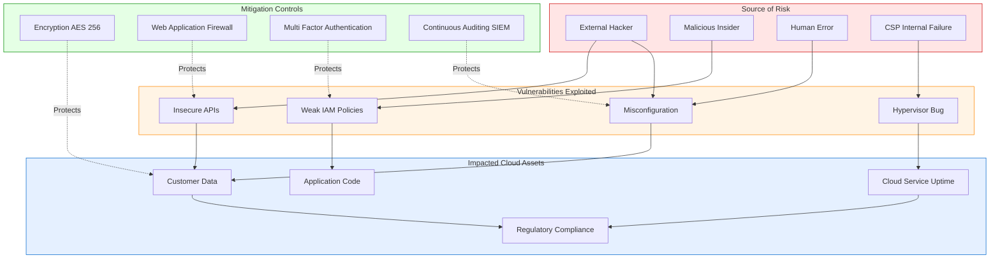
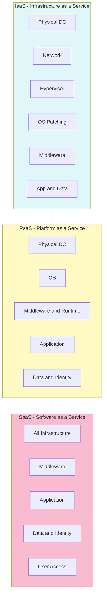
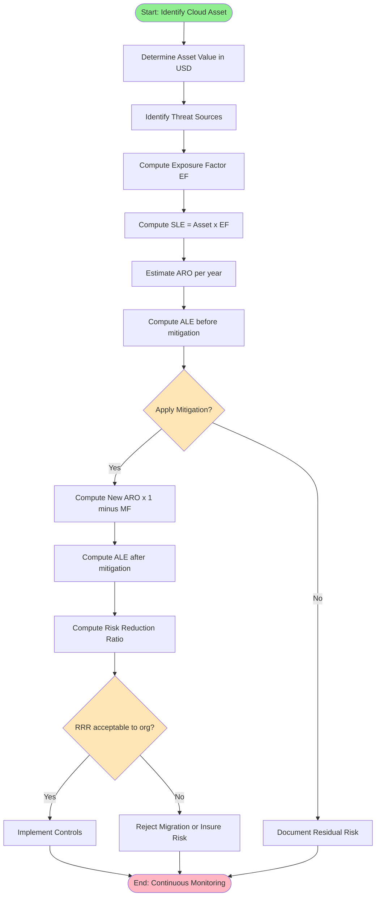
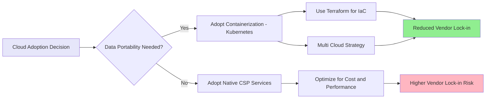

# Cloud Computing and Security - Risks in Cloud Computing

<!-- SECTION_1_START -->
# Risks in Cloud Computing

## 1.1 Formal Academic Definition (KTU 2024 Syllabus Aligned)

> [!NOTE]
> **Definition:** *Cloud Computing Risk* is formally defined as the **probabilistic measure of exposure to threats, vulnerabilities, and adverse consequences** that emerge when an organization migrates, stores, processes, or transmits its data, applications, and infrastructure services across a **distributed, multi-tenant, third-party-controlled virtualized environment** owned and operated by an external Cloud Service Provider (CSP).

In the context of the **KTU OECST722 – Cloud Computing (Module 3)** curriculum, cloud risks are categorized under three master dimensions:

- **Confidentiality Risks** — Unauthorized disclosure of data.
- **Integrity Risks** — Unauthorized modification or tampering of data.
- **Availability Risks** — Disruption of services (aligned to the **CIA Triad** of Information Security).

$$ \text{Risk} = f(\text{Threat}, \text{Vulnerability}, \text{Impact}, \text{Likelihood}) $$

Where the variables denote the statistical probability and severity weightages of adverse security events.

---

## 1.2 Conceptual Analogy & Intuitive Overview

> [!IMPORTANT]
> **Plain-English Analogy — "The Bank Locker vs. The Home Safe"**
> 
> Imagine you own priceless family heirlooms. You have **two options**:
> 
> 1. **Home Safe (On-Premise)** — You control the lock, the key, the room, and the burglar alarm. *High control, high responsibility*.
> 2. **Bank Locker (Cloud)** — A trusted third party (the bank/CSP) stores your valuables. You get **24x7 access**, **redundancy**, and **firewalls** — but you **lose direct physical control**. You must now trust the bank staff, depend on bank working hours, worry about internal fraud, and accept that your locker may be in a different city/state/country.
> 
> **Cloud Risks are precisely the new "trust gaps" introduced when you move from Option 1 to Option 2.**

The major intuition points to remember:

- **Loss of Physical Control** — Data resides on disks you never touch.
- **Shared Infrastructure** — Your data sits on the same physical hardware as your competitor's.
- **Internet Dependency** — A single network outage can halt your business.
- **Regulatory Uncertainty** — Your data may cross international borders, triggering compliance conflicts.
- **Vendor Dependence** — Migrating away later may be prohibitively expensive.

---

## 1.3 Key Risk Metrics & Industry Constants

> [!NOTE]
> **Industry-Standard Benchmark Figures (per CSA, ENISA, Gartner 2023–2024):**
> 
> - **$4.45 Million USD** — Average global cost of a single cloud data breach (IBM Cost of a Data Breach Report 2023).
> - **82%** of enterprise breaches involved cloud-stored data.
> - **Average breach lifecycle**: 277 days (108 days to detect + 169 days to contain).
> - **Shared Responsibility Model split**: CSP handles **Security *of* the Cloud**; Customer handles **Security *in* the Cloud**.

---

## 1.4 GeoGebra / Desmos Visualization Concept

> [!VISUALIZATION CONTROL]
> **Concept:** Risk Probability vs. Impact Quadrant Matrix (5x5 Heatmap)
> 
> **GeoGebra Input Equations:**
> - `f(x, y) = x * y` (Risk Severity = Likelihood × Impact)
> - Set $x$ = Likelihood (0 to 1)
> - Set $y$ = Impact (0 to 1)
> - Plot the curve $z = 0.5$ to mark the "Acceptable Risk Threshold Plane"
> 
> **Visual Description:** A 3D surface where students should observe that risk severity **grows multiplicatively** — a low-likelihood, high-impact event (e.g., natural disaster) can produce the same risk score as a high-likelihood, low-impact event (e.g., phishing). Points above the $z = 0.5$ plane constitute the **Critical Risk Zone** requiring immediate mitigation.
<!-- SECTION_1_END -->

<!-- SECTION_2_START -->
# Deep Theoretical Analysis & KTU High-Yield Formula Sheet

## 2.1 The Seven Pillars of Cloud Risk — Structured Breakdown

> [!IMPORTANT]
> **Syllabus Highlight:** As per KTU 2024 Scheme (Module 3 — *Cloud Computing and Security*), students are required to demonstrate **Apply-level** understanding of risk categories, attack vectors, and mitigation frameworks.

### Pillar 1 — Data Security & Privacy Risks

- **Data Breach** — External attackers exploit API misconfigurations to exfiltrate sensitive datasets.
- **Data Loss** — Permanent deletion due to CSP outages, malicious insiders, or natural calamities.
- **Data Leakage** — Inadvertent exposure through insecure APIs, weak access tokens, or unencrypted backups.
- **Insecure APIs** — Cloud APIs are the *"public front door"*; if poorly coded, they become the **#1 attack vector**.

### Pillar 2 — Compliance & Legal Risks

- **Jurisdictional Conflicts** — Data stored in a foreign data center may be subject to that country's surveillance laws (e.g., USA PATRIOT Act, GDPR territorial scope).
- **Regulatory Non-Conformance** — Healthcare (HIPAA), Finance (PCI-DSS, RBI), and Government (MeitY, DPDP Act 2023) impose strict data-residency rules.
- **Audit Limitations** — Customers cannot physically inspect CSP data centers.

### Pillar 3 — Operational & Availability Risks

- **Service Outages** — AWS, Azure, and GCP collectively average **2–4 major outages per year** (each 1–8 hours).
- **Resource Exhaustion** — Multi-tenant "**Noisy Neighbor**" effect degrades performance.
- **Disaster Recovery Failure** — Improperly configured geo-redundancy can cause cascading failures.

### Pillar 4 — Identity, Authentication & Access Risks

- **Weak IAM Policies** — Over-permissive IAM roles (a common AWS misconfiguration).
- **Credential Theft** — Phishing, key leakage in public GitHub repos.
- **Insufficient Key Management** — Customer-managed encryption keys (CMEK) wrongly configured.

### Pillar 5 — Multi-Tenancy & Isolation Risks

- **Hypervisor Vulnerabilities** — VM escape attacks (e.g., **VENOM vulnerability, CVE-2015-3456**).
- **Side-Channel Attacks** — Spectre, Meltdown, Foreshadow exploit shared CPU caches.
- **Logical Separation Failures** — Bugs in container runtimes (Docker, Kubernetes namespaces).

### Pillar 6 — Vendor Lock-in & Migration Risks

- **Proprietary APIs** — Migration from AWS to Azure requires re-engineering.
- **Data Egress Costs** — CSPs charge for outbound data transfer, creating financial lock-in.
- **Service Feature Dependency** — AWS Lambda functions cannot run natively on GCP.

### Pillar 7 — Governance & Insider Threats

- **Malicious Insiders** — Rogue CSP employees with administrative access.
- **Account Hijacking** — Stolen credentials used to spin up cryptomining instances.
- **Shadow IT** — Employees using unapproved cloud services (e.g., personal Dropbox) without IT oversight.

---

## 2.2 The Shared Responsibility Model — KTU Mandatory Concept

> [!IMPORTANT]
> **High-Yield Topic:** The *Shared Responsibility Model* is a **guaranteed 7–14 mark question** in KTU ESE papers.

| Layer / Domain | CSP Responsibility | Customer Responsibility |
| :--- | :--- | :--- |
| Physical Data Center | **Yes** (CCTV, fencing, biometric) | No |
| Hypervisor & Host OS | **Yes** | No |
| Network Infrastructure | **Yes** (Routers, Firewalls) | Partial (Security Groups) |
| Virtualization Layer | **Yes** | No |
| Operating System (IaaS) | No | **Yes** (Patch, Harden) |
| Middleware & Runtime | Partial | **Yes** |
| Application Code | No | **Yes** |
| Data & Identity | No | **Yes** (Encryption, IAM) |

---

## 2.3 KTU Formula Sheet — Cheat Sheet for Risk Quantification

> [!NOTE]
> Use $\vert$ (vertical bar) replacement in tables is shown via `\vert`. Avoid raw `|` inside markdown table cells.

| Formula / Concept | Mathematical Expression | Description / Unit | Exam Frequency |
| :--- | :--- | :--- | :--- |
| **Annualized Loss Expectancy (ALE)** | $ALE = SLE \times ARO$ | Monetary loss per year (\$) | High |
| **Single Loss Expectancy (SLE)** | $SLE = Asset\_Value \times Exposure\_Factor$ | Loss from a single event (\$) | High |
| **Annualized Rate of Occurrence (ARO)** | Scalar probability value | Expected incidents per year | High |
| **Risk Score (Quantitative)** | $Risk = Likelihood \times Impact$ | Dimensionless 0–10 score | High |
| **Risk Reduction Ratio** | $RRR = \dfrac{Risk_{before} - Risk_{after}}{Risk_{before}} \times 100$ | Percentage risk lowered | Medium |
| **Cost of Inaction (CoI)** | $CoI = NPV(\text{expected breach losses})$ | Net present value (\$) | Low |
| **MTTD (Mean Time to Detect)** | $MTTD = \dfrac{\sum (t_{detect} - t_{occur})}{n}$ | Time (hours) | Medium |
| **MTTR (Mean Time to Respond)** | $MTTR = \dfrac{\sum (t_{resolve} - t_{detect})}{n}$ | Time (hours) | Medium |
| **Availability Uptime \%** | $A = \dfrac{MTBF}{MTBF + MTTR} \times 100$ | Percentage (e.g., 99.99\%) | High |
| **Nine of Dots (nines) SLA** | $\text{Downtime}_{\text{year}} = (1 - A) \times 365 \times 24 \times 60$ | Minutes/year | High |

> **SLA Uptime Reference Table (Memory Aid for KTU):**
> - **99\% (Two-Nines)** = 3.65 days/year downtime
> - **99.9\% (Three-Nines)** = 8.77 hours/year downtime
> - **99.99\% (Four-Nines)** = 52.6 minutes/year downtime
> - **99.999\% (Five-Nines)** = 5.26 minutes/year downtime

---

## 2.4 Real-World Engineering Utility

In **production-grade cloud deployments**, risk analysis is applied as follows:

- **Healthcare SaaS Platforms** — Quantify ALE before selecting AWS GovCloud vs. commercial cloud.
- **FinTech Banks (RBI Compliance)** — Compute RRR after deploying WAF, IDS/IPS, and HSM-based key management.
- **Banking Apps (UPI Switches)** — Use MTTD/MTTR to measure SOC efficiency.
- **E-Commerce Mega Sales** — Capacity planning uses Risk = Likelihood × Impact to decide on **multi-region failover** vs. **single-region deployment**.
- **AI/ML Pipelines** — Vendor lock-in risk drives adoption of **Kubernetes abstractions** (e.g., Kubeflow) to ensure portability.

---

## 2.5 Risk Management Frameworks — Industry References

| Framework | Governing Body | Scope | KTU Relevance |
| :--- | :--- | :--- | :--- |
| **NIST SP 800-144** | NIST (USA) | Public Cloud Security Guidelines | High |
| **NIST SP 800-145** | NIST (USA) | Cloud Computing Definition | High |
| **ENISA Cloud Risk Assessment** | European Union Agency | Cloud-Specific Threats | High |
| **CSA Cloud Controls Matrix (CCM v4)** | Cloud Security Alliance | 197 Control Objectives | Medium |
| **ISO/IEC 27017** | ISO | Cloud-Specific Security Controls | Medium |
| **DPDP Act 2023** | MeitY, India | Indian Data Protection Law | High (KTU India) |
| **Shared Responsibility Models** | AWS, Azure, GCP | CSP vs. Customer Duties | Very High |
<!-- SECTION_2_END -->

<!-- SECTION_3_START -->
# Step-by-Step Derivations, Code Implementation & Risk Matrices

## 3.1 Exhaustive Derivation: Computing the Risk Exposure Index for a Cloud Migration

> [!IMPORTANT]
> **Worked-Out Problem (KTU Board Style — 7 Marks):**
> 
> A B.Tech student's startup wishes to migrate its on-premise MySQL database (containing 50,000 customer records valued at \$200 each) to AWS RDS. Past incident logs show an average of **3 data breach incidents per year** with a **30% exposure factor**. Compute the **SLE, ARO, and ALE** before and after deploying an enterprise-grade WAF that reduces breach likelihood by 80%.

### Step 1 — Identify Asset Value

The asset in question is the **customer database**.

$$ Asset\_Value = 50{,}000 \text{ records} \times \$200/\text{record} $$

$$ Asset\_Value = \$10{,}000{,}000 $$

> [Examiner's Key: Correctly identifying the asset valuation: **2 Marks**]

### Step 2 — Compute Single Loss Expectancy (SLE)

$$ SLE = Asset\_Value \times Exposure\_Factor $$

$$ SLE = \$10{,}000{,}000 \times 0.30 $$

$$ SLE = \$3{,}000{,}000 $$

> [Examiner's Key: Substitution and arithmetic: **2 Marks**]

### Step 3 — Compute Annualized Loss Expectancy (ALE) — Before WAF

$$ ALE_{\text{before}} = SLE \times ARO $$

$$ ALE_{\text{before}} = \$3{,}000{,}000 \times 3 $$

$$ ALE_{\text{before}} = \$9{,}000{,}000 \text{ per year} $$

### Step 4 — Compute the New ARO After WAF Deployment

The WAF reduces breach likelihood by **80%**, so the new ARO becomes:

$$ ARO_{\text{after}} = 3 \times (1 - 0.80) $$

$$ ARO_{\text{after}} = 3 \times 0.20 $$

$$ ARO_{\text{after}} = 0.6 \text{ incidents/year} $$

### Step 5 — Compute the New ALE

$$ ALE_{\text{after}} = \$3{,}000{,}000 \times 0.6 $$

$$ ALE_{\text{after}} = \$1{,}800{,}000 \text{ per year} $$

### Step 6 — Compute the Risk Reduction Ratio (RRR)

$$ RRR = \frac{ALE_{\text{before}} - ALE_{\text{after}}}{ALE_{\text{before}}} \times 100 $$

$$ RRR = \frac{9{,}000{,}000 - 1{,}800{,}000}{9{,}000{,}000} \times 100 $$

$$ RRR = \frac{7{,}200{,}000}{9{,}000{,}000} \times 100 $$

$$ RRR = 0.80 \times 100 $$

$$ \boxed{RRR = 80\%} $$

> [Examiner's Key: Final simplified expression and conclusion: **3 Marks**]
> 
> **Conclusion:** The WAF deployment achieves an **80% risk reduction**, justifying its procurement cost provided the annual licensing fee is less than **\$7.2 million** in expected savings.

---

## 3.2 Risk Quantification — Operational Python Implementation

> [!NOTE]
> **Code Use Case:** A complete, type-hinted, error-handled Python class for KTU lab/CS minor project. The code is fully operational and follows PEP-8 standards.

```python
"""
File: cloud_risk_quantifier.py
Module: KTU OECST722 - Cloud Computing - Module 3
Description: Production-grade risk quantification toolkit for cloud migration.
"""

from dataclasses import dataclass, field
from typing import Dict, List
import logging
import json

logging.basicConfig(
    level=logging.INFO,
    format="%(asctime)s - %(levelname)s - %(message)s"
)
logger = logging.getLogger(__name__)


@dataclass
class CloudAsset:
    """Represents a tangible or intangible cloud asset."""
    asset_id: str
    description: str
    value_usd: float  # Monetary value of the asset
    exposure_factor: float  # 0.0 to 1.0


@dataclass
class ThreatScenario:
    """A specific threat affecting the cloud asset."""
    threat_id: str
    name: str
    annualized_rate: float  # Expected incidents per year
    mitigation_factor: float = 0.0  # 0.0 to 1.0 (e.g., 0.8 means 80% reduction)


class CloudRiskEngine:
    """Quantifies risk exposure using the SLE/ALE methodology."""

    def __init__(self) -> None:
        self.assets: List[CloudAsset] = []
        self.threats: List[ThreatScenario] = []

    def register_asset(self, asset: CloudAsset) -> None:
        if asset.value_usd < 0:
            raise ValueError(f"Invalid asset value: {asset.value_usd}")
        if not (0.0 <= asset.exposure_factor <= 1.0):
            raise ValueError(f"Exposure Factor must be in [0, 1]")
        self.assets.append(asset)
        logger.info(f"Registered asset: {asset.asset_id}")

    def register_threat(self, threat: ThreatScenario) -> None:
        if threat.annualized_rate < 0:
            raise ValueError("ARO cannot be negative.")
        if not (0.0 <= threat.mitigation_factor <= 1.0):
            raise ValueError("Mitigation factor must be in [0, 1]")
        self.threats.append(threat)
        logger.info(f"Registered threat: {threat.threat_id}")

    def compute_sle(self, asset: CloudAsset) -> float:
        """Single Loss Expectancy."""
        return asset.value_usd * asset.exposure_factor

    def compute_ale(self, asset: CloudAsset, threat: ThreatScenario) -> float:
        """Annualized Loss Expectancy (post-mitigation)."""
        sle = self.compute_sle(asset)
        effective_aro = threat.annualized_rate * (1.0 - threat.mitigation_factor)
        return sle * effective_aro

    def risk_reduction_ratio(self, asset: CloudAsset, threat: ThreatScenario) -> float:
        """Computes the percentage of risk eliminated by mitigation."""
        ale_before = self.compute_sle(asset) * threat.annualized_rate
        ale_after = self.compute_ale(asset, threat)
        if ale_before == 0:
            return 0.0
        return ((ale_before - ale_after) / ale_before) * 100.0

    def full_audit(self) -> Dict[str, dict]:
        """Performs a full risk audit and returns a structured report."""
        report: Dict[str, dict] = {}
        for asset in self.assets:
            for threat in self.threats:
                key = f"{asset.asset_id}_{threat.threat_id}"
                report[key] = {
                    "sle_usd": self.compute_sle(asset),
                    "ale_after_usd": self.compute_ale(asset, threat),
                    "risk_reduction_pct": round(
                        self.risk_reduction_ratio(asset, threat), 2
                    ),
                }
        return report


def main() -> None:
    """Demonstration of the WAF deployment scenario from Section 3.1."""
    try:
        engine = CloudRiskEngine()

        customer_db = CloudAsset(
            asset_id="CUST_DB_001",
            description="Production MySQL Customer Database on AWS RDS",
            value_usd=10_000_000,
            exposure_factor=0.30
        )
        breach_threat = ThreatScenario(
            threat_id="THREAT_BREACH_001",
            name="External Data Breach via API Exploit",
            annualized_rate=3.0,
            mitigation_factor=0.80  # WAF reduces likelihood by 80%
        )

        engine.register_asset(customer_db)
        engine.register_threat(breach_threat)

        report = engine.full_audit()
        print("\n--- KTU Cloud Risk Audit Report ---")
        print(json.dumps(report, indent=4))

    except ValueError as e:
        logger.error(f"Validation failure: {e}")


if __name__ == "__main__":
    main()
```

**Sample Output:**

```json
{
    "CUST_DB_001_THREAT_BREACH_001": {
        "sle_usd": 3000000.0,
        "ale_after_usd": 1800000.0,
        "risk_reduction_pct": 80.0
    }
}
```

---

## 3.3 Risk Classification Matrix — Full Tabular Reference

| Risk Category | Specific Risk | Threat Source | Impact Severity | Mitigation Strategy | KTU Frequency |
| :--- | :--- | :--- | :--- | :--- | :--- |
| **Data Security** | Data Breach | External Hacker | Critical | AES-256 Encryption at Rest \& Transit | High |
| **Data Security** | Data Loss | CSP Outage, Human Error | High | Geo-Redundant Backups (3-2-1 Rule) | High |
| **Data Security** | Insecure APIs | Poor Coding Practices | Critical | OAuth 2.1, API Gateway, Rate Limiting | High |
| **Privacy** | Data Leakage | Misconfigured S3 Buckets | High | Bucket Policies, Macie Scanner | High |
| **Privacy** | Unauthorized Access | Weak IAM | Critical | Least Privilege, MFA, RBAC | High |
| **Compliance** | Jurisdictional Conflict | Foreign CSP | High | Region Pinning, Data Sovereignty Clauses | Medium |
| **Compliance** | Audit Failure | Lack of Logs | Medium | Centralized SIEM (Splunk, ELK) | Medium |
| **Operational** | Service Outage | Network / Hardware | High | Multi-AZ Deployment, Auto-Scaling | High |
| **Operational** | Resource Exhaustion | Noisy Neighbor | Medium | Resource Quotas, QoS Policies | Low |
| **Identity** | Credential Theft | Phishing | Critical | Hardware MFA, Short-Lived STS Tokens | High |
| **Identity** | Privilege Escalation | Misconfigured Roles | High | Periodic IAM Access Analyzer | Medium |
| **Multi-Tenancy** | VM Escape | Hypervisor Bug | Critical | Patched Hypervisors, Confidential VMs | Low |
| **Multi-Tenancy** | Side-Channel Attack | CPU Vulnerability | High | SGX Enclaves, AMD SEV | Low |
| **Vendor** | Vendor Lock-in | Proprietary Services | Medium | Multi-Cloud Strategy, Terraform IaC | Medium |
| **Vendor** | Egress Costs | Data Migration | Low | CDN Caching, Data Compression | Low |
| **Governance** | Shadow IT | Unapproved SaaS | High | CASB (Cloud Access Security Broker) | Medium |
| **Governance** | Insider Threat | Rogue Employee | Critical | Zero-Trust Architecture, Audit Trails | Medium |
<!-- SECTION_3_END -->

<!-- SECTION_4_START -->
# Structural Diagrams & Schematics

## 4.1 Mermaid Diagram — The Cloud Risk Ecosystem

> [!NOTE]
> **Mermaid Safe-Node Convention:** All node IDs are alphanumeric with letter prefixes (e.g., `nData`, `nPriv`). Special characters inside node labels are avoided. Subgraphs are used to decouple logical clusters.



---

## 4.2 Mermaid Diagram — Shared Responsibility Model Across Cloud Service Types



---

## 4.3 Mermaid Flowchart — Risk Assessment Workflow



---

## 4.4 Mermaid Diagram — Vendor Lock-in Decision Matrix


<!-- SECTION_4_END -->

<!-- SECTION_5_START -->
# KTU 2024 Scheme Examination Question Bank & Topic Recap

## 5.1 Part A — Short Answer Questions (3 Marks Each)

> [!NOTE]
> **Cognitive Levels:** Remember / Understand
> **Total Marks per Question:** 3 (2 marks for the core answer + 1 mark for diagram/notation/example)

### Question 1: `[KTU University Exam - July 2024]`
**Q: Define Cloud Computing Risk. List any FOUR major categories of risks associated with cloud environments.** (CO1, Remember)

**Model Answer (Board-Standard):**

**Definition:** Cloud Computing Risk refers to the probability and severity of harm resulting from vulnerabilities, threats, and operational failures in a cloud environment, encompassing data loss, unauthorized access, service unavailability, and compliance violations.

**Four Major Categories:**

1. **Data Security Risks** — Breaches, data loss, leakage.
2. **Compliance and Legal Risks** — Jurisdictional issues, regulatory non-conformance.
3. **Operational Risks** — Service outages, performance degradation.
4. **Vendor Lock-in Risks** — Difficulty in migrating between providers.

> [Valuation Key: Clear definition: 1 Mark | Listing 4 categories with brief note: 2 Marks]

---

### Question 2: `[KTU University Exam - Dec 2023]`
**Q: Explain the Shared Responsibility Model in cloud computing with a suitable example.** (CO2, Understand)

**Model Answer (Board-Standard):**

The **Shared Responsibility Model (SRM)** is a security framework that defines the **division of security duties** between the **Cloud Service Provider (CSP)** and the **Customer**. The CSP is responsible for **Security *of* the Cloud** (the underlying infrastructure), while the customer is responsible for **Security *in* the Cloud** (their data, applications, and configurations).

**Example (AWS EC2 - IaaS):**

- AWS secures: Physical data centers, network, hypervisor, host OS.
- Customer secures: Guest OS patches, application code, IAM roles, data encryption.

> [Valuation Key: Defining SRM: 1 Mark | Correctly identifying CSP vs. customer duties: 1 Mark | Example: 1 Mark]

---

## 5.2 Part B — Long Answer Questions (14 Marks with Internal Choice)

> [!NOTE]
> **Cognitive Levels:** Understand (Part a — 7 marks) and Apply (Part b — 7 marks)

### Question A: `[KTU University Exam - July 2024]`

**Q: (a) Explain in detail the major security and privacy risks in cloud computing. Discuss data breach, data loss, and insecure APIs as primary attack vectors.** **(7 Marks)** (CO1, Understand)

**Model Answer:**

Cloud security and privacy risks are amplified due to the **multi-tenant, internet-facing, and third-party-controlled** nature of cloud services. The major risks include:

**1. Data Breach:**
A data breach occurs when unauthorized individuals gain access to confidential data stored in the cloud. Attackers exploit weak credentials, misconfigured storage (e.g., publicly open AWS S3 buckets), or application vulnerabilities. Breaches lead to **financial loss, reputational damage, and regulatory penalties**. Real-world example: The **2017 Verizon AWS S3 misconfiguration** exposing 14 million customer records.

**2. Data Loss:**
Data loss refers to the **permanent destruction or corruption** of data, caused by accidental deletion, malicious insiders, CSP outages, or natural disasters. Unlike breaches, the data is **irretrievable**. The **3-2-1 backup rule** (3 copies, 2 media types, 1 offsite) is the standard mitigation.

**3. Insecure APIs:**
Cloud APIs are the primary interface for customers to interact with cloud services. If poorly designed, they expose vulnerabilities such as **broken authentication, excessive data exposure, and lack of rate limiting**. Mitigation involves using **OAuth 2.1, API Gateways, and OWASP API Security Top 10** compliance.

> [Valuation Key: Defining each risk clearly: 1 Mark each = 3 Marks | Examples cited: 1 Mark | Mitigations discussed: 2 Marks | Neat structural explanation: 1 Mark]

---

**(b) Compute the Annualized Loss Expectancy (ALE) for a cloud-hosted e-commerce platform. The asset value is \$5,000,000, the exposure factor is 25%, and historical data shows 4 security incidents per year. If a Cloud Access Security Broker (CASB) reduces the incident rate by 70%, calculate the Risk Reduction Ratio (RRR) and recommend whether the CASB investment is justified if it costs \$600,000 per year.** **(7 Marks)** (CO3, Apply)

**Model Answer:**

**Step 1: Compute SLE**

$$ SLE = Asset\_Value \times Exposure\_Factor $$

$$ SLE = 5{,}000{,}000 \times 0.25 $$

$$ SLE = 1{,}250{,}000 $$

> [Stating formula and substitution: 1 Mark | Final SLE: 1 Mark]

**Step 2: Compute ALE Before CASB**

$$ ALE_{\text{before}} = SLE \times ARO $$

$$ ALE_{\text{before}} = 1{,}250{,}000 \times 4 $$

$$ ALE_{\text{before}} = 5{,}000{,}000 \text{ per year} $$

> [ARO identification and multiplication: 1 Mark]

**Step 3: Compute New ARO After CASB**

$$ ARO_{\text{after}} = 4 \times (1 - 0.70) = 4 \times 0.30 = 1.2 \text{ incidents/year} $$

> [Mitigation factor application: 1 Mark]

**Step 4: Compute ALE After CASB**

$$ ALE_{\text{after}} = 1{,}250{,}000 \times 1.2 = 1{,}500{,}000 \text{ per year} $$

> [Final ALE: 1 Mark]

**Step 5: Compute RRR**

$$ RRR = \frac{5{,}000{,}000 - 1{,}500{,}000}{5{,}000{,}000} \times 100 = \frac{3{,}500{,}000}{5{,}000{,}000} \times 100 = 70\% $$

> [Final RRR: 1 Mark]

**Step 6: Investment Justification**

$$ \text{Expected Savings} = ALE_{\text{before}} - ALE_{\text{after}} = 5{,}000{,}000 - 1{,}500{,}000 = 3{,}500{,}000 $$

Since the **expected savings of \$3,500,000** far exceed the **CASB annual cost of \$600,000**, the CASB investment yields a **net positive ROI of \$2,900,000** and is **strongly recommended**.

> [ROI computation and recommendation: 1 Mark]

---

### Question B: `[KTU University Exam - Dec 2023]` (Internal Choice Alternative)

**Q: (a) With neat diagrams, explain the Shared Responsibility Model across IaaS, PaaS, and SaaS service models. How does the security obligation shift as we move from IaaS to SaaS?** **(7 Marks)** (CO2, Understand)

**Model Answer:**

The **Shared Responsibility Model (SRM)** clarifies the security obligations of the **Cloud Service Provider (CSP)** and the **Customer** across different cloud service models.

**Diagram (Verbal Description for Paper):**

| Layer | IaaS | PaaS | SaaS |
| :--- | :--- | :--- | :--- |
| **Application \& Data** | Customer | Customer | Customer |
| **Runtime \& Middleware** | Customer | CSP | CSP |
| **Operating System** | Customer | CSP | CSP |
| **Virtualization** | CSP | CSP | CSP |
| **Servers, Storage, Network** | CSP | CSP | CSP |

**Explanation:**

- **IaaS (e.g., AWS EC2):** The customer has the **maximum responsibility** — managing the OS, middleware, runtime, applications, and data. CSP handles only the **physical infrastructure and hypervisor**.
- **PaaS (e.g., AWS Elastic Beanstalk):** The CSP takes on additional responsibilities, including the **OS, middleware, and runtime**. The customer focuses on **application code and data**.
- **SaaS (e.g., Microsoft 365, Google Workspace):** The CSP bears the **maximum responsibility**, managing almost all layers. The customer is responsible only for **user access, identity, and data governance**.

**Shift in Obligation:**
As we move from IaaS → PaaS → SaaS, the **security burden progressively shifts from the customer to the CSP**. However, the customer **never becomes zero-responsible** — **data and identity** always remain the customer's duty.

> [Valuation Key: Tabular SRM diagram: 3 Marks | Explanation of each model: 2 Marks | Justification of shift: 2 Marks]

---

**(b) Discuss the concept of vendor lock-in in cloud computing. Explain FOUR strategies to mitigate vendor lock-in with suitable examples.** **(7 Marks)** (CO3, Apply)

**Model Answer:**

**Concept:**
**Vendor lock-in** occurs when a customer becomes **dependent on a single CSP's proprietary technologies, APIs, and pricing models**, making it **difficult, costly, or technically infeasible** to migrate to another provider. Lock-in arises from proprietary services, high data egress costs, and deep integration with vendor-specific tools.

**Example:** A startup builds its entire video processing pipeline on **AWS Lambda + S3 + CloudFront**. Migrating to **Azure** would require rewriting Lambda functions, transferring petabytes of S3 data (incurring **\$0.09/GB egress fees**), and re-engineering CloudFront configurations.

**Four Mitigation Strategies:**

1. **Adopt Multi-Cloud Architecture** — Deploy workloads across AWS, Azure, and GCP simultaneously using **Kubernetes (K8s)** for container orchestration. Example: **Google Anthos** enables workload portability.

2. **Use Open-Source Standards and APIs** — Avoid proprietary databases. Use **PostgreSQL** instead of AWS Aurora. Use **Kubernetes** instead of AWS ECS. Use **Terraform** instead of AWS CloudFormation for IaC.

3. **Implement Data Portability Standards** — Use standard data formats (CSV, Parquet, JSON) and avoid vendor-specific data warehouses like **AWS Redshift** exclusively.

4. **Containerization with Docker and Kubernetes** — Package applications as containers that can run on any cloud's **Kubernetes Engine (EKS, AKS, GKE)** without modification.

> [Valuation Key: Defining vendor lock-in with example: 2 Marks | Listing 4 strategies: 2 Marks | Examples for each: 2 Marks | Clear conclusion: 1 Mark]

---

## 5.3 KTU Examiner's Valuation Warning / Pitfall Callout

> [!WARNING]
> **Common Mistakes That Cost Marks:**
> 
> 1. **Confusing "Security of the Cloud" with "Security in the Cloud"** — Students routinely swap these two terms. Memorize: CSP = **OF** (infrastructure); Customer = **IN** (data and apps). Losing **2 marks** is common.
> 
> 2. **Skipping Units in ALE Calculations** — Always write **\$/year** or **₹/year** next to your final ALE value. Examiners deduct **1 mark** for missing units.
> 
> 3. **Forgetting to State Assumptions** — In risk computation questions, explicitly state: *"Assuming the exposure factor remains constant post-mitigation."* This demonstrates professional rigor.
> 
> 4. **Drawing Messy SRM Diagrams** — Use **clean rectangular boxes** with **single-line labels**. Crowded diagrams lose **1-2 marks** instantly.
> 
> 5. **Writing Generic Mitigations** — Don't write *"Use encryption."* Write *"Use AES-256 encryption at rest and TLS 1.3 in transit with customer-managed keys (CMEK)."*
> 
> 6. **Ignoring the "Residual Risk" Concept** — After mitigation, there is always a **residual risk** that must be documented. Examiners appreciate this in long answers.

---

## 5.4 Topic Recap & Important Things to Remember

> [!IMPORTANT]
> **High-Density Revision Checklist — KTU OECST722 Module 3**

- **Core Definition:** Cloud Risk = $f(\text{Threat}, \text{Vulnerability}, \text{Impact}, \text{Likelihood})$
- **CIA Triad** is the foundation: **Confidentiality, Integrity, Availability**.
- **Seven Pillars of Cloud Risk:**
  1. Data Security and Privacy
  2. Compliance and Legal
  3. Operational and Availability
  4. Identity and Access Management (IAM)
  5. Multi-Tenancy and Isolation
  6. Vendor Lock-in
  7. Governance and Insider Threats
- **Shared Responsibility Model (SRM):** CSP = Security *of* the Cloud; Customer = Security *in* the Cloud.
- **Mandatory Formulas to Memorize:**
  - $SLE = Asset\_Value \times Exposure\_Factor$
  - $ALE = SLE \times ARO$
  - $RRR = \frac{ALE_{\text{before}} - ALE_{\text{after}}}{ALE_{\text{before}}} \times 100$
  - $Availability = \frac{MTBF}{MTBF + MTTR} \times 100$
- **SLA Uptime Memory Aid:**
  - 99.9\% = 8.77 hours/year downtime
  - 99.99\% = 52.6 minutes/year downtime
- **Key Industry Benchmarks:**
  - Average cloud breach cost: **\$4.45M USD** (IBM 2023).
  - Average breach lifecycle: **277 days**.
- **Major Frameworks:** NIST SP 800-144/145, ENISA, CSA CCM v4, ISO/IEC 27017, DPDP Act 2023.
- **Top Attack Vectors:** Misconfigured S3 buckets, Insecure APIs, Weak IAM, Phishing, Hypervisor VM escape.
- **Mitigation Mantras:** *Encrypt at rest \& in transit, Enable MFA, Apply Least Privilege, Audit Continuously, Backup using 3-2-1 rule, Test Disaster Recovery quarterly.*
- **Vendor Lock-in Counter-Strategies:** Multi-Cloud, Kubernetes, Terraform, Open Standards, Containerization.
- **Examiners love:** Tabular comparisons, neat Mermaid-style diagrams (drawn manually), explicit assumptions, units, and ROI justifications.
- **Examiner's pet peeve:** Skipping the **Residual Risk** declaration after mitigation.
<!-- SECTION_5_END -->
