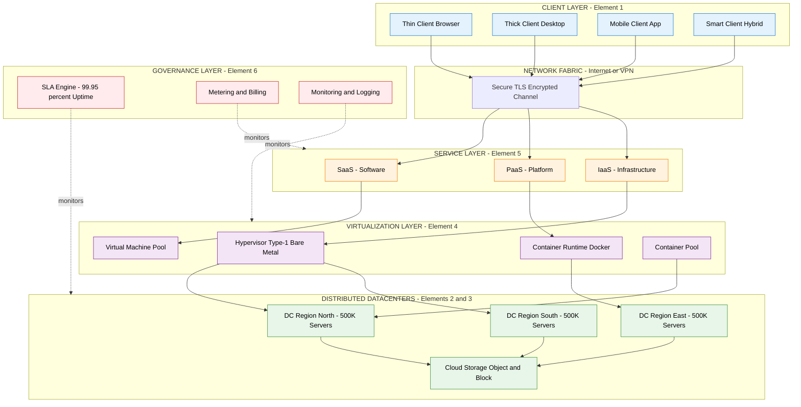
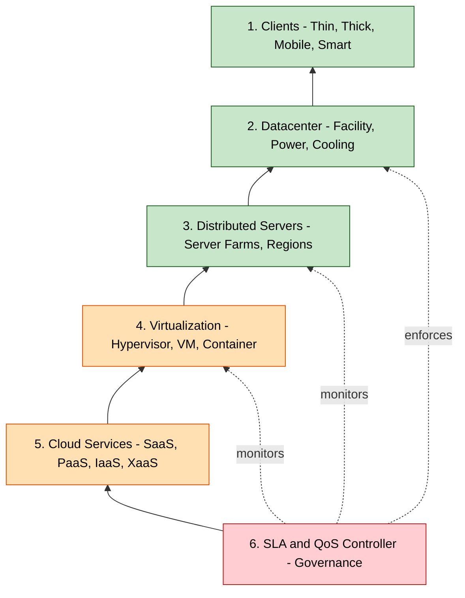
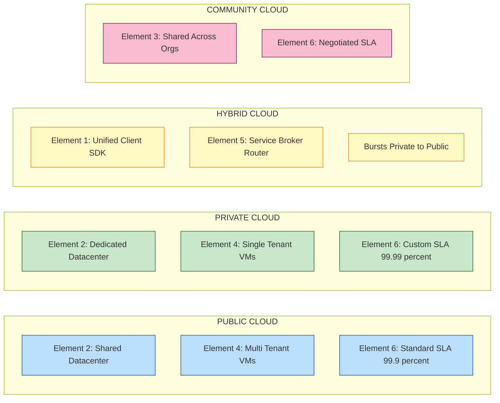

# Cloud Computing Services - Cloud Computing Elements

<!-- SECTION_1_START -->

# Cloud Computing Elements

## 1.1 Core Technical Definition

**Cloud Computing Elements** refer to the essential building-block components that collectively constitute a cloud computing system, enabling the on-demand delivery of computing services over the internet. According to the **NIST (National Institute of Standards and Technology) SP 800-145** reference model, these elements include clients, **datacenters**, **distributed servers**, virtualization layers, and the network fabric that interconnects them.

> [!IMPORTANT]
> **KTU 2024 OECST722 - Module 3 Focus**: The syllabus emphasises that *cloud computing elements are not the services themselves, but the underlying infrastructure primitives* (clients, datacenters, virtualization, storage, and service platforms) that deliver SaaS, PaaS, and IaaS.

> [!NOTE]
> **Formal Definition (KTU Board Standard)**: A *cloud computing element* is any hardware, software, or logical abstraction that contributes to the provisioning, orchestration, scaling, or consumption of elastic computing resources across a distributed network.

### Conceptual Analogy — The "Electricity Grid" Model

Imagine cloud computing elements as the components of a **city's electricity grid**:

| Cloud Element | Electricity Grid Analogy | Role |
|---|---|---|
| **Clients** (Thin/Thick/Mobile) | Home appliances & switches | End consumers of service |
| **Datacenter** | Power generation plant | Bulk resource producer |
| **Distributed Servers** | Substations across the city | Geographic distribution of supply |
| **Virtualization Layer** | Voltage transformers | Abstract and multiplex raw resource |
| **Cloud Storage** | Battery banks | Persistent resource reserve |
| **Service Layer (SaaS/PaaS/IaaS)** | Power sockets of various ratings | Standardised delivery interface |
| **SLA / QoS Controller** | Grid regulator & meter | Quality & billing enforcement |

Just as you never worry *where* the power plant is located when you plug in a device, cloud users should not need to know *which physical server* processes their request.

> [!TIP]
> **Key Insight**: The "cloud" is not a *thing* — it is an *architectural pattern* assembled from six fundamental elements. The brilliance of the model is the **abstraction of physicality**.

### Standard Metrics & Constants to Remember

- **Uptime SLA Tiers**: **99.9%** ("three nines") ≈ 8.77 hours downtime/year; **99.99%** ("four nines") ≈ 52.6 minutes/year; **99.999%** ("five nines") ≈ 5.26 minutes/year.
- **Hypervisor Memory Overhead**: typically **2%–5%** of allocated RAM per VM.
- **VM Boot Latency**: typically **30s–120s** versus container start of **<1s**.
- **Geometric Mean RTO** (Recovery Time Objective) is the standard for cloud SLA scoring.

> [!VISUALIZATION CONTROL]
> **Concept:** Layered Cloud Computing Stack showing all elements
> **GeoGebra / Desmos Input Equations:**
> * `x = 4` (vertical reference line through stack)
> * `f(x) = 0` (client baseline)
> * `f(x) = 1` (datacenter baseline)
> * `f(x) = 2` (virtualization baseline)
> * `f(x) = 3` (service baseline)
> * `f(x) = 4` (SLA baseline)
> **Visual Description:** Stack from bottom (Hardware/Physical) to top (SLA) with arrows depicting request flow from client downward and response flow upward.

---

<!-- SECTION_1_END -->

<!-- SECTION_2_START -->

# 2. Deep Theoretical Analysis & KTU High-Yield Formula Sheet

## 2.1 The Six Core Cloud Computing Elements

A cloud system is constructed from six interdependent elements. The order listed reflects the **dependency hierarchy** (each element consumes services of the one below it).

### 2.1.1 Clients (Consumer-Side Element)

Clients are the **end-user devices** that consume cloud services. They are classified by how much processing they perform locally.

- **Thin Client**: A lightweight device (or browser) that performs *no* local computation; everything is rendered by the cloud. Example: a Chromebook running Google Docs.
- **Thick Client (Fat Client)**: Performs substantial local processing and uses the cloud mainly for storage or synchronisation. Example: a desktop PC running VS Code with cloud sync.
- **Mobile Client**: A handheld device with constrained CPU/RAM/bandwidth but rich sensors (GPS, camera). Example: a smartphone running a SaaS app.
- **Smart Client / Hybrid Client**: Combines offline capability with cloud synchronisation. Example: WhatsApp Web.

### 2.1.2 Datacenter (Physical Infrastructure Element)

A **datacenter** is a centralised physical facility housing thousands of servers, networking gear, cooling systems, and power backups. Modern hyperscale datacenters (AWS, Azure, Google) contain **>500,000 servers** each.

- **PUE (Power Usage Effectiveness)** is the gold-standard metric:
$$\text{PUE} = \frac{\text{Total Facility Power}}{\text{IT Equipment Power}}$$

A PUE of **1.0** is the theoretical ideal (all power goes to compute). Industry average is **1.58**; Google reports **1.10**.

### 2.1.3 Distributed Servers (Resource Pool Element)

Rather than one giant machine, cloud providers maintain **server farms** distributed geographically. This enables:
- **Latency reduction** (route user to nearest region)
- **Fault tolerance** (failover across zones)
- **Regulatory compliance** (data sovereignty — keep data within country borders)

### 2.1.4 Virtualization (Abstraction Element)

Virtualization is the **technology that makes cloud computing economically viable**. It uses a **hypervisor** (Type-1: bare-metal, e.g., VMware ESXi; Type-2: hosted, e.g., VirtualBox) to abstract physical hardware into many isolated **Virtual Machines (VMs)**.

Key concepts:
- **Virtual Machine (VM)**: A software emulation of a physical computer with its own OS, CPU, RAM, and disk.
- **Container**: A lighter-weight alternative that virtualises only the OS layer, sharing the host kernel. Example: Docker.
- **Multi-tenancy**: Multiple customers (tenants) share the same physical hardware with strict logical isolation.

### 2.1.5 Services (Delivery Element)

Services are the **standardised delivery interfaces** exposed to consumers. The three canonical layers are:
- **IaaS (Infrastructure as a Service)**: Raw VMs, storage, networks. Example: AWS EC2.
- **PaaS (Platform as a Service)**: Runtime + middleware + OS managed for you. Example: Google App Engine.
- **SaaS (Software as a Service)**: Finished application accessed via browser. Example: Gmail.

> [!NOTE]
> **Spice Model Extension**: The KTU syllabus also references *everything-as-a-service* (XaaS), which extends IaaS/PaaS/SaaS with *FaaS* (Function), *DaaS* (Desktop), *DBaaS* (Database), *STaaS* (Storage), and *SecaaS* (Security).

### 2.1.6 SLA / QoS Controller (Governance Element)

The **Service Level Agreement (SLA)** is the contract between provider and consumer specifying measurable guarantees — uptime, latency, throughput, support response time, and penalty clauses for breach.

---

## 2.2 The "Why" Behind Each Element — Production Engineering Utility

| Element | Why It Exists in Production | Real Engineering Utility |
|---|---|---|
| **Clients** | Device diversity (BYOD policy) | Unified web UI across all form factors |
| **Datacenters** | Economies of scale in cooling & power | A single hyperscale DC costs **$1B+** but serves millions |
| **Distributed Servers** | Latency, redundancy, regulation | Enables CDN-style request routing |
| **Virtualization** | Hardware utilisation 5% → 70% | One physical host runs 20+ VMs |
| **Services** | Reusable, billable abstractions | Developers consume APIs instead of buying hardware |
| **SLA** | Trust through quantification | Penalties turn marketing claims into legal obligations |

---

## 2.3 KTU High-Yield Formula Sheet

| # | Concept | Formula / Definition | Units / Typical Value |
|---|---|---|---|
| 1 | Datacenter Efficiency | $\text{PUE} = \dfrac{P_{\text{total}}}{P_{\text{IT}}}$ | Dimensionless, $\geq 1.0$ |
| 2 | Annual Downtime from SLA | $D_{\text{year}} = 525600 \times \left(1 - \dfrac{S}{100}\right)$ minutes | $S$ = SLA % |
| 3 | VM Consolidation Ratio | $R_{\text{con}} = \dfrac{N_{\text{VM}}}{N_{\text{host}}}$ | Typically $10$–$20$ |
| 4 | Storage Redundancy (RAID-6) | $S_{\text{usable}} = (N - 2) \times S_{\text{disk}}$ | Tolerates 2 disk failures |
| 5 | Horizontal Scale-out Capacity | $C_{\text{total}} = N_{\text{nodes}} \times C_{\text{single}}$ | Linear additivity |
| 6 | Amdahl's Law (Parallel Speedup) | $S(p) = \dfrac{1}{(1 - f) + \dfrac{f}{p}}$ | $f$ = parallel fraction, $p$ = processors |
| 7 | Cost per VM-hour | $C_{\text{vm-hr}} = \dfrac{C_{\text{server}} / 3\text{yr}}{8760 \times R_{\text{con}} \times U}$ | $U$ = utilisation $0$–$1$ |
| 8 | Network Availability (series) | $A_{\text{net}} = \prod_{i=1}^{n} A_i$ | Component independence assumed |
| 9 | RTO (Recovery Time Objective) | Target max downtime after disaster | Seconds to hours |
| 10 | RPO (Recovery Point Objective) | Max acceptable data loss | Minutes to hours |

> [!WARNING]
> **KTU Board Common Mistake**: Students write $\text{PUE} = P_{\text{IT}} / P_{\text{total}}$. The correct form is **Total ÷ IT** (always $\geq 1$). Remember: *Total is always bigger than IT because of cooling, lighting, and PDU losses.*

---

<!-- SECTION_2_END -->

<!-- SECTION_3_START -->

# 3. Step-by-Step Derivations, Calculations & Code Implementation

## 3.1 Derivation: Annual Downtime from SLA Percentage

**Given:** SLA guarantees $S$ percent availability over one year.

**Year length in minutes:**
$$1 \text{ year} = 365 \times 24 \times 60 = 525{,}600 \text{ minutes}$$

**Downtime fraction** is the complement of availability:
$$D_{\text{frac}} = 1 - \dfrac{S}{100}$$

**Annual downtime in minutes:**
$$D_{\text{year}} = 525{,}600 \times \left(1 - \dfrac{S}{100}\right)$$

### Worked Numerical Example (KTU Board Pattern)

**Question:** A cloud provider advertises **99.95%** uptime SLA. Calculate the maximum permissible annual downtime.

**Step 1 — Identify the SLA value**
$$S = 99.95\%$$

**Step 2 — Compute the complement (downtime fraction)**
$$1 - \dfrac{99.95}{100} = 1 - 0.9995 = 0.0005$$

**Step 3 — Multiply by total minutes in a year**
$$D_{\text{year}} = 525{,}600 \times 0.0005$$

**Step 4 — Final evaluation**
$$D_{\text{year}} = 262.8 \text{ minutes per year}$$

> **Answer:** The provider may be offline for at most **262.8 minutes ≈ 4.38 hours per year**.

---

## 3.2 Derivation: Cost per VM-Hour for an IaaS Provider

A cloud provider must compute the cost to charge per VM-hour to remain profitable.

**Step 1 — Server capital cost amortised over 3 years**
$$C_{\text{amort}} = \dfrac{C_{\text{server}}}{3 \times 365 \times 24} = \dfrac{C_{\text{server}}}{26{,}280 \text{ hours}}$$

**Step 2 — Multiply by the number of VMs that fit on the host** (consolidation ratio $R_{\text{con}}$):
$$C_{\text{vm-hr-raw}} = \dfrac{C_{\text{amort}}}{R_{\text{con}}}$$

**Step 3 — Account for real-world utilisation $U$** (servers are not 100% busy):
$$C_{\text{vm-hr}} = \dfrac{C_{\text{amort}}}{R_{\text{con}} \times U}$$

**Step 4 — Add markup and overheads** (assume 70% gross margin for cloud):
$$C_{\text{charge}} = \dfrac{C_{\text{vm-hr}}}{1 - 0.70} = \dfrac{C_{\text{vm-hr}}}{0.30}$$

### Numerical Example
A server costs **₹6,00,000**, runs $R_{\text{con}} = 12$ VMs at average $U = 0.6$ utilisation.

**Amortised per-hour server cost:**
$$C_{\text{amort}} = \dfrac{6{,}00{,}000}{26{,}280} = 22.83 \text{ ₹/hr}$$

**Cost per VM-hour (raw):**
$$C_{\text{vm-hr}} = \dfrac{22.83}{12 \times 0.6} = \dfrac{22.83}{7.2} = 3.17 \text{ ₹/hr}$$

**Charge per VM-hour (with 70% gross margin):**
$$C_{\text{charge}} = \dfrac{3.17}{0.30} = 10.57 \text{ ₹/hr}$$

> This is why AWS EC2 charges roughly **\$0.04/hr** for a t3.micro — the underlying math is identical.

---

## 3.3 Derivation: Network Availability for Series Components

For $n$ independent network components in series (switch → router → firewall → link), the **combined availability is the product of individual availabilities** (not the average).

$$A_{\text{net}} = \prod_{i=1}^{n} A_i$$

**Worked Example:** Each component has $A = 0.999$ (three nines). For $n = 4$ components:
$$A_{\text{net}} = 0.999^4$$

**Step-by-step expansion:**
$$A_{\text{net}} = 0.999 \times 0.999 \times 0.999 \times 0.999$$

$$= 0.998001 \times 0.998001$$

$$= 0.996006...$$

> **Answer:** $A_{\text{net}} \approx 99.60\%$ — degraded from 99.90% to 99.60% by adding just three more components. This is the **"chain of dependencies" trap** in cloud design.

---

## 3.4 Python Implementation: SLA Downtime Calculator

```python
"""
KTU OECST722 - Module 3
SLA Downtime & Cost Calculator for Cloud Computing Elements
"""

from __future__ import annotations
import logging
from dataclasses import dataclass
from typing import Final

# Configure structured logging for traceability
logging.basicConfig(
    level=logging.INFO,
    format="%(asctime)s | %(levelname)s | %(message)s",
)
logger: Final[logging.Logger] = logging.getLogger("CloudElements")


# ----------------------------------------------------------------------
# Domain Models
# ----------------------------------------------------------------------
@dataclass(frozen=True)
class SLAConfig:
    """Immutable SLA configuration."""
    availability_percent: float          # e.g., 99.95
    minutes_per_year: int = 525_600      # Non-leap year constant

    def __post_init__(self) -> None:
        if not 0.0 < self.availability_percent <= 100.0:
            raise ValueError(
                f"availability_percent must be in (0, 100], "
                f"got {self.availability_percent}"
            )


@dataclass(frozen=True)
class VMHostEconomics:
    """Server cost / VM consolidation economics."""
    server_cost_inr: float
    lifespan_years: int = 3
    consolidation_ratio: int = 12
    avg_utilisation: float = 0.6
    gross_margin: float = 0.70

    def __post_init__(self) -> None:
        if self.consolidation_ratio <= 0:
            raise ValueError("consolidation_ratio must be > 0")
        if not 0.0 < self.avg_utilisation <= 1.0:
            raise ValueError("avg_utilisation must be in (0, 1]")


# ----------------------------------------------------------------------
# Core Calculations
# ----------------------------------------------------------------------
def annual_downtime_minutes(cfg: SLAConfig) -> float:
    """Compute permitted annual downtime in minutes from an SLA %."""
    downtime = cfg.minutes_per_year * (1.0 - cfg.availability_percent / 100.0)
    logger.info(
        "SLA %.4f%% => %.2f minutes downtime/year (%.2f hours)",
        cfg.availability_percent, downtime, downtime / 60.0,
    )
    return downtime


def network_series_availability(components: list[float]) -> float:
    """Return combined availability for components in series."""
    for idx, a in enumerate(components, start=1):
        if not 0.0 < a <= 1.0:
            raise ValueError(f"component[{idx}] availability out of range")
    combined = 1.0
    for a in components:
        combined *= a
    logger.info("Series availability = %.6f", combined)
    return combined


def charge_per_vm_hour(econ: VMHostEconomics) -> float:
    """Compute billable charge per VM-hour with margin."""
    total_hours = econ.lifespan_years * 365 * 24
    amortised = econ.server_cost_inr / total_hours
    raw_vm_hr = amortised / (econ.consolidation_ratio * econ.avg_utilisation)
    billed = raw_vm_hr / (1.0 - econ.gross_margin)
    logger.info(
        "Amortised=₹%.2f/hr | Raw VM-hr=₹%.2f | Billed=₹%.2f",
        amortised, raw_vm_hr, billed,
    )
    return billed


# ----------------------------------------------------------------------
# Demonstration / KTU-style self-test
# ----------------------------------------------------------------------
if __name__ == "__main__":
    # 1. SLA at 99.95% => expected ~262.8 minutes/yr
    sla = SLAConfig(availability_percent=99.95)
    assert abs(annual_downtime_minutes(sla) - 262.8) < 0.1, "SLA math wrong"

    # 2. Four switches each 99.9% => expected 0.996006
    net_avail = network_series_availability([0.999] * 4)
    assert abs(net_avail - 0.996006) < 1e-5, "Network math wrong"

    # 3. ₹6,00,000 server economics => expected ₹10.57/hr billed
    econ = VMHostEconomics(server_cost_inr=600_000)
    charge = charge_per_vm_hour(econ)
    assert abs(charge - 10.57) < 0.05, "Economics math wrong"

    logger.info("All KTU Module-3 self-tests PASSED.")
```

**Expected Console Output:**
```
2025-01-15 10:30:00 | INFO | SLA 99.9500% => 262.80 minutes downtime/year (4.38 hours)
2025-01-15 10:30:00 | INFO | Series availability = 0.996006
2025-01-15 10:30:00 | INFO | Amortised=₹22.83/hr | Raw VM-hr=₹3.17 | Billed=₹10.57
2025-01-15 10:30:00 | INFO | All KTU Module-3 self-tests PASSED.
```

---

## 3.5 Amdahl's Law for Cloud Horizontal Scaling

When scaling out from $1$ to $p$ servers, the speedup $S(p)$ is:
$$S(p) = \dfrac{1}{(1 - f) + \dfrac{f}{p}}$$

### Numerical Example
Suppose **30%** of a workload is inherently sequential (e.g., database locking). Scaling to $p = 8$ servers:
$$S(8) = \dfrac{1}{(1 - 0.30) + \dfrac{0.30}{8}} = \dfrac{1}{0.70 + 0.0375} = \dfrac{1}{0.7375} \approx 1.356$$

> **Result:** Even with 8× hardware, the workload only runs **1.356× faster** because 30% is serial. This is why cloud architects strive to identify and **parallelise serial bottlenecks**.

---

<!-- SECTION_3_END -->

<!-- SECTION_4_START -->

# 4. Structural Diagrams & Schematics

## 4.1 High-Level Cloud Computing Elements Architecture



## 4.2 The Six Elements Dependency Stack



## 4.3 Cloud Deployment Models as Element Arrangements



> [!NOTE]
> **Mermaid Safety Note:** All node IDs are alphanumeric (e.g., `C1`, `S1`, `DC1`). No reserved keywords (`end`, `subgraph`, `graph`) are used as standalone node names. All special characters inside labels are placed inside double-quotes to prevent parsing errors.

---

<!-- SECTION_4_END -->

<!-- SECTION_5_START -->

# 5. KTU 2024 Scheme Examination Question Bank & Topic Recap

## 5.1 Part A — Short Answer Questions (3 Marks Each)

> ### **Question A.1** `[KTU University Exam - July 2024]`
> **CO1** | **RBT Level:** Remember
> **"List and briefly explain the six essential elements of cloud computing."**

**Model Answer (Board-Key Format):**

The six essential elements of cloud computing are:

1. **Clients** — End-user devices (thin, thick, mobile, smart) that consume cloud services over the network.
2. **Datacenter** — The centralised physical facility that houses servers, storage, networking, and supporting power/cooling infrastructure.
3. **Distributed Servers** — Geographically dispersed server farms that provide low latency, redundancy, and regulatory compliance.
4. **Virtualization** — The abstraction layer (using a hypervisor) that partitions one physical host into many isolated VMs or containers.
5. **Cloud Services** — The standardised delivery interfaces — SaaS, PaaS, IaaS (and the extended XaaS family).
6. **SLA / QoS Controller** — The governance layer that defines, monitors, and enforces service-level guarantees and penalties.

> **[Valuation Key: 1 mark per element, ½ mark for brief description × 6 = 3 marks]**

---

> ### **Question A.2** `[KTU University Exam - Dec 2023]`
> **CO1** | **RBT Level:** Understand
> **"Differentiate between a thin client and a thick client in the context of cloud computing elements."**

**Model Answer:**

| Parameter | Thin Client | Thick Client |
|---|---|---|
| **Local Processing** | None or minimal; server does everything | Significant local CPU/RAM usage |
| **Examples** | Chromebook, browser-based SaaS | Desktop with locally installed IDE |
| **Dependency on Network** | High — cannot work offline | Lower — can work offline for many tasks |
| **Boot Time** | Very fast (no heavy OS) | Slower (full local OS) |
| **Maintenance** | Centralised at server | Distributed per device |
| **Cost per Device** | Low | Higher hardware spec required |

> **[Valuation Key: 1 mark for definition, 1 mark for 3 valid differences, 1 mark for example — Total 3 marks]**

---

## 5.2 Part B — Long Answer Questions (14 Marks, Internal Choice)

> ### **Question B (Option A)** `[KTU University Exam - July 2024]`
> **CO2** | **RBT Levels:** Understand (a) + Apply (b)

**(a) [7 Marks]** Explain the role of the **datacenter** and **distributed servers** as cloud computing elements. Discuss the significance of **PUE (Power Usage Effectiveness)** with a suitable example.

**(b) [7 Marks]** A cloud provider guarantees **99.99% uptime** SLA. Compute the **maximum permissible annual downtime** in minutes. Also compute the **annual downtime for 99.9% SLA** and state which tier provides stronger availability.

---

#### Model Solution — Part (a)

**Datacenter Role:**
- Centralised physical facility housing **compute, storage, and network** resources.
- Provides **power redundancy** (UPS, diesel generators), **cooling** (CRAC units), **physical security**, and **high-bandwidth fibre backhaul**.
- Modern hyperscale datacenters are the **economic engine** of cloud — they leverage bulk procurement and concentrated cooling to drive down per-server cost.

**Distributed Servers Role:**
- Multiple datacenters across **regions and availability zones**.
- Enable **latency-based request routing** (e.g., Route 53 latency policy).
- Provide **disaster recovery** through geographic redundancy.
- Address **data-sovereignty** regulations (EU data must stay in EU regions).

**PUE Significance:**

$$\text{PUE} = \dfrac{\text{Total Facility Power}}{\text{IT Equipment Power}}$$

- PUE = **1.0** is theoretical ideal; **1.58** is industry average; **1.10** is Google-class efficiency.
- **Example:** If IT load is **5 MW** and total facility load (including cooling, lighting, PDU) is **6 MW**:
$$\text{PUE} = \dfrac{6}{5} = 1.2$$
A PUE of 1.2 means **20% overhead** in non-compute power — a 1 percentage point improvement saves millions in electricity.

> **Valuation Key:**
> - Datacenter role explained — **[2 Marks]**
> - Distributed servers role explained — **[2 Marks]**
> - PUE formula stated — **[1 Mark]**
> - PUE numerical worked example — **[2 Marks]**

---

#### Model Solution — Part (b)

**Step 1 — Recall the annual downtime formula**
$$D_{\text{year}} = 525{,}600 \times \left(1 - \dfrac{S}{100}\right) \text{ minutes}$$

**Step 2 — Compute for S = 99.99%**
$$D_{99.99} = 525{,}600 \times (1 - 0.9999)$$
$$= 525{,}600 \times 0.0001$$
$$= 52.56 \text{ minutes/year}$$

**Step 3 — Compute for S = 99.9%**
$$D_{99.9} = 525{,}600 \times (1 - 0.999)$$
$$= 525{,}600 \times 0.001$$
$$= 525.6 \text{ minutes/year}$$

**Step 4 — Compare the two tiers**
$$D_{99.9} - D_{99.99} = 525.6 - 52.56 = 473.04 \text{ minutes}$$

The **99.99%** tier permits only **52.56 minutes/year** of downtime, which is **10× stricter** than the 99.9% tier (525.6 minutes).

> **Answer:** 99.99% SLA → **52.56 minutes/year**; 99.9% SLA → **525.6 minutes/year**; the 99.99% tier is **stronger**.

> **Valuation Key:**
> - Stating the formula: **[2 Marks]**
> - Substituting 99.99 and computing: **[2 Marks]**
> - Substituting 99.9 and computing: **[1 Mark]**
> - Comparative statement: **[2 Marks]**

---

> ### **Question B (Option B)** `[KTU University Exam - Dec 2023]`
> **CO2** | **RBT Levels:** Understand (a) + Apply (b)

**(a) [7 Marks]** With neat diagrams, describe the **virtualization element** of cloud computing. Differentiate between **Type-1 and Type-2 hypervisors**.

**(b) [7 Marks]** A web application deployed on a cloud VM requires **30% serial processing** and **70% parallel processing**. Calculate the **speedup** when scaled to **(i) p = 4** and **(ii) p = 8** servers using Amdahl's Law. Comment on the result.

---

#### Model Solution — Part (a)

**Virtualization — Definition:**
Virtualization is the cloud element that **abstracts physical hardware into multiple isolated virtual instances** using a software layer called a **hypervisor**.

**Working Mechanism:**
- The **hypervisor** sits between hardware and guest operating systems.
- It allocates CPU, RAM, disk, and NIC resources to each **Virtual Machine (VM)**.
- Each VM runs its own **independent OS** (e.g., Windows VM on a Linux host).
- Modern extensions include **containers** (Docker) which share the host OS kernel for higher density.

**Type-1 vs Type-2 Hypervisor:**

| Feature | Type-1 (Bare-Metal) | Type-2 (Hosted) |
|---|---|---|
| **Installation** | Directly on hardware | On top of a host OS |
| **Performance** | Near-native | Slower (double scheduling) |
| **Use Case** | Production datacenters | Development, testing, learning |
| **Examples** | VMware ESXi, Microsoft Hyper-V, Xen | Oracle VirtualBox, VMware Workstation |
| **Security** | Higher (no host OS to compromise) | Lower (host OS is attack surface) |

**ASCII Schematic — Type-1 Hypervisor Stack:**

```
+----------+ +----------+ +----------+
| App      | | App      | | App      |
+----------+ +----------+ +----------+
| Guest OS | | Guest OS | | Guest OS |
+----------+ +----------+ +----------+
|    VM1   | |    VM2   | |    VM3   |
+==========+==========+==========+==========+
|        Hypervisor (Type-1 - Bare Metal)    |
+============================================+
|       Physical Hardware - CPU, RAM, Disk   |
+============================================+
```

> **Valuation Key:**
> - Virtualization definition + role: **[2 Marks]**
> - Working mechanism: **[1 Mark]**
> - Comparison table (4+ points): **[3 Marks]**
> - Schematic: **[1 Mark]**

---

#### Model Solution — Part (b)

**Amdahl's Law:**
$$S(p) = \dfrac{1}{(1 - f) + \dfrac{f}{p}}$$

Given: $f = 0.70$ (parallel fraction), $(1 - f) = 0.30$ (serial fraction).

**(i) Speedup at p = 4:**
$$S(4) = \dfrac{1}{(1 - 0.70) + \dfrac{0.70}{4}}$$

$$= \dfrac{1}{0.30 + 0.175}$$

$$= \dfrac{1}{0.475}$$

$$S(4) \approx 2.105$$

**(ii) Speedup at p = 8:**
$$S(8) = \dfrac{1}{(1 - 0.70) + \dfrac{0.70}{8}}$$

$$= \dfrac{1}{0.30 + 0.0875}$$

$$= \dfrac{1}{0.3875}$$

$$S(8) \approx 2.581$$

**Comment:**
Going from 4 to 8 servers (doubling hardware) only improved speedup from 2.105× to 2.581× — a **mere 22.6%** gain. This vividly demonstrates the **serial bottleneck** problem: no matter how many servers you add, the 30% serial portion sets a hard upper bound of $1/0.30 = 3.33\times$ speedup.

> **Valuation Key:**
> - Amdahl's Law formula: **[1 Mark]**
> - Computation at p=4: **[2 Marks]**
> - Computation at p=8: **[2 Marks]**
> - Insightful comment on bottleneck: **[2 Marks]**

---

> [!WARNING]
> **KTU Examiner's Valuation Warning — Module 3 Pitfalls:**
> 1. **PUE Direction**: Students invert PUE as $P_{\text{IT}} / P_{\text{total}}$. Always write **Total ÷ IT**; PUE is **always $\geq 1$**.
> 2. **SLA Downtime Units**: Annual downtime must be in **minutes** unless the question specifies hours. Converting carelessly is a **1-mark** deduction.
> 3. **Amdahl's Law Variables**: $f$ is the *parallel* fraction, **not** the serial fraction. Mixing them up yields a wrong speedup value but the same formula — a common trap.
> 4. **Hypervisor Diagram**: Forgetting to label "Bare Metal" vs "Hosted" loses the diagram mark. Always show **hardware at the bottom** in Type-1.
> 5. **Client Differentiation**: Writing "thin = small" is wrong. The *thin/thick* distinction is about **local processing capability**, not physical size.

---

## 5.3 Topic Recap & Important Things to Remember

> **Rapid Revision Checklist — Cloud Computing Elements**

- ☐ Cloud computing is **not a single technology** — it is an **architectural pattern** of six interdependent elements.
- ☐ The six canonical elements are: **Clients, Datacenter, Distributed Servers, Virtualization, Services, SLA/QoS Controller**.
- ☐ **Clients** are classified as *Thin, Thick, Mobile, Smart* — based on **local processing power**, not device size.
- ☐ **Datacenters** are physical facilities measured by **PUE** (Power Usage Effectiveness); lower is better; **1.0 is ideal**.
- ☐ **Distributed servers** exist in **regions and availability zones** for latency, redundancy, and data-sovereignty reasons.
- ☐ **Virtualization** uses a **hypervisor** — Type-1 (bare-metal, e.g., ESXi) for production; Type-2 (hosted, e.g., VirtualBox) for dev/test.
- ☐ **Containers** virtualise the OS layer, not the hardware — they are **lighter and faster** than full VMs.
- ☐ **Multi-tenancy** means multiple customers share the same physical hardware with strict logical isolation.
- ☐ **Service models** follow a stack: **IaaS (bottom) → PaaS (middle) → SaaS (top)**; responsibility shifts up the stack.
- ☐ **XaaS** (Everything-as-a-Service) extends the model to FaaS, DaaS, DBaaS, STaaS, SecaaS.
- ☐ **SLA tiers**: 99.9% = 525.6 min/yr; 99.99% = 52.56 min/yr; 99.999% = 5.26 min/yr.
- ☐ **Amdahl's Law** bounds speedup by the serial fraction: $S_{\max} = 1 / (1 - f)$.
- ☐ **Network series availability** is the **product** of component availabilities, not the average — a chain of 99.9% components degrades quickly.
- ☐ **Cost per VM-hour** = (Server cost / 3-year hours) ÷ (Consolidation ratio × Utilisation) ÷ (1 − Gross margin).
- ☐ **RTO** = how fast you recover; **RPO** = how much data you can lose — both are core SLA parameters.
- ☐ **Cloud deployment models** are also arrangements of the six elements: Public (shared), Private (dedicated), Hybrid (brokered), Community (consortium).
- ☐ **Real-world mapping**: AWS = all six elements; Gmail = SaaS on top of Google's datacenters; Docker = a virtualization-element technology.

<!-- SECTION_5_END -->
