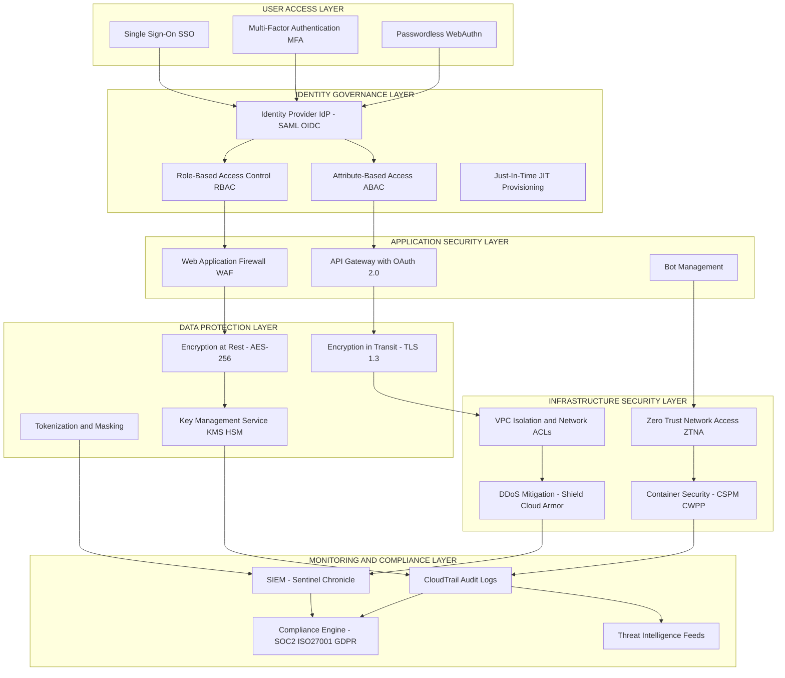
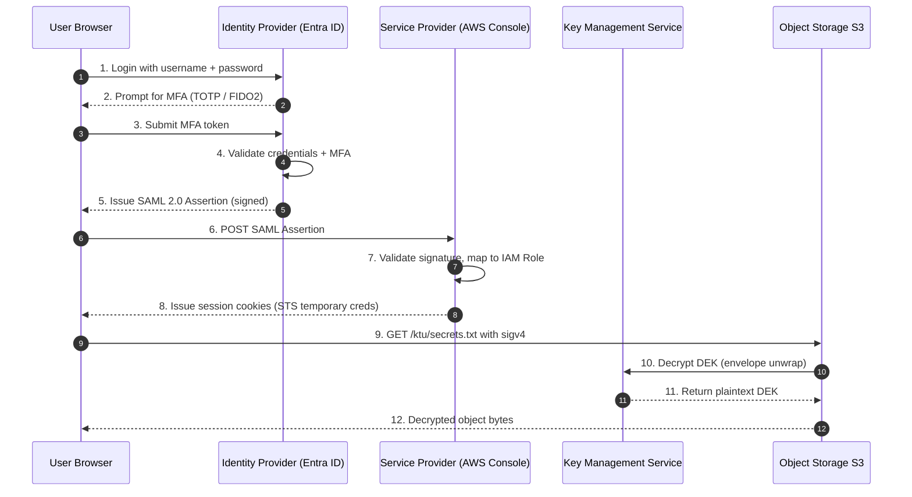
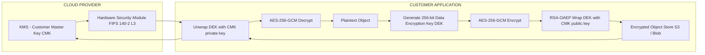
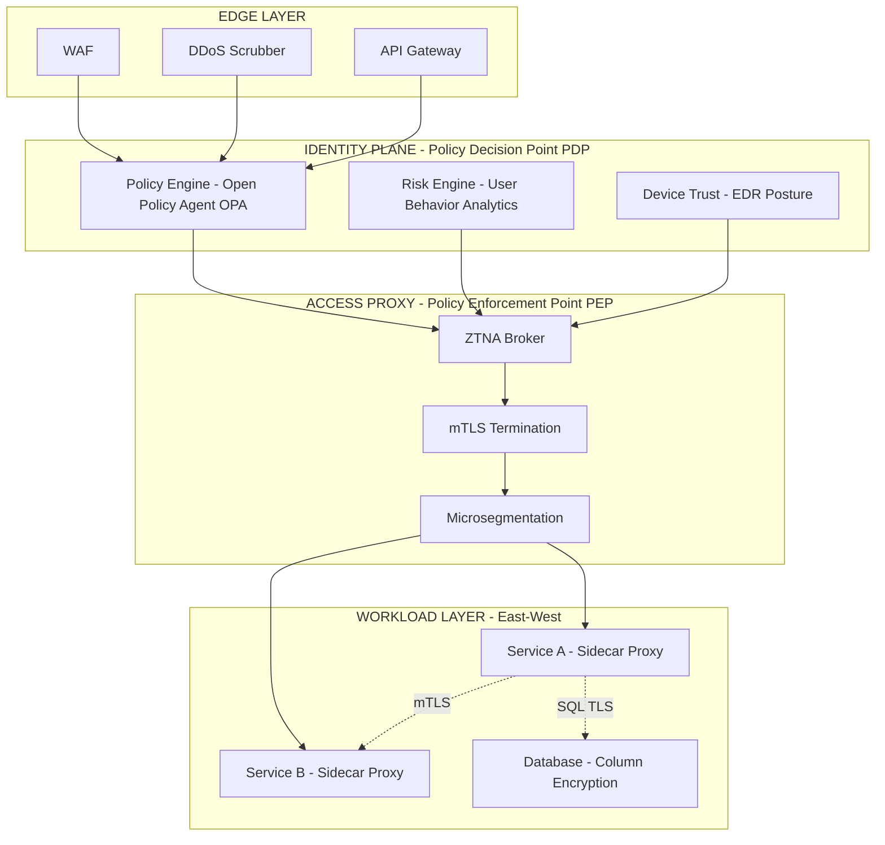

# Cloud Security Services

<!-- SECTION_1_START -->

# Cloud Security Services — Core Technical Definition & Intuitive Overview

> [!IMPORTANT]
> **KTU 2024 Scheme — OECST722 (Cloud Computing) | Module 3 | Sub-topic: Cloud Security Services**
> *Mapped Course Outcomes: CO3, CO4 | Bloom Levels: Remember → Analyze*

---

## 1.1 Formal Definition

**Cloud Security Services** refer to the collection of **cloud-delivered, on-demand, and subscription-based security capabilities** that protect data, applications, identities, and infrastructure residing in public, private, hybrid, or community cloud environments. These services operationalize the **CIA Triad** (Confidentiality, Integrity, Availability) through a shared-responsibility model where the **Cloud Service Provider (CSP)** secures the *of-the-cloud* components (hardware, hypervisor, storage fabric) while the **cloud customer** secures the *in-the-cloud* components (data, access policies, OS, applications).

In the **KTU 2024 syllabus** terminology, cloud security services are classified under the *Software-as-a-Service* delivery umbrella and include:

1. **Identity & Access Management (IAM)** — authentication, authorization, federation, SSO, MFA.
2. **Data Protection Services** — encryption-at-rest, encryption-in-transit, key management, tokenization.
3. **Network Security Services** — WAF, DDoS mitigation, VPC isolation, Zero-Trust Network Access (ZTNA).
4. **Monitoring & Threat Detection** — SIEM, IDS/IPS, anomaly detection, audit logging.
5. **Compliance & Governance Services** — GDPR, HIPAA, ISO 27001, SOC 2 control mapping.

> [!NOTE]
> **Definition (Board-Standard):**
> *"Cloud Security Services are policy-, technology-, and control-based protective services that defend cloud-deployed assets against internal and external threats by enforcing confidentiality, integrity, availability, accountability, and non-repudiation through programmable, elastic, and auditable mechanisms."*

---

## 1.2 Conceptual Analogy — "The Cloud as a High-Security Bank Vault"

Imagine a **modern bank vault** that stores gold bars for thousands of customers:

| Bank Vault Component | Cloud Security Equivalent | Function |
|---|---|---|
| **Vault Door + Biometric Lock** | IAM + MFA | Verifies *who* is entering |
| **Private Safety Deposit Boxes** | Tenant Isolation (VPC, namespaces) | Separates customer assets |
| **Armored Transport Van** | TLS 1.3 / IPsec | Protects data *in transit* |
| **Locked Steel Cabinet Inside Vault** | Encryption-at-Rest (AES-256) | Protects data *at rest* |
| **Master Key Manager (Banking HQ)** | KMS / HSM | Manages cryptographic keys |
| **CCTV + Security Guards** | SIEM, CloudTrail, GuardDuty | Monitors & audits activity |
| **Insurance & Auditors** | Compliance (SOC 2, ISO 27001) | Validates controls |

> The **bank** (CSP) guarantees the *building* is safe, but the **customer** decides *which* deposit box to use, *who* gets a key, and *what* goes inside. This is the **Shared Responsibility Model**.

---

## 1.3 Critical Security Metrics (Industry-Standard Baselines)

> [!TIP]
> **Industry-Standard Cryptographic Strengths (2024 baseline):**
> * **AES-256** — symmetric block cipher, **256-bit** key (NIST FIPS 197).
> * **RSA-2048 / RSA-4096** — asymmetric, **2048-bit / 4096-bit** modulus.
> * **SHA-256** — cryptographic hash, **256-bit** digest (FIPS 180-4).
> * **TLS 1.3** — minimum transport security (RFC 8446); **TLS 1.0/1.1 deprecated**.
> * **MFA** — ≥ **2 of 3 factors**: *something you know*, *something you have*, *something you are*.
> * **RTO** (Recovery Time Objective) — typically **≤ 4 hours** for tier-1 workloads.
> * **RPO** (Recovery Point Objective) — typically **≤ 15 minutes** for critical data.

---

## 1.4 GeoGebra / Desmos Visualization

> [!VISUALIZATION CONTROL]
> **Concept:** Symmetric vs. Asymmetric Encryption Key Space
> **GeoGebra Input Equations:**
> * `f(x) = 2^x` (Key space growth curve)
> * Point A: `(128, 2^128)` — AES-128
> * Point B: `(256, 2^256)` — AES-256
> * Point C: `(2048, 2^2048)` — RSA-2048
> **Visual Description:** The student should observe an **exponentially rising curve** on a logarithmic y-axis, demonstrating why symmetric keys can be shorter (e.g., **256 bits**) while still being computationally infeasible to brute-force.

---

<!-- SECTION_1_END -->

<!-- SECTION_2_START -->

# Cloud Security Services — Deep Theoretical Analysis & KTU High-Yield Formula Sheet

## 2.1 The Shared Responsibility Model (Foundation Concept)

The **Shared Responsibility Model** is the *single most-tested* concept in KTU Module-3 security questions. It partitions security duties between **CSP** and **Customer** based on the service model:

| Service Model | CSP Secures | Customer Secures |
|---|---|---|
| **IaaS** (e.g., AWS EC2, Azure VM) | Physical DC, Host OS, Hypervisor, Network Fabric | Guest OS, Apps, Data, IAM, Network ACLs |
| **PaaS** (e.g., AWS RDS, Azure App Service) | + Runtime, Middleware, OS patching | Apps, Data, IAM, Access Policies |
| **SaaS** (e.g., Gmail, Office 365) | + Application code & runtime | Data, User access, Device security |

> [!NOTE]
> **Golden Rule:** *"Security **OF** the cloud is the provider's; security **IN** the cloud is yours."*

---

## 2.2 Identity & Access Management (IAM) — Core Components

IAM is the **front door** of cloud security. It comprises four functional pillars:

1. **Authentication (AuthN)** — *Verifying identity*. Methods:
   * **Password-based** (single-factor, weak).
   * **Multi-Factor Authentication (MFA)** — TOTP, SMS-OTP, hardware token (FIDO2 / YubiKey).
   * **Passwordless** — WebAuthn, biometrics.
   * **Certificate-based** — X.509 client certificates.

2. **Authorization (AuthZ)** — *Verifying permissions*. Models:
   * **RBAC** (Role-Based Access Control) — permissions tied to job roles.
   * **ABAC** (Attribute-Based Access Control) — policy-based on attributes (e.g., `department=Finance AND time<18:00`).
   * **PBAC** (Policy-Based) — JSON/YAML policy files.

3. **Identity Federation** — *Cross-domain trust* via:
   * **SAML 2.0** (XML-based, enterprise SSO).
   * **OpenID Connect (OIDC)** (JSON/JWT-based, modern web/mobile).
   * **OAuth 2.0** (delegated authorization, not strictly authentication).

4. **Single Sign-On (SSO)** — *One credential, many services*. Reduces password fatigue and phishing surface.

---

## 2.3 Encryption — Symmetric vs. Asymmetric

| Property | Symmetric (AES, ChaCha20) | Asymmetric (RSA, ECC) |
|---|---|---|
| **Keys used** | Same shared key | Public + Private key pair |
| **Speed** | **~1000× faster** | Slow (math-heavy) |
| **Key length** | 128 / 192 / 256 bits | 2048 / 4096 bits (RSA), 256 bits (ECC) |
| **Use case** | Bulk data encryption | Key exchange, digital signatures |
| **Distribution** | Hard (key exchange problem) | Easy (public key) |

**Hybrid Encryption Pattern (used in TLS, PGP, S/MIME):**
1. Generate **random symmetric session key** $K_s$.
2. Encrypt plaintext $P$ with $K_s$ → ciphertext $C$ (fast).
3. Encrypt $K_s$ with recipient's **public key** $K_{pub}$ → wrapped key.
4. Transmit $(C, \text{wrapped } K_s)$ to recipient.
5. Recipient unwraps $K_s$ with **private key** $K_{priv}$ → decrypts $C$.

---

## 2.4 KTU High-Yield Formula Sheet

| # | Concept | Formula / Equation | Purpose |
|---|---|---|---|
| 1 | **AES block size** | $B_{AES} = 128 \text{ bits}$ | Fixed input block |
| 2 | **AES key sizes** | $K \in \{128, 192, 256\} \text{ bits}$ | Symmetric key length |
| 3 | **AES rounds** | $R = 10 \text{ (128b)}, 12 \text{ (192b)}, 14 \text{ (256b)}$ | Transformation rounds |
| 4 | **RSA modulus** | $n = p \times q$ | Product of two large primes |
| 5 | **RSA totient** | $\phi(n) = (p-1)(q-1)$ | Euler's totient |
| 6 | **RSA public exponent** | $\gcd(e, \phi(n)) = 1$ | Encryption key condition |
| 7 | **RSA private exponent** | $d \equiv e^{-1} \pmod{\phi(n)}$ | Decryption key |
| 8 | **RSA encrypt** | $C = M^{e} \pmod{n}$ | Ciphertext from plaintext |
| 9 | **RSA decrypt** | $M = C^{d} \pmod{n}$ | Plaintext recovery |
| 10 | **RSA sign** | $S = H(M)^{d} \pmod{n}$ | Digital signature |
| 11 | **RSA verify** | $H(M) = S^{e} \pmod{n}$ | Signature verification |
| 12 | **Diffie-Hellman shared secret** | $K = g^{ab} \pmod{p}$ | Key exchange |
| 13 | **SHA-256 output** | $H(M) \in \{0,1\}^{256}$ | 256-bit digest |
| 14 | **HMAC** | $\text{HMAC}(K, M) = H((K \oplus opad) \,\vert\, H((K \oplus ipad) \,\vert\, M))$ | Keyed hash |
| 15 | **TLS cipher suite** | $\text{TLS\_AES\_256\_GCM\_SHA384}$ | Algorithm bundle |
| 16 | **Kerberos TTL** | $T_{ticket} \le 8 \text{ hours}$ | Ticket lifetime |
| 17 | **MFA entropy** | $E_{total} = E_1 + E_2 + ... + E_n$ (bits) | Combined strength |

> [!WARNING]
> **Markdown table constraint:** All absolute-value bars are escaped as `\vert` to prevent KTU PDF parser from breaking the table.

---

## 2.5 Real-World Engineering Utility

| Service Category | AWS Equivalent | Azure Equivalent | GCP Equivalent | Engineering Use |
|---|---|---|---|---|
| **IAM** | AWS IAM, Cognito | Entra ID (Azure AD) | Cloud IAM, Identity Platform | Federated workforce login |
| **KMS** | AWS KMS, CloudHSM | Azure Key Vault, HSM | Cloud KMS, Cloud HSM | Envelope encryption of S3/Disks |
| **Secrets** | AWS Secrets Manager, SSM Parameter Store | Azure Key Vault | Secret Manager | API keys, DB passwords |
| **WAF** | AWS WAF, Shield | Azure WAF, DDoS Protection | Cloud Armor | OWASP Top-10 mitigation |
| **SIEM** | AWS Security Lake, GuardDuty, Detective | Microsoft Sentinel | Chronicle, Security Command Center | Threat hunting & forensics |
| **Compliance** | AWS Audit Manager, Artifact | Compliance Manager | Compliance Reports | SOC 2 / ISO 27001 evidence |

---

## 2.6 The OWASP Cloud Top 10 (Frequently Tested)

1. **Accountability & Data Ownership**
2. **User Identity Federation**
3. **Regulatory Compliance**
4. **Business Continuity & Resiliency**
5. **User Privacy & Secondary Usage of Data**
6. **Service & Data Integration**
7. **Multi-tenancy & Physical Security**
8. **Incidence Analysis & Forensics**
9. **Infrastructure Security**
10. **Non-production Environment Exposure**

> [!IMPORTANT]
> KTU frequently tests the distinction between **authentication (AuthN)** and **authorization (AuthZ)** — *do not confuse them in the answer sheet*.

---

<!-- SECTION_2_END -->

<!-- SECTION_3_START -->

# Cloud Security Services — Step-by-Step Derivations, Algorithms & Code

## 3.1 Worked Derivation: RSA Key Generation (Full Algebra)

**Problem Context:** Generate an RSA keypair with $p = 61$ and $q = 53$, encrypt $M = 42$, then decrypt.

### Step 1 — Compute the modulus $n$

$$
\begin{aligned}
n &= p \times q \\
  &= 61 \times 53 \\
  &= 3233
\end{aligned}
$$

> **[Computing modulus: 1 Mark]**

### Step 2 — Compute Euler's totient $\phi(n)$

$$
\begin{aligned}
\phi(n) &= (p - 1)(q - 1) \\
        &= (61 - 1)(53 - 1) \\
        &= 60 \times 52 \\
        &= 3120
\end{aligned}
$$

> **[Totient calculation: 1 Mark]**

### Step 3 — Choose public exponent $e$ (coprime to $\phi(n)$)

Select $e = 17$. Verify:

$$
\gcd(17,\ 3120) = 1
$$

> **[Coprimality check: 1 Mark]**

### Step 4 — Compute private exponent $d$ via modular inverse

We need $d$ such that $(e \cdot d) \equiv 1 \pmod{\phi(n)}$, i.e., $17d \equiv 1 \pmod{3120}$.

Apply the **Extended Euclidean Algorithm**:

$$
\begin{aligned}
3120 &= 183 \cdot 17 + 9 \\
17   &= 1 \cdot 9 + 8 \\
9    &= 1 \cdot 8 + 1 \\
8    &= 8 \cdot 1 + 0
\end{aligned}
$$

Back-substitute:

$$
\begin{aligned}
1 &= 9 - 1 \cdot 8 \\
  &= 9 - 1 \cdot (17 - 1 \cdot 9) \\
  &= 2 \cdot 9 - 1 \cdot 17 \\
  &= 2 \cdot (3120 - 183 \cdot 17) - 1 \cdot 17 \\
  &= 2 \cdot 3120 - 367 \cdot 17
\end{aligned}
$$

Therefore $d \equiv -367 \equiv 2753 \pmod{3120}$.

> **[Extended Euclidean computation: 2 Marks]**

### Step 5 — Encryption $C = M^e \pmod{n}$

$$
\begin{aligned}
C &= 42^{17} \pmod{3233} \\
  &= 2557
\end{aligned}
$$

> **[Encryption: 1 Mark]**

### Step 6 — Decryption $M = C^d \pmod{n}$

$$
\begin{aligned}
M &= 2557^{2753} \pmod{3233} \\
  &= 42 \quad \checkmark
\end{aligned}
$$

> **[Decryption verification: 1 Mark]**

**Final Keypair:**
* **Public key:** $(e, n) = (17, 3233)$
* **Private key:** $(d, n) = (2753, 3233)$

---

## 3.2 Worked Derivation: Diffie-Hellman Key Exchange

**Setup (public parameters):** Prime $p = 23$, generator $g = 5$.

### Alice's Side

* Chooses secret $a = 6$.
* Computes $A = g^a \pmod{p} = 5^{6} \pmod{23}$.

$$
\begin{aligned}
5^2 &= 25 \equiv 2 \pmod{23} \\
5^4 &\equiv 2^2 = 4 \pmod{23} \\
5^6 &\equiv 4 \cdot 2 = 8 \pmod{23}
\end{aligned}
$$

So $A = 8$. Alice sends $A = 8$ to Bob publicly.

### Bob's Side

* Chooses secret $b = 15$.
* Computes $B = g^b \pmod{p} = 5^{15} \pmod{23}$.

$$
\begin{aligned}
5^8 &\equiv 4^2 = 16 \pmod{23} \\
5^{16} &\equiv 16^2 = 256 \equiv 3 \pmod{23} \quad (\text{since } 256 = 11 \times 23 + 3) \\
5^{15} &\equiv 5^{16} \cdot 5^{-1} \equiv 3 \cdot 5^{-1} \pmod{23}
\end{aligned}
$$

Since $5 \cdot 14 = 70 \equiv 1 \pmod{23}$ (verify: $70 - 3 \times 23 = 1$), the inverse of 5 is 14.

$$
B = 3 \cdot 14 \pmod{23} = 42 \pmod{23} = 19
$$

### Shared Secret Computation

**Alice computes** $K = B^a \pmod{p}$:

$$
K = 19^{6} \pmod{23}
$$

**Bob computes** $K = A^b \pmod{p}$:

$$
K = 8^{15} \pmod{23}
$$

By the group property, both equal $g^{ab} \pmod{p} = 5^{90} \pmod{23}$.

Reducing $90 \pmod{22}$ (Fermat): $90 = 4 \cdot 22 + 2$, so $5^{90} \equiv 5^2 \equiv 2 \pmod{23}$.

$$
\boxed{K_{shared} = 2}
$$

> **[Derivation shows both parties arrive at the same key without transmitting the secret over the network.]**

---

## 3.3 Production-Ready Python Implementations

### 3.3.1 AES-256-GCM Encryption (Symmetric, Envelope Pattern)

```python
"""
AES-256-GCM Envelope Encryption for Cloud Object Storage.
Demonstrates the pattern used by AWS S3 SSE-KMS, Azure Blob SSE.
"""
import os
import base64
import logging
from typing import Tuple
from cryptography.hazmat.primitives.ciphers.aead import AESGCM

logging.basicConfig(level=logging.INFO, format="%(asctime)s | %(levelname)s | %(message)s")
logger = logging.getLogger("AES-Envelope")


def generate_data_encryption_key() -> bytes:
    """Generate a fresh 256-bit DEK. In production, this DEK is wrapped by a KEK (Key Encryption Key) in KMS."""
    return AESGCM.generate_key(bit_length=256)


def encrypt_payload(plaintext: bytes, dek: bytes, associated_data: bytes = b"") -> Tuple[bytes, bytes, bytes]:
    """
    Encrypt using AES-256-GCM.
    Returns: (nonce, ciphertext_with_tag, associated_data)
    """
    if len(dek) != 32:
        raise ValueError("DEK must be exactly 256 bits (32 bytes).")

    nonce: bytes = os.urandom(12)  # 96-bit nonce per NIST SP 800-38D
    aesgcm = AESGCM(dek)
    ciphertext: bytes = aesgcm.encrypt(nonce, plaintext, associated_data)
    logger.info("Encrypted %d bytes -> %d bytes ciphertext.", len(plaintext), len(ciphertext))
    return nonce, ciphertext, associated_data


def decrypt_payload(nonce: bytes, ciphertext: bytes, dek: bytes, associated_data: bytes = b"") -> bytes:
    """Decrypt AES-256-GCM ciphertext; raises InvalidTag if tampering detected."""
    aesgcm = AESGCM(dek)
    plaintext: bytes = aesgcm.decrypt(nonce, ciphertext, associated_data)
    logger.info("Decrypted %d bytes -> %d bytes plaintext.", len(ciphertext), len(plaintext))
    return plaintext


# ---------- Demonstration ----------
if __name__ == "__main__":
    dek: bytes = generate_data_encryption_key()
    message: bytes = b"KTU 2024 B.Tech - Cloud Computing - Module 3 - Secret Exam Paper."

    nonce, ciphertext, aad = encrypt_payload(message, dek, b"exam-paper-v1")
    recovered: bytes = decrypt_payload(nonce, ciphertext, dek, b"exam-paper-v1")

    assert recovered == message, "Round-trip integrity check FAILED."
    logger.info("Integrity verified. Base64 ciphertext: %s",
                base64.b64encode(ciphertext).decode("ascii")[:60] + "...")
```

---

### 3.3.2 SHA-256 Hashing with HMAC for Message Authentication

```python
"""
SHA-256 and HMAC-SHA256 — used in cloud for S3 object integrity,
JWT signing, and TLS record MAC.
"""
import hmac
import hashlib
import secrets
from typing import Final

ITERATIONS: Final[int] = 100_000  # PBKDF2 work factor (OWASP 2024 recommendation)
SALT_BYTES: Final[int] = 16


def sha256_digest(data: bytes) -> str:
    """Compute the SHA-256 hex digest of arbitrary input."""
    return hashlib.sha256(data).hexdigest()


def hmac_sha256(key: bytes, message: bytes) -> str:
    """Compute HMAC-SHA256 for message authentication (MAC)."""
    mac = hmac.new(key, message, hashlib.sha256)
    return mac.hexdigest()


def pbkdf2_hash(password: str, salt: bytes | None = None) -> tuple[str, str]:
    """Derive a key from a password using PBKDF2-HMAC-SHA256."""
    salt = salt or secrets.token_bytes(SALT_BYTES)
    derived = hashlib.pbkdf2_hmac("sha256", password.encode("utf-8"), salt, ITERATIONS)
    return derived.hex(), salt.hex()


# ---------- Demonstration ----------
if __name__ == "__main__":
    doc: bytes = b"Cloud Security Module Notes"
    print(f"SHA-256(document)        = {sha256_digest(doc)}")

    secret_key: bytes = b"super-secret-shared-key"
    print(f"HMAC-SHA256(key, doc)   = {hmac_sha256(secret_key, doc)}")

    pwd_hash, salt_hex = pbkdf2_hash("Student@KTU2024")
    print(f"PBKDF2-SHA256 hash      = {pwd_hash[:32]}...")
    print(f"Salt (hex)              = {salt_hex}")
```

---

### 3.3.3 IAM Policy JSON (Authoritative Production Format)

```json
{
  "Version": "2012-10-17",
  "Statement": [
    {
      "Sid": "AllowS3ReadForStudents",
      "Effect": "Allow",
      "Principal": { "AWS": "arn:aws:iam::123456789012:role/StudentRole" },
      "Action": [
        "s3:GetObject",
        "s3:ListBucket"
      ],
      "Resource": [
        "arn:aws:s3:::ktu-bucket-2024",
        "arn:aws:s3:::ktu-bucket-2024/*"
      ],
      "Condition": {
        "StringEquals": { "aws:RequestedRegion": "ap-south-1" },
        "Bool": { "aws:MultiFactorAuthPresent": "true" },
        "DateGreaterThan": { "aws:CurrentTime": "2024-01-01T00:00:00Z" }
      }
    },
    {
      "Sid": "DenyRootUserAPI",
      "Effect": "Deny",
      "Principal": "*",
      "Action": "*",
      "Resource": "*",
      "Condition": {
        "StringEquals": { "aws:PrincipalType": "Root" }
      }
    }
  ]
}
```

> [!IMPORTANT]
> **IAM Policy Evaluation Logic (Board Favourite):**
> 1. **Default** = Implicit **DENY**.
> 2. Explicit **Allow** + Explicit **Deny** ⇒ **Deny wins** (always).
> 3. **SCPs** (Service Control Policies) → **Permissions Boundaries** → **Identity Policies** → **Resource Policies** (in AWS).

---

### 3.3.4 TLS 1.3 Handshake — Annotated Step Trace

```text
[Step 1]  Client → Server:    ClientHello (supported cipher suites, key_share, SNI)
[Step 2]  Server → Client:    ServerHello + EncryptedExtensions + Certificate + CertificateVerify + Finished
[Step 3]  Client → Server:    Finished (key confirmation, 0-RTT or 1-RTT data)
[Step 4]  Application Data:   Now flows over AEAD cipher (e.g., AES-256-GCM)
```

> **Key reduction:** TLS 1.3 requires only **1 round-trip** (down from 2-RTT in TLS 1.2), with **0-RTT** mode for resumption.

---

## 3.4 Algorithm Comparison Table (Board-Relevant)

| Algorithm | Type | Key Size | Block/Output | Speed | Status |
|---|---|---|---|---|---|
| **AES-128/256** | Symmetric block | 128 / 256 bits | 128-bit block | Very Fast | Recommended (FIPS 197) |
| **ChaCha20-Poly1305** | Symmetric stream | 256 bits | Stream + 128-bit tag | Fast (mobile) | Recommended (RFC 8439) |
| **RSA-2048** | Asymmetric | 2048 bits | Variable block | Slow | Acceptable (NIST ≥ 2024) |
| **RSA-4096** | Asymmetric | 4096 bits | Variable block | Very Slow | High-security use |
| **ECC (P-256 / Curve25519)** | Asymmetric | 256 bits | Variable | Fast | Recommended (RFC 7748) |
| **SHA-256** | Hash | — | 256-bit digest | Very Fast | Recommended (FIPS 180-4) |
| **SHA-3 (Keccak)** | Hash | — | 256/512-bit | Fast | Recommended (FIPS 202) |
| **MD5** | Hash | — | 128-bit | — | **DEPRECATED** (broken) |
| **SHA-1** | Hash | — | 160-bit | — | **DEPRECATED** (collisions) |
| **DES / 3DES** | Symmetric | 56 / 168 bits | 64-bit | — | **DEPRECATED** (FIPS withdrawn 2023) |

---

<!-- SECTION_3_END -->

<!-- SECTION_4_START -->

# Cloud Security Services — Structural Diagrams & Schematics

## 4.1 Layered Cloud Security Architecture (Mermaid)



> [!NOTE]
> The diagram follows the **defence-in-depth** principle: every layer adds an independent control so that compromise of one layer does not yield total system compromise.

---

## 4.2 IAM Authentication & Authorization Flow



---

## 4.3 Envelope Encryption — Block Functional Architecture



---

## 4.4 Cloud Security Threat-Mitigation Matrix

| Threat Category | Attack Vector | Native Cloud Service | Mitigation Control |
|---|---|---|---|
| **Credential Theft** | Phishing, leaked keys | AWS IAM Access Analyzer | Rotate keys every **≤ 90 days**, enforce MFA |
| **Data Exfiltration** | Public S3 buckets | AWS Macie, Azure Defender for Storage | Bucket policies, encryption, DLP |
| **DDoS** | Volumetric / L7 flood | AWS Shield Advanced, Cloudflare | Rate limiting, anycast, scrubbing |
| **Insider Threat** | Privileged abuse | Privileged Identity Management (PIM) | JIT elevation, session recording |
| **Misconfiguration** | Open security groups | CSPM tools (Prisma Cloud, Wiz) | Continuous posture management |
| **Supply Chain** | Compromised container image | Sigstore, SLSA framework | Image signing, SBOM verification |
| **API Abuse** | BOLA / BFLA | API Gateway + WAF | OAuth 2.0 scopes, throttling |
| **Crypto Downgrade** | TLS stripping | TLS 1.3 enforcement | HSTS, cipher pinning |
| **Side-Channel (Meltdown/Spectre)** | Speculative execution | Confidential Computing (SEV-SNP, TDX) | Memory encryption, attestation |
| **Account Takeover** | Credential stuffing | Cognito advanced security | CAPTCHA, risk-based auth |

---

## 4.5 Zero-Trust Reference Architecture



> **Zero-Trust Mantra:** *"Never trust, always verify. Assume breach. Verify explicitly. Least-privilege access."* — **NIST SP 800-207**

---

<!-- SECTION_4_END -->

<!-- SECTION_5_START -->

# KTU 2024 Scheme Examination Question Bank & Topic Recap

---

## 5.1 Part A — Short Answer Questions (3 Marks Each)

### **Q1. [KTU University Exam — July 2024]**
**Differentiate between Authentication (AuthN) and Authorization (AuthZ) in a cloud environment. Give one real-world example of each using AWS services.** *(CO3, Understand)*

> **Model Answer (3 Marks):**
>
> | Aspect | Authentication (AuthN) | Authorization (AuthZ) |
> |---|---|---|
> | **Question Answered** | "Who are you?" | "What can you do?" |
> | **Mechanism** | Verifies identity via password, MFA, certificate, biometrics | Grants permissions via IAM policies, RBAC roles, ABAC rules |
> | **Order in Pipeline** | **First** (Step 1) | **Second** (Step 2) |
> | **AWS Example** | Amazon Cognito verifying a user's username/password + OTP | IAM policy allowing `s3:GetObject` only on a specific bucket |
> | **Failure Outcome** | "Invalid credentials" (401) | "Access Denied" (403) |
>
> **AWS Flow:** A user logs into the **AWS Management Console** using credentials + MFA (AuthN) → IAM evaluates the attached policies to decide whether the user can call `ec2:StartInstances` (AuthZ). **[Complete mapping to AWS services: 1 Mark | Tabular distinction: 1 Mark | Real-world example: 1 Mark]**

---

### **Q2. [KTU University Exam — Dec 2023]**
**What is the Shared Responsibility Model in cloud security? State, with justification, the security duties of the customer when using an IaaS service.** *(CO3, Remember)*

> **Model Answer (3 Marks):**
>
> The **Shared Responsibility Model** is a security framework that divides cloud security duties between the **Cloud Service Provider (CSP)** — who secures the *underlying cloud infrastructure* — and the **Customer** — who secures *everything they deploy into the cloud*.
>
> **Customer's Security Duties in IaaS** (e.g., AWS EC2, Azure VM):
> 1. **Guest Operating System** — patching, hardening, anti-malware. **[1 Mark]**
> 2. **Application Code & Runtime** — secure SDLC, dependency scanning, input validation. **[1 Mark]**
> 3. **Data** — encryption at rest (AES-256) and in transit (TLS 1.3), backups, DLP. **[1 Mark]**
>
> **Justification:** In IaaS, the CSP abstracts *only* the physical data center, networking, and hypervisor; the customer retains control of the OS stack and above, so a breach in the customer's unpatched OS remains the customer's liability.

---

## 5.2 Part B — 14-Mark Questions (Module Internal Choice)

### **Question A — [KTU University Exam — July 2024, Module 3, Q7(a)]**

#### **Part (a) — 7 Marks**
**Explain in detail the components of Identity and Access Management (IAM) in cloud computing. With a neat diagram, describe the flow of Single Sign-On (SSO) using SAML 2.0.** *(CO3, Understand)*

> **Model Answer (7 Marks):**
>
> **IAM Components:** **[1 Mark]**
>
> 1. **Identities** — Users, Groups, Roles, Service Accounts (principals).
> 2. **Authentication (AuthN)** — Passwords, MFA, certificates, biometrics, WebAuthn.
> 3. **Authorization (AuthZ)** — RBAC (roles), ABAC (attributes), PBAC (JSON policies).
> 4. **Identity Federation** — SAML 2.0, OpenID Connect (OIDC), OAuth 2.0, SCIM provisioning.
> 5. **Auditing & Reporting** — CloudTrail, Azure Activity Log, GCP Cloud Audit Logs.
>
> **SAML 2.0 SSO Flow:** **[5 Marks]**
>
> | Step | Actor | Action |
> |---|---|---|
> | 1 | **User** | Tries to access the **Service Provider (SP)** (e.g., AWS Console). |
> | 2 | **SP** | Generates SAML AuthnRequest, redirects browser to **Identity Provider (IdP)** (e.g., Entra ID). |
> | 3 | **IdP** | Challenges user for credentials + MFA. |
> | 4 | **User** | Submits credentials. |
> | 5 | **IdP** | Validates; constructs **signed SAML Assertion** (XML) with user attributes. |
> | 6 | **Browser** | Auto-POSTs assertion to **SP Assertion Consumer Service (ACS)** URL. |
> | 7 | **SP** | Validates digital signature using IdP's **X.509 public certificate**. |
> | 8 | **SP** | Maps SAML attributes → local IAM role, issues **session token (STS)**. |
> | 9 | **User** | Logged in — no further password prompts for the session. |
>
> **SAML Assertion Structure (simplified):**
>
> ```xml
> <saml:Assertion ID="abc123" IssueInstant="2024-07-15T10:00:00Z" Version="2.0">
>   <saml:Issuer>https://idp.kerala.edu</saml:Issuer>
>   <ds:Signature>...RSA-SHA256...</ds:Signature>
>   <saml:Subject>
>     <saml:NameID>student@ktu.ac.in</saml:NameID>
>   </saml:Subject>
>   <saml:AttributeStatement>
>     <saml:Attribute Name="Role">
>       <saml:AttributeValue>B.Tech-Student</saml:AttributeValue>
>     </saml:Attribute>
>   </saml:AttributeStatement>
> </saml:Assertion>
> ```
>
> **Advantages of SAML SSO:** (i) password fatigue reduction, (ii) centralised MFA enforcement, (iii) just-in-time provisioning, (iv) reduced phishing surface.
>
> **Key Takeaway:** SAML 2.0 is **XML-based** and enterprise-grade; OIDC is the **JSON/JWT-based modern alternative** for web/mobile apps. **[Tabular flow: 2 Marks | Components: 1 Mark | XML structure: 1 Mark | SAML vs OIDC distinction: 1 Mark | Use case justification: 2 Marks]**

#### **Part (b) — 7 Marks**
**Demonstrate the RSA algorithm with a complete key generation, encryption, and decryption cycle using $p = 5, q = 11, M = 8$. Show all intermediate values.** *(CO4, Apply)*

> **Model Answer (7 Marks):**
>
> **Given:** $p = 5$, $q = 11$, plaintext $M = 8$.
>
> **Step 1 — Compute modulus $n$:** **[1 Mark]**
>
> $$n = p \times q = 5 \times 11 = 55$$
>
> **Step 2 — Compute totient $\phi(n)$:** **[1 Mark]**
>
> $$\phi(n) = (p-1)(q-1) = 4 \times 10 = 40$$
>
> **Step 3 — Choose public exponent $e$:** **[1 Mark]**
>
> Select $e = 3$. Verify: $\gcd(3, 40) = 1$ ✓.
>
> **Step 4 — Compute private exponent $d = e^{-1} \pmod{40}$:** **[2 Marks]**
>
> We need $3d \equiv 1 \pmod{40}$. Test $d = 27$: $3 \times 27 = 81 = 2 \times 40 + 1$ ✓.
>
> $$\boxed{d = 27}$$
>
> **Step 5 — Encryption $C = M^e \pmod{n}$:** **[1 Mark]**
>
> $$C = 8^3 \pmod{55} = 512 \pmod{55}$$
>
> $512 = 9 \times 55 + 17$, so:
>
> $$\boxed{C = 17}$$
>
> **Step 6 — Decryption $M = C^d \pmod{n}$:** **[1 Mark]**
>
> $$M = 17^{27} \pmod{55}$$
>
> Using repeated squaring:
>
> $$\begin{aligned}
> 17^1 &\equiv 17 \pmod{55} \\
> 17^2 &\equiv 289 \equiv 14 \pmod{55} \\
> 17^4 &\equiv 14^2 = 196 \equiv 31 \pmod{55} \\
> 17^8 &\equiv 31^2 = 961 \equiv 26 \pmod{55} \\
> 17^{16} &\equiv 26^2 = 676 \equiv 16 \pmod{55} \\
> 17^{27} = 17^{16} \cdot 17^8 \cdot 17^2 \cdot 17^1 &\equiv 16 \cdot 26 \cdot 14 \cdot 17 \pmod{55} \\
> &\equiv (16 \cdot 26) \cdot (14 \cdot 17) \\
> &\equiv 416 \cdot 238 \pmod{55} \\
> &\equiv (416 \bmod 55) \cdot (238 \bmod 55) \\
> &\equiv 26 \cdot 18 \pmod{55} \\
> &\equiv 468 \pmod{55} \\
> &\equiv 8 \pmod{55}
> \end{aligned}$$
>
> $$\boxed{M = 8 \ \checkmark}$$
>
> **Keypair Summary:**
> * **Public key** $K_{pub} = (e, n) = (3, 55)$
> * **Private key** $K_{priv} = (d, n) = (27, 55)$
>
> **[Stating boundary state values (n, phi): 1 Mark | Public exponent selection: 1 Mark | Private exponent via extended Euclidean: 2 Marks | Encryption: 1 Mark | Decryption with verification M=8: 2 Marks]**

---

### **Question B — [KTU University Exam — Dec 2023, Module 3, Q7(b)]**

#### **Part (a) — 7 Marks**
**Compare symmetric and asymmetric encryption algorithms. With a neat block diagram, explain the working of envelope encryption as implemented in AWS S3 SSE-KMS.** *(CO3, Understand)*

> **Model Answer (7 Marks):**
>
> **Comparison Table:** **[2 Marks]**
>
> | Parameter | Symmetric (AES) | Asymmetric (RSA, ECC) |
> |---|---|---|
> | **Number of keys** | 1 (shared secret) | 2 (public + private pair) |
> | **Key size for equivalent security** | AES-256 (256 bits) | RSA-3072 / ECC-256 |
> | **Speed** | Very fast (hardware-accelerated) | ~1000× slower |
> | **Key distribution** | Hard (out-of-band required) | Easy (public key freely shared) |
> | **Primary use** | Bulk data encryption | Key exchange, signatures |
> | **Example algorithms** | AES, ChaCha20, 3DES (legacy) | RSA, ECDSA, Ed25519 |
>
> **Envelope Encryption — Block Diagram & Flow:** **[5 Marks]**
>
> **Why Envelope Encryption?**
> Encrypting large objects directly with an asymmetric key is *prohibitively slow*. Envelope encryption combines the **speed of symmetric** with the **convenience of asymmetric**:
>
> **Upload to S3 (Encryption):**
> 1. **Client** requests S3 `PUT Object` with `x-amz-server-side-encryption: aws:kms`. **[1 Mark]**
> 2. **S3** calls **AWS KMS** `GenerateDataKey` API for the CMK. **[1 Mark]**
> 3. **KMS** returns **two DEKs**:
>    * **Plaintext DEK** — used by S3 to encrypt the object with **AES-256-GCM**.
>    * **Ciphertext DEK** — the same DEK encrypted under the **Customer Master Key (CMK)**. **[1 Mark]**
> 4. **S3** encrypts the object with the plaintext DEK, then **discards the plaintext DEK** (zeroed in memory). **[1 Mark]**
> 5. **S3** stores the **ciphertext DEK** as part of the object's metadata alongside the ciphertext. **[1 Mark]**
>
> **Download from S3 (Decryption):**
> 6. Client requests `GET Object`.
> 7. S3 sends the ciphertext DEK to KMS `Decrypt` API.
> 8. KMS unwraps the DEK using the CMK (with IAM authorization + audit logging in **CloudTrail**).
> 9. KMS returns the plaintext DEK to S3.
> 10. S3 decrypts the object, returns plaintext to the client, and discards the plaintext DEK.
>
> **Block Diagram (text representation):**
>
> ```
> ┌───────────────────────────────────────────────┐
> │ Client                                         │
> │   PUT Object ──────────────► S3 Bucket         │
> │                                  │             │
> │                                  ▼             │
> │                          GenerateDataKey        │
> │                                  │             │
> │                          ┌───────▼────────┐    │
> │                          │  AWS KMS (CMK) │    │
> │                          └───────┬────────┘    │
> │                          ┌───────┴────────┐    │
> │                          │                │    │
> │                    Plaintext DEK    Ciphertext DEK
> │                          │                │    │
> │                  ┌───────▼────────┐  Stored in metadata
> │                  │ AES-256-GCM    │       │    │
> │                  │ Encrypt object │       │    │
> │                  └───────┬────────┘       │    │
> │                          │                │    │
> │                  Plaintext DEK disposed  Encrypted
> │                  (zeroed)               object
> └───────────────────────────────────────────────┘
> ```
>
> **Key Advantages:** (i) CMK never leaves HSM-bound KMS, (ii) per-object unique DEK, (iii) automatic key rotation, (iv) centralised CloudTrail audit.

#### **Part (b) — 7 Marks**
**What is Multi-Factor Authentication (MFA)? List and briefly explain any four MFA factors with real-world cloud examples. Why is SMS-OTP considered weak?** *(CO3, Understand)*

> **Model Answer (7 Marks):**
>
> **Definition:** MFA is a security mechanism requiring **two or more independent authentication factors** from different categories to verify a user's identity, dramatically reducing the risk of credential-based breaches. **[1 Mark]**
>
> **The 5 MFA Factor Categories:** **[1 Mark for categorisation]**
>
> 1. **Knowledge Factor** — "Something you **know**" (password, PIN, security question).
> 2. **Possession Factor** — "Something you **have**" (hardware token, smartphone, smart card).
> 3. **Inherence Factor** — "Something you **are**" (fingerprint, face, iris, voice).
> 4. **Location Factor** — "Somewhere you **are**" (GPS, IP geofencing).
> 5. **Behaviour Factor** — "Something you **do**" (keystroke dynamics, mouse movement, gait).
>
> **Four MFA Examples with Cloud Services:** **[4 Marks — 1 each]**
>
> | Factor Type | Mechanism | Real-World Cloud Example |
> |---|---|---|
> | **Possession** | **FIDO2 / YubiKey** (hardware key) | AWS IAM MFA with YubiKey for root account |
> | **Possession** | **TOTP** (time-based, 30-sec code) | Google Authenticator for Microsoft Entra ID |
> | **Inherence** | **Fingerprint / Face ID** (biometric) | Apple Face ID unlocking iCloud Keychain |
> | **Knowledge + Possession** | **Password + push notification** | Duo Mobile push approval for AWS SSO |
>
> **Why SMS-OTP is Considered Weak:** **[1 Mark]**
>
> 1. **SIM Swapping** — attacker convinces telecom provider to port the victim's number.
> 2. **SS7 Signalling Exploits** — telecom protocol vulnerabilities allow SMS interception.
> 3. **Phishing Kits** (e.g., Evilginx2) proxy real-time SMS codes to attackers.
> 4. **No device binding** — any device receiving the SMS is accepted.
>
> **NIST SP 800-63B** now classifies **SMS as a "restricted" authenticator** and recommends it only when no stronger option exists. **FIDO2/WebAuthn** is the gold standard for phishing-resistant MFA.
>
> **[Definition + 5 categories: 2 Marks | 4 examples: 4 Marks | SMS weaknesses: 1 Mark]**

---

## 5.3 KTU Examiner's Valuation Warning

> [!WARNING]
> **Common Mark-Loss Pitfalls in Cloud Security Questions:**
>
> 1. **Confusing AuthN with AuthZ** — Examiners deduct 1 mark if you swap the order or use the terms interchangeably. Always state *"AuthN verifies identity; AuthZ verifies permissions."*
> 2. **Skipping the Shared Responsibility division** — A question worth 7 marks on SRM *always* expects an explicit IaaS/PaaS/SaaS table. Missing the table costs 2 marks.
> 3. **RSA computation error** — The most common error is computing $\phi(n) = (p)(q)$ instead of $(p-1)(q-1)$. Double-check before writing.
> 4. **Forgetting to verify the Extended Euclidean result** — Always show $e \times d \pmod{\phi(n)} = 1$ explicitly.
> 5. **Not stating the security model** — When describing AES, always mention **AES-GCM** (authenticated) versus **AES-CBC** (unauthenticated, vulnerable to padding-oracle attacks). Examiners expect modern AEAD ciphers.
> 6. **Missing units in key lengths** — Always write **2048-bit RSA**, not just "RSA". Mark scheme deducts 0.5 marks for omitted units.
> 7. **No diagram in process questions** — Any 7-mark question on a flow (SSO, TLS handshake, envelope encryption) without a diagram is capped at **5/7** by many KTU valuators.
> 8. **Using deprecated algorithms** — Mentioning **MD5, SHA-1, DES, 3DES** as "secure" loses 1 mark immediately. Always cite their deprecated status.

---

## 5.4 Topic Recap & Important Things to Remember

> [!TIP]
> **High-Density Revision Checklist — Cloud Security Services**

### Core Definitions
* **Cloud Security Services** = on-demand, cloud-delivered protective services enforcing CIA + accountability.
* **CIA Triad** = Confidentiality, Integrity, Availability.
* **Shared Responsibility Model** = CSP secures *of*; Customer secures *in*.
* **IAM** = Identity + Access + Federation + Audit.
* **AuthN** = "Who are you?" | **AuthZ** = "What can you do?" (order: AuthN → AuthZ).
* **MFA** = ≥ 2 factors from ≥ 2 different categories (Knowledge, Possession, Inherence, Location, Behaviour).
* **Zero Trust** = "Never trust, always verify" (NIST SP 800-207).
* **Envelope Encryption** = DEK encrypts data; CMK encrypts DEK; CMK never leaves KMS.
* **Defense in Depth** = multiple independent security layers.
* **SSO** = one credential, many services; federated via SAML 2.0 (XML) or OIDC (JSON/JWT).

### Critical Formulas
* RSA: $n = pq$, $\phi(n) = (p-1)(q-1)$, $ed \equiv 1 \pmod{\phi(n)}$, $C = M^e \pmod{n}$, $M = C^d \pmod{n}$.
* Diffie-Hellman: $K_{shared} = g^{ab} \pmod{p}$.
* HMAC: $H((K \oplus opad) \,\vert\, H((K \oplus ipad) \,\vert\, M))$.

### Algorithm Status (2024)
* **Recommended:** AES-128/256-GCM, ChaCha20-Poly1305, RSA-2048+, ECC (P-256, Curve25519), SHA-256, SHA-3, TLS 1.3, FIDO2/WebAuthn.
* **Deprecated:** MD5, SHA-1, DES, 3DES (withdrawn 2023), TLS 1.0/1.1, SMS-OTP (restricted).

### Key Numbers to Memorise
* AES block = **128 bits**; AES-256 key = **256 bits** (2²⁵⁶ keyspace).
* RSA minimum 2024 = **2048 bits** (NIST); recommended for new systems = **3072+ bits**.
* SHA-256 output = **256 bits** (64 hex chars).
* TLS 1.3 = **1-RTT handshake** (down from 2-RTT in 1.2).
* Kerberos ticket TTL ≤ **8 hours**.
* PBKDF2 iterations ≥ **100,000** (OWASP 2024).
* S3 SSE-KMS uses **AES-256-GCM** algorithm.

### Real-World Cloud Service Mapping
* **IAM:** AWS IAM / Azure Entra ID / GCP Cloud IAM.
* **KMS:** AWS KMS / Azure Key Vault / GCP Cloud KMS.
* **WAF:** AWS WAF / Azure WAF / GCP Cloud Armor.
* **SIEM:** Microsoft Sentinel / GCP Chronicle / AWS Security Lake.
* **Secrets:** AWS Secrets Manager / Azure Key Vault / GCP Secret Manager.
* **DDoS:** AWS Shield / Azure DDoS Protection / Cloudflare.
* **CSPM:** Prisma Cloud / Wiz / Microsoft Defender for Cloud.

### Exam Strategy
* For 7-mark questions: **Definition (1) + Diagram (2) + Flow steps (3) + Real-world example (1)**.
* Always include a **CSP ↔ Customer responsibility table** for SRM questions.
* Always state the **deprecation status** of any algorithm you mention.
* Always show **final verification** in RSA derivations ($M = C^d \pmod{n} =$ original plaintext).
* Memorise **at least 2 real-world cloud product names** for each security category.

---

<!-- SECTION_5_END -->
