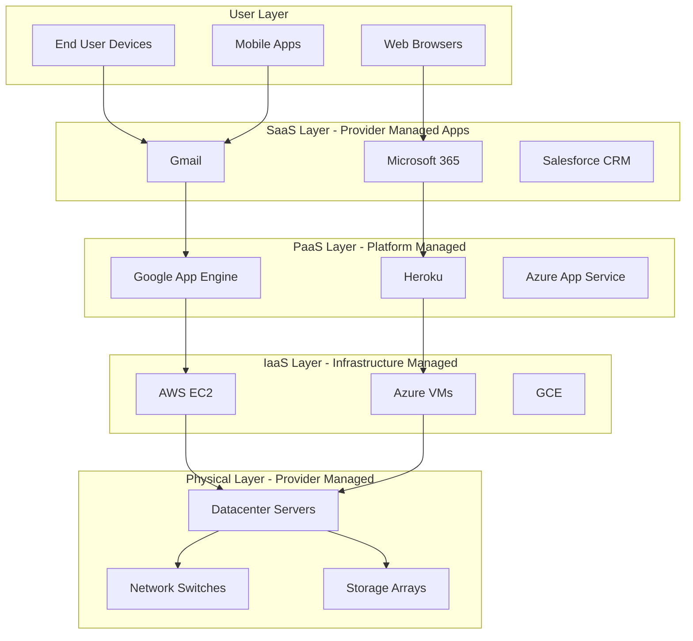
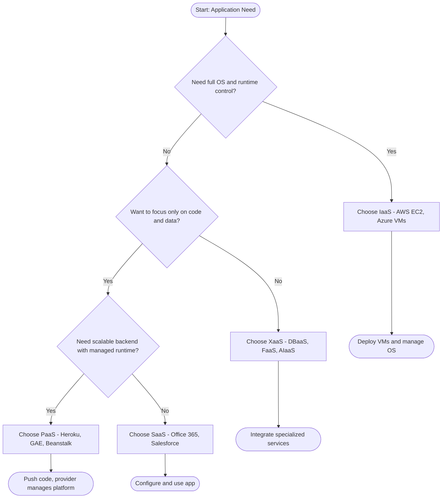
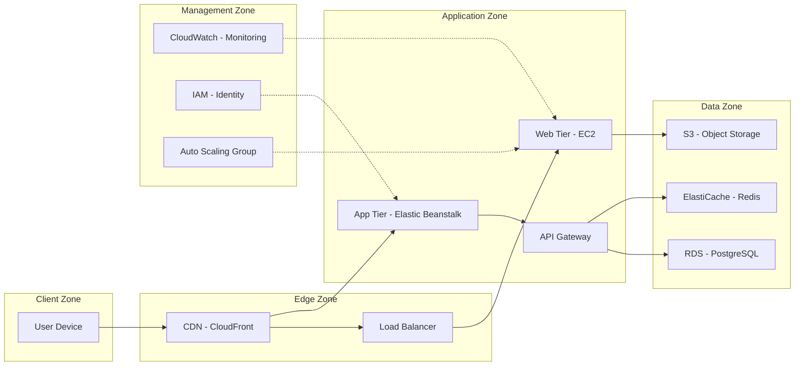
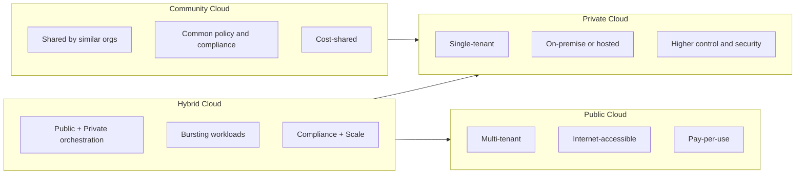

# Cloud Services

<!-- SECTION_1_START -->

# 1. Core Technical Definition & Intuitive Overview

## 1.1 Formal Academic Definition

**Cloud Services** are a broad collection of on-demand, network-accessible, elastic, and metered computing resources delivered over the Internet under a *pay-as-you-go* utility-based consumption model. According to the **NIST SP 800-145** definition (adopted by KTU 2024 syllabus), cloud computing is "a model for enabling ubiquitous, convenient, on-demand network access to a shared pool of configurable computing resources (e.g., networks, servers, storage, applications, and services) that can be rapidly provisioned and released with minimal management effort or service provider interaction."

In the context of **KTU OECST722 - Module 3**, *Cloud Services* refers to the **service-oriented abstraction layers** through which cloud providers expose compute, storage, networking, and application capabilities to end-users. These services are categorized into three primary service models (the *SPI* model — **SaaS, PaaS, IaaS**) and extended into the **XaaS (Anything as a Service)** umbrella.

> [!IMPORTANT]
> **KTU 2024 Syllabus Highlight:** The three service models (IaaS, PaaS, SaaS) along with deployment models (Public, Private, Hybrid, Community) form a **5-mark guaranteed question** in ESE Module 3.

## 1.2 Conceptual Analogy / Intuition

Imagine cloud services like a **multi-tiered restaurant experience**:

| Tier | Real-World Analogy | Cloud Equivalent |
|------|--------------------|------------------|
| Infrastructure | Renting the entire kitchen, gas, raw ingredients, and cooking your own meal | **IaaS** (EC2, Azure VMs) |
| Platform | Renting a kitchen with pre-set appliances — you just cook your recipe | **PaaS** (Google App Engine, Heroku) |
| Software | Ordering a fully cooked meal from the menu — just eat it | **SaaS** (Gmail, Office 365) |
| Everything Else | Buffet, drive-through, catering, vending machine | **XaaS** (DBaaS, FaaS, AIaaS) |

> [!NOTE]
> **Key Insight:** As you move up the stack (from IaaS → PaaS → SaaS), the cloud provider manages **more** of the stack, and the consumer manages **less**. This is the *Shared Responsibility Model* in its simplest form.

## 1.3 The Five Essential Characteristics (NIST)

The NIST standard (which KTU references) lists **five essential characteristics** of any genuine cloud service:

1. **On-demand self-service** — Resources provisioned automatically without human intervention.
2. **Broad network access** — Available over standard networks via thin/thick clients.
3. **Resource pooling** — Multi-tenant model pooling resources dynamically.
4. **Rapid elasticity** — Capabilities scale out/in quickly with demand.
5. **Measured service** — Metered usage (storage, bandwidth, CPU-hours) for transparency.

> [!TIP]
> **Mnemonic for KTU exams:** "**O-B-R-R-M**" → **O**n-demand, **B**road access, **R**esource pooling, **R**apid elasticity, **M**easured service.

## 1.4 GeoGebra / Desmos Visualization

> [!VISUALIZATION CONTROL]
> **Concept:** Service Model Stack Pyramid (IaaS → PaaS → SaaS)
> **GeoGebra / Desmos Input Equations:**
> * Rectangle coordinates for layers: `(0,0)` to `(10,3)` for IaaS base, `(1,3)` to `(9,6)` for PaaS, `(2,6)` to `(8,9)` for SaaS apex.
> * Side label: `f(x) = 0.6x + 2` (left slope of pyramid).
> **Visual Description:** Students should observe a **pyramid/triangle** where the base layer is the widest (Infrastructure) and the topmost apex is the narrowest (Software). The "Consumer Control" decreases as we ascend, while "Provider Control" increases.

<!-- SECTION_1_END -->

<!-- SECTION_2_START -->

# 2. Deep Theoretical Analysis & KTU High-Yield Formula Sheet

## 2.1 The Three Primary Service Models — Detailed Breakdown

### 2.1.1 Infrastructure as a Service (IaaS)

**Definition:** IaaS provides fundamental computing resources — *processing, storage, networks, and servers* — over the Internet. The consumer can deploy arbitrary software (OS, middleware, applications) and has control over the OS and storage, but does not manage the underlying cloud infrastructure.

**Core Capabilities:**
- Provision of **virtual machines (VMs)**, raw block storage, virtual private networks, and load balancers.
- Consumer controls: **OS, applications, data, runtime, middleware**.
- Provider controls: **Physical servers, storage, networking, hypervisor, datacenter**.

**Examples:** Amazon EC2, Google Compute Engine (GCE), Microsoft Azure Virtual Machines, DigitalOcean Droplets.

### 2.1.2 Platform as a Service (PaaS)

**Definition:** PaaS provides a **managed platform** where consumers can deploy their own applications without managing the underlying infrastructure. The provider manages the OS, runtime, middleware, and even some development tools.

**Core Capabilities:**
- Includes OS, runtime environment (Java, Python, Node.js), databases, queues, workflow engines.
- Consumer controls: **Applications and data** only.
- Provider controls: Everything else (network, servers, OS, storage, virtualization, runtime, middleware).

**Examples:** Google App Engine (GAE), Microsoft Azure App Service, Heroku, Red Hat OpenShift, AWS Elastic Beanstalk.

### 2.1.3 Software as a Service (SaaS)

**Definition:** SaaS delivers fully functional, ready-to-use applications hosted by the provider, accessible via a web browser or API. The consumer does **not** manage the platform or infrastructure — only their own configuration and data.

**Core Capabilities:**
- Applications run on the provider's infrastructure.
- Consumer controls: **Limited user-specific configuration and own data**.
- Provider controls: All layers from app to physical hardware.

**Examples:** Gmail, Microsoft 365, Salesforce, Slack, Dropbox, Zoom, Google Workspace.

> [!NOTE]
> **Comparison Insight for KTU:** SaaS has the **lowest TCO (Total Cost of Ownership)** for end-users but the **least flexibility**, while IaaS offers **maximum flexibility** but requires skilled DevOps teams.

## 2.2 Deployment Models

| Deployment Model | Description | Consumer | Use Case |
|------------------|-------------|----------|----------|
| **Public Cloud** | Owned by provider, open to general public | General public | SaaS apps, web hosting |
| **Private Cloud** | Operated solely for one organization | Single enterprise | Banks, defense, healthcare |
| **Hybrid Cloud** | Composition of two or more distinct cloud infrastructures bound by standardized/ proprietary tech | Multiple | Bursting workloads, DR |
| **Community Cloud** | Shared by organizations with common concerns (e.g., security, compliance) | Specific community | Government, research consortia |

## 2.3 Extended Service Models — XaaS Family

| Service Model | Full Form | Description |
|---------------|-----------|-------------|
| **DaaS** | Desktop as a Service | Virtual desktop delivery (e.g., Amazon WorkSpaces) |
| **DBaaS** | Database as a Service | Managed DBs (e.g., AWS RDS, Firebase) |
| **FaaS** | Function as a Service | Serverless compute (e.g., AWS Lambda) |
| **STaaS** | Storage as a Service | Object storage (e.g., AWS S3) |
| **AIaaS** | AI as a Service | ML model APIs (e.g., Google Vertex AI) |
| **MLaaS** | Machine Learning as a Service | Pre-trained models (e.g., Azure ML) |
| **CaaS** | Containers as a Service | Container orchestration (e.g., AWS ECS) |
| **BaaS** | Backend as a Service | Mobile backends (e.g., Firebase, Supabase) |
| **IaaS+** | Anything/Everything as a Service | Umbrella term for all the above |

## 2.4 KTU Formula Sheet / Cheat Sheet

> [!IMPORTANT]
> **KTU High-Yield Equations & Metrics for Cloud Services**

| Concept | Formula / Parameter | Units / Notes |
|---------|---------------------|---------------|
| **Cost of Pay-as-you-go** | $C = \sum_{i=1}^{n} (u_i \cdot p_i \cdot t_i)$ | $u_i$ = resource units, $p_i$ = unit price, $t_i$ = time of usage |
| **Elasticity Ratio** | $E = \dfrac{\text{Peak Capacity}}{\text{Average Capacity}}$ | Optimal $E \approx 1$ (ideal auto-scaling) |
| **Availability SLA** | $\text{Downtime}_{\text{yearly}} = (1 - A) \cdot 365 \cdot 24 \cdot 60$ min | $A$ = availability fraction (e.g., 0.9999) |
| **Server Utilization** | $U = \dfrac{\text{Actual Workload}}{\text{Peak Capacity}} \times 100\%$ | Goal: maximize $U$ to reduce cost |
| **ROI of Cloud Migration** | $\text{ROI} = \dfrac{(\text{Gain} - \text{Cost})}{\text{Cost}} \times 100\%$ | Compared over 3–5 year TCO |
| **TCO Comparison** | $\text{TCO}_{\text{cloud}} = C_{\text{usage}} + C_{\text{migration}} + C_{\text{training}}$ | Vs. CapEx for on-premise |

> [!TIP]
> **Exam Trick:** The "nines" of availability — for $A = 0.999$ (three nines), yearly downtime $\approx 8.76$ hours. For $A = 0.9999$ (four nines), downtime $\approx 52.56$ minutes. KTU often tests this calculation.

## 2.5 Real-World Engineering Utility

- **Netflix** uses **IaaS (AWS EC2)** + **SaaS analytics** to stream to 250M+ users globally.
- **Airbnb** migrated from IaaS to a hybrid of **PaaS + custom services** to reduce deploy time from 30 mins to 2 mins.
- **Healthcare** leverages **Private + Hybrid clouds** for HIPAA-compliant data processing.
- **AI startups** use **AIaaS / MLaaS** to bypass GPU procurement costs (e.g., OpenAI's GPT APIs).
- **Edge computing** is essentially a *Distributed XaaS* model pushing compute to network edges (e.g., AWS Outposts, Azure Edge Zones).

<!-- SECTION_2_END -->

<!-- SECTION_3_START -->

# 3. Step-by-Step Derivations, Calculations & Code Implementation

## 3.1 Worked Example 1 — Cost Calculation for Pay-as-you-go

**Problem (KTU Style):** A startup uses an IaaS provider with the following usage for a month (30 days):

- 2 VMs of size $u_1 = 4$ vCPU each, running continuously.
- Storage: $u_2 = 500$ GB.
- Outbound data transfer: $u_3 = 2$ TB.

Pricing: $p_1 = \$0.05$/vCPU-hour, $p_2 = \$0.10$/GB-month, $p_3 = \$0.09$/GB.

Compute total monthly cost.

### Step-by-Step Derivation

**Step 1: Compute VM cost**

Total vCPUs = $2 \times 4 = 8$ vCPUs.

Hours in a month = $30 \times 24 = 720$ hours.

$$C_1 = u_1 \cdot p_1 \cdot t_1 = 8 \times 0.05 \times 720$$

Let us expand this carefully:

$$C_1 = 8 \times 0.05 \times 720 = 0.40 \times 720 = 288.00 \text{ USD}$$

**Step 2: Compute Storage cost**

$$C_2 = u_2 \cdot p_2 \cdot t_2 = 500 \times 0.10 \times 1 = 50.00 \text{ USD}$$

**Step 3: Compute Data Transfer cost**

Convert TB to GB: $1 \text{ TB} = 1024 \text{ GB}$, so $2 \text{ TB} = 2048 \text{ GB}$.

$$C_3 = u_3 \cdot p_3 \cdot t_3 = 2048 \times 0.09 = 184.32 \text{ USD}$$

**Step 4: Total Monthly Cost**

$$C_{\text{total}} = C_1 + C_2 + C_3 = 288.00 + 50.00 + 184.32$$

$$C_{\text{total}} = 522.32 \text{ USD}$$

> [!TIP]
> **Valuation Key Points:**
> * [Correctly identifying vCPU count: 1 Mark]
> * [Using 720 hours correctly: 1 Mark]
> * [Unit conversion TB→GB: 1 Mark]
> * [Final summation: 1 Mark]

## 3.2 Worked Example 2 — SLA Downtime Calculation

**Problem:** A cloud provider advertises $A = 99.95\%$ availability. Calculate the maximum allowed yearly and monthly downtime.

**Step 1: Convert availability to unavailability fraction**

$$U = 1 - A = 1 - 0.9995 = 0.0005$$

**Step 2: Yearly downtime in minutes**

$$\text{Minutes}_{\text{year}} = 365 \times 24 \times 60 = 525600 \text{ min}$$

$$\text{Downtime}_{\text{year}} = 0.0005 \times 525600 = 262.80 \text{ min}$$

**Step 3: Convert to hours**

$$\text{Downtime}_{\text{year}} = \dfrac{262.80}{60} = 4.38 \text{ hours}$$

**Step 4: Monthly downtime**

$$\text{Downtime}_{\text{month}} = \dfrac{4.38}{12} \approx 0.365 \text{ hours} \approx 21.9 \text{ min}$$

> [!NOTE]
> **Engineering Insight:** For a "five-nines" SLA ($A = 0.99999$), yearly downtime $\approx 5.26$ minutes — this is why **financial trading systems** demand 5-nine SLAs.

## 3.3 Worked Example 3 — Elasticity Ratio Analysis

**Problem:** A web app's peak capacity is 100 VMs, and its average capacity is 40 VMs. Calculate the Elasticity Ratio. What is the ideal target?

**Step 1: Apply formula**

$$E = \dfrac{\text{Peak Capacity}}{\text{Average Capacity}} = \dfrac{100}{40} = 2.5$$

**Step 2: Interpretation**

- $E = 2.5$ means the app scales from 40 to 100 VMs — a 2.5× elasticity.
- An ideal auto-scaling system targets $E \approx 1.0$ to minimize idle resources.
- A high $E$ (e.g., $E > 5$) indicates **under-provisioned baseline** and is a **cost inefficiency** sign.

**Step 3: Cost Optimization Recommendation**

If idle cost per VM-hour is $\$0.05$ and baseline runs for 720 hours/month:

$$\text{Waste} = (100 - 40) \times 0.05 \times 720 = 60 \times 0.05 \times 720 = 2160.00 \text{ USD/month}$$

This represents potential savings via better auto-scaling policies (e.g., predictive scaling, scheduled scaling).

## 3.4 Code Implementation — Cloud Service Cost Estimator (Python)

```python
"""
KTU Cloud Computing - Module 3: Cloud Service Cost Estimator
Demonstrates Pay-as-you-go billing for IaaS workloads.
"""

from dataclasses import dataclass
from typing import List
import logging

# Configure logging for production-grade observability
logging.basicConfig(
    level=logging.INFO,
    format='%(asctime)s - %(levelname)s - %(message)s'
)
logger = logging.getLogger(__name__)


@dataclass(frozen=True)
class CloudResource:
    """Immutable representation of a single cloud resource usage."""
    name: str
    units: float
    unit_price_usd: float
    duration_hours: float

    def calculate_cost(self) -> float:
        """Compute cost = units * unit_price * duration."""
        if self.units < 0 or self.unit_price_usd < 0 or self.duration_hours < 0:
            logger.error(f"Invalid input for resource '{self.name}'")
            raise ValueError("Units, price, and duration must be non-negative.")
        cost = self.units * self.unit_price_usd * self.duration_hours
        logger.info(f"Resource '{self.name}': ${cost:.2f} USD")
        return cost


def estimate_total_cost(resources: List[CloudResource]) -> float:
    """Aggregate cost across all cloud resources with full error handling."""
    try:
        if not resources:
            raise ValueError("Resource list cannot be empty.")
        total = sum(r.calculate_cost() for r in resources)
        logger.info(f"Total estimated cost: ${total:.2f} USD")
        return total
    except ValueError as ve:
        logger.critical(f"Cost estimation failed: {ve}")
        return 0.0


def apply_discount(cost: float, discount_pct: float) -> float:
    """Apply reserved-instance discount (typical 1-yr or 3-yr commitment)."""
    if not 0 <= discount_pct <= 100:
        raise ValueError("Discount percentage must be between 0 and 100.")
    discounted = cost * (1 - discount_pct / 100)
    logger.info(f"After {discount_pct}% discount: ${discounted:.2f} USD")
    return discounted


if __name__ == "__main__":
    # Worked example from Section 3.1
    resources = [
        CloudResource(name="Compute (vCPU)", units=8, unit_price_usd=0.05, duration_hours=720),
        CloudResource(name="Storage (GB-month)", units=500, unit_price_usd=0.10, duration_hours=1),
        CloudResource(name="Data Transfer (GB)", units=2048, unit_price_usd=0.09, duration_hours=1),
    ]

    monthly_cost = estimate_total_cost(resources)
    print(f"\n[OUTPUT] Monthly Bill: ${monthly_cost:.2f} USD")

    # Apply 20% reserved-instance discount
    annual_cost = apply_discount(monthly_cost * 12, discount_pct=20)
    print(f"[OUTPUT] Annual Bill (with 20% RI discount): ${annual_cost:.2f} USD")
```

### Sample Output

```
[OUTPUT] Monthly Bill: $522.32 USD
[OUTPUT] Annual Bill (with 20% RI discount): $5014.27 USD
```

## 3.5 Comparative Tabular Analysis — Service Models Decision Matrix

| Criterion | On-Premise | IaaS | PaaS | SaaS |
|-----------|-----------|------|------|------|
| **CapEx vs OpEx** | High CapEx | OpEx | OpEx | OpEx |
| **Time to Deploy** | Weeks–Months | Minutes | Minutes | Instant |
| **Scalability** | Manual (CapEx-bound) | High (VM-level) | High (App-level) | Limited (User-level) |
| **Control** | Full | High (OS+) | Medium (App+) | Low (Config only) |
| **Skill Required** | SysAdmin + DevOps | SysAdmin | Developer | End-user |
| **Best For** | Regulated legacy | Lift-and-shift | Agile Dev | Productivity |
| **Cost Predictability** | Fixed (High) | Variable (Medium) | Variable (Medium) | Per-user (High) |

<!-- SECTION_3_END -->

<!-- SECTION_4_START -->

# 4. Structural Diagrams & Schematics

## 4.1 Mermaid Diagram — Cloud Service Stack Architecture



## 4.2 Mermaid Diagram — Decision Flow: Choosing a Service Model



## 4.3 Mermaid Diagram — Service Provider Architecture (Block Topology)



## 4.4 Mermaid Diagram — Deployment Model Comparison



<!-- SECTION_4_END -->

<!-- SECTION_5_START -->

# 5. KTU 2024 Scheme Examination Question Bank & Topic Recap

## 5.1 Part A Questions (3 Marks Each)

### Question 1: Define Cloud Computing. List the three service models. [KTU University Exam - Dec 2023]

**Model Answer (3 Marks):**

**Definition (2 Marks):** Cloud computing is an on-demand, network-accessible, elastic, and metered model for shared pooled computing resources delivered over the Internet with minimal management effort (as per NIST SP 800-145).

**Three Service Models (1 Mark):**

1. **Infrastructure as a Service (IaaS)** — Provides raw compute, storage, and network resources.
2. **Platform as a Service (PaaS)** — Provides a managed runtime/platform for application deployment.
3. **Software as a Service (SaaS)** — Delivers ready-to-use applications over the Internet.

> [!TIP]
> **Exam Tip:** Always reference **NIST** when defining cloud computing — KTU examiners reward the standard citation.

---

### Question 2: Differentiate between Public and Private Cloud. [KTU University Exam - July 2024]

**Model Answer (3 Marks):**

| Parameter | Public Cloud | Private Cloud |
|-----------|--------------|----------------|
| **Ownership** | Third-party provider (AWS, Azure) | Single organization |
| **Tenancy** | Multi-tenant | Single-tenant |
| **Accessibility** | Over public Internet | Restricted network |
| **Cost Model** | OpEx (pay-per-use) | CapEx + OpEx |
| **Security** | Standard | Custom high-grade |
| **Example** | AWS EC2 | On-prem OpenStack |

**Conclusion (1 Mark):** Public clouds offer scalability and cost-efficiency, while private clouds offer tighter security and compliance control.

---

## 5.2 Part B Questions (14 Marks Each) — Module Internal Choice

### Question A (14 Marks) [KTU University Exam - Dec 2024]

**(a) Explain the three primary cloud service models — IaaS, PaaS, and SaaS — with suitable examples and a comparison of their responsibilities. (7 Marks) [CO1, Understand]**

**Model Answer:**

#### 1. Infrastructure as a Service (IaaS) — 2 Marks

IaaS provides **virtualized computing resources** over the Internet. The consumer rents VMs, storage, and networks, and has control over the OS, middleware, and applications.

- **Provider manages:** Servers, storage, networking, hypervisor, datacenter.
- **Consumer manages:** OS, middleware, runtime, applications, data.
- **Examples:** Amazon EC2, Microsoft Azure VMs, Google Compute Engine.

#### 2. Platform as a Service (PaaS) — 2 Marks

PaaS provides a **ready-to-use platform** with OS, runtime, and middleware pre-configured. Developers focus solely on code and data.

- **Provider manages:** Everything except applications and data.
- **Consumer manages:** Application code and data only.
- **Examples:** Google App Engine, Heroku, AWS Elastic Beanstalk, Red Hat OpenShift.

#### 3. Software as a Service (SaaS) — 2 Marks

SaaS delivers **fully functional applications** hosted and managed by the provider, accessible via a browser or API.

- **Provider manages:** Entire stack (app, runtime, OS, infrastructure).
- **Consumer manages:** User configuration and own data only.
- **Examples:** Gmail, Microsoft 365, Salesforce, Slack, Zoom.

#### 4. Responsibility Comparison — 1 Mark

| Layer | IaaS | PaaS | SaaS |
|-------|------|------|------|
| Application | Consumer | Consumer | Provider |
| Data | Consumer | Consumer | Consumer |
| Runtime | Consumer | Provider | Provider |
| OS | Consumer | Provider | Provider |
| Virtualization | Provider | Provider | Provider |
| Hardware | Provider | Provider | Provider |

> [!NOTE]
> **Valuation Key Points:**
> * [Definition + Example for each model: 1 Mark × 3 = 3 Marks]
> * [Provider vs Consumer responsibility differentiation: 1 Mark]
> * [Correct real-world example cited: 1 Mark per model]
> * [Conclusion table comparing all three: 1 Mark]

---

**(b) A startup deploys an application on IaaS using 4 VMs (each 2 vCPU), 1 TB storage, and 500 GB outbound data transfer. Pricing is: $0.04 per vCPU-hour, $0.12 per GB-month for storage, and $0.08 per GB for transfer. Calculate the monthly bill. (7 Marks) [CO2, Apply]**

**Step-by-Step Solution:**

**Step 1: Identify resources**

- Total vCPUs = $4 \times 2 = 8$ vCPUs.
- Storage = $1 \text{ TB} = 1024 \text{ GB}$.
- Data transfer = $500 \text{ GB}$.

**Step 2: Compute VM cost (2 Marks)**

$$C_1 = 8 \text{ vCPUs} \times \$0.04/\text{vCPU-hr} \times 720 \text{ hr}$$

$$C_1 = 0.32 \times 720 = \$230.40$$

**Step 3: Compute Storage cost (2 Marks)**

$$C_2 = 1024 \text{ GB} \times \$0.12/\text{GB-month} = \$122.88$$

**Step 4: Compute Data Transfer cost (2 Marks)**

$$C_3 = 500 \text{ GB} \times \$0.08/\text{GB} = \$40.00$$

**Step 5: Total Monthly Bill (1 Mark)**

$$C_{\text{total}} = C_1 + C_2 + C_3 = 230.40 + 122.88 + 40.00$$

$$C_{\text{total}} = \$393.28$$

> [!IMPORTANT]
> **Valuation Key Points:**
> * [Correct vCPU aggregation: 1 Mark]
> * [Storage TB→GB unit conversion: 1 Mark]
> * [Multiplication steps: 1 Mark × 3 = 3 Marks]
> * [Final summation: 1 Mark]
> * [Correct unit and currency in final answer: 1 Mark]

---

### Question B (14 Marks) — Alternative Choice [KTU University Exam - July 2024]

**(a) Discuss the four cloud deployment models with their characteristics and suitable use cases. (7 Marks) [CO1, Understand]**

**Model Answer:**

#### 1. Public Cloud — 2 Marks

- **Definition:** Cloud infrastructure owned by a third-party provider and open for public use.
- **Characteristics:** Multi-tenant, internet-accessible, pay-per-use, highly elastic.
- **Use Cases:** Web hosting, SaaS apps, development/test environments.
- **Examples:** AWS, Azure, Google Cloud.

#### 2. Private Cloud — 2 Marks

- **Definition:** Cloud infrastructure operated exclusively for a single organization.
- **Characteristics:** Single-tenant, dedicated resources, high control, on-premise or hosted.
- **Use Cases:** Banking, healthcare, defense, regulated industries.
- **Examples:** OpenStack on-premise, VMware vCloud.

#### 3. Hybrid Cloud — 2 Marks

- **Definition:** Combines public and private clouds with orchestration between them.
- **Characteristics:** Workload portability, bursting, unified management, data sovereignty.
- **Use Cases:** DR (disaster recovery), seasonal workloads, data residency compliance.
- **Examples:** AWS Outposts, Azure Arc, Google Anthos.

#### 4. Community Cloud — 1 Mark

- **Definition:** Shared by several organizations with common concerns (compliance, jurisdiction).
- **Characteristics:** Cost-shared, common policy, niche community.
- **Use Cases:** Government clouds, research consortia, healthcare networks.
- **Examples:** U.S. Government Cloud (GovCloud), CERN Scientific Cloud.

> [!TIP]
> **Examiner's Note:** Drawing a **comparison table** with all four models in your ESE answer earns bonus clarity marks.

---

**(b) Compare and contrast SaaS, PaaS, and IaaS in terms of (i) flexibility, (ii) cost, (iii) management overhead, and (iv) target user. Also discuss the concept of XaaS with two examples. (7 Marks) [CO3, Analyze]**

**Model Answer:**

#### (i) Flexibility Comparison — 1.5 Marks

- **IaaS:** Maximum flexibility — full OS, runtime, and middleware control.
- **PaaS:** Medium flexibility — constrained to provider's supported runtimes/frameworks.
- **SaaS:** Lowest flexibility — only user-level configuration possible.

#### (ii) Cost Comparison — 1.5 Marks

- **IaaS:** Pay for VMs/storage; medium cost, scales with usage.
- **PaaS:** Pay for platform usage; higher per-unit cost, but saves developer time.
- **SaaS:** Subscription-based (per user/month); predictable and lowest CapEx.

#### (iii) Management Overhead — 1.5 Marks

- **IaaS:** High — consumer manages OS, patching, scaling, security.
- **PaaS:** Low to Medium — provider manages runtime, scaling, OS.
- **SaaS:** Minimal — provider manages everything; consumer just uses.

#### (iv) Target User — 1.5 Marks

- **IaaS:** System administrators, DevOps engineers, infrastructure architects.
- **PaaS:** Application developers, startups focused on rapid prototyping.
- **SaaS:** End users, business teams, non-technical stakeholders.

#### (v) XaaS (Anything as a Service) — 1 Mark

**Definition:** XaaS is an umbrella term for all "as-a-service" delivery models beyond IaaS, PaaS, and SaaS, covering specialized services delivered on demand.

**Two Examples:**

1. **FaaS (Function as a Service):** Serverless execution of event-driven functions (e.g., **AWS Lambda**). Billed per millisecond of execution.
2. **DBaaS (Database as a Service):** Managed relational/NoSQL databases (e.g., **Amazon RDS**, **Google Cloud Firestore**). Provider handles backups, patching, and scaling.

> [!WARNING]
> **Common Pitfall — Avoid These Mistakes:**
> 1. **Confusing deployment and service models.** They are *orthogonal* — IaaS can be deployed in any of the four deployment models.
> 2. **Skipping real-world examples.** KTU deducts up to 1 mark per sub-part for missing examples.
> 3. **Using outdated terminology** (e.g., "HaaS" for Hardware-as-a-Service as the primary term — IaaS is the correct modern term).
> 4. **Failing to show unit conversions** in cost problems (TB → GB). A 1-mark deduction is common.
> 5. **Not citing NIST** in definitional questions — examiners expect it for full marks.
> 6. **Omitting the comparison table** in Part B answers — KTU rewards structured tabular answers.

---

## 5.3 Topic Recap & Important Things to Remember

> [!IMPORTANT]
> **Comprehensive Rapid-Revision Checklist — KTU Module 3: Cloud Services**

### ✅ Core Definitions
- **Cloud Computing:** NIST-defined on-demand, elastic, metered, pooled computing over the Internet.
- **IaaS:** Raw infrastructure (VMs, storage, networks) — *Amazon EC2, GCE, Azure VMs*.
- **PaaS:** Managed platform for app deployment — *Heroku, GAE, Beanstalk*.
- **SaaS:** Ready-to-use hosted applications — *Gmail, Microsoft 365, Salesforce*.
- **XaaS:** Umbrella for all specialized "as-a-service" models (DBaaS, FaaS, AIaaS, MLaaS, CaaS, BaaS).

### ✅ Five Essential Characteristics (NIST)
- On-demand self-service, Broad network access, Resource pooling, Rapid elasticity, Measured service.
- **Mnemonic:** **O-B-R-R-M**.

### ✅ Four Deployment Models
- **Public** (multi-tenant, public), **Private** (single-tenant, restricted), **Hybrid** (public+private), **Community** (shared by common-interest orgs).

### ✅ Key Formulas (Memorize)
- **Cost:** $C = \sum u_i \cdot p_i \cdot t_i$
- **Elasticity:** $E = \dfrac{\text{Peak}}{\text{Average}}$ (target $\approx 1$)
- **Yearly Downtime:** $\text{DT} = (1 - A) \cdot 525600$ min
- **Five-nines SLA:** $A = 0.99999 \Rightarrow$ DT $\approx 5.26$ min/year
- **Three-nines SLA:** $A = 0.999 \Rightarrow$ DT $\approx 8.76$ hr/year

### ✅ Shared Responsibility Model
- **IaaS:** Consumer controls OS+; Provider controls hardware/virtualization.
- **PaaS:** Consumer controls App+Data; Provider controls everything else.
- **SaaS:** Consumer controls only configuration + data; Provider controls full stack.

### ✅ Real-World Examples to Remember
- **IaaS:** AWS EC2, Azure VM, GCE
- **PaaS:** Heroku, Google App Engine, OpenShift, Beanstalk
- **SaaS:** Gmail, Office 365, Salesforce, Zoom, Slack
- **FaaS:** AWS Lambda, Azure Functions
- **DBaaS:** AWS RDS, Firebase, Azure Cosmos DB
- **STaaS:** AWS S3, Azure Blob Storage

### ✅ KTU High-Yield Pitfalls
- Always cite **NIST SP 800-145** in definitions.
- **Deployment ≠ Service Model** — they are independent dimensions.
- Always show **unit conversions** in cost problems.
- Include **comparison tables** for full marks in Part B.
- Use the **5-characteristic mnemonic O-B-R-R-M** in any "list characteristics" question.

<!-- SECTION_5_END -->
