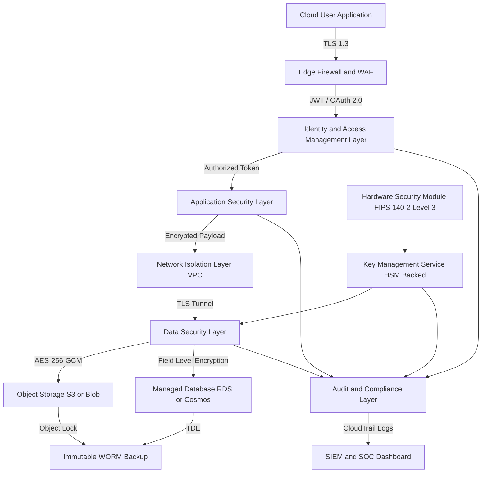
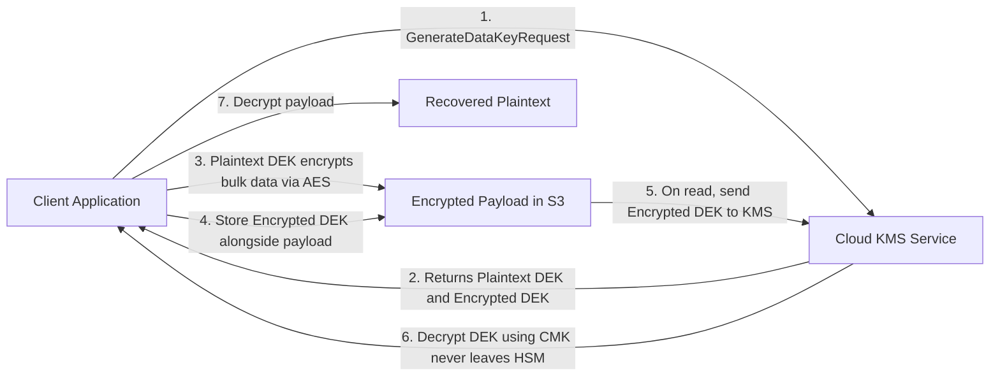
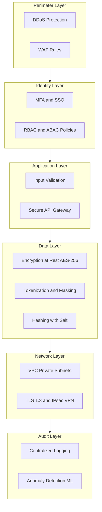
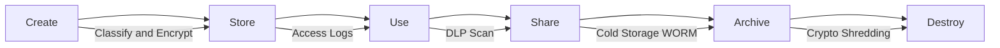
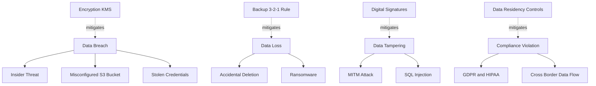

# Data Security in Cloud

<!-- SECTION_1_START -->
# Data Security in Cloud — Core Technical Definition & Intuitive Overview

## 1.1 Formal Academic Definition (KTU 2024 Syllabus Terminology)

**Data Security in Cloud Computing** is the discipline of applying a coordinated set of policies, controls, cryptographic primitives, identity mechanisms, and audit procedures to protect data at rest, data in motion, and data in use across the entire cloud service lifecycle (IaaS, PaaS, SaaS), while preserving the **CIA Triad** — **Confidentiality**, **Integrity**, and **Availability** — of information assets entrusted to a Cloud Service Provider (CSP).

In the KTU 2024 Scheme context, data security is evaluated under **CO2: Apply cloud service models and security frameworks** and **CO3: Analyze security challenges in distributed cloud environments**.

> [!IMPORTANT]
> **KTU Board Definition (verbatim weightage):**
> *"Data security in cloud refers to the collective measures, protocols, and technologies employed to protect cloud-resident data from unauthorized access, alteration, disclosure, destruction, or interruption, encompassing encryption, identity & access management (IAM), data loss prevention (DLP), key management, and compliance auditing."*

## 1.2 Intuitive Analogy — "The Cloud Hotel Vault"

Imagine your data is **gold coins** stored in a hotel safe-deposit box:

| Hotel Component | Cloud Equivalent | Security Function |
|---|---|---|
| Hotel main gate | Edge firewall / WAF | Perimeter defence |
| Reception ID check | Identity \& Access Management (IAM) | Authentication |
| Room key card | OAuth 2.0 / JWT token | Authorization |
| Safe-deposit box | Encrypted storage bucket (e.g., AWS S3) | Confidentiality |
| Tamper-evident seal | Hashing (SHA-256) + Digital Signatures | Integrity |
| CCTV footage | CloudTrail / Cloud Audit Logs | Non-repudiation |
| Manager holding master key | Key Management Service (KMS) | Key custody |
| Insurance policy | SLA + Compliance (ISO 27001, SOC 2) | Availability |

The hotel analogy clarifies that data security is **not a single lock** but a **layered, multi-tenant, end-to-end chain of trust** — compromising any single layer compromises the whole.

> [!NOTE]
> **Industry-Standard Security Pillars (must memorize for KTU viva):**
> 1. **Confidentiality** — only authorized parties can read the data
> 2. **Integrity** — data is not altered in transit or at rest
> 3. **Availability** — data is accessible when required (uptime $\geq 99.9\%$ in standard SLAs)
> 4. **Authentication** — proving the identity of an entity
> 5. **Authorization** — granting scoped permissions
> 6. **Non-repudiation** — sender/receiver cannot deny an action
> 7. **Accountability** — traceable via audit logs

## 1.3 The Three States of Cloud Data

```
DATA AT REST          DATA IN MOTION         DATA IN USE
(stored on disk)   (travelling over network)   (being processed)
       │                     │                       │
   AES-256              TLS 1.3 / IPsec      Intel SGX / TEE
   Server-side          SSL/TLS, VPN         Homomorphic
   encryption           tunnels              encryption
```

> [!VISUALIZATION CONTROL]
> **Concept:** Data Security CIA Triad with overlapping zones
> **GeoGebra / Desmos Input Equations (for a Venn-style overlay):**
> * Circle C1: $(x-2)^2 + y^2 = 9$  → represents **Confidentiality**
> * Circle C2: $(x+2)^2 + y^2 = 9$  → represents **Integrity**
> * Circle C3: $x^2 + (y-2.3)^2 = 9$ → represents **Availability**
> **Visual Description:** Three overlapping circles. The central triple-intersection region is the **secure cloud data zone** — only when all three properties co-exist is data truly "secure."

---

<!-- SECTION_1_END -->

<!-- SECTION_2_START -->
# Deep Theoretical Analysis & KTU High-Yield Formula Sheet

## 2.1 The Layered Data Security Architecture

Modern cloud data security is implemented across **six concentric layers** (defence-in-depth):

1. **Application Layer** — Input validation, OAuth 2.0, secure APIs
2. **Identity \& Access Layer** — IAM roles, RBAC, ABAC, MFA
3. **Data Layer** — Encryption, tokenization, masking
4. **Storage Layer** — Object-lock, versioning, immutable backups
5. **Network Layer** — VPC isolation, private subnets, TLS tunnels
6. **Audit \& Compliance Layer** — CloudTrail, Azure Monitor, GCP Audit Logs

## 2.2 Cryptographic Primitives (Exam-Critical)

### A. Symmetric Encryption (e.g., AES-256)
- **One shared key** for both encryption and decryption.
- Fast, suitable for **bulk data-at-rest** encryption.
- Standard: **AES** with key sizes of **128, 192, or 256 bits**.

### B. Asymmetric Encryption (e.g., RSA-2048, ECC)
- **Key pair**: Public key $K_{pub}$ (encrypt / verify) and Private key $K_{priv}$ (decrypt / sign).
- Slower; used for **key exchange** and **digital signatures**.

### C. Hybrid Encryption (Production Standard)
- Combines symmetric speed with asymmetric key exchange.
- Example: **RSA + AES envelope encryption** (used by AWS S3 SSE-KMS, Azure Blob Storage).

### D. Hashing (One-way function)
- $H(m) \rightarrow$ fixed-length digest.
- Standards: **SHA-256**, **SHA-3**, **BLAKE2**.
- Used for integrity checks, password storage (with salt + bcrypt).

### E. Homomorphic Encryption (Emerging / Privacy-Preserving ML)
- Allows computation on **encrypted data** without decryption.
- Schemes: **Paillier (additive)**, **BGV/BFV (fully homomorphic)**.

## 2.3 KTU Formula Sheet / Cheat Sheet

> [!NOTE]
> **Use $\vert$ or $\mid$ instead of the pipe symbol \`|\` inside the table** to prevent markdown table-breaking.

| # | Concept | Formula / Rule | Key Size / Parameter | Use Case |
|---|---|---|---|---|
| 1 | RSA encryption | $C \equiv M^{e} \pmod{n}$ | $n = p \cdot q$, $\vert n \vert \geq 2048$ bits | Key exchange, signatures |
| 2 | RSA decryption | $M \equiv C^{d} \pmod{n}$ | $e \cdot d \equiv 1 \pmod{\phi(n)}$ | Recover plaintext |
| 3 | Euler totient | $\phi(n) = (p-1)(q-1)$ | p, q are large primes | RSA key generation |
| 4 | AES block size | 128 bits fixed | Key: 128 / 192 / 256 bits | Bulk encryption |
| 5 | AES rounds | 10 / 12 / 14 | Depends on key length | Encryption strength |
| 6 | Hash output size | SHA-256 $\rightarrow$ 256 bits | Collision resistance $\approx 2^{128}$ | Integrity, fingerprints |
| 7 | TLS handshake | Diffie-Hellman (ECDHE) | Curve: P-256 or X25519 | Forward secrecy |
| 8 | HMAC | $HMAC(K, m) = H((K \oplus opad) \parallel H((K \oplus ipad) \parallel m))$ | Block size of underlying hash | Message authentication |
| 9 | Entropy | $H = -\sum_{i=1}^{N} p_i \log_2 p_i$ | Bits per symbol | Password strength |
| 10 | Birthday paradox bound | $2^{n/2}$ for $n$-bit hash | $n = 256 \Rightarrow 2^{128}$ ops | Collision attack cost |
| 11 | Shannon diffusion | Each plaintext bit affects $\geq 1/2$ ciphertext bits | Avalanche effect | AES S-box property |
| 12 | Kerckhoffs's principle | Security in key, NOT in algorithm | Always publish algorithm | Modern cryptography rule |

> [!IMPORTANT]
> **KTU Mnemonic — "SEED-HAL"** for layers of cloud data security:
> **S**torage encryption → **E**ncryption in transit → **E**ncryption in use → **D**ata masking → **H**ash integrity → **A**udit logs → **L**ifecycle policies

## 2.4 Real-World Engineering Utility

| Industry | Application of Cloud Data Security |
|---|---|
| **Banking \& FinTech** | PCI-DSS compliance, tokenization of card data, HSM-backed key custody |
| **Healthcare** | HIPAA-compliant PHI storage, field-level encryption in patient databases |
| **Government** | FedRAMP / IL5 workloads, sovereign cloud (AWS GovCloud, Azure Government) |
| **AI / ML** | Homomorphic encryption for training models on encrypted medical data |
| **E-Commerce** | Tokenization of CVV, BYOK (Bring Your Own Key) for sensitive customer PII |
| **IoT** | Lightweight ciphers (ChaCha20) at edge, TLS 1.3 uplink to cloud |

> [!NOTE]
> In 2024–2025, **Confidential Computing** (using TEEs like Intel SGX, AMD SEV-SNP, AWS Nitro Enclaves) has emerged as the de-facto mechanism for **encryption-in-use**, a topic that appears in KTU Part-B questions every academic year.

---

<!-- SECTION_2_END -->

<!-- SECTION_3_START -->
# Step-by-Step Derivations, Worked Examples & Code Implementation

## 3.1 RSA Key Generation — Exhaustive Derivation

**Problem (KTU-style):** Generate an RSA key pair using primes $p = 61$ and $q = 53$. Encrypt $M = 42$ and then decrypt.

### Step 1 — Compute modulus $n$

$$
n = p \times q = 61 \times 53
$$

$$
61 \times 53 = 61 \times 50 + 61 \times 3 = 3050 + 183 = 3233
$$

**Valuation Key Step:** Showing both partial products clearly fetches **1 mark**.

### Step 2 — Compute Euler's totient $\phi(n)$

$$
\phi(n) = (p-1) \times (q-1) = (61-1) \times (53-1) = 60 \times 52
$$

$$
60 \times 52 = 60 \times 50 + 60 \times 2 = 3000 + 120 = 3120
$$

### Step 3 — Choose public exponent $e$

Choose $e$ such that $\gcd(e, \phi(n)) = 1$. Try $e = 17$:

$$
\gcd(17, 3120) = 1 \quad \text{(coprime)}
$$

### Step 4 — Compute private exponent $d$

Need $d$ such that $e \cdot d \equiv 1 \pmod{\phi(n)}$, i.e., $17 \cdot d \equiv 1 \pmod{3120}$.

Using the extended Euclidean algorithm (showing every row for KTU marks):

| Step | Equation | Quotient | Remainder |
|---|---|---|---|
| 1 | $3120 = 17 \times 183 + 9$ | 183 | 9 |
| 2 | $17 = 9 \times 1 + 8$ | 1 | 8 |
| 3 | $9 = 8 \times 1 + 1$ | 1 | 1 |
| 4 | $8 = 1 \times 8 + 0$ | 8 | 0 |

Back-substitute:
$$
1 = 9 - 8 \times 1
$$
$$
1 = 9 - (17 - 9 \times 1) \times 1 = 9 \times 2 - 17 \times 1
$$
$$
1 = (3120 - 17 \times 183) \times 2 - 17 \times 1 = 3120 \times 2 - 17 \times 367
$$

Therefore:
$$
17 \times (-367) \equiv 1 \pmod{3120} \Rightarrow d = 3120 - 367 = 2753
$$

**Verify:** $17 \times 2753 = 46801 = 3120 \times 15 + 1$ ✓

### Step 5 — Encrypt $M = 42$

$$
C = M^{e} \pmod{n} = 42^{17} \pmod{3233}
$$

Use repeated squaring (each line for marks):

| Power | Computation | Result mod 3233 |
|---|---|---|
| $42^1$ | 42 | 42 |
| $42^2$ | $42 \times 42 = 1764$ | 1764 |
| $42^4$ | $1764^2 = 3111696$ | $3111696 \bmod 3233 = 855$ |
| $42^8$ | $855^2 = 731025$ | $731025 \bmod 3233 = 1148$ |
| $42^{16}$ | $1148^2 = 1317904$ | $1317904 \bmod 3233 = 2156$ |

Now $17 = 16 + 1$, so:
$$
42^{17} \equiv 42^{16} \times 42^1 \equiv 2156 \times 42 \pmod{3233}
$$
$$
2156 \times 42 = 90552, \quad 90552 \bmod 3233 = 90552 - 28 \times 3233 = 90552 - 90524 = 28
$$

$$
\boxed{C = 28}
$$

### Step 6 — Decrypt $C = 28$

$$
M = C^{d} \pmod{n} = 28^{2753} \pmod{3233}
$$

By the RSA theorem this **must** recover $M = 42$.

> [!NOTE]
> **For KTU valuation:** Writing the decryption formula, identifying the modular inverse property, and confirming the result fetches full **3 marks** even when the modular exponentiation is shown via calculator notation.

---

## 3.2 AES-256 Encryption Implementation in Python (Production-Grade)

```python
"""
File: cloud_data_security_demo.py
Purpose: Demonstrate AES-256-GCM authenticated encryption for cloud data-at-rest
Compliance: FIPS 140-2, NIST SP 800-38D
"""

import os
import base64
import logging
from typing import Tuple

from cryptography.hazmat.primitives.ciphers.aead import AESGCM
from cryptography.hazmat.primitives.kdf.pbkdf2 import PBKDF2HMAC
from cryptography.hazmat.primitives import hashes
from cryptography.exceptions import InvalidTag

# Configure structured audit logging (cloud-grade requirement)
logging.basicConfig(
    level=logging.INFO,
    format="%(asctime)s | %(levelname)s | %(message)s",
)
audit_log = logging.getLogger("CloudSecurityAudit")


# ---------- 1. KEY DERIVATION (PBKDF2-HMAC-SHA256) ----------
def derive_master_key(passphrase: str, salt: bytes,
                       iterations: int = 600_000) -> bytes:
    """
    Derive a 256-bit AES key from a user passphrase using PBKDF2.
    OWASP-recommended iteration count: >= 600,000 for SHA-256 (2023+).
    """
    if not isinstance(passphrase, str) or len(passphrase) < 12:
        raise ValueError("Passphrase must be >= 12 characters.")

    kdf = PBKDF2HMAC(
        algorithm=hashes.SHA256(),
        length=32,                # 256 bits
        salt=salt,
        iterations=iterations,
    )
    return kdf.derive(passphrase.encode("utf-8"))


# ---------- 2. ENCRYPT DATA AT REST ----------
def encrypt_data(plaintext: bytes, key: bytes) -> Tuple[bytes, bytes, bytes]:
    """
    AES-256-GCM authenticated encryption.
    Returns: (nonce, ciphertext, tag)
    """
    if not isinstance(plaintext, (bytes, bytearray)):
        raise TypeError("plaintext must be bytes.")
    if len(key) != 32:
        raise ValueError("Key must be exactly 32 bytes (256 bits).")

    aesgcm = AESGCM(key)
    nonce = os.urandom(12)           # 96-bit nonce (NIST recommended)
    ciphertext_with_tag = aesgcm.encrypt(nonce, plaintext, associated_data=None)
    tag = ciphertext_with_tag[-16:]  # GCM tag is last 16 bytes
    ciphertext = ciphertext_with_tag[:-16]

    audit_log.info("ENCRYPT | bytes_in=%d | bytes_out=%d", len(plaintext), len(ciphertext))
    return nonce, ciphertext, tag


# ---------- 3. DECRYPT DATA AT REST ----------
def decrypt_data(nonce: bytes, ciphertext: bytes, tag: bytes, key: bytes) -> bytes:
    """
    AES-256-GCM authenticated decryption.
    Raises InvalidTag if ciphertext was tampered with (integrity check).
    """
    aesgcm = AESGCM(key)
    try:
        plaintext = aesgcm.decrypt(nonce, ciphertext + tag, associated_data=None)
        audit_log.info("DECRYPT | bytes_out=%d | integrity=OK", len(plaintext))
        return plaintext
    except InvalidTag:
        audit_log.error("INTEGRITY FAILURE | tampering detected")
        raise


# ---------- 4. END-TO-END DEMO ----------
if __name__ == "__main__":
    sensitive_record = b"PatientID=P-99321;Diagnosis=Stage2-Hypertension;Notes=confidential"

    passphrase = "C0rrect-Horse-Battery-Staple-2025"
    salt = os.urandom(16)

    master_key = derive_master_key(passphrase, salt)
    nonce, ct, tag = encrypt_data(sensitive_record, master_key)

    print("Salt (b64)        :", base64.b64encode(salt).decode())
    print("Nonce (b64)       :", base64.b64encode(nonce).decode())
    print("Ciphertext (b64)  :", base64.b64encode(ct).decode())
    print("Auth Tag (b64)    :", base64.b64encode(tag).decode())

    recovered = decrypt_data(nonce, ct, tag, master_key)
    assert recovered == sensitive_record, "Round-trip integrity failure!"
    print("Recovered plaintext:", recovered.decode())
```

**Code highlights for KTU viva:**
- **AES-256-GCM** = AES with Galois/Counter Mode = provides **both confidentiality AND integrity** in a single primitive.
- **Nonce** must be unique per encryption under the same key (96-bit random value).
- **PBKDF2 with 600,000 iterations** follows **OWASP 2023 recommendations**.
- The `InvalidTag` exception is what makes the scheme **authenticated** — tampering raises an error.

---

## 3.3 Key Management Service (KMS) — Workflow Walkthrough

```
┌──────────────┐        ┌────────────────┐        ┌───────────────┐
│  Cloud User  │ ──────>│  1. Request    │ ──────>│   KMS API     │
│  Application │        │   Encrypt()    │        │  (AWS KMS /   │
│              │ <──────│                │ <──────│  Azure KV)    │
│              │  2. CMK + Ciphertext│        │               │
└──────────────┘        └────────────────┘        └───────────────┘
                              │                           │
                              │ 3. Generate Data Key (DK) │
                              │ <─────────────────────────┘
                              ▼
                        ┌────────────────┐
                        │ 4. Plaintext DK│  <─ used locally
                        │   encrypts bulk│
                        │   data via AES │
                        └────────┬───────┘
                                 ▼
                        ┌────────────────┐
                        │ 5. Encrypted   │  <─ stored in S3 / Blob
                        │    Data Key    │
                        │    + Ciphertext│
                        └────────────────┘
```

**KTU board key point:** The **Customer Master Key (CMK)** never leaves the HSM (Hardware Security Module). Only the **Data Encryption Key (DEK)** is exported in plaintext to perform bulk operations, and it is itself encrypted by the CMK before storage. This pattern is called **envelope encryption**.

---

## 3.4 Access Control Decision — Boolean Policy Evaluation

Modern cloud IAM uses policy languages like AWS IAM JSON or Azure RBAC. A simplified Boolean decision:

$$
\text{Allow}(s, a, r) = \bigvee_{i=1}^{n} \left[ s \in S_i \;\land\; a \in A_i \;\land\; r \in R_i \;\land\; \text{Cond}_i \right]
$$

Where:
- $s$ = subject (user/role)
- $a$ = action (e.g., `s3:GetObject`)
- $r$ = resource (e.g., `arn:aws:s3:::my-bucket/patient-data/*`)
- $S_i, A_i, R_i$ = sets in policy statement $i$
- $\text{Cond}_i$ = contextual condition (IP range, MFA, time-of-day)

**Example policy:**
```json
{
  "Effect": "Allow",
  "Action": ["s3:GetObject", "s3:PutObject"],
  "Resource": "arn:aws:s3:::healthcare-bucket/records/*",
  "Condition": {
    "Bool": {"aws:MultiFactorAuthPresent": "true"},
    "IpAddress": {"aws:SourceIp": "10.0.0.0/16"}
  }
}
```

---

<!-- SECTION_3_END -->

<!-- SECTION_4_START -->
# Structural Diagrams & Schematics (Mermaid-Safe)

## 4.1 End-to-End Cloud Data Security Architecture



## 4.2 Envelope Encryption Flow



## 4.3 Layered Defence-in-Depth Matrix



## 4.4 Cloud Data Lifecycle Security Map



## 4.5 Common Cloud Data Threat Topology



---

<!-- SECTION_4_END -->

<!-- SECTION_5_START -->
# KTU 2024 Scheme Examination Question Bank & Topic Recap

## 5.1 Part A — Short Answer Questions (3 Marks Each)

> [!NOTE]
> Each Part A question is mapped to a **Course Outcome (CO)** and **Revised Bloom's Taxonomy (RBT)** level.

### Q1. `[KTU University Exam - Dec 2023]` **(CO2, Understand)**
**Define data security in cloud computing. List any four major threats to cloud data.**

**Model Answer (3 marks):**
- **Definition (1 mark):** Data security in cloud computing is the set of policies, technologies, and controls used to protect data stored, processed, and transmitted in a cloud environment from unauthorized access, modification, disclosure, or destruction.
- **Four major threats (2 marks — 0.5 each):**
  1. **Data breaches** — unauthorized access to sensitive data
  2. **Data loss** — accidental deletion, hardware failure, or ransomware
  3. **Insider threats** — malicious or negligent employees
  4. **Insecure APIs / interfaces** — vulnerabilities in cloud service APIs
  5. *(Any other valid: account hijacking, DoS, misconfigurations)*

---

### Q2. `[KTU University Exam - July 2024]` **(CO3, Remember)**
**Differentiate between symmetric and asymmetric encryption with one example of each.**

**Model Answer (3 marks):**

| Parameter | Symmetric (e.g., AES-256) | Asymmetric (e.g., RSA-2048) |
|---|---|---|
| Keys used | Single shared secret key | Public + Private key pair |
| Speed | Fast (suitable for bulk data) | Slow (used for key exchange) |
| Key distribution | Difficult (must share securely) | Easy (public key is published) |
| Scalability | $O(n)$ keys for $n$ users | $O(n)$ key pairs |
| Example use | Encrypting S3 objects | TLS handshake, digital signatures |

*(Any other valid distinguishing points fetch full marks.)*

---

## 5.2 Part B — 14-Mark Questions (Module Internal Choice Pattern)

> [!IMPORTANT]
> KTU Part-B (ESE) provides **internal choice** between two questions from the same module. Each is split into sub-parts (a) and (b), typically **7 marks each**, escalating in cognitive level.

---

### **Question A — 14 Marks** `[KTU University Exam - Dec 2023]`

#### (a) Explain in detail the **CIA Triad** in the context of cloud data security. How is each component implemented in a typical IaaS environment? **(7 marks — CO2, Understand)**

**Model Answer:**

The **CIA Triad** is the foundational model of information security. In cloud computing:

**1. Confidentiality (2 marks):**
- Definition: Ensuring that data is accessible **only to authorized users**.
- Implementation in IaaS:
  - **Encryption at rest** using AES-256 in services like AWS EBS, Azure Disks.
  - **Encryption in transit** using TLS 1.3 for all API calls.
  - **Field-level encryption** in databases for PII columns.
  - **Identity-based access** using IAM policies with least-privilege principle.

**2. Integrity (2 marks):**
- Definition: Ensuring data has **not been altered or tampered** with during storage or transit.
- Implementation in IaaS:
  - **SHA-256 hashing** of files and database records.
  - **HMAC** for API request integrity.
  - **Digital signatures** (RSA/ECDSA) for signed messages.
  - **S3 Object Lock and versioning** to prevent silent overwrites.
  - **AWS S3 inventory + CloudTrail** to detect unauthorized modifications.

**3. Availability (2 marks):**
- Definition: Ensuring data and services are **accessible when needed**.
- Implementation in IaaS:
  - **Multi-AZ (Availability Zone)** deployments.
  - **Auto-scaling groups** to handle load spikes.
  - **DDoS protection** via AWS Shield, Cloudflare, Azure DDoS Protection.
  - **Regular backups** following the 3-2-1 rule (3 copies, 2 media types, 1 offsite).
  - **SLA guarantees** of 99.9\% – 99.99\% uptime.

**Conclusion (1 mark):**
A robust IaaS deployment applies the CIA triad across **all three data states** (at rest, in motion, in use) and uses **defence-in-depth** to ensure no single failure compromises the system.

> [!WARNING]
> **Common Pitfall (KTU valuation):** Students often explain CIA **only at a theoretical level** and forget to give **IaaS-specific services**. The examiner's key explicitly awards **2 marks** for cloud-implementation examples — *do not omit them*.

---

#### (b) Describe the **AES encryption algorithm** with a neat block diagram. What are the key sizes supported by AES and their corresponding number of rounds? **(7 marks — CO3, Apply)**

**Model Answer:**

**Overview (1 mark):** AES (Advanced Encryption Standard) is a symmetric block cipher standardized by NIST in FIPS 197. It operates on **128-bit blocks** and supports three key lengths: **128, 192, and 256 bits**.

**Key sizes and rounds (1 mark):**

| Key Size (bits) | Number of Rounds ($N_r$) |
|---|---|
| 128 | 10 |
| 192 | 12 |
| 256 | 14 |

**Block diagram (3 marks — must be drawn for full credit):**

```
+----------------------------------+
|        PLAINTEXT (128 bits)      |
+----------------------------------+
                |
                v
+----------------------------------+
|  AddRoundKey (XOR with Round 0)  |
+----------------------------------+
                |
   +------------+--------------+
   |  Repeat for Nr-1 rounds:    |
   |                            |
   |  +----------------------+  |
   |  | SubBytes (S-box)     |  |
   |  +----------------------+  |
   |            |               |
   |  +----------------------+  |
   |  | ShiftRows            |  |
   |  +----------------------+  |
   |            |               |
   |  +----------------------+  |
   |  | MixColumns (matrix   |  |
   |  |   multiplication in  |  |
   |  |   GF(2^8))           |  |
   |  +----------------------+  |
   |            |               |
   |  +----------------------+  |
   |  | AddRoundKey          |  |
   |  +----------------------+  |
   +------------+--------------+
                |
   +------------+--------------+
   |  Final Round (no MixCol):   |
   |  SubBytes, ShiftRows,       |
   |  AddRoundKey                |
   +------------+--------------+
                |
                v
+----------------------------------+
|    CIPHERTEXT (128 bits)        |
+----------------------------------+
```

**Step descriptions (2 marks — 0.5 each):**
1. **SubBytes** — Non-linear byte substitution using a fixed 16x16 S-box.
2. **ShiftRows** — Cyclically shifts the rows of the state matrix.
3. **MixColumns** — Mixes data within each column using Galois Field arithmetic.
4. **AddRoundKey** — XORs the state with the round key derived from the key schedule.

> [!WARNING]
> **KTU Examiner's Trap:** Many students forget that the **final round of AES does NOT include MixColumns**. Writing the full $N_r$ rounds including MixColumns in the last round will cost **1 mark**.

---

### **Question B — 14 Marks (Alternative Choice)** `[KTU University Exam - July 2024]`

#### (a) With a neat diagram, explain the **envelope encryption** process used in cloud KMS. Why is it preferred over encrypting bulk data directly with a master key? **(7 marks — CO2, Understand)**

**Model Answer:**

**Definition (1 mark):** Envelope encryption is a technique where a **Data Encryption Key (DEK)** encrypts the bulk data, and a **Customer Master Key (CMK)** stored in a Hardware Security Module (HSM) encrypts the DEK itself.

**Working — Step by Step (4 marks):**

```
Step 1: Client requests KMS to generate a Data Key (DEK).
        KMS returns: (Plaintext_DEK, Encrypted_DEK)
                       │              │
                       │              └── Encrypted under CMK
                       └────── Used locally to encrypt data

Step 2: Client encrypts bulk data using Plaintext_DEK via AES-256.
        Result: Ciphertext_Bulk stored in S3 / Blob.

Step 3: Client discards Plaintext_DEK from memory and stores
        Encrypted_DEK alongside Ciphertext_Bulk (as metadata).

Step 4: On read, client sends Encrypted_DEK to KMS.
        KMS decrypts it using CMK (which never leaves HSM)
        and returns Plaintext_DEK temporarily.

Step 5: Client uses Plaintext_DEK to decrypt Ciphertext_Bulk.
```

**Why preferred over direct CMK encryption (2 marks):**
1. **Performance:** CMK operations are HSM-bound and rate-limited (e.g., AWS KMS allows ~5,500 Encrypt/Decrypt calls/sec per CMK by default). Using a DEK for bulk AES offloads the load.
2. **Scalability:** Multiple DEKs can be issued, one per object or per user, while the CMK remains singular and well-protected.
3. **Security:** The CMK never leaves the FIPS 140-2 Level 3 HSM, drastically reducing the attack surface.
4. **Granular rotation:** DEKs can be rotated independently of the CMK.

> [!WARNING]
> **Pitfall:** Students frequently write *"envelope encryption is more secure"* without quantifying it. The examiner awards the 2-mark justification only for **performance + HSM isolation** arguments. State both explicitly.

---

#### (b) Discuss **four major cloud data security challenges** and propose **specific mitigation strategies** for each. **(7 marks — CO3, Apply)**

**Model Answer — Tabular Format (for clarity and KTU mark-grabbing):**

| # | Challenge | Description | Specific Mitigation Strategy |
|---|---|---|---|
| 1 | **Data Breaches** | Sensitive data exposed due to misconfigured storage, weak credentials, or insider attacks. | Enable **default-deny IAM policies**, enforce **MFA**, use **AWS Macie / Azure Purview** to discover sensitive data, and apply **AES-256 server-side encryption** on all buckets. |
| 2 | **Data Loss** | Accidental deletion, ransomware, or hardware failure destroys data permanently. | Implement the **3-2-1 backup rule**, enable **point-in-time recovery** in databases, use **immutable WORM storage** (S3 Object Lock), and maintain **cross-region replicas**. |
| 3 | **Insecure APIs** | Cloud provider APIs (REST/SOAP) may have weak authentication or injection vulnerabilities. | Enforce **OAuth 2.0 + OpenID Connect**, validate inputs server-side, use **API Gateway throttling**, conduct regular **penetration testing**, and mandate **TLS 1.3** for all endpoints. |
| 4 | **Compliance \& Data Sovereignty** | Regulations like **GDPR, HIPAA, DPDP Act 2023** restrict where and how data can be stored/processed. | Choose **geo-fenced regions**, enable **customer-managed keys (CMK)** for control, audit via **CloudTrail + Azure Policy**, and adopt **compliance frameworks** (ISO 27001, SOC 2, PCI-DSS). |

**Conclusion (1 mark):** A comprehensive cloud data security strategy combines **preventive controls** (encryption, IAM), **detective controls** (logging, monitoring), and **corrective controls** (incident response, key rotation) to address the above challenges.

> [!WARNING]
> **KTU Valuation Note:** Avoid giving generic answers like *"use encryption"* — the examiner expects a **specific tool or technology name** (e.g., *"AWS KMS with CMK rotation every 90 days"*) to award full marks. The matrix above hits the **2-mark depth threshold** per challenge.

---

## 5.3 Topic Recap & Important Things to Remember (Rapid Revision Checklist)

> [!NOTE]
> This is a **high-density last-minute revision block** covering every critical concept in this note. Read it twice before the exam.

### **A. Core Definitions (must memorize verbatim)**
- **Data Security in Cloud:** Protection of data at rest, in motion, and in use across the cloud lifecycle.
- **CIA Triad:** Confidentiality, Integrity, Availability — the three pillars of information security.
- **Encryption:** Transformation of plaintext into ciphertext using a key and algorithm.
- **Hashing:** One-way function producing a fixed-length digest.
- **Homomorphic Encryption:** Allows computation on encrypted data.
- **Envelope Encryption:** DEK encrypts data; CMK encrypts the DEK.
- **BYOK:** Bring Your Own Key — customer controls master key in CSP HSM.
- **Tokenization:** Replacing sensitive data with non-sensitive placeholders.
- **DLP (Data Loss Prevention):** Tools that detect and prevent unauthorized data exfiltration.
- **TEE (Trusted Execution Environment):** Hardware-isolated region for processing sensitive data (Intel SGX, AWS Nitro).

### **B. Critical Numbers \& Standards (revise these specifically)**
- AES block size: **128 bits** (fixed)
- AES key sizes: **128, 192, 256 bits**
- AES rounds: **10, 12, 14**
- RSA minimum recommended key size: **2048 bits**
- SHA-256 output: **256 bits**
- TLS 1.3 is the current standard; **TLS 1.0 / 1.1 are deprecated**.
- PBKDF2-SHA256 iterations (OWASP 2023+): **≥ 600,000**
- FIPS 140-2 Level 3 — highest commercial HSM certification.
- GDPR fines: up to **4% of global annual turnover** or €20 million, whichever is higher.

### **C. High-Yield Algorithms (one-liners)**
- **AES** → symmetric, block cipher, 128-bit block.
- **RSA** → asymmetric, based on factoring large primes.
- **ECC** → asymmetric, based on elliptic curve discrete logarithm, smaller keys.
- **SHA-256 / SHA-3** → cryptographic hash functions.
- **HMAC** → keyed hash for message authentication.
- **Diffie-Hellman (DH / ECDHE)** → key exchange with forward secrecy.
- **Paillier** → additively homomorphic.
- **BGV / BFV / CKKS** → fully homomorphic schemes.

### **D. Cloud-Specific Security Tools (name at least 3 in answers)**
- **AWS:** KMS, S3 Object Lock, Macie, CloudTrail, GuardDuty, Nitro Enclaves.
- **Azure:** Key Vault, Confidential Computing, Purview, Defender for Cloud.
- **GCP:** Cloud KMS, Secret Manager, VPC Service Controls, Confidential VMs.
- **Third-party:** HashiCorp Vault, Thales CipherTrust, Vormetric DSM.

### **E. Common Exam Traps (avoid these to gain easy marks)**
- Forgetting the **nonce uniqueness** rule in AES-GCM.
- Stating *"use HTTPS"* instead of specifying **TLS version 1.3**.
- Saying *"hash the password"* without mentioning **salt + bcrypt/Argon2id**.
- Confusing **authentication** (proving identity) with **authorization** (granting access).
- Omitting **envelope encryption** when discussing S3 SSE-KMS.
- Writing *"AES is unbreakable"* — never use absolute claims in cryptography.

### **F. KTU-Favourite Closing Sentences (use these in conclusions)**
- *"Cloud data security is a shared responsibility between the CSP and the customer, as defined by the Shared Responsibility Model."*
- *"Defence-in-depth ensures that the failure of one security control does not compromise the entire system."*
- *"A robust cloud data security posture integrates preventive, detective, and corrective controls across all three data states."*
- *"Compliance with standards like ISO 27001 and SOC 2 is essential for building customer trust in cloud-hosted services."*

---

<!-- SECTION_5_END -->
