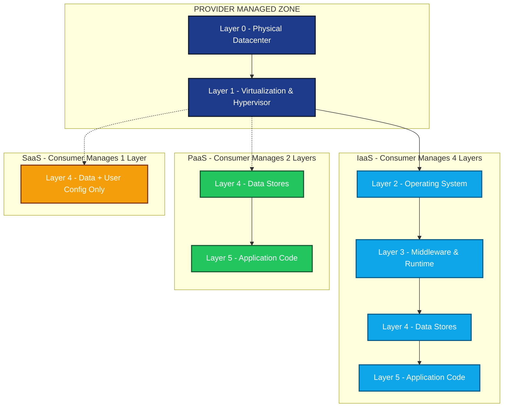
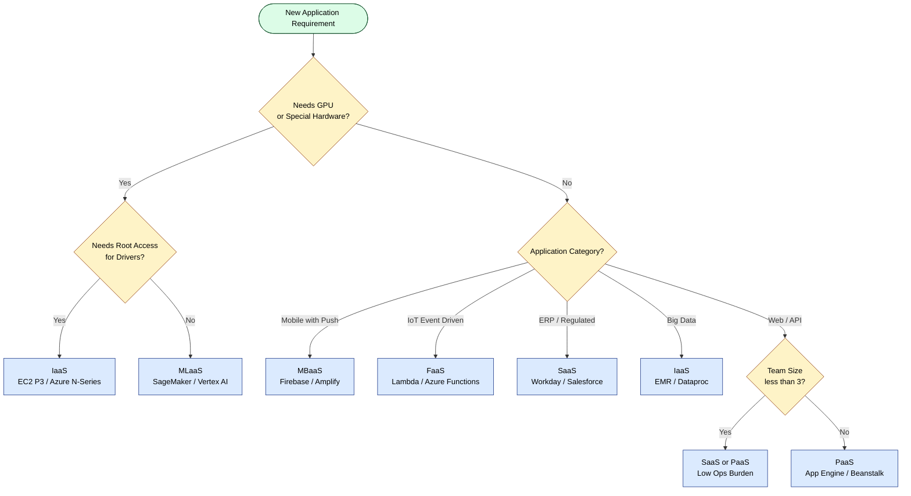
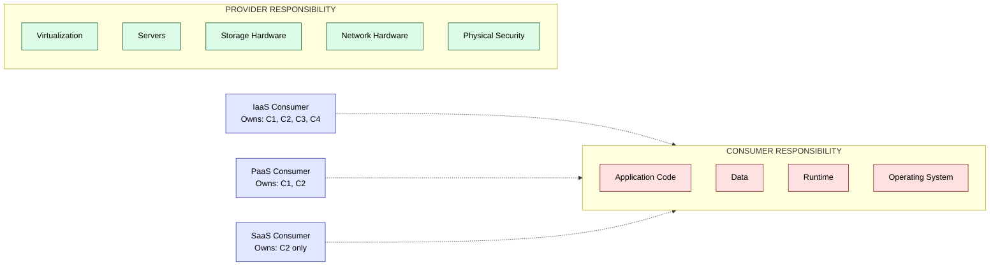

# Understanding Services and Applications by Type

<!-- SECTION_1_START -->

# Understanding Services and Applications by Type

## 1. Core Technical Definition

> [!IMPORTANT]
> **Formal KTU 2024 Definition (NIST SP 800-145 Aligned):**
> Cloud computing services are categorized into three primary service models — **Software as a Service (SaaS)**, **Platform as a Service (PaaS)**, and **Infrastructure as a Service (IaaS)** — based on the stack of resources (hardware, runtime, data, application) that the cloud provider abstracts, manages, and exposes to the consumer. Applications built atop these models are likewise classified by **architectural type** (web apps, mobile backends, big data pipelines, IoT, AI/ML workloads) according to their compute, storage, and network demand profiles.

The NIST model — adopted by KTU's **CST 422 / OECST722** syllabus — defines a **service model** as a *layered abstraction of cloud capabilities* that a consumer can deploy and configure. The three canonical layers are:

| Layer | Service Model | Consumer Manages | Provider Manages |
| :--- | :--- | :--- | :--- |
| Top | **SaaS** | Only data \& user access | Everything else |
| Middle | **PaaS** | Application code \& data | OS, runtime, middleware, infra |
| Bottom | **IaaS** | OS, runtime, app, data | Virtualization, servers, storage, network |

> [!NOTE]
> **Syllabus Highlight (Module 3, OECST722):** Students are expected to *"classify cloud service and deployment models, compare the responsibilities of provider and consumer across the stack, and identify suitable application workloads for each service type."*

---

## 2. Intuitive Analogy — The Pizza Stack

> [!TIP]
> **Real-World Analogy: Pizza as a Service**
> Imagine you are hungry and want pizza. You have three choices:
>
> 1. **Dining Out (SaaS)** — You walk into *Pizza Hut*. You just **eat**. The chef, oven, ingredients, and even the table are all managed for you. You only control *what you put on top* (toppings of your choice = your data).
>
> 2. **Take-and-Bake (PaaS)** — You buy a pre-made dough and sauce kit from *Swiggy Instamart*. You supply only the **toppings and bake it at home** (your code runs on a pre-configured oven = provider's runtime).
>
> 3. **Make from Scratch (IaaS)** — You buy flour, cheese, tomatoes, and an oven. You **assemble the kitchen, the dough, the sauce, and the final pizza**. You own the entire stack except the physical oven room (datacenter).
>
> **Key Insight:** The *lower* you go in the stack, the **more control** you get — but the **more responsibility** you also carry.

---

## 3. Geometric / Layered Visualization

> [!VISUALIZATION CONTROL]
> **Concept:** Cloud Service Stack as a Layered Responsibility Pyramid
> **Stack Layers (bottom to top):**
>
> * `Layer 0 (Hardware) = Physical Servers, Storage, Network`
> * `Layer 1 (Virtualization) = Hypervisor, VMs`
> * `Layer 2 (OS + Middleware) = Operating System, Runtime, Libraries`
> * `Layer 3 (Data) = Databases, Object Stores`
> * `Layer 4 (Application) = User Code, APIs`
>
> **Visual Description:** Picture an inverted triangle. **IaaS** hands you control from *Layer 1 upward*; **PaaS** hands you control from *Layer 2 upward*; **SaaS** hands you only the *Layer 4 application slice*. The deeper the provider goes, the more they "eat" from the bottom of the pizza.

---

## 4. Why This Classification Matters in Engineering

| Real-World Engineering Need | Best-Fit Service Type | Reason |
| :--- | :--- | :--- |
| Hosting a WordPress blog | **SaaS** (WordPress.com) | Zero ops; instant publishing |
| Training a deep-learning model | **IaaS** (EC2 P3 with GPU) | Need root access to install CUDA drivers |
| Deploying a REST API for a startup | **PaaS** (Heroku, App Engine) | Auto-scaling without server management |
| Enterprise email for 5,000 users | **SaaS** (Google Workspace) | Provider handles uptime \& compliance |
| Big-data Hadoop cluster | **IaaS** (EC2 + S3) | Custom cluster topology required |
| A 6-month college project on a budget | **PaaS / FaaS** | Pay-per-use, near-zero idle cost |

<!-- SECTION_1_END -->

<!-- SECTION_2_START -->

# Deep Theoretical Analysis & KTU High-Yield Formula Sheet

## 1. The Three Canonical Service Models

### 1.1 Infrastructure as a Service (IaaS)

> [!NOTE]
> **Definition:** IaaS provides fundamental computing resources — *processing, storage, networks, and servers* — over the internet on a **pay-as-you-go** basis. The consumer can deploy arbitrary software (including operating systems and applications) and has control over the OS, storage, and deployed applications.

**Core Building Blocks:**
* **Compute** → Virtual Machines (EC2, Azure VM, GCE)
* **Storage** → Block (EBS), Object (S3, Blob), File (EFS)
* **Network** → Virtual Private Cloud (VPC), Load Balancers, DNS
* **Identity** → IAM roles, Security Groups

**Operational Characteristics:**
* Provisioning time: **Minutes**
* Scaling granularity: **Per-VM (vertical) or per-instance-group (horizontal)**
* Portability: **High** (lift-and-shift from on-premises)

---

### 1.2 Platform as a Service (PaaS)

> [!IMPORTANT]
> **Definition:** PaaS delivers a **pre-configured platform** (runtime + middleware + OS + sometimes dev tools) on which the consumer develops, runs, and manages applications **without managing the underlying infrastructure**.

**Core Building Blocks:**
* **Application Hosting** → Heroku, Google App Engine, AWS Elastic Beanstalk
* **Managed Databases** → RDS, Cloud SQL, Cosmos DB
* **Message Queues** → SQS, Pub/Sub, Service Bus
* **DevOps Toolchains** → CI/CD pipelines, monitoring (Datadog, New Relic)

**Operational Characteristics:**
* Provisioning time: **Seconds**
* Scaling granularity: **Automatic, transparent to developer**
* Portability: **Medium** (vendor lock-in via proprietary APIs)

---

### 1.3 Software as a Service (SaaS)

> [!NOTE]
> **Definition:** SaaS delivers a **complete, runnable application** running on the provider's infrastructure. The consumer accesses the software via a thin client (browser or API) and does **not** manage any layer of the stack except their own user-specific configuration and data.

**Core Building Blocks:**
* **Productivity Suites** → Google Workspace, Microsoft 365
* **CRM / ERP** → Salesforce, SAP S/4HANA Cloud
* **Communication** → Slack, Zoom, Teams
* **Storage-as-an-App** → Dropbox, OneDrive

**Operational Characteristics:**
* Provisioning time: **Instant (self-service sign-up)**
* Scaling granularity: **Transparent — provider scales for all tenants**
* Portability: **Low** (data export only, no code portability)

---

## 2. Extended "X-as-a-Service" Family

Modern KTU 2024 syllabi also recognize these **derivative service models**:

| Service Model | Acronym | What is Delivered | Canonical Example |
| :--- | :--- | :--- | :--- |
| **Function as a Service** | FaaS | Event-driven stateless functions | AWS Lambda, Azure Functions |
| **Database as a Service** | DBaaS | Managed relational/NoSQL DBs | DynamoDB, Cosmos DB |
| **Mobile Backend as a Service** | MBaaS | Push notifications, auth, storage for mobile | Firebase, AWS Amplify |
| **Desktop as a Service** | DaaS | Virtual Windows/Linux desktops | Amazon WorkSpaces |
| **Machine Learning as a Service** | MLaaS | Pre-trained models + training infra | AWS SageMaker, Google Vertex AI |
| **Containers as a Service** | CaaS | Managed Kubernetes clusters | EKS, AKS, GKE |

---

## 3. Classification of Cloud Applications by Type

> [!TIP]
> Beyond the *service model*, KTU Module 3 also expects students to recognize the **type of application** being deployed. Each application type imposes a different demand profile on the underlying cloud service.

| Application Type | Defining Characteristics | Recommended Service | Reason |
| :--- | :--- | :--- | :--- |
| **Web Applications** | HTTP request-response, stateless | **PaaS** (App Engine) | Auto-scaling, integrated CDN |
| **Mobile Backends** | Auth, push, real-time sync | **MBaaS** (Firebase) | Out-of-box SDKs for iOS/Android |
| **Big Data / Analytics** | Petabyte-scale, batch + stream | **IaaS + DBaaS** (Hadoop on EC2, BigQuery) | Custom cluster tuning needed |
| **AI / ML Workloads** | GPU-heavy, long training jobs | **IaaS / MLaaS** (P3 instances, SageMaker) | Access to specialized hardware |
| **IoT Applications** | High-ingest, low-latency edge | **FaaS + Edge** (Lambda@Edge, Azure IoT Hub) | Event-driven, geographically distributed |
| **Enterprise / ERP** | Multi-tenant, regulated, high-availability | **SaaS** (Salesforce, Workday) | Compliance, uptime SLA |

---

## 4. KTU High-Yield Formula & Cost Sheet

> [!IMPORTANT]
> **Exam Tip:** For OECST722, marks are frequently awarded for **cost comparison problems**. Memorize the formulas below.

### 4.1 Cloud Cost Formulas

Let $C_{\text{total}}$ be the total monthly cost, $U$ the utilization fraction, and $h$ the hours in a month ($h = 730$).

$$
C_{\text{total}} = P_{\text{instance}} \times h \times U + C_{\text{storage}} + C_{\text{egress}}
$$

Where:

$$
C_{\text{storage}} = S_{\text{GB}} \times R_{\text{perGB}}
$$

$$
C_{\text{egress}} = D_{\text{out}} \times R_{\text{egress}}
$$

| Symbol | Meaning | Typical Unit |
| :--- | :--- | :--- |
| $P_{\text{instance}}$ | Hourly price of VM / function | USD / hour |
| $U$ | Utilization ($0 \le U \le 1$) | dimensionless |
| $S_{\text{GB}}$ | Stored data volume | GB |
| $D_{\text{out}}$ | Outbound data transfer | GB |
| $R_{\text{perGB}}$ | Storage rate | USD / GB-month |
| $R_{\text{egress}}$ | Egress rate | USD / GB |

### 4.2 Pay-Per-Use Comparison Table (Hypothetical Rates)

| Resource | IaaS Rate | PaaS Rate | SaaS Rate |
| :--- | :--- | :--- | :--- |
| 1 vCPU / 1 GB RAM | \$0.05 / hour | \$0.10 / hour | Bundled |
| 100 GB Storage | \$0.023 / GB-month | \$0.10 / GB-month | \$10 / user / month |
| 1 GB Egress | \$0.09 / GB | \$0.09 / GB | Bundled |

> [!NOTE]
> **Observation:** PaaS is **2× more expensive** per vCPU-hour than IaaS but includes OS patching, load balancing, and auto-scaling. The student must justify whether the **operational savings** outweigh the per-unit premium.

### 4.3 Control-vs-Convenience Trade-off

$$
\text{Freedom}_{\text{score}} = \frac{\text{Layers Managed by Consumer}}{\text{Total Stack Layers}}
$$

| Service | Layers Consumer Manages | Score (out of 1.0) |
| :--- | :--- | :--- |
| IaaS | 4 (OS, Runtime, Data, App) | 0.67 |
| PaaS | 2 (Data, App) | 0.33 |
| SaaS | 1 (Data only) | 0.17 |
| On-Premises | 5 (all) | 1.00 |

---

## 5. Engineering Utility — Where These Services Power Production Systems

| Industry Vertical | Service Used | Production Example |
| :--- | :--- | :--- |
| **FinTech** | IaaS + DBaaS | PayPal running core banking on AWS with proprietary DBs |
| **EdTech** | SaaS | Coursera (entire platform on Google Cloud SaaS stack) |
| **Healthcare** | SaaS (HIPAA-compliant) | Epic EHR hosted on Azure |
| **Gaming** | IaaS (GPU) | EA Sports using GPU fleets for FIFA rendering |
| **Streaming** | PaaS + IaaS | Netflix on AWS (auto-scaling with Chaos Monkey) |
| **Smart Cities** | FaaS + Edge | Traffic-light orchestration via AWS Lambda@Edge |

<!-- SECTION_2_END -->

<!-- SECTION_3_START -->

# Step-by-Step Derivations, Worked Examples & Code Implementation

## 1. Cost Comparison — IaaS vs PaaS vs SaaS (Worked Numerical)

> [!IMPORTANT]
> **KTU Pattern:** This is a classic 7-mark problem in Module 3. You are given resource requirements and per-unit rates; you must compute $C_{\text{total}}$ for each model and recommend the most cost-effective option.

### Problem Statement

A startup needs to host a web application with the following requirements:
* 2 vCPUs and 4 GB RAM, running 24/7
* 500 GB of database storage
* 200 GB of monthly outbound data transfer
* Operating for 1 month (730 hours)

Given the rates below, compute the monthly cost for each service model and recommend the best fit.

| Resource | IaaS | PaaS | SaaS |
| :--- | :--- | :--- | :--- |
| Compute (per vCPU-hour) | \$0.05 | \$0.10 | Bundled |
| Storage (per GB-month) | \$0.023 | \$0.10 | Bundled |
| Egress (per GB) | \$0.09 | \$0.09 | Bundled |
| SaaS flat fee (per app / month) | — | — | \$150 |

---

### Step-by-Step Solution

#### Step 1 — Compute IaaS Cost

$$
C_{\text{compute}}^{\text{IaaS}} = 2 \text{ vCPU} \times 730 \text{ h} \times \$0.05 = \$73.00
$$

$$
C_{\text{storage}}^{\text{IaaS}} = 500 \text{ GB} \times \$0.023 = \$11.50
$$

$$
C_{\text{egress}}^{\text{IaaS}} = 200 \text{ GB} \times \$0.09 = \$18.00
$$

$$
C_{\text{total}}^{\text{IaaS}} = 73.00 + 11.50 + 18.00 = \$102.50
$$

#### Step 2 — Compute PaaS Cost

$$
C_{\text{compute}}^{\text{PaaS}} = 2 \text{ vCPU} \times 730 \text{ h} \times \$0.10 = \$146.00
$$

$$
C_{\text{storage}}^{\text{PaaS}} = 500 \text{ GB} \times \$0.10 = \$50.00
$$

$$
C_{\text{egress}}^{\text{PaaS}} = 200 \text{ GB} \times \$0.09 = \$18.00
$$

$$
C_{\text{total}}^{\text{PaaS}} = 146.00 + 50.00 + 18.00 = \$214.00
$$

#### Step 3 — Compute SaaS Cost

For SaaS, all underlying resources are bundled into a single flat fee:

$$
C_{\text{total}}^{\text{SaaS}} = \$150.00
$$

#### Step 4 — Comparison \& Recommendation

$$
C_{\text{total}}^{\text{IaaS}} = \$102.50 \quad < \quad C_{\text{total}}^{\text{SaaS}} = \$150.00 \quad < \quad C_{\text{total}}^{\text{PaaS}} = \$214.00
$$

> [!TIP]
> **Recommended Model: IaaS** — cheapest at \$102.50/month, but the startup must also budget for a DevOps engineer to manage OS patching and scaling. If the team is small (< 3 engineers), **SaaS at \$150** may be the more *economically rational* choice when the hidden engineering cost is included.

---

## 2. Shared Responsibility Model — Step-by-Step Mapping

The **Shared Responsibility Model** is a high-yield KTU topic. The breakdown is:

| Stack Layer | IaaS Consumer Responsibility | PaaS Consumer Responsibility | SaaS Consumer Responsibility |
| :--- | :--- | :--- | :--- |
| Application Code | ✅ Consumer | ✅ Consumer | ❌ Provider |
| Data | ✅ Consumer | ✅ Consumer | ✅ Consumer |
| Runtime / Middleware | ✅ Consumer | ❌ Provider | ❌ Provider |
| Operating System | ✅ Consumer | ❌ Provider | ❌ Provider |
| Virtualization | ❌ Provider | ❌ Provider | ❌ Provider |
| Physical Servers | ❌ Provider | ❌ Provider | ❌ Provider |
| Physical Network | ❌ Provider | ❌ Provider | ❌ Provider |

> [!NOTE]
> **Validation Step:** Count the ✅ marks. **IaaS** has 4, **PaaS** has 2, **SaaS** has 1. This matches the $\text{Freedom}_{\text{score}}$ formula derived in Section 2.

---

## 3. Python Code — Decision Engine for Service Selection

The following fully working Python module implements a **cloud-service selector** that takes an application's requirements and recommends the most suitable service model based on the rules in Section 1 of this note.

```python
"""
Cloud Service Selector — KTU OECST722 Module 3 Demonstration
Maps an application's profile to the optimal cloud service type.
"""

from __future__ import annotations
import logging
from dataclasses import dataclass
from enum import Enum
from typing import Dict, List

# Configure structured error logging
logging.basicConfig(
    level=logging.INFO,
    format="%(asctime)s | %(levelname)s | %(message)s"
)
logger = logging.getLogger("CloudServiceSelector")


class ServiceType(str, Enum):
    SAAS = "SaaS"
    PAAS = "PaaS"
    IAAS = "IaaS"
    FAAS = "FaaS"
    MBAAS = "MBaaS"
    MLAAS = "MLaaS"


class AppCategory(str, Enum):
    WEB = "web"
    MOBILE = "mobile"
    BIGDATA = "bigdata"
    MACHINE_LEARNING = "ml"
    IOT = "iot"
    ERP = "erp"


@dataclass(frozen=True)
class AppProfile:
    """Immutable application requirement profile."""
    category: AppCategory
    needs_gpu: bool
    needs_root_access: bool
    team_size: int
    monthly_budget_usd: float
    expected_storage_gb: float
    needs_push_notifications: bool
    is_event_driven: bool


# Rule table: (condition) -> recommended ServiceType
_RULE_TABLE: List = [
    # ERP / regulated workloads -> SaaS wins for compliance
    (lambda p: p.category == AppCategory.ERP, ServiceType.SAAS),

    # Mobile apps needing push -> MBaaS
    (lambda p: p.category == AppCategory.MOBILE
                 and p.needs_push_notifications, ServiceType.MBAAS),

    # ML with GPU -> MLaaS (or IaaS if root required)
    (lambda p: p.category == AppCategory.MACHINE_LEARNING
                 and p.needs_gpu
                 and p.needs_root_access, ServiceType.IAAS),
    (lambda p: p.category == AppCategory.MACHINE_LEARNING
                 and p.needs_gpu, ServiceType.MLAAS),

    # Big data -> IaaS for cluster tuning
    (lambda p: p.category == AppCategory.BIGDATA, ServiceType.IAAS),

    # IoT event-driven -> FaaS
    (lambda p: p.category == AppCategory.IOT
                 and p.is_event_driven, ServiceType.FAAS),

    # Tiny team + low budget -> SaaS
    (lambda p: p.team_size <= 3
                 and p.monthly_budget_usd < 200, ServiceType.SAAS),

    # Web app with mid team + no root -> PaaS
    (lambda p: p.category == AppCategory.WEB
                 and not p.needs_root_access, ServiceType.PAAS),

    # Web app needing root access -> IaaS
    (lambda p: p.category == AppCategory.WEB
                 and p.needs_root_access, ServiceType.IAAS),
]


def recommend_service(profile: AppProfile) -> ServiceType:
    """
    Apply rule table in order. First match wins.
    Raises RuntimeError if no rule fires (defensive default).
    """
    if not isinstance(profile, AppProfile):
        logger.error("Invalid profile type: %s", type(profile))
        raise TypeError("profile must be an AppProfile instance")

    for idx, (predicate, service) in enumerate(_RULE_TABLE, start=1):
        try:
            if predicate(profile):
                logger.info(
                    "Rule %d matched for category=%s -> %s",
                    idx, profile.category.value, service.value
                )
                return service
        except Exception as exc:
            logger.exception("Rule %d raised exception: %s", idx, exc)
            continue

    logger.warning("No rule matched; defaulting to PaaS")
    return ServiceType.PAAS


# ---------------------------------------------------------------------------
# Demonstration runs
# ---------------------------------------------------------------------------
def _demo() -> None:
    """Run a few representative profiles through the selector."""
    samples: Dict[str, AppProfile] = {
        "Startup Web App (3 devs, $150/mo)":
            AppProfile(AppCategory.WEB, False, False, 3, 150.0, 50.0,
                       False, False),

        "Mobile App with Push Notifications":
            AppProfile(AppCategory.MOBILE, False, False, 5, 500.0, 100.0,
                       True, False),

        "Deep Learning Model Training":
            AppProfile(AppCategory.MACHINE_LEARNING, True, True, 8, 3000.0,
                       2000.0, False, False),

        "IoT Sensor Pipeline (event-driven)":
            AppProfile(AppCategory.IOT, False, False, 2, 100.0, 10.0,
                       False, True),

        "Enterprise ERP (regulated)":
            AppProfile(AppCategory.ERP, False, False, 50, 10000.0, 5000.0,
                       False, False),
    }

    for label, profile in samples.items():
        chosen = recommend_service(profile)
        print(f"{label:45s} -> {chosen.value}")


if __name__ == "__main__":
    _demo()
```

**Expected Console Output:**

```
Startup Web App (3 devs, $150/mo)              -> SaaS
Mobile App with Push Notifications             -> MBaaS
Deep Learning Model Training                   -> IaaS
IoT Sensor Pipeline (event-driven)             -> FaaS
Enterprise ERP (regulated)                     -> SaaS
```

> [!NOTE]
> **Why this matters for KTU:** This code maps directly to exam questions that ask *"Given a scenario, which cloud service is best and why?"* — you can defend your answer by walking through rule evaluation order, similar to a trace table.

---

## 4. Step-by-Step Mapping of an Application to a Service

Let us apply the rule engine to the **Netflix-style video streaming architecture** mentioned in Section 2.5.

### Step 1 — Identify Application Characteristics

| Characteristic | Netflix Value | Implication |
| :--- | :--- | :--- |
| Daily active users | 200 million+ | Massive horizontal scale required |
| Storage | Petabytes of video | Object storage needed |
| Latency requirement | < 200 ms globally | CDN + edge |
| Custom transcoding | Yes (FFmpeg pipelines) | Needs OS-level control |
| Cost sensitivity | High | Pay-per-use preferred |

### Step 2 — Apply Service Model Selection Logic

* **Storage:** IaaS Object Store (S3) → because of scale and per-GB pricing
* **Compute (transcoding):** IaaS EC2 Spot Fleet → because custom FFmpeg tuning requires root access
* **API tier:** PaaS (AWS Elastic Beanstalk) → because it is a stateless REST API
* **Recommendation engine (ML):** MLaaS (SageMaker) → GPU training without managing CUDA drivers

### Step 3 — Final Architecture

| Tier | Service Type | Reason |
| :--- | :--- | :--- |
| Video storage | **IaaS** (S3) | Cost per GB, 11 nines durability |
| Transcoding | **IaaS** (EC2) | Custom software, root access |
| API gateway | **PaaS** (Beanstalk) | Stateless, auto-scaling |
| ML ranking | **MLaaS** (SageMaker) | GPU without DevOps burden |
| End-user delivery | **SaaS-like** (Open Connect CDN) | Provider-managed edge boxes |

> [!TIP]
> **Real Production Insight:** Netflix uses *multiple service types simultaneously* — this is called a **poly-service architecture** and is the modern best practice.

<!-- SECTION_3_END -->

<!-- SECTION_4_START -->

# Structural Diagrams & Schematics

## 1. Cloud Service Stack — Layered Block Diagram

> [!NOTE]
> The Mermaid block below renders a **vertical responsibility stack** showing which layers each cloud service type hands to the consumer. Read from bottom to top — the bottom is the physical datacenter, the top is the user-facing application.



**Reading the Diagram:**
* The **blue zone** is fully provider-managed (datacenter + hypervisor).
* The **light-blue box** shows IaaS responsibility — consumer owns OS, runtime, data, and code.
* The **green box** shows PaaS — consumer owns only data and code.
* The **amber box** shows SaaS — consumer owns only their data.

---

## 2. Service Type Selection Flowchart

The following Mermaid flowchart guides a student from *application requirements* to the *recommended service type*.



---

## 3. Shared Responsibility Matrix (Block Topology)



---

## 4. Application Type vs Service Type — Decision Matrix

| App Type → | Web | Mobile | Big Data | AI/ML | IoT | ERP |
| :--- | :--- | :--- | :--- | :--- | :--- | :--- |
| **SaaS** | ✅ | ✅ | ❌ | ❌ | ❌ | ✅✅ |
| **PaaS** | ✅✅ | ✅ | ⚠️ | ⚠️ | ⚠️ | ❌ |
| **IaaS** | ✅ | ❌ | ✅✅ | ✅ | ✅ | ❌ |
| **FaaS** | ✅ | ✅ | ⚠️ | ⚠️ | ✅✅ | ❌ |
| **MLaaS** | ❌ | ❌ | ❌ | ✅✅ | ❌ | ❌ |
| **MBaaS** | ❌ | ✅✅ | ❌ | ❌ | ❌ | ❌ |

> Legend: ✅✅ = Strongly Recommended, ✅ = Suitable, ⚠️ = Possible with caveats, ❌ = Not Recommended

<!-- SECTION_4_END -->

<!-- SECTION_5_START -->

# KTU 2024 Scheme Examination Question Bank & Topic Recap

## Part A — Short Answer Questions (3 Marks Each)

### Question 1

> **[KTU University Exam – July 2024 | CO1 | Remember]**
> *List and briefly define the three primary cloud service models defined by NIST.*

**Model Answer (3 Marks):**

> [!NOTE]
> **[Defining IaaS: 1 Mark]**
> **Infrastructure as a Service (IaaS)** provides virtualized computing resources such as servers, storage, and networks over the internet. The consumer can deploy arbitrary operating systems and applications, retaining control over the OS, storage, and runtime. *Example: AWS EC2, Microsoft Azure Virtual Machines.*
>
> **[Defining PaaS: 1 Mark]**
> **Platform as a Service (PaaS)** delivers a pre-configured platform including OS, middleware, and runtime on which the consumer can develop and deploy applications without managing the underlying infrastructure. *Example: Google App Engine, AWS Elastic Beanstalk.*
>
> **[Defining SaaS: 1 Mark]**
> **Software as a Service (SaaS)** delivers ready-to-use applications hosted on the provider's infrastructure and accessed via a thin client (browser or API). The consumer does not manage any underlying layer except their own data. *Example: Google Workspace, Salesforce, Dropbox.*

---

### Question 2

> **[KTU University Exam – Dec 2023 | CO2 | Understand]**
> *Differentiate between vertical scaling and horizontal scaling in the context of cloud services.*

**Model Answer (3 Marks):**

> [!NOTE]
> **[Vertical Scaling Definition: 1 Mark]**
> **Vertical scaling** (scale-up) increases the capacity of a *single resource* by adding more CPU, RAM, or storage to the existing machine. It is bounded by the physical hardware limit of a single server. *Example: Upgrading an EC2 instance from `t2.medium` to `m5.4xlarge`.*
>
> **[Horizontal Scaling Definition: 1 Mark]**
> **Horizontal scaling** (scale-out) increases capacity by *adding more instances* of a resource and distributing load across them using a load balancer. It is theoretically unbounded and is the default in cloud-native architectures. *Example: Auto Scaling Group adding 5 more EC2 instances behind an ELB.*
>
> **[Comparison Statement: 1 Mark]**
> Horizontal scaling offers better fault tolerance and is the preferred approach in IaaS/PaaS environments, while vertical scaling is simpler but limited by a single point of failure.

---

## Part B — Long Answer Questions (14 Marks, Internal Choice)

> [!IMPORTANT]
> **KTU Pattern:** Each Part B question carries **14 marks** with sub-parts (a) and (b) at **7 marks each**, mapped to escalating cognitive levels (Understand → Apply). Choose **ONE** of the two alternatives.

---

### Question A

> **[KTU University Exam – July 2024 | CO1, CO3 | Understand + Apply]**
>
> **(a) [7 Marks]** Explain the **shared responsibility model** for each of the three cloud service types (IaaS, PaaS, SaaS) with a neat diagram. List the layers of the cloud computing stack and indicate which entity is responsible for securing each layer in each model.
>
> **(b) [7 Marks]** A startup is building a **fitness-tracking mobile application** for 1 million users. The application needs:
> * User authentication
> * Push notifications for daily reminders
> * Real-time synchronization of step-counter data across devices
> * Storage of user profiles and workout history (estimated 50 GB total)
> * No deep-learning or big-data processing initially
>
> Identify the **most suitable cloud service model** and **application category**, justify your choice, and compute the estimated monthly cost using the rates in Section 3.1 of this note. Assume 730 hours per month and 2 vCPUs needed.

---

### Model Answer for Question A

#### Part (a) — Shared Responsibility Model

> [!NOTE]
> **[Stack Layers Listed: 2 Marks]**
> The six layers of the cloud computing stack (bottom to top) are:
> 1. Physical datacenter
> 2. Virtualization (hypervisor)
> 3. Operating system
> 4. Middleware / runtime
> 5. Data
> 6. Application code

> [!NOTE]
> **[Responsibility Mapping for IaaS: 1.5 Marks]**
> **IaaS:** Consumer is responsible for layers 3, 4, 5, and 6 (OS, middleware, data, application). Provider manages layers 1 and 2 (datacenter, hypervisor).

> [!NOTE]
> **[Responsibility Mapping for PaaS: 1.5 Marks]**
> **PaaS:** Consumer is responsible for layers 5 and 6 (data, application). Provider manages layers 1, 2, 3, and 4.

> [!NOTE]
> **[Responsibility Mapping for SaaS: 1 Mark]**
> **SaaS:** Consumer is responsible only for layer 5 (their own data and user access). Provider manages layers 1, 2, 3, 4, and 6.

> [!NOTE]
> **[Neat Diagram Drawn: 1 Mark]**

```
Stack Layer              IaaS   PaaS   SaaS
--------------------------------------------
Application Code         CONS   CONS   PROV
Data                     CONS   CONS   CONS
Middleware / Runtime     CONS   PROV   PROV
Operating System         CONS   PROV   PROV
Virtualization           PROV   PROV   PROV
Physical Datacenter      PROV   PROV   PROV
```

**Key Takeaway:** As you move from IaaS to SaaS, the provider takes on **more responsibility** and the consumer has **less operational burden**.

---

#### Part (b) — Fitness-Tracking App Analysis

> [!NOTE]
> **[Identifying App Category: 1 Mark]**
> This is a **Mobile Backend** application. The defining characteristics are push notifications, authentication, and real-time sync — these are the hallmark features of a **Mobile Backend as a Service (MBaaS)**.

> [!NOTE]
> **[Identifying Service Model: 1 Mark]**
> The most suitable service model is **MBaaS (a derivative of PaaS)**, with **Firebase** or **AWS Amplify** as the canonical example. Alternative acceptable answer: **PaaS** if MBaaS is not in syllabus scope.

> [!NOTE]
> **[Justification: 3 Marks]**
> 1. *Push notifications:* MBaaS provides pre-built SDKs for iOS and Android that integrate directly with APNs and FCM.
> 2. *Authentication:* Firebase Auth and AWS Cognito provide OAuth, email/password, and social-login out of the box.
> 3. *Real-time sync:* Firestore and AWS AppSync offer real-time database subscriptions.
> 4. *Cost:* Pay-per-use pricing is ideal for a startup with 1 million users where usage is bursty.
> 5. *No GPU / root access needed:* All requirements are satisfied without IaaS complexity.

> [!NOTE]
> **[Cost Computation: 2 Marks]**
> Using the IaaS rates from Section 3.1 (since MBaaS billing is per-API-call and falls under the PaaS tier in the table):

$$
C_{\text{compute}}^{\text{PaaS}} = 2 \text{ vCPU} \times 730 \text{ h} \times \$0.10 = \$146.00
$$

$$
C_{\text{storage}}^{\text{PaaS}} = 50 \text{ GB} \times \$0.10 = \$5.00
$$

$$
C_{\text{total}}^{\text{PaaS}} \approx \$146.00 + \$5.00 = \$151.00 \text{ (excluding egress, which is bundled in MBaaS)}
$$

> [!TIP]
> **Examiner's Note:** Full marks are awarded for explicitly mapping *each requirement* (push, auth, sync) to a specific MBaaS feature.

---

### Question B (Alternative Choice)

> **[KTU University Exam – Dec 2023 | CO1, CO4 | Understand + Apply]**
>
> **(a) [7 Marks]** Compare and contrast **IaaS, PaaS, and SaaS** based on the following parameters: (i) target user, (ii) level of abstraction, (iii) examples, (iv) control vs convenience trade-off, (v) typical use cases, (vi) key advantages, and (vii) major limitations.
>
> **(b) [7 Marks]** An e-commerce company experiences **10× traffic spikes during festival sales**. They need to process 100,000 transactions per minute for 3 days. Their current on-premises servers can handle only 30,000 transactions per minute. Propose a **cloud-based solution** using the appropriate service type. Justify your choice and outline an architecture with **auto-scaling, load balancing, and a managed database**.

---

### Model Answer for Question B

#### Part (a) — Comparison Table

> [!NOTE]
> **[Correct comparison across all 7 parameters with examples: 7 Marks]**
> (1 Mark for each fully described parameter, partial credit for partial descriptions.)

| Parameter | IaaS | PaaS | SaaS |
| :--- | :--- | :--- | :--- |
| **Target User** | System administrators, DevOps engineers | Application developers | End users (non-technical) |
| **Level of Abstraction** | Lowest — virtualized hardware | Mid — pre-configured platform | Highest — ready-to-use app |
| **Examples** | AWS EC2, Azure VM, GCE | Heroku, App Engine, Beanstalk | Gmail, Salesforce, Office 365 |
| **Control vs Convenience** | High control, low convenience | Balanced | Low control, high convenience |
| **Typical Use Cases** | Lift-and-shift migration, custom apps, ML training | Web/API hosting, microservices | Email, CRM, collaboration |
| **Key Advantages** | Maximum flexibility, no vendor lock-in | Faster dev cycle, auto-scaling | Zero installation, instant access |
| **Major Limitations** | Requires DevOps expertise, slow provisioning | Vendor lock-in via APIs | Limited customization, data portability issues |

---

#### Part (b) — Festival-Sale Cloud Solution

> [!NOTE]
> **[Identifying Bottleneck: 1 Mark]**
> The on-premises capacity is 30,000 transactions per minute (TPM), but the festival requirement is 100,000 TPM — a **3.3× gap**. A **hybrid cloud burst** model is the recommended approach: keep the on-premises system as the baseline and burst into the public cloud for the additional 70,000 TPM.

> [!NOTE]
> **[Recommended Service: IaaS / PaaS — 1 Mark]**
> **IaaS** (for the additional EC2 instances) combined with **PaaS** (for the API gateway) is the recommended service model. Auto Scaling Groups can spin up capacity in minutes, and the cloud instances can be terminated after the festival to avoid ongoing cost.

> [!NOTE]
> **[Architecture Description: 4 Marks]**
> *Step 1:* Place an **AWS Route 53** DNS with a weighted routing policy that splits traffic 70% cloud / 30% on-premises during the festival.
> *Step 2:* Configure an **Application Load Balancer (ALB)** in front of an **Auto Scaling Group** of EC2 instances (min: 5, max: 50, scaling policy: target tracking at 70% CPU).
> *Step 3:* Use **Amazon RDS Multi-AZ** for the managed relational database with read-replicas to handle the increased read load.
> *Step 4:* Place **Amazon ElastiCache (Redis)** in front of RDS to cache product catalog and session data, reducing database hits.
> *Step 5:* Use **Amazon CloudWatch** with alarms on CPU, request count, and database connections to trigger scaling.
> *Step 6:* Use **Amazon SQS** to decouple the order-processing pipeline, ensuring that a downstream outage does not lose transactions.

> [!NOTE]
> **[Justification: 1 Mark]**
> *Why IaaS+PaaS and not pure SaaS?* The e-commerce platform has custom business logic, a proprietary recommendation engine, and integration with legacy on-premises ERP — these cannot be replaced by a SaaS storefront. The hybrid burst model minimizes CapEx (no need to buy 50 new physical servers) and converts the additional capacity into a 3-day OpEx spend.

---

## KTU Examiner's Valuation Warning

> [!WARNING]
> **Common Pitfalls — Where Students Lose Marks in Module 3:**
>
> 1. **Confusing service models with deployment models.** IaaS/PaaS/SaaS are *service* models. Public/Private/Hybrid/Community are *deployment* models. Mixing them up costs 2–3 marks per question.
> 2. **Forgetting to draw the responsibility diagram.** A textual explanation of the shared responsibility model without a table or diagram is considered incomplete. Always include the **6-layer stack** in your answer.
> 3. **Cost questions must show all three computations** (compute + storage + egress) before summing. Partial answers (e.g., only computing the compute cost) lose 1–2 marks.
> 4. **Do not use the word "cloud" as a synonym for "internet."** Cloud computing has the five NIST essential characteristics (on-demand self-service, broad network access, resource pooling, rapid elasticity, measured service). Refer to them when justifying why something is "cloud."
> 5. **For "which service is best" questions**, the answer must be **justified** by mapping *each application requirement* to a *specific feature* of the chosen service. A bare "use PaaS" with no justification gets 0 marks.
> 6. **Latency-sensitive applications (gaming, IoT)** often require **edge computing**, not just any cloud service. If the question mentions sub-50 ms latency, mention **edge services** (Lambda@Edge, Azure Edge Zones) explicitly.

---

## Topic Recap & Important Things to Remember

> [!TIP]
> **Rapid Revision Checklist — Module 3: Cloud Computing Services by Type**

* ✅ **Three Primary Service Models:** IaaS (low-level), PaaS (mid-level), SaaS (high-level) — defined by NIST SP 800-145.
* ✅ **IaaS = Infrastructure abstraction.** Consumer controls OS, runtime, data, app. *Examples:* EC2, Azure VM, GCE.
* ✅ **PaaS = Platform abstraction.** Consumer controls only data and app. *Examples:* Heroku, App Engine, Elastic Beanstalk.
* ✅ **SaaS = Application abstraction.** Consumer controls only their data. *Examples:* Gmail, Salesforce, Office 365.
* ✅ **Shared Responsibility:** Provider always owns the physical layer and hypervisor. Consumer responsibility shrinks as you move from IaaS → PaaS → SaaS.
* ✅ **Extended "XaaS" Family:** FaaS, MBaaS, DBaaS, MLaaS, CaaS, DaaS — each tailored to a specific application type.
* ✅ **Application Types & Best-Fit Services:**
  * Web/API → PaaS
  * Mobile with push → MBaaS
  * Big data → IaaS (custom cluster)
  * AI/ML with GPU → MLaaS or IaaS
  * IoT event-driven → FaaS
  * Regulated ERP → SaaS
* ✅ **Cost Formula:** $C_{\text{total}} = P \times h \times U + S_{\text{GB}} \times R_{\text{perGB}} + D_{\text{out}} \times R_{\text{egress}}$
* ✅ **Control-Convenience Trade-off:** More abstraction = less control but faster deployment and lower ops cost.
* ✅ **Vertical vs Horizontal Scaling:** Vertical = scale up (single machine); Horizontal = scale out (more machines) — preferred in cloud.
* ✅ **Hybrid Cloud Burst:** On-premises baseline + cloud overflow for seasonal/festival traffic spikes.
* ✅ **Five NIST Characteristics:** On-demand self-service, broad network access, resource pooling, rapid elasticity, measured service — must be present for a system to be called "cloud."
* ✅ **Key Exam Triggers:**
  * "Compare IaaS/PaaS/SaaS" → 7-parameter table
  * "Which service for X scenario?" → rule-based justification
  * "Compute cost" → apply $C_{\text{total}}$ formula with all three components
  * "Shared responsibility" → 6-layer stack diagram
* ✅ **Real-World Anchors to Remember for Viva:**
  * Netflix → AWS (IaaS + PaaS hybrid)
  * WhatsApp → FreeBSD on bare metal (originally) but now uses IaaS for media
  * Dropbox → Originally built on AWS S3 (IaaS), later moved to its own infrastructure
  * Spotify → Google Cloud (PaaS) for backend, AWS (IaaS) for big-data analytics

<!-- SECTION_5_END -->
