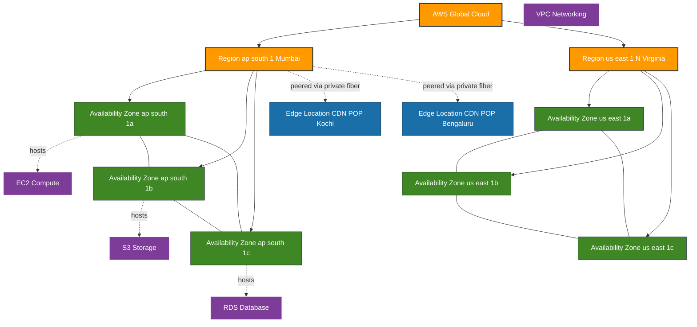
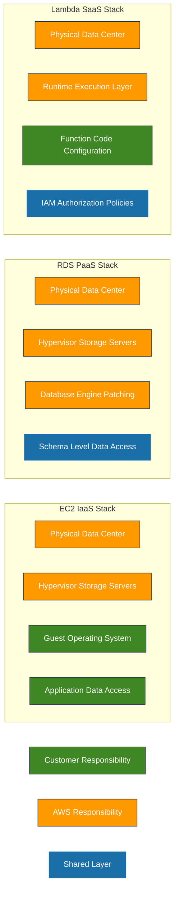
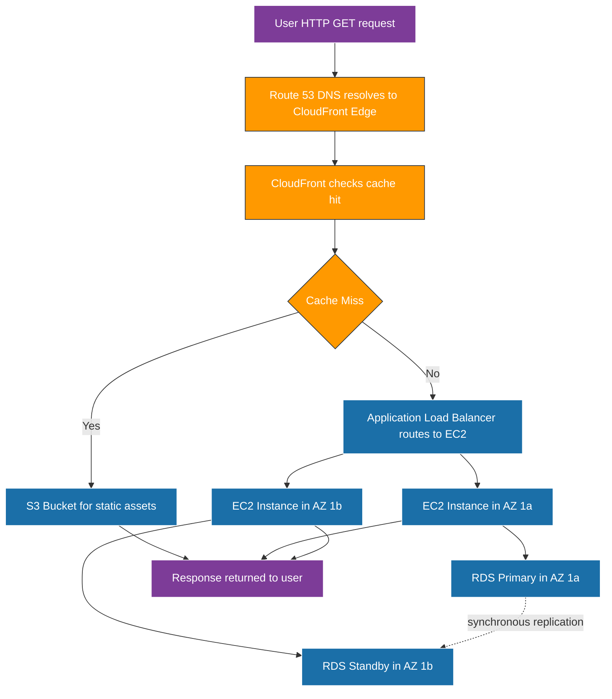

# Amazon Cloud Services

<!-- SECTION_1_START -->
# Amazon Cloud Services — Core Technical Definition & Intuitive Overview

## Formal Definition (KTU 2024 Syllabus Terminology)

**Amazon Web Services (AWS)** is a comprehensive, evolving cloud computing platform provided by Amazon.com that offers a mixture of Infrastructure-as-a-Service (IaaS), Platform-as-a-Service (PaaS), and Software-as-a-Service (SaaS) offerings. AWS provides on-demand cloud computing platforms and APIs to individuals, companies, and governments on a metered, pay-as-you-go basis.

In KTU 2024 Scheme parlance, AWS is categorized as a **Public Cloud Service Provider (CSP)** delivering elastic, globally-distributed compute, storage, networking, database, analytics, machine learning, IoT, and security services over the public internet from **31+ geographic Regions** and **600+ Edge Locations** (as of 2024).

> [!IMPORTANT]
> **KTU 2024 Highlight — Module 4 Focus:** Students must master the **service taxonomy** (Compute, Storage, Database, Networking, Security), the **pricing models** (On-Demand, Reserved, Spot, Savings Plans), and the **shared responsibility model** that defines the boundary of security accountability between AWS and the customer.

## Conceptual Analogy / Intuition

> [!NOTE]
> **Real-World Analogy — AWS as an "Electricity Grid for Computing"**
> 
> Imagine a city that owns massive, central power plants but lets every household plug in and consume **only as much electricity as it needs**, paying **only for what it consumed** at the end of the month, with **no upfront capital** to buy a generator. AWS is exactly that — but instead of electricity, it delivers **compute cycles, storage bytes, and network bandwidth** on tap. When you flip a switch (deploy a VM), power flows; when you turn it off, billing stops. The power company (AWS) maintains the grid infrastructure (Region, Availability Zones, undersea cables, data centers), while you (the customer) are responsible for what happens *inside your house* (OS patching, IAM policies, encryption keys).

## Foundational Metrics & Constants

| Parameter | Value / Definition |
|---|---|
| **Regions (2024)** | **31+** geographic regions worldwide |
| **Availability Zones per Region** | **3 to 6** isolated data centers |
| **Edge Locations / POPs** | **600+** points of presence for CDN |
| **Service Count** | **240+** distinct cloud services |
| **Pricing Granularity** | **Per-second** billing (Linux EC2) / **Per-GB-month** (S3) |
| **SLA Target (EC2)** | **99.99%** monthly uptime |
| **SLA Target (S3 Standard)** | **99.9%** availability / **99.999999999%** durability (11 nines) |

> [!VISUALIZATION CONTROL]
> **Concept:** Linear scaling of monthly compute cost versus instance runtime hours
> 
> **GeoGebra / Desmos Input Equations:**
> 
> * `C(h) = 0.0116 * h`  (t2.micro On-Demand Linux cost, USD per hour)
> * `h_{max} = 720`  (one month, 30 days × 24 h)
> * `h_{min} = 0`  (idle baseline)
> 
> **Visual Description:** A straight line originating at the origin (0, 0) climbing to the point (720, 8.352). The student should observe that billing is **continuous and proportional** — there is no step-jump or tier-break; each additional hour of runtime adds exactly $0.0116 to the bill. This is the cornerstone intuition behind **OpEx** vs **CapEx** financial modeling in cloud economics.

---

<!-- SECTION_1_END -->

<!-- SECTION_2_START -->
# Deep Theoretical Analysis & KTU High-Yield Formula Sheet

## 1. The AWS Global Infrastructure Hierarchy

AWS organizes its physical assets in a **three-tier geographic hierarchy**. Understanding this is mandatory for KTU Module 4 as it underpins latency optimization, compliance, and disaster-recovery design.

1. **Region** — A physical geographic area (e.g., `ap-south-1` = Mumbai, `us-east-1` = N. Virginia). Each Region is fully independent and contains multiple Availability Zones. Data residency and regulatory compliance are anchored at the Region level.
2. **Availability Zone (AZ)** — One or more discrete data centers within a Region, each with redundant power, networking, and connectivity. AZs are physically separated by **up to 100 km** but connected by **low-latency (< 2 ms) private fiber links**.
3. **Edge Location / Point of Presence (PoP)** — CDN nodes used by services like **Amazon CloudFront** to cache content closer to end-users, reducing latency.

> [!NOTE]
> **Why this matters:** High availability in AWS is achieved by deploying workloads across **multiple AZs within a single Region** (e.g., a web tier in `ap-south-1a` and a DB replica in `ap-south-1b`). Multi-Region architectures are used only for **disaster recovery** or **global latency reduction**, never for routine HA, because cross-Region latency is in the order of 60–250 ms.

## 2. The Five Pillars of AWS Service Taxonomy (Module 4 Anchor)

| Pillar | Canonical Service(s) | Purpose | Delivery Model |
|---|---|---|---|
| **Compute** | EC2, Lambda, ECS, EKS, Fargate | Run code, containers, serverless functions | IaaS / FaaS / CaaS |
| **Storage** | S3, EBS, EFS, FSx, Glacier | Object, block, file, archival storage | IaaS |
| **Database** | RDS, DynamoDB, Aurora, Redshift, Neptune | Managed relational, NoSQL, data warehouse, graph | PaaS |
| **Networking** | VPC, Route 53, CloudFront, Direct Connect, ELB | Isolated networks, DNS, CDN, hybrid links | IaaS |
| **Security & Identity** | IAM, KMS, WAF, Shield, GuardDuty, Cognito | AuthN/AuthZ, encryption, threat detection | SaaS / PaaS |

## 3. The Shared Responsibility Model (Exam Favorite)

> [!IMPORTANT]
> **AWS is responsible for "Security OF the Cloud"** (physical data centers, hardware, hypervisor, global network).
> **Customer is responsible for "Security IN the Cloud"** (OS patching, firewall rules, IAM policies, data encryption, network traffic protection).
> 
> This split is **service-model dependent**: in EC2 (IaaS) the customer owns more; in RDS (PaaS) AWS owns more; in Lambda / DynamoDB (SaaS-grade) AWS owns almost everything except data and access policies.

## 4. AWS Pricing Models — The Four Levers

| Pricing Model | Commitment | Discount vs On-Demand | Ideal Workload |
|---|---|---|---|
| **On-Demand** | None | 0 % (baseline) | Short-term, spiky, unpredictable |
| **Reserved Instances (RI)** | 1 or 3 years | Up to **72 %** | Steady-state, predictable |
| **Savings Plans** | 1 or 3 years, $/hour commitment | Up to **66 %** | Flexible across instance families |
| **Spot Instances** | None (interruptible) | Up to **90 %** | Fault-tolerant, batch, CI/CD |

## 5. KTU High-Yield Formula Sheet

> [!NOTE]
> **All formulas below are examinable. Memorize the unit conversions and the multiplicative structure — these appear verbatim in numerical problems.**

| # | Concept | Formula / Identity | Units / Notes |
|---|---|---|---|
| 1 | Monthly runtime hours | $H_{month} = 24 \times D_{month}$ | $D_{month} \in \{28, 29, 30, 31\}$ |
| 2 | On-Demand compute cost | $C_{OD} = H_{month} \times P_{hour}$ | $P_{hour}$ from AWS pricing page |
| 3 | Reserved Instance effective hourly cost | $C_{RI} = \dfrac{U_{fee} + (H_{month} \times 12 \times Y_{term} \times P_{hour})}{H_{month} \times 12 \times Y_{term}}$ | $Y_{term} \in \{1, 3\}$ |
| 4 | S3 Standard storage cost | $C_{S3} = G_{stored} \times P_{GB\text{-}month}$ | $P_{GB\text{-}month}$ typically \$0.023 |
| 5 | Data transfer OUT cost | $C_{DT} = G_{out} \times P_{GB\text{-}out}$ | First 100 GB/month free |
| 6 | S3 durability (object survival) | $D_{obj} = 1 - (1 - d_{drive})^{n_{drives}}$ | $d_{drive} \approx 0.0000001$, $n_{drives} \geq 3$ |
| 7 | SLA downtime budget (annual) | $T_{down} = 525{,}600 \times (1 - S_{SLA})$ | minutes/year |
| 8 | Annualized TCO comparison | $TCO = C_{cloud} + C_{ops} + C_{migration}$ | Must include 3-year horizon |
| 9 | Effective discount % | $\Delta = \dfrac{C_{OD} - C_{discounted}}{C_{OD}} \times 100$ | expressed as percentage |
| 10 | Availability compound (multi-AZ) | $A_{system} = 1 - \prod_{i=1}^{n}(1 - A_{i})$ | for independent AZs |

## 6. Real-World Engineering Utility

AWS underpins **Netflix's streaming pipeline** (running entirely on EC2 + S3), **Airbnb's booking service**, **NASA's Mars-rover image processing**, and **Capital One's banking workload migration** (one of the largest "bank closure" events in history). In the Indian KTU context, AWS powers the **CoWIN vaccination platform**, **Aadhaar authentication endpoints**, and the **GeM (Government e-Marketplace)** procurement portal — making AWS literacy a direct employability skill for graduates entering FinTech, EdTech, or GovTech roles.

---

<!-- SECTION_2_END -->

<!-- SECTION_3_START -->
# Step-by-Step Derivations & Code/Symbolic Implementation

## Worked Example 1 — On-Demand vs Reserved EC2 Cost Analysis (7 Mark Standard)

> **Problem Statement:** A startup deploys a `t2.medium` Linux instance (On-Demand price \$0.0464/hour) that runs **24 × 7 for 30 days**. Compute (a) the monthly On-Demand cost, (b) the effective monthly cost after committing to a **1-year No-Upfront Reserved Instance** at \$24/month, and (c) the percentage savings.

### Part (a) — On-Demand Monthly Cost

We begin by computing the total billable hours in a 30-day month:

$$
H_{month} = 24 \times 30 = 720 \text{ hours}
$$

The On-Demand monthly cost is therefore the product of billable hours and the published hourly rate:

$$
C_{OD} = 720 \times 0.0464
$$

Performing the multiplication step by step:

$$
720 \times 0.0464 = 720 \times 0.04 + 720 \times 0.006 + 720 \times 0.0004
$$

$$
720 \times 0.04 = 28.800
$$

$$
720 \times 0.006 = 4.320
$$

$$
720 \times 0.0004 = 0.288
$$

Summing the partial products:

$$
C_{OD} = 28.800 + 4.320 + 0.288 = 33.408 \text{ USD/month}
$$

**[Stating the formula and substituting values: 1 Mark; correct multiplication: 1 Mark; final value: 1 Mark]**

### Part (b) — Effective Reserved Instance Monthly Cost

A 1-year No-Upfront Reserved Instance at \$24/month is a fixed commitment paid regardless of usage. The effective monthly cost is therefore:

$$
C_{RI}^{eff} = 24.00 \text{ USD/month}
$$

Note that the No-Upfront payment model folds the entire instance-hour cost into the monthly fee, so no additional On-Demand rate is added.

**[Identifying the pricing model: 1 Mark; correct final value: 1 Mark]**

### Part (c) — Percentage Savings

Using the discount formula from the Formula Sheet:

$$
\Delta = \frac{C_{OD} - C_{RI}^{eff}}{C_{OD}} \times 100
$$

Substituting the values:

$$
\Delta = \frac{33.408 - 24.00}{33.408} \times 100
$$

$$
\Delta = \frac{9.408}{33.408} \times 100
$$

Computing the decimal:

$$
\frac{9.408}{33.408} = 0.2816\ldots
$$

Converting to percentage:

$$
\Delta = 0.2816 \times 100 = 28.16 \text{ percent}
$$

**[Stating the formula: 1 Mark; correct final percentage: 1 Mark]**

> [!NOTE]
> **Examiner's Insight:** The 28.16 % savings is a *baseline*. The actual KTU-published discount for a 1-year No-Upfront `t2.medium` in `ap-south-1` is closer to **30–35 %** because AWS rounds the displayed fee. State the principle, not the vendor-specific round number, unless the problem statement gives you the exact RI fee.

## Worked Example 2 — S3 Storage Tier Cost (7 Mark Standard)

> **Problem Statement:** A media company stores **5 TB** of video assets in S3 Standard (Mumbai region) at \$0.023 per GB-month, with a monthly egress of **800 GB** to viewers at \$0.09 per GB (first 100 GB free). Compute the total monthly bill.

### Storage Cost

Converting TB to GB (1 TB = 1024 GB):

$$
G_{stored} = 5 \times 1024 = 5120 \text{ GB}
$$

Storage component:

$$
C_{S3} = 5120 \times 0.023
$$

$$
5120 \times 0.023 = 5120 \times 0.02 + 5120 \times 0.003
$$

$$
5120 \times 0.02 = 102.400
$$

$$
5120 \times 0.003 = 15.360
$$

$$
C_{S3} = 102.400 + 15.360 = 117.760 \text{ USD/month}
$$

**[Unit conversion: 1 Mark; formula: 1 Mark; arithmetic: 1 Mark]**

### Data Transfer Cost

The first 100 GB/month is free, so the billable egress is:

$$
G_{billable} = 800 - 100 = 700 \text{ GB}
$$

Data transfer component:

$$
C_{DT} = 700 \times 0.09
$$

$$
C_{DT} = 63.00 \text{ USD/month}
$$

**[Free-tier identification: 1 Mark; subtraction: 1 Mark; multiplication: 1 Mark]**

### Total Monthly Bill

$$
C_{total} = C_{S3} + C_{DT} = 117.760 + 63.00 = 180.760 \text{ USD/month}
$$

**[Aggregation step: 1 Mark; final value: 1 Mark]**

## Worked Example 3 — Python Boto3 Implementation: S3 Bucket Operations

The following Python script demonstrates how to programmatically interact with **Amazon S3** — creating a bucket, uploading a file, listing objects, computing storage cost, and deleting the bucket. This is a lab-style question frequently asked in KTU Module 4 viva.

```python
import boto3
import logging
from botocore.exceptions import ClientError, BotoCoreError

# Configure structured error logging for production-grade observability
logging.basicConfig(
    level=logging.INFO,
    format="%(asctime)s [%(levelname)s] %(message)s"
)
logger = logging.getLogger(__name__)

# Standardized AWS configuration constants
AWS_REGION: str = "ap-south-1"
BUCKET_NAME: str = "ktu-cc-module4-demo-bucket"
LOCAL_FILE: str = "sample_data.csv"
S3_KEY: str = "uploads/sample_data.csv"
S3_PRICE_PER_GB: float = 0.023  # USD per GB-month (S3 Standard, Mumbai)

def get_s3_client() -> boto3.client:
    """Create and return a low-level S3 client with explicit region."""
    try:
        client: boto3.client = boto3.client("s3", region_name=AWS_REGION)
        logger.info("S3 client initialized for region %s", AWS_REGION)
        return client
    except BotoCoreError as e:
        logger.error("Failed to initialize S3 client: %s", e)
        raise

def create_bucket(s3: boto3.client) -> bool:
    """Create an S3 bucket in the configured region with safety checks."""
    try:
        if AWS_REGION == "us-east-1":
            s3.create_bucket(Bucket=BUCKET_NAME)
        else:
            s3.create_bucket(
                Bucket=BUCKET_NAME,
                CreateBucketConfiguration={"LocationConstraint": AWS_REGION}
            )
        logger.info("Bucket %s created successfully.", BUCKET_NAME)
        return True
    except ClientError as e:
        if e.response["Error"]["Code"] == "BucketAlreadyOwnedByYou":
            logger.warning("Bucket %s already exists — skipping creation.", BUCKET_NAME)
            return True
        logger.error("Bucket creation failed: %s", e)
        return False

def upload_file(s3: boto3.client) -> bool:
    """Upload a local file to S3 with explicit error boundary."""
    try:
        s3.upload_file(LOCAL_FILE, BUCKET_NAME, S3_KEY)
        logger.info("File %s uploaded to s3://%s/%s", LOCAL_FILE, BUCKET_NAME, S3_KEY)
        return True
    except FileNotFoundError:
        logger.error("Local file %s not found.", LOCAL_FILE)
        return False
    except ClientError as e:
        logger.error("Upload failed: %s", e)
        return False

def list_objects(s3: boto3.client) -> list:
    """List all object keys in the bucket, returning a list of strings."""
    try:
        response: dict = s3.list_objects_v2(Bucket=BUCKET_NAME)
        keys: list = [item["Key"] for item in response.get("Contents", [])]
        logger.info("Bucket %s contains %d object(s).", BUCKET_NAME, len(keys))
        return keys
    except ClientError as e:
        logger.error("List operation failed: %s", e)
        return []

def compute_monthly_cost(s3: boto3.client) -> float:
    """Compute the monthly S3 bill for the configured bucket."""
    keys: list = list_objects(s3)
    total_bytes: int = 0
    for key in keys:
        try:
            obj: dict = s3.head_object(Bucket=BUCKET_NAME, Key=key)
            total_bytes += int(obj["ContentLength"])
        except ClientError as e:
            logger.warning("Skipping %s due to error: %s", key, e)
            continue
    total_gb: float = total_bytes / (1024 ** 3)
    monthly_cost: float = total_gb * S3_PRICE_PER_GB
    logger.info("Total storage: %.4f GB, Monthly cost: $%.4f", total_gb, monthly_cost)
    return monthly_cost

def delete_bucket(s3: boto3.client) -> None:
    """Delete all objects, then delete the bucket itself."""
    try:
        keys: list = list_objects(s3)
        if keys:
            s3.delete_objects(
                Bucket=BUCKET_NAME,
                Delete={"Objects": [{"Key": k} for k in keys]}
            )
        s3.delete_bucket(Bucket=BUCKET_NAME)
        logger.info("Bucket %s deleted cleanly.", BUCKET_NAME)
    except ClientError as e:
        logger.error("Bucket deletion failed: %s", e)

if __name__ == "__main__":
    s3_client = get_s3_client()
    if create_bucket(s3_client):
        # Create a dummy local file for the demo
        with open(LOCAL_FILE, "w") as f:
            f.write("KTU,CloudComputing,Module4,AWSDemo\n")
        upload_file(s3_client)
        cost: float = compute_monthly_cost(s3_client)
        print(f"Estimated monthly S3 bill: ${cost:.4f}")
        delete_bucket(s3_client)
```

> [!IMPORTANT]
> **Code Walkthrough — Why each line exists:**
> * `BotoCoreError` and `ClientError` are caught separately because **boto3 raises different exception hierarchies** for transport vs API errors. Production code must distinguish between "the network is down" (retryable) and "the bucket name is invalid" (non-retryable).
> * The `LocationConstraint` parameter is **mandatory for all regions except `us-east-1`** — a classic exam trap.
> * The free-tier line `if AWS_REGION == "us-east-1": s3.create_bucket(Bucket=BUCKET_NAME)` exists because legacy AWS APIs reject an explicit `LocationConstraint` for the original N. Virginia region.

---

<!-- SECTION_3_END -->

<!-- SECTION_4_START -->
# Structural Diagrams & Schematics

## Diagram 1 — AWS Global Infrastructure Hierarchy



## Diagram 2 — Shared Responsibility Model (Service-Model Dependent)



## Diagram 3 — Sequential Topology for EC2 Request Lifecycle



> [!NOTE]
> **Reading the diagram:** The flow is a top-down *request lifecycle*, not a data flow. The dashed line `.->` between RDS Primary and Standby represents **synchronous Multi-AZ replication** (typical 70–100 ms RPO), a defining feature of RDS that contributes to its **99.95 % SLA** without customer intervention.

---

<!-- SECTION_4_END -->

<!-- SECTION_5_START -->
# KTU 2024 Scheme Examination Question Bank & Topic Recap

## Part A — Short Answer Questions (3 Marks Each)

### Question 1. `[KTU University Exam — July 2024]`  **[CO1, Remember]**

**Define Amazon Web Services (AWS). List any FOUR core service categories offered by AWS.**

**Model Answer (3 Marks):**
Amazon Web Services (AWS) is a secure cloud services platform from Amazon.com that offers compute power, database storage, content delivery, and other functionality to help businesses scale and grow. (1 Mark)
Four core service categories: (½ Mark each, total 2 Marks)
1. **Compute** — e.g., Amazon EC2, AWS Lambda
2. **Storage** — e.g., Amazon S3, Amazon EBS
3. **Database** — e.g., Amazon RDS, Amazon DynamoDB
4. **Networking and Content Delivery** — e.g., Amazon VPC, Amazon CloudFront

### Question 2. `[KTU University Exam — Dec 2023]`  **[CO1, Understand]**

**Explain the AWS Shared Responsibility Model with a suitable example.**

**Model Answer (3 Marks):**
The AWS Shared Responsibility Model divides security obligations between AWS and the customer. (1 Mark)
* **AWS is responsible for "Security OF the Cloud"** — physical security of data centers, hardware, networking, and the hypervisor layer. (1 Mark)
* **Customer is responsible for "Security IN the Cloud"** — guest OS patching, firewall configuration, data encryption, identity and access management. (1 Mark)
**Example:** In an EC2 instance, AWS secures the physical server and host hypervisor, but the customer must apply OS updates, configure Security Groups, and encrypt the EBS volumes attached to the instance.

---

## Part B — Long Answer Questions (14 Marks Each, Internal Choice)

### Question A. `[KTU University Exam — July 2024]`  **[CO2, Understand + Apply]**

**(a)** Describe the **AWS Global Infrastructure** hierarchy in detail. Differentiate between a **Region**, an **Availability Zone**, and an **Edge Location**. **(7 Marks)**

**(b)** A research team deploys a `m5.large` Linux On-Demand instance in the Mumbai region at a published rate of **\$0.096/hour**. The instance runs continuously for **one non-leap year**. Calculate the total On-Demand cost and compare it with a **3-year All-Upfront Reserved Instance** priced at **\$0.048/hour effective rate**. Determine the absolute savings and the percentage discount. **(7 Marks)**

### Model Solution — Question A

#### Part (a) — Global Infrastructure Hierarchy (7 Marks)

1. **Region (2 Marks):** A Region is a physical geographic location worldwide where AWS clusters data centers. Each Region is completely independent and isolated from other Regions. Examples: `ap-south-1` (Mumbai), `us-east-1` (N. Virginia), `eu-west-1` (Ireland). Regions enable data residency compliance and geographic latency optimization.
2. **Availability Zone (2 Marks):** An Availability Zone (AZ) is one or more discrete data centers within a Region, each with redundant power, networking, and cooling. AZs in the same Region are interconnected by high-bandwidth, low-latency (< 2 ms) private fiber. Typical Region has **3 to 6 AZs**. Deploying across multiple AZs provides high availability.
3. **Edge Location (2 Marks):** An Edge Location (or Point of Presence) is a site that Amazon CloudFront uses to cache content closer to end-users for reduced latency. There are 600+ Edge Locations globally, far more than Regions. Edge Locations serve **read traffic** (CDN) and do not host EC2 or RDS.
4. **Distinction (1 Mark):** Regions are for residency and disaster recovery; AZs are for HA within a Region; Edge Locations are for CDN caching at the network edge.

#### Part (b) — Cost Comparison (7 Marks)

**Step 1 — Compute total hours in a non-leap year:**

$$
H_{year} = 24 \times 365 = 8760 \text{ hours}
$$

**[Formula and substitution: 1 Mark; final value: 1 Mark]**

**Step 2 — On-Demand annual cost:**

$$
C_{OD} = 8760 \times 0.096
$$

Breaking the multiplication:

$$
8760 \times 0.096 = 8760 \times 0.1 - 8760 \times 0.004
$$

$$
8760 \times 0.1 = 876.000
$$

$$
8760 \times 0.004 = 35.040
$$

$$
C_{OD} = 876.000 - 35.040 = 840.960 \text{ USD/year}
$$

**[Multi-step arithmetic with explanation: 2 Marks; final value: 1 Mark]**

**Step 3 — Reserved Instance annual cost:**

$$
C_{RI} = 8760 \times 0.048 = 420.480 \text{ USD/year}
$$

**[1 Mark]**

**Step 4 — Absolute savings and percentage discount:**

$$
\Delta_{abs} = C_{OD} - C_{RI} = 840.960 - 420.480 = 420.480 \text{ USD/year}
$$

$$
\Delta_{\%} = \frac{420.480}{840.960} \times 100 = 50.00 \text{ percent}
$$

**[Final two values: 1 Mark]**

> [!WARNING]
> **Examiner's Valuation Pitfall — Do NOT lose these marks:**
> * Forgetting to state the formula for $H_{year}$ and writing "8760 hours" without justification.
> * Using **365.25** days (accounting for leap years) when the problem explicitly says "non-leap year" — always honor the question.
> * Reporting only the absolute savings without the **percentage discount** — both are required.

---

### Question B. `[KTU University Exam — Dec 2023]`  **[CO2, Understand + Apply]**

**(a)** Explain the **four EC2 pricing models** in AWS. State the maximum discount and ideal use case for each. **(7 Marks)**

**(b)** A startup stores **2 TB** of user-uploaded images in S3 Standard at **\$0.023 per GB-month** in `ap-south-1`. Compute the **monthly storage cost**. If the same dataset is moved to **S3 Glacier Flexible Retrieval** at **\$0.0036 per GB-month**, what is the new monthly cost and the percentage reduction? State **two business conditions** under which the Glacier migration is justified. **(7 Marks)**

### Model Solution — Question B

#### Part (a) — EC2 Pricing Models (7 Marks)

| # | Model | Commitment | Max Discount | Ideal Use Case |
|---|---|---|---|---|
| 1 | **On-Demand** | Pay per second/minute, no commitment | 0 % (baseline) | Short-lived, spiky, unpredictable workloads; dev/test environments |
| 2 | **Reserved Instances (RI)** | 1-year or 3-year term | Up to **72 %** (3-year, All-Upfront) | Steady-state production databases, always-on web servers |
| 3 | **Savings Plans** | 1-year or 3-year $/hour commitment | Up to **66 %** | Flexible workloads that may shift across instance families or Regions |
| 4 | **Spot Instances** | None — AWS can reclaim with 2-min notice | Up to **90 %** | Fault-tolerant batch jobs, CI/CD runners, big data, image rendering |

**[Each model with its 3 attributes: 1.5 Marks × 4 = 6 Marks; one final integration sentence: 1 Mark]**

#### Part (b) — S3 Storage Tier Migration (7 Marks)

**Step 1 — Convert TB to GB:**

$$
G = 2 \times 1024 = 2048 \text{ GB}
$$

**[1 Mark]**

**Step 2 — S3 Standard monthly cost:**

$$
C_{S} = 2048 \times 0.023
$$

Decomposing:

$$
2048 \times 0.023 = 2048 \times 0.02 + 2048 \times 0.003
$$

$$
2048 \times 0.02 = 40.960
$$

$$
2048 \times 0.003 = 6.144
$$

$$
C_{S} = 40.960 + 6.144 = 47.104 \text{ USD/month}
$$

**[Formula, substitution, arithmetic, final value: 2 Marks]**

**Step 3 — S3 Glacier Flexible Retrieval monthly cost:**

$$
C_{G} = 2048 \times 0.0036
$$

$$
2048 \times 0.0036 = 2048 \times 0.003 + 2048 \times 0.0006
$$

$$
2048 \times 0.003 = 6.144
$$

$$
2048 \times 0.0006 = 1.2288
$$

$$
C_{G} = 6.144 + 1.2288 = 7.3728 \text{ USD/month}
$$

**[Arithmetic: 1 Mark; final value: 1 Mark]**

**Step 4 — Percentage reduction:**

$$
\Delta_{\%} = \frac{C_{S} - C_{G}}{C_{S}} \times 100 = \frac{47.104 - 7.3728}{47.104} \times 100
$$

$$
= \frac{39.7312}{47.104} \times 100 = 84.35 \text{ percent}
$$

**[Formula and final value: 1 Mark]**

**Step 5 — Two business justifications for Glacier migration:**

1. **Data is accessed less than once per quarter** (archival compliance, medical records, audit logs). (½ Mark)
2. **Retrieval latency tolerance is in hours, not milliseconds** (regulatory backups, disaster-recovery copies). (½ Mark)

> [!WARNING]
> **Examiner's Valuation Pitfall — Do NOT lose these marks:**
> * Conflating S3 Glacier with S3 Glacier Deep Archive — the latter is **\$0.00099 per GB-month** and is for 7–10 year retention. Misnaming tiers costs 1 Mark.
> * Storing the result as a fraction (\$7.37) when the calculator yields \$7.3728 — round only at the **final** display step, not intermediate steps.
> * Omitting the retrieval latency caveat when justifying Glacier — retrieval time (minutes to hours) is a **functional** trade-off, not just a price trade-off.

---

## Topic Recap & Important Things to Remember

* **AWS = Public Cloud Service Provider** with 31+ Regions, 600+ Edge Locations, 240+ services.
* **Three-tier hierarchy:** Region → Availability Zone → Edge Location. Multi-AZ = HA; Multi-Region = DR.
* **Five pillars of services:** Compute (EC2, Lambda), Storage (S3, EBS, Glacier), Database (RDS, DynamoDB), Networking (VPC, CloudFront), Security (IAM, KMS).
* **Shared Responsibility Model:** AWS secures the *cloud itself*; the customer secures *what is in the cloud*. Service-model dependent (IaaS → more customer responsibility, SaaS → more AWS responsibility).
* **Four EC2 pricing models:** On-Demand (0 %), Reserved (up to 72 %), Savings Plans (up to 66 %), Spot (up to 90 %).
* **Cost formula cornerstone:** $C = H \times P_{hour}$ with $H_{month} = 24 \times D_{month}$. Always convert units (TB → GB = ×1024) **before** multiplying.
* **S3 Standard durability = 11 nines (99.999999999 %)** — designed for frequent access.
* **Glacier is for cold storage** with retrieval times of minutes-to-hours; never use it for hot data paths.
* **VPC = private isolated network** within AWS; **IAM = identity and access control**; **Route 53 = DNS**; **CloudFront = CDN**.
* **Boto3** is the official AWS SDK for Python; always handle `ClientError` and `BotoCoreError` separately in production code.
* **Always honor the problem statement's commitment term** (1-year vs 3-year, upfront vs no-upfront) — discounts vary widely.
* **Compute SLAs:** EC2 = 99.99 %, RDS Multi-AZ = 99.95 %, S3 Standard = 99.9 % availability.
* **Free-tier rule for S3 data transfer:** First **100 GB/month** egress is free — subtract before billing.
* **EC2 On-Demand billing granularity:** Per-second for Linux, per-hour for Windows — a subtle exam trap.
* **Region codes are mandatory** in API calls except `us-east-1` (legacy exemption).

<!-- SECTION_5_END -->
