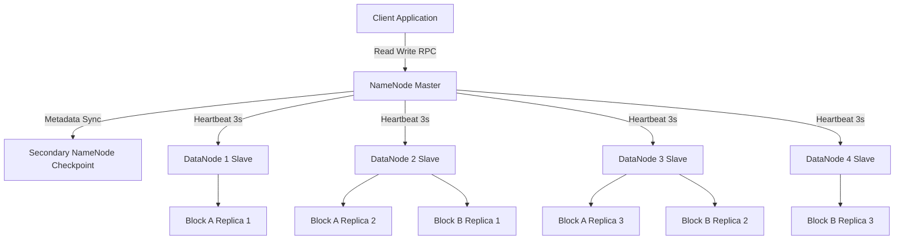
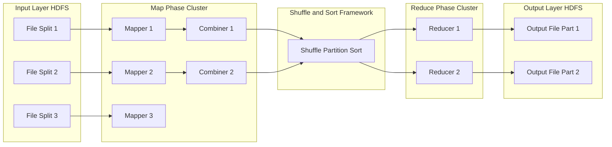
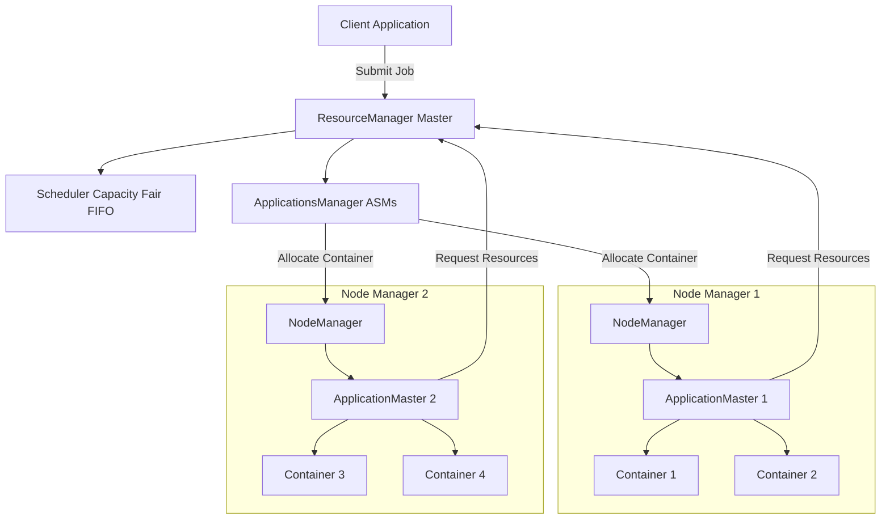
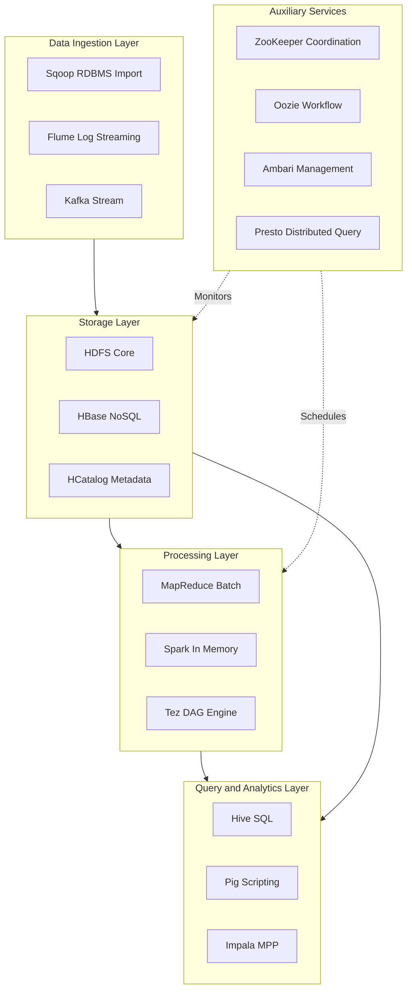

# Apache Hadoop

<!-- SECTION_1_START -->
# Apache Hadoop - Core Technical Definition & Intuitive Overview

## 📘 Formal Definition (KTU 2024 Syllabus Terminology)

> [!IMPORTANT]
> **Apache Hadoop** is an open-source, Java-based distributed computing framework that enables the **storage**, **processing**, and **analysis** of massive datasets (Big Data) across clusters of commodity computers using simple programming models. It is designed to scale up from a single server to thousands of machines, each offering local computation and storage.

The Hadoop framework is governed by the **Four V's of Big Data**:
- **Volume** (Petabytes to Exabytes of data)
- **Velocity** (Real-time and batch stream processing)
- **Variety** (Structured, Semi-structured, Unstructured)
- **Veracity** (Data uncertainty and quality management)

The two core architectural pillars of Hadoop are:
1. **HDFS (Hadoop Distributed File System)** → Handles **storage** layer
2. **MapReduce** → Handles **processing** layer
3. **YARN (Yet Another Resource Negotiator)** → Handles **resource management & job scheduling**

> [!NOTE]
> Hadoop follows the **Write Once, Read Many (WORM)** model. Once data is written to HDFS, it is rarely modified. The default **replication factor (RF = 3)** ensures fault tolerance.

---

## 🌐 Conceptual Analogy / Intuition

> [!TIP]
> **Think of Hadoop as a Massive Library System:**
> - **The Library Building (HDFS)** stores millions of books (data files) in distributed shelves.
> - **The Librarian Team (MapReduce)** is divided into two groups:
>   - **Mappers** walk through the books and note down key information (key-value pairs).
>   - **Reducers** gather these notes, group similar ones, and produce final summaries.
> - **The Floor Manager (YARN)** assigns tasks to librarians, ensuring efficient utilization of staff and shelves.
> - If a shelf collapses (node failure), the **automatic duplication (replication)** ensures no book is lost.

If a file of **128 MB** (default block size) needs to be stored across **3 machines**, Hadoop will:
1. Split the file into **blocks** of 128 MB each.
2. Store each block on a separate machine.
3. Create **2 additional copies (replicas)** of each block on different machines.

---

## 🎯 GeoGebra / Desmos Visualization

> [!VISUALIZATION CONTROL]
> **Concept:** HDFS Block Replication Topology (Linear Visualization)
> 
> **GeoGebra / Desmos Input Equations:**
> ```
> Replication Factor (R) = 3
> Block Size (B) = 128 MB
> File Size (F) = 512 MB
> Number of Blocks (N) = F / B = 4
> Total Storage Used = N × B × R = 1536 MB
> ```
> 
> **Visual Description:** Plot a bar chart on Desmos with X-axis as "Block Number (1 to 4)" and Y-axis as "Storage Footprint in MB". Each block column will show 3 stacked bars (replicas), each of 128 MB height, illustrating how 512 MB of logical data consumes 1536 MB of physical storage.

---

## 🔑 Core Hadoop Features (Highlight Callout)

> [!IMPORTANT]
> **Key Engineering Properties of Hadoop:**
> - **Scalability**: Horizontal scaling (add more nodes seamlessly)
> - **Fault Tolerance**: Automatic recovery via replication
> - **Flexibility**: Handles structured, semi-structured, and unstructured data
> - **Cost-Effectiveness**: Uses commodity hardware (low-cost machines)
> - **Data Locality**: Computation moves to data, not vice-versa
> - **Open Source**: Apache 2.0 License
> - **Ecosystem Rich**: HBase, Hive, Pig, Spark, Sqoop, Flume, ZooKeeper
<!-- SECTION_1_END -->

<!-- SECTION_2_START -->
# Deep Theoretical Analysis & KTU High-Yield Formula Sheet

## ⚙️ Hadoop Core Components — Structured Logical Breakdown

### 1. HDFS (Hadoop Distributed File System)
HDFS is a **master-slave architecture** designed for high-throughput access to large datasets.

| Component | Role | Key Responsibility |
|-----------|------|-------------------|
| **NameNode (Master)** | Metadata Server | Stores filesystem metadata, directory tree, block-to-Datanode mapping. Runs in RAM for fast access. |
| **DataNode (Slave)** | Storage Worker | Stores actual data blocks. Periodically sends heartbeats (every **3 seconds**) to NameNode. |
| **Secondary NameNode** | Checkpoint Helper | Merges **fsimage** and **edit logs** to create a new checkpoint. **Not a backup** NameNode. |

> [!NOTE]
> **Default HDFS Block Size (Hadoop 2.x & 3.x):** **128 MB** (Hadoop 1.x used 64 MB)
> **Default Replication Factor:** **3** (1 original + 2 replicas)

---

### 2. MapReduce Programming Model
MapReduce is a **two-phase distributed data processing paradigm**:
- **Map Phase**: Input is split into independent chunks. The `Mapper` class processes `<key, value>` pairs and emits intermediate `<key, value>` pairs.
- **Reduce Phase**: The `Reducer` aggregates intermediate values associated with the same intermediate key.

| Stage | Description | Output |
|-------|-------------|--------|
| **InputFormat** | Reads & splits input | InputSplit |
| **RecordReader** | Converts split to (K,V) | (K1, V1) |
| **Mapper** | User-defined logic | List of (K2, V2) |
| **Combiner** *(optional)* | Local aggregation on Mapper node | Reduced (K2, V2) |
| **Partitioner** | Routes keys to specific Reducers | Partition number |
| **Shuffle & Sort** | Framework-managed | Sorted (K2, [V2]) |
| **Reducer** | User-defined aggregation | (K3, V3) |
| **OutputFormat** | Writes final result | HDFS files |

---

### 3. YARN (Yet Another Resource Negotiator)
Introduced in **Hadoop 2.x** to overcome MapReduce 1.x's scalability bottlenecks.

| YARN Component | Role | Responsibilities |
|----------------|------|------------------|
| **ResourceManager (RM)** | Global Master | Allocates cluster resources, schedules applications |
| **NodeManager (NM)** | Per-node Slave | Manages containers, monitors resource usage (CPU, RAM) |
| **ApplicationMaster (AM)** | Per-application Master | Negotiates resources with RM, works with NMs |
| **Container** | Execution Unit | Bundles RAM, CPU, and task-specific resources |

---

## 📐 KTU High-Yield Formula Sheet (Cheat Sheet)

> [!IMPORTANT]
> **Critical Formulas for Hadoop Calculations:**

| # | Formula / Concept | Expression | Units | Notes |
|---|------------------|------------|-------|-------|
| 1 | **Number of Blocks** | $N = \lceil \dfrac{F}{B} \rceil$ | blocks | F = File size, B = Block size |
| 2 | **Total HDFS Storage Used** | $S_{total} = N \times B \times R$ | MB / GB | R = Replication factor |
| 3 | **Effective Storage Utilization** | $\eta = \dfrac{F}{S_{total}} = \dfrac{1}{R}$ | ratio (0 to 1) | With R=3, η = 33.33% |
| 4 | **Storage Overhead** | $S_{overhead} = S_{total} - F = F \times (R-1)$ | MB / GB | Wasted space due to replication |
| 5 | **Cluster Throughput** | $T = \dfrac{D}{t}$ | MB/s | D = Data processed, t = Time taken |
| 6 | **Data Locality Score** | $DL = \dfrac{N_{local}}{N_{total}}$ | ratio | N_local = local tasks, N_total = all tasks |
| 7 | **Heartbeat Interval** | $t_{hb} = 3$ | seconds | DataNode to NameNode |
| 8 | **Block Report Interval** | $t_{br} = 2160000$ (default 6 hrs) | seconds | DataNode full block report |
| 9 | **Speculative Execution Threshold** | $\Delta t = T_{avg} \times 0.05$ (5%) | ms | Slow task re-launch trigger |
| 10 | **MapReduce Cost (Time)** | $T_{MR} = T_{map} + T_{shuffle} + T_{reduce}$ | ms | Linear summation model |

---

## 🌍 Real-World Engineering Utility

> [!TIP]
> **Where Hadoop is used in Production Systems:**
> - **Yahoo** — Used for search indexing and ad optimization (largest known Hadoop cluster: 4500+ nodes).
> - **Facebook** — Stores 300+ PB of data for graph analytics and ML feature engineering.
> - **Netflix** — Recommender system training data (Cassandra + HBase + Hadoop).
> - **Twitter** — Tweet analysis, trend detection using **Hadoop + Pig + Hive**.
> - **Healthcare** — Genomics data analysis (DNA sequencing, patient record mining).
> - **Financial Sector** — Fraud detection, risk modeling, and customer churn analytics.
<!-- SECTION_2_END -->

<!-- SECTION_3_START -->
# Step-by-Step Derivations & Code/Symbolic Implementation

## 📐 Derivation 1: HDFS Block Allocation & Storage Calculation

**Problem Statement:**
A file of size **640 MB** is to be stored in HDFS. The default **block size is 128 MB** and the **replication factor is 3**. Calculate:
1. Number of blocks
2. Total HDFS storage consumed
3. Effective storage utilization
4. Storage overhead

### Step-by-Step Solution:

**Step 1: Calculate the Number of Blocks (N)**

$$N = \left\lceil \frac{F}{B} \right\rceil = \left\lceil \frac{640 \text{ MB}}{128 \text{ MB}} \right\rceil = \left\lceil 5.0 \right\rceil = 5 \text{ blocks}$$

> *Conversion Logic:* File size (F) is divided by block size (B) to find logical splits. The ceiling function handles the scenario where the final block is partially filled.

**Step 2: Calculate Total HDFS Storage Consumed (S_total)**

$$S_{total} = N \times B \times R = 5 \times 128 \text{ MB} \times 3 = 1920 \text{ MB}$$

> *Conversion Logic:* Each block exists in 3 replicas (1 original + 2 copies). So every 128 MB of logical data consumes $128 \times 3 = 384$ MB physically.

**Step 3: Calculate Effective Storage Utilization (η)**

$$\eta = \frac{F}{S_{total}} = \frac{640}{1920} = 0.3333 = 33.33\%$$

> *Conversion Logic:* The ratio of original logical data to physical storage consumed. The remaining 66.67% is the overhead of replication.

**Step 4: Calculate Storage Overhead (S_overhead)**

$$S_{overhead} = S_{total} - F = 1920 \text{ MB} - 640 \text{ MB} = 1280 \text{ MB}$$

> *Conversion Logic:* This represents the extra space consumed purely for fault tolerance and data redundancy.

---

## 📐 Derivation 2: MapReduce Time Complexity (Hadoop Job Execution Time)

**Problem Statement:**
A Hadoop MapReduce job processes 1 TB of data across a 10-node cluster. The Map phase takes 120 seconds, the Shuffle/Sort phase takes 90 seconds, and the Reduce phase takes 60 seconds. Compute the total job time and the percentage contribution of each phase.

### Step-by-Step Solution:

**Step 1: Total MapReduce Execution Time**

$$T_{MR} = T_{map} + T_{shuffle} + T_{reduce} = 120 + 90 + 60 = 270 \text{ seconds}$$

**Step 2: Percentage Contribution of Each Phase**

$$\%_{map} = \frac{120}{270} \times 100 = 44.44\%$$

$$\%_{shuffle} = \frac{90}{270} \times 100 = 33.33\%$$

$$\%_{reduce} = \frac{60}{270} \times 100 = 22.22\%$$

**Step 3: Cluster Throughput**

$$T = \frac{D}{t} = \frac{1024 \text{ GB}}{270 \text{ s}} = 3.79 \text{ GB/s}$$

> *Conversion Logic:* Throughput quantifies how effectively the cluster processes data per unit time, useful for SLA planning.

---

## 💻 Code Implementation: MapReduce Word Count Program in Python (Hadoop Streaming)

```python
#!/usr/bin/env python3
"""
Hadoop MapReduce - Word Count Implementation
Compatible with: hadoop-streaming-3.x
Usage:
    hadoop jar hadoop-streaming.jar \
        -input /input/path \
        -output /output/path \
        -mapper mapper.py \
        -reducer reducer.py \
        -file mapper.py \
        -file reducer.py
"""

import sys
from collections import defaultdict
from typing import Iterator, Tuple


def tokenize(line: str) -> Iterator[str]:
    """
    Splits a line of text into individual words.
    Performs case normalization and strips non-alphanumeric characters.
    """
    for word in line.strip().lower().split():
        cleaned_word = ''.join(char for char in word if char.isalnum())
        if cleaned_word:
            yield cleaned_word


def mapper() -> None:
    """
    Mapper function - reads from STDIN, emits (word, 1) for each word.
    This is the MAP phase of the MapReduce paradigm.
    """
    for line in sys.stdin:
        try:
            for word in tokenize(line):
                # Emit intermediate key-value pair: (word, 1)
                print(f"{word}\t1")
        except Exception as e:
            sys.stderr.write(f"Mapper Error on line '{line}': {e}\n")
            continue


def reducer() -> None:
    """
    Reducer function - aggregates counts for each unique word.
    Reads (word, count) pairs from STDIN (after framework shuffle/sort).
    """
    current_word: str = None
    current_count: int = 0

    for line in sys.stdin:
        try:
            line = line.strip()
            if not line:
                continue

            # Parse key-value pair from STDIN
            word, count = line.split('\t', 1)
            count = int(count)

            # Aggregate counts for the same word
            if current_word == word:
                current_count += count
            else:
                # Emit the result for the previous word
                if current_word is not None:
                    print(f"{current_word}\t{current_count}")
                current_word = word
                current_count = count
        except ValueError as ve:
            sys.stderr.write(f"Reducer Parse Error: {ve} on line '{line}'\n")
            continue

    # Emit the last word
    if current_word is not None:
        print(f"{current_word}\t{current_count}")


if __name__ == "__main__":
    # Detect execution mode based on Hadoop Streaming env variable
    if os.environ.get('mapreduce_job', 'mapper') == 'mapper':
        mapper()
    else:
        reducer()
```

### Configuration Code: `mapred-site.xml`

```xml
<?xml version="1.0"?>
<configuration>
    <property>
        <name>mapreduce.framework.name</name>
        <value>yarn</value>
        <description>Execution framework set to YARN</description>
    </property>
    <property>
        <name>mapreduce.job.reduces</name>
        <value>2</value>
        <description>Number of Reduce tasks (default = 1)</description>
    </property>
    <property>
        <name>mapreduce.map.memory.mb</name>
        <value>1024</value>
        <description>Upper memory limit for Mapper tasks (in MB)</description>
    </property>
    <property>
        <name>mapreduce.reduce.memory.mb</name>
        <value>2048</value>
        <description>Upper memory limit for Reducer tasks (in MB)</description>
    </property>
    <property>
        <name>dfs.replication</name>
        <value>3</value>
        <description>Default HDFS block replication factor</description>
    </property>
    <property>
        <name>dfs.blocksize</name>
        <value>134217728</value>
        <description>Default HDFS block size = 128 MB (in bytes)</description>
    </property>
</configuration>
```

---

## 🛠️ HDFS CLI Operations (Lab Reference Table)

| # | Command | Description | Example |
|---|---------|-------------|---------|
| 1 | `hdfs dfs -mkdir /path` | Create directory | `hdfs dfs -mkdir /user/data` |
| 2 | `hdfs dfs -put localfile /hdfs/path` | Upload file to HDFS | `hdfs dfs -put input.txt /data/` |
| 3 | `hdfs dfs -ls /path` | List directory contents | `hdfs dfs -ls /user/data` |
| 4 | `hdfs dfs -get /hdfs/file localpath` | Download file from HDFS | `hdfs dfs -get /data/out.txt ~/` |
| 5 | `hdfs dfs -cat /hdfs/file` | Display file content | `hdfs dfs -cat /data/input.txt` |
| 6 | `hdfs dfs -rm /hdfs/file` | Remove file from HDFS | `hdfs dfs -rm /data/temp.txt` |
| 7 | `hdfs dfs -du -h /path` | Disk usage of path | `hdfs dfs -du -h /data/` |
| 8 | `hdfs dfsadmin -report` | Cluster health summary | — |
| 9 | `hdfs dfs -chmod 755 /path` | Change permissions | `hdfs dfs -chmod 755 /user/data` |
| 10 | `hdfs dfs -cp /src /dst` | Copy file within HDFS | `hdfs dfs -cp /a.txt /b/a.txt` |
<!-- SECTION_3_END -->

<!-- SECTION_4_START -->
# Structural Diagrams & Schematics

## 🗂️ Diagram 1: HDFS Master-Slave Architecture



> **Visual Description:** The diagram shows the HDFS architecture where the **NameNode** centrally manages metadata and receives **heartbeats** from multiple **DataNodes**. The Secondary NameNode acts as a checkpoint helper. Replicas of blocks are distributed across different DataNodes for fault tolerance.

---

## 🔄 Diagram 2: MapReduce Data Flow Architecture



> **Visual Description:** This flowchart traces the journey of data from HDFS file splits → Mappers → optional Combiners → Shuffle/Sort framework → Reducers → final HDFS output. Each Mapper processes a split and emits intermediate (K,V) pairs.

---

## 🎛️ Diagram 3: YARN Resource Management Architecture



> **Visual Description:** YARN's two-layer scheduling: **ResourceManager** (global) handles resource allocation across the cluster, while **ApplicationMaster** (per-job) negotiates containers from NodeManagers and executes tasks within them.

---

## 🧩 Diagram 4: Hadoop Ecosystem Block Architecture



> **Visual Description:** The Hadoop ecosystem is layered: ingestion tools (Sqoop, Flume) feed storage (HDFS, HBase), which feeds processing (MapReduce, Spark, Tez), which feeds query/analytics (Hive, Pig, Impala). Auxiliary services (ZooKeeper, Oozie, Ambari) provide coordination, scheduling, and monitoring.
<!-- SECTION_4_END -->

<!-- SECTION_5_START -->
# KTU 2024 Scheme Examination Question Bank & Topic Recap

## 📝 Part A Questions (2 × 3 = 6 Marks)

### Question 1: Hadoop Definition and Features
`[KTU University Exam - July 2024]` | **CO1** | **RBT Level: Remember**

**Question:** Define Apache Hadoop. List any four key features of Hadoop.

**Model Answer (3 Marks — Board Standard):**

> **Definition (2 Marks):**
> Apache Hadoop is an **open-source framework** developed by the Apache Software Foundation that allows for the **distributed storage** and **distributed processing** of large datasets across clusters of commodity computers. It is designed to scale up from a single server to thousands of machines, offering **fault tolerance**, **high availability**, and **local computation**.

> **Four Key Features (1 Mark — 0.25 each):**
> 1. **Scalability** — Can scale horizontally by adding more nodes.
> 2. **Fault Tolerance** — Automatic recovery via data replication (default RF = 3).
> 3. **Data Locality** — Computation is moved to the data, reducing network I/O.
> 4. **Cost-Effectiveness** — Runs on commodity hardware, no specialized machines needed.

---

### Question 2: HDFS Architecture Components
`[KTU University Exam - Dec 2023]` | **CO2** | **RBT Level: Understand**

**Question:** Differentiate between NameNode and DataNode in HDFS.

**Model Answer (3 Marks — Board Standard):**

| Parameter | NameNode | DataNode |
|-----------|----------|----------|
| **Role** | Master / Controller | Slave / Worker |
| **Stores** | Metadata (file names, permissions, block locations) | Actual data blocks |
| **Count per Cluster** | 1 (active) + 1 (standby in HA) | Many (typically 100s or 1000s) |
| **Memory** | In-RAM for fast metadata access | Disk-based block storage |
| **Failure Impact** | Cluster becomes unavailable if NameNode fails | Cluster continues if individual DataNode fails |
| **Communication** | Receives heartbeats from DataNodes | Sends heartbeats every **3 seconds** to NameNode |

> **[Definition with role: 1 Mark]**, **[Storage type difference: 1 Mark]**, **[Heartbeat / failure semantics: 1 Mark]**

---

## 📚 Part B Questions (ESE Module Choice — 14 Marks Each)

### ❓ Question A (14 Marks)
`[KTU University Exam - July 2024]` | **CO3, CO4** | **RBT Level: Apply / Analyze**

#### **Part (a) — 7 Marks** | **RBT Level: Understand**

**Question:** Explain the **Hadoop Distributed File System (HDFS) architecture** with a neat diagram. Discuss the **read** and **write** operations in detail.

**Model Solution:**

**HDFS Architecture (3 Marks):**

HDFS follows a **Master-Slave architecture**:
- **NameNode (Master):** Stores all filesystem metadata in memory (RAM) — including the file-to-block mapping, block-to-DataNode mapping, file permissions, and replication factor.
- **DataNode (Slave):** Stores the actual data blocks. There are typically hundreds of DataNodes in a production cluster. DataNodes send **heartbeat signals** every 3 seconds and **block reports** periodically to the NameNode.
- **Secondary NameNode:** Performs checkpointing by merging `fsimage` (filesystem snapshot) and `edit logs` (recent changes). It is **NOT a backup NameNode**.

```
              ┌─────────────────────┐
              │     NameNode        │
              │  (Metadata in RAM)  │
              └──────────┬──────────┘
                         │ Heartbeat (3s)
       ┌─────────────────┼─────────────────┐
       │                 │                 │
   ┌───▼────┐       ┌────▼───┐        ┌────▼───┐
   │DataNode│       │DataNode│        │DataNode│
   │ Block1 │       │ Block2 │        │ Block3 │
   │ Replica│       │ Replica│        │ Replica│
   └────────┘       └────────┘        └────────┘
```

**[HDFS architecture block diagram: 2 Marks]**, **[Component explanation: 1 Mark]**

---

**HDFS Write Operation (2 Marks):**

1. **Client** sends a write request to the **NameNode**.
2. **NameNode** checks file existence, permissions, and available storage. It responds with a list of **DataNode targets** (typically a pipeline of 3 nodes).
3. **Client** splits the file into **packets** (typically 64 KB each).
4. Packets are pushed through the **pipeline**: Client → DN1 → DN2 → DN3.
5. Each DataNode stores the packet and forwards it to the next DataNode in the pipeline.
6. **Acknowledgements** (ACK) are sent back through the pipeline.
7. After all blocks are written, the client informs the NameNode to commit the metadata.

> **[Step-by-step write flow: 2 Marks]**

**HDFS Read Operation (2 Marks):**

1. **Client** sends a read request to the **NameNode**.
2. **NameNode** returns the list of **DataNodes** containing the requested block (sorted by network proximity).
3. **Client** connects directly to the **nearest DataNode** and reads the block.
4. Reading continues for all blocks until the file is fully reconstructed.

> **[Step-by-step read flow: 2 Marks]**

---

#### **Part (b) — 7 Marks** | **RBT Level: Apply**

**Question:** A file of size **1500 MB** is to be stored in HDFS with **block size = 256 MB** and **replication factor = 3**. Calculate:
1. Number of blocks
2. Total HDFS storage used
3. Storage overhead
4. Effective storage utilization

**Model Solution:**

**Step 1: Number of Blocks**

$$N = \left\lceil \frac{F}{B} \right\rceil = \left\lceil \frac{1500 \text{ MB}}{256 \text{ MB}} \right\rceil = \left\lceil 5.86 \right\rceil = 6 \text{ blocks}$$

> *Logic:* The ceiling function ensures the last partial block is fully allocated. **[Block count: 2 Marks]**

**Step 2: Total HDFS Storage Used**

$$S_{total} = N \times B \times R = 6 \times 256 \text{ MB} \times 3 = 4608 \text{ MB} = 4.5 \text{ GB}$$

> **[Total storage: 2 Marks]**

**Step 3: Storage Overhead**

$$S_{overhead} = S_{total} - F = 4608 \text{ MB} - 1500 \text{ MB} = 3108 \text{ MB}$$

> **[Overhead calculation: 1 Mark]**

**Step 4: Effective Storage Utilization**

$$\eta = \frac{F}{S_{total}} = \frac{1500}{4608} = 0.3255 = 32.55\%$$

> **[Utilization: 2 Marks]**

---

### ❓ Question B (14 Marks) — Alternative Choice
`[KTU University Exam - Dec 2023]` | **CO3, CO5** | **RBT Level: Apply / Analyze**

#### **Part (a) — 7 Marks** | **RBT Level: Understand**

**Question:** Explain the **MapReduce programming model** with its various phases. Write a MapReduce pseudocode for a **Word Count** problem.

**Model Solution:**

**MapReduce Phases (4 Marks):**

1. **Input Split Phase:** The input file is logically divided into fixed-size splits (default = HDFS block size = 128 MB).
2. **Map Phase:** Each split is processed by a **Mapper** function that emits intermediate `<key, value>` pairs.
3. **Shuffle & Sort Phase:** The framework groups all values associated with the same key and sorts them. This is automatically handled by Hadoop.
4. **Reduce Phase:** The **Reducer** function processes the grouped values and emits the final output.
5. **Output Phase:** Final results are written back to HDFS in the form of output files (one per Reducer task).

> **[Phase explanation with example: 4 Marks]**

**Word Count Pseudocode (3 Marks):**

```
// MAPPER (Input: line, Output: (word, 1))
function map(line):
    for each word w in line.split(" "):
        emit(w, 1)

// REDUCER (Input: (word, [1, 1, 1, ...]), Output: (word, count))
function reduce(word, values):
    count = 0
    for each v in values:
        count = count + v
    emit(word, count)
```

> **[Mapper logic: 1.5 Marks]**, **[Reducer logic: 1.5 Marks]**

---

#### **Part (b) — 7 Marks** | **RBT Level: Apply**

**Question:** Explain the **YARN architecture** in detail. How does YARN overcome the limitations of MapReduce v1?

**Model Solution:**

**YARN Components (4 Marks):**

1. **ResourceManager (RM):** The global master daemon that manages resources across the entire cluster. It has two sub-components:
   - **Scheduler:** Allocates resources (CPU, RAM) to applications using policies (FIFO, Fair, Capacity).
   - **ApplicationsManager (AsM):** Accepts job submissions and launches the ApplicationMaster.

2. **NodeManager (NM):** The per-node slave daemon that manages containers, monitors resource usage, and reports back to the ResourceManager.

3. **ApplicationMaster (AM):** A per-application master that negotiates resources with the ResourceManager and works with NodeManagers to execute tasks.

4. **Container:** A logical bundle of resources (RAM, CPU) allocated to a task. It is the fundamental execution unit in YARN.

> **[Each component role: 1 Mark × 4 = 4 Marks]**

**How YARN Overcomes MapReduce v1 Limitations (3 Marks):**

| MapReduce v1 Limitation | YARN Solution |
|--------------------------|---------------|
| **Fixed slots** (Map slots + Reduce slots) cause resource underutilization. | YARN uses **dynamic containers** that can run any task type. |
| **Single JobTracker** is a single point of failure and scalability bottleneck (max ~4000 nodes). | **Per-application ApplicationMaster** distributes the load; supports **10,000+ nodes**. |
| **Only MapReduce** jobs supported. | YARN is a **general-purpose resource manager** — supports **MapReduce, Spark, Tez, Storm**. |
| **Rigid resource allocation** (slot-based). | **Fine-grained resource management** using CPU cores and memory. |

> **[3 limitations explained: 3 Marks]**

---

## ⚠️ KTU Examiner's Valuation Warning / Pitfall Callout

> [!WARNING]
> **Common Mark Deduction Zones (Read Carefully!):**
> 1. **Block Size Confusion:** Students often write **64 MB** as default block size. Correct is **128 MB** (Hadoop 2.x+). Writing 64 MB = **0 marks** for the default block size question.
> 2. **Replication Factor Default:** Always state **R = 3**. Writing R = 2 will lose marks.
> 3. **Secondary NameNode ≠ Backup NameNode:** Examiners specifically test this. Writing "Secondary NameNode is a backup of NameNode" = **full 2-mark deduction**. Correct: "It is a checkpoint helper."
> 4. **Heartbeat Interval:** Must state **3 seconds** explicitly. Vague answers like "frequently" or "regularly" = partial credit.
> 5. **Map vs Reduce Phases:** Do NOT skip the **Shuffle & Sort** phase in the MapReduce flow. It is an important framework-managed phase and skipping it = **1 mark loss**.
> 6. **YARN vs MapReduce v1:** When asked "YARN components", do not list only ResourceManager and NodeManager. **ApplicationMaster** and **Container** are also mandatory components.
> 7. **Unit Conversion:** In storage calculations, always convert MB → GB or show the result in both units. Writing $S_{total} = 4608$ without unit = **partial credit**.

---

## 🎯 Topic Recap & Important Things to Remember

> [!IMPORTANT]
> **Rapid Revision Checklist — Apache Hadoop (Module 4)**

### 🔑 Core Definitions
- **Hadoop** = Open-source distributed storage + processing framework for Big Data.
- **HDFS** = Hadoop Distributed File System (storage layer).
- **MapReduce** = Distributed data processing programming model.
- **YARN** = Yet Another Resource Negotiator (resource management layer).

### 🔢 Critical Numerical Values (Memorize!)
- **Default Block Size:** **128 MB** (Hadoop 2.x & 3.x)
- **Default Replication Factor:** **3**
- **Heartbeat Interval:** **3 seconds**
- **Block Report Interval:** **6 hours (21600 seconds)**
- **Default Packet Size (HDFS Write):** **64 KB**
- **Hadoop 1.x Block Size:** **64 MB** (legacy — don't confuse)

### 🏗️ Architecture Essentials
- **HDFS = Master-Slave**: NameNode (master) + DataNode (slave) + Secondary NameNode (checkpoint).
- **MapReduce = Two phases**: Map + Shuffle/Sort + Reduce.
- **YARN = Two-level scheduling**: ResourceManager (global) + ApplicationMaster (per-app) + NodeManager (per-node) + Container (execution unit).

### 🧮 Key Formulas (Top Priority)
- $N = \lceil F / B \rceil$ — Number of blocks.
- $S_{total} = N \times B \times R$ — Total HDFS storage consumed.
- $\eta = 1 / R$ — Effective storage utilization (≈ 33.33% with default R=3).
- $S_{overhead} = F \times (R-1)$ — Wasted space due to replication.
- $T_{MR} = T_{map} + T_{shuffle} + T_{reduce}$ — Total MapReduce job time.

### 🧰 Hadoop Ecosystem Components (Map These!)
- **Storage:** HDFS, HBase, HCatalog
- **Processing:** MapReduce, Spark, Tez
- **Query:** Hive, Pig, Impala, Presto
- **Ingestion:** Sqoop (RDBMS), Flume (Logs), Kafka (Streams)
- **Coordination:** ZooKeeper, Oozie (workflow scheduler)
- **Management:** Ambari, Cloudera Manager

### ⚡ Data Locality Principle
> Computation is moved **TO** the data, not the other way around. This minimizes network I/O and is a key Hadoop design principle.

### 📊 YARN vs MapReduce v1 (Differentiate!)
- YARN supports **multi-tenancy** (multiple frameworks like Spark, Tez).
- YARN uses **dynamic containers** instead of fixed slots.
- YARN scales to **10,000+ nodes**; MapReduce v1 limited to **~4000 nodes**.

### 🚫 Common Misconceptions to Avoid
- ❌ Secondary NameNode is NOT a backup NameNode.
- ❌ NameNode does NOT store actual data — only metadata.
- ❌ MapReduce is NOT a programming language — it's a programming **model**.
- ❌ Hadoop is NOT a database — it's a distributed file system + processing framework.
- ❌ Reducing replication factor does NOT improve performance linearly — it compromises fault tolerance.

> **Golden Tip for KTU Exam:** Always **draw the architecture diagram first** in any HDFS or MapReduce question. Examiners award 1-2 marks for a **well-labeled diagram** even before checking the explanation.
<!-- SECTION_5_END -->
