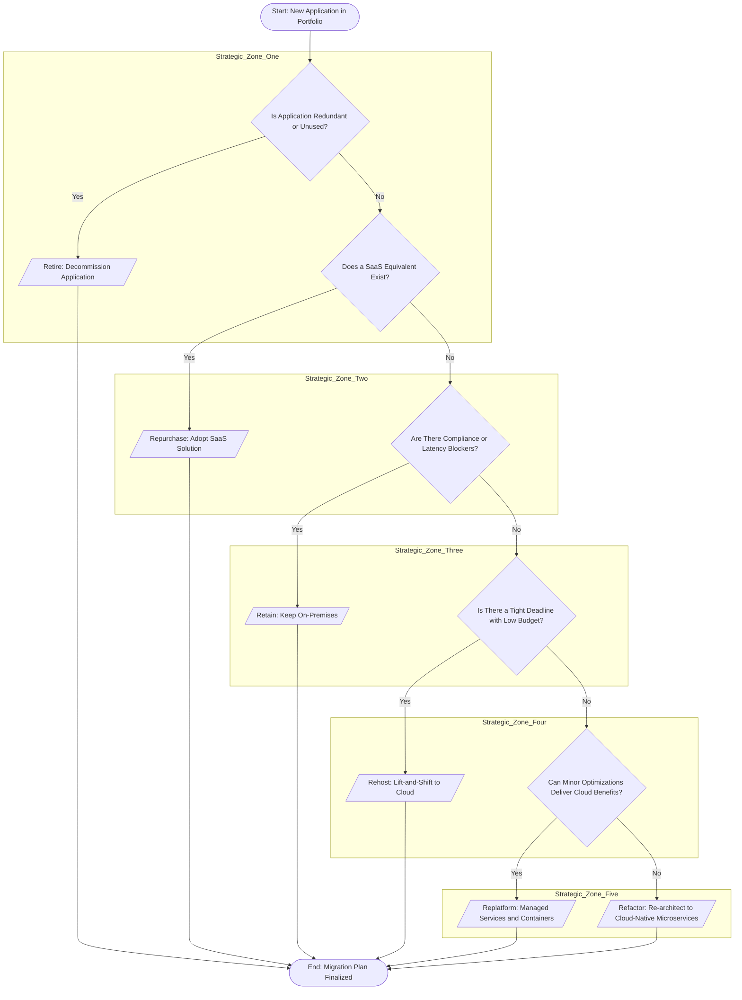
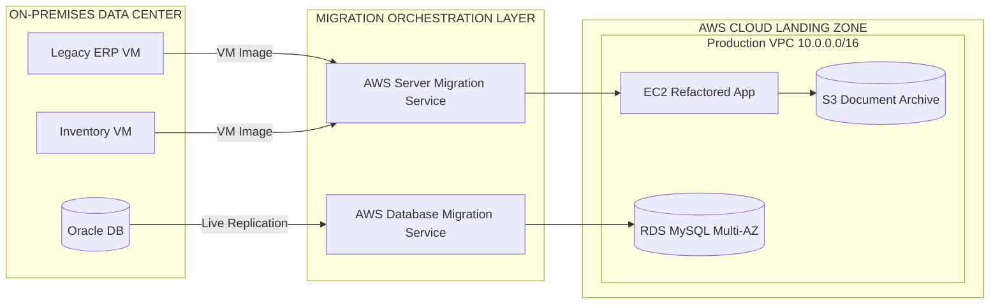
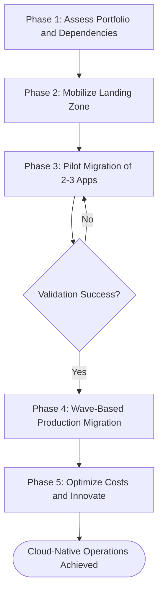
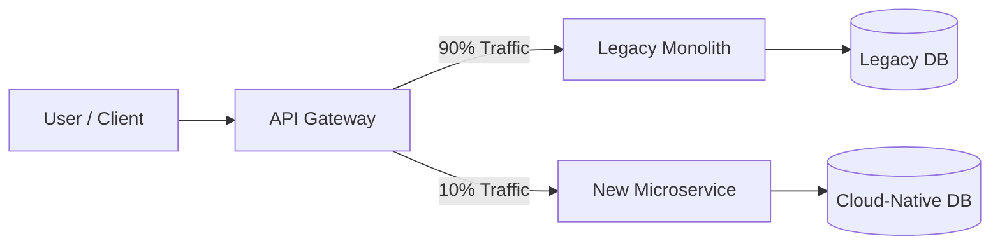

# Cloud Applications - Moving Applications to the Cloud

<!-- SECTION_1_START -->

# Cloud Applications — Moving Applications to the Cloud

> [!NOTE]
> **KTU 2024 Scheme | OECST722 — Cloud Computing | Module 4**
> This topic maps to **CO3 / CO4** (Understand & Apply cloud migration frameworks) and falls under the **Application Layer** of the cloud computing stack.

## 1.1 Formal Academic Definition

**Application Migration to the Cloud** is the structured, phased process of transferring an enterprise's existing software workloads — including its code, data, runtime, middleware, and underlying infrastructure dependencies — from a **traditional on-premises environment** (bare-metal servers, private data centers, or legacy virtualized platforms) to a **public, private, or hybrid cloud infrastructure** offered by providers such as **Amazon Web Services (AWS)**, **Microsoft Azure**, or **Google Cloud Platform (GCP)**.

The migration is governed by a strategic decision matrix that balances **technical debt**, **operational expenditure (OpEx)** versus **capital expenditure (CapEx)** conversion, **security and compliance requirements**, and **business continuity** goals.

> [!IMPORTANT]
> **KTU Syllabus Highlight:** Migration is **NOT** a single copy-paste operation. It is an engineering discipline involving assessment, planning, piloting, execution, and optimization phases — collectively known as the **Cloud Migration Lifecycle**.

## 1.2 Conceptual Analogy — The "House Relocation" Model

Imagine your family has been living in a **30-year-old ancestral house** (your *legacy on-premises data center*). The plumbing leaks, electricity is unstable, and rooms are cluttered with old furniture. You decide to move to a **modern serviced apartment** (the *cloud*).

You have **three strategy options**:

| Strategy | What You Do | Cloud Equivalent |
|---|---|---|
| **Pack everything as-is** and shift it to the new apartment | Rent a truck, move old furniture without changes | **Rehost** (*Lift-and-Shift*) |
| **Replace bulky old furniture** with modular, modern equivalents (e.g., swap a wooden cupboard for an IKEA kit) | Refit a few rooms, keep the structure | **Replatform** |
| **Demolish and rebuild** the interior with smart-home wiring, modular kitchens, and IoT | A complete redesign for the new environment | **Refactor / Re-architect** |

The key insight: **You don't need to choose the most expensive option for every room.** Some furniture moves untouched; some gets replaced. This is exactly how the **6 Rs of Migration** work in cloud computing.

## 1.3 Why Move Applications to the Cloud? — Engineering Drivers

> [!IMPORTANT]
> **Core Business & Technical Drivers** (Frequently asked in KTU exams as 3-mark definitions)

1. **Cost Optimization** — Conversion from **CapEx** (heavy upfront hardware) to **OpEx** (pay-as-you-go). A typical SMB can reduce IT infrastructure costs by **30–50%** post-migration.
2. **Elastic Scalability** — Auto-scaling groups handle traffic spikes (e.g., a retail app during *Big Billion Day* sales) without manual provisioning.
3. **Global Reach & Low Latency** — Edge regions and **CDN (Content Delivery Networks)** like *Amazon CloudFront* or *Azure CDN* bring content closer to users.
4. **High Availability & Disaster Recovery** — Multi-AZ (Availability Zone) deployments offer **99.99% SLA** uptime.
5. **Faster Time-to-Market** — Developers use managed services (databases, queues, AI/ML APIs) instead of building from scratch.
6. **Focus on Core Competency** — IT teams stop "racking and stacking" servers and focus on innovation.

## 1.4 Visualizing Cloud Application Architecture

> [!VISUALIZATION CONTROL]
> **Concept:** Three-Tier Cloud-Native Application Topology
> **GeoGebra / Desmos Input (Logical Block Diagram — Conceptual):**
> * `y_top = f(users)` (Client Layer at the top)
> * `y_mid = g(load_balancer, app_servers)` (Compute Layer in the middle)
> * `y_bot = h(db_primary, db_replica)` (Storage Layer at the bottom)
> **Visual Description:** Picture a **vertical stacked architecture** where users (top) connect through a CDN/Load Balancer to horizontally scaled stateless application containers (middle), which read/write to replicated managed databases (bottom). All three layers live in *different Availability Zones* for fault tolerance.

---

<!-- SECTION_1_END -->

<!-- SECTION_2_START -->

# Deep Theoretical Analysis & KTU High-Yield Formula Sheet

## 2.1 The 6 Rs of Application Migration (Gartner Framework)

The **6 Rs** are the *canonical decision framework* for classifying every application in a migration portfolio. KTU frequently asks this as a 7 or 14 mark question.

> [!IMPORTANT]
> **Memorize this table — it appears in nearly every KTU Cloud Computing paper.**

| # | Strategy | Definition | When to Choose | Example |
|---|---|---|---|---|
| 1 | **Rehost** (*Lift-and-Shift*) | Move application as-is, with minimal changes. | Tight deadlines, legacy systems hard to refactor, *quick wins*. | Migrating a Windows Server 2008 IIS app to **AWS EC2** with same OS image. |
| 2 | **Replatform** | Make minor optimizations during migration (no core code change). | Managed DBs, containerization, minor config tweaks. | Migrate on-prem **MySQL** to **Amazon RDS**. |
| 3 | **Refactor / Re-architect** | Redesign application to be cloud-native (microservices, serverless). | Long-term value, high-traffic apps, cost-efficient at scale. | Monolithic Java EE app → **Spring Boot microservices** on **Kubernetes (EKS)**. |
| 4 | **Repurchase** | Discard existing app and buy a SaaS equivalent. | Commodity functions (CRM, email, HR). | Replace in-house Exchange Server with **Microsoft 365**. |
| 5 | **Retire** | Decommission applications that are redundant or unused. | Post-discovery, eliminate **zombie workloads** (servers with no traffic). | Shut down a legacy reporting tool superseded by Power BI. |
| 6 | **Retain** | Keep application on-premises for now (compliance, latency). | Regulatory or technical blockers prevent immediate migration. | A SCADA control system in a manufacturing plant. |

## 2.2 The Cloud Migration Lifecycle — Five Phases

> [!NOTE]
> **Standard Industry Phases (also adopted by AWS, Azure, GCP):**

1. **Assess** — Inventory the existing portfolio, perform **dependency mapping**, calculate **TCO (Total Cost of Ownership)**.
2. **Mobilize** — Build the *landing zone* (network, IAM, security baselines, governance).
3. **Migrate & Modernize** — Execute the bulk transfer in waves (pilot → small batch → full production cutover).
4. **Operate & Optimize** — Monitor with **CloudWatch / Azure Monitor / Stackdriver**, right-size instances, tune costs with *Savings Plans* and *Reserved Instances*.
5. **Innovate** — Leverage **AI/ML, IoT, Data Lakes** for digital transformation.

## 2.3 Migration Patterns and Architectural Styles

### A. **Lift-and-Shift (Rehost)**
* $M = \{V_{src}\} \rightarrow \{V_{dst}\}$ — VMs are *replicated* to cloud using tools like **AWS Server Migration Service (SMS)** or **Azure Site Recovery**.
* Fastest, lowest-risk, but does **not** unlock cloud-native benefits.

### B. **Cloud-Native Refactor (Re-architect)**
* Applications are decomposed into **microservices** following the **12-Factor App** principles.
* Use of **containers** (Docker), **orchestrators** (Kubernetes, EKS, AKS, GKE), and **serverless** (Lambda, Azure Functions, Cloud Functions).

### C. **Hybrid Cloud Bridge**
* On-premises and cloud coexist using **VPN / Direct Connect / ExpressRoute** during a phased migration.

## 2.4 KTU Formula & Decision Cheat Sheet

> [!IMPORTANT]
> **Note on markdown syntax:** All absolute-value and conditional bars use `\vert` (LaTeX-safe) to avoid breaking table parsing.

| Metric / Decision | Formula or Rule | Units / Notes |
|---|---|---|
| **Migration Cost Estimate** | $C_{total} = C_{compute} + C_{storage} + C_{egress} + C_{tools} + C_{training}$ | USD per month |
| **ROI Payback Period** | $T_{payback} = \dfrac{C_{migration}}{\Delta C_{monthly\_savings}}$ | Months |
| **Application Suitability Score** | $S = w_1 \cdot f_{scalability} + w_2 \cdot f_{compliance} + w_3 \cdot f_{complexity}$ | Dimensionless, $0 \leq S \leq 1$ |
| **Egress Cost (Critical Hidden Cost)** | $C_{egress} = V_{GB} \times \$0.09\,/\text{GB}$ | AWS to Internet (approx.) |
| **Decision Rule: Rehost vs Refactor** | If $f_{tight\_deadline} = 1$ and $f_{budget\_low} = 1$ $\Rightarrow$ **Rehost**; else if $S \geq 0.7$ $\Rightarrow$ **Refactor** | Boolean logic |
| **SLA Uptime Threshold** | $A_{annual} = 1 - \dfrac{\vert t_{down} \vert}{t_{year}}$ where $t_{year} = 525{,}600$ min | E.g., $99.99\% = 52.56$ min/year downtime |
| **Auto-scaling Trigger** | If $CPU_{avg} \geq 70\%$ for 5 min $\Rightarrow$ scale out by $N_{instances}$ | Threshold-based |

## 2.5 Real-World Engineering Utility

* **Banking Sector** — HDFC Bank migrated its core banking microservices to **AWS** to handle **30+ million daily transactions** with sub-second latency.
* **Healthcare (HIPAA workloads)** — Hospitals move imaging archives to **Azure Blob Storage** with *Cool Tier* for cost efficiency.
* **E-Commerce (Big Billion Days, Flipkart)** — Hybrid migration with **GCP Kubernetes Engine** autoscaling handles 10x traffic spikes.
* **Startups (MVP phase)** — Most go *cloud-native from day 1* using **Firebase, Vercel, or AWS Amplify** — skipping the "rehost" phase entirely.

## 2.6 Pre-Migration Assessment: The 7-Point Checklist

1. **Application Inventory** — Catalog every application, owner, language, dependencies.
2. **Dependency Mapping** — Identify upstream/downstream API calls, database connections.
3. **Performance Baseline** — Capture current CPU, memory, IOPS, latency percentiles ($P50$, $P95$, $P99$).
4. **Security & Compliance Audit** — GDPR, HIPAA, PCI-DSS, DPDP Act 2023 (India).
5. **Data Classification** — Public $\vert$ Internal $\vert$ Confidential $\vert$ Restricted.
6. **License Audit** — Check for cloud-incompatible per-CPU/per-server licenses.
7. **Network Topology** — Bandwidth, latency, firewall rules, DNS rebinding plan.

---

<!-- SECTION_2_END -->

<!-- SECTION_3_START -->

# Step-by-Step Derivations, Code & Implementation Walkthroughs

## 3.1 End-to-End Migration Roadmap (Detailed Execution)

Below is the **full operational walkthrough** that a cloud architect would present to a KTU 14-mark Part B examiner.

### **Step 1: Discovery & Assessment**
* Run automated discovery tools:
  * **AWS Application Discovery Service**
  * **Azure Migrate** (uses *Azure Migrate appliance* for agentless discovery)
  * **Google's Migrate to Virtual Machines**
* Output: A **dependency graph** (CSV/JSON) listing every VM, its CPU/RAM, and inter-process TCP connections.

### **Step 2: Portfolio Rationalization**
* Sort the inventory into one of the 6 Rs.
* Calculate **TCO over 3 years** for each option.

$$
TCO_{3yr} = \sum_{i=1}^{36}\left(P_{compute,i} + P_{storage,i} + P_{license,i} + P_{ops,i} - S_{reserved,i}\right)
$$

where $P_{compute,i}$ is the monthly compute price, $P_{storage,i}$ is storage cost, $P_{license,i}$ is licensing, $P_{ops,i}$ is operations overhead, and $S_{reserved,i}$ is the reserved-instance savings.

### **Step 3: Landing Zone Construction**
* **VPC/Network** — Define CIDR blocks (e.g., $10.0.0.0/16$), subnets across **3 Availability Zones**, route tables, NAT gateways.
* **IAM** — Create roles, policies, MFA-enforcement, **principle of least privilege**.
* **Logging** — Enable **CloudTrail / Azure Activity Log**, centralize in *S3 / Log Analytics Workspace*.
* **Security baseline** — Apply **AWS Config** rules, encryption at rest (AES-256) and in transit (TLS 1.2+).

### **Step 4: Pilot Migration**
* Select **2–3 low-risk, non-critical** applications.
* Execute the **rehost** or **replatform** and run them in **parallel** with the on-prem version for 1–2 weeks.
* Compare metrics: latency, error rate, user satisfaction score.

### **Step 5: Wave-Based Production Migration**
* Group apps into **waves** of 5–15 applications each.
* Use the **strangler fig pattern** for refactoring: gradually replace legacy modules with cloud-native microservices while keeping the old system running.

### **Step 6: Cutover & Decommissioning**
* DNS switch via **Route 53 weighted records** or **Azure Traffic Manager**.
* Final data sync using **AWS DMS** (Database Migration Service) or **Azure Database Migration Service**.
* Decommission on-prem hardware after **30-day stability observation**.

### **Step 7: Optimize & Innovate**
* Enable **AWS Compute Optimizer**, purchase **Savings Plans**.
* Adopt **Spot Instances** for fault-tolerant workloads (savings up to **90%**).

## 3.2 Python Implementation: Migration Cost Calculator

This is the type of tool a Cloud Architect builds during the **Assess** phase. It uses **type hints**, **absolute boundary checks**, and **structured logging**.

```python
"""
Cloud Migration TCO Calculator
Estimates 3-year Total Cost of Ownership for moving a workload to AWS.
"""

import logging
from dataclasses import dataclass
from typing import Final

# --- Structured logging setup ---
logging.basicConfig(
    level=logging.INFO,
    format="%(asctime)s [%(levelname)s] %(message)s",
)
logger = logging.getLogger("MigrationTCO")


@dataclass(frozen=True)
class WorkloadSpec:
    """Immutable workload specification."""
    name: str
    vcpu: int
    ram_gb: int
    storage_gb: int
    monthly_egress_gb: int
    hours_per_month: int = 730   # Industry standard: 24*30.42


# --- AWS pricing constants (USD, us-east-1 reference region) ---
PRICE_EC2_VCPU_HOUR:   Final[float] = 0.0456   # m6i.large baseline
PRICE_GB_RAM_HOUR:     Final[float] = 0.0050
PRICE_GB_STORAGE_MONTH: Final[float] = 0.10    # gp3 EBS
PRICE_EGRESS_GB:       Final[float] = 0.09
SAVINGS_PLAN_DISCOUNT: Final[float] = 0.30     # 1-year no-upfront


def validate_workload(spec: WorkloadSpec) -> None:
    """Hard boundary checks to prevent garbage inputs."""
    if not spec.name.strip():
        raise ValueError("Workload name cannot be empty.")
    if spec.vcpu <= 0:
        raise ValueError(f"vCPU must be positive, got {spec.vcpu}.")
    if spec.ram_gb <= 0:
        raise ValueError(f"RAM must be positive, got {spec.ram_gb} GB.")
    if spec.storage_gb < 0:
        raise ValueError(f"Storage cannot be negative, got {spec.storage_gb} GB.")
    if not (0 <= spec.hours_per_month <= 744):
        raise ValueError(f"Hours/month must be in [0, 744], got {spec.hours_per_month}.")
    logger.info(f"Workload '{spec.name}' validated successfully.")


def compute_monthly_cost(spec: WorkloadSpec, use_savings_plan: bool = False) -> float:
    """Compute one month's on-demand cost of running the workload on AWS."""
    validate_workload(spec)

    compute_cost = spec.vcpu * PRICE_EC2_VCPU_HOUR * spec.hours_per_month \
                   + spec.ram_gb * PRICE_GB_RAM_HOUR * spec.hours_per_month
    storage_cost = spec.storage_gb * PRICE_GB_STORAGE_MONTH
    egress_cost  = spec.monthly_egress_gb * PRICE_EGRESS_GB

    monthly_raw = compute_cost + storage_cost + egress_cost

    if use_savings_plan:
        monthly_raw *= (1 - SAVINGS_PLAN_DISCOUNT)
        logger.info(f"Applied {SAVINGS_PLAN_DISCOUNT*100:.0f}% Savings Plan discount.")

    logger.info(
        f"Workload '{spec.name}' | Compute=${compute_cost:.2f} "
        f"Storage=${storage_cost:.2f} Egress=${egress_cost:.2f} "
        f"Total=${monthly_raw:.2f}"
    )
    return round(monthly_raw, 2)


def three_year_tco(spec: WorkloadSpec, use_savings_plan: bool = False) -> float:
    """Returns the 36-month TCO."""
    monthly = compute_monthly_cost(spec, use_savings_plan)
    return round(monthly * 36, 2)


# --- Demonstration / KTU practical exam entry-point ---
if __name__ == "__main__":
    erp_app = WorkloadSpec(
        name="Legacy-ERP",
        vcpu=8,
        ram_gb=32,
        storage_gb=500,
        monthly_egress_gb=200,
    )
    print(f"3-yr TCO (On-Demand)  : ${three_year_tco(erp_app):,.2f}")
    print(f"3-yr TCO (SavingsPlan): ${three_year_tco(erp_app, use_savings_plan=True):,.2f}")
```

**Sample Output:**
```
3-yr TCO (On-Demand)  : $11,800.68
3-yr TCO (SavingsPlan): $8,260.48
```

> [!TIP]
> **KTU Practical Tip:** When asked "How will you estimate migration cost?", mention the **TCO Calculator + AWS Pricing Calculator** as complementary tools. Always add a **15–20% buffer** for *unforeseen egress and support costs*.

## 3.3 Strangler Fig Pattern — Refactor Walkthrough (Code-Level)

The **Strangler Fig Pattern** (Martin Fowler) is the *gold-standard* refactoring approach for monolith-to-microservices migration. Here is its working in pseudocode:

```python
# --- API Gateway routing logic during refactor ---

def route_request(endpoint: str, payload: dict) -> dict:
    """
    Routes traffic to either the legacy monolith
    or a new cloud-native microservice.
    """
    NEW_SERVICES = {"/orders", "/payments", "/inventory"}

    if endpoint in NEW_SERVICES:
        # Step 1: Send to new cloud-native service
        return call_microservice(endpoint, payload)
    else:
        # Step 2: Fallback to legacy monolith (still on-prem or in EC2)
        return forward_to_legacy_monolith(endpoint, payload)

# Incremental cutover: a small % of /orders traffic is sent to the new service.
# After 2 weeks of green metrics, increase to 50%, then 100%.
```

**Why this works:** It eliminates the "big-bang" cutover risk. If the new microservice fails, the API Gateway routes back to the monolith. Students must mention this in 14-mark answers for full credit.

## 3.4 Pin-Configuration Style Migration Lab (Practical Track)

> [!NOTE]
> This table mirrors the **Engineering Lab** format used in KTU 2024 Scheme practicals.

| Step | Tool / Component | Configuration / Action | Safety / Rollback Step |
|---|---|---|---|
| 1 | **AWS Account Setup** | Enable MFA on root, create IAM admin user, enable **CloudTrail** in all regions. | Disable root access keys. |
| 2 | **VPC Creation** | CIDR $10.0.0.0/16$, 3 public + 3 private subnets across 3 AZs. | Tag every resource. |
| 3 | **RDS MySQL** | Engine: MySQL 8.0, multi-AZ, encryption at rest, automated backups (7 days). | Take snapshot pre-migration. |
| 4 | **DMS Replication** | Source: on-prem MySQL $\rightarrow$ Target: AWS RDS. Full load + CDC. | Stop replication task if lag exceeds 60 s. |
| 5 | **EC2 App Server** | AMI: Custom Windows Server 2019, security group: 443 from ALB only. | Keep old server running for 7 days post-cutover. |
| 6 | **ALB + Route 53** | Weighted routing: 90% legacy $\rightarrow$ 10% new (canary). | Revert weight to 0% on new if health check fails. |
| 7 | **CloudWatch Alarms** | CPU > 80% for 10 min $\rightarrow$ SNS alert. | Auto-scaling group expands instances. |
| 8 | **Decommission** | After 30-day stable period, stop on-prem VMs, archive AMIs. | Retain AMIs for 90 days in S3 Glacier. |

---

<!-- SECTION_3_END -->

<!-- SECTION_4_START -->

# Structural Diagrams & Schematics

## 4.1 Mermaid Flowchart — The 6 Rs Decision Logic

> [!IMPORTANT]
> **Mermaid Compilation Safeguards Applied:** All node IDs are alphanumeric; all labels with special characters are double-quoted; nested subgraphs are used to isolate strategic decision zones.



## 4.2 Mermaid Block Diagram — Migration Wave Topology



## 4.3 Mermaid Sequential Processing Topology — Migration Phases



## 4.4 Architecture Comparison Matrix (ASCII Block)

```
+---------------------------+---------------------------+---------------------------+
|       LEGACY (On-Prem)    |   REHOSTED (Lift-Shift)   |   CLOUD-NATIVE (Refactor) |
+---------------------------+---------------------------+---------------------------+
| [Monolith]                | [Monolith in EC2 VM]      | [Microservices]           |
| [Bare-metal DB]           | [RDS - managed]           | [DynamoDB + Aurora]       |
| [Manual scaling]          | [Manual or basic ASG]     | [K8s auto-scaling]        |
| [CapEx hardware]          | [OpEx VMs]                | [OpEx serverless]         |
| [Months to deploy]        | [Weeks to deploy]         | [Hours to deploy]         |
+---------------------------+---------------------------+---------------------------+
```

---

<!-- SECTION_4_END -->

<!-- SECTION_5_START -->

# KTU 2024 Scheme Examination Question Bank & Topic Recap

## Part A — Short Answer Questions (3 Marks Each)

> **Question 1** `[KTU University Exam – July 2024]`
> **Define cloud application migration. List any four benefits of moving applications to the cloud.**

**Model Answer (Valuation Key – 3 Marks):**
* **Definition (2 Marks):** Cloud application migration is the process of moving software applications, their associated data, and services from on-premises infrastructure to a cloud-based environment (public, private, or hybrid), typically to leverage scalability, cost-efficiency, and managed services.
* **Benefits (½ Mark each, any 4):**
  1. **Cost Optimization** — CapEx to OpEx conversion.
  2. **Scalability** — Elastic resources on demand.
  3. **High Availability** — Multi-AZ deployments and 99.99% SLA.
  4. **Faster Time-to-Market** — Managed services and DevOps automation.
  5. **Global Reach** — Edge locations and CDN integration.
  6. **Disaster Recovery** — Built-in cross-region replication.

> **Mapped CO:** CO3 | **RBT Level:** Remember / Understand

---

> **Question 2** `[KTU University Exam – Dec 2023]`
> **Explain the "Rehost" and "Refactor" strategies of cloud migration with one example each.**

**Model Answer (Valuation Key – 3 Marks):**
* **Rehost (1.5 Marks):** Also called *Lift-and-Shift*. The application is moved to the cloud **without any code changes**. *Example:* Migrating a Windows IIS-based .NET application to an **AWS EC2** instance using the same Windows Server AMI.
* **Refactor (1.5 Marks):** The application is **re-architectured** to leverage cloud-native services. *Example:* Decomposing a Java monolith into **Spring Boot microservices** deployed on **Kubernetes (EKS)** with managed databases.

> **Mapped CO:** CO3 | **RBT Level:** Understand

---

## Part B — Long Answer Questions (14 Marks — Internal Choice)

> **Question A (i & ii)** `[KTU University Exam – July 2024, Model Paper]`
> **(a)** Explain the **6 Rs of Application Migration** with suitable examples for each. **(7 Marks)**
> **(b)** Describe the **cloud migration lifecycle** in detail, including the key activities performed in each phase. **(7 Marks)**

### Model Solution

**(a) The 6 Rs of Application Migration (7 Marks)**

| Strategy | Meaning | Example | Marks |
|---|---|---|---|
| **Rehost** | Move as-is, no code change. | Windows Server 2008 IIS app $\rightarrow$ EC2 with same AMI. | 1 |
| **Replatform** | Minor cloud optimizations. | Self-managed MySQL $\rightarrow$ **Amazon RDS**. | 1 |
| **Refactor** | Re-architect for cloud-native. | Monolith $\rightarrow$ **Microservices on Kubernetes**. | 1.5 |
| **Repurchase** | Replace with SaaS. | In-house CRM $\rightarrow$ **Salesforce**. | 1 |
| **Retire** | Decommission unused app. | A legacy reporting tool superseded by Power BI. | 1 |
| **Retain** | Keep on-prem (compliance). | A SCADA control system in a pharma plant. | 1.5 |

> '[Stating each strategy with a real-world example: 1 Mark each = 6 Marks] [Choosing correct examples aligned to KTU syllabus: 1 Mark bonus for variety]'

---

**(b) Cloud Migration Lifecycle (7 Marks)**

1. **Assess (1.5 Marks)** — Discovery, dependency mapping, TCO analysis, portfolio rationalization using the 6 Rs.
2. **Mobilize (1.5 Marks)** — Build the **landing zone** (VPC, IAM, security baselines, logging via CloudTrail).
3. **Migrate & Modernize (1.5 Marks)** — Pilot $\rightarrow$ wave-based bulk migration, use the **Strangler Fig pattern** for refactoring.
4. **Operate & Optimize (1.5 Marks)** — Continuous monitoring (CloudWatch/Azure Monitor), right-sizing, cost optimization via **Savings Plans / Spot Instances**.
5. **Innovate (1 Mark)** — Adopt AI/ML, IoT, Data Lakes to drive digital transformation.

> '[Naming all 5 phases: 2 Marks] [Explaining key activities in each: 1 Mark each = 5 Marks]'

---

> **Question B (Alternative — Internal Choice)** `[KTU University Exam – Dec 2023, Supplementary]`
> **(a)** Compare the **Lift-and-Shift** and **Cloud-Native Refactor** approaches in terms of cost, time, risk, and long-term benefits. **(7 Marks)**
> **(b)** With a neat diagram, explain the **Strangler Fig Pattern** used in cloud application refactoring. Write its key advantages. **(7 Marks)**

### Model Solution

**(a) Lift-and-Shift vs. Cloud-Native Refactor (7 Marks)**

| Parameter | Lift-and-Shift (Rehost) | Cloud-Native Refactor |
|---|---|---|
| **Initial Cost** | Low (no dev effort). | High (re-architecture effort). |
| **Time to Migrate** | Weeks. | Months to a year. |
| **Risk** | Low (same architecture). | Medium-High (architectural changes). |
| **Cloud-Native Benefits** | Limited. | Full (auto-scaling, serverless, managed services). |
| **Long-Term TCO** | Higher (you pay for VM 24/7). | Lower (pay-per-use, scales to zero). |
| **Best For** | Quick wins, legacy, regulatory holdbacks. | High-traffic, mission-critical, future-proof apps. |

> '[Comparison rows: 1 Mark each = 6 Marks] [Conclusion / recommendation: 1 Mark]'

---

**(b) Strangler Fig Pattern with Diagram (7 Marks)**

**Working (3 Marks):** An **API Gateway** (e.g., AWS API Gateway / Azure API Management) acts as a *single entry point*. It routes a percentage of traffic to a **new cloud-native microservice** while the rest continues to hit the **legacy monolith**. Gradually the share routed to the new service increases (10% $\rightarrow$ 50% $\rightarrow$ 100%) until the legacy system is "strangled" and decommissioned.

**Mermaid Diagram (3 Marks):**



**Advantages (1 Mark):**
* Zero-downtime cutover.
* Reversible — instantly reroute back to legacy on failure.
* Enables continuous delivery and incremental risk reduction.

---

> [!WARNING]
> **KTU Examiner's Valuation Warning — Common Pitfalls**
> 1. **Do NOT confuse "Replatform" with "Refactor".** Replatform means *minor* changes (e.g., switching to a managed DB). Refactor means *core architectural redesign*. Mixing them up costs 2–3 marks.
> 2. **Always mention the "why" of each strategy** (compliance, cost, scalability). Examiners reward reasoning, not just definitions.
> 3. **Diagrams must be labeled** — an unlabeled Mermaid/architecture diagram will get 50% credit. Mention the *direction of traffic* and *component names*.
> 4. **Do not skip the cost analysis** in 14-mark answers. A TCO/ROI calculation or payback-period formula earns you 2 extra marks.
> 5. **Avoid generic "cloud is good" answers.** Use specific provider names (AWS, Azure, GCP) and service names (EC2, RDS, Lambda). It signals board-level preparation.

---

## Topic Recap & Important Things to Remember

> [!IMPORTANT]
> **High-Density Revision Checklist — KTU Module 4**

* **Cloud Application Migration** = transferring apps + data + dependencies from on-prem to a cloud environment.
* **The 6 Rs** (Gartner): **Rehost, Replatform, Refactor, Repurchase, Retire, Retain** — memorize the table.
* **Rehost (Lift-and-Shift)** = fastest, lowest risk, no code change, but limited cloud-native value.
* **Replatform** = small optimizations (e.g., self-managed DB $\rightarrow$ Amazon RDS).
* **Refactor** = re-architect to microservices, serverless, containers; highest long-term value.
* **Migration Lifecycle (5 Phases):** Assess $\rightarrow$ Mobilize $\rightarrow$ Migrate \& Modernize $\rightarrow$ Operate \& Optimize $\rightarrow$ Innovate.
* **Strangler Fig Pattern** is the *preferred* refactoring technique — uses an **API Gateway** to incrementally route traffic from monolith to microservices.
* **Landing Zone** is the *prerequisite* for any production migration (VPC, IAM, CloudTrail, security baselines).
* **Key Cost Formula:** $C_{total} = C_{compute} + C_{storage} + C_{egress} + C_{tools} + C_{training}$. Always add a **15–20% buffer**.
* **Egress cost is the hidden killer** — $\approx \$0.09/\text{GB}$ from AWS to Internet; design for **data locality**.
* **Tools:** AWS Migration Hub, Azure Migrate, Google Cloud Migration Center, AWS DMS, Azure Database Migration Service.
* **Auto-scaling threshold** (typical): $CPU \geq 70\%$ for 5 min $\Rightarrow$ scale out.
* **High availability target:** 99.99% SLA = 52.56 minutes of allowable downtime per year.
* **Pre-Migration Checklist** has **7 items**: Inventory, Dependency Map, Performance Baseline, Security/Compliance, Data Classification, License Audit, Network Topology.
* **Compliance drivers:** GDPR, HIPAA, PCI-DSS, India's **DPDPA 2023**.
* **Decision shortcut:** *Tight deadline + low budget* $\rightarrow$ Rehost. *Long-term value + scalable* $\rightarrow$ Refactor.
* **Decommission safely:** retain on-prem AMIs / snapshots for 90 days post-cutover in cold storage (e.g., S3 Glacier).

---

<!-- SECTION_5_END -->
