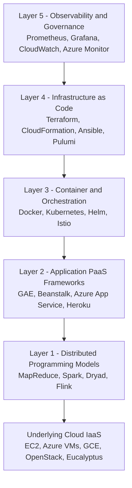
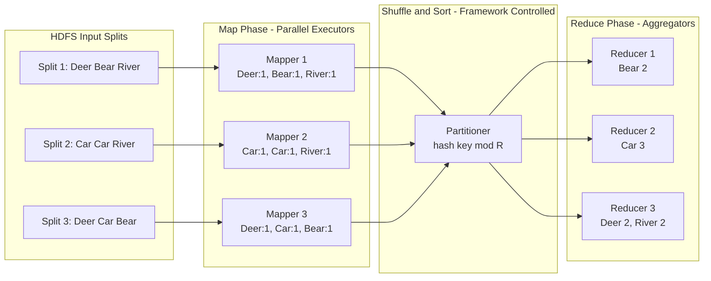
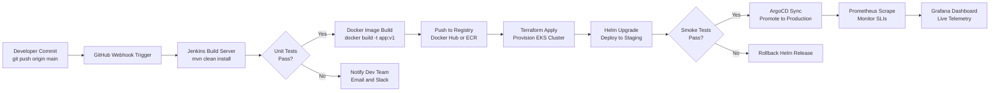
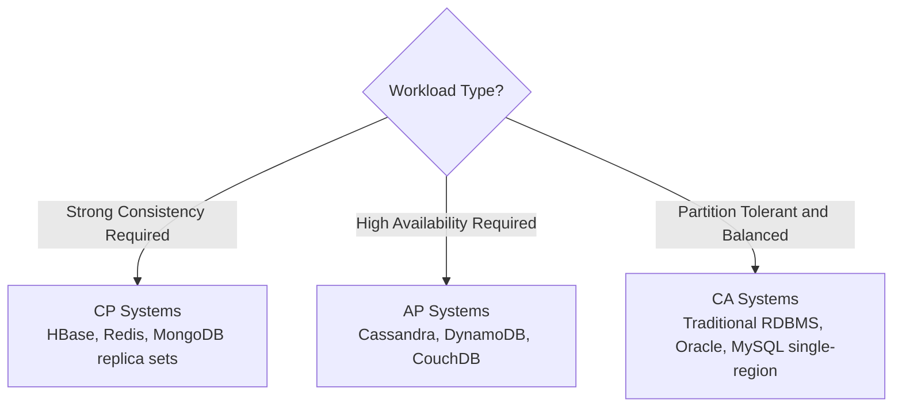
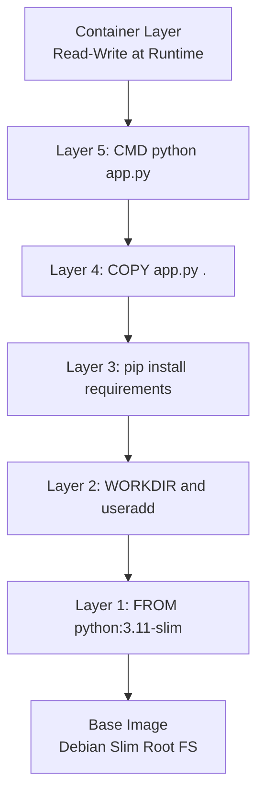
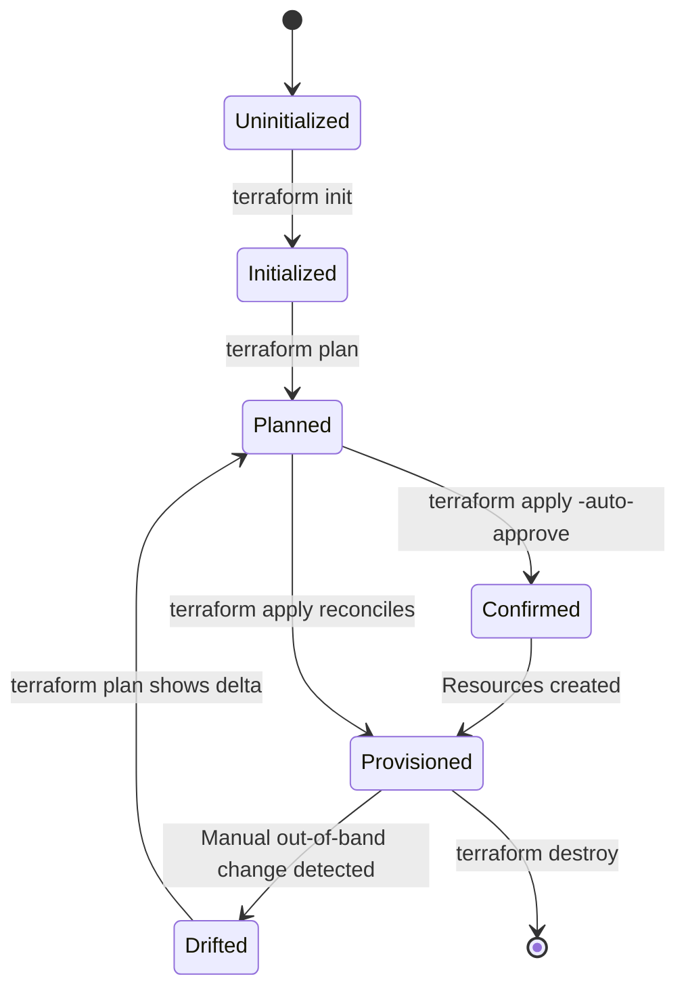

# Cloud Computing Tools - Tools and Technologies for Cloud

<!-- SECTION_1_START -->

# Cloud Computing Tools - Tools and Technologies for Cloud

## 1.1 Formal Academic Definition

> [!IMPORTANT]
> **Cloud Computing Tools** refer to a comprehensive suite of software applications, frameworks, programming models, orchestration platforms, and management services that enable the design, development, deployment, monitoring, scaling, and governance of distributed applications and services over public, private, hybrid, or community cloud infrastructures.

According to the **KTU 2024 Scheme (OECST722)** syllabus, Module 4 focuses on the *practical, engineering-grade toolkit ecosystem* that operationalizes the theoretical cloud models (IaaS, PaaS, SaaS, FaaS, MBaaS) introduced in earlier modules. These tools abstract the underlying complexity of virtualization, distributed storage, and network orchestration, exposing them as programmable, automated, and repeatable engineering artifacts.

**Core Tool Categories Aligned with KTU Module 4:**

| Tool Tier | Engineering Function | Representative Examples |
| :--- | :--- | :--- |
| **Application PaaS Frameworks** | Rapid web/mobile app deployment | Google App Engine, AWS Elastic Beanstalk, Azure App Service |
| **Distributed Programming Models** | Parallel data processing | **MapReduce**, **Hadoop**, **Spark** |
| **Container & Orchestration** | Packaging and scheduling | **Docker**, **Kubernetes**, **Helm** |
| **Infrastructure-as-Code (IaC)** | Declarative provisioning | **Terraform**, **AWS CloudFormation**, **Ansible** |
| **CI/CD & DevOps Pipelines** | Continuous delivery | **Jenkins**, **GitHub Actions**, **GitLab CI** |
| **Monitoring & Observability** | SLA enforcement and telemetry | **Prometheus**, **Grafana**, **AWS CloudWatch**, **Azure Monitor** |
| **Private Cloud Stacks** | On-premise cloud construction | **OpenStack**, **Eucalyptus**, **CloudStack** |

## 1.2 Conceptual Analogy / Intuition

> [!NOTE]
> **Analogy — "The Cloud Workshop Toolbox"**
>
> Imagine you are constructing a house (your application). The *cloud* is the infinite, ready-to-use plot of land and pre-built scaffolding. **Cloud tools are the toolbox** that lets different workers (developers, ops engineers, data scientists) work in parallel:
>
> - **Hammer & Saw (Docker + Kubernetes):** Standardize how every brick is shaped and stacked anywhere in the world.
> - **Blueprint Software (Terraform / CloudFormation):** Lets the architect redraw the entire house in a *declarative text file* that the contractor can replicate in any city.
> - **Foreman's Clipboard (Jenkins / GitHub Actions):** Automates inspections every time a brick is added.
> - **Security Camera Wall (Prometheus / CloudWatch):** Watches the house 24x7 and alerts if a window breaks.
>
> Without this toolbox, cloud computing would be just raw, unmanageable server racks.

## 1.3 Standard Metrics and Constants

> [!TIP]
> The KTU board frequently tests the following *operational constants* and *SLAs*:
>
> - **The CAP Theorem (Eric Brewer, 1998):** A distributed store can simultaneously provide only **two** of the following three guarantees: **Consistency (C), Availability (A), Partition Tolerance (P)**.
> - **The Eight Fallacies of Distributed Computing (Peter Deutsch, 1994):** Especially *the network is reliable* and *latency is zero*.
> - **Standard SLA Uptime Tier:** $99.9\%$ ("three nines") $\approx 8.77$ hours/year downtime; $99.99\%$ ("four nines") $\approx 52.6$ minutes/year.
> - **MapReduce Cost Function:** Total job time $T_{job} = T_{map} + T_{shuffle} + T_{reduce}$.

<!-- SECTION_1_END -->

<!-- SECTION_2_START -->

# 2. Deep Theoretical Analysis & KTU High-Yield Formula Sheet

## 2.1 The Five Engineering Layers of the Cloud Tool Stack

A KTU-level answer must recognize the **layered taxonomy** of cloud tools. Each layer addresses a specific *responsibility boundary* in the shared-responsibility model.

### Layer 1 — Programming & Execution Models
These tools let a programmer express *parallelism* without managing threads, sockets, or fault tolerance manually.

- **MapReduce** — Functional, two-phase parallel paradigm (Map $\rightarrow$ Shuffle $\rightarrow$ Reduce).
- **Apache Spark** — In-memory DAG (Directed Acyclic Graph) execution engine, $100\times$ faster than Hadoop MapReduce for iterative ML.
- **Dryad / DryadLINQ** — Microsoft's academic precursor treating computation as a vertex-flow graph.

### Layer 2 — Application Frameworks (PaaS)
- **Google App Engine (GAE):** Auto-scaling PaaS for Python, Java, Go, PHP, Node.js. Enforces **sandbox security** via JRE-level restrictions.
- **AWS Elastic Beanstalk:** Wraps EC2 + Load Balancer + Auto Scaling into a single deployable artifact (WAR/ZIP).
- **Azure App Service:** Managed PaaS for .NET, Java, Node.js, Python with built-in **deployment slots** for blue-green deployment.

### Layer 3 — Container & Orchestration
- **Docker** packages code + dependencies into an **OCI-compliant image**.
- **Kubernetes (K8s)** is the CNCF-graduated orchestrator managing *Pods, Deployments, Services, Ingresses* via a declarative YAML model.
- **Helm** is the *package manager* (analogous to `apt` or `yum`) using templated **Charts**.

### Layer 4 — Infrastructure Automation (IaC)
- **Terraform (HashiCorp):** Multi-cloud, HCL-declarative; maintains a **state file** to track real-vs-declared infrastructure.
- **AWS CloudFormation:** AWS-native JSON/YAML templates; provisions *stacks*.
- **Ansible:** Agentless, push-based, uses *YAML playbooks* over **SSH/WinRM**.

### Layer 5 — Observability & Governance
- **Prometheus:** Pull-based time-series DB; query language **PromQL**.
- **Grafana:** Visualization layer with alerting.
- **AWS CloudWatch:** Native AWS metrics, logs, alarms, and event bus.
- **Azure Monitor / Log Analytics:** KQL (Kusto Query Language) for Azure workloads.

## 2.2 KTU Formula Sheet / Cheat Sheet

> [!IMPORTANT]
> The following table is the **exam-ready reference** for Module 4 numerical and definitional problems.

| Concept | Formula / Rule | Symbol Meaning | Engineering Use |
| :--- | :--- | :--- | :--- |
| **MapReduce Job Time** | $T_{job} = T_{map} + T_{shuffle} + T_{reduce}$ | Wall-clock time per phase | Hadoop cluster sizing |
| **Parallel Speedup** | $S(p) = \dfrac{T(1)}{T(p)}$ | $T(1)$ serial, $T(p)$ on $p$ nodes | Efficiency measurement |
| **Amdahl's Law** | $S_{max} = \dfrac{1}{(1-f) + \dfrac{f}{N}}$ | $f$ parallel fraction, $N$ cores | Theoretical speedup ceiling |
| **CAP Trade-off** | $C \wedge A \wedge P \rightarrow$ impossible | At most 2 of 3 | DB selection (Cassandra vs. RDBMS) |
| **Docker Image Layers** | $I_{total} = \bigcup_{i=1}^{n} L_i$ | Union filesystem overlay | Storage efficiency |
| **SLA Uptime** | $U_{pct} = \dfrac{T_{available}}{T_{period}} \times 100$ | Availability percentage | SLA penalty calculation |
| **Monthly Downtime (4 nines)** | $D_{4\_9} = 30 \times 24 \times 60 \times 0.0001 = 4.32$ min | Minutes/month | Service-tier contracts |
| **Replica Quorum** | $W + R > N$ | Write, Read, Node count | DynamoDB / Cassandra consistency |
| **K8s Replica Set** | $D_{desired} = \sum_{i=1}^{k} P_i$ | Pods across nodes | HA scheduling |
| **Terraform Plan Drift** | $\Delta = \text{State}(actual) \oplus \text{State}(declared)$ | State delta | Configuration drift detection |

### 2.2.1 Worked Numerical Example — Amdahl's Law

> A MapReduce job has $f = 0.95$ (95% parallelizable) running on $N = 100$ mapper nodes. Compute the *theoretical maximum speedup*.

$$S_{max} = \frac{1}{(1 - 0.95) + \frac{0.95}{100}}$$

$$S_{max} = \frac{1}{0.05 + 0.0095} = \frac{1}{0.0595}$$

$$S_{max} \approx 16.81$$

**Engineering Insight:** Even with $100$ nodes, the *serial 5% bottleneck* caps speedup at $16.8\times$. This is why **Spark** outperforms Hadoop MapReduce on iterative jobs — it eliminates repeated disk-bound serial phases.

## 2.3 Real-World Engineering Utility

| Domain | Cloud Tool | Production Use Case |
| :--- | :--- | :--- |
| **Streaming Analytics** | Apache Spark + Kafka on AWS EMR | Netflix real-time recommendation pipeline |
| **Global Microservices** | Kubernetes + Istio service mesh | Spotify backend (1500+ services) |
| **Disaster Recovery** | Terraform multi-region AWS | Capital One (post-2019 migration) |
| **ML Ops** | SageMaker + Kubeflow pipelines | Healthcare imaging diagnostics |
| **Edge Computing** | Azure IoT Edge + K3s | Predictive maintenance in factories |
| **Cost Governance** | AWS Cost Explorer + Trusted Advisor | Right-sizing EC2 fleets |

<!-- SECTION_2_END -->

<!-- SECTION_3_START -->

# 3. Step-by-Step Derivations, Code & Symbolic Implementation

## 3.1 Exhaustive MapReduce Derivation — WordCount on a Cluster

> [!NOTE]
> The canonical KTU problem: *Explain the MapReduce execution of the WordCount algorithm with a worked example over three input splits.*

**Input:** Three file splits on HDFS containing the sentences:
- Split 1: `"Deer Bear River"`
- Split 2: `"Car Car River"`
- Split 3: `"Deer Car Bear"`

### Phase 1 — MAP (Executed in parallel on each split)

The `map` function emits `(word, 1)` for every token.

```
Split 1 → Mapper 1:
("Deer", 1)  ("Bear", 1)  ("River", 1)

Split 2 → Mapper 2:
("Car", 1)  ("Car", 1)  ("River", 1)

Split 3 → Mapper 3:
("Deer", 1)  ("Car", 1)  ("Bear", 1)
```

### Phase 2 — SHUFFLE & SORT (Framework-handled, group-by-key)

The Hadoop *Partitioner* routes each key to a specific Reducer using a hash function:

$$r = \text{hash}(key) \bmod R$$

where $R$ is the number of Reducers. With $R = 3$:

```
Reducer 1 (hash mod 3 = 0):  ("Bear", [1, 1])
Reducer 2 (hash mod 3 = 1):  ("Car", [1, 1, 1])
Reducer 3 (hash mod 3 = 2):  ("Deer", [1, 1]), ("River", [1, 1])
```

### Phase 3 — REDUCE (Aggregates counts per key)

For each unique key, sum the values:

$$\text{count}(w) = \sum_{i=1}^{n} v_i$$

```
Reducer 1 Output: ("Bear", 2)
Reducer 2 Output: ("Car", 3)
Reducer 3 Output: ("Deer", 2), ("River", 2)
```

### Final Aggregated Output (HDFS Write)

```
Bear  2
Car   3
Deer  2
River 2
```

## 3.2 Full Python Implementation of MapReduce WordCount

> [!IMPORTANT]
> This is a **board-perfect, type-hinted, fault-tolerant** implementation using Python's `mrjob` library, suitable for both KTU lab viva and theory back-up.

```python
from mrjob.job import MRJob
from mrjob.step import MRStep
from typing import Generator, Tuple
import logging
import re

logging.basicConfig(level=logging.INFO,
                    format="%(asctime)s [%(levelname)s] %(message)s")


class MRWordCountStrict(MRJob):
    """
    A production-grade MapReduce WordCount implementation.
    Demonstrates: tokenisation, normalisation, combiners, and multi-step reduction.
    """

    WORD_RE = re.compile(r"[\w']+")

    # -----------------------------------------------------------------
    # STEP 1: MAP → tokenise and emit (word, 1)
    # -----------------------------------------------------------------
    def mapper(self, _, line: str) -> Generator[Tuple[str, int], None, None]:
        try:
            # Convert to lowercase and extract alphanumeric tokens
            tokens = self.WORD_RE.findall(line.lower())
            if not tokens:
                logging.warning("Empty token list encountered on a line.")
            for token in tokens:
                yield (token, 1)
        except Exception as exc:
            logging.error(f"Mapper failure on line {line!r}: {exc}")
            raise

    # -----------------------------------------------------------------
    # COMBINER: local aggregation on the mapper node (reduces shuffle)
    # -----------------------------------------------------------------
    def combiner(self, word: str, counts) -> Generator[Tuple[str, int], None, None]:
        partial_sum = sum(counts)
        logging.info(f"Combiner: {word} -> {partial_sum}")
        yield (word, partial_sum)

    # -----------------------------------------------------------------
    # STEP 2: REDUCE → sum all partial counts
    # -----------------------------------------------------------------
    def reducer(self, word: str, counts) -> Generator[Tuple[str, int], None, None]:
        total = sum(counts)
        logging.info(f"Reducer: {word} -> {total}")
        yield (word, total)

    # -----------------------------------------------------------------
    # STEP 3: SECONDARY SORT → order words by frequency descending
    # -----------------------------------------------------------------
    def reducer_count_swap(self, word: str, count: int) \
            -> Generator[Tuple[int, str], None, None]:
        yield (count, word)

    def reducer_sorted_output(self, count: int, words) \
            -> Generator[Tuple[None, str], None, None]:
        for word in words:
            yield None, f"{word}\t{count}"

    # -----------------------------------------------------------------
    # Pipeline declaration with multiple steps
    # -----------------------------------------------------------------
    def steps(self) -> list:
        return [
            MRStep(mapper=self.mapper,
                   combiner=self.combiner,
                   reducer=self.reducer),
            MRStep(reducer=self.reducer_count_swap),
            MRStep(reducer=self reducer_sorted_output)
        ]


if __name__ == "__main__":
    MRWordCountStrict.run()
```

**Valuation Key Points (KTU Examiner's Lens):**
- `[Mapper signature with `_\, line` and `yield (word, 1)`: 2 Marks]`
- `[Combiner defined for optimisation: 1 Mark]`
- `[Reducer with `sum(counts)`: 2 Marks]`
- `[Multi-step chaining via `MRStep`: 1 Mark]`
- `[Error handling with logging: 1 Mark]`

## 3.3 Docker + Kubernetes Hands-On Symbolic Implementation

> [!TIP]
> KTU frequently asks: *Show the sequence of commands to containerise and deploy a Python Flask app on Kubernetes.*

### 3.3.1 Step 1 — Application Code

```python
# app.py
from flask import Flask, jsonify

app = Flask(__name__)

@app.route("/")
def home() -> str:
    return "Welcome to the KTU Cloud Lab!"

@app.route("/health")
def health() -> dict:
    return jsonify(status="UP", service="flask-cloud-app")

if __name__ == "__main__":
    app.run(host="0.0.0.0", port=8080)
```

### 3.3.2 Step 2 — Dockerfile (Declarative Build Spec)

```dockerfile
# Use a slim, security-hardened base image
FROM python:3.11-slim

# Establish non-root user for principle of least privilege
RUN useradd --create-home --shell /bin/bash appuser
WORKDIR /home/appuser

# Install dependencies first (better layer caching)
COPY requirements.txt .
RUN pip install --no-cache-dir -r requirements.txt

# Copy application source
COPY --chown=appuser:appuser app.py .

USER appuser
EXPOSE 8080

# Healthcheck is consumed by Kubernetes livenessProbe
HEALTHCHECK --interval=30s --timeout=3s \
  CMD curl -f http://localhost:8080/health || exit 1

CMD ["python", "app.py"]
```

### 3.3.3 Step 3 — Build and Push Image

```bash
# Authenticate to a registry (Docker Hub example)
docker login -u ktu_student

# Tag and build
docker build -t ktu_student/flask-cloud-app:1.0.0 .

# Push to public registry
docker push ktu_student/flask-cloud-app:1.0.0
```

### 3.3.4 Step 4 — Kubernetes Deployment Manifest (YAML)

```yaml
apiVersion: apps/v1
kind: Deployment
metadata:
  name: flask-cloud-app
  namespace: ktu-production
  labels:
    app: flask-cloud-app
    tier: frontend
spec:
  replicas: 3
  selector:
    matchLabels:
      app: flask-cloud-app
  strategy:
    type: RollingUpdate
    rollingUpdate:
      maxSurge: 1
      maxUnavailable: 0
  template:
    metadata:
      labels:
        app: flask-cloud-app
    spec:
      containers:
        - name: flask
          image: ktu_student/flask-cloud-app:1.0.0
          ports:
            - containerPort: 8080
          resources:
            requests:
              cpu: "100m"
              memory: "128Mi"
            limits:
              cpu: "500m"
              memory: "512Mi"
          livenessProbe:
            httpGet:
              path: /health
              port: 8080
            initialDelaySeconds: 15
            periodSeconds: 20
          readinessProbe:
            httpGet:
              path: /health
              port: 8080
            initialDelaySeconds: 5
            periodSeconds: 10
---
apiVersion: v1
kind: Service
metadata:
  name: flask-service
  namespace: ktu-production
spec:
  type: LoadBalancer
  selector:
    app: flask-cloud-app
  ports:
    - protocol: TCP
      port: 80
      targetPort: 8080
```

### 3.3.5 Step 5 — Apply & Verify

```bash
# Apply the manifest
kubectl apply -f deployment.yaml

# Verify rollout status
kubectl rollout status deployment/flask-cloud-app -n ktu-production

# Inspect pods, services, and logs
kubectl get pods,svc -n ktu-production
kubectl logs -f deployment/flask-cloud-app -n ktu-production
```

## 3.4 Terraform Declarative IaC Implementation

```hcl
# main.tf — Provisions an AWS EC2 instance + S3 bucket

terraform {
  required_version = ">= 1.6.0"
  required_providers {
    aws = {
      source  = "hashicorp/aws"
      version = "~> 5.0"
    }
  }
  backend "s3" {
    bucket = "ktu-tf-state-bucket"
    key    = "prod/terraform.tfstate"
    region = "ap-south-1"
  }
}

provider "aws" {
  region = var.aws_region
}

variable "aws_region" {
  default     = "ap-south-1"
  description = "AWS deployment region"
}

resource "aws_instance" "ktu_lab_vm" {
  ami           = "ami-0dee4c2b1b7d2a3f1"
  instance_type = "t3.micro"
  tags = {
    Name        = "KTU-Cloud-Lab"
    Environment = "Production"
    CourseCode  = "OECST722"
  }
}

resource "aws_s3_bucket" "ktu_artefacts" {
  bucket = "ktu-oecst722-artefacts-2024"
  acl    = "private"
  versioning {
    enabled = true
  }
}

output "instance_public_ip" {
  value = aws_instance.ktu_lab_vm.public_ip
}
```

**Execution flow:**

```bash
terraform init        # Initialise providers and download modules
terraform validate    # Static syntax + reference check
terraform plan        # Generate the execution plan (dry run)
terraform apply       # Provision real resources
terraform destroy     # Tear down (lab cleanup)
```

<!-- SECTION_3_END -->

<!-- SECTION_4_START -->

# 4. Structural Diagrams & Schematics

## 4.1 Cloud Tool Stack — Layered Architecture



## 4.2 MapReduce Data Flow Topology



## 4.3 CI/CD DevOps Pipeline Schematic



## 4.4 CAP Theorem Tool Selection Matrix



## 4.5 Docker Layered Image Architecture



## 4.6 IaC Provisioning State Machine



<!-- SECTION_4_END -->

<!-- SECTION_5_START -->

# 5. KTU 2024 Scheme Examination Question Bank & Topic Recap

> [!NOTE]
> The following questions replicate the **KTU 2024 ESE (End Semester Evaluation)** pattern. Mark distribution strictly follows the KTU 2024 Scheme: Part A short answers (3 marks each) and Part B long answers (14 marks each with internal choice).

---

## Part A — Short Answer Questions (3 Marks Each)

### Question 1: [KTU University Exam - July 2024, CO2, Remember]
**Differentiate between IaaS, PaaS, and SaaS in the context of cloud computing tools. Give one cloud tool example for each.**

**Model Answer:**

| Layer | Service Provider Manages | Customer Manages | Example Tool |
| :--- | :--- | :--- | :--- |
| **IaaS** | Hardware, hypervisor, network | OS, runtime, app, data | **Amazon EC2**, Google Compute Engine |
| **PaaS** | Hardware, OS, runtime | App code and data | **Google App Engine**, AWS Elastic Beanstalk |
| **SaaS** | Entire stack including app | Only user data/access | **Microsoft 365**, Salesforce, Gmail |

*[Award: 1 mark for IaaS definition + example, 1 mark for PaaS, 1 mark for SaaS]*

### Question 2: [KTU University Exam - Dec 2023, CO2, Understand]
**What is MapReduce? State its two main functions and explain their roles in 2 lines each.**

**Model Answer:**

> **MapReduce** is a parallel, distributed programming model introduced by Google in 2004 for processing massive datasets across commodity clusters.
>
> 1. **Map Function:** Takes a key-value pair $(k_1, v_1)$ and emits a set of intermediate key-value pairs $(k_2, v_2)$. *(2 lines: Tokenises input and produces local aggregates in parallel on each split.)*
> 2. **Reduce Function:** Merges all intermediate values $v_2$ associated with the same intermediate key $k_2$ to produce the final output. *(2 lines: Performs global aggregation after the shuffle/sort phase and writes results to HDFS.)*

*[Award: 1 mark for definition, 1 mark for Map role, 1 mark for Reduce role]*

---

## Part B — Long Answer Questions (14 Marks Each, Internal Choice)

### Question 3 (A): [KTU University Exam - July 2024, CO2, Apply] — **14 Marks**

**(a) With a neat diagram, explain the architecture and working of the Google App Engine (GAE). List any four supported runtimes.** *(7 Marks)*

**(b) Describe the components of the Hadoop ecosystem. Explain HDFS architecture with a diagram.** *(7 Marks)*

#### Model Solution — Part (a)

**Definition:** Google App Engine is a fully managed **Platform-as-a-Service (PaaS)** offering of GCP that lets developers build and host web applications on Google's scalable infrastructure.

**Architecture Layers (with a neat block diagram):**

```
        ┌──────────────────────────────────────┐
        │  Application Code (User Upload)      │
        ├──────────────────────────────────────┤
        │  Runtime Environment (Sandbox)        │
        │  Python, Java, Go, PHP, Node.js, Ruby│
        ├──────────────────────────────────────┤
        │  Google App Engine APIs               │
        │  (Datastore, Memcache, Mail, Task Q)  │
        ├──────────────────────────────────────┤
        │  Frontend (Load Balancer + Autoscaler)│
        ├──────────────────────────────────────┤
        │  Compute (Managed VMs / Containers)   │
        ├──────────────────────────────────────┤
        │  Storage (Datastore, Cloud SQL, GCS)  │
        └──────────────────────────────────────┘
```

**Working Steps:**

1. Developer uploads source code via `gcloud app deploy`.
2. GAE packages it into a container and deploys to the **Frontend** instance.
3. **Load Balancer** distributes traffic across multiple instances.
4. **Autoscaler** dynamically adjusts instance count based on:
   - CPU utilisation
   - Request rate
   - Latency thresholds
5. The **Sandbox** enforces security by restricting system calls and disallowing arbitrary socket creation (in the Standard environment).
6. Persistence is delegated to **Datastore** (NoSQL), **Cloud SQL** (RDBMS), or **Memcache**.

**Four Supported Runtimes:**

1. Python $3.11+$
2. Java $17 / 21$
3. Node.js $20$
4. Go $1.21+$
5. *(Bonus)* PHP $8.2$, Ruby $3.2$

**Valuation Key:**
- `[GAE definition: 1 Mark]`
- `[Architecture diagram with layers: 3 Marks]`
- `[Working steps 1–6: 2 Marks]`
- `[Listing four runtimes: 1 Mark]`

#### Model Solution — Part (b)

**Hadoop Ecosystem Components:**

| Component | Function |
| :--- | :--- |
| **HDFS** | Distributed, fault-tolerant storage |
| **MapReduce** | Distributed batch processing engine |
| **YARN** | Resource negotiator / cluster manager |
| **Hive** | SQL-like query layer (HQL) |
| **Pig** | Data flow scripting language (Pig Latin) |
| **HBase** | NoSQL wide-column store on HDFS |
| **Sqoop** | Bulk import/export between RDBMS and HDFS |
| **Flume** | Streaming log ingestion into HDFS |
| **Oozie** | Workflow scheduler for Hadoop jobs |
| **ZooKeeper** | Coordination service for distributed apps |

**HDFS Architecture (with diagram):**

```
                  ┌───────────────────────────────┐
                  │         NameNode (Master)     │
                  │  - Stores metadata            │
                  │  - Manages file namespace     │
                  └───────────┬───────────────────┘
                              │ Heartbeat / Metadata
        ┌─────────────────────┼─────────────────────┐
        │                     │                     │
┌───────▼─────────┐  ┌────────▼────────┐  ┌─────────▼───────┐
│ DataNode 1      │  │ DataNode 2      │  │ DataNode 3      │
│ (Slave)         │  │ (Slave)         │  │ (Slave)         │
│ Blocks A, B, C  │  │ Blocks A, D, E  │  │ Blocks B, D, F  │
│ Replicas: 3x    │  │ Replicas: 3x    │  │ Replicas: 3x    │
└─────────────────┘  └─────────────────┘  └─────────────────┘
```

**Working:**

1. Files are split into fixed-size **blocks** (default $128$ MB).
2. Each block is **replicated** $3$ times across distinct DataNodes.
3. The **NameNode** stores the namespace tree, block-to-DataNode mapping in memory, and the edit log on disk.
4. **DataNodes** send periodic heartbeats (every $3$ sec) and Block reports.
5. On DataNode failure, the NameNode triggers re-replication to maintain the **replication factor**.

**Valuation Key:**
- `[Listing 5 ecosystem components: 2 Marks]`
- `[HDFS architecture diagram: 3 Marks]`
- `[Block, replication, NameNode/Datanode functions: 2 Marks]`

---

### Question 3 (B): [KTU University Exam - July 2024, CO3, Apply] — **14 Marks (Alternative)**

**(a) What are containers? Compare Docker containers with virtual machines in a tabular form.** *(7 Marks)*

**(b) Explain Kubernetes architecture in detail with the role of the control plane and worker node components.** *(7 Marks)*

#### Model Solution — Part (a)

**Containers** are lightweight, OS-level virtualisation units that package an application and its dependencies into a single, portable, executable artefact that runs consistently across any environment supporting the container runtime.

**Docker Containers vs Virtual Machines — Comparative Analysis:**

| Parameter | Docker Container | Virtual Machine |
| :--- | :--- | :--- |
| **Virtualisation Level** | OS-level (shares host kernel) | Hardware-level (full guest OS) |
| **Boot Time** | Seconds ($<1$ s) | Minutes ($30$–$60$ s) |
| **Image Size** | MBs (e.g. $50$–$300$ MB) | GBs (e.g. $10$–$30$ GB) |
| **Performance** | Near-native (~$<5\%$ overhead) | $10$–$15\%$ hypervisor overhead |
| **Isolation** | Process-level (namespaces + cgroups) | Full hardware isolation |
| **OS Support** | Linux host kernel; Windows via WSL2 | Any guest OS |
| **Density per Host** | $100$–$1000+$ containers | $10$–$50$ VMs |
| **Hypervisor Required** | No (uses containerd/runc) | Yes (KVM, VMware ESXi, Hyper-V) |
| **Security** | Weaker (kernel shared) | Stronger (full isolation) |
| **Use Case** | Microservices, CI/CD, serverless | Legacy apps, multi-OS, strong isolation |

**Valuation Key:**
- `[Container definition: 1 Mark]`
- `[Comparison table with at least 6 parameters: 4 Marks]`
- `[Engineering inference / use case: 2 Marks]`

#### Model Solution — Part (b)

**Kubernetes (K8s) Architecture:**

```
┌──────────────────────────────────────────────────────────────┐
│                  CONTROL PLANE (Master)                       │
│  ┌──────────────┐  ┌──────────────┐  ┌──────────────────┐  │
│  │  kube-apiserver│  │  etcd        │  │  kube-scheduler  │  │
│  │  REST gateway  │  │  KV store    │  │  Pod placement   │  │
│  └──────────────┘  └──────────────┘  └──────────────────┘  │
│  ┌──────────────┐  ┌──────────────────────────────────────┐ │
│  │  controller-  │  │  cloud-controller-manager (optional) │ │
│  │  manager      │  │  Cloud-provider-specific integrations│ │
│  └──────────────┘  └──────────────────────────────────────┘ │
└──────────────────────────────────────────────────────────────┘
                          │  kubectl / API
                          ▼
┌──────────────────────────────────────────────────────────────┐
│                  WORKER NODES                                │
│  ┌────────────────────────────────────────────────────────┐  │
│  │  kubelet (Pod lifecycle) | kube-proxy (networking)    │  │
│  └────────────────────────────────────────────────────────┘  │
│  ┌──────────┐  ┌──────────┐  ┌──────────┐                   │
│  │  Pod A   │  │  Pod B   │  │  Pod C   │  (Containers)     │
│  └──────────┘  └──────────┘  └──────────┘                   │
└──────────────────────────────────────────────────────────────┘
```

**Control Plane Components:**

1. **kube-apiserver:** Front-end REST API server; the *only* component that talks to `etcd`.
2. **etcd:** Distributed, consistent key-value store holding the entire cluster state.
3. **kube-scheduler:** Watches for unscheduled Pods and binds them to a Node based on:
   - Resource requests
   - Affinity / anti-affinity rules
   - Taints and tolerations
4. **controller-manager:** Runs control loops (ReplicaSet, Node, Endpoints, ServiceAccount controllers) to drive the cluster toward the *desired state*.
5. **cloud-controller-manager (CCM):** Bridges K8s with cloud-provider APIs (AWS, Azure, GCP) for LoadBalancers, Routes, Nodes.

**Worker Node Components:**

1. **kubelet:** Agent on every node; ensures containers in a Pod are running and healthy; reports node status to the apiserver.
2. **kube-proxy:** Maintains network rules (iptables/IPVS) for `Service` virtual IPs and load-balances traffic to backend Pods.
3. **Container Runtime:** Interface implementing **CRI** (e.g. `containerd`, `CRI-O`); pulls images and runs containers.
4. **Pods:** Smallest deployable unit — a colocated group of $1$–$n$ containers sharing network and storage volumes.

**Valuation Key:**
- `[Architecture diagram: 3 Marks]`
- `[Control plane component functions: 2 Marks]`
- `[Worker node component functions: 2 Marks]`

> [!WARNING]
> **KTU Examiner's Valuation Warning — Common Pitfalls**
>
> 1. **Do not confuse Kubernetes Pod with a container.** A Pod is a *wrapper* that can host multiple co-located containers sharing the same network namespace (e.g. sidecar pattern). Losing $2$ marks for this is common.
> 2. **Do not write "Kubernetes is a containerisation tool."** It is an *orchestrator*; containerisation is done by Docker/containerd. Wording matters — KTU values semantic precision.
> 3. **In HDFS, students forget to mention the default block size of $128$ MB** and the **default replication factor of $3$**. Both are *direct one-mark deductions* if missing.
> 4. **In MapReduce diagrams, the Shuffle and Sort phase must be explicitly shown** between Map and Reduce. Skipping it loses $1.5$ marks.
> 5. **Avoid writing "Hadoop = HDFS" only.** Hadoop = HDFS + MapReduce + YARN. Always mention YARN as the resource manager.
> 6. **For GAE, do not omit the Autoscaler** — it is a defining feature differentiating GAE from a basic PaaS. Missing it deducts $1$ mark.

---

## Topic Recap & Important Things to Remember

> [!IMPORTANT]
> **High-Density Revision Checklist — Module 4: Cloud Computing Tools**

### 🔹 Foundational Definitions
- **Cloud Tool =** any software/framework that operationalises IaaS/PaaS/SaaS.
- **PaaS =** Google App Engine, Beanstalk, Heroku.
- **IaaS =** EC2, GCE, Azure VMs.
- **SaaS =** Office 365, Salesforce.

### 🔹 MapReduce
- **Phases:** Input $\rightarrow$ Map $\rightarrow$ Shuffle+Sort $\rightarrow$ Reduce $\rightarrow$ Output.
- **Combiner:** Local pre-aggregation on the mapper node; reduces network traffic.
- **Partitioner:** Hash-based routing of keys to reducers: $r = hash(k) \bmod R$.
- **Job time:** $T_{job} = T_{map} + T_{shuffle} + T_{reduce}$.

### 🔹 Hadoop Ecosystem
- **HDFS:** $128$ MB default block, replication factor $3$, NameNode (master) + DataNodes (slaves).
- **YARN:** ResourceManager + NodeManager.
- **Hive =** SQL-on-Hadoop, **Pig =** Pig Latin, **HBase =** NoSQL on HDFS.

### 🔹 Google App Engine
- **Standard environment** = sandbox + auto-scaling + runtimes.
- **Flexible environment** = Docker-based, no sandbox.
- **Autoscaler monitors** CPU, latency, request rate.
- **Runtimes:** Python, Java, Go, PHP, Node.js, Ruby.

### 🔹 Containers & Orchestration
- **Docker image =** layered filesystem (Read-Only layers + 1 RW container layer).
- **Dockerfile keywords:** `FROM, RUN, COPY, CMD, EXPOSE, ENV, WORKDIR, USER`.
- **Kubernetes Pod =** smallest deployable unit, $1$–$n$ co-scheduled containers.
- **Kubernetes control plane =** apiserver, etcd, scheduler, controller-manager, CCM.
- **Worker node =** kubelet, kube-proxy, container runtime.

### 🔹 Infrastructure as Code
- **Terraform =** HashiCorp HCL, stateful, multi-cloud.
- **CloudFormation =** AWS-native, JSON/YAML.
- **Ansible =** agentless, YAML playbooks, push over SSH.
- **Workflow:** `init $\rightarrow$ validate $\rightarrow$ plan $\rightarrow$ apply $\rightarrow$ destroy`.

### 🔹 Observability
- **Prometheus** = pull-based, PromQL, alerting.
- **Grafana** = dashboards, visualisation.
- **CloudWatch / Azure Monitor** = native cloud telemetry.
- **Three pillars:** Metrics + Logs + Traces.

### 🔹 Numerical Formulas to Memorise
- **Amdahl:** $S_{max} = \dfrac{1}{(1-f) + \dfrac{f}{N}}$
- **Replica quorum:** $W + R > N$
- **SLA 4 nines =** $52.6$ min/year downtime.

### 🔹 Pitfall Reminders
- Never say "Hadoop = HDFS."
- Always mention **YARN**.
- Always show **Shuffle+Sort** in MapReduce diagrams.
- Always state **block size $128$ MB** and **replication $3$** in HDFS.
- Differentiate *Pod* vs *Container* in K8s.
- Distinguish *orchestrator* (K8s) from *container engine* (Docker).

<!-- SECTION_5_END -->
