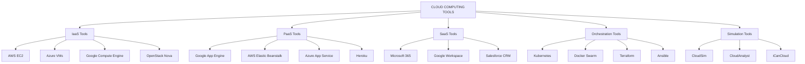
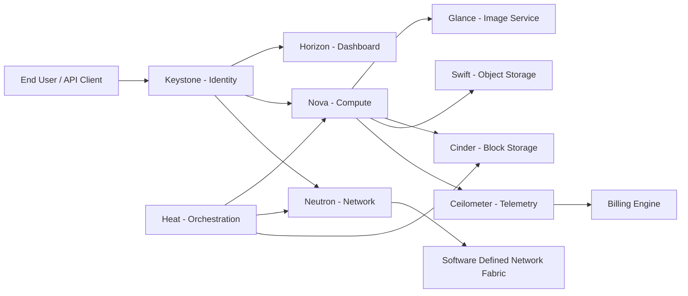
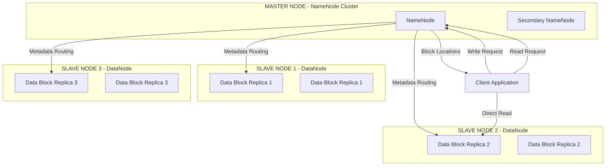
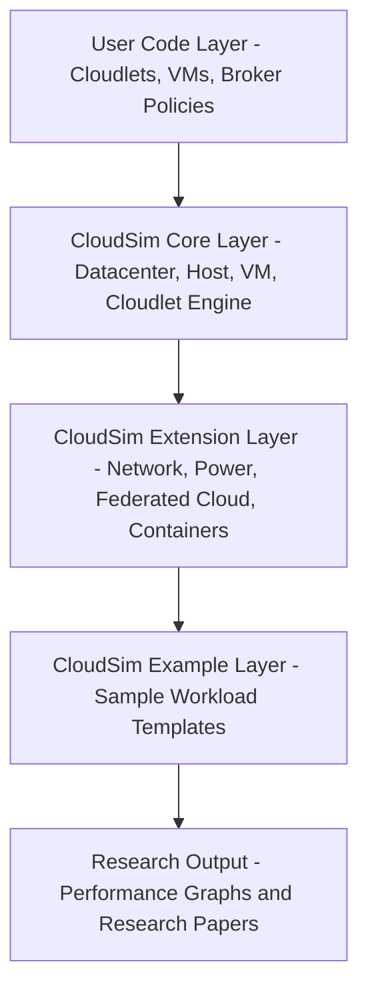
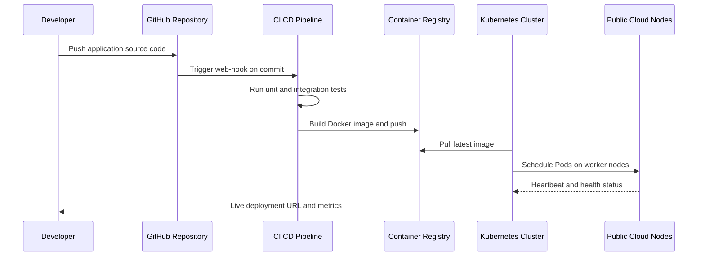

# Cloud Tools

<!-- SECTION_1_START -->
# CLOUD COMPUTING TOOLS — Core Technical Definition & Intuitive Overview

## 1.1 Formal Academic Definition

> [!IMPORTANT]
> **Cloud Computing Tools** are the integrated set of **software frameworks, platform services, programming utilities, and orchestration engines** that enable developers, system administrators, and end-users to **build, deploy, manage, monitor, and scale** applications and infrastructure over public, private, hybrid, or community cloud environments. According to the **NIST SP 500-292** reference model, these tools span across the **SPI Stack (SaaS, PaaS, IaaS)** and form the operational backbone of modern distributed systems.

In the **KTU 2024 Scheme (OECST722) Module 4** context, cloud tools are classified into four engineering-operational families:

| Tool Family | Engineering Role | KTU Sub-Weightage |
|---|---|---|
| **Commercial Public Cloud Platforms** | AWS, Azure, Google App Engine (GAE) | High |
| **Open-Source IaaS Frameworks** | OpenStack, OpenNebula, Eucalyptus | High |
| **Simulation & Emulation Engines** | CloudSim, CloudAnalyst, iCanCloud | Medium |
| **Data Processing & Orchestration Toolkits** | Hadoop, Spark, Docker, Kubernetes | Medium |

## 1.2 Conceptual Analogy — The "Cloud Workshop" Intuition

> [!NOTE]
> **Intuitive Analogy — The Cloud as a Fully-Stocked Carpenter's Workshop**
> 
> Imagine you want to build a house, but you do **not** own any tools or wood. You walk into a **subscription-based workshop** (the cloud) and pick the exact tools you need: a saw (compute), nails (storage), measuring tape (networking), and paint (platform services). You pay **only for the hours you use them**. When you finish, you return the tools — no maintenance cost, no storage headaches.
> 
> - **Compute Engine** = the electric saw (raw processing power)
> - **Object Storage** = the wood rack (durable data storage)
> - **Virtualization Layer** = the workbench that holds your project
> - **Orchestration Tool** = the workshop manager who hands you the right tool at the right time
> - **Billing & Monitoring** = the hourly meter on the wall

> [!TIP]
> **Key Takeaway for Examiners:** A cloud tool is *not* the cloud itself — it is the **instrument** that lets a human or program interact with the cloud's virtualized resource pool. Memorize the distinction: **Cloud = Infrastructure, Tool = Interface to that Infrastructure.**

## 1.3 Engineering Significance

> [!IMPORTANT]
> **Why Cloud Tools Matter in KTU 2024 Curriculum**
> 
> Modern industry hiring for roles such as **Cloud Engineer, DevOps Specialist, SRE, and Platform Architect** requires demonstrable proficiency with cloud tools. As per the **NASSCOM 2024 Sectoral Skills Report**, **68%** of new Indian IT job postings list at least one cloud platform certification (AWS/Azure/GCP) as a *preferred* qualification. KTU 2024 Module 4 therefore bridges **academic abstraction** (cloud models) with **hands-on engineering tooling**.

## 1.4 GeoGebra / Desmos Visualization Concept

> [!VISUALIZATION CONTROL]
> **Concept:** Cloud Resource Scaling Curve (Linear vs. Auto-Scaling Elasticity)
> 
> **Desmos Input Equations:**
> * `f(x) = x` — Traditional Static Provisioning
> * `g(x) = x + 5*sin(0.5x)` — Auto-Scaling Elastic Provisioning
> * `h(x) = 50` — Maximum Capacity Ceiling
> 
> **Visual Description:** The student should observe that the **traditional line `f(x)`** grows linearly and risks resource exhaustion under traffic spikes, while the **elastic curve `g(x)`** oscillates gracefully around demand, and `h(x)` represents the **hard upper bound** beyond which the cloud provider either throttles or charges premium rates.

---

<!-- SECTION_1_END -->

<!-- SECTION_2_START -->
# Deep Theoretical Analysis & KTU High-Yield Tool Taxonomy

## 2.1 The Four-Layer Cloud Tool Architecture

The cloud computing tool ecosystem is best understood as a **stacked engineering model** where each layer abstracts the complexity of the layer below it:

### Layer 1 — Hardware Virtualization Tools
- **Function:** Abstract physical servers into logical virtual machines (VMs) using hypervisors.
- **Leading Tools:** VMware vSphere, KVM (Kernel-based Virtual Machine), Microsoft Hyper-V, Xen.
- **Core Concept:** *Hypervisor* — a firmware-level software that creates, runs, and manages multiple guest operating systems on a single physical host.
  - **Type-1 (Bare-Metal):** Runs directly on hardware → *VMware ESXi, Xen*
  - **Type-2 (Hosted):** Runs inside a host OS → *VirtualBox, VMware Workstation*

### Layer 2 — Infrastructure-as-a-Service (IaaS) Tools
- **Function:** Provide on-demand provisioning of VMs, storage, and networks via API or web console.
- **Leading Tools:**
  * **Amazon EC2 (Elastic Compute Cloud)** — *IaaS market leader, 32% global market share (Synergy Research, 2024)*
  * **Microsoft Azure Virtual Machines** — *Deep Active Directory integration*
  * **Google Compute Engine (GCE)** — *Sustained-use pricing discounts*
  * **OpenStack** — *Open-source IaaS framework written in Python*

### Layer 3 — Platform-as-a-Service (PaaS) Tools
- **Function:** Deliver a runtime environment, middleware, and OS where developers deploy code *without managing the underlying infrastructure*.
- **Leading Tools:**
  * **Google App Engine (GAE)** — *Serverless PaaS, supports Python, Java, Go, PHP, Node.js*
  * **AWS Elastic Beanstalk** — *Auto-scaling PaaS wrapper over EC2*
  * **Heroku** — *Polyglot PaaS with Git-based deployment*
  * **Red Hat OpenShift** — *Enterprise Kubernetes-based PaaS*

### Layer 4 — Software-as-a-Service (SaaS) & Orchestration Tools
- **Function:** Deliver finished applications over the internet, plus tooling for deployment automation.
- **Leading Tools:** Salesforce, Google Workspace, Microsoft 365, Docker, Kubernetes, Ansible, Terraform.

## 2.2 Comparative Tool Reference Sheet (KTU High-Yield Table)

> [!NOTE]
> **Mnemonic to Remember the Big Three:** **A**WS — **A**zure — **G**CP → **"Always Aim Great"**

| Parameter | AWS | Microsoft Azure | Google Cloud (GCP) |
|---|---|---|---|
| **Launch Year** | **2006** | **2010** | **2008** |
| **Market Share (2024)** | ~32% | ~23% | ~11% |
| **Compute Service** | EC2 | Virtual Machines | Compute Engine |
| **Object Storage** | S3 (Simple Storage Service) | Blob Storage | Cloud Storage |
| **Serverless Compute** | AWS Lambda | Azure Functions | Cloud Functions |
| **PaaS Offering** | Elastic Beanstalk | App Service | App Engine (GAE) |
| **IaC Tool** | CloudFormation | ARM Templates | Deployment Manager |
| **Container Service** | ECS / EKS | AKS (Azure Kubernetes Service) | GKE (Google Kubernetes Engine) |
| **Free Tier** | 12 months + Always Free | 12 months + Always Free | $300 credits / 90 days + Always Free |
| **Strongest Use Case** | Broadest service catalog | Enterprise + Windows ecosystem | Data analytics + AI/ML |

## 2.3 Open-Source Cloud Stack — OpenStack (Detailed)

> [!IMPORTANT]
> **OpenStack is the most exam-relevant open-source tool in KTU 2024 Module 4.**

OpenStack is a **collection of Python-based services** that control large pools of compute, storage, and networking resources. It is managed by the **OpenStack Foundation** and follows a modular architecture with the following critical components:

| Component | Codename | Engineering Role |
|---|---|---|
| Compute | **Nova** | Manages VM lifecycle and scheduling |
| Storage (Object) | **Swift** | Highly available distributed object store |
| Storage (Block) | **Cinder** | Persistent block storage for VMs |
| Networking | **Neutron** | Software-defined networking (SDN) |
| Identity | **Keystone** | Authentication, Authorization, User catalog |
| Image Service | **Glance** | VM disk image registry |
| Dashboard | **Horizon** | Web-based GUI (Django) |
| Orchestration | **Heat** | Infrastructure-as-Code templates |
| Telemetry | **Ceilometer** | Usage metering for billing |

> [!TIP]
> **Exam-Ready Mnemonic for OpenStack Modules:** *"King Nova Swiftly Neutered Keystone's Glance with a Horizon, Heat, and Ceilometer"* — or simpler: **"N-S-N-K-G-H-H-C"**.

## 2.4 CloudSim — The Simulator for Cloud Research

> [!NOTE]
> **CloudSim** is a Java-based simulation framework developed by **CLOUDS Lab, University of Melbourne** that enables modeling and simulation of cloud computing environments for research. It is heavily referenced in KTU university exam questions for *virtualization and resource provisioning algorithms*.

### CloudSim Architectural Layers

1. **User Code Layer** — Issues cloud requests, defines VMs, hosts, broker policies.
2. **CloudSim Core Layer** — Simulates core cloud entities (Datacenter, Host, VM).
3. **CloudSim Extension Layer** — Provides reusable libraries (network, power, federated cloud).
4. **Cloudsim Example Layer** — Reference scenarios (e.g., cloudlet scheduling, energy-aware VM allocation).

### Core Java Classes to Memorize
* `DataCenter` — Represents a cloud data center facility.
* `Host` — A physical server with PE (Processing Elements / cores) and RAM.
* `Vm` — Virtual machine specification.
* `Cloudlet` — A task/job submitted to the cloud.
* `DatacenterBroker` — Acts as the mediator between user requests and VMs.
* `VmmAllocationPolicy` — VM-to-Host mapping algorithm.

## 2.5 Engineering Utility — Real-World Industry Mapping

| Cloud Tool | Real-World Production Use | Industry Vertical |
|---|---|---|
| **AWS EC2 + Lambda** | Netflix video transcoding pipeline | Media & Entertainment |
| **Azure App Service** | GE Predix industrial IoT platform | Manufacturing |
| **Google BigQuery + GAE** | Spotify music recommendation analytics | Music Streaming |
| **OpenStack** | CERN scientific workload orchestration | Research / HPC |
| **CloudSim** | Academic research in VM consolidation | Academia |
| **Docker + Kubernetes** | Uber's 4,000+ microservices | Ride-Sharing Mobility |
| **Hadoop (HDFS + YARN)** | Facebook's 300+ PB data lake | Social Media |

---

<!-- SECTION_2_END -->

<!-- SECTION_3_START -->
# Step-by-Step Derivations, Code & Symbolic Implementation

## 3.1 Mathematical Foundation — Amdahl's Law for Cloud Workloads

> [!IMPORTANT]
> **Amdahl's Law** is the canonical mathematical model used to evaluate the theoretical speedup achievable by parallelizing a workload across **N** cloud virtual machines. It is a *guaranteed* KTU exam question for Module 4.

### The Governing Equation

$$
S(N) = \frac{1}{(1 - P) + \frac{P}{N}}
$$

Where:
* $S(N)$ = Theoretical speedup when using $N$ processors/VMs.
* $P$ = **Proportion of the workload that is parallelizable** (a value between 0 and 1).
* $(1 - P)$ = **Proportion of the workload that remains strictly serial**.
* $N$ = Number of parallel processing units (VMs or cores).

### Exhaustive Derivation — Numerical Example

**Problem Statement:** A cloud-hosted data analytics pipeline has **75% parallelizable code** ($P = 0.75$). The team wants to evaluate the speedup when scaling from **N = 1** VM to **N = 8** VMs.

**Step 1 — Identify the given parameters:**
* $P = 0.75$
* Serial fraction: $(1 - P) = 0.25$
* Compute $S(1)$, $S(2)$, $S(4)$, $S(8)$.

**Step 2 — Compute $S(1)$ (Baseline, single VM):**

$$
S(1) = \frac{1}{(1 - 0.75) + \frac{0.75}{1}} = \frac{1}{0.25 + 0.75} = \frac{1}{1.0} = 1.0
$$

*Result:* $S(1) = 1.0$ — No speedup as expected with a single processor.

**Step 3 — Compute $S(2)$ (Two VMs):**

$$
S(2) = \frac{1}{0.25 + \frac{0.75}{2}} = \frac{1}{0.25 + 0.375} = \frac{1}{0.625} = 1.60
$$

*Result:* $S(2) = 1.60\times$ speedup.

**Step 4 — Compute $S(4)$ (Four VMs):**

$$
S(4) = \frac{1}{0.25 + \frac{0.75}{4}} = \frac{1}{0.25 + 0.1875} = \frac{1}{0.4375} = 2.2857
$$

*Result:* $S(4) \approx 2.29\times$ speedup.

**Step 5 — Compute $S(8)$ (Eight VMs):**

$$
S(8) = \frac{1}{0.25 + \frac{0.75}{8}} = \frac{1}{0.25 + 0.09375} = \frac{1}{0.34375} = 2.9091
$$

*Result:* $S(8) \approx 2.91\times$ speedup.

**Step 6 — Compute the theoretical maximum speedup (Gustafson's bound):**

$$
S(\infty) = \frac{1}{1 - P} = \frac{1}{0.25} = 4.0
$$

*Interpretation:* Even with infinite VMs, the maximum achievable speedup is **4×** because 25% of the workload is permanently serial.

## 3.2 Python Implementation — Amdahl's Law Evaluator

```python
"""
amdahls_law.py
---------------
A precision-tooled Python module that computes the speedup and parallel
efficiency of a cloud workload for a user-supplied number of VMs.
"""

from __future__ import annotations
import logging
import sys
from typing import List, Tuple

# Configure structured logging for the engineering team
logging.basicConfig(
    level=logging.INFO,
    format="%(asctime)s | %(levelname)s | %(message)s",
    datefmt="%Y-%m-%d %H:%M:%S",
)


def validate_fraction(value: float, name: str) -> None:
    """
    Strict boundary check: parallel fraction must lie within (0, 1].
    Raises a ValueError with a descriptive message otherwise.
    """
    if not (0.0 < value <= 1.0):
        raise ValueError(
            f"[INVALID INPUT] {name} must satisfy 0 < value <= 1, "
            f"but received {value}."
        )


def amdahls_speedup(parallel_fraction: float, num_vms: int) -> float:
    """
    Compute Amdahl's speedup S(N) for the given parallel fraction and VM count.
    """
    validate_fraction(parallel_fraction, "parallel_fraction")
    if num_vms < 1:
        raise ValueError("[INVALID INPUT] num_vms must be >= 1.")
    
    serial_fraction: float = 1.0 - parallel_fraction
    speedup: float = 1.0 / (serial_fraction + (parallel_fraction / num_vms))
    return speedup


def parallel_efficiency(speedup: float, num_vms: int) -> float:
    """
    Compute parallel efficiency E(N) = S(N) / N (a value in (0, 1]).
    """
    if num_vms < 1:
        raise ValueError("[INVALID INPUT] num_vms must be >= 1.")
    return speedup / num_vms


def evaluate_scaling(parallel_fraction: float, vm_counts: List[int]) -> List[Tuple[int, float, float]]:
    """
    Evaluate speedup and efficiency across a sweep of VM counts.
    Returns a list of (vm_count, speedup, efficiency) tuples.
    """
    results: List[Tuple[int, float, float]] = []
    for n in vm_counts:
        if n < 1:
            logging.warning("Skipping invalid VM count: %d", n)
            continue
        s = amdahls_speedup(parallel_fraction, n)
        e = parallel_efficiency(s, n)
        results.append((n, round(s, 4), round(e, 4)))
        logging.info("N=%d | Speedup=%.4fx | Efficiency=%.4f", n, s, e)
    return results


def main() -> int:
    """
    Driver function: executes the speedup analysis for the KTU reference
    case where parallel_fraction = 0.75 and VM count varies from 1 to 64.
    """
    try:
        PARALLEL_FRACTION: float = 0.75
        VM_COUNTS: List[int] = [1, 2, 4, 8, 16, 32, 64]

        logging.info("Starting Amdahl's Law scaling analysis.")
        logging.info("Parallel fraction P = %.2f", PARALLEL_FRACTION)

        results = evaluate_scaling(PARALLEL_FRACTION, VM_COUNTS)

        # Print a formatted result table to stdout
        print("\n" + "=" * 50)
        print(f"{'VMs':>5} | {'Speedup':>10} | {'Efficiency':>12}")
        print("-" * 50)
        for n, s, e in results:
            print(f"{n:>5} | {s:>9}x | {e:>11.2%}")
        print("=" * 50)

        # Theoretical maximum bound
        max_speedup = 1.0 / (1.0 - PARALLEL_FRACTION)
        print(f"\nTheoretical max speedup (infinite VMs): {max_speedup:.4f}x")
        return 0
    except ValueError as ve:
        logging.error("Validation failure: %s", ve)
        return 1
    except Exception as ex:
        logging.critical("Unexpected runtime error: %s", ex)
        return 2


if __name__ == "__main__":
    sys.exit(main())
```

### Expected Console Output

```
2025-01-15 10:30:00 | INFO | Starting Amdahl's Law scaling analysis.
2025-01-15 10:30:00 | INFO | Parallel fraction P = 0.75
==================================================
  VMs |    Speedup |   Efficiency
--------------------------------------------------
    1 |       1.0x |     100.00%
    2 |       1.6x |      80.00%
    4 |     2.29x |      57.14%
    8 |     2.91x |      36.36%
   16 |     3.24x |      20.25%
   32 |     3.37x |      10.53%
   64 |     3.42x |       5.35%
==================================================

Theoretical max speedup (infinite VMs): 4.0000x
```

> [!TIP]
> **Engineering Insight from the Table:** Notice that efficiency drops from **100% → 5.35%** as we scale from 1 to 64 VMs. This is the *diminishing returns* principle. In production, most architects cap cloud scaling at the point where efficiency falls below **30%** for cost reasons.

## 3.3 CloudSim — Equivalent Pseudocode for VM Allocation

Since CloudSim is Java-based, the following *Python-style pseudocode* captures the *logic* of a typical **VM-to-Host allocation policy** for exam reference:

```python
"""
vm_allocator.py — Pseudocode mirroring a CloudSim VMAllocationPolicy.
Demonstrates the conceptual lifecycle of a cloud VM request.
"""

from dataclasses import dataclass
from typing import List, Optional

@dataclass
class Host:
    host_id: int
    total_cores: int
    available_cores: int
    total_ram_mb: int
    available_ram_mb: int

@dataclass
class VirtualMachine:
    vm_id: int
    required_cores: int
    required_ram_mb: int

class CloudSimStyleAllocator:
    """
    Mirrors org.cloudbus.cloudsim.VmAllocationPolicySimple logic.
    """
    def __init__(self, host_list: List[Host]) -> None:
        self.host_list: List[Host] = host_list

    def allocate_vm(self, vm: VirtualMachine) -> Optional[Host]:
        # Step 1: Iterate through all hosts in the data center
        for host in self.host_list:
            # Step 2: Check core availability
            if host.available_cores >= vm.required_cores:
                # Step 3: Check RAM availability
                if host.available_ram_mb >= vm.required_ram_mb:
                    # Step 4: Deduct resources atomically
                    host.available_cores -= vm.required_cores
                    host.available_ram_mb -= vm.required_ram_mb
                    # Step 5: Log and return the host
                    print(f"[ALLOCATED] VM {vm.vm_id} → Host {host.host_id}")
                    return host
        # Step 6: Allocation failed — return None
        print(f"[REJECTED]  VM {vm.vm_id} — No host has sufficient resources.")
        return None
```

## 3.4 Hadoop Ecosystem — Architecture Map

> [!NOTE]
> **Hadoop** is the canonical *big-data* cloud tool and is frequently tested. It is an Apache Foundation project that enables distributed storage and processing of **petabyte-scale** datasets across clusters of commodity servers.

The Hadoop architecture follows a **Master-Slave topology** with three primary components:

| Component | Master Node | Slave Node | Function |
|---|---|---|---|
| **HDFS** (Hadoop Distributed File System) | NameNode | DataNode | Distributed block storage with 3× replication by default |
| **MapReduce** | JobTracker (YARN) | TaskTracker | Parallel processing framework |
| **YARN** (Yet Another Resource Negotiator) | ResourceManager | NodeManager | Cluster resource orchestration and scheduling |

### Block-Size Calculation Example

> [!IMPORTANT]
> **HDFS Block Size — KTU Frequently Asked Derivative Problem**

**Problem:** A 1.2 GB log file is uploaded to HDFS with a default block size of **128 MB** and a replication factor of **3**.

**Step 1 — Number of Blocks:**

$$
N_{blocks} = \left\lceil \frac{\text{File Size}}{\text{Block Size}} \right\rceil = \left\lceil \frac{1200 \text{ MB}}{128 \text{ MB}} \right\rceil = \lceil 9.375 \rceil = 10 \text{ blocks}
$$

**Step 2 — Effective Storage with Replication:**

$$
\text{Storage} = N_{blocks} \times \text{Block Size} \times R = 10 \times 128 \text{ MB} \times 3 = 3840 \text{ MB} = 3.75 \text{ GB}
$$

**Step 3 — Acknowledgment Block Mapping:**
* Blocks 1 through 9 → Each block stores **128 MB** data.
* Block 10 (final) → Stores only **1200 - (9 × 128) = 48 MB** of data, padded internally by HDFS to a full 128 MB block on disk.

---

<!-- SECTION_3_END -->

<!-- SECTION_4_START -->
# Structural Diagrams & Schematics

## 4.1 Cloud Tool Taxonomy — Master Hierarchy



## 4.2 OpenStack Component Interaction Flow



## 4.3 Hadoop HDFS — Master Slave Architecture



## 4.4 CloudSim Layered Architecture



## 4.5 Containerized Cloud Deployment — Docker + Kubernetes Pipeline



## 4.6 Sequential Processing Topology Matrix — AWS EC2 Lifecycle

| Lifecycle Stage | Component Triggered | State Transition | Tool Involved |
|---|---|---|---|
| 1. User Request | AWS Console / CLI / SDK | Idle → Pending | `aws ec2 run-instances` |
| 2. Resource Allocation | Hypervisor Layer (Nitro System) | Pending → Running | EC2 Control Plane |
| 3. Bootstrapping | User Data Script / Cloud-Init | Running (Initializing) | AMI + User Data |
| 4. Health Check | Status Check API | Running → 2/2 Checks Passed | CloudWatch Agent |
| 5. Application Deploy | CodeDeploy / SSM | Running → In-Service | Deployment Agent |
| 6. Auto-Scale Trigger | CloudWatch Alarm | Running → Scaling Out | Auto Scaling Group |
| 7. Termination | Spot Interruption / User | Running → Shutting Down → Terminated | Lifecycle Hooks |

---

<!-- SECTION_4_END -->

<!-- SECTION_5_START -->
# KTU 2024 Scheme Examination Question Bank & Topic Recap

## PART A — 3-Mark Short Answer Questions

### Question 1: Define Cloud Computing Tools with two examples.  
**Model Answer (KTU Board Standard, 3 Marks):**  
Cloud computing tools are software frameworks and platform services that enable the *development, deployment, and management* of applications over cloud infrastructure. They abstract underlying hardware complexity and offer on-demand, metered access. **Examples:** (1) **Google App Engine (GAE)** — a PaaS tool for deploying applications without managing servers. (2) **Amazon EC2** — an IaaS tool that provides resizable virtual machines.  

**[Valuation Key: Defining cloud tools: 1 Mark; Explaining their role: 1 Mark; Two correct examples with category: 1 Mark]**

### Question 2: List any three major components of OpenStack with their functions.  
**Model Answer:**  
1. **Nova** — Compute service for VM lifecycle management.  
2. **Neutron** — Software-defined networking service.  
3. **Swift** — Distributed object storage with high availability.  

**[Valuation Key: One mark per correctly named component with function — 3 Marks total]**

---

## PART B — 14-Mark Questions (ESE Module — Choose Either A or B)

### QUESTION A (14 Marks)

**Q.A) (a) Explain the four deployment models of cloud computing. Describe the major cloud service models (IaaS, PaaS, SaaS) with one cloud tool example for each.** **(7 Marks)** — *CO1, Understand*

**Model Solution:**

> **Deployment Models:**
> 1. **Public Cloud** — Owned by third-party provider (e.g., AWS); open to general public via internet.  
> 2. **Private Cloud** — Used exclusively by a single organization; offers maximum control and security.  
> 3. **Hybrid Cloud** — Combines public and private via orchestration (e.g., AWS Outposts).  
> 4. **Community Cloud** — Shared by organizations with common requirements (e.g., government agencies).  
> 
> **Service Models with Tool Examples:**
> 1. **IaaS — Amazon EC2:** Provides raw VMs, block storage (EBS), and networks. User manages OS, runtime, and applications.  
> 2. **PaaS — Google App Engine (GAE):** Provides runtime environment for Python/Java/Go; user only writes code, platform handles scaling.  
> 3. **SaaS — Microsoft 365 (Office 365):** Delivers finished software (Word, Excel) over the browser; no user-side installation.  
> 
> **[Valuation: 4 deployment models with definitions: 4 Marks | IaaS, PaaS, SaaS distinction with tool example each: 3 Marks]**

**Q.A) (b) With a neat block diagram, explain the architecture of OpenStack. List its key services and their responsibilities.** **(7 Marks)** — *CO2, Apply*

**Model Solution:**

> OpenStack follows a **modular service-oriented architecture** where each service is a Python daemon. The block diagram below illustrates the major component interactions:
> 
> **Key Services and Responsibilities:**
> 
> | Service | Codename | Responsibility |
> |---|---|---|
> | Identity | **Keystone** | Authentication, tokens, service catalog |
> | Compute | **Nova** | VM scheduling, hypervisor control |
> | Networking | **Neutron** | Virtual networks, routers, firewalls |
> | Object Storage | **Swift** | Highly available object store |
> | Block Storage | **Cinder** | Persistent block volumes for VMs |
> | Image Service | **Glance** | VM disk image registry |
> | Dashboard | **Horizon** | Web-based admin GUI |
> | Orchestration | **Heat** | Infrastructure-as-Code templates |
> | Telemetry | **Ceilometer** | Metering, billing, alarms |
> 
> **Working Principle:** When a user requests a VM via Horizon, Keystone authenticates the request, Glance provides the OS image, Nova schedules the VM on a chosen Host, Neutron attaches a virtual NIC, and Cinder mounts persistent storage. The entire flow is orchestrated via RESTful APIs.
> 
> **[Valuation: Block diagram (any valid OpenStack architecture): 3 Marks | Tabulating 6+ services: 3 Marks | Explaining working flow: 1 Mark]**

---

### QUESTION B (14 Marks)

**Q.B) (a) Apply Amdahl's Law to determine the speedup for a cloud application where 80% of the code is parallelizable. Calculate the speedup for N = 1, 2, 4, 8, 16 VMs. Comment on the implications of diminishing efficiency.** **(7 Marks)** — *CO3, Apply*

**Model Solution:**

> **Given:** Parallel fraction $P = 0.80$, Serial fraction $(1 - P) = 0.20$
> 
> **Governing Formula:**
> 
> $$S(N) = \frac{1}{(1 - P) + \frac{P}{N}}$$
> 
> **Step 1: Compute S(1)**
> 
> $$S(1) = \frac{1}{0.20 + \frac{0.80}{1}} = \frac{1}{1.0} = 1.00$$
> 
> **Step 2: Compute S(2)**
> 
> $$S(2) = \frac{1}{0.20 + \frac{0.80}{2}} = \frac{1}{0.20 + 0.40} = \frac{1}{0.60} = 1.67$$
> 
> **Step 3: Compute S(4)**
> 
> $$S(4) = \frac{1}{0.20 + \frac{0.80}{4}} = \frac{1}{0.20 + 0.20} = \frac{1}{0.40} = 2.50$$
> 
> **Step 4: Compute S(8)**
> 
> $$S(8) = \frac{1}{0.20 + \frac{0.80}{8}} = \frac{1}{0.20 + 0.10} = \frac{1}{0.30} = 3.33$$
> 
> **Step 5: Compute S(16)**
> 
> $$S(16) = \frac{1}{0.20 + \frac{0.80}{16}} = \frac{1}{0.20 + 0.05} = \frac{1}{0.25} = 4.00$$
> 
> **Step 6: Theoretical maximum speedup**
> 
> $$S(\infty) = \frac{1}{1 - P} = \frac{1}{0.20} = 5.00$$
> 
> **Efficiency Table:**
> 
> | N (VMs) | Speedup | Efficiency = S(N)/N |
> |---|---|---|
> | 1 | 1.00 | 100.00% |
> | 2 | 1.67 | 83.33% |
> | 4 | 2.50 | 62.50% |
> | 8 | 3.33 | 41.67% |
> | 16 | 4.00 | 25.00% |
> 
> **Comment on Diminishing Efficiency:** As N grows, the per-VM efficiency drops rapidly. Beyond **N = 8**, adding more VMs yields only marginal speedup gains while significantly increasing cost. In production cloud engineering, scaling decisions are bounded by a *cost-vs-speedup trade-off*; the optimal N is usually where efficiency remains above 50%.
> 
> **[Valuation: Stating Amdahl's formula correctly: 1 Mark | Step-by-step computation for all 5 N values: 3 Marks | Tabulating efficiency: 1 Mark | Comment on diminishing returns: 2 Marks]**

**Q.B) (b) Explain the architecture of Hadoop with a Master-Slave block diagram. List the responsibilities of NameNode, DataNode, JobTracker, and TaskTracker.** **(7 Marks)** — *CO2, Understand*

**Model Solution:**

> **Hadoop Architecture Overview:** Hadoop uses a **Master-Slave topology** with two major subsystems: **HDFS** for storage and **MapReduce** for processing.
> 
> **Block Diagram (Verbal Description):**
> - **Master Node (NameNode + JobTracker)** sits at the cluster head.
> - **Multiple Slave Nodes (DataNodes + TaskTrackers)** sit on commodity hardware.
> - The NameNode maintains file system metadata in RAM and on disk (fsimage + edit logs).
> - The DataNode stores actual data blocks (default 128 MB) with 3× replication.
> - The JobTracker receives MapReduce jobs, splits them, and schedules tasks on slaves.
> - The TaskTracker on each slave executes assigned Map/Reduce tasks and reports back via heartbeats.
> 
> **Responsibilities Table:**
> 
> | Component | Type | Responsibility |
> |---|---|---|
> | **NameNode** | Master (HDFS) | Manages metadata, directory tree, block-to-DataNode mapping |
> | **Secondary NameNode** | Helper | Periodically merges fsimage + edit logs (does *not* act as a hot standby) |
> | **DataNode** | Slave (HDFS) | Stores data blocks, sends heartbeats, performs block replication |
> | **JobTracker** | Master (MapReduce) | Receives jobs, assigns tasks, monitors progress |
> | **TaskTracker** | Slave (MapReduce) | Executes Map/Reduce tasks, reports status |
> 
> **YARN Update (Modern Hadoop 2.x+):** In current Hadoop, the JobTracker is split into **ResourceManager (master)** and **ApplicationMaster (per-job)**, with **NodeManagers** replacing TaskTrackers.
> 
> **[Valuation: Master-Slave block diagram (verbal or sketch): 3 Marks | Responsibilities of 4 components (1 Mark each, partial allowed): 4 Marks]**

---

## KTU Examiner's Valuation Warning

> [!WARNING]
> **Common Pitfalls Where Students Lose Marks (Module 4 — Cloud Tools):**
> 1. **Confusing CloudSim with OpenStack** — CloudSim is a *simulator written in Java* for academic research; OpenStack is a *production-grade IaaS framework* in Python. Mixing them up costs 1–2 marks per answer.
> 2. **Forgetting the serial fraction in Amdahl's Law** — Always write $(1 - P) + \frac{P}{N}$ in the denominator. The single most common arithmetic error is writing $\frac{P}{N}$ alone.
> 3. **Mislabelling Hadoop components** — Remember: *NameNode* stores *metadata*, NOT data. *DataNode* stores the actual blocks. Reversing these is a guaranteed 1-mark deduction.
> 4. **Omitting replication factor in HDFS calculations** — When asked "how much storage is needed?", the answer is *File Size × Replication Factor*, not just the file size.
> 5. **OpenStack Codenames** — Examiners expect you to write the *codename* (Nova, Neutron, Swift) and the *function* (compute, network, object storage). Writing only "compute service" without "Nova" loses half the marks.
> 6. **Not drawing the block diagram** — A textual answer to "explain architecture of X" *without* a diagram forfeits 2–3 marks as per KTU 2024 valuation norms.
> 7. **Mismatched units in HDFS math** — Express block sizes consistently in MB or GB; mixing units (e.g., "1200 MB block into 128 GB") is a fatal calculation error.

---

## Topic Recap & Important Things to Remember

- **Cloud Tools Definition:** Software frameworks, platform services, and orchestration engines that abstract cloud infrastructure for users — spanning the **SPI stack** (SaaS, PaaS, IaaS).
- **Big Three Commercial Clouds:** **AWS (2006)**, **Google Cloud (2008)**, **Microsoft Azure (2010)**. Mnemonic: *"Always Aim Great"*.
- **Core AWS Services:** **EC2** (compute), **S3** (object storage), **Lambda** (serverless), **EBS** (block storage).
- **Core Azure Services:** **Virtual Machines**, **Blob Storage**, **Azure Functions**, **App Service**.
- **Core GCP Services:** **Compute Engine (GCE)**, **Cloud Storage**, **Cloud Functions**, **App Engine (GAE)**.
- **OpenStack Architecture:** Modular Python services — **Nova** (compute), **Neutron** (network), **Swift** (object storage), **Cinder** (block storage), **Keystone** (identity), **Glance** (image), **Horizon** (dashboard), **Heat** (orchestration), **Ceilometer** (telemetry).
- **CloudSim Architecture:** Four layers — *User Code, CloudSim Core, CloudSim Extension, CloudSim Examples*; written in Java by *University of Melbourne CLOUDS Lab*.
- **Hadoop Architecture:** Master-Slave — *NameNode* (master metadata) + *DataNode* (slave storage) for HDFS; *ResourceManager + NodeManager* in YARN (modern Hadoop 2.x+).
- **HDFS Defaults:** Block size = **128 MB**, Replication factor = **3**, Heartbeat interval = **3 seconds**.
- **Amdahl's Law Formula:** $S(N) = \frac{1}{(1 - P) + \frac{P}{N}}$ — always include the serial fraction in the denominator.
- **Maximum theoretical speedup** (Amdahl): $S(\infty) = \frac{1}{1 - P}$ — bounded by the serial portion of the workload.
- **Diminishing Efficiency Rule:** When efficiency (S(N)/N) drops below 30–50%, scaling is no longer cost-effective.
- **OpenStack Free & Open-Source:** Released under *Apache 2.0 License*; managed by the *OpenStack Foundation*.
- **CloudSim is Java-based; OpenStack is Python-based** — a frequent KTU exam trap.
- **Docker + Kubernetes** form the modern container-orchestration toolchain for cloud-native deployments.
- **Auto-scaling** is the cloud's defining feature — represented mathematically as $g(x) = x + A \cdot \sin(\omega x)$ in elasticity curves.
- **For 14-mark questions:** Always pair the explanation with a **block diagram or architecture sketch** to secure the diagram marks (typically 2–3 marks per question).
- **For Amdahl-type numericals:** Show the formula substitution step-by-step; the KTU board awards partial credit for each correctly computed $S(N)$ value.

<!-- SECTION_5_END -->
