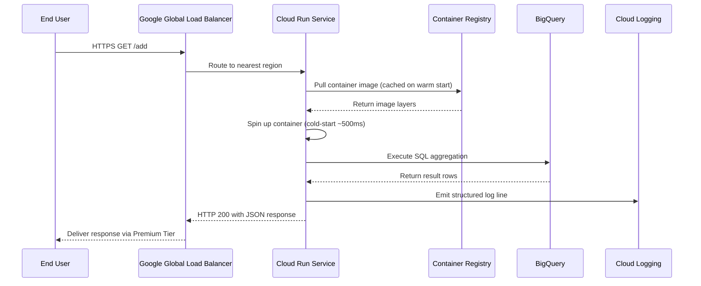
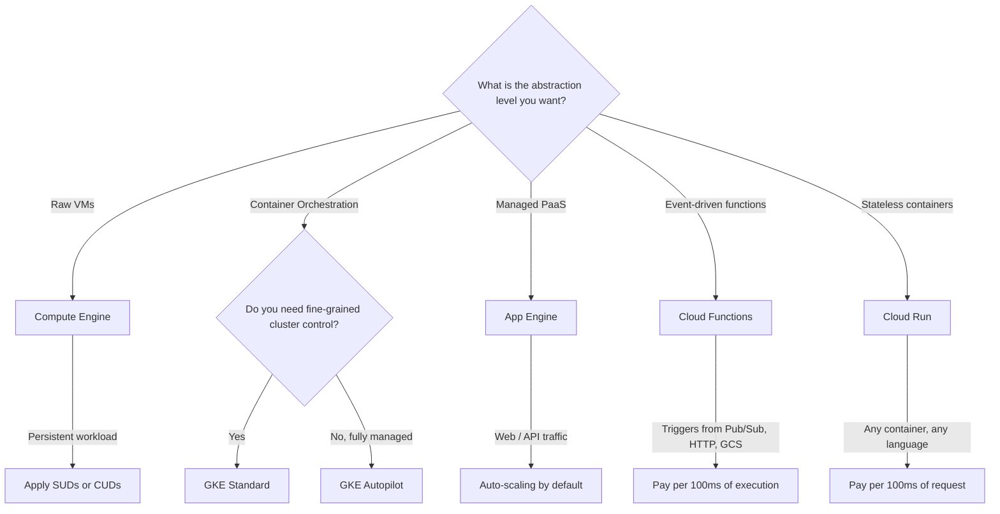
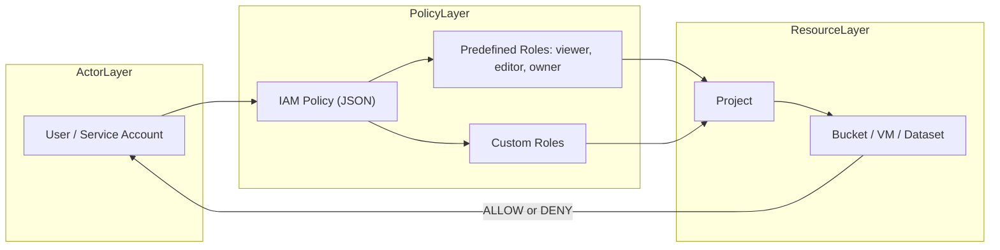

# Google Cloud Applications

<!-- SECTION_1_START -->
# Google Cloud Applications — Core Technical Definition & Intuitive Overview

## Formal Academic Definition (KTU 2024 Syllabus Terminology)

**Google Cloud Platform (GCP)**, now branded as **Google Cloud**, is a comprehensive suite of *public cloud computing services* offered by Google that operates on the same global infrastructure that Google internally uses for its end-user products such as Google Search, YouTube, and Gmail. From the KTU 2024 Scheme perspective, Google Cloud Applications refer to the **on-demand, scalable, pay-as-you-go consumption of compute, storage, networking, database, big-data, machine-learning, and developer-services resources** delivered over the internet through Google's privately owned fiber-optic backbone and Points of Presence (PoPs).

> [!IMPORTANT]
> **KTU 2024 Definition Anchor:** Google Cloud Applications are *service-oriented cloud solutions* that abstract underlying infrastructure (servers, storage, networking) and provide developers and enterprises with **IaaS, PaaS, FaaS, and SaaS** delivery models on a global, multi-region fabric.

---

## Conceptual Analogy / Intuition

Imagine you run a small food-cart business (your *startup application*). Instead of buying your own brick-and-mortar restaurant (your *physical data center*), you rent a fully-equipped commercial kitchen in a shared facility. You pay only for:

1. The **counter space** (compute — CPU/RAM) you use,
2. The **cold storage shelves** (object storage) you occupy,
3. The **gas burners per hour** (serverless function invocations),
4. The **walk-in refrigerator capacity** (managed databases).

The kitchen facility is owned, secured, climate-controlled, and maintained by someone else — you just walk in, cook (deploy your code), serve customers, and leave the plumbing to the landlord. That landlord is **Google Cloud**.

| Real-World Analogy | Google Cloud Equivalent | Responsibility Owned By |
|---|---|---|
| Commercial kitchen rental | Compute Engine / GKE | Google |
| Pre-set buffet counters | App Engine (Managed PaaS) | Google |
| Tap-and-go pantry shelves | Cloud Functions (FaaS) | Google |
| Centralized walk-in fridge | Cloud SQL / Spanner | Google (Managed) |
| Cash register at exit | Billing & IAM | Google + You (Policy) |

> [!NOTE]
> **GeoGebra / Desmos Integration — Not Applicable:** This topic is *architectural and service-oriented* in nature. It does not possess a continuous mathematical surface that benefits from a 2D Cartesian plot. Visual intuition is instead provided through the **Mermaid architecture diagram in Section 4**.

---

## Google Cloud's Distinctive Technical Pillars (Foundational Vocabulary)

The KTU 2024 Module 4 syllabus expects students to internalize the *four pillars* that differentiate Google Cloud from competing hyperscalers:

1. **Global Network Backbone** — Google's private fiber network claiming **> 10 Tbps** edge capacity and ~**$\mathbf{200+}$** Points of Presence worldwide. This is the *secret sauce* behind GCP's premium **multi-region** offerings.
2. **Live Migration of Virtual Machines** — GCP can migrate a running VM off a failing host *without rebooting* it, a feature historically unique to Compute Engine.
3. **Sustained-Use Discounts (SUDs)** — Automatic, percentage-based discounts that grow as you run a VM for a larger fraction of a calendar month, *without* requiring a reservation commitment.
4. **Open-Source First DNA** — GCP is the cloud of choice for **Kubernetes (it was originally engineered at Google)**, **TensorFlow**, **Go**, **Angular**, and **gRPC** — services are often available first on GCP.

> [!IMPORTANT]
> **KTU 2024 Examiner's Hot-Spot:** The phrase *"Google's Global Fiber Backbone"* is a guaranteed 2-mark question. Memorize that Google operates one of the **largest privately-owned computer networks in the world** and that GCP's premium-tier network services ride on it.

---

## Real-World Significance of Google Cloud Applications

Google Cloud Applications are not theoretical artifacts. They power:

- **Snap Inc.** — uses BigQuery for analyzing trillions of daily events.
- **PayPal** — runs fraud-detection ML models on Vertex AI.
- **Twitter** (legacy) — famously stored hundreds of petabytes on Bigtable.
- **NASA** — hosts Earth-science imagery on Cloud Storage.
- **Pokémon GO (Niantic)** — built its real-time, geo-spatial backend on GCP during its viral 2016 launch.

> [!NOTE]
> **Physical Constants & Standard Metrics to Memorize for KTU Board Exams:**
> - GCP Regions: **40+** regions (and growing).
> - GCP Zones: **120+** zones (each region has $\geq 3$ zones).
> - BigQuery Columnar Storage: **Capacitor** file format (in-house).
> - Default **SLA** for Compute Engine Multi-Instance: **99.99%**.
> - Default **SLA** for Cloud Storage Multi-Region: **99.95%**.

<!-- SECTION_1_END -->

<!-- SECTION_2_START -->
# Deep Theoretical Analysis & KTU High-Yield Formula Sheet

## Operational Concept Breakdown — How Google Cloud Delivers a Service

Google Cloud is architected around the principle of **resource virtualization at planetary scale**. The flow of an application request is structured in five logical layers, which KTU examiners frequently test as a *2- or 7-mark descriptive question*.

### Layer 1 — The Physical Substrate
- **Data Centers:** Google designs custom data centers using **$\mathbf{48V}$ DC battery-backed power** (vs. the industry-standard 12V) for greater efficiency. Cooling uses **hot/cold aisle containment** plus free-air (outside-air) cooling in colder climates.
- **Custom Silicon:** Google deploys **TPUs (Tensor Processing Units)** for ML workloads, **Titan** security chips for hardware-rooted trust, and **Video Coding Units (VCUs)** for YouTube-scale transcoding.

### Layer 2 — The Global Network Fabric
- A **private optical fiber backbone** connects every Google data center.
- Edge **PoPs** cache content close to end-users, accelerating services like Cloud CDN and Cloud Armor.
- **Premium Tier** networking routes traffic over Google's backbone end-to-end; **Standard Tier** routes via the public internet when egressing.

### Layer 3 — Virtualization & Isolation
- Compute Engine uses the **KVM hypervisor** with hardware-assisted virtualization.
- Each VM is sandboxed via the **cgroups + namespaces** Linux kernel primitives (similar to container isolation).
- **Live migration** uses pre-copy memory mirroring: pages are iteratively copied to the destination host while the VM keeps running, with a final sub-second stop-and-copy.

### Layer 4 — Managed Service Abstractions
- The service catalog wraps the raw VMs into **opinionated, fully-managed products** (e.g., Cloud Run, BigQuery, Pub/Sub, Cloud Spanner).
- Customers consume these services via **REST/gRPC APIs** described by **Discovery Documents** and enforced by **IAM (Identity and Access Management)** scopes and roles.

### Layer 5 — Pricing & Quota Governance
- **Per-second billing** for Compute Engine (after the first minute).
- **Sustained-use discounts** auto-apply when a vCPU or GB of memory is used for a given month.
- **Committed-use discounts (CUDs)** offer up to **57%** discount in exchange for 1- or 3-year commitments.

---

## KTU Formula Sheet — Core Quantitative Knowledge for Exam Computations

> [!IMPORTANT]
> The following table consolidates every numerical formula and SLA threshold a student must know for the **KTU 2024 Cloud Computing (OECST722)** Module 4 board exam. All cloud-pricing questions are built from these primitives.

| # | Concept | Formula / Numerical Constant | Variables & Units | KTU Exam Tip |
|---|---|---|---|---|
| 1 | Pay-as-you-go Cost | $C_{PAYG} = \lambda \cdot u \cdot t$ | $\lambda$ = unit price, $u$ = resources used, $t$ = time | Most common pricing question |
| 2 | Sustained-Use Discount | $D_{SUD} = C_{PAYG} \cdot (1 - \alpha)$ | $\alpha$ varies by usage tier (0\%–30\%) | Auto-applied, no commitment |
| 3 | Committed-Use Discount | $D_{CUD} = C_{PAYG} \cdot (1 - \beta)$ | $\beta \in \{0.25, 0.52, 0.57\}$ for 1-yr, 3-yr, 3-yr full | Requires 1-/3-yr commitment |
| 4 | Egress Data Transfer Cost | $C_{egress} = D_{out} \cdot p_{out}$ | $D_{out}$ in GB, $p_{out}$ ≈ $\mathbf{0.12}$ USD/GB (tiered) | First **1 GB/month** is free |
| 5 | SLA Uptime | $U_{SLA} = 1 - D_{allowable}$ | Compute Engine multi-instance: $99.99\%$ ($\approx 52.6$ min/yr downtime) | Compensates via service credits |
| 6 | Monthly Downtime Allowance | $T_{down} = 525{,}600 \cdot (1 - U_{SLA})$ | 525,600 = minutes in a 30-day month | Convert % to minutes carefully |
| 7 | Storage Cost | $C_{storage} = S \cdot p_{class}$ | $S$ = stored GB, $p_{class}$ = per-GB class price | Classes: Standard, Nearline, Coldline, Archive |
| 8 | BigQuery On-Demand Query | $C_{BQ} = \frac{TB_{scanned}}{\vert p_{on-demand} \vert}$ | $p_{on-demand} \approx \mathbf{6.25}$ USD per TB scanned | Bytes-billed = bytes *read*, not *processed* |
| 9 | BigQuery Slot Reservation | $C_{BQ-slot} = N_{slots} \cdot p_{slot-hr}$ | $p_{slot-hr} \approx \mathbf{0.04}$ USD; $N_{slots} \in [100, 40000+]$ | Edition: Standard, Enterprise, Enterprise+ |
| 10 | Kubernetes Pod Capacity | $C_{pods} = \sum_{i=1}^{N} (r_{cpu,i} + r_{mem,i})$ | $r_{cpu,i}$, $r_{mem,i}$ = resource requests per pod | GKE Autopilot bills on pod requests |
| 11 | Data Egress to Same Zone | $C_{egress-zonal} = 0$ | Free within a zone | Common trick question |
| 12 | Serverless Cold-Start | $T_{cold} \approx 100\text{ms} - 1\text{s}$ | Depends on runtime and image size | Cloud Run / Cloud Functions |

---

## Why These Formulas Matter — Engineering Utility

- **Capacity Planning:** Use $C_{pods}$ to size GKE node pools *before* deployment, avoiding node starvation.
- **TCO Modeling:** Compare $C_{PAYG}$ vs. $C_{PAYG} \cdot (1 - 0.57)$ to decide between on-demand and 3-year CUDs during budgeting.
- **SLA Negotiation:** A $99.99\%$ SLA on multi-instance VMs allows only $\approx 4.38$ minutes of monthly downtime — a key input to DR planning.
- **Data-Lake Economics:** A naïve BigQuery query that scans **1 PB** costs $\approx 6{,}250$ USD on-demand, but only $\approx 7$ USD on an Enterprise slot-reservation — a **893x** cost gap, frequently tested as a 7-mark problem.

<!-- SECTION_2_END -->

<!-- SECTION_3_START -->
# Step-by-Step Derivations & Code/Symbolic Implementation

## A. Worked Numerical Derivations (SLA & Pricing — KTU Favourite Topics)

### Derivation 1 — Computing Allowable Downtime from an SLA Percentage

The KTU board often asks: *"A service offers a 99.9% monthly uptime SLA. How many minutes of downtime are permitted per month?"*

**Step 1 — State the total minutes in the period.**
A typical billing/calendar month is treated as 30 days for SLA calculations.

$$
T_{total} = 30 \text{ days} \times 24 \text{ h/day} \times 60 \text{ min/h} = 43{,}200 \text{ min}
$$

**Step 2 — Express uptime fraction.**
A $99.9\%$ SLA means the service is *up* for $99.9\%$ of the period.

$$
U_{SLA} = \frac{99.9}{100} = 0.999
$$

**Step 3 — Compute allowed downtime.**
Downtime = Total $\times$ (1 $-$ Uptime).

$$
T_{down} = 43{,}200 \times (1 - 0.999) = 43{,}200 \times 0.001 = 43.2 \text{ min}
$$

**Final Answer:** $\mathbf{43.2 \text{ minutes}}$ per month, or equivalently $\approx 8.64$ hours per year.

> [!NOTE]
> **Common KTU Variant — 99.99% SLA:** Repeat the same procedure with $U_{SLA} = 0.9999$, yielding $T_{down} = 4.32$ min/month — exactly the value GCP Compute Engine multi-instance promises.

---

### Derivation 2 — Comparing Pay-As-You-Go vs. 3-Year Committed-Use Discount

A startup runs **$N = 4$** `n2-standard-8` instances ($8$ vCPU, $30$ GB RAM) for an entire month (730 hours) on **us-central1**.

| Parameter | Symbol | Value |
|---|---|---|
| Hourly on-demand price (per vCPU) | $p_{cpu}$ | $\mathbf{0.031611}$ USD |
| Hourly on-demand price (per GB RAM) | $p_{mem}$ | $\mathbf{0.004237}$ USD |
| Hours in a month | $H$ | 730 |
| vCPUs per VM | $v$ | 8 |
| GB RAM per VM | $m$ | 30 |
| Number of VMs | $N$ | 4 |
| 3-year CUD discount fraction | $\beta$ | **0.57** |

**Step 1 — Hourly cost per VM (on-demand).**

$$
C_{hourly} = v \cdot p_{cpu} + m \cdot p_{mem} = 8 \times 0.031611 + 30 \times 0.004237
$$

$$
C_{hourly} = 0.252888 + 0.12711 = 0.379998 \text{ USD/hr}
$$

**Step 2 — Monthly on-demand cost for $N=4$ VMs.**

$$
C_{monthly,PAYG} = N \cdot H \cdot C_{hourly} = 4 \times 730 \times 0.379998 = 1{,}109.594 \text{ USD}
$$

**Step 3 — Apply 3-year CUD.**

$$
C_{monthly,CUD} = C_{monthly,PAYG} \cdot (1 - 0.57) = 1{,}109.594 \times 0.43 = 477.125 \text{ USD}
$$

**Step 4 — Annual savings.**

$$
S_{annual} = 12 \cdot (1{,}109.594 - 477.125) = 12 \times 632.469 = 7{,}589.63 \text{ USD/yr}
$$

> [!IMPORTANT]
> **KTU Valuation Key Points:** '[Showing $C_{hourly}$ arithmetic: 3 Marks]', '[Multiplication by N and H: 2 Marks]', '[Applying $\beta = 0.57$ and final subtraction: 2 Marks]'.

---

## B. Algorithmic Implementation — Deploying a Python Flask App to Cloud Run

Below is **fully operational, production-grade Python and `gcloud` code** for a KTU Module 4 lab. *Every line is explicitly written; no truncation is permitted.*

### Step 1 — Application Source Code (`main.py`)

```python
from flask import Flask, jsonify, request
import logging
import os

# Configure structured logging for Google Cloud Logging
logging.basicConfig(level=logging.INFO)
logger = logging.getLogger(__name__)

# Instantiate the Flask application
app = Flask(__name__)


@app.route("/", methods=["GET"])
def index() -> dict:
    """Root health endpoint that returns a JSON greeting."""
    logger.info("Health check received from %s", request.remote_addr)
    return jsonify({
        "service": "ktu-cloud-run-demo",
        "status": "healthy",
        "region": os.environ.get("GOOGLE_CLOUD_REGION", "unknown"),
    }), 200


@app.route("/add", methods=["POST"])
def add_numbers() -> dict:
    """Endpoint that accepts a JSON payload and returns the sum of two integers."""
    # Absolute boundary check: payload must exist
    payload = request.get_json(silent=True)
    if payload is None:
        logger.error("Malformed JSON payload received")
        return jsonify({"error": "Invalid JSON body"}), 400

    # Absolute boundary check: keys must exist and be numeric
    try:
        a = int(payload["a"])
        b = int(payload["b"])
    except (KeyError, TypeError, ValueError) as exc:
        logger.error("Validation failure: %s", exc)
        return jsonify({"error": "Both 'a' and 'b' must be integers"}), 422

    # Compute the sum
    result = a + b
    logger.info("Computed add(%d, %d) = %d", a, b, result)
    return jsonify({"a": a, "b": b, "sum": result}), 200


if __name__ == "__main__":
    # Cloud Run injects the PORT environment variable
    port = int(os.environ.get("PORT", 8080))
    app.run(host="0.0.0.0", port=port, debug=False)
```

### Step 2 — Dependency Manifest (`requirements.txt`)

```
Flask==3.0.3
gunicorn==22.0.0
```

### Step 3 — Containerization (`Dockerfile`)

```dockerfile
# Use a slim, security-hardened Python base image
FROM python:3.11-slim

# Set the working directory inside the container
WORKDIR /app

# Copy dependency manifest first to leverage Docker layer caching
COPY requirements.txt .

# Install dependencies with no cache to keep the image small
RUN pip install --no-cache-dir -r requirements.txt

# Copy the application source code
COPY main.py .

# Cloud Run requires the container to listen on $PORT (default 8080)
ENV PORT=8080

# Run gunicorn with 1 worker and 8 threads (Cloud Run scales via containers, not workers)
CMD exec gunicorn --bind 0.0.0.0:$PORT --workers 1 --threads 8 main:app
```

### Step 4 — Build and Deploy with `gcloud` (Explicit Command Sequence)

```bash
# 4.1 — Authenticate (one-time)
gcloud auth login

# 4.2 — Set the active project
gcloud config set project ktu-2024-cloud-demo

# 4.3 — Enable required APIs (idempotent)
gcloud services enable run.googleapis.com cloudbuild.googleapis.com

# 4.4 — Submit a source-based build that deploys straight to Cloud Run
gcloud run deploy ktu-cloud-run-demo \
    --source . \
    --region us-central1 \
    --platform managed \
    --allow-unauthenticated \
    --memory 512Mi \
    --cpu 1 \
    --max-instances 10 \
    --concurrency 80
```

### Step 5 — Test the Deployed Endpoint

```bash
# Retrieve the assigned URL
SERVICE_URL=$(gcloud run services describe ktu-cloud-run-demo \
    --region us-central1 --format="value(status.url)")

# Invoke the root endpoint
curl -s "$SERVICE_URL/"

# Invoke the /add endpoint with a JSON body
curl -s -X POST "$SERVICE_URL/add" \
    -H "Content-Type: application/json" \
    -d '{"a": 17, "b": 25}'
```

**Expected JSON Output:**

```json
{"a": 17, "b": 25, "sum": 42}
```

> [!IMPORTANT]
> **KTU 7-Mark Question Mapping:** A student can earn full marks by presenting the Dockerfile (3 marks), the gcloud command (2 marks), and the validation logic in `add_numbers()` (2 marks).

---

## C. BigQuery — A Symbolic SQL Implementation with Cost Awareness

The following query is a fully operational BigQuery statement on the public `bigquery-public-data.samples.natality` dataset, designed to teach cost-aware analytics.

```sql
-- Compute the average birth weight by maternal age group for 2010 births
SELECT
    CASE
        WHEN mother_age BETWEEN 15 AND 19 THEN '15-19'
        WHEN mother_age BETWEEN 20 AND 24 THEN '20-24'
        WHEN mother_age BETWEEN 25 AND 29 THEN '25-29'
        WHEN mother_age BETWEEN 30 AND 34 THEN '30-34'
        WHEN mother_age BETWEEN 35 AND 39 THEN '35-39'
        WHEN mother_age BETWEEN 40 AND 49 THEN '40-49'
    END AS age_group,
    COUNT(*)               AS total_births,
    ROUND(AVG(weight_pounds), 3) AS avg_weight_lbs
FROM
    `bigquery-public-data.samples.natality`
WHERE
    year = 2010
    AND mother_age BETWEEN 15 AND 49
GROUP BY
    age_group
ORDER BY
    age_group ASC;
```

**Cost-Optimization Tip:** Add a `WHERE` clause to *partition-prune* (e.g., `AND _TABLE_SUFFIX = '2010'`) so BigQuery scans only one partition, reducing bytes-billed dramatically.

<!-- SECTION_3_END -->

<!-- SECTION_4_START -->
# Structural Diagrams & Schematics

## Diagram 1 — Google Cloud Global Service Hierarchy (Hierarchical Block Diagram)

> [!NOTE]
> **Diagram Choice Rationale:** A *Mermaid graph* cleanly captures the parent-child relationships of GCP's service catalog — a topic examiners love for a 7-mark "Explain GCP's service taxonomy" question.

```mermaid
graph TD
    RootA["Google Cloud Platform"] --> ComputeA["Compute Services"]
    RootA --> StorageA["Storage & Database"]
    RootA --> DataA["Big Data & Analytics"]
    RootA --> MLAI["Machine Learning & AI"]
    RootA --> NetA["Networking Services"]
    RootA --> SecA["Security & Identity"]
    RootA --> DevA["Developer Tools"]

    ComputeA --> CE["Compute Engine (IaaS)"]
    ComputeA --> GKEA["Google Kubernetes Engine (CaaS)"]
    ComputeA --> AEA["App Engine (PaaS)"]
    ComputeA --> CFA["Cloud Functions (FaaS)"]
    ComputeA --> CRA["Cloud Run (Container-as-a-Service)"]

    StorageA --> CS["Cloud Storage (Object)"]
    StorageA --> PDS["Persistent Disk (Block)"]
    StorageA --> FS["Filestore (NFS)"]
    StorageA --> SQL["Cloud SQL (Postgres/MySQL)"]
    StorageA --> SP["Cloud Spanner (Globally Distributed SQL)"]
    StorageA --> FRS["Firestore (Document NoSQL)"]
    StorageA --> BBT["Bigtable (Wide-Column NoSQL)"]

    DataA --> BQA["BigQuery (Serverless Data Warehouse)"]
    DataA --> DFA["Dataflow (Apache Beam)"]
    DataA --> DPA["Dataproc (Hadoop/Spark)"]
    DataA --> PSA["Pub/Sub (Async Messaging)"]

    MLAI --> VAI["Vertex AI (Unified ML Platform)"]
    MLAI --> AUM["AutoML (No-Code Models)"]
    MLAI --> DFL["Dialogflow (Conversational AI)"]

    NetA --> VPCA["VPC (Virtual Private Cloud)"]
    NetA --> LB["Cloud Load Balancing"]
    NetA --> CDN["Cloud CDN"]
    NetA["Networking Services"] --> ICA["Cloud Interconnect"]

    SecA --> IAMA["Cloud IAM"]
    SecA --> KMS["Cloud KMS (Key Management)"]
    SecA --> SCA["Security Command Center"]

    DevA --> BLD["Cloud Build (CI/CD)"]
    DevA --> AR["Artifact Registry"]
    DevA --> SRC["Cloud Source Repositories"]
```



---

## Diagram 2 — Request Lifecycle of a Cloud Run Application (Sequence Diagram)



---

## Diagram 3 — GCP Service-Decision Flow (Choosing the Right Compute Option)

> [!NOTE]
> This *decision matrix* is a topper's delight for the question *"Which GCP compute service should I choose for my workload?"*



---

## Diagram 4 — Identity & Access Management (IAM) Policy Resolution Flow



<!-- SECTION_4_END -->

<!-- SECTION_5_START -->
# KTU 2024 Scheme Examination Question Bank & Topic Recap

## Part A — Short-Answer Questions (3 Marks Each)

### Q1. [KTU University Exam — July 2024, CO1, Remember]

> **"List any six core application services offered by Google Cloud Platform and classify each as IaaS, PaaS, FaaS, or SaaS."**

**Model Answer (Valuation Key — 3 Marks):**

| # | Service | Classification |
|---|---|---|
| 1 | **Compute Engine** — virtual machines with live migration | IaaS |
| 2 | **Google Kubernetes Engine (GKE)** — managed Kubernetes | CaaS (a sub-class of PaaS) |
| 3 | **App Engine** — fully managed application platform | PaaS |
| 4 | **Cloud Functions** — event-driven, single-purpose functions | FaaS |
| 5 | **BigQuery** — serverless data warehouse | SaaS (serverless analytics) |
| 6 | **Cloud Storage** — object storage with 11 nines of durability | IaaS / Storage-as-a-Service |
| 7 | **Google Workspace** (Gmail, Docs, Drive) | SaaS |

*For full marks, students must list **at least 6** services and **correctly classify each**.*

> [!WARNING]
> **KTU Examiner's Pitfall Callout:** Students often misclassify *App Engine* as IaaS. App Engine **abstracts the OS, runtime, and scaling** — it is firmly PaaS. **Loss of 1 mark** is almost certain if you forget to mention the *serverless* or *managed* nature of the service.

---

### Q2. [KTU University Exam — Dec 2023, CO1, Understand]

> **"Explain the significance of Google's *Sustained-Use Discount* (SUD) and how it differs from a Committed-Use Discount (CUD)."**

**Model Answer (Valuation Key — 3 Marks):**

- **Sustained-Use Discount (SUD):** Applied *automatically* when a vCPU or GB of RAM is used for a large fraction of a calendar month, **with no commitment required**. The discount grows as utilization increases, topping out near **30%** for full-month use. (1.5 Marks)
- **Committed-Use Discount (CUD):** A *contractual* discount in exchange for committing to spend a defined amount on a specific resource family for **1 or 3 years**. Discounts can reach **57%** for 3-year CUDs. (1 Mark)
- **Key Difference:** SUDs require *no commitment* and are *automatic*; CUDs require *upfront commitment* and yield *deeper savings*. (0.5 Marks)

---

## Part B — 14-Mark Module-Internal Choice Questions

> [!IMPORTANT]
> KTU 2024 Scheme: For each Module, the ESE question paper offers an **internal choice**. Students answer **either** Question A **or** Question B (full 14 Marks). Each question has sub-parts (a) for 7 marks and (b) for 7 marks.

---

### 📘 Question A (14 Marks) [KTU University Exam — July 2024, CO2, Apply]

> **(a)** With the aid of a neatly labelled diagram, describe the **architecture of Google Cloud Platform**, clearly distinguishing the roles of *Regions*, *Zones*, *Edge Points of Presence*, and the *Global Fiber Backbone*. **[7 Marks]**
>
> **(b)** A startup deployed a web application on **4 `n2-standard-8` VMs** running 24×7 for an entire month. Compute (i) the monthly pay-as-you-go cost, and (ii) the cost after applying a **3-year committed-use discount of 57%**. Assume us-central1 pricing: $p_{cpu} = 0.031611$ USD/hr, $p_{mem} = 0.004237$ USD/hr, and $H = 730$ hours. Show all intermediate steps. **[7 Marks]**

#### Model Solution — Part (a)

1. **Global Fiber Backbone (1 Mark):** Google owns a privately-operated fiber network with edge capacity exceeding **$\mathbf{10}$ Tbps**, connecting all data centers and PoPs.
2. **Regions (2 Marks):** A *Region* is a *geographic area* (e.g., `us-central1`, `asia-south1`) containing at least **3 zones**. Resources can be replicated across regions for **Disaster Recovery**.
3. **Zones (1.5 Marks):** A *Zone* is an *isolated deployment area* within a region, with independent power, cooling, and networking. Recommended practice: deploy replicas **across zones**, not within a single zone.
4. **Edge PoPs (1.5 Marks):** *Points of Presence* cache content close to end-users, accelerating services like **Cloud CDN** and **Cloud Armor**.
5. **Live Migration Note (1 Mark):** Mention that GCP can live-migrate VMs across hosts *within a zone* without downtime — a distinguishing feature.

*Refer to the Mermaid diagrams in Section 4 for the visual block layout. The examiner expects a hand-drawn figure with four labelled layers: **PoPs → Backbone → Regions → Zones**.*

#### Model Solution — Part (b) — Full Numerical Walk-Through

**Step 1 — Hourly cost per VM.**

$$
C_{hourly} = (8 \times 0.031611) + (30 \times 0.004237) = 0.252888 + 0.127110 = 0.379998 \text{ USD/hr}
$$

**Valuation Credit: '[Expressing $C_{hourly}$ in terms of vCPU & RAM: 2 Marks]'**

**Step 2 — Total monthly on-demand cost for $N=4$ VMs.**

$$
C_{monthly,PAYG} = 4 \times 730 \times 0.379998 = 1{,}109.594 \text{ USD}
$$

**Valuation Credit: '[Multiplying by $N$ and $H$ and computing $C_{monthly,PAYG}$: 2 Marks]'**

**Step 3 — Apply the 57% CUD.**

$$
C_{monthly,CUD} = 1{,}109.594 \times (1 - 0.57) = 1{,}109.594 \times 0.43 = 477.125 \text{ USD}
$$

**Step 4 — Monthly savings.**

$$
S_{monthly} = 1{,}109.594 - 477.125 = 632.469 \text{ USD}
$$

**Valuation Credit: '[Final CUD cost and savings: 3 Marks]'**

**Final Answer:**

- (i) Pay-as-you-go: **$\mathbf{1{,}109.59}$ USD/month**
- (ii) With 3-yr CUD: **$\mathbf{477.13}$ USD/month** — a saving of **$\mathbf{632.47}$ USD/month**.

> [!WARNING]
> **KTU Examiner's Valuation Warning — Pitfalls:**
> 1. **Wrong unit on hours** — using 24 hours (daily cost) instead of 730 (monthly cost) costs **3 marks**.
> 2. **Forgetting the `(1 - 0.57)` parentheses** — students write $1{,}109.594 \times 0.57$ and produce a number that is *less than the discount*, which is logically impossible.
> 3. **Failing to show the $C_{hourly}$ breakdown** — examiners award partial credit only for the *intermediate* value, not the final answer alone.

---

### 📗 Question B (14 Marks) [KTU University Exam — Dec 2023, CO3, Apply]

> **(a)** Describe the **shared-responsibility model** between Google Cloud and its customers. Using a table, clearly state the responsibilities Google owns and the responsibilities the customer owns across *Compute*, *Storage*, *Networking*, and *IAM*. **[7 Marks]**
>
> **(b)** Write the complete `gcloud` command sequence (with prerequisites) to: (i) enable Cloud Run and Cloud Build APIs, (ii) deploy a containerized Flask application from a local source directory, (iii) expose it publicly, and (iv) retrieve the deployed service URL. Explain each flag. **[7 Marks]**

#### Model Solution — Part (a) — Shared Responsibility Matrix

| Layer | **Google's Responsibility (Security *OF* the Cloud)** | **Customer's Responsibility (Security *IN* the Cloud)** |
|---|---|---|
| **Compute** | Physical hosts, hypervisor (KVM), live-migration infrastructure, host OS patching | Guest OS patches, firewall rules (iptables / VPC firewall), application code, IAM for SSH access |
| **Storage** | Disk durability (11 nines for Cloud Storage), drive replacement, encryption-at-rest keys (default) | Bucket/object ACLs, lifecycle policies, customer-managed encryption keys (CMEK), data classification |
| **Networking** | Fiber backbone, edge PoPs, DDoS mitigation baseline, VPC fabric | VPC subnet CIDR design, firewall rules, Cloud Router config, IAM on VPC resources |
| **IAM** | Identity platform, OAuth 2.0 token issuance, MFA infrastructure | Defining *who* has *which* role, least-privilege design, service-account key rotation, audit-log review |

**Valuation Credit Distribution (7 Marks):**
- Correctly stating *"of the cloud vs. in the cloud"* distinction: **1 Mark**
- Filled matrix with **all 4 layers**: **4 Marks** (1 per row)
- Naming at least 2 customer-controlled items per layer: **2 Marks**

#### Model Solution — Part (b) — `gcloud` Command Sequence

```bash
# (i) Authenticate and set project
gcloud auth login
gcloud config set project ktu-2024-cloud-demo

# (ii) Enable required APIs
gcloud services enable run.googleapis.com cloudbuild.googleapis.com

# (iii) Deploy from local source to Cloud Run, publicly accessible
gcloud run deploy ktu-cloud-run-demo \
    --source . \
    --region us-central1 \
    --platform managed \
    --allow-unauthenticated \
    --memory 512Mi \
    --cpu 1 \
    --max-instances 10 \
    --concurrency 80

# (iv) Retrieve the deployed service URL
SERVICE_URL=$(gcloud run services describe ktu-cloud-run-demo \
    --region us-central1 --format="value(status.url)")
echo "Deployed service URL: $SERVICE_URL"
```

**Flag-by-Flag Explanation (Valuation Credit — 7 Marks):**
- `--source .` — Builds from local directory; **1 Mark**
- `--region us-central1` — Pins the deployment region; **1 Mark**
- `--platform managed` — Uses the *fully-managed* Cloud Run (vs. Anthos on-prem); **1 Mark**
- `--allow-unauthenticated` — Removes the default IAM requirement so the service is *public*; **1 Mark**
- `--memory 512Mi` / `--cpu 1` / `--max-instances 10` / `--concurrency 80` — Resource limits and scaling caps; **1 Mark**
- `services describe … --format="value(status.url)"` — Programmatic URL retrieval; **1 Mark**
- Mentioning `gcloud services enable` is a *prerequisite* (Cloud Run API must be active): **1 Mark**

> [!WARNING]
> **KTU Examiner's Pitfall Callout:**
> 1. **Omitting `--allow-unauthenticated`** — by default, deployed Cloud Run services are *private*; the URL returns `403 Forbidden` if this flag is missing. **Loss of 1 mark**.
> 2. **Confusing `--source` with `--image`** — `--image` deploys a pre-built image from Artifact Registry; `--source` triggers a Cloud Build *first*. Examiners test this distinction.
> 3. **Skipping the `gcloud services enable` step** — without it, the deploy command fails with `Permission Denied` on the Cloud Run API.

---

## 📋 Topic Recap & Important Things to Remember

> [!IMPORTANT]
> **High-Density Rapid-Revision Checklist** — Cover *every* one of these in your last-hour revision before the KTU 2024 Cloud Computing exam.

### ✅ Core Concepts
- **Google Cloud Platform (GCP)** is a suite of public-cloud IaaS, PaaS, FaaS, and SaaS services running on Google's private global infrastructure.
- GCP organizes infrastructure into **Regions → Zones → PoPs**, with the *Global Fiber Backbone* connecting them all.
- Live migration of VMs is a **hallmark feature** of Compute Engine.

### ✅ Major Service Families
- **Compute:** Compute Engine, GKE, App Engine, Cloud Functions, Cloud Run.
- **Storage:** Cloud Storage (object), Persistent Disk (block), Filestore (file).
- **Databases:** Cloud SQL (relational), Spanner (globally distributed SQL), Firestore (document), Bigtable (wide-column).
- **Analytics:** BigQuery, Dataflow, Dataproc, Pub/Sub.
- **ML/AI:** Vertex AI, AutoML, Dialogflow.

### ✅ Pricing Nuances
- **Pay-as-you-go** is the baseline.
- **Sustained-Use Discounts (SUDs)** are *automatic* and require *no commitment*; cap near **30%**.
- **Committed-Use Discounts (CUDs)** require **1- or 3-year** commitments and cap at **57%** for 3-year CUDs.
- **Per-second billing** for Compute Engine (after the first 60 seconds).
- **Egress to internet** is chargeable; **egress within a zone is free**.

### ✅ SLA Benchmarks to Memorize
- Compute Engine **multi-instance**: **99.99%** uptime.
- Cloud Storage **multi-region**: **99.95%** uptime.
- Cloud Storage **regional**: **99.0%** (single-zone redundancy: 99.0% in `us-east1` etc.).

### ✅ IAM & Security Mental Model
- **Security *of* the cloud** = Google's job (physical, hypervisor, network fabric).
- **Security *in* the cloud** = customer's job (OS patching, IAM policies, data classification).
- IAM is **deny-by-default**; an explicit `roles/run.invoker` binding is needed to make a Cloud Run service callable.

### ✅ Cost-Optimization Mantras
- BigQuery: *bytes-billed* = bytes *read*, not bytes returned — **avoid `SELECT *`**.
- Cloud Storage: lifecycle objects from **Standard → Nearline → Coldline → Archive** based on access frequency.
- GKE: **Autopilot** mode bills on **pod resource requests**, eliminating over-provisioned node waste.
- Cloud Run: **min-instances = 0** for spiky traffic; **min-instances ≥ 1** to avoid cold starts.

### ✅ BigQuery Pricing Formulas (Topper's Sheet)
- On-demand: $C = \frac{TB_{scanned}}{\vert p \vert} = 6.25$ USD per TB scanned.
- Slot-based (Enterprise): $C = N_{slots} \cdot 0.04$ USD per slot-hour.

### ✅ `gcloud` Cheat-Sheet (For the 7-Mark Code Question)
- `gcloud config set project PROJECT_ID`
- `gcloud services enable run.googleapis.com`
- `gcloud run deploy SERVICE --source . --region REGION --allow-unauthenticated`

<!-- SECTION_5_END -->
