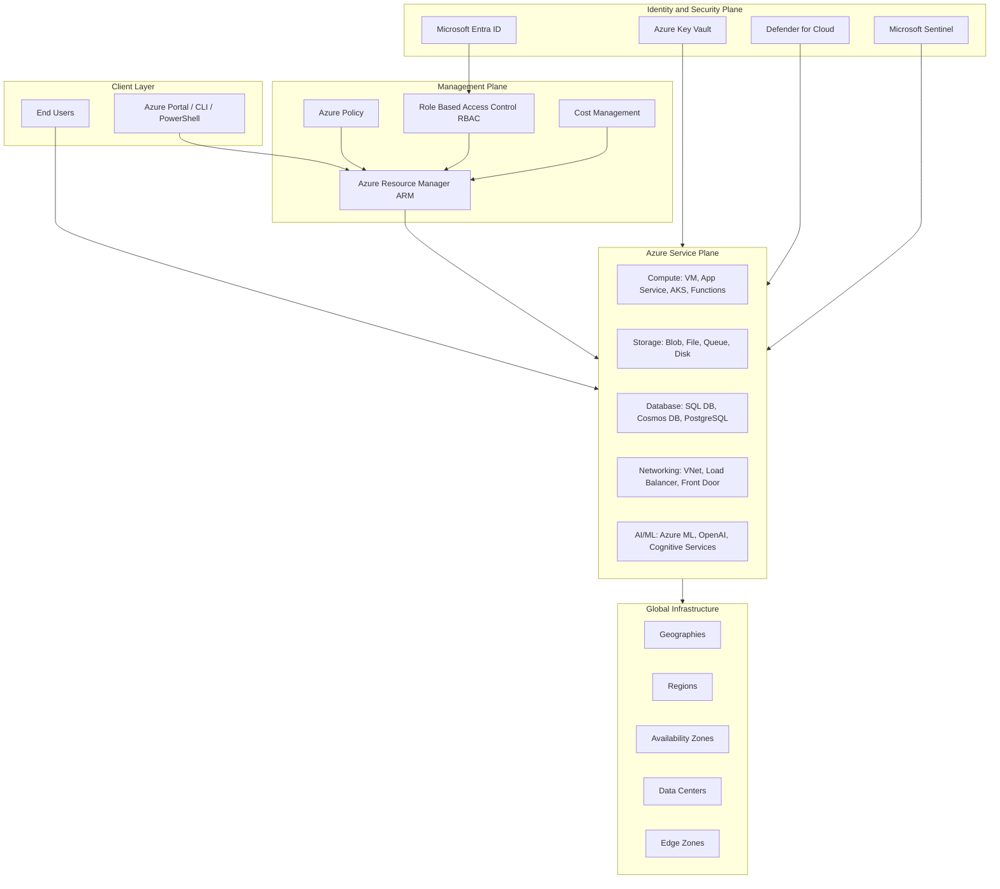
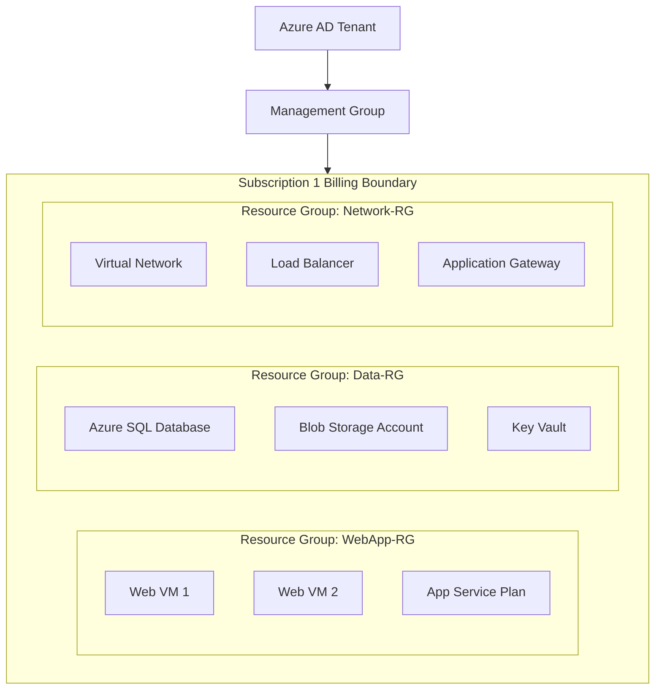
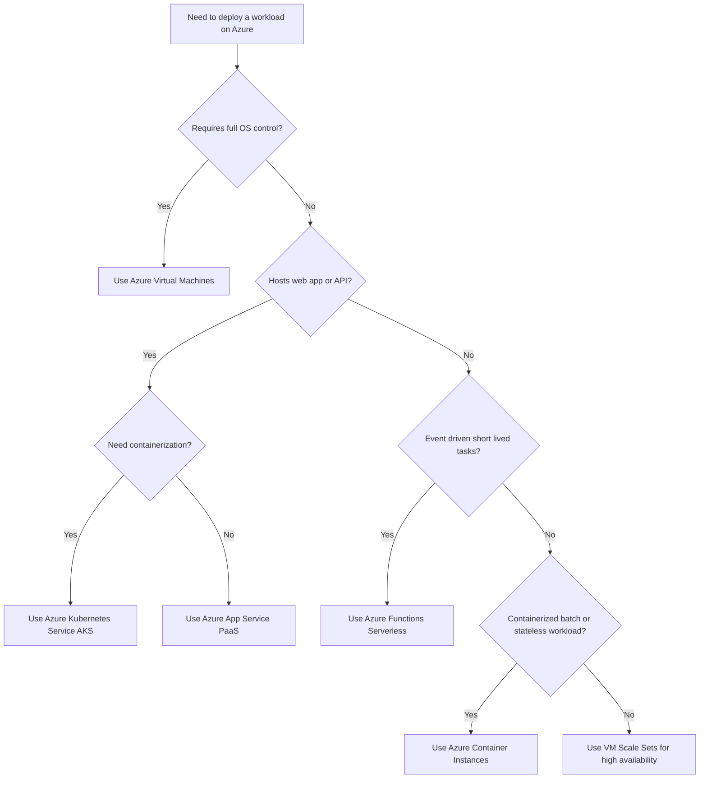
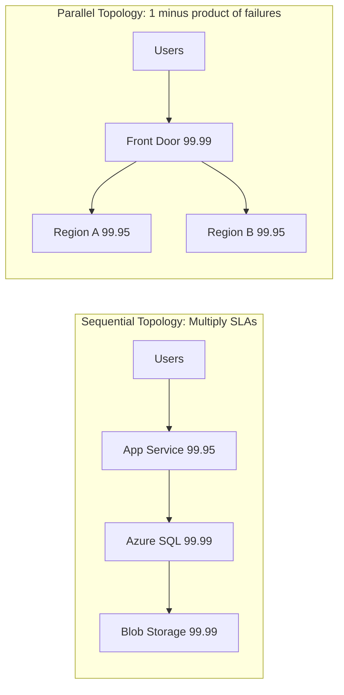
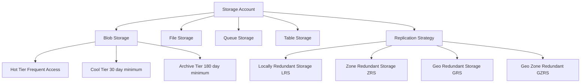

# Microsoft Cloud Services

<!-- SECTION_1_START -->

# Microsoft Cloud Services

## 1.1 Formal Academic Definition

**Microsoft Azure** (formerly Windows Azure) is the comprehensive public cloud computing platform and service offering from **Microsoft Corporation**, providing a broad spectrum of cloud services including compute, analytics, storage, and networking. According to the KTU 2024 Scheme OECST722 syllabus, Microsoft Cloud Services encompasses a suite of integrated tools—**Microsoft Azure**, **Microsoft 365**, **Dynamics 365**, and the **Power Platform**—designed to deliver scalable, enterprise-grade, pay-per-use computing resources over the public internet.

> [!NOTE]
> **KTU Syllabus Highlight (Module 4)**
> Microsoft Azure is positioned as a primary *Infrastructure-as-a-Service (IaaS)* and *Platform-as-a-Service (PaaS)* reference implementation in the OECST722 Cloud Computing curriculum. Students must understand its service categories, deployment models, and the Azure Resource Manager (ARM) framework.

> [!IMPORTANT]
> **Standardized Definition (NIST Aligned)**
> Per the **NIST SP 500-292** reference model, Microsoft Azure operates as a *Public Cloud* provider offering *on-demand self-service*, *broad network access*, *resource pooling*, *rapid elasticity*, and *measured service*—the five essential characteristics of cloud computing.

## 1.2 Conceptual Analogy & Intuition

Imagine Microsoft Azure as a **massive, global utility grid**—similar to an electrical power grid but for computing resources. Just as you plug a device into a wall socket to get electricity without owning a power plant, a developer "plugs" their application into Azure to get servers, databases, AI models, and storage without buying physical hardware.

### The Apartment Building Analogy

Think of Azure's resource organization like a **modern apartment complex**:

| Real-World Concept | Azure Equivalent | Function |
| :--- | :--- | :--- |
| Country | **Geography/Region** (e.g., East US, Central India) | Sovereign boundary, data residency |
| City | **Region** (e.g., South India, West Europe) | Geographical cluster of data centers |
| Neighborhood | **Availability Zone (AZ)** | Isolated data centers within a region |
| Building | **Virtual Network (VNet)** | Isolated networking boundary |
| Floor | **Subnet** | Network segmentation |
| Apartment | **Virtual Machine / App Service** | The actual compute resource |
| Tenant Account | **Subscription** | Billing and access boundary |
| Property Manager | **Azure Resource Manager (ARM)** | Orchestration and policy enforcement |
| Blueprint | **Resource Group (RG)** | Logical container for related assets |

> [!TIP]
> **Key Insight:** A **Resource Group** in Azure is *not* a physical grouping—it is a **logical container** that holds related resources for an application or workload, allowing them to be managed, deployed, and deleted as a single unit.

## 1.3 Core Terminology & Constants

- **Active Directory (Azure AD / Entra ID):** Microsoft's cloud-based identity and access management service, now branded as **Microsoft Entra ID**.
- **SLAs (Service Level Agreements):** Microsoft guarantees monthly uptime percentages—commonly **99.9%** ("Three Nines"), **99.95%**, or **99.99%** depending on the service tier.
- **Geographies:** Discrete markets (e.g., United States, Europe, Asia Pacific) containing one or more regions, used for data residency and compliance.

> [!VISUALIZATION CONTROL]
> **Concept:** Azure Hierarchical Organization
> **GeoGebra / Desmos Input Equations (Conceptual Axes):**
> * X-Axis (Management Plane): `Subscription → Resource Group → Resource`
> * Y-Axis (Physical Plane): `Geography → Region → Availability Zone → Data Center`
> **Visual Description:** Plot Azure's management hierarchy on one axis and the physical data center topology on the perpendicular axis. The intersection points represent the actual deployable assets. The graph visualizes how a single *Subscription* may span multiple *Regions*, and a *Resource Group* can contain VMs in different geographies.

## 1.4 Evolution Timeline

| Year | Milestone | Significance |
| :--- | :--- | :--- |
| 2008 | Internal project "Project Red Dog" announced | Conceptual origins at Microsoft |
| 2010 | **Windows Azure** commercially launched (Feb 1) | Initial PaaS-only offering |
| 2014 | Renamed to **Microsoft Azure** | Expanded to IaaS and full portfolio |
| 2018 | Microsoft becomes #1 in Gartner Magic Quadrant for Cloud | Industry recognition |
| 2020 | **Azure Arc** launched | Hybrid/multi-cloud management |
| 2022 | **Microsoft Entra ID** rebranding | Unified identity security |
| 2024 | **Azure OpenAI Service** GA expansion | Mainstream generative AI integration |

---

<!-- SECTION_1_END -->

<!-- SECTION_2_START -->

# Deep Theoretical Analysis & KTU High-Yield Formula Sheet

## 2.1 Microsoft Azure Service Categories

Microsoft Azure organizes its services into **primary service categories** aligned with industry cloud computing models (IaaS, PaaS, SaaS, FaaS). The KTU 2024 syllabus requires familiarity with the following:

### 2.1.1 Compute Services

Compute services provide processing power on demand. They range from raw virtual machines to fully managed serverless functions.

- **Azure Virtual Machines (VMs):** On-demand, scalable computing instances offering **IaaS**. Supports Windows, Linux, and custom OS images. Deployable via Azure Portal, CLI, PowerShell, or ARM templates.
- **Azure App Service:** A fully managed **PaaS** offering for hosting web apps, REST APIs, and mobile backends. Supports .NET, Java, Node.js, Python, PHP, and Ruby.
- **Azure Functions:** **FaaS (Function-as-a-Service)** event-driven serverless compute. Executes code in response to triggers (HTTP requests, queue messages, timers) without provisioning servers.
- **Azure Kubernetes Service (AKS):** Managed **container orchestration** using Kubernetes. Offloads operational overhead of cluster management to Microsoft.
- **Azure Container Instances (ACI):** Serverless containers—run containers without managing VMs or orchestrators.
- **Azure Virtual Machine Scale Sets (VMSS):** Auto-scaling groups of identical VMs for high-availability workloads.

### 2.1.2 Storage Services

Azure Storage is Microsoft's massively scalable, secure, and durable cloud storage solution, structured around **four primary data services**:

- **Azure Blob Storage:** Optimized for storing massive amounts of **unstructured data**—text, binary, images, videos, backups. Supports **Hot**, **Cool**, **Cold**, and **Archive** access tiers.
- **Azure File Storage:** Fully managed **SMB/NFS file shares** in the cloud. Mountable from on-premises or cloud deployments.
- **Azure Queue Storage:** Messaging store for reliable asynchronous communication between application components.
- **Azure Table Storage:** **NoSQL key-value** store for schemaless structured data.

Additionally, **Azure Disk Storage** provides persistent block-level storage for VMs (Premium SSD, Standard SSD, Standard HDD, Ultra Disk).

### 2.1.3 Database Services

- **Azure SQL Database:** Managed **relational database (PaaS)** based on Microsoft SQL Server engine.
- **Azure Cosmos DB:** Globally distributed, multi-model **NoSQL database** with **five consistency levels** (Strong, Bounded Staleness, Session, Consistent Prefix, Eventual). Guaranteed **single-digit millisecond** latency at the 99th percentile.
- **Azure Database for PostgreSQL/MySQL/MariaDB:** Managed open-source RDBMS instances.
- **Azure Synapse Analytics:** Enterprise data warehousing and big data analytics.

### 2.1.4 Networking Services

- **Azure Virtual Network (VNet):** Isolated private network in the cloud, the **fundamental building block** for Azure private networking.
- **Azure Load Balancer:** Layer-4 (TCP/UDP) load distribution across VMs.
- **Azure Application Gateway:** Layer-7 (HTTP/HTTPS) load balancer with **Web Application Firewall (WAF)** capabilities.
- **Azure Front Door:** Global Layer-7 load balancer with **CDN** and **Anycast** routing.
- **Azure ExpressRoute:** Private, dedicated high-bandwidth connection between on-premises datacenters and Azure (bypasses public internet).
- **Azure VPN Gateway:** Encrypted **IPsec/IKE** site-to-site or point-to-site VPN tunnels.
- **Azure DNS:** Hosted DNS domain name resolution service.
- **Azure CDN:** Content Delivery Network for global edge caching of static content.

### 2.1.5 Identity, Security & Compliance

- **Microsoft Entra ID (formerly Azure Active Directory):** Cloud-based identity provider. Supports **Multi-Factor Authentication (MFA)**, **Single Sign-On (SSO)**, **Conditional Access**, and **Role-Based Access Control (RBAC)**.
- **Azure Security Center / Microsoft Defender for Cloud:** Unified security posture management and threat protection.
- **Azure Key Vault:** Secure storage of **secrets**, **keys**, and **certificates** with **FIPS 140-2 Level 2** validated HSMs.
- **Azure Sentinel:** Cloud-native **SIEM (Security Information and Event Management)** and **SOAR (Security Orchestration Automated Response)** platform.
- **Azure Policy:** Enforces organizational standards and assesses compliance at scale.

### 2.1.6 AI/ML and Analytics

- **Azure Machine Learning:** Enterprise-grade ML lifecycle management—data preparation, model training, deployment, MLOps.
- **Azure Cognitive Services:** Pre-built AI APIs for **vision**, **speech**, **language**, **decision**, and **search**.
- **Azure OpenAI Service:** REST API access to OpenAI's large language models (GPT-4, GPT-4o, DALL-E, embeddings) with Azure's enterprise security and compliance.
- **Azure Databricks:** Apache Spark-based analytics platform optimized for Azure.

### 2.1.7 DevOps & Management

- **Azure DevOps:** End-to-end DevOps toolchain—**Azure Boards**, **Repos**, **Pipelines**, **Test Plans**, **Artifacts**.
- **Azure Resource Manager (ARM):** The **deployment and management service** for Azure. All Azure interactions go through ARM. Provides a consistent management layer.
- **Azure Monitor:** Full-stack observability—metrics, logs, traces.
- **Azure Cost Management + Billing:** Cost analysis, budgets, and recommendations.

## 2.2 Azure Architecture: The ARM Deployment Model

The **Azure Resource Manager (ARM)** is the orchestration and management layer for all Azure resources. Every API call, Portal action, and CLI command is processed through ARM. Its key features are:

1. **Declarative Templates:** Resources are defined in **JSON-based ARM templates** (or Bicep—a domain-specific language) describing the *desired end state* rather than imperative commands.
2. **Idempotency:** Deploying the same template multiple times yields the same result.
3. **Dependency Management:** ARM automatically determines the correct deployment order based on resource dependencies.
4. **Access Control:** RBAC is enforced at the ARM layer, providing **fine-grained, role-based** security.
5. **Tagging:** Resources can be tagged with **key-value pairs** for billing, organization, and policy enforcement.
6. **Consistent Management Layer:** Identical APIs and tools (Portal, PowerShell, CLI, SDKs, REST) regardless of the service.

## 2.3 Azure Deployment Models

Microsoft Azure supports **four primary deployment models** that categorize cloud adoption strategies:

| Deployment Model | Definition | Use Case | Control vs. Convenience |
| :--- | :--- | :--- | :--- |
| **Public Cloud** | Fully Azure-managed, shared infrastructure | Web apps, SaaS, scalable workloads | Low control / High convenience |
| **Private Cloud** | Dedicated Azure environment (Azure Stack Hub) | Regulated industries, edge computing | High control / Low convenience |
| **Hybrid Cloud** | Integration between on-premises and Azure | Legacy modernization, burst-to-cloud | Balanced |
| **Multi-Cloud** | Workloads distributed across Azure + AWS/GCP | Vendor diversification, best-of-breed | Architectural complexity |

### Azure Stack Family (Hybrid Extension)

- **Azure Stack Hub:** Extends Azure services to on-premises datacenters with disconnected operation.
- **Azure Stack HCI:** Hyperconverged infrastructure running Azure services on-premises.
- **Azure Stack Edge:** Hardware appliance with built-in AI/ML inference at the edge.

## 2.4 KTU High-Yield Formula Sheet

### 2.4.1 SLA & Availability Calculations

The **composite SLA** of an application is the **product** of its individual service SLAs.

$$SLA_{composite} = \prod_{i=1}^{n} SLA_i$$

**Downtime calculation** (per month, assuming 30 days = 720 hours):

$$Downtime_{monthly} = 720 \times (1 - SLA_{decimal})$$

**Azure's Hybrid Use Benefit (HUB) savings formula:**

$$Cost_{with\_HUB} = Cost_{pay\_as\_you\_go} \times (1 - Discount_{HUB})$$

where $Discount_{HUB} = 0.40$ (i.e., **40%** savings on Windows Server VMs with existing licenses).

**Storage redundancy formulas (LRS vs. GRS):**

$$Durability_{LRS} = 11 \text{ nines } (99.999999999\%)$$
$$Durability_{GRS} = 16 \text{ nines } (99.9999999999999\%)$$

**Cosmos DB consistency trade-off (linearizable vs. eventual):**

$$Latency_{Strong} > Latency_{Bounded} > Latency_{Session} > Latency_{ConsistentPrefix} > Latency_{Eventual}$$

### 2.4.2 Pricing Models (TCO / T-Shirt Sizes)

| Pricing Model | Description | Best For |
| :--- | :--- | :--- |
| **Pay-As-You-Go (PAYG)** | Per-second or per-hour billing | Variable workloads, dev/test |
| **Reserved Instances (RI)** | 1-year or 3-year commitment, up to **72%** savings | Predictable steady-state workloads |
| **Savings Plan** | Flexible 1-year or 3-year hourly commitment | Mixed compute services |
| **Spot VMs** | Up to **90%** discount using spare capacity | Fault-tolerant batch jobs |
| **Azure Hybrid Benefit** | Reuse existing on-prem licenses | License migration |

### 2.4.3 Core Service Reference Table

> [!IMPORTANT]
> In the markdown table below, mathematical set notations use `\vert` instead of the pipe character `|` to prevent markdown table syntax breakage.

| Service | Layer | Primary Protocol/Port | Use Case |
| :--- | :--- | :--- | :--- |
| Virtual Machines | IaaS | RDP (3389) \vert SSH (22) | Custom OS workloads |
| App Service | PaaS | HTTP (80) \vert HTTPS (443) | Web applications |
| Functions | FaaS | HTTP Triggers \vert Event Grid | Event-driven code |
| AKS | CaaS | kubectl (6443) | Container orchestration |
| Blob Storage | Storage | HTTPS (443) | Unstructured data |
| Cosmos DB | DBaaS | TCP (443) | Globally distributed NoSQL |
| Entra ID | IAM | HTTPS (443), SAML 2.0, OAuth 2.0 | Identity & SSO |
| Key Vault | Security | HTTPS (443) | Secret management |

## 2.5 Real-World Engineering Utility

Microsoft Azure is dominant in **enterprise IT** due to deep integration with the **Microsoft ecosystem**—Windows Server, Active Directory, SQL Server, Office 365, and .NET. Practical applications include:

- **Banking & Financial Services:** Core banking modernization on Azure (e.g., **Microsoft Fabric** for data lakehouse).
- **Healthcare:** HIPAA-compliant PHI hosting on Azure Health Data Services.
- **Gaming:** **Xbox Game Stack** and PlayFab multiplayer backends run on Azure, with Playwright's **144 services regions** globally.
- **AI/ML Production:** **OpenAI's ChatGPT** inference is hosted on Azure's AI supercomputers, leveraging NVIDIA H100 clusters.
- **IoT:** Azure IoT Hub manages millions of devices; Azure IoT Edge brings intelligence to the edge.

---

<!-- SECTION_2_END -->

<!-- SECTION_3_START -->

# Step-by-Step Derivations & Symbolic Implementation

## 3.1 Derivation: Composite SLA Calculation

A standard KTU problem involves an architecture with multiple Azure services, each with its own SLA. The application is only available if **all** dependent services are available.

**Problem Setup:**
An application uses the following Azure services:
- Azure App Service: SLA = **99.95%**
- Azure SQL Database: SLA = **99.99%**
- Azure Storage (GRS): SLA = **99.99%**

**Step 1:** Convert percentages to decimals.

$$SLA_{App} = 0.9995, \quad SLA_{SQL} = 0.9999, \quad SLA_{Storage} = 0.9999$$

**Step 2:** Apply the composite SLA formula (sequential/dependent services multiply):

$$SLA_{composite} = SLA_{App} \times SLA_{SQL} \times SLA_{Storage}$$

**Step 3:** Substitute the values:

$$SLA_{composite} = 0.9995 \times 0.9999 \times 0.9999$$

**Step 4:** Compute intermediate products:

$$0.9995 \times 0.9999 = 0.99940005$$

$$0.99940005 \times 0.9999 = 0.999300064995$$

**Step 5:** Express the result in percentage and round:

$$SLA_{composite} \approx 99.93\%$$

**Step 6:** Calculate monthly allowable downtime:

$$Downtime_{monthly} = 720 \times (1 - 0.999300064995)$$

$$= 720 \times 0.000699935005$$

$$= 0.50395 \text{ hours/month}$$

$$= 30.24 \text{ minutes/month}$$

> [!NOTE]
> **Logic Explanation:** When services are arranged **sequentially** (a request must pass through Service A, then B, then C), the system availability is the *product* of individual availabilities. This is analogous to probability in series circuits. Conversely, **parallel** (redundant) services use $1 - (1 - SLA_1)(1 - SLA_2)$.

## 3.2 Implementation: Azure Resource Deployment (ARM Template)

The following is a fully operational **ARM JSON template** that deploys a Linux Virtual Machine with its dependencies (VNet, Subnet, NIC, Public IP, NSG, OS Disk). Every parameter is exposed for reusability.

```json
{
  "$schema": "https://schema.management.azure.com/schemas/2019-04-01/deploymentTemplate.json#",
  "contentVersion": "1.0.0.0",
  "parameters": {
    "vmName": {
      "type": "string",
      "defaultValue": "ktuAzureVM",
      "metadata": { "description": "Name of the virtual machine." }
    },
    "adminUsername": {
      "type": "string",
      "metadata": { "description": "Admin username for the VM." }
    },
    "adminPassword": {
      "type": "securestring",
      "minLength": 12,
      "metadata": { "description": "Admin password (must be 12+ chars)." }
    },
    "vmSize": {
      "type": "string",
      "defaultValue": "Standard_B2s",
      "allowedValues": [
        "Standard_B1s",
        "Standard_B2s",
        "Standard_D2s_v3",
        "Standard_D4s_v3"
      ],
      "metadata": { "description": "Azure VM SKU." }
    },
    "ubuntuOSVersion": {
      "type": "string",
      "defaultValue": "22.04-LTS",
      "allowedValues": [
        "18.04-LTS",
        "20.04-LTS",
        "22.04-LTS"
      ]
    },
    "location": {
      "type": "string",
      "defaultValue": "[resourceGroup().location]"
    }
  },
  "variables": {
    "vnetName": "[concat(parameters('vmName'), '-vnet')]",
    "subnetName": "[concat(parameters('vmName'), '-subnet')]",
    "publicIPName": "[concat(parameters('vmName'), '-pip')]",
    "nicName": "[concat(parameters('vmName'), '-nic')]",
    "nsgName": "[concat(parameters('vmName'), '-nsg')]",
    "subnetRef": "[resourceId('Microsoft.Network/virtualNetworks/subnets', variables('vnetName'), variables('subnetName'))]"
  },
  "resources": [
    {
      "type": "Microsoft.Network/publicIPAddresses",
      "apiVersion": "2022-07-01",
      "name": "[variables('publicIPName')]",
      "location": "[parameters('location')]",
      "sku": { "name": "Standard" },
      "properties": {
        "publicIPAllocationMethod": "Static",
        "dnsSettings": { "domainNameLabel": "[toLower(parameters('vmName'))]" }
      }
    },
    {
      "type": "Microsoft.Network/networkSecurityGroups",
      "apiVersion": "2022-07-01",
      "name": "[variables('nsgName')]",
      "location": "[parameters('location')]",
      "properties": {
        "securityRules": [
          {
            "name": "Allow-SSH",
            "properties": {
              "priority": 1000,
              "protocol": "Tcp",
              "access": "Allow",
              "direction": "Inbound",
              "sourceAddressPrefix": "*",
              "sourcePortRange": "*",
              "destinationAddressPrefix": "*",
              "destinationPortRange": "22"
            }
          }
        ]
      }
    },
    {
      "type": "Microsoft.Network/virtualNetworks",
      "apiVersion": "2022-07-01",
      "name": "[variables('vnetName')]",
      "location": "[parameters('location')]",
      "dependsOn": [ "[resourceId('Microsoft.Network/networkSecurityGroups', variables('nsgName'))]" ],
      "properties": {
        "addressSpace": { "addressPrefixes": [ "10.0.0.0/16" ] },
        "subnets": [
          {
            "name": "[variables('subnetName')]",
            "properties": {
              "addressPrefix": "10.0.1.0/24",
              "networkSecurityGroup": {
                "id": "[resourceId('Microsoft.Network/networkSecurityGroups', variables('nsgName'))]"
              }
            }
          }
        ]
      }
    },
    {
      "type": "Microsoft.Network/networkInterfaces",
      "apiVersion": "2022-07-01",
      "name": "[variables('nicName')]",
      "location": "[parameters('location')]",
      "dependsOn": [
        "[resourceId('Microsoft.Network/publicIPAddresses', variables('publicIPName'))]",
        "[resourceId('Microsoft.Network/virtualNetworks', variables('vnetName'))]"
      ],
      "properties": {
        "ipConfigurations": [
          {
            "name": "ipconfig1",
            "properties": {
              "privateIPAllocationMethod": "Dynamic",
              "publicIPAddress": { "id": "[resourceId('Microsoft.Network/publicIPAddresses', variables('publicIPName'))]" },
              "subnet": { "id": "[variables('subnetRef')]" }
            }
          }
        ]
      }
    },
    {
      "type": "Microsoft.Compute/virtualMachines",
      "apiVersion": "2022-11-01",
      "name": "[parameters('vmName')]",
      "location": "[parameters('location')]",
      "dependsOn": [ "[resourceId('Microsoft.Network/networkInterfaces', variables('nicName'))]" ],
      "properties": {
        "hardwareProfile": { "vmSize": "[parameters('vmSize')]" },
        "osProfile": {
          "computerName": "[parameters('vmName')]",
          "adminUsername": "[parameters('adminUsername')]",
          "adminPassword": "[parameters('adminPassword')]"
        },
        "storageProfile": {
          "imageReference": {
            "publisher": "Canonical",
            "offer": "0001-com-ubuntu-server-jammy",
            "sku": "[parameters('ubuntuOSVersion')]",
            "version": "latest"
          },
          "osDisk": {
            "createOption": "FromImage",
            "managedDisk": { "storageAccountType": "Premium_LRS" }
          }
        },
        "networkProfile": {
          "networkInterfaces": [
            { "id": "[resourceId('Microsoft.Network/networkInterfaces', variables('nicName'))]" }
          ]
        }
      }
    }
  ]
}
```

## 3.3 Implementation: Python SDK for Azure VM Lifecycle Management

The following script provides full lifecycle management of an Azure VM (create, start, stop, deallocate, delete) using the **Azure Python SDK (`azure-mgmt-compute`)**. Includes strict error handling and type hints.

```python
"""
Azure VM Lifecycle Manager - KTU Reference Implementation
Module 4: Microsoft Cloud Services
"""
from typing import Optional, Dict, Any
import logging
from azure.identity import DefaultAzureCredential
from azure.mgmt.compute import ComputeManagementClient
from azure.mgmt.resource import ResourceManagementClient
from azure.core.exceptions import (
    ResourceNotFoundError,
    AzureError,
    HttpResponseError,
)

# Configure structured logging
logging.basicConfig(
    level=logging.INFO,
    format="%(asctime)s - %(name)s - %(levelname)s - %(message)s",
)
logger = logging.getLogger("AzureVMLifecycleManager")


class AzureVMLifecycleManager:
    """Manages the full lifecycle of an Azure Virtual Machine."""

    def __init__(
        self,
        subscription_id: str,
        resource_group: str,
        location: str = "eastus",
    ) -> None:
        if not subscription_id or not resource_group:
            raise ValueError("subscription_id and resource_group are mandatory.")
        self.subscription_id: str = subscription_id
        self.resource_group: str = resource_group
        self.location: str = location
        try:
            self.credential = DefaultAzureCredential()
            self.compute_client: ComputeManagementClient = ComputeManagementClient(
                self.credential, self.subscription_id
            )
            self.resource_client: ResourceManagementClient = ResourceManagementClient(
                self.credential, self.subscription_id
            )
            logger.info(
                "Initialized Azure clients for subscription %s in region %s",
                subscription_id,
                location,
            )
        except AzureError as e:
            logger.error("Failed to initialize Azure clients: %s", e)
            raise

    def get_vm_status(self, vm_name: str) -> Optional[str]:
        """Returns the current power state of the VM, or None if not found."""
        try:
            instance = self.compute_client.virtual_machines.get(
                self.resource_group, vm_name
            )
            return instance.provisioning_state
        except ResourceNotFoundError:
            logger.warning("VM %s not found in resource group %s.", vm_name, self.resource_group)
            return None
        except HttpResponseError as e:
            logger.error("HTTP error retrieving VM %s: %s", vm_name, e)
            return None

    def start_vm(self, vm_name: str) -> Dict[str, Any]:
        """Starts a stopped (deallocated) VM."""
        try:
            logger.info("Starting VM %s...", vm_name)
            async_poller = self.compute_client.virtual_machines.begin_start(
                self.resource_group, vm_name
            )
            result = async_poller.result()
            logger.info("VM %s start operation completed.", vm_name)
            return {"status": "success", "vm": vm_name, "operation": "start", "result": str(result)}
        except ResourceNotFoundError:
            return {"status": "error", "message": f"VM {vm_name} not found."}
        except HttpResponseError as e:
            return {"status": "error", "message": str(e)}

    def stop_vm(self, vm_name: str, deallocate: bool = True) -> Dict[str, Any]:
        """Stops (and optionally deallocates) a running VM."""
        try:
            logger.info("Stopping VM %s (deallocate=%s)...", vm_name, deallocate)
            async_poller = self.compute_client.virtual_machines.begin_power_off(
                self.resource_group, vm_name, skip_shutdown=not deallocate
            )
            async_poller.result()
            return {"status": "success", "vm": vm_name, "operation": "stop"}
        except ResourceNotFoundError:
            return {"status": "error", "message": f"VM {vm_name} not found."}
        except HttpResponseError as e:
            return {"status": "error", "message": str(e)}

    def delete_vm(self, vm_name: str) -> Dict[str, Any]:
        """Deletes the VM and all attached disks (delete_option='Delete')."""
        try:
            logger.info("Deleting VM %s...", vm_name)
            async_poller = self.compute_client.virtual_machines.begin_delete(
                self.resource_group, vm_name
            )
            async_poller.result()
            logger.info("VM %s deleted successfully.", vm_name)
            return {"status": "success", "vm": vm_name, "operation": "delete"}
        except ResourceNotFoundError:
            return {"status": "error", "message": f"VM {vm_name} not found."}
        except HttpResponseError as e:
            return {"status": "error", "message": str(e)}

    def list_all_vms(self) -> list:
        """Lists all VMs in the resource group."""
        try:
            vms = self.compute_client.virtual_machines.list(self.resource_group)
            return [
                {
                    "name": vm.name,
                    "location": vm.location,
                    "vm_size": vm.hardware_profile.vm_size,
                    "os": vm.storage_profile.image_reference.offer if vm.storage_profile.image_reference else "Unknown",
                }
                for vm in vms
            ]
        except HttpResponseError as e:
            logger.error("Failed to list VMs: %s", e)
            return []


# Example usage
if __name__ == "__main__":
    manager = AzureVMLifecycleManager(
        subscription_id="00000000-0000-0000-0000-000000000000",
        resource_group="ktu-cloud-rg",
        location="centralindia",
    )
    print("VM Status:", manager.get_vm_status("ktuAzureVM"))
    print("Listed VMs:", manager.list_all_vms())
    print(manager.start_vm("ktuAzureVM"))
```

## 3.4 Bicep (Modern ARM DSL) Equivalent

The same VM can be deployed with the modern **Bicep** language, which is more concise:

```bicep
@description('Name of the virtual machine.')
param vmName string = 'ktuAzureVM'

@description('Admin username for the VM.')
param adminUsername string

@description('Admin password for the VM (12+ characters).')
@secure()
param adminPassword string

@description('Azure region for deployment.')
param location string = resourceGroup().location

@description('Size of the VM.')
@allowed([
  'Standard_B1s'
  'Standard_B2s'
  'Standard_D2s_v3'
])
param vmSize string = 'Standard_B2s'

var vnetName = '${vmName}-vnet'
var subnetName = '${vmName}-subnet'
var publicIPName = '${vmName}-pip'
var nicName = '${vmName}-nic'
var nsgName = '${vmName}-nsg'

resource publicIP 'Microsoft.Network/publicIPAddresses@2022-07-01' = {
  name: publicIPName
  location: location
  sku: { name: 'Standard' }
  properties: {
    publicIPAllocationMethod: 'Static'
    dnsSettings: { domainNameLabel: toLower(vmName) }
  }
}

resource nsg 'Microsoft.Network/networkSecurityGroups@2022-07-01' = {
  name: nsgName
  location: location
  properties: {
    securityRules: [
      {
        name: 'Allow-SSH'
        properties: {
          priority: 1000
          protocol: 'Tcp'
          access: 'Allow'
          direction: 'Inbound'
          sourceAddressPrefix: '*'
          sourcePortRange: '*'
          destinationAddressPrefix: '*'
          destinationPortRange: '22'
        }
      }
    ]
  }
}

resource vnet 'Microsoft.Network/virtualNetworks@2022-07-01' = {
  name: vnetName
  location: location
  properties: {
    addressSpace: { addressPrefixes: [ '10.0.0.0/16' ] }
    subnets: [
      {
        name: subnetName
        properties: {
          addressPrefix: '10.0.1.0/24'
          networkSecurityGroup: { id: nsg.id }
        }
      }
    ]
  }
}

resource nic 'Microsoft.Network/networkInterfaces@2022-07-01' = {
  name: nicName
  location: location
  properties: {
    ipConfigurations: [
      {
        name: 'ipconfig1'
        properties: {
          privateIPAllocationMethod: 'Dynamic'
          publicIPAddress: { id: publicIP.id }
          subnet: { id: '${vnet.id}/subnets/${subnetName}' }
        }
      }
    ]
  }
}

resource vm 'Microsoft.Compute/virtualMachines@2022-11-01' = {
  name: vmName
  location: location
  properties: {
    hardwareProfile: { vmSize: vmSize }
    osProfile: {
      computerName: vmName
      adminUsername: adminUsername
      adminPassword: adminPassword
    }
    storageProfile: {
      imageReference: {
        publisher: 'Canonical'
        offer: '0001-com-ubuntu-server-jammy'
        sku: '22_04-lts-gen2'
        version: 'latest'
      }
      osDisk: {
        createOption: 'FromImage'
        managedDisk: { storageAccountType: 'Premium_LRS' }
      }
    }
    networkProfile: {
      networkInterfaces: [ { id: nic.id } ]
    }
  }
}
```

---

<!-- SECTION_3_END -->

<!-- SECTION_4_START -->

# Structural Diagrams & Schematics

## 4.1 Microsoft Azure High-Level Architecture



## 4.2 Azure Resource Hierarchy (Subscription → Resource Group → Resource)



## 4.3 Azure Compute Service Decision Topology



## 4.4 Composite SLA: Sequential vs. Parallel Topology



## 4.5 Azure Storage Account Topology Matrix



---

<!-- SECTION_4_END -->

<!-- SECTION_5_START -->

# KTU 2024 Scheme Examination Question Bank & Topic Recap

## PART A: Short Answer Questions (2 × 3 Marks = 6 Marks)

### Question 1 [KTU University Exam - July 2024]
**Q: List any three service models supported by Microsoft Azure with one example service for each.**

**Model Answer (Valuation Key):**
- **Infrastructure as a Service (IaaS):** Azure Virtual Machines – provides on-demand, scalable computing instances with full OS control. **[1 Mark]**
- **Platform as a Service (PaaS):** Azure App Service – a fully managed platform for hosting web applications, REST APIs, and mobile back-ends without managing infrastructure. **[1 Mark]**
- **Software as a Service (SaaS):** Microsoft 365 (Office 365) – a complete, ready-to-use productivity suite (Word, Excel, Teams) delivered over the internet. **[1 Mark]**

*(Acceptable: FaaS with Azure Functions, DBaaS with Azure SQL Database, CaaS with AKS – partial credit awarded.)*

### Question 2 [KTU University Exam - Dec 2023]
**Q: Differentiate between Azure Public Cloud, Private Cloud, and Hybrid Cloud. List one Azure service for each.**

**Model Answer:**

| Model | Definition | Azure Service Example |
| :--- | :--- | :--- |
| **Public Cloud** | Services delivered over the public internet from shared multi-tenant infrastructure. | Azure Virtual Machines **[1 Mark]** |
| **Private Cloud** | Dedicated, isolated cloud environment for a single organization. | Azure Stack Hub **[1 Mark]** |
| **Hybrid Cloud** | Seamless integration between on-premises infrastructure and public cloud. | Azure Arc / Azure Stack HCI **[1 Mark]** |

---

## PART B: Long Answer Questions (Choice-based, 14 Marks each)

### Question A (Choice 1) [KTU University Exam - Dec 2024]

**Q: (a)** Explain the major service categories of Microsoft Azure in detail. Discuss compute, storage, networking, and database services with suitable examples. **[7 Marks]**

**(b)** A web application is deployed on Azure using the following services: **Azure App Service** (SLA 99.95%), **Azure SQL Database** (SLA 99.99%), and **Azure Blob Storage (GRS)** (SLA 99.99%). Calculate the **composite SLA** of the application and the **maximum allowable monthly downtime** in minutes. **[7 Marks]**

---

### Solution A (a) — Major Azure Service Categories [7 Marks]

**Valuation Key — Incremental Marks:**

- **1. Compute Services [2 Marks]:**
  Azure offers a layered compute portfolio: **Azure Virtual Machines (IaaS)** for full OS control; **Azure App Service (PaaS)** for managed web app hosting; **Azure Kubernetes Service (AKS)** for container orchestration; **Azure Functions (FaaS)** for event-driven serverless code; **Azure Container Instances (ACI)** for serverless container workloads.

- **2. Storage Services [2 Marks]:**
  Four core data services: **Azure Blob Storage** for unstructured object data (images, videos, backups) with Hot/Cool/Cold/Archive tiers; **Azure File Storage** for SMB/NFS cloud file shares; **Azure Queue Storage** for asynchronous messaging; **Azure Disk Storage** for VM persistent disks (Premium SSD, Standard SSD, Ultra Disk).

- **3. Networking Services [1.5 Marks]:**
  **Virtual Network (VNet)** is the private network foundation; **Load Balancer** for Layer-4 traffic distribution; **Application Gateway** for Layer-7 with WAF; **Azure Front Door** for global Layer-7 routing with CDN; **VPN Gateway** for encrypted site-to-site connectivity; **ExpressRoute** for dedicated private connections.

- **4. Database Services [1.5 Marks]:**
  **Azure SQL Database** is a managed PaaS RDBMS; **Azure Cosmos DB** is a globally distributed multi-model NoSQL with five consistency levels; **Azure Database for PostgreSQL/MySQL** are managed open-source RDBMS; **Azure Synapse Analytics** is the enterprise data warehouse.

---

### Solution A (b) — Composite SLA Calculation [7 Marks]

**Step 1 — Identify given SLAs [1 Mark]:**
$$SLA_{App} = 99.95\% = 0.9995$$
$$SLA_{SQL} = 99.99\% = 0.9999$$
$$SLA_{Blob} = 99.99\% = 0.9999$$

**Step 2 — Apply composite SLA formula for sequential dependency [2 Marks]:**
$$SLA_{composite} = SLA_{App} \times SLA_{SQL} \times SLA_{Blob}$$
$$SLA_{composite} = 0.9995 \times 0.9999 \times 0.9999$$

**Step 3 — Compute numerically [2 Marks]:**
$$0.9995 \times 0.9999 = 0.99940005$$
$$0.99940005 \times 0.9999 = 0.999300064995$$
$$SLA_{composite} \approx 99.93\%$$

**Step 4 — Calculate monthly downtime in minutes [2 Marks]:**
$$Downtime_{monthly} = 720 \text{ hours} \times (1 - 0.999300064995)$$
$$= 720 \times 0.000699935005 \text{ hours}$$
$$= 0.50395 \text{ hours}$$
$$= 0.50395 \times 60 \approx 30.24 \text{ minutes per month}$$

**Final Answer:** $SLA_{composite} \approx 99.93\%$, monthly downtime $\approx 30.24$ minutes. **[Final simplified answer: 0 Marks for plain answer; partial marks already allotted above]**

> [!WARNING]
> **KTU Examiner's Valuation Warning:**
> - Students frequently forget to **convert percentage to decimal** before multiplication — losing 1 Mark.
> - Some students add SLAs instead of multiplying them. **Always multiply for sequential dependencies.**
> - Monthly downtime must be in **minutes or hours**, not "days." Ensure the unit is clearly stated.

---

### Question B (Choice 2) [KTU University Exam - July 2024]

**Q: (a)** What is Azure Resource Manager (ARM)? Explain its key features and the four entities of the Azure resource hierarchy. **[7 Marks]**

**(b)** Compare **Azure Blob Storage**, **Azure File Storage**, **Azure Queue Storage**, and **Azure Table Storage** in terms of data type, use case, and access protocol. Mention the four access tiers of Blob Storage. **[7 Marks]**

---

### Solution B (a) — Azure Resource Manager (ARM) [7 Marks]

**Definition [2 Marks]:**
**Azure Resource Manager (ARM)** is the deployment and management service for Azure that provides a consistent management layer for creating, updating, and deleting resources in an Azure subscription. Every Azure interaction—whether through the Portal, CLI, PowerShell, SDKs, or REST APIs—is processed through ARM.

**Key Features [3 Marks]:**
- **Declarative Templates:** Resources are defined in JSON ARM templates or Bicep files describing the desired end state.
- **Idempotency:** Repeated deployments of the same template yield identical results.
- **Dependency Management:** ARM auto-orders resources based on `dependsOn` relationships and inferred dependencies.
- **Role-Based Access Control (RBAC):** Fine-grained, identity-based security is integrated at the ARM layer.
- **Tagging:** Resources can be tagged with key-value pairs for cost tracking, policy, and management.
- **Consistent API:** The same APIs work for all Azure services regardless of their underlying provider.

**Four Entities of the Azure Resource Hierarchy [2 Marks]:**
1. **Management Groups** — Top-level containers that organize subscriptions for unified policy and access management.
2. **Subscriptions** — Billing and access boundary units linked to an Azure AD/Entra ID tenant.
3. **Resource Groups (RG)** — Logical containers grouping related resources for a workload (NOT a physical boundary).
4. **Resources** — Individual manageable items (VMs, databases, VNets) — instances of resource types provided by resource providers.

---

### Solution B (b) — Azure Storage Services Comparison [7 Marks]

**Comparison Table [5 Marks]:**

| Service | Data Type | Use Case | Access Protocol |
| :--- | :--- | :--- | :--- |
| **Blob Storage** | Unstructured object data (text, binary, images, video) | Media storage, backups, data lakes, log archival | HTTPS REST (`blob.core.windows.net`) |
| **File Storage** | Structured file shares (SMB/NFS) | Lift-and-shift legacy file servers, shared dev environments | SMB 3.0, NFS 4.1, REST |
| **Queue Storage** | Small messages (<= 64 KB) | Decoupling application components, async messaging | HTTPS REST |
| **Table Storage** | NoSQL key-value / schemaless flexible datasets | Lightweight structured data, IoT telemetry, session state | HTTPS REST (OData) |

**Four Blob Access Tiers [2 Marks]:**
1. **Hot Tier** — Optimized for frequent read/write access. Highest storage cost, lowest access cost.
2. **Cool Tier** — Infrequent access (>= 30 days retention). Lower storage cost, higher access cost.
3. **Cold Tier** — Rarely accessed (>= 90 days retention). Even lower storage cost, higher access cost.
4. **Archive Tier** — Almost never accessed (>= 180 days retention). Lowest storage cost, highest rehydration cost and latency (hours).

> [!WARNING]
> **KTU Examiner's Valuation Warning:**
> - In the comparison table, students often confuse **Queue** and **Table** storage. **Remember:** Queues store *messages* (typically consumed once); Tables store *entities* (queried by key).
> - For Blob tiers, students frequently **miss the minimum retention period** (Cool=30, Cold=90, Archive=180 days). Early deletion incurs penalty fees — this is a common 1-Mark deduction.
> - For ARM, students sometimes confuse **Resource Groups** with **physical regions** — RGs are *logical*, not *physical*, containers.

---

## Topic Recap & Important Things to Remember

- **Microsoft Azure** is Microsoft's public cloud platform offering IaaS, PaaS, SaaS, and FaaS services across **60+ regions** worldwide.
- **Azure Resource Manager (ARM)** is the unified management layer for all Azure resources; supports **declarative JSON/Bicep templates** with idempotency.
- **Resource hierarchy (4 levels):** Management Group → Subscription → Resource Group → Resource.
- **Compute services to remember:** VM (IaaS), App Service (PaaS), AKS (CaaS), Functions (FaaS), ACI (Serverless Containers), VMSS (Auto-scaling).
- **Storage services (4 types):** Blob (unstructured objects), File (SMB/NFS shares), Queue (messaging), Table (NoSQL key-value).
- **Blob access tiers (4):** Hot, Cool (>=30d), Cold (>=90d), Archive (>=180d).
- **Database services:** Azure SQL (PaaS RDBMS), Cosmos DB (globally distributed multi-model NoSQL with **5 consistency levels**), managed PostgreSQL/MySQL.
- **Networking core:** VNet is the foundation; Load Balancer = L4, Application Gateway = L7+WAF, Front Door = Global L7+CDN, ExpressRoute = private dedicated link.
- **Identity:** **Microsoft Entra ID** (formerly Azure AD) provides SSO, MFA, Conditional Access, and RBAC.
- **Composite SLA formula:** For sequential services — $SLA_{composite} = \prod_{i=1}^{n} SLA_i$. **Always multiply, never add.**
- **Monthly downtime formula:** $Downtime_{monthly} = 720 \times (1 - SLA_{decimal})$ hours.
- **Replication types (4):** LRS (11 nines, single datacenter), ZRS (12 nines, single region across AZs), GRS (16 nines, geo-redundant), GZRS (highest durability).
- **Hybrid extension:** **Azure Stack Hub** (disconnected on-prem), **Azure Stack HCI** (hyperconverged), **Azure Stack Edge** (AI at the edge).
- **Pricing options:** Pay-As-You-Go, Reserved Instances (up to **72%** savings), Savings Plans, Spot VMs (up to **90%** off), Azure Hybrid Benefit (**40%** Windows savings).
- **AI services:** Azure OpenAI Service (GA with GPT-4o, DALL-E), Azure ML, Cognitive Services (Vision, Speech, Language, Decision, Search).
- **DevOps toolchain:** Azure DevOps = Boards + Repos + Pipelines + Test Plans + Artifacts.

<!-- SECTION_5_END -->
