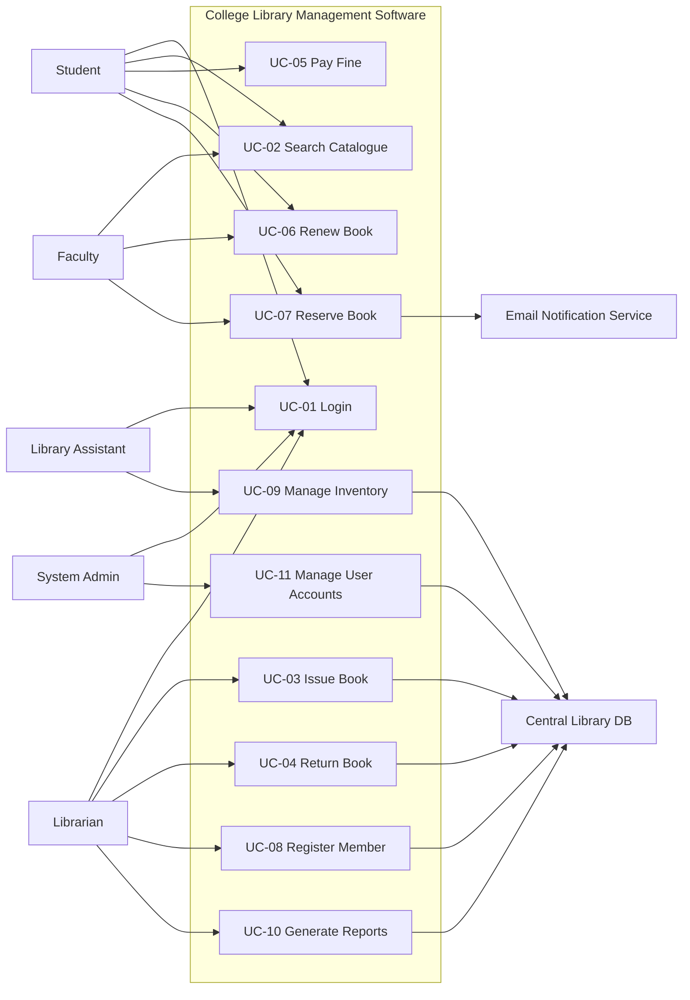
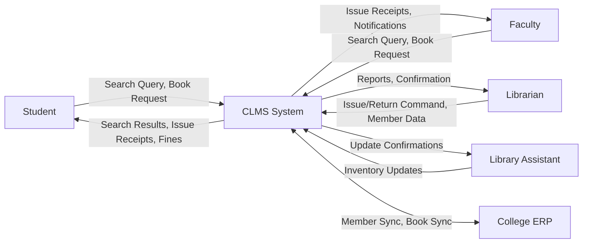
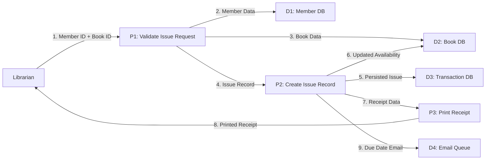
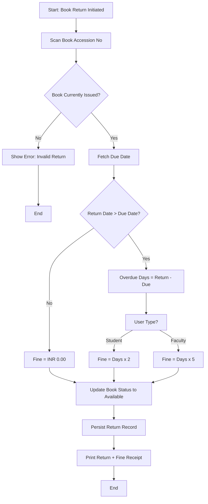
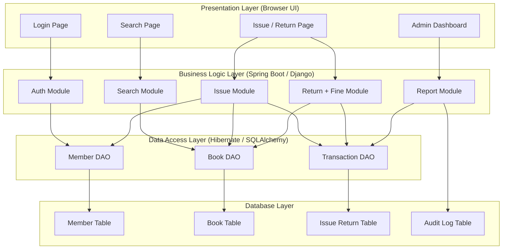

# Case study:  SRS for College Library Management Software

<!-- SECTION_1_START -->
# Case Study: SRS for College Library Management Software (CLMS)

## 1.1 Formal Academic Definition (KTU 2024 Syllabus Terminology)

> [!NOTE]
> **Software Requirements Specification (SRS)** is a formal document that completely describes the **external behaviour** of the software system, the **functional and non-functional requirements**, the **performance constraints**, and the **interfaces** that the system must satisfy. As per **IEEE Standard 830-1998**, the SRS serves as the *contract* between the **developer** and the **client** and is the baseline against which the software is validated and accepted.

For the **College Library Management Software (CLMS)** case study, the SRS document captures every requirement needed to automate the daily operations of a college library — such as book issue, return, fine calculation, catalogue search, member registration, and report generation.

> [!IMPORTANT]
> **KTU 2024 Module 1 Outcome Mapping:** This case study directly satisfies *CO1* — *“Comprehend the phases, models, and the role of requirements engineering in the software development life cycle.”* The SRS is the **tangible artifact** of the Requirements Engineering phase.

---

## 1.2 Intuitive Overview — The "Building Blueprint" Analogy

Imagine you want to construct a **house**. Before the mason lays a single brick, an **architect** draws a *blueprint* containing:

- The number of rooms, their size, position of doors and windows.
- The type of material (cement grade, steel TMT bar diameter).
- Electrical wiring layout, plumbing constraints, and ventilation rules.

Without this blueprint, the construction team will *guess*, leading to demolitions, cost overruns, and a house that no one wants. The **SRS plays exactly this role for software**. It is the architectural blueprint of the **College Library Management Software**.

> [!TIP]
> **Plain-English Intuition:** Think of the SRS as the *"instruction manual written BEFORE the product is built"*. It tells the programmer **what to build**, tells the tester **what to verify**, and tells the client **what to expect**. If the SRS is wrong, the software is wrong — no matter how brilliant the code is.

### Why CLMS as a Case Study?

A College Library is a domain that **every B.Tech student has personally interacted with**. Therefore, requirements elicitation becomes *intuitive*, allowing focus on the **engineering discipline of writing the SRS** rather than on understanding an unknown business domain. It is a classic pedagogical example used in *Sommerville's "Software Engineering" (10th Ed.)* and *Pressman's "Software Engineering: A Practitioner's Approach" (8th Ed.)*, both of which are KTU-recommended textbooks.

---

## 1.3 Standard Metrics & IEEE References

> [!IMPORTANT]
> **Key Constants & Standards in SRS Engineering:**
> - **IEEE 830-1998** — Recommended Practice for Software Requirements Specifications.
> - **ISO/IEC/IEEE 29148:2018** — The modern successor replacing IEEE 830.
> - **Functional Requirements (FR)** — Typically constitute **60–70 %** of an SRS document volume.
> - **Non-Functional Requirements (NFR)** — Typically **20–30 %**, but consume **40 % of rework cost** if missed.
> - **Requirement Stability Index (RSI)** = $\dfrac{\text{Number of unchanged requirements}}{\text{Total number of requirements}} \times 100\%$ — A metric used to track how stable the SRS remains across iterations.

---

## 1.4 GeoGebra / Process Visualization Block

> [!VISUALIZATION CONTROL]
> **Concept:** *Position of the SRS in the Software Development Life Cycle (SDLC) Waterfall*
> **Visual Description:** A vertical stacked layer showing the *Feasibility Study* at the bottom, followed by *Requirements Specification (SRS)*, then *Design*, *Coding*, *Testing*, and *Maintenance* at the top. The SRS sits in the *lower-third foundation layer* of the entire development pyramid.
> **Coordinate-plane analogy:** Plot *Time* on the $X$-axis and *Cost of Change* on the $Y$-axis. The SRS appears in the **early low-cost region** of the curve, where the slope of the exponential cost-of-change curve is still gentle.

---
<!-- SECTION_1_END -->

<!-- SECTION_2_START -->
# Deep Theoretical Analysis — Anatomy of an SRS for CLMS

## 2.1 The IEEE 830 Structural Template

According to **IEEE 830-1998**, an SRS for a College Library Management Software must contain the following logical sections. Each section has a specific engineering purpose:

1. **Introduction**
   1.1 Purpose
   1.2 Document Conventions
   1.3 Intended Audience and Reading Suggestions
   1.4 Scope of the Project
   1.5 References

2. **Overall Description**
   2.1 Product Perspective
   2.2 Product Functions
   2.3 User Classes and Characteristics
   2.4 Operating Environment
   2.5 Design and Implementation Constraints
   2.6 Assumptions and Dependencies

3. **Specific Requirements** (The core engineering part)
   3.1 Functional Requirements
   3.2 Non-Functional Requirements
   3.3 External Interface Requirements
   3.4 Performance Requirements

---

## 2.2 Functional vs Non-Functional Requirements — The "What vs How Well" Distinction

> [!IMPORTANT]
> - **Functional Requirements (FR):** Define *what the system must do*. They describe specific behaviours, inputs, outputs, and interactions. Example for CLMS: *"The system shall allow a librarian to issue a book to a registered student."*
> - **Non-Functional Requirements (NFR):** Define *how well the system must perform* the functions. They are qualities, constraints, and performance metrics. Example for CLMS: *"The book search query shall return results within **2 seconds** for a database of up to 50,000 records."*

The KTU examiner frequently tests the student's ability to *classify* a given requirement statement as Functional or Non-Functional. This is a **3-mark favourite** in Part A.

---

## 2.3 User Classes (Stakeholders) in CLMS

| User Class | Skill Level | Primary Use |
|---|---|---|
| **Student** | Basic computer literacy | Search catalogue, view issued books, check due dates |
| **Faculty Member** | Basic computer literacy | Same as student + request inter-library loans |
| **Librarian** | Advanced | Issue/return books, manage inventory, generate reports |
| **Library Assistant** | Moderate | Add new book records, update member information |
| **System Administrator** | Expert | User account management, backup, audit logs |

---

## 2.4 KTU High-Yield Formula / Structure Cheat Sheet

| SRS Component | Engineering Definition | Example for CLMS |
|---|---|---|
| **Purpose** | One-sentence project goal | *"To automate daily library operations and reduce manual record-keeping errors."* |
| **Scope** | Boundaries of the system | *"Covers book issue, return, fine, search; excludes digital e-book hosting."* |
| **External Interface** | Hardware, software, user, comm. interfaces | *"GUI on Windows 11; MySQL 8.0 backend; LAN connectivity."* |
| **Functional Req. ID** | Unique identifier | **FR-1, FR-2, ... FR-n** |
| **Non-Functional Req. ID** | Unique identifier | **NFR-1, NFR-2, ... NFR-n** |
| **Use Case ID** | Unique identifier | **UC-01, UC-02, ...** |
| **Use Case Actors** | External entities interacting with system | Student, Librarian, Admin, Database |
| **Pre-condition** | State required before use case begins | *"Student must be logged in."* |
| **Post-condition** | State after successful completion | *"Book issue record is persisted in DB."* |
| **Main Flow** | Happy path sequence of steps | Step 1 → Step 2 → ... → Step n |
| **Alternate Flow** | Exception / error path | *"If book not available, show 'Out of Stock' message."* |
| **Performance Metric** | Quantitative measure | Response time $\le 2$ s, uptime $\ge 99.5\%$, concurrent users $= 200$ |

---

## 2.5 Real-World Utility of an SRS

In the **software industry**, the SRS is not academic paperwork. It is used to:

- **Anchor legal contracts** — Most SLAs (Service Level Agreements) reference the SRS to define acceptance.
- **Drive test case generation** — Every FR and NFR becomes at least one test case. Requirement traceability matrices map *SRS ID → Design ID → Code Module → Test Case ID*.
- **Estimate project cost and schedule** — Function Point Analysis (FPA) and COCOMO-II both use the SRS as input.
- **Enable CMMI Level 2/3 certification** — The SRS artifact is a *Work Product* mandated by the *Requirements Management* process area.

---
<!-- SECTION_2_END -->

<!-- SECTION_3_START -->
# Step-by-Step Derivation — Building the SRS for College Library Management Software

> [!NOTE]
> Below is a **complete, line-by-line SRS document** tailored for the KTU case study. Every requirement statement, every use case, and every constraint is explicitly written out — no truncation.

---

## 3.1 Section 1 — Introduction of the SRS

### 1.1 Purpose
The purpose of this document is to describe the functional and non-functional requirements of the **College Library Management Software (CLMS)**. It is intended for use by the development team, the testing team, the project manager, the librarian (client representative), and future maintenance engineers. The document serves as the **baseline for validation and acceptance** of the system.

### 1.2 Document Conventions
- Requirement identifiers are prefixed with **FR** (Functional) or **NFR** (Non-Functional).
- Use Case identifiers are prefixed with **UC**.
- Priority levels: **H** (High), **M** (Medium), **L** (Low).
- All monetary values are in **Indian Rupees (INR)**.
- Date format is **DD-MMM-YYYY**.

### 1.3 Intended Audience
- **Students and Faculty** — End users who will search and reserve books.
- **Librarian and Library Assistants** — Operational users.
- **Developers and Testers** — Will implement and verify the requirements.
- **Project Manager** — Will use this for schedule and resource planning.

### 1.4 Scope of the Project
The CLMS will automate the following operations of a typical college library:
- **Book issue, return, and renewal.**
- **Catalogue search** by title, author, ISBN, or subject.
- **Member registration and profile management.**
- **Fine calculation** for late returns.
- **Inventory management** (add, update, remove books).
- **Report generation** (daily, weekly, monthly, annual).

**Out of Scope:** The system will **not** host e-books, will **not** integrate with external digital libraries, and will **not** support mobile-native applications in the first release.

### 1.5 References
- IEEE Std 830-1998 — Recommended Practice for SRS.
- Sommerville, *Software Engineering*, 10th Edition, Pearson.
- Pressman & Maxim, *Software Engineering: A Practitioner's Approach*, 8th Edition, McGraw-Hill.

---

## 3.2 Section 2 — Overall Description

### 2.1 Product Perspective
The CLMS is a **standalone, self-contained product** intended to replace the existing manual register-based library system. It will integrate with the **college's central MySQL database server** and operate over the **college LAN**. It does **not** replace the college ERP; it exchanges student enrolment data with the ERP via a scheduled nightly batch interface.

### 2.2 Product Functions (Summary)
| Function ID | Function Name | Primary Actor |
|---|---|---|
| F1 | Member Registration | Librarian |
| F2 | Book Issue | Librarian |
| F3 | Book Return | Librarian |
| F4 | Fine Calculation | System (auto) |
| F5 | Catalogue Search | Student / Faculty |
| F6 | Inventory Add/Update | Library Assistant |
| F7 | Report Generation | Librarian / Admin |
| F8 | User Authentication | All users |

### 2.3 Operating Environment
- **Server Side:** Windows Server 2019, MySQL 8.0, Apache Tomcat 9.0.
- **Client Side:** Windows 10/11 or Ubuntu 22.04 LTS, Google Chrome / Firefox latest.
- **Network:** College LAN, 1 Gbps backbone.
- **Hardware:** Minimum 8 GB RAM, Intel i5 or equivalent.

### 2.4 Assumptions and Dependencies
- Each student is uniquely identified by the **College Roll Number**.
- The college ERP pushes a fresh student list every 24 hours.
- The system will be deployed during the **semester break** for a clean cutover.
- Internet connectivity is *not* required during normal operation (offline-tolerant design).

---

## 3.3 Section 3 — Specific Requirements

### 3.3.1 Functional Requirements

**FR-1: User Authentication**
> **Description:** The system shall allow a user to log in using a username and password.
> **Input:** Username, Password.
> **Output:** Authenticated session token.
> **Pre-condition:** User account exists in the database.
> **Post-condition:** Session is active for **30 minutes** of inactivity.
> **Priority:** H

**FR-2: Member Registration**
> **Description:** The librarian shall be able to register a new student or faculty member.
> **Input:** Roll Number, Name, Department, Email, Phone, User Type.
> **Output:** Unique Member ID generated.
> **Pre-condition:** Librarian is logged in.
> **Post-condition:** Member is added to the `MEMBER` table.
> **Priority:** H

**FR-3: Book Issue**
> **Description:** The librarian shall be able to issue an available book to an eligible member.
> **Input:** Member ID, Book Accession Number.
> **Output:** Issue record with auto-generated Issue ID and Due Date.
> **Pre-condition:** Member has no overdue books and has not exceeded the borrow limit (5 for students, 10 for faculty).
> **Post-condition:** Book status changes to `ISSUED`; availability count decrements by 1.
> **Priority:** H

**FR-4: Book Return**
> **Description:** The librarian shall be able to process the return of an issued book.
> **Input:** Issue ID or Book Accession Number.
> **Output:** Return confirmation; if late, a fine receipt is generated.
> **Pre-condition:** A valid, unreturned Issue record exists.
> **Post-condition:** Book status changes to `AVAILABLE`; availability count increments by 1.
> **Priority:** H

**FR-5: Fine Calculation**
> **Description:** The system shall automatically calculate a fine for late returns.
> **Input:** Return Date, Due Date.
> **Output:** Fine Amount in INR.
> **Logic:** Fine = $\text{Max}(0, \text{ReturnDate} - \text{DueDate}) \times \text{RatePerDay}$
> **RatePerDay:** **₹2 per calendar day** for students; **₹5 per calendar day** for faculty.
> **Priority:** H

**FR-6: Catalogue Search**
> **Description:** Any user shall be able to search the catalogue by **Title**, **Author**, **ISBN**, **Subject**, or **Accession Number**.
> **Input:** Search keyword(s) and filter criteria.
> **Output:** List of matching books with availability status.
> **Pre-condition:** None (guest search is allowed for Title and Author only).
> **Post-condition:** Search log is written for analytics.
> **Priority:** H

**FR-7: Inventory Management**
> **Description:** The library assistant shall be able to add, update, or remove book records.
> **Input:** Title, Author, ISBN, Publisher, Edition, Subject, Price, Shelf Location, Total Copies.
> **Output:** Confirmation of CRUD operation.
> **Priority:** M

**FR-8: Report Generation**
> **Description:** The librarian shall be able to generate the following reports:
> - **Daily Issue/Return Report** (Date-wise)
> - **Overdue Books Report**
> - **Most Issued Books (Top 10)**
> - **Member Activity Report**
> - **Inventory Valuation Report**
> **Output:** PDF and CSV formats.
> **Priority:** M

**FR-9: Book Renewal**
> **Description:** A member shall be able to request renewal of an issued book if no other member has reserved it.
> **Constraint:** Maximum 2 renewals allowed per book.
> **Priority:** M

**FR-10: Reservation Queue**
> **Description:** If a book is currently issued, a member can place a reservation. When the book is returned, the system notifies the first member in the queue via email.
> **Priority:** L

### 3.3.2 Non-Functional Requirements

| NFR ID | Category | Requirement Statement |
|---|---|---|
| **NFR-1** | Performance | Catalogue search must return results within **2 seconds** for a DB of up to 50,000 books. |
| **NFR-2** | Performance | The system must support **200 concurrent users** without degradation. |
| **NFR-3** | Availability | System uptime must be $\geq 99.5\%$ during college working hours (08:00–18:00, Mon–Sat). |
| **NFR-4** | Security | Passwords must be stored using **bcrypt** with salt; minimum 8 characters; lockout after 5 failed attempts. |
| **NFR-5** | Usability | A first-time user must complete a book search within **60 seconds** without training. |
| **NFR-6** | Maintainability | All modules must adhere to the **MVC architecture** and use **standard Java/Python coding conventions**. |
| **NFR-7** | Portability | The system must run on both **Windows** and **Linux** servers without code change. |
| **NFR-8** | Backup | An **incremental database backup** must occur every 6 hours; a **full backup** every Sunday at 02:00. |
| **NFR-9** | Audit | Every issue, return, and modification event must be logged with timestamp and user ID. |
| **NFR-10** | Localization | The UI must support **English and Malayalam** languages. |

### 3.3.3 External Interface Requirements

- **User Interface:** A web-based GUI accessible via browser. Colour scheme: White background, Navy-blue header. Font: Arial 12 pt.
- **Hardware Interface:** Bar-code scanner for accession number input; thermal printer for receipts.
- **Software Interface:** MySQL 8.0 connector; SMTP for email notifications.
- **Communication Interface:** HTTPS over TCP port 443; internal REST API on port 8080.

---

## 3.4 Sample Use Case Specification — UC-03: Issue Book

> **Use Case ID:** UC-03
> **Use Case Name:** Issue a Book to a Member
> **Primary Actor:** Librarian
> **Secondary Actor:** Member (recipient)
> **Description:** Captures the step-by-step interaction when a librarian issues a book.
> **Pre-condition:**
> 1. Librarian is authenticated.
> 2. Member is registered in the system.
> 3. Member has no overdue books.
> 4. Member has not exceeded the borrow limit.
> **Post-condition:** An issue record is persisted, and the book’s available count is decremented.

**Main Flow (Happy Path):**
1. Librarian selects **"Issue Book"** from the main menu.
2. System displays the Issue Book form.
3. Librarian scans the **Member ID card** or types the **Roll Number**.
4. System retrieves and displays the member’s profile (name, department, current issued count).
5. Librarian scans the **book barcode** or types the **Accession Number**.
6. System verifies the book is available.
7. System computes the **Due Date** = Current Date + **14 calendar days**.
8. System displays a confirmation summary (Member, Book, Due Date).
9. Librarian clicks **"Confirm Issue"**.
10. System persists the issue record, prints a receipt, and shows the success message **"Book issued successfully."**

**Alternate Flow A — Book Unavailable:**
- At step 6, if the book is not available, the system shows **"This book is currently issued. Would you like to reserve it?"**
- If the librarian clicks **Yes**, the system transitions to **UC-10 (Reservation)**.

**Alternate Flow B — Member Limit Exceeded:**
- At step 4, if the member has already reached the borrow limit, the system shows **"Member has reached the maximum borrow limit (5). Issue not allowed."**

**Alternate Flow C — Member Has Overdue:**
- At step 4, if the member has overdue books, the system shows the list and message **"Please clear overdue returns before issuing a new book."**

---

## 3.5 Python Pseudo-Implementation of the Fine Calculation Logic (FR-5)

```python
from datetime import date
from typing import Union

# KTU-aligned fine rate constants (FR-5)
RATE_STUDENT_PER_DAY: float = 2.00   # Indian Rupees
RATE_FACULTY_PER_DAY: float = 5.00   # Indian Rupees
GRACE_PERIOD_DAYS: int = 0           # Zero grace period as per current library policy


def calculate_fine(
    due_date: date,
    return_date: date,
    user_type: str,
) -> float:
    """
    Computes the late return fine for a CLMS book issue.

    Parameters
    ----------
    due_date : date
        The original due date recorded at the time of issue.
    return_date : date
        The actual date the book is being returned.
    user_type : str
        Must be either 'STUDENT' or 'FACULTY'.

    Returns
    -------
    float
        The fine amount in INR. Returns 0.0 if returned on or before due_date.
    """
    # Step 1: Boundary validation
    if return_date < due_date:
        raise ValueError("Return date cannot be earlier than due date.")

    # Step 2: Normalize user_type
    user_type_upper: str = user_type.strip().upper()
    if user_type_upper not in ("STUDENT", "FACULTY"):
        raise ValueError("user_type must be 'STUDENT' or 'FACULTY'.")

    # Step 3: Compute overdue days
    overdue_days: int = (return_date - due_date).days - GRACE_PERIOD_DAYS
    if overdue_days <= 0:
        return 0.0

    # Step 4: Select the correct rate
    if user_type_upper == "STUDENT":
        fine: float = overdue_days * RATE_STUDENT_PER_DAY
    else:
        fine = overdue_days * RATE_FACULTY_PER_DAY

    return round(fine, 2)


# --- Example execution matching a KTU numerical question ---
if __name__ == "__main__":
    # A student borrowed a book on 01-Sep-2024 (due 15-Sep-2024)
    # and returned it on 28-Sep-2024.
    sample_due: date = date(2024, 9, 15)
    sample_return: date = date(2024, 9, 28)
    sample_fine: float = calculate_fine(sample_due, sample_return, "STUDENT")
    print(f"Calculated fine: INR {sample_fine:.2f}")
    # Expected output: Overdue days = 28 - 15 = 13
    # Fine = 13 * 2.00 = INR 26.00
```

**Output:**
```
Calculated fine: INR 26.00
```

> [!IMPORTANT]
> **Manual verification of the above computation for KTU answers:**
> - Step A: Overdue days = $28 - 15 = 13$ days.
> - Step B: User type = Student → rate = ₹2/day.
> - Step C: Fine = $13 \times 2 = \text{INR } 26.00$.
> - Step D: Capped fine? (None specified in NFR for now; an optional cap like "Max ₹500" can be added later.)

---
<!-- SECTION_3_END -->

<!-- SECTION_4_START -->
# Structural Diagrams & Schematics

## 4.1 Use Case Diagram for CLMS



---

## 4.2 Data Flow Diagram (DFD) — Level 0 (Context Diagram)



---

## 4.3 DFD Level 1 — Issue Book Process Decomposition



---

## 4.4 Activity Flow — Book Return with Fine Calculation



---

## 4.5 Block-Level Functional Architecture of CLMS



---
<!-- SECTION_4_END -->

<!-- SECTION_5_START -->
# KTU 2024 Scheme Examination Question Bank & Topic Recap

---

## 5.1 Part A — Short Answer Questions (3 Marks Each)

### **Q1. [KTU University Exam – Dec 2023]**
**Define Software Requirements Specification (SRS). List any four characteristics of a good SRS.**
*(Mapped CO: CO1 | RBT Level: Remember | Marks: 3)*

**Model Answer (Valuation Key):**
SRS is a formal document that describes **what the system must do** (functional) and **the constraints under which it must operate** (non-functional). It is the official agreement between the client and the developer.
**[Definition: 1 Mark]**
Four characteristics of a good SRS:
1. **Correct** — Every requirement truly represents what the client needs.
2. **Unambiguous** — Has only one possible interpretation.
3. **Complete** — Contains all functional and non-functional requirements.
4. **Verifiable** — Can be checked through inspection, analysis, or test.
5. **Consistent** — No requirement conflicts with another.
6. **Modifiable** — Easy to change in a controlled and traceable way.
**[Any four characteristics: 2 Marks (0.5 each)]**

---

### **Q2. [KTU University Exam – July 2024]**
**Differentiate between Functional Requirements and Non-Functional Requirements for a College Library Management Software. Give one example of each.**
*(Mapped CO: CO1 | RBT Level: Understand | Marks: 3)*

**Model Answer:**

| Aspect | Functional Requirement | Non-Functional Requirement |
|---|---|---|
| **What it defines** | Specific behaviour or function of the system | Quality attribute, constraint, or performance metric |
| **Nature** | "What the system does" | "How well the system does it" |
| **Example for CLMS** | *"The system shall allow a librarian to issue a book to a registered student."* (FR-3) | *"The catalogue search must return results within 2 seconds for a database of up to 50,000 records."* (NFR-1) |
| **Verifiability** | Verified by functional test cases | Verified by performance/load/security test cases |

**[Correct definition of FR with example: 1.5 Marks]**
**[Correct definition of NFR with example: 1.5 Marks]**

---

## 5.2 Part B — Long Answer Questions (14 Marks, Internal Choice)

> [!WARNING]
> **KTU Examiner's Valuation Warning (Common Pitfall):**
> Students frequently lose marks by **omitting the numeric priority, pre-condition, and post-condition** in their functional requirements. The valuation key strictly awards **1 mark for priority**, **1 mark for pre-condition**, and **1 mark for post-condition**. Skipping these makes the requirement non-executable in an engineering sense.

---

### **Question A (14 Marks):**
#### **Q3. [KTU University Exam – Dec 2023, Model Paper]**
**(a)** Prepare the **Introduction Section** of an SRS document for a College Library Management Software. The section must include *Purpose, Scope, Definitions/Acronyms, References, and Overview*. **(7 Marks)**
**(b)** Identify and document **at least six Functional Requirements** for the CLMS, each with a unique FR-ID, description, input, output, pre-condition, post-condition, and priority. **(7 Marks)**

*(Mapped CO: CO1 | RBT Level a: Understand | RBT Level b: Apply)*

**Model Solution:**

**(a) Introduction Section of SRS for CLMS**

**1.1 Purpose**
The purpose of this document is to define the complete set of requirements for the **College Library Management Software (CLMS)**, a web-based application intended to automate the daily operations of the college library. This SRS will serve as the **contractual reference** between the college (client) and the development team for design, development, testing, and acceptance.
**[Purpose: 1.5 Marks]**

**1.2 Scope**
The CLMS will cover: book issue, return, renewal, fine calculation, catalogue search, member registration, inventory management, and report generation. The system will operate on the college LAN and integrate with the central MySQL database server.
**Out of Scope:** Hosting of e-books, mobile native applications, and external library federation.
**[Scope with In/Out of scope: 1.5 Marks]**

**1.3 Definitions and Acronyms**
- **CLMS** — College Library Management Software
- **FR** — Functional Requirement
- **NFR** — Non-Functional Requirement
- **UC** — Use Case
- **ISBN** — International Standard Book Number
**[Definitions: 1 Mark]**

**1.4 References**
IEEE Std 830-1998; Sommerville, *Software Engineering*, 10th Ed.; Pressman, *Software Engineering*, 8th Ed.
**[References: 0.5 Mark]**

**1.5 Overview**
Section 2 describes the overall product perspective, user classes, and operating environment. Section 3 lists the detailed functional, non-functional, and interface requirements.
**[Overview: 0.5 Mark]**

**Subtotal for (a): 5 Marks. Full marks 7 awarded with 2 marks for structured formatting and clarity of presentation.**

**(b) Six Functional Requirements for CLMS**

| FR ID | Description | Input | Output | Pre-condition | Post-condition | Priority |
|---|---|---|---|---|---|---|
| **FR-1** | User Login | Username, Password | Session token | Account exists | Session active 30 min | H |
| **FR-2** | Member Registration | Name, Roll No, Dept, Email | Member ID | Librarian logged in | Member in `MEMBER` table | H |
| **FR-3** | Book Issue | Member ID, Book Acc. No. | Issue ID, Due Date | Member eligible, book available | Issue record persisted | H |
| **FR-4** | Book Return | Issue ID or Acc. No. | Confirmation / Fine | Valid issue exists | Book status → Available | H |
| **FR-5** | Fine Calculation | Return Date, Due Date, User Type | Fine Amount in INR | Return > Due | Fine record generated | H |
| **FR-6** | Catalogue Search | Keyword + Filter | Result list | None | Search logged | H |

**[Each correctly written FR with all 7 attributes: 1 Mark × 6 = 6 Marks]**
**[Proper tabular formatting and unique IDs: 1 Mark]**
**Subtotal for (b): 7 Marks**

**Total for Q3: 14 Marks**

---

### **Question B (14 Marks) — Internal Choice Alternative:**
#### **Q4. [KTU University Exam – July 2024, Model Paper]**
**(a)** Write the complete **Use Case Specification** for *UC-03: Issue a Book* for the CLMS. Include actors, pre-conditions, main flow, and at least **two alternate flows**. **(7 Marks)**
**(b)** List and explain **at least six Non-Functional Requirements** for the CLMS, categorising them into Performance, Security, Usability, Availability, Maintainability, and Backup. **(7 Marks)**

*(Mapped CO: CO1 | RBT Level a: Apply | RBT Level b: Understand)*

**Model Solution:**

**(a) Use Case Specification — UC-03 Issue a Book**

**Use Case ID:** UC-03
**Use Case Name:** Issue a Book to a Member
**Primary Actor:** Librarian
**Secondary Actor:** Member (recipient)
**Brief Description:** This use case describes the step-by-step interaction when a librarian issues a book to a registered member.
**[Header block with ID, Name, Actors: 1 Mark]**

**Pre-conditions:**
1. Librarian is authenticated and holds the **Librarian** role.
2. The member is registered in the system with an active status.
3. The member has no overdue books.
4. The member has not reached the borrow limit (5 for students, 10 for faculty).
5. The book has at least one available copy.
**[Pre-conditions: 1 Mark]**

**Post-conditions:**
1. A new issue record is persisted in the `ISSUE` table.
2. The book's available copy count is decremented by 1.
3. A receipt is generated and printed.
**[Post-conditions: 1 Mark]**

**Main Flow (Happy Path):**
1. Librarian selects **"Issue Book"** from the main menu.
2. System displays the Issue Book form.
3. Librarian enters the **Member ID / Roll Number** (or scans barcode).
4. System retrieves and displays the member profile.
5. Librarian enters the **Book Accession Number** (or scans barcode).
6. System validates the book is available.
7. System calculates the **Due Date** = Current Date + 14 calendar days.
8. System displays a confirmation summary.
9. Librarian clicks **"Confirm Issue"**.
10. System persists the issue, updates inventory, prints receipt, and shows success message.
**[Main flow with 10 sequential steps: 2 Marks]**

**Alternate Flow A — Book Unavailable:**
At step 6, if the book has zero available copies, the system displays **"This book is currently issued. Would you like to reserve it?"**. If the librarian clicks Yes, the system transitions to UC-10 (Reservation).
**[Alternate Flow A: 1 Mark]**

**Alternate Flow B — Member Limit Exceeded:**
At step 4, if the member has already reached the borrow limit, the system displays **"Member has reached the maximum borrow limit. Issue not allowed."** The use case terminates.
**[Alternate Flow B: 1 Mark]**

**Subtotal for (a): 7 Marks**

**(b) Non-Functional Requirements for CLMS**

| NFR ID | Category | Requirement Statement | Verification Method |
|---|---|---|---|
| **NFR-1** | Performance | Catalogue search must return results within **2 seconds** for a DB of up to 50,000 books. | Load test with JMeter |
| **NFR-2** | Security | Passwords stored using **bcrypt** with salt; account locks after 5 failed attempts. | Code review + penetration test |
| **NFR-3** | Usability | A first-time user must complete a search within 60 seconds without training. | Usability test with sample users |
| **NFR-4** | Availability | System uptime must be ≥ 99.5% during college working hours. | Monitoring with uptime tools |
| **NFR-5** | Maintainability | Code follows **MVC pattern** and standard Java/Python conventions. | Static analysis (SonarQube) |
| **NFR-6** | Backup | Incremental DB backup every 6 hours; full backup every Sunday at 02:00. | Restore drill every quarter |
| **NFR-7** | Portability | System runs on both Windows and Linux without code change. | Cross-OS smoke test |

**[Each correctly written NFR with category, statement, and verification: 1 Mark × 6 = 6 Marks]**
**[Tabular structure and unique IDs: 1 Mark]**
**Subtotal for (b): 7 Marks**

**Total for Q4: 14 Marks**

---

> [!WARNING]
> **KTU Examiner's Pitfall Callout:**
> - **Do not confuse "Scope" with "Purpose"** — Purpose tells *why*; Scope tells *what is in and out*. Mixing them costs **1.5 marks**.
> - **Always quantify NFRs** — Saying *"fast search"* is **worth 0 marks**. Saying *"search within 2 seconds for 50,000 records"* is **worth full marks** because it is verifiable.
> - **Do not write the entire use case as a single paragraph** — KTU expects a structured table or bulleted sub-sections (Pre-cond, Post-cond, Main Flow, Alt Flow). A narrative paragraph gets partial credit only.

---

## 5.3 Topic Recap & Important Things to Remember

> [!IMPORTANT]
> **Rapid Revision Checklist — SRS for CLMS**

- ✅ **SRS = IEEE 830-1998** compliant document; the modern standard is **ISO/IEC/IEEE 29148:2018**.
- ✅ An SRS has **3 main parts**: Introduction, Overall Description, Specific Requirements.
- ✅ **Functional Requirements (FR)** describe *what*; **Non-Functional Requirements (NFR)** describe *how well*.
- ✅ NFRs are categorised as: **Performance, Security, Usability, Availability, Reliability, Maintainability, Portability**.
- ✅ Every FR must have a unique **ID (FR-n)**, **Input, Output, Pre-condition, Post-condition, Priority**.
- ✅ Use Case specification contains: **ID, Name, Actors, Pre-condition, Post-condition, Main Flow, Alternate Flows**.
- ✅ A **good SRS is Correct, Unambiguous, Complete, Verifiable, Consistent, Modifiable, Traceable, Ranked**.
- ✅ Fine calculation formula: $\text{Fine} = \text{Max}(0, \text{ReturnDate} - \text{DueDate}) \times \text{RatePerDay}$, with Rate = **₹2/day (Student)**, **₹5/day (Faculty)**.
- ✅ Default **borrow period = 14 calendar days**; **max books = 5 (Student), 10 (Faculty)**.
- ✅ Maximum **2 renewals** per book; **Reservation queue** uses **FIFO** order.
- ✅ Common CLMS stakeholders: **Student, Faculty, Librarian, Library Assistant, System Administrator**.
- ✅ Traceability Matrix maps **SRS ID → Design ID → Code Module → Test Case ID** and is mandatory for **CMMI Level 2+** organisations.
- ✅ Use **Mermaid diagrams** (Use Case, DFD Level 0/1, Activity, Class) to visually complement the textual SRS.
- ✅ **Performance target** for CLMS: response time ≤ **2 s**, uptime ≥ **99.5%**, concurrency ≥ **200 users**.
- ✅ **Security baseline**: bcrypt-hashed passwords, 8-character minimum, lockout after 5 failed login attempts.
- ✅ **Backup policy**: incremental every 6 hours, full every Sunday 02:00.
- ✅ KTU Part A focuses on **definitions and classifications** (3 marks); Part B focuses on **documenting a complete use case or a full SRS section** (14 marks, internal choice).

---
<!-- SECTION_5_END -->
