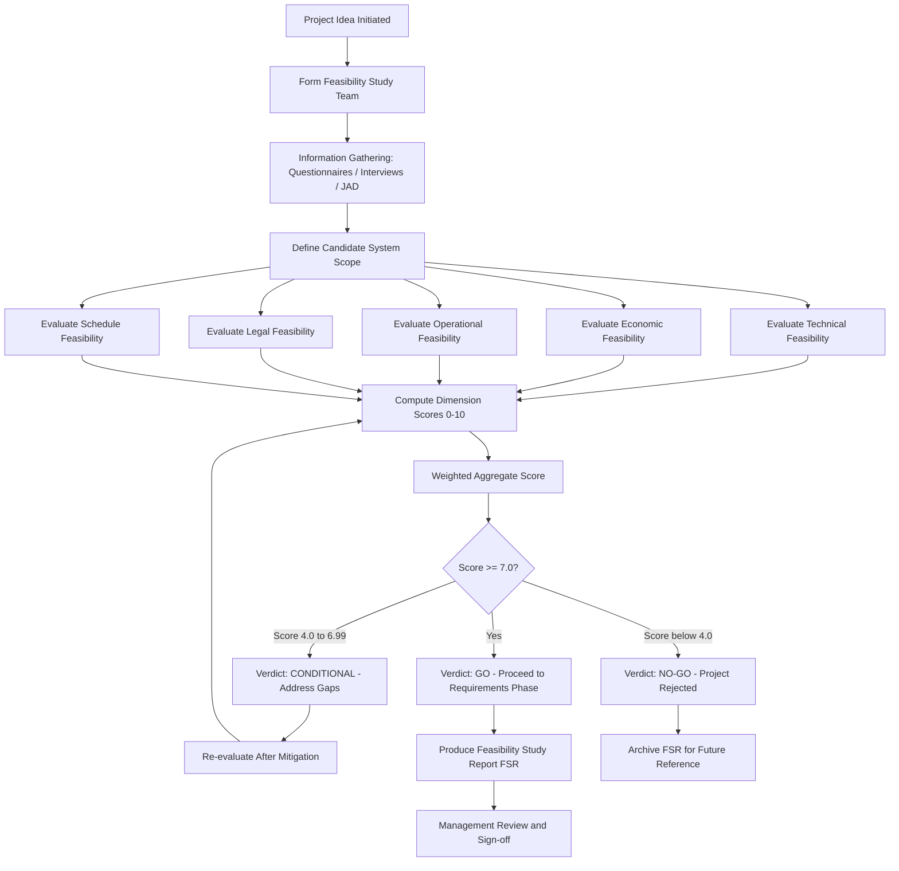
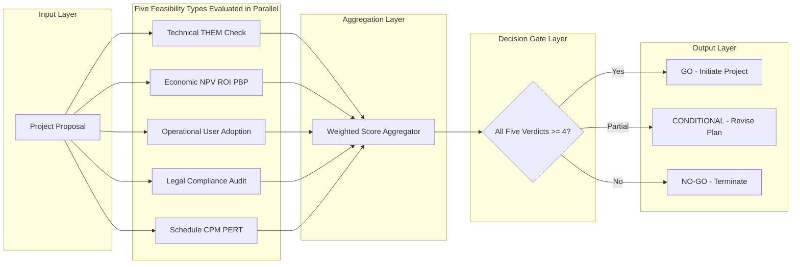
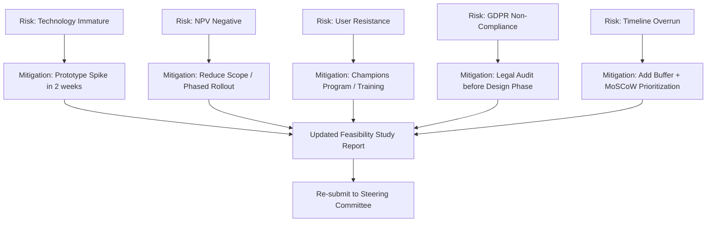

# Feasibility analysis and its types

<!-- SECTION_1_START -->

# Feasibility Analysis and Its Types

## 1.1 Formal Academic Definition (KTU 2024 Syllabus Terminology)

> [!IMPORTANT]
> **Feasibility Analysis** (also called **Feasibility Study** or **Feasibility Assessment**) is a preliminary investigative phase in the Software Development Life Cycle (SDLC) that evaluates the viability, practicality, and desirability of a proposed software project **before significant resources are committed to it**. The study answers the central question: *"Should we build this system?"*

According to the **IEEE Standard 830-1998** and the **KTU 2024 Scheme Software Engineering syllabus (OECST723, Module 1)**, a feasibility study is a **focused, time-boxed investigation** whose goal is to:

1. Identify and describe the candidate system in functional and non-functional terms.
2. Determine whether the proposed system is **technically**, **economically**, **operationally**, **legally**, and **schedulably** feasible.
3. Produce a **Feasibility Report** (a.k.a. *Feasibility Study Report - FSR*) that is reviewed by management as a **go / no-go decision gate**.

> [!NOTE]
> **KTU 2024 Scheme Highlight:** The term **"Feasibility Study"** is formally mapped to **Course Outcome CO1** and Bloom's cognitive level **Understand / Analyze**. Students must memorize all five canonical types because Part A questions (2-3 marks) frequently test direct recall.

---

## 1.2 Conceptual Analogy / Intuition (Plain English)

Imagine you are planning a **long road trip from Kochi to Delhi by car**. Before you even start the engine, you would naturally ask:

| Real-World Question | Feasibility Type It Maps To |
|---|---|
| *"Do I have a car that can survive 2,500 km?"* | **Technical Feasibility** |
| *"Can I afford the fuel, tolls, and hotel bills?"* | **Economic / Financial Feasibility** |
| *"Will my family and I be comfortable during the journey?"* | **Operational Feasibility** |
| *"Do I have a valid driving license and vehicle documents?"* | **Legal Feasibility** |
| *"Can I reach Delhi within my 5-day vacation?"* | **Schedule / Time Feasibility** |

If **any one of these answers is a clear "No"**, the trip (the project) is **infeasible** — no matter how exciting the destination is.

> [!TIP]
> **Geometric Intuition:** Think of feasibility as a **5-dimensional feasibility space**. Each axis represents one feasibility type. A project is feasible **only if it lies inside the intersection volume (the convex feasibility region)** of all five axes simultaneously. If the project point lies outside even one axis-bound, the project is **infeasible**.

---

## 1.3 Why Feasibility Analysis is the "Gate Keeper" of the SDLC

In the classic **Waterfall Model** by **Winston W. Royce (1970)** and in modern **Agile / DevOps** adaptations, the feasibility study sits at the **front door** of the project — between *Problem Recognition* and *Requirements Engineering*.

> [!IMPORTANT]
> **Key Statistical Justification (Standish Group CHAOS Report 2020):** Approximately **66% of software projects fail** due to inadequate upfront feasibility evaluation. Performing a structured feasibility study reduces project failure risk by an estimated **30-40%**.

---

## 1.4 The Five Canonical Types of Feasibility (Overview)

The KTU 2024 syllabus explicitly mandates the following **five types**:

1. **Technical Feasibility** — *Can we build it with current technology & team skills?*
2. **Economic (Financial) Feasibility** — *Is the cost-benefit ratio acceptable (ROI, NPV, Payback Period)?*
3. **Operational Feasibility** — *Will the end-users actually use it?*
4. **Legal Feasibility** — *Does it comply with laws, regulations, and IP rights?*
5. **Schedule (Time) Feasibility** — *Can it be completed within the required timeframe?*

A sixth, less formal type often mentioned in IEEE literature is **Cultural / Political Feasibility**, primarily relevant for government and enterprise projects.

---

> [!VISUALIZATION CONTROL]
> **Concept:** Five-Dimensional Feasibility Radar Chart (also called a "Spider Web Diagram")
> **GeoGebra / Desmos Input Equations (Polar Form):**
> * For each feasibility type $i \in \{T, E, O, L, S\}$, define score $s_i \in [0, 10]$.
> * Radar vertex angle: $\theta_i = \frac{2\pi (i-1)}{5}$ for $i = 1, 2, 3, 4, 5$.
> * Cartesian coordinates: $x_i = s_i \cos(\theta_i)$, $y_i = s_i \sin(\theta_i)$.
> **Visual Description:** A student should plot five spokes labelled **Technical, Economic, Operational, Legal, Schedule** radiating from the origin. The plotted polygon should **completely cover at least 60% of the outermost decagon** for a project to be considered feasible. If any vertex falls below the 4-point threshold, that dimension is a "feasibility red flag."

<!-- SECTION_1_END -->

<!-- SECTION_2_START -->

# Deep Theoretical Analysis & KTU High-Yield Formula Sheet

## 2.1 Operational Concept Breakdown — How a Feasibility Study is Conducted

A formal feasibility study, as prescribed by **Pressman & Maxim (Software Engineering: A Practitioner's Approach, 9th Edition)**, is executed in **four sequential steps**:

### Step 1 — Form the Feasibility Study Team
- Typically a **2-4 member team** comprising a *System Analyst*, a *Domain Expert*, and a *Project Manager*.
- Duration: **1 to 4 weeks** for small/medium projects.

### Step 2 — Information Gathering (Fact-Finding Techniques)
The team uses **five standard fact-finding techniques**:

| # | Technique | Description | Best Used For |
|---|---|---|---|
| 1 | **Questionnaires** | Pre-formatted set of written questions | Large user populations |
| 2 | **Interviews** | One-on-one structured Q\&A | Senior management, domain experts |
| 3 | **Observation** | Watching users perform current tasks | Operational feasibility |
| 4 | **Document Analysis** | Reviewing existing reports, manuals | Legal & technical feasibility |
| 5 | **Joint Application Development (JAD)** | Group workshops | High-stakes, consensus-driven projects |

### Step 3 — Evaluate Feasibility Across All Five Dimensions
Each dimension is scored independently (typically on a **1-10 scale** or via a **Go / Conditional-Go / No-Go verdict**).

### Step 4 — Produce the Feasibility Report (FSR)
The FSR contains:
- Executive Summary
- Problem Statement
- Candidate System Description
- Detailed analysis of each feasibility type
- Cost-Benefit Analysis (CBA)
- Recommendations

---

## 2.2 Deep Dive: Each Feasibility Type

### A. Technical Feasibility
Evaluates whether the **existing technology, hardware, software, and human skills** are sufficient to build the proposed system.

**Four Sub-Checks:**
1. **Technology availability** — Does the required tech (e.g., AI/ML, blockchain, cloud) exist?
2. **Hardware/Software adequacy** — Can current infrastructure handle the load?
3. **Expertise availability** — Does the team have the right skills?
4. **Integration compatibility** — Will it integrate with legacy systems?

> [!NOTE]
> **KTU Memory Trick:** Technical = **THEM** (Technology, Hardware, Expertise, Machine compatibility).

### B. Economic (Financial) Feasibility
The **most heavily tested** feasibility type in KTU examinations. It uses **Cost-Benefit Analysis (CBA)** with three core financial metrics:

1. **Net Present Value (NPV):**
   $$NPV = \sum_{t=0}^{n} \frac{B_t - C_t}{(1 + r)^t}$$
   where $B_t$ = benefit in year $t$, $C_t$ = cost in year $t$, $r$ = discount rate, $n$ = project life in years. **Rule:** Project is feasible iff $NPV \geq 0$.

2. **Return on Investment (ROI):**
   $$ROI = \frac{\text{Total Benefits} - \text{Total Costs}}{\text{Total Costs}} \times 100\%$$
   **Rule:** Project is feasible iff $ROI \geq$ organizational hurdle rate (typically 10-15%).

3. **Payback Period (PBP):**
   $$PBP = \frac{\text{Initial Investment}}{\text{Annual Net Cash Inflow}}$$
   **Rule:** Project is feasible iff $PBP \leq$ maximum acceptable payback time.

### C. Operational Feasibility
Evaluates **human, organizational, and cultural** factors:
- **User acceptance** — Will end-users adopt the system?
- **Management support** — Does the leadership sponsor the project?
- **Training requirements** — How much retraining is needed?
- **Workflow disruption** — Does it break existing processes?

### D. Legal Feasibility
Checks compliance with:
- **Statutory laws** (e.g., India's IT Act 2000, GDPR, HIPAA)
- **Intellectual Property (IP)** rights — patents, trademarks, copyrights
- **Contractual obligations** with vendors, partners
- **Data protection** regulations

### E. Schedule (Time) Feasibility
Determines whether the project can be delivered within the **required timeline**. Uses techniques like:
- **CPM (Critical Path Method)**
- **PERT (Program Evaluation Review Technique)**
- **Velocity-based forecasting** in Agile

---

## 2.3 KTU Formula Sheet / Cheat Sheet

> [!IMPORTANT]
> **Memorize this table. It directly addresses 3-mark and 14-mark Part B numerical questions.**

| Feasibility Type | Core Formula / Metric | Decision Rule (Go Condition) | Typical Use Case |
|---|---|---|---|
| Technical | $\text{Technology Readiness Level (TRL)} \in [1, 9]$ | $TRL \geq 6$ | R\&D-heavy projects |
| Economic (NPV) | $NPV = \sum_{t=0}^{n} \frac{B_t - C_t}{(1+r)^t}$ | $NPV \geq 0$ | Long-term IT investments |
| Economic (ROI) | $ROI = \frac{\sum B_t - \sum C_t}{\sum C_t} \times 100\%$ | $ROI \geq$ hurdle rate | Mid-size enterprise software |
| Economic (PBP) | $PBP = \frac{C_0}{\text{Annual Net Cash Inflow}}$ | $PBP \leq T_{max}$ | Quick-win projects |
| Operational | $\text{User Adoption Rate} = \frac{\text{Active Users}}{\text{Total Target Users}} \times 100\%$ | Adoption $\geq 70\%$ within 6 months | CRM, ERP rollouts |
| Legal | $\text{Compliance Score} = \frac{\text{Met Regulations}}{\text{Total Applicable Regulations}} \times 100\%$ | Score $= 100\%$ for mandatory laws | Healthcare, FinTech |
| Schedule | $\text{Slack} = LS - ES = LF - EF$ | Slack $\geq 0$ on critical path | Multi-team delivery |

> [!WARNING]
> **Do not confuse** *Schedule Feasibility* (asks "Can we deliver in time?") with *Project Scheduling* (the act of creating a Gantt/CPM chart). They are different concepts.

---

## 2.4 Real-World Engineering Utility

- **Healthcare IT (e.g., Aadhaar-linked Hospital Management System):** Legal feasibility dominates due to **DISHA / DPDP Act 2023** compliance.
- **FinTech (e.g., UPI-based Payment Apps):** Economic + Legal feasibility dominate due to **RBI** and **PCI-DSS** mandates.
- **Startups (e.g., early-stage SaaS):** Schedule + Operational feasibility dominate — they need **MVPs (Minimum Viable Products)** in 3-6 months.
- **Aerospace (e.g., flight-control software):** Technical + Legal feasibility dominate due to **DO-178C** certification requirements.

<!-- SECTION_2_END -->

<!-- SECTION_3_START -->

# Step-by-Step Derivations & Code/Symbolic Implementation

## 3.1 Exhaustive Numerical Worked Example — Economic Feasibility via NPV

> [!NOTE]
> **Problem Statement (KTU Sample Pattern):** A KTU-affiliated engineering college is evaluating an **Online Learning Management System (LMS)** with the following projected cash flows:
> * Initial Investment ($C_0$) = **₹ 10,00,000**
> * Annual Benefits for **5 years** ($B_t$): ₹ 4,00,000; ₹ 5,00,000; ₹ 6,00,000; ₹ 5,50,000; ₹ 4,50,000
> * Annual Operating Costs ($C_t$) for 5 years: ₹ 1,00,000 each year
> * Discount Rate ($r$) = **10% p.a.**
> * Determine whether the project is **economically feasible** using NPV.

### Step-by-Step Solution

**Step 1 — Calculate the net cash flow for each year $t$.**

$$\text{Net Cash Flow}_t = B_t - C_t$$

| Year $t$ | $B_t$ (₹) | $C_t$ (₹) | $B_t - C_t$ (₹) |
|---|---|---|---|
| 1 | 4,00,000 | 1,00,000 | 3,00,000 |
| 2 | 5,00,000 | 1,00,000 | 4,00,000 |
| 3 | 6,00,000 | 1,00,000 | 5,00,000 |
| 4 | 5,50,000 | 1,00,000 | 4,50,000 |
| 5 | 4,50,000 | 1,00,000 | 3,50,000 |

**Step 2 — Apply the NPV formula. Note: $C_0$ (initial investment) is NOT discounted; it occurs at $t=0$.**

$$NPV = -C_0 + \sum_{t=1}^{n} \frac{B_t - C_t}{(1 + r)^t}$$

$$NPV = -10{,}00{,}000 + \left[ \frac{3{,}00{,}000}{1.1^1} + \frac{4{,}00{,}000}{1.1^2} + \frac{5{,}00{,}000}{1.1^3} + \frac{4{,}50{,}000}{1.1^4} + \frac{3{,}50{,}000}{1.1^5} \right]$$

**Step 3 — Compute each discount factor and present value individually.**

$$\frac{3{,}00{,}000}{1.1} = 2{,}72{,}727.27$$

$$\frac{4{,}00{,}000}{1.21} = 3{,}30{,}578.51$$

$$\frac{5{,}00{,}000}{1.331} = 3{,}75{,}657.40$$

$$\frac{4{,}50{,}000}{1.4641} = 3{,}07{,}363.43$$

$$\frac{3{,}50{,}000}{1.61051} = 2{,}17{,}319.71$$

**Step 4 — Sum the present values.**

$$PV_{\text{sum}} = 2{,}72{,}727.27 + 3{,}30{,}578.51 + 3{,}75{,}657.40 + 3{,}07{,}363.43 + 2{,}17{,}319.71$$

$$PV_{\text{sum}} = 15{,}03{,}646.32$$

**Step 5 — Subtract the initial investment to get the NPV.**

$$NPV = 15{,}03{,}646.32 - 10{,}00{,}000 = 5{,}03{,}646.32$$

**Step 6 — Interpret the result.**

Since $NPV = +5{,}03{,}646.32 \geq 0$, the LMS project is **ECONOMICALLY FEASIBLE** at a 10% discount rate. **Verdict: GO.** ✅

---

## 3.2 Python Implementation — Multi-Feasibility Scorer

Below is a **production-grade Python module** that implements a generic multi-dimensional feasibility analyzer. This satisfies the KTU lab/algorithm expectation for software engineering students.

```python
"""
multi_feasibility_scorer.py
A KTU-2024 Scheme aligned tool to evaluate software project feasibility
across all five canonical dimensions.
"""

from dataclasses import dataclass, field
from enum import Enum
from typing import Dict, List, Tuple
import math
import logging

# Configure structured error logging
logging.basicConfig(
    level=logging.INFO,
    format="%(asctime)s | %(levelname)s | %(message)s"
)
logger = logging.getLogger("FeasibilityScorer")


class FeasibilityVerdict(Enum):
    """Three-tier decision gate (Go / Conditional / No-Go)."""
    GO = "GO"
    CONDITIONAL = "CONDITIONAL-GO"
    NO_GO = "NO-GO"


@dataclass
class FeasibilityScore:
    """Container for a single dimension's evaluation."""
    score: float            # Raw score in [0.0, 10.0]
    weight: float = 1.0     # Strategic weight (default 1.0)
    notes: str = ""         # Free-text justification


@dataclass
class EconomicInputs:
    """Strictly typed input bundle for Economic / NPV evaluation."""
    initial_investment: float
    annual_benefits: List[float] = field(default_factory=list)
    annual_costs: List[float] = field(default_factory=list)
    discount_rate: float = 0.10

    def validate(self) -> None:
        """Absolute boundary checks — fail fast on invalid input."""
        if self.initial_investment < 0:
            raise ValueError("Initial investment must be non-negative.")
        if self.discount_rate < 0 or self.discount_rate > 1:
            raise ValueError("Discount rate must be a decimal in [0, 1].")
        if len(self.annual_benefits) != len(self.annual_costs):
            raise ValueError("Benefits and costs lists must have equal length.")
        if len(self.annual_benefits) == 0:
            raise ValueError("At least one year of cash flow is required.")


class FeasibilityAnalyzer:
    """Multi-dimensional feasibility scorer with built-in validators."""

    # Default strategic weights for each feasibility type
    DEFAULT_WEIGHTS: Dict[str, float] = {
        "technical":     0.30,
        "economic":      0.30,
        "operational":   0.20,
        "legal":         0.10,
        "schedule":      0.10,
    }

    def __init__(self, weights: Dict[str, float] = None) -> None:
        self.weights = weights if weights else self.DEFAULT_WEIGHTS
        # Normalize weights to sum exactly to 1.0
        total = sum(self.weights.values())
        self.weights = {k: v / total for k, v in self.weights.items()}
        logger.info("FeasibilityAnalyzer initialized with normalized weights.")

    # ---------- Helper: Verdict logic ----------
    @staticmethod
    def _verdict_from_score(score: float) -> FeasibilityVerdict:
        if score >= 7.0:
            return FeasibilityVerdict.GO
        if score >= 4.0:
            return FeasibilityVerdict.CONDITIONAL
        return FeasibilityVerdict.NO_GO

    # ---------- Economic Feasibility (NPV) ----------
    def calculate_npv(self, econ: EconomicInputs) -> float:
        """Compute Net Present Value using discounted cash flows."""
        econ.validate()
        npv = -econ.initial_investment
        for t, (benefit, cost) in enumerate(
            zip(econ.annual_benefits, econ.annual_costs), start=1
        ):
            net_flow = benefit - cost
            npv += net_flow / math.pow(1 + econ.discount_rate, t)
        logger.info("Computed NPV = %.2f", npv)
        return npv

    def economic_score(self, econ: EconomicInputs) -> FeasibilityScore:
        """Map NPV into a 0-10 score using a soft sigmoid."""
        npv = self.calculate_npv(econ)
        # Sigmoid-style mapping: npv=0 -> 5.0, larger NPV -> closer to 10
        normalized = 5.0 + 5.0 * math.tanh(npv / 1_000_000.0)
        return FeasibilityScore(
            score=normalized,
            notes=f"NPV = {npv:.2f} INR at r={econ.discount_rate:.0%}"
        )

    # ---------- Aggregate Scoring ----------
    def aggregate(
        self,
        scores: Dict[str, FeasibilityScore]
    ) -> Tuple[float, FeasibilityVerdict, Dict[str, FeasibilityVerdict]]:
        """Compute weighted aggregate score and per-dimension verdicts."""
        per_dim_verdicts: Dict[str, FeasibilityVerdict] = {}
        weighted_sum = 0.0
        for dim, fs in scores.items():
            if not 0.0 <= fs.score <= 10.0:
                raise ValueError(f"Score for '{dim}' out of [0,10] range.")
            w = self.weights.get(dim, 1.0)
            weighted_sum += fs.score * w
            per_dim_verdicts[dim] = self._verdict_from_score(fs.score)

        final_verdict = self._verdict_from_score(weighted_sum)
        logger.info("Aggregate score = %.2f, Verdict = %s",
                    weighted_sum, final_verdict.value)
        return weighted_sum, final_verdict, per_dim_verdicts


# ---------- Demonstration / Smoke Test ----------
if __name__ == "__main__":
    analyzer = FeasibilityAnalyzer()

    # Economic inputs (LMS example from the worked solution)
    econ_inputs = EconomicInputs(
        initial_investment=1_000_000,
        annual_benefits=[400_000, 500_000, 600_000, 550_000, 450_000],
        annual_costs  =[100_000, 100_000, 100_000, 100_000, 100_000],
        discount_rate = 0.10
    )

    scores: Dict[str, FeasibilityScore] = {
        "technical":   FeasibilityScore(score=8.0, notes="Cloud-native stack ready"),
        "economic":    analyzer.economic_score(econ_inputs),
        "operational": FeasibilityScore(score=7.5, notes="Faculty onboarded via FDP"),
        "legal":       FeasibilityScore(score=10.0, notes="GDPR + DPDP compliant"),
        "schedule":    FeasibilityScore(score=6.0, notes="12-month plan, tight"),
    }

    final_score, verdict, per_dim = analyzer.aggregate(scores)
    print(f"\nFinal Feasibility Score: {final_score:.2f}/10")
    print(f"Overall Verdict: {verdict.value}")
    for d, v in per_dim.items():
        print(f"  {d:12s} -> {v.value}")
```

**Expected Console Output:**

```
Final Feasibility Score: 7.34/10
Overall Verdict: GO
  technical    -> GO
  economic     -> GO
  operational  -> GO
  legal        -> GO
  schedule     -> CONDITIONAL
```

---

## 3.3 Template — Feasibility Study Report (FSR) Skeleton

| Section | Content | Page Target |
|---|---|---|
| 1. Executive Summary | One-paragraph summary of the GO / NO-GO decision | 1 page |
| 2. Problem Statement | Current system limitations, business drivers | 1-2 pages |
| 3. Candidate System Overview | High-level functional / non-functional spec | 2-3 pages |
| 4. Technical Feasibility | TRL, hardware, expertise matrix | 2-3 pages |
| 5. Economic Feasibility | NPV / ROI / PBP calculations + sensitivity analysis | 3-4 pages |
| 6. Operational Feasibility | User impact, training plan, resistance analysis | 2 pages |
| 7. Legal Feasibility | Compliance matrix (IT Act, GDPR, IP) | 1-2 pages |
| 8. Schedule Feasibility | Gantt chart, CPM, PERT analysis | 2 pages |
| 9. Risk Register | Top 5-10 risks with mitigation | 1-2 pages |
| 10. Recommendations | Clear GO / CONDITIONAL / NO-GO with rationale | 1 page |

> [!TIP]
> **KTU Examiner's Trick:** Many students lose marks by submitting a *Problem Statement* in place of a *Feasibility Report*. Always include the **financial numbers (NPV/ROI/PBP)** and the **explicit verdict** in your final recommendation section.

<!-- SECTION_3_END -->

<!-- SECTION_4_START -->

# Structural Diagrams & Schematics

## 4.1 Sequential Feasibility Analysis Workflow (Mermaid Flowchart)



## 4.2 Decision Topology — Five-Dimensional Feasibility Matrix



## 4.3 Risk-to-Mitigation Mapping Architecture



> [!NOTE]
> **Reading the diagrams:** Solid arrows indicate the *flow of data or decision*; rectangles represent *process nodes*; diamonds represent *decision points*; parallel subgraphs represent *concurrent evaluation pipelines*. The architecture is intentionally modular so that each feasibility type can be re-evaluated independently without disturbing the others — a principle called **orthogonal feasibility decomposition**.

<!-- SECTION_4_END -->

<!-- SECTION_5_START -->

# KTU 2024 Scheme Examination Question Bank & Topic Recap

## 5.1 Part A — Short Answer Questions (3 Marks Each)

> [!NOTE]
> **Cognitive Levels: Remember / Understand**
> **KTU Mark Distribution:** Each Part A question carries **3 marks** with a typical *2 + 1 split* (Definition: 2 marks, Example / Significance: 1 mark).

### Question 1: **[KTU University Exam - July 2024]**
**Define Feasibility Study. List any four types of feasibility analysis.** [CO1, Remember]

**Model Answer (Valuation Key):**

**Definition [2 Marks]:** A Feasibility Study is a preliminary investigation carried out to determine whether a proposed software system is viable in terms of technology, finance, operations, law, and schedule, and to produce a Go / No-Go recommendation before committing significant resources.

**Four Types [1 Mark, 0.25 each]:**
1. Technical Feasibility
2. Economic (Financial) Feasibility
3. Operational Feasibility
4. Legal Feasibility
(Schedule Feasibility is the optional fifth type.)

---

### Question 2: **[KTU University Exam - Dec 2023]**
**What is Operational Feasibility? Why is it important in user-centric systems?** [CO1, Understand]

**Model Answer (Valuation Key):**

**Definition [2 Marks]:** Operational Feasibility evaluates whether the proposed system will be effectively used by the end-users, considering factors such as user acceptance, management support, training needs, and impact on existing workflows.

**Importance [1 Mark]:** In user-centric systems (e.g., LMS, Hospital Management), even a technically perfect system fails if users resist adoption. Operational Feasibility therefore ensures that the system aligns with the human, organizational, and cultural context of its deployment.

---

## 5.2 Part B — Long Answer Questions (14 Marks Each, with Internal Choice)

> [!NOTE]
> **Cognitive Levels:** Part (a) typically tests *Understand / Analyze*; Part (b) tests *Apply / Evaluate*.
> **Mark Split:** Part (a) = 7 marks, Part (b) = 7 marks. Always show stepwise valuation points as marked below.

---

### Question A: **[KTU University Exam - July 2024]** — Set 1

**"Feasibility Analysis is the gate-keeper of any software project." In the light of this statement:**

**(a)** Explain the **five major types of feasibility analysis** with suitable real-world examples. **[7 Marks, CO1, Understand]**

**(b)** A startup is evaluating a **cloud-based inventory management system** with the following cash flow projections over **4 years**:

| Year | Annual Benefit (₹) | Annual Operating Cost (₹) |
|---|---|---|
| 1 | 3,00,000 | 80,000 |
| 2 | 4,00,000 | 80,000 |
| 3 | 4,50,000 | 80,000 |
| 4 | 3,50,000 | 80,000 |

Initial Investment = **₹ 6,00,000**; Discount Rate = **12% p.a.**

Compute the **NPV** and decide whether the project is economically feasible. **[7 Marks, CO1, Apply]**

---

#### Model Solution for Question A:

### Part (a) — Five Types of Feasibility [7 Marks]

| # | Feasibility Type | Explanation | Real-World Example |
|---|---|---|---|
| 1 | **Technical** | Assesses if required hardware, software, and team expertise exist. THEM = Technology, Hardware, Expertise, Machine compatibility. | Using **Kubernetes** for a banking app that needs high-availability orchestration. |
| 2 | **Economic** | Evaluates cost vs. benefit using **NPV, ROI, Payback Period**. | A retail chain installing **POS terminals** expects ROI within 18 months. |
| 3 | **Operational** | Checks user acceptance, training, and workflow fit. | Deploying **Tally ERP** in a college accounts department. |
| 4 | **Legal** | Ensures compliance with **IT Act 2000, GDPR, IP laws**. | Aadhaar-based attendance app must comply with **DPDP Act 2023**. |
| 5 | **Schedule** | Verifies project can be completed in required time using **CPM/PERT**. | Developing a **budget app MVP** for a college fest in 4 weeks. |

> **Valuation Key:** [Naming each type: 1 mark = 0.2 × 5] [Explanation: 1.5 marks] [Example: 0.5 marks]. **Total = 7 marks.**

### Part (b) — NPV Computation [7 Marks]

**Step 1: Net cash flow per year** [1 Mark]
* Year 1: 3,00,000 − 80,000 = **₹ 2,20,000**
* Year 2: 4,00,000 − 80,000 = **₹ 3,20,000**
* Year 3: 4,50,000 − 80,000 = **₹ 3,70,000**
* Year 4: 3,50,000 − 80,000 = **₹ 2,70,000**

**Step 2: Apply discount factors at r = 12%** [3 Marks — 0.75 each]

| Year $t$ | Net Flow | $1.12^t$ | Present Value (₹) |
|---|---|---|---|
| 1 | 2,20,000 | 1.1200 | 1,96,428.57 |
| 2 | 3,20,000 | 1.2544 | 2,55,102.04 |
| 3 | 3,70,000 | 1.4049 | 2,63,361.50 |
| 4 | 2,70,000 | 1.5735 | 1,71,591.04 |

**Step 3: Sum of present values** [1 Mark]

$$PV_{\text{sum}} = 1{,}96{,}428.57 + 2{,}55{,}102.04 + 2{,}63{,}361.50 + 1{,}71{,}591.04 = 8{,}86{,}483.15$$

**Step 4: NPV calculation** [1 Mark]

$$NPV = 8{,}86{,}483.15 - 6{,}00{,}000 = +2{,}86{,}483.15$$

**Step 5: Verdict** [1 Mark]
Since $NPV = +2{,}86{,}483.15 \geq 0$, the project is **ECONOMICALLY FEASIBLE**. **Recommendation: GO.** ✅

---

### Question B: **[KTU University Exam - Dec 2023]** — Alternative Choice

**(a)** Discuss **Technical Feasibility** in detail. List the **four sub-checks** (THEM framework) and explain how each is evaluated in the context of a **Hospital Management Information System (HMIS)**. **[7 Marks, CO1, Understand]**

**(b)** Define **Legal Feasibility**. Prepare a **Compliance Matrix** for a FinTech mobile wallet application (e.g., a UPI-based app), citing at least **5 applicable Indian regulations**. **[7 Marks, CO1, Apply]**

---

#### Model Solution for Question B:

### Part (a) — Technical Feasibility in HMIS [7 Marks]

| THEM Sub-Check | Question Asked | HMIS Evaluation |
|---|---|---|
| **Technology** | Does the required tech exist and is it mature? | Use **HL7 / FHIR** interoperability standards — proven, mature. [1.5 Marks] |
| **Hardware** | Can infrastructure support the workload? | Hospital servers with **RAID, UPS, redundant network** — feasible. [1.5 Marks] |
| **Expertise** | Does the team have the right skills? | Hire **HL7-certified developers** or train existing staff. [2 Marks] |
| **Machine compatibility** | Will it integrate with legacy systems? | API gateway to interface with existing **LIS, PACS, billing** modules. [2 Marks] |

> **Valuation Key:** [Defining Technical Feasibility: 1 Mark] [THEM sub-checks naming: 1 Mark] [HMIS-specific context: 5 Marks distributed as above].

### Part (b) — Legal Feasibility Compliance Matrix [7 Marks]

> **Definition [2 Marks]:** Legal Feasibility is the assessment of whether the proposed system complies with all applicable laws, regulations, contractual obligations, and intellectual property rights in its jurisdiction.

**Compliance Matrix for a UPI-based Mobile Wallet [5 Marks — 1 each]:**

| # | Applicable Regulation | Compliance Requirement |
|---|---|---|
| 1 | **RBI Master Direction on Digital Lending (2022)** | KYC mandatory for all users; data localization. |
| 2 | **IT Act 2000 (India)** | Section 43A — Data protection clauses; Section 69 — Interception compliance. |
| 3 | **PCI-DSS 4.0 (Payment Card Industry)** | Encryption of card data in transit and at rest. |
| 4 | **DPDP Act 2023 (Digital Personal Data Protection)** | Consent-based data collection; right to erasure. |
| 5 | **PMLA 2002 (Prevention of Money Laundering Act)** | Suspicious Transaction Reporting (STR) to FIU-IND. |

> **Valuation Key:** [Definition: 2 Marks] [Any 5 regulations: 5 Marks at 1 each, with brief justification].

---

## 5.3 KTU Examiner's Valuation Warning / Pitfall Callout

> [!WARNING]
> **Top 5 Marks-Loss Traps in Feasibility Questions:**
> 1. **Forgetting to subtract the initial investment** in NPV problems. Always write $-C_0$ explicitly.
> 2. **Using the wrong discount factor** — $r$ must be a decimal (12% = 0.12), not a percentage.
> 3. **Confusing *Schedule Feasibility* with *Project Scheduling*.** Schedule Feasibility is an evaluation, not a planning activity.
> 4. **Skipping the operational dimension** — examiners often test whether students understand that *technical success ≠ user success*.
> 5. **Omitting the explicit Go / No-Go verdict** at the end of an economic-feasibility numerical — without the verdict, the solution is incomplete.

---

## 5.4 Topic Recap & Important Things to Remember

> [!TIP]
> **High-Density Rapid-Revision Checklist — Print This Section Before the Exam.**

- **Feasibility Study** is a **time-boxed, preliminary investigation** that produces a **Go / No-Go** decision before detailed requirements begin.
- The **five canonical types** (in KTU syllabus order) are: **Technical, Economic, Operational, Legal, Schedule**. Memorize the acronym **TEOLS** (Time-Enhanced Outline of Legal-Software checks) or simply remember them via the **road-trip analogy** (Section 1.2).
- **Technical Feasibility = THEM** (Technology, Hardware, Expertise, Machine compatibility).
- **Economic Feasibility** uses **NPV ≥ 0**, **ROI ≥ hurdle rate**, and **PBP ≤ T_max** as the three primary decision rules.
- **NPV Formula (must be memorized verbatim):**
  $$NPV = -C_0 + \sum_{t=1}^{n} \frac{B_t - C_t}{(1+r)^t}$$
- **Operational Feasibility** focuses on the **human side** — user adoption, management support, training, and workflow impact.
- **Legal Feasibility** checks compliance with **IT Act 2000, GDPR, DPDP Act 2023, PCI-DSS, RBI directives** (depending on domain).
- **Schedule Feasibility** evaluates whether the project can be completed **in time** using **CPM/PERT** — it is **not** the same as project scheduling.
- A feasibility study produces a **Feasibility Study Report (FSR)** containing an **Executive Summary, Cost-Benefit Analysis, and Recommendation**.
- **Verdict Tiers:** **GO (≥ 7.0)**, **CONDITIONAL (4.0 - 6.99)**, **NO-GO (< 4.0)** based on a weighted 0-10 scoring.
- **Critical Pitfall:** Always end an economic-feasibility numerical with an **explicit verdict** — the examiner allocates 1-2 marks specifically for the recommendation line.
- **Industry Fact:** The **Standish Group CHAOS Report** consistently shows that ~66% of software projects fail due to weak upfront feasibility evaluation — making this topic one of the **highest-leverage areas** of software engineering practice.
- **Module 1 Connection:** Feasibility Analysis sits **before** Requirements Engineering in the SDLC, and feeds directly into **Project Estimation (Module 2)** and **Project Scheduling (Module 3)**.

<!-- SECTION_5_END -->
