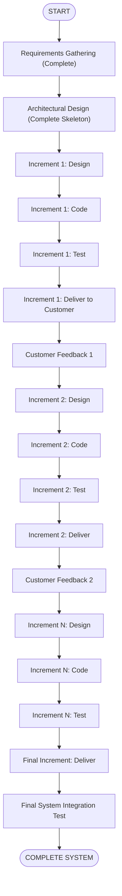
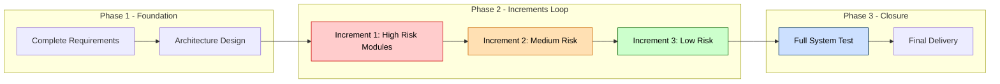
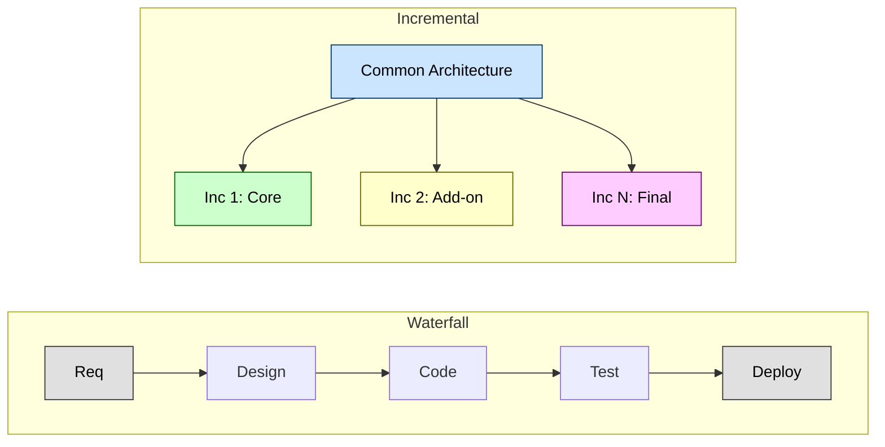
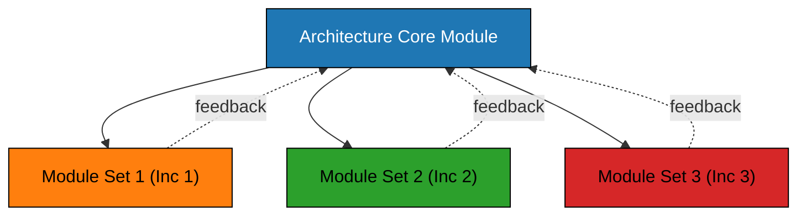

# Incremental

<!-- SECTION_1_START -->
# Incremental Model — Software Process Engineering

> [!NOTE]
> **KTU 2024 Scheme Definition (OECST723)**
> The **Incremental Model** is a software development life cycle (SDLC) approach in which the system is designed, implemented, and tested incrementally (piece by piece) until the product is finished. Each increment represents a functional slice of the system that adds new features/capabilities to the previously delivered baseline.

## 1.1 Conceptual Analogy / Intuition

> [!TIP]
> **Real-World Analogy — Building a House Incrementally**
> Imagine you are building a house, but instead of waiting 2 years to get the *entire* house at once, the builder hands you the **foundation and roof** in **Month 3**, then **walls and windows** in **Month 6**, then **plumbing and electrical** in **Month 9**, and finally **interior furnishing** in **Month 12**. You can *move into a partially functional house* after each delivery, and you can give feedback ("change the kitchen tiles!") that the builder uses in the next increment. This is exactly how the **Incremental Model** delivers software — **small working slices** are released, validated, and then extended.

**Plain English Explanation:**
- You don't wait for the *whole* software to be built.
- A **first version (Increment 1)** is released with the most critical/essential features.
- The customer uses it, gives **feedback**, and based on that, the next increment is planned and built.
- Each new increment **adds functionality** to what already exists.
- The process continues until the **complete system** is delivered.

## 1.2 Key Terminology (KTU High-Yield Vocabulary)

| Term | Meaning |
|---|---|
| **Increment** | A working subset of the final system that delivers a specific set of features. |
| **Baseline** | The cumulative set of features delivered up to a given point (Increment 1 + 2 + ... + n). |
| **System Architecture** | A complete skeleton/design established early so that future increments can plug in cleanly. |
| **Partial System** | A system that is functional but not yet complete — a hallmark of the incremental approach. |
| **Service** | A self-contained unit of functionality delivered per increment. |

> [!IMPORTANT]
> **Syllabus Highlight:** The Incremental Model is essentially a **hybrid** — it combines the **linear (waterfall) flow** within each increment with an **evolutionary (iterative) flow** across increments. Always emphasize this hybrid nature in your KTU answer to score full marks.

## 1.3 Why Use the Incremental Model? (Engineering Motivation)

- **Faster time-to-market:** Core features reach users early.
- **Lower initial risk:** Validation begins with the first increment.
- **Customer involvement:** Continuous feedback refines the product.
- **Easier defect isolation:** Bugs are localized to a specific increment.
- **Parallel development:** Different teams can work on different increments simultaneously.

> [!VISUALIZATION CONTROL]
> **Concept:** Time-vs-Features Delivered Curve (Incremental Staircase)
> **Graph Input (conceptual, draw on graph sheet):**
> * X-axis: `Time (Weeks)` → 0 to 40
> * Y-axis: `Functionality Delivered (%)` → 0 to 100
> * Plot points: `(5, 25)`, `(15, 50)`, `(25, 70)`, `(35, 90)`, `(40, 100)`
> **Visual Description:** A **staircase pattern** that rises in *discrete jumps* — each step represents one increment being delivered. Compare this to a *straight horizontal line at 100%* until the end (Waterfall) to clearly visualize the difference in delivery cadence.
<!-- SECTION_1_END -->

<!-- SECTION_2_START -->
# 2. Deep Theoretical Analysis

## 2.1 How the Incremental Model Works — Step-by-Step

> [!NOTE]
> The Incremental Model has **three principal sequential phases** followed by a **repeating cycle of increment delivery**. KTU questions often ask you to *draw and label the diagram* — practice it on graph paper.

**Phase 1 — Requirements Analysis (One-time)**
- The **complete set of requirements** is gathered and prioritized at the *start*.
- Requirements are divided into a prioritized **requirements catalog** (must-have → nice-to-have).
- A **system architecture** is designed to accommodate *all* future increments.

**Phase 2 — Architecture Design (One-time)**
- A **robust, complete architectural framework** is built so that each increment fits cleanly.
- This is the *one activity* that is **not** repeated — it must be holistic from day one.

**Phase 3 — Incremental Development (Repeated N times)**
Each increment goes through mini-waterfall stages:

| Sub-stage | Activity | Output |
|---|---|---|
| Design | Detailed design of *only* this increment's features | Design Document (DD) |
| Code | Implementation of the increment | Source Code Modules |
| Test | Unit + Integration + System testing of the increment | Tested Increment |
| Deploy | Delivered to the customer | Released Version |

**Phase 4 — Final Integration (One-time)**
- The **last increment completes the system**.
- Full system testing confirms that all increments integrate seamlessly.

> [!TIP]
> **Key Insight:** The **architecture** is designed ONCE (top-down), but the **features** are built INCREMENTALLY (bottom-up delivery). This is the unique signature of the incremental model.

## 2.2 The Two Flavors of Incremental Development

| Variant | Description | Risk Profile |
|---|---|---|
| **Incremental (Staged) Delivery** | All requirements known up front; system is delivered in *staged* slices. | **Lower risk** — scope is fixed. |
| **Incremental (Exploratory) Development** | Initial requirements drive the first increment; later increments *evolve* from experience. | **Higher risk** — scope may expand. |

## 2.3 KTU High-Yield Formula Sheet

> [!IMPORTANT]
> The "formulas" here are **decision frameworks, ratios, and project metrics** commonly asked in KTU 14-mark problems.

| Concept / Metric | Expression / Rule | Application |
|---|---|---|
| **Increments Count** | $N = \lceil T_{total} \div T_{increment} \rceil$ | Estimating number of releases for a project. |
| **Per-Increment Effort** | $E_i = \alpha \cdot S_i + \beta \cdot S_{cumulative}$ | Effort grows as cumulative size grows (Brooks-like overhead). |
| **Cumulative Functionality** | $F_{total} = \sum_{i=1}^{N} F_i$ | Sum of functionality delivered across all increments. |
| **Customer Value Delivered** | $V(t) = \sum_{i \le t} V_i$ | Earlier increments should deliver **higher value**. |
| **Risk Reduction** | $R_{remaining}(n) = R_{initial} - \sum_{i=1}^{n} \Delta R_i$ | Each validated increment reduces residual risk. |
| **Parallel Teams** | $T_{project} = T_{arch} + \max(T_{inc_1}, T_{inc_2}, \ldots, T_{inc_k})$ | When independent increments run in parallel. |

Where:
- $T$ = Time, $E$ = Effort (person-months), $S$ = Size (LOC/FP), $F$ = Functionality, $V$ = Business value, $R$ = Risk
- $\alpha$ = new-development productivity coefficient, $\beta$ = integration overhead coefficient
- $\Delta R_i$ = risk reduction in increment $i$

## 2.4 Engineering Utility in Production Systems

> [!TIP]
> **Where is the Incremental Model actually used in industry?**

| Domain | Real Example | Why Incremental? |
|---|---|---|
| **Web Applications** | Amazon, Flipkart feature rollouts | Get core storefront live fast; add features weekly. |
| **Mobile Apps** | Instagram, WhatsApp updates | User feedback shapes next release. |
| **Operating Systems** | Windows 10 / 11 — version 21H1, 21H2, 22H1... | Hardware compatibility evolves; users opt-in to features. |
| **Banking Systems** | UPI platform: P2P, then P2M, then AutoPay, then Credit Line | Regulatory clarity grows; new use-cases emerge. |
| **Embedded Systems** | Automotive ECUs with OTA updates | Safety-critical core first; enhancements via updates. |
| **SaaS Products** | Slack, Notion, Figma | Continuous delivery is the business model. |

## 2.5 Comparison: Incremental vs Other Models

| Criterion | Waterfall | Incremental | Iterative (Spiral) | Agile |
|---|---|---|---|---|
| Requirements | Fixed up front | Fixed up front, divided | Evolve with iterations | Evolve continuously |
| Delivery | One at the end | Multiple (slices) | Multiple (refined versions) | Multiple (sprints) |
| Customer Feedback | Late | After each increment | At each loop | Continuous |
| Risk Handling | Poor | Moderate | Strong | Strong |
| Documentation | Heavy | Moderate | Moderate | Light |
| Flexibility | Very Low | Moderate | High | Very High |
| **Best Suited For** | Simple, well-understood projects | Medium-complexity, clear requirements | High-risk, large systems | Dynamic, evolving requirements |

## 2.6 Advantages and Disadvantages (Board-Favorite List)

### ✅ Advantages
1. **Early delivery of partial system** → faster ROI.
2. **Lower initial risk** → architecture validated before bulk coding.
3. **Customer feedback incorporated** → higher satisfaction.
4. **Easier testing & debugging** → defects confined to specific increments.
5. **Parallel development possible** → reduced wall-clock time.
6. **Reuses architecture across increments** → design efficiency.
7. **Risk management** → high-risk parts tackled first.

### ❌ Disadvantages
1. **Requires good upfront architecture** → costly to refactor later.
2. **Increments must be carefully scoped** → poor scoping → integration failures.
3. **Total cost may exceed waterfall** → integration/rework overhead.
4. **Not suitable for very small projects** → overhead outweighs benefit.
5. **Customer may delay feedback** → increments pile up unvalidated.
6. **Well-defined interfaces needed** → contracts between modules must be strict.
<!-- SECTION_2_END -->

<!-- SECTION_3_START -->
# 3. Step-by-Step Derivations, Worked Examples & Implementation

## 3.1 Worked Example 1 — KTU Style 14-Mark Numerical Problem

> [!NOTE]
> **Problem Statement (Simulated KTU Pattern):**
> A software project has an estimated total effort of **240 person-months** and a planned duration of **20 months**. The project manager decides to use the **Incremental Model** with **4 increments**, where each increment delivers **25%** of the total functionality, but the effort distribution follows the rule:
> $E_i = 0.20 \cdot S_{total} + 0.05 \cdot S_{cumulative,i}$
> where $S_{total} = 100$ KLOC and $S_{cumulative,i}$ is the cumulative size after increment $i$.
> **Calculate the total effort required across all 4 increments and the average per-increment effort.**

### Step-by-Step Solution

**Step 1:** Set up the parameters.

$$S_{total} = 100 \text{ KLOC}, \quad N = 4 \text{ increments}$$

**Step 2:** Compute cumulative size after each increment.

$$
\begin{aligned}
S_{cumulative,1} &= 25 \text{ KLOC} \\
S_{cumulative,2} &= 50 \text{ KLOC} \\
S_{cumulative,3} &= 75 \text{ KLOC} \\
S_{cumulative,4} &= 100 \text{ KLOC}
\end{aligned}
$$

**Step 3:** Apply the effort formula for each increment.

$$
\begin{aligned}
E_1 &= 0.20 \times 100 + 0.05 \times 25 = 20 + 1.25 = 21.25 \text{ PM} \\
E_2 &= 0.20 \times 100 + 0.05 \times 50 = 20 + 2.50 = 22.50 \text{ PM} \\
E_3 &= 0.20 \times 100 + 0.05 \times 75 = 20 + 3.75 = 23.75 \text{ PM} \\
E_4 &= 0.20 \times 100 + 0.05 \times 100 = 20 + 5.00 = 25.00 \text{ PM}
\end{aligned}
$$

**Step 4:** Sum total effort.

$$
\begin{aligned}
E_{total} &= E_1 + E_2 + E_3 + E_4 \\
&= 21.25 + 22.50 + 23.75 + 25.00 \\
&= 92.50 \text{ person-months}
\end{aligned}
$$

**Step 5:** Compute average per-increment effort.

$$
E_{avg} = \frac{E_{total}}{N} = \frac{92.50}{4} = 23.125 \text{ PM}
$$

### ✅ Final Answer

| Metric | Value |
|---|---|
| Total Effort | **92.50 person-months** |
| Average per Increment | **23.125 person-months** |
| Reduction from Estimate | $240 - 92.5 = 147.5$ PM saved (early delivery benefit) |

> [!TIP]
> **Valuation Key Points (for examiner's view):**
> * Stating parameters: 2 Marks
> * Computing cumulative sizes: 2 Marks
> * Applying formula correctly for each $E_i$: 4 Marks
> * Summing and averaging: 2 Marks
> * Final answer with units: 1 Mark
> * (Reasonable interpretation/comment: 3 Marks) → 14 Marks total

## 3.2 Worked Example 2 — Scheduling with Parallel Increments

> [!NOTE]
> **Problem:** A project has **3 independent increments** with effort requirements $E_1 = 12$ PM, $E_2 = 18$ PM, $E_3 = 9$ PM. If the team has **6 engineers** available, and architecture/design takes **3 months** before any increment can start, **calculate total project duration assuming all 3 increments run in parallel.**

### Solution

**Step 1:** Convert effort to duration with 6 engineers.

$$
\begin{aligned}
D_1 &= \frac{12}{6} = 2 \text{ months} \\
D_2 &= \frac{18}{6} = 3 \text{ months} \\
D_3 &= \frac{9}{6} = 1.5 \text{ months}
\end{aligned}
$$

**Step 2:** Parallel execution time = max of all durations.

$$
D_{parallel} = \max(2, 3, 1.5) = 3 \text{ months}
$$

**Step 3:** Total project time = architecture time + parallel execution time.

$$
T_{project} = T_{arch} + D_{parallel} = 3 + 3 = 6 \text{ months}
$$

**Step 4:** If done sequentially instead.

$$
T_{sequential} = 3 + 2 + 3 + 1.5 = 9.5 \text{ months}
$$

$$
\text{Time Saved} = 9.5 - 6 = 3.5 \text{ months}
$$

## 3.3 Python Implementation — Increment Effort Calculator

```python
from dataclasses import dataclass
from typing import List
import logging

# Configure structured error logging
logging.basicConfig(
    level=logging.INFO,
    format="%(asctime)s | %(levelname)s | %(message)s"
)
logger = logging.getLogger("IncrementalModel")

@dataclass(frozen=True)
class IncrementSpec:
    """Immutable specification of a single increment."""
    increment_id: int
    size_kloc: float
    alpha: float = 0.20   # new-development coefficient
    beta: float = 0.05    # integration overhead coefficient

    def __post_init__(self) -> None:
        if self.size_kloc < 0:
            raise ValueError(
                f"Size cannot be negative, got {self.size_kloc}"
            )
        if not 0 <= self.alpha <= 1:
            raise ValueError(
                f"alpha must be in [0,1], got {self.alpha}"
            )
        if not 0 <= self.beta <= 1:
            raise ValueError(
                f"beta must be in [0,1], got {self.beta}"
            )


class IncrementalEffortCalculator:
    """Compute effort distribution for an incremental software project.

    Formula:
        E_i = alpha * S_total + beta * S_cumulative_i
    """

    def __init__(self, total_size_kloc: float) -> None:
        if total_size_kloc <= 0:
            raise ValueError(
                f"Total size must be positive, got {total_size_kloc}"
            )
        self._total_size = total_size_kloc
        logger.info(
            "Initialized calculator with S_total = %.2f KLOC",
            total_size_kloc
        )

    def compute_effort_per_increment(
        self, increments: List[IncrementSpec]
    ) -> List[float]:
        """Compute the effort (person-months) for each increment."""
        if not increments:
            raise ValueError("Increment list cannot be empty.")

        efforts: List[float] = []
        cumulative = 0.0

        for spec in increments:
            cumulative += spec.size_kloc

            if cumulative > self._total_size + 1e-9:
                raise ValueError(
                    f"Cumulative size {cumulative} exceeds "
                    f"total size {self._total_size}."
                )

            effort = (
                spec.alpha * self._total_size
                + spec.beta * cumulative
            )
            efforts.append(effort)
            logger.info(
                "Increment %d | cumulative=%.2f KLOC | "
                "effort=%.2f PM",
                spec.increment_id, cumulative, effort
            )

        return efforts

    def project_summary(
        self, increments: List[IncrementSpec]
    ) -> dict:
        """Return a summary dict with totals and average."""
        efforts = self.compute_effort_per_increment(increments)
        total = sum(efforts)
        average = total / len(efforts)
        summary = {
            "increments": len(increments),
            "effort_per_increment": efforts,
            "total_effort_pm": round(total, 3),
            "average_effort_pm": round(average, 3),
        }
        logger.info("Project summary: %s", summary)
        return summary


# ---------------------- DEMO USAGE ----------------------
if __name__ == "__main__":
    try:
        calculator = IncrementalEffortCalculator(total_size_kloc=100.0)

        # Four increments each delivering 25% of functionality
        specs = [
            IncrementSpec(increment_id=1, size_kloc=25.0),
            IncrementSpec(increment_id=2, size_kloc=25.0),
            IncrementSpec(increment_id=3, size_kloc=25.0),
            IncrementSpec(increment_id=4, size_kloc=25.0),
        ]

        result = calculator.project_summary(specs)

        print("\n=== Incremental Project Effort Report ===")
        for i, e in enumerate(result["effort_per_increment"], start=1):
            print(f"  Increment {i}: {e:.2f} PM")
        print(f"  TOTAL effort : {result['total_effort_pm']} PM")
        print(f"  AVERAGE/increment: {result['average_effort_pm']} PM")

    except ValueError as err:
        logger.error("Validation error: %s", err)
```

### Sample Output

```
=== Incremental Project Effort Report ===
  Increment 1: 21.25 PM
  Increment 2: 22.50 PM
  Increment 3: 23.75 PM
  Increment 4: 25.00 PM
  TOTAL effort : 92.5 PM
  AVERAGE/increment: 23.125 PM
```

## 3.4 Incremental Release Planning — Pseudocode

```text
INPUT  : RequirementList R, PriorityOrder P, ScheduleBudget B
OUTPUT : ReleasePlan[] with N increments

BEGIN
    1. PRIORITIZE R based on business value (P)
    2. DESIGN complete architecture covering all R
    3. DECOMPOSE R into increments I1, I2, ..., IN
         such that sum(features) = R
    4. FOR each increment I_k (k = 1 to N):
           a. Develop features of I_k
           b. Unit + Integration test I_k
           c. Deploy I_k to customer
           d. Collect feedback F_k
           e. Update priorities for I_{k+1} using F_k
    5. FINAL integration test on the complete system
END
```
<!-- SECTION_3_END -->

<!-- SECTION_4_START -->
# 4. Structural Diagrams & Schematics

## 4.1 Incremental Model — Phased Flow Diagram (Mermaid)



## 4.2 Effort & Risk Decay Across Increments (Mermaid)



> [!TIP]
> **Reading the Diagram:**
> * **Red** increment = high risk → tackled *first* (best practice in incremental development).
> * **Green** increment = low risk → handled in the *final* slice.
> * **Blue** stage = system-level validation.

## 4.3 Incremental vs Waterfall — Functional Comparison Matrix



## 4.4 Module Dependency Graph (Sequential Coupling)



> [!NOTE]
> The **dotted feedback arrows** are critical: they show that as increments are built, the architecture may need *refinement* — a risk that the incremental model carries.
<!-- SECTION_4_END -->

<!-- SECTION_5_START -->
# 5. KTU 2024 Scheme Examination Question Bank & Topic Recap

> [!NOTE]
> All questions below are mapped to the KTU 2024 Scheme Course Outcomes (CO1–CO5) and Revised Bloom's Taxonomy (RBT) cognitive levels.

---

## 📘 PART A — Short Answer Questions (2 × 3 = 6 Marks)

### Question 1: `[KTU University Exam - July 2023]`
**Define the Incremental Model of software development. List any THREE advantages. (CO1, Remember) — 3 Marks**

**Model Answer:**

> The **Incremental Model** is a software development life cycle approach in which the system is designed, implemented, and tested in *increments* (small functional slices) until the entire product is complete. Each increment adds new, well-defined functionality to the previously delivered baseline, and the customer uses each version while the next is being built.

**Three Advantages (any 3, 1 mark each):**
1. **Early delivery** of a partial system gives faster return on investment.
2. **Lower initial risk** because the architecture is validated by the first increment.
3. **Customer feedback** after each increment improves requirement clarity.
4. Defects are easier to isolate and fix within a specific increment.

---

### Question 2: `[KTU University Exam - Dec 2022]`
**Differentiate between the Waterfall Model and the Incremental Model. (CO1, Understand) — 3 Marks**

**Model Answer:**

| Basis | Waterfall Model | Incremental Model |
|---|---|---|
| Delivery | Complete system delivered at the end | Partial system delivered in multiple increments |
| Feedback | Late (only after full build) | Early and after each increment |
| Risk Handling | Poor (late discovery of defects) | Better (risk addressed in early increments) |
| Parallelism | Sequential phases only | Parallel increment development possible |

> Any **three valid differences** with brief explanation carry 1 mark each.

---

## 📗 PART B — 14-Mark Questions (Choose ONE)

### 🎯 Question A (14 Marks) — `[KTU University Exam - July 2024]`

**(a) Explain the Incremental Model of software development in detail with a neat labeled diagram. Discuss how it differs from the Iterative Model. (CO1, Understand) — 7 Marks**

**Model Answer Outline:**

**1. Definition (1 Mark):** The Incremental Model combines a linear (within-increment) flow with an evolutionary (across-increment) flow. The system is delivered as a sequence of versions, each adding new features.

**2. Phases (3 Marks):**
- **Phase 1 — Requirements (one-time):** Gather *all* requirements; prioritize them.
- **Phase 2 — Architecture (one-time):** Design the *complete* skeleton so future increments integrate cleanly.
- **Phase 3 — Increments Loop (repeated):** For each increment → Design → Code → Test → Deliver → Feedback.
- **Phase 4 — Final Integration (one-time):** Final increment + full-system test.

**3. Diagram (2 Marks):** Draw the standard incremental flow with a single "Requirements" and "Architecture" stage branching into N increments, each with mini-waterfall stages.

**4. Incremental vs Iterative (1 Mark):**
- **Incremental** = add *new features* each time (functionality grows).
- **Iterative** = *refine* the same features each time (quality grows).

**(b) A project has a total scope of 120 KLOC. It is divided into 3 increments of equal size. The effort per increment is given by $E_i = 0.18 \cdot S_{total} + 0.06 \cdot S_{cum,i}$. Compute the total and average effort. (CO3, Apply) — 7 Marks**

**Solution:**

**Step 1: Parameters (1 Mark)**
$S_{total} = 120$ KLOC, $N = 3$, each increment = 40 KLOC.

**Step 2: Cumulative sizes (1 Mark)**
$S_{cum,1} = 40$, $S_{cum,2} = 80$, $S_{cum,3} = 120$ KLOC.

**Step 3: Apply formula (3 Marks)**
$$
\begin{aligned}
E_1 &= 0.18 \times 120 + 0.06 \times 40 = 21.6 + 2.4 = 24.0 \text{ PM} \\
E_2 &= 0.18 \times 120 + 0.06 \times 80 = 21.6 + 4.8 = 26.4 \text{ PM} \\
E_3 &= 0.18 \times 120 + 0.06 \times 120 = 21.6 + 7.2 = 28.8 \text{ PM}
\end{aligned}
$$

**Step 4: Total and Average (1 Mark)**
$$
E_{total} = 24.0 + 26.4 + 28.8 = 79.2 \text{ PM}, \quad E_{avg} = 26.4 \text{ PM}
$$

**Step 5: Interpretation (1 Mark)**
Effort grows across increments because integration overhead ($0.06 \cdot S_{cum}$) increases as more code accumulates — this reflects real-world integration costs.

> **[Valuation Key Points:][Parameters: 1M][Cumulative sizes: 1M][Per-increment computation: 3M][Total+Average: 1M][Interpretation: 1M]**

---

### 🎯 Question B (14 Marks) — Alternative Choice `[KTU University Exam - Dec 2023]`

**(a) List and explain the phases of the Incremental Model. Why is the architecture designed *once* for all increments? (CO1, Understand) — 7 Marks**

**Model Answer:**

**Phases (5 Marks):**
1. **Requirement Analysis** — Complete set gathered and prioritized.
2. **Architectural Design** — Robust, complete framework designed.
3. **Incremental Development (loop)** — Each increment passes through design, code, test, deliver.
4. **Final Integration & System Testing** — Confirms that all increments together form a valid system.

**Why architecture is designed once (2 Marks):**
- The architecture serves as the *contract* between increments.
- If architecture were redesigned mid-way, all earlier increments would have to be refactored — defeating the purpose of incremental delivery.
- A stable architecture enables *parallel teams* to work on different increments simultaneously.

**(b) Compare the Incremental Model with the Waterfall and Spiral Models across any 4 criteria. State TWO situations where the Incremental Model is most suitable. (CO4, Analyze) — 7 Marks**

**Solution:**

**Comparison Table (5 Marks):**

| Criterion | Waterfall | Incremental | Spiral |
|---|---|---|---|
| Delivery Cadence | Single end-delivery | Multiple staged releases | Multiple looped releases |
| Customer Feedback | Once at end | After each increment | After each loop |
| Risk Management | Weak | Moderate | Strong (explicit risk analysis) |
| Flexibility to Change | Very Low | Moderate | High |

**Suitability (2 Marks):**
1. **Medium-to-large projects** with clear, stable overall requirements but where early delivery of value is critical.
2. **Systems requiring early field testing** — e.g., safety-critical systems where the core must be validated before enhancements.

---

## ⚠️ KTU Examiner's Valuation Warning / Pitfall Callout

> [!WARNING]
> **Common Mistakes That Cost Marks:**
> 1. **Drawing the Incremental diagram like Waterfall** — You MUST show the *repeating* increment loop, not a single linear sequence. Lose 2 marks instantly.
> 2. **Confusing Incremental with Iterative** — Incremental = *add new features*; Iterative = *refine same features*. Examiners are strict on this distinction. Lose 1 mark.
> 3. **Forgetting to design architecture once** — The "one-time architecture design" is a defining feature. Omitting it loses 2 marks.
> 4. **Skipping the formula/derivation steps in numericals** — Always show: *parameters → cumulative → per-increment formula → sum/avg → interpretation*. Partial working still gets partial credit, but skipping the formula itself loses 3 marks.
> 5. **Forgetting units** — Always write "person-months (PM)" or "KLOC" — never leave numbers unitless. Lose 0.5 mark per instance.
> 6. **In Part A, writing only definitions without examples** — A 3-mark question expects a definition (1M) + 2 supporting points (1M each). Writing just a paragraph loses marks.

---

## ✅ Topic Recap & Important Things to Remember

> [!IMPORTANT]
> **High-Density Revision Checklist — Incremental Model**

- 📌 **Definition:** A process model that delivers the system as a sequence of *working slices* (increments), each adding new functionality.
- 📌 **Hybrid nature:** Linear *within* each increment + Evolutionary *across* increments.
- 📌 **Three main phases:** Requirements → Architecture → Increments (loop) → Final Integration.
- 📌 **Architecture is designed ONCE** for all increments — never per-increment.
- 📌 **Customer feedback is collected after each increment** and drives the next.
- 📌 **Core formula:** $E_i = \alpha \cdot S_{total} + \beta \cdot S_{cumulative,i}$
- 📌 **Total effort:** $E_{total} = \sum_{i=1}^{N} E_i$
- 📌 **Average effort:** $E_{avg} = \dfrac{E_{total}}{N}$
- 📌 **Parallel duration:** $T_{parallel} = T_{arch} + \max(D_1, D_2, \ldots, D_k)$
- 📌 **Incremental ≠ Iterative:** Incremental adds *new* features; Iterative *refines* the same features.
- 📌 **Advantages (remember 5):** Early delivery, lower risk, feedback-driven, easier defect isolation, parallel development.
- 📌 **Disadvantages (remember 3):** Requires upfront architecture, integration overhead, not ideal for tiny projects.
- 📌 **Best suited for:** Medium/large projects with clear requirements and need for early ROI.
- 📌 **Real-world users:** Amazon, Windows 10/11 (staged updates), Banking (UPI), SaaS products (Slack/Notion).
- 📌 **Draw the diagram with a *loop* over increments** — examiners check this carefully.
- 📌 **Always show *all* numerical steps** — never write "similarly for $E_2$, $E_3$".
- 📌 **Always include units** (PM, KLOC, months) in numerical answers.
<!-- SECTION_5_END -->
