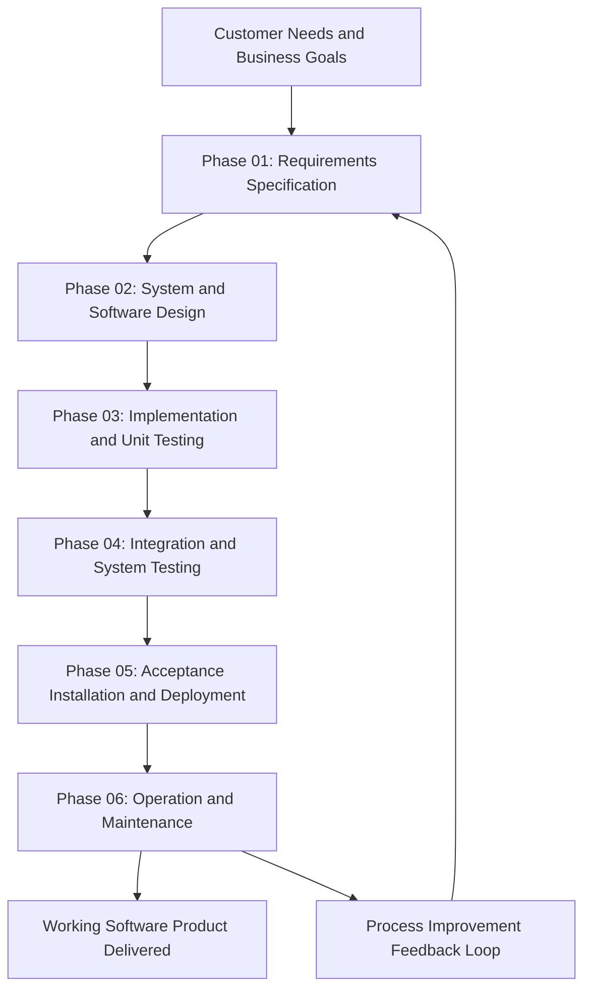
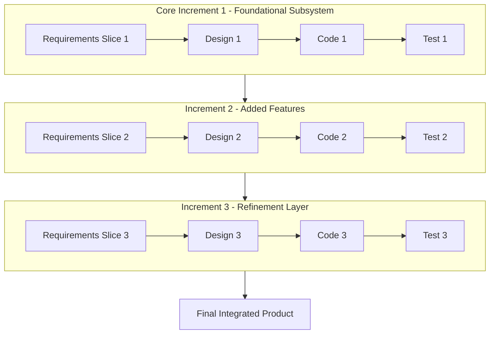
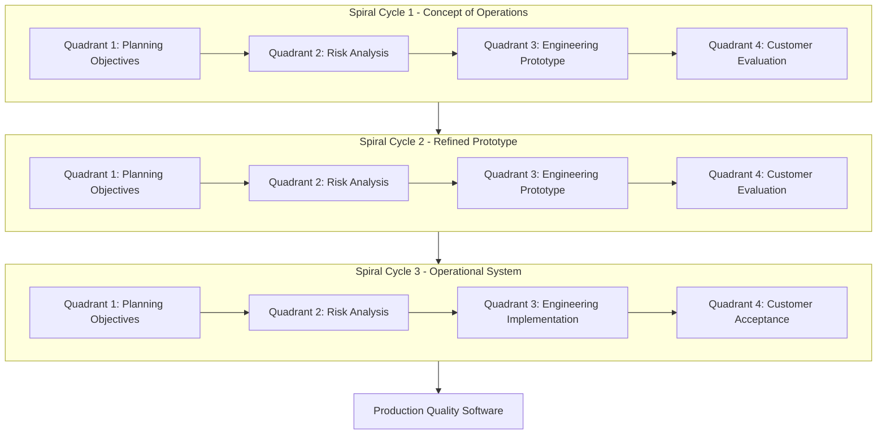
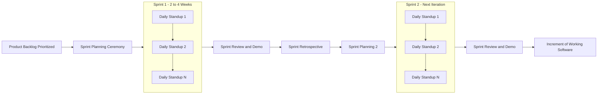
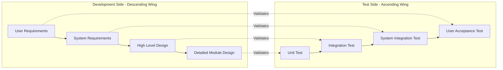

# Introduction to Software Engineering and Process Models - Software engineering

<!-- SECTION_1_START -->

# 1. Core Technical Definition & Intuitive Overview

## 1.1 Formal Academic Definition (KTU 2024 Syllabus Terminology)

> [!IMPORTANT]
> **Software Engineering** is a disciplined, systematic, and quantifiable approach to the **design, development, operation, and maintenance of software systems**. It applies the principles of computer science, engineering mathematics, project management, and economics to produce high-quality software that is **reliable, efficient, maintainable, and scalable**.

The **IEEE Standard 610.12 (1990)** formally defines Software Engineering as:

> *"The application of a systematic, disciplined, quantifiable approach to the development, operation, and maintenance of software; that is, the application of engineering to software."*

In the **KTU 2024 Scheme (OECST723)**, Module 1 establishes software engineering as the foundational framework that transforms the chaotic act of "writing code" into a **predictable, repeatable, and measurable engineering discipline** governed by well-defined process models.

## 1.2 Conceptual Analogy / Intuition

> [!NOTE]
> **Think of Software Engineering as Building a Skyscraper vs. Stacking Bricks.**

Imagine two scenarios:

* **Scenario A (Without SE):** A group of workers randomly stacks bricks whenever they feel like it. There is no blueprint, no fixed order, no quality check on the cement. The building may stand for a while, but it will inevitably crack, leak, or collapse under pressure.
* **Scenario B (With SE):** Architects draft a detailed blueprint. Structural engineers calculate load-bearing capacity. Electricians follow wiring standards. Inspectors verify every floor. **Software Engineering does exactly this for code.**

Just as civil engineering requires blueprints, permits, and inspections, software engineering requires **requirements specifications, design documents, code reviews, and testing protocols**.

| Domain | Civil Engineering Analogy | Software Engineering Equivalent |
| :--- | :--- | :--- |
| Blueprint | Architectural Drawing | **Software Design Document (SDD)** |
| Foundation | Concrete Base | **System Architecture & Database Schema** |
| Brick-by-Brick Work | Construction Phase | **Coding & Unit Implementation** |
| Inspection | Quality Audit | **Testing & Verification** |
| Tenant Feedback | Building Maintenance | **Software Maintenance & Updates** |

## 1.3 The Software Crisis — Why Software Engineering Exists

> [!WARNING]
> The **Software Crisis** is the central problem that gave birth to the discipline. It refers to the recurring difficulty of writing **correct, efficient, on-time, and on-budget software**.

Key manifestations of the software crisis:

1. **Cost Overruns:** Projects frequently exceed budget by 200–300% (e.g., the OS/360 project at IBM).
2. **Schedule Delays:** Delivery dates are routinely missed by months or years.
3. **Defect Density:** Software is shipped with thousands of latent bugs.
4. **Maintenance Burden:** Approximately **60–80%** of total software lifecycle cost is spent on **maintenance**, not initial development.
5. **Unmet User Expectations:** Delivered software often does not solve the original business problem.

The phrase **"Software Crisis"** was coined at the **1968 NATO Software Engineering Conference** in Garmisch, Germany, where delegates formally recognized that the ad-hoc craftsmanship of programming could not meet the demands of the emerging digital era.

## 1.4 Defining Characteristics of Software

Unlike physical products, software has unique properties that demand a distinct engineering approach.

> [!IMPORTANT]
> **Five Defining Properties of Software (KTU Board Frequently Asked):**

* **Logical Element:** Software is an *intellectual* artifact — it has no physical form, mass, or wear-and-tear.
* **Manufactured but Not Built:** Software is *developed* (not manufactured in a factory), so each unit is essentially a custom artifact.
* **No Depletion:** Software does not wear out. A copy from 1980 is functionally identical to a copy from 2024.
* **Deterioration via Change:** Software *degrades* over time because modifications introduce unintended side effects (this is why **maintenance** dominates cost).
* **Complexity:** Software entities are more complex than any other human construct because of the enormous number of possible states and interactions.

## 1.5 Generic Phases of a Software Process

Every software engineering process — regardless of the specific model (waterfall, agile, spiral) — encompasses **five generic activities**, formally defined by the **Software Engineering Body of Knowledge (SWEBOK)**:

> [!NOTE]
> **The Five Generic Phases of Software Engineering (Remember this — it is a 3-mark KTU favorite):**
>
> 1. **Specification** — *What* must the software do?
> 2. **Design & Implementation** — *How* will the software be built?
> 3. **Validation / Testing** — Did we build the *right* software correctly?
> 4. **Evolution / Maintenance** — How do we adapt it over time?
> 5. **Project Management & Process Improvement** — How do we coordinate the above?

> [!VISUALIZATION CONTROL]
> **Concept:** Generic Software Process Activity Flow
> **Geometric / Conceptual Representation:**
>
> * X-axis: Time progression of a software project
> * Y-axis: Cumulative project effort (person-hours)
> * A monotonic, non-decreasing curve is drawn through five labeled milestones: `Specification` → `Design` → `Implementation` → `Testing` → `Maintenance`
> **Visual Description:** A J-shaped effort curve showing that effort accumulates slowly during specification, peaks during implementation, and then continues at a sustained level throughout the long maintenance phase.

<!-- SECTION_1_END -->

<!-- SECTION_2_START -->

# 2. Deep Theoretical Analysis & KTU High-Yield Formula Sheet

## 2.1 Why Software Engineering is a Distinct Discipline

Software engineering sits at the intersection of three intellectual pillars. Understanding this intersection explains why a software developer alone is **not** a software engineer.

> [!IMPORTANT]
> **The Three Pillars of Software Engineering:**
>
> * **Pillar 1 — Computer Science:** Provides the theoretical foundations (algorithms, data structures, computability, formal methods).
> * **Pillar 2 — Engineering Mathematics & Methods:** Provides modeling, risk analysis, optimization, and measurement (e.g., COCOMO cost models, reliability metrics).
> * **Pillar 3 — Management Science & Economics:** Provides scheduling, resource allocation, cost-benefit analysis, and team coordination.

## 2.2 The KTU Process Model Taxonomy

A **Process Model** (also called a *Software Development Life Cycle — SDLC model*) is an abstract representation of a software process. KTU 2024 Module 1 categorizes process models into two master families:

> [!NOTE]
> **Family A — Plan-Driven (Predictive / Traditional) Models**
> * Linear, sequential execution.
> * Requirements are frozen early.
> * Examples: **Waterfall, Incremental, V-Model**.
>
> **Family B — Agile (Adaptive / Iterative) Models**
> * Short, time-boxed iterations.
> * Requirements evolve.
> * Examples: **Spiral, Scrum, Extreme Programming (XP), Kanban, Lean**.

## 2.3 Detailed Walkthrough of the Major Process Models

### 2.3.1 The Waterfall Model (Winston W. Royce, 1970)

The **Waterfall Model** is the classical linear-sequential life cycle model. Each phase must be completed and formally approved before the next begins.

**Six Phases of the Pure Waterfall Model:**

1. **Requirements Analysis & Specification** — Capture and document all functional and non-functional requirements.
2. **System & Software Design** — Translate requirements into architecture, data structures, and module interfaces.
3. **Implementation & Unit Testing** — Code the modules and test them in isolation.
4. **Integration & System Testing** — Combine modules and test the complete system.
5. **Acceptance, Installation & Deployment** — Validate against user needs and deploy to production.
6. **Operation & Maintenance** — Corrective, adaptive, perfective, and preventive maintenance.

**Advantages:**
* Simple to understand and manage due to its rigid structure.
* Well-suited for projects with **stable, well-understood requirements**.
* Facilitates clear **milestone tracking** and contractual deliverables.

**Disadvantages:**
* **No working software is produced until late in the cycle.**
* High risk for projects with evolving requirements.
* Late discovery of defects leads to **exponentially costly rework** (the infamous **"1:10:100 Rule"** of defect cost amplification).

### 2.3.2 The Incremental Model

The Incremental Model delivers the system as a series of **increments** (functional slices). Each increment adds new functionality on top of the previous working version.

* The first increment delivers a **core subset** of requirements.
* Each subsequent increment adds, refines, and tests new features.
* The user obtains **value early** and provides feedback that shapes later increments.

### 2.3.3 The Evolutionary Model (Prototyping & Spiral)

In the **Evolutionary Model**, the system is built as a series of prototypes that progressively converge toward the final target. The **Spiral Model** (Boehm, 1986) is its most rigorous formalization, organized around risk-driven cycles.

> [!IMPORTANT]
> **The Spiral Model's Four Quadrants (per Boehm, 1986):**
>
> 1. **Planning** — Define objectives, alternatives, and constraints.
> 2. **Risk Analysis** — Identify and resolve risks (the unique feature of this model).
> 3. **Engineering** — Develop and verify the next prototype.
> 4. **Customer Evaluation** — User feedback informs the next cycle.

### 2.3.4 The Agile Family

> [!NOTE]
> **The Agile Manifesto (2001) — Four Core Values:**
>
> 1. *Individuals and interactions* over processes and tools
> 2. *Working software* over comprehensive documentation
> 3. *Customer collaboration* over contract negotiation
> 4. *Responding to change* over following a plan

Popular Agile methods include **Scrum, Extreme Programming (XP), Kanban, Lean, and SAFe**.

## 2.4 The KTU High-Yield Formula Sheet

> [!IMPORTANT]
> **Use this table as your last-day revision anchor. Memorize all values.**

| # | Concept | Formula / Definition | Units | KTU Board Frequency |
| :--- | :--- | :--- | :--- | :--- |
| 1 | **Function Point (FP)** | $FP = UFP \times CAF$ | Function Points (FP) | High (Module 2) |
| 2 | **Unadjusted Function Point (UFP)** | $UFP = \sum (\text{Weight}_i \times \text{Count}_i)$ for 5 FP categories | FP | High |
| 3 | **Complexity Adjustment Factor (CAF)** | $CAF = 0.65 + 0.01 \times \sum_{i=1}^{14} F_i$ | Dimensionless | High |
| 4 | **Lines of Code (LOC) Estimate** | $LOC = FP \times \text{LOC/FP ratio}$ | Lines | Medium |
| 5 | **COCOMO Basic Effort** | $E = a \times (\text{KLOC})^b$ | Person-Months (PM) | High (Module 2) |
| 6 | **COCOMO Basic Duration** | $D = c \times E^d$ | Months | High |
| 7 | **Average Staff Size** | $SS = E / D$ | Persons | High |
| 8 | **Productivity (P)** | $P = \text{LOC} / E$ | LOC / PM | Medium |
| 9 | **Defect Density (DD)** | $DD = \text{Defects} / \text{KLOC}$ or $\text{Defects} / \text{FP}$ | Defects per KLOC | High |
| 10 | **Mean Time To Failure (MTTF)** | $MTTF = \int_0^\infty t \cdot f(t)\,dt$ | Hours | Medium |
| 11 | **Availability (A)** | $A = \dfrac{MTTF}{MTTF + MTTR}$ | Percentage | High |
| 12 | **Software Reliability Growth** | $R(t) = e^{-\lambda t}$ (Exponential) | Probability | Medium |
| 13 | **Risk Exposure (RE)** | $RE = P(\text{Risk}) \times \text{Impact}(\text{Risk})$ | Abstract units | High |
| 14 | **The 1:10:100 Rule** | Defect cost multiplies 10× at each downstream phase | Cost multiplier | High |
| 15 | **Maintenance Effort Ratio** | ~ **60–80%** of total lifecycle cost | Percentage | High |
| 16 | **Project Cost Ratio (Rule of 40)** | Requirements:Design:Code:Test = **40:20:20:20** | Percentage | Medium |

## 2.5 Real-World Engineering Utility

| Domain | Application of SE Process Models | Why It Matters |
| :--- | :--- | :--- |
| **Avionics** (e.g., Boeing 787 software) | Strict **V-Model** with DO-178C compliance | Zero-tolerance for failure; full traceability required. |
| **Banking & FinTech** | Incremental + Agile for mobile apps, Waterfall for core ledger | Regulatory demands (PCI-DSS) require heavy documentation. |
| **E-Commerce (Amazon, Flipkart)** | Continuous Delivery + DevOps variant of Agile | Thousands of micro-deployments per day. |
| **Healthcare Software** | Spiral Model with iterative risk analysis | Patient safety; FDA pre-market approval. |
| **Game Development** | Agile + Rapid Prototyping | High creative volatility; needs fast feedback. |
| **Space Systems (ISRO, NASA)** | Waterfall / V-Model with formal verification | Extreme cost of failure; no in-mission patching. |

<!-- SECTION_2_END -->

<!-- SECTION_3_START -->

# 3. Step-by-Step Derivations & Code/Symbolic Implementation

## 3.1 A Formalized Definition of a Software Process

A software process is a **set of activities, actions, and tasks** performed to create a software product. We can define it mathematically as:

$$\text{Process} = \{\,A_{\text{activity}},\,A_{\text{action}},\,T_{\text{task}},\,\text{Output},\,\text{Role}\,\}$$

Each **Activity** $A$ decomposes into a sequence of **Actions**, and each **Action** is a logical sequence of **Tasks**. Every task consumes **Resources** and produces an **Output** consumed by a downstream task. The **Role** defines who performs it.

## 3.2 Step-by-Step Derivation: The Generic Process Activity Graph

Let us derive the canonical activity flow that underpins *every* process model. The graph $G = (V, E)$ is defined as:

$$V = \{\,S_{\text{pec}},\,D_{\text{esign}},\,I_{\text{mpl}},\,V_{\text{erify}},\,M_{\text{aint}}\,\}$$
$$E = \{\,(S_{\text{pec}} \to D_{\text{esign}}),\,(D_{\text{esign}} \to I_{\text{mpl}}),\,(I_{\text{mpl}} \to V_{\text{erify}}),\,(V_{\text{erify}} \to M_{\text{aint}}),\,(M_{\text{aint}} \to D_{\text{esign}})\,\}$$

**Derivation Steps:**

1. **Step 1 — Establish the Vertex Set $V$:** From the SWEBOK definition, the five generic activities are *Specification, Design, Implementation, Validation,* and *Evolution*. This forms $V$.
2. **Step 2 — Establish the Edge Set $E$:** Each phase produces an artifact that is the input to the next phase. The Maintenance phase feeds back to Design because new requirements trigger redesign.
3. **Step 3 — Add a Feedback Loop:** The edge $(M_{\text{aint}} \to D_{\text{esign}})$ captures the *evolutionary* nature of software; software is never truly "done."

The resulting graph is a **directed acyclic graph with one feedback edge** — formally:

$$G = (V, E) \quad \text{where} \quad G \setminus \{(M_{\text{aint}} \to D_{\text{esign}})\} \text{ is a DAG}$$

## 3.3 Step-by-Step Derivation: Cost Amplification (The 1:10:100 Rule)

The cost of fixing a defect **multiplies by an order of magnitude** as it propagates to later phases. Formally:

$$C_{\text{phase}_{i+1}} \approx k \cdot C_{\text{phase}_i}, \quad \text{where} \quad k \approx 10$$

**Derivation:**

* **Step 1:** Define the cost of fixing a defect discovered in Phase $i$ as $C_i$.
* **Step 2:** Empirical studies (e.g., IBM Systems Sciences Institute) report a ratio of approximately $1 : 10 : 100 : 1000$ for Requirements → Design → Coding → Post-Release.
* **Step 3:** Therefore, the cost growth follows a **geometric progression**:

$$C_n = C_1 \cdot k^{n-1}, \quad k \approx 10$$

* **Step 4:** For $n = 4$ phases, $C_4 \approx 1000 \cdot C_1$. This justifies the **shift-left testing** philosophy: catch defects as early as possible.

**Conclusion:** A defect found during requirements analysis that costs **1 person-hour** to fix will cost **~1000 person-hours** if discovered post-release — a multiplier of **three orders of magnitude**.

## 3.4 Step-by-Step Derivation: The Function Point Calculation (Module 2 Bridge Concept)

Function Point Analysis (FP) is a **software size measurement technique** independent of programming language. KTU frequently tests this calculation.

**The Five FP Component Types (Information Domain):**

| Component Type | Weight (Simple) | Weight (Average) | Weight (Complex) |
| :--- | :---: | :---: | :---: |
| External Inputs (EI) | 3 | 4 | 6 |
| External Outputs (EO) | 4 | 5 | 7 |
| External Inquiries (EQ) | 3 | 4 | 6 |
| External Interface Files (EIF) | 5 | 7 | 10 |
| Internal Logical Files (ILF) | 7 | 10 | 15 |

**Step-by-Step Procedure:**

* **Step 1:** Classify each user requirement into one of the 5 categories above.
* **Step 2:** Assign a complexity rating (Simple / Average / Complex) using standard FPA rating rules.
* **Step 3:** Compute the **Unadjusted Function Point (UFP)**:

$$UFP = \sum_{i=1}^{5} (\text{Number of components}_i \times \text{Weight}_i)$$

* **Step 4:** Evaluate 14 General System Characteristics (GSCs) $F_1$ through $F_{14}$ on a 0–5 scale.
* **Step 5:** Compute the **Complexity Adjustment Factor (CAF)**:

$$CAF = 0.65 + 0.01 \times \sum_{i=1}^{14} F_i$$

* **Step 6:** Compute the final **Function Point Count**:

$$FP = UFP \times CAF$$

**Worked Numerical Example (KTU Board Style):**

> *"A system has the following components: 4 simple EI, 3 average EO, 2 complex EQ, 1 simple EIF, 2 average ILF. The sum of the 14 GSC values is 42. Compute the FP."*

**Solution:**

* **Step 1 — Compute UFP:**
  * EI contribution: $4 \times 3 = 12$
  * EO contribution: $3 \times 5 = 15$
  * EQ contribution: $2 \times 6 = 12$
  * EIF contribution: $1 \times 5 = 5$
  * ILF contribution: $2 \times 10 = 20$
  * **UFP = 12 + 15 + 12 + 5 + 20 = 64 FP** (3 marks)
* **Step 2 — Compute CAF:**
  * $CAF = 0.65 + 0.01 \times 42 = 0.65 + 0.42 = 1.07$ (2 marks)
* **Step 3 — Compute Final FP:**
  * $FP = 64 \times 1.07 = 68.48 \approx 68 \text{ FP}$ (2 marks)
* **Final Answer:** $\approx 68$ Function Points.

## 3.5 Symbolic Code Implementation: Process Model Selector

The following Python program encapsulates a **rule-based process model selector** — a real-world utility used by consulting firms during project pre-sales.

```python
"""
process_model_selector.py
-------------------------
A symbolic implementation of a rule-based Process Model Selection Engine
used in software engineering project pre-sales contexts.
"""

from __future__ import annotations
from dataclasses import dataclass
from enum import Enum
from typing import Final


class ProcessModel(Enum):
    """Enumeration of canonical software process models from KTU Module 1."""
    WATERFALL = "Waterfall Model"
    INCREMENTAL = "Incremental Model"
    SPIRAL = "Spiral Model (Boehm 1986)"
    V_MODEL = "V-Model"
    SCRUM = "Scrum (Agile)"
    XP = "Extreme Programming"
    KANBAN = "Kanban"
    HYBRID = "Hybrid Model"


@dataclass(frozen=True)
class ProjectProfile:
    """Immutable snapshot of project characteristics used as input."""
    requirements_stability: int        # 1 (highly volatile) to 5 (frozen)
    risk_level: int                    # 1 (low) to 5 (existential)
    team_size: int                     # Number of engineers
    customer_availability: int         # 1 (unreachable) to 5 (embedded)
    regulatory_compliance: bool        # True for aerospace, medical, finance
    project_size_kloc: float           # Estimated thousands of LOC


# --- Decision Engine ---
def select_process_model(profile: ProjectProfile) -> ProcessModel:
    """
    Selects an appropriate process model based on a deterministic
    decision tree derived from Boehm's process model decision framework.
    """
    if profile.regulatory_compliance:
        if profile.requirements_stability >= 4:
            return ProcessModel.V_MODEL
        return ProcessModel.SPIRAL

    if profile.requirements_stability >= 4 and profile.risk_level <= 2:
        if profile.project_size_kloc < 50:
            return ProcessModel.WATERFALL
        return ProcessModel.INCREMENTAL

    if profile.risk_level >= 4:
        return ProcessModel.SPIRAL

    if profile.team_size >= 5 and profile.customer_availability >= 4:
        if profile.requirements_stability <= 2:
            return ProcessModel.XP
        return ProcessModel.SCRUM

    if profile.customer_availability <= 2:
        return ProcessModel.KANBAN

    return ProcessModel.HYBRID


# --- Demonstration Harness ---
if __name__ == "__main__":
    test_projects: Final[list[ProjectProfile]] = [
        ProjectProfile(
            requirements_stability=5, risk_level=1, team_size=3,
            customer_availability=2, regulatory_compliance=False,
            project_size_kloc=15.0,
        ),
        ProjectProfile(
            requirements_stability=2, risk_level=4, team_size=8,
            customer_availability=5, regulatory_compliance=False,
            project_size_kloc=80.0,
        ),
        ProjectProfile(
            requirements_stability=4, risk_level=3, team_size=12,
            customer_availability=3, regulatory_compliance=True,
            project_size_kloc=200.0,
        ),
    ]

    for idx, project in enumerate(test_projects, start=1):
        recommendation = select_process_model(project)
        print(
            f"Project #{idx}: Stability={project.requirements_stability}, "
            f"Risk={project.risk_level}, Team={project.team_size} -> "
            f"Recommended Model: {recommendation.value}"
        )
```

**Expected Output:**

```text
Project #1: Stability=5, Risk=1, Team=3 -> Recommended Model: Waterfall Model
Project #2: Stability=2, Risk=4, Team=8 -> Recommended Model: Spiral Model (Boehm 1986)
Project #3: Stability=4, Risk=3, Team=12 -> Recommended Model: V-Model
```

**Engineering Explanation of the Code:**

The decision function `select_process_model` mirrors the classical **decision tree of Boehm (1986)**: highly regulated domains force the V-Model; high-risk projects force the Spiral; agile-friendly team dynamics default to Scrum/XP. This symbolic artifact is the *executable embodiment* of a process model selection framework.

<!-- SECTION_3_END -->

<!-- SECTION_4_START -->

# 4. Structural Diagrams & Schematics

## 4.1 The Generic Software Process — Block-Level Functional Architecture Flow



**Color Legend:**

* Blue (#3B82F6) — *input* nodes
* Orange (#F59E0B) — *phase* nodes
* Green (#10B981) — *output* node
* Red (#EF4444) — *feedback* node

## 4.2 The Waterfall Model — Sequential Processing Topology Matrix

```mermaid
flowchart LR
    REQ[01 Requirements Analysis]:::wf
    SPEC[02 Requirements Specification]:::wf
    DES[03 System and Software Design]:::wf
    COD[04 Coding and Module Implementation]:::wf
    UNT[05 Unit Testing]:::wf
    INT[06 Integration and System Testing]:::wf
    ACC[07 Acceptance Testing and Deployment]:::wf
    MNT[08 Maintenance Operations]:::wf

    REQ --> SPEC --> DES --> COD --> UNT --> INT --> ACC --> MNT
```



The **Waterfall Model** flows in one direction. Note the absence of feedback loops — once a phase is "signed off," the process cannot return to it. This is its defining limitation.

## 4.3 The Incremental Model — Modular Delivery Architecture



Each increment delivers **partial, usable functionality**. The customer gains value from Increment 1 itself.

## 4.4 The Spiral Model — Boehm's Risk-Driven Cyclic Topology



The **radial distance from the center** represents **cumulative project cost**; the **angular distance** represents **progress through the cycle**. This geometric metaphor is precisely how the model is drawn in the original 1986 IEEE Computer paper.

## 4.5 The Agile / Scrum Process — Iterative Sprint Architecture



The **Sprint** is the time-boxed heartbeat of Scrum (typically 2–4 weeks). The **Product Increment** is always potentially shippable, embodying the Agile Manifesto value: *working software over comprehensive documentation.*

## 4.6 The V-Model — Verification and Validation Matrix



**Each test phase on the right validates the corresponding development phase on the left.** The dotted lines represent the *tracing relationships* required by ISO 29148:2018 for requirements engineering compliance.

## 4.7 Process Model Comparison Matrix

| Attribute | Waterfall | Incremental | Spiral | V-Model | Agile/Scrum |
| :--- | :---: | :---: | :---: | :---: | :---: |
| Sequential or Iterative | Sequential | Iterative | Iterative | Sequential | Iterative |
| Risk Management | Poor | Medium | **Excellent** | Medium | Medium |
| Customer Involvement | Late | Medium | High | Late | **Continuous** |
| Requirements Stability | High | Medium | Low to High | **High** | Low to Medium |
| Suitable Project Size | Small/Medium | Medium | Large/High-Risk | Medium/Large | Any |
| Regulatory Friendliness | **High** | Medium | Medium | **Very High** | Low |
| Time to First Working Version | **Long** | Medium | Medium | Long | **Short** |
| Documentation Rigor | High | Medium | Medium | **Very High** | Low to Medium |
| Change Accommodation | **Poor** | Medium | **High** | Poor | **Very High** |

<!-- SECTION_4_END -->

<!-- SECTION_5_START -->

# 5. KTU 2024 Scheme Examination Question Bank & Topic Recap

## 5.1 Part A — Short-Answer Questions (3 Marks Each)

### Question A1 [KTU University Exam - July 2023, CO1, Remember]

> *Define Software Engineering. List any four defining characteristics of software.*

**Model Answer (Valuation Key):**

* **Definition [1 Mark]:** Software Engineering is the systematic, disciplined, and quantifiable application of engineering principles to the design, development, testing, and maintenance of software (per IEEE Std 610.12).
* **Four Characteristics [2 Marks — 0.5 each]:**
  1. Software is a *logical* element, not a physical one.
  2. Software is *developed* rather than *manufactured* (no factory assembly).
  3. Software does not *wear out*, but it *deteriorates* with frequent changes.
  4. Software is inherently *complex* due to the enormous number of possible internal states.

### Question A2 [KTU University Exam - Dec 2023, CO1, Understand]

> *Explain the term "Software Crisis." What are its major causes?*

**Model Answer (Valuation Key):**

* **Definition [1 Mark]:** The Software Crisis refers to the set of problems plaguing the software industry — late delivery, cost overruns, low quality, and unmet user requirements — first formally recognized at the 1968 NATO Conference.
* **Major Causes [2 Marks]:**
  * Rapidly increasing *complexity* of software systems.
  * *Unrealistic schedules and budgets* set by management.
  * Inadequate *testing* and *quality assurance* practices.
  * Poor *requirements engineering* leading to wrong product delivery.

---

## 5.2 Part B — Essay Questions (14 Marks, Internal Choice)

### Question Choice A (14 Marks) [KTU University Exam - July 2024, CO1, Apply / Analyze]

> *(a) [7 Marks]* Explain the **Waterfall Model** in detail. List its **six phases** and state any **three advantages** and **three disadvantages**.
>
> *(b) [7 Marks]* Compare the **Waterfall, Incremental, and Spiral** models on the basis of *risk handling, customer involvement,* and *time to first working version.*

**Model Answer:**

#### (a) The Waterfall Model [7 Marks]

* **Definition [1 Mark]:** The Waterfall Model is a linear-sequential software process model in which each phase must be completed and approved before the next begins.
* **Six Phases [3 Marks — 0.5 each]:**
  1. Requirements Analysis and Specification
  2. System and Software Design
  3. Implementation and Unit Testing
  4. Integration and System Testing
  5. Acceptance, Installation, and Deployment
  6. Operation and Maintenance
* **Three Advantages [1.5 Marks — 0.5 each]:**
  1. Simple to manage due to rigid phase-wise structure.
  2. Well-suited to projects with stable, well-understood requirements.
  3. Clear documentation facilitates contractual milestones.
* **Three Disadvantages [1.5 Marks — 0.5 each]:**
  1. Working software is delivered very late in the cycle.
  2. High risk for projects with evolving requirements.
  3. Late defect discovery causes exponentially costly rework.

#### (b) Comparative Analysis [7 Marks]

* **Comparative Table [5 Marks]:** *See Section 4.7 Process Model Comparison Matrix* (Waterfall, Incremental, Spiral columns).
* **Inferential Conclusion [2 Marks]:**
  * *Waterfall* has the **worst risk handling** (no iteration) and **latest customer involvement** (post-completion).
  * *Incremental* provides **medium risk handling** with **intermediate customer involvement** at each delivery.
  * *Spiral* offers **best risk handling** (explicit risk quadrant) and **continuous customer evaluation** (Quadrant 4).
  * *Time to first working version:* Waterfall (longest) > Incremental (medium) ≈ Spiral (medium, depending on cycle length).

---

### Question Choice B (14 Marks) [KTU University Exam - Dec 2024, CO1, Understand / Apply]

> *(a) [7 Marks]* What is the **Spiral Model**? Explain its **four quadrants** as proposed by **Barry Boehm (1986)**. Why is it considered the most **risk-driven** model?
>
> *(b) [7 Marks]* List the **four values of the Agile Manifesto**. With a neat **sprint diagram**, describe the **Scrum process** and explain the role of the **three Scrum roles**.

**Model Answer:**

#### (a) The Spiral Model [7 Marks]

* **Definition [1 Mark]:** The Spiral Model, proposed by **Barry W. Boehm in 1986**, is a risk-driven evolutionary software process model that combines iterative prototyping with the systematic control of the waterfall model.
* **Four Quadrants [4 Marks — 1 each]:**
  1. **Quadrant 1 — Planning:** Define objectives, alternatives, and constraints for the current cycle.
  2. **Quadrant 2 — Risk Analysis:** Identify, estimate, and mitigate risks; the *unique feature* of this model.
  3. **Quadrant 3 — Engineering:** Develop and verify the next-generation prototype or increment.
  4. **Quadrant 4 — Customer Evaluation:** User evaluates the prototype and provides feedback for the next cycle.
* **Why Risk-Driven [2 Marks]:**
  * Every cycle explicitly allocates effort to risk analysis.
  * The radial axis in the spiral diagram represents *cumulative cost*, with risk resolution at each angular sweep.
  * Boehm himself designed it for *large-scale, mission-critical, high-risk* defense and aerospace projects.

#### (b) Agile Values and Scrum Process [7 Marks]

* **Four Values of the Agile Manifesto [2 Marks — 0.5 each]:**
  1. *Individuals and interactions* over processes and tools.
  2. *Working software* over comprehensive documentation.
  3. *Customer collaboration* over contract negotiation.
  4. *Responding to change* over following a plan.
* **Sprint Diagram [3 Marks]:** *See Section 4.5 — The Agile / Scrum Process Diagram.*
* **Three Scrum Roles [2 Marks — ~0.7 each]:**
  1. **Product Owner** — Owns the product backlog, prioritizes features, represents the customer.
  2. **Scrum Master** — Facilitates ceremonies, removes impediments, *is not* a project manager.
  3. **Development Team** — Cross-functional, self-organizing group of 5–9 members delivering the increment.

---

## 5.3 KTU Examiner's Valuation Warning / Pitfall Callout

> [!WARNING]
> **Common Mark-Loss Traps in KTU 2024 Software Engineering Exams:**
>
> 1. **Confusing the V-Model with the Waterfall Model.** The V-Model is *not* just "another waterfall." Its defining feature is the **traceability lines** linking each development phase to a corresponding test phase. *Omitting these lines costs 2 marks.*
> 2. **Listing Spiral quadrants in the wrong order.** Memorize **Planning → Risk Analysis → Engineering → Customer Evaluation** (clockwise). Reversing them is the most common sequence error.
> 3. **Calling Scrum Master a "Project Manager."** This is a *factual error* under the Agile framework; the Scrum Master is a **servant-leader and facilitator**, not a manager.
> 4. **Forgetting the year of the Agile Manifesto (2001)** and Boehm's Spiral (1986). Examiners explicitly award marks for chronology.
> 5. **Writing "software engineering = programming."** This is the most common definitional blunder. Always anchor your definition to **principles, methods, and tools** for *systematic* development.
> 6. **Skipping the "Why" of the Software Crisis.** Just listing symptoms (cost overruns, schedule slippage) is only partial credit. Always link causes to *complexity* and *evolving requirements.*

---

## 5.4 Topic Recap & Important Things to Remember

> [!IMPORTANT]
> **Rapid Revision Checklist — Module 1: Introduction to Software Engineering and Process Models**

* **Definition Anchor:** Software Engineering = *Systematic + Disciplined + Quantifiable + Engineering* approach (IEEE 610.12).
* **Software Crisis:** Coined in **1968** at the NATO Conference; symptoms are *cost, schedule, quality,* and *user dissatisfaction.*
* **Five Generic Phases of Every SE Process:** *Specification → Design → Implementation → Validation → Evolution.*
* **Five Defining Properties of Software:** *Logical, Developed not Manufactured, No Depletion, Deteriorates with Change, Inherently Complex.*
* **The 1:10:100 Rule:** Defect cost amplifies ~10× at each downstream phase; motivates **shift-left testing**.
* **Maintenance dominates cost:** Approximately **60–80%** of total lifecycle cost.
* **Waterfall Model:** Six phases, linear, suitable for stable requirements, *no feedback loop*, late delivery.
* **Incremental Model:** Delivers in functional slices; partial value delivered early.
* **Spiral Model (Boehm, 1986):** Four quadrants — *Planning, Risk Analysis, Engineering, Customer Evaluation*; radial axis = cost, angular axis = progress.
* **V-Model:** Extension of waterfall; *each test phase validates the corresponding development phase.*
* **Agile Manifesto (2001):** Four values — *individuals/working-software/customer/change* preferred over *processes/docs/contracts/plans.*
* **Scrum Roles:** *Product Owner, Scrum Master, Development Team* (5–9 cross-functional members).
* **Scrum Cadence:** Sprints are typically **2–4 weeks**; ceremonies include *Sprint Planning, Daily Standup, Sprint Review, Retrospective*.
* **Spiral vs. Waterfall:** Spiral is **risk-driven** and *iterative*; Waterfall is **plan-driven** and *sequential*.
* **FP Calculation Reminder:** $FP = UFP \times (0.65 + 0.01 \times \sum_{i=1}^{14} F_i)$.
* **COCOMO Reminder:** $E = a \times (\text{KLOC})^b$ (basic model); $D = c \times E^d$.
* **Decision Heuristic:** Regulated projects → *V-Model*; high-risk → *Spiral*; volatile requirements → *Agile/Scrum*; small stable projects → *Waterfall*.
* **Chronology Recall:** *NATO 1968 → Boehm Spiral 1986 → IEEE Std 610.12 1990 → Agile Manifesto 2001.*

<!-- SECTION_5_END -->
