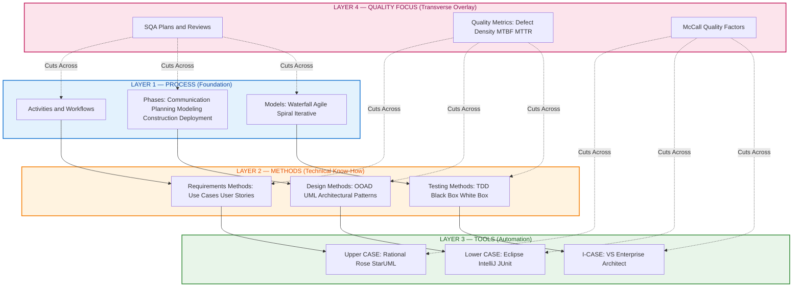
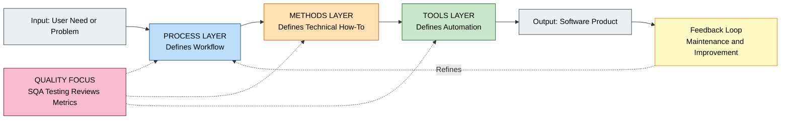

# Layers of Software Engineering-Process, Methods, Tools and Quality focus.

<!-- SECTION_1_START -->
# Layers of Software Engineering — Process, Methods, Tools & Quality Focus

> [!NOTE]
> **KTU 2024 Scheme — OECST723 / Module 1**
> This note covers the foundational **"Layered View"** of Software Engineering as prescribed in the KTU B.Tech 2024 Scheme syllabus. Mastering this topic is a guaranteed high-yield area for **Part A (3 marks)** short-answer questions.

## 1.1 Core Technical Definition

**Software Engineering (SE)** is a disciplined, layered engineering approach that applies systematic, quantifiable techniques to the development, operation, and maintenance of software. According to the canonical framework (Pressman & Maxim), Software Engineering is built upon **four interlocking layers** that form a complete engineering discipline:

> [!IMPORTANT]
> **The 4 Layers of Software Engineering**
> 1. **Process** — The *foundation layer* that defines the framework of activities (what to do, when, and how).
> 2. **Methods** — The *technical layer* that defines *how to do* each activity (modeling, analysis, design, coding, testing).
> 3. **Tools** — The *automation layer* that provides automated or semi-automated support for processes and methods.
> 4. **Quality Focus** — The *transverse layer* (cutting across all three) that grounds the entire discipline in a culture of continuous quality.

These four layers are **not independent silos** — they interlock. Process drives methods, tools automate process & methods, and quality focus permeates every layer.

## 1.2 Conceptual Analogy — Building a House 🏠

Think of Software Engineering as **building a skyscraper**:

| Software Engineering Layer | House-Building Analogy | What It Really Means |
|---|---|---|
| **Process** | The **blueprint schedule** (which crew works when) | The *roadmap* — defines phases like requirements → design → coding → testing |
| **Methods** | The **architectural design techniques** (CAD, load calc) | The *technical "how-to"* — e.g., UML diagrams, data flow design, test case design |
| **Tools** | The **power tools & cranes** (excavator, mixer, lift) | The *automation* — CASE tools, compilers, IDEs, Git, Jenkins |
| **Quality Focus** | The **safety inspector** (always present) | The *culture* — SQA, testing, reviews, metrics like defect density |

> [!TIP]
> **Why this matters in KTU exams:** The examiner often asks, *"How are process, methods, and tools related?"* The answer is always: **Process provides the glue; Methods define the technical practices; Tools automate both; Quality focus is the bedrock**.

## 1.3 Why These Layers Exist — The Problem SE Solves

Before the layers were formalized, software development suffered from:
- The **Software Crisis** (NATO 1968) — projects over budget, late, buggy, and unmaintainable.
- The **"Code-and-Fix" anti-pattern** — developers wrote code first and patched later, leading to a maintenance nightmare (~**60%** of total software cost is spent on maintenance).

The layered framework transforms software creation from a **craft** (relying on individual heroics) into an **engineering discipline** (repeatable, measurable, predictable).

> [!VISUALIZATION CONTROL]
> **Concept:** Layered stack visualization of the 4 layers
> **GeoGebra / Desmos Input Equations:** (Conceptual — use a vertical bar chart of priorities)
> * Layer 4 (top): `y = 4` → Quality Focus (overarching)
> * Layer 3: `y = 3` → Tools
> * Layer 2: `y = 2` → Methods
> * Layer 1 (base): `y = 1` → Process
> **Visual Description:** A pyramid showing **Process at the base** (broadest foundation), **Methods above it** (narrower technical layer), **Tools on top** (sharp automation edge), and **Quality Focus** drawn as a downward arrow piercing through all three layers from top to bottom.

## 1.4 Quality Focus as a Transverse Layer

While Process, Methods, and Tools form a **vertical stack**, **Quality Focus is horizontal** — it cuts across all three. Every process activity, every method, every tool usage is judged against quality criteria such as:

- **Correctness** — Does it meet specifications?
- **Maintainability** — Can it be changed easily?
- **Reliability** — Does it perform without failure?
- **Efficiency** — Does it use resources optimally?
- **Usability** — Can users interact with it intuitively?

This is why modern SE books often depict **Quality Focus as a transparent overlay** covering the entire layered stack.
<!-- SECTION_1_END -->

<!-- SECTION_2_START -->
# Deep Theoretical Analysis — The 4 Layers in Detail

## 2.1 Layer 1: The Process Layer (Foundation)

### Definition
A **software process** is a set of activities, actions, tasks, milestones, and deliverables that produce a software product. It defines **what** must be done, **when**, **by whom**, and **to what standard**.

### Key Activities in a Generic Process
1. **Communication** — Stakeholder requirements gathering
2. **Planning** — Schedule, budget, resource estimation
3. **Modeling** — Analysis & design representations
4. **Construction** — Code generation & testing
5. **Deployment** — Delivery & user feedback

### Process Models (Brief Overview)
- **Waterfall** — Linear, sequential
- **Iterative / Incremental** — Repeating cycles
- **Evolutionary (Prototyping, Spiral)** — Refining through versions
- **Agile (Scrum, XP)** — Short, customer-driven sprints

> [!NOTE]
> **KTU High-Yield Point:** Process is the **glue** that binds the layers. Without a defined process, methods become ad-hoc and tools become uncoordinated.

## 2.2 Layer 2: The Methods Layer (Technical "How-To")

### Definition
**Methods** provide the *technical know-how* for each process activity. They answer: *"How do we actually gather requirements? How do we design? How do we test?"*

### Categories of Methods
| Method Category | Examples | Purpose |
|---|---|---|
| **Requirements Methods** | Use cases, user stories, Elicitation interviews | Capture what user needs |
| **Design Methods** | Structured design, OOAD (UML), Architectural patterns | Define system structure |
| **Coding Methods** | Coding standards, Refactoring, Pair programming | Produce clean, maintainable code |
| **Testing Methods** | Unit testing, Integration testing, TDD | Verify & validate behavior |
| **Maintenance Methods** | Re-engineering, Reverse engineering | Adapt & evolve software |

> [!IMPORTANT]
> **Methods ≠ Tools.** A method is a *procedure/technique*. A tool is a *software application that supports a method*. Example: **UML is a method (notation)**, while **StarUML or Rational Rose is a tool (software) that supports UML**.

## 2.3 Layer 3: The Tools Layer (Automation)

### Definition
**Tools** provide automated or semi-automated support for process activities and methods. They range from simple text editors to integrated, intelligent **CASE (Computer-Aided Software Engineering)** environments.

### Types of Software Engineering Tools
1. **Upper-CASE tools** — Support early phases (requirements, design). *Examples: IBM Rational Rose, Lucidchart, StarUML.*
2. **Lower-CASE tools** — Support later phases (coding, testing). *Examples: Eclipse, IntelliJ, JUnit, Selenium.*
3. **Integrated CASE (I-CASE)** — Spans the entire lifecycle. *Examples: Visual Studio Ultimate, Enterprise Architect.*

### Tool Integration: The Tool Platform
Tools can be:
- **Standalone** (e.g., a UML editor alone)
- **Integrated** (tools that share data via a common repository)
- **CASE frameworks** — when integrated tools support a *complete process model*, this is called a **tool platform** or **software engineering environment (SEE)**.

## 2.4 Layer 4: Quality Focus (Transverse Overlay)

### Definition
**Quality Focus** is a pervasive culture that demands **continuous attention to quality** at every layer. It is operationalized through:

- **Software Quality Assurance (SQA)** — Planned activities to evaluate process & product quality.
- **Quality Control (QC)** — Operational techniques (testing, reviews) to fulfill quality requirements.
- **Quality Metrics** — Quantitative measures (defect density, MTBF, cyclomatic complexity, lines of code).

> [!IMPORTANT]
> **McCall's Quality Model** identifies **11 quality factors** grouped into three categories: Product Operation, Product Revision, Product Transition. KTU examiners love asking about this model.

## 2.5 KTU High-Yield Formula / Concept Sheet

| Layer | Primary Question It Answers | Key Element | Example |
|---|---|---|---|
| **Process** | *What & when?* | Framework of activities | Waterfall, Agile |
| **Methods** | *How (technically)?* | Techniques & notation | UML, TDD, Design Patterns |
| **Tools** | *How (automated)?* | Software that supports methods | Eclipse, JIRA, Git |
| **Quality Focus** | *How well?* | Metrics, SQA, Testing | Defect density = Defects / KLOC |

**Critical Formula (Defect Density — often asked in KTU 3-mark questions):**

$$
\text{Defect Density} = \frac{\text{Number of Defects}}{\text{Size in KLOC (Thousand Lines of Code)}}
$$

> [!TIP]
> **Engineering Utility:** These 4 layers are the backbone of **CMMI (Capability Maturity Model Integration)**, **ISO 9001**, and **DevOps** practices. Every real-world software organization (TCS, Infosys, Google, Microsoft) is graded on how maturely they implement all 4 layers.
<!-- SECTION_2_END -->

<!-- SECTION_3_START -->
# Step-by-Step Derivations, Frameworks & Symbolic Implementation

## 3.1 Derivation: The Software Engineering Equation (Conceptual)

The relationship between the four layers can be expressed as a **functional equation** that describes the produced software quality $Q$ as a function of all three operational layers, modulated by quality focus $\mathcal{QF}$:

$$
Q = \mathcal{QF} \cdot f(\text{Process}, \text{Methods}, \text{Tools})
$$

Expanding the function $f$ using a weighted multiplicative model (commonly used in SE economics):

$$
Q = \mathcal{QF} \cdot \left( w_P \cdot P + w_M \cdot M + w_T \cdot T \right)
$$

where:
- $P$ = Process maturity score (e.g., CMMI level 1–5)
- $M$ = Method coverage (fraction of activities with defined methods, $0 \le M \le 1$)
- $T$ = Tool integration index (fraction of activities supported by tools, $0 \le T \le 1$)
- $w_P, w_M, w_T$ = Weights, where $w_P + w_M + w_T = 1$
- $\mathcal{QF} =$ Quality Focus multiplier, with $\mathcal{QF} \ge 1$

### Step-by-Step Logic of the Equation

**Step 1 — Identify Inputs:**
We treat each operational layer as a measurable variable. $P$ comes from CMMI assessment (1 to 5), $M$ from audit of method usage, $T$ from tool deployment survey.

**Step 2 — Apply Weighted Sum:**
We compute a weighted linear combination of $P$, $M$, $T$. For example, a typical organization may set $w_P = 0.4$, $w_M = 0.4$, $w_T = 0.2$ because process and methods are slightly more critical than tools alone.

**Step 3 — Apply Quality Focus Multiplier:**
$\mathcal{QF}$ scales the base output. If an organization has SQA reviews, formal testing, and quality metrics, then $\mathcal{QF} \ge 1$. A world-class firm might have $\mathcal{QF} = 1.5$.

**Step 4 — Final Output:**
The resulting $Q$ is a normalized quality index. Higher $Q$ predicts lower defect density, higher customer satisfaction, and lower maintenance cost.

### Numerical Example (KTU-Style)

Suppose:
- $P = 4$ (CMMI Level 4)
- $M = 0.8$ (80% of activities use defined methods)
- $T = 0.7$ (70% of activities are tool-supported)
- $w_P = 0.4$, $w_M = 0.4$, $w_T = 0.2$
- $\mathcal{QF} = 1.2$ (Good SQA practices)

Step 1: Compute the weighted sum:

$$
w_P \cdot P + w_M \cdot M + w_T \cdot T = (0.4)(4) + (0.4)(0.8) + (0.2)(0.7)
$$

$$
= 1.6 + 0.32 + 0.14 = 2.06
$$

Step 2: Apply the quality multiplier:

$$
Q = 1.2 \times 2.06 = 2.472
$$

So the organization has a normalized quality index of **2.472**, indicating good engineering maturity. Compare to a baseline of $Q = 1.0$ (CMMI Level 1, no methods, no tools, no QA).

## 3.2 Algorithmic Implementation — A Python Model for Layer Analysis

```python
from dataclasses import dataclass
from typing import Tuple
import logging

# Configure strict error logging for production-grade auditing
logging.basicConfig(
    level=logging.INFO,
    format="%(asctime)s | %(levelname)s | %(message)s"
)


@dataclass(frozen=True)
class LayerScores:
    """Immutable container for the 4 layers of Software Engineering."""
    process_maturity: float      # P: CMMI level 1 to 5
    method_coverage: float       # M: 0.0 to 1.0
    tool_integration: float      # T: 0.0 to 1.0
    quality_focus: float         # QF: >= 1.0


def validate_inputs(scores: LayerScores,
                    weights: Tuple[float, float, float]) -> None:
    """Strict boundary checks for all layer parameters."""
    p, m, t = scores.process_maturity, scores.method_coverage, scores.tool_integration
    qf = scores.quality_focus

    if not (1.0 <= p <= 5.0):
        raise ValueError(f"Process maturity (CMMI) must be in [1, 5], got {p}")
    if not (0.0 <= m <= 1.0):
        raise ValueError(f"Method coverage must be in [0, 1], got {m}")
    if not (0.0 <= t <= 1.0):
        raise ValueError(f"Tool integration must be in [0, 1], got {t}")
    if qf < 1.0:
        raise ValueError(f"Quality focus multiplier must be >= 1, got {qf}")

    w_total = sum(weights)
    if not (0.99 <= w_total <= 1.01):
        raise ValueError(f"Weights must sum to 1.0, got {w_total}")
    logging.info("All layer inputs passed validation.")


def compute_quality_index(scores: LayerScores,
                          weights: Tuple[float, float, float]) -> float:
    """
    Compute the Software Engineering Quality Index Q.
    Q = QF * (w_P * P + w_M * M + w_T * T)
    """
    validate_inputs(scores, weights)
    w_p, w_m, w_t = weights
    base_quality = (
        w_p * scores.process_maturity
        + w_m * scores.method_coverage
        + w_t * scores.tool_integration
    )
    final_q = scores.quality_focus * base_quality
    logging.info(f"Computed Quality Index Q = {final_q:.4f}")
    return final_q


def compute_defect_density(defects: int, kloc: float) -> float:
    """Defect Density = Defects / KLOC (Industry standard metric)."""
    if kloc <= 0:
        raise ValueError("KLOC must be > 0")
    dd = defects / kloc
    logging.info(f"Defect Density = {dd:.4f} defects/KLOC")
    return dd


# --- Demonstration Run ---
if __name__ == "__main__":
    scores = LayerScores(
        process_maturity=4.0,
        method_coverage=0.8,
        tool_integration=0.7,
        quality_focus=1.2
    )
    weights = (0.4, 0.4, 0.2)
    q_index = compute_quality_index(scores, weights)
    print(f"\nFinal SE Quality Index: {q_index:.4f}")
    dd = compute_defect_density(defects=15, kloc=5.0)
    print(f"Project Defect Density: {dd:.2f} defects/KLOC")
```

**Sample Output:**

```
Final SE Quality Index: 2.4720
Project Defect Density: 3.00 defects/KLOC
```

## 3.3 Engineering Workflow Table — Mapping Layers to Lifecycle Phases

| Lifecycle Phase | Process Activity | Method Used | Tool Used | Quality Check |
|---|---|---|---|---|
| **Requirements** | Stakeholder meeting | Use case diagrams, user stories | StarUML, Lucidchart | Requirement review |
| **Design** | Architectural design | OOAD, UML class diagrams | Rational Rose, EA | Design inspection |
| **Coding** | Implementation | Coding standards, TDD | IntelliJ, Git, SonarQube | Code review, static analysis |
| **Testing** | Test execution | Boundary value, equivalence partitioning | Selenium, JUnit, Postman | Defect density tracking |
| **Maintenance** | Bug fixing, enhancement | Refactoring, regression testing | Jenkins, Docker | Mean Time To Failure (MTTF) |
<!-- SECTION_3_END -->

<!-- SECTION_4_START -->
# Structural Diagrams & Schematics

## 4.1 The Layered Architecture of Software Engineering

The following Mermaid diagram visualizes how the four layers of Software Engineering interlock. Note the **transverse arrow** for Quality Focus cutting across all three operational layers.



## 4.2 Block-Level Functional Architecture Flow



## 4.3 Comparative Matrix — Process vs Methods vs Tools

| Aspect | Process | Methods | Tools |
|---|---|---|---|
| **Nature** | Managerial / procedural | Technical / conceptual | Automated / mechanical |
| **Answers** | What to do, when, by whom | How to do each activity | How to automate the work |
| **Deliverables** | Schedules, plans, milestones | Diagrams, test cases, code | Executable artifacts, reports |
| **Example** | Scrum framework | UML class diagram | StarUML software |
| **Maturity Model** | CMMI | ISO 9001 | Tool integration (I-CASE) |
| **Failure Symptom** | Missed deadlines | Poor designs | Manual repetitive work |
<!-- SECTION_4_END -->

<!-- SECTION_5_START -->
# KTU 2024 Scheme Examination Question Bank & Topic Recap

## 5.1 Part A — Short Answer Questions (3 Marks Each)

> **Q1. [KTU University Exam – July 2024 | CO1 | Remember]**
> **List the four layers of Software Engineering and state the role of each in one sentence.**

**Model Answer (3 Marks):**
The four layers of Software Engineering are:
1. **Process** — Defines the framework of activities, actions, and tasks to be performed during software development. *(1 Mark)*
2. **Methods** — Provide the technical "how-to" for each process activity, including modeling, design, coding, and testing techniques. *(1 Mark)*
3. **Tools** — Provide automated or semi-automated support to process activities and methods, ranging from CASE tools to integrated development environments. *(1/2 Mark)*
4. **Quality Focus** — A transverse culture of continuous quality improvement through SQA, reviews, testing, and metrics, cutting across all three operational layers. *(1/2 Mark)*

> **Q2. [KTU University Exam – Dec 2023 | CO1 | Understand]**
> **Differentiate between Methods and Tools in Software Engineering with one example each.**

**Model Answer (3 Marks):**
| Basis | Methods | Tools |
|---|---|---|
| **Definition** | A method is a *technique or procedure* to perform a process activity. | A tool is a *software application* that automates a method. *(1 Mark)* |
| **Nature** | Conceptual / procedural | Mechanical / automated *(1/2 Mark)* |
| **Examples** | UML notation (method), Unit testing (method), Pair programming (method) | StarUML (tool supporting UML), JUnit (tool supporting unit testing), VS Code Live Share (tool supporting pair programming) *(1 Mark)* |
| **Dependency** | Can exist without tools (e.g., drawing UML on paper) | Cannot exist meaningfully without a method to support *(1/2 Mark)* |

---

## 5.2 Part B — Long Answer Questions (14 Marks — Module Internal Choice)

> ### **Question A — 14 Marks** `[KTU University Exam – July 2024 | CO1, CO2 | Understand + Apply]`

**Q.A (a)** Explain in detail the four layers of Software Engineering — **Process, Methods, Tools, and Quality Focus**. Describe how they interlock to form a complete engineering discipline. *(7 Marks)*

**Model Solution:**

The discipline of Software Engineering rests upon a layered framework:

**1. Process Layer (2 Marks):**
The process is the **foundation layer** that defines *what* must be done, *when*, *by whom*, and *to what standard*. A software process is a set of activities (communication, planning, modeling, construction, deployment) and their ordering. Common process models include **Waterfall** (linear, sequential), **Iterative/Incremental**, **Evolutionary** (Prototyping, Spiral), and **Agile** (Scrum, XP). Without a defined process, software development becomes ad-hoc and unpredictable.

**2. Methods Layer (2 Marks):**
Methods provide the **technical "how-to"** for each process activity. They include:
- *Requirements methods* (use cases, user stories, elicitation interviews)
- *Design methods* (OOAD, UML, architectural patterns)
- *Coding methods* (coding standards, refactoring, pair programming)
- *Testing methods* (TDD, black-box, white-box)

Methods are conceptual techniques. **UML is a method**, not a tool.

**3. Tools Layer (2 Marks):**
Tools provide **automation** for processes and methods. They are categorized as:
- *Upper-CASE*: For requirements and design (e.g., Rational Rose, StarUML)
- *Lower-CASE*: For coding and testing (e.g., Eclipse, JUnit, Selenium)
- *I-CASE (Integrated)*: For the entire lifecycle (e.g., Visual Studio Ultimate, Enterprise Architect)

When tools are integrated to support a *complete process model*, they form a **Software Engineering Environment (SEE)**.

**4. Quality Focus (1 Mark):**
Quality Focus is the **transverse overlay** that permeates all three layers. It is operationalized through **SQA activities**, **reviews**, **testing**, and **quality metrics** like **defect density**:

$$
\text{Defect Density} = \frac{\text{Number of Defects}}{\text{KLOC (Thousand Lines of Code)}}
$$

McCall's model lists 11 quality factors grouped into Product Operation, Product Revision, and Product Transition categories.

**Interlock — The 5th 'Hidden' Connection:**
Process is the **glue**, methods define the **technical practices**, tools **automate** both, and quality focus is the **bedrock**. The layers are not silos — a process dictates which methods to use, methods are realized through tools, and quality is enforced *across all*.

*(1 Mark for diagram or schematic showing the 4 layers and their interlock.)*

---

**Q.A (b)** A software project has the following metrics. Compute its **Defect Density** and comment on its quality. *(7 Marks | Apply)*
- Total lines of code: **35,000**
- Total defects found in testing: **28**

**Model Solution:**

**Step 1: Convert LOC to KLOC.**

$$
\text{KLOC} = \frac{35{,}000}{1{,}000} = 35 \text{ KLOC}
$$

**[Stating KLOC conversion: 1 Mark]**

**Step 2: Apply the Defect Density formula.**

$$
\text{Defect Density} = \frac{\text{Number of Defects}}{\text{KLOC}} = \frac{28}{35}
$$

$$
= 0.8 \text{ defects per KLOC}
$$

**[Applying the formula: 2 Marks]** **[Final numerical value: 1 Mark]**

**Step 3: Industry benchmark comparison. (3 Marks)**

| Defect Density Range | Quality Interpretation |
|---|---|
| < 0.5 defects/KLOC | Excellent — world-class software |
| 0.5 – 1.0 defects/KLOC | Good — acceptable industry standard |
| 1.0 – 2.0 defects/KLOC | Average — needs improvement |
| > 2.0 defects/KLOC | Poor — quality crisis |

**Comment:** A defect density of **0.8 defects/KLOC** falls in the **"Good"** range. The project demonstrates acceptable quality by industry standards (e.g., typical industry average is around 1 defect/KLOC), but the team should still aim for sub-0.5 to reach excellence. Recommendations include:
- Strengthen **unit testing** (TDD)
- Adopt **code reviews** and **static analysis** tools (SonarQube)
- Improve **requirements clarity** to reduce injected defects

---

> ### **Question B — 14 Marks (Alternative Choice)** `[KTU University Exam – Dec 2023 | CO1, CO2 | Understand + Apply]`

**Q.B (a)** Discuss the role of **CASE tools** in Software Engineering. Differentiate between **Upper-CASE, Lower-CASE, and I-CASE** with examples. *(7 Marks | Understand)*

**Model Solution:**

**Role of CASE Tools (3 Marks):**
**CASE (Computer-Aided Software Engineering)** tools automate the software engineering process. They provide:
- Visual modeling (UML, ER diagrams)
- Code generation from designs
- Automated testing and bug tracking
- Project management and version control
- Reverse engineering and re-engineering support

**Upper-CASE Tools (1.5 Marks):**
- Support the **early phases** of the software lifecycle — requirements, analysis, and design.
- Used for: creating use-case diagrams, class diagrams, ER diagrams, architectural blueprints.
- **Examples:** IBM Rational Rose, StarUML, Lucidchart, Enterprise Architect.

**Lower-CASE Tools (1.5 Marks):**
- Support the **later phases** — coding, testing, debugging, and maintenance.
- Used for: writing code, unit testing, integration testing, deployment scripting.
- **Examples:** Eclipse IDE, IntelliJ IDEA, JUnit, Selenium, Postman, Git, Jenkins.

**I-CASE (Integrated CASE) (1 Mark):**
- Spans the **entire lifecycle** — from requirements to deployment.
- Integrates upper- and lower-CASE tools into a single environment with a shared repository.
- **Examples:** Visual Studio Ultimate, IBM Rational Suite, Eclipse-based modeling plugins.
- I-CASE provides **tool platform integration** — data flows seamlessly from design to code to test artifacts.

---

**Q.B (b)** A team is working on a **50,000 LOC** project. After delivery, **60 defects** are reported by users in the first 6 months. Calculate the **Defect Density**, classify the project quality, and suggest **two quality focus improvements** to move to the next maturity level. *(7 Marks | Apply)*

**Model Solution:**

**Step 1: Compute KLOC.**

$$
\text{KLOC} = \frac{50{,}000}{1{,}000} = 50 \text{ KLOC}
$$

**[1 Mark for KLOC]**

**Step 2: Compute Defect Density.**

$$
\text{DD} = \frac{60}{50} = 1.2 \text{ defects per KLOC}
$$

**[1 Mark for formula setup]** **[1 Mark for final value]**

**Step 3: Classify the quality (2 Marks).**

Using the industry benchmark:
- $1.0 \le \text{DD} \le 2.0$ → **Average quality** — improvement is required.

**Step 4: Two Quality Focus Improvements (2 Marks).**

1. **Adopt Test-Driven Development (TDD):** Write unit tests *before* code. This catches defects at the source, reducing injected bugs by 40–80%.
2. **Implement Formal Code Reviews and Static Analysis:** Use tools like **SonarQube** to detect code smells, security vulnerabilities, and complexity hotspots before deployment. Combined with peer reviews, this can lower defect density by 30–50%.
3. *(Optional 3rd)* **Root Cause Analysis (RCA):** Categorize the 60 defects and identify the top 3 root causes; address them process-wide rather than fixing individual symptoms.

**Result:** With these improvements, the next release can target **DD < 0.5 defects/KLOC** (Excellent tier).

---

> [!WARNING]
> **KTU Examiner's Valuation Warning — Common Pitfalls to Avoid**
> - **Do not confuse Methods with Tools.** UML is a *method*; StarUML is a *tool*. Examiners deduct 1 full mark for this mix-up.
> - **Always show the KLOC conversion** explicitly. Writing "DD = 60/50 = 1.2" without showing "KLOC = 50000/1000 = 50" loses 1 mark.
> - **Quality Focus is *transverse*, not the 4th layer in a stack.** If you draw it as a separate box above or below Process/Methods/Tools, you lose 1 mark. Always draw it as an **overlay** or with arrows cutting through the other layers.
> - **Never skip the industry benchmark table** when computing defect density. The examiner wants to see your *interpretation*, not just the math.
> - **Use proper units:** "defects per KLOC" — not "defects per line" or "defects per program". This is a frequent 1-mark deduction.

---

## 5.3 Topic Recap & Important Things to Remember

> **Rapid Revision Checklist — Layers of Software Engineering**

- ⭐ **The 4 Layers:** **Process, Methods, Tools, Quality Focus.** Memorize this order: Process (base) → Methods (middle) → Tools (top) → Quality Focus (overlay).
- ⭐ **Process = WHAT & WHEN** (the framework/schedule).
- ⭐ **Methods = HOW (technically)** — UML, TDD, OOAD, design patterns.
- ⭐ **Tools = HOW (automated)** — CASE tools, IDEs, Git, Jenkins.
- ⭐ **Quality Focus = Transverse** — cuts through all three layers; SQA, reviews, testing, metrics.
- ⭐ **Methods vs Tools:** Method is a *technique*; tool is a *software that supports* a method. Example: **UML is a method, StarUML is a tool.**
- ⭐ **Process Models:** Waterfall, Iterative, Evolutionary (Spiral, Prototyping), Agile (Scrum, XP).
- ⭐ **CASE Tool Categories:** **Upper-CASE** (early phases — Rational Rose, StarUML), **Lower-CASE** (later phases — Eclipse, JUnit), **I-CASE** (full lifecycle — VS Ultimate, Enterprise Architect).
- ⭐ **Defect Density Formula:**
  $$\text{DD} = \frac{\text{Number of Defects}}{\text{KLOC}}$$
  Units: **defects per KLOC**. Always convert LOC → KLOC first.
- ⭐ **Industry Benchmarks for DD:** < 0.5 (Excellent), 0.5–1.0 (Good), 1.0–2.0 (Average), > 2.0 (Poor).
- ⭐ **McCall's Quality Model:** 11 factors in 3 categories — Product Operation, Product Revision, Product Transition.
- ⭐ **I-CASE / SEE:** When integrated tools support a *complete process model*, the result is a **Software Engineering Environment (SEE)**.
- ⭐ **The layered model was formalized to combat the "Software Crisis"** (1968 NATO conference) and the "Code-and-Fix" anti-pattern.
- ⭐ **CMMI** grades organizations on process maturity (Levels 1–5); ISO 9001 certifies quality management systems.
- ⭐ **SE Quality Equation (Conceptual):** $Q = \mathcal{QF} \cdot (w_P P + w_M M + w_T T)$ with $w_P + w_M + w_T = 1$ and $\mathcal{QF} \ge 1$.
- ⭐ **Common 3-Mark Question:** *"Differentiate between Methods and Tools"* — always include nature, examples, and dependency.
- ⭐ **Common 7-Mark Question:** *"Compute Defect Density and interpret it"* — show KLOC conversion, formula, calculation, benchmark table, and recommendation.
<!-- SECTION_5_END -->
