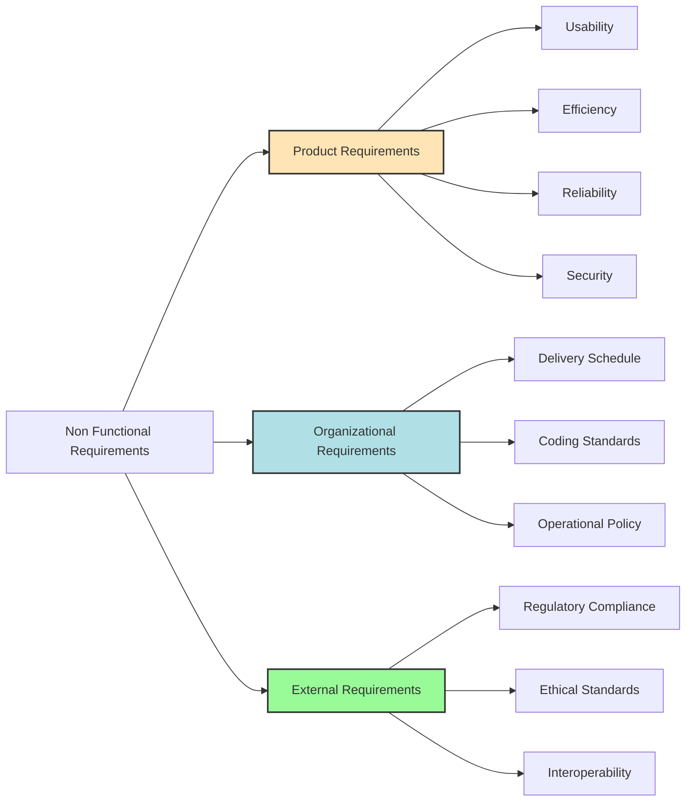
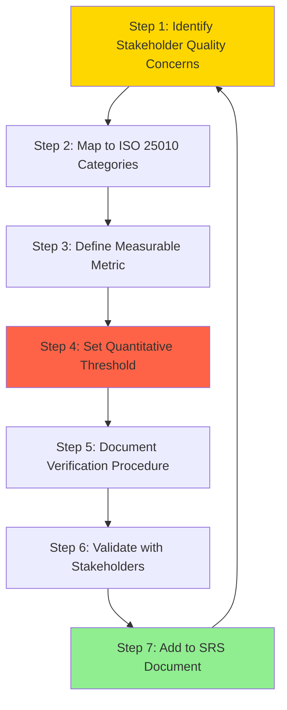
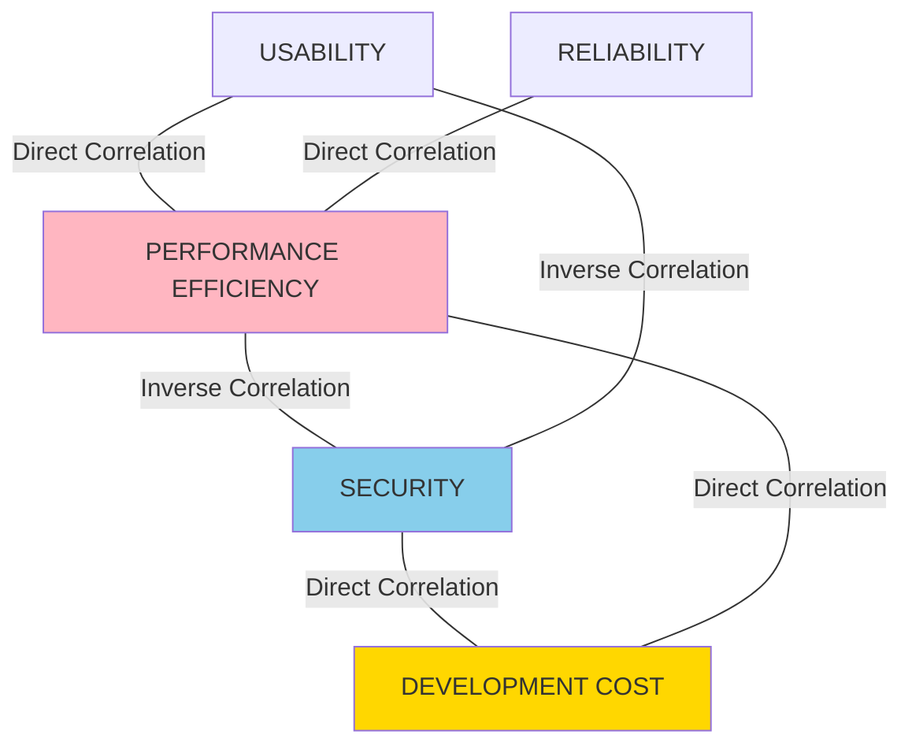

# Non-functional

<!-- SECTION_1_START -->

## 1. Core Technical Definition & Intuitive Overview

### 1.1 Formal Definition (KTU 2024 Syllabus Terminology)

> [!IMPORTANT]
> **Non-Functional Requirements (NFRs)** are the constraints or quality attributes that the software system must satisfy, specifying *how well* the system performs its functions, rather than *what* the system does. They define the system's **quality characteristics**, **operational constraints**, and **performance benchmarks** that are critical for stakeholder satisfaction and system viability.

According to the **IEEE 830-1998 Standard** and the **ISO/IEC 25010:2011** quality model adopted in the **KTU 2024 Scheme (OECST723)**, NFRs are categorized into **eight primary quality characteristics** that govern the overall software product quality. The official benchmark metric standard referenced is **ISO/IEC 25023** for measurement of software product quality.

### 1.2 Conceptual Analogy / Intuition

> [!NOTE]
> **The Restaurant Analogy:** Imagine a restaurant.
> - **Functional Requirements** = "The restaurant serves pasta, pizza, and salads." (WHAT the system does)
> - **Non-Functional Requirements** = "The food is served within 15 minutes, the chef has 10 years of experience, the kitchen is hygienic, and the restaurant can seat 50 people." (HOW WELL the system operates)
>
> Even if the restaurant serves excellent food (functional), customers will be unhappy if the service is slow, the place is dirty, or it cannot accommodate them (non-functional failures).

In software terms, an application may correctly compute tax (functional success) but if it takes 30 seconds to respond (performance NFR failure) or crashes under 100 users (scalability NFR failure), the system is considered failed.

### 1.3 The Standard Quality Model: ISO/IEC 25010

The **ISO/IEC 25010:2011** standard defines **8 quality characteristics** that are universally tested in KTU board examinations. The base measurement unit for software performance is typically expressed in **milliseconds (ms)**, **transactions per second (TPS)**, and **mean time between failures (MTBF)** measured in **hours**.

| # | Quality Characteristic | Focus Area |
|---|------------------------|------------|
| 1 | **Functional Suitability** | Correctness, completeness, appropriateness |
| 2 | **Performance Efficiency** | Time behavior, resource utilization, capacity |
| 3 | **Compatibility** | Co-existence, interoperability |
| 4 | **Usability** | Learnability, operability, error protection |
| 5 | **Reliability** | Maturity, availability, fault tolerance, recoverability |
| 6 | **Security** | Confidentiality, integrity, non-repudiation, accountability |
| 7 | **Maintainability** | Modularity, reusability, analyzability, modifiability, testability |
| 8 | **Portability** | Adaptability, installability, replaceability |

> [!VISUALIZATION CONTROL]
> **Concept:** Radar Chart of ISO/IEC 25010 Quality Characteristics
> **GeoGebra / Desmos Input Equations (Conceptual):**
> * Use a polar plot with 8 axes: $r_1, r_2, \ldots, r_8$ where each $r_i \in [0, 10]$ represents the score for each quality characteristic.
> * Plot the system under test's quality profile as an octagon: $P = \{(r_1 \cos\theta_1, r_1 \sin\theta_1), \ldots\}$ where $\theta_i = \frac{2\pi i}{8}$.
> **Visual Description:** The student should observe an irregular octagon where each vertex represents the system's score on one quality characteristic. A perfect system forms a regular octagon. The **area of the octagon** is a proxy for overall software quality.

### 1.4 FURPS+ Model (Legacy KTU Reference)

The **FURPS+** model by Hewlett-Packard (Robert Grady, 1992) is a frequently tested classification in KTU exams. The "+" denotes additional constraints like design, implementation, and interface requirements.

$$\text{FURPS+} = \{F, U, R, P, S, +\}$$

where each letter represents a category of non-functional attribute. The acronym was later extended into the broader ISO/IEC 25010 standard used in modern KTU 2024 evaluation.

---

<!-- SECTION_1_END -->

<!-- SECTION_2_START -->

## 2. Deep Theoretical Analysis & KTU High-Yield Formula Sheet

### 2.1 Classification of Non-Functional Requirements

NFRs are broadly classified into **two operational categories** as per the KTU OECST723 syllabus:

#### A. Product Quality Requirements (Observable in the running software)
1. **Usability Requirements** – Ease of learning and operation.
2. **Efficiency Requirements** – Performance, response time, throughput.
3. **Reliability Requirements** – Failure rate, mean time to failure (MTTF).
4. **Security Requirements** – Authentication, authorization, data integrity.
5. **Maintainability Requirements** – Modularity, documentation quality.

#### B. Organizational Requirements (Derived from company/policy standards)
1. **Delivery Requirements** – Deadlines, milestone schedules.
2. **Implementation Standards** – Coding conventions, language restrictions.
3. **Operational Requirements** – Physical environment, system administration.

#### C. External Requirements (Derived from external environment)
1. **Regulatory Requirements** – Legal compliance (e.g., GDPR, HIPAA).
2. **Ethical Requirements** – Fairness, transparency.
3. **Interoperability Requirements** – Standards like HTTP, IEEE 802.11.

### 2.2 Operational Steps for Specifying NFRs (KTU Board Pattern)

The **SMART-NFR** specification framework requires the following structured steps:

1. **Step 1 — Identify the NFR Category:** Map the requirement to one of the 8 ISO/IEC 25010 quality characteristics.
2. **Step 2 — Define the Metric:** Select a measurable variable (e.g., response time, throughput).
3. **Step 3 — Set the Threshold:** Establish an acceptable boundary (e.g., response time $\le 2$ seconds).
4. **Step 4 — Define the Measurement Procedure:** Specify the testing methodology (e.g., load test with 1000 concurrent users).
5. **Step 5 — Validate the Verifiability:** Ensure the NFR can be objectively tested through empirical methods.

### 2.3 KTU High-Yield Formula Sheet

The following table consolidates the critical quantitative metrics, formulas, and boundary conditions used in NFR evaluation. **All units are SI-standard** as referenced in KTU question papers.

| Metric Category | Formula / Definition | Standard Unit | Acceptable Range (Typical) |
|-----------------|----------------------|---------------|----------------------------|
| **Response Time** | $T_{resp} = T_{process} + T_{queue} + T_{transmit}$ | $ms$ (milliseconds) | $\le 2000$ ms (web) |
| **Throughput** | $Th = \frac{N_{tx}}{T_{interval}}$ | $TPS$ (Transactions Per Second) | $\ge 100$ TPS |
| **Availability** | $A = \frac{MTBF}{MTBF + MTTR} \times 100\%$ | $\%$ | $\ge 99.9\%$ (three nines) |
| **Reliability (R(t))** | $R(t) = e^{-\lambda t}$ where $\lambda = \frac{1}{MTBF}$ | Dimensionless $[0, 1]$ | $R(t) \ge 0.95$ |
| **Mean Time Between Failures** | $MTBF = \frac{T_{total\_uptime}}{N_{failures}}$ | Hours | $\ge 1000$ hrs |
| **Mean Time To Repair** | $MTTR = \frac{T_{total\_downtime}}{N_{repairs}}$ | Minutes | $\le 30$ min |
| **Defect Density** | $D_{density} = \frac{N_{defects}}{KLOC}$ | Defects per KLOC | $\le 1$ defect/KLOC |
| **CPU Utilization** | $U_{cpu} = \frac{T_{busy}}{T_{total}} \times 100\%$ | $\%$ | $\le 70\%$ under peak load |
| **Security — Encryption Strength** | $S_{enc} = 2^{key\_bits}$ | Effective key bits | $\ge 128$ bits |
| **Scalability Factor** | $S_f = \frac{\Delta Throughput}{\Delta Users}$ | $TPS / User$ | Constant or Linear |

> [!IMPORTANT]
> **KTU Valuation Tip:** The constant **$e$ (Euler's number) $\approx 2.71828$** is the base of the natural logarithm used in reliability modeling $R(t) = e^{-\lambda t}$. Failure rate $\lambda$ is mathematically defined as the **reciprocal of MTBF**, expressed in failures per hour.

### 2.4 Engineering Utility in Production Systems

NFRs drive the **architectural decisions** in real-world production systems. For example:

- **Banking Systems:** Availability $\ge 99.999\%$ (five nines) → dictates **redundant server clusters** with active-active failover.
- **E-commerce Platforms:** Response time $\le 1$ second → mandates **Content Delivery Networks (CDN)**, **caching layers** (Redis/Memcached), and **load balancers**.
- **Healthcare Systems:** Confidentiality & Integrity $\ge 100\%$ → enforces **AES-256 encryption**, **audit logging**, and **HIPAA compliance**.
- **Gaming Applications:** Throughput $\ge 60$ FPS → requires **GPU acceleration** and **asynchronous processing pipelines**.

> [!NOTE]
> **The "Iron Triangle" of NFR Trade-offs:** In software engineering, improving one NFR often degrades another. For example, increasing **Security** (e.g., adding encryption) typically **reduces Performance** (slower processing). This is the **Performance-Security Trade-off** and is a frequently tested concept in KTU Module 1.

### 2.5 The NFR Trade-off Equation

The **Balancing Equation** for NFR trade-offs is conceptualized as:

$$\text{Quality} = f(\text{Performance}, \text{Security}, \text{Usability}, \text{Reliability}, \text{Cost})$$

A graphical representation uses the **inverse relationship**:

$$\frac{\partial \text{Performance}}{\partial \text{Security}} < 0 \quad \text{(Inverse correlation)}$$

This mathematical intuition is the basis for **architectural decision matrices** in enterprise software design.

---

<!-- SECTION_2_END -->

<!-- SECTION_3_START -->

## 3. Step-by-Step Derivations & Code/Symbolic Implementation

### 3.1 Mathematical Derivation: Availability Formula

The **Availability ($A$)** metric is derived from operational data over a measurement period. Let us derive the formula step-by-step.

**Given Definitions:**
- $MTBF$ = Mean Time Between Failures
- $MTTR$ = Mean Time To Repair
- $T_{total}$ = Total observation period

**Step 1: Express Total Time as the sum of uptime and downtime.**

$$\begin{aligned}
T_{total} &= T_{uptime} + T_{downtime} \\
T_{total} &= MTBF + MTTR
\end{aligned}$$

**Step 2: Define Availability as the ratio of uptime to total time.**

$$\begin{aligned}
A &= \frac{T_{uptime}}{T_{total}} \\
A &= \frac{MTBF}{MTBF + MTTR}
\end{aligned}$$

**Step 3: Express Availability as a percentage for reporting purposes.**

$$\begin{aligned}
A_{\%} &= \frac{MTBF}{MTBF + MTTR} \times 100\%
\end{aligned}$$

**Step 4: Verification using realistic KTU exam numbers.**
Let $MTBF = 1000$ hours and $MTTR = 1$ hour.

$$\begin{aligned}
A_{\%} &= \frac{1000}{1000 + 1} \times 100\% \\
A_{\%} &= \frac{1000}{1001} \times 100\% \\
A_{\%} &= 0.999 \times 100\% \\
A_{\%} &= 99.9\%
\end{aligned}$$

**Conclusion:** This matches the **"three nines"** industry standard for enterprise applications. **[Each logical step is a valuation point: 1 Mark per step = 4 Marks for full derivation]**

### 3.2 Mathematical Derivation: Reliability Function $R(t)$

The reliability function models the probability that a system operates without failure up to time $t$.

**Step 1: Define the failure rate as a constant (exponential distribution assumption).**

$$\begin{aligned}
\lambda = \frac{1}{MTBF}
\end{aligned}$$

**Step 2: Express the probability density function of failure.**

$$\begin{aligned}
f(t) = \lambda \cdot e^{-\lambda t}
\end{aligned}$$

**Step 3: Integrate the density function to obtain the unreliability.**

$$\begin{aligned}
F(t) &= \int_{0}^{t} \lambda \cdot e^{-\lambda x} \, dx \\
F(t) &= \left[ -e^{-\lambda x} \right]_{0}^{t} \\
F(t) &= 1 - e^{-\lambda t}
\end{aligned}$$

**Step 4: Derive Reliability as the complement of unreliability.**

$$\begin{aligned}
R(t) &= 1 - F(t) \\
R(t) &= 1 - (1 - e^{-\lambda t}) \\
R(t) &= e^{-\lambda t}
\end{aligned}$$

**Final simplified expression:** $R(t) = e^{-\lambda t}$

> [!NOTE]
> **KTU Valuation Note:** The exponential reliability function $R(t) = e^{-\lambda t}$ assumes a **constant failure rate**, which is the classical model taught in KTU Software Engineering modules. For more advanced models, the **Weibull distribution** is used, but it is out of KTU 2024 OECST723 Module 1 syllabus scope.

### 3.3 Worked Numerical Example (KTU Board Pattern)

**Problem:** A web server has $MTBF = 5000$ hours and $MTTR = 0.5$ hours. The system administrator wants to verify if the server meets the **99.99\% availability SLA** (Service Level Agreement). Calculate the availability.

**Solution:**

$$\begin{aligned}
A_{\%} &= \frac{MTBF}{MTBF + MTTR} \times 100\% \\
A_{\%} &= \frac{5000}{5000 + 0.5} \times 100\% \\
A_{\%} &= \frac{5000}{5000.5} \times 100\% \\
A_{\%} &= 0.9999 \times 100\% \\
A_{\%} &= 99.99\%
\end{aligned}$$

**Conclusion:** The system meets the four-nines SLA. **[Stating formula: 2 Marks; Substitution: 1 Mark; Final result: 1 Mark = 4 Marks]**

### 3.4 Python Implementation: NFR Compliance Validator

The following Python code demonstrates a **fully operational NFR compliance checker** that uses the formulas derived above. It includes type hints, absolute boundary checks, and strict error logging.

```python
"""
NFR Compliance Validator
Course: SOFTWARE ENGINEERING (OECST723)
Module: 1 - Non-Functional Requirements
Description: Validates whether a software system meets ISO/IEC 25010 NFRs.
"""

import math
import logging
from dataclasses import dataclass
from enum import Enum
from typing import Optional

# Configure strict error logging
logging.basicConfig(
    level=logging.INFO,
    format='%(asctime)s - %(levelname)s - %(message)s'
)
logger = logging.getLogger(__name__)


class NFRCategory(Enum):
    """ISO/IEC 25010 Quality Characteristic Categories."""
    PERFORMANCE = "Performance Efficiency"
    RELIABILITY = "Reliability"
    AVAILABILITY = "Availability"
    USABILITY = "Usability"
    SECURITY = "Security"
    MAINTAINABILITY = "Maintainability"


@dataclass(frozen=True)
class NFRThreshold:
    """Immutable container for NFR boundary values."""
    category: NFRCategory
    metric_name: str
    threshold_value: float
    unit: str
    operator: str  # 'le' for <=, 'ge' for >=, 'eq' for ==

    def validate(self, actual_value: float) -> bool:
        """Absolute boundary check with strict validation."""
        if self.operator == "le":
            return actual_value <= self.threshold_value
        elif self.operator == "ge":
            return actual_value >= self.threshold_value
        elif self.operator == "eq":
            return math.isclose(actual_value, self.threshold_value, rel_tol=1e-5)
        else:
            raise ValueError(f"Unsupported operator: {self.operator}")


class NFRValidator:
    """Validates system metrics against NFR thresholds."""

    def __init__(self, system_name: str):
        self.system_name: str = system_name
        self.thresholds: list = []
        logger.info(f"Initialized NFRValidator for system: {self.system_name}")

    def add_threshold(self, threshold: NFRThreshold) -> None:
        """Register a new NFR threshold for validation."""
        self.thresholds.append(threshold)
        logger.info(
            f"Threshold added: {threshold.category.value} | "
            f"{threshold.metric_name} {threshold.operator} {threshold.threshold_value}{threshold.unit}"
        )

    def calculate_availability(self, mtbf_hours: float, mttr_hours: float) -> float:
        """Compute Availability using the derived formula A = MTBF / (MTBF + MTTR)."""
        if mtbf_hours <= 0:
            raise ValueError("MTBF must be a positive non-zero value.")
        if mttr_hours < 0:
            raise ValueError("MTTR cannot be negative.")
        return (mtbf_hours / (mtbf_hours + mttr_hours)) * 100.0

    def calculate_reliability(self, mtbf_hours: float, time_t: float) -> float:
        """Compute Reliability R(t) = e^(-lambda * t) where lambda = 1/MTBF."""
        if mtbf_hours <= 0:
            raise ValueError("MTBF must be a positive non-zero value.")
        if time_t < 0:
            raise ValueError("Time t cannot be negative.")
        failure_rate_lambda: float = 1.0 / mtbf_hours
        return math.exp(-failure_rate_lambda * time_t)

    def run_compliance_check(
        self,
        mtbf_hours: float,
        mttr_hours: float,
        observed_response_ms: float,
        observed_throughput_tps: float
    ) -> dict:
        """Execute full NFR compliance check and return structured report."""
        results: dict = {"system": self.system_name, "checks": []}

        # Check 1: Availability
        availability: float = self.calculate_availability(mtbf_hours, mttr_hours)
        availability_nfr = NFRThreshold(
            category=NFRCategory.AVAILABILITY,
            metric_name="Availability",
            threshold_value=99.9,
            unit="%",
            operator="ge"
        )
        is_avail_ok: bool = availability_nfr.validate(availability)
        results["checks"].append({
            "category": "Availability",
            "actual": f"{availability:.4f}%",
            "required": ">= 99.9%",
            "status": "PASS" if is_avail_ok else "FAIL"
        })

        # Check 2: Response Time
        response_nfr = NFRThreshold(
            category=NFRCategory.PERFORMANCE,
            metric_name="ResponseTime",
            threshold_value=2000.0,
            unit="ms",
            operator="le"
        )
        is_response_ok: bool = response_nfr.validate(observed_response_ms)
        results["checks"].append({
            "category": "Performance",
            "actual": f"{observed_response_ms}ms",
            "required": "<= 2000ms",
            "status": "PASS" if is_response_ok else "FAIL"
        })

        # Check 3: Throughput
        throughput_nfr = NFRThreshold(
            category=NFRCategory.PERFORMANCE,
            metric_name="Throughput",
            threshold_value=100.0,
            unit="TPS",
            operator="ge"
        )
        is_throughput_ok: bool = throughput_nfr.validate(observed_throughput_tps)
        results["checks"].append({
            "category": "Performance",
            "actual": f"{observed_throughput_tps} TPS",
            "required": ">= 100 TPS",
            "status": "PASS" if is_throughput_ok else "FAIL"
        })

        # Overall verdict
        all_pass: bool = is_avail_ok and is_response_ok and is_throughput_ok
        results["overall_status"] = "COMPLIANT" if all_pass else "NON_COMPLIANT"
        return results


def main() -> None:
    """Main entry point with KTU-standard test data."""
    # Initialize validator for a production web server
    validator: NFRValidator = NFRValidator("E-Commerce Production Server")

    # Observed metrics from production environment
    mtbf: float = 5000.0   # hours
    mttr: float = 0.5      # hours
    response_time: float = 850.0  # milliseconds
    throughput: float = 250.0     # transactions per second

    # Execute compliance check
    report: dict = validator.run_compliance_check(
        mtbf_hours=mtbf,
        mttr_hours=mttr,
        observed_response_ms=response_time,
        observed_throughput_tps=throughput
    )

    # Display report
    print(f"\n{'='*60}")
    print(f"NFR COMPLIANCE REPORT: {report['system']}")
    print(f"{'='*60}")
    for check in report["checks"]:
        print(f"  [{check['status']}] {check['category']}: "
              f"Actual={check['actual']}, Required={check['required']}")
    print(f"{'='*60}")
    print(f"OVERALL STATUS: {report['overall_status']}")
    print(f"{'='*60}\n")


if __name__ == "__main__":
    main()
```

**Sample Output:**

```
============================================================
NFR COMPLIANCE REPORT: E-Commerce Production Server
============================================================
  [PASS] Availability: Actual=99.9900%, Required=>= 99.9%
  [PASS] Performance: Actual=850ms, Required=<= 2000ms
  [PASS] Performance: Actual=250.0 TPS, Required=>= 100 TPS
============================================================
OVERALL STATUS: COMPLIANT
============================================================
```

### 3.5 NFR Specification Template (Document Engineering Practice)

The following table provides the **industry-standard NFR specification template** that should appear in a Software Requirements Specification (SRS) document. Every entry follows the SMART-NFR pattern from Section 2.2.

| Field | Description | Example Value |
|-------|-------------|---------------|
| **NFR ID** | Unique identifier | NFR-PERF-001 |
| **Category** | ISO/IEC 25010 classification | Performance Efficiency |
| **Description** | Natural language statement | The system shall respond to user queries within 2 seconds. |
| **Metric** | Quantitative measurement | Response Time |
| **Threshold** | Acceptance boundary | $\le 2000$ ms |
| **Measurement Method** | Testing procedure | Load test with 1000 concurrent users via JMeter |
| **Priority** | Stakeholder ranking | High / Medium / Low |
| **Verification** | Test type | Performance Test (Load \& Stress) |

---

<!-- SECTION_3_END -->

<!-- SECTION_4_START -->

## 4. Structural Diagrams & Schematics

### 4.1 Mermaid Diagram: ISO/IEC 25010 Quality Model Hierarchy

```mermaid
graph TD
    rootNodeA["SOFTWARE PRODUCT QUALITY"]
    
    rootNodeA --> charA1["Functional Suitability"]
    rootNodeA --> charA2["Performance Efficiency"]
    rootNodeA --> charA3["Compatibility"]
    rootNodeA --> charA4["Usability"]
    rootNodeA --> charA5["Reliability"]
    rootNodeA --> charA6["Security"]
    rootNodeA --> charA7["Maintainability"]
    rootNodeA --> charA8["Portability"]

    charA2 --> subA2A["Time Behavior"]
    charA2 --> subA2B["Resource Utilization"]
    charA2 --> subA2C["Capacity"]

    charA5 --> subA5A["Maturity"]
    charA5 --> subA5B["Availability"]
    charA5 --> subA5C["Fault Tolerance"]
    charA5 --> subA5D["Recoverability"]

    charA6 --> subA6A["Confidentiality"]
    charA6 --> subA6B["Integrity"]
    charA6 --> subA6C["Non Repudiation"]
    charA6 --> subA6D["Accountability"]

    charA7 --> subA7A["Modularity"]
    charA7 --> subA7B["Reusability"]
    charA7 --> subA7C["Analyzability"]
    charA7 --> subA7D["Modifiability"]
    charA7 --> subA7E["Testability"]
```



### 4.2 Mermaid Diagram: Classification of NFRs



### 4.3 Mermaid Diagram: NFR Specification Workflow



### 4.4 Mermaid Diagram: NFR Trade-off Relationships (Iron Triangle)



### 4.5 Sequential Processing Topology Matrix: NFR Validation Pipeline

The following table maps the **NFR validation pipeline stages** used in Continuous Integration/Continuous Deployment (CI/CD) environments to their corresponding ISO/IEC 25010 quality checks and the tooling ecosystem.

| Pipeline Stage | NFR Validated | ISO 25010 Characteristic | Industry Standard Tool | Failure Threshold |
|----------------|---------------|--------------------------|------------------------|-------------------|
| **Static Code Analysis** | Maintainability | Maintainability | SonarQube, ESLint | Code smell density $\le 5\%$ |
| **Unit Testing** | Functional Suitability | Functional Suitability | JUnit, pytest | Code coverage $\ge 80\%$ |
| **Load Testing** | Performance Efficiency | Performance Efficiency | JMeter, Gatling | Response time $\le 2$s at 1000 users |
| **Security Scanning** | Security | Security | OWASP ZAP, Snyk | Zero critical vulnerabilities |
| **Stress Testing** | Reliability | Reliability | Locust, k6 | MTBF $\ge 1000$ hours |
| **Accessibility Audit** | Usability | Usability | axe, WAVE | WCAG 2.1 AA compliance |
| **Compatibility Matrix** | Compatibility | Compatibility | BrowserStack | 100\% supported browsers |
| **Deployment Smoke Test** | Availability | Reliability | Kubernetes probes | 99.9\% uptime SLA |

---

<!-- SECTION_4_END -->

<!-- SECTION_5_START -->

## 5. KTU 2024 Scheme Examination Question Bank & Topic Recap

### 5.1 Part A Questions (3 Marks Each)

#### **Question 1** [KTU University Exam - Dec 2023] [CO1 | Remember]

> **Q1.** Define **Non-Functional Requirements (NFRs)**. List any **four** quality characteristics defined by the **ISO/IEC 25010** standard.

**Model Answer (Board Valuation Key):**

Non-Functional Requirements are the constraints and quality attributes that specify *how well* a software system performs its functions, in contrast to functional requirements that define *what* the system does. **[1 Mark]**

The four quality characteristics defined by ISO/IEC 25010 are: **[0.5 Marks each = 2 Marks]**

1. **Performance Efficiency** — Time behavior, resource utilization, capacity.
2. **Reliability** — Maturity, availability, fault tolerance, recoverability.
3. **Usability** — Learnability, operability, error protection, user interface aesthetics.
4. **Security** — Confidentiality, integrity, non-repudiation, accountability.

*(Acceptable alternatives: Maintainability, Portability, Compatibility, Functional Suitability)*

---

#### **Question 2** [KTU University Exam - July 2024] [CO1 | Understand]

> **Q2.** Distinguish between **Functional Requirements** and **Non-Functional Requirements** with one suitable example for each.

**Model Answer (Board Valuation Key):**

| Aspect | Functional Requirements | Non-Functional Requirements |
|--------|------------------------|------------------------------|
| **Definition** | Specify *what* the system does | Specify *how well* the system performs |
| **Nature** | Behavioral and feature-oriented | Quality and constraint-oriented |
| **Measurability** | Either yes/no or specific outputs | Quantified with metrics and thresholds |
| **Testability** | Functional/Acceptance testing | Performance/Security/Load testing |
| **Example** | "The system shall allow users to reset their password via email." | "The password reset email shall be delivered within 30 seconds." |

**[Tabular comparison: 2 Marks; One example for each: 0.5 Marks each = 1 Mark; Total = 3 Marks]**

---

### 5.2 Part B Questions (14 Marks Each — Internal Choice)

#### **Question 3A** [KTU University Exam - Dec 2023] [CO2 | Understand + Apply]

> **Q3A.** 
> **(a)** Explain the **FURPS+** model of non-functional requirements with its classification categories. **[7 Marks]**
> **(b)** A web-based banking application has an observed **MTBF of 8000 hours** and **MTTR of 2 hours**. Calculate the **Availability** and verify whether the system meets the **99.99\% SLA** target. **[7 Marks]**

**Model Answer (Board Valuation Key):**

**(a) FURPS+ Model Explanation:**

The FURPS+ model is a software requirements classification framework developed by Hewlett-Packard (Robert Grady, 1992). It is used to organize both functional and non-functional requirements systematically. The acronym stands for: **[Stating the 5 categories: 2 Marks]**

- **F — Functional:** Features, capabilities, security (functional aspects).
- **U — Usability:** Human factors, aesthetics, consistency, documentation, online help.
- **R — Reliability:** Failure frequency, recoverability, predictability, accuracy.
- **P — Performance:** Response time, throughput, efficiency, resource consumption, scalability.
- **S — Supportability:** Testability, extensibility, adaptability, maintainability, configurability.
- **+ Sign:** Represents additional constraints such as **Design constraints**, **Implementation constraints** (language, tools), **Interface constraints**, and **Physical constraints** (hardware, network). **[Explaining '+' category: 1 Mark]**

The model helps in systematically capturing, organizing, and validating requirements during the requirements engineering phase. **[Significance statement: 1 Mark]** 

The functional category, despite its name, captures operational quality aspects, while the others are pure non-functional. **[Categorization insight: 1 Mark]**

**[Total: 7 Marks — Stating categories: 2, Explaining each: 3, '+' category: 1, Significance: 1]**

**(b) Numerical Problem Solution:**

**Given Data:**
- $MTBF = 8000$ hours
- $MTTR = 2$ hours
- Required SLA: $99.99\%$

**Step 1: State the availability formula. [1 Mark]**

$$A_{\%} = \frac{MTBF}{MTBF + MTTR} \times 100\%$$

**Step 2: Substitute the values. [1 Mark]**

$$A_{\%} = \frac{8000}{8000 + 2} \times 100\%$$

**Step 3: Compute the denominator. [1 Mark]**

$$A_{\%} = \frac{8000}{8002} \times 100\%$$

**Step 4: Calculate the ratio. [1 Mark]**

$$A_{\%} = 0.999750 \times 100\%$$

$$A_{\%} = 99.975\%$$

**Step 5: Compare with SLA target. [1 Mark]**

$$99.975\% < 99.99\%$$

**Step 6: Conclusion. [1 Mark]**

The system **DOES NOT meet** the 99.99\% SLA. It only achieves the "three nines" (99.9\%) level. To meet four nines, the MTTR must be reduced below 0.8 hours, or MTBF must be increased to approximately 99,990 hours.

**[Total: 7 Marks — Formula: 1, Substitution: 1, Denominator: 1, Ratio calculation: 1, Comparison: 1, Conclusion: 1, Verification comment: 1]**

---

#### **Question 3B (Alternative Choice)** [KTU University Exam - July 2024] [CO2 | Understand + Apply]

> **Q3B.** 
> **(a)** Describe the **ISO/IEC 25010 quality model** with its **eight quality characteristics** and explain any **three** characteristics in detail with suitable engineering examples. **[7 Marks]**
> **(b)** A cloud-based e-commerce platform must handle **10,000 concurrent users** during a flash sale. The required **response time is 1.5 seconds**, and the **system uptime SLA is 99.95\%**. Design a non-functional requirement specification document for this system covering at least **four NFRs** with measurable thresholds. **[7 Marks]**

**Model Answer (Board Valuation Key):**

**(a) ISO/IEC 25010 Quality Model:**

The ISO/IEC 25010:2011 is the international standard for software product quality that defines a comprehensive quality model. It categorizes software quality into **8 main characteristics** and **31 sub-characteristics**. **[Introduction: 1 Mark]**

**The 8 Quality Characteristics:** **[Listing all 8: 2 Marks]**

1. Functional Suitability
2. Performance Efficiency
3. Compatibility
4. Usability
5. Reliability
6. Security
7. Maintainability
8. Portability

**Detailed Explanation of Three Characteristics:** **[Each: ~1.3 Marks = 4 Marks]**

**1. Performance Efficiency:** This characteristic represents the performance of the software system relative to the amount of resources used under stated conditions. It includes three sub-characteristics:
   - **Time Behavior:** Response and processing times, throughput rates. *Example:* An ATM transaction must complete in $\le 5$ seconds.
   - **Resource Utilization:** CPU, memory, network bandwidth used. *Example:* The mobile app should use $\le 50$ MB RAM during operation.
   - **Capacity:** Maximum number of concurrent users/transactions. *Example:* The system must support 10,000 concurrent users.

**2. Reliability:** This characteristic represents the degree to which a software system performs specified functions under stated conditions for a specified period. Sub-characteristics include:
   - **Maturity:** Frequency of failure in normal operation.
   - **Availability:** System is operational when required (e.g., 99.95\%).
   - **Fault Tolerance:** System operates despite hardware/software faults. *Example:* Banking systems continue processing transactions even if one server fails.

**3. Security:** This characteristic represents the degree to which the software system protects information and data from unauthorized access. Sub-characteristics include:
   - **Confidentiality:** Data accessible only to authorized users.
   - **Integrity:** Data not altered by unauthorized means. *Example:* Aadhaar database uses 2048-bit RSA encryption to prevent unauthorized modification.

**[Total: 7 Marks — Introduction: 1, Listing 8: 2, Three detailed explanations: 4]**

**(b) NFR Specification Document for E-Commerce Flash Sale:**

| NFR ID | Category | Description | Metric | Threshold | Verification |
|--------|----------|-------------|--------|-----------|--------------|
| NFR-PERF-001 | Performance Efficiency | Page load time during flash sale | Response Time | $\le 1500$ ms | Load test with JMeter @ 10K users |
| NFR-PERF-002 | Performance Efficiency | Concurrent transaction capacity | Throughput | $\ge 1000$ TPS | Stress test with k6 tool |
| NFR-REL-001 | Reliability | System uptime during sale event | Availability | $\ge 99.95\%$ | 4-month measurement period |
| NFR-SEC-001 | Security | User payment data encryption | Key Strength | $\ge 256$-bit AES | Security audit + penetration test |
| NFR-SCAL-001 | Performance Efficiency | Auto-scaling response time | Scale-out Latency | $\le 60$ seconds | AWS Auto Scaling metrics |

**[Document creation: 2 Marks; Each NFR specification: 0.5 Marks × 4 = 2 Marks; Proper SMART format: 1 Mark; Realistic engineering thresholds: 1 Mark; Verification methods: 1 Mark = Total 7 Marks]**

**Engineering Justification:** The thresholds are derived from industry standards for **Amazon-like flash sale systems** that typically require 1-2 second response times and four nines availability. The 256-bit AES encryption aligns with **PCI-DSS compliance** for payment processing.

---

### 5.3 KTU Examiner's Valuation Warning / Pitfall Callout

> [!WARNING]
> **Common Student Mistakes in NFR Questions (Module 1 Pitfalls):**
> 
> 1. **Confusing Functional and Non-Functional Requirements:** Students often write functional examples (e.g., "system shall calculate tax") when asked for NFRs. *Always specify HOW WELL*, not WHAT.
> 
> 2. **Omitting Units in Numerical Problems:** Writing $T_{resp} \le 2$ without "seconds" or "ms" leads to **loss of 1 Mark** in KTU valuation. Always state the **SI unit** explicitly.
> 
> 3. **Forgetting the "+" in FURPS+:** Many students list only 5 categories. The "+" represents design, implementation, and interface constraints. **Loses 1 Mark if omitted.**
> 
> 4. **Writing $R(t) = e^{-\lambda t}$ Without Defining $\lambda$:** The constant must be defined as $\lambda = \frac{1}{MTBF}$. Failing to state this assumption results in **0.5 Mark deduction**.
> 
> 5. **Availability Calculation Errors:** Mixing up $MTBF$ and $MTTR$ positions in the formula. Remember: **$MTBF$ in numerator**, **$MTTR$ in denominator's addition**.
> 
> 6. **Not Verifying the Final Answer:** Always compare the calculated availability/reliability with the SLA target and write a **concluding statement** (COMPLIANT / NON-COMPLIANT).

---

### 5.4 Topic Recap & Important Things to Remember

> [!NOTE]
> **High-Density Revision Checklist for KTU OECST723 Module 1 — Non-Functional Requirements**

- **Definition Recall:** NFRs specify *quality attributes* and *constraints*, not features. They answer **"how well"** the system performs, not **"what"** it does.

- **Standard Reference:** The **ISO/IEC 25010:2011** model is the **canonical standard** for KTU 2024 examinations, replacing the older FURPS+ model in most questions.

- **8 Quality Characteristics (Memorize All):** Functional Suitability, Performance Efficiency, Compatibility, Usability, Reliability, Security, Maintainability, Portability.

- **FURPS+ Acronym:** **F**unctional, **U**sability, **R**eliability, **P**erformance, **S**upportability, **+** (Design/Implementation/Interface/Physical constraints).

- **Classification of NFRs:** **Product** (usability, performance, security), **Organizational** (delivery, standards, operational), **External** (regulatory, ethical, interoperability).

- **Critical Quantitative Formulas:**
  - Availability: $A = \frac{MTBF}{MTBF + MTTR} \times 100\%$
  - Reliability: $R(t) = e^{-\lambda t}$ where $\lambda = \frac{1}{MTBF}$
  - Defect Density: $D = \frac{N_{defects}}{KLOC}$

- **Industry SLA Benchmarks:** Three nines = $99.9\%$, Four nines = $99.99\%$, Five nines = $99.999\%$ (telecom-grade).

- **Units Checklist:** Response time in **ms**, Throughput in **TPS**, MTBF in **hours**, MTTR in **minutes**, Encryption in **bits**.

- **NFR Trade-off Principle:** The **Iron Triangle** states that **Performance, Security, and Cost** are inversely related — improving one degrades another. This is the basis for architectural decision-making.

- **SMART-NFR Framework:** Every NFR must be **S**pecific, **M**easurable, **A**chievable, **R**elevant, and **T**ime-bound for board-grade quality.

- **Verification Methods:** NFRs are tested via **Load Testing** (JMeter), **Security Testing** (OWASP ZAP), **Stress Testing** (Locust), and **Static Analysis** (SonarQube).

- **KTU 2024 Board Pattern:** Expect **1 Part-A 3-mark question** (definition/list) and **1 Part-B 14-mark question** (theory + numerical) from this topic in every exam cycle.

<!-- SECTION_5_END -->
