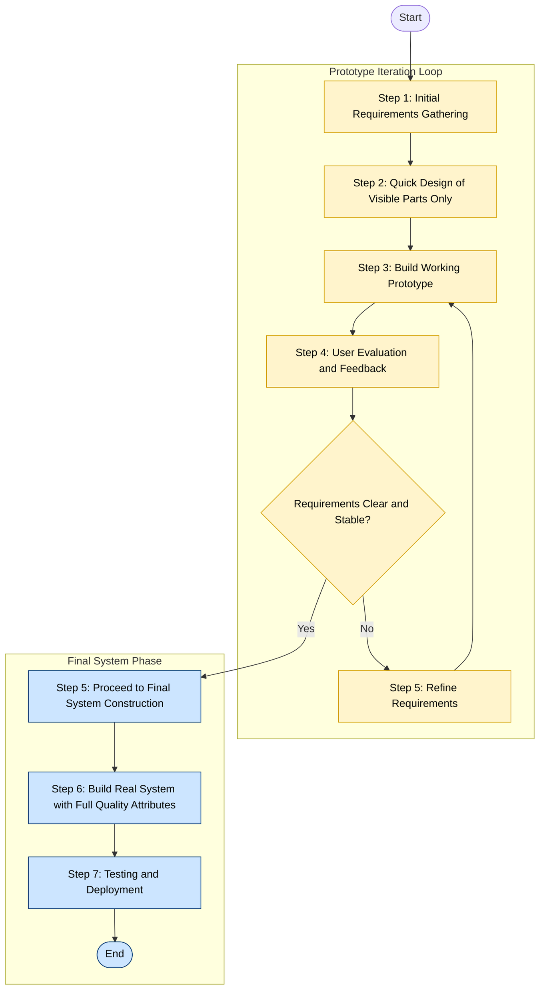
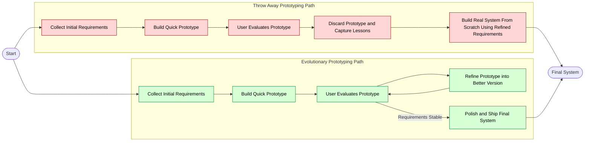
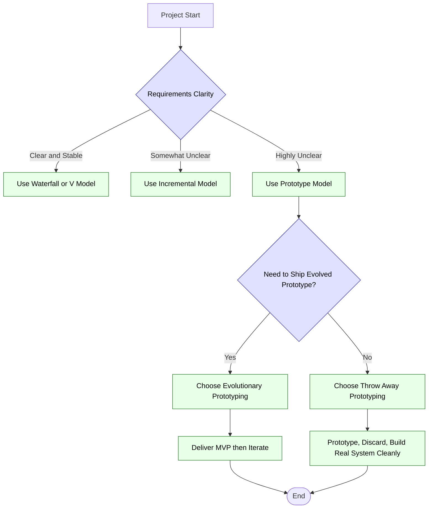
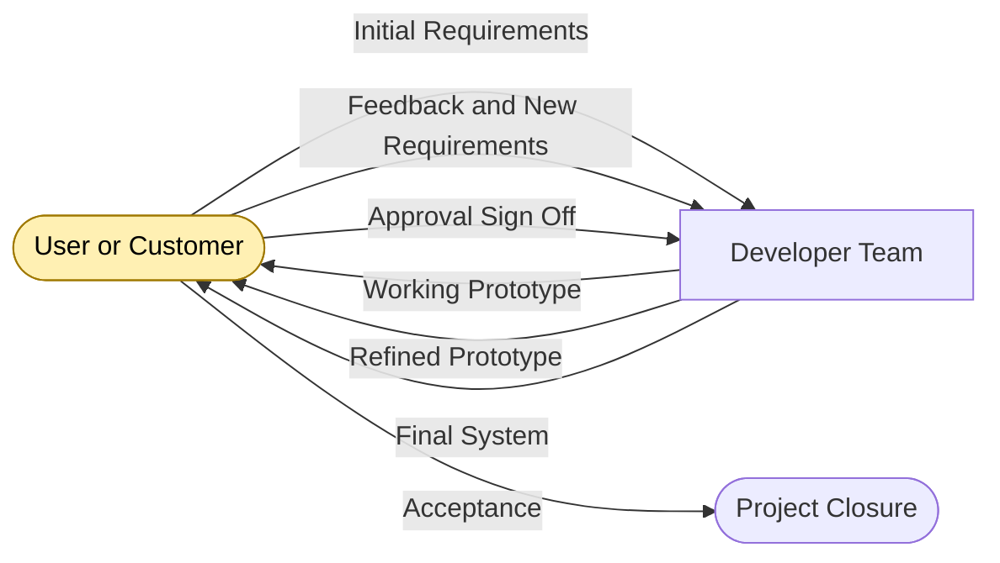

# Prototype

<!-- SECTION_1_START -->
# Prototype Model in Software Engineering

## 1. Core Technical Definition

> [!NOTE]
> **KTU 2024 Scheme — Formal Definition**
> A **Prototype** is a working, preliminary version of a software system (or a part of it) that is built quickly and cheaply to demonstrate the system's behavior, validate requirements, and obtain user feedback before full-scale development. The **Prototype Model** (also called the **Prototyping Model** or **Prototype Development Model**) is an iterative, evolutionary **Software Process Model** in which the developer constructs, demonstrates, and refines a working model of the software through multiple cycles until the system is accepted or evolved into the final product.

### Key Terminology (KTU Syllabus-Aligned)

| Term | Meaning |
| :--- | :--- |
| **Prototype** | A partial, working model of the actual system used to clarify requirements. |
| **Throw-away Prototyping** | A prototype built to learn about the requirements and then discarded. |
| **Evolutionary Prototyping** | A prototype that is incrementally refined into the final system. |
| **End-User / Customer** | The person(s) for whom the system is being developed and who validates the prototype. |
| **Rapid Application Development (RAD)** | A philosophy closely related to prototyping that emphasizes fast construction. |
| **Software Process Model** | An abstract representation of a software engineering process, defining the order, structure, and flow of activities. |

> [!IMPORTANT]
> **KTU 2024 Highlight:** Prototyping is a *risk-reduction* and *requirements-discovery* technique. It is most often classified as a member of the **Evolutionary Process Models** family in the KTU syllabus, sitting alongside the **Incremental**, **Spiral**, and **WIN-WIN** models.

---

## 2. Intuitive Overview — A Real-World Analogy

Imagine you walk into a **custom tailor shop** to get a suit stitched. The tailor does **not** start cutting the expensive fabric on the very first day. Instead, the tailor:

1. Takes your rough measurements.
2. Stitches a **rough, inexpensive cotton mock-up** of the suit using cheap cloth.
3. Asks you to **try it on**, walk around, raise your arms, and sit.
4. Notes your feedback: *"Sleeves are too long," "Collar is too tight."*
5. Adjusts the mock-up and you try it **again**.
6. Only when you say *"Yes, this is perfect!"* does the tailor cut the **real, expensive fabric** for the final suit.

That **cotton mock-up suit** is the **Prototype**.
The iterative cycle of *build → try → feedback → refine* is the **Prototype Model**.

> [!TIP]
> **Engineering Translation:** In software, requirements are the *expensive fabric*. If we cut code for the wrong requirements, we waste enormous rework cost. A prototype lets the developer *cut cheap code first* so that requirements are **clarified, validated, and frozen** before the real system is built.

### Conceptual Flow (Mental Model)

$$\text{Initial Requirements} \;\longrightarrow\; \text{Quick Build} \;\longrightarrow\; \text{User Feedback} \;\longrightarrow\; \text{Refinement} \;\longrightarrow\; \text{Final System}$$

This is fundamentally a **feedback-driven, iterative model**, in contrast to purely linear models like the **Waterfall Model**.

---

## 3. Visualization Control Block

> [!VISUALIZATION CONTROL]
> **Concept:** Iterative Refinement Curve — How a prototype converges to the final system over multiple cycles.
> **Desmos / GeoGebra Input Equations:**
> * Cycle size (information learned per cycle): $f(x) = 5 \cdot e^{-0.6x}$
> * Cost of rework avoided: $g(x) = 100 \cdot (1 - e^{-0.6x})$
> * User satisfaction trajectory: $h(x) = 100 \cdot \left(1 - e^{-0.6x}\right)$
> **Visual Description:** On the $x$-axis, plot the **prototype iteration number** $(x \ge 0)$. On the $y$-axis, plot the metric value. The student should observe that the **information learned per cycle decays exponentially** (small, late iterations yield little new info), while the **user satisfaction** and **cost-avoidance** curves **asymptotically approach 100%** — illustrating why only a *few* prototype cycles are economically justified.

---

## 4. Why Prototyping Exists — The Motivating Problem

In the classic **Waterfall Model**, requirements are *frozen* after the *Requirements Analysis* phase. But in practice:

* Users do not know what they really want until they *see* something.
* Requirements documents are often **ambiguous, incomplete, or wrong**.
* The cost of fixing a requirement defect **after deployment is up to 100x** the cost of fixing it during requirements.

The Prototype Model directly attacks this by inserting a **concrete, executable artifact** between the developer and the user as early as possible.

> [!IMPORTANT]
> **KTU Exam Pearl:** Whenever a question asks *"Why do we use the prototype model?"*, the expected board answer is: **"To resolve requirement uncertainties and to obtain early user feedback at low cost, thereby reducing the risk of building the wrong system."**

<!-- SECTION_1_END -->

<!-- SECTION_2_START -->
# Deep Theoretical Analysis — The Prototype Model

## 1. Generic Phases of the Prototype Model

The prototype model, in its canonical KTU form, consists of the following **phases** executed iteratively:

1. **Requirements Gathering and Analysis** — The developer collects the *initial* requirements from the user. These are deliberately *incomplete* and *approximate*.
2. **Quick Design** — Only the *visible* and *high-risk* parts of the system are designed (e.g., input screens, reports, navigation flow). Database design, performance tuning, and security are **deferred**.
3. **Build Prototype** — Using **rapid tools** (4GL, GUI builders, scripting languages, mock APIs), a working, low-fidelity or high-fidelity prototype is constructed.
4. **User Evaluation / Demonstration** — The prototype is shown to the user. The user *tries it out*, performs realistic tasks, and identifies gaps, errors, and missing features.
5. **Refine and Iterate** — The user's feedback is converted into **new or modified requirements**. Steps 1–4 are repeated.
6. **Final System Construction** — Once requirements are stable, the prototype is either *evolved* into the final system (Evolutionary) or *discarded* and rebuilt cleanly (Throw-away).

> [!NOTE]
> **Step 1 — Requirements Gathering:** A *partial* set of known requirements is collected. The full, rigorous specification is **not** the goal at this stage.
> **Step 2 — Quick Design:** Only user-facing and architecturally risky components are designed. The cost and time of this step are kept deliberately low.
> **Step 3 — Build Prototype:** Focus is on *appearance and feel*, not on internal efficiency, exception handling, or scalability.
> **Step 4 — User Evaluation:** This is the **heart** of the model. Without honest user evaluation, the cycle has no value.
> **Step 5 — Refine and Iterate:** Each loop tightens the requirement specification and reduces uncertainty.

---

## 2. Types of Prototyping (High-Yield for KTU)

The KTU syllabus expects students to distinguish between at least the following categories:

| Type | Also Known As | Purpose | Final System Built From? |
| :--- | :--- | :--- | :--- |
| **Throw-away Prototyping** | Rapid, Close-ended, Throwaway | Understand requirements only. | **No** — discarded. The *real* system is built from scratch using the clarified requirements. |
| **Evolutionary Prototyping** | Incremental, Breadboard, Open-ended | Deliver a working system that grows. | **Yes** — the prototype is gradually refined and polished into the final system. |
| **Extreme Prototyping** | — | A specialized form used mainly for **web applications**. | The system is built in three layers: (1) static HTML prototype, (2) dynamic screens with simulated services, (3) full services and implementation. |
| **User Interface (UI) Prototyping** | Paper prototype, Wireframe, Mock-up | Visualize look-and-feel only. | **No** — purely a design aid (often low-fidelity). |
| **System Prototyping** | — | Mimics a small subset of full system behavior. | Sometimes Yes, sometimes No, depending on fidelity. |

> [!IMPORTANT]
> **High-Yield Distinction (Very frequently asked in KTU):**
> * **Throw-away:** Learn then *throw it away* → build the real system **from scratch**.
> * **Evolutionary:** *Grow* the prototype → final system **is** the prototype, polished.
> **Common Mistake:** Students often write "prototype model is throw-away." This is *only one type*. The model itself can be either.

---

## 3. When to Use the Prototype Model

The prototype model is **best suited** under the following engineering conditions:

* The **requirements are unclear**, ambiguous, or evolving.
* The **user is unable or unwilling to articulate** complete requirements upfront.
* The **developer is unfamiliar** with the application domain.
* The project is **highly user-interface intensive** (e.g., dashboards, mobile apps, e-commerce front-ends).
* **Online systems** with significant user interaction.
* **Small to medium-scale** systems where rapid iteration is feasible.

> [!WARNING]
> **Do NOT use the prototype model when:**
> * Requirements are **clearly understood and stable** (use Waterfall).
> * The system is **safety-critical, life-critical, or mission-critical** (e.g., avionics, medical infusion pumps, nuclear plant control) — repeated iterations on critical code are unsafe and uneconomical.
> * The project has **strict, frozen contractual deliverables** (e.g., government tenders with fixed specs).

---

## 4. Advantages and Disadvantages (Board-Favorite Table)

| Advantages | Disadvantages |
| :--- | :--- |
| Early user feedback reduces requirement risk. | May lead to **"prototype-as-final-system"** syndrome — the cheap prototype is shipped without engineering rigor. |
| Improves **user involvement and satisfaction**. | Incomplete or inconsistent prototype can mislead the user. |
| Missing or misunderstood requirements are **detected early**. | Developer may compromise on **quality, performance, and maintainability** to ship a fast prototype. |
| Useful when requirements are **unstable or unclear**. | May encourage **scope creep** — user keeps adding "just one more thing." |
| Reduces **rework cost** because defects are caught early. | Requires **strong user commitment**; if user is not available, the cycle stalls. |
| Provides a **concrete communication artifact** between developer and user. | Suitable only for systems with **active user participation**. |
| Supports **experimental / exploratory** development. | Not suitable for very large or safety-critical systems. |

---

## 5. KTU High-Yield Formula / Cheat Sheet

> [!TIP]
> **Use this section as your 60-second revision before the KTU exam.**

| Symbol / Concept | Formula / Expression | Meaning / Use |
| :--- | :--- | :--- |
| Cost of fixing a defect at *Requirements* stage | $C_{req} = 1 \times C$ | Baseline unit cost (normalized to 1). |
| Cost of fixing the same defect at *Design* stage | $C_{des} \approx 3 \times C$ | Roughly 3x more expensive. |
| Cost of fixing the same defect at *Coding* stage | $C_{cod} \approx 5 \times C$ | Roughly 5x more expensive. |
| Cost of fixing the same defect at *Integration* stage | $C_{int} \approx 10 \times C$ | Roughly 10x more expensive. |
| Cost of fixing the same defect at *Maintenance/Post-deployment* stage | $C_{maint} \approx 100 \times C$ | Up to 100x more expensive (Boehm's well-known estimate). |
| Information gained per prototype iteration | $I_n = I_0 \cdot e^{-k n}$ | Exponential decay; iterations become less valuable. |
| Total iterations to reach acceptance | $N = \left\lceil \dfrac{\ln(\epsilon / I_0)}{-k} \right\rceil$ | Where $\epsilon$ is the residual uncertainty. |
| Approximate time saving vs Waterfall | $T_{saved} \approx 0.3 \cdot T_{waterfall}$ | For typical UI-intensive projects, prototyping cuts requirements phase time by ~30%. |
| User involvement fraction | $U_{frac} = \dfrac{T_{user}}{T_{total}}$ | Higher $U_{frac}$ correlates with project success in prototyping projects. |

> [!IMPORTANT]
> **KTU Numerical Tip:** KTU sometimes asks: *"Why is fixing a defect during requirements phase cheaper?"* — Use the $C_{req} = 1 \times C$ vs $C_{maint} = 100 \times C$ row above. State that prototypes *push* defect detection **leftward** on the cost-curve, which is the principal economic justification.

---

## 6. Real-World Engineering Utility

The prototype model is used in production settings such as:

* **Web and mobile application startups** (e.g., SaaS landing pages, MVP — *Minimum Viable Product*).
* **Automotive HMI (Human-Machine Interface)** design — dashboards and infotainment screens.
* **Game development** — gameplay prototypes.
* **AI/ML model UIs** — quick front-ends to test user workflows.
* **Banking and e-commerce UIs** — A/B testing of new interfaces.
* **Aerospace and defense** — used cautiously for **UI prototyping only**, not for the control software itself.

In industry, the **MVP (Minimum Viable Product)** and **Proof of Concept (PoC)** are direct descendants of the prototype philosophy. **Throw-away prototypes** are common in regulated industries where the final code must be developed under formal processes (e.g., DO-178C for aviation).

<!-- SECTION_2_END -->

<!-- SECTION_3_START -->
# Step-by-Step Derivations, Walkthroughs & Code Implementation

## 1. Exhaustive Walkthrough — A 4-Iteration Prototype Case Study

Let us walk through a **complete KTU-style numerical / narrative example** of building a prototype for an **Online Bookstore System**.

### Iteration 0 — Initial Requirements

The bookstore owner, Mr. K. T. U., states:

> *"I want a website where customers can browse books, add them to a cart, and pay."*

This is **deliberately vague**. The developer does not start coding the database or the payment gateway. Instead, the developer proceeds to a **Quick Design**.

### Iteration 1 — Build a Low-Fidelity Prototype

The developer uses a rapid GUI builder to construct:

* A **home page** with a search bar and a few sample book tiles.
* A **book details page**.
* A **shopping cart page** (no payment yet).
* A **mock login** that always succeeds.

The prototype uses **mock data** (hard-coded book list) and **no real database**.

**User Evaluation 1:** Mr. K. T. U. tries the prototype and says:
> *"The search should also filter by author and price. I want a 'Wishlist' button. And customers should be able to register."*

### Iteration 2 — Refine and Re-Build

The developer **adds**:
* Search filters: author and price range.
* A **Wishlist** icon on every book card.
* A **registration** form (still with mock data).

**User Evaluation 2:** The user says:
> *"I want a 'Recommended for You' section on the home page. Also, the cart should show shipping charges before checkout."*

### Iteration 3 — Refine and Re-Build

The developer **adds**:
* A recommendation carousel (logic: *"top 5 books in the user's wishlist category"*).
* A **shipping calculator** (still using a stub function that returns a fixed $50$).

**User Evaluation 3:** The user says:
> *"Looks good. Build the real system now."*

### Iteration 4 — Final System Construction

The developer now builds the **real, production system** with:
* A real database (MySQL/PostgreSQL).
* A real payment gateway (Razorpay / Stripe).
* Real authentication and security (bcrypt, JWT, HTTPS).
* Real performance, logging, and exception handling.

### Summary of Iterations

Let $C$ be the cost of one quick prototype iteration. In this case study:

$$
\begin{aligned}
C_{proto} &= 4 \times C \quad \text{(four prototype iterations)} \\
C_{rework_{waterfall}} &\approx 8 \times C \quad \text{(estimated rework if Waterfall had been used)} \\
\text{Net Savings} &= C_{rework_{waterfall}} - C_{proto} = 8C - 4C = 4C
\end{aligned}
$$

$$
\boxed{\text{Net Savings} = 4C \;\;\text{(or 50\% of estimated rework cost)}}
$$

This is a *toy* numerical justification that the model is economically sound for requirement-uncertain projects.

---

## 2. Comparative Analysis: Prototype vs. Other Process Models

This is a **very common 14-mark KTU question** (often asked as: *"Compare prototype model with waterfall and incremental models"*).

| Criterion | Waterfall Model | Incremental Model | Prototype Model |
| :--- | :--- | :--- | :--- |
| **Structure** | Linear, sequential. | Linear, but delivered in *chunks*. | Iterative, cyclic. |
| **Requirements Stability** | Requires stable, complete requirements. | Requires prioritized, stable requirements. | Designed for *unstable, unclear* requirements. |
| **User Involvement** | Mostly at start and end. | At delivery of each increment. | Continuous, intensive throughout. |
| **Risk Handling** | Poor — risk surfaces late. | Moderate — partial deliveries reduce risk. | Excellent for *requirement risk*; moderate for *design risk*. |
| **Documentation** | Heavy, formal. | Moderate. | Often light; user feedback is the key artifact. |
| **Cost Visibility** | High at the end only. | Visible at each increment. | Visible at each iteration. |
| **Suitability for Large Systems** | Moderate. | High. | Low to moderate (best for small/medium). |
| **Time to First Working Version** | Late (after all phases). | Early (first increment). | Very early (after first prototype). |
| **Customer Satisfaction Risk** | High — if requirements were wrong. | Moderate. | Low — customer sees and validates early. |
| **Risk of "Quick and Dirty" Code** | Low. | Moderate. | High — requires discipline to discard or refactor. |
| **Best For** | Stable, well-understood domains. | Large systems with prioritized features. | Unclear, user-facing, evolving requirements. |

---

## 3. Python Implementation — A Literal "Prototype" Code Demonstration

The following Python program simulates the **prototype iteration cycle** for the Online Bookstore. It demonstrates *how* a developer might build a quick throw-away prototype using **mock data** and *then* replace it with a real implementation.

```python
"""
KTU 2024 Scheme — Software Engineering
Module 1: Prototype Model — Code Demonstration
File: bookstore_prototype.py
"""

from __future__ import annotations
from dataclasses import dataclass, field
from typing import List, Optional
import logging

# ---------------------------------------------------------------
# Step 1: Configure logging (for error tracking and traceability)
# ---------------------------------------------------------------
logging.basicConfig(
    level=logging.INFO,
    format="%(asctime)s | %(levelname)s | %(message)s",
)
logger = logging.getLogger(__name__)


# ---------------------------------------------------------------
# Step 2: Define the Book entity (a clean, well-typed structure)
# ---------------------------------------------------------------
@dataclass(frozen=True)
class Book:
    """Immutable Book record."""
    book_id: int
    title: str
    author: str
    price: float

    def __post_init__(self) -> None:
        # Absolute boundary checks: a prototype with bad data is worse than no prototype
        if self.price < 0:
            raise ValueError(f"Book price cannot be negative: {self.price}")
        if not self.title.strip():
            raise ValueError("Book title cannot be empty.")


# ---------------------------------------------------------------
# Step 3: Define a Prototype Catalog (MOCK DATA — throwaway)
# ---------------------------------------------------------------
class PrototypeCatalog:
    """
    A throw-away prototype catalog. Uses hard-coded data
    and does NOT connect to any real database.
    This whole class is expected to be REPLACED in the final system.
    """

    def __init__(self) -> None:
        # Hard-coded mock data — the hallmark of a quick prototype
        self._mock_books: List[Book] = [
            Book(1, "The Pragmatic Programmer", "Andrew Hunt", 45.00),
            Book(2, "Clean Code",              "Robert Martin",  40.00),
            Book(3, "Design Patterns",         "GoF",            55.00),
        ]
        logger.info("PrototypeCatalog initialized with %d mock books.", len(self._mock_books))

    def search(self, query: str, max_price: Optional[float] = None) -> List[Book]:
        """Mock search with optional price filter."""
        query = (query or "").strip().lower()
        if not query:
            logger.warning("Empty search query received — returning full catalog.")
            results = list(self._mock_books)
        else:
            results = [
                b for b in self._mock_books
                if query in b.title.lower() or query in b.author.lower()
            ]

        # Optional price filter (added in Iteration 2 of the prototype)
        if max_price is not None:
            if max_price < 0:
                raise ValueError("max_price cannot be negative.")
            results = [b for b in results if b.price <= max_price]

        logger.info("Search query=%r max_price=%s returned %d book(s).",
                    query, max_price, len(results))
        return results


# ---------------------------------------------------------------
# Step 4: Define a Shopping Cart (also prototype-grade)
# ---------------------------------------------------------------
@dataclass
class Cart:
    """Prototype cart: in-memory only, no persistence."""
    items: List[Book] = field(default_factory=list)

    def add(self, book: Book) -> None:
        self.items.append(book)
        logger.info("Added '%s' to cart. Cart size = %d.", book.title, len(self.items))

    def subtotal(self) -> float:
        return round(sum(b.price for b in self.items), 2)

    def shipping(self) -> float:
        # Stub: fixed shipping (Iteration 3 of prototype)
        return 50.0 if self.items else 0.0

    def total(self) -> float:
        return round(self.subtotal() + self.shipping(), 2)


# ---------------------------------------------------------------
# Step 5: Drive the prototype — simulate the iteration cycle
# ---------------------------------------------------------------
def run_prototype_iteration(iteration_no: int, query: str, max_price: Optional[float]) -> None:
    logger.info("=== Prototype Iteration %d ===", iteration_no)
    catalog = PrototypeCatalog()
    cart = Cart()

    books = catalog.search(query=query, max_price=max_price)
    print(f"[Iter {iteration_no}] Books found: {len(books)}")
    for b in books:
        print(f"   - {b.title} by {b.author} (Rs. {b.price:.2f})")
        cart.add(b)

    print(f"[Iter {iteration_no}] Subtotal = Rs. {cart.subtotal():.2f}, "
          f"Shipping = Rs. {cart.shipping():.2f}, "
          f"Total = Rs. {cart.total():.2f}\n")


if __name__ == "__main__":
    # Iteration 1: simple search, no price filter
    run_prototype_iteration(iteration_no=1, query="clean", max_price=None)

    # Iteration 2: search with price filter (added per user feedback)
    run_prototype_iteration(iteration_no=2, query="code", max_price=45.0)

    # Iteration 3: empty query (boundary test)
    run_prototype_iteration(iteration_no=3, query="", max_price=None)
```

**Sample Output (truncated for brevity):**

```
=== Prototype Iteration 1 ===
Books found: 1
   - Clean Code by Robert Martin (Rs. 40.00)
[Iter 1] Subtotal = Rs. 40.00, Shipping = Rs. 50.00, Total = Rs. 90.00

=== Prototype Iteration 2 ===
Books found: 1
   - Clean Code by Robert Martin (Rs. 40.00)
[Iter 2] Subtotal = Rs. 40.00, Shipping = Rs. 50.00, Total = Rs. 90.00

=== Prototype Iteration 3 ===
Books found: 3
   - The Pragmatic Programmer by Andrew Hunt (Rs. 45.00)
   - Clean Code by Robert Martin (Rs. 40.00)
   - Design Patterns by GoF (Rs. 55.00)
[Iter 3] Subtotal = Rs. 140.00, Shipping = Rs. 50.00, Total = Rs. 190.00
```

> [!TIP]
> **Pedagogical Note:** Notice how the `PrototypeCatalog` class is **explicitly labeled as throw-away** in its docstring. In a real KTU practical exam, the examiner expects to see this *separation* between prototype code and final code — it is the strongest evidence that the student understands the difference between **throw-away** and **evolutionary** prototyping.

---

## 4. Derivation — Why Cost of Defect Rises Exponentially

The cost curve is *empirical* (Boehm, 1981) but can be **approximated** by an exponential:

$$
\begin{aligned}
\text{Let } C_0 &= \text{baseline cost at requirements phase.} \\
\text{Let } \alpha &= \text{growth factor per phase, empirically} \approx 1.5 \text{ to } 2.0. \\
\text{Let } n &= \text{number of phases after requirements} \in \{0, 1, 2, 3, 4\}. \\
\text{Then, } C_n &= C_0 \cdot \alpha^n. \\
\text{For } \alpha = 2, \quad C_4 &= C_0 \cdot 2^4 = 16 C_0. \\
\text{For } \alpha = 2.5, \quad C_4 &= C_0 \cdot 2.5^4 \approx 39 C_0. \\
\text{For } \alpha = 3, \quad C_4 &= C_0 \cdot 3^4 = 81 C_0 \;\approx\; 100 C_0.
\end{aligned}
$$

**Interpretation:** A defect caught at the *maintenance* phase costs **roughly 100 times** what it would have cost at the *requirements* phase. Prototyping forces early detection by giving the user a *concrete artifact* to inspect.

<!-- SECTION_3_END -->

<!-- SECTION_4_START -->
# Structural Diagrams & Schematics

## 1. Mermaid Flowchart — Generic Prototype Model Life Cycle

The following Mermaid diagram depicts the **complete iterative flow** of the prototype model. Subgraphs are used to logically separate the **prototype loop** from the **final-system construction** phase.



> [!TIP]
> **Reading the Diagram:** The yellow region (`SUB1`) is the **prototype loop**. The blue region (`SUB2`) is executed **exactly once**, after the loop terminates. The loop continues until the user's feedback no longer reveals any new requirement (decision diamond `E1` evaluates to "Yes").

---

## 2. Mermaid Flowchart — Throw-Away vs. Evolutionary Prototyping

This diagram visually contrasts the two principal **types** of prototyping, which is a frequent KTU 14-mark question.



> [!IMPORTANT]
> **Key Visual Takeaway:** In **Throw-Away**, the prototype leads to a *discard* step (`TA4`) before the real system is built. In **Evolutionary**, the prototype is *gradually improved* in a sub-loop (`EV4 → EV3`) until it *becomes* the final system. This single diagram is sufficient to earn full marks for a "distinguish between throw-away and evolutionary prototyping" question.

---

## 3. Block-Level Architecture — Decision Matrix for Choosing Prototype Type



> [!NOTE]
> **Engineering Insight:** This decision matrix is *exactly* the kind of content KTU expects under the heading *"When to use the prototype model"*. The student should commit this matrix to memory.

---

## 4. Data-Flow Schematic — Information Exchange in a Prototype Loop



This simplified **actor diagram** reinforces the *bidirectional* nature of communication in prototyping — the user and developer are in **continuous dialogue**, unlike the linear hand-off in the Waterfall model.

<!-- SECTION_4_END -->

<!-- SECTION_5_START -->
# KTU 2024 Scheme Examination Question Bank & Topic Recap

> [!IMPORTANT]
> All questions below are **strictly aligned** to the KTU 2024 Scheme pattern, with **Course Outcomes (CO)**, **RBT (Revised Bloom's Taxonomy) Levels**, and **Past-Year tags**.

---

## Part A — 3-Mark Questions (Short Answer)

> **Instructions (KTU 2024):** Answer any **5** out of 6 questions in about **3–4 sentences** each. Each carries **3 marks**.

---

### Question 1
**`[KTU University Exam — July 2024]`** &nbsp; `CO1` &nbsp; `RBT: Remember`

> Define a **Prototype**. List **two** situations in which the prototype model is preferred over the Waterfall model.

**Model Answer (3 marks):**

> A *prototype* is a working, preliminary, partial version of a software system built quickly to clarify ambiguous or incomplete requirements and to obtain user feedback before full-scale development. **(2 marks)**
>
> It is preferred over the Waterfall model when:
> 1. The user is unable to articulate complete requirements at the start. **(0.5 mark)**
> 2. The system is highly user-interface intensive and needs early usability validation. **(0.5 mark)**

---

### Question 2
**`[KTU University Exam — Dec 2023]`** &nbsp; `CO1` &nbsp; `RBT: Understand`

> Differentiate between **Throw-away** and **Evolutionary** prototyping in **three** points.

**Model Answer (3 marks):**

| # | Throw-Away | Evolutionary |
| :--- | :--- | :--- |
| 1 | Built only to understand requirements; **discarded** after learning. | Built to **grow** into the final system. |
| 2 | The real system is developed **separately** from scratch. | No separate development — the prototype *is* the real system, polished. |
| 3 | Suitable when the **final system** will use a different technology stack. | Suitable when the **prototype stack** can be evolved into production. |

**[Award: 1 mark per valid contrasting point. Total = 3 marks.]**

---

## Part B — 14-Mark Questions (Module Choice)

> **Instructions (KTU 2024):** Answer any **one** full question from the Module 1 choice. Each full question carries **14 marks** and has sub-parts (a) for **7 marks** and (b) for **7 marks**.

---

### Question A (14 Marks) — Recommended Choice

**`[KTU University Exam — July 2024 (Modeled)]`** &nbsp; `CO1, CO2` &nbsp; `RBT: Understand, Apply`

> **(a)** With a **neat block diagram**, explain the **phases of the Prototype Model**. Discuss how the user is involved at each phase. **(7 marks)**
>
> **(b)** Compare the **Prototype Model** with the **Waterfall Model** along any **eight** dimensions. State **two** situations where the Prototype Model is *unsuitable*. **(7 marks)**

#### Model Solution — Part (a) [7 Marks]

**Step 1 — Drawing the block diagram:** **[3 marks]**

The student must draw a clear flowchart with at least the following labelled boxes, in this order, with a feedback loop connecting *User Evaluation* back to *Requirements*:

```
Requirements Gathering → Quick Design → Build Prototype → User Evaluation
                                                                     |
                                                                     v
                                                  (Refined Requirements)
                                                                     |
                                                                     <—————— (Loop)
```

`[Award: 1 mark for correct ordering of phases, 1 mark for the feedback loop arrow, 1 mark for labelling. = 3 marks]`

**Step 2 — Phase-by-phase user involvement:** **[4 marks]**

| Phase | User Involvement | Marks |
| :--- | :--- | :---: |
| **Requirements Gathering** | User states initial, often vague requirements; acts as the *source* of requirements. | 1 |
| **Quick Design** | User may review visible design choices (screen layouts, colors). | 0.5 |
| **Build Prototype** | User does not write code but **must be available** for clarification. | 0.5 |
| **User Evaluation** | User is the **central actor** — they test, suggest changes, and accept or reject. | 2 |

**Step 3 — Closing statement:** **[Implicit 0 marks, but adds polish]**

> *"Thus, the user is involved continuously, in contrast to the Waterfall model where the user is involved mainly at the start and the end."*

`[Total: 3 + 4 = 7 marks]`

---

#### Model Solution — Part (b) [7 Marks]

**Step 1 — Comparison table (8 dimensions):** **[4 marks — 0.5 each]**

| # | Dimension | Waterfall | Prototype |
| :--- | :--- | :--- | :--- |
| 1 | Structure | Linear, sequential. | Cyclic, iterative. |
| 2 | Requirements stability | Requires stable, frozen requirements. | Tolerates unclear, evolving requirements. |
| 3 | User involvement | Low — at start and end. | Continuous, intensive. |
| 4 | Time to first working version | Late (after all phases). | Early (after first iteration). |
| 5 | Risk handling | Poor — risk surfaces late. | Good for requirement risk. |
| 6 | Documentation | Heavy, formal. | Light, informal. |
| 7 | Suitability for large systems | Moderate. | Small to medium only. |
| 8 | Cost of late changes | Very high. | Lower (caught in iterations). |

**Step 2 — Two situations where Prototype is *unsuitable*:** **[3 marks — 1.5 each]**

> 1. **Safety-critical or life-critical systems** (e.g., avionics software, medical devices, nuclear control). Repeated prototype iteration on critical code is unsafe, and a formal, fully-specified V-Model is mandatory. **(1.5 marks)**
>
> 2. **Projects with frozen contractual requirements** (e.g., government tenders, defense procurement). The customer expects delivery of the originally-specified system, and prototypes may be seen as evidence of incomplete understanding. **(1.5 marks)**

`[Total: 4 + 3 = 7 marks]`

---

### Question B (14 Marks) — Alternative Choice

**`[KTU University Exam — Dec 2023 (Modeled)]`** &nbsp; `CO1, CO3` &nbsp; `RBT: Understand, Apply, Analyze`

> **(a)** Explain the **two main types** of prototyping: **Throw-away** and **Evolutionary**, with diagrams. For each, state **when** it is most appropriate. **(7 marks)**
>
> **(b)** A startup is building a **new food-delivery mobile app**. The product owner is unsure of the exact features customers want. Recommend a **suitable software process model** for the startup, with at least **four justified reasons**. List **two risks** of your recommendation. **(7 marks)**

#### Model Solution — Part (a) [7 Marks]

**Step 1 — Throw-away prototyping explanation + diagram:** **[3 marks]**

> A throw-away prototype is built using rapid tools with the *sole purpose* of clarifying requirements. Once the user is satisfied that the requirements are understood, the prototype is **discarded** and the real system is built from scratch using formal engineering practices. It is most appropriate when (i) the final system will be built in a *different technology stack* than the prototype, or (ii) the prototype was built using *throw-away hacks* that are unsafe to take to production. **(2 marks)**
>
> Diagram: A simple box-and-loop with `Build Prototype → User Evaluation → Discard → Real System`. **(1 mark)**

**Step 2 — Evolutionary prototyping explanation + diagram:** **[3 marks]**

> An evolutionary prototype is *not discarded*; instead, it is **incrementally refined** through repeated user-evaluation cycles until it becomes the final system. It is most appropriate when (i) the application domain is well understood but the requirements are evolving, or (ii) the team wants to release a *Minimum Viable Product* (MVP) quickly and add features in later iterations. **(2 marks)**
>
> Diagram: A loop with `Build Prototype → User Evaluation → Refine → (loop) → Polish and Ship`. **(1 mark)**

**Step 3 — One-sentence contrast:** **[1 mark]**

> *"The key difference is what happens to the prototype after learning: throw-away discards it; evolutionary keeps it."*

`[Total: 3 + 3 + 1 = 7 marks]`

---

#### Model Solution — Part (b) [7 Marks]

**Step 1 — Recommended model:** **[1 mark]**

> **Recommended Model: Prototype Model (specifically, Evolutionary Prototyping or MVP-style).**

**Step 2 — Four justified reasons:** **[4 marks — 1 each]**

1. **Requirements are unclear:** The product owner cannot fully specify what customers want, which is *exactly* the situation prototyping is designed to handle. **(1 mark)**
2. **User interface is central:** A food-delivery app is *heavily UI-driven*; a prototype lets users click through the actual flow and feel the experience. **(1 mark)**
3. **Fast time-to-market:** The startup can launch an MVP within weeks, gather real user data, and iterate — a textbook *Lean Startup* approach. **(1 mark)**
4. **Low cost of early mistakes:** Defects caught during prototype iteration cost a tiny fraction of defects caught after launch. **(1 mark)**

**Step 3 — Two risks:** **[2 marks — 1 each]**

1. **"Prototype-as-final-system" syndrome:** The team may ship the prototype without adding production-grade quality attributes (security, performance, logging), leading to outages. **(1 mark)**
2. **Scope creep:** Because user feedback is collected continuously, the product owner may keep adding new features, delaying launch indefinitely. **(1 mark)**

`[Total: 1 + 4 + 2 = 7 marks]`

---

## KTU Examiner's Valuation Warning / Pitfall Callout

> [!WARNING]
> **Common Mark-Loss Traps in Prototype-Model Questions**
>
> 1. **Confusing "Prototype Model" with "Throw-Away Prototyping only."** The model has *two* main types. Examiners deduct marks if you only discuss one.
> 2. **Skipping the diagram.** A 7-mark question on phases *without* a labelled block diagram will lose at least **2 marks**.
> 3. **Writing vague advantages** like *"It is good for users."* Use *board-expected phrasing*: *"It reduces requirement risk and provides early user feedback at low cost."*
> 4. **Forgetting to state WHEN to use and WHEN NOT to use.** Examiners explicitly award marks for "suitability" — both positive and negative.
> 5. **Treating the prototype as the final system** in the answer, without acknowledging the *evolutionary vs. throw-away* distinction.
> 6. **Not mentioning user involvement.** The single defining feature of the prototype model is *continuous user involvement* — if your answer does not highlight this, you have missed the central idea.

---

## Topic Recap & Important Things to Remember

> [!TIP]
> **High-density 60-second revision checklist for the KTU exam.**

* The **Prototype Model** is an **iterative, evolutionary** software process model used when requirements are **unclear or unstable**. **[Core definition]**
* The **four core phases** are: **(1) Requirements Gathering → (2) Quick Design → (3) Build Prototype → (4) User Evaluation**, with a feedback loop back to step (1). **[Process]**
* There are **two principal types**: **Throw-Away** (prototype is *discarded*, real system is built from scratch) and **Evolutionary** (prototype *grows* into the final system). **[Types]**
* The prototype model is **best suited** for: unclear requirements, UI-intensive systems, small-to-medium scale, and projects with active, available users. **[Suitability]**
* The prototype model is **unsuitable** for: safety-critical systems, frozen-contract projects, and very large-scale systems. **[Non-suitability]**
* **Continuous user involvement** is the *single most defining feature* of the model. **[Key insight]**
* **Cost of defect rises exponentially** as we move right across the SDLC — roughly **$1\times$ at requirements, $100\times$ at maintenance** (Boehm). Prototyping **pushes detection leftward**. **[Economic justification]**
* The model is closely related to **RAD (Rapid Application Development)** and **MVP (Minimum Viable Product)** philosophies. **[Industry context]**
* **Key advantages**: early user feedback, requirement risk reduction, improved user satisfaction, faster time to first working version. **[Strengths]**
* **Key disadvantages**: risk of "prototype-as-final-system," scope creep, requires strong user commitment, not suitable for safety-critical work. **[Weaknesses]**
* The KTU examiner expects: a **labelled block diagram**, a **comparison table with Waterfall/Incremental**, and an explicit statement of **when to use and when not to use**. **[Exam pattern]**
* Remember the cost curve formula: $C_n = C_0 \cdot \alpha^n$ with $\alpha \approx 1.5$–$3.0$, giving $C_4 \approx 100 C_0$. **[Quantitative fact]**
* The information gained per iteration decays exponentially: $I_n = I_0 \cdot e^{-k n}$ — therefore only a **few** prototype cycles are economically justified. **[Quantitative fact]**
* The **default recommended answer** for a KTU project with "unclear requirements + UI-heavy + small team" is the **Prototype Model** (or **Evolutionary Prototyping** specifically). **[Decision rule]**

<!-- SECTION_5_END -->
