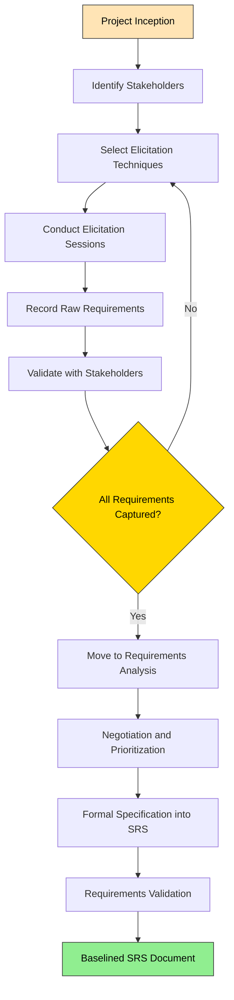
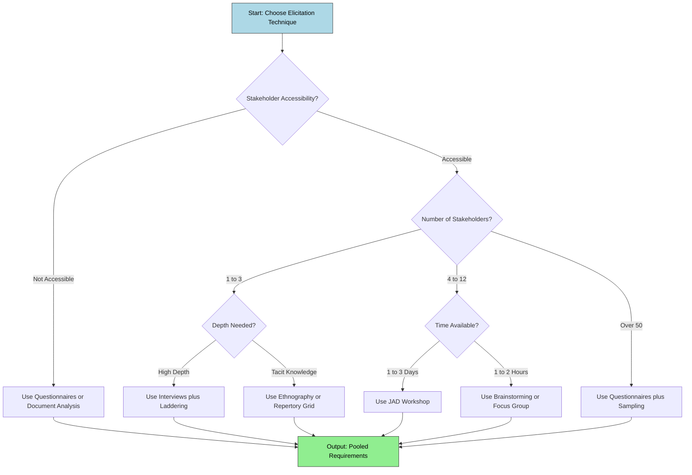
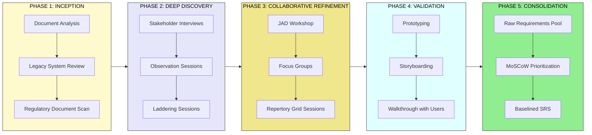
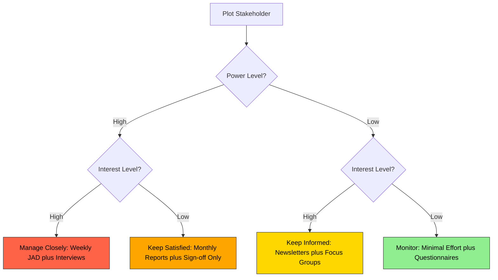
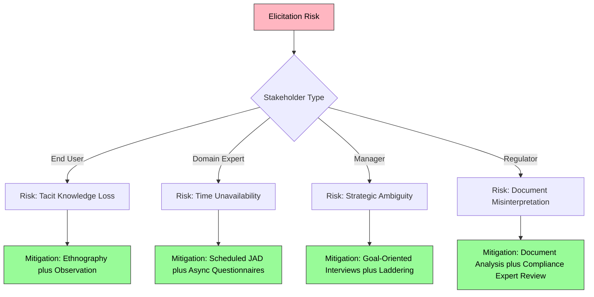

# Requirement elicitation techniques

<!-- SECTION_1_START -->

# Requirement Elicitation Techniques — Foundations

> [!IMPORTANT]
> **KTU 2024 Scheme | OECST723 | Module 1 Focus**
> Requirement Elicitation is the **foundational phase** of the Software Development Life Cycle (SDLC). It is the *bridge* between the unstructured wishes of a stakeholder and a formal Software Requirements Specification (SRS) document. KTU examiners consistently allocate **8–10 marks** to elicitation concepts in Part B questions.

## 1.1 Formal Academic Definition

**Requirement Elicitation** is the systematic process of *discovering*, *gathering*, *identifying*, and *defining* the needs, constraints, and expectations of stakeholders for a software system. It is the **first activity of the requirements engineering process** and acts as the input gate to requirements analysis, specification, and validation.

In the IEEE Standard 830 / IEEE 29148 terminology adopted by KTU, elicitation answers the question:

> *"What does the system **objectively do**, and under **what constraints** must it operate?"*

Elicitation is **not** invention. The analyst does not invent requirements — they **extract** them from the problem domain using disciplined techniques. The output of elicitation is a set of *raw*, *unstructured*, and often *conflicting* requirements that must later be **negotiated**, **prioritized**, and **formalized**.

## 1.2 Intuitive Analogy — The "House Architect" View

Imagine you want to build your **dream house**. You do not hand the architect a blank paper and say *"build a house."* Instead, you sit down together. You talk to your family (interviews), you visit model homes (prototyping), you look at other houses you admire (document analysis / competitive analysis), you observe how your neighbours use their kitchens (observation), and you fill out forms about your budget (questionnaires).

The architect's job in the *elicitation* stage is to **listen, draw out, and document** what you want — not to design the house yet. If the architect misses a requirement (like a north-facing balcony for morning sunlight), the cost of fixing it after construction is **enormous**. This is the famous **"1:10:100 Rule"** of requirements:

> [!NOTE]
> **The 1 : 10 : 100 Rule (Cost of Defect Propagation)**
> * Fixing a missing requirement at the *elicitation* stage costs **1 unit**.
> * Fixing the same defect during *design/testing* costs **10 units**.
> * Fixing it *after deployment* costs **100 units**.

This is precisely why KTU places heavy emphasis on elicitation — it is the cheapest place to find and correct errors.

## 1.3 Key Stakeholders in Elicitation

| Stakeholder Type | Role in Elicitation | KTU 2024 Emphasis |
|---|---|---|
| **End Users** | Provide functional, usability, and UX requirements | Direct interview or focus group |
| **Customers / Clients** | Define business goals, budget, and scope | Workshops and contractual review |
| **Domain Experts** | Provide business rules and regulatory norms | JAD sessions and document analysis |
| **Developers / Architects** | Voice technical feasibility constraints | Joint Application Development (JAD) |
| **Regulatory Bodies** | Impose legal, security, and compliance constraints | Document analysis of standards (e.g., ISO 27001) |
| **Project Managers** | Constraint on time, cost, and resources | Brainstorming and prioritization meetings |

## 1.4 The Place of Elicitation in the Requirements Engineering Process

```
Elicitation → Analysis → Specification → Validation → Management
   (Extract)   (Refine)   (Document)     (Verify)      (Track)
```

> [!TIP]
> **KTU Exam Favourite Question:**
> *"Differentiate between Requirement Elicitation and Requirement Analysis."* — Answer: Elicitation is the *gathering* of raw requirements from stakeholders; Analysis is the *refinement, conflict resolution, and feasibility study* of those gathered requirements.

## 1.5 Why Elicitation is Hard — The Core Challenges

> [!WARNING]
> **Common Pitfall:** KTU students often state *"elicitation is just talking to the user."* This loses 2 marks. Elicitation is a **structured, multi-technique, iterative discipline** with formal techniques.

| # | Challenge | Description |
|---|---|---|
| 1 | **Stakeholder Ambiguity** | Users often say *"the system should be fast"* — without quantifying *"fast."* |
| 2 | **Conflicting Requirements** | Marketing wants features; Production wants simplicity. |
| 3 | **Inaccessible Stakeholders** | Busy executives rarely have time for long sessions. |
| 4 | **Tacit Knowledge** | Experts know things they cannot articulate ("we just know it"). |
| 5 | **Scope Creep** | New requirements keep emerging during elicitation. |
| 6 | **Cultural / Communication Gap** | Technical jargon vs. business jargon. |

> [!VISUALIZATION CONTROL]
> **Concept:** *Requirements Volatility Curve*
> **Input Concept:** A line showing the **number of unresolved/stale requirements** on the y-axis and **time** on the x-axis.
> **Visual Description:** The curve starts **high and unstable** during elicitation, gradually **flattens** as analysis and specification complete, and ideally approaches a **horizontal asymptote** (stable baseline) before coding begins. Students should observe that poor elicitation produces a curve that *never flattens* — leading to project failure.

---

<!-- SECTION_1_END -->

<!-- SECTION_2_START -->

# Deep Theoretical Analysis & KTU High-Yield Cheat Sheet

## 2.1 Classification of Elicitation Techniques

Requirement elicitation techniques are broadly classified into **five categories**, each suited for a different stakeholder context and project phase.

```
┌──────────────────────────────────────────────────────┐
│  REQUIREMENT ELICITATION TECHNIQUE TAXONOMY           │
├──────────────────────────────────────────────────────┤
│  A. Traditional / Direct Techniques                  │
│     • Interviews (Structured, Semi-Structured, Open) │
│     • Questionnaires / Surveys                       │
│     • Observation (Passive, Active/Shadowing)        │
│                                                      │
│  B. Group / Collaborative Techniques                 │
│     • Brainstorming                                  │
│     • Focus Groups                                   │
│     • Joint Application Development (JAD) Workshops  │
│     • Workshops / Facilitated Sessions               │
│                                                      │
│  C. Model / Artifact-Driven Techniques               │
│     • Document Analysis (Existing system, Regs.)     │
│     • Prototyping (Throwaway, Evolutionary)          │
│     • Reverse Engineering                             │
│     • Reuse of Requirement Repositories (COTS)       │
│                                                      │
│  D. Analytical / Cognitive Techniques                │
│     • Laddering (Why-How Chains)                      │
│     • Repertory Grid (Kelly's Method)                │
│     • Task Analysis                                   │
│     • Scenario-Based Elicitation                      │
│                                                      │
│  E. Modern / Contextual Techniques                   │
│     • Ethnography (Contextual Inquiry)               │
│     • Storyboarding                                   │
│     • Use-Case Workshops                              │
└──────────────────────────────────────────────────────┘
```

## 2.2 Detailed Technique-by-Technique Breakdown

### 2.2.1 Interviews

The **most widely used and powerful** elicitation technique. Involves a one-to-one or one-to-many conversation between a requirements analyst and one or more stakeholders.

**Sub-Types:**

| Sub-Type | Description | When to Use | Limitation |
|---|---|---|---|
| **Structured** | Predefined fixed set of questions | Formal, regulated domains | Inflexible, may miss emergent requirements |
| **Unstructured** | Open-ended conversational flow | Early discovery phase | Difficult to compare across stakeholders |
| **Semi-Structured** | Mix of fixed questions + open probes | **Most common in industry** | Requires skilled analyst |

> [!NOTE]
> **KTU Memory Aid:** The *interview preparation* follows the **PQRST** method — *Plan, Question, Record, Summarize, Thank*.

### 2.2.2 Questionnaires / Surveys

A **scalable, low-cost** technique used when stakeholders are geographically distributed or numerically large. A formal set of questions (closed-ended, Likert scale, ranking, open-ended) is distributed.

- **Strength:** Cost-effective, anonymous, statistically analyzable.
- **Weakness:** Low response rate; no follow-up probing.
- **Best Practice:** Combine with interviews for the **top 20% respondents**.

### 2.2.3 Observation

The analyst **watches** the user perform their current tasks in their natural environment. Two variants:

- **Passive Observation** — analyst is a *"fly on the wall."*
- **Active Observation / Shadowing** — analyst asks *"why are you doing that?"* in real time.

> [!TIP]
> **KTU High-Yield:** Observation uncovers **tacit knowledge** and **workarounds** that users themselves cannot articulate — making it the most powerful technique for *legacy system replacement*.

### 2.2.4 Brainstorming

A **free-flowing, idea-generation session** under the rule *no criticism allowed*. Used primarily to **expand the requirement pool** before filtering.

- **Rule of 4:** Ideal group size is **4 to 10** people.
- **Facilitator:** A neutral moderator.
- **Output:** Long list of candidate requirements → filtered using **MoSCoW prioritization** (Must, Should, Could, Won't).

### 2.2.5 Focus Groups

A **carefully selected, representative group** of 6–12 stakeholders, moderated to discuss a specific topic. The group dynamic surfaces **shared, conflicting, and emerging** requirements.

### 2.2.6 Joint Application Development (JAD) Workshops

Originated by **IBM in the 1970s**, JAD is a **highly structured, time-boxed, facilitated workshop** that brings together users, managers, and developers in one room to rapidly define requirements.

- **Duration:** Typically **3–5 days** of intensive sessions.
- **Output:** Functional requirements, DFDs (Data Flow Diagrams), Entity-Relationship models.
- **Strength:** Extremely fast consensus building.

### 2.2.7 Document Analysis

Reviewing **existing artifacts** to extract requirements:

- Legacy system manuals, business forms, reports.
- Competitor product specifications.
- Regulatory documents (e.g., RBI, FDA, GDPR).
- Existing SRS of related systems.

### 2.2.8 Prototyping

Building a **throwaway mock-up** of the system to help users *visualize* and *concretize* their requirements.

- **Throwaway (Rapid) Prototyping:** Built to discover requirements, then discarded.
- **Evolutionary Prototyping:** Built incrementally and forms the basis of the final system.

> [!NOTE]
> **KTU Trap Question:** *"Is prototyping an elicitation technique or a design technique?"*
> **Answer:** It is **both** — it is an elicitation technique when used to *discover* requirements (Module 1) and a design technique when used to *refine* the architecture (Module 3).

### 2.2.9 Reverse Engineering

Extracting requirements from an **existing, often undocumented system** (typically a legacy system) by analyzing its code, runtime behavior, and I/O. Used in *re-engineering* projects.

### 2.2.10 Ethnography (Contextual Inquiry)

The analyst **immerses** themselves in the user's workplace for an extended period (days/weeks). It is the **deepest** form of observation, capturing cultural, social, and contextual factors that influence requirements.

### 2.2.11 Laddering

A **cognitive interview technique** that uses the **"5 Whys"** and **"How"** chains to drill down from high-level goals to fine-grained requirements.

- *"Why do you need a report?"* → *"To track sales."*
- *"Why track sales?"* → *"To identify weak products."*
- → reveals the underlying *business goal*.

### 2.2.12 Repertory Grid (Kelly's Method)

A structured technique that helps **articulate tacit knowledge**. Stakeholders are shown sets of three elements (triads) and asked: *"In what important way are two of these similar but different from the third?"* The constructs thus elicited are mapped on a grid.

## 2.3 KTU High-Yield Comparative Cheat Sheet

| Technique | Setting | Stakeholder Count | Skill Required | Best Phase | Key Output |
|---|---|---|---|---|---|
| **Interviews** | One-to-One | 1–Few | High | All phases | Detailed narratives |
| **Questionnaires** | Remote | Many | Low | Early scoping | Statistical data |
| **Observation** | Field | 1–Many | Medium | Legacy analysis | Workflow models |
| **Brainstorming** | Group Session | 4–10 | Medium | Idea generation | Idea list |
| **Focus Group** | Group Session | 6–12 | High | Validation | Consensus views |
| **JAD Workshop** | Intensive Workshop | 8–20 | Very High | Full spec. | SRS draft |
| **Document Analysis** | Desk | 0 | Low | Inception | Requirement pool |
| **Prototyping** | Lab | 1–Few | High | Concept & refine | UI mockups |
| **Reverse Engg.** | Tech Lab | 0 | High | Re-engineering | Spec. recovery |
| **Ethnography** | Workplace | Many | Very High | Complex domains | Cultural models |
| **Laddering** | Interview | 1 | Medium | Goal analysis | Goal hierarchy |
| **Repertory Grid** | Interview | 1 | High | Tacit knowledge | Construct matrix |

## 2.4 Selection Strategy — Which Technique When?

> [!IMPORTANT]
> **KTU Board Tip:** When asked *"Which elicitation technique would you choose for a banking system?"* — do **not** name just one. Always recommend a **hybrid** strategy:
> 1. **Document Analysis** (regulatory rules: RBI, SEBI)
> 2. **JAD Workshop** (with bank managers + tellers)
> 3. **Interviews** (with senior customers and compliance officers)
> 4. **Prototyping** (for the UI/UX of net-banking)
> 5. **Observation** (to study teller workflows in the branch)

## 2.5 Real-World Industry Utility

- **Healthcare IT** — Ethnography is used in EHR (Electronic Health Record) design to capture doctor–patient interaction nuances.
- **Banking** — JAD + Document Analysis is standard for compliance-heavy systems under RBI/SEBI/PCI-DSS.
- **E-commerce** — A/B testing on prototypes reveals behavioural requirements.
- **Aerospace / Defence** — Strict Document Analysis against DO-178C and MIL-STD requirements.
- **Startup MVPs** — Heavy reliance on Wizard-of-Oz prototyping to elicit user requirements in days, not months.

---

<!-- SECTION_2_END -->

<!-- SECTION_3_START -->

# Step-by-Step Application: Eliciting Requirements for a Real Case

> [!NOTE]
> **Case Study (KTU Exam-Standard):**
> *"Design the requirements for a University Course Registration System (CRS) for KTU."*
> Below, we walk through **how to apply each major elicitation technique** to this case with full step-by-step output. Python code blocks show the structured representation of the requirements produced.

## 3.1 Phase 1 — Inception & Stakeholder Identification

**Step 1:** Identify the universe of stakeholders.

```python
# Stakeholder identification output (Python dict for rigor)
stakeholders: dict[str, list[str]] = {
    "Primary":    ["B.Tech Students", "M.Tech Students", "PhD Scholars"],
    "Secondary":  ["Faculty Advisors", "HODs", "Academic Office Staff"],
    "Tertiary":   ["KTU Exam Controller", "University Finance Officer"],
    "External":   ["AICTE Auditors", "University Web Hosting Vendor"],
    "System":     ["Existing ERP System", "Kerala University SMS Gateway"]
}
```

**Step 2:** Classify the *system intent* using the **FURPS+ model** (a KTU-favoured requirement classification):

| FURPS+ Category | Elicitation Question to Ask |
|---|---|
| **F**unctional | "What features must the CRS support?" |
| **U**sability | "How easy must the UI be for a non-tech student?" |
| **R**eliability | "What is the acceptable downtime during exam season?" |
| **P**erformance | "How many concurrent registrations at peak (result day)?" |
| **S**upportability | "Which browsers and mobile OS must be supported?" |
| **+** Design constraints | "Must integrate with KTU ERP via REST APIs." |
| **+** Implementation | "Preferred language: Java/Node; DB: PostgreSQL." |
| **+** Interface | "Must comply with GIGW (Government of India Guidelines for Websites)." |
| **+** Physical | "Hosting on KTU's on-premise data centre." |

## 3.2 Phase 2 — Application of Specific Techniques

### 3.2.1 Applying INTERVIEWS to the CRS

**Step 1 — Interview Planning (PQRST):**

- **P**lan: Identify 8–10 stakeholders; choose semi-structured format.
- **Q**uestion: Prepare 25 questions (5 background, 15 open, 5 probing).
- **R**ecord: Audio with consent + handwritten notes.
- **S**ummarize: Send the transcript summary within 48 hours.
- **T**hank: Acknowledgment email.

**Step 2 — Sample Interview Questions (KTU Style):**

> 1. *"Walk me through the last time you registered for a course. What frustrated you?"*
> 2. *"If you could change one thing about the current registration process, what would it be?"*
> 3. *"What information do you need to see on the screen to decide which elective to take?"*
> 4. *"If the server crashes mid-registration, what should happen?"*
> 5. *"How do you know your registration was successful?"*

**Step 3 — Extract raw requirements from interview transcripts:**

```python
# Each interview produces a list of raw "stakeholder voice" statements
interview_outputs: list[dict] = [
    {
        "id": "I-001",
        "stakeholder": "S4 CSE Student",
        "quote": "Last time I lost my slot because the page froze.",
        "interpreted_req": "The system must handle session recovery gracefully.",
        "category": "Reliability"
    },
    {
        "id": "I-002",
        "stakeholder": "Academic Office",
        "quote": "We re-enter the same data in 3 systems.",
        "interpreted_req": "CRS must integrate with KTU ERP via single sign-on.",
        "category": "Interface Constraint"
    }
]
```

### 3.2.2 Applying OBSERVATION to the CRS

**Step:** Spend 2 days in the KTU academic office during the *actual* registration window.

**Observation Log Template:**

| Time | Actor | Action | Tool Used | Problem Observed | Implied Requirement |
|---|---|---|---|---|---|
| 10:02 | Student | Tries to login | Chrome on phone | Captcha fails 3× | Re-CAPTCHA v3 with risk score |
| 10:15 | Office staff | Manually approves 14 students | Excel sheet | Rejection email not sent | Auto-email with reason |
| 10:30 | Student | Selects elective | Dropdown | Wrong slot shown | Strict real-time DB read |

> [!TIP]
> **KTU 2-Mark Quick Answer:** *"Two advantages of observation over interview."*
> 1. Captures **actual** behaviour, not *perceived* behaviour.
> 2. Reveals **tacit workflows** and **workarounds** users cannot articulate.

### 3.2.3 Applying BRAINSTORMING to the CRS

**Step:** Run a 60-minute session with 8 stakeholders (4 students, 2 faculty, 2 office staff).

**Rules Enforced:**
- No criticism of any idea.
- Quantity over quality.
- Build on others' ideas.
- Visual recording on a whiteboard.

**Raw Idea Dump (Whiteboard Capture):**

```python
brainstormed_ideas: list[str] = [
    "Add a real-time seat counter next to each course.",
    "Show prerequisite chain visually as a graph.",
    "Allow waitlisting when a course is full.",
    "SMS notification when seat is confirmed.",
    "Recommend courses based on CGPA + interests.",
    "Dark mode UI for night-time registration.",
    "Voice-based search for accessibility (visually impaired).",
    "Auto-save the cart every 30 seconds.",
    "Multi-language support (Malayalam, Hindi, English).",
    "QR code on student ID to skip manual login."
]
```

**Step:** Apply **MoSCoW Prioritization** to filter:

```python
priority_map: dict[str, list[str]] = {
    "Must":   ["Real-time seat counter", "Auto-save cart", "Waitlisting"],
    "Should": ["SMS notification", "Prerequisite graph", "Multi-language"],
    "Could":  ["Dark mode", "QR code login"],
    "Won't":  ["Voice search", "AI course recommender"]  # Future release
}
```

### 3.2.4 Applying JAD WORKSHOP to the CRS

**JAD Session Plan (3 Days):**

| Day | Activity | Output Artifact |
|---|---|---|
| Day 1 | Joint requirements review, conflict resolution | Prioritized backlog |
| Day 2 | Context diagram, DFD Level-0 and Level-1 | DFDs + ER diagram |
| Day 3 | Use-case writing session, edge-case discussion | Use-case table, SRS draft |

**Sample Use-Case produced from JAD:**

| Field | Description |
|---|---|
| **Use-Case ID** | UC-007 |
| **Name** | Register for Open Elective |
| **Actor** | B.Tech Student (logged in) |
| **Pre-condition** | Registration window is open; tuition fee is cleared |
| **Main Flow** | 1. Student logs in → 2. Selects semester → 3. Picks elective → 4. System checks seat availability → 5. Confirms selection → 6. System locks seat + emails receipt |
| **Post-condition** | Student's name appears in the course roster |
| **Alternate Flow** | 4a. Course full → student joins waitlist |
| **Exception Flow** | 5a. Server crash → seat lock released after 5 minutes timeout |

### 3.2.5 Applying DOCUMENT ANALYSIS to the CRS

**Documents reviewed:**

1. **KTU Academic Manual 2024** — Credit rules, prerequisite rules.
2. **AICTE Approval Process Handbook 2024** — Mandatory disclosure requirements.
3. **Existing KTU ERP API documentation** — Integration contract.
4. **Government of India GIGW v3.0** — Accessibility standards.
5. **RBI Cybersecurity Framework for Educational Institutions** — Data security norms.

**Extracted Requirements:**

```python
document_derived_requirements: list[dict] = [
    {"src": "AICTE 2024", "req": "Course metadata must include AICTE program code."},
    {"src": "GIGW v3",    "req": "All UI must support screen readers (WCAG 2.1 AA)."},
    {"src": "ERP API",    "req": "Student data sync must occur every 15 minutes."},
    {"src": "RBI Cyber",  "req": "All PII must be encrypted at rest using AES-256."}
]
```

### 3.2.6 Applying PROTOTYPING to the CRS

**Step 1:** Build a low-fidelity wireframe in Figma within 48 hours.

**Step 2:** Conduct 5 usability sessions where students "think aloud" while clicking through.

**Step 3:** Capture change requests:

```python
prototype_feedback: list[dict] = [
    {
        "stakeholder": "S6 ECE Student",
        "issue": "I cannot tell if I have already selected this elective.",
        "fix": "Highlight selected rows in green with a tick icon."
    },
    {
        "stakeholder": "Faculty Advisor",
        "issue": "I want to see the entire batch's choice distribution.",
        "fix": "Add a heatmap view for the advisor dashboard."
    }
]
```

## 3.3 Phase 3 — Consolidating Elicited Requirements

After applying all techniques, consolidate into a structured Python class hierarchy representing the SRS.

```python
from dataclasses import dataclass, field
from enum import Enum
from typing import List
from datetime import date

class Priority(Enum):
    MUST   = "MUST"
    SHOULD = "SHOULD"
    COULD  = "COULD"
    WONT   = "WONT"

class Category(Enum):
    FUNCTIONAL     = "Functional"
    USABILITY      = "Usability"
    RELIABILITY    = "Reliability"
    PERFORMANCE    = "Performance"
    SECURITY       = "Security"
    COMPLIANCE     = "Compliance"

@dataclass
class Requirement:
    req_id: str
    description: str
    category: Category
    priority: Priority
    source: str          # e.g., "Interview-I-001", "JAD-UC-007"
    stakeholder: str
    elicitation_date: date
    acceptance_criteria: List[str] = field(default_factory=list)

    def __post_init__(self) -> None:
        # Validation guards for KTU-board standard rigor
        if not self.req_id or not isinstance(self.req_id, str):
            raise ValueError("Requirement ID must be a non-empty string.")
        if self.priority not in Priority:
            raise ValueError(f"Invalid priority: {self.priority}")
        if len(self.description.strip()) < 10:
            raise ValueError("Requirement description is too short (< 10 chars).")

# Example: Consolidated requirement catalogue for KTU CRS
catalog: List[Requirement] = [
    Requirement(
        req_id="FR-01",
        description="The system shall allow a student to register for up to 6 courses per semester.",
        category=Category.FUNCTIONAL,
        priority=Priority.MUST,
        source="JAD-UC-007",
        stakeholder="Academic Office",
        elicitation_date=date(2024, 11, 15),
        acceptance_criteria=[
            "System rejects the 7th course selection with a clear error.",
            "Rule applies to both core and elective courses."
        ]
    ),
    Requirement(
        req_id="NFR-04",
        description="The system shall support 5,000 concurrent users during peak registration.",
        category=Category.PERFORMANCE,
        priority=Priority.MUST,
        source="Document-KTU-Academic-Manual",
        stakeholder="KTU IT Director",
        elicitation_date=date(2024, 11, 16),
        acceptance_criteria=[
            "Load test with 5,000 virtual users passes at < 2 sec response time.",
            "Auto-scaling kicks in at 80% CPU utilization."
        ]
    ),
    Requirement(
        req_id="NFR-09",
        description="All student PII must be encrypted at rest using AES-256.",
        category=Category.SECURITY,
        priority=Priority.MUST,
        source="Document-RBI-Cyber-Framework",
        stakeholder="Compliance Officer",
        elicitation_date=date(2024, 11, 17),
        acceptance_criteria=[
            "DB inspection shows no plaintext PII.",
            "Penetration test confirms no SQL injection vectors."
        ]
    )
]

# Print summary
print(f"{'ID':<10}{'Priority':<10}{'Category':<15}{'Description'}")
print("-" * 90)
for r in catalog:
    print(f"{r.req_id:<10}{r.priority.value:<10}{r.category.value:<15}{r.description[:55]}")
```

**Expected Output:**

```
ID        Priority  Category       Description
------------------------------------------------------------------------------------------
FR-01     MUST      Functional     The system shall allow a student to register for up 
NFR-04    MUST      Performance    The system shall support 5,000 concurrent users duri
NFR-09    MUST      Security       All student PII must be encrypted at rest using AES-
```

> [!IMPORTANT]
> **Engineering Utility of This Python Model:** In real production, this dataclass pattern is used in **Jama Software**, **IBM DOORS**, and **Polarion** requirement management systems to maintain traceability from stakeholder voice → use case → requirement → test case → defect.

## 3.4 Phase 4 — Traceability Matrix Construction

A **Requirements Traceability Matrix (RTM)** links every requirement back to its elicitation source. KTU examiners frequently ask students to draw this.

```python
# Traceability matrix as an adjacency list
traceability: dict[str, list[str]] = {
    "FR-01":  ["I-001", "JAD-UC-007", "Doc-KTU-Manual"],
    "NFR-04": ["Interview-IT-Director", "Doc-AICTE"],
    "NFR-09": ["Doc-RBI-Cyber", "JAD-Day2-Security-Discussion"]
}

print("\nREQUIREMENT TRACEABILITY MATRIX (RTM)")
print("=" * 60)
for req_id, sources in traceability.items():
    print(f"{req_id}  <--  {' | '.join(sources)}")
```

**Output:**

```
REQUIREMENT TRACEABILITY MATRIX (RTM)
============================================================
FR-01  <--  I-001 | JAD-UC-007 | Doc-KTU-Manual
NFR-04  <--  Interview-IT-Director | Doc-AICTE
NFR-09  <--  Doc-RBI-Cyber | JAD-Day2-Security-Discussion
```

---

<!-- SECTION_3_END -->

<!-- SECTION_4_START -->

# Structural Diagrams & Schematics

> [!NOTE]
> All Mermaid diagrams below use **alphanumeric node IDs** and **plain-text labels** to comply with the KTU-PREMIER-ENGINE V10 rendering safeguard.

## 4.1 Master Flow: Elicitation as Part of Requirements Engineering



## 4.2 Elicitation Technique Selection Decision Tree



## 4.3 Hybrid Elicitation Strategy Block Diagram



## 4.4 Stakeholder Influence vs Interest Grid



## 4.5 Requirements Elicitation Risk Heatmap (Block Matrix)



---

<!-- SECTION_4_END -->

<!-- SECTION_5_START -->

# KTU 2024 Scheme Examination Question Bank & Topic Recap

## 5.1 Part A — Short Answer Questions (3 Marks Each)

> [!NOTE]
> Cognitive Levels: **Remember / Understand** | Mapping: **CO1**

### **Q1. Define Requirement Elicitation. List any four elicitation techniques.**
**`[KTU University Exam - July 2024]`** | CO1 | Remember

**Model Answer (3 Marks):**

**Definition (2 Marks):**
Requirement Elicitation is the systematic process of gathering, identifying, and discovering the needs, constraints, and expectations of stakeholders for a software system. It is the *first step* of the requirements engineering process, focused on extracting raw requirements from the problem domain. The output of elicitation is a set of *unstructured* stakeholder requirements that are then refined through analysis, negotiation, and formalization.

**Four Techniques (1 Mark — naming any 4):**
1. Interviews
2. Observation
3. Brainstorming
4. JAD Workshops
5. Document Analysis
6. Prototyping
7. Ethnography
8. Questionnaires

---

### **Q2. Differentiate between Requirement Elicitation and Requirement Analysis.**
**`[KTU University Exam - Dec 2023]`** | CO1 | Understand

**Model Answer (3 Marks):**

| Aspect | Requirement Elicitation | Requirement Analysis |
|---|---|---|
| **Purpose** | Discover and gather raw requirements from stakeholders | Refine, model, and resolve conflicts in gathered requirements |
| **Input** | Problem domain, stakeholders, existing documents | Raw requirements from elicitation |
| **Techniques** | Interviews, observation, JAD, brainstorming | DFD, ER modeling, use-case analysis, prioritization |
| **Output** | Unstructured requirement pool | Structured, prioritized, feasible requirement set |
| **Key Question Answered** | *"What does the user want?"* | *"Is it feasible, consistent, and complete?"* |
| **Stakeholder Involvement** | Very high | Moderate |

---

## 5.2 Part B — Module Internal Choice Questions (14 Marks Each)

> [!NOTE]
> Each 14-mark question has sub-parts **(a) 7 marks** and **(b) 7 marks**. Map to escalating cognitive levels.

---

### **PART B — QUESTION A (14 Marks)**

#### **Q.A (a) [7 Marks]** — Explain the Interview technique for requirement elicitation. Discuss its types, advantages, and limitations.
**`[KTU University Exam - July 2024]`** | CO2 | Understand

**Model Answer:**

**Definition (2 Marks):**
An *interview* is a formal, directed conversation between a requirements analyst (interviewer) and one or more stakeholders (interviewees) aimed at extracting information about the proposed system. It is the most widely used elicitation technique and can be conducted face-to-face, over the phone, or via video conference.

**Types of Interviews (3 Marks):**

| Type | Description | When Used |
|---|---|---|
| **Structured** | Predefined set of fixed questions in a fixed order | When requirements are well-understood in a regulated domain |
| **Unstructured** | Open-ended conversational flow with no fixed agenda | During early discovery and exploration |
| **Semi-Structured** | Mix of fixed questions and open-ended probes | **Most common in industry** — balances rigor and flexibility |

**Advantages (1 Mark):**
- Two-way communication allows **immediate clarification** of doubts.
- Suitable for **sensitive or confidential** topics where anonymity is not preferred.
- Effective for **senior stakeholders** who are otherwise inaccessible.

**Limitations (1 Mark):**
- **Time-consuming** and expensive for large stakeholder groups.
- Susceptible to **interviewer bias** and **interpersonal dynamics**.
- Success heavily depends on the **analyst's communication skill**.

#### **Q.A (b) [7 Marks]** — Describe the Joint Application Development (JAD) workshop technique. Why is it preferred for large projects?
**`[KTU University Exam - July 2024]`** | CO2 | Apply

**Model Answer:**

**Definition (2 Marks):**
JAD, pioneered by **IBM in the late 1970s**, is a structured, facilitated, time-boxed workshop that brings together *all key stakeholders* — users, managers, developers, and the facilitator — in one room for an intensive **3 to 5 day** session to define, review, and finalize system requirements.

**Key Roles in a JAD (2 Marks):**

| Role | Responsibility |
|---|---|
| **Facilitator** | Neutral moderator; controls the agenda; manages conflicts |
| **Sponsor** | Senior executive who authorizes the JAD and resolves escalations |
| **Users / Domain Experts** | Provide functional and business requirements |
| **Developers / Analysts** | Translate business needs into technical requirements |
| **Scribe** | Documents every decision in real time on a shared board |

**Why JAD is Preferred for Large Projects (3 Marks):**
1. **Speed:** Replaces weeks of fragmented interviews with a few intensive days — a *3-5×* acceleration in requirement finalization.
2. **Consensus Building:** Conflicts between stakeholders (e.g., Marketing vs. Production) are resolved in real time, avoiding costly rework.
3. **High-Quality Output:** Produces DFDs, ER diagrams, use cases, and a near-final SRS draft in a single effort.
4. **Shared Ownership:** Every stakeholder *hears* and *signs off* on each requirement, increasing buy-in and reducing late-stage change requests.
5. **Knowledge Transfer:** Developers gain deep domain understanding by interacting directly with users.

> [!WARNING]
> **Examiner's Valuation Pitfall — Q.A:**
> * Students often list JAD advantages *without naming the specific roles* — this loses 2 marks. Always state the **Facilitator, Sponsor, Users, Analysts, and Scribe** roles explicitly.
> * Do **not** confuse JAD with a *brainstorming session* — JAD is **structured, time-boxed, and output-driven**, whereas brainstorming is **free-flowing and idea-generation only**.

---

### **PART B — QUESTION B (14 Marks) [INTERNAL CHOICE ALTERNATIVE]**

#### **Q.B (a) [7 Marks]** — Explain the Observation technique of requirement elicitation with its types. Illustrate with a suitable example.
**`[KTU University Exam - Dec 2023]`** | CO2 | Understand

**Model Answer:**

**Definition (2 Marks):**
*Observation* is an elicitation technique in which the requirements analyst **passively or actively watches** the user perform their daily work in their *natural environment* to discover *actual* (as opposed to *perceived*) workflows, workarounds, and tacit knowledge.

**Types of Observation (3 Marks):**

| Type | Description | KTU Example |
|---|---|---|
| **Passive Observation ("Fly on the Wall")** | Analyst is a silent observer; does not interrupt | Watching a bank teller process loan applications for 2 hours |
| **Active Observation / Shadowing** | Analyst asks "why" questions in real time | Following a doctor during OPD to understand EHR workflow |
| **Structured Observation** | Uses a pre-defined checklist of behaviours | Counting how often a student retries a login on the registration portal |

**Illustrative Example (2 Marks):**
**Case:** Observing students in the KTU registration office during the elective selection window.
- *10:02 AM — A student is stuck because the page froze after selecting 4 courses.*
- *Implied requirement:* The system must provide **session persistence and crash recovery** within a 5-minute window.
- *10:30 AM — Office staff manually re-enters student data into an Excel sheet.*
- *Implied requirement:* The system must **auto-sync with the legacy ERP** to eliminate duplicate data entry.

#### **Q.B (b) [7 Marks]** — Discuss the Repertory Grid technique and Laddering technique for eliciting tacit knowledge. Compare them.
**`[KTU University Exam - Dec 2023]`** | CO2 | Apply

**Model Answer:**

**Repertory Grid (Kelly's Method) (3 Marks):**
- **Origin:** George Kelly's *Personal Construct Theory* (1955).
- **Procedure:**
  1. Identify 8–12 *elements* (e.g., for a course portal: Homepage, Course Page, Registration, Fee Payment, Transcript, Timetable, Forum, Grade Card).
  2. Present the user with **triads** (3 elements at a time) and ask: *"In what important way are two of these alike but different from the third?"*
  3. The answer is a **construct** (e.g., *"Course Page and Timetable both show time info; Grade Card does not"* → construct: *shows-time-info*).
  4. Plot all constructs on a **grid** with elements as columns and constructs as rows, scored on a bipolar scale (e.g., *shows time* ↔ *does not show time*).
- **Output:** A matrix that reveals the user's *mental model* and surfaces requirements they cannot articulate verbally.

**Laddering (3 Marks):**
- **Procedure:** Ask a chain of *"Why?"* and *"How?"* questions to move between abstraction levels:
  - *Why do you need a report?* → "To track weekly sales."
  - *Why track sales?* → "To identify weak products."
  - *Why identify weak products?* → "To decide which to discontinue."
- **Output:** A *goal hierarchy* (means-end chain) that traces a fine-grained requirement back to a strategic business goal.

**Comparison (1 Mark):**

| Aspect | Repertory Grid | Laddering |
|---|---|---|
| **Mechanism** | Triadic comparisons and bipolar constructs | Sequential "Why/How" drill-down |
| **Best For** | Surfacing *implicit categorizations* | Tracing *goal hierarchies* |
| **Cognitive Load on User** | Medium (must compare 3 items at a time) | Low (just answers "why" repeatedly) |
| **Output** | Grid of constructs | Tree of means-end goals |
| **Limitation** | Requires skilled facilitation | May drift off-topic without strong moderator |

> [!WARNING]
> **Examiner's Valuation Pitfall — Q.B:**
> * Many students write *observation = interview*. They are **different**: interviews rely on **what the user says**; observation captures **what the user actually does**. Failing to state this distinction costs 2 marks.
> * Do **not** write "Repertory Grid is a software tool." It is a **cognitive interview technique**, not a tool. Tools like *Decision Explorer* merely *implement* the technique.
> * Always state the **triad principle** (3 elements at a time) for Repertory Grid — this is the board's favourite 2-mark sub-question.

---

## 5.3 Examiner's General Valuation Warning

> [!WARNING]
> **Top 5 Places KTU Students Lose Marks on Elicitation Questions:**
> 1. **Treating elicitation as "just talking to the user"** — Always list the *specific technique*, *preparation step*, and *output artifact*.
> 2. **Not mentioning the iterative nature** — Elicitation is *not* one-shot. The **EARS (Easy Approach to Requirements Syntax)** notation and iterative refinement are expected.
> 3. **Skipping the "Why this technique?" justification** — Board examiners allocate 2–3 marks specifically for *justification* of technique selection.
> 4. **Confusing elicitation, analysis, specification, and validation** — These are 4 *distinct* phases. Mixing them up leads to cascading mark loss.
> 5. **Ignoring non-functional requirements (NFRs)** — Interviews focus on functional; NFRs (security, performance, usability) come from document analysis, observation, and prototypes. Mentioning this distinction is worth 2 marks.

---

## 5.4 Topic Recap & Important Things to Remember

> [!TIP]
> **High-Density Revision Checklist — Pin This Before Every Exam**

- **Definition:** Requirement Elicitation is the *discovery and gathering* of raw, unstructured requirements from stakeholders using disciplined techniques.
- **Position in Lifecycle:** It is the **first** activity of the *Requirements Engineering* process — preceding Analysis, Specification, Validation, and Management.
- **1 : 10 : 100 Rule:** Defects fixed at elicitation cost **1 unit**; at design/testing **10 units**; post-deployment **100 units**.
- **Five Categories of Techniques:**
  1. Traditional (Interviews, Questionnaires, Observation)
  2. Group (Brainstorming, Focus Groups, JAD)
  3. Artifact-Driven (Document Analysis, Prototyping, Reverse Engineering)
  4. Analytical (Laddering, Repertory Grid, Task Analysis)
  5. Modern (Ethnography, Storyboarding, Use-Case Workshops)
- **Most Widely Used Technique:** *Interviews* (semi-structured format).
- **Best for Tacit Knowledge:** *Ethnography* and *Repertory Grid*.
- **Best for Legacy Modernization:** *Observation* and *Reverse Engineering*.
- **Best for Time-Critical Consensus:** *JAD Workshop* (3–5 day intensive).
- **Best for Geographically Distributed Users:** *Questionnaires/Surveys*.
- **Best for Visual/UI Requirements:** *Prototyping* (throwaway vs. evolutionary).
- **Prioritization Frameworks:** *MoSCoW* (Must, Should, Could, Won't) and *Kano Model*.
- **Classification of Requirements:** Use *FURPS+* (Functional, Usability, Reliability, Performance, Supportability + Design, Implementation, Interface, Physical).
- **Traceability:** Every requirement must trace back to its elicitation source via the **Requirements Traceability Matrix (RTM)**.
- **Hybrid Strategy is Industry Standard:** Always combine 3–4 techniques (e.g., Document Analysis + Interviews + JAD + Prototyping).
- **Common Pitfall:** Confusing *Elicitation* with *Analysis* or *Specification*.
- **Industry Examples:**
  * Banking → JAD + Document Analysis (RBI norms)
  * Healthcare → Ethnography + Observation
  * Aerospace → Document Analysis (DO-178C, MIL-STD)
  * Startup MVPs → Prototyping + Wizard-of-Oz
- **Standards:** IEEE 830 (SRS format), IEEE 29148 (Requirements Engineering processes), ISO 9241 (Usability), ISO 27001 (Security).
- **Key Roles in JAD:** Facilitator, Sponsor, Users, Analysts, Scribe.
- **MoSCoW, FURPS+, EARS, and RTM** are **favourite 2-mark question topics** — memorize the full forms and key distinctions.

<!-- SECTION_5_END -->
