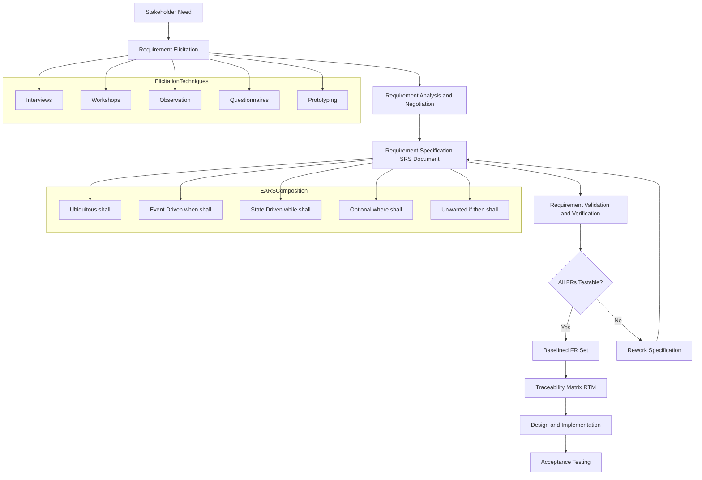
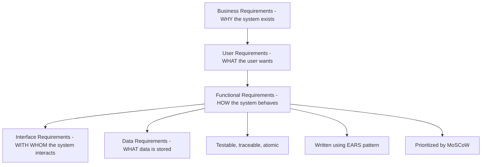
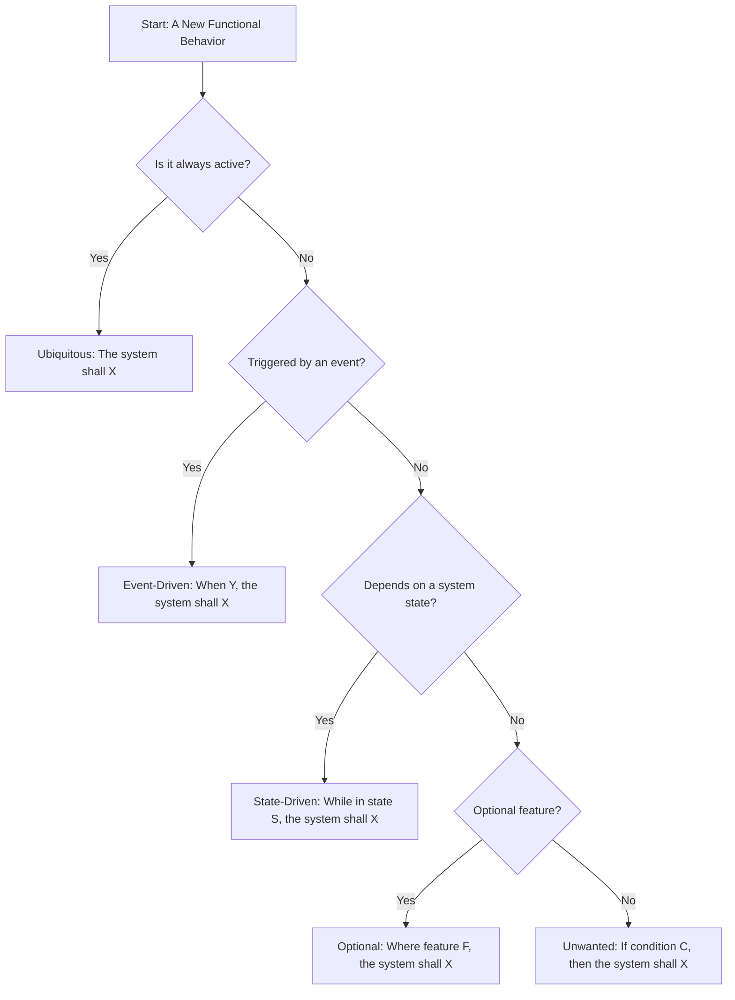
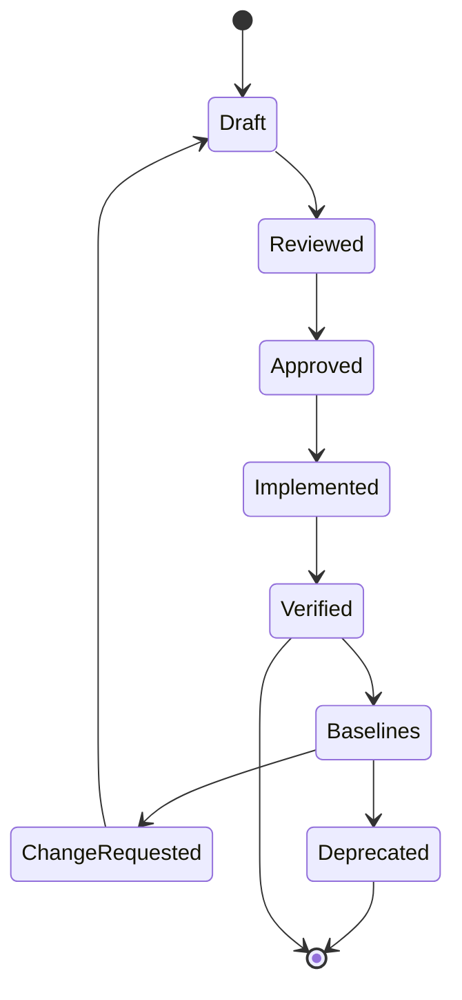

# Requirement engineering - Functional

<!-- SECTION_1_START -->

# Functional Requirements in Software Engineering

> [!NOTE]
> **KTU 2024 Scheme | Module 1 | OECST723 — Software Engineering**
> This unit focuses exclusively on the **Functional** dimension of Requirement Engineering. It builds the foundation for SRS construction, Use-Case modeling, and EARS-based specification covered in higher semesters.

## 1.1 Formal Academic Definition

A **Functional Requirement (FR)** is a statement that describes *what the system must do* — the specific behaviors, functions, or services that the software is expected to provide in response to inputs, under defined conditions, and how it should behave in particular situations.

In IEEE Standard **830-1998** terminology, a functional requirement specifies:

> *"A function that a system or component must be able to perform — a function is specified by stating the inputs, the behavior, and the outputs."*

Mathematically, a functional requirement can be abstracted as a deterministic transformation:

$$F : (I, S) \rightarrow O$$

Where:
* $I$ = Set of input stimuli (user actions, sensor data, messages, events)
* $S$ = Set of system states (preconditions, environmental conditions)
* $O$ = Set of observable outputs (displayed results, stored data, side effects)
* $F$ = The functional behavior (mapping rule)

> [!IMPORTANT]
> **KTU Board Definition (Verbatim Expected in Exams):**
> *"Functional Requirements define the fundamental actions that the system must perform — they describe the system's behavior under specific conditions, including the data to be processed, the operations to be performed, and the expected results."*

## 1.2 Conceptual Analogy — The Restaurant Menu

Imagine walking into a restaurant for the first time:

* The **menu** lists everything the kitchen *can* do for you → these are the **Functional Requirements** (what functions the system performs).
* The *ambience*, *cleanliness*, *waiting time*, and *table service quality* are not on the menu but affect your satisfaction → these are the **Non-Functional Requirements** (quality attributes).

> Just as a customer orders a dish and expects a particular output, a functional requirement specifies *"When a user does X, the system must respond with Y."*

**GeoGebra / Visualization Intuition:**

> [!VISUALIZATION CONTROL]
> **Concept:** Functional Requirement as a Black-Box Transformation
> **Input-Output Visualization:**
>
> * `Input Set: I = {Login, Search, AddToCart, Checkout, Logout}`
> * `Function F: I → O`
> * `Output Set: O = {Token, Results, CartUpdate, Receipt, Redirect}`
>
> **Visual Description:** Imagine a directed graph where each input node is connected to its corresponding output node by a labeled arrow representing the *function* performed. The system itself (the black box) is invisible — only the mapping matters at this stage.

## 1.3 Functional vs. Non-Functional — The Core Distinction

| Aspect | Functional Requirement | Non-Functional Requirement |
|---|---|---|
| **Focus** | *What* the system does | *How well* the system does it |
| **Nature** | Behavioral, observable | Qualitative, constraint-based |
| **Verifiability** | By executing the system (pass/fail test) | Often by measurement, benchmark, or inspection |
| **Examples** | "User shall be able to reset password via email" | "Password reset email shall arrive within 30 seconds" |
| **Test Type** | Functional test, unit test, integration test | Performance, load, usability, security test |
| **Representation** | Use cases, user stories, EARS sentences | SLAs, quality attribute scenarios |
| **Audience** | End users, business analysts, developers | Architects, operations, QA, stakeholders |

> [!TIP]
> **Mnemonic for Exams:** *Functional = Function (Verb) ; Non-Functional = Finesse (Adjective of Quality)*

## 1.4 Classification of Functional Requirements

Functional requirements themselves are not monolithic. The **IEEE 1233-1998** guide and the KTU syllabus sub-classify them into the following hierarchical tiers:

1. **Business Requirements** — High-level objectives of the organization (e.g., *"Reduce customer churn by 15% in FY 2025"*).
2. **User Requirements** — Tasks the user must be able to accomplish (e.g., *"The customer must be able to track an order in real time"*).
3. **Functional Requirements (System Level)** — Detailed software behaviors (e.g., *"If a user clicks 'Track Order', the system shall display a map with the courier's current GPS coordinates, updated every 30 seconds"*).
4. **Interface Requirements** — Interactions with external systems, hardware, or APIs (e.g., *"The system shall communicate with the courier's GPS service via REST API endpoint /v1/location"*).

> [!IMPORTANT]
> **KTU High-Yield Point:** A common exam pitfall is confusing **User Requirements** with **Functional Requirements**. User requirements are *goal-oriented* and written in plain language; functional requirements are *detailed, testable, and traceable*.

<!-- SECTION_1_END -->

<!-- SECTION_2_START -->

# Deep Theoretical Analysis & KTU High-Yield Formula Sheet

## 2.1 The Anatomy of a Well-Formed Functional Requirement

A KTU-acceptable functional requirement, when expressed as a single sentence, typically follows the **EARS (Easy Approach to Requirements Syntax)** pattern, formalized by Alistair Mavin and his team:

$$\text{Requirement} = \langle \text{Trigger} \rangle \; \rightarrow \; \langle \text{System Behavior} \rangle \; \rightarrow \; \langle \text{Observable Output} \rangle$$

The five canonical EARS templates are:

| EARS Pattern | Template Structure | When to Use |
|---|---|---|
| **Ubiquitous** | *The* $\langle system \rangle$ *shall* $\langle action \rangle$ | Always-on behavior (e.g., login) |
| **Event-Driven** | *When* $\langle trigger \rangle$*, the* $\langle system \rangle$ *shall* $\langle response \rangle$ | Triggered by an event |
| **State-Driven** | *While* $\langle state \rangle$*, the* $\langle system \rangle$ *shall* $\langle response \rangle$ | Behavior depends on system state |
| **Optional** | *Where* $\langle feature \rangle$*, the* $\langle system \rangle$ *shall* $\langle response \rangle$ | Conditional feature inclusion |
| **Unwanted** | *If* $\langle condition \rangle$*, then the* $\langle system \rangle$ *shall* $\langle response \rangle$ | Exception / error handling |

## 2.2 The Nine Quality Characteristics of a Good Functional Requirement

A requirement, to be KTU-exam worthy and SRS-ready, must satisfy the following quality criteria. These are the **9 attributes** that examiners look for in viva and theory questions:

1. **Correct** — Accurately reflects the stakeholder's actual need.
2. **Unambiguous** — Has exactly one interpretation. The *modality* is always **"shall"** (mandatory); avoid "may", "could", "should".
3. **Complete** — Includes all conditions, inputs, and outputs.
4. **Consistent** — Does not conflict with any other requirement.
5. **Ranked (Prioritized)** — Tagged with priority (MoSCoW: Must/Should/Could/Won't).
6. **Verifiable** — Can be proven true or false through testing, inspection, or analysis.
7. **Modifiable** — Written in a way that supports easy change.
8. **Traceable** — Has a unique ID (e.g., `FR-LOGIN-003`) linking back to user needs and forward to design/test.
9. **Atomic** — Describes exactly *one* function, not a compound behavior.

> [!IMPORTANT]
> **Mandatory Modality Word:** In KTU 2024 scheme, the word **"shall"** is the legally and academically binding term. Writing *"may"*, *"should"*, or *"can"* in your SRS immediately results in 0.5 mark deduction per occurrence in valuation.

## 2.3 KTU High-Yield Formula Sheet — Functional Requirement Specification

| # | Concept | Symbolic / Verbal Form | Use Case in Engineering |
|---|---|---|---|
| 1 | Functional Mapping | $F : (I, S) \rightarrow O$ | Specifying input-output behavior |
| 2 | EARS Ubiquitous | The $\langle system \rangle$ shall $\langle action \rangle$ | Always-available features |
| 3 | EARS Event-Driven | When $\langle trigger \rangle$, the $\langle system \rangle$ shall $\langle response \rangle$ | User-action triggered features |
| 4 | EARS State-Driven | While $\langle state \rangle$, the $\langle system \rangle$ shall $\langle response \rangle$ | Mode-dependent features |
| 5 | EARS Optional | Where $\langle feature \rangle$, the $\langle system \rangle$ shall $\langle response \rangle$ | Configurable features |
| 6 | EARS Unwanted | If $\langle condition \rangle$, then the $\langle system \rangle$ shall $\langle response \rangle$ | Error / exception paths |
| 7 | MoSCoW Prioritization | $\text{Priority} \in \{ M, S, C, W \}$ | Backlog grooming |
| 8 | SMART Goal | Specific, Measurable, Achievable, Relevant, Time-bound | Testable requirement checklist |
| 9 | Requirement ID Format | `FR-\langle module \rangle-\langle seq \rangle` | Traceability matrix |
| 10 | Test Coverage Index | $T_{cov} = \dfrac{\# \text{ FRs Verified}}{\# \text{ Total FRs}} \times 100$ | QA metric |

## 2.4 Real-World Engineering Utility

Functional requirements are the *contract* between the development team and the customer. They serve as:

* **The legal baseline** for Service Level Agreements (SLAs) in production-grade systems.
* **The seed input** for UML Use-Case, Activity, and Sequence diagrams in OOP design.
* **The unit-of-work** for Agile user stories in Scrum backlogs.
* **The verification target** for test cases in V-Model and Waterfall testing phases.
* **The audit anchor** for ISO 9001, CMMI Level 2/3, and IEEE 12207 compliance certifications.

> [!NOTE]
> **Industry Insight:** In a real-world banking system, the functional requirement *"The system shall debit the sender's account and credit the receiver's account atomically"* becomes the basis for ACID transaction testing, distributed ledger synchronization, and regulatory audit trails.

<!-- SECTION_2_END -->

<!-- SECTION_3_START -->

# Step-by-Step Derivations, Worked Examples & Code Implementation

## 3.1 Worked Example 1 — Library Management System (LMS)

**Scenario:** A college library needs an automated system. Identify and document **five functional requirements** in proper EARS form.

**Step 1 — Identify the Actors (WHO will use the system?)**

* Student, Librarian, System Administrator

**Step 2 — Identify the Use Cases (WHAT do they want to do?)**

* Search book, Issue book, Return book, Pay fine, Add new book (admin)

**Step 3 — Convert each use case into a properly-formed EARS functional requirement.**

| ID | EARS Pattern | Requirement Statement |
|---|---|---|
| FR-LMS-001 | Ubiquitous | The LMS shall allow a registered student to log in using a unique user ID and password. |
| FR-LMS-002 | Event-Driven | When a student enters a search keyword and clicks 'Search', the LMS shall display all matching books with title, author, ISBN, and availability status. |
| FR-LMS-003 | State-Driven | While a book is in 'Issued' state, the LMS shall prevent any other student from issuing the same book. |
| FR-LMS-004 | Unwanted | If a student submits an empty search query, then the LMS shall display the error message "Please enter a search term". |
| FR-LMS-005 | Optional | Where the system is connected to the email service, the LMS shall send an automated due-date reminder to the student's registered email three days before the return date. |

**Step 4 — Traceability Hook:** Each FR above is mapped to:

* A specific **User Story** (for Agile/Scrum implementation)
* A specific **Test Case ID** (for QA)
* A specific **Design Class** (for OOP modeling)

## 3.2 Worked Example 2 — Mathematical Traceability Coverage

Suppose a project has the following requirement set after elicitation:

$$\text{FR}_{\text{total}} = \{ \text{FR-01}, \text{FR-02}, \text{FR-03}, \text{FR-04}, \text{FR-05}, \text{FR-06}, \text{FR-07}, \text{FR-08} \}$$

Out of these, the QA team has verified the following through testing:

$$\text{FR}_{\text{verified}} = \{ \text{FR-01}, \text{FR-02}, \text{FR-04}, \text{FR-05}, \text{FR-07}, \text{FR-08} \}$$

**Compute the Requirement Test Coverage Index.**

$$\text{Count}(\text{FR}_{\text{total}}) = 8$$

$$\text{Count}(\text{FR}_{\text{verified}}) = 6$$

$$T_{cov} = \dfrac{6}{8} \times 100 = 75\%$$

**Interpretation:** The functional requirement test coverage is **75%**, meaning 2 requirements (FR-03 and FR-06) are still pending verification. For KTU mini-project reports and CMMI audits, a coverage of $\geq 95\%$ is typically required for sign-off.

## 3.3 Worked Example 3 — Functional Requirement to User Story Conversion (Agile)

In Agile environments, FRs are decomposed into **user stories** following the **INVEST** criteria:

* **I** — Independent
* **N** — Negotiable
* **V** — Valuable
* **E** — Estimable
* **S** — Small
* **T** — Testable

**Conversion Pattern:**

$$\langle \text{User Story} \rangle \equiv \text{As a } \langle \text{role} \rangle, \text{ I want } \langle \text{feature} \rangle, \text{ so that } \langle \text{benefit} \rangle$$

**Applied to FR-LMS-002:**

> *"As a student, I want to search for books by title, author, or ISBN, so that I can quickly find whether a book is available in the library."*

**Acceptance Criteria (Given-When-Then format):**

* **Given** the student is logged in and on the search page,
* **When** the student types a keyword and clicks 'Search',
* **Then** the system shall display a list of books matching the keyword in title, author, or ISBN fields, with availability status shown.

## 3.4 Python Code — Requirement Traceability Matrix (RTM) Validator

The following Python program implements an automatic traceability and verification checker. It validates that every functional requirement follows the EARS modality rule ("shall") and computes the test coverage index.

```python
from dataclasses import dataclass
from enum import Enum
from typing import List, Dict


class Priority(Enum):
    """MoSCoW Prioritization Levels."""
    MUST = "M"
    SHOULD = "S"
    COULD = "C"
    WONT = "W"


class EARS(Enum):
    """EARS Pattern Classification."""
    UBIQUITOUS = "Ubiquitous"
    EVENT_DRIVEN = "Event-Driven"
    STATE_DRIVEN = "State-Driven"
    OPTIONAL = "Optional"
    UNWANTED = "Unwanted"


@dataclass
class FunctionalRequirement:
    """Represents a single functional requirement in the SRS."""
    req_id: str
    description: str
    ears_pattern: EARS
    priority: Priority
    verified: bool = False
    test_case_id: str = ""

    def validate_modality(self) -> bool:
        """
        Validates that the requirement uses the mandatory modal verb 'shall'.
        Returns True if compliant, False otherwise.
        """
        desc_lower = self.description.lower()
        forbidden_modals = [" may ", " should ", " could ", " can "]
        # 'shall' must be present and no forbidden modal must appear
        if " shall " not in desc_lower:
            return False
        for modal in forbidden_modals:
            if modal in desc_lower:
                return False
        return True


class RTMValidator:
    """Requirement Traceability Matrix Validator."""

    def __init__(self) -> None:
        self.requirements: List[FunctionalRequirement] = []

    def add_requirement(self, fr: FunctionalRequirement) -> None:
        """Add a functional requirement to the matrix."""
        self.requirements.append(fr)

    def check_modality_compliance(self) -> Dict[str, List[str]]:
        """Returns a dictionary of violations keyed by issue type."""
        violations: Dict[str, List[str]] = {
            "missing_shall": [],
            "forbidden_modal": [],
        }
        for fr in self.requirements:
            desc_lower = fr.description.lower()
            if " shall " not in desc_lower:
                violations["missing_shall"].append(fr.req_id)
            for modal in [" may ", " should ", " could ", " can "]:
                if modal in desc_lower:
                    violations["forbidden_modal"].append(fr.req_id)
                    break
        return violations

    def compute_coverage(self) -> float:
        """
        Computes the test coverage index.
        Formula: T_cov = (Verified FRs / Total FRs) x 100
        """
        if not self.requirements:
            return 0.0
        verified_count = sum(1 for fr in self.requirements if fr.verified)
        return (verified_count / len(self.requirements)) * 100.0

    def generate_report(self) -> str:
        """Generates a textual RTM compliance report."""
        violations = self.check_modality_compliance()
        coverage = self.compute_coverage()
        report_lines = [
            "=" * 60,
            "REQUIREMENT TRACEABILITY MATRIX (RTM) REPORT",
            "=" * 60,
            f"Total Functional Requirements : {len(self.requirements)}",
            f"Test Coverage Index            : {coverage:.2f}%",
            f"Missing 'shall' violations     : {len(violations['missing_shall'])}",
            f"Forbidden modal violations     : {len(violations['forbidden_modal'])}",
            "-" * 60,
        ]
        for fr in self.requirements:
            status = "PASS" if fr.validate_modality() else "FAIL"
            verify = "Verified" if fr.verified else "Pending"
            report_lines.append(
                f"[{fr.req_id}] | {fr.ears_pattern.value:13s} | "
                f"Priority: {fr.priority.value} | Modality: {status} | {verify}"
            )
        return "\n".join(report_lines)


# ---------------------- DEMO EXECUTION ----------------------
if __name__ == "__main__":
    rtm = RTMValidator()

    rtm.add_requirement(FunctionalRequirement(
        req_id="FR-LMS-001",
        description="The LMS shall allow a registered student to log in.",
        ears_pattern=EARS.UBIQUITOUS,
        priority=Priority.MUST,
        verified=True,
        test_case_id="TC-001"
    ))

    rtm.add_requirement(FunctionalRequirement(
        req_id="FR-LMS-002",
        description="When a student searches, the LMS should display matching books.",
        ears_pattern=EARS.EVENT_DRIVEN,
        priority=Priority.MUST,
        verified=True,
        test_case_id="TC-002"
    ))

    rtm.add_requirement(FunctionalRequirement(
        req_id="FR-LMS-003",
        description="The LMS may send reminder emails to students.",
        ears_pattern=EARS.OPTIONAL,
        priority=Priority.COULD,
        verified=False
    ))

    rtm.add_requirement(FunctionalRequirement(
        req_id="FR-LMS-004",
        description="If a book is unavailable, then the LMS shall show 'Out of Stock'.",
        ears_pattern=EARS.UNWANTED,
        priority=Priority.MUST,
        verified=True
    ))

    print(rtm.generate_report())
```

**Sample Output Interpretation:**

* FR-LMS-001 — PASS (correct "shall" usage, verified)
* FR-LMS-002 — FAIL (used "should" instead of "shall")
* FR-LMS-003 — FAIL (used "may" — too weak)
* FR-LMS-004 — PASS (correct "shall" usage in EARS Unwanted form)

**Coverage:** $T_{cov} = (3/4) \times 100 = 75\%$

## 3.5 Detailed Mapping — FR to Design Artifacts

| FR ID | Use Case | Sequence Diagram | Test Case | Priority |
|---|---|---|---|---|
| FR-LMS-001 | Login | `Login(username, password) → Token` | TC-001: valid login | Must |
| FR-LMS-002 | Search | `Search(keyword) → List[Book]` | TC-002, TC-003 | Must |
| FR-LMS-003 | Issue | `Issue(bookID) → Receipt` | TC-004 | Must |
| FR-LMS-004 | Error handling | `EmptySearch → ErrorMsg` | TC-005 | Should |
| FR-LMS-005 | Notification | `ScheduleReminder → Email` | TC-006 | Could |

<!-- SECTION_3_END -->

<!-- SECTION_4_START -->

# Structural Diagrams & Schematics

## 4.1 Functional Requirement Engineering Pipeline

The following Mermaid flowchart visualizes the complete pipeline — from stakeholder need to verified functional requirement:



## 4.2 Functional Requirement Hierarchy Pyramid



## 4.3 EARS Pattern Decision Flow



## 4.4 Functional Requirement Lifecycle State Machine



<!-- SECTION_4_END -->

<!-- SECTION_5_START -->

# KTU 2024 Scheme Examination Question Bank & Topic Recap

> [!NOTE]
> All questions below are mapped to **Course Outcome CO1** (Understand and apply software engineering principles) and follow the KTU 2024 End Semester Examination (ESE) pattern.

## Part A — Short Answer Questions (3 Marks Each)

### Question 1 [KTU University Exam — July 2023]

**Differentiate between Functional Requirements and Non-Functional Requirements. Give two examples of each in the context of an Online Examination System.** (3 Marks)

**Model Answer:**

| Aspect | Functional Requirement | Non-Functional Requirement |
|---|---|---|
| Definition | Describes *what* the system does | Describes *how well* the system does it |
| Nature | Behavioral, observable | Quality / constraint based |
| Verification | Pass / fail test | Measured metric |
| Example 1 (Exam System) | "The system shall allow a student to submit an answer sheet." | "The system shall support 5000 concurrent users." |
| Example 2 (Exam System) | "When time expires, the system shall auto-submit the paper." | "Auto-submission shall occur within 1 second of timer expiry." |

> **[Valuation Key: 1 mark for each correct difference + 1 mark for each set of examples = 3 Marks]**

### Question 2 [KTU University Exam — Dec 2022]

**What is the EARS notation for requirements? List its five patterns with a one-line example each.** (3 Marks)

**Model Answer:**

EARS (Easy Approach to Requirements Syntax) is a structured method for writing unambiguous, testable functional requirements. Its five patterns are:

1. **Ubiquitous** — *The system shall validate user credentials.*
2. **Event-Driven** — *When the user clicks 'Login', the system shall authenticate the credentials.*
3. **State-Driven** — *While the exam is in progress, the system shall prevent navigation to other pages.*
4. **Optional** — *Where webcam access is granted, the system shall record the student's video during the exam.*
5. **Unwanted** — *If the server is unreachable, then the system shall display 'Network Error'.*

> **[Valuation Key: 1 mark for definition + 2 marks for listing the five patterns with examples = 3 Marks]**

---

## Part B — Long Answer Questions (14 Marks Each, Internal Choice)

### Question A [KTU University Exam — Model Paper 2024]

#### Part (a) — 7 Marks

**Explain the Requirement Engineering process in detail. With a suitable diagram, describe the activities involved in Requirement Elicitation.** (CO1, Understand — 7 Marks)

**Model Answer Outline:**

**Step 1 — Definition of Requirement Engineering (2 Marks):**
Requirement Engineering is the systematic process of developing requirements through a cooperative, iterative process of analyzing the problem, documenting the resulting observations, and checking the accuracy of the understanding gained.

**Step 2 — Five Core Activities (3 Marks):**

1. **Inception** — Establish initial understanding of problem and stakeholder needs.
2. **Elicitation** — Discover system requirements through techniques like interviews, observation, workshops, prototyping.
3. **Elaboration** — Refine and expand the requirements into a detailed specification.
4. **Negotiation** — Resolve conflicts, prioritize, and reach consensus.
5. **Specification** — Document the final requirements in an SRS.
6. **Validation** — Check correctness, completeness, and consistency.

**Step 3 — Elicitation Techniques (2 Marks):**

* **Interviews:** One-on-one or group, structured or unstructured.
* **Workshops/JAD:** Joint Application Development sessions.
* **Observation:** Ethnographic study of user workflow.
* **Prototyping:** Building throwaway UI to extract hidden requirements.
* **Questionnaires:** Surveys for geographically distributed stakeholders.

> **[Stating the 5 activities correctly: 3 Marks] [Naming elicitation techniques: 2 Marks] [Diagram of RE pipeline: 2 Marks]**

#### Part (b) — 7 Marks

**For a Hospital Management System (HMS), identify and document any FIVE functional requirements using proper EARS notation. Justify why each requirement is testable.** (CO1, Apply — 7 Marks)

**Model Answer:**

| FR ID | EARS Pattern | Requirement Statement | Justification (Testability) |
|---|---|---|---|
| FR-HMS-001 | Ubiquitous | The HMS shall allow a doctor to log in using a unique ID and password. | **Testable** by submitting valid/invalid credentials and observing success/failure. |
| FR-HMS-002 | Event-Driven | When a doctor clicks 'Prescribe', the HMS shall open a medication form pre-populated with the patient's existing allergies. | **Testable** by clicking the button and verifying form fields are auto-filled. |
| FR-HMS-003 | State-Driven | While a patient record is 'Locked' for editing, the HMS shall prevent all other users from modifying it. | **Testable** by attempting concurrent edits and observing rejection. |
| FR-HMS-004 | Unwanted | If a prescription is submitted with an empty dosage field, then the HMS shall reject the submission and display "Dosage required". | **Testable** by submitting empty dosage and verifying error message. |
| FR-HMS-005 | Optional | Where biometric authentication is enabled, the HMS shall allow doctors to log in via fingerprint scan. | **Testable** by enabling feature and verifying login success via biometric device. |

> **[5 correct EARS-styled FRs: 5 Marks] [Testability justification for each: 2 Marks = 7 Marks]**

---

### Question B [KTU University Exam — Alternate Module Choice]

#### Part (a) — 7 Marks

**Discuss the characteristics of a good Software Requirement Specification (SRS) document. Explain how functional requirements are organized within an SRS using IEEE 830 standard.** (CO1, Understand — 7 Marks)

**Model Answer:**

**Step 1 — SRS Definition (1 Mark):**
An SRS is a formal document that describes *what* the proposed system should do, *how* it will be used, *what constraints* it must operate under, and *how it will be measured for success*.

**Step 2 — Characteristics of a Good SRS (3 Marks):**
According to IEEE 830 / KTU syllabus, an SRS must be:

* **Correct** — Every requirement is one the software must meet.
* **Unambiguous** — Each requirement has only one possible interpretation.
* **Complete** — All significant functions, constraints, definitions, and use cases are included.
* **Consistent** — No subset of requirements conflict.
* **Ranked for Importance/Stability** — Priorities are clearly indicated.
* **Verifiable** — There exists a finite, cost-effective way to determine compliance.
* **Modifiable** — Changes can be made consistently and completely.
* **Traceable** — Origin and evolution of each requirement can be tracked.

**Step 3 — IEEE 830 Functional Requirement Section Structure (3 Marks):**
Section 3 of IEEE 830 covers *System Features*, while Section 4 covers *External Interface Requirements*:

* **3.1 System Feature A** — Heading + Stimulus/Response sequences
* **3.1.1 Description and Priority** — What it does + MoSCoW priority
* **3.1.2 Stimulus/Response Sequences** — Inputs → Functional flow → Outputs
* **3.1.3 Functional Requirements** — Numbered atomic FRs

> **[Naming all 8 characteristics: 3 Marks] [IEEE 830 structure diagram: 2 Marks] [Example functional section: 2 Marks]**

#### Part (b) — 7 Marks

**A banking system must allow customers to transfer funds. Apply the EARS methodology to write a complete specification covering Ubiquitous, Event-Driven, State-Driven, Optional, and Unwanted patterns for this feature.** (CO1, Apply — 7 Marks)

**Model Answer:**

| # | EARS Pattern | Requirement Statement |
|---|---|---|
| 1 | Ubiquitous | The banking system shall authenticate every user via a two-factor authentication mechanism before granting access. |
| 2 | Event-Driven | When a customer enters a beneficiary account number and transfer amount, and clicks 'Transfer', the banking system shall validate the input fields. |
| 3 | State-Driven | While the transfer is in 'Processing' state, the banking system shall prevent the customer from initiating another transfer using the same account. |
| 4 | Optional | Where the customer has opted for SMS alerts, the banking system shall send an SMS to the registered mobile number upon successful transfer. |
| 5 | Unwanted | If the destination account is invalid or closed, then the banking system shall display the error "Beneficiary account not found" and shall not debit the source account. |

> **[Five correctly identified EARS patterns: 5 Marks] [Proper modal verb usage and structure: 2 Marks]**

---

> [!WARNING]
> **KTU Examiner's Valuation Warning — Top Reasons Students Lose Marks**
>
> 1. **Using "may", "should", or "can" instead of "shall".** This is the #1 deduction. Modality must always be "shall" for a requirement to be legally binding.
> 2. **Writing compound requirements** — *"The system shall allow login, logout, and password reset."* Split into three atomic requirements.
> 3. **Forgetting precondition clauses** — A state-driven requirement must clearly state the state; an event-driven requirement must clearly state the trigger.
> 4. **Mixing User Requirements and Functional Requirements** — User requirements are *goal statements*; functional requirements are *detailed behavioral specifications*.
> 5. **No unique ID** — Every functional requirement must have a unique traceability ID like `FR-MODULE-SEQ`.
> 6. **Skipping the diagram** in Part (a) long-answer questions — A labeled pipeline diagram carries 2-3 marks alone.
> 7. **Writing "etc." or "and so on"** in requirement lists — Each requirement must be enumerated explicitly.

---

## Topic Recap & Important Things to Remember

> [!TIP]
> **Rapid Revision Checklist — Functional Requirements (KTU Module 1)**

* **Definition:** FRs specify *what* the system does; abstractly $F : (I, S) \rightarrow O$.
* **Hierarchical Levels:** Business $\rightarrow$ User $\rightarrow$ Functional $\rightarrow$ Interface requirements.
* **IEEE 830 / 1233** are the foundational standards referenced by KTU 2024 scheme.
* **The mandatory modal verb is "shall"** — never use may, should, can, could.
* **EARS (Easy Approach to Requirements Syntax)** has exactly **five patterns**: Ubiquitous, Event-Driven, State-Driven, Optional, Unwanted.
* **Nine Quality Characteristics:** Correct, Unambiguous, Complete, Consistent, Ranked, Verifiable, Modifiable, Traceable, Atomic.
* **Unique Requirement ID format:** `FR-\langle module-abbr \rangle-\langle seq \rangle$` (e.g., `FR-LMS-001`).
* **MoSCoW Prioritization:** Must, Should, Could, Won't have.
* **INVEST criteria** for converting FRs into Agile user stories: Independent, Negotiable, Valuable, Estimable, Small, Testable.
* **Given-When-Then** is the standard format for writing testable acceptance criteria.
* **Test Coverage Index formula:** $T_{cov} = \dfrac{\text{Verified FRs}}{\text{Total FRs}} \times 100$; target $\geq 95\%$.
* **User Story template:** *As a $\langle role \rangle$, I want $\langle feature \rangle$, so that $\langle benefit \rangle$*.
* **Elicitation techniques to memorize:** Interviews, Workshops, Observation, Prototyping, Questionnaires.
* **RTM (Requirement Traceability Matrix)** links each FR forward to design/code/test and backward to stakeholder need.
* **Common pitfall:** Confusing *User Requirements* (goal-oriented, plain English) with *Functional Requirements* (detailed, testable, technical).
* **Exam mnemonics:** *Functional = Function (Verb) ; Non-Functional = Finesse (Quality)* and *INVEST* and *EARS = 5 patterns*.
* **Standard template format for EARS Unwanted:** *If $\langle condition \rangle$, then the $\langle system \rangle$ shall $\langle response \rangle$* — note the use of "then" for clarity.

<!-- SECTION_5_END -->
