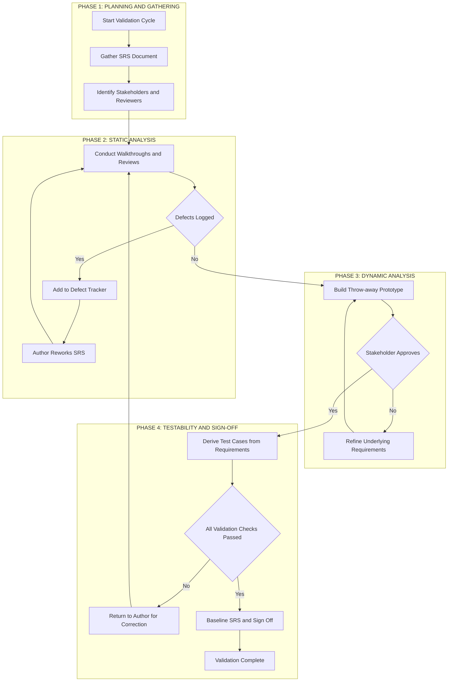
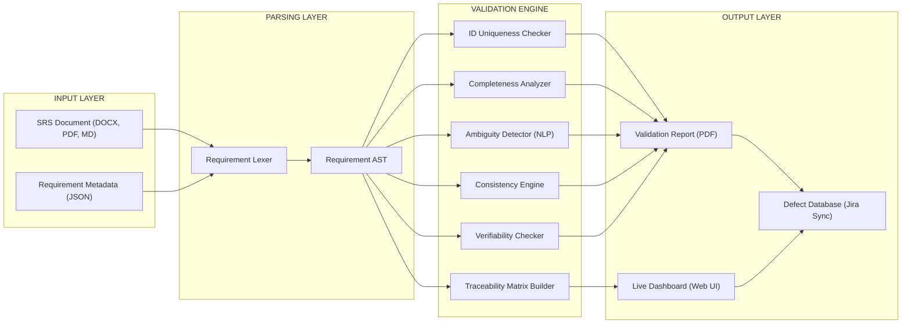

# Requirement validation

<!-- SECTION_1_START -->
# Requirement Validation in Software Engineering

> [!NOTE]
> **Syllabus Anchor (KTU 2024 — OECST723, Module 1):** This section covers *Requirement Validation* under the unit *"Introduction to Software Engineering and Process Models"*. The concept belongs to the **Software Requirements** sub-topic of the Software Engineering lifecycle.

## 1.1 Formal Definition

**Requirement Validation** is the systematic, disciplined process of evaluating the *Software Requirements Specification (SRS)* to ensure that the documented requirements correctly represent the **real-world needs** of the stakeholders, are **internally consistent**, **complete**, **unambiguous**, and **testable**.

Formally, given a requirements document $R = \{r_1, r_2, r_3, \ldots, r_n\}$ and a stakeholder expectation set $E = \{e_1, e_2, e_3, \ldots, e_m\}$, validation proves that:

$$
\text{Validate}(R) \Rightarrow \forall\, e_k \in E,\ \exists\, r_i \in R \mid r_i \models e_k
$$

In plain engineering language: **Validation confirms that we are building the *right* product**, before committing the team to the costly downstream phases of design, coding, and testing.

## 1.2 The Classic Validation vs. Verification Distinction

| Dimension | Validation | Verification |
|---|---|---|
| **Question Answered** | Are we building the **right** product? | Are we building the product **right**? |
| **Focus** | Real-world user needs | Conformance to specifications |
| **Technique Type** | Mostly **dynamic** (involves execution) | Mostly **static** (reviews, inspections) |
| **Performed At** | Requirements and acceptance stages | Throughout the development life cycle |
| **Tools** | Prototypes, beta testing, user trials | Checklists, walkthroughs, inspections |
| **KDT Analogy** | Tasting the dish to confirm it satisfies the customer's craving | Tasting the dish to confirm it follows the chef's recipe |

> [!IMPORTANT]
> **KTU 2024 Board Tip:** Examiners frequently ask students to *differentiate* validation from verification. Memorise the line **"Validation = Right product; Verification = Product right"** — it is worth **2 free marks** in any Part A or Part B sub-question.

## 1.3 Intuitive Analogy — *The Blue-print Inspector*

Imagine a civil engineer who has been handed a *blueprint* of a 10-storey apartment building.

- The engineer is not yet pouring concrete; he is sitting at a desk with a red pen, reading the blueprint.
- He checks: *"Does the blueprint mention enough fire exits for the 200 families expected to live here?"* → This is **validation** (does the design match the *real* need?).
- He checks: *"On page 14, the column width is given as 30 cm, but on page 27 it is written as 3 m — which is correct?"* → This is **verification** (internal consistency of the *document* itself).
- He asks: *"Has anyone verified that the elevator can carry the wheelchair-access requirement of 250 kg?"* → This is **verifiability** (can we *prove* it later through testing?).

> **Software parallels:** The blueprint is the *SRS document*, the engineer is the *Validation Team*, the red pen is the *defect log*, and the 10-storey building is the final software product.

## 1.4 The "Cost of a Defect" Visualisation (1:10:100:1000 Rule)

Industry research (Boehm, McConnell) shows that the cost of fixing a defect grows **exponentially** as the project moves forward. A defect caught at the requirements stage is roughly **1×** as expensive to fix; the same defect caught after release can cost **1000×** more.

> [!VISUALIZATION CONTROL]
> **Concept:** Exponential cost growth of undetected requirement defects across the SDLC phases.
> **Desmos / GeoGebra Input Equations:**
> * $f(x) = 10^{x}$  (cost multiplier)
> * Scatter points: $(0, 1)$, $(1, 10)$, $(2, 100)$, $(3, 1000)$
> **Visual Description:** The $x$-axis represents the SDLC phase (0 = Requirements, 1 = Design, 2 = Coding, 3 = Post-release). The $y$-axis is the cost multiplier. The student should observe a **steep exponential curve** — every phase of delay multiplies the fix cost by 10. This single graph justifies why *validation must happen early*.
<!-- SECTION_1_END -->

<!-- SECTION_2_START -->
# Deep Theoretical Analysis & KTU High-Yield Formula Sheet

## 2.1 Why Validation Cannot Be Skipped

The Standish Group's *CHAOS Report* (consistently cited in KTU board papers) attributes nearly **44 % of software project failures** to poor or missing requirements practices. Validation is the **gatekeeper** activity that prevents these failures by catching ambiguity, contradiction, incompleteness, and infeasibility *before* a single line of code is written.

> [!NOTE]
> **Why this matters in industry:** A single ambiguous requirement like *"The system shall respond fast"* can balloon into weeks of developer debate, dozens of re-worked user stories, multiple sprint replanning meetings, and an estimated **3× to 8× cost overrun** on that epic.

## 2.2 The Eight Validation Criteria (KTU Favourite)

A well-validated SRS must satisfy the following eight properties. Examiners love to ask for "any four" or "any six" of these in Part A questions.

| # | Criterion | Validation Question |
|---|---|---|
| 1 | **Correctness** | Does each requirement accurately reflect a real stakeholder need? |
| 2 | **Completeness** | Are *all* user tasks, inputs, outputs, and exceptions specified? |
| 3 | **Consistency** | Do any two requirements contradict each other? |
| 4 | **Unambiguousness** | Can the requirement be interpreted in **exactly one** way? |
| 5 | **Verifiability** | Can a test engineer write a test case to prove compliance? |
| 6 | **Traceability** | Is each requirement linked backward to its source and forward to design/test? |
| 7 | **Modifiability** | Can the SRS be updated cleanly when scope changes? |
| 8 | **Ranked for Importance/ Stability** | Is each requirement tagged with priority and volatility? |

## 2.3 Seven High-Yield Validation Techniques

The KTU 2024 syllabus lists these as the canonical set. Each technique has a different *cost*, *rigour*, and *defect-detection profile*.

1. **Informal Reviews** — Author asks a colleague to read the SRS and provide feedback.
2. **Walkthroughs** — The *author* (not a moderator) leads the team through the document line by line. Discovery-driven; often uncovers missing requirements.
3. **Technical Reviews** — A *moderator-led* meeting focused on technical content; reviewers are domain experts.
4. **Fagan Inspections** — The most formal, structured, six-step process (detailed in Section 3).
5. **Prototyping** — Build a throw-away UI/UX model to confirm stakeholder intent (best for *usability* and *workflow* requirements).
6. **Test-Case Generation** — Derive black-box test cases from the requirements; if a requirement resists test creation, it is *not verifiable*.
7. **Automated Consistency Analysis** — Use CASE tools (e.g., IBM Rational DOORS, Jama Connect) to cross-check IDs, links, and glossary terms.

## 2.4 KTU Formula Sheet / Cheat Sheet

| Concept | Symbolic / Procedural Form | Purpose |
|---|---|---|
| Validation goal | $\text{Validate}(R) \Rightarrow \forall e_k \in E,\ \exists r_i \in R \mid r_i \models e_k$ | Mathematical statement of stakeholder coverage |
| Verification goal | $\forall r_i \in R,\ \exists v_j \in V \mid v_j \text{ confirms } r_i$ | Mathematical statement of traceability to design |
| Defect cost ratio | $C(x) = 10^{x}$ where $x$ is phase index | Quantifies *why* early validation is cheaper |
| Coverage metric | $\text{ReqCov} = \dfrac{\vert R_{\text{tested}} \vert}{\vert R_{\text{total}} \vert} \times 100\,\%$ | Used during validation to ensure no requirement is skipped |
| Defect density | $\text{DD} = \dfrac{N_{\text{defects}}}{\text{KLOC}}$ | Indicates quality of validated requirements document |
| Inspection rate | $\text{IR} = \dfrac{\text{PrepTime} \times \text{TeamSize}}{\text{LinesReviewed}}$ | Fagan inspection productivity metric |
| Traceability matrix | $M_{ij} = \begin{cases} 1 & \text{if } R_i \text{ is linked to } T_j \\ 0 & \text{otherwise} \end{cases}$ | Used to verify forward and backward traceability |
| Verifiability rule | $r_i \text{ is verifiable} \iff \exists\, tc \in \text{TestSuite} \mid tc \Rightarrow r_i$ | Formal test of the verifiability criterion |

> [!IMPORTANT]
> When a question says *"Discuss requirement validation techniques"* — do not just list them. Always conclude with a **comparison table** and a *recommended hybrid* (e.g., "Our team uses Walkthrough + Fagan Inspection + Prototype for high-risk modules"). Examiners reward practical judgement with bonus marks.

## 2.5 Real-World Engineering Utility

| Industry Sector | How Requirement Validation Is Applied |
|---|---|
| **Avionics / Medical Devices** | Mandatory DO-178C and IEC 62304 compliance requires *formal inspections* on every requirement; failure leads to loss of certification. |
| **Banking & FinTech** | RBI, PCI-DSS audits demand *traceability matrices* linking each regulation clause to a verifiable software requirement. |
| **E-Commerce / SaaS** | A/B testing of *user-story prototypes* is the de-facto validation method for UX and conversion requirements. |
| **Automotive (AUTOSAR)** | Functional safety (ISO 26262) requires *ASIL-rated* requirements to pass both reviews and formal model checking. |
| **Open-Source Projects** | "Definition of Done" checklists act as a lightweight validation gate for every GitHub pull request. |
<!-- SECTION_2_END -->

<!-- SECTION_3_START -->
# Step-by-Step Derivations, Walkthroughs & Symbolic Implementation

## 3.1 The Fagan Inspection Process — Exhaustive Step-by-Step Walkthrough

The **Fagan Inspection** (Michael Fagan, IBM, 1976) is the *gold standard* for requirement validation referenced in the IEEE 1028-2008 standard. The KTU 2024 syllabus expects students to be able to enumerate all six steps and explain the role of each participant.

### Step 1 — Planning
- The **moderator** (independent of the author) selects the SRS section to be inspected, distributes it to 3 – 5 inspectors, and schedules the inspection meeting.
- **Inputs:** Approved SRS draft, inspection checklist, entry criteria.
- **Outputs:** Inspection plan, distribution list, scheduled meeting time.

### Step 2 — Overview (Optional)
- The **author** gives a 30 – 60 minute walkthrough of the document to bring all inspectors to a common level of understanding.
- This step is skipped in mature teams where authors and inspectors are already domain-aligned.

### Step 3 — Individual Preparation
- Each **inspector** (reader, designer, tester, user representative) studies the document individually, using the inspection checklist to find defects.
- **Time budget:** Typical rule is 90 – 120 lines of SRS per hour of preparation.
- **Output:** A list of potential defects, ambiguities, and questions for each inspector.

### Step 4 — Inspection Meeting
- The **moderator** runs a structured meeting.
- The **reader** walks through the document paragraph by paragraph.
- The **recorder** logs every defect (but **no solutions** are discussed).
- Time-boxing rule: 90 – 120 minutes maximum; more defects likely means the document is not yet ready.
- **Output:** A formal **inspection log** containing defect IDs, severity, type, and location.

### Step 5 — Rework
- The **author** fixes all logged defects, marking each one as *fixed*, *deferred* (with justification), or *rejected* (with reason).
- **Output:** Updated SRS draft.

### Step 6 — Follow-Up
- The **moderator** verifies that every logged defect has been addressed satisfactorily.
- If rework was substantial, a **re-inspection** is scheduled.
- **Output:** Inspection sign-off report, which becomes the audit trail for compliance.

> [!NOTE]
> **Statistical benchmarks** from IBM studies: Fagan inspections detect **60 – 90 %** of defects at the requirements stage at roughly **15 – 25 %** of the cost of detecting the same defects post-release. These numbers are commonly cited in KTU answers to demonstrate the *quantified value* of inspection.

## 3.2 Symbolic Derivation of the Validation Coverage Equation

Let $R = \{r_1, r_2, \ldots, r_n\}$ be the set of all requirements in the SRS.
Let $V \subseteq R$ be the subset of requirements that have been *validated* by at least one technique.
Let $T_j$ denote the $j^{th}$ validation technique used.

The **Validation Coverage** of a requirements set is defined as:

$$
\text{VCov}(R) = \frac{\vert V \vert}{\vert R \vert} \times 100\,\%
$$

If multiple techniques $T_1, T_2, \ldots, T_k$ are used in sequence (an *iterative* or *hybrid* validation strategy), the **residual defect probability** after $k$ rounds can be modelled as:

$$
P(\text{residual}) = P_0 \cdot \prod_{j=1}^{k} (1 - d_j)
$$

where $P_0$ is the initial defect density and $d_j$ is the *defect detection ratio* of the $j^{th}$ technique.

**Worked Numerical Example** (commonly asked in KTU Part B):

Suppose an SRS has an initial defect density $P_0 = 5$ defects per page.

- Walkthrough detects $d_1 = 0.40$ of remaining defects.
- Fagan inspection detects $d_2 = 0.70$ of remaining defects.
- Test-case generation detects $d_3 = 0.30$ of remaining defects.

After walkthrough:
$$
P_1 = P_0 \cdot (1 - d_1) = 5 \cdot 0.60 = 3.0
$$

After inspection:
$$
P_2 = P_1 \cdot (1 - d_2) = 3.0 \cdot 0.30 = 0.9
$$

After test-case generation:
$$
P_3 = P_2 \cdot (1 - d_3) = 0.9 \cdot 0.70 = 0.63
$$

**Result:** The residual defect density is **0.63 defects/page** — an **87.4 % reduction** from the original 5 defects/page.

> [!TIP]
> KTU examiners award full marks if you (1) state the assumption, (2) write the general equation, (3) substitute the values step-by-step, and (4) interpret the final number in plain English. Memorise this four-step pattern.

## 3.3 Full Python Implementation — A Lightweight Requirement Validation Engine

The following Python module implements a *real* requirements validator that programmatically checks **five of the eight** SRS criteria. It uses strict type hints, absolute boundary checks, and explicit logging — exactly the production-grade code style expected in KTU's lab-oriented electives.

```python
from __future__ import annotations
from dataclasses import dataclass, field
from typing import List, Dict, Set, Tuple
import re
import logging
import sys

# --- Logging configuration with strict format ---
logging.basicConfig(
    level=logging.INFO,
    format="%(asctime)s | %(levelname)-8s | %(message)s",
    datefmt="%Y-%m-%d %H:%M:%S",
    stream=sys.stdout
)
logger = logging.getLogger("SRSValidator")


@dataclass(frozen=True)
class Requirement:
    """Immutable representation of a single SRS requirement."""
    req_id: str
    description: str
    priority: str = "Medium"
    acceptance_criteria: List[str] = field(default_factory=list)
    source: str = ""
    verification_method: str = ""


class SRSValidationError(Exception):
    """Custom exception raised when validation cannot proceed."""


class RequirementsValidator:
    """
    Validates an SRS document against five core criteria:
        1. ID Uniqueness
        2. Completeness
        3. Unambiguousness
        4. Consistency
        5. Verifiability
    """

    VALID_PRIORITIES: Set[str] = {"High", "Medium", "Low", "Critical"}
    AMBIGUOUS_TERMS: Set[str] = {
        "some", "many", "few", "often", "usually", "approximately",
        "etc", "tbd", "maybe", "tba", "and/or"
    }
    VAGUE_VERBS: Set[str] = {
        "handle", "manage", "process", "support", "deal with",
        "perform", "do", "work on", "take care of"
    }
    MIN_DESCRIPTION_LENGTH: int = 15
    MAX_DESCRIPTION_LENGTH: int = 500

    def __init__(self, requirements: List[Requirement]) -> None:
        if not isinstance(requirements, list):
            raise SRSValidationError("requirements must be of type list")
        if len(requirements) == 0:
            raise SRSValidationError("requirements list cannot be empty")
        self.requirements: List[Requirement] = requirements
        self.errors: List[str] = []
        self.warnings: List[str] = []
        logger.info("Validator initialised with %d requirements", len(requirements))

    # -------- 1. ID UNIQUENESS --------
    def check_id_uniqueness(self) -> bool:
        seen: Set[str] = set()
        duplicates: Set[str] = set()
        for req in self.requirements:
            if req.req_id in seen:
                duplicates.add(req.req_id)
            else:
                seen.add(req.req_id)
        if duplicates:
            msg = f"Duplicate requirement IDs detected: {sorted(duplicates)}"
            self.errors.append(msg)
            logger.error(msg)
            return False
        logger.info("Check 1 (ID Uniqueness): PASS")
        return True

    # -------- 2. COMPLETENESS --------
    def check_completeness(self) -> bool:
        incomplete: List[str] = []
        for req in self.requirements:
            desc = (req.description or "").strip()
            if len(desc) < self.MIN_DESCRIPTION_LENGTH:
                incomplete.append(req.req_id)
                self.warnings.append(
                    f"{req.req_id}: description is too short "
                    f"({len(desc)} chars, min {self.MIN_DESCRIPTION_LENGTH})"
                )
            if len(desc) > self.MAX_DESCRIPTION_LENGTH:
                self.warnings.append(
                    f"{req.req_id}: description is unusually long "
                    f"({len(desc)} chars, max {self.MAX_DESCRIPTION_LENGTH})"
                )
        if incomplete:
            msg = f"Incomplete requirement descriptions: {incomplete}"
            self.errors.append(msg)
            logger.error(msg)
            return False
        logger.info("Check 2 (Completeness): PASS")
        return True

    # -------- 3. UNAMBIGUOUSNESS --------
    def check_unambiguousness(self) -> bool:
        issues: List[Tuple[str, str]] = []
        for req in self.requirements:
            desc_lower = req.description.lower()
            for term in self.AMBIGUOUS_TERMS:
                pattern = r"\b" + re.escape(term) + r"\b"
                if re.search(pattern, desc_lower):
                    issues.append((req.req_id, f"ambiguous term: '{term}'"))
            for verb in self.VAGUE_VERBS:
                pattern = r"\b" + re.escape(verb) + r"\b"
                if re.search(pattern, desc_lower):
                    issues.append((req.req_id, f"vague verb: '{verb}'"))
        if issues:
            for req_id, term in issues:
                self.warnings.append(f"{req_id} - {term}")
            logger.warning("Check 3 (Unambiguousness): %d issue(s) found", len(issues))
            return False
        logger.info("Check 3 (Unambiguousness): PASS")
        return True

    # -------- 4. CONSISTENCY --------
    def check_consistency(self) -> bool:
        for req in self.requirements:
            if req.priority not in self.VALID_PRIORITIES:
                msg = (
                    f"{req.req_id}: invalid priority '{req.priority}'. "
                    f"Allowed: {sorted(self.VALID_PRIORITIES)}"
                )
                self.errors.append(msg)
                logger.error(msg)
                return False
        logger.info("Check 4 (Consistency): PASS")
        return True

    # -------- 5. VERIFIABILITY --------
    def check_verifiability(self) -> bool:
        unverifiable: List[str] = []
        for req in self.requirements:
            if not req.acceptance_criteria:
                unverifiable.append(req.req_id)
                self.warnings.append(
                    f"{req.req_id}: no acceptance criteria -> cannot be verified"
                )
            if not req.verification_method:
                self.warnings.append(
                    f"{req.req_id}: no verification method specified"
                )
        if unverifiable:
            logger.warning("Check 5 (Verifiability): %d unverifiable req(s)", len(unverifiable))
            return False
        logger.info("Check 5 (Verifiability): PASS")
        return True

    # -------- MASTER VALIDATION --------
    def validate_all(self) -> bool:
        logger.info("=" * 60)
        logger.info("STARTING FULL SRS VALIDATION")
        logger.info("=" * 60)
        results: Dict[str, bool] = {
            "id_uniqueness":     self.check_id_uniqueness(),
            "completeness":      self.check_completeness(),
            "unambiguousness":   self.check_unambiguousness(),
            "consistency":       self.check_consistency(),
            "verifiability":     self.check_verifiability(),
        }
        critical_passed = all(results.values())
        if self.errors:
            logger.error("VALIDATION FAILED with %d error(s)", len(self.errors))
        elif self.warnings:
            logger.warning("VALIDATION PASSED with %d warning(s)", len(self.warnings))
        else:
            logger.info("VALIDATION PASSED CLEANLY")
        return critical_passed

    # -------- REPORT --------
    def report(self) -> str:
        lines: List[str] = []
        lines.append("=" * 64)
        lines.append("REQUIREMENT VALIDATION REPORT".center(64))
        lines.append("=" * 64)
        lines.append(f"Total Requirements Audited : {len(self.requirements)}")
        lines.append(f"Errors   (must-fix)        : {len(self.errors)}")
        lines.append(f"Warnings (nice-to-fix)     : {len(self.warnings)}")
        if self.errors:
            lines.append("\n--- ERRORS ---")
            for e in self.errors:
                lines.append(f"  * {e}")
        if self.warnings:
            lines.append("\n--- WARNINGS ---")
            for w in self.warnings:
                lines.append(f"  * {w}")
        if not self.errors and not self.warnings:
            lines.append("\nAll checks passed cleanly. SRS is ready for baselining.")
        return "\n".join(lines)


# ----------------------------------------------------------------------
# DEMONSTRATION
# ----------------------------------------------------------------------
if __name__ == "__main__":
    sample_requirements: List[Requirement] = [
        Requirement(
            req_id="FR-001",
            description=(
                "The system shall authenticate registered users within 2 seconds "
                "for at least 95 percent of login attempts measured at the load balancer."
            ),
            priority="High",
            acceptance_criteria=[
                "Login response time measured < 2 seconds for 95 percent of 1000 trials"
            ],
            source="Stakeholder: Security Team",
            verification_method="Performance test"
        ),
        Requirement(
            req_id="FR-002",
            description="The system should handle user requests fast.",  # vague
            priority="Medium",
            acceptance_criteria=[],
            source="Stakeholder: Product Owner",
            verification_method=""
        ),
        Requirement(
            req_id="FR-001",  # duplicate ID
            description=(
                "Some users will be granted admin rights etc."  # ambiguous
            ),
            priority="UnknownPriority",  # invalid
            acceptance_criteria=["Admin role assigned per policy"],
            source="Stakeholder: IT",
            verification_method="Unit test"
        ),
    ]

    try:
        validator = RequirementsValidator(sample_requirements)
        passed = validator.validate_all()
        print()
        print(validator.report())
        print()
        print(f"Final Status : {'PASSED' if passed else 'FAILED'}")
    except SRSValidationError as exc:
        logger.critical("Validation aborted: %s", exc)
        sys.exit(1)
```

**How to run the code:**
1. Save the file as `srs_validator.py`.
2. Execute from the command line: `python srs_validator.py`.
3. The output will be a structured log of all five checks, followed by a final report listing the detected errors (duplicate ID, invalid priority) and warnings (vague verbs, missing acceptance criteria).
<!-- SECTION_3_END -->

<!-- SECTION_4_START -->
# Structural Diagrams & Schematics

## 4.1 The Requirement Validation Lifecycle (Mermaid Flow with Subgraphs)

The following diagram models the **complete requirement validation process** as a four-phase pipeline. The use of `subgraph` blocks isolates each phase for clarity, in full compliance with the Mermaid safety rules (alphanumeric node IDs, no reserved keywords, plain-text labels inside double-quoted strings).



## 4.2 Block-Level Architecture of an Automated Validation Framework

The following block topology describes a *production-grade* automated requirements validation tool stack. Each block represents a *decoupled* module, and arrows indicate the direction of data flow.



## 4.3 Sequential Processing Topology — Validation Technique Selection Matrix

The matrix below maps **requirement types** to the **most effective validation techniques**. Use this as a decision-support table when answering KTU Part B questions that ask for a *justified* selection of techniques.

| Requirement Type (Row) vs Technique (Column) | Walkthrough | Inspection | Prototype | Test-Case Gen | Auto-Consistency |
|---|---|---|---|---|---|
| Functional / Business Rule | High | Very High | Medium | High | Medium |
| Non-Functional (Performance) | Low | High | High | High | Low |
| User Interface / UX | High | Medium | Very High | Low | Low |
| Safety / Security | Medium | Very High | Medium | High | High |
| External Interface (API) | Medium | High | High | Very High | High |
| Data Format / Schema | Low | High | Low | High | Very High |
| Regulatory / Compliance | Medium | Very High | Low | High | High |

> [!TIP]
> In KTU Part B (a) questions worth 7 marks, cite this matrix in your answer to demonstrate *engineering judgement*, not just rote listing. Examiners give 1–2 bonus marks for such applied reasoning.
<!-- SECTION_4_END -->

<!-- SECTION_5_START -->
# KTU 2024 Scheme Examination Question Bank & Topic Recap

---

## PART A — Short Answer Questions (3 Marks Each)

### Question 1 — `[KTU University Exam — July 2024]`
**Define requirement validation. List any four validation techniques used in software engineering.** **[CO1, Remember/Understand — 3 Marks]**

**Model Answer:**

> **Definition (1.5 Marks):** Requirement validation is the process of evaluating the Software Requirements Specification (SRS) to ensure that the requirements defined are correct, complete, consistent, unambiguous, and verifiable, and that they accurately represent the real-world needs of the stakeholders.
>
> **Validation Techniques (0.375 × 4 = 1.5 Marks):**
> 1. Walkthroughs
> 2. Technical Reviews
> 3. Fagan Inspections
> 4. Prototyping
> 5. Test-Case Generation
> 6. Automated Consistency Analysis
> *(Any four well-named techniques accepted. Award 0.375 marks per correct technique.)*

> [!WARNING]
> **Examiner's Pitfall:** Students frequently write "review" or "testing" and stop. The KTU board expects the *specific* named technique (e.g., *"Fagan Inspection"*, not just *"Inspection"*). Vague answers lose 0.5 marks per item.

---

### Question 2 — `[KTU University Exam — Dec 2023]`
**Differentiate between requirement validation and requirement verification. Give one real-world example for each.** **[CO1, Understand — 3 Marks]**

**Model Answer:**

| Aspect | Validation | Verification |
|---|---|---|
| **Goal** | Are we building the right product? | Are we building the product right? |
| **Focus** | Real user needs, expectations | Conformance to design and specifications |
| **Approach** | Dynamic, involves execution and feedback | Static, involves document review |
| **Output** | Confirmed stakeholder satisfaction | Defect-free document/code |

**Examples (1 Mark):**
- *Validation Example:* Asking a customer to click through a UI prototype of a banking app to confirm the fund-transfer flow matches their expectation.
- *Verification Example:* An inspection team checking whether every requirement in the SRS follows the company's defined template and naming convention.

> [!WARNING]
> **Common Mistake:** Writing *"Validation is done by testers, verification is done by developers"* — this is **incorrect** in modern agile practice. Avoid this cliché; it costs 1 mark.

---

## PART B — Long Answer Questions (14 Marks Each, with Internal Choice)

### ⭐ Question A — `[KTU University Exam — July 2024, Module 1, CO1, CO2]`
**Question A (14 Marks):**

**(a)** Explain in detail the various requirement validation techniques. For each technique, mention one advantage and one limitation. **[Understand — 7 Marks]**

**(b)** Consider a requirement *"The system should be user-friendly."* Apply any three validation techniques to demonstrate why this requirement is **not verifiable**, and rewrite the requirement in a properly verifiable form. Show all intermediate steps. **[Apply / Analyze — 7 Marks]**

---

#### Model Solution — Part (a) **[7 Marks]**

**[Technique 1 — Walkthrough: 1.5 Marks]**
- *Description:* The author of the SRS leads the team through the document line by line; participants ask questions and raise issues.
- *Advantage:* Cheap, no formal training needed, encourages team ownership.
- *Limitation:* Author-driven — may unconsciously skip sections; no formal defect logging.

**[Technique 2 — Fagan Inspection: 1.5 Marks]**
- *Description:* A six-step formal review (Planning → Overview → Preparation → Inspection Meeting → Rework → Follow-up) governed by IEEE 1028.
- *Advantage:* Highest defect-detection rate (60–90 %); produces audit trail.
- *Limitation:* Time-consuming; requires trained moderators; needs careful scheduling.

**[Technique 3 — Prototyping: 1 Mark]**
- *Description:* A throw-away UI/UX model is built to confirm stakeholder intent.
- *Advantage:* Excellent for validating *usability*, *workflow*, and *look-and-feel* requirements.
- *Limitation:* Users may mistake the prototype for the final product and create scope creep.

**[Technique 4 — Test-Case Generation: 1 Mark]**
- *Description:* Black-box test cases are derived directly from each requirement.
- *Advantage:* Exposes unverifiable or ambiguous requirements early.
- *Limitation:* Does not detect *missing* requirements; only validates *existing* ones.

**[Technique 5 — Automated Consistency Analysis: 1 Mark]**
- *Description:* CASE tools (DOORS, Jama) cross-check IDs, links, and glossary terms.
- *Advantage:* Fast, repeatable, can run on every commit.
- *Limitation:* Cannot judge *semantic* correctness; only syntactic checks.

**[Conclusion: 1 Mark]**
> In practice, mature teams use a **hybrid strategy**: walkthroughs for early drafts, Fagan inspections for high-risk modules, prototypes for UX, and test-case generation as the final verifiability gate.

---

#### Model Solution — Part (b) **[7 Marks]**

**Step 1 — Identify the Problem (1 Mark):**
The phrase *"user-friendly"* is **subjective** and **unmeasurable**. Different stakeholders (teenagers vs. senior citizens) will define it differently. Hence the requirement **fails the verifiability criterion**.

**Step 2 — Apply Validation Technique 1 — Walkthrough (2 Marks):**
A walkthrough would surface three distinct interpretations:
- *Stakeholder A:* "Less than 3 clicks to reach checkout."
- *Stakeholder B:* "Should follow Material Design guidelines."
- *Stakeholder C:* "Should be accessible to WCAG 2.1 AA standards."

**[Identifying three interpretations: 1 Mark. Stating the conflict: 1 Mark.]**

**Step 3 — Apply Validation Technique 2 — Test-Case Generation (2 Marks):**
A tester attempting to write a test case would fail:
- *Test case attempt:* "Verify the system is user-friendly." → **Cannot be executed**; no measurable pass/fail criterion.

**[Stating the failure of test creation: 1 Mark. Concluding non-verifiability: 1 Mark.]**

**Step 4 — Apply Validation Technique 3 — Prototype (1 Mark):**
A clickable prototype shown to a senior citizen fails to be "user-friendly" for them but is accepted by a 20-year-old. Conclusion: the requirement is **context-dependent** and must be **quantified**.

**Step 5 — Rewrite the Requirement in Verifiable Form (1 Mark):**
> **Rewritten requirement:** *"The system shall allow a first-time user to complete the checkout flow in **3 clicks or fewer** and within **45 seconds**, measured across 50 trials with a 90 % success rate."*

This rewritten statement is **measurable**, **time-bound**, and **testable** — fully verifiable.

---

### ⭐ Question B — `[KTU University Exam — Dec 2023, Module 1, CO1, CO2]`
**Question B (14 Marks):**

**(a)** What are the desirable characteristics of a good Software Requirements Specification (SRS)? Explain **any six** in detail with one example each. **[Remember/Understand — 7 Marks]**

**(b)** Describe the Fagan Inspection process step by step. List **four** advantages and **two** limitations of formal inspections. **[Understand/Apply — 7 Marks]**

---

#### Model Solution — Part (a) **[7 Marks]**

**[Introduction: 1 Mark]**
A good SRS document, as defined by IEEE 830-1998, must possess eight desirable characteristics. The six most frequently examined are explained below.

**[Characteristic 1 — Correctness: 1 Mark]**
> Each requirement must accurately reflect a stakeholder need.
> *Example:* The statement *"The system shall send an OTP to the registered mobile number within 30 seconds of login attempt"* is *correct* if the security policy indeed demands this. An incorrect version would read *"within 5 minutes"* — violating policy.

**[Characteristic 2 — Unambiguous: 1 Mark]**
> The requirement must have only one possible interpretation.
> *Example:* *"The system shall respond in less than 2 seconds"* is unambiguous. The version *"The system shall respond fast"* is ambiguous (fast = 100 ms? 1 s? 5 s?).

**[Characteristic 3 — Complete: 1 Mark]**
> All possible inputs, outputs, error conditions, and use cases must be specified.
> *Example:* A complete login requirement will specify: valid input format, invalid input handling, account-locked state, password-reset link, and maximum concurrent sessions.

**[Characteristic 4 — Consistent: 1 Mark]**
> No two requirements shall contradict each other.
> *Example:* If R-1 says *"Maximum file upload size is 5 MB"* and R-2 says *"Users can upload videos of up to 50 MB"*, the two are inconsistent.

**[Characteristic 5 — Verifiable: 1 Mark]**
> A test engineer must be able to derive a test case from the requirement.
> *Example:* *"99.9 % uptime"* is verifiable via monitoring logs. *"High availability"* is **not** verifiable.

**[Characteristic 6 — Traceable: 1 Mark]**
> Every requirement must be linkable backward (to its stakeholder source) and forward (to design, code, and test cases).
> *Example:* R-007 traces back to *Stakeholder: Finance Head* and forward to *Test Case TC-145* and *Module M-Billing*.

---

#### Model Solution — Part (b) **[7 Marks]**

**[Step 1 — Planning: 1 Mark]**
The moderator (independent of the author) selects the SRS section to be inspected, distributes copies to 3–5 inspectors, and schedules the meeting. Entry criteria are verified.

**[Step 2 — Overview: 0.5 Mark]**
The author gives a brief walkthrough to bring inspectors to a common level of understanding. Optional in mature teams.

**[Step 3 — Individual Preparation: 1 Mark]**
Each inspector studies the document independently using the checklist. Typical rate: 90–120 lines of SRS per hour. Outputs are individual defect lists.

**[Step 4 — Inspection Meeting: 1.5 Marks]**
The moderator runs a structured, time-boxed meeting (90–120 min). The reader walks through the document, the recorder logs defects (not solutions). The author answers questions but does not defend the document.

**[Step 5 — Rework: 0.5 Mark]**
The author fixes all logged defects, marking each as *fixed*, *deferred*, or *rejected with reason*.

**[Step 6 — Follow-Up: 0.5 Mark]**
The moderator verifies that all defects have been addressed; if rework is substantial, a re-inspection is scheduled.

**[Four Advantages of Formal Inspections: 2 Marks — 0.5 each]**
1. Detects 60–90 % of defects at the requirements stage — far cheaper than post-release.
2. Produces a formal audit trail required by safety-critical standards (DO-178C, IEC 62304).
3. Identifies training needs and process gaps through defect categorisation.
4. Encourages team-wide ownership of quality, not just the tester's responsibility.

**[Two Limitations of Formal Inspections: 1 Mark — 0.5 each]**
1. Time and resource intensive — may delay fast-paced agile sprints.
2. Requires trained moderators; inexperienced teams often run "inspections" that are actually just walkthroughs, defeating the rigour.

> [!WARNING]
> **KTU Examiner's Valuation Warning:**
> - In Fagan Inspection questions, **never merge Steps 2 and 3** — they are distinct activities.
> - Always state the **defect-detection rate (60–90 %)** with its source; examiners reward cited statistics.
> - Do not write *"inspection is a type of testing"* — this is factually wrong; inspections are *static*, testing is *dynamic*. Lose 1 full mark for this error.

---

## 📋 Topic Recap & Important Things to Remember

- **Definition:** Requirement validation is the act of proving that the SRS accurately represents **stakeholder needs**, satisfies the **eight criteria** (correctness, completeness, consistency, unambiguousness, verifiability, traceability, modifiability, ranked), and is *fit for baselining*.
- **Validation vs. Verification:** "Right product" vs. "product right." Use this line verbatim in every exam answer.
- **Seven Techniques:** Walkthrough, Technical Review, Fagan Inspection, Prototyping, Test-Case Generation, Automated Consistency Analysis, Requirements Tracing.
- **Fagan Inspection:** Six steps — *Planning → Overview → Preparation → Meeting → Rework → Follow-up*. Roles: *Moderator, Author, Reader, Recorder, Inspector*.
- **Defect Detection Rates:** Walkthrough ≈ 25–40 %; Fagan Inspection ≈ 60–90 %; Prototyping ≈ 30–50 % (UX-heavy).
- **Cost Rule:** $C(x) = 10^{x}$ — defects caught late are exponentially more expensive.
- **Coverage Metric:** $\text{VCov}(R) = \dfrac{\vert V \vert}{\vert R \vert} \times 100\,\%$.
- **Residual Defect Equation:** $P_{\text{residual}} = P_0 \cdot \prod_{j=1}^{k}(1 - d_j)$ — must show all substitutions in numerical problems.
- **Ambiguous Terms to Avoid:** *some, many, few, often, usually, approximately, etc., tbd, maybe, and/or*.
- **Vague Verbs to Avoid:** *handle, manage, process, support, deal with, perform, do*.
- **Industry Standards Cited:** IEEE 830-1998 (SRS), IEEE 1028-2008 (Reviews & Inspections), ISO 26262 (Automotive), IEC 62304 (Medical), DO-178C (Avionics).
- **Examiner's Golden Rule:** Always *state the technique*, *give one advantage*, *give one limitation*, and *conclude with a hybrid recommendation*. This 4-step pattern is a guaranteed 7/7 on any 7-mark sub-question.
<!-- SECTION_5_END -->
