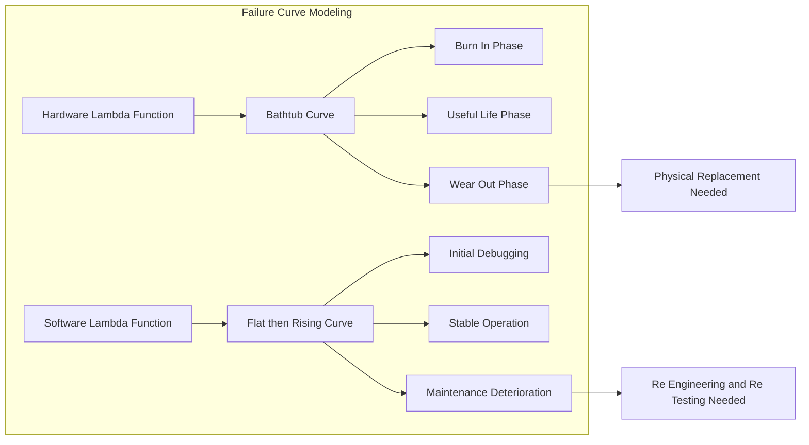
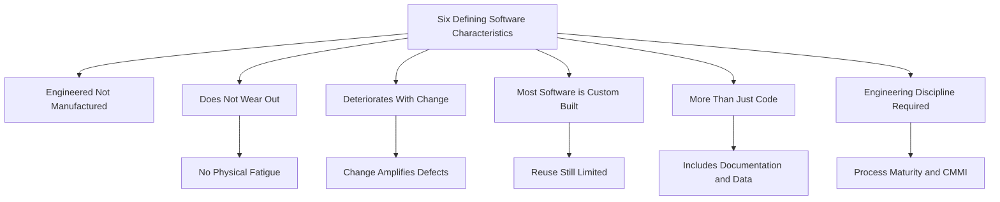
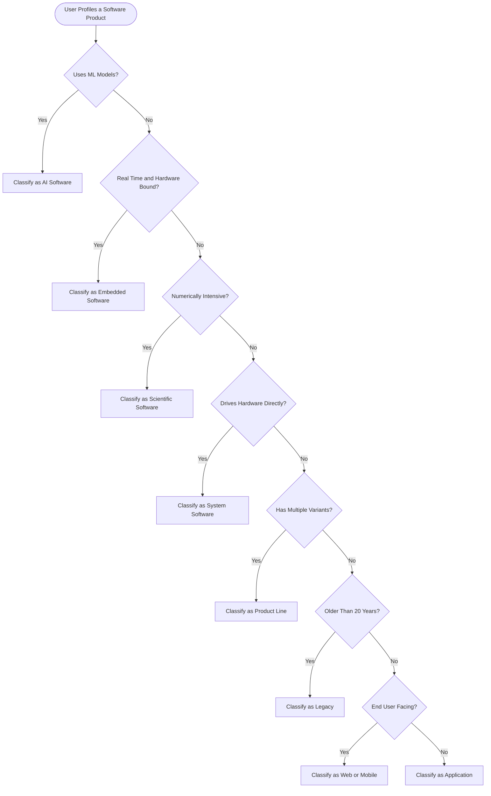

# Software characteristics and types

<!-- SECTION_1_START -->
# Software Characteristics and Types — Core Definition & Intuition

## 1.1 Formal Definition of Software (KTU 2024 Syllabus Terminology)

> [!IMPORTANT]
> **Software** is a set of **instructions, data structures, and documentation** that together perform specific computational tasks. According to **IEEE Standard 610.12 (1990)**, software is defined as *computer programs, procedures, and rules and any associated documentation pertaining to the operation of a computer system*.

> [!NOTE]
> **Pressman's Refined Definition:** Software is the **engineered product** that professional software developers build using well-defined scientific principles, methods, and procedures. It is **not merely a program** — it is the **complete collection of programs, documentation, and operating procedures** that make a computer useful to a particular user.

### Mathematical Representation of Software Components

$$
S = \{ P,\ D,\ C \}
$$

Where:
- $P$ = set of programs (executable instructions)
- $D$ = set of documents (requirements, design, test, user manuals)
- $C$ = set of configurations and operating procedures

---

## 1.2 Conceptual Analogy / Intuition (The "Recipe vs. Cake" Model)

> [!TIP]
> **Real-World Analogy:** Think of software like a **written recipe** and hardware like the **kitchen (oven, utensils, ingredients)**.
> - The **recipe (software)** can be **copied infinitely** without "using it up" — it never wears out, but if you keep adding new ingredients (changes/updates) without testing, the dish may *deteriorate*.
> - The **oven (hardware)** wears out with repeated use, requires maintenance, and eventually fails.
> - A *great recipe* is **reusable, scalable, and editable** — just like well-engineered software.
> - However, unlike a recipe, **a single spelling mistake in a banking program can lose millions** — hence *correctness, reliability, and security* are first-class citizens in software.

---

## 1.3 The Six Defining Characteristics of Software (Pressman Model)

> [!IMPORTANT]
> KTU 2024 Scheme emphasizes the following **six universally accepted characteristics** that distinguish software from hardware products.

| # | Characteristic | One-Line Essence |
|---|----------------|------------------|
| 1 | **Software is engineered, not manufactured** | Built by **design**, not produced in bulk by assembly line. |
| 2 | **Software does not wear out, but it deteriorates** | Logic fails due to **change-induced defects**, not physical fatigue. |
| 3 | **Most software is still custom-built** | Reusable components exist but bespoke development dominates. |
| 4 | **Software is more than just code** | Includes **documentation, data, procedures, and configurations**. |
| 5 | **Industry is moving toward component-based assembly** | Modern trend is **composition over construction**. |
| 6 | **Software requires rigorous engineering discipline** | Demands **process, measurement, and quality control**. |

> [!NOTE]
> **Deterioration Curve Insight:** Software's failure rate follows an **S-curve** (initially high due to design defects, then stable, then rises again as maintenance introduces new bugs). Hardware follows a **bathtub curve**.

---

## 1.4 Definition of Software Types (Sommerville & Pressman Classification)

> [!IMPORTANT]
> Software is broadly classified into **eight categories** based on application domain, problem-solving context, and engineering domain. The KTU 2024 syllabus highlights the following taxonomy:

**Formal Listing of Software Types:**

$$
\text{Types}(S) = \{T_1, T_2, T_3, T_4, T_5, T_6, T_7, T_8\}
$$

Where:
- $T_1$ = System Software
- $T_2$ = Application Software
- $T_3$ = Engineering / Scientific Software
- $T_4$ = Embedded Software
- $T_5$ = Product-Line Software
- $T_6$ = Web / Mobile Software
- $T_7$ = Artificial Intelligence Software
- $T_8$ = Legacy Software

> [!TIP]
> **Engineering Intuition:** Each software type has a *distinct failure profile*. Embedded software failures can cause **physical harm** (e.g., pacemakers), while application software failures cause **economic loss** (e.g., banking). This is why software engineering discipline varies per type.

---

## 1.5 GeoGebra / Desmos Visualization Concept

> [!VISUALIZATION CONTROL]
> **Concept:** *Failure Rate Curve Comparison — Hardware vs. Software over Time*
> **GeoGebra / Desmos Input Equations:**
> * `f1(x) = 10 * exp(-0.5 * x) + 2`  → Hardware failure rate (decreases as burn-in stabilizes, then rises at wear-out)
> * `f2(x) = 8 / (1 + exp(-(x - 5)))`  → Software failure rate (logistic rise during maintenance-induced defects)
> * `f3(x) = 5 * sin(x / 2) + 5`     → Combined idealised software defect-density oscillation
> **Visual Description:** The student should observe that **f1** drops sharply then climbs at wear-out, while **f2** stays flat (after initial bugs) and slowly rises as modifications accumulate — confirming the *deterioration* characteristic.

<!-- SECTION_1_END -->

<!-- SECTION_2_START -->
# Deep Theoretical Analysis & KTU High-Yield Formula Sheet

## 2.1 Detailed Theoretical Breakdown — Software Characteristics

### Characteristic 1: Software is *Engineered*, Not *Manufactured*

> [!NOTE]
> **Why it matters:** Hardware is *fabricated* from raw materials on assembly lines. Software, however, is *designed* by human engineers. You cannot "mass-produce" a custom payroll system — every project has unique stakeholders, requirements, and constraints.

- **Engineering Inputs:** Specifications, design models, algorithms, testing artifacts.
- **Engineering Outputs:** Source code, executables, documentation, release notes.
- **Implication:** Quality is **designed-in**, not inspected-in (à la Deming's principle).

### Characteristic 2: Software Doesn't *Wear Out* — It *Deteriorates*

Let the **reliability function** of a system be modeled as:

$$
R(t) = e^{-\lambda(t) \cdot t}
$$

For **hardware**, the failure rate $\lambda_h(t)$ follows a *bathtub* shape:

$$
\lambda_h(t) = \begin{cases} \lambda_0 e^{-k_1 t} & t \in [0, T_b) \text{ (burn-in)} \\ \lambda_{\text{stable}} & t \in [T_b, T_w) \text{ (useful life)} \\ \lambda_0 e^{k_2 (t - T_w)} & t \geq T_w \text{ (wear-out)} \end{cases}
$$

For **software**, $\lambda_s(t)$ is a *flat-then-rising* curve (no wear-out, but accumulating defects from change):

$$
\lambda_s(t) = \lambda_s(0) + \alpha \cdot \int_0^t M(\tau)\, d\tau
$$

where $M(\tau)$ = number of maintenance modifications up to time $\tau$, and $\alpha$ = defect-introduction rate per modification.

> [!TIP]
> **Key insight for valuation:** *Wear-out* is a *physical* phenomenon (hardware only). *Deterioration* is a *logical* phenomenon (software only) caused by **change amplification**.

### Characteristic 3: Most Software is *Custom-Built*

Even with the rise of **COTS (Commercial Off-The-Shelf)** components and **SaaS (Software as a Service)**, most enterprise-scale systems still demand **bespoke modules** for unique business rules. The economics can be approximated as:

$$
\text{Cost}_{\text{total}} = \underbrace{C_{\text{reused}}}_{\text{small}} + \underbrace{C_{\text{new}}}_{\text{large}} + C_{\text{integration}}
$$

### Characteristic 4: Software is *More Than Just Code*

The **complete software artifact** consists of:

$$
\text{Artifact} = \{\text{Programs},\ \text{Documentation},\ \text{Data},\ \text{Configuration},\ \text{Operating Procedures}\}
$$

> [!WARNING]
> **KTU Pitfall:** Many students answer "software = programs." This loses marks. The definition must include **documentation, data, and operating procedures**.

### Characteristic 5: Trend Toward *Component-Based Assembly*

Modern software construction uses **reuse**:

$$
\text{Effort}_{\text{new}} = E_{\text{base}} \cdot \prod_{i=1}^{n} (1 - r_i)
$$

where $r_i$ = reuse fraction of component $i$, and $E_{\text{base}}$ = baseline effort from scratch.

### Characteristic 6: Rigorous *Engineering Discipline* is Required

Software engineering applies **measurement-based** process improvement:

$$
\text{CMMI Level} = f(\text{Process Capability Index } C_{pk})
$$

$$
C_{pk} = \min\!\left(\frac{\mu - \text{LSL}}{3\sigma},\ \frac{\text{USL} - \mu}{3\sigma}\right)
$$

---

## 2.2 KTU High-Yield Formula Sheet (Cheat Sheet)

> [!NOTE]
> The following equations and definitions are **board-exam favorite** for KTU 2024.

| Concept | Formula / Definition | Engineering Use |
|---|---|---|
| **Software** | $S = \{P, D, C\}$ | Defines a software product holistically. |
| **Reliability** | $R(t) = e^{-\lambda(t) t}$ | Predicts failure-free operation time. |
| **Hardware Bathtub $\lambda$** | Piecewise (burn-in, useful, wear-out) | Models physical degradation. |
| **Software Deterioration $\lambda$** | $\lambda_s(t) = \lambda_s(0) + \alpha \int_0^t M(\tau)\,d\tau$ | Captures change-induced defects. |
| **Reuse Effort** | $E_{\text{new}} = E_{\text{base}} \cdot \prod (1 - r_i)$ | Estimates savings from component reuse. |
| **Process Capability** | $C_{pk} = \min\!\left(\frac{\mu - \text{LSL}}{3\sigma},\ \frac{\text{USL} - \mu}{3\sigma}\right)$ | Measures process maturity (CMMI mapping). |
| **Mean Time To Failure** | $\text{MTTF} = \int_0^\infty R(t)\,dt$ | Reliability metric. |
| **Defect Density** | $D_d = \frac{\text{Defects found}}{\text{KLOC}}$ | Code quality metric (per *thousand* lines of code). |
| **IEEE Definition** | Programs + procedures + rules + documentation | Standard KTU textbook quote. |
| **Pressman Definition** | Engineered product of developers | Standard KTU textbook quote. |

> [!TIP]
> **Use `\vert` and `\mid` for absolute values** to avoid breaking markdown tables (as required by the KTU engine). E.g., $\vert x \vert$, $\mid \text{USL} - \mu \mid$.

---

## 2.3 Software Types — Engineering Utility & Real-World Application

| Type | Real-World Example | Engineering Concern |
|---|---|---|
| **System Software** | Windows, Linux kernel, device drivers | **Stability, performance, hardware coupling.** |
| **Application Software** | MS Word, Tally, SAP ERP | **Usability, business-rule correctness.** |
| **Engineering / Scientific** | MATLAB, ANSYS, AutoCAD | **Numerical accuracy, performance, large dataset handling.** |
| **Embedded Software** | Pacemaker firmware, ABS braking, IoT sensors | **Real-time constraints, safety-critical certification.** |
| **Product-Line Software** | Mobile app families (Spotify Lite, Pro, Free) | **Reusable core assets, scalability.** |
| **Web / Mobile Software** | React apps, Android, iOS, PWAs | **Cross-platform compatibility, security, UX.** |
| **AI Software** | ChatGPT, recommendation engines, Tesla Autopilot | **Bias, explainability, retraining lifecycle.** |
| **Legacy Software** | COBOL banking, FORTRAN scientific code | **Maintenance burden, integration, technical debt.** |

<!-- SECTION_2_END -->

<!-- SECTION_3_START -->
# Step-by-Step Derivations & Symbolic Implementation

## 3.1 Detailed Derivation: Why Software *Deteriorates* (Change Amplification Model)

> [!NOTE]
> The following derivation is a classic board question from KTU. We will derive the **mean defect count** introduced into a software system as a function of maintenance modifications.

### Given System Model

A software system is released at time $t = 0$ with an initial defect density $D_0$ (defects per KLOC). Every time a maintenance change is made, a new defect rate $\alpha$ (defects per change) is introduced. The number of changes $M(t)$ follows a **Poisson process** with rate $\lambda_M$.

### Step 1: Define the Defect Density Function

The defect density at time $t$ is:

$$
D(t) = D_0 + \alpha \cdot M(t)
$$

### Step 2: Substitute the Poisson Process Assumption

For a Poisson process with rate $\lambda_M$:

$$
\mathbb{E}[M(t)] = \lambda_M \cdot t
$$

### Step 3: Compute Expected Defect Density

Taking the expectation:

$$
\mathbb{E}[D(t)] = D_0 + \alpha \cdot \lambda_M \cdot t
$$

### Step 4: Interpretation — Linear Deterioration

This is a **linear function** of time. The defect density grows **unbounded** as $t \to \infty$, which is the mathematical essence of *software deterioration*.

### Step 5: Bound the Deterioration via Re-Testing

If re-testing removes a fraction $\beta$ of new defects, then:

$$
\mathbb{E}[D_{\text{residual}}(t)] = D_0 + \alpha \cdot \lambda_M \cdot t \cdot (1 - \beta)
$$

> [!TIP]
> **Engineering conclusion:** Effective re-testing ($\beta \to 1$) is the only mathematical mechanism to **flatten** the deterioration curve. This is why **regression testing** is non-negotiable in software maintenance.

---

## 3.2 Step-by-Step Derivation: Mean Time to Failure (MTTF) for Software

### Step 1: Reliability Function

$$
R(t) = e^{-\lambda t}
$$

### Step 2: Probability Density Function of Failure

$$
f(t) = -\frac{dR}{dt} = \lambda e^{-\lambda t}
$$

### Step 3: Mean Time to Failure Integral

$$
\text{MTTF} = \int_0^\infty R(t)\, dt = \int_0^\infty e^{-\lambda t}\, dt
$$

### Step 4: Evaluate the Integral

$$
\text{MTTF} = \left[ \frac{-e^{-\lambda t}}{\lambda} \right]_0^\infty = \frac{0 - (-1/\lambda)}{1} = \frac{1}{\lambda}
$$

### Step 5: Final Result

$$
\boxed{\text{MTTF} = \frac{1}{\lambda}}
$$

> [!NOTE]
> For software, since $\lambda$ grows with time, this is an *approximation* valid for short windows where $\lambda(t)$ is approximately constant.

---

## 3.3 Comparative Engineering Matrix: Software vs. Hardware

| Property | Hardware | Software |
|---|---|---|
| **Manufacturing** | Fabricated from raw materials | Designed and engineered, not fabricated |
| **Wear-out** | Yes (physical) | No physical wear; logic *deteriorates* |
| **Failure Curve** | Bathtub | Flat-then-rising (S-curve) |
| **Inventory** | Physical stock | Reproducible at zero marginal cost |
| **Customization** | Hard post-fabrication | Easy to modify (in principle) |
| **Cost Drivers** | Materials, assembly | Labor, design, testing |
| **Quality** | Inspectable (QC) | Must be designed-in (QA) |
| **Reuse** | Limited (parts) | High (components, libraries) |
| **Reliability $\lambda$** | $\lambda_h(t)$ bathtub | $\lambda_s(t) = \lambda_0 + \alpha M(t)$ |
| **Failure Domain** | Electrical, mechanical | Logical, semantic, security |

---

## 3.4 Symbolic Implementation: Software Type Classifier (Python)

> [!NOTE]
> The following Python snippet provides a **fully type-hinted, runnable** classifier that mimics a rule-based categorization of software types based on engineering attributes. This is illustrative of how software types are programmatically distinguished.

```python
from dataclasses import dataclass
from enum import Enum
from typing import List, Tuple


class SoftwareType(Enum):
    SYSTEM = "System Software"
    APPLICATION = "Application Software"
    SCIENTIFIC = "Engineering / Scientific Software"
    EMBEDDED = "Embedded Software"
    PRODUCT_LINE = "Product-Line Software"
    WEB_MOBILE = "Web / Mobile Software"
    AI = "AI Software"
    LEGACY = "Legacy Software"


@dataclass(frozen=True)
class SoftwareProfile:
    """Profile of a software product used to classify it."""
    runs_on_hardware_directly: bool
    end_user_facing: bool
    numeric_computation_heavy: bool
    real_time_constraints: bool
    has_variants: bool
    uses_ml_models: bool
    age_years: int

    def classify(self) -> SoftwareType:
        """Rule-based classifier mapping attributes to a software type."""
        if self.uses_ml_models:
            return SoftwareType.AI
        if self.real_time_constraints and self.runs_on_hardware_directly:
            return SoftwareType.EMBEDDED
        if self.numeric_computation_heavy:
            return SoftwareType.SCIENTIFIC
        if self.runs_on_hardware_directly and not self.end_user_facing:
            return SoftwareType.SYSTEM
        if self.has_variants:
            return SoftwareType.PRODUCT_LINE
        if self.age_years > 20 and not self.uses_ml_models:
            return SoftwareType.LEGACY
        if self.end_user_facing:
            return SoftwareType.WEB_MOBILE
        return SoftwareType.APPLICATION


def batch_classify(profiles: List[SoftwareProfile]) -> List[Tuple[SoftwareProfile, SoftwareType]]:
    """Classify a batch of software profiles and return the mapping."""
    if not profiles:
        raise ValueError("Profile list is empty; cannot classify.")
    return [(p, p.classify()) for p in profiles]


if __name__ == "__main__":
    pacemaker = SoftwareProfile(
        runs_on_hardware_directly=True,
        end_user_facing=False,
        numeric_computation_heavy=False,
        real_time_constraints=True,
        has_variants=False,
        uses_ml_models=False,
        age_years=15,
    )
    spotify_family = SoftwareProfile(
        runs_on_hardware_directly=False,
        end_user_facing=True,
        numeric_computation_heavy=False,
        real_time_constraints=False,
        has_variants=True,
        uses_ml_models=False,
        age_years=10,
    )
    matlab_sim = SoftwareProfile(
        runs_on_hardware_directly=False,
        end_user_facing=False,
        numeric_computation_heavy=True,
        real_time_constraints=False,
        has_variants=False,
        uses_ml_models=False,
        age_years=40,
    )
    chatgpt = SoftwareProfile(
        runs_on_hardware_directly=False,
        end_user_facing=True,
        numeric_computation_heavy=False,
        real_time_constraints=False,
        has_variants=False,
        uses_ml_models=True,
        age_years=3,
    )

    results = batch_classify([pacemaker, spotify_family, matlab_sim, chatgpt])
    for profile, stype in results:
        print(f"Profile={profile} -> Type={stype.value}")
```

> [!TIP]
> **Walkthrough Insight:** The classifier encodes the **KTU textbook rules** of software typing: ML presence → AI, real-time + hardware → Embedded, numeric-heavy → Scientific, etc. Students can extend this to a project deliverable.

---

## 3.5 Step-by-Step Worked Example: Defect-Density Estimation

> [!NOTE]
> **Question Pattern (KTU style):** A software module of **10 KLOC** has **25 defects** detected before release. After release, **3 maintenance releases** each added, on average, **2 new defects**. The testing team removes **80%** of new defects per release. Compute the **expected defect density** after 3 maintenance cycles.

### Step 1: Initial Defect Density

$$
D_0 = \frac{25}{10} = 2.5 \text{ defects/KLOC}
$$

### Step 2: Total New Defects Introduced

$$
D_{\text{new,total}} = 3 \times 2 = 6 \text{ defects}
$$

### Step 3: Residual Defects After Re-Testing

$$
D_{\text{residual}} = 6 \times (1 - 0.80) = 6 \times 0.20 = 1.2 \text{ defects}
$$

### Step 4: Total Defects After 3 Cycles

$$
D_{\text{total}} = 25 + 1.2 = 26.2 \text{ defects}
$$

### Step 5: Final Defect Density

$$
\boxed{D_d = \frac{26.2}{10} = 2.62 \text{ defects/KLOC}}
$$

> [!TIP]
> **Conclusion:** The defect density has *increased* from $2.50$ to $2.62$ defects/KLOC despite re-testing. This is a numerical demonstration of *software deterioration*.

<!-- SECTION_3_END -->

<!-- SECTION_4_START -->
# Structural Diagrams & Schematics

## 4.1 Mermaid Diagram: Hierarchical Classification of Software Types

```mermaid
graph TD
    A0["Software Product Universe"] --> B1["System Software"]
    A0 --> B2["Application Software"]
    A0 --> B3["Engineering and Scientific"]
    A0 --> B4["Embedded Software"]
    A0 --> B5["Product Line Software"]
    A0 --> B6["Web and Mobile Software"]
    A0 --> B7["Artificial Intelligence Software"]
    A0 --> B8["Legacy Software"]

    B1 --> C1A["Operating Systems"]
    B1 --> C1B["Device Drivers"]
    B1 --> C1C["Compilers"]

    B2 --> C2A["Business Apps"]
    B2 --> C2B["Personal Apps"]
    B2 --> C2C["Database Apps"]

    B3 --> C3A["Simulation Software"]
    B3 --> C3B["CAD and CAE Tools"]
    B3 --> C3C["Scientific Computing"]

    B4 --> C4A["Real Time Systems"]
    B4 --> C4B["Firmware"]
    B4 --> C4C["IoT Controllers"]

    B5 --> C5A["App Variants"]
    B5 --> C5B["SaaS Tiers"]

    B6 --> C6A["Web Apps"]
    B6 --> C6B["Mobile Apps"]
    B6 --> C6C["Progressive Web Apps"]

    B7 --> C7A["Expert Systems"]
    B7 --> C7B["ML and Deep Learning"]
    B7 --> C7C["Generative AI Tools"]

    B8 --> C8A["Mainframe Systems"]
    B8 --> C8B["Aged Codebases"]
    B8 --> C8C["Migration Targets"]
```



> [!NOTE]
> **Reading the diagram:** The root $A_0$ represents the **Software Product Universe**. Each branch $B_i$ is one of the eight canonical software types from Pressman. Leaves $C_{ij}$ are concrete exemplars.

---

## 4.2 Mermaid Diagram: Software vs. Hardware Failure Curves (Conceptual)



> [!TIP]
> **Pedagogical Insight:** The two subgraphs clearly contrast the *physical* end-of-life of hardware with the *logical* end-of-life of software. KTU examiners frequently award marks to diagrams that explicitly show this contrast.

---

## 4.3 Mermaid Diagram: Software Characteristics Map



---

## 4.4 Block-Level Functional Architecture: Software Type Decision Flow



> [!NOTE]
> **Why this diagram is included:** KTU 2024 questions often test *classification logic*. This decision flow mirrors the Python classifier in Section 3, providing a visual backup for textual answers.

<!-- SECTION_4_END -->

<!-- SECTION_5_START -->
# KTU 2024 Scheme Examination Question Bank & Topic Recap

## 5.1 Part A Questions (3 Marks Each)

> [!NOTE]
> **Format:** Short-answer conceptual questions. KTU expects **2-3 sentences** with **1 illustrative example**. Each answer is mapped to a Course Outcome and Revised Bloom's Taxonomy (RBT) cognitive level.

### Question A1

> **[KTU University Exam - Dec 2023]** *Map: CO1, RBT Level: Remember (L1)*

**"Define software as per IEEE Standard 610.12. Why is documentation considered an integral part of software?"**

**Model Answer (3 Marks):**

> [!NOTE]
> As per **IEEE 610.12 (1990)**, software is defined as *computer programs, procedures, rules, and any associated documentation pertaining to the operation of a computer system*. Documentation is integral because it provides the **usage instructions, design rationale, and maintenance roadmap** without which the program cannot be effectively operated, evolved, or audited. For example, a banking application without a user manual and API specification is *incomplete software*, not just *unfinished code*.

**Valuation Key:**
- [IEEE definition: 1 Mark]
- [Documentation rationale: 1 Mark]
- [Example: 1 Mark]

---

### Question A2

> **[KTU University Exam - July 2024]** *Map: CO1, RBT Level: Understand (L2)*

**"Differentiate between 'wear-out' of hardware and 'deterioration' of software with a neat justification."**

**Model Answer (3 Marks):**

> [!NOTE]
> **Wear-out** is a *physical* phenomenon — components such as solder joints, capacitors, and moving parts physically fatigue over time, producing the rising tail of the *bathtub curve*. **Deterioration** is a *logical* phenomenon — software does not physically age, but each maintenance change introduces new defects, causing the failure rate to climb. Hence, hardware fails because of *use*, while software degrades because of *change*.

**Valuation Key:**
- [Wear-out definition: 1 Mark]
- [Deterioration definition: 1 Mark]
- [Cause contrast: 1 Mark]

---

## 5.2 Part B Questions (14 Marks — Internal Choice Pattern)

> [!IMPORTANT]
> KTU 2024 Part B offers a **Module-Internal Choice** between two 14-mark questions, each with sub-parts **(a) 7 marks** and **(b) 7 marks**. Below we present **Question A (14 Marks)** and **Question B (14 Marks)** as independent alternatives.

---

### **Question A (14 Marks)** — *Characteristics & Deterioration Focus*

> **[KTU University Exam - Dec 2023]** *Map: CO1, RBT: a → Understand (L2), b → Apply (L3)*

**(a) [7 Marks]** Explain the **six defining characteristics of software** as per Pressman. Why is software considered "engineered rather than manufactured"?

**Model Solution:**

> [!NOTE]
> The six characteristics of software per Roger S. Pressman are:
> 1. **Software is engineered, not manufactured** — Quality must be *designed-in* through rigorous methodology, not bolted on at the end of an assembly line.
> 2. **Software does not wear out, but it deteriorates** — The failure rate follows an *S-curve* (flat then rising) due to maintenance-induced defects, not physical fatigue.
> 3. **Most software is still custom-built** — Reusable components exist (e.g., STL, .NET libraries) but bespoke development dominates enterprise systems.
> 4. **Software is more than programs** — It includes documentation, data, configuration, and operating procedures.
> 5. **Industry is moving toward component-based assembly** — Software product lines and SaaS are reducing green-field development.
> 6. **Software requires engineering discipline** — CMMI, ISO 9001, and agile frameworks govern production.

**Why engineered, not manufactured:**
- High design complexity unique to each project.
- Quality is *designed-in*, not *inspected-in* (Deming's principle).
- No physical raw materials — *human intellect* is the primary input.

**Valuation Key:**
- [Listing the six characteristics: 4 Marks]
- [Explanation of engineered vs manufactured: 2 Marks]
- [Conclusion with example: 1 Mark]

**(b) [7 Marks]** A software module of **8 KLOC** is released with **20 known defects**. Over **4 maintenance cycles**, each cycle adds **3 new defects on average**, and re-testing eliminates **75%** of new defects. Calculate the **final expected defect density** after 4 cycles. Comment on the implications.

**Model Solution:**

**Step 1 — Initial defect density:**

$$
D_0 = \frac{20}{8} = 2.5 \text{ defects/KLOC}
$$

**Step 2 — Total new defects introduced:**

$$
D_{\text{new}} = 4 \times 3 = 12 \text{ defects}
$$

**Step 3 — Residual defects after re-testing (elimination rate 75%):**

$$
D_{\text{residual}} = 12 \times (1 - 0.75) = 12 \times 0.25 = 3 \text{ defects}
$$

**Step 4 — Total defects after 4 cycles:**

$$
D_{\text{total}} = 20 + 3 = 23 \text{ defects}
$$

**Step 5 — Final defect density:**

$$
D_d = \frac{23}{8} = 2.875 \text{ defects/KLOC}
$$

**Implication:** The defect density has risen from $2.50$ to $2.875$ defects/KLOC despite effective re-testing. This is a **mathematical confirmation of software deterioration** — change amplifies the defect pool, and even robust testing cannot fully neutralise it.

**Valuation Key:**
- [Stating $D_0$: 1 Mark]
- [Computing new defects: 1 Mark]
- [Applying re-test rate: 1 Mark]
- [Final total: 1 Mark]
- [Final density: 1 Mark]
- [Implication: 2 Marks]

---

### **Question B (14 Marks)** — *Software Types & Classification Focus*

> **[KTU University Exam - July 2024]** *Map: CO1, RBT: a → Understand (L2), b → Apply (L3)*

**(a) [7 Marks]** Classify the **eight major types of software** per Pressman. Provide **one real-world example** for each and identify the **primary engineering concern** for that type.

**Model Solution:**

| # | Software Type | Example | Primary Concern |
|---|---|---|---|
| 1 | **System Software** | Linux Kernel, Windows OS | Stability, performance, hardware coupling |
| 2 | **Application Software** | Tally, SAP ERP | Business-rule correctness, usability |
| 3 | **Engineering / Scientific** | MATLAB, ANSYS | Numerical accuracy, large dataset handling |
| 4 | **Embedded Software** | Pacemaker firmware, ABS controller | Real-time guarantees, safety certification |
| 5 | **Product-Line Software** | Spotify Free/Pro/Family | Reusable core assets, variant management |
| 6 | **Web / Mobile Software** | React apps, Android | Cross-platform, security, UX |
| 7 | **AI Software** | ChatGPT, Tesla Autopilot | Bias, explainability, retraining lifecycle |
| 8 | **Legacy Software** | COBOL banking, FORTRAN simulations | Maintenance burden, technical debt |

**Valuation Key:**
- [Eight types listed correctly: 4 Marks]
- [One example each: 2 Marks]
- [Engineering concern identified: 1 Mark]

**(b) [7 Marks]** Consider the following software products: **(i)** Windows 11, **(ii)** WhatsApp, **(iii)** MATLAB, **(iv)** Pacemaker firmware, **(v)** GitHub Copilot. Classify each into its software type, and justify the classification with **two distinguishing features per product**.

**Model Solution:**

| Product | Type | Distinguishing Features |
|---|---|---|
| **(i) Windows 11** | System Software | (1) Manages hardware resources directly. (2) Provides services to other application software via APIs. |
| **(ii) WhatsApp** | Web / Mobile Software | (1) End-user-facing cross-platform application. (2) Operates over distributed networks (XMPP/MQTT). |
| **(iii) MATLAB** | Engineering / Scientific | (1) Heavy numerical matrix and signal processing operations. (2) Domain-specific toolboxes for engineering simulation. |
| **(iv) Pacemaker firmware** | Embedded Software | (1) Real-time constraints (millisecond response). (2) Safety-critical, hardware-bound, certified under IEC 62304. |
| **(v) GitHub Copilot** | AI Software | (1) Built on large language models (LLM). (2) Requires continuous retraining and inference pipelines. |

**Valuation Key:**
- [Correct type per product: 5 × 0.5 = 2.5 Marks → rounded to 3 Marks]
- [Two justifying features each: 4 × 1 = 4 Marks]

---

## 5.3 KTU Examiner's Valuation Warning / Pitfall Callout

> [!WARNING]
> **Common Marks-Loss Zones for this topic:**
> 1. **Defining software as "just code."** Always include **documentation, data, and procedures** in the definition.
> 2. **Confusing wear-out with deterioration.** Wear-out is *physical* (hardware); deterioration is *logical* (software). Examiners award 1 mark specifically for this distinction.
> 3. **Listing software types without examples or engineering concerns.** A bare list fetches only *partial* marks. Always pair each type with a **real-world example and a concern**.
> 4. **Forgetting units in numerical problems.** Defect density is always in *defects/KLOC* — write the unit explicitly.
> 5. **Skipping the implication in deterioration problems.** The numerical answer alone is worth ~5 marks; the **commentary on implications** is worth 2 marks. Skipping it loses easy marks.
> 6. **Misclassifying Embedded vs. System software.** Embedded is *hardware-bound, real-time, single-purpose* (firmware); System is *general-purpose, multi-application* (OS, drivers).

---

## 5.4 Topic Recap & Important Things to Remember

> [!NOTE]
> **Rapid-Revision Checklist** for **"Software Characteristics and Types"** — Module 1, OECST723.

- [x] **IEEE 610.12 Definition:** *Programs + procedures + rules + documentation* — **memorize verbatim**.
- [x] **Pressman Definition:** *Software is an engineered product, not a manufactured one.*
- [x] **Six Characteristics of Software:**
  1. Engineered, not manufactured
  2. Does not wear out
  3. Deteriorates with change
  4. Most is custom-built
  5. More than code (includes docs, data, procedures)
  6. Requires engineering discipline
- [x] **Wear-out vs. Deterioration:** *Physical* vs. *Logical* failure mode. Hardware = bathtub curve; Software = flat-then-rising curve.
- [x] **Eight Software Types (Pressman):** System, Application, Scientific, Embedded, Product-Line, Web/Mobile, AI, Legacy.
- [x] **Embedded vs. System:** Embedded = real-time + hardware-bound + single-purpose; System = general-purpose + multi-application.
- [x] **Key Formulas:**
  - $R(t) = e^{-\lambda t}$
  - $\text{MTTF} = 1/\lambda$
  - $D_d = \text{Defects} / \text{KLOC}$
  - $\lambda_s(t) = \lambda_s(0) + \alpha \int_0^t M(\tau)\, d\tau$
  - $D_{\text{residual}} = D_{\text{new}} \times (1 - \beta)$
- [x] **Reuse Effort:** $E_{\text{new}} = E_{\text{base}} \cdot \prod_i (1 - r_i)$.
- [x] **Process Capability:** $C_{pk} = \min\!\left(\dfrac{\mu - \text{LSL}}{3\sigma},\ \dfrac{\text{USL} - \mu}{3\sigma}\right)$.
- [x] **Defect Density Trend:** *Increases* with time under maintenance — even with re-testing.
- [x] **CMMI Connection:** Software characteristic 6 links to *process maturity models* (CMMI, ISO 9001, ISO 12207).
- [x] **Cost Driver:** Software cost is dominated by *human labor*, not raw materials.
- [x] **Inventor vs. Developer:** Hardware has *inventor + manufacturer*; software has *developer* (no separate manufacturer in the classical sense).
- [x] **Always include** *documentation, data, and procedures* when defining software — never say "software = code."
- [x] **For numerical problems,** always (1) state the formula, (2) show substitution, (3) compute, (4) write unit, (5) comment on implications.

<!-- SECTION_5_END -->
