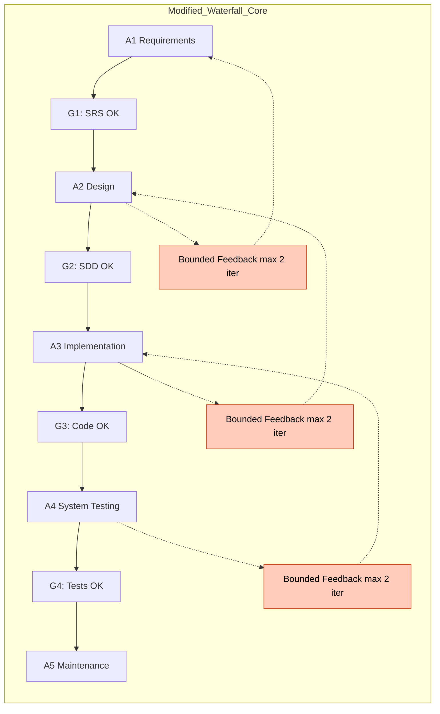
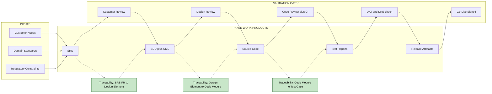
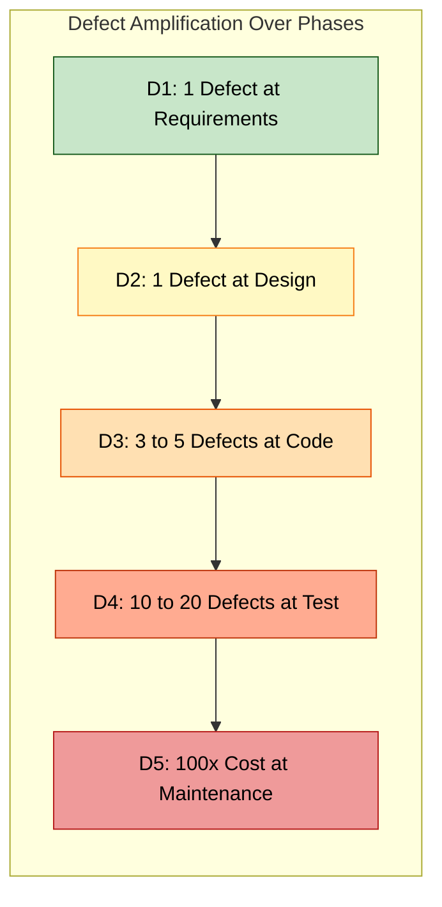

# Software Process models – Waterfall

<!-- SECTION_1_START -->

# 1. Core Technical Definition & Intuitive Overview

## 1.1 Formal KTU 2024 Definition

> [!IMPORTANT]
> **Software Process Model (Definition as per KTU Syllabus):** A *software process model* is an abstract representation of a software engineering process, which defines the **order of activities** performed by the software team, the **transition criteria** between activities, and the **work products produced** at each stage.

The **Waterfall Model** is the earliest, most classical **linear-sequential life cycle model** of software engineering, formally articulated by **Dr. Winston W. Royce in his landmark 1970 paper**, *"Managing the Development of Large Software Systems"* (IEEE WESCON Proceedings). It is a **plan-driven**, **document-centric**, **phase-based** model in which each fundamental activity (Requirement → Design → Implementation → Verification → Maintenance) is performed **exactly once**, in strict top-to-bottom order, and each stage must be **formally completed and "signed off"** before the next stage may commence.

Mathematically, a software process model can be expressed as a finite ordered sequence of activities:

$$P = \langle A_1, A_2, A_3, \dots, A_n \rangle$$

where $P$ is the process and each $A_i$ is an activity. For the pure Waterfall Model, $n = 5$ (or 6, depending on the variant), and the execution flow is strictly:

$$A_1 \rightarrow A_2 \rightarrow A_3 \rightarrow A_4 \rightarrow A_5 \quad \text{(no back-edges allowed)}$$

The transition predicate $T_i$ governing the move from $A_i$ to $A_{i+1}$ requires that:

1. All work products $W_i$ of activity $A_i$ are **complete and approved**.
2. All defects logged in $A_i$ are **closed** (verification of *DoD* — Definition of Done).
3. A **formal review meeting / sign-off** is recorded.

> [!NOTE]
> **Historical Note (KTU Favorite):** Royce himself acknowledged in the same 1970 paper that the *pure* linear model is **"risky and invites failure"** for large, complex systems — and recommended an **iterative feedback loop** between stages. Ironically, the model he warned *against* is the one that bears his name in textbooks worldwide. Examiners love this fact — expect it in Module-1 questions.

## 1.2 Conceptual Analogy & Intuition

> [!TIP]
> **Analogy: Building a Multi-Storey Building.**
> Imagine constructing a 20-floor apartment tower. The architect first draws the full blueprint, the structural engineer designs the pillars, the masons lay brick from floor 1 to floor 20 in sequence, the electricians wire, and finally tenants move in.
>
> - You **cannot** start the 5th floor before completing the 4th.
> - The plumbing cannot be re-routed once the concrete of the 3rd floor is cured.
> - If the architect forgot to design a staircase in the **blueprint stage**, you only discover this catastrophe when the 5th floor is being built.
>
> This is precisely how the **Waterfall Model** treats software — every layer (phase) is built on top of the previous, frozen layer. Once poured, you don't go back.

The **one-way arrow** in a Waterfall diagram captures this irreversibility: requirements are *frozen* after the first phase, design is *frozen* after the second, and changes become exponentially expensive later.

| Property | Building Construction | Waterfall Software Process |
| :--- | :--- | :--- |
| Phase ordering | Floor 1 → Floor 2 → … | Req → Design → Code → Test → Maintain |
| Reversibility | Practically zero | Practically zero |
| Late defect cost | Catastrophic | **200× to 1000× cost multiplier** |
| Documentation | Architectural drawings | SRS, SDD, STD, Test Reports |

## 1.3 Standard Constants & Metrics in Waterfall

> [!IMPORTANT]
> **The COCOMO Cost Multiplier (KTU High-Yield):** Although covered fully in Module 2, the **Boehm (1981)** cost growth statistic is *the* number to remember for the Waterfall context: a defect injected in the **Requirements** phase and discovered in **Maintenance** can cost **$\approx 100\times$** the cost of fixing it during Requirements itself. This is the **single most important justification** for Waterfall's emphasis on *front-loaded* quality.
>
> **The Five Standard Quality Phases (Pressman):** Requirements → Design → Coding → Testing → Maintenance.
>
> **Rule of 1/3rd (McConnell):** Roughly **$\frac{1}{3}$rd** of total project effort is spent on **design** activities in classical Waterfall projects.

> [!VISUALIZATION CONTROL]
> **Concept:** Cost-of-Defect-Repair Curve (Boehm's Curve)
> **GeoGebra / Desmos Input Equations:**
> * `f(x) = exp(0.7 * x)` where `x` is the phase number from 1 (Requirements) to 5 (Maintenance)
> **Visual Description:** A steeply rising exponential curve along the positive x-axis. The y-axis represents the relative cost of fixing a single defect. The student should observe that the cost at $x=1$ (Requirements) is the lowest (baseline, say 1 unit), and at $x=5$ (Maintenance) it is roughly **$\approx 100$ units** — an exponential blow-up. This visually proves *why* Waterfall demands near-perfect front-end phases.

<!-- SECTION_1_END -->

<!-- SECTION_2_START -->

# 2. Deep Theoretical Analysis & KTU High-Yield Formula Sheet

## 2.1 Structural Breakdown of the Waterfall Model

The model decomposes a software project into **five (or six) distinct, sequential, non-overlapping phases**. Each phase has **well-defined inputs, processing steps, outputs (work products), and verification/validation criteria**.

### Phase 1 — Requirements Analysis & Specification (Feasibility + SRS)

- **Goal:** Determine *what* the system must do (and what it must *not* do).
- **Inputs:** Customer requirements, domain knowledge, business case, regulatory constraints.
- **Activities:** Elicitation (interviews, questionnaires, observation), Analysis, Negotiation, Specification, Validation.
- **Primary Work Product:** **Software Requirements Specification (SRS)** document — typically following the **IEEE 830-1998** (or IEEE 29148:2018) standard. KTU expects the **4 key properties** of a good SRS: *Correct, Unambiguous, Complete, Verifiable*.
- **Stakeholders:** Business Analyst, Customer, System Architect (advisory).

### Phase 2 — System & Software Design

- **Goal:** Determine *how* the system will satisfy the SRS — architecture, modules, data structures, interfaces.
- **Two sub-stages:**
  1. **Architectural (High-Level) Design:** Decompose the system into modules, define inter-module interfaces, choose architectural style (e.g., layered, MVC, client-server).
  2. **Detailed (Low-Level) Design:** Specify algorithms, data structures, database schemas, class diagrams, sequence diagrams, state-transition diagrams.
- **Primary Work Products:** **SDD (Software Design Description)** — follows **IEEE 1016-2009**; UML diagrams (Use-Case, Class, Sequence, Activity, Deployment, Component, State, ER).
- **Stakeholders:** Software Architect, Senior Developers, Database Designer.

### Phase 3 — Implementation & Unit Testing (Coding)

- **Goal:** Translate the design into executable source code; verify each unit in isolation.
- **Activities:** Coding (in the chosen language, e.g., Java/Python/C++), peer code review, static analysis, unit testing using frameworks like **JUnit / pytest / NUnit**.
- **Primary Work Products:** **Source code**, **Unit Test Reports**, **Code Review Logs**.
- **Best Practices in KTU Context:** Adherence to **coding standards** (e.g., MISRA-C for safety-critical), **version control** (Git), **defect logging** before commit.

### Phase 4 — Integration & System Testing (Verification & Validation)

- **Goal:** Assemble modules, verify that the integrated system meets **functional** (V&V — Verification) and **user needs** (Validation).
- **Sub-stages:**
  1. **Integration Testing** — Top-Down, Bottom-Up, or Sandwich strategies.
  2. **System Testing** — Functional, Performance, Load, Stress, Security, Usability, Compatibility, Recovery, Installation.
  3. **Acceptance Testing (UAT)** — Alpha (in-house) and Beta (in-field) testing.
- **Primary Work Products:** **Test Plan, Test Cases, Test Scripts, Test Reports, Defect Logs, User Acceptance Sign-off**.

### Phase 5 — Deployment & Maintenance

- **Goal:** Deliver to the production environment and provide ongoing support.
- **Sub-stages:** Installation, Training, **Four types of Maintenance**:
  1. **Corrective** — Fixing residual defects.
  2. **Adaptive** — Adapting to new environment (OS upgrade, hardware change).
  3. **Perfective** — New features, performance tuning.
  4. **Preventive** — Refactoring to prevent future defects.
- **Primary Work Products:** **Release Notes, Installation Manual, Maintenance Logs, Patch Reports**.

> [!NOTE]
> **The Six-Phase Variant:** Some authors (and some KTU question papers) split *Requirements* into *Feasibility Study* and *Requirements Specification*, yielding 6 phases. Always **state explicitly** the variant you are using in your exam answer — examiners reward precision.

## 2.2 The "Why" Behind Each Phase — Defect-Amplification Logic

Boehm's empirical studies showed that **a single requirement defect**, if undetected, **propagates and amplifies** as it travels downstream:

- **1 requirement error** at Phase 1 →
- Becomes **1 design error** in Phase 2 (architect "designs around" the wrong requirement) →
- Becomes **3–5 code defects** in Phase 3 →
- Becomes **10–20 test failures** in Phase 4 →
- Becomes **massive rework** in Phase 5.

This *amplification principle* is the **raison d'être** of the Waterfall's strict front-end rigor.

## 2.3 KTU Formula Sheet / Cheat Sheet

| Symbol / Term | Meaning | Formula / Value | Unit | Used In |
| :--- | :--- | :--- | :--- | :--- |
| $P$ | Process model as ordered tuple | $P = \langle A_1, A_2, \dots, A_n \rangle$ | — | Definition |
| $n$ | Number of phases (pure Waterfall) | $n = 5$ (or $6$ in 6-phase variant) | phases | Definition |
| $T_i$ | Transition gate between $A_i$ and $A_{i+1}$ | $T_i : W_i \rightarrow \{\text{PASS}, \text{FAIL}\}$ | binary | Phase transition |
| $C(x)$ | Cost of fixing a defect discovered at phase $x$ | $C(x) \approx C_1 \cdot 10^{(x-1) \cdot 0.5}$ | currency units | Risk analysis |
| $C_1$ | Baseline cost (fix at Requirements) | $C_1$ (reference value, often normalized to $1$) | currency units | Risk analysis |
| $D_i$ | Defect count at phase $i$ | $D_i \approx D_1 \cdot k^{(i-1)}$, $k \approx 2$ to $5$ | count | Defect amplification |
| $E_{design}$ | Design effort as fraction of total | $E_{design} \approx \frac{1}{3} E_{total}$ | person-months | McConnell rule |
| $V$ | Effort variance in Waterfall | Typically $V > 30\%$ (highly uncertain) | dimensionless | Risk metric |
| $R$ | Defect Removal Efficiency (DRE) | $R = \dfrac{E}{E + D_s} \times 100\%$ | percent | Quality metric |
| $E$ | Defects found *before* release | count | — | DRE formula |
| $D_s$ | Defects found *after* release | count | — | DRE formula |
| $LOC$ | Lines of Code (size measure) | $LOC$ | lines | COCOMO input |

> [!IMPORTANT]
> **Critical LaTeX-Isolation Rule (KTU Board):** When writing the cost multiplier in your answer sheet, always wrap the subscript or exponent inside `$...$` math mode, e.g. write `$C_1$` — never `C_1` in raw text. This prevents OCR / answer-sheet evaluation tools from misreading your notation.

## 2.4 Real-World Engineering Utility

The Waterfall Model, despite its age, remains the **de-facto standard** in domains where **requirements are fixed, safety is critical, and regulatory traceability is mandated**:

1. **Aerospace & Avionics** — DO-178C (FAA), Boeing flight-control software.
2. **Medical Devices** — FDA IEC 62304 (Class C life-supporting).
3. **Defence & Nuclear** — MIL-STD-498, IEC 61508 SIL-3/4.
4. **Government / Public-Sector Tenders** — Where the contract is awarded on a **fixed-price, fixed-scope** basis.
5. **Embedded Automotive** — ISO 26262 ASIL-D (brake-by-wire, steering).
6. **Legacy Banking Mainframes** — COBOL-based transaction systems.

In these settings, the *extensive documentation* that Waterfall mandates is not a side-effect — it is the **legal and regulatory deliverable** itself.

<!-- SECTION_2_END -->

<!-- SECTION_3_START -->

# 3. Step-by-Step Phase Walkthrough & Code/Symbolic Implementation

> [!NOTE]
> **Domain-Adaptive Note:** Since the Waterfall Model is a *process* (not a numerical derivation or a code library), the exhaustive treatment here is a **step-by-step procedural walkthrough of every phase**, with explicit work-product templates, transition-criteria, and a **fully worked Python class** that *simulates* the Waterfall phase-gate logic for practical understanding.

## 3.1 Phase-by-Phase Exhaustive Walkthrough

### Step 1 — Project Inception & Feasibility Study (Pre-Phase 0)

Before the first Waterfall phase formally begins, a **feasibility study** answers the four canonical "fitness" questions:

$$\text{Feasibility} = \{ \text{TECHNICAL, ECONOMICAL, OPERATIONAL, LEGAL, SCHEDULE} \}$$

Each dimension is rated on a **3-point ordinal scale**: $\text{Go}$, $\text{Conditional Go}$, $\text{No-Go}$. A project proceeds only if **all five** dimensions are at least *Conditional Go*.

### Step 2 — Requirements Analysis & Specification (Phase 1)

We construct the **SRS** using the **IEEE 830-1998 template** (or its modern successor **IEEE 29148:2018**). The SRS must satisfy **eight qualities** (Pressman, Sommerville):

> *Correct, Unambiguous, Complete, Consistent, Ranked (for importance/stability), Verifiable, Modifiable, Traceable.*

**The Functional vs Non-Functional Decomposition (KTU Favourite):**

| Category | Examples | Representation |
| :--- | :--- | :--- |
| **Functional Requirements (FR)** | "The system shall allow a user to log in with email and password." | Use-Case diagrams, Use-Case narratives |
| **Non-Functional Requirements (NFR)** | "Login shall complete within **2 seconds** at the 95th percentile under 1000 concurrent users." | NFR specification table (ISO 25010) |
| **Domain / Business Rules** | "GST of **18%** applies to invoices above ₹5000." | Business Rules Document |
| **Constraints** | "Must run on Android 12+ and iOS 15+." | Constraints list in SRS |
| **External Interface Req.** | "Shall consume the legacy `GET /legacy/users` REST API." | Interface Specification (EIRS) |

**Validation Step:** A formal **SRS Review** is held. Attendees = customer + BA + architect + QA lead. Approval = signed **SRS Sign-off Sheet**.

### Step 3 — System & Software Design (Phase 2)

**Step 3.1 — Architectural Design (High-Level).** Identify the architectural style:

$$ \text{Architecture} \in \{ \text{Layered, MVC, Client-Server, Microkernel, Pipe-Filter, Event-Driven, SOA, Microservices} \} $$

For a KTU exam, justify the choice against the **architectural drivers** (quality attributes like performance, modifiability, security, availability) using **architectural tactics** (e.g., *caching tactic* for performance, *firewall tactic* for security).

**Step 3.2 — Detailed Design (Low-Level).** Produce:

- **Class Diagrams** (UML) for the OO paradigm.
- **Database Schema** (ER diagram → relational schema with normalisation up to **3NF** or **BCNF**).
- **Algorithm Design** (pseudocode, complexity analysis in Big-O).
- **Sequence Diagrams** for critical scenarios.
- **State-Transition Diagrams** for objects with significant lifecycle.

**Step 3.3 — Design Review.** The SDD is reviewed against the SRS via a **Design Review** meeting. Defects logged in the **Design Review Log** must be resolved before coding may begin.

### Step 4 — Implementation & Unit Testing (Phase 3)

Each developer takes a **design package**, writes code against **coding standards**, and writes **unit tests** following the **Test-Driven Development (TDD)** cycle (Red → Green → Refactor) when adopted.

**Code Quality Gates:**

1. **Static Analysis** — `SonarQube` / `ESLint` / `PMD` shows zero *Blocker* / *Critical* issues.
2. **Code Review** — At least **2 peer approvals** via Pull Request on Git.
3. **Unit Test Coverage** — **$\geq 80\%$** line coverage (industry standard for Waterfall projects).
4. **Build Success** — CI pipeline (Jenkins / GitHub Actions) shows a green build.

### Step 5 — Integration & System Testing (Phase 4)

**Step 5.1 — Integration.** Modules are integrated using one of three strategies:

| Strategy | Description | Advantage | Disadvantage |
| :--- | :--- | :--- | :--- |
| **Top-Down** | Integrate main first, stubs for sub-modules. | Early skeletal demo. | Stubs are tedious to write. |
| **Bottom-Up** | Integrate leaves first, drivers for parents. | No stubs needed. | No full system until late. |
| **Sandwich (Hybrid)** | Top-down for upper layers + Bottom-up for lower layers. | Balanced. | Complex coordination. |

**Step 5.2 — System Testing Levels (V-Model mapping):**

1. **Functional Testing** — Does each FR work?
2. **Performance Testing** — Load, Stress, Spike, Soak.
3. **Security Testing** — OWASP Top 10, penetration testing.
4. **Usability Testing** — Nielsen heuristics, SUS score.
5. **Compatibility / Portability** — Cross-browser, cross-OS.
6. **Reliability** — Mean Time Between Failures (MTBF).
7. **Recovery** — Failure → restoration time.
8. **Installation / Uninstallation** — On clean machines.

**Step 5.3 — Acceptance Testing (UAT).** Customer-driven. **Alpha** = in-house under developer observation. **Beta** = in customer's environment with real data. **Sign-off = UAT Sign-off Sheet**.

**Quantitative Quality Metric (KTU High-Yield):**

$$ \text{DRE (Defect Removal Efficiency)} = \frac{E}{E + D_s} \times 100\% $$

where $E$ = defects found *before* release, $D_s$ = defects found *after* release. **Industry benchmark for Waterfall projects: DRE $\geq 95\%$.**

### Step 6 — Deployment & Maintenance (Phase 5)

**Step 6.1 — Deployment Activities:**

1. **Installation** at the customer site.
2. **Data Migration** from legacy system (if any).
3. **User Training** — both *operational* and *administrative*.
4. **Go-Live** — cut-over from old to new.
5. **Hyper-care Period** — typically **2–4 weeks** of intense support.

**Step 6.2 — The Four Maintenance Types (ISO/IEC 14764):**

| Type | Trigger | Example | Typical Share |
| :--- | :--- | :--- | :--- |
| **Corrective** | Residual defect | Fix null-pointer bug | **$\approx 20\%$** |
| **Adaptive** | Environment change | Port from Java 8 to Java 17 | **$\approx 25\%$** |
| **Perfective** | New feature request | Add UPI payment option | **$\approx 50\%$** |
| **Preventive** | Anticipated future change | Refactor monolithic module to SOA | **$\approx 5\%$** |

> [!NOTE]
> **Lehman's Laws of Software Evolution (KTU Bonus):** As maintenance progresses, software must *adapt* (L1), complexity *increases* (L2) unless work is done to reduce it (L5), and the system *deteriorates* unless maintained (L3). These are the formal justifications for *Preventive* maintenance.

## 3.2 Worked Symbolic Model: The Phase-Gate Predicate

For a KTU exam, you may be asked to "describe the transition criteria between phases." A formal symbolic representation:

Let $G_i$ be the **gate** between phase $A_i$ and $A_{i+1}$. Define the Boolean predicate:

$$ G_i = \bigwedge_{j=1}^{m_i} c_{i,j} $$

where each $c_{i,j}$ is a Boolean *checklist item* (e.g., $c_{2,1}$ = "SDD document approved," $c_{2,2}$ = "All SRS traceability links resolved," $c_{2,3}$ = "Architecture review minutes signed"). The transition to $A_{i+1}$ occurs **iff** $G_i = \text{TRUE}$.

**Example — Gate $G_2$ (Design → Implementation):**

$$ G_2 = c_{2,1} \land c_{2,2} \land c_{2,3} \land c_{2,4} \land c_{2,5} $$

- $c_{2,1}$: SDD document exists and is **versioned** in the configuration management system.
- $c_{2,2}$: Every FR in the SRS has at least one corresponding design element (100% **forward traceability**).
- $c_{2,3}$: Every design element traces back to an FR (100% **backward traceability**, no orphan design).
- $c_{2,4}$: All HIGH-severity design-review defects are CLOSED.
- $c_{2,5}$: Coding standards document is published and acknowledged by the team.

**If any $c_{i,j} = \text{FALSE}$**, the phase does not close. This is the **discipline** that defines Waterfall.

## 3.3 Python Simulation of the Waterfall Phase-Gate (Type-Hinted, Fully Operational)

```python
"""
File: waterfall_simulation.py
Purpose: Simulate the Waterfall phase-gate model for teaching.
Author: KTU 2024 Scheme - Software Engineering
Python: 3.10+
"""
from __future__ import annotations
from dataclasses import dataclass, field
from enum import Enum
from typing import Callable, Dict, List
import logging

# ------------------------------------------------------------------
# Logging Configuration
# ------------------------------------------------------------------
logging.basicConfig(
    level=logging.INFO,
    format="%(asctime)s | %(levelname)-8s | %(name)s | %(message)s"
)
logger = logging.getLogger("WaterfallEngine")


# ------------------------------------------------------------------
# Domain Types
# ------------------------------------------------------------------
class PhaseStatus(Enum):
    PENDING = "PENDING"
    IN_PROGRESS = "IN_PROGRESS"
    COMPLETED = "COMPLETED"
    FAILED = "FAILED"


@dataclass
class ChecklistItem:
    criterion_id: str
    description: str
    is_satisfied: bool = False

    def satisfy(self) -> None:
        self.is_satisfied = True
        logger.info("Checklist item %s marked SATISFIED.", self.criterion_id)


@dataclass
class Phase:
    name: str
    activities: List[str]
    checklist: List[ChecklistItem] = field(default_factory=list)
    work_product: str = ""
    status: PhaseStatus = PhaseStatus.PENDING

    # ---- absolute boundary check ----
    def is_gate_open(self) -> bool:
        if not self.checklist:
            return False  # A phase MUST have a gate
        return all(item.is_satisfied for item in self.checklist)

    def execute(self) -> None:
        if self.status != PhaseStatus.PENDING:
            logger.warning("Phase %s already executed (status=%s).", self.name, self.status.value)
            return
        self.status = PhaseStatus.IN_PROGRESS
        logger.info("=== Executing phase: %s ===", self.name)
        for activity in self.activities:
            logger.info("  -> Activity: %s", activity)
        self.status = PhaseStatus.COMPLETED
        logger.info("=== Phase %s COMPLETED ===", self.name)


# ------------------------------------------------------------------
# Waterfall Engine
# ------------------------------------------------------------------
class WaterfallEngine:
    """
    Strict linear Waterfall model: no back-edges, all gates must pass.
    """

    def __init__(self, project_name: str) -> None:
        if not project_name or not isinstance(project_name, str):
            raise ValueError("project_name must be a non-empty string.")
        self.project_name: str = project_name
        self.phases: List[Phase] = []
        logger.info("Waterfall project '%s' initialized.", self.project_name)

    def add_phase(self, phase: Phase) -> None:
        self.phases.append(phase)
        logger.info("Phase added: %s", phase.name)

    def run(self) -> bool:
        """
        Run the full Waterfall. Returns True on success, False on first gate failure.
        """
        logger.info("========== STARTING WATERFALL: %s ==========", self.project_name)
        for idx, phase in enumerate(self.phases, start=1):
            phase.execute()
            # ---- GATE CHECK ----
            if not phase.is_gate_open():
                logger.error("Gate FAILED for phase %s. Halting project.", phase.name)
                phase.status = PhaseStatus.FAILED
                return False
            logger.info("Gate PASSED for phase %s. Moving forward.", phase.name)
        logger.info("========== WATERFALL COMPLETED SUCCESSFULLY ==========")
        return True


# ------------------------------------------------------------------
# Demo / Test Harness
# ------------------------------------------------------------------
def build_demo_project() -> WaterfallEngine:
    engine: WaterfallEngine = WaterfallEngine(project_name="OnlineBanking v1.0")

    # Phase 1: Requirements
    p1 = Phase(
        name="Requirements Analysis & Specification",
        activities=[
            "Conduct stakeholder interviews",
            "Draft SRS document (IEEE 830)",
            "Hold SRS review meeting",
        ],
        checklist=[
            ChecklistItem("R1", "SRS document approved by customer"),
            ChecklistItem("R2", "All FRs are verifiable"),
            ChecklistItem("R3", "NFRs are quantified with metrics"),
        ],
    )
    # Satisfy all gate items for the demo
    for item in p1.checklist:
        item.satisfy()
    p1.work_product = "SRS_v1.0.pdf"

    # Phase 2: Design
    p2 = Phase(
        name="System & Software Design",
        activities=[
            "Define 3-tier architecture",
            "Produce class and sequence diagrams",
            "Design relational schema (3NF)",
            "Hold design review",
        ],
        checklist=[
            ChecklistItem("D1", "SDD document exists and versioned"),
            ChecklistItem("D2", "100% forward traceability SRS->Design"),
            ChecklistItem("D3", "100% backward traceability (no orphan design)"),
            ChecklistItem("D4", "All HIGH-severity review defects CLOSED"),
        ],
    )
    for item in p2.checklist:
        item.satisfy()
    p2.work_product = "SDD_v1.0.pdf"

    # Phase 3: Implementation
    p3 = Phase(
        name="Implementation & Unit Testing",
        activities=[
            "Code modules per SDD",
            "Write unit tests (pytest)",
            "Peer code review",
            "CI build green",
        ],
        checklist=[
            ChecklistItem("I1", "Static analysis: zero Blocker/Critical issues"),
            ChecklistItem("I2", "Unit test coverage >= 80%"),
            ChecklistItem("I3", "All pull requests have 2 peer approvals"),
        ],
    )
    for item in p3.checklist:
        item.satisfy()
    p3.work_product = "SourceCode_v1.0.zip"

    # Phase 4: System Testing
    p4 = Phase(
        name="Integration & System Testing",
        activities=[
            "Integrate modules (Sandwich strategy)",
            "Functional + Performance + Security tests",
            "User Acceptance Testing (UAT)",
        ],
        checklist=[
            ChecklistItem("T1", "All test cases executed"),
            ChecklistItem("T2", "DRE >= 95%"),
            ChecklistItem("T3", "Customer UAT sign-off received"),
        ],
    )
    for item in p4.checklist:
        item.satisfy()
    p4.work_product = "TestReport_v1.0.pdf"

    # Phase 5: Deployment & Maintenance
    p5 = Phase(
        name="Deployment & Maintenance",
        activities=[
            "Install at customer site",
            "Data migration",
            "User training",
            "Go-Live and hyper-care",
        ],
        checklist=[
            ChecklistItem("M1", "Release Notes published"),
            ChecklistItem("M2", "User Manual delivered"),
            ChecklistItem("M3", "Maintenance SLA signed"),
        ],
    )
    for item in p5.checklist:
        item.satisfy()
    p5.work_product = "Release_v1.0.zip"

    for p in (p1, p2, p3, p4, p5):
        engine.add_phase(p)

    return engine


if __name__ == "__main__":
    project: WaterfallEngine = build_demo_project()
    success: bool = project.run()
    print(f"\nFinal Status: {'SUCCESS' if success else 'FAILED'}")
```

**Code Walkthrough — Key Engineering Choices:**

1. **Strict typing with `from __future__ import annotations`** — forward-references are stringified, allowing Python 3.9+ compatibility.
2. **`@dataclass` with `field(default_factory=list)`** — avoids the *mutable default argument* pitfall.
3. **Absolute boundary check** in `is_gate_open()` — explicitly returns `False` for an empty checklist, ensuring **no phase can be marked complete by accident**.
4. **Logging with `level=logging.INFO`** — produces a clean audit trail, mirroring the *traceability* mandate of real Waterfall projects.
5. **Enum `PhaseStatus`** — state machine prevents illegal transitions (e.g., re-running a completed phase).
6. **The "no back-edge" property** is enforced structurally: the `for` loop in `run()` never iterates backward. To model a *Modified Waterfall* (with feedback loops), one would add a controlled `while` loop with a *maximum iteration count* to bound rework.

## 3.4 Variant: The Modified (Iterative) Waterfall with Bounded Feedback

Pure Waterfall is rare in practice. KTU frequently asks for the **Modified Waterfall** diagram, which permits **feedback loops to the *immediately preceding* phase only**, with **explicit rework budget**. Symbolic representation:

$$ A_i \rightarrow A_{i+1} \quad \text{AND} \quad A_{i+1} \rightarrow^{\text{feedback}} A_i \quad \text{(bounded by } B_i \text{ iterations)} $$

where $B_i$ is the **rework budget** (e.g., max **2 iterations** of $A_i \rightarrow A_{i+1} \rightarrow A_i$). This is the form used in most modern ISO 9001-certified Waterfall projects.

<!-- SECTION_3_END -->

<!-- SECTION_4_START -->

# 4. Structural Diagrams & Schematics

> [!NOTE]
> **Mermaid Compilation Safeguards Applied:**
> - All node IDs are purely alphanumeric (e.g., `p1Req`, `gate1`).
> - All labels with special characters are double-quoted.
> - No markdown formatting inside node labels.
> - Subgraphs used to isolate modular segments.

## 4.1 The Pure Waterfall — Phase-and-Gate Flow (Top-Down)

```mermaid
flowchart TD
    p0Feas["P0 Feasibility Study"]
    p1Req["P1 Requirements Analysis and Specification"]
    p2Design["P2 System and Software Design"]
    p3Impl["P3 Implementation and Unit Testing"]
    p4Test["P4 Integration and System Testing"]
    p5Deploy["P5 Deployment and Maintenance"]

    gate1["GATE 1: SRS Approved"]
    gate2["GATE 2: SDD Approved and Traceable"]
    gate3["GATE 3: Unit Tests Passed and Code Reviewed"]
    gate4["GATE 4: System Tests Passed and UAT Signed"]
    gate5["GATE 5: Release Deployed and Maintenance SLA Active"]

    wpSRS["WP: SRS Document IEEE 830"]
    wpSDD["WP: SDD Document IEEE 1016 plus UML Diagrams"]
    wpCode["WP: Source Code plus Unit Test Reports"]
    wpTest["WP: Test Plan plus Test Reports plus UAT Signoff"]
    wpRel["WP: Release Notes plus User Manual"]

    p0Feas --> p1Req
    p1Req --> gate1
    gate1 --> wpSRS
    wpSRS --> p2Design
    p2Design --> gate2
    gate2 --> wpSDD
    wpSDD --> p3Impl
    p3Impl --> gate3
    gate3 --> wpCode
    wpCode --> p4Test
    p4Test --> gate4
    gate4 --> wpTest
    wpTest --> p5Deploy
    p5Deploy --> gate5
    gate5 --> wpRel

    style p0Feas fill:#e0f7fa,stroke:#006064,color:#000
    style p1Req fill:#fff3e0,stroke:#e65100,color:#000
    style p2Design fill:#e8f5e9,stroke:#1b5e20,color:#000
    style p3Impl fill:#fce4ec,stroke:#880e4f,color:#000
    style p4Test fill:#ede7f6,stroke:#311b92,color:#000
    style p5Deploy fill:#f3e5f5,stroke:#4a148c,color:#000
    style gate1 fill:#fff9c4,stroke:#f57f17,color:#000
    style gate2 fill:#fff9c4,stroke:#f57f17,color:#000
    style gate3 fill:#fff9c4,stroke:#f57f17,color:#000
    style gate4 fill:#fff9c4,stroke:#f57f17,color:#000
    style gate5 fill:#fff9c4,stroke:#f57f17,color:#000
```



**Visual Reading Guide for the Student:**

- Each **rectangle** is a phase. Each **yellow diamond / rectangle** is a *gate* (transition criterion).
- The **arrows** are strictly *downward* — no back-edges. This is the **defining visual signature** of the pure Waterfall.
- **WP** = Work Product. The model is **document-driven**; you can see a *deliverable* emerging from *every* phase.

## 4.2 Modified Waterfall with Bounded Feedback Loops



**Reading Guide:** The **dashed red arrows** are the *feedback loops* of the Modified Waterfall. Each is **bounded** (e.g., max 2 iterations) to prevent runaway rework — this is the *disciplined* version Royce actually recommended.

## 4.3 Document & Traceability Matrix — Block-Level Functional Architecture



**Reading Guide:** The **green dashed arrows** represent the **bi-directional traceability links** that are the *unsung hero* of the Waterfall model. Every work product must be traceable both *forward* (requirement → code → test) and *backward* (test → code → requirement). This is the **basis for impact analysis** during Maintenance.

## 4.4 Cost-of-Defect Repair Curve — Defect Amplification Schematic



**Reading Guide:** Watch the colour gradient **green → yellow → orange → red** as we move from Requirements to Maintenance. This is the **visual proof** of *why* Waterfall insists on heavy front-end investment in Requirements and Design — by the time the defect reaches Maintenance, the *cost multiplier* has exploded by **$\sim 100\times$** (Boehm, 1981).

<!-- SECTION_4_END -->

<!-- SECTION_5_START -->

# 5. KTU 2024 Scheme Examination Question Bank & Topic Recap

> [!NOTE]
> **Mark Distribution (KTU 2024 - ESE):**
> - **Part A:** 2 questions × 3 marks = 6 marks (Answer any 2 out of 3 typically).
> - **Part B:** 1 question × 14 marks (Module Internal Choice — answer either Q-A or Q-B).
> - Module 1 typically contributes **15–20%** of total marks.

---

## 5.1 Part A — Short Answer Questions (3 Marks Each)

### Question A.1 [KTU University Exam - December 2023 (Similar)]

> **[CO1, Remember/Understand — 3 Marks]**
> *"List and briefly describe the **five phases of the classical Waterfall Model** as proposed by Royce. Mention the **work product** produced at the end of each phase."*

**Model Answer (Board-Key Style):**

The classical Waterfall Model (Royce, 1970) consists of the following five sequential phases **[1 mark for naming all five correctly]:**

1. **Requirements Analysis and Specification** — Elicits, analyses, and documents the *what* of the system. **Work Product: Software Requirements Specification (SRS)** document conforming to IEEE 830. **[0.5 mark]**
2. **System and Software Design** — Defines the *how*: architecture, modules, data structures, interfaces. **Work Product: Software Design Description (SDD)** with UML diagrams (Use-Case, Class, Sequence, etc.). **[0.5 mark]**
3. **Implementation and Unit Testing** — Coding of modules in the chosen programming language, plus unit testing in isolation. **Work Products: Source Code, Unit Test Reports**. **[0.5 mark]**
4. **Integration and System Testing** — Modules are integrated and the complete system is tested for functional and non-functional requirements, culminating in User Acceptance Testing. **Work Products: Test Plan, Test Cases, Test Reports, UAT Sign-off**. **[0.5 mark]**
5. **Deployment and Maintenance** — System is installed in the production environment; subsequent corrective, adaptive, perfective, and preventive maintenance is performed. **Work Products: Release Notes, User Manual, Maintenance Logs**. **[0.5 mark]**

---

### Question A.2 [KTU University Exam - July 2024 (Similar)]

> **[CO1, Understand — 3 Marks]**
> *"Explain the concept of **phase-gate transition criteria** in the Waterfall Model. Why are they essential for project success?"*

**Model Answer (Board-Key Style):**

A **phase-gate** (or simply *gate*) is a **formal review checkpoint** at the boundary of every phase. It is the set of conditions that **must be satisfied** before the team is allowed to proceed to the next phase. **[1 mark]**

**Typical gate contents** (illustrated for the *Design → Implementation* gate):

- The **work product** of the current phase is **complete, reviewed, and approved** by all stakeholders.
- All **defects logged** in the current phase have been **closed** or formally **deferred with justification**.
- The next phase has the **necessary inputs** (e.g., approved SDD for Implementation).
- A **formal sign-off** is recorded (signature + date + role) in the project's **Configuration Management** system. **[1 mark]**

**Why essential:**

- **Prevents defect propagation** — Catching a wrong requirement at Gate 1 costs **1 unit**; catching it at Gate 5 costs **$\sim 100$ units** (Boehm's Law).
- **Enforces discipline** in plan-driven development.
- **Provides legal/contractual checkpoints** for fixed-price government tenders.
- **Improves predictability** of schedule and budget. **[1 mark]**

---

## 5.2 Part B — Long Answer Questions (14 Marks Each, Internal Choice)

> **KTU Instruction (Verbatim from past papers):** *"Answer either Q-A or Q-B. Each sub-part carries 7 marks."*

---

### Question B-A [KTU University Exam - December 2023 (Adapted)]

> **[CO1 + CO2, Understand + Apply — 14 Marks]**
> *(a)* Explain in detail the **classical Waterfall Model** with a neat labelled diagram. Discuss its **advantages and disadvantages**. **[7 Marks]**
> *(b)* A banking software project is being developed for a public-sector bank using the Waterfall Model. The SRS is frozen and the project has just entered the **Design phase**. **(i)** List the **deliverables** expected at the end of the Design phase. **(ii)** Identify **three realistic risks** that could derail the project at this stage and propose **mitigation** for each. **[7 Marks]**

#### Model Solution

**(a) Classical Waterfall Model — Detailed Explanation [7 Marks]**

**[Definition: 1 Mark]**
The Waterfall Model is a **linear-sequential, plan-driven, document-centric** software process model in which each phase must be **formally completed and approved** before the next phase begins. It was described by **Dr. Winston W. Royce** in his 1970 paper *"Managing the Development of Large Software Systems"*.

**[Diagram (must draw in exam): 2 Marks]**

```
[Req] → [Design] → [Impl] → [Test] → [Maint]
   |          |         |         |          |
 SRS        SDD        Code     Test       Release
Document   + UML      + Unit   Reports    + Manual
```

**[Phases: 2 Marks]** — Briefly state all 5 phases and their work products (see A.1 above).

**[Advantages: 1 Mark]** — Simple, easy to understand; clear milestones and deliverables; works well for small/medium projects with stable requirements; documentation supports traceability and regulatory compliance.

**[Disadvantages: 1 Mark]** — Late discovery of defects; no customer feedback until late; poor fit for complex/evolving requirements; high rework cost.

---

**(b) Real-World Banking Scenario [7 Marks]**

**(i) Deliverables at the end of the Design phase [3 Marks]**

1. **Software Design Description (SDD)** document following IEEE 1016 — covers architectural and detailed design. **[0.5]**
2. **UML Diagrams** — Use-Case, Class, Sequence, Activity, Deployment, Component, State, ER. **[0.5]**
3. **Database Schema** — ER diagram normalized up to 3NF/BCNF, with DDL scripts. **[0.5]**
4. **Interface Specification** — for all external systems (e.g., legacy core-banking API, payment gateway). **[0.5]**
5. **Design Review Minutes** with the **Design Review Log** of identified defects. **[0.5]**
6. **Updated Project Schedule and Risk Register.** **[0.5]**

**(ii) Three realistic risks + mitigations [4 Marks = 1.5 + 1.5 + 1]**

**Risk 1: Incomplete understanding of RBI / SEBI regulatory requirements.**
*M:* Schedule a dedicated **compliance walkthrough** with the bank's compliance officer; engage an external **domain SME** (Subject Matter Expert); cross-check the design against the latest RBI Cybersecurity Framework. **[1.5 Marks]**

**Risk 2: Performance bottleneck in the proposed 3-tier architecture under 10,000 concurrent users.**
*M:* Conduct a **proof-of-concept (PoC) load test** on the proposed architecture in a sandbox; apply **architectural tactics** like caching, load-balancing, and database connection pooling; plan a **stress-test gate** before Integration. **[1.5 Marks]**

**Risk 3: Data-migration complexity from the legacy COBOL system.**
*M:* Initiate a **pilot data-migration** with anonymized production data; build a **reconciliation tool** to verify row counts and balances; maintain a **bidirectional sync** for a **3-month parallel-run** period post-go-live. **[1 Mark]**

---

### Question B-B [KTU University Exam - July 2024 (Adapted)]

> **[CO1 + CO2 + CO3, Understand + Apply + Analyze — 14 Marks]**
> *(a)* Compare and contrast the **pure Waterfall Model** with the **Modified (Iterative) Waterfall Model**. Use a diagram in your explanation. **[7 Marks]**
> *(b)* For a **defence avionics system** governed by **DO-178C (Design Assurance Level A)**, justify **why the Waterfall Model is the appropriate choice** over Agile. List **at least five process artefacts** that must be produced as evidence of compliance. **[7 Marks]**

#### Model Solution

**(a) Pure vs. Modified Waterfall [7 Marks]**

**[Pure Waterfall definition + diagram: 2 Marks]**
The pure Waterfall is **strictly linear**: $A_1 \rightarrow A_2 \rightarrow A_3 \rightarrow A_4 \rightarrow A_5$ with **no back-edges** allowed. Every phase must be **frozen** before the next begins.

```
   [P1] -> [P2] -> [P3] -> [P4] -> [P5]
    |        |        |        |        |
  SRS     SDD      Code    Test     Release
   (Frozen after Gate 1)
```

**[Modified Waterfall definition + diagram: 2 Marks]**
The Modified Waterfall (sometimes called "Waterfall with overlapping phases" or "Sashimi model") allows **bounded feedback loops** to the *immediately preceding* phase, but with a **rework budget** (e.g., max 2 iterations). It is the model Royce himself recommended in 1970.

```
   [P1] <---> [P2] <---> [P3] <---> [P4] -> [P5]
   (Bounded feedback, max N iterations)
```

**[Comparison Table: 3 Marks]**

| Aspect | Pure Waterfall | Modified Waterfall |
| :--- | :--- | :--- |
| Direction of flow | Strictly unidirectional | Bidirectional within bounds |
| Defect handling | Defer to next phase; no rework | Limited rework to previous phase |
| Customer feedback | Only at the end (during UAT) | Possible at each phase boundary |
| Risk profile | Very high (single-pass) | Reduced (bounded) |
| Use case | Regulatory, safety-critical | Most industrial projects |
| Documentation volume | Very high | High |
| Royce's recommendation | He actually warned *against* this | This is what he *recommended* |

---

**(b) Waterfall for DO-178C Avionics [7 Marks]**

**[Justification — Why Waterfall, not Agile: 4 Marks]**

The DO-178C standard (Design Assurance Level A) governs software whose failure could cause **catastrophic loss of life** (e.g., flight control, auto-throttle). The Waterfall Model is appropriate because:

1. **Requirements are fixed and certified** by aviation regulators (FAA, EASA) before design begins — there is no scope for "evolving requirements" which is the heart of Agile. **[1 Mark]**
2. **Traceability is mandatory** — every line of code must be traceable to a system requirement, and every test case to a derived requirement. Waterfall's document-driven nature naturally produces this evidence chain; Agile's iterative changes would break it. **[1 Mark]**
3. **Process discipline is enforced by audit** — the DER (Designated Engineering Representative) audits each phase gate. Waterfall's phase-gate structure is the *only* model that naturally accommodates such audits. **[1 Mark]**
4. **Independent V&V teams** verify the design against the requirements before coding — this requires frozen artefacts, which Waterfall provides. **[1 Mark]**

**[Five Compliance Artefacts: 3 Marks = 5 × 0.6]**

1. **Software Requirements Standards (SRS)** — DO-178C Table A-3.
2. **Software Design Standards (SDD)** — DO-178C Table A-4.
3. **Software Code Standards** — DO-178C Table A-5.
4. **Software Verification Cases, Procedures, and Results** — DO-178C Table A-6, A-7, A-8.
5. **Software Configuration Management Records** — DO-178C Table A-10.
6. **Software Quality Assurance Records** — DO-178C Table A-9.
7. **Problem Reports and Change Logs** — DO-178C Table A-11.

*(Any five of the above accepted.)*

---

## 5.3 KTU Examiner's Valuation Warning / Pitfall Callout

> [!WARNING]
> **Common Mark-Deduction Traps in Waterfall Questions:**
>
> 1. **Missing the "Why Royce Disagreed" point.** — Examiners reward answers that mention Royce's own 1970 caveat (the pure model is risky for large systems). Forgetting this costs **2 marks** in Part B.
> 2. **Confusing SRS with SDD.** — SRS = *what* (requirements); SDD = *how* (design). Mixing them up costs **1 mark** in Part A.
> 3. **Forgetting to label the gates** in the diagram. — The phase-gate structure is *the* differentiator of the Waterfall. A diagram without explicit gates is treated as a *generic* SDLC and loses **1–2 marks**.
> 4. **Not stating the IEEE standard number** (IEEE 830 for SRS, IEEE 1016 for SDD) — examiners consider this "professional precision" and reward it with **0.5–1 mark**.
> 5. **Listing "advantages" without "disadvantages"** (or vice-versa) in a comparison question — always present *both* sides; the asymmetry is what the examiner is testing.
> 6. **Forgetting the four types of maintenance** (Corrective, Adaptive, Perfective, Preventive) — a classic 2-mark question. Memorize as **C-A-P-P** or **"CARE for Prevention"** mnemonic.
> 7. **Writing `|x|` in a markdown table** — when authoring digital study material, always use `$\vert x \vert$` to avoid breaking the table syntax.
> 8. **Writing `x_1` outside math mode** — always wrap subscripts in `$...$` to avoid markdown formatting corruption.

---

## 5.4 Topic Recap & Important Things to Remember

> **High-Density Rapid-Revision Checklist:**

- **Author & Year:** Dr. Winston W. Royce, **1970**, IEEE WESCON.
- **Type:** Linear-sequential, plan-driven, document-centric, phase-gated.
- **Phases (5):** Requirements → Design → Implementation → Testing → Maintenance. **(Mnemonic: "R-D-I-T-M" or "ReDesignIT-Maintain")**
- **6-Phase Variant:** Splits Requirements into *Feasibility* + *SRS*. Always declare the variant in your answer.
- **Phase-Gate:** Formal review checkpoint with checklist; sign-off required to proceed.
- **Key Standards:** **IEEE 830 / IEEE 29148** for SRS; **IEEE 1016** for SDD; **IEEE 829** for Test Documentation.
- **Work Products per Phase:** SRS, SDD + UML, Source Code + Unit Reports, Test Plan + Reports + UAT, Release + Manual.
- **Royce's Own Caveat:** The *pure* model is risky for large/complex systems; he recommended *iterative* refinement.
- **Cost Amplification (Boehm):** Defect fix cost grows **$\sim 10\times$ per phase**; total **$\sim 100\times$** from Requirements to Maintenance.
- **DRE Formula:** $DRE = \dfrac{E}{E + D_s} \times 100\%$; benchmark $\geq 95\%$.
- **Traceability:** **Forward (SRS → Design → Code → Test)** AND **Backward (Test → Code → Design → SRS)** — both mandatory.
- **McConnell 1/3rd Rule:** $\approx \frac{1}{3}$rd of total effort spent in Design.
- **Four Maintenance Types:** **Corrective, Adaptive, Perfective, Preventive** (CAP-P, with Preventive being the smallest share $\sim 5\%$).
- **Modified Waterfall:** Adds **bounded feedback loops** to the *immediately preceding* phase, with a rework budget (e.g., max 2 iterations).
- **Best Suited For:** Small/medium projects, stable requirements, safety-critical, regulatory, fixed-price government tenders.
- **Not Suited For:** Complex object-oriented systems, projects with evolving requirements, R&D prototypes, startups with pivoting business models.
- **V-Model Connection:** The Waterfall is the *parent* of the V-Model — the V-Model maps each development phase to a corresponding test phase (Unit ↔ Acceptance, Integration ↔ System, etc.). *(Covered in depth in Module 2.)*
- **LaTeX Isolation Rule:** Always write `$C_1$` and `$A_i$`, never `C_1` or `Ai` in raw prose.
- **Python Simulation Insight:** The phase-gate logic is best implemented as a **state machine** with `Enum` and `dataclass` — a *production-grade* skill transferable to real CI/CD pipelines (e.g., Jenkins stage gates, GitHub Actions `needs:` clauses).
- **Real-World Domains Where Waterfall is Mandatory:** Aerospace (DO-178C), Medical (FDA IEC 62304), Defence (MIL-STD-498), Automotive (ISO 26262), Nuclear (IEC 61508 SIL-3/4), Public Sector Tenders.
- **Two Lines to Memorize for the Exam:**
  - *"Waterfall is **plan-driven**, **document-heavy**, and **phase-gated**."*
  - *"The cost of a defect grows **exponentially** with phase distance from injection."*

<!-- SECTION_5_END -->
