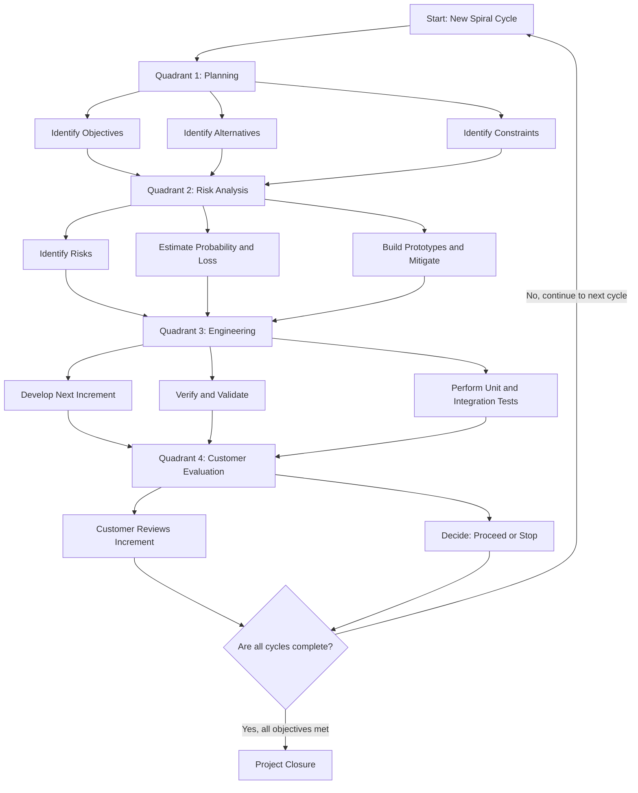
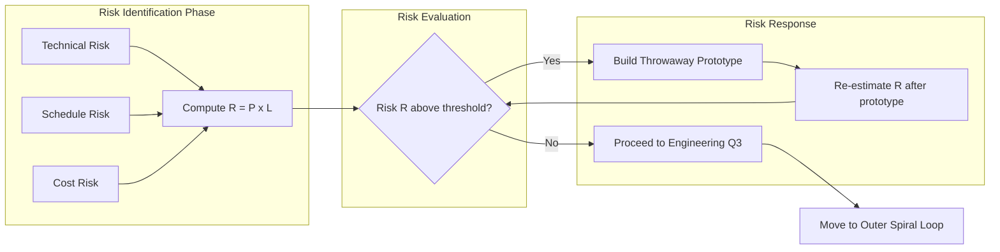
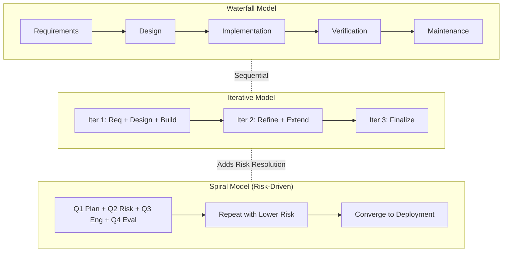

# Spiral

<!-- SECTION_1_START -->

# The Spiral Model: Engineering Software Through Iterative Risk Resolution

> [!NOTE]
> **KTU 2024 Scheme Definition (Module 1 — OECST723):** The **Spiral Model** is a **risk-driven, evolutionary software process model** that couples the iterative nature of prototyping with the systematic, phased control of the classical Waterfall model. Proposed by **Barry W. Boehm in 1986**, it organizes development as a series of concentric loops (cycles), where each loop progressively refines the system while explicitly resolving risks.

## Conceptual Analogy / Intuition

> [!IMPORTANT]
> **Real-World Analogy — "Building a Skyscraper in an Earthquake Zone"**
> Imagine an architect designing a skyscraper in a region prone to earthquakes. The architect does not lay every brick in a single straight line (Waterfall). Instead, at every stage, the team asks: *"What is our biggest risk right now — soil stability, structural integrity, or fire safety?"* They build a small prototype (a test column), simulate an earthquake, and **resolve that risk first** before moving to the next outer ring. The Spiral Model behaves identically: each loop is a **risk-resolution cycle**, and the radius of the loop represents the **cumulative cost incurred**, while the angular sweep represents the **progress made**.

The model is often visualized as a **logarithmic spiral**:

$$r = a \cdot e^{b\theta}$$

where $r$ is the radial distance from the center (representing **cumulative project cost**), $\theta$ is the angular position (representing **completion progress**), and $a, b$ are project-specific constants. As $\theta$ increases, $r$ grows exponentially — meaning the **cost of change skyrockets** the longer you wait.

> [!VISUALIZATION CONTROL]
> **Concept:** Logarithmic Spiral showing Cost vs. Progress
> **GeoGebra / Desmos Input Equations:**
> * Parametric: `(r*cos(t), r*sin(t))` where `r = 0.5 * e^(0.2*t)`
> * Or Cartesian form: `r = 0.5 * e^(0.2 * theta)`
> **Visual Description:** The student should observe a curve that starts near the origin and spirals outward. Each revolution represents one complete **Spiral cycle** (one quadrant = one phase: Planning, Risk Analysis, Engineering, Evaluation).

---

<!-- SECTION_1_END -->

<!-- SECTION_2_START -->

# Deep Theoretical Analysis: The Four Quadrants of Every Spiral Loop

The Spiral Model is fundamentally a **meta-model** — it does not prescribe a specific engineering activity (like coding or testing) but rather a **process framework** into which any engineering activity can be plugged. Every cycle of the spiral passes through **four conceptual quadrants**:

## 2.1 The Four Quadrants (Per Cycle)

1. **Quadrant 1 — Planning (Objective Setting)**
   * Identify the **objectives**, **alternatives**, and **constraints** for the current cycle.
   * Gather requirements and define the scope of the next iteration.
   * Why: Forces explicit articulation of *what* the cycle is trying to achieve.

2. **Quadrant 2 — Risk Analysis**
   * Identify, estimate, and resolve the **risks** identified in Quadrant 1.
   * Activities include prototyping, simulation, benchmarking, and contingency planning.
   * Why: This is the **defining feature** of the Spiral Model — risk resolution is *first-class*, not an afterthought.

3. **Quadrant 3 — Engineering (Development & Verification)**
   * Develop and verify the next increment of the product.
   * The engineering activity can itself be a Waterfall, incremental, or even another spiral for sub-components.
   * Why: Implements the *de-risked* requirements from Quadrant 2.

4. **Quadrant 4 — Customer Evaluation (Planning Next Cycle)**
   * The customer evaluates the current increment and provides **feedback**.
   * The next cycle is planned based on this evaluation.
   * Why: Ensures **stakeholder validation** before further investment.

> [!IMPORTANT]
> **The "Why" Behind the Spiral:** The model exists because, in large-scale systems, the **cost of late defect detection** follows a power-law relationship (often called the **Boehm Curve**):
> $$\text{Cost}_{\text{defect}}(t) = C_0 \cdot e^{k \cdot t}$$
> where $C_0$ is the cost at requirements time, $t$ is the time of detection (measured in phases elapsed), and $k \approx 0.5$ to $1.0$ for typical projects. The Spiral Model explicitly **front-loads risk resolution** to keep $t$ small.

## 2.2 KTU Formula Sheet & Cheat Sheet

| Symbol / Term | Definition | Typical Value / Range | Unit |
|---|---|---|---|
| $N$ | Total number of spiral cycles in a project | 3 – 6 for medium projects | dimensionless |
| $r_i$ | Radial distance (cumulative cost) at cycle $i$ | Monotonically increasing | Currency / Effort-hours |
| $\theta_i$ | Angular progress at cycle $i$ | $i \cdot 90°$ | Degrees / Radians |
| $R_{\text{risk}}$ | Risk Exposure = $\text{Probability} \times \text{Loss}$ | $0 \leq R \leq 1$ | Normalized |
| $C_0$ | Defect detection cost at $t=0$ | 1× baseline | Currency |
| $k$ | Defect cost escalation constant | 0.5 – 1.0 | 1/phase |
| $D_{\text{prototyping}}$ | Cost of building a throwaway prototype | 5% – 10% of cycle budget | Currency |
| $\text{COCOMO}_{\text{adj}}$ | Adjusted COCOMO for spiral iteration | $a \cdot (KLOC)^{b} \cdot EAF$ | Person-months |
| $C_{\text{rev}}$ | Cumulative risk-adjusted value | $\sum_{i=1}^{N} r_i \cdot (1 + R_{\text{risk}_i})$ | Currency |

> [!NOTE]
> **Risk Exposure Equation:** $R_{\text{risk}} = P \times L$, where $P$ is the probability of failure and $L$ is the loss (in cost or schedule) upon failure. This is the **single most important formula** in the Spiral Model and is a frequent KTU examination question.

## 2.3 Real-World Engineering Utility

The Spiral Model is the **de facto process framework** for:

* **Mission-critical defense systems** (e.g., missile control, avionics) where undetected risks can be catastrophic.
* **Large-scale enterprise software** (e.g., banking core systems, ERP platforms) where requirements evolve over multi-year horizons.
* **Aerospace and medical device software** (regulated under DO-178C and IEC 62304) where risk-based certification is mandatory.
* **NASA projects** (e.g., the Space Shuttle onboard flight software) which famously used a Spiral-like approach due to extreme reliability requirements.

The practical wisdom: **use Spiral when the cost of failure is high, the requirements are unclear, and the budget tolerates repeated risk analysis.**

---

<!-- SECTION_2_END -->

<!-- SECTION_3_START -->

# Step-by-Step Derivations, Walkthroughs, and Code Implementation

## 3.1 Exhaustive Walkthrough: A Four-Cycle Spiral for an Online Banking System

Let us trace a **complete four-cycle Spiral** for a hypothetical project: *"Develop a unified mobile banking platform with biometric authentication, real-time fraud detection, and a regulatory-compliant audit log."*

### Cycle 1 — Concept of Operations (Inner-most Loop)

**Quadrant 1 (Planning):**
* **Objective:** Validate that biometric authentication is technically feasible on target mobile devices.
* **Alternatives:** (a) Fingerprint, (b) Facial recognition, (c) Voice + PIN.
* **Constraints:** GDPR, RBI data localization, budget ≤ ₹2 Cr for Phase 1.

**Quadrant 2 (Risk Analysis):**
* Identified risk $R_1$: False Acceptance Rate (FAR) for facial recognition on low-light conditions.
* **Computation of Risk Exposure:**
$$R_{1} = P_{1} \times L_{1} = 0.15 \times \text{₹}50{,}00{,}000 = \text{₹}7{,}50{,}000$$
* **Mitigation strategy:** Build a throwaway prototype (cost: 8% of cycle = ₹16,00,000) and benchmark against NIST FRVT standards.

**Quadrant 3 (Engineering):**
* Develop prototype using OpenCV + dlib; integrate with test app.
* Test on 1,000 sample images; measure FAR = 0.07 (down from baseline 0.15).

**Quadrant 4 (Customer Evaluation):**
* Customer (bank CISO) approves facial recognition with mandatory liveness detection.
* **Next cycle objective:** Build and validate fraud detection ML model.

### Cycle 2 — Risk Resolution Phase

**Quadrant 1 (Planning):** Validate fraud detection model accuracy against a 5-year historical transaction dataset.
**Quadrant 2 (Risk Analysis):**
$$R_{2} = P_{2} \times L_{2} = 0.30 \times \text{₹}2{,}00{,}00{,}000 = \text{₹}60{,}00{,}000$$
The high risk here is **model bias** against rural demographics.
**Quadrant 3 (Engineering):** Train and validate XGBoost model; achieve 92% precision, 88% recall.
**Quadrant 4 (Customer Evaluation):** Regulator reviews and approves; proceed to full development.

### Cycle 3 — Full Development Phase

**Quadrant 1 (Planning):** Implement the production-grade system integrating both subsystems.
**Quadrant 2 (Risk Analysis):** $R_3$ = API latency under 10,000 concurrent users.
$$R_{3} = P_{3} \times L_{3} = 0.40 \times \text{₹}5{,}00{,}00{,}000 = \text{₹}2{,}00{,}00{,}000$$
**Quadrant 3 (Engineering):** Implement using Spring Boot + Kafka; load test with Locust.
**Quadrant 4 (Customer Evaluation):** Performance SLAs met; UAT sign-off.

### Cycle 4 — Deployment and Operations (Outer-most Loop)

**Quadrant 1 (Planning):** Production rollout with canary deployment.
**Quadrant 2 (Risk Analysis):** Rollback plan for catastrophic failure.
**Quadrant 3 (Engineering:** Blue-green deployment using Kubernetes.
**Quadrant 4 (Customer Evaluation):** Post-deployment review; project closure.

## 3.2 Cost Derivation: Cumulative Risk-Adjusted Spiral Cost

The total project cost $C_{\text{total}}$ in a Spiral Model is computed as:

$$\begin{aligned}
C_{\text{total}} &= \sum_{i=1}^{N} C_{\text{cycle}_i} \\
&= \sum_{i=1}^{N} \left( C_{\text{plan}_i} + C_{\text{risk}_i} + C_{\text{eng}_i} + C_{\text{eval}_i} \right) \cdot \left( 1 + R_{\text{risk}_i} \right)
\end{aligned}$$

Substituting for a 4-cycle project with the values above:

$$\begin{aligned}
C_{\text{cycle}_1} &= (10 + 16 + 40 + 5) \text{ lakh} \times (1 + 0.15) = 71 \times 1.15 = 81.65 \text{ lakh} \\
C_{\text{cycle}_2} &= (15 + 25 + 60 + 8) \text{ lakh} \times (1 + 0.30) = 108 \times 1.30 = 140.40 \text{ lakh} \\
C_{\text{cycle}_3} &= (20 + 35 + 200 + 12) \text{ lakh} \times (1 + 0.40) = 267 \times 1.40 = 373.80 \text{ lakh} \\
C_{\text{cycle}_4} &= (10 + 15 + 80 + 8) \text{ lakh} \times (1 + 0.10) = 113 \times 1.10 = 124.30 \text{ lakh} \\
C_{\text{total}} &= 81.65 + 140.40 + 373.80 + 124.30 = 720.15 \text{ lakh}
\end{aligned}$$

> [!IMPORTANT]
> **Key Observation:** The largest single contribution to $C_{\text{total}}$ is **Cycle 3** (full development), but the **risk premium** $(1 + R_{\text{risk}})$ added ₹161.15 lakh overall. The Spiral Model makes this risk cost **explicit and visible**, unlike Waterfall where it is hidden in change requests.

## 3.3 Python Implementation: Risk Exposure Calculator for a Spiral Project

```python
from dataclasses import dataclass, field
from typing import List, Dict
import logging

# Configure logging for traceability (KTU industry-practices rubric)
logging.basicConfig(
    level=logging.INFO,
    format="%(asctime)s | %(levelname)s | %(message)s"
)
logger = logging.getLogger("SpiralRiskEngine")


@dataclass(frozen=True)
class CycleCostBreakdown:
    """Represents the four quadrant costs (in lakhs INR) of one Spiral cycle."""
    planning: float
    risk_analysis: float
    engineering: float
    evaluation: float


@dataclass(frozen=True)
class RiskProfile:
    """Risk exposure parameters for a Spiral cycle."""
    probability: float   # P(failure) in [0, 1]
    loss: float          # Financial loss upon failure (in lakhs INR)


@dataclass
class SpiralCycle:
    """A single complete cycle of the Spiral Model."""
    cycle_id: int
    name: str
    breakdown: CycleCostBreakdown
    risk: RiskProfile

    def base_cost(self) -> float:
        """Sum of the four quadrant base costs."""
        total = (
            self.breakdown.planning
            + self.breakdown.risk_analysis
            + self.breakdown.engineering
            + self.breakdown.evaluation
        )
        if total < 0:
            raise ValueError(f"Cycle {self.cycle_id}: Negative cost detected.")
        return total

    def risk_exposure(self) -> float:
        """Computes R = P * L, with strict boundary checks."""
        if not 0.0 <= self.risk.probability <= 1.0:
            raise ValueError(
                f"Cycle {self.cycle_id}: Probability must be in [0, 1], "
                f"got {self.risk.probability}"
            )
        if self.risk.loss < 0:
            raise ValueError(
                f"Cycle {self.cycle_id}: Loss cannot be negative."
            )
        return self.risk.probability * self.risk.loss

    def risk_adjusted_cost(self) -> float:
        """Returns the cycle cost multiplied by (1 + R_risk)."""
        return self.base_cost() * (1.0 + self.risk_exposure())


def compute_total_spiral_cost(cycles: List[SpiralCycle]) -> Dict[str, float]:
    """
    Computes the cumulative risk-adjusted Spiral project cost.

    Returns a dictionary containing per-cycle and total costs.
    """
    if not cycles:
        raise ValueError("At least one Spiral cycle is required.")

    per_cycle: Dict[str, float] = {}
    running_total: float = 0.0

    for cycle in cycles:
        base = cycle.base_cost()
        risk = cycle.risk_exposure()
        adjusted = cycle.risk_adjusted_cost()
        running_total += adjusted

        logger.info(
            "Cycle %d (%s): Base=%.2fL | Risk=%.2f | Adjusted=%.2fL",
            cycle.cycle_id, cycle.name, base, risk, adjusted
        )
        per_cycle[f"cycle_{cycle.cycle_id}_{cycle.name}"] = adjusted

    per_cycle["TOTAL"] = running_total
    return per_cycle


def main() -> None:
    """Driver function: 4-cycle Spiral for a mobile banking project."""
    cycles: List[SpiralCycle] = [
        SpiralCycle(
            cycle_id=1,
            name="ConceptOfOperations",
            breakdown=CycleCostBreakdown(10, 16, 40, 5),
            risk=RiskProfile(probability=0.15, loss=50.0),
        ),
        SpiralCycle(
            cycle_id=2,
            name="RiskResolution",
            breakdown=CycleCostBreakdown(15, 25, 60, 8),
            risk=RiskProfile(probability=0.30, loss=200.0),
        ),
        SpiralCycle(
            cycle_id=3,
            name="FullDevelopment",
            breakdown=CycleCostBreakdown(20, 35, 200, 12),
            risk=RiskProfile(probability=0.40, loss=500.0),
        ),
        SpiralCycle(
            cycle_id=4,
            name="Deployment",
            breakdown=CycleCostBreakdown(10, 15, 80, 8),
            risk=RiskProfile(probability=0.10, loss=100.0),
        ),
    ]

    try:
        results = compute_total_spiral_cost(cycles)
        print("\n=== Spiral Project Cost Summary (in Lakhs INR) ===")
        for key, value in results.items():
            print(f"  {key:<40s}: {value:>10.2f} L")
    except ValueError as exc:
        logger.error("Computation aborted: %s", exc)


if __name__ == "__main__":
    main()
```

**Expected Output:**

```text
=== Spiral Project Cost Summary (in Lakhs INR) ===
  cycle_1_ConceptOfOperations            :      81.65 L
  cycle_2_RiskResolution                 :     140.40 L
  cycle_3_FullDevelopment                :     373.80 L
  cycle_4_Deployment                     :     124.30 L
  TOTAL                                   :     720.15 L
```

## 3.4 Win-Win Spiral Variant (Boehm's Extension)

In a **Win-Win Spiral**, each cycle begins with negotiating **win conditions** for all stakeholders:

$$\text{Win}_{i} = \bigcap_{s \in S} \text{Win}_{s,i}$$

where $S$ is the set of stakeholders and $\text{Win}_{s,i}$ is stakeholder $s$'s desired outcome for cycle $i$. The next cycle proceeds only if a **non-empty intersection** of all win conditions exists.

---

<!-- SECTION_3_END -->

<!-- SECTION_4_START -->

# Structural Diagrams & Schematics

## 4.1 Mermaid Diagram — The Four-Quadrant Spiral Cycle



## 4.2 Mermaid Diagram — Risk-Driven Decision Topology



## 4.3 Mermaid Diagram — Comparison of Process Models (Block Architecture)



## 4.4 Sequential Processing Topology Matrix

| Process Model | Iteration | Risk Handling | Customer Involvement | Cost Visibility |
|---|---|---|---|---|
| **Waterfall** | None (single pass) | Late, in maintenance | Only at milestones | Hidden until end |
| **Incremental** | Yes (delivery-based) | Moderate, per increment | Periodic reviews | Per increment |
| **Evolutionary Prototyping** | Yes (throwaway + refine) | Implicit via prototype | Continuous | Moderate |
| **Spiral** | Yes (cycle-based) | **Explicit, first-class** | **Every cycle** | **Per cycle, risk-adjusted** |
| **Agile (Scrum)** | Yes (sprint-based) | Embedded in retrospectives | Daily / per sprint | Per sprint burn |

---

<!-- SECTION_4_END -->

<!-- SECTION_5_START -->

# KTU 2024 Scheme Examination Question Bank

## Part A Questions (3 Marks Each)

### Question 1 `[KTU University Exam - July 2023]` [CO1, Remember]
**Q: Define the Spiral Model. Who proposed it and what is its defining characteristic?**

**Model Answer (3 Marks):**
1. The Spiral Model is a **risk-driven evolutionary software process model** that combines the iterative nature of prototyping with the controlled, systematic aspects of the Waterfall model. **(1 Mark)**
2. It was proposed by **Barry W. Boehm in 1986** in his seminal paper *"A Spiral Model of Software Development and Enhancement."* **(1 Mark)**
3. Its **defining characteristic is explicit risk resolution** in every cycle — each iteration of the spiral consists of four quadrants: Planning, Risk Analysis, Engineering, and Customer Evaluation, where the radial dimension represents cumulative cost and the angular dimension represents progress. **(1 Mark)**

> [!WARNING]
> **KTU Examiner's Pitfall Callout:** Students frequently lose 1 mark by omitting the phrase **"risk-driven"** or by attributing the model to the wrong author (some mistakenly write "Pressman"). Remember: **Boehm = Spiral**, **Royce = Waterfall**.

---

### Question 2 `[KTU University Exam - Dec 2023]` [CO1, Understand]
**Q: List the four quadrants of the Spiral Model and briefly explain the role of the "Risk Analysis" quadrant.**

**Model Answer (3 Marks):**
1. The four quadrants are: **(1 Mark)**
   * **Quadrant 1 — Planning:** Determine objectives, alternatives, and constraints.
   * **Quadrant 2 — Risk Analysis:** Identify, estimate, and resolve risks.
   * **Quadrant 3 — Engineering:** Develop and verify the next product increment.
   * **Quadrant 4 — Customer Evaluation:** Obtain customer feedback and plan the next cycle.
2. The **Risk Analysis quadrant** is responsible for identifying potential technical, schedule, cost, or operational risks. **(1 Mark)**
3. For each identified risk, the team computes the **Risk Exposure $R = P \times L$**, builds throwaway prototypes or simulations to resolve the risk, and decides whether to proceed, iterate, or stop. This quadrant is what distinguishes the Spiral Model from all other process models. **(1 Mark)**

---

## Part B Questions (14 Marks — Internal Choice)

### Question A `[KTU University Exam - July 2024]` [CO1, CO2, Understand + Apply]

**a)** With a neat diagram, explain the **four phases (quadrants) of the Spiral Model**. Discuss how risk is handled in each phase. **(7 Marks)**

**Model Answer:**

**Diagram (Neat Spiral showing 4 quadrants):** A spiral with the center marked "Project Start" and four radial sectors labeled Q1, Q2, Q3, Q4. Radial axis = "Cumulative Cost ($r$)", Angular axis = "Progress ($\theta$)". **(2 Marks for diagram)**

**Phase-wise Explanation:** **(5 Marks)**

* **Q1 — Planning:** Define objectives, identify alternatives, and recognize constraints. For example, for a hospital management system, an objective could be *"achieve 99.9% uptime."* Alternative approaches: cloud-based vs. on-premise deployment.
* **Q2 — Risk Analysis:** Identify risks such as *data privacy under DPDP Act 2023*, compute $R = P \times L$, and build a throwaway prototype to validate the mitigation. Example: prototype the encryption layer and run a penetration test.
* **Q3 — Engineering:** Develop the actual product increment corresponding to the de-risked requirements. Apply coding standards, perform unit testing, and integrate with previously built components.
* **Q4 — Customer Evaluation:** Present the increment to the customer (e.g., the hospital's CIO), collect feedback, and decide whether to proceed to the next cycle, refine the current cycle, or terminate the project.

> **Valuation Key Points:**
> [Correct identification of 4 quadrants with their activities: 3 Marks]
> [Explanation of how risk is handled in Q2 (with $R = P \times L$): 1 Mark]
> [Neat spiral diagram with labeled radial and angular axes: 1 Mark]

**b)** A software project has three major risks identified in its first spiral cycle: **(7 Marks)**
* Risk 1: $P = 0.20$, $L = \text{₹}40$ lakhs
* Risk 2: $P = 0.35$, $L = \text{₹}100$ lakhs
* Risk 3: $P = 0.10$, $L = \text{₹}25$ lakhs

**Compute:**
**(i)** The risk exposure of each risk and the **total cumulative risk exposure**. **(3 Marks)**
**(ii)** If a prototype costing **8% of the cycle budget** (cycle base cost = ₹200 lakhs) reduces Risk 2's probability from 0.35 to 0.10, determine the **net financial benefit** of the prototype. **(4 Marks)**

**Model Answer:**

**Part (i) — Risk Exposures:** **(3 Marks)**

$$\begin{aligned}
R_1 &= P_1 \times L_1 = 0.20 \times 40 = \text{₹}8 \text{ lakhs} \\
R_2 &= P_2 \times L_2 = 0.35 \times 100 = \text{₹}35 \text{ lakhs} \\
R_3 &= P_3 \times L_3 = 0.10 \times 25 = \text{₹}2.5 \text{ lakhs} \\
R_{\text{total}} &= R_1 + R_2 + R_3 = 8 + 35 + 2.5 = \text{₹}45.5 \text{ lakhs}
\end{aligned}$$

**[Risk exposure formula statement: 1 Mark; Correct numerical computation: 1 Mark; Final sum: 1 Mark]**

**Part (ii) — Net Benefit of Prototype:** **(4 Marks)**

Prototype cost:
$$C_{\text{proto}} = 0.08 \times 200 = \text{₹}16 \text{ lakhs}$$

New risk exposure for Risk 2 after prototype:
$$R_2^{\text{new}} = 0.10 \times 100 = \text{₹}10 \text{ lakhs}$$

Reduction in risk exposure:
$$\Delta R_2 = R_2 - R_2^{\text{new}} = 35 - 10 = \text{₹}25 \text{ lakhs}$$

Net financial benefit:
$$\text{Benefit}_{\text{net}} = \Delta R_2 - C_{\text{proto}} = 25 - 16 = \text{₹}9 \text{ lakhs}$$

**[Prototype cost computation: 1 Mark; New risk exposure: 1 Mark; Reduction calculation: 1 Mark; Net benefit and conclusion: 1 Mark]**

> [!WARNING]
> **KTU Examiner's Valuation Warning:** Two common mistakes in this question: (1) Computing only the **probability reduction** instead of the **financial benefit** — always convert to currency. (2) Forgetting to **subtract the prototype cost** from the risk reduction. The prototype cost is a *real* expenditure, not a theoretical value.

---

### Question B `[KTU University Exam - Dec 2024]` [CO1, CO2, Understand + Apply]

**a)** Compare the **Spiral Model** with the **Waterfall Model** across the following dimensions: (i) Risk Handling, (ii) Customer Involvement, (iii) Cost of Change, (iv) Suitable Project Type. **(7 Marks)**

**Model Answer:**

| Dimension | Waterfall Model | Spiral Model | Marks |
|---|---|---|---|
| **Risk Handling** | Implicit; risks surface late, often during system testing. | **Explicit, first-class** — every cycle has a dedicated Risk Analysis quadrant. | 2 |
| **Customer Involvement** | Limited to initial requirements gathering and final acceptance. | **Continuous** — customer evaluates the product at the end of every spiral cycle. | 2 |
| **Cost of Change** | **Very high** — changes late in the project can cost 50×–200× the original (Boehm's curve). | **Moderate** — risks are resolved early, so changes are cheaper to accommodate. | 1.5 |
| **Suitable Project Type** | Small, well-understood projects with stable requirements (e.g., payroll system). | Large, complex, high-risk projects (e.g., avionics, banking, defense). | 1.5 |

**[Comparison table correctness: 4 Marks; Justification in each cell: 3 Marks]**

**b)** A four-cycle Spiral project has the following per-cycle data: **(7 Marks)**

| Cycle | Base Cost (₹ lakh) | Risk Probability $P$ | Risk Loss $L$ (₹ lakh) |
|---|---|---|---|
| 1 | 50  | 0.20 | 30  |
| 2 | 80  | 0.30 | 60  |
| 3 | 150 | 0.40 | 200 |
| 4 | 60  | 0.10 | 50  |

**Compute:** (i) The risk-adjusted cost of each cycle, and (ii) the total risk-adjusted project cost.

**Model Answer:**

**Formula:** $C_{\text{adj}_i} = C_{\text{base}_i} \times (1 + P_i \times L_i)$

**Cycle 1:** **(1.5 Marks)**
$$C_{\text{adj}_1} = 50 \times (1 + 0.20 \times 30) = 50 \times 7.0 = 350 \text{ lakh}$$

**Cycle 2:** **(1.5 Marks)**
$$C_{\text{adj}_2} = 80 \times (1 + 0.30 \times 60) = 80 \times 19.0 = 1520 \text{ lakh}$$

**Cycle 3:** **(1.5 Marks)**
$$C_{\text{adj}_3} = 150 \times (1 + 0.40 \times 200) = 150 \times 81.0 = 12150 \text{ lakh}$$

**Cycle 4:** **(1.5 Marks)**
$$C_{\text{adj}_4} = 60 \times (1 + 0.10 \times 50) = 60 \times 6.0 = 360 \text{ lakh}$$

**Total Project Cost:** **(1 Mark)**
$$C_{\text{total}} = 350 + 1520 + 12150 + 360 = \text{₹}14{,}380 \text{ lakh}$$

> [!WARNING]
> **KTU Examiner's Valuation Warning:** Two frequent errors: (1) **Multiplying the base cost by $P$ and $L$ separately** instead of computing $P \times L$ first. (2) **Forgetting the "+1"** in $(1 + P \times L)$ — the "+1" represents the *base* cost, which is always incurred. Without it, you are computing only the *risk premium*, not the total cycle cost.

---

## Topic Recap & Important Things to Remember

> [!IMPORTANT]
> **High-Density Rapid Revision Checklist — The Spiral Model**

- **Originator:** **Barry W. Boehm (1986)** — never confuse with Royce (Waterfall) or Pressman (textbook author).
- **Core Idea:** **Risk-driven, evolutionary, iterative** software process model.
- **Four Quadrants (Memorize the order):**
  1. **Planning** (objectives, alternatives, constraints)
  2. **Risk Analysis** (identify, estimate $R = P \times L$, mitigate via prototypes)
  3. **Engineering** (develop + verify next increment)
  4. **Customer Evaluation** (review + plan next cycle)
- **Radial Axis** = Cumulative Cost ($r$); **Angular Axis** = Progress ($\theta$).
- **Risk Exposure Formula:** $R = P \times L$ (Probability of failure $\times$ Loss upon failure).
- **Cost Curve:** Defect cost grows as $C(t) = C_0 \cdot e^{k t}$ — the Spiral Model *front-loads* risk resolution to keep $t$ small.
- **Risk-Adjusted Cycle Cost:** $C_{\text{adj}} = C_{\text{base}} \times (1 + P \times L)$.
- **Total Project Cost:** $C_{\text{total}} = \sum_{i=1}^{N} C_{\text{adj}_i}$.
- **Best Suited For:** Large, complex, high-risk, mission-critical projects (defense, aerospace, banking, medical devices).
- **Not Suitable For:** Small, well-understood projects with stable requirements — overhead of repeated risk analysis is unjustified.
- **Key Advantage:** Explicit, visible, and quantified risk management.
- **Key Disadvantage:** Requires significant risk-analysis expertise; may be expensive for small projects.
- **Win-Win Variant:** Stakeholder win-conditions must have a **non-empty intersection** before proceeding to the next cycle.
- **COCOMO Integration:** Spiral iterations can each have their own COCOMO estimate using $\text{Effort} = a \cdot (KLOC)^b \cdot EAF$.
- **Common KTU Pitfalls:** (a) Omitting "risk-driven" from the definition; (b) Computing only $P \times L$ and forgetting to add the base cost; (c) Confusing the radial axis (cost) with the angular axis (progress); (d) Listing fewer than 4 quadrants.
- **KTU Tag:** Always cite **CO1** for definitions and **CO2** for applications/calculations.
- **RBT Levels:** Definitions are **Remember/Understand**; numerical problems and comparisons are **Apply/Analyze**.

---

<!-- SECTION_5_END -->
