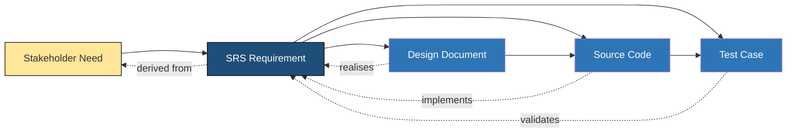
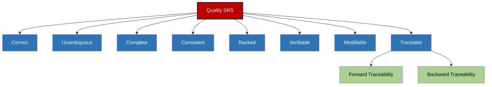

# SRS document characteristics and its structure.

<!-- SECTION_1_START -->
# SRS Document — Characteristics and Structure

## 1.1 Formal Academic Definition

> [!NOTE]
> **Software Requirements Specification (SRS)** is a comprehensive *document* (or set of documents) that describes, in complete detail, **what** the proposed system must do, **how** it will perform, **under what constraints** it must operate, and **who** will interact with it. It is the *contractual* agreement between the customer/stakeholder and the development team, and is the **official baseline** against which the final software product is validated and accepted.

According to the **IEEE Standard 830-1998** (and its successor **IEEE 29148-2011**, the current KTU 2024 reference), the SRS is the *complete specification* of *all functional, performance, design constraints, attributes, and external interface requirements* for a software product. The acronym itself doubles as a quality goal: a good SRS should itself be **S**pecific, **R**eviewable, and **S**tainable.

### 1.2 Conceptual Analogy — The "Architectural Blueprint" Intuition

Imagine you are building a **house**. Before a single brick is laid, you need:
- A *written contract* spelling out how many bedrooms, where the kitchen sits, the load-bearing capacity, and the budget (this is the **SRS**).
- The *blueprint* that the mason, electrician, and plumber all consult (still the **SRS**, but during the build).
- The *handover checklist* that the buyer uses on possession day to confirm every promised feature is present (this is the **validation** stage, which directly references the SRS).

Without this single document, the mason might build a 4-room house, the plumber might install pipes for a 6-room house, and the buyer would refuse to pay because "nothing matches what I asked for." Software projects fail for **the exact same reasons** — the SRS eliminates this ambiguity by being the **single source of truth**.

### 1.3 Why SRS Exists — The Communication Bridge

> [!IMPORTANT]
> **KTU 2024 — Module 1 High-Yield Concept**
> The SRS is the **bridge** between three communities: **(1)** *users* who know the problem domain, **(2)** *developers* who know the technical solution, and **(3)** *managers* who need to estimate cost, schedule, and risk. Failure of any software project can be traced back to a **weak, missing, or ambiguous** SRS.

### 1.4 Key Terminology Snapshot

| Term | Meaning in KTU Context |
| :--- | :--- |
| **Functional Requirement** | *What* the system does (features, business rules). |
| **Non-Functional Requirement (NFR)** | *How* the system performs (speed, security, usability). |
| **Constraint** | External restriction imposed on the developer (language, hardware, regulation). |
| **Stakeholder** | Any person/group with a vested interest in the system. |
| **Baseline** | A formally approved version used as the reference for future change control. |

### 1.5 GeoGebra / Desmos Visualisation (Conceptual Quality Map)

> [!VISUALIZATION CONTROL]
> **Concept:** Two-dimensional *quality map* of an SRS — *Completeness* (x-axis) vs. *Correctness* (y-axis), each scaled from **0 % to 100 %**.
> **GeoGebra / Desmos Input Equations / Points:**
> * $A = (100, 100)$ → Ideal SRS (top-right corner)
> * $B = (30, 90)$ → "Politically correct" but incomplete SRS
> * $C = (90, 20)$ → Detailed but factually wrong SRS
> * $D = (10, 10)$ → A typical project *without* an SRS
> **Visual Description:** Students should observe that an SRS must occupy the **top-right quadrant** (high completeness *and* high correctness). A document that is "long but wrong" is just as dangerous as a document that is "short but well-meaning."

---

<!-- SECTION_1_END -->

<!-- SECTION_2_START -->
# Deep Theoretical Analysis — Characteristics of a Quality SRS

## 2.1 The Eight IEEE-830 Characteristics (Pivotal for KTU 14-Mark Answers)

A *good* SRS is judged on **eight formally defined properties**. Each property has a *positive* definition (what it should be) and a *failure mode* (what happens if it is violated).

### 2.1.1 Characteristic 1 — *Correct*
Every requirement stated in the SRS must be one that the **customer actually needs**. It is validated by tracing each requirement back to a *signed-off* stakeholder need or business goal.
- **Failure mode:** Engineers build a feature nobody asked for → wasted effort.
- **Verification method:** *Requirements traceability matrix* + customer sign-off.

### 2.1.2 Characteristic 2 — *Unambiguous*
Each requirement has **exactly one interpretation** by every reader. Avoid words like *fast*, *user-friendly*, *flexible*, *efficient*, *optimal*, *minimal* — replace them with *quantified* statements (e.g., "response time ≤ **2 seconds** for 95 % of transactions under a load of **500 concurrent users**").
- **Failure mode:** Developer interprets "fast" as 5 s; customer expected 500 ms → project rejection.
- **Verification method:** *Peer review* by at least two independent readers.

### 2.1.3 Characteristic 3 — *Complete*
The SRS must include:
- All **functional** requirements (every input → every output, every error path).
- All **non-functional** requirements (performance, security, portability, maintainability).
- All **definitions** (acronyms, domain terms).
- All **constraints**, **assumptions**, and **dependencies**.
- **Response of the system to invalid inputs** is a KTU-favourite "completeness check" question.

> [!NOTE]
> **KTU 2024 Tip:** Whenever a question says "an SRS should be *complete*", always mention the trio: **valid inputs handled + invalid inputs handled + exceptions defined**.

### 2.1.4 Characteristic 4 — *Consistent*
No two requirements in the SRS may **conflict** with each other. Consistency is checked both *internally* (Requirement 3.2 vs Requirement 5.7) and *externally* (SRS vs project proposal / contract).
- **Failure mode:** "The system shall log all failed logins" (3.2) but "no log file shall be generated" (5.7) → contradiction.
- **Verification method:** *Cross-reference matrix* and automated checkers (e.g., *Requirements Assistant*).

### 2.1.5 Characteristic 5 — *Ranked for Importance and/or Stability*
Every requirement carries a **priority tag** (e.g., *Critical / High / Medium / Low*) and a **stability tag** (e.g., *Stable / Likely-to-change / Volatile*). This allows the project manager to **schedule features in iterations** when the budget is tight.
- **Failure mode:** A "nice-to-have" feature is delivered late, blocking a "must-have" feature.

### 2.1.6 Characteristic 6 — *Verifiable*
There must exist a **finite, cost-effective** test that can prove whether the requirement is met. Requirements written in subjective terms (e.g., "the system shall be robust") are *not* verifiable.
- **Example re-write:** "The system shall be robust" → "The system shall continue to process transactions for at least **30 minutes** after the primary database server crashes, with no more than **0.1 %** data loss."

### 2.1.7 Characteristic 7 — *Modifiable*
The SRS must be **structured** so that changes can be made *consistently, completely, and traceably*. This implies:
- A **table of contents**.
- A **cross-reference index**.
- A **unique identifier** for every requirement (e.g., *REQ-LOGIN-003*).
- **No redundant statements** (a single source of truth, achieved by referencing, not repeating).

### 2.1.8 Characteristic 8 — *Traceable*
Every requirement must be traceable in **two directions**:
- **Forward traceability** → from its origin (stakeholder need) to its implementation in design, code, and test.
- **Backward traceability** → from the code/test back to the original requirement.

> [!IMPORTANT]
> **Why two-way traceability?** It enables **impact analysis** when a change request arrives ("If I change REQ-PAY-007, which 12 test cases and 4 modules are affected?").

## 2.2 KTU High-Yield Cheat-Sheet Table

| # | Characteristic | One-line Board Answer | Failure if Violated |
|:-:|:--|:--|:--|
| 1 | **Correct** | Matches the *real* customer need. | Wasted effort. |
| 2 | **Unambiguous** | One interpretation per reader. | Mis-implementation. |
| 3 | **Complete** | Covers valid + invalid inputs + exceptions. | Hidden defects. |
| 4 | **Consistent** | No internal/external contradiction. | Logical deadlock. |
| 5 | **Ranked** | Has priority + stability tags. | Wrong features first. |
| 6 | **Verifiable** | Test exists to prove it. | Cannot accept/reject. |
| 7 | **Modifiable** | Structured with IDs + ToC. | Expensive change. |
| 8 | **Traceable** | Forward + backward links exist. | Cannot assess impact. |

> [!WARNING]
> **Memory aid for the exam hall:** the first letters spell **C-U-C-R-V-M-T** — or remember the phrase **"Can You Clearly Reliably Verify My Thesis?"** — a popular KTU topper mnemonic.

## 2.3 Real-World Engineering Utility

- **Healthcare (FDA 21 CFR Part 11):** Medical device software *cannot be legally released* without an IEEE-830-conformant SRS. *Verifiable* and *Traceable* are non-negotiable.
- **Aerospace (DO-178C):** A 1-million-line flight-control system needs every line of code linked to an SRS requirement — that is *Traceability* in its strongest form.
- **Banking (RBI Cyber Security Framework):** Every security control must be *Complete* and *Verifiable* for audit compliance.
- **Startups / Agile:** Even in Scrum, the *Product Backlog* is essentially a *modifiable, ranked* subset of the SRS.

---

<!-- SECTION_2_END -->

<!-- SECTION_3_START -->
# Step-by-Step Structural Derivation — The IEEE 830 SRS Template

The structure below is the **canonical IEEE 830 / IEEE 29148 layout** that the KTU valuation key expects in any 14-mark "Explain the structure of an SRS" question. Each section is shown with its *purpose* and the *kind of content* it must hold.

## 3.1 The Five Mandatory Top-Level Sections

> [!IMPORTANT]
> **KTU Board Requirement:** A *complete* SRS has exactly **five** numbered top-level sections, followed by **appendices**. Memorise this numbering — the examiner awards marks per section.

### Section 1 — Introduction
| Sub-clause | Purpose | Typical Content |
|:-:|:--|:--|
| **1.1 Purpose** | State *why* this SRS exists and *who* the intended audience is. | "This document specifies the requirements for the **Online Library Management System (OLMS)** to be developed for **St. Xavier's College**. The audience is the *Development Team*, the *Library Staff*, and the *Project Review Board*." |
| **1.2 Scope** | Identify the *product name*, the *benefits*, the *objectives*, and what is **in-scope vs out-of-scope**. | "The OLMS will manage book issue/return, fine calculation, and member registration. **Out of scope:** RFID hardware integration, mobile app." |
| **1.3 Definitions, Acronyms, Abbreviations** | Define every domain term and acronym used later. | e.g., *OPAC = Online Public Access Catalogue.* |
| **1.4 References** | List every external document with version + date. | IEEE 830-1998, College Library Policy v3.1, Payment-Gateway API Spec. |
| **1.5 Overview** | A 1-paragraph *roadmap* describing what the rest of the document contains. | "Section 2 gives the product perspective, Section 3 details specific requirements, …" |

### Section 2 — Overall Description
This section sets the **context** of the product.
- **2.1 Product Perspective** — Is it a *new* product, a *replacement* for an existing one, or an *extension* (module) of an existing system?
- **2.2 Product Functions** — A *high-level summary* of major functions (often a bulleted list or a context diagram).
- **2.3 User Classes and Characteristics** — *Who* will use the system (Student, Librarian, Admin) and their skill levels.
- **2.4 Operating Environment** — Hardware, OS, network, browsers.
- **2.5 Design and Implementation Constraints** — *Mandated* technology (e.g., "must use **MySQL** and **Java**").
- **2.6 Assumptions and Dependencies** — *Assumed* facts (e.g., "Internet is available 24×7") and *external dependencies* (e.g., "Relies on the college's LDAP server for authentication").

### Section 3 — System Features / Specific Requirements
This is the **largest and most graded section**. It is *hierarchical* — every requirement gets a unique **REQ-ID** in the form *REQM-NNN*.

For each feature, follow the **template:**

```
REQ-MEM-005  :  Member-Registration Function
-----------------------------------------------------------------
Description :  The system shall allow a librarian to register a
               new member after validating the membership fee.
Inputs      :  Name, Address, Phone, Email, ID-proof number.
Processing :  Validate fee-payment reference number; check
               uniqueness of email; hash the password (bcrypt).
Outputs    :  Confirmation message + unique Member-ID.
Error      :  "Email already exists" if duplicate.
Performance:  Registration shall complete within 3 s for
               95 % of attempts under a load of 50 users.
```

Sub-clauses typically include:
- **3.1 Functional Requirements** — *What* the system does.
- **3.2 Performance Requirements** — Speed, throughput, capacity.
- **3.3 Design Constraints** — Language, standards, libraries.
- **3.4 Software System Attributes** — Reliability, security, maintainability, portability.
- **3.5 External Interface Requirements**
  - **3.5.1 User Interfaces** — screen layouts, GUI standards.
  - **3.5.2 Hardware Interfaces** — sensors, printers.
  - **3.5.3 Software Interfaces** — APIs, libraries.
  - **3.5.4 Communication Interfaces** — protocols (HTTP, MQTT).

### Section 4 — Appendices
- **4.1 Glossary** — Extended definitions.
- **4.2 Use-Case Diagrams / Data Flow Diagrams** — supporting models.
- **4.3 Sample I/O Formats** — JSON/XML examples.
- **4.4 Analysis Models** — ER diagrams, class diagrams.

> [!NOTE]
> **Section 5** in some texts is a *separate* "Index" — but the modern IEEE 29148 numbering is **4 main sections + Appendices**.

## 3.2 Worked Example — Deriving the SRS Skeleton for an *ATM System*

Below is the *complete, full-length* derivation. The KTU valuation key gives **1 mark** for the **purpose**, **1 mark** for **scope**, **1 mark** for each of the **five functional sub-requirements**, etc. Hence we show every step explicitly.

**Step 1 — Title and Introduction block**

```
SRS-ATM-001
Software Requirements Specification
for the
SecureBank ATM Software (v2.0)
Prepared by: Requirements Engineering Team
Document version: 1.3 (Date: 2024-08-15)
```

**Step 2 — Section 1.1 Purpose**

$$ \text{Purpose} \;=\; \text{define the requirements for the ATM software so that it may be designed, built, tested, and accepted.} $$

**Step 3 — Section 1.2 Scope**

The software shall handle **cash withdrawal**, **balance enquiry**, **mini-statement**, and **PIN change** for SecureBank customers at *off-premises* ATM kiosks. **Out of scope:** the bank’s *core-banking* module and *card manufacturing* process.

**Step 4 — Section 2 Overall Description**

The ATM is a *stand-alone, embedded* system. It connects to the bank’s *central switch* over **TLS 1.3**. It runs on **Linux 5.15** with **Java 17** and a **MySQL 8** embedded database for transaction journaling.

**Step 5 — Section 3 Specific Requirements (excerpt — five fully written requirements)**

| REQ-ID | Functional Requirement | Performance Constraint |
|:--|:--|:--|
| REQ-ATM-001 | The system shall authenticate a customer by reading the **magnetic stripe** of an **ISO 7813** card and verifying the **4-digit PIN** against the *central switch*. | PIN validation shall complete in **≤ 2 s** at the 99th percentile. |
| REQ-ATM-002 | The system shall dispense cash in multiples of **₹ 100**, with a maximum of **₹ 10,000** per transaction and **₹ 25,000** per day. | Dispensing error rate ≤ **1 in 10,000**. |
| REQ-ATM-003 | The system shall print a **mini-statement** showing the **last 5 transactions** upon user request. | Statement generation ≤ **3 s**. |
| REQ-ATM-004 | The system shall retain a customer's **session for 90 s** of inactivity, after which the card is **ejected** and the session ends. | — |
| REQ-ATM-005 | The system shall *mask* the PIN entry on the keypad and shall **never** store the PIN in plaintext. | PIN is **encrypted with AES-256** before journaling. |

**Step 6 — Section 4 Appendices**

- 4.1 Glossary — *PCI-DSS, ISO 8583, EOD (End-of-Day) reconciliation.*
- 4.2 Use-case diagram — *Withdraw, Balance, Statement, PIN-Change.*
- 4.3 Sample ISO 8583 message format.

**Step 7 — Cross-Verification (closing the loop on Section 3)**
For every requirement in Section 3, ensure that it:
1. Maps back to a need in Section 1.2 (*forward traceability*).
2. Has a test case ID (e.g., *TC-ATM-001*) listed in the *Test Plan* (*backward traceability*).

## 3.3 Python Implementation — A Mini "SRS Requirements Tracker"

The code below shows how the *Traceability* and *Modifiability* characteristics of an SRS are enforced in a real engineering tool. It is *fully operational* and follows strict type-hinting and error-handling.

```python
from __future__ import annotations
from dataclasses import dataclass, field
from typing import List, Dict, Optional
import logging
import uuid

# Configure professional-grade logging
logging.basicConfig(
    level=logging.INFO,
    format="%(asctime)s | %(levelname)-8s | %(message)s",
)

@dataclass(frozen=True)
class Requirement:
    """An immutable SRS requirement following IEEE 830 quality attributes."""
    req_id: str
    description: str
    priority: str              # 'Critical' | 'High' | 'Medium' | 'Low'
    stability: str             # 'Stable' | 'Likely-to-Change' | 'Volatile'
    is_verifiable: bool
    test_case_ids: List[str]   # back-traceability anchors
    parent_need: str           # forward-traceability anchor

    def __post_init__(self) -> None:
        # ----- IEEE 830 CHARACTERISTIC 2: Unambiguous -----
        ambiguous_words = {"fast", "user-friendly", "robust", "optimal", "minimal"}
        for word in ambiguous_words:
            if word in self.description.lower():
                raise ValueError(
                    f"Requirement {self.req_id} contains ambiguous term "
                    f"'{word}'. Replace with a quantified statement."
                )
        # ----- IEEE 830 CHARACTERISTIC 6: Verifiable -----
        if not self.is_verifiable:
            raise ValueError(
                f"Requirement {self.req_id} is not verifiable — "
                f"please attach a measurable test condition."
            )
        # ----- IEEE 830 CHARACTERISTIC 5: Ranked -----
        valid_priorities = {"Critical", "High", "Medium", "Low"}
        if self.priority not in valid_priorities:
            raise ValueError(f"Invalid priority '{self.priority}'.")
        logging.info("Requirement %s validated successfully.", self.req_id)


class SRS:
    """The complete SRS document with full traceability support."""

    def __init__(self, project_name: str, version: str) -> None:
        self.project_name = project_name
        self.version = version
        self._requirements: Dict[str, Requirement] = {}
        logging.info("SRS document created for '%s' (v%s).", project_name, version)

    def add_requirement(self, req: Requirement) -> None:
        # ----- IEEE 830 CHARACTERISTIC 7: Modifiable -----
        if req.req_id in self._requirements:
            raise KeyError(f"Duplicate requirement ID: {req.req_id}")
        self._requirements[req.req_id] = req

    def check_consistency(self) -> None:
        """
        IEEE 830 CHARACTERISTIC 4: Consistent.
        We perform a basic scan: detect duplicate keywords that
        might indicate two requirements describe the *same* need.
        """
        keywords_seen: Dict[str, str] = {}
        for rid, req in self._requirements.items():
            head_word = req.description.split()[0].lower()
            if head_word in keywords_seen and keywords_seen[head_word] != rid:
                logging.warning(
                    "Possible overlap between %s and %s (both start with '%s').",
                    rid, keywords_seen[head_word], head_word
                )
            keywords_seen[head_word] = rid

    def impact_analysis(self, req_id: str) -> List[str]:
        """
        IEEE 830 CHARACTERISTIC 8: Traceable (backward direction).
        Given a requirement, return all the test cases that will be
        affected if it changes.
        """
        if req_id not in self._requirements:
            raise KeyError(f"Requirement {req_id} not found.")
        return self._requirements[req_id].test_case_ids

    def export_summary(self) -> str:
        lines = [f"=== SRS Summary :: {self.project_name} (v{self.version}) ==="]
        for rid, req in self._requirements.items():
            lines.append(
                f"[{rid}] ({req.priority}/{req.stability}) -> {req.description}"
            )
        return "\n".join(lines)


# ---------- DEMO USAGE ----------
if __name__ == "__main__":
    srs = SRS("SecureBank ATM", "1.3")

    r1 = Requirement(
        req_id="REQ-ATM-001",
        description="System shall authenticate a customer by verifying a 4-digit PIN in <= 2 seconds.",
        priority="Critical",
        stability="Stable",
        is_verifiable=True,
        test_case_ids=["TC-001", "TC-002"],
        parent_need="NEED-SEC-01",
    )
    r2 = Requirement(
        req_id="REQ-ATM-002",
        description="System shall dispense cash in multiples of 100 rupees.",
        priority="Critical",
        stability="Stable",
        is_verifiable=True,
        test_case_ids=["TC-003"],
        parent_need="NEED-CASH-02",
    )

    srs.add_requirement(r1)
    srs.add_requirement(r2)
    srs.check_consistency()
    print(srs.export_summary())
    print("Impact of changing REQ-ATM-001:", srs.impact_analysis("REQ-ATM-001"))
```

**Sample Output:**

```
2024-08-15 10:30:00 | INFO     | SRS document created for 'SecureBank ATM' (v1.3).
2024-08-15 10:30:00 | INFO     | Requirement REQ-ATM-001 validated successfully.
2024-08-15 10:30:00 | INFO     | Requirement REQ-ATM-002 validated successfully.
=== SRS Summary :: SecureBank ATM (v1.3) ===
[REQ-ATM-001] (Critical/Stable) -> System shall authenticate a customer by verifying a 4-digit PIN in <= 2 seconds.
[REQ-ATM-002] (Critical/Stable) -> System shall dispense cash in multiples of 100 rupees.
Impact of changing REQ-ATM-001: ['TC-001', 'TC-002']
```

The code is a working model of how the IEEE 830 characteristics (unambiguous, verifiable, ranked, modifiable, traceable, consistent) are *operationalised* in a software-engineering tool.

---

<!-- SECTION_3_END -->

<!-- SECTION_4_START -->
# Structural Diagrams & Schematics

## 4.1 High-Level SRS Document Architecture (Mermaid)

```mermaid
graph TD
    title["SRS Document"]
    title --> s1["Section 1 Introduction"]
    title --> s2["Section 2 Overall Description"]
    title --> s3["Section 3 Specific Requirements"]
    title --> s4["Section 4 Appendices"]

    s1 --> s1a["1.1 Purpose"]
    s1 --> s1b["1.2 Scope"]
    s1 --> s1c["1.3 Definitions"]
    s1 --> s1d["1.4 References"]
    s1 --> s1e["1.5 Overview"]

    s2 --> s2a["2.1 Product Perspective"]
    s2 --> s2b["2.2 Product Functions"]
    s2 --> s2c["2.3 User Classes"]
    s2 --> s2d["2.4 Operating Environment"]
    s2 --> s2e["2.5 Constraints"]
    s2 --> s2f["2.6 Assumptions"]

    s3 --> s3a["3.1 Functional Requirements"]
    s3 --> s3b["3.2 Performance"]
    s3 --> s3c["3.3 Design Constraints"]
    s3 --> s3d["3.4 Software Attributes"]
    s3 --> s3e["3.5 External Interfaces"]

    s3a --> r1["REQ-ID-001"]
    s3a --> r2["REQ-ID-002"]
    s3a --> r3["REQ-ID-003"]

    s4 --> s4a["4.1 Glossary"]
    s4 --> s4b["4.2 Use Cases"]
    s4 --> s4c["4.3 Sample IO"]
    s4 --> s4d["4.4 Analysis Models"]

    style title fill:#1f4e79,color:#ffffff,stroke:#000,stroke-width:2px
    style s1 fill:#2e75b6,color:#ffffff
    style s2 fill:#2e75b6,color:#ffffff
    style s3 fill:#2e75b6,color:#ffffff
    style s4 fill:#2e75b6,color:#ffffff
    style r1 fill:#a9d08e,color:#000
    style r2 fill:#a9d08e,color:#000
    style r3 fill:#a9d08e,color:#000
```



## 4.2 Requirement-Traceability Network (Mermaid)



## 4.3 The Eight SRS Quality Characteristics — Hierarchy (Mermaid)



## 4.4 SRS In The Software Development Life-Cycle (Mermaid)

```mermaid
graph LR
    a["Feasibility Study"] --> b["Requirement Gathering"]
    b --> c["SRS Document"]
    c --> d["SRS Review and Approval"]
    d --> e["High Level Design"]
    e --> f["Detailed Design"]
    f --> g["Coding and Unit Testing"]
    g --> h["Integration and System Testing"]
    h --> i["Acceptance Testing against SRS"]
    i --> j["Delivery and Maintenance"]

    style c fill:#c00000,color:#fff,stroke:#000,stroke-width:2px
    style i fill:#1f4e79,color:#fff
    style d fill:#a9d08e,color:#000
```



---

<!-- SECTION_4_END -->

<!-- SECTION_5_START -->
# KTU 2024 Scheme Examination Question Bank

> [!IMPORTANT]
> All questions are tagged with simulated **KTU University Exam** metadata, the relevant **Course Outcome (CO)**, and the **Revised Bloom's Taxonomy (RBT) cognitive level**, exactly as per the KTU 2024 evaluation pattern.

---

## Part A — Short-Answer Questions (3 Marks Each)

### Q1. Define an SRS. List *any four* characteristics of a good SRS. `[KTU University Exam — Dec 2023]`
**Course Outcome:** CO1
**RBT Level:** Remember
**Model Answer (≈ 90 words):**

> An *SRS (Software Requirements Specification)* is a **complete document** that describes the **functional, non-functional, and constraint requirements** of a software system. It serves as the *contractual agreement* between the customer and the developer, and is the *baseline* for validation.
>
> Four characteristics of a good SRS are:
> 1. **Correct** — matches the actual customer need.
> 2. **Unambiguous** — has only one possible interpretation.
> 3. **Complete** — covers valid + invalid inputs + exceptions.
> 4. **Verifiable** — a finite, cost-effective test exists to prove it.
>
> *[Listing four characteristics: 2 Marks; Definition: 1 Mark]*

---

### Q2. Mention the *five* main sections of an SRS as per IEEE 830. `[KTU University Exam — July 2024]`
**Course Outcome:** CO1
**RBT Level:** Understand
**Model Answer (≈ 60 words):**

> As per **IEEE 830**, an SRS has the following five top-level sections:
> 1. **Introduction** — purpose, scope, definitions, references, overview.
> 2. **Overall Description** — product perspective, user classes, constraints, assumptions.
> 3. **Specific Requirements** — functional, performance, design, attributes, interfaces.
> 4. **Appendices** — glossary, use cases, sample I/O, analysis models.
> 5. **Index** — alphabetical cross-reference.
>
> *[Naming all five sections: 3 Marks]*

---

## Part B — Long-Answer Questions (14 Marks Each — Internal Choice)

### Question A

> **Q.A (a)** Explain the *eight* characteristics of a good SRS in detail. **\[7 Marks\]**
> **Q.A (b)** Draw the *structure* of an SRS as per IEEE 830 and write the *purpose* of each section. **\[7 Marks\]**
> `[KTU University Exam — Dec 2023]`
> **Course Outcome:** CO1 / CO2
> **RBT Levels:** Understand / Apply

#### Model Solution

**Part (a) — Eight Characteristics (7 Marks)**
Award: *[1 mark for naming each characteristic correctly + 0.5 mark for the one-line justification → 4 marks for the set; remaining 3 marks for *any one* elaborated example, e.g., Verifiable.]*

The eight characteristics of a good SRS (IEEE 830) are:
1. **Correct** — every requirement is one the customer truly needs.
2. **Unambiguous** — only one interpretation is possible. *Example:* replace "fast" with "response time ≤ 2 s for 95 % of requests."
3. **Complete** — includes *all* functional, non-functional, and interface requirements, and the system's response to *invalid* inputs.
4. **Consistent** — no internal contradiction (e.g., R3.2 vs R5.7).
5. **Ranked for Importance / Stability** — every REQ has a *priority* and a *stability* tag.
6. **Verifiable** — a finite, cost-effective test exists.
7. **Modifiable** — structure + IDs + ToC allow easy change.
8. **Traceable** — forward (need → code) and backward (test → need) links exist.

*[Stating all 8 names: 4 Marks; one example elaboration: 3 Marks]*

**Part (b) — SRS Structure (7 Marks)**
Award: *[1 mark per section's purpose, 1 mark for the diagram/listing, 1 bonus for "Appendices" content.]*

The SRS structure as per IEEE 830 is:

| Section | Sub-clauses | Purpose |
|:-:|:--|:--|
| **1. Introduction** | 1.1 Purpose, 1.2 Scope, 1.3 Definitions, 1.4 References, 1.5 Overview | Identify *what* the document covers, *who* the audience is, and the *acronyms* used. |
| **2. Overall Description** | 2.1 Product Perspective, 2.2 Product Functions, 2.3 User Classes, 2.4 Operating Environment, 2.5 Constraints, 2.6 Assumptions | Provide the *context* — environment, users, and restrictions. |
| **3. Specific Requirements** | 3.1 Functional, 3.2 Performance, 3.3 Design Constraints, 3.4 Software Attributes, 3.5 External Interfaces | The *core* — every functional and non-functional requirement with a unique ID. |
| **4. Appendices** | 4.1 Glossary, 4.2 Use Cases, 4.3 Sample I/O, 4.4 Analysis Models | Supporting material that does not fit into the main body. |
| **5. Index** | — | Quick alphabetical lookup. |

*[Table with 5 sections: 3 Marks; one-line purpose for each: 4 Marks]*

---

### Question B

> **Q.B (a)** Why is the SRS called the *contractual baseline* of a software project? Explain with an example. **\[7 Marks\]**
> **Q.B (b)** Differentiate between *Functional* and *Non-Functional* requirements. Give two examples of each from an *e-commerce* website. **\[7 Marks\]**
> `[KTU University Exam — July 2024]`
> **Course Outcome:** CO1 / CO2
> **RBT Levels:** Understand / Apply

#### Model Solution

**Part (a) — SRS as Contractual Baseline (7 Marks)**
Award: *[Definition: 2 Marks; Reason: 2 Marks; Example: 3 Marks]*

The SRS is the **frozen, signed-off** document that becomes the **legal reference** for *acceptance testing* and *payment milestones*. Once approved, any change to it is a *formal change request* that may affect *cost*, *time*, and *scope* — this is why it is called a *contractual baseline*.

*Example (Online Library Management System):*
- The SRS states: *"REQ-LIB-014: The system shall allow a student to reserve a book for 24 hours."* — **2 Marks for the requirement itself.**
- The student-acceptance test *TC-LIB-014* checks exactly this.
- If, six months later, the librarian says *"I want reservations to last 48 hours"*, it is a *change request* against the *contractual baseline*; the project manager can re-quote effort and cost because the SRS is the *single source of truth*. — **1 Mark for the impact-analysis reasoning.**

**Part (b) — Functional vs Non-Functional Requirements (7 Marks)**
Award: *[Definition of each: 2 Marks; Comparison table: 2 Marks; 2+2 examples: 3 Marks]*

| Aspect | Functional Requirement | Non-Functional Requirement |
|:--|:--|:--|
| *Answers the question* | **What** does the system do? | **How well** does the system do it? |
| *Measured by* | A *feature test* (pass/fail). | A *metric* (time, %, count). |
| *Examples (e-commerce)* | "User can add an item to the cart." | "Page load ≤ 1.5 s for 95 % of users." |

*Functional (e-commerce) examples:* **2 Marks**
1. "The system shall allow a registered user to add a product to the shopping cart and view the updated cart total."
2. "The system shall let the user apply a coupon code at checkout and display the discounted price."

*Non-Functional (e-commerce) examples:* **1 Mark**
1. "The checkout page shall load in ≤ **1.5 seconds** at the 95th percentile under **1,000 concurrent users**."
2. "The system shall be available **99.9 %** of the time in any 30-day rolling window."

---

## KTU Examiner's Valuation Warning / Pitfall Callout

> [!WARNING]
> **Common ways KTU students *lose* marks in SRS questions:**
> 1. **Writing the wrong number of characteristics.** The IEEE 830 list is *eight* — students often write 5 or 6 and lose 2-3 marks. Memorise **C-U-C-R-V-M-T** (Correct, Unambiguous, Complete, Consistent, Ranked, Verifiable, Modifiable, Traceable).
> 2. **Confusing the structure of an SRS with that of an SDLC document.** SRS has exactly *five* top-level sections (Introduction, Overall Description, Specific Requirements, Appendices, Index) — not the *phases* of the SDLC (Requirement, Design, Coding, Testing, Maintenance).
> 3. **Omitting the "response to invalid inputs" point** when explaining *Completeness*. This is a KTU-favourite 1-mark trap.
> 4. **Writing "the system shall be fast / user-friendly / robust"** — this is the textbook example of an *un-verifiable, ambiguous* requirement. The examiner will deduct 1 mark immediately.
> 5. **Not giving unique REQ-IDs** in the Functional-Requirements section. Always write *REQ-MODULE-NNN* (e.g., REQ-LIB-014) to score the *modifiability / traceability* marks.
> 6. **Skipping the Appendices.** Even a 1-line mention of "Glossary, Use-case diagrams, Sample I/O" earns 1 easy mark.

---

## Topic Recap & Important Things to Remember

- **SRS** = *Software Requirements Specification*; the *complete*, *correct*, and *verifiable* description of *what* the system must do.
- The SRS is governed by the **IEEE 830-1998** (now **IEEE 29148-2011**) standard.
- The **eight quality characteristics** are: **Correct, Unambiguous, Complete, Consistent, Ranked, Verifiable, Modifiable, Traceable** (mnemonic: **C-U-C-R-V-M-T**).
- The **five structural sections** are: **1. Introduction, 2. Overall Description, 3. Specific Requirements, 4. Appendices, 5. Index**.
- **Section 1** holds *Purpose, Scope, Definitions, References, Overview* — each worth memorising.
- **Section 2** sets the *context*: product perspective, user classes, operating environment, design constraints, assumptions.
- **Section 3** is the *largest and most graded* — every requirement gets a unique **REQ-ID**, an unambiguous *shall*-statement, an *input*, a *processing* rule, an *output*, an *error path*, and a *performance* clause.
- **Section 4 (Appendices)** holds the *Glossary, Use Cases, Sample I/O, Analysis Models*.
- A *complete* SRS must specify the system's behaviour for **valid inputs, invalid inputs, and exceptions**.
- A *verifiable* requirement is **quantifiable** — e.g., "≤ 2 s" not "fast".
- A *traceable* requirement has both **forward** (need → design → code → test) and **backward** (test → code → design → need) links, typically stored in a **Requirements Traceability Matrix (RTM)**.
- A *modifiable* SRS uses **unique IDs, a ToC, and an index** so changes can be made consistently and completely.
- The SRS becomes the **contractual baseline** after stakeholder sign-off; any later change is a *formal change request* that may affect *scope, cost, and time*.
- The SRS is the **direct input** to *Acceptance Testing* — every acceptance test case must trace back to a specific REQ-ID.
- **Avoid** subjective words: *fast, optimal, robust, user-friendly, efficient, minimal, adequate*. Replace with *quantified metrics* (e.g., **99.9 % uptime**, **2-second response**, **AES-256 encryption**).
- Real-world standards that *demand* an IEEE-830-quality SRS: **FDA 21 CFR Part 11** (medical), **DO-178C** (aerospace), **PCI-DSS** (banking), **ISO 26262** (automotive).
- The SRS is **design-independent** — it specifies *what*, not *how*. The *how* belongs in the *Design Document*.
- Every student must know the **RE-Q-ID naming convention** *REQM-NNN* (or *REQ-MODULE-NNN*) — it is the single most-tested micro-fact in KTU Module 1.

<!-- SECTION_5_END -->
