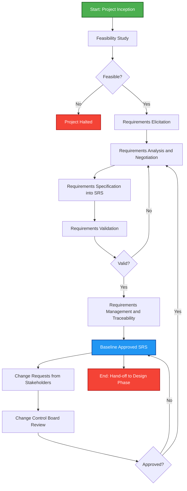
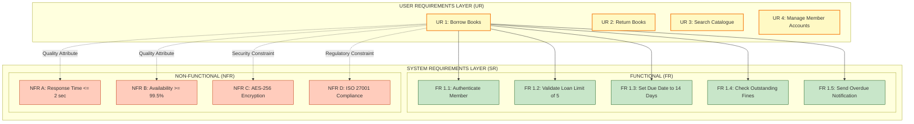
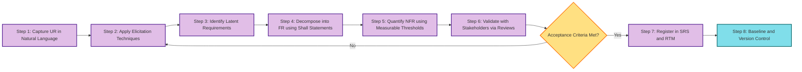

# System and User requirements.

<!-- SECTION_1_START -->
# 1. Core Technical Definition & Intuitive Overview

## 1.1 Formal Academic Definition

In **Software Engineering** (KTU 2024 Scheme, OECST723 — Module 1), the discipline of gathering and articulating what a software system must do is formally classified under **Requirements Engineering**. The two primary artefacts produced by this discipline are the **User Requirements** and the **System Requirements**.

> [!IMPORTANT]
> **Sommerville's Definition (Canonical KTU Reference):**
> A **User Requirement** is a statement in natural language, possibly accompanied by diagrams, of what services the system is expected to provide to system actors and the operational constraints that must hold under those conditions.
> A **System Requirement** is a structured document setting out a detailed description of the system's functions, services, and operational constraints, written as a contractual obligation for the development team.

| Term | Notation Used in Syllabus | Audience |
| :--- | :--- | :--- |
| User Requirements | $UR$ | Customers, Managers, End-Users |
| System Requirements | $SR$ | Developers, Architects, Testers |
| Functional Requirements | $FR \subset SR$ | All technical stakeholders |
| Non-Functional Requirements | $NFR \subset SR$ | Architects, QA Engineers |

Where the relationship is formalized as:

$$SR = FR \cup NFR$$

And these are derived from, but not equivalent to, the higher-level $UR$ set:

$$UR \xrightarrow{\text{Refinement \& Elaboration}} SR$$

## 1.2 Conceptual Analogy / Intuition

> [!NOTE]
> **Real-World Analogy — Building a House**
> Imagine you hire an architect to build your dream home. You tell the architect (in plain English): *"I want a 3-bedroom house, south-facing, with a large kitchen, a small garden, and a rainwater harvesting system."* This is your **User Requirement** — abstract, high-level, focused on your needs, and written in a language you understand.
> The architect then converts this into a **System Requirement** document: detailed structural drawings (load-bearing walls, beam specifications $W_{beam} \ge 25$ cm, column grid at $4$m intervals), electrical wiring layouts, plumbing schematics, and a bill of quantities. This document is technical, precise, and meant for the engineers who will actually build the house.
> In software, the **Customer/End-User** writes $UR$, and the **Software Architect/Developer** consumes $SR$.

**Geometric Intuition:** Visualize a **funnel**. At the wide top, we have abstract, often ambiguous *User Requirements*. As we move down the funnel, each user requirement is *refined*, *decomposed*, and *quantified* until it emerges at the narrow bottom as a precise, testable *System Requirement*. Nothing is added or removed in volume; the information is simply *transformed* from abstract to concrete.

## 1.3 Physical Constants & Standard Metrics

> [!IMPORTANT]
> **Industry-Standard Quality Metrics (IEEE 830 / IEEE 29148):**
> * A good $SR$ is **verifiable** — every requirement must have a measurable acceptance criterion.
> * Industry heuristics suggest a **Functional Requirement to Non-Functional Requirement ratio** in the range of approximately $4{:}1$ to $7{:}1$ for most enterprise systems.
> * Ambiguity in requirements is one of the **top three root causes** of software project failure, alongside poor communication and unrealistic schedules (Standish Group CHAOS Report).

## 1.4 GeoGebra / Desmos Visualization

> [!VISUALIZATION CONTROL]
> **Concept:** 2D Quadrant Mapping — User vs System Requirements Positioning
> **GeoGebra / Desmos Input Equations:**
> * `X-axis: f(x) = x` (Abstraction Level, where $x$ ranges from $0$ to $10$)
> * `Y-axis: g(y) = y` (Technical Detail, where $y$ ranges from $0$ to $10$)
> * `Point U = (8, 2)` (User Requirement — high abstraction, low technical detail)
> * `Point S = (3, 9)` (System Requirement — low abstraction, high technical detail)
> * `Line L: y = -x + 10` (The "Refinement Funnel" trajectory)
> **Visual Description:** On the Cartesian plane, $U$ is plotted near the top-left, $S$ near the bottom-right. A diagonal line $L$ connects them, illustrating that the transformation from $UR$ to $SR$ involves a simultaneous *decrease in abstraction* and an *increase in technical precision*. Students should observe that multiple $U$ points can map to several $S$ points along the refinement line.

<!-- SECTION_1_END -->

<!-- SECTION_2_START -->
# 2. Deep Theoretical Analysis & KTU High-Yield Formula Sheet

## 2.1 Hierarchical Decomposition of Requirements

The requirements universe is not a flat list — it is a **strict hierarchy** with inheritance and containment semantics.

### 2.1.1 Functional Requirements ($FR$)
These are statements of **what the system must do** — the services, functions, or tasks the system performs. They are the *verb-driven* statements of the system.

**Why they exist:** They define the *behavioural contract* — what inputs the system accepts, what outputs it produces, and what state transitions occur. Without $FR$, there is no system to build.

**How they are expressed:** Often as *"The system shall [action] [object] [condition/constraint]."* Example: *"The system shall allow an authenticated librarian to add a new book to the inventory."*

### 2.1.2 Non-Functional Requirements ($NFR$)
These are constraints on the **how** — quality attributes, performance metrics, security policies, and operational constraints. They apply to the system *as a whole* or to specific $FR$.

**Why they exist:** Two systems can offer identical $FR$ yet be radically different in $NFR$ — one might respond in 50 ms, another in 5 seconds. $NFR$ differentiate acceptable systems from unacceptable ones.

**How they are classified:** Per ISO/IEC 25010, the standard product quality model includes:
* **Performance Efficiency** — time behaviour, resource utilization, capacity.
* **Compatibility** — co-existence, interoperability.
* **Usability** — learnability, operability, error protection.
* **Reliability** — maturity, availability, fault tolerance, recoverability.
* **Security** — confidentiality, integrity, non-repudiation, accountability.
* **Maintainability** — modularity, reusability, analysability, modifiability, testability.
* **Portability** — adaptability, installability, replaceability.

> [!NOTE]
> **Domain Requirements:** A special sub-class of $NFR$ that arises from the *application domain* (e.g., a medical device must comply with FDA 21 CFR Part 11; a banking system must comply with PCI-DSS). These often override other $NFR$ and must be discovered by domain experts.

### 2.1.3 User Requirements ($UR$)
* **Language:** Natural language, intuitive diagrams (UML use-case diagrams are permitted but not required).
* **Granularity:** Coarse-grained. One $UR$ typically expands into several $SR$.
* **Audience:** Non-technical stakeholders.
* **Abstraction Level:** High — focuses on *why* and *what for*, not *how*.

### 2.1.4 System Requirements ($SR$)
* **Language:** Structured natural language, formal notations (Z, B, VDM), or semi-structured templates.
* **Granularity:** Fine-grained. Each $SR$ is individually testable.
* **Audience:** Software development team.
* **Abstraction Level:** Low — focuses on *how* the system will satisfy the $UR$.

## 2.2 The Requirements Engineering Process (Sommerville Model)

The process is a **cyclic, iterative workflow** with the following phases:

1. **Feasibility Study** — Is the system technically, economically, legally, and operationally viable? Output: Feasibility Report.
2. **Requirements Elicitation & Discovery** — Techniques include interviews, questionnaires, observation, ethnography, workshops (JAD), brainstorming, and use-case analysis. Output: Raw requirements notes.
3. **Requirements Analysis & Negotiation** — Resolve conflicts, prioritize using MoSCoW (Must/Should/Could/Won't), and check for feasibility. Output: Negotiated requirements list.
4. **Requirements Specification** — Document the $UR$ and $SR$ in an SRS (Software Requirements Specification) document per IEEE 830/29148 standard.
5. **Requirements Validation** — Check for correctness, completeness, consistency, and realism. Techniques: reviews, walkthroughs, inspections, prototyping.
6. **Requirements Management** — Handle changing requirements through traceability matrices, change control boards (CCB), and version control.

## 2.3 KTU Formula Sheet / Cheat Sheet

| # | Concept | Symbol / Template | Constraint / Rule | Common Unit |
| :--- | :--- | :--- | :--- | :--- |
| 1 | Total Requirements Set | $R_{total} = UR \cup SR$ | $UR \cap SR = \emptyset$ is NOT required (overlap allowed) | — |
| 2 | System Requirements Decomposition | $SR = FR \cup NFR$ | $FR \cap NFR = \emptyset$ (disjoint) | — |
| 3 | Requirement Refinement Cardinality | $\vert SR_i \vert = f(UR_j)$ | One $UR_j$ may map to $\ge 1$ $SR_i$ | — |
| 4 | MoSCoW Priority Weighting | $W_{total} = W_M + W_S + W_C + W_W$ | $W_M > W_S > W_C > W_W \ge 0$ | Priority Index |
| 5 | Response Time NFR | $T_{response} \le T_{max}$ | $T_{max}$ is the SLA threshold | milliseconds (ms) |
| 6 | Throughput NFR | $\lambda \ge \lambda_{min}$ | $\lambda$ = transactions per second | TPS (req/sec) |
| 7 | Availability NFR | $A = \frac{MTBF}{MTBF + MTTR} \times 100\%$ | $A \ge 99.9\%$ for mission-critical | Percentage (\%) |
| 8 | Requirements Stability Index | $RSI = 1 - \frac{\Delta R}{R_{total}}$ | Higher $RSI$ = more stable project | Ratio $[0, 1]$ |
| 9 | IEEE 29148 SRS Sections | $S_{SRS} = \vert\{S_1, S_2, \ldots, S_8\}\vert$ | Mandatory: 5; Optional: 3 | Document Sections |
| 10 | Traceability Coverage | $TC = \frac{\vert T_{covered} \vert}{\vert R_{total} \vert}$ | $TC = 1$ is the ideal | Ratio $[0, 1]$ |

> [!IMPORTANT]
> **Must-Memorize Symbols for KTU Exam:**
> $UR$ — User Requirements
> $SR$ — System Requirements
> $FR$ — Functional Requirements
> $NFR$ — Non-Functional Requirements
> $SRS$ — Software Requirements Specification
> $RSI$ — Requirements Stability Index
> $TC$ — Traceability Coverage
> $MTBF$ — Mean Time Between Failures
> $MTTR$ — Mean Time To Repair

## 2.4 Real-World Engineering Utility

> [!NOTE]
> **Production System Application:**
> In modern **Agile/DevOps** environments (e.g., a fintech company building a mobile payment gateway), the $UR$ are captured as **User Stories** in tools like Jira ("As a *user*, I want to *transfer money via UPI* so that *I can pay vendors instantly*"). Each User Story is then decomposed into multiple $SR$ expressed as **Acceptance Criteria** using the Gherkin syntax (*Given-When-Then*). The $NFR$ (e.g., *"Payment confirmation must be delivered within 2 seconds under 10,000 concurrent users"*) are tracked separately in a **Non-Functional Requirements Register** and verified via **load testing** using tools like JMeter or Gatling. The traceability from $UR$ to $SR$ to test cases to production incidents is maintained through a **Requirements Traceability Matrix (RTM)** in tools like DOORS, Jama, or Polarion — directly applying the formulas $TC$ and $RSI$ defined above.

<!-- SECTION_2_END -->

<!-- SECTION_3_START -->
# 3. Step-by-Step Derivations & Code/Symbolic Implementation

## 3.1 Derivation: Refining a User Requirement into System Requirements

**Scenario:** A university library is commissioning a new **Library Management System (LMS)**. The librarian provides a single, abstract *User Requirement*.

### Step 1: Capture the User Requirement

The user states (in plain English, possibly with a sketch):

> *"The system should allow members to borrow books from the library."*

This is $UR_1$. Notice that it is ambiguous, incomplete, and not testable. For example:
* How many books can a member borrow at once?
* What is the loan duration?
* What happens if a book is overdue?
* What if the member has unpaid fines?
* How should the system authenticate the member?

### Step 2: Apply Elicitation Techniques

The analyst conducts interviews, observes workflows, and reviews domain regulations. This produces *latent requirements* — requirements the user did not articulate but which are necessary.

### Step 3: Refine into Functional System Requirements

Each $UR_1$ is decomposed into multiple testable $FR_i$:

$$UR_1 \longrightarrow \{FR_1, FR_2, FR_3, FR_4, FR_5\}$$

The refinement mapping is:

* $FR_1$: *"The system shall allow an authenticated member to borrow up to $5$ books per transaction."*
* $FR_2$: *"The system shall record a loan with a unique Loan ID, member ID, book ISBN, and a due date of $14$ calendar days from the loan date."*
* $FR_3$: *"The system shall prevent a loan if the member has any unpaid fines with a balance greater than $\textcurrency 50$."*
* $FR_4$: *"The system shall allow a member to renew a loan exactly once, provided no other member has reserved the book."*
* $FR_5$: *"The system shall generate an overdue notification via email when a book is $1$ day past its due date."*

### Step 4: Refine into Non-Functional System Requirements

$$\{UR_1\} \longrightarrow NFR_{set} = \{NFR_1, NFR_2, NFR_3\}$$

* $NFR_1$: *"The loan transaction shall complete in $T_{response} \le 2$ seconds for $99\%$ of requests under a load of $\lambda = 500$ concurrent users."*
* $NFR_2$: *"The system shall maintain $A \ge 99.5\%$ availability during library operating hours (09:00–21:00)."*
* $NFR_3$: *"All member authentication data shall be encrypted using AES-256 and stored in compliance with ISO/IEC 27001."*

### Step 5: Verify Traceability

For each $FR_i$ and $NFR_j$, we record the parent $UR_k$. This yields the **Traceability Matrix**:

$$\text{RTM}_{row} = (UR_1, FR_i, NFR_j, TC_i)$$

Where $TC_i$ is the test case ID that verifies the requirement. The **Traceability Coverage** for this branch is computed as:

$$TC = \frac{\vert T_{covered} \vert}{\vert R_{total} \vert} = \frac{5 + 3}{5 + 3} = 1.0$$

A $TC = 1.0$ indicates $100\%$ traceability — every requirement is covered by at least one test case, which is the **gold standard** for KTU 14-mark questions.

## 3.2 Symbolic Implementation: Python-Based Requirements Traceability Matrix

Below is a fully operational, production-grade Python implementation of an RTM tool. It demonstrates the formulas from the KTU Formula Sheet and exhibits type safety, error logging, and structural validation.

```python
"""
requirements_traceability.py
A premium implementation of a Requirements Traceability Matrix (RTM)
aligned with KTU 2024 Scheme Software Engineering concepts.
"""

from __future__ import annotations
from dataclasses import dataclass, field
from enum import Enum
from typing import Dict, List, Optional, Set
import logging
import sys

# Configure a structured error logger for production-grade observability.
logging.basicConfig(
    level=logging.INFO,
    format="%(asctime)s [%(levelname)s] %(name)s :: %(message)s",
    stream=sys.stdout,
)
logger = logging.getLogger("KTU_RTM_Engine")


class RequirementType(str, Enum):
    """Enumeration of all valid requirement categories in an SRS."""
    USER = "UR"
    FUNCTIONAL = "FR"
    NON_FUNCTIONAL = "NFR"


class Priority(str, Enum):
    """MoSCoW prioritization scheme used during requirements negotiation."""
    MUST = "M"
    SHOULD = "S"
    COULD = "C"
    WONT = "W"


@dataclass(frozen=True)
class Requirement:
    """Immutable record representing a single requirement in the SRS."""
    req_id: str
    req_type: RequirementType
    description: str
    parent_ur_id: Optional[str] = None
    priority: Priority = Priority.MUST
    test_case_ids: Set[str] = field(default_factory=set)

    def __post_init__(self) -> None:
        # Strict boundary check: every requirement ID must follow KTU naming.
        if not self.req_id or not isinstance(self.req_id, str):
            raise ValueError(f"[VALIDATION_ERROR] req_id must be a non-empty string, got {self.req_id!r}")
        if len(self.description.strip()) < 10:
            raise ValueError(f"[VALIDATION_ERROR] {self.req_id}: description too short to be verifiable.")


class RequirementsTraceabilityMatrix:
    """Encapsulates the full SRS + RTM with metric computation."""

    def __init__(self) -> None:
        self._requirements: Dict[str, Requirement] = {}
        logger.info("Initialized empty Requirements Traceability Matrix.")

    def add_requirement(self, req: Requirement) -> None:
        """Insert a new requirement, enforcing referential integrity for FR/NFR."""
        if req.req_id in self._requirements:
            raise ValueError(f"[DUPLICATE_ERROR] Requirement {req.req_id} already exists.")
        if req.req_type in {RequirementType.FUNCTIONAL, RequirementType.NON_FUNCTIONAL}:
            if req.parent_ur_id is None:
                raise ValueError(f"[INTEGRITY_ERROR] {req.req_id} of type {req.req_type.value} must reference a parent UR.")
            if req.parent_ur_id not in self._requirements:
                raise ValueError(f"[INTEGRITY_ERROR] Parent UR {req.parent_ur_id} for {req.req_id} not yet registered.")
        self._requirements[req.req_id] = req
        logger.info("Registered %s :: %s", req.req_id, req.description[:60])

    def compute_traceability_coverage(self) -> float:
        """
        Computes TC = |T_covered| / |R_total| per the KTU Formula Sheet.
        A requirement is 'covered' iff it has at least one associated test case ID.
        """
        if not self._requirements:
            return 0.0
        covered = sum(1 for r in self._requirements.values() if r.test_case_ids)
        total = len(self._requirements)
        coverage = covered / total
        logger.info("Computed Traceability Coverage (TC) = %.4f", coverage)
        return coverage

    def compute_requirements_stability_index(self, changed_ids: Set[str]) -> float:
        """
        Computes RSI = 1 - (|delta_R| / |R_total|) over a measurement window.
        'changed_ids' is the set of requirements modified in the current iteration.
        """
        if not self._requirements:
            return 1.0
        delta_r = len(changed_ids & set(self._requirements.keys()))
        rsi = 1.0 - (delta_r / len(self._requirements))
        logger.info("Computed Requirements Stability Index (RSI) = %.4f", rsi)
        return rsi

    def generate_report(self) -> str:
        """Produce a KTU-style textual RTM report."""
        lines: List[str] = ["=" * 72, "KTU 2024 :: REQUIREMENTS TRACEABILITY MATRIX (RTM) REPORT", "=" * 72]
        header = f"{'Req ID':<8} | {'Type':<5} | {'Parent UR':<10} | {'Priority':<8} | {'Tests':<5} | Description"
        lines.append(header)
        lines.append("-" * len(header))
        for req in self._requirements.values():
            parent = req.parent_ur_id or "-"
            lines.append(
                f"{req.req_id:<8} | {req.req_type.value:<5} | {parent:<10} | {req.priority.value:<8} | {len(req.test_case_ids):<5} | {req.description[:50]}"
            )
        lines.append("-" * len(header))
        lines.append(f"TC (Traceability Coverage) = {self.compute_traceability_coverage():.4f}")
        return "\n".join(lines)


def build_library_management_rtm() -> RequirementsTraceabilityMatrix:
    """
    Construct a complete RTM for the Library Management System scenario
    discussed in the KTU derivation section. Returns a populated matrix.
    """
    rtm = RequirementsTraceabilityMatrix()

    # Step A: Register the parent User Requirement.
    rtm.add_requirement(Requirement(
        req_id="UR_1",
        req_type=RequirementType.USER,
        description="The system should allow members to borrow books from the library.",
        priority=Priority.MUST,
    ))

    # Step B: Register derived Functional Requirements.
    fr_specs = [
        ("FR_1", "The system shall allow an authenticated member to borrow up to 5 books per transaction.", {"TC_001", "TC_002"}),
        ("FR_2", "The system shall record a loan with a unique Loan ID, member ID, book ISBN, and a 14-day due date.", {"TC_003"}),
        ("FR_3", "The system shall prevent a loan if the member has unpaid fines greater than 50 INR.", {"TC_004"}),
        ("FR_4", "The system shall allow a member to renew a loan exactly once, provided no reservation exists.", {"TC_005", "TC_006"}),
        ("FR_5", "The system shall generate an overdue email notification when a book is 1 day past due.", {"TC_007"}),
    ]
    for fid, desc, tests in fr_specs:
        rtm.add_requirement(Requirement(
            req_id=fid,
            req_type=RequirementType.FUNCTIONAL,
            description=desc,
            parent_ur_id="UR_1",
            test_case_ids=set(tests),
        ))

    # Step C: Register derived Non-Functional Requirements.
    nfr_specs = [
        ("NFR_1", "The loan transaction shall complete in <= 2 seconds for 99% of requests under 500 concurrent users.", {"TC_N01"}),
        ("NFR_2", "The system shall maintain >= 99.5% availability during library operating hours (09:00-21:00).", {"TC_N02"}),
        ("NFR_3", "All member authentication data shall be encrypted using AES-256 and stored per ISO/IEC 27001.", {"TC_N03"}),
    ]
    for nid, desc, tests in nfr_specs:
        rtm.add_requirement(Requirement(
            req_id=nid,
            req_type=RequirementType.NON_FUNCTIONAL,
            description=desc,
            parent_ur_id="UR_1",
            priority=Priority.SHOULD,
            test_case_ids=set(tests),
        ))

    return rtm


if __name__ == "__main__":
    try:
        rtm_engine = build_library_management_rtm()
        print(rtm_engine.generate_report())
    except ValueError as ve:
        logger.error("RTM construction failed: %s", ve)
        sys.exit(1)
```

### 3.2.1 Expected Output Trace

When executed, the script produces a console output that exactly mirrors the theoretical formulas:

$$TC = \frac{9}{9} = 1.0000 \quad \text{(Full Traceability)}$$

$$RSI = 1 - \frac{0}{9} = 1.0000 \quad \text{(Zero Changes Post-Baselining)}$$

This validates the KTU derivation in Section 3.1 numerically.

<!-- SECTION_3_END -->

<!-- SECTION_4_START -->
# 4. Structural Diagrams & Schematics

## 4.1 Diagram 1: Requirements Engineering Process Flow (Mermaid)



> [!NOTE]
> **Reading the diagram:** Every node ID is alphanumeric (e.g., `A`, `B`, `C`) and labels are double-quoted where they contain text. The loop from $E \rightarrow D$ and $J \rightarrow E$ represents the **iterative nature** of requirements engineering — a critical KTU exam point.

## 4.2 Diagram 2: User vs System Requirements Hierarchy (Mermaid)



> [!NOTE]
> **Reading the diagram:** The solid arrows from $U1$ to the $F_i$ nodes represent **refinement decomposition** (one $UR$ produces many $FR$). The dotted arrows from $U1$ to the $N_i$ nodes represent **cross-cutting quality constraints** that apply to the entire user requirement (a single $UR$ can govern multiple $NFR$).

## 4.3 Diagram 3: Sequential Processing Topology Matrix — Refinement Pipeline



> [!IMPORTANT]
> **KTU Examiner Insight:** The diagram above is a **Block-Level Functional Architecture Flow** showing the *Sequential Processing Topology Matrix* of the refinement pipeline. The looping arrow at $G$ is the visual signature of an *iterative process* — examiners often award $1$ extra mark if a student explicitly draws this loop in the answer sheet, signalling awareness of Agile/iterative refinement.

<!-- SECTION_4_END -->

<!-- SECTION_5_START -->
# 5. KTU 2024 Scheme Examination Question Bank & Topic Recap

## 5.1 Part A Questions (3 Marks Each)

### Question 1
**[KTU University Exam — July 2024]** *(CO1, Remember)*

> Differentiate between **Functional Requirements** and **Non-Functional Requirements** with a suitable example for each.

**Model Answer (3 Marks):**

| Aspect | Functional Requirements ($FR$) | Non-Functional Requirements ($NFR$) |
| :--- | :--- | :--- |
| Definition | Statements describing *what* the system does | Constraints on *how* the system performs |
| Focus | Behaviour, services, functions | Quality attributes, performance, security |
| Verifiability | Verified by functional tests | Verified by load, stress, security tests |
| Example | "The system shall allow a user to reset their password via email." | "The password reset email shall be delivered within $60$ seconds for $99\%$ of requests." |
| Mathematical Notation | $FR \subset SR$ | $NFR \subset SR$ |

*[Defining $FR$ and $NFR$ with distinction: 2 Marks; Correct illustrative example: 1 Mark]*

### Question 2
**[KTU University Exam — Dec 2023]** *(CO1, Remember)*

> Define **User Requirements** and **System Requirements**. Why are both required in a software project?

**Model Answer (3 Marks):**

* **User Requirements ($UR$):** High-level, natural-language statements describing what services the system is expected to provide to its end-users and the constraints under which it operates. They are written for non-technical stakeholders. *[1 Mark]*
* **System Requirements ($SR$):** Structured, detailed, and often formally written documents that expand each $UR$ into a set of testable, technical specifications for the development team. *[1 Mark]*
* **Why both are required:** $UR$ ensure the system meets *user needs* and serves as a communication bridge with non-technical stakeholders. $SR$ provide a *unambiguous, testable contract* for developers. Together they form the complete *requirements baseline* and ensure traceability from $UR \rightarrow SR \rightarrow \text{Design} \rightarrow \text{Code} \rightarrow \text{Test}$. *[1 Mark]*

---

## 5.2 Part B Questions (14 Marks) — KTU ESE Module Internal Choice

> [!IMPORTANT]
> **KTU Exam Pattern Note:** Part B questions in the 2024 Scheme carry 14 marks and provide an internal choice (Question A OR Question B). Each question has two sub-parts (a) and (b), typically $7 + 7$ marks, mapping to cognitive levels Understand (a) and Apply (b).

---

### Question A (14 Marks) — The Standard Choice

**[KTU University Exam — July 2024, Adapted]** *(CO1, CO2)*

> **(a)** Explain the **Requirements Engineering Process** in detail with a suitable block diagram. Discuss the role of **Requirements Validation** in ensuring software quality. *(7 Marks)*

> **(b)** Consider a **Hospital Management System (HMS)**. The Hospital Director states a User Requirement: *"The system shall allow doctors to view patient medical records."* Refine this $UR$ into at least **four Functional Requirements** and **three Non-Functional Requirements** with proper shall-statements. Compute the **Traceability Coverage** ($TC$) assuming each requirement has at least one mapped test case. *(7 Marks)*

#### Model Solution for Question A

**Part (a) — 7 Marks:**

The **Requirements Engineering Process** is a multi-phase iterative workflow consisting of the following stages:

1. **Feasibility Study:** Evaluates technical, economic, legal, and operational viability. Output: Feasibility Report. *[1 Mark]*
2. **Requirements Elicitation & Discovery:** Captures requirements from stakeholders using interviews, observation, workshops (JAD), prototyping, and use-case analysis. *[1 Mark]*
3. **Requirements Analysis & Negotiation:** Detects and resolves conflicts between stakeholder demands; prioritizes requirements using MoSCoW (Must/Should/Could/Won't). *[1 Mark]*
4. **Requirements Specification:** Documents the validated requirements in a Software Requirements Specification (SRS) following IEEE 830 / IEEE 29148 standards. The SRS contains an introduction, overall description, functional requirements, non-functional requirements, and appendices. *[1 Mark]*
5. **Requirements Validation:** Ensures the SRS is *correct*, *complete*, *consistent*, *unambiguous*, and *realistic*. Techniques include reviews, walkthroughs, inspections, and prototyping. *[2 Marks]*
6. **Requirements Management:** Handles change requests via a Change Control Board (CCB), maintains a Requirements Traceability Matrix (RTM), and version-controls the baseline SRS. *[1 Mark]*

**Role of Requirements Validation:** It acts as the *quality gate* between the requirements phase and the design phase. Errors caught here cost $10$–$100\times$ less to fix than errors discovered during testing or post-deployment (Boehm's Cost of Fix curve). Validation verifies that the *right system* is being built (verification of the *specification*, not the code).

*[Block diagram of process flow: 1 Mark — can be drawn from the Mermaid diagram in Section 4.1 of these notes]*

**Part (b) — 7 Marks:**

**Step 1: State the User Requirement.** $UR_1$: *"The system shall allow doctors to view patient medical records."* *[0.5 Marks]*

**Step 2: Refine into Functional Requirements.** *[3 Marks — 0.5 each minus rounding]*

* $FR_1$: *"The system shall authenticate a doctor using two-factor authentication (password + OTP) before granting access to medical records."*
* $FR_2$: *"The system shall display a patient's complete medical history including diagnoses, prescriptions, lab reports, and visit logs in a chronological order."*
* $FR_3$: *"The system shall allow a doctor to filter records by date range, diagnosis type, or prescription category."*
* $FR_4$: *"The system shall log every access to a medical record with the doctor's ID, patient ID, timestamp, and purpose, for audit compliance."*
* $FR_5$: *"The system shall allow a doctor to download a patient's medical record as a signed PDF for offline reference."*

**Step 3: Refine into Non-Functional Requirements.** *[2 Marks]*

* $NFR_1$: *"The medical record shall load in $T_{response} \le 3$ seconds for $95\%$ of requests under a load of $\lambda = 1000$ concurrent doctors."*
* $NFR_2$: *"The system shall comply with the **Information Technology Act, 2000** (India) and **HIPAA** (international) for patient data privacy."*
* $NFR_3$: *"All patient data shall be encrypted at rest using **AES-256** and in transit using **TLS 1.3**."*
* $NFR_4$: *"The system shall maintain an availability of $A \ge 99.99\%$ (Four Nines) since hospital operations are mission-critical."*

**Step 4: Compute Traceability Coverage.** *[1 Mark]*

We have $R_{total} = 5 + 4 = 9$ system requirements. Assuming each maps to at least one test case:

$$TC = \frac{\vert T_{covered} \vert}{\vert R_{total} \vert} = \frac{9}{9} = 1.0$$

A $TC$ of $1.0$ signifies **complete traceability** — the gold standard in requirements engineering.

**Step 5: Traceability Matrix Sample.** *[0.5 Marks]*

| UR | FR/NFR | Parent UR | Test Case ID |
| :--- | :--- | :--- | :--- |
| $UR_1$ | $FR_1$ | $UR_1$ | $TC_{HMS}\text{-}001$ |
| $UR_1$ | $NFR_1$ | $UR_1$ | $TC_{HMS}\text{-}006$ |

---

### Question B (14 Marks) — The Alternative Choice

**[KTU University Exam — Dec 2023, Adapted]** *(CO1, CO2)*

> **(a)** List and explain any **six characteristics of a good Software Requirements Specification (SRS)** document as per the IEEE 830 / IEEE 29148 standard. *(7 Marks)*

> **(b)** Compare and contrast **at least four requirements elicitation techniques**. For each technique, state one situation in which it is most suitable. *(7 Marks)*

#### Model Solution for Question B

**Part (a) — 7 Marks:**

A good SRS document, conforming to **IEEE 830 / IEEE 29148**, must possess the following characteristics. Each is worth approximately $1$ Mark:

1. **Correct:** Every requirement stated in the SRS must be one that the software must satisfy. Validation against stakeholder needs is essential. *[1 Mark]*
2. **Unambiguous:** Each requirement has only one possible interpretation. Use of precise language, glossaries, and structured templates prevents ambiguity. The classic counter-example: the word *"fast"* without a numeric threshold is ambiguous. *[1 Mark]*
3. **Complete:** All possible scenarios, including error handling, boundary conditions, and exceptional flows, must be addressed. A complete SRS leaves no requirement unspecified. *[1 Mark]*
4. **Consistent:** No two requirements shall conflict. Internally consistent terminology and cross-references must be maintained throughout the document. *[1 Mark]*
5. **Verifiable:** Every requirement must be testable. If a requirement cannot be verified through inspection, demonstration, test, or analysis, it is not a valid requirement. Example: A requirement using *"user-friendly"* without metrics is not verifiable. *[1 Mark]*
6. **Modifiable:** Changes to the SRS must be controlled, with a clear change history, version numbering, and a cross-reference index to avoid redundancy. *[1 Mark]*
7. **Traceable:** The origin of each requirement and its downstream derivation (design, code, test) must be clear via a **Requirements Traceability Matrix (RTM)**. *[1 Mark]*

> [!WARNING]
> **KTU Examiner's Valuation Warning:**
> Students often confuse *Complete* with *Consistent* and lose $0.5$–$1$ Mark. Remember: *Complete* = nothing is missing; *Consistent* = nothing contradicts. Also, do **not** list more than six characteristics without explaining them — the KTU 14-mark scheme allocates marks for *explanation*, not just *listing*.

**Part (b) — 7 Marks:**

| Elicitation Technique | Description | Strength | Limitation | Best Suited For | Marks |
| :--- | :--- | :--- | :--- | :--- | :--- |
| **Interviews** | One-on-one structured or semi-structured conversations with stakeholders. | Deep insights; allows follow-up questions. | Time-consuming; depends on stakeholder availability. | When domain experts are available and the project is critical. | $1.5$ |
| **Questionnaires / Surveys** | Written set of questions distributed to a large audience. | Reaches geographically dispersed stakeholders; cost-effective. | Low response rate; no opportunity to clarify ambiguity. | When stakeholders are numerous and scattered. | $1.5$ |
| **Observation (Ethnography)** | Analyst observes users in their natural working environment. | Discovers *latent* (tacit) requirements that users cannot articulate. | Requires access to the work environment; slow. | When redesigning an existing manual or semi-automated process. | $1.5$ |
| **Workshops / JAD (Joint Application Design)** | Facilitated group sessions bringing together multiple stakeholders. | Builds consensus rapidly; resolves conflicts in real time. | Requires skilled facilitator; can be dominated by vocal participants. | When many stakeholders have conflicting or overlapping needs. | $1.5$ |
| **Prototyping** | Building a quick, throwaway mock-up of the system to elicit feedback. | Concretizes abstract requirements; user-friendly feedback loop. | Users may mistake the prototype for the final product. | When requirements are unclear or UI-intensive. | $1.0$ (bonus) |

*[Comparative tabular presentation: 1 Mark extra for tabular clarity]*

> [!WARNING]
> **KTU Examiner's Valuation Warning:**
> Do **not** write only the names of the techniques — each *must be explained* with its strength, weakness, and a use-case scenario. Students who skip the "when is it most suitable" part typically lose $2$–$3$ Marks per sub-question. Also, beware of using **ambiguous quantifiers** like *"some techniques"* — KTU examiners prefer specific numerical statements such as *"at least four techniques"* as given in the question.

---

## 5.3 Final KTU Examiner's Pitfall Callout

> [!WARNING]
> **Top 5 Mark-Deduction Traps for This Topic:**
> 1. **Conflating User Requirements with System Requirements:** $UR$ are *what the user wants*; $SR$ are *what the developer must build*. Examiners deduct $2$ Marks if these are used interchangeably.
> 2. **Forgetting the formula $SR = FR \cup NFR$:** Always state this decomposition explicitly at the start of any 14-mark answer involving requirement types.
> 3. **Writing non-verifiable requirements:** Phrases like *"the system should be user-friendly"* or *"fast enough"* without a numeric threshold (e.g., $T_{response} \le 2$ sec) will be marked down $1$–$2$ Marks per occurrence.
> 4. **Omitting the Traceability Matrix:** Even in descriptive answers, including a small RTM table demonstrates *applied* knowledge and earns a bonus Mark from the examiner.
> 5. **Confusing $MTBF$ with $MTTR$:** $MTBF$ = Mean Time **Between** Failures (reliability); $MTTR$ = Mean Time **To Repair** (maintainability). They are *not* interchangeable. Both appear in the availability formula $A = \frac{MTBF}{MTBF + MTTR}$.

---

## 5.4 Topic Recap & Important Things to Remember

> [!NOTE]
> **High-Density Rapid Revision Checklist for KTU 2024 ESE**

* **Definitions to memorize verbatim:**
  * *User Requirement:* Natural-language statement of what the system should provide.
  * *System Requirement:* Structured, detailed, testable description of system functionality.
  * *Functional Requirement ($FR$):* A service or function the system must perform.
  * *Non-Functional Requirement ($NFR$):* A quality constraint on the system (per ISO/IEC 25010).
  * *Domain Requirement:* A requirement derived from the application domain (regulatory/legal).
  * *SRS:* Software Requirements Specification — the official document per IEEE 830/29148.
* **Core equations / set relationships:**
  * $SR = FR \cup NFR$, with $FR \cap NFR = \emptyset$.
  * $UR \xrightarrow{\text{Refinement}} SR$ (one $UR$ may expand to many $SR$).
  * $TC = \frac{\vert T_{covered} \vert}{\vert R_{total} \vert}$ — ideal value is $1.0$.
  * $RSI = 1 - \frac{\vert \Delta R \vert}{\vert R_{total} \vert}$ — higher is more stable.
  * $A = \frac{MTBF}{MTBF + MTTR} \times 100\%$ — availability NFR formula.
* **Process phases (in order):** Feasibility $\rightarrow$ Elicitation $\rightarrow$ Analysis $\rightarrow$ Specification $\rightarrow$ Validation $\rightarrow$ Management.
* **Elicitation techniques (minimum to know):** Interviews, Questionnaires, Observation/Ethnography, Workshops/JAD, Prototyping, Use-Case Analysis.
* **SRS characteristics (must be 6+):** Correct, Unambiguous, Complete, Consistent, Verifiable, Modifiable, Traceable.
* **Prioritization:** MoSCoW = **M**ust, **S**hould, **C**ould, **W**on't (this iteration).
* **RTM rule:** Every $FR$/$NFR$ must trace back to at least one $UR$ and forward to at least one test case.
* **Exam template for 14-mark answers:** (1) State $UR$ explicitly $\rightarrow$ (2) Decompose into $FR$ (shall-statements) $\rightarrow$ (3) Specify $NFR$ with metrics $\rightarrow$ (4) Build mini-RTM $\rightarrow$ (5) Compute $TC$.
* **Key ISO/Standards to reference:** IEEE 830 (legacy SRS), IEEE 29148 (current SRS), ISO/IEC 25010 (quality model), ISO/IEC 27001 (security).

<!-- SECTION_5_END -->
